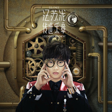

传世乐章Legendary Movement
============================

|  |  |
| :--: | :-- |
| [ 传世乐章Legendary Movement](https://emumo.xiami.com/album/1101363421) | **艺人**: [汪苏泷](../index.md) **语种**: 国语 **唱片公司**: 大象音乐 **发行时间**: 2014年06月25日 **专辑类别**: 录音室专辑 **专辑风格**: 节奏布鲁斯 R&B, 国语流行 Mandarin Pop, 华语唱作人 Chinese Singer-Songwriter **播放数**: 1668384 **收藏数**: 1273 **评论数**: 1780  |

## 简介

成为光  
才能被看见  
不灭的信念  
只为被亿万光年之外的你发现  
—— 音乐新世代 开始耀眼发光  
  
汪苏泷 2014 全新唱作专辑 【传世乐章】  
让我们成为彼此最值得纪念的光和热！  
  
所有发生的事都会留下痕迹，没有人会白费力气。可以说，地球上的每个人都是各自小宇宙的中心，二十一世纪有多少人，就应该有多少真实的历史。而汪苏泷的音乐新纪元，就从2014全新唱作专辑《传世乐章》开始。他用音乐写下属于自己的历史，记录下自己的现在和未来，寻找到自己心中的音乐圣殿。  
  
新创作先锋 将音乐革命到底  
  
如今，汪苏泷已成为人气爆棚的新世代全能创作音乐人，从小学习的古典音乐的他，词曲创作全都一手包办。扎实的音乐实力，让他的创作耐听、不易流于俗套。现在新人的音乐创作何其多，汪苏泷既有厚实的音乐底子，又能做到不局限于单一风格，勇于尝试各式曲风，将时下最流行的音乐元素融入其创作。除了充满爆发力，更多了与众不同的刚柔并济；除了好听，更多了有力道的帅气。这种才华在音乐世界开始渲染，再也无人能挡其魅力，成为九零世代的音乐发光体。  
  
汪苏泷最全心全意的华丽进化  
  
对自己的全新作品，汪苏泷也有独到的解读方式：“我的全新创作专辑《传世乐章》，希望能够从一种新的方式看自身、看地球、看整个宇宙。因为音乐可以让人领悟到各种梦想都可以成真。音乐也可以写下历史，创造出独一无二的世界。”   
为此，汪苏泷为这张专辑付出了超乎寻常的心血。内地、台湾、新加坡和韩国四地联合组成的超强制作团队，也成就了音乐品质背后的坚实保障。整张专辑单从构思上，就花去了六个月的时间，才最终确定以古典音乐为线索，摇滚、R&amp;B、抒情、电子等多种元素互相融合的方式来呈现。为了凸显《传世乐章》这个恢弘大气的主题，汪苏泷也磨练了整整一年。这不仅仅表现在他愈加优化的演唱方式上，还体现在整张专辑丰富的曲风上。  
  
从黑暗无边然后像道光芒降临 从此音乐盛世多了一道光  
  
每一个听到《传世乐章》这张专辑的人，都可以感受到，这是汪苏泷全心全意的诚意之作。将近两年的潜心打造，将近一年的闭关修炼，让汪苏泷聚集了足够强大的灵感和能量。在因为种种原因不能发歌的那段时间里，也让汪苏泷琢磨出了更能表现自己天赋声线的演唱技巧，在音色和演唱功底方面都更上了一个台阶。  
不仅如此，汪苏泷在这张专辑里还首次创作了多种以前未曾涉猎过的曲风：从震撼的摇滚诗篇《传世乐章》，到交响中国风《站台》；从疗伤情歌《晴》、到招牌风格《黑眼圈》；从中韩对唱《吵架歌》，到突破想象空间的复古Disco《得奖的是》……汪苏泷用无比丰富，又无比灿烂的音乐语言，证明了自己发光发亮的音乐才华，凸显了其扎实的音乐驾驭能力，为乐坛照亮了新希望。  
这张唱片由新锐制作人胡皓担纲制作，“光合声动”音乐团队倾力打造。专辑里的所有乐器都是真实录制，为此制作团队邀请到了台湾鼓王陈志昆，内地鼓大师贝贝和王澜，吉他大师江建民等担任乐手。同时，更是力邀到了国际首席爱乐乐团担纲所有的交响弦乐录制，在华语乐坛可谓是多年难遇的超豪华阵容。此举不仅彰显了唱片公司和汪苏泷对整张专辑绝不妥协的用心程度，幕后团队的强大，制作水准的精良，更让专辑的主题变得更加极致和宏大。  
而整张专辑的前奏、间奏和尾奏，则分别采用了音乐巨匠贝多芬的钢琴协奏曲《月光》的片段，完整呈现了这张概念专辑的音乐线索，亦暗含了汪苏泷希望藉此向大师致敬，并寻找到自己心中音乐圣殿的态度。  
  
高规格拍摄专辑视觉 重磅打造超豪华造型  
  
汪苏泷2014年全新唱作专辑《传世乐章》，由周杰伦御用摄影师邵廷奎操刀封面拍摄，服装造型方面邀请到萧亚轩的御用造型师小小，联袂打造超豪华视觉大片。多方面充分发掘汪苏泷的内心，以科技感、未来感十足的服装配饰，营造出奇幻王子探险音乐世界的意象。比尔贾、黄中平等台湾一线MV导演重金打造四支主打MV，也令这张专辑的平面和动态视觉，完美呈现出了汪苏泷作为音乐新世代，破晓而出的质感和锐气。  
鬼才导演比尔贾当初听到传世乐章就先设定了在太空漂浮的场景，汪苏泷像个新星缓缓觉醒，最后为地球的我们带来全新音乐型态。既然设定在外层空间，免不了得吊威亚，为了让恐高的汪苏泷不受到影响，导演也采取渐进式的方式，先让汪苏泷只有一只脚悬空，等到他可以不担心摔倒专心在对嘴时，才真正使用威牙，吊高到离地二个人高度，而首次吊威亚的他因没经验让他腰部跟腹股沟疼痛不已，他说：“完全不会害怕，因为现场都有安全措施，不过因为从未吊过威牙，所以身上完全没有防护措施，吊在上面腰跟腹股沟后来都好痛”。他自己还自娱：为了这张专辑，他可是赌上了“下半身”的幸福！  
另外两首《晴》、《吵架歌》，由黄中平导演策划拍摄。《晴》特别找了台湾幽静的深山咖啡厅拍摄，整支mv的情境让汪苏泷独角诠释。《晴》单纯而沉静的编曲，让人在听完歌曲后，想安静完全回到一个人的状态，导演就特别把内在安静却强力的情感，在画面上完全的展现。原本拍摄前一天，正逢梅雨季节，工作人员还担心天气会影响拍摄的进度，等到导演正式拍摄，结果就来个大晴天，老天爷给了与这首歌同名的好天气。有趣的事，导演原先配合天气设计几场大雨的戏，却因为老天爷给了大晴天，就只好借助洒水车来呈现“雨过天晴”的气氛。  
《吵架歌》是男女对唱的小情歌。这次请来韩国女歌Hari一起合唱，虽然歌名为《吵架歌》，汪苏泷却觉得情侣间有时斗斗嘴反而是可以强加对彼此个性的认识、增加生活的小甜蜜。因此黄中平导演特别包下一座摄影棚，打造2个人的甜蜜空间，用“荧光感”的气氛，把当下年轻人的恋爱生活，活泼且逗趣的表情出来。  
  
曲目：  
1. Introduction   
月光奏鸣曲 第一乐章 Op.27,No2   
当夜色降临，神秘国度被迷雾笼罩，月光下的荒漠精灵出没，汪苏泷的音乐奇幻旅程，现在出发！  
  
2. 传世乐章：   
成为光，才能被看见。今天起我有了属于我的光——传世乐章。  
早在2年前，便有了这首歌的概念。汪苏泷希望藉由古典音乐的概念，向心中的大师致敬，发现心中的音乐奇想世界。这首歌从词到曲都经过反复的修改和打磨，既有古典华丽的王子气质，又有盗梦空间的未来元素，在结尾处加入的汪苏泷RAP词作，更是充满爆发力。  
整首歌在弦乐群尖锐诡异的泛音，与钢琴不规则的乐句下拉开序幕。金属色彩的电吉他开始铺陈，在副歌处到达顶点。咆哮般的歌声伴随步话机里的应答，构成了黑色且工业的质感。一直伴随人声的愤怒低吼则是歌手内心深处猛兽的倒影。全曲激荡出了汪苏泷寻找音乐圣殿，璀璨绽放的态度宣言。  
  
3. 黑眼圈  
天亮之后的黑眼圈，是我们深爱的印记。  
  
4. 得奖的是  
色彩斑斓的浮华派对下，镁光灯折射出的小小梦想。  
  
5. 晴  
从第一滴雨落下，到窗外天空放晴。这个漫长的雨季，够不够用来忘记你？汪苏泷的招牌“泷”式情歌，记录干净纯粹的少年心事，唱出云淡风轻的恋恋情怀。汪苏泷认为，爱情跟天气一样，都是极易影响人情绪的，这首歌描述的就是恋人分手之后看似雨过天晴风轻云淡，实际内心放不下的纠结和矛盾。这首2014年华语乐坛独一无二的“疗伤”之作：预示着汪苏泷雨过天晴从“心”出发。  
  
6. 黑色蝴蝶  
如同钢琴没有一丝犹疑地切入合奏的弦乐，如同月光破开乌云洒满宁静的海面，如同被一首歌准确地击中灵魂，在你的身影里找到爱情，那是生命中最美的一道光。  
  
7. Development   
月光奏鸣曲 第三乐章 Op.27,No2  
就像没人能看到月的阴暗面，我也看不到你心中的谜底，但我绝不会放弃，这场冒险的旅途。  
  
8. 缺点  
我就是喜欢这样的你，相信着我为你所做的一切，相信着，在感情里每儍一次，我们就多聪明一点。  
  
9. 吵架歌  
时间里的喜怒哀乐，是彼此心灵成长的必经之路。  
汪苏泷跨国对唱，邀请到“萌动”亚洲的小情歌《KIYOMI（可爱颂）》的原唱韩国歌手Hari合作。汪苏泷也在MV变回“宅男”本色，演绎出了轻松逗趣、活泼可爱的小恋曲。  
  
10. 站台  
与时下千篇一律的中国风不同，这首歌邀请到孙燕姿的御用编曲，新加坡金牌编曲人Terence Teo操刀，打造出堪称近年来乐坛罕见的“年代风”。将人带回到上个世纪30年代的剧情：时光如水，音乐如画，乱世离别，恋人纷飞。大弦乐团，笛与箫，还有二胡交织在一起，如泣如诉，爱是时代的奢侈品，相隔人山人海，只有这个站台曾见证我的泪光，和你的裙摆。  
  
11. 谜底  
还有一句没说出口的抱歉，就是要帮你完成所有心愿。  
  
10. 雾都孤儿  
当白天也变为黑色，当诗人们纷纷沉默，不要相信用画笔描绘的虚假美丽，我会用音乐找回真正的光明。而和声里的童声合唱，更是将这种内心的呐喊，和对光明的渴望表达得淋漓尽致。  
  
11. Coda   
月光奏鸣曲 第三乐章 Op.27,No2   
音乐让灵魂发光，光明才能看见希望，这是一场天赋才华，和心血磨砺写就的冒险，音乐世界从此有一颗新星照亮。

## 曲目

## 评论

|  |  |  |
| :-- | :-- | :-- |
|  [虾米用户](https://emumo.xiami.com/u/377740840) 你好，我叫Araceli... 2019-04-05 02:45 赞(0) 踩(0) | 
他是我最喜欢的歌手，他很棒，我喜欢
 |
|  [虾米用户](https://emumo.xiami.com/u/309218202)  2019-02-20 22:31 赞(2) 踩(0) | 
吹爆站台
 |
|  [虾米用户](https://emumo.xiami.com/u/295934316)  2018-10-06 20:38 赞(1) 踩(0) | 
prrfect
 |
|  [虾米用户](https://emumo.xiami.com/u/333545690) 我还没想好要写什么... 2018-02-17 10:35 赞(0) 踩(0) | 
我要買
 |
|  [虾米用户](https://emumo.xiami.com/u/42968520) 暂无签名~ 2017-10-30 09:50 赞(0) 踩(0) | 
汪苏泷2014全新唱作专辑《传世乐章》。他用音乐写下属于自己的历史，记录下自己的现在和未来，寻找到自己心中的音乐圣殿
 |
|  [虾米用户](https://emumo.xiami.com/u/43134065)  2017-10-30 09:50 赞(0) 踩(0) | 
所有发生的事都会留下痕迹，没有人会白费力气。可以说，地球上的每个人都是各自小宇宙的中心，二十一世纪有多少人，就应该有多少真实的历史。而汪苏泷的音乐新纪元，就从2014全新唱作专辑《传世乐章》开始。他用音乐写下属于自己的历史，记录下自己的现在和未来，寻找到自己心中的音乐圣殿。
 |
|  [虾米用户](https://emumo.xiami.com/u/43134065)  2017-10-30 09:50 赞(0) 踩(0) | 
所有发生的事都会留下痕迹，没有人会白费力气。可以说，地球上的每个人都是各自小宇宙的中心，二十一世纪有多少人，就应该有多少真实的历史。而汪苏泷的音乐新纪元，就从2014全新唱作专辑《传世乐章》开始。他用音乐写下属于自己的历史，记录下自己的现在和未来，寻找到自己心中的音乐圣殿。 
 |
|  [虾米用户](https://emumo.xiami.com/u/50663241) 汪苏泷你别跑，我追不上你... 2017-10-30 09:50 赞(0) 踩(0) | 
论以专辑的后期制作，文案中诺列的豪华阵容就不再重复，他们的出现保证了专辑的品质性，提高了汪苏泷音乐的整体水准，不至于用脱胎换骨来形容却也带出了新的气象，新的风貌，新的惊喜。
 |
|  [虾米用户](https://emumo.xiami.com/u/50663241) 汪苏泷你别跑，我追不上你... 2017-10-30 09:50 赞(2) 踩(0) | 
专辑当中的以抒情作品讨论来诠释的《晴》，或多或少会让很多人都听见了，那一位昔日感动过自己的汪苏泷，更可以说是“泷”式情歌的最新样本。在歌曲里面，除了有汪苏泷标志式的深情演绎外，歌词所刻画的雨过天晴云淡风轻的天气与分手后淡淡的忧伤色彩的比对，更为真实地记录着很多年轻人分手后难以走出困境的心情，也绝对称得上是近期最为动人的一首疗伤歌曲。
 |
|  [虾米用户](https://emumo.xiami.com/u/50716274)  2017-10-30 09:50 赞(0) 踩(0) | 
所有发生的事都会留下痕迹，没有人会白费力气。可以说，地球上的每个人都是各自小宇宙的中心，二十一世纪有多少人，就应该有多少真实的历史。而汪苏泷的音乐新纪元，就从2014全新唱作专辑《传世乐章》开始。他用音乐写下属于自己的历史，记录下自己的现在和未来，寻找到自己心中的音乐圣殿
 |
|  [虾米用户](https://emumo.xiami.com/u/50715857)  2017-10-30 09:50 赞(2) 踩(0) | 
所有发生的事都会留下痕迹，没有人会白费力气。可以说，地球上的每个人都是各自小宇宙的中心，二十一世纪有多少人，就应该有多少真实的历史。而汪苏泷的音乐新纪元，就从2014全新唱作专辑《传世乐章》开始。他用音乐写下属于自己的历史，记录下自己的现在和未来，寻找到自己心中的音乐圣殿。～
 |
|  [虾米用户](https://emumo.xiami.com/u/50716274)  2017-10-30 09:50 赞(0) 踩(0) | 
所有发生的事都会留下痕迹，没有人会白费力气。可以说，地球上的每个人都是各自小宇宙的中心，二十一世纪有多少人，就应该有多少真实的历史。而汪苏泷的音乐新纪元，就从2014全新唱作专辑《传世乐章》开始。他用音乐写下属于自己的历史，记录下自己的现在和未来，寻找到自己心中的音乐圣殿。
 |
|  [虾米用户](https://emumo.xiami.com/u/50715857)  2017-10-30 09:50 赞(0) 踩(0) | 
所有发生的事都会留下痕迹，没有人会白费力气。可以说，地球上的每个人都是各自小宇宙的中心，二十一世纪有多少人，就应该有多少真实的历史。而汪苏泷的音乐新纪元，就从2014全新唱作专辑《传世乐章》开始。他用音乐写下属于自己的历史，记录下自己的现在和未来，寻找到自己心中的音乐圣殿。！
 |
|  [虾米用户](https://emumo.xiami.com/u/50671783) 我只是喜欢汪苏泷的千万包... 2017-10-30 09:50 赞(0) 踩(0) | 
所有发生的事都会留下痕迹，没有人会白费力气。可以说，地球上的每个人都是各自小宇宙的中心，二十一世纪有多少人，就应该有多少真实的历史。而汪苏泷的音乐新纪元，就从2014全新唱作专辑《传世乐章》开始。他用音乐写下属于自己的历史，记录下自己的现在和未来，寻找到自己心中的音乐圣殿。 
 |
|  [虾米用户](https://emumo.xiami.com/u/50671675)  2017-10-30 09:50 赞(0) 踩(0) | 
专辑当中的以抒情作品讨论来诠释的《晴》，或多或少会让很多人都听见了，那一位昔日感动过自己的汪苏泷，更可以说是“泷”式情歌的最新样本。在歌曲里面，除了有汪苏泷标志式的深情演绎外，歌词所刻画的雨过天晴云淡风轻的天气与分手后淡淡的忧伤色彩的比对，更为真实地记录着很多年轻人分手后难以走出困境的心情，也绝对称得上是近期最为动人的一首疗伤歌曲。
 |
|  [虾米用户](https://emumo.xiami.com/u/50663241) 汪苏泷你别跑，我追不上你... 2017-10-30 09:50 赞(0) 踩(0) | 
例如，专辑当中的以抒情作品讨论来诠释的《晴》，或多或少会让很多人都听见了，那一位昔日感动过自己的汪苏泷，更可以说是「泷」式情歌的最新样本。在歌曲里面，除了有汪苏泷标志式的深情演绎外，歌词所刻画的雨过天晴云淡风轻的天气与分手后淡淡的忧伤色彩的比对，更为真实地记录着很多年轻人分手后难以走出困境的心情，也绝对称得上是近期最为动人的一首疗伤歌曲。
 |
|  [虾米用户](https://emumo.xiami.com/u/50663241) 汪苏泷你别跑，我追不上你... 2017-10-30 09:50 赞(0) 踩(0) | 
这也是一直以来，汪苏泷致力透过音乐，与所有人去分享的一个关键词，在流行音乐越来越呈年轻化的现状里，汪苏泷身上除了体现出属于他作为年轻一辈唱作人的鲜活个性外，还有的是他透析在作品当中的诚意与动人的情怀。
 |
|  [虾米用户](https://emumo.xiami.com/u/43113412) 苏音唯美爱泷不悔 2017-10-30 09:50 赞(0) 踩(0) | 
[cp]你只看到汪苏泷的闪耀，却没看到汪苏泷的努力。你有你的评价，我有我的爱法。你嘲笑我汪苏泷不够红，不该去爱，我可怜你总随大流，你可以轻视汪苏泷的默默，我们会证明这是谁的时代。爱泷是注定漫长的道路，路上总少不了惋惜和失望。我是小泷包，我为汪苏泷代言！[/c
 |
|  [虾米用户](https://emumo.xiami.com/u/43113412) 苏音唯美爱泷不悔 2017-10-30 09:50 赞(0) 踩(0) | 
[cp]你只看到汪苏泷的闪耀，却没看到汪苏泷的努力。你有你的评价，我有我的爱法。你嘲笑我汪苏泷不够红，不该去爱，我可怜你总随大流，你可以轻视汪苏泷的默默，我们会证明这是谁的时代。爱泷是注定漫长的道路，路上总少不了惋惜和失望。我是小泷包，我为汪苏泷代言！[/
 |
|  [虾米用户](https://emumo.xiami.com/u/43113412) 苏音唯美爱泷不悔 2017-10-30 09:50 赞(0) 踩(0) | 
[cp]你只看到汪苏泷的闪耀，却没看到汪苏泷的努力。你有你的评价，我有我的爱法。你嘲笑我汪苏泷不够红，不该去爱，我可怜你总随大流，你可以轻视汪苏泷的默默，我们会证明这是谁的时代。爱泷是注定漫长的道路，路上总少不了惋惜和失望。我是小泷包，我为汪苏泷代言！[/cp]！
 |
|  [虾米用户](https://emumo.xiami.com/u/43227030) 代替你陪着我的是年轮 2017-10-27 23:53 赞(0) 踩(0) | 
时间里的喜怒哀乐，是彼此心灵成长的必经之路。 汪苏泷跨国对唱，邀请到“萌动”亚洲的小情歌《KIYOMI（可爱颂）》的原唱韩国歌手Hari合作。汪苏泷也在MV变回“宅男”本色，演绎出了轻松逗趣、活泼可爱的小恋曲。
 |
|  [虾米用户](https://emumo.xiami.com/u/50716274)  2017-10-27 23:53 赞(0) 踩(0) | 
每一个听到《传世乐章》这张专辑的人，都可以感受到，这是汪苏泷全心全意的诚意之作。将近两年的潜心打造，将近一年的闭关修炼，让汪苏泷聚集了足够强大的灵感和能量。在因为种种原因不能发歌的那段时间里，也让汪苏泷琢磨出了更能表现自己天赋声线的演唱技巧，在音色和演唱功底方面都更上了一个台阶。 
 |
|  [虾米用户](https://emumo.xiami.com/u/50716274)  2017-10-27 23:53 赞(0) 踩(0) | 
每一个听到《传世乐章》这张专辑的人，都可以感受到，这是汪苏泷全心全意的诚意之作。将近两年的潜心打造，将近一年的闭关修炼，让汪苏泷聚集了足够强大的灵感和能量。在因为种种原因不能发歌的那段时间里，也让汪苏泷琢磨出了更能表现自己天赋声线的演唱技巧，在音色和演唱功底方面都更上了一个台阶。 
 |
|  [虾米用户](https://emumo.xiami.com/u/50716274)  2017-10-27 23:53 赞(0) 踩(0) | 
每一个听到《传世乐章》这张专辑的人，都可以感受到，这是汪苏泷全心全意的诚意之作。将近两年的潜心打造，将近一年的闭关修炼，让汪苏泷聚集了足够强大的灵感和能量。在因为种种原因不能发歌的那段时间里，也让汪苏泷琢磨出了更能表现自己天赋声线的演唱技巧， 在音色和演唱功底方面都更上了一个台阶。
 |
|  [虾米用户](https://emumo.xiami.com/u/50716274)  2017-10-27 23:53 赞(0) 踩(0) | 
每一个听到《传世乐章》这张专辑的人，都可以感受到，这是汪苏泷全心全意的诚意之作。将近两年的潜心打造，将近一年的闭关修炼，让汪苏泷聚集了足够强大的灵感和能量。在因为种种原因不能发歌的那段时间里，也让汪苏泷琢磨出了更能表现自己天赋声线的演唱技巧，在音色和演唱功底方面都更上了一个台阶。～
 |
|  [虾米用户](https://emumo.xiami.com/u/50716274)  2017-10-27 23:53 赞(0) 踩(0) | 
每一个听到《传世乐章》这张专辑的人，都可以感受到，这是汪苏泷全心全意的诚意之作。将近两年的潜心打造，将近一年的闭关修炼，让汪苏泷聚集了足够强大的灵感和能量。在因为种种原因不能发歌的那段时间里，也让汪苏泷琢磨出了更能表现自己天赋声线的演唱技巧，在音色和演唱功底方面都更上了一个台阶。
 |
|  [虾米用户](https://emumo.xiami.com/u/50715857)  2017-10-27 23:53 赞(0) 踩(0) | 
每一个听到《传世乐章》这张专辑的人，都可以感受到，这是汪苏泷全心全意的诚意之作。将近两年的潜心打造，将近一年的闭关修炼，让汪苏泷聚集了足够强大的灵感和能量。在因为种种原因不能发歌的那段时间里，也让汪苏泷琢磨出了更能表现自己天赋声线的演唱技巧，在音色和演唱功底方面都更上了一个台阶。 
 |
|  [虾米用户](https://emumo.xiami.com/u/50715857)  2017-10-27 23:53 赞(0) 踩(0) | 
每一个听到《传世乐章》这张专辑的人，都可以感受到，这是汪苏泷全心全意的诚意之作。将近两年的潜心打造，将近一年的闭关修炼，让汪苏泷聚集了足够强大的灵感和能量。在因为种种原因不能发歌的那段时间里，也让汪苏泷琢磨出了更能表现自己天赋声线的演唱技巧，在音色和演唱功底方面都更上了一个台阶。 
 |
|  [虾米用户](https://emumo.xiami.com/u/50715857)  2017-10-27 23:53 赞(0) 踩(0) | 
每一个听到《传世乐章》这张专辑的人，都可以感受到，这是汪苏泷全心全意的诚意之作。将近两年的潜心打造，将近一年的闭关修炼，让汪苏泷聚集了足够强大的灵感和能量。在因为种种原因不能发歌的那段时间里，也让汪苏泷琢磨出了更能表现自己天赋声线的演唱技巧，在音色和演唱功底方面都更上了一个台阶
 |
|  [虾米用户](https://emumo.xiami.com/u/50715857)  2017-10-27 23:53 赞(0) 踩(0) | 
每一个听到《传世乐章》这张专辑的人，都可以感受到，这是汪苏泷全心全意的诚意之作。将近两年的潜心打造，将近一年的闭关修炼，让汪苏泷聚集了足够强大的灵感和能量。在因为种种原因不能发歌的那段时间里，也让汪苏泷琢磨出了更能表现自己天赋声线的演唱技巧，在音色和演唱功底方面都更上了一个台阶！
 |
|  [虾米用户](https://emumo.xiami.com/u/50715857)  2017-10-27 23:53 赞(0) 踩(0) | 
每一个听到《传世乐章》这张专辑的人，都可以感受到，这是汪苏泷全心全意的诚意之作。将近两年的潜心打造，将近一年的闭关修炼，让汪苏泷聚集了足够强大的灵感和能量。在因为种种原因不能发歌的那段时间里，也让汪苏泷琢磨出了更能表现自己天赋声线的演唱技巧，在音色和演唱功底方面都更上了一个台阶。 
 |
|  [虾米用户](https://emumo.xiami.com/u/50715857)  2017-10-27 23:53 赞(0) 踩(0) | 
每一个听到《传世乐章》这张专辑的人，都可以感受到，这是汪苏泷全心全意的诚意之作。将近两年的潜心打造，将近一年的闭关修炼，让汪苏泷聚集了足够强大的灵感和能量。在因为种种原因不能发歌的那段时间里，也让汪苏泷琢磨出了更能表现自己天赋声线的演唱技巧，在音色和演唱功底方面都更上了一个台阶。   
 |
|  [虾米用户](https://emumo.xiami.com/u/50715857)  2017-10-27 23:53 赞(0) 踩(0) | 
每一个听到《传世乐章》这张专辑的人，都可以感受到，这是汪苏泷全心全意的诚意之作。将近两年的潜心打造，将近一年的闭关修炼，让汪苏泷聚集了足够强大的灵感和能量。在因为种种原因不能发歌的那段时间里，也让汪苏泷琢磨出了更能表现自己天赋声线的演唱技巧，在音色和演唱功底方面都更上了一个台阶。 
 |
|  [虾米用户](https://emumo.xiami.com/u/50715857)  2017-10-27 23:53 赞(0) 踩(0) | 
每一个听到《传世乐章》这张专辑的人，都可以感受到，这是汪苏泷全心全意的诚意之作。将近两年的潜心打造，将近一年的闭关修炼，让汪苏泷聚集了足够强大的灵感和能量。在因为种种原因不能发歌的那段时间里，也让汪苏泷琢磨出了更能表现自己天赋声线的演唱技巧，在音色和演唱功底方面都更上了一个台阶。
 |
|  [虾米用户](https://emumo.xiami.com/u/50671783) 我只是喜欢汪苏泷的千万包... 2017-10-27 23:53 赞(0) 踩(0) | 
每一个听到《传世乐章》这张专辑的人，都可以感受到，这是汪苏泷全心全意的诚意之作。将近两年的潜心打造，将近一年的闭关修炼，让汪苏泷聚集了足够强大的灵感和能量。在因为种种原因不能发歌的那段时间里，也让汪苏泷琢磨出了更能表现自己天赋声线的演唱技巧，在音色和演唱功底方面都更上了一个台阶。 
 |
|  [虾米用户](https://emumo.xiami.com/u/50663241) 汪苏泷你别跑，我追不上你... 2017-10-27 23:53 赞(0) 踩(0) | 
情绪淹没在人山与人海这个送别的站台是我们生命里默认的留白火车的离开扬起你裙摆仿佛从未曾离开时代总对这样的故事不理睬
 |
|  [虾米用户](https://emumo.xiami.com/u/50663241) 汪苏泷你别跑，我追不上你... 2017-10-27 23:53 赞(0) 踩(0) | 
缘起缘灭终究会变尘埃我提笔烟雨再来却记不得多年前填的小词牌时代总对这样的故事不理睬
 |
|  [虾米用户](https://emumo.xiami.com/u/50663241) 汪苏泷你别跑，我追不上你... 2017-10-27 23:53 赞(0) 踩(0) | 
接着男男女女 观众嘉宾入席每个人都希望今晚的主角是自己付出过 的努力 很需要 被别人有所肯定
 |
|  [虾米用户](https://emumo.xiami.com/u/50663241) 汪苏泷你别跑，我追不上你... 2017-10-27 23:53 赞(0) 踩(0) | 
我穿着大大的黑色西装步入这盛事灯光闪亮的让所有参赛者有点迷失看左左 看右右 看前前 看后后笑要坚持
 |
|  [虾米用户](https://emumo.xiami.com/u/50663241) 汪苏泷你别跑，我追不上你... 2017-10-27 23:53 赞(0) 踩(0) | 
月被挡住半边那阴暗面谁都看不见就像我的字典只剩下离别
 |
|  [虾米用户](https://emumo.xiami.com/u/50663241) 汪苏泷你别跑，我追不上你... 2017-10-27 23:53 赞(0) 踩(0) | 
我也不知道为什么我会觉得卑微 我也不知道为什么我要叫你BABY 你总天花乱坠 把我说的惭愧 有点心碎
 |
|  [虾米用户](https://emumo.xiami.com/u/42935082)  2017-10-27 23:53 赞(0) 踩(0) | 
汪苏泷2014全新唱作专辑《传世乐章》。他用音乐写下属于自己的历史，记录下自己的现在和未来，寻找到自己心中的音乐圣殿。 成为光 才会被看见！！
 |
|  [虾米用户](https://emumo.xiami.com/u/50677820)  2017-10-27 23:53 赞(0) 踩(0) | 
汪苏泷2014全新唱作专辑《传世乐章》。他用音乐写下属于自己的历史，记录下自己的现在和未来，寻找到自己心中的音乐圣殿。 成为光 才会被看见！！
 |
|  [虾米用户](https://emumo.xiami.com/u/50726818)  2017-10-27 23:53 赞(0) 踩(0) | 
成为光 才能被看见 不灭的信念 只为被亿万光年之外的你发现 —— 音乐新世代 开始耀眼发光 汪苏泷 2014 全新唱作专辑 【传世乐章】。 让我们成为彼此最值得纪念的光和热！ 所有发生的事都会留下痕迹，没有人会白费力气。可以说，地球上的每个人都是各自小宇宙的中心，二十一世纪有多少人，就应该有多少真实的历史。而汪苏泷的音乐新纪元，就从2014全新唱作专辑《传世乐章》开始。
 |
|  [虾米用户](https://emumo.xiami.com/u/50726818)  2017-10-27 23:53 赞(0) 踩(0) | 
成为光 才能被看见 不灭的信念 只为被亿万光年之外的你发现 —— 音乐新世代 开始耀眼发光 汪苏泷 2014 全新唱作专辑 【传世乐章】。 让我们成为彼此最值得纪念的光和热！ 所有发生的事都会留下痕迹，没有人会白费力气。可以说，地球上的每个人都是各自小宇宙的中心，二十一世纪有多少人，就应该有多少真实的历史。而汪苏泷的音乐新纪元，就从2014全新唱作专辑《传世乐章》开始。他用音乐写下属于自己的历史，记录下自己的现在和未来，寻找到
 |
|  [虾米用户](https://emumo.xiami.com/u/43227030) 代替你陪着我的是年轮 2017-10-27 23:52 赞(0) 踩(0) | 
每一个听到《传世乐章》这张专辑的人，都可以感受到，这是汪苏泷全心全意的诚意之作。将近两年的潜心打造，将近一年的闭关修炼，让汪苏泷聚集了足够强大的灵感和能量。在因为种种原因不能发歌的那段时间里，也让汪苏泷琢磨出了更能表现自己天赋声线的演唱技巧，在音色和演唱功底方面都更上了一个台阶。
 |
|  [虾米用户](https://emumo.xiami.com/u/43227030) 代替你陪着我的是年轮 2017-10-27 23:52 赞(0) 踩(0) | 
每一个听到《传世乐章》这张专辑的人，都可以感受到，这是汪苏泷全心全意的诚意之作。将近两年的潜心打造，将近一年的闭关修炼，让汪苏泷聚集了足够强大的灵感和能量。在因为种种原因不能发歌的那段时间里，也让汪苏泷琢磨出了更能表现自己天赋声线的演唱技巧，在音色和演唱功底方面都更上了一个台阶，很棒。
 |
|  [虾米用户](https://emumo.xiami.com/u/43227030) 代替你陪着我的是年轮 2017-10-27 23:52 赞(0) 踩(0) | 
他用音乐写下属于自己的历史，记录下自己的现在和未来，寻找到自己心中的音乐圣殿
 |
|  [虾米用户](https://emumo.xiami.com/u/50671783) 我只是喜欢汪苏泷的千万包... 2017-10-27 23:52 赞(0) 踩(0) | 
每首歌里都有自己独特的见解 汪苏泷是一个有思想一直坚持自己喜欢的音乐事业的人 从慢慢懂到万有引力到传世乐章 我们都在见证着他的成长 不可能做到每个人都喜欢 至少在我们心中他是不能代替的。   
 |
|  [虾米用户](https://emumo.xiami.com/u/50671783) 我只是喜欢汪苏泷的千万包... 2017-10-27 23:52 赞(0) 踩(0) | 
每首歌里都有自己独特的见解 汪苏泷是一个有思想一直坚持自己喜欢的音乐事业的人 从慢慢懂到万有引力到传世乐章 我们都在见证着他的成长 不可能做到每个人都喜欢 至少在我们心中他是不能代替的。  
 |
|  [虾米用户](https://emumo.xiami.com/u/50663241) 汪苏泷你别跑，我追不上你... 2017-10-27 23:52 赞(0) 踩(0) | 
在此之前不是没有听过汪苏泷的音乐作品，但都不足以用惊艳来形容，潜意识里会觉得这位歌手不错，能写会创歌，唱得也不赖，仅此而已。不过，“走”进了《传世乐章》之后，对汪苏泷以及其音乐作品过去存留的印象一瞬间就被颠覆了。
 |
|  [虾米用户](https://emumo.xiami.com/u/50663241) 汪苏泷你别跑，我追不上你... 2017-10-27 23:52 赞(0) 踩(0) | 
很是意外汪苏泷能够驾驭起这么一首极具气势的作品，整首歌的编排复杂却精致，用铺陈将歌曲推向高潮，用层次感丰富歌曲的可听性。
 |
|  [虾米用户](https://emumo.xiami.com/u/50663241) 汪苏泷你别跑，我追不上你... 2017-10-27 23:52 赞(0) 踩(0) | 
在此之前不是没有听过汪苏泷的音乐作品，但都不足以用惊艳来形容，潜意识里会觉得这位歌手不错，能写会创歌，唱得也不赖，仅此而已。不过，“走”进了《传世乐章》之后，对汪苏泷以及其音乐作品过去存留的印象一瞬间就被颠覆了。
 |
|  [虾米用户](https://emumo.xiami.com/u/43452752)  2017-10-27 23:52 赞(0) 踩(0) | 
喜欢里面的歌曲，很贴近生活，觉得就是生活中最原始的感动
 |
|  [虾米用户](https://emumo.xiami.com/u/50660751)  2017-10-27 23:52 赞(0) 踩(0) | 
所有发生的事都会留下痕迹，没有人会白费力气。可以说，地球上的每个人都是各自小宇宙的中心，二十一世纪有多少人，就应该有多少真实的历史。而汪苏泷的音乐新纪元，就从2014全新唱作专辑《传世乐章》开始。他用音乐写下属于自己的历史，记录下自己的现在和未来，寻找到自己心中的音乐圣殿。
 |
|  [虾米用户](https://emumo.xiami.com/u/50660751)  2017-10-27 23:52 赞(0) 踩(0) | 
每一个听到《传世乐章》这张专辑的人，都可以感受到，这是汪苏泷全心全意的诚意之作。将近两年的潜心打造，将近一年的闭关修炼，让汪苏泷聚集了足够强大的灵感和能量。在因为种种原因不能发歌的那段时间里，也让汪苏泷琢磨出了更能表现自己天赋声线的演唱技巧，在音色和演唱功底方面都更上了一个台阶。
 |
|  [虾米用户](https://emumo.xiami.com/u/43113412) 苏音唯美爱泷不悔 2017-10-27 23:52 赞(0) 踩(0) | 
时针一转到了十二点，我一个人对蜡烛许愿，想你一定听不见，离开几年我为你许的愿
 |
|  [虾米用户](https://emumo.xiami.com/u/50686957)  2017-10-27 23:52 赞(0) 踩(0) | 
很喜欢，对于以前的风格有突破，里面有环保主题的，也有好听的中国风，更有泷式特色风，加油，大大，支持你，苏小越。。。
 |
|  [虾米用户](https://emumo.xiami.com/u/50686469)  2017-10-27 23:51 赞(1) 踩(0) | 
这张专辑据说是花了两年多的时间精心制作，里面的歌曲不仅仅好听，而且歌词也句句唱到心坎里，最主要的是汪苏泷对音乐的态度，让我很是喜欢。
 |
|  [虾米用户](https://emumo.xiami.com/u/50663241) 汪苏泷你别跑，我追不上你... 2017-10-27 23:51 赞(11) 踩(0) | 
在此之前不是没有听过汪苏泷的音乐作品，但都不足以用惊艳来形容，潜意识里会觉得这位歌手不错，能写会创歌，唱得也不赖，仅此而已。不过，“走”进了《传世乐章》之后，对汪苏泷以及其音乐作品过去存留的印象一瞬间就被颠覆了。
 |
|  [虾米用户](https://emumo.xiami.com/u/45769275)  2017-10-27 23:33 赞(0) 踩(0) | 
老大，1.5在郑州你带来的不只是感动。你那天晚上说的话虽然不多，但是说的最多的就是注意安全，你和其他明星不一样，小笼包们喜欢你！你是小笼包心目中的大太阳，照亮着我们，小笼包们愿做你的小星星，每天都会想念你，你会懂小笼包吗？毕业以后你变瘦了，这些小笼包们都看在眼里，希望在新的一年里老大能更加出色，更加有成就！老大，注意身体！照顾好自己！小笼包们永远在你身后，永远挺你！老大，你是最棒的！
 |
|  [虾米用户](https://emumo.xiami.com/u/45023266)  2017-10-27 22:59 赞(0) 踩(0) | 
给各位亲们点歌啦~听说要来中南大学，感觉棒棒的，希望可以获得一张门票 @虾米音乐
 |
|  [虾米用户](https://emumo.xiami.com/u/1923036)  2017-10-12 16:16 赞(0) 踩(0) | 
“审美还是停留在周杰伦时代”？不能理解啊~话说，我的审美已经回归到八九十年代了，你给我说说，我现在到底有多俗？ 听歌而已，喜欢听歌就可以是“音乐爱好者”，这有问题吗？ 别矫情到天天拿什么“阳春白雪”来和我们排排坐，我敢说一句，这世界本来就是由一堆俗人组成的~  PS：刚进来，还没来得及听上一首。 向来对音乐都是怀着感恩的心的，哪怕有很多音乐都不是自己所喜欢甚至讨厌的。 但毕竟无论是否你喜欢，每首歌都多少含有词曲歌者的心意，他们根本没做错什么。 所以，真想抨击他们，那就拿出你自己的作品来！
 |
|  [虾米用户](https://emumo.xiami.com/u/308277919)  2017-08-13 21:16 赞(2) 踩(0) | 
老大好有才，深深地喜欢了，我要模仿了
 |
|  [虾米用户](https://emumo.xiami.com/u/166884100) 喜欢音乐，喜欢你 2017-07-26 08:19 赞(1) 踩(0) | 
怎么没有缺点。。。 
 |
|  [虾米用户](https://emumo.xiami.com/u/292837722) 墨累·达令盆地 2017-07-14 09:33 赞(0) 踩(0) | 
震撼
 |
|  [虾米用户](https://emumo.xiami.com/u/308736370)  2017-07-01 01:34 赞(1) 踩(0) | 
最爱雾都孤儿了
 |
|  [虾米用户](https://emumo.xiami.com/u/290557720)  2017-06-29 23:27 赞(1) 踩(0) | 
最喜欢的专辑
 |
|  [虾米用户](https://emumo.xiami.com/u/293813184)  2017-06-24 18:24 赞(0) 踩(0) | 
呵呵呵
 |
|  [虾米用户](https://emumo.xiami.com/u/290051603) 嘿，抬头！ 2017-06-18 20:17 赞(2) 踩(0) | 
传世乐章，希望汪苏泷的未来配得上这个名字，老大永远挺你
 |
|  [虾米用户](https://emumo.xiami.com/u/200126419) 猪一样的女子 2017-03-12 14:44 赞(0) 踩(0) | 
什么鬼听不了啊  
 |
|  [虾米用户](https://emumo.xiami.com/u/43135317) 别做空想家！ 2016-11-14 23:01 赞(0) 踩(0) | 
嗯哼 
 |
|  [虾米用户](https://emumo.xiami.com/u/242003432) 三里清风三里路 2016-10-31 22:52 赞(0) 踩(0) | 
献给你无悔的传世乐章，汪苏泷我爱你
 |
|  [虾米用户](https://emumo.xiami.com/u/208550067)  2016-08-27 13:32 赞(2) 踩(0) | 
我想知道哪个播放器买了这个专辑的版权
 |
| ⇒ |  [虾米用户](https://emumo.xiami.com/u/240297384)  2016-10-25 22:16 赞(0) 踩(0) | 
QQ有吧
 |
|  [虾米用户](https://emumo.xiami.com/u/139500328) 爱大东 2016-04-11 19:35 赞(0) 踩(0) | 
以前最爱的歌曲 很喜欢小泷的歌
 |
|  [虾米用户](https://emumo.xiami.com/u/52716480)  2015-07-28 17:03 赞(0) 踩(0) | 
加油！
 |
|  [虾米用户](https://emumo.xiami.com/u/53173304)  2015-07-25 17:52 赞(0) 踩(0) | 
很有心。
 |
|  [虾米用户](https://emumo.xiami.com/u/48450988)  2015-06-30 12:20 赞(0) 踩(0) | 
超棒  有很大的超越
 |
|  [虾米用户](https://emumo.xiami.com/u/51720459) 活着或死去。 2015-06-30 12:07 赞(1) 踩(0) | 
N+一万的好听！
 |
|  [虾米用户](https://emumo.xiami.com/u/50712411)  2015-06-14 20:08 赞(1) 踩(0) | 
老大加油
 |
|  [虾米用户](https://emumo.xiami.com/u/50712411)  2015-06-14 20:08 赞(1) 踩(0) | 
老大加油
 |
|  [虾米用户](https://emumo.xiami.com/u/49113979)  2015-06-14 15:11 赞(1) 踩(0) | 
很棒，汪苏泷加油
 |
|  [虾米用户](https://emumo.xiami.com/u/50712709) 苏音唯美，爱泷不悔。 2015-06-13 16:30 赞(0) 踩(0) | 
 泷
 |
|  [虾米用户](https://emumo.xiami.com/u/50712709) 苏音唯美，爱泷不悔。 2015-06-13 16:30 赞(1) 踩(0) | 
老大要加油
 |
|  [虾米用户](https://emumo.xiami.com/u/50712709) 苏音唯美，爱泷不悔。 2015-06-13 16:30 赞(0) 踩(0) | 
完美的蜕变
 |
|  [虾米用户](https://emumo.xiami.com/u/50712709) 苏音唯美，爱泷不悔。 2015-06-13 16:29 赞(1) 踩(0) | 
期待你的下一张专辑！
 |
|  [虾米用户](https://emumo.xiami.com/u/50712709) 苏音唯美，爱泷不悔。 2015-06-13 16:29 赞(1) 踩(0) | 
爱汪苏泷
 |
|  [虾米用户](https://emumo.xiami.com/u/50712709) 苏音唯美，爱泷不悔。 2015-06-13 16:29 赞(1) 踩(0) | 
老大棒棒的☺
 |
|  [虾米用户](https://emumo.xiami.com/u/50712709) 苏音唯美，爱泷不悔。 2015-06-13 16:28 赞(0) 踩(0) | 
天天都单曲循环呢
 |
|  [虾米用户](https://emumo.xiami.com/u/50712709) 苏音唯美，爱泷不悔。 2015-06-13 16:28 赞(0) 踩(0) | 
汪苏泷的歌好听！
 |
|  [虾米用户](https://emumo.xiami.com/u/50712709) 苏音唯美，爱泷不悔。 2015-06-13 16:28 赞(0) 踩(0) | 

 |
|  [虾米用户](https://emumo.xiami.com/u/43113412) 苏音唯美爱泷不悔 2015-06-12 12:22 赞(0) 踩(0) | 
就不会轻易放弃 
 |
| ⇒ |  [虾米用户](https://emumo.xiami.com/u/21952693) 要毕业了～努力！ 2015-08-27 08:35 赞(0) 踩(0) | 
大胸弟中毒不轻啊～ 
 |
|  [虾米用户](https://emumo.xiami.com/u/43113412) 苏音唯美爱泷不悔 2015-06-12 12:22 赞(0) 踩(0) | 
我已经决定要爱你
 |
|  [虾米用户](https://emumo.xiami.com/u/43113412) 苏音唯美爱泷不悔 2015-06-12 12:22 赞(0) 踩(0) | 
挂在那天上亮光明
 |
|  [虾米用户](https://emumo.xiami.com/u/43113412) 苏音唯美爱泷不悔 2015-06-12 12:21 赞(0) 踩(0) | 
你就是我的小星星
 |
|  [虾米用户](https://emumo.xiami.com/u/43113412) 苏音唯美爱泷不悔 2015-06-12 12:21 赞(0) 踩(0) | 
你就问我爱会不会变
 |
|  [虾米用户](https://emumo.xiami.com/u/43113412) 苏音唯美爱泷不悔 2015-06-12 12:21 赞(0) 踩(0) | 
爱上你第四个夏天
 |
|  [虾米用户](https://emumo.xiami.com/u/43113412) 苏音唯美爱泷不悔 2015-06-12 12:20 赞(1) 踩(0) | 
啦啦啦啦啦啦啦啦
 |
|  [虾米用户](https://emumo.xiami.com/u/43113412) 苏音唯美爱泷不悔 2015-06-12 12:20 赞(0) 踩(0) | 
幻想与现实不能成正比例
 |
|  [虾米用户](https://emumo.xiami.com/u/43113412) 苏音唯美爱泷不悔 2015-06-12 12:20 赞(1) 踩(0) | 
吃中午饭的时间到了
 |
|  [虾米用户](https://emumo.xiami.com/u/43113412) 苏音唯美爱泷不悔 2015-06-12 12:19 赞(0) 踩(0) | 
   啦啦啦啦
 |
|  [虾米用户](https://emumo.xiami.com/u/43113412) 苏音唯美爱泷不悔 2015-06-12 12:19 赞(0) 踩(0) | 
一边失去一边在寻找
 |
|  [虾米用户](https://emumo.xiami.com/u/43113412) 苏音唯美爱泷不悔 2015-06-12 12:19 赞(0) 踩(0) | 
每一次哭，都笑着奔跑
 |
|  [虾米用户](https://emumo.xiami.com/u/46577176)  2015-06-12 10:54 赞(0) 踩(0) | 
很棒哒
 |
|  [虾米用户](https://emumo.xiami.com/u/46577176)  2015-06-12 10:54 赞(0) 踩(0) | 
敢于挑战突破自我  又让我们看到了你的惊喜
 |
|  [虾米用户](https://emumo.xiami.com/u/46577176)  2015-06-12 10:53 赞(0) 踩(0) | 
再也不是当初那个青涩的小男孩
 |
|  [虾米用户](https://emumo.xiami.com/u/46577176)  2015-06-12 10:52 赞(0) 踩(0) | 
传世乐章  不一样的风格 不一样的汪苏泷  展现给了我们汪苏泷的另一面  其实并不只是呆萌   很酷有木有 看得到他的努力  不断的学习创新  得到更多人的认可  与接受
 |
|  [虾米用户](https://emumo.xiami.com/u/46577176)  2015-06-12 10:50 赞(0) 踩(0) | 
早安
 |
|  [虾米用户](https://emumo.xiami.com/u/50741477)  2015-06-11 23:09 赞(0) 踩(0) | 
《晴》也好好
 |
|  [虾米用户](https://emumo.xiami.com/u/50741477)  2015-06-11 23:09 赞(0) 踩(0) | 
《晴》也好好
 |
|  [虾米用户](https://emumo.xiami.com/u/50741477)  2015-06-11 23:08 赞(0) 踩(0) | 
好喜欢《黑眼圈》
 |
|  [虾米用户](https://emumo.xiami.com/u/50741477)  2015-06-11 23:08 赞(0) 踩(0) | 
么么哒
 |
|  [虾米用户](https://emumo.xiami.com/u/50741477)  2015-06-11 23:08 赞(0) 踩(0) | 
挂在那天上放光明
 |
|  [虾米用户](https://emumo.xiami.com/u/50741477)  2015-06-11 23:08 赞(0) 踩(0) | 
你就是我的小星星
 |
|  [虾米用户](https://emumo.xiami.com/u/50741477)  2015-06-11 23:07 赞(0) 踩(0) | 
加油汪苏泷
 |
|  [虾米用户](https://emumo.xiami.com/u/50741477)  2015-06-11 23:07 赞(0) 踩(0) | 
哈哈哈唉
 |
|  [虾米用户](https://emumo.xiami.com/u/50741477)  2015-06-11 23:07 赞(0) 踩(0) | 
我是萌萌哒小泷包
 |
|  [虾米用户](https://emumo.xiami.com/u/50741477)  2015-06-11 23:07 赞(0) 踩(0) | 
我们一起等待吧
 |
|  [虾米用户](https://emumo.xiami.com/u/50741477)  2015-06-11 23:06 赞(0) 踩(0) | 
这张专辑炒鸡好听期待你的新歌
 |
|  [虾米用户](https://emumo.xiami.com/u/50741477)  2015-06-11 23:06 赞(0) 踩(0) | 
汪苏泷你好棒
 |
|  [虾米用户](https://emumo.xiami.com/u/50693492)  2015-06-11 23:01 赞(0) 踩(0) | 
很棒，加油
 |
|  [虾米用户](https://emumo.xiami.com/u/46577176)  2015-06-11 23:01 赞(0) 踩(0) | 
蚊子 
 |
|  [虾米用户](https://emumo.xiami.com/u/46577176)  2015-06-11 23:00 赞(0) 踩(0) | 
来了
 |
|  [虾米用户](https://emumo.xiami.com/u/50712411)  2015-06-11 22:59 赞(0) 踩(0) | 
  
 |
|  [虾米用户](https://emumo.xiami.com/u/50739190)  2015-06-11 22:58 赞(0) 踩(0) | 
真的好好看啊
 |
|  [虾米用户](https://emumo.xiami.com/u/50739190)  2015-06-11 22:57 赞(0) 踩(0) | 
超级超级喜欢这个专辑
 |
|  [虾米用户](https://emumo.xiami.com/u/49113979)  2015-06-11 22:56 赞(0) 踩(0) | 
《传世乐章》真的很棒
 |
|  [虾米用户](https://emumo.xiami.com/u/49113979)  2015-06-11 22:56 赞(0) 踩(0) | 
汪苏泷加油
 |
|  [虾米用户](https://emumo.xiami.com/u/49113979)  2015-06-11 22:55 赞(0) 踩(0) | 
喜欢你的完美蜕变
 |
|  [虾米用户](https://emumo.xiami.com/u/50739190)  2015-06-11 22:55 赞(0) 踩(0) | 
真的好棒
 |
|  [虾米用户](https://emumo.xiami.com/u/50739190)  2015-06-11 22:55 赞(0) 踩(0) | 
汪苏泷
 |
|  [虾米用户](https://emumo.xiami.com/u/43227030) 代替你陪着我的是年轮 2015-06-11 22:54 赞(0) 踩(0) | 
汪苏泷 2014 全新唱作专辑 【传世乐章】 让我们成为彼此最值得纪念的光和热
 |
|  [虾米用户](https://emumo.xiami.com/u/43227030) 代替你陪着我的是年轮 2015-06-11 22:53 赞(0) 踩(0) | 
如今他已经变得这么优秀
 |
|  [虾米用户](https://emumo.xiami.com/u/43227030) 代替你陪着我的是年轮 2015-06-11 22:53 赞(0) 踩(0) | 
成为光 才能被看见 不灭的信念 只为被亿万光年之外的你发现 —— 音乐新世代 开始耀眼发光
 |
|  [虾米用户](https://emumo.xiami.com/u/43227030) 代替你陪着我的是年轮 2015-06-11 22:51 赞(0) 踩(0) | 
音乐让灵魂发光，光明才能看见希望，这是一场天赋才华，和心血磨砺写就的冒险，音乐世界从此有一颗新星照亮。
 |
|  [虾米用户](https://emumo.xiami.com/u/49113979)  2015-06-11 22:51 赞(0) 踩(0) | 
汪苏泷加油
 |
|  [虾米用户](https://emumo.xiami.com/u/43227030) 代替你陪着我的是年轮 2015-06-11 22:50 赞(0) 踩(0) | 
当白天也变为黑色，当诗人们纷纷沉默，不要相信用画笔描绘的虚假美丽，我会用音乐找回真正的光明。而和声里的童声合唱，更是将这种内心的呐喊，和对光明的渴望表达得淋漓尽致。
 |
|  [虾米用户](https://emumo.xiami.com/u/43227030) 代替你陪着我的是年轮 2015-06-11 22:47 赞(0) 踩(0) | 
还有一句没说出口的抱歉，就是要帮你完成所有心愿
 |
|  [虾米用户](https://emumo.xiami.com/u/43227030) 代替你陪着我的是年轮 2015-06-11 22:46 赞(0) 踩(0) | 
与时下千篇一律的中国风不同，这首歌邀请到孙燕姿的御用编曲，新加坡金牌编曲人Terence Teo操刀，打造出堪称近年来乐坛罕见的“年代风”。将人带回到上个世纪30年代的剧情：时光如水，音乐如画，乱世离别，恋人纷飞。大弦乐团，笛与箫，还有二胡交织在一起，如泣如诉，爱是时代的奢侈品，相隔人山人海，只有这个站台曾见证我的泪光，和你的裙摆
 |
|  [虾米用户](https://emumo.xiami.com/u/43227030) 代替你陪着我的是年轮 2015-06-11 22:45 赞(0) 踩(0) | 
我就是喜欢这样的你，相信着我为你所做的一切，相信着，在感情里每儍一次，我们就多聪明一点。
 |
|  [虾米用户](https://emumo.xiami.com/u/43321653) 我多想抱着你，跟随你的呼... 2015-06-11 22:44 赞(0) 踩(0) | 
苏音唯美爱泷不悔，成为光才会被看见。
 |
|  [虾米用户](https://emumo.xiami.com/u/50726606)  2015-06-11 22:33 赞(0) 踩(0) | 
《传世乐章》不仅仅是一张专辑，它更是汪苏泷完美蜕变的见证，汪苏泷加油！
 |
|  [虾米用户](https://emumo.xiami.com/u/50726606)  2015-06-11 22:32 赞(0) 踩(0) | 
汪苏泷
 |
|  [虾米用户](https://emumo.xiami.com/u/50726606)  2015-06-11 22:32 赞(0) 踩(0) | 
我们都有一颗爱汪苏泷的心
 |
|  [虾米用户](https://emumo.xiami.com/u/50716274)  2015-06-11 22:29 赞(0) 踩(0) | 

 |
|  [虾米用户](https://emumo.xiami.com/u/50716274)  2015-06-11 22:28 赞(0) 踩(0) | 
   
 |
|  [虾米用户](https://emumo.xiami.com/u/43227030) 代替你陪着我的是年轮 2015-06-11 22:28 赞(0) 踩(0) | 
是我有太多缺点
 |
|  [虾米用户](https://emumo.xiami.com/u/50716274)  2015-06-11 22:28 赞(0) 踩(0) | 
一起爱汪苏泷 
 |
|  [虾米用户](https://emumo.xiami.com/u/43227030) 代替你陪着我的是年轮 2015-06-11 22:28 赞(0) 踩(0) | 
我就是喜欢这样的你，相信着我为你所做的一切，相信着，在感情里每儍一次，我们就多聪明一点。
 |
|  [虾米用户](https://emumo.xiami.com/u/50716274)  2015-06-11 22:28 赞(0) 踩(0) | 
我们大家爱汪苏泷
 |
|  [虾米用户](https://emumo.xiami.com/u/43227030) 代替你陪着我的是年轮 2015-06-11 22:28 赞(0) 踩(0) | 
就像没人能看到月的阴暗面，我也看不到你心中的谜底，但我绝不会放弃，这场冒险的旅途
 |
|  [虾米用户](https://emumo.xiami.com/u/50716274)  2015-06-11 22:28 赞(0) 踩(0) | 
我们爱汪苏泷
 |
|  [虾米用户](https://emumo.xiami.com/u/50716274)  2015-06-11 22:28 赞(0) 踩(0) | 
我爱汪苏泷
 |
|  [虾米用户](https://emumo.xiami.com/u/43227030) 代替你陪着我的是年轮 2015-06-11 22:23 赞(0) 踩(0) | 
如同钢琴没有一丝犹疑地切入合奏的弦乐，如同月光破开乌云洒满宁静的海面，如同被一首歌准确地击中灵魂，在你的身影里找到爱情，那是生命中最美的一道光。啦啦
 |
|  [虾米用户](https://emumo.xiami.com/u/43227030) 代替你陪着我的是年轮 2015-06-11 22:22 赞(0) 踩(0) | 
如同钢琴没有一丝犹疑地切入合奏的弦乐，如同月光破开乌云洒满宁静的海面，如同被一首歌准确地击中灵魂，在你的身影里找到爱情，那是生命中最美的一道光。
 |
|  [虾米用户](https://emumo.xiami.com/u/43227030) 代替你陪着我的是年轮 2015-06-11 22:21 赞(0) 踩(0) | 
泷式情歌，特别棒
 |
|  [虾米用户](https://emumo.xiami.com/u/43227030) 代替你陪着我的是年轮 2015-06-11 22:20 赞(0) 踩(0) | 
. 晴 从第一滴雨落下，到窗外天空放晴。这个漫长的雨季，够不够用来忘记你？汪苏泷的招牌“泷”式情歌，记录干净纯粹的少年心事，唱出云淡风轻的恋恋情怀。汪苏泷认为，爱情跟天气一样，都是极易影响人情绪的，这首歌描述的就是恋人分手之后看似雨过天晴风轻云淡，实际内心放不下的纠结和矛盾。这首2014年华语乐坛独一无二的“疗伤”之作：预示着汪苏泷雨过天晴从“心”出发
 |
|  [虾米用户](https://emumo.xiami.com/u/43227030) 代替你陪着我的是年轮 2015-06-11 22:20 赞(0) 踩(0) | 
色彩斑斓的浮华派对下，镁光灯折射出的小小梦想
 |
|  [虾米用户](https://emumo.xiami.com/u/43227030) 代替你陪着我的是年轮 2015-06-11 22:20 赞(0) 踩(0) | 
那些没说出口的想念，都变成了黑黑的眼圈
 |
|  [虾米用户](https://emumo.xiami.com/u/43227030) 代替你陪着我的是年轮 2015-06-11 22:19 赞(0) 踩(0) | 
黑眼圈 天亮之后的黑眼圈，是我们深爱的印记
 |
|  [虾米用户](https://emumo.xiami.com/u/43227030) 代替你陪着我的是年轮 2015-06-11 22:19 赞(0) 踩(0) | 
整首歌在弦乐群尖锐诡异的泛音，与钢琴不规则的乐句下拉开序幕。金属色彩的电吉他开始铺陈，在副歌处到达顶点。咆哮般的歌声伴随步话机里的应答，构成了黑色且工业的质感。一直伴随人声的愤怒低吼则是歌手内心深处猛兽的倒影。全曲激荡出了汪苏泷寻找音乐圣殿，璀璨绽放的态度宣言。
 |
|  [虾米用户](https://emumo.xiami.com/u/43227030) 代替你陪着我的是年轮 2015-06-11 22:17 赞(0) 踩(0) | 
汪苏泷希望藉由古典音乐的概念，向心中的大师致敬，发现心中的音乐奇想世界。这首歌从词到曲都经过反复的修改和打磨，既有古典华丽的王子气质，又有盗梦空间的未来元素，在结尾处加入的汪苏泷RAP词作，更是充满爆发力。
 |
|  [虾米用户](https://emumo.xiami.com/u/43227030) 代替你陪着我的是年轮 2015-06-11 22:17 赞(0) 踩(0) | 
成为光，才能被看见。今天起我有了属于我的光——传世乐章
 |
|  [虾米用户](https://emumo.xiami.com/u/43227030) 代替你陪着我的是年轮 2015-06-11 22:16 赞(0) 踩(0) | 
当夜色降临，神秘国度被迷雾笼罩，月光下的荒漠精灵出没，汪苏泷的音乐奇幻旅程，现在出发！
 |
|  [虾米用户](https://emumo.xiami.com/u/43227030) 代替你陪着我的是年轮 2015-06-11 22:15 赞(0) 踩(0) | 
还有一句没说出口的抱歉
 |
|  [虾米用户](https://emumo.xiami.com/u/43227030) 代替你陪着我的是年轮 2015-06-11 22:15 赞(0) 踩(0) | 
还有一句没说出口的抱歉，就是要帮你完成所有心愿。
 |
|  [虾米用户](https://emumo.xiami.com/u/43227030) 代替你陪着我的是年轮 2015-06-11 22:15 赞(0) 踩(0) | 
从第一滴雨落下，到窗外天空放晴。这个漫长的雨季，够不够用来忘记你？汪苏泷的招牌“泷”式情歌，记录干净纯粹的少年心事，唱出云淡风轻的恋恋情怀。汪苏泷认为，爱情跟天气一样，都是极易影响人情绪的，这首歌描述的就是恋人分手之后看似雨过天晴风轻云淡，实际内心放不下的纠结和矛盾。这首2014年华语乐坛独一无二的“疗伤”之作：预示着汪苏泷雨过天晴从“心”出发
 |
|  [虾米用户](https://emumo.xiami.com/u/50671783) 我只是喜欢汪苏泷的千万包... 2015-06-11 22:11 赞(0) 踩(0) | 
每一个听到《传世乐章》这张专辑的人，都可以感受到，这是汪苏泷全心全意的诚意之作。将近两年的潜心打造，将近一年的闭关修炼，让汪苏泷聚集了足够强大的灵感和能量。在因为种种原因不能发歌的那段时间里，也让汪苏泷琢磨出了更能表现自己天赋声线的演唱技巧，在音色和演唱功底方面都更上了一个台阶。  
 |
|  [虾米用户](https://emumo.xiami.com/u/50671783) 我只是喜欢汪苏泷的千万包... 2015-06-11 22:11 赞(0) 踩(0) | 
每一个听到《传世乐章》这张专辑的人，都可以感受到，这是汪苏泷全心全意的诚意之作。将近两年的潜心打造，将近一年的闭关修炼，让汪苏泷聚集了足够强大的灵感和能量。在因为种种原因不能发歌的那段时间里，也让汪苏泷琢磨出了更能表现自己天赋声线的演唱技巧，在音色和演唱功底方面都更上了一个台阶。 
 |
|  [虾米用户](https://emumo.xiami.com/u/17926113)  2015-06-11 22:08 赞(0) 踩(0) | 
汪苏泷我爱你爱你
 |
|  [虾米用户](https://emumo.xiami.com/u/50739250)  2015-06-11 21:49 赞(0) 踩(0) | 
支持传世乐章
 |
|  [虾米用户](https://emumo.xiami.com/u/50660751)  2015-06-11 21:46 赞(0) 踩(0) | 
就不会轻易放弃
 |
|  [虾米用户](https://emumo.xiami.com/u/50660751)  2015-06-11 21:45 赞(0) 踩(0) | 
我已经决定要爱你
 |
|  [虾米用户](https://emumo.xiami.com/u/50660751)  2015-06-11 21:45 赞(0) 踩(0) | 
挂在那天上放光明
 |
|  [虾米用户](https://emumo.xiami.com/u/50660751)  2015-06-11 21:44 赞(0) 踩(0) | 
你就是我的小星星
 |
|  [虾米用户](https://emumo.xiami.com/u/50671675)  2015-06-11 21:40 赞(0) 踩(0) | 
当我闭上眼睛
 |
|  [虾米用户](https://emumo.xiami.com/u/50671675)  2015-06-11 21:40 赞(0) 踩(0) | 
就好像是你的声音和表情
 |
|  [虾米用户](https://emumo.xiami.com/u/50671675)  2015-06-11 21:40 赞(0) 踩(0) | 
这首歌的旋律从未忘记
 |
|  [虾米用户](https://emumo.xiami.com/u/50671675)  2015-06-11 21:40 赞(0) 踩(0) | 
我的爱怎么停
 |
|  [虾米用户](https://emumo.xiami.com/u/50671675)  2015-06-11 21:39 赞(0) 踩(0) | 
窗外已放晴
 |
|  [虾米用户](https://emumo.xiami.com/u/50671675)  2015-06-11 21:39 赞(0) 踩(0) | 
却还是舍不得暂停
 |
|  [虾米用户](https://emumo.xiami.com/u/50671675)  2015-06-11 21:39 赞(0) 踩(0) | 
有些歌太触景伤情
 |
|  [虾米用户](https://emumo.xiami.com/u/50671675)  2015-06-11 21:39 赞(0) 踩(0) | 
眼泪只是刚好而已
 |
|  [虾米用户](https://emumo.xiami.com/u/50671675)  2015-06-11 21:39 赞(0) 踩(0) | 
我没有伤心
 |
|  [虾米用户](https://emumo.xiami.com/u/50671675)  2015-06-11 21:38 赞(0) 踩(0) | 
雨下了几天才能晴
 |
|  [虾米用户](https://emumo.xiami.com/u/50671675)  2015-06-11 21:38 赞(0) 踩(0) | 
爱过了几年才能停
 |
|  [虾米用户](https://emumo.xiami.com/u/50671675)  2015-06-11 21:38 赞(0) 踩(0) | 
爱过了几年才能停
 |
|  [虾米用户](https://emumo.xiami.com/u/50671675)  2015-06-11 21:38 赞(0) 踩(0) | 
却故意不和你遇见
 |
|  [虾米用户](https://emumo.xiami.com/u/50671675)  2015-06-11 21:38 赞(0) 踩(0) | 
现在的我虽然依然想念
 |
|  [虾米用户](https://emumo.xiami.com/u/50671675)  2015-06-11 21:36 赞(0) 踩(0) | 
你就多对谁好一点
 |
|  [虾米用户](https://emumo.xiami.com/u/50738731)  2015-06-11 21:36 赞(0) 踩(0) | 
却温暖不了我冰冷的思念
 |
|  [虾米用户](https://emumo.xiami.com/u/50738731)  2015-06-11 21:35 赞(0) 踩(0) | 
目光被遮掩
 |
|  [虾米用户](https://emumo.xiami.com/u/50738731)  2015-06-11 21:35 赞(0) 踩(0) | 
亮的刺眼
 |
|  [虾米用户](https://emumo.xiami.com/u/50671675)  2015-06-11 21:35 赞(0) 踩(0) | 
现在谁能够在你心里面
 |
|  [虾米用户](https://emumo.xiami.com/u/50738731)  2015-06-11 21:35 赞(0) 踩(0) | 
日出代表晴天
 |
|  [虾米用户](https://emumo.xiami.com/u/50738731)  2015-06-11 21:35 赞(0) 踩(0) | 
顶格你无所谓的脸
 |
|  [虾米用户](https://emumo.xiami.com/u/50671675)  2015-06-11 21:35 赞(0) 踩(0) | 
怎样挽留你呢
 |
|  [虾米用户](https://emumo.xiami.com/u/50738731)  2015-06-11 21:35 赞(0) 踩(0) | 
像副幻灯片
 |
|  [虾米用户](https://emumo.xiami.com/u/50671675)  2015-06-11 21:35 赞(0) 踩(0) | 
可惜那首歌没告诉我
 |
|  [虾米用户](https://emumo.xiami.com/u/50738731)  2015-06-11 21:34 赞(0) 踩(0) | 
弹奏的画面
 |
|  [虾米用户](https://emumo.xiami.com/u/50671675)  2015-06-11 21:34 赞(0) 踩(0) | 
现在变成了你我
 |
|  [虾米用户](https://emumo.xiami.com/u/50671675)  2015-06-11 21:34 赞(0) 踩(0) | 
歌词里面的转折
 |
|  [虾米用户](https://emumo.xiami.com/u/50671675)  2015-06-11 21:33 赞(0) 踩(0) | 
你最爱的情歌
 |
|  [虾米用户](https://emumo.xiami.com/u/50738731)  2015-06-11 21:33 赞(0) 踩(0) | 
我亲手抚摸着琴键
 |
|  [虾米用户](https://emumo.xiami.com/u/50671675)  2015-06-11 21:33 赞(0) 踩(0) | 
那首我们一起听过的
 |
|  [虾米用户](https://emumo.xiami.com/u/50671675)  2015-06-11 21:33 赞(0) 踩(0) | 
突然唱到那首歌
 |
|  [虾米用户](https://emumo.xiami.com/u/50671675)  2015-06-11 21:33 赞(0) 踩(0) | 
音乐随机播放着
 |
|  [虾米用户](https://emumo.xiami.com/u/50738731)  2015-06-11 21:33 赞(0) 踩(0) | 
老人抽着烟
 |
|  [虾米用户](https://emumo.xiami.com/u/50738731)  2015-06-11 21:32 赞(0) 踩(0) | 
浪覆盖海面
 |
|  [虾米用户](https://emumo.xiami.com/u/50738731)  2015-06-11 21:32 赞(0) 踩(0) | 
只剩下离别
 |
|  [虾米用户](https://emumo.xiami.com/u/50738731)  2015-06-11 21:32 赞(0) 踩(0) | 
就像我的字典
 |
|  [虾米用户](https://emumo.xiami.com/u/50671675)  2015-06-11 21:32 赞(0) 踩(0) | 
就能够拥有美好的终点
 |
|  [虾米用户](https://emumo.xiami.com/u/50738731)  2015-06-11 21:32 赞(0) 踩(0) | 
谁都看不见
 |
|  [虾米用户](https://emumo.xiami.com/u/50671675)  2015-06-11 21:31 赞(0) 踩(0) | 
你和我的世界
 |
|  [虾米用户](https://emumo.xiami.com/u/50738731)  2015-06-11 21:30 赞(0) 踩(0) | 
那阴暗面
 |
|  [虾米用户](https://emumo.xiami.com/u/50671675)  2015-06-11 21:30 赞(0) 踩(0) | 
差点 只差了一点点
 |
|  [虾米用户](https://emumo.xiami.com/u/50738731)  2015-06-11 21:30 赞(0) 踩(0) | 
月被挡住半边
 |
|  [虾米用户](https://emumo.xiami.com/u/50671675)  2015-06-11 21:30 赞(0) 踩(0) | 
健忘是我优点
 |
|  [虾米用户](https://emumo.xiami.com/u/50671675)  2015-06-11 21:30 赞(0) 踩(0) | 
我也没多想念
 |
|  [虾米用户](https://emumo.xiami.com/u/50738731)  2015-06-11 21:30 赞(0) 踩(0) | 
我还剩伤痛一点点
 |
|  [虾米用户](https://emumo.xiami.com/u/50738731)  2015-06-11 21:30 赞(0) 踩(0) | 
你没有留恋
 |
|  [虾米用户](https://emumo.xiami.com/u/50671675)  2015-06-11 21:30 赞(0) 踩(0) | 
说什么抱歉
 |
|  [虾米用户](https://emumo.xiami.com/u/50738731)  2015-06-11 21:30 赞(0) 踩(0) | 
等不到抱歉
 |
|  [虾米用户](https://emumo.xiami.com/u/50671675)  2015-06-11 21:30 赞(0) 踩(0) | 
你不用尴尬着脸
 |
|  [虾米用户](https://emumo.xiami.com/u/50671675)  2015-06-11 21:29 赞(0) 踩(0) | 
能不能回到从前
 |
|  [虾米用户](https://emumo.xiami.com/u/50671675)  2015-06-11 21:29 赞(0) 踩(0) | 
如果我填补缺点
 |
|  [虾米用户](https://emumo.xiami.com/u/50671675)  2015-06-11 21:29 赞(0) 踩(0) | 
健忘是我缺点
 |
|  [虾米用户](https://emumo.xiami.com/u/50671675)  2015-06-11 21:29 赞(0) 踩(0) | 
恋爱的纪念
 |
|  [虾米用户](https://emumo.xiami.com/u/50671675)  2015-06-11 21:28 赞(0) 踩(0) | 
忘了每年情人节
 |
|  [虾米用户](https://emumo.xiami.com/u/50738731)  2015-06-11 21:28 赞(0) 踩(0) | 
月光照亮我的纠结
 |
|  [虾米用户](https://emumo.xiami.com/u/50671675)  2015-06-11 21:28 赞(0) 踩(0) | 
爱情致命的缺陷
 |
|  [虾米用户](https://emumo.xiami.com/u/50738731)  2015-06-11 21:28 赞(0) 踩(0) | 
空旷那条街
 |
|  [虾米用户](https://emumo.xiami.com/u/50738731)  2015-06-11 21:28 赞(0) 踩(0) | 
你离开的夜
 |
|  [虾米用户](https://emumo.xiami.com/u/50671675)  2015-06-11 21:28 赞(0) 踩(0) | 
是我有太多缺点
 |
|  [虾米用户](https://emumo.xiami.com/u/50671675)  2015-06-11 21:27 赞(0) 踩(0) | 
我为你许的愿
 |
|  [虾米用户](https://emumo.xiami.com/u/50671675)  2015-06-11 21:27 赞(0) 踩(0) | 
分开几年
 |
|  [虾米用户](https://emumo.xiami.com/u/50671675)  2015-06-11 21:27 赞(0) 踩(0) | 
想你一定听不见
 |
|  [虾米用户](https://emumo.xiami.com/u/50671675)  2015-06-11 21:27 赞(0) 踩(0) | 
我一个人对蜡烛许愿
 |
|  [虾米用户](https://emumo.xiami.com/u/50671675)  2015-06-11 21:26 赞(0) 踩(0) | 
时针一转到了十二点
 |
|  [虾米用户](https://emumo.xiami.com/u/50671675)  2015-06-11 21:26 赞(0) 踩(0) | 
你每次情绪改变
 |
|  [虾米用户](https://emumo.xiami.com/u/50671675)  2015-06-11 21:26 赞(0) 踩(0) | 
总忽略
 |
|  [虾米用户](https://emumo.xiami.com/u/50671675)  2015-06-11 21:26 赞(0) 踩(0) | 
我还不够体贴
 |
|  [虾米用户](https://emumo.xiami.com/u/50660751)  2015-06-11 21:22 赞(0) 踩(0) | 
谁忍我乱世中安家
 |
|  [虾米用户](https://emumo.xiami.com/u/50660751)  2015-06-11 21:22 赞(0) 踩(0) | 
万箭齐发，杀气如麻
 |
|  [虾米用户](https://emumo.xiami.com/u/50660751)  2015-06-11 21:21 赞(0) 踩(0) | 
谁与我煮酒论天下
 |
|  [虾米用户](https://emumo.xiami.com/u/50738508)  2015-06-11 21:21 赞(0) 踩(0) | 
力荐传世乐章
 |
|  [虾米用户](https://emumo.xiami.com/u/50660751)  2015-06-11 21:21 赞(0) 踩(0) | 
雨一直下，风一直刮
 |
|  [虾米用户](https://emumo.xiami.com/u/50660751)  2015-06-11 21:21 赞(0) 踩(0) | 
雨一直下，风一直刮
 |
|  [虾米用户](https://emumo.xiami.com/u/50660751)  2015-06-11 21:20 赞(0) 踩(0) | 
小星星
 |
|  [虾米用户](https://emumo.xiami.com/u/43134055) 骑白马的不一定是王子 2015-06-11 21:19 赞(0) 踩(0) | 
老大！！！
 |
|  [虾米用户](https://emumo.xiami.com/u/50662919)  2015-06-11 21:19 赞(0) 踩(0) | 
挂在天上放光明
 |
|  [虾米用户](https://emumo.xiami.com/u/50662919)  2015-06-11 21:19 赞(0) 踩(0) | 
你就是我的小星星
 |
|  [虾米用户](https://emumo.xiami.com/u/50662919)  2015-06-11 21:15 赞(0) 踩(0) | 
我的爱怎么停
 |
|  [虾米用户](https://emumo.xiami.com/u/50662919)  2015-06-11 21:15 赞(0) 踩(0) | 
窗外已放晴
 |
|  [虾米用户](https://emumo.xiami.com/u/50662919)  2015-06-11 21:15 赞(0) 踩(0) | 
却还是舍不得暂停
 |
|  [虾米用户](https://emumo.xiami.com/u/50662919)  2015-06-11 21:14 赞(0) 踩(0) | 
有些歌太触景伤情
 |
|  [虾米用户](https://emumo.xiami.com/u/50660751)  2015-06-11 21:08 赞(0) 踩(0) | 
窗外已放晴，我的爱怎么停
 |
|  [虾米用户](https://emumo.xiami.com/u/50660751)  2015-06-11 21:08 赞(0) 踩(0) | 
有些歌太触景伤情，却还是舍不得暂停
 |
|  [虾米用户](https://emumo.xiami.com/u/50660751)  2015-06-11 21:07 赞(0) 踩(0) | 
我没有伤心，眼泪只是刚好而已
 |
|  [虾米用户](https://emumo.xiami.com/u/50660751)  2015-06-11 21:07 赞(0) 踩(0) | 
爱过了几年才能停，雨下了几天才能晴
 |
|  [虾米用户](https://emumo.xiami.com/u/50660751)  2015-06-11 21:07 赞(0) 踩(0) | 
现在的我虽然依然想念，却故意不和你遇见
 |
|  [虾米用户](https://emumo.xiami.com/u/50660751)  2015-06-11 21:06 赞(0) 踩(0) | 
现在谁能够在你心里面，你就多对谁好一点
 |
|  [虾米用户](https://emumo.xiami.com/u/50660751)  2015-06-11 21:05 赞(0) 踩(0) | 
献给你永恒的传世乐章
 |
|  [虾米用户](https://emumo.xiami.com/u/50660751)  2015-06-11 21:05 赞(0) 踩(0) | 
榨干我灵魂的传世乐章
 |
|  [虾米用户](https://emumo.xiami.com/u/50662919)  2015-06-11 21:04 赞(0) 踩(0) | 
眼泪只是刚好而已
 |
|  [虾米用户](https://emumo.xiami.com/u/50660751)  2015-06-11 21:04 赞(0) 踩(0) | 
苏音唯美，爱泷不悔
 |
|  [虾米用户](https://emumo.xiami.com/u/50660751)  2015-06-11 21:04 赞(0) 踩(0) | 
苏音唯美，爱泷不悔，
 |
|  [虾米用户](https://emumo.xiami.com/u/50662919)  2015-06-11 21:04 赞(0) 踩(0) | 
我没有伤心
 |
|  [虾米用户](https://emumo.xiami.com/u/50662919)  2015-06-11 21:02 赞(0) 踩(0) | 
雨下了几天才能晴
 |
|  [虾米用户](https://emumo.xiami.com/u/50662919)  2015-06-11 21:02 赞(0) 踩(0) | 
爱过了几年才能停
 |
|  [虾米用户](https://emumo.xiami.com/u/50662919)  2015-06-11 21:02 赞(0) 踩(0) | 
现在的我虽然依然想念缺故意不和你遇见
 |
|  [虾米用户](https://emumo.xiami.com/u/50660751)  2015-06-11 21:02 赞(0) 踩(0) | 
汪苏泷
 |
|  [虾米用户](https://emumo.xiami.com/u/50660751)  2015-06-11 21:01 赞(0) 踩(0) | 
其实我最爱那句歌词是：只要那幸福在心底，哪怕我一人演戏
 |
|  [虾米用户](https://emumo.xiami.com/u/50662919)  2015-06-11 21:01 赞(0) 踩(0) | 
你就多对谁好一点
 |
|  [虾米用户](https://emumo.xiami.com/u/50662919)  2015-06-11 21:01 赞(0) 踩(0) | 
现在谁能够在你心里面
 |
|  [虾米用户](https://emumo.xiami.com/u/50662919)  2015-06-11 21:01 赞(0) 踩(0) | 
怎样挽留你呢
 |
|  [虾米用户](https://emumo.xiami.com/u/50662919)  2015-06-11 21:00 赞(0) 踩(0) | 
可以那首歌没告诉我
 |
|  [虾米用户](https://emumo.xiami.com/u/50660751)  2015-06-11 20:59 赞(0) 踩(0) | 
我还是为你担心
 |
|  [虾米用户](https://emumo.xiami.com/u/50660751)  2015-06-11 20:59 赞(0) 踩(0) | 
就算不能够在一起
 |
|  [虾米用户](https://emumo.xiami.com/u/50660751)  2015-06-11 20:59 赞(0) 踩(0) | 
每个心愿都是为你
 |
|  [虾米用户](https://emumo.xiami.com/u/50660751)  2015-06-11 20:58 赞(0) 踩(0) | 
海上流浪的许愿瓶
 |
|  [虾米用户](https://emumo.xiami.com/u/50660751)  2015-06-11 20:58 赞(0) 踩(0) | 
就不会轻易放弃
 |
|  [虾米用户](https://emumo.xiami.com/u/50660751)  2015-06-11 20:58 赞(0) 踩(0) | 
我已经决定要爱你
 |
|  [虾米用户](https://emumo.xiami.com/u/50660751)  2015-06-11 20:58 赞(0) 踩(0) | 
挂在那天上放光明
 |
|  [虾米用户](https://emumo.xiami.com/u/50660751)  2015-06-11 20:57 赞(0) 踩(0) | 
你就是我的小星星
 |
|  [虾米用户](https://emumo.xiami.com/u/43227030) 代替你陪着我的是年轮 2015-06-11 20:57 赞(0) 踩(0) | 
成为光，才能被看见
 |
|  [虾米用户](https://emumo.xiami.com/u/50660751)  2015-06-11 20:57 赞(0) 踩(0) | 
苏音唯美，爱泷不悔
 |
|  [虾米用户](https://emumo.xiami.com/u/43227030) 代替你陪着我的是年轮 2015-06-11 20:57 赞(0) 踩(0) | 
对自己的全新作品，汪苏泷也有独到的解读方式：“我的全新创作专辑《传世乐章》，希望能够从一种新的方式看自身、看地球、看整个宇宙。因为音乐可以让人领悟到各种梦想都可以成真。音乐也可以写下历史，创造出独一无二的世界。
 |
|  [虾米用户](https://emumo.xiami.com/u/50662919)  2015-06-11 20:55 赞(0) 踩(0) | 
现在变成了你我
 |
|  [虾米用户](https://emumo.xiami.com/u/50662919)  2015-06-11 20:55 赞(0) 踩(0) | 
歌词里面的转折
 |
|  [虾米用户](https://emumo.xiami.com/u/43227030) 代替你陪着我的是年轮 2015-06-11 20:54 赞(0) 踩(0) | 
整张专辑的前奏、间奏和尾奏，则分别采用了音乐巨匠贝多芬的钢琴协奏曲《月光》的片段，完整呈现了这张概念专辑的音乐线索，亦暗含了汪苏泷希望藉此向大师致敬，并寻找到自己心中音乐圣殿的态度
 |
|  [虾米用户](https://emumo.xiami.com/u/50662919)  2015-06-11 20:53 赞(0) 踩(0) | 
你最爱的情歌
 |
|  [虾米用户](https://emumo.xiami.com/u/50662919)  2015-06-11 20:53 赞(0) 踩(0) | 
那首我们一起听过的
 |
|  [虾米用户](https://emumo.xiami.com/u/50662919)  2015-06-11 20:52 赞(0) 踩(0) | 
突然唱到那首歌
 |
|  [虾米用户](https://emumo.xiami.com/u/50662919)  2015-06-11 20:52 赞(0) 踩(0) | 
音乐随机播放着
 |
|  [虾米用户](https://emumo.xiami.com/u/50671675)  2015-06-11 20:50 赞(0) 踩(0) | 
埋怨 那时你在埋怨
 |
|  [虾米用户](https://emumo.xiami.com/u/50671675)  2015-06-11 20:50 赞(0) 踩(0) | 
后悔是否晚了点
 |
|  [虾米用户](https://emumo.xiami.com/u/50671675)  2015-06-11 20:49 赞(0) 踩(0) | 
埋怨
 |
|  [虾米用户](https://emumo.xiami.com/u/50671675)  2015-06-11 20:49 赞(0) 踩(0) | 
在默念
 |
|  [虾米用户](https://emumo.xiami.com/u/50671675)  2015-06-11 20:49 赞(0) 踩(0) | 
冰冷冷的房间
 |
|  [虾米用户](https://emumo.xiami.com/u/50671675)  2015-06-11 20:48 赞(0) 踩(0) | 
电话里美留言
 |
|  [虾米用户](https://emumo.xiami.com/u/50671675)  2015-06-11 20:48 赞(0) 踩(0) | 
留言
 |
|  [虾米用户](https://emumo.xiami.com/u/50681691) 世间最毒的仇恨是有缘却无... 2015-06-11 20:10 赞(0) 踩(0) | 
那玫瑰 让它枯萎
 |
|  [虾米用户](https://emumo.xiami.com/u/50681691) 世间最毒的仇恨是有缘却无... 2015-06-11 20:10 赞(0) 踩(0) | 
你太美 别流泪
 |
|  [虾米用户](https://emumo.xiami.com/u/50681691) 世间最毒的仇恨是有缘却无... 2015-06-11 20:10 赞(0) 踩(0) | 
关了灯听见后悔
 |
|  [虾米用户](https://emumo.xiami.com/u/50681691) 世间最毒的仇恨是有缘却无... 2015-06-11 20:10 赞(0) 踩(0) | 
爱情已经挽不回谁守着电话不肯睡
 |
|  [虾米用户](https://emumo.xiami.com/u/50681691) 世间最毒的仇恨是有缘却无... 2015-06-11 20:10 赞(0) 踩(0) | 
我要怎么去感觉这爱情已经挽不回
 |
|  [虾米用户](https://emumo.xiami.com/u/50681691) 世间最毒的仇恨是有缘却无... 2015-06-11 20:10 赞(0) 踩(0) | 
怎么去感觉
 |
|  [虾米用户](https://emumo.xiami.com/u/50681691) 世间最毒的仇恨是有缘却无... 2015-06-11 20:09 赞(0) 踩(0) | 
多可悲
 |
|  [虾米用户](https://emumo.xiami.com/u/50681691) 世间最毒的仇恨是有缘却无... 2015-06-11 20:09 赞(0) 踩(0) | 
你后退 我狼狈
 |
|  [虾米用户](https://emumo.xiami.com/u/50681691) 世间最毒的仇恨是有缘却无... 2015-06-11 20:09 赞(0) 踩(0) | 
谁也不想去面对
 |
|  [虾米用户](https://emumo.xiami.com/u/50681691) 世间最毒的仇恨是有缘却无... 2015-06-11 20:09 赞(0) 踩(0) | 
爱情已经不绝对爱最后变成一种罪
 |
|  [虾米用户](https://emumo.xiami.com/u/50681691) 世间最毒的仇恨是有缘却无... 2015-06-11 20:09 赞(0) 踩(0) | 
我要怎么去感觉这爱情已经不绝对
 |
|  [虾米用户](https://emumo.xiami.com/u/50681691) 世间最毒的仇恨是有缘却无... 2015-06-11 20:08 赞(0) 踩(0) | 
我要怎么去感觉
 |
|  [虾米用户](https://emumo.xiami.com/u/50681691) 世间最毒的仇恨是有缘却无... 2015-06-11 20:08 赞(0) 踩(0) | 
都变成了黑黑的眼圈
 |
|  [虾米用户](https://emumo.xiami.com/u/50681691) 世间最毒的仇恨是有缘却无... 2015-06-11 20:08 赞(0) 踩(0) | 
那些没说出口的想念
 |
|  [虾米用户](https://emumo.xiami.com/u/50681691) 世间最毒的仇恨是有缘却无... 2015-06-11 20:08 赞(0) 踩(0) | 
也许这次我们真的走到终点
 |
|  [虾米用户](https://emumo.xiami.com/u/50681691) 世间最毒的仇恨是有缘却无... 2015-06-11 20:08 赞(0) 踩(0) | 
有点心碎
 |
|  [虾米用户](https://emumo.xiami.com/u/50681691) 世间最毒的仇恨是有缘却无... 2015-06-11 20:08 赞(0) 踩(0) | 
把我说的惭愧
 |
|  [虾米用户](https://emumo.xiami.com/u/50681691) 世间最毒的仇恨是有缘却无... 2015-06-11 20:07 赞(0) 踩(0) | 
你总天花乱坠
 |
|  [虾米用户](https://emumo.xiami.com/u/50681691) 世间最毒的仇恨是有缘却无... 2015-06-11 20:07 赞(0) 踩(0) | 
我也不知道为什么我要叫你BABY
 |
|  [虾米用户](https://emumo.xiami.com/u/50681691) 世间最毒的仇恨是有缘却无... 2015-06-11 20:07 赞(0) 踩(0) | 
我也不知道为什么我会觉得卑微
 |
|  [虾米用户](https://emumo.xiami.com/u/50681691) 世间最毒的仇恨是有缘却无... 2015-06-11 20:05 赞(0) 踩(0) | 
那玫瑰 让它枯萎
 |
|  [虾米用户](https://emumo.xiami.com/u/50681691) 世间最毒的仇恨是有缘却无... 2015-06-11 20:05 赞(0) 踩(0) | 
你太美 别流泪
 |
|  [虾米用户](https://emumo.xiami.com/u/50681691) 世间最毒的仇恨是有缘却无... 2015-06-11 20:05 赞(0) 踩(0) | 
关了灯听见后悔
 |
|  [虾米用户](https://emumo.xiami.com/u/50681691) 世间最毒的仇恨是有缘却无... 2015-06-11 20:04 赞(0) 踩(0) | 
爱情已经挽不回谁守着电话不肯睡
 |
|  [虾米用户](https://emumo.xiami.com/u/50681691) 世间最毒的仇恨是有缘却无... 2015-06-11 20:04 赞(0) 踩(0) | 
我要怎么去感觉这爱情已经挽不回
 |
|  [虾米用户](https://emumo.xiami.com/u/50681691) 世间最毒的仇恨是有缘却无... 2015-06-11 20:04 赞(0) 踩(0) | 
怎么去感觉
 |
|  [虾米用户](https://emumo.xiami.com/u/50681691) 世间最毒的仇恨是有缘却无... 2015-06-11 20:04 赞(0) 踩(0) | 
多可悲
 |
|  [虾米用户](https://emumo.xiami.com/u/50681691) 世间最毒的仇恨是有缘却无... 2015-06-11 20:04 赞(0) 踩(0) | 
你后退 我狼狈
 |
|  [虾米用户](https://emumo.xiami.com/u/50681691) 世间最毒的仇恨是有缘却无... 2015-06-11 20:04 赞(0) 踩(0) | 
谁也不想去面对
 |
|  [虾米用户](https://emumo.xiami.com/u/50681691) 世间最毒的仇恨是有缘却无... 2015-06-11 20:04 赞(0) 踩(0) | 
爱情已经不绝对爱最后变成一种罪
 |
|  [虾米用户](https://emumo.xiami.com/u/50681691) 世间最毒的仇恨是有缘却无... 2015-06-11 20:03 赞(0) 踩(0) | 
我要怎么去感觉这爱情已经不绝对
 |
|  [虾米用户](https://emumo.xiami.com/u/50681691) 世间最毒的仇恨是有缘却无... 2015-06-11 20:03 赞(0) 踩(0) | 
我要怎么去感觉
 |
|  [虾米用户](https://emumo.xiami.com/u/50681691) 世间最毒的仇恨是有缘却无... 2015-06-11 20:03 赞(0) 踩(0) | 
都变成了黑黑的眼圈
 |
|  [虾米用户](https://emumo.xiami.com/u/50681691) 世间最毒的仇恨是有缘却无... 2015-06-11 20:01 赞(0) 踩(0) | 
那些没说出口的想念
 |
|  [虾米用户](https://emumo.xiami.com/u/50681691) 世间最毒的仇恨是有缘却无... 2015-06-11 20:01 赞(0) 踩(0) | 
也许这次我们真的走到终点
 |
|  [虾米用户](https://emumo.xiami.com/u/50681691) 世间最毒的仇恨是有缘却无... 2015-06-11 20:01 赞(0) 踩(0) | 
有点心碎
 |
|  [虾米用户](https://emumo.xiami.com/u/50681691) 世间最毒的仇恨是有缘却无... 2015-06-11 20:01 赞(0) 踩(0) | 
把我说的惭愧
 |
|  [虾米用户](https://emumo.xiami.com/u/50681691) 世间最毒的仇恨是有缘却无... 2015-06-11 20:01 赞(0) 踩(0) | 
你总天花乱坠
 |
|  [虾米用户](https://emumo.xiami.com/u/50681691) 世间最毒的仇恨是有缘却无... 2015-06-11 20:01 赞(0) 踩(0) | 
我也不知道为什么我要叫你BABY
 |
|  [虾米用户](https://emumo.xiami.com/u/50681691) 世间最毒的仇恨是有缘却无... 2015-06-11 20:01 赞(0) 踩(0) | 
我也不知道为什么我会觉得卑微
 |
|  [虾米用户](https://emumo.xiami.com/u/50681691) 世间最毒的仇恨是有缘却无... 2015-06-11 20:00 赞(0) 踩(0) | 
你无所谓
 |
|  [虾米用户](https://emumo.xiami.com/u/50681691) 世间最毒的仇恨是有缘却无... 2015-06-11 20:00 赞(0) 踩(0) | 
我的眼袋发黑
 |
|  [虾米用户](https://emumo.xiami.com/u/50681691) 世间最毒的仇恨是有缘却无... 2015-06-11 19:59 赞(0) 踩(0) | 
我的眼睛好累
 |
|  [虾米用户](https://emumo.xiami.com/u/50681691) 世间最毒的仇恨是有缘却无... 2015-06-11 19:52 赞(0) 踩(0) | 
好听
 |
|  [虾米用户](https://emumo.xiami.com/u/50681691) 世间最毒的仇恨是有缘却无... 2015-06-11 19:45 赞(0) 踩(0) | 
我也不知道我们的个性哪里不配
 |
|  [虾米用户](https://emumo.xiami.com/u/50681691) 世间最毒的仇恨是有缘却无... 2015-06-11 19:45 赞(0) 踩(0) | 
我也不知道我们的爱情够不够美
 |
|  [虾米用户](https://emumo.xiami.com/u/50660751)  2015-06-11 19:24 赞(0) 踩(0) | 
苏音唯美，爱泷不悔。
 |
|  [虾米用户](https://emumo.xiami.com/u/50660751)  2015-06-11 19:23 赞(0) 踩(0) | 
苏音唯美，爱泷不悔
 |
|  [虾米用户](https://emumo.xiami.com/u/50660751)  2015-06-11 19:23 赞(0) 踩(0) | 
缺点
 |
|  [虾米用户](https://emumo.xiami.com/u/50660751)  2015-06-11 19:22 赞(0) 踩(0) | 
黑眼圈
 |
|  [虾米用户](https://emumo.xiami.com/u/50660751)  2015-06-11 19:22 赞(0) 踩(0) | 
黑眼圈
 |
|  [虾米用户](https://emumo.xiami.com/u/50660751)  2015-06-11 19:21 赞(0) 踩(0) | 
黑色蝴蝶
 |
|  [虾米用户](https://emumo.xiami.com/u/50660751)  2015-06-11 19:21 赞(0) 踩(0) | 
谜底
 |
|  [虾米用户](https://emumo.xiami.com/u/50660751)  2015-06-11 19:21 赞(0) 踩(0) | 
雾都孤儿
 |
|  [虾米用户](https://emumo.xiami.com/u/50660751)  2015-06-11 19:19 赞(0) 踩(0) | 
站台
 |
|  [虾米用户](https://emumo.xiami.com/u/50660751)  2015-06-11 19:18 赞(0) 踩(0) | 
晴
 |
|  [虾米用户](https://emumo.xiami.com/u/50660751)  2015-06-11 19:15 赞(0) 踩(0) | 
传世乐章
 |
|  [虾米用户](https://emumo.xiami.com/u/50660751)  2015-06-11 19:15 赞(0) 踩(0) | 
苏音唯美，爱泷不悔
 |
|  [虾米用户](https://emumo.xiami.com/u/50660751)  2015-06-11 19:12 赞(0) 踩(0) | 
就算不能够在一起，我还是为你担心
 |
|  [虾米用户](https://emumo.xiami.com/u/50660751)  2015-06-11 19:11 赞(0) 踩(0) | 
海上流浪的许愿瓶，每个心愿都是为你
 |
|  [虾米用户](https://emumo.xiami.com/u/50660751)  2015-06-11 19:11 赞(0) 踩(0) | 
我已经决定要爱你，就不会轻易放弃
 |
|  [虾米用户](https://emumo.xiami.com/u/50660751)  2015-06-11 19:10 赞(0) 踩(0) | 
你就是我的小星星，挂在那天上放光明
 |
|  [虾米用户](https://emumo.xiami.com/u/50660751)  2015-06-11 19:10 赞(0) 踩(0) | 
苏音唯美，爱泷不悔
 |
|  [虾米用户](https://emumo.xiami.com/u/50712411)  2015-06-11 18:55 赞(0) 踩(0) | 
期待老大的新专辑
 |
|  [虾米用户](https://emumo.xiami.com/u/50712411)  2015-06-11 18:55 赞(0) 踩(0) | 
期待老大的新专辑
 |
|  [虾米用户](https://emumo.xiami.com/u/50712411)  2015-06-11 18:52 赞(0) 踩(0) | 
加油老大
 |
|  [虾米用户](https://emumo.xiami.com/u/50663241) 汪苏泷你别跑，我追不上你... 2015-06-11 17:53 赞(0) 踩(0) | 
踏雪脚印一排无声也很精彩旧唱机还陷在你哼的歌不肯出来
 |
|  [虾米用户](https://emumo.xiami.com/u/50663241) 汪苏泷你别跑，我追不上你... 2015-06-11 17:53 赞(0) 踩(0) | 
雨花只能盛开却不能去澎湃等待只会在舞台笑容飘零在城外
 |
|  [虾米用户](https://emumo.xiami.com/u/50663241) 汪苏泷你别跑，我追不上你... 2015-06-11 17:52 赞(0) 踩(0) | 
雨水将笑晕开需要什么对白在这个别离时代谁会奢侈的谈爱
 |
|  [虾米用户](https://emumo.xiami.com/u/50663241) 汪苏泷你别跑，我追不上你... 2015-06-11 17:52 赞(0) 踩(0) | 
屋檐下的裙摆风吹着我斑白时光如流水一样到九月又淌回来
 |
|  [虾米用户](https://emumo.xiami.com/u/50663241) 汪苏泷你别跑，我追不上你... 2015-06-11 17:51 赞(0) 踩(0) | 
这样的感觉我不懂怎么概括故事经过 和你的线索都随时间被一起上了锁
 |
|  [虾米用户](https://emumo.xiami.com/u/50663241) 汪苏泷你别跑，我追不上你... 2015-06-11 17:48 赞(0) 踩(0) | 
还一样坐在安静角落微风翻阅你读的小说橱窗里的花默默又开了几朵
 |
|  [虾米用户](https://emumo.xiami.com/u/50663241) 汪苏泷你别跑，我追不上你... 2015-06-11 17:47 赞(0) 踩(0) | 
我怎能彻底忘记你微笑眼睛那时星光屋顶只有我和你
 |
|  [虾米用户](https://emumo.xiami.com/u/50663241) 汪苏泷你别跑，我追不上你... 2015-06-11 17:47 赞(0) 踩(0) | 
能不能告诉我爱神的ID现在起每一刻我都会珍惜
 |
|  [虾米用户](https://emumo.xiami.com/u/50663241) 汪苏泷你别跑，我追不上你... 2015-06-11 17:47 赞(0) 踩(0) | 
在许愿池投下硬币下一秒里期待有你背影
 |
|  [虾米用户](https://emumo.xiami.com/u/50663241) 汪苏泷你别跑，我追不上你... 2015-06-11 17:47 赞(0) 踩(0) | 
能不能告诉我最后的谜底别让我深陷在想你的谜题
 |
|  [虾米用户](https://emumo.xiami.com/u/50663241) 汪苏泷你别跑，我追不上你... 2015-06-11 17:46 赞(0) 踩(0) | 
WOO~在我心里面
 |
|  [虾米用户](https://emumo.xiami.com/u/50663241) 汪苏泷你别跑，我追不上你... 2015-06-11 17:46 赞(0) 踩(0) | 
My Lady Lady I Hate You还有句没说出口的抱歉
 |
|  [虾米用户](https://emumo.xiami.com/u/50663241) 汪苏泷你别跑，我追不上你... 2015-06-11 17:46 赞(0) 踩(0) | 
Lady Lady Miss You我想陪你去完成任何心愿
 |
|  [虾米用户](https://emumo.xiami.com/u/50663241) 汪苏泷你别跑，我追不上你... 2015-06-11 17:46 赞(0) 踩(0) | 
Lady Lady Miss You没有人可以取代你在身边
 |
|  [虾米用户](https://emumo.xiami.com/u/50663241) 汪苏泷你别跑，我追不上你... 2015-06-11 17:46 赞(0) 踩(0) | 
假想你 这时忽然在眼前出现还能否像朋友的寒暄我该不该告诉你我的爱没变
 |
|  [虾米用户](https://emumo.xiami.com/u/50663241) 汪苏泷你别跑，我追不上你... 2015-06-11 17:45 赞(0) 踩(0) | 
我们有多久没再见面常去的餐厅换了一间可惜很多情节不能唱的完全
 |
|  [虾米用户](https://emumo.xiami.com/u/50663241) 汪苏泷你别跑，我追不上你... 2015-06-11 17:45 赞(0) 踩(0) | 
当你的发随风翩翩却是我 早已忘了将你手牵这正确的时间和地点现在只能寄存在我脑海里面
 |
|  [虾米用户](https://emumo.xiami.com/u/50663241) 汪苏泷你别跑，我追不上你... 2015-06-11 17:45 赞(0) 踩(0) | 
嘿记不记得陪你荡过的秋千背景从仲夏换成枫叶心跳 好像忽然拨动了心中那根弦
 |
|  [虾米用户](https://emumo.xiami.com/u/50663241) 汪苏泷你别跑，我追不上你... 2015-06-11 17:42 赞(0) 踩(0) | 
你抖落身上鳞片换作素颜说已经改变一个转身却又飞回你的世界
 |
|  [虾米用户](https://emumo.xiami.com/u/50663241) 汪苏泷你别跑，我追不上你... 2015-06-11 17:41 赞(0) 踩(0) | 
你像只黑色蝴蝶飞舞翩翩降落在身边你画着黑色眼线踮着脚尖香味很特别
 |
|  [虾米用户](https://emumo.xiami.com/u/50663241) 汪苏泷你别跑，我追不上你... 2015-06-11 17:41 赞(0) 踩(0) | 
日出代表晴天亮得刺眼目光被遮掩却温暖不了我冰冷的思念
 |
|  [虾米用户](https://emumo.xiami.com/u/50663241) 汪苏泷你别跑，我追不上你... 2015-06-11 17:40 赞(0) 踩(0) | 
浪覆盖海面老人抽着烟我亲手抚摸着琴键弹奏的画面像副幻灯片定格你无所谓的脸
 |
|  [虾米用户](https://emumo.xiami.com/u/50663241) 汪苏泷你别跑，我追不上你... 2015-06-11 17:39 赞(0) 踩(0) | 
等不到抱歉你没有留恋我还剩伤痛一点点
 |
|  [虾米用户](https://emumo.xiami.com/u/50663241) 汪苏泷你别跑，我追不上你... 2015-06-11 17:38 赞(0) 踩(0) | 
你离开的夜空旷那条街月光照亮我的纠结
 |
|  [虾米用户](https://emumo.xiami.com/u/50663241) 汪苏泷你别跑，我追不上你... 2015-06-11 17:38 赞(0) 踩(0) | 
无所谓得奖的是谁我都一直会骄傲却谦卑
 |
|  [虾米用户](https://emumo.xiami.com/u/50663241) 汪苏泷你别跑，我追不上你... 2015-06-11 17:38 赞(0) 踩(0) | 
Baby（“啊”）得奖的那位（“你是”）快还我奖杯（“凭什么”）这样才般配（“呸”）
 |
|  [虾米用户](https://emumo.xiami.com/u/50663241) 汪苏泷你别跑，我追不上你... 2015-06-11 17:37 赞(0) 踩(0) | 
接着我骂自己想这些太多余明明对我所有的作品那么有自信可既然 有自信 又何必 还需要被人肯定
 |
|  [虾米用户](https://emumo.xiami.com/u/50663241) 汪苏泷你别跑，我追不上你... 2015-06-11 17:37 赞(0) 踩(0) | 
结局就要来临我脑袋却在跑题会不会错失今晚所有的提名
 |
|  [虾米用户](https://emumo.xiami.com/u/50663241) 汪苏泷你别跑，我追不上你... 2015-06-11 17:36 赞(0) 踩(0) | 
是谁得奖的是谁台词已准备骄傲却谦卑
 |
|  [虾米用户](https://emumo.xiami.com/u/50663241) 汪苏泷你别跑，我追不上你... 2015-06-11 17:36 赞(0) 踩(0) | 
是谁得奖的是谁我还在座位你没有机会
 |
|  [虾米用户](https://emumo.xiami.com/u/50663241) 汪苏泷你别跑，我追不上你... 2015-06-11 17:36 赞(0) 踩(0) | 
今晚的颁奖典礼预计会有三个小时在天气预报不会下雨的这二月三十你期待 我期待 他期待 很期待得奖的是
 |
|  [虾米用户](https://emumo.xiami.com/u/50663241) 汪苏泷你别跑，我追不上你... 2015-06-11 17:35 赞(0) 踩(0) | 
老照片蓝天 仿佛闻得见这微甜全世界是乐园我用画笔临摹曾经起风的季节却画不出明天
 |
|  [虾米用户](https://emumo.xiami.com/u/50663241) 汪苏泷你别跑，我追不上你... 2015-06-11 17:35 赞(0) 踩(0) | 
烟雾笼罩谎言欲望化作梦魇城市的雕塑望眼欲穿对天边
 |
|  [虾米用户](https://emumo.xiami.com/u/50663241) 汪苏泷你别跑，我追不上你... 2015-06-11 17:35 赞(0) 踩(0) | 
怎对酸雨眷恋诗人不再望天这世界没了花瓣飘落的诗篇
 |
|  [虾米用户](https://emumo.xiami.com/u/50663241) 汪苏泷你别跑，我追不上你... 2015-06-11 17:35 赞(0) 踩(0) | 
我努力睁开眼却看不到终点
 |
|  [虾米用户](https://emumo.xiami.com/u/50663241) 汪苏泷你别跑，我追不上你... 2015-06-11 17:34 赞(0) 踩(0) | 
爸妈你们离开那一天我眼泪都看不见或许只有住在梦里边才看得清容颜
 |
|  [虾米用户](https://emumo.xiami.com/u/50663241) 汪苏泷你别跑，我追不上你... 2015-06-11 17:34 赞(0) 踩(0) | 
妈妈 书里描述的蓝天是否存在这世界白天黑夜有什么区别灰和黑更迭
 |
|  [虾米用户](https://emumo.xiami.com/u/50663241) 汪苏泷你别跑，我追不上你... 2015-06-11 17:34 赞(0) 踩(0) | 
有些歌太触景伤情 却还是舍不得暂停 窗外已放晴 我的爱怎么停
 |
|  [虾米用户](https://emumo.xiami.com/u/50663241) 汪苏泷你别跑，我追不上你... 2015-06-11 17:33 赞(0) 踩(0) | 
这首歌的旋律从未忘记 就好像是你的声音和表情 当我闭上眼睛 爱过了几年才能停 雨下了几天才能晴 我没有伤心 眼泪只是刚好而已
 |
|  [虾米用户](https://emumo.xiami.com/u/50663241) 汪苏泷你别跑，我追不上你... 2015-06-11 17:33 赞(0) 踩(0) | 
现在谁能够在你心里面 你就多对谁好一点 现在的我虽然依然想念 却故意不和你遇见
 |
|  [虾米用户](https://emumo.xiami.com/u/50663241) 汪苏泷你别跑，我追不上你... 2015-06-11 17:33 赞(0) 踩(0) | 
有些歌太触景伤情 却还是舍不得暂停 窗外已放晴 我的爱怎么停
 |
|  [虾米用户](https://emumo.xiami.com/u/50663241) 汪苏泷你别跑，我追不上你... 2015-06-11 17:33 赞(0) 踩(0) | 
爱过了几年才能停 雨下了几天才能晴 我没有伤心 眼泪只是刚好而已
 |
|  [虾米用户](https://emumo.xiami.com/u/50663241) 汪苏泷你别跑，我追不上你... 2015-06-11 17:33 赞(0) 踩(0) | 
现在谁能够在你心里面 你就多对谁好一点 现在的我虽然依然想念 却故意不和你遇见
 |
|  [虾米用户](https://emumo.xiami.com/u/50663241) 汪苏泷你别跑，我追不上你... 2015-06-11 17:33 赞(0) 踩(0) | 
歌词里面的转折 现在变成了你我 可惜那首歌没告诉我 怎样挽留你呢
 |
|  [虾米用户](https://emumo.xiami.com/u/50663241) 汪苏泷你别跑，我追不上你... 2015-06-11 17:32 赞(0) 踩(0) | 
音乐随机播放着 突然唱到那首歌 那首我们一起听过的 你最爱的情歌
 |
|  [虾米用户](https://emumo.xiami.com/u/39882338)  2015-06-11 17:31 赞(0) 踩(0) | 
《传世乐章》  天晴了
 |
|  [虾米用户](https://emumo.xiami.com/u/39882338)  2015-06-11 17:30 赞(0) 踩(0) | 
《传世乐章》  汪苏泷嫁我！！！
 |
|  [虾米用户](https://emumo.xiami.com/u/39882338)  2015-06-11 17:30 赞(0) 踩(0) | 
《传世乐章》  我们的爱像冰淇淋 吃太多会觉得腻 却又谁都不忍心 看它融化在手心
 |
|  [虾米用户](https://emumo.xiami.com/u/50663241) 汪苏泷你别跑，我追不上你... 2015-06-11 17:30 赞(0) 踩(0) | 
你 是不是都忘记  我的爱心料理  吃进谁嘴里
 |
|  [虾米用户](https://emumo.xiami.com/u/50663241) 汪苏泷你别跑，我追不上你... 2015-06-11 17:30 赞(0) 踩(0) | 
你 成天在玩游戏  拼命打怪升级  把我当空气
 |
|  [虾米用户](https://emumo.xiami.com/u/50663241) 汪苏泷你别跑，我追不上你... 2015-06-11 17:30 赞(0) 踩(0) | 
我们的爱像巧克力  苦涩中带着甜蜜  包容苦涩的脾气  才有甜蜜的爱情结局
 |
|  [虾米用户](https://emumo.xiami.com/u/50663241) 汪苏泷你别跑，我追不上你... 2015-06-11 17:30 赞(0) 踩(0) | 
我们的爱像冰激凌  吃太多会觉得腻  却又谁都不忍心  看它融化在手心
 |
|  [虾米用户](https://emumo.xiami.com/u/50663241) 汪苏泷你别跑，我追不上你... 2015-06-11 17:30 赞(0) 踩(0) | 
亲爱的请你别再对我怀疑  在我心里你永远GWIYOMI
 |
|  [虾米用户](https://emumo.xiami.com/u/50663241) 汪苏泷你别跑，我追不上你... 2015-06-11 17:29 赞(0) 踩(0) | 
我们已经有多久没看电影  在你心里究竟把我排在第几名
 |
|  [虾米用户](https://emumo.xiami.com/u/39882338)  2015-06-11 17:29 赞(0) 踩(0) | 
《传世乐章》  我们的爱像巧克力 苦涩中带着甜蜜
 |
|  [虾米用户](https://emumo.xiami.com/u/50663241) 汪苏泷你别跑，我追不上你... 2015-06-11 17:29 赞(0) 踩(0) | 
我 昨天呆在家里  明明回了信息  是你没注意
 |
|  [虾米用户](https://emumo.xiami.com/u/50663241) 汪苏泷你别跑，我追不上你... 2015-06-11 17:29 赞(0) 踩(0) | 
说 你昨天去哪里  电话为何关机  一定有问题
 |
|  [虾米用户](https://emumo.xiami.com/u/39882338)  2015-06-11 17:29 赞(0) 踩(0) | 
《传世乐章》  我们已经有多久没看电影 在你心里究竟把我排在第几名
 |
|  [虾米用户](https://emumo.xiami.com/u/39882338)  2015-06-11 17:28 赞(0) 踩(0) | 
《传世乐章》  我用画笔临摹曾经起风的季节 却画不出明天
 |
|  [虾米用户](https://emumo.xiami.com/u/39882338)  2015-06-11 17:27 赞(0) 踩(0) | 
《传世乐章》  烟雾笼罩谎言 欲望化作梦魇
 |
|  [虾米用户](https://emumo.xiami.com/u/50663241) 汪苏泷你别跑，我追不上你... 2015-06-11 17:27 赞(0) 踩(0) | 
是我有太多缺点 爱情致命的缺陷 忘了每年情人节 恋爱的纪念 健忘是我缺点 如果我填补缺点 能不能回到从前 你不用尴尬着脸 说什么抱歉 我也没多想念 健忘是我优点
 |
|  [虾米用户](https://emumo.xiami.com/u/39882338)  2015-06-11 17:27 赞(0) 踩(0) | 
《传世乐章》  一个转身却又飞回你的世界
 |
|  [虾米用户](https://emumo.xiami.com/u/50663241) 汪苏泷你别跑，我追不上你... 2015-06-11 17:27 赞(0) 踩(0) | 
如果我填补缺点 能不能回到从前 你不用尴尬着脸 说什么抱歉 我也没多想念 健忘是我优点
 |
|  [虾米用户](https://emumo.xiami.com/u/50663241) 汪苏泷你别跑，我追不上你... 2015-06-11 17:26 赞(0) 踩(0) | 
是我有太多缺点 爱情致命的缺陷 忘了每年情人节 恋爱的纪念 健忘是我缺点
 |
|  [虾米用户](https://emumo.xiami.com/u/50663241) 汪苏泷你别跑，我追不上你... 2015-06-11 17:26 赞(0) 踩(0) | 
差点 只差了一点点 你和我的世界 就能够 拥有美好的终点
 |
|  [虾米用户](https://emumo.xiami.com/u/50663241) 汪苏泷你别跑，我追不上你... 2015-06-11 17:26 赞(0) 踩(0) | 
如果我填补缺点 能不能回到从前 你不用尴尬着脸 说什么抱歉 我也没多想念 健忘是我优点
 |
|  [虾米用户](https://emumo.xiami.com/u/39882338)  2015-06-11 17:25 赞(0) 踩(0) | 
《传世乐章》  你像只黑色蝴蝶飞舞翩翩 降落在身边
 |
|  [虾米用户](https://emumo.xiami.com/u/39882338)  2015-06-11 17:25 赞(0) 踩(0) | 
《传世乐章》  日出代表晴天 亮得刺眼
 |
|  [虾米用户](https://emumo.xiami.com/u/39882338)  2015-06-11 17:25 赞(0) 踩(0) | 
《传世乐章》 就像我的字典 只剩下离别
 |
|  [虾米用户](https://emumo.xiami.com/u/50663241) 汪苏泷你别跑，我追不上你... 2015-06-11 17:25 赞(0) 踩(0) | 
忘了每年情人节 恋爱的纪念 健忘是我缺点
 |
|  [虾米用户](https://emumo.xiami.com/u/50663241) 汪苏泷你别跑，我追不上你... 2015-06-11 17:24 赞(0) 踩(0) | 
是我有太多缺点 爱情致命的缺陷
 |
|  [虾米用户](https://emumo.xiami.com/u/39882338)  2015-06-11 17:24 赞(0) 踩(0) | 
《传世乐章》  汪苏泷最阳刚
 |
|  [虾米用户](https://emumo.xiami.com/u/50663241) 汪苏泷你别跑，我追不上你... 2015-06-11 17:24 赞(0) 踩(0) | 
时针一转到了十二点 我一个人对蜡烛许愿 想你一定听不见 分开几年 我为你许的愿
 |
|  [虾米用户](https://emumo.xiami.com/u/50663241) 汪苏泷你别跑，我追不上你... 2015-06-11 17:24 赞(0) 踩(0) | 
我还不够体贴 总忽略 你每次情绪改变
 |
|  [虾米用户](https://emumo.xiami.com/u/39882338)  2015-06-11 17:24 赞(0) 踩(0) | 
《传世乐章》   汪苏泷嫁我！！！
 |
|  [虾米用户](https://emumo.xiami.com/u/50663241) 汪苏泷你别跑，我追不上你... 2015-06-11 17:24 赞(0) 踩(0) | 
埋怨 那时你在埋怨
 |
|  [虾米用户](https://emumo.xiami.com/u/39882338)  2015-06-11 17:24 赞(0) 踩(0) | 
《传世乐章》  我也不知道为什么我会觉得卑微
 |
|  [虾米用户](https://emumo.xiami.com/u/50663241) 汪苏泷你别跑，我追不上你... 2015-06-11 17:23 赞(0) 踩(0) | 
在默念 后悔是否晚了点
 |
|  [虾米用户](https://emumo.xiami.com/u/39882338)  2015-06-11 17:23 赞(0) 踩(0) | 
《传世乐章》  爱情已经挽不回谁守着电话不肯睡
 |
|  [虾米用户](https://emumo.xiami.com/u/50663241) 汪苏泷你别跑，我追不上你... 2015-06-11 17:23 赞(0) 踩(0) | 
留言 电话里没留言 冰冷冷的房间
 |
|  [虾米用户](https://emumo.xiami.com/u/39882338)  2015-06-11 17:23 赞(0) 踩(0) | 
《传世乐章》  那些没说出口的想念 都变成了黑黑的眼圈
 |
|  [虾米用户](https://emumo.xiami.com/u/39882338)  2015-06-11 17:22 赞(0) 踩(0) | 
《传世乐章》  也许这次我们真的走到终点
 |
|  [虾米用户](https://emumo.xiami.com/u/39882338)  2015-06-11 17:22 赞(0) 踩(0) | 
《传世乐章》  有点心碎
 |
|  [虾米用户](https://emumo.xiami.com/u/39882338)  2015-06-11 17:22 赞(0) 踩(0) | 
《传世乐章》  我的眼睛好累 我的眼袋发黑 你无所谓
 |
|  [虾米用户](https://emumo.xiami.com/u/50663241) 汪苏泷你别跑，我追不上你... 2015-06-11 17:22 赞(0) 踩(0) | 
怎么去感觉 我要怎么去感觉这爱情已经挽不回 爱情已经挽不回谁守着电话不肯睡 关了灯听见后悔 你太美 别流泪 那玫瑰 让它枯萎
 |
|  [虾米用户](https://emumo.xiami.com/u/39882338)  2015-06-11 17:21 赞(0) 踩(0) | 
《传世乐章》  差点 只差了一点点
 |
|  [虾米用户](https://emumo.xiami.com/u/39882338)  2015-06-11 17:21 赞(0) 踩(0) | 
《传世乐章》  如果我填补缺点 能不能回到从前
 |
|  [虾米用户](https://emumo.xiami.com/u/50663241) 汪苏泷你别跑，我追不上你... 2015-06-11 17:21 赞(0) 踩(0) | 
你后退 我狼狈 多可悲
 |
|  [虾米用户](https://emumo.xiami.com/u/39882338)  2015-06-11 17:21 赞(0) 踩(0) | 
《传世乐章》  想你一定听不见 分开几年 我为你许的愿
 |
|  [虾米用户](https://emumo.xiami.com/u/50663241) 汪苏泷你别跑，我追不上你... 2015-06-11 17:21 赞(0) 踩(0) | 
我要怎么去感觉 我要怎么去感觉这爱情已经不绝对 爱情已经不绝对爱最后变成一种罪 谁也不想去面对
 |
|  [虾米用户](https://emumo.xiami.com/u/50663241) 汪苏泷你别跑，我追不上你... 2015-06-11 17:20 赞(0) 踩(0) | 
也许这次我们真的走到终点 那些没说出口的想念 都变成了黑黑的眼圈
 |
|  [虾米用户](https://emumo.xiami.com/u/39882338)  2015-06-11 17:20 赞(0) 踩(0) | 
《传世乐章》  留言 电话里没留言 冰冷冷的房间
 |
|  [虾米用户](https://emumo.xiami.com/u/39882338)  2015-06-11 17:20 赞(0) 踩(0) | 
《传世乐章》  是我有太多缺点 爱情致命的缺点
 |
|  [虾米用户](https://emumo.xiami.com/u/39882338)  2015-06-11 17:19 赞(0) 踩(0) | 
《传世乐章》  得奖的是谁 我都一直会 骄傲却谦卑
 |
|  [虾米用户](https://emumo.xiami.com/u/50663241) 汪苏泷你别跑，我追不上你... 2015-06-11 17:19 赞(0) 踩(0) | 
你太美 别流泪 那玫瑰 让它枯萎
 |
|  [虾米用户](https://emumo.xiami.com/u/50663241) 汪苏泷你别跑，我追不上你... 2015-06-11 17:19 赞(0) 踩(0) | 
怎么去感觉 我要怎么去感觉这爱情已经挽不回 爱情已经挽不回谁守着电话不肯睡 关了灯听见后悔
 |
|  [虾米用户](https://emumo.xiami.com/u/50663241) 汪苏泷你别跑，我追不上你... 2015-06-11 17:19 赞(0) 踩(0) | 
我要怎么去感觉 我要怎么去感觉这爱情已经不绝对 爱情已经不绝对爱最后变成一种罪 谁也不想去面对 你后退 我狼狈 多可悲
 |
|  [虾米用户](https://emumo.xiami.com/u/39882338)  2015-06-11 17:18 赞(0) 踩(0) | 
《传世乐章》  付出的努力很需要被别人有所肯定
 |
|  [虾米用户](https://emumo.xiami.com/u/50663241) 汪苏泷你别跑，我追不上你... 2015-06-11 17:18 赞(0) 踩(0) | 
也许这次我们真的走到终点 那些没说出口的想念 都变成了黑黑的眼圈
 |
|  [虾米用户](https://emumo.xiami.com/u/50663241) 汪苏泷你别跑，我追不上你... 2015-06-11 17:17 赞(0) 踩(0) | 
你总天花乱坠 把我说的惭愧 有点心碎
 |
|  [虾米用户](https://emumo.xiami.com/u/50663241) 汪苏泷你别跑，我追不上你... 2015-06-11 17:17 赞(0) 踩(0) | 
我也不知道为什么我会觉得卑微 我也不知道为什么我要叫你BABY
 |
|  [虾米用户](https://emumo.xiami.com/u/39882338)  2015-06-11 17:17 赞(0) 踩(0) | 
《传世乐章》  笑要坚持
 |
|  [虾米用户](https://emumo.xiami.com/u/50663241) 汪苏泷你别跑，我追不上你... 2015-06-11 17:17 赞(0) 踩(0) | 
我的眼睛好累 我的眼袋发黑 你无所谓
 |
|  [虾米用户](https://emumo.xiami.com/u/39882338)  2015-06-11 17:17 赞(0) 踩(0) | 
《传世乐章》  得奖的是噜啦啦啦
 |
|  [虾米用户](https://emumo.xiami.com/u/50663241) 汪苏泷你别跑，我追不上你... 2015-06-11 17:13 赞(0) 踩(0) | 
我也不知道我们的个性哪里不配
 |
|  [虾米用户](https://emumo.xiami.com/u/39882338)  2015-06-11 17:13 赞(0) 踩(0) | 
《传世乐章》  我怎能彻底忘记你 微笑眼睛 那时星光屋顶 只有我和你
 |
|  [虾米用户](https://emumo.xiami.com/u/50663241) 汪苏泷你别跑，我追不上你... 2015-06-11 17:13 赞(0) 踩(0) | 
我也不知道我们的爱情够不够美
 |
|  [虾米用户](https://emumo.xiami.com/u/39882338)  2015-06-11 17:13 赞(0) 踩(0) | 
《传世乐章》  现在起每一刻我都会珍惜
 |
|  [虾米用户](https://emumo.xiami.com/u/39882338)  2015-06-11 17:12 赞(0) 踩(0) | 
《传世乐章》  能不能告诉我爱神的ID
 |
|  [虾米用户](https://emumo.xiami.com/u/39882338)  2015-06-11 17:11 赞(0) 踩(0) | 
《传世乐章》  时光如流水一样到九月又淌回来
 |
|  [虾米用户](https://emumo.xiami.com/u/39882338)  2015-06-11 17:10 赞(0) 踩(0) | 
《传世乐章》  爱过了几年才能停，雨下了几天才能晴
 |
|  [虾米用户](https://emumo.xiami.com/u/39882338)  2015-06-11 17:10 赞(0) 踩(0) | 
&amp;lt;传世乐章&amp;gt;  现在谁能够在你心里面你就多对谁好一点
 |
|  [虾米用户](https://emumo.xiami.com/u/39882338)  2015-06-11 17:08 赞(0) 踩(0) | 
《传世乐章》   骄傲却谦卑
 |
|  [虾米用户](https://emumo.xiami.com/u/39882338)  2015-06-11 17:08 赞(0) 踩(0) | 
《传世乐章》从不投降就算绝望！！！
 |
|  [虾米用户](https://emumo.xiami.com/u/39882338)  2015-06-11 17:05 赞(0) 踩(0) | 
《传世乐章》献给你无悔的传世乐章！！！
 |
|  [虾米用户](https://emumo.xiami.com/u/39882338)  2015-06-11 17:04 赞(0) 踩(0) | 
希望&amp;lt;传世乐章&amp;gt;如专辑名一样！！！赞！
 |
|  [虾米用户](https://emumo.xiami.com/u/50726818)  2015-06-11 17:04 赞(0) 踩(0) | 
传世乐章，全新创作专辑，加油
 |
|  [虾米用户](https://emumo.xiami.com/u/50726818)  2015-06-11 17:03 赞(0) 踩(0) | 
汪苏泷
 |
|  [虾米用户](https://emumo.xiami.com/u/50663241) 汪苏泷你别跑，我追不上你... 2015-06-11 17:02 赞(0) 踩(0) | 
汪苏泷2014全新唱作专辑《传世乐章》。他用音乐写下属于自己的历史，记录下自己的现在和未来，寻找到自己心中的音乐圣殿。 成为光 才会被看见！！
 |
|  [虾米用户](https://emumo.xiami.com/u/50726818)  2015-06-11 15:31 赞(0) 踩(0) | 
汪苏泷蜕变专辑&amp;lt;传世乐章&amp;gt;
 |
|  [虾米用户](https://emumo.xiami.com/u/50726818)  2015-06-11 15:31 赞(0) 踩(0) | 
成为光新创作先锋，将音乐革命到底。 如今，汪苏泷已成为人气爆棚的新世代全能创作音乐人，从小学习的古典音乐的他，词曲创作
 |
|  [虾米用户](https://emumo.xiami.com/u/50726818)  2015-06-11 15:28 赞(0) 踩(0) | 
成为光　新创作先锋，将音乐革命到底。 如今，汪苏泷已成为人气爆棚的新世代全能创作音乐人，从小学习的古典音乐的他，词曲创作
 |
|  [虾米用户](https://emumo.xiami.com/u/50726818)  2015-06-11 14:46 赞(0) 踩(0) | 
成为光 才能被看见 不灭的信念 只为被亿万光年之外的你发现 —— 音乐新世代 开始耀眼发光 汪苏泷 2014 全新唱作专辑 【传世乐章如今，汪苏泷已成为人气爆棚的新世代全能创作音乐人从小学习的古典音乐的他，词曲创作
 |
|  [虾米用户](https://emumo.xiami.com/u/50726818)  2015-06-11 14:29 赞(0) 踩(0) | 
fighting
 |
|  [虾米用户](https://emumo.xiami.com/u/50726818)  2015-06-11 14:29 赞(0) 踩(0) | 
支持传世乐章
 |
|  [虾米用户](https://emumo.xiami.com/u/50726818)  2015-06-11 14:28 赞(0) 踩(0) | 
成为光 才能被看见 不灭的信念 只为被亿万光年之外的你发现 —— 音乐新世代 开始耀眼发光 汪苏泷 2014 全新唱作专辑 【传世乐章】。 让我们成为彼此最值得纪念的光和热！ 所有发生的事都会留下痕迹，没有人会白费力气。可以说，地球上的每个人都是各自小宇宙的中心，二十一世纪有多少人，就应该有多少真实的历史。而汪苏泷的音乐新纪元，就从2014全新唱作专辑《传世乐章》开始。他用音乐写下属于自己的历史，记录下自己的现在和未来，寻找到自己心中的音乐圣殿。 新创作先锋，将音乐革命到底。 如今，汪苏泷已成为人气爆棚的新世代全能创作
 |
|  [虾米用户](https://emumo.xiami.com/u/50726818)  2015-06-11 14:26 赞(0) 踩(0) | 
加油
 |
|  [虾米用户](https://emumo.xiami.com/u/50726818)  2015-06-11 14:25 赞(0) 踩(0) | 
汪苏泷fighting
 |
|  [虾米用户](https://emumo.xiami.com/u/43113412) 苏音唯美爱泷不悔 2015-06-11 13:51 赞(0) 踩(0) | 
成为光才能被看见
 |
|  [虾米用户](https://emumo.xiami.com/u/43113412) 苏音唯美爱泷不悔 2015-06-11 13:51 赞(0) 踩(0) | 
加油加油，棒棒哒
 |
|  [虾米用户](https://emumo.xiami.com/u/43113412) 苏音唯美爱泷不悔 2015-06-11 13:50 赞(0) 踩(0) | 
新专辑出来一定会大力支持哦
 |
|  [虾米用户](https://emumo.xiami.com/u/43113412) 苏音唯美爱泷不悔 2015-06-11 13:50 赞(0) 踩(0) | 
更期待今年的专辑哦
 |
|  [虾米用户](https://emumo.xiami.com/u/43113412) 苏音唯美爱泷不悔 2015-06-11 13:50 赞(0) 踩(0) | 
期待今年你的演出
 |
|  [虾米用户](https://emumo.xiami.com/u/43113412) 苏音唯美爱泷不悔 2015-06-11 13:50 赞(0) 踩(0) | 
期待今年你的演出
 |
|  [虾米用户](https://emumo.xiami.com/u/43113412) 苏音唯美爱泷不悔 2015-06-11 13:49 赞(0) 踩(0) | 
好好听
 |
|  [虾米用户](https://emumo.xiami.com/u/43113412) 苏音唯美爱泷不悔 2015-06-11 13:49 赞(0) 踩(0) | 
汪苏泷很棒
 |
|  [虾米用户](https://emumo.xiami.com/u/43113412) 苏音唯美爱泷不悔 2015-06-11 13:48 赞(0) 踩(0) | 

 |
|  [虾米用户](https://emumo.xiami.com/u/50726818)  2015-06-11 13:41 赞(0) 踩(0) | 
新创作先锋，将音乐革命到底。 如今，汪苏泷已成为人气爆棚的新世代全能创作音乐人，从小学习的古典音乐的他，词曲创作全都一手包办。扎实的音乐实力，让他的创作耐听、不易流于俗套。现
 |
|  [虾米用户](https://emumo.xiami.com/u/50727915)  2015-06-11 13:21 赞(0) 踩(0) | 
好
 |
|  [虾米用户](https://emumo.xiami.com/u/50726818)  2015-06-11 13:12 赞(0) 踩(0) | 
除了好听，更多了有力道的帅气。这种才华在音乐世界开始渲染，再也无人能挡其魅力，成为九零世代的音乐发光体。 汪苏泷最全心全意的华丽进化
 |
|  [虾米用户](https://emumo.xiami.com/u/43227030) 代替你陪着我的是年轮 2015-06-11 12:51 赞(0) 踩(0) | 
如同钢琴没有一丝犹疑地切入合奏的弦乐，如同月光破开乌云洒满宁静的海面，如同被一首歌准确地击中灵魂，在你的身影里找到爱情，那是生命中最美的一道光。
 |
|  [虾米用户](https://emumo.xiami.com/u/43227030) 代替你陪着我的是年轮 2015-06-11 12:49 赞(0) 踩(0) | 
如今，汪苏泷已成为人气爆棚的新世代全能创作音乐人，从小学习的古典音乐的他，词曲创作全都一手包办。扎实的音乐实力，让他的创作耐听、不易流于俗套。现在新人的音乐创作何其多，汪苏泷既有厚实的音乐底子，又能做到不局限于单一风格，勇于尝试各式曲风，将时下最流行的音乐元素融入其创作。除了充满爆发力，更多了与众不同的刚柔并济；除了好听，更多了有力道的帅气。这种才华在音乐世界开始渲染，再也无人能挡其魅力，成为九零世代的音乐发光体
 |
|  [虾米用户](https://emumo.xiami.com/u/50726818)  2015-06-11 12:47 赞(0) 踩(0) | 
以古典音乐为线索，摇滚、R&amp;amp;B、抒情、电子等多种元素互相融合的方式来呈现,创作了多种以前未曾涉猎过的曲风：从震撼的摇滚诗篇《传世乐章》证明了自己发光发亮的音乐才华，凸显了其扎实的音乐驾驭能力，为乐坛照亮了新希望。l力荐
 |
|  [虾米用户](https://emumo.xiami.com/u/50726818)  2015-06-11 12:46 赞(0) 踩(0) | 
以古典音乐为线索，摇滚、R&amp;amp;B、抒情、电子等多种元素互相融合的方式来呈现,创作了多种以前未曾涉猎过的曲风：从震撼的摇滚诗篇《传世乐章》证明了自己发光发亮的音乐才华，凸显了其扎实的音乐驾驭能力，为乐坛照亮了新希望。l力荐
 |
|  [虾米用户](https://emumo.xiami.com/u/50712411)  2015-06-11 12:34 赞(0) 踩(0) | 
期待老大的新专辑
 |
|  [虾米用户](https://emumo.xiami.com/u/50712411)  2015-06-11 12:33 赞(0) 踩(0) | 
期待老大的新专辑
 |
|  [虾米用户](https://emumo.xiami.com/u/43129498) 暂无签名~ 2015-06-11 12:33 赞(0) 踩(0) | 
希望你每张专辑都有新突破
 |
|  [虾米用户](https://emumo.xiami.com/u/50712411)  2015-06-11 12:33 赞(0) 踩(0) | 
百听不厌
 |
|  [虾米用户](https://emumo.xiami.com/u/43129498) 暂无签名~ 2015-06-11 12:32 赞(0) 踩(0) | 
成为光才能被看见
 |
|  [虾米用户](https://emumo.xiami.com/u/50726606)  2015-06-11 12:24 赞(0) 踩(0) | 
很欣喜
 |
|  [虾米用户](https://emumo.xiami.com/u/50726606)  2015-06-11 12:24 赞(0) 踩(0) | 
这确实是传世乐章
 |
|  [虾米用户](https://emumo.xiami.com/u/50726606)  2015-06-11 12:24 赞(0) 踩(0) | 
汪苏泷
 |
|  [虾米用户](https://emumo.xiami.com/u/50726606)  2015-06-11 12:23 赞(0) 踩(0) | 
午安
 |
|  [虾米用户](https://emumo.xiami.com/u/50726606)  2015-06-11 12:23 赞(0) 踩(0) | 
加油哦
 |
|  [虾米用户](https://emumo.xiami.com/u/50726606)  2015-06-11 12:23 赞(0) 踩(0) | 
很好听
 |
|  [虾米用户](https://emumo.xiami.com/u/50726606)  2015-06-11 12:23 赞(0) 踩(0) | 
传世乐章，缺点，黑眼圈，雾都孤儿
 |
|  [虾米用户](https://emumo.xiami.com/u/50726606)  2015-06-11 12:23 赞(0) 踩(0) | 
汪苏泷加油哦
 |
|  [虾米用户](https://emumo.xiami.com/u/50726606)  2015-06-11 12:22 赞(0) 踩(0) | 
很好听
 |
|  [虾米用户](https://emumo.xiami.com/u/50712411)  2015-06-11 12:20 赞(0) 踩(0) | 
来武汉
 |
|  [虾米用户](https://emumo.xiami.com/u/50712411)  2015-06-11 12:20 赞(0) 踩(0) | 
来武汉，我要看你的演唱会
 |
|  [虾米用户](https://emumo.xiami.com/u/50712411)  2015-06-11 12:20 赞(0) 踩(0) | 
么么哒
 |
|  [虾米用户](https://emumo.xiami.com/u/50712411)  2015-06-11 12:20 赞(0) 踩(0) | 
我要刷100条
 |
|  [虾米用户](https://emumo.xiami.com/u/50712411)  2015-06-11 12:20 赞(0) 踩(0) | 
加油
 |
|  [虾米用户](https://emumo.xiami.com/u/50712411)  2015-06-11 12:20 赞(0) 踩(0) | 
你最棒
 |
|  [虾米用户](https://emumo.xiami.com/u/50712411)  2015-06-11 12:20 赞(0) 踩(0) | 
加油，老大
 |
|  [虾米用户](https://emumo.xiami.com/u/50671783) 我只是喜欢汪苏泷的千万包... 2015-06-11 11:28 赞(0) 踩(0) | 
对待音乐有自己的态度 不回去刻意讨好别人 每首歌都有自己独特的见解 大爱！
 |
|  [虾米用户](https://emumo.xiami.com/u/50725434)  2015-06-11 11:22 赞(0) 踩(0) | 
期待每一张专辑都成为不同的你
 |
|  [虾米用户](https://emumo.xiami.com/u/50723970)  2015-06-11 10:13 赞(0) 踩(0) | 
老大最棒了，永远支持你   爱你从不后悔
 |
|  [虾米用户](https://emumo.xiami.com/u/50723970)  2015-06-11 10:12 赞(0) 踩(0) | 
因为这是我亲爱的老大   而且最重要的是，每首歌他都在认真的努力的用心的做，非常棒，非常好听  么么哒
 |
|  [虾米用户](https://emumo.xiami.com/u/50716437) 是我三生有幸能喜欢你，好... 2015-06-11 10:08 赞(0) 踩(0) | 
汪苏泷，我爱你1
 |
|  [虾米用户](https://emumo.xiami.com/u/50663241) 汪苏泷你别跑，我追不上你... 2015-06-11 09:45 赞(0) 踩(0) | 
爱理直气壮（勇敢闯） 情饱经风霜（伤就伤） 找不回声响（我写下） 流尽我热血的传世乐章 献给你永恒的传世乐章
 |
|  [虾米用户](https://emumo.xiami.com/u/50663241) 汪苏泷你别跑，我追不上你... 2015-06-11 09:45 赞(0) 踩(0) | 
我为你沧桑（不投降） 我为你流浪（在天堂） 一双脚踏向（多荒凉）人海茫茫
 |
|  [虾米用户](https://emumo.xiami.com/u/50663241) 汪苏泷你别跑，我追不上你... 2015-06-11 09:44 赞(0) 踩(0) | 
我写下的传世乐章 在你看来也许不过是白纸一张 听不见风的形状 看风的方向 我手指比的地方还有一道曙光 我 到过的 边疆 是你穿的 霓裳 我 划破的 北方 是你飘的 发香 我从不被你欣赏 就算我成长 从不 投降 就算 绝望
 |
|  [虾米用户](https://emumo.xiami.com/u/50663241) 汪苏泷你别跑，我追不上你... 2015-06-11 09:44 赞(0) 踩(0) | 
爱无可遮挡（勇敢闯） 情百孔千疮（伤就伤） 失落乌托邦（我写下） 榨干我灵魂的传世乐章 献给你无悔的传世乐章
 |
|  [虾米用户](https://emumo.xiami.com/u/50663241) 汪苏泷你别跑，我追不上你... 2015-06-11 09:44 赞(0) 踩(0) | 
你将我击伤（不投降） 你将我捆绑（在天堂） 梦境第四层（多荒凉）天罗地网
 |
|  [虾米用户](https://emumo.xiami.com/u/50663241) 汪苏泷你别跑，我追不上你... 2015-06-11 09:43 赞(0) 踩(0) | 
为你记录这一世最璀璨绽放 用尽我此生辉煌 就算不能成为你的主角那又怎样
 |
|  [虾米用户](https://emumo.xiami.com/u/50663241) 汪苏泷你别跑，我追不上你... 2015-06-11 09:43 赞(0) 踩(0) | 
为你谱写全世界最华丽开场 用尽我此生能量 就算不能进入你的续篇那又怎样
 |
|  [虾米用户](https://emumo.xiami.com/u/39882338)  2015-06-11 09:34 赞(0) 踩(0) | 
认真去做的专辑值得去被欣赏
 |
|  [虾米用户](https://emumo.xiami.com/u/42916090)   2015-06-11 09:25 赞(0) 踩(0) | 

 |
|  [虾米用户](https://emumo.xiami.com/u/42916090)   2015-06-11 09:24 赞(0) 踩(0) | 
年轮赞赞赞
 |
|  [虾米用户](https://emumo.xiami.com/u/50662919)  2015-06-11 09:16 赞(0) 踩(0) | 
多可悲
 |
|  [虾米用户](https://emumo.xiami.com/u/50662919)  2015-06-11 09:16 赞(0) 踩(0) | 
我狼狈
 |
|  [虾米用户](https://emumo.xiami.com/u/50662919)  2015-06-11 09:16 赞(0) 踩(0) | 
你后退
 |
|  [虾米用户](https://emumo.xiami.com/u/50662919)  2015-06-11 09:15 赞(0) 踩(0) | 
谁也不想去面对
 |
|  [虾米用户](https://emumo.xiami.com/u/50662919)  2015-06-11 09:15 赞(0) 踩(0) | 
爱情已经不绝对爱最后变成一种罪
 |
|  [虾米用户](https://emumo.xiami.com/u/50662919)  2015-06-11 09:14 赞(0) 踩(0) | 
我要怎么去感觉这爱情已经不绝对
 |
|  [虾米用户](https://emumo.xiami.com/u/50662919)  2015-06-11 09:14 赞(0) 踩(0) | 
我要怎么去感觉
 |
|  [虾米用户](https://emumo.xiami.com/u/50662919)  2015-06-11 09:13 赞(0) 踩(0) | 
都变成了黑黑的眼圈
 |
|  [虾米用户](https://emumo.xiami.com/u/50662919)  2015-06-11 09:13 赞(0) 踩(0) | 
那些没说出口的想念
 |
|  [虾米用户](https://emumo.xiami.com/u/50662919)  2015-06-11 09:13 赞(0) 踩(0) | 
也许这次我们真的走到终点
 |
|  [虾米用户](https://emumo.xiami.com/u/50662919)  2015-06-11 09:11 赞(0) 踩(0) | 
我也不知道为什么我要叫你baby
 |
|  [虾米用户](https://emumo.xiami.com/u/50662919)  2015-06-11 09:11 赞(0) 踩(0) | 
我也不知道为什么我会觉得卑微
 |
|  [虾米用户](https://emumo.xiami.com/u/50662919)  2015-06-11 09:10 赞(0) 踩(0) | 
你无所谓
 |
|  [虾米用户](https://emumo.xiami.com/u/50662919)  2015-06-11 09:10 赞(0) 踩(0) | 
我的眼袋发黑
 |
|  [虾米用户](https://emumo.xiami.com/u/50662919)  2015-06-11 09:10 赞(0) 踩(0) | 
我的眼睛好累
 |
|  [虾米用户](https://emumo.xiami.com/u/50662919)  2015-06-11 09:10 赞(0) 踩(0) | 
我也不知道我们的个性哪里不配
 |
|  [虾米用户](https://emumo.xiami.com/u/50662919)  2015-06-11 09:09 赞(0) 踩(0) | 
我也不知道我们的爱情够不够美
 |
|  [虾米用户](https://emumo.xiami.com/u/50662919)  2015-06-11 09:09 赞(0) 踩(0) | 
能打动人心的才是最好的
 |
|  [虾米用户](https://emumo.xiami.com/u/50663241) 汪苏泷你别跑，我追不上你... 2015-06-11 09:04 赞(0) 踩(0) | 
爱无可遮挡（勇敢闯） 情百孔千疮（伤就伤） 失落乌托邦（我写下） 榨干我灵魂的传世乐章 献给你无悔的传世乐章
 |
|  [虾米用户](https://emumo.xiami.com/u/50663241) 汪苏泷你别跑，我追不上你... 2015-06-11 09:03 赞(0) 踩(0) | 
你将我击伤（不投降） 你将我捆绑（在天堂） 梦境第四层（多荒凉）天罗地网
 |
|  [虾米用户](https://emumo.xiami.com/u/50663241) 汪苏泷你别跑，我追不上你... 2015-06-11 09:03 赞(0) 踩(0) | 
无边无际（佛洛伊德也哀伤） 无穷无尽（福尔摩斯也迷惘） 谁来认证我的信仰
 |
|  [虾米用户](https://emumo.xiami.com/u/50663241) 汪苏泷你别跑，我追不上你... 2015-06-11 09:03 赞(0) 踩(0) | 
用什么能描摹你钻石般的双眼 黑洞都因你而发亮
 |
|  [虾米用户](https://emumo.xiami.com/u/50663241) 汪苏泷你别跑，我追不上你... 2015-06-11 09:02 赞(0) 踩(0) | 
用什么能拨动你水晶般的心弦 在月光下轻轻哼唱
 |
|  [虾米用户](https://emumo.xiami.com/u/50663241) 汪苏泷你别跑，我追不上你... 2015-06-11 09:01 赞(0) 踩(0) | 
事实证明了《传世乐章》专辑所具有的可听性、精致性、内涵性都经得起考验，经得起推敲，这也就注定了汪苏泷用诚意与实力打造的《传世乐章》专辑能够成为其音乐生涯中的传世乐章，流行经典。
 |
| ⇒ |  [虾米用户](https://emumo.xiami.com/u/43134065)  2017-10-30 09:50 赞(0) 踩(0) | 
所有发生的事都会留下痕迹，没有人会白费力气。可以说，地球上的每个人都是各自小宇宙的中心，二十一世纪有多少人，就应该有多少真实的历史。而汪苏泷的音乐新纪元，就从2014全新唱作专辑《传世乐章》开始。他用音乐写下属于自己的历史，记录下自己的现在和未来，寻找到自己心中的音乐圣殿。 
 |
|  [虾米用户](https://emumo.xiami.com/u/50663241) 汪苏泷你别跑，我追不上你... 2015-06-11 09:00 赞(0) 踩(0) | 
一开始会觉得汪苏泷将专辑名字命名为《传世乐章》口气实在是不小，这是需要有多大的底气啊？而听完《传世乐章》专辑之后，不得不认同汪苏泷是有这个底气的，纵然用“传世”来形容他的这张专辑也许是显得有些高调，不过这不就是他自信的一种表现?重点的是他是有能力做出一张传世的作品。
 |
|  [虾米用户](https://emumo.xiami.com/u/50663241) 汪苏泷你别跑，我追不上你... 2015-06-11 08:59 赞(0) 踩(0) | 
论以专辑的包装，无论是封面设计，造型打造还是MV拍摄都出自由华语乐坛顶级大师之手——这才会从里到外都那么有范儿。
 |
|  [虾米用户](https://emumo.xiami.com/u/50663241) 汪苏泷你别跑，我追不上你... 2015-06-11 08:58 赞(0) 踩(0) | 
论以专辑的旋律性，科班出身的汪苏泷向来不会让人失望，他的创作功底了得，十首原创不拘泥于任何一种模式、风格，既能保证流行性同时也能避免陷入流俗的沼泽之中。
 |
|  [虾米用户](https://emumo.xiami.com/u/50663241) 汪苏泷你别跑，我追不上你... 2015-06-11 08:57 赞(0) 踩(0) | 
听完一整张专辑需要承认汪苏泷“举办”的这场音乐嘉年华是精彩纷呈的，他带来的这场奇幻音乐之旅是丰富多彩的，很重要的一点在于在专辑中每一个细节的处理都能用精致、用心来形容，这是超乎了想象，这也使得《传世乐章》专辑成为了近期华语市场中不可多得的音乐精品。
 |
|  [虾米用户](https://emumo.xiami.com/u/50663241) 汪苏泷你别跑，我追不上你... 2015-06-11 08:36 赞(0) 踩(0) | 
如今，汪苏泷已成为人气爆棚的新世代全能创作音乐人，从小学习的古典音乐的他，词曲创作全都一手包办。扎实的音乐实力，让他的创作耐听、不易流于俗套。现在新人的音乐创作何其多，汪苏泷既有厚实的音乐底子，又能做到不局限于单一风格，勇于尝试各式曲风，将时下最流行的音乐元素融入其创作。除了充满爆发力，更多了与众不同的刚柔并济；除了好听，更多了有力道的帅气。这种才华在音乐世界开始渲染，再也无人能挡其魅力，成为九零世代的音乐发光体。
 |
|  [虾米用户](https://emumo.xiami.com/u/50663241) 汪苏泷你别跑，我追不上你... 2015-06-11 08:35 赞(0) 踩(0) | 
成为光 才能被看见 不灭的信念 只为被亿万光年之外的你发现 —— 音乐新世代 开始耀眼发光  汪苏泷 2014 全新唱作专辑 【传世乐章】 让我们成为彼此最值得纪念的光和热！
 |
|  [虾米用户](https://emumo.xiami.com/u/50663241) 汪苏泷你别跑，我追不上你... 2015-06-11 08:33 赞(0) 踩(0) | 
可以说，这一张作为汪苏泷潜伏两年推出的全新个人创作专辑《传世乐章》，除了会让很多人都找回到感动意外，那一份从这位90后全才音乐才子在当中所构思与勾画出的思想与音乐氛围都同样会让很多人都大感到惊艳。另外，更邀请了韩国歌手Hari来一起合唱了专辑当中的一曲《吵架歌曲》，以可爱与逗趣的曲式来活灵活现地呈现出专属于当下所有年轻人在恋爱故事。
 |
|  [虾米用户](https://emumo.xiami.com/u/50663241) 汪苏泷你别跑，我追不上你... 2015-06-11 08:33 赞(0) 踩(0) | 
而另一首以复古Disco曲风来呈现的《得奖的是》，透过欢快的节奏跟让人感受到那一份只应夏天专属的色彩斑斓与快乐。
 |
|  [虾米用户](https://emumo.xiami.com/u/50663241) 汪苏泷你别跑，我追不上你... 2015-06-11 08:32 赞(0) 踩(0) | 
另一首主打作品《雾都孤儿》，里面透过汪苏泷的歌声除了让很多人都听见了感动外，更可以发现到当下的他投放在当中的对于创作构想与思考的推陈出新，从作曲、到填词、再到编曲都一一地体现到属于汪苏泷的别出心裁。尤其是歌词当中，所记录的那一份对于光明与和平的期待，透过和声部分的童声合唱来展现得更为的别致与迷人。
 |
|  [虾米用户](https://emumo.xiami.com/u/50663241) 汪苏泷你别跑，我追不上你... 2015-06-11 08:31 赞(0) 踩(0) | 
另一首称得上是汪苏泷招牌情歌的《黑眼圈》，也是延续自己过往音乐个性的一曲，无论是歌词中以“黑眼圈”来比喻爱的记录的鬼马、还是曲风的轻盈与小清新，都让很多人都听见到哪一个最为熟悉与鲜活的汪苏泷。
 |
|  [虾米用户](https://emumo.xiami.com/u/50663241) 汪苏泷你别跑，我追不上你... 2015-06-11 08:30 赞(0) 踩(0) | 
而作为现阶段华语流行乐坛当中的最为新锐的90后唱作才子，汪苏泷投放在这张专辑里的并不止主打作品的惊艳外，更多的还是一份从音乐中释放出来的感动的能量！这也是一直以来，汪苏泷致力透过音乐，与所有人去分享的一个关键词，在流行音乐越来越呈年轻化的现状里，汪苏泷身上除了体现出属于他作为年轻一辈唱作人的鲜活个性外，还有的是他透析在作品当中的诚意与动人的情怀。
 |
|  [虾米用户](https://emumo.xiami.com/u/50663241) 汪苏泷你别跑，我追不上你... 2015-06-11 08:29 赞(0) 踩(0) | 
尤其是当中的点题作品《传世乐章》，绝对称得上是这一次闭关两年后重新出发的汪苏泷，放在新专辑当中的一曲新传世摇滚诗篇。无论是当中透过摇滚、古典、Rap等多种风格所呈现出来的跨界特质，还是汪苏泷在演绎上透过呐喊与咆哮来呈现出的新质感，都在专辑的前半部分让很多人都听到了属于他的惊艳与创新。
 |
|  [虾米用户](https://emumo.xiami.com/u/50663241) 汪苏泷你别跑，我追不上你... 2015-06-11 08:29 赞(0) 踩(0) | 
《传世乐章》，可以说会让很多熟悉汪苏泷的乐迷都听见了，属于他音乐里面的全新一面！无论是演绎的、还是曲风、再还是投放在歌词创作方面的思考，昔日已被很多人成为唱作全能才子的汪苏泷，在唱片当中展现的完完全全是他在过去两年闭关潜心创作的全新音乐面向。
 |
|  [虾米用户](https://emumo.xiami.com/u/50663241) 汪苏泷你别跑，我追不上你... 2015-06-11 08:28 赞(0) 踩(0) | 
由此，也不难看出在过去十年来，互联网络对于原本只限于唱片出版的流行音乐市场所带来的冲击与革新，从而也造就出一批又一批从网络跑出来的年轻唱作人。而，作为这一群年轻的唱作人当中人气最高的一员，汪苏泷除了唱功与才华有着极其个人之处外，对于自己创作的质量的要求也可以说是相当的严谨。刚刚推出的这张全新专辑《传世乐章》就是一个最好的证明，事关里面除了包含了很多人所熟悉的汪苏泷极具个性的歌声外，还有他在过去两年里头一次又一次对于自己创作与音乐的审视与变化。
 |
|  [虾米用户](https://emumo.xiami.com/u/50663241) 汪苏泷你别跑，我追不上你... 2015-06-11 08:27 赞(0) 踩(0) | 
作为一名才华洋溢的年轻唱作人，汪苏泷在过去几年里可谓是用烙印在自己体内的古典音乐理念，从流行曲被网络化的年代中勾画出一次又一次的创新，更让他成为了无数年轻乐所钟情与热爱的偶像。
 |
|  [虾米用户](https://emumo.xiami.com/u/50663241) 汪苏泷你别跑，我追不上你... 2015-06-11 08:26 赞(0) 踩(0) | 
所以我才会觉得汪苏泷是“巨星胚子”。他既有着毋庸置疑的音乐素养，又有着紧贴生活的创作灵感。两者结合，完全可以让他在未来某一天笑傲歌坛之巅。当然，也许汪苏泷的歌迷会认为他已然是“巨星”了，但我觉得《传世乐章》仅仅只是一个开始。
 |
|  [虾米用户](https://emumo.xiami.com/u/50663241) 汪苏泷你别跑，我追不上你... 2015-06-11 08:25 赞(0) 踩(0) | 
比如《得奖的是》，汪苏泷以放克曲风来还原了自己在颁奖礼现场的感受，而在《吵架歌》中，我们又从模拟游戏音乐的8bit编曲中听到汪苏泷内心深处童趣的一面。当然，还有《雾都孤儿》，一个通常主流歌手不太愿意触碰的社会题材，在汪苏泷这里被诠释得毫无突兀之感。
 |
|  [虾米用户](https://emumo.xiami.com/u/50663241) 汪苏泷你别跑，我追不上你... 2015-06-11 08:24 赞(0) 踩(0) | 
而我也很感兴趣的是专辑中投射出来的“多元化”。不仅仅是曲风的多元化，更有表达的多元化，而且是基于个体生活经验的“多元化”。至少在《传世乐章》中，我们听到了汪苏泷对个人生活的思考和还原，而不仅仅只是对传统流行歌曲表达方式的“临摹”。
 |
|  [虾米用户](https://emumo.xiami.com/u/50663241) 汪苏泷你别跑，我追不上你... 2015-06-11 08:23 赞(0) 踩(0) | 
在很多歌手那里，我们听到的所谓“古典”更多只是一个“工具”，但在汪苏泷这里，“古典”就是他的生活本身。
 |
|  [虾米用户](https://emumo.xiami.com/u/50663241) 汪苏泷你别跑，我追不上你... 2015-06-11 08:23 赞(0) 踩(0) | 
比如《黑色蝴蝶》，专辑中我比较喜欢的一首歌，就让人深刻的感受到他从古典音乐中吸取的养分，借助流行的力量，化茧为蝶。又比如《雾都孤儿》，在一个庞大的主题和氛围中，我们听到的是贯穿始终的古典力量。虽然古典和流行长久以来在乐坛相濡以沫的生长，但年纪轻轻的汪苏泷能游刃有余地游走在两者之间，仍然多少觉得惊喜。
 |
|  [虾米用户](https://emumo.xiami.com/u/50663241) 汪苏泷你别跑，我追不上你... 2015-06-11 08:22 赞(0) 踩(0) | 
作为一个从小学习古典音乐长大的青年，汪苏泷的音乐里沉潜着一股莫可名状的“欲望”，一种尝试着跳脱出大环境的蠢蠢欲动，重要的是，他确实有这个本事。 
 |
|  [虾米用户](https://emumo.xiami.com/u/50663241) 汪苏泷你别跑，我追不上你... 2015-06-11 08:22 赞(0) 踩(0) | 
听过汪苏泷的一整张《传世乐章》，我仍然会为这孩子未来充满信心。从他的歌曲里，我除了听出上述时代印记，也听到他音乐中那呼之欲出的张力和生命力，听出他远没有到头的创作潜能。这些“潜能”首先跟他的音乐教育背景有关。 
 |
|  [虾米用户](https://emumo.xiami.com/u/50663241) 汪苏泷你别跑，我追不上你... 2015-06-11 08:21 赞(0) 踩(0) | 
华丽的封面背后，我们可以看到、听到他成长的痕迹。而从《传世乐章》、《黑眼圈》、《缺点》和《站台》等歌曲中，我们能听到不少前辈们的影响。有着宏伟编曲的《传世乐章》，就像是《曹操》（林俊杰）的延续，《黑眼圈》的节拍中可以捕捉到周杰伦对年轻一代音乐人们深入骨髓的渗透，《缺点》的架构可以套用上十年来一次又一次袭击乐坛的台式情歌，而《站台》则是所谓“中国风”对孩子们的再教育。
 |
|  [虾米用户](https://emumo.xiami.com/u/50663241) 汪苏泷你别跑，我追不上你... 2015-06-11 08:20 赞(0) 踩(0) | 
对我来说，这张专辑之前，汪苏泷只是一个“传说”。传说他在某音乐平台上有令人咋舌的试听量，传说他在九零后群体中有着超高的人气，传说他有着非常大的潜力。直到听完这张专辑，我才确信，以上种种并不是传说，他确如传闻中有着非凡的才华和潜力，而我从这张专辑中也隐约听出了一个“明日巨星”的影子。
 |
|  [虾米用户](https://emumo.xiami.com/u/50722107)  2015-06-11 07:57 赞(0) 踩(0) | 
好听
 |
|  [虾米用户](https://emumo.xiami.com/u/50671675)  2015-06-11 07:52 赞(0) 踩(0) | 
别让我深陷在想你的谜题
 |
|  [虾米用户](https://emumo.xiami.com/u/50671675)  2015-06-11 07:52 赞(0) 踩(0) | 
能不能告诉我最后的谜底
 |
|  [虾米用户](https://emumo.xiami.com/u/50716437) 是我三生有幸能喜欢你，好... 2015-06-11 00:51 赞(0) 踩(0) | 
老大我爱你
 |
|  [虾米用户](https://emumo.xiami.com/u/50716437) 是我三生有幸能喜欢你，好... 2015-06-11 00:50 赞(0) 踩(0) | 
老大，我爱你
 |
|  [虾米用户](https://emumo.xiami.com/u/50671675)  2015-06-10 23:05 赞(0) 踩(0) | 
以后经常用他的歌词做个签 
 |
|  [虾米用户](https://emumo.xiami.com/u/50671675)  2015-06-10 23:04 赞(0) 踩(0) | 
觉得他真的很不错，句句歌词都能唱到心坎里去
 |
|  [虾米用户](https://emumo.xiami.com/u/50671675)  2015-06-10 23:03 赞(0) 踩(0) | 
据说新剧 花千骨 里面插曲会有汪苏泷写的词做的曲 期待中《年轮》
 |
|  [虾米用户](https://emumo.xiami.com/u/50662919)  2015-06-10 22:38 赞(0) 踩(0) | 
所以真的是打动人心才是最好的
 |
|  [虾米用户](https://emumo.xiami.com/u/50662919)  2015-06-10 22:38 赞(0) 踩(0) | 
还在听以前的那些歌，每次都能回忆很多事
 |
|  [虾米用户](https://emumo.xiami.com/u/50662919)  2015-06-10 22:37 赞(0) 踩(0) | 
期待那首《年轮》
 |
|  [虾米用户](https://emumo.xiami.com/u/50662919)  2015-06-10 22:37 赞(0) 踩(0) | 
加油吧
 |
|  [虾米用户](https://emumo.xiami.com/u/50662919)  2015-06-10 22:27 赞(0) 踩(0) | 
好喜欢《晴》《黑眼圈》《黑色蝴蝶》
 |
|  [虾米用户](https://emumo.xiami.com/u/50662919)  2015-06-10 22:27 赞(0) 踩(0) | 
这张专辑打动我了
 |
|  [虾米用户](https://emumo.xiami.com/u/50662919)  2015-06-10 22:26 赞(0) 踩(0) | 
这张专辑真是深得我心，真是每一首都喜欢的不行了，汪苏泷的歌迷真幸福，我也要继续支持下去
 |
|  [虾米用户](https://emumo.xiami.com/u/50662919)  2015-06-10 22:25 赞(0) 踩(0) | 
打动人心的才是最好的
 |
|  [虾米用户](https://emumo.xiami.com/u/50663484) 喜欢汪苏泷 2015-06-10 22:23 赞(0) 踩(0) | 
一定很棒
 |
|  [虾米用户](https://emumo.xiami.com/u/50663484) 喜欢汪苏泷 2015-06-10 22:23 赞(0) 踩(0) | 
还很期待新歌
 |
|  [虾米用户](https://emumo.xiami.com/u/50663484) 喜欢汪苏泷 2015-06-10 22:23 赞(0) 踩(0) | 
还很期待新歌
 |
|  [虾米用户](https://emumo.xiami.com/u/50663484) 喜欢汪苏泷 2015-06-10 22:23 赞(0) 踩(0) | 
反正我都好好喜欢啊，一直在听
 |
|  [虾米用户](https://emumo.xiami.com/u/50663484) 喜欢汪苏泷 2015-06-10 22:22 赞(0) 踩(0) | 
《缺点》也好好听
 |
|  [虾米用户](https://emumo.xiami.com/u/50663484) 喜欢汪苏泷 2015-06-10 22:22 赞(0) 踩(0) | 
很喜欢那首《站台》
 |
|  [虾米用户](https://emumo.xiami.com/u/50663484) 喜欢汪苏泷 2015-06-10 22:22 赞(0) 踩(0) | 
太帅太萌，真的好棒
 |
|  [虾米用户](https://emumo.xiami.com/u/50663484) 喜欢汪苏泷 2015-06-10 22:21 赞(0) 踩(0) | 
从上次见到汪苏泷就真的好喜欢他啊
 |
|  [虾米用户](https://emumo.xiami.com/u/50663484) 喜欢汪苏泷 2015-06-10 22:21 赞(0) 踩(0) | 
哈哈哈哈
 |
|  [虾米用户](https://emumo.xiami.com/u/50663484) 喜欢汪苏泷 2015-06-10 22:21 赞(0) 踩(0) | 
我是汪苏泷的同龄人哟
 |
|  [虾米用户](https://emumo.xiami.com/u/43227030) 代替你陪着我的是年轮 2015-06-10 22:21 赞(0) 踩(0) | 
还有一句没说出口的抱歉，就是要帮你完成所有心愿。谜底
 |
|  [虾米用户](https://emumo.xiami.com/u/43227030) 代替你陪着我的是年轮 2015-06-10 22:21 赞(0) 踩(0) | 
还有一句没说出口的抱歉，就是要帮你完成所有心愿。谜底
 |
|  [虾米用户](https://emumo.xiami.com/u/50663484) 喜欢汪苏泷 2015-06-10 22:21 赞(0) 踩(0) | 
哈喽
 |
|  [虾米用户](https://emumo.xiami.com/u/50663216)  2015-06-10 22:20 赞(0) 踩(0) | 
听说花千骨的插曲年轮词曲是汪苏泷，好厉害啊
 |
|  [虾米用户](https://emumo.xiami.com/u/43227030) 代替你陪着我的是年轮 2015-06-10 22:19 赞(0) 踩(0) | 
当白天也变为黑色，当诗人们纷纷沉默，不要相信用画笔描绘的虚假美丽，我会用音乐找回真正的光明。而和声里的童声合唱，更是将这种内心的呐喊，和对光明的渴望表达得淋漓尽致。
 |
|  [虾米用户](https://emumo.xiami.com/u/50663216)  2015-06-10 22:18 赞(0) 踩(0) | 
棒棒哒，加油汪苏泷
 |
|  [虾米用户](https://emumo.xiami.com/u/50663216)  2015-06-10 22:18 赞(0) 踩(0) | 
棒棒哒希望快点听到新歌
 |
|  [虾米用户](https://emumo.xiami.com/u/50663216)  2015-06-10 22:17 赞(0) 踩(0) | 
好喜欢《雾都孤儿》
 |
|  [虾米用户](https://emumo.xiami.com/u/50663216)  2015-06-10 22:17 赞(0) 踩(0) | 
我炒鸡喜欢这张新专辑的，都好听哭了，特别是《雾都孤儿》那首
 |
|  [虾米用户](https://emumo.xiami.com/u/50716866)  2015-06-10 22:17 赞(0) 踩(0) | 
这是一次新的尝试，和以往的风格完全不同。刚开始真的不习惯，但是慢慢的就发现其实这张专辑里的歌曲很耐听。汪苏泷加油，期待你的下张专辑。
 |
|  [虾米用户](https://emumo.xiami.com/u/50663216)  2015-06-10 22:17 赞(0) 踩(0) | 
好萌啊
 |
|  [虾米用户](https://emumo.xiami.com/u/50663216)  2015-06-10 22:17 赞(0) 踩(0) | 
好萌啊
 |
|  [虾米用户](https://emumo.xiami.com/u/50663216)  2015-06-10 22:17 赞(0) 踩(0) | 
好萌啊
 |
|  [虾米用户](https://emumo.xiami.com/u/50663216)  2015-06-10 22:16 赞(0) 踩(0) | 
我也是上次汪苏泷来我们学校才见到真人的，真的好帅
 |
|  [虾米用户](https://emumo.xiami.com/u/50716866)  2015-06-10 22:16 赞(0) 踩(0) | 
这是一次新的尝试，和以往的风格完全不同。刚开始真的不习惯，但是慢慢的就发现其实这张专辑里的歌曲很耐听。汪苏泷加油，期待你的下张专辑。
 |
|  [虾米用户](https://emumo.xiami.com/u/50663216)  2015-06-10 22:16 赞(0) 踩(0) | 
啊啊啊
 |
|  [虾米用户](https://emumo.xiami.com/u/50663114)  2015-06-10 22:15 赞(0) 踩(0) | 
会继续关注的
 |
|  [虾米用户](https://emumo.xiami.com/u/50663114)  2015-06-10 22:14 赞(0) 踩(0) | 
希望还能有更多作品吧，加油
 |
|  [虾米用户](https://emumo.xiami.com/u/50663114)  2015-06-10 22:14 赞(0) 踩(0) | 
能打动人心的才是最好的，我是朋友推荐来听的，真的很不错
 |
|  [虾米用户](https://emumo.xiami.com/u/50663114)  2015-06-10 22:13 赞(0) 踩(0) | 
汪苏泷加油啊
 |
|  [虾米用户](https://emumo.xiami.com/u/50663114)  2015-06-10 22:13 赞(0) 踩(0) | 
能打动人心的才是最好的
 |
|  [虾米用户](https://emumo.xiami.com/u/50663114)  2015-06-10 22:13 赞(0) 踩(0) | 
好喜欢《黑眼圈这首歌》听哭
 |
|  [虾米用户](https://emumo.xiami.com/u/50663114)  2015-06-10 22:13 赞(0) 踩(0) | 
喜欢，满分
 |
|  [虾米用户](https://emumo.xiami.com/u/50663114)  2015-06-10 22:12 赞(0) 踩(0) | 
真的蛮喜欢汪苏泷这张专辑的，风格很成熟
 |
|  [虾米用户](https://emumo.xiami.com/u/50693492)  2015-06-10 22:09 赞(0) 踩(0) | 
这是一次新的尝试，和以往的风格完全不同。刚开始真的不习惯，但是慢慢的就发现其实这张专辑里的歌曲很耐听。汪苏泷加油，期待你的下张专辑。
 |
|  [虾米用户](https://emumo.xiami.com/u/50693492)  2015-06-10 22:09 赞(0) 踩(0) | 
这是一次新的尝试，和以往的风格完全不同。刚开始真的不习惯，但是慢慢的就发现其实这张专辑里的歌曲很耐听。汪苏泷加油，期待你的下张专辑。
 |
|  [虾米用户](https://emumo.xiami.com/u/50693492)  2015-06-10 22:09 赞(0) 踩(0) | 
这是一次新的尝试，和以往的风格完全不同。刚开始真的不习惯，但是慢慢的就发现其实这张专辑里的歌曲很耐听。汪苏泷加油，期待你的下张专辑。
 |
|  [虾米用户](https://emumo.xiami.com/u/50693492)  2015-06-10 22:09 赞(0) 踩(0) | 
这是一次新的尝试，和以往的风格完全不同。刚开始真的不习惯，但是慢慢的就发现其实这张专辑里的歌曲很耐听。汪苏泷加油，期待你的下张专辑。
 |
|  [虾米用户](https://emumo.xiami.com/u/50693492)  2015-06-10 22:09 赞(0) 踩(0) | 
这是一次新的尝试，和以往的风格完全不同。刚开始真的不习惯，但是慢慢的就发现其实这张专辑里的歌曲很耐听。汪苏泷加油，期待你的下张专辑。
 |
|  [虾米用户](https://emumo.xiami.com/u/50693492)  2015-06-10 22:08 赞(0) 踩(0) | 
这是一次新的尝试，和以往的风格完全不同。刚开始真的不习惯，但是慢慢的就发现其实这张专辑里的歌曲很耐听。汪苏泷加油，期待你的下张专辑。
 |
|  [虾米用户](https://emumo.xiami.com/u/50693492)  2015-06-10 22:07 赞(0) 踩(0) | 
这是一次新的尝试，和以往的风格完全不同。刚开始真的不习惯，但是慢慢的就发现其实这张专辑里的歌曲很耐听。汪苏泷加油，期待你的下张专辑。
 |
|  [虾米用户](https://emumo.xiami.com/u/50693492)  2015-06-10 22:07 赞(0) 踩(0) | 
这是一次新的尝试，和以往的风格完全不同。刚开始真的不习惯，但是慢慢的就发现其实这张专辑里的歌曲很耐听。汪苏泷加油，期待你的下张专辑。
 |
|  [虾米用户](https://emumo.xiami.com/u/50693492)  2015-06-10 22:07 赞(0) 踩(0) | 
这是一次新的尝试，和以往的风格完全不同。刚开始真的不习惯，但是慢慢的就发现其实这张专辑里的歌曲很耐听。汪苏泷加油，期待你的下张专辑。
 |
|  [虾米用户](https://emumo.xiami.com/u/50693492)  2015-06-10 22:06 赞(0) 踩(0) | 
这是一次新的尝试，和以往的风格完全不同。刚开始真的不习惯，但是慢慢的就发现其实这张专辑里的歌曲很耐听。汪苏泷加油，期待你的下张专辑。
 |
|  [虾米用户](https://emumo.xiami.com/u/50693492)  2015-06-10 22:05 赞(0) 踩(0) | 
这是一次新的尝试，和以往的风格完全不同。刚开始真的不习惯，但是慢慢的就发现其实这张专辑里的歌曲很耐听。汪苏泷加油，期待你的下张专辑。
 |
|  [虾米用户](https://emumo.xiami.com/u/50693492)  2015-06-10 22:05 赞(0) 踩(0) | 
这是一次新的尝试，和以往的风格完全不同。刚开始真的不习惯，但是慢慢的就发现其实这张专辑里的歌曲很耐听。汪苏泷加油，期待你的下张专辑。
 |
|  [虾米用户](https://emumo.xiami.com/u/50716274)  2015-06-10 21:56 赞(0) 踩(0) | 

 |
|  [虾米用户](https://emumo.xiami.com/u/50716274)  2015-06-10 21:55 赞(0) 踩(0) | 
无论是夸你的还是骂你的
 |
|  [虾米用户](https://emumo.xiami.com/u/50716274)  2015-06-10 21:55 赞(0) 踩(0) | 
人有名气了才会有人关注
 |
|  [虾米用户](https://emumo.xiami.com/u/50716274)  2015-06-10 21:55 赞(0) 踩(0) | 
如果骂你的人越多证明你的努力越没有白费
 |
|  [虾米用户](https://emumo.xiami.com/u/50716274)  2015-06-10 21:54 赞(0) 踩(0) | 
不会有人可以做到人人喜欢
 |
|  [虾米用户](https://emumo.xiami.com/u/50716274)  2015-06-10 21:54 赞(0) 踩(0) | 
不喜欢你的人也什么时候都有
 |
|  [虾米用户](https://emumo.xiami.com/u/50716274)  2015-06-10 21:54 赞(0) 踩(0) | 
喜欢你的人一直都在
 |
|  [虾米用户](https://emumo.xiami.com/u/50716274)  2015-06-10 21:54 赞(0) 踩(0) | 
自己无悔就好
 |
|  [虾米用户](https://emumo.xiami.com/u/50716274)  2015-06-10 21:54 赞(0) 踩(0) | 
我们爱你 汪苏泷
 |
|  [虾米用户](https://emumo.xiami.com/u/50715857)  2015-06-10 21:46 赞(0) 踩(0) | 
   
 |
|  [虾米用户](https://emumo.xiami.com/u/50715857)  2015-06-10 21:46 赞(1) 踩(0) | 
陪你走过一个又一个的四年
 |
|  [虾米用户](https://emumo.xiami.com/u/50715857)  2015-06-10 21:45 赞(1) 踩(0) | 
会这样一直的爱下去～
 |
|  [虾米用户](https://emumo.xiami.com/u/50715857)  2015-06-10 21:44 赞(1) 踩(0) | 
他的每首歌我都会听都会唱
 |
|  [虾米用户](https://emumo.xiami.com/u/50715857)  2015-06-10 21:44 赞(1) 踩(0) | 
我爱汪苏泷！
 |
|  [虾米用户](https://emumo.xiami.com/u/50715857)  2015-06-10 21:44 赞(1) 踩(0) | 
我们都是只是很爱很爱他 
 |
|  [虾米用户](https://emumo.xiami.com/u/50715857)  2015-06-10 21:43 赞(0) 踩(0) | 
别人说什么是别人的事情
 |
|  [虾米用户](https://emumo.xiami.com/u/50715857)  2015-06-10 21:43 赞(1) 踩(0) | 
别人说什么是别人的事情
 |
|  [虾米用户](https://emumo.xiami.com/u/50715857)  2015-06-10 21:43 赞(1) 踩(0) | 
他成功的路上有我们的陪伴
 |
|  [虾米用户](https://emumo.xiami.com/u/50715857)  2015-06-10 21:43 赞(1) 踩(0) | 
我们在见证他的蜕变
 |
|  [虾米用户](https://emumo.xiami.com/u/50715857)  2015-06-10 21:43 赞(1) 踩(0) | 
努力变得更好
 |
|  [虾米用户](https://emumo.xiami.com/u/50715857)  2015-06-10 21:42 赞(1) 踩(0) | 
他在努力
 |
|  [虾米用户](https://emumo.xiami.com/u/50715857)  2015-06-10 21:42 赞(1) 踩(0) | 
我们爱的汪苏泷
 |
|  [虾米用户](https://emumo.xiami.com/u/50715857)  2015-06-10 21:42 赞(1) 踩(0) | 
会和徐良搞基  
 |
|  [虾米用户](https://emumo.xiami.com/u/50715857)  2015-06-10 21:42 赞(1) 踩(0) | 
会在接受记者采访后把话筒一个一个还给记者
 |
|  [虾米用户](https://emumo.xiami.com/u/50715857)  2015-06-10 21:41 赞(1) 踩(0) | 
会告诉粉丝下雨回家路上小心
 |
|  [虾米用户](https://emumo.xiami.com/u/50715857)  2015-06-10 21:41 赞(1) 踩(0) | 
每次演唱会都会向粉丝九十度鞠躬
 |
|  [虾米用户](https://emumo.xiami.com/u/50715857)  2015-06-10 21:41 赞(1) 踩(0) | 
肉肉的脸蛋
 |
|  [虾米用户](https://emumo.xiami.com/u/50715857)  2015-06-10 21:40 赞(1) 踩(0) | 
喜欢他干净的嗓音
 |
|  [虾米用户](https://emumo.xiami.com/u/50715857)  2015-06-10 21:40 赞(1) 踩(0) | 
喜欢他干净的嗓音
 |
|  [虾米用户](https://emumo.xiami.com/u/50715857)  2015-06-10 21:40 赞(0) 踩(0) | 
喜欢听汪苏泷的歌
 |
|  [虾米用户](https://emumo.xiami.com/u/50671783) 我只是喜欢汪苏泷的千万包... 2015-06-10 21:38 赞(1) 踩(0) | 
苏音唯美爱泷不悔是一辈子要喊的口号
 |
|  [虾米用户](https://emumo.xiami.com/u/50671783) 我只是喜欢汪苏泷的千万包... 2015-06-10 21:37 赞(1) 踩(0) | 
在我心中汪苏泷就是最完美的歌手
 |
|  [虾米用户](https://emumo.xiami.com/u/50671783) 我只是喜欢汪苏泷的千万包... 2015-06-10 21:37 赞(1) 踩(0) | 
每个人都有不同的闪光点
 |
|  [虾米用户](https://emumo.xiami.com/u/50671783) 我只是喜欢汪苏泷的千万包... 2015-06-10 21:37 赞(1) 踩(0) | 
不喜欢的也不必言语伤人
 |
|  [虾米用户](https://emumo.xiami.com/u/50712411)  2015-06-10 20:56 赞(0) 踩(0) | 
来武汉
 |
|  [虾米用户](https://emumo.xiami.com/u/50712411)  2015-06-10 20:51 赞(0) 踩(0) | 
老大，来武汉
 |
|  [虾米用户](https://emumo.xiami.com/u/50712411)  2015-06-10 20:49 赞(0) 踩(0) | 
加油
 |
|  [虾米用户](https://emumo.xiami.com/u/50712411)  2015-06-10 20:49 赞(0) 踩(0) | 
加油
 |
|  [虾米用户](https://emumo.xiami.com/u/50712411)  2015-06-10 20:48 赞(0) 踩(0) | 
以后有时间一定要去看老大的演唱会
 |
|  [虾米用户](https://emumo.xiami.com/u/50712411)  2015-06-10 20:46 赞(0) 踩(0) | 
追了5年了，值得！！
 |
|  [虾米用户](https://emumo.xiami.com/u/50712411)  2015-06-10 20:45 赞(0) 踩(0) | 
加油 老大！！！
 |
|  [虾米用户](https://emumo.xiami.com/u/50712411)  2015-06-10 20:45 赞(0) 踩(0) | 
加油！！！
 |
|  [虾米用户](https://emumo.xiami.com/u/50712411)  2015-06-10 20:44 赞(0) 踩(0) | 
听不厌，每次都重来
 |
|  [虾米用户](https://emumo.xiami.com/u/50712411)  2015-06-10 20:44 赞(0) 踩(0) | 
真好听 ！！！
 |
|  [虾米用户](https://emumo.xiami.com/u/50713422)  2015-06-10 20:14 赞(0) 踩(0) | 
好听，棒棒哒
 |
|  [虾米用户](https://emumo.xiami.com/u/46577176)  2015-06-10 20:12 赞(0) 踩(0) | 
么么哒
 |
|  [虾米用户](https://emumo.xiami.com/u/50712411)  2015-06-10 20:08 赞(0) 踩(0) | 
喜欢就是喜欢咯！！！
 |
|  [虾米用户](https://emumo.xiami.com/u/50712411)  2015-06-10 20:04 赞(0) 踩(0) | 
加油，老大！！！！！
 |
|  [虾米用户](https://emumo.xiami.com/u/50712411)  2015-06-10 20:04 赞(0) 踩(0) | 
喜欢了这么多年，一直没变过
 |
|  [虾米用户](https://emumo.xiami.com/u/50671675)  2015-06-10 19:44 赞(0) 踩(0) | 
另一首主打作品《雾都孤儿》，里面透过汪苏泷的歌声除了让很多人都听见了感动外，更可以发现到当下的他投放在当中的对于创作构想与思考的推陈出新，从作曲、到填词、再到编曲都一一地体现到属于汪苏泷的别出心裁。尤其是歌词当中，所记录的那一份对于光明与和平的期待，透过和声部分的童声合唱来展现得更为的别致与迷人。而另一首以复古Disco曲风来呈现的《得奖的是》，透过欢快的节奏跟让人感受到那一份只应夏天专属的色彩斑斓与快乐。
 |
|  [虾米用户](https://emumo.xiami.com/u/50671675)  2015-06-10 19:43 赞(0) 踩(0) | 
另一首称得上是汪苏泷招牌情歌的《黑眼圈》，也是延续自己过往音乐个性的一曲，无论是歌词中以“黑眼圈”来比喻爱的记录的鬼马、还是曲风的轻盈与小清新，都让很多人都听见到哪一个最为熟悉与鲜活的汪苏泷。
 |
|  [虾米用户](https://emumo.xiami.com/u/50712709) 苏音唯美，爱泷不悔。 2015-06-10 19:43 赞(0) 踩(0) | 
天天循环
 |
|  [虾米用户](https://emumo.xiami.com/u/50712709) 苏音唯美，爱泷不悔。 2015-06-10 19:43 赞(0) 踩(0) | 
有故事的专辑
 |
|  [虾米用户](https://emumo.xiami.com/u/50712709) 苏音唯美，爱泷不悔。 2015-06-10 19:43 赞(0) 踩(0) | 
老大加油
 |
|  [虾米用户](https://emumo.xiami.com/u/50671675)  2015-06-10 19:42 赞(0) 踩(0) | 
无论是当中透过摇滚、古典、Rap等多种风格所呈现出来的跨界特质，还是汪苏泷在演绎上透过呐喊与咆哮来呈现出的新质感，都在专辑的前半部分让很多人都听到了属于他的惊艳与创新。而作为现阶段华语流行乐坛当中的最为新锐的90后唱作才子，汪苏泷投放在这张专辑里的并不止主打作品的惊艳外，更多的还是一份从音乐中释放出来的感动的能量！这也是一直以来，汪苏泷致力透过音乐，与所有人去分享的一个关键词，在流行音乐越来越呈年轻化的现状里，汪苏泷身上除了体现出属于他作为年轻一辈唱作人的鲜活个性外，还有的是他透析在作品当中的诚意与动人的情怀。
 |
|  [虾米用户](https://emumo.xiami.com/u/50671675)  2015-06-10 19:42 赞(0) 踩(0) | 
这张汪苏泷刚刚推出的全新专辑《传世乐章》，可以说会让很多熟悉汪苏泷的乐迷都听见了，属于他音乐里面的全新一面！无论是演绎的、还是曲风、再还是投放在歌词创作方面的思考，昔日已被很多人成为唱作全能才子的汪苏泷，在唱片当中展现的完完全全是他在过去两年闭关潜心创作的全新音乐面向。尤其是当中的点题作品《传世乐章》，绝对称得上是这一次闭关两年后重新出发的汪苏泷，放在新专辑当中的一曲新传世摇滚诗篇。
 |
|  [虾米用户](https://emumo.xiami.com/u/50712411)  2015-06-10 19:30 赞(0) 踩(0) | 
我喜欢他就够了
 |
|  [虾米用户](https://emumo.xiami.com/u/43134065)  2015-06-10 19:25 赞(0) 踩(0) | 
《传世乐章》，2014年6月26日汪苏泷发布的新专辑。整张专辑单从构思上花去了六个月的时间，才最终确定以古典音乐为线索，摇滚、R&amp;amp;B、抒情、电子等多种元素互相融合的方式来呈现。因为音乐可以让人领悟到各种梦想都可以成真。音乐也可以写下历史，创造出独一无二的世界。
 |
|  [虾米用户](https://emumo.xiami.com/u/43134065)  2015-06-10 19:25 赞(0) 踩(0) | 
《传世乐章》，2014年6月26日汪苏泷发布的新专辑。整张专辑单从构思上花去了六个月的时间，才最终确定以古典音乐为线索，摇滚、R&amp;amp;B、抒情、电子等多种元素互相融合的方式来呈现。因为音乐可以让人领悟到各种梦想都可以成真。音乐也可以写下历史，创造出独一无二的世界。
 |
|  [虾米用户](https://emumo.xiami.com/u/43134065)  2015-06-10 19:24 赞(0) 踩(0) | 
《传世乐章》，2014年6月26日汪苏泷发布的新专辑。整张专辑单从构思上花去了六个月的时间，才最终确定以古典音乐为线索，摇滚、R&amp;amp;B、抒情、电子等多种元素互相融合的方式来呈现。因为音乐可以让人领悟到各种梦想都可以成真。音乐也可以写下历史，创造出独一无二的世界。
 |
|  [虾米用户](https://emumo.xiami.com/u/43134065)  2015-06-10 19:24 赞(0) 踩(0) | 
《传世乐章》，2014年6月26日汪苏泷发布的新专辑。整张专辑单从构思上花去了六个月的时间，才最终确定以古典音乐为线索，摇滚、R&amp;amp;B、抒情、电子等多种元素互相融合的方式来呈现。因为音乐可以让人领悟到各种梦想都可以成真。音乐也可以写下历史，创造出独一无二的世界。
 |
|  [虾米用户](https://emumo.xiami.com/u/43134065)  2015-06-10 19:23 赞(0) 踩(0) | 
《传世乐章》，2014年6月26日汪苏泷发布的新专辑。整张专辑单从构思上花去了六个月的时间，才最终确定以古典音乐为线索，摇滚、R&amp;amp;B、抒情、电子等多种元素互相融合的方式来呈现。因为音乐可以让人领悟到各种梦想都可以成真。音乐也可以写下历史，创造出独一无二的世界。   
 |
|  [虾米用户](https://emumo.xiami.com/u/43134065)  2015-06-10 19:23 赞(0) 踩(0) | 
《传世乐章》，2014年6月26日汪苏泷发布的新专辑。整张专辑单从构思上花去了六个月的时间，才最终确定以古典音乐为线索，摇滚、R&amp;amp;B、抒情、电子等多种元素互相融合的方式来呈现。因为音乐可以让人领悟到各种梦想都可以成真。音乐也可以写下历史，创造出独一无二的世界。   
 |
|  [虾米用户](https://emumo.xiami.com/u/50712266)  2015-06-10 19:23 赞(0) 踩(0) | 
老大棒棒哒~
 |
|  [虾米用户](https://emumo.xiami.com/u/43134065)  2015-06-10 19:23 赞(0) 踩(0) | 
《传世乐章》，2014年6月26日汪苏泷发布的新专辑。整张专辑单从构思上花去了六个月的时间，才最终确定以古典音乐为线索，摇滚、R&amp;amp;B、抒情、电子等多种元素互相融合的方式来呈现。因为音乐可以让人领悟到各种梦想都可以成真。音乐也可以写下历史，创造出独一无二的世界。 
 |
|  [虾米用户](https://emumo.xiami.com/u/43134065)  2015-06-10 19:23 赞(0) 踩(0) | 
《传世乐章》，2014年6月26日汪苏泷发布的新专辑。整张专辑单从构思上花去了六个月的时间，才最终确定以古典音乐为线索，摇滚、R&amp;amp;B、抒情、电子等多种元素互相融合的方式来呈现。因为音乐可以让人领悟到各种梦想都可以成真。音乐也可以写下历史，创造出独一无二的世界。  
 |
|  [虾米用户](https://emumo.xiami.com/u/43134065)  2015-06-10 19:23 赞(0) 踩(0) | 
《传世乐章》，2014年6月26日汪苏泷发布的新专辑。整张专辑单从构思上花去了六个月的时间，才最终确定以古典音乐为线索，摇滚、R&amp;amp;B、抒情、电子等多种元素互相融合的方式来呈现。因为音乐可以让人领悟到各种梦想都可以成真。音乐也可以写下历史，创造出独一无二的世界。  
 |
|  [虾米用户](https://emumo.xiami.com/u/43134065)  2015-06-10 19:22 赞(0) 踩(0) | 
《传世乐章》，2014年6月26日汪苏泷发布的新专辑。整张专辑单从构思上花去了六个月的时间，才最终确定以古典音乐为线索，摇滚、R&amp;amp;B、抒情、电子等多种元素互相融合的方式来呈现。因为音乐可以让人领悟到各种梦想都可以成真。音乐也可以写下历史，创造出独一无二的世界。
 |
|  [虾米用户](https://emumo.xiami.com/u/42968520) 暂无签名~ 2015-06-10 19:13 赞(0) 踩(0) | 
苏音唯美爱泷不悔！！！
 |
|  [虾米用户](https://emumo.xiami.com/u/50663241) 汪苏泷你别跑，我追不上你... 2015-06-10 18:47 赞(1) 踩(0) | 
这一张作为汪苏泷潜伏两年推出的全新个人创作专辑《传世乐章》，除了会让很多人都找回到感动意外，那一份从这位90后全才音乐才子在当中所构思与勾画出的思想与音乐氛围都同样会让很多人都大感到惊艳。另外，更邀请了韩国歌手Hari来一起合唱了专辑当中的一曲《吵架歌曲》，以可爱与逗趣的曲式来活灵活现地呈现出专属于当下所有年轻人在恋爱故事。
 |
|  [虾米用户](https://emumo.xiami.com/u/50663241) 汪苏泷你别跑，我追不上你... 2015-06-10 18:46 赞(1) 踩(0) | 
而另一首以复古Disco曲风来呈现的《得奖的是》，透过欢快的节奏跟让人感受到那一份只应夏天专属的色彩斑斓与快乐。
 |
|  [虾米用户](https://emumo.xiami.com/u/50663241) 汪苏泷你别跑，我追不上你... 2015-06-10 18:45 赞(1) 踩(0) | 
另一首主打作品《雾都孤儿》，里面透过汪苏泷的歌声除了让很多人都听见了感动外，更可以发现到当下的他投放在当中的对于创作构想与思考的推陈出新，从作曲、到填词、再到编曲都一一地体现到属于汪苏泷的别出心裁。尤其是歌词当中，所记录的那一份对于光明与和平的期待，透过和声部分的童声合唱来展现得更为的别致与迷人。
 |
|  [虾米用户](https://emumo.xiami.com/u/50663241) 汪苏泷你别跑，我追不上你... 2015-06-10 18:45 赞(0) 踩(0) | 
另一首称得上是汪苏泷招牌情歌的《黑眼圈》，也是延续自己过往音乐个性的一曲，无论是歌词中以「黑眼圈」来比喻爱的记录的鬼马、还是曲风的轻盈与小清新，都让很多人都听见到哪一个最为熟悉与鲜活的汪苏泷。
 |
|  [虾米用户](https://emumo.xiami.com/u/50663241) 汪苏泷你别跑，我追不上你... 2015-06-10 18:43 赞(0) 踩(0) | 
而作为现阶段华语流行乐坛当中的最为新锐的90后唱作才子，汪苏泷投放在这张专辑里的并不止主打作品的惊艳外，更多的还是一份从音乐中释放出来的感动的能量！
 |
|  [虾米用户](https://emumo.xiami.com/u/50663241) 汪苏泷你别跑，我追不上你... 2015-06-10 18:42 赞(0) 踩(0) | 
尤其是当中的点题作品《传世乐章》，绝对称得上是这一次闭关两年后重新出发的汪苏泷，放在新专辑当中的一曲新传世摇滚诗篇。无论是当中透过摇滚、古典、Rap等多种风格所呈现出来的跨界特质，还是汪苏泷在演绎上透过呐喊与咆哮来呈现出的新质感，都在专辑的前半部分让很多人都听到了属于他的惊艳与创新。
 |
|  [虾米用户](https://emumo.xiami.com/u/43113412) 苏音唯美爱泷不悔 2015-06-10 18:40 赞(0) 踩(0) | 
苏音唯美爱泷不悔！！！
 |
|  [虾米用户](https://emumo.xiami.com/u/50663241) 汪苏泷你别跑，我追不上你... 2015-06-10 18:40 赞(0) 踩(0) | 
这张汪苏泷刚刚推出的全新专辑《传世乐章》，可以说会让很多熟悉汪苏泷的乐迷都听见了，属于他音乐里面的全新一面！无论是演绎的、还是曲风、再还是投放在歌词创作方面的思考，昔日已被很多人成为唱作全能才子的汪苏泷，在唱片当中展现的完完全全是他在过去两年闭关潜心创作的全新音乐面向。
 |
|  [虾米用户](https://emumo.xiami.com/u/43113412) 苏音唯美爱泷不悔 2015-06-10 18:39 赞(0) 踩(0) | 
所以我才会觉得汪苏泷是“巨星胚子”。他既有着毋庸置疑的音乐素养，又有着紧贴生活的创作灵感。两者结合，完全可以让他在未来某一天笑傲歌坛之巅。当然也许汪苏泷的歌迷会认为他已然是“巨星”了，但我觉得《传世乐章》仅仅只是一个开始
 |
|  [虾米用户](https://emumo.xiami.com/u/50663241) 汪苏泷你别跑，我追不上你... 2015-06-10 18:39 赞(0) 踩(0) | 
汪苏泷除了唱功与才华有着极其个人之处外，对于自己创作的质量的要求也可以说是相当的严谨。刚刚推出的这张全新专辑《传世乐章》就是一个最好的证明，事关里面除了包含了很多人所熟悉的汪苏泷极具个性的歌声外，还有他在过去两年里头一次又一次对于自己创作与音乐的审视与变化。
 |
|  [虾米用户](https://emumo.xiami.com/u/43113412) 苏音唯美爱泷不悔 2015-06-10 18:39 赞(0) 踩(0) | 
所以我才会觉得汪苏泷是“巨星胚子”。他既有着毋庸置疑的音乐素养，又有着紧贴生活的创作灵感。两者结合，完全可以让他在未来某一天笑傲歌坛之巅。当然，也许汪苏泷的歌迷会认为他已然是“巨星”了，但我觉得《传世乐章》仅仅只是一个开始
 |
|  [虾米用户](https://emumo.xiami.com/u/43113412) 苏音唯美爱泷不悔 2015-06-10 18:39 赞(0) 踩(0) | 
所以我才会觉得汪苏泷是“巨星胚子”。他既有着毋庸置疑的音乐素养，又有着紧贴生活的创作灵感。两者结合，完全可以让他在未来某一天笑傲歌坛之巅。当然，也许汪苏泷的歌迷会认为他已然是“巨星”了，但我觉得《传世乐章》仅仅只是一个开始。
 |
|  [虾米用户](https://emumo.xiami.com/u/50663241) 汪苏泷你别跑，我追不上你... 2015-06-10 18:38 赞(0) 踩(0) | 
汪苏泷在过去几年里可谓是用烙印在自己体内的古典音乐理念，从流行曲被网络化的年代中勾画出一次又一次的创新，更让他成为了无数年轻乐所钟情与热爱的偶像。
 |
|  [虾米用户](https://emumo.xiami.com/u/50663241) 汪苏泷你别跑，我追不上你... 2015-06-10 18:36 赞(0) 踩(0) | 
所以我才会觉得汪苏泷是“巨星胚子”。他既有着毋庸置疑的音乐素养，又有着紧贴生活的创作灵感。两者结合，完全可以让他在未来某一天笑傲歌坛之巅。当然，也许汪苏泷的歌迷会认为他已然是“巨星”了，但我觉得《传世乐章》仅仅只是一个开始。
 |
|  [虾米用户](https://emumo.xiami.com/u/50663241) 汪苏泷你别跑，我追不上你... 2015-06-10 18:35 赞(0) 踩(0) | 
比如《得奖的是》，汪苏泷以放克曲风来还原了自己在颁奖礼现场的感受，而在《吵架歌》中，我们又从模拟游戏音乐的8bit编曲中听到汪苏泷内心深处童趣的一面。当然，还有《雾都孤儿》，一个通常主流歌手不太愿意触碰的社会题材，在汪苏泷这里被诠释得毫无突兀之感。
 |
|  [虾米用户](https://emumo.xiami.com/u/42968520) 暂无签名~ 2015-06-10 18:35 赞(0) 踩(0) | 
《传世乐章》-整张专辑与以往的风格截然不同    这首专辑里面有摇滚，抒情 电子等多种元素相互融合嗯方式来呈现。  汪苏泷写下的传世乐章！  很好听！很好听！   么么哒
 |
|  [虾米用户](https://emumo.xiami.com/u/50663241) 汪苏泷你别跑，我追不上你... 2015-06-10 18:35 赞(0) 踩(0) | 
而我也很感兴趣的是专辑中投射出来的“多元化”。不仅仅是曲风的多元化，更有表达的多元化，而且是基于个体生活经验的“多元化”。至少在《传世乐章》中，我们听到了汪苏泷对个人生活的思考和还原，而不仅仅只是对传统流行歌曲表达方式的“临摹”。
 |
|  [虾米用户](https://emumo.xiami.com/u/50663241) 汪苏泷你别跑，我追不上你... 2015-06-10 18:34 赞(0) 踩(0) | 
在很多歌手那里，我们听到的所谓“古典”更多只是一个“工具”，但在汪苏泷这里，“古典”就是他的生活本身。
 |
|  [虾米用户](https://emumo.xiami.com/u/42968520) 暂无签名~ 2015-06-10 18:34 赞(0) 踩(0) | 
《传世乐章》-整张专辑与以往的风格截然不同    这首专辑里面有摇滚，抒情 电子等多种元素相互融合嗯方式来呈现。  汪苏泷写下的传世乐章！  很好听！很好听！
 |
|  [虾米用户](https://emumo.xiami.com/u/50663241) 汪苏泷你别跑，我追不上你... 2015-06-10 18:34 赞(0) 踩(0) | 
又比如《雾都孤儿》，在一个庞大的主题和氛围中，我们听到的是贯穿始终的古典力量。虽然古典和流行长久以来在乐坛相濡以沫的生长，但年纪轻轻的汪苏泷能游刃有余地游走在两者之间，仍然多少觉得惊喜。
 |
|  [虾米用户](https://emumo.xiami.com/u/50663241) 汪苏泷你别跑，我追不上你... 2015-06-10 18:34 赞(0) 踩(0) | 
比如《黑色蝴蝶》，专辑中我比较喜欢的一首歌，就让人深刻的感受到他从古典音乐中吸取的养分，借助流行的力量，化茧为蝶。
 |
|  [虾米用户](https://emumo.xiami.com/u/50663241) 汪苏泷你别跑，我追不上你... 2015-06-10 18:33 赞(0) 踩(0) | 
作为一个从小学习古典音乐长大的青年，汪苏泷的音乐里沉潜着一股莫可名状的“欲望”，一种尝试着跳脱出大环境的蠢蠢欲动，重要的是，他确实有这个本事。
 |
|  [虾米用户](https://emumo.xiami.com/u/50663241) 汪苏泷你别跑，我追不上你... 2015-06-10 18:32 赞(0) 踩(0) | 
听过汪苏泷的一整张《传世乐章》，我仍然会为这孩子未来充满信心。从他的歌曲里，我除了听出上述时代印记，也听到他音乐中那呼之欲出的张力和生命力，听出他远没有到头的创作潜能。这些“潜能”首先跟他的音乐教育背景有关。
 |
|  [虾米用户](https://emumo.xiami.com/u/50711137)  2015-06-10 18:32 赞(0) 踩(0) | 
苏音唯美 爱泷不悔
 |
|  [虾米用户](https://emumo.xiami.com/u/50663241) 汪苏泷你别跑，我追不上你... 2015-06-10 18:32 赞(0) 踩(0) | 
从《传世乐章》、《黑眼圈》、《缺点》和《站台》等歌曲中，我们能听到不少前辈们的影响。有着宏伟编曲的《传世乐章》，就像是《曹操》（林俊杰）的延续，《黑眼圈》的节拍中可以捕捉到周杰伦对年轻一代音乐人们深入骨髓的渗透，《缺点》的架构可以套用上十年来一次又一次袭击乐坛的台式情歌，而《站台》则是所谓“中国风”对孩子们的再教育。
 |
|  [虾米用户](https://emumo.xiami.com/u/50663241) 汪苏泷你别跑，我追不上你... 2015-06-10 18:31 赞(0) 踩(0) | 
汪苏泷这一代，是听着周杰伦、王力宏、林俊杰长大的。所以，从他的歌曲中，我听出了不少他人的影子。从封面就可以看出一些了。华丽的封面背后，我们可以看到、听到他成长的痕迹。而从《传世乐章》、《黑眼圈》、《缺点》和《站台》等歌曲中，我们能听到不少前辈们的影响。
 |
|  [虾米用户](https://emumo.xiami.com/u/50663241) 汪苏泷你别跑，我追不上你... 2015-06-10 18:31 赞(0) 踩(0) | 
对我来说，这张专辑之前，汪苏泷只是一个“传说”。传说他在某音乐平台上有令人咋舌的试听量，传说他在九零后群体中有着超高的人气，传说他有着非常大的潜力。直到听完这张专辑，我才确信，以上种种并不是传说，他确如传闻中有着非凡的才华和潜力，而我从这张专辑中也隐约听出了一个“明日巨星”的影子。
 |
|  [虾米用户](https://emumo.xiami.com/u/50660751)  2015-06-10 18:12 赞(0) 踩(0) | 
苏音唯美，爱泷不悔 
 |
|  [虾米用户](https://emumo.xiami.com/u/50660751)  2015-06-10 18:08 赞(0) 踩(0) | 
苏音唯美，爱泷不悔 
 |
|  [虾米用户](https://emumo.xiami.com/u/50660751)  2015-06-10 18:08 赞(0) 踩(0) | 
苏音唯美，爱泷不悔。
 |
|  [虾米用户](https://emumo.xiami.com/u/50660751)  2015-06-10 18:08 赞(0) 踩(0) | 
苏音唯美，爱泷不悔
 |
|  [虾米用户](https://emumo.xiami.com/u/43113412) 苏音唯美爱泷不悔 2015-06-10 15:21 赞(0) 踩(0) | 
   
 |
|  [虾米用户](https://emumo.xiami.com/u/43113412) 苏音唯美爱泷不悔 2015-06-10 15:21 赞(0) 踩(0) | 
  
 |
|  [虾米用户](https://emumo.xiami.com/u/43113412) 苏音唯美爱泷不悔 2015-06-10 15:21 赞(0) 踩(0) | 
  
 |
|  [虾米用户](https://emumo.xiami.com/u/43113412) 苏音唯美爱泷不悔 2015-06-10 15:21 赞(0) 踩(0) | 
成为光才能被看见
 |
|  [虾米用户](https://emumo.xiami.com/u/50671675)  2015-06-10 09:07 赞(0) 踩(0) | 
当白天也变为黑色，当诗人们纷纷沉默，不要相信用画笔描绘的虚假美丽，我会用音乐找回真正的光明。而和声里的童声合唱，更是将这种内心的呐喊，和对光明的渴望表达得淋漓尽致。——雾都孤儿
 |
|  [虾米用户](https://emumo.xiami.com/u/50671675)  2015-06-10 09:05 赞(0) 踩(0) | 
吵架歌中，汪苏泷跨国对唱，邀请到“萌动”亚洲的小情歌《KIYOMI（可爱颂）》的原唱韩国歌手Hari合作。汪苏泷也在MV变回“宅男”本色，演绎出了轻松逗趣、活泼可爱的小恋曲。
 |
|  [虾米用户](https://emumo.xiami.com/u/50671675)  2015-06-10 09:05 赞(0) 踩(0) | 
黑色蝴蝶 如同钢琴没有一丝犹疑地切入合奏的弦乐，如同月光破开乌云洒满宁静的海面，如同被一首歌准确地击中灵魂，在你的身影里找到爱情，那是生命中最美的一道光。
 |
|  [虾米用户](https://emumo.xiami.com/u/50671675)  2015-06-10 09:04 赞(0) 踩(0) | 
从第一滴雨落下，到窗外天空放晴。这个漫长的雨季，够不够用来忘记你？汪苏泷的招牌“泷”式情歌，记录干净纯粹的少年心事，唱出云淡风轻的恋恋情怀。汪苏泷认为，爱情跟天气一样，都是极易影响人情绪的，这首歌描述的就是恋人分手之后看似雨过天晴风轻云淡，实际内心放不下的纠结和矛盾。这首2014年华语乐坛独一无二的“疗伤”之作：预示着汪苏泷雨过天晴从“心”出发。
 |
|  [虾米用户](https://emumo.xiami.com/u/50671675)  2015-06-10 09:03 赞(0) 踩(0) | 
天亮之后的黑眼圈，是我们深爱的印记。
 |
|  [虾米用户](https://emumo.xiami.com/u/43134065)  2015-06-10 08:13 赞(0) 踩(0) | 
得奖的是  以风趣的歌词来为我们讲述颁奖典礼台下的一幕！
 |
|  [虾米用户](https://emumo.xiami.com/u/43134065)  2015-06-10 08:08 赞(0) 踩(0) | 
每首歌都有一个美丽的故事。每次听他的歌都会想起很多很多人，很多很多的事情。那是学生时代最美的那段记忆
 |
|  [虾米用户](https://emumo.xiami.com/u/43134065)  2015-06-10 08:08 赞(0) 踩(0) | 
每首歌都有一个美丽的故事。每次听他的歌都会想起很多很多人，很多很多的事情。那是学生时代最美的那段记忆
 |
|  [虾米用户](https://emumo.xiami.com/u/50698989)  2015-06-10 07:10 赞(0) 踩(0) | 
老大永远是最棒的
 |
|  [虾米用户](https://emumo.xiami.com/u/43227030) 代替你陪着我的是年轮 2015-06-10 06:41 赞(0) 踩(0) | 
得奖的是 色彩斑斓的浮华派对下，镁光灯折射出的小小梦想。
 |
|  [虾米用户](https://emumo.xiami.com/u/43227030) 代替你陪着我的是年轮 2015-06-10 06:39 赞(0) 踩(0) | 
：从震撼的摇滚诗篇《传世乐章》，到交响中国风《站台》；从疗伤情歌《晴》、到招牌风格《黑眼圈》；从中韩对唱《吵架歌》，到突破想象空间的复古Disco《得奖的是》……汪苏泷用无比丰富，又无比灿烂的音乐语言，证明了自己发光发亮的音乐才华，凸显了其扎实的音乐驾驭能力，为乐坛照亮了新希望
 |
|  [虾米用户](https://emumo.xiami.com/u/43227030) 代替你陪着我的是年轮 2015-06-10 06:38 赞(0) 踩(0) | 
汪苏泷最全心全意的华丽进化
 |
|  [虾米用户](https://emumo.xiami.com/u/43227030) 代替你陪着我的是年轮 2015-06-10 06:37 赞(0) 踩(0) | 
如今，汪苏泷已成为人气爆棚的新世代全能创作音乐人，从小学习的古典音乐的他，词曲创作全都一手包办。扎实的音乐实力，让他的创作耐听、不易流于俗套。现在新人的音乐创作何其多，汪苏泷既有厚实的音乐底子，又能做到不局限于单一风格，勇于尝试各式曲风，将时下最流行的音乐元素融入其创作。除了充满爆发力，更多了与众不同的刚柔并济；除了好听，更多了有力道的帅气。这种才华在音乐世界开始渲染，再也无人能挡其魅力，成为九零世代的音乐发光体。
 |
|  [虾米用户](https://emumo.xiami.com/u/43227030) 代替你陪着我的是年轮 2015-06-10 06:28 赞(0) 踩(0) | 
当初的网络三巨头之一，他现在不是网络歌手了，他的歌曲都是他用心制作的，很棒！！！
 |
|  [虾米用户](https://emumo.xiami.com/u/43135317) 别做空想家！ 2015-06-10 06:00 赞(0) 踩(0) | 
成为光，才能被看见，不灭的信念。这个邻家大男孩一步一步的走来，经历了太多，也付出了太多。从刚开始的稚嫩，如今蜕变成了成熟的模样。更可贵的是，初心还在。这张专辑中我很喜欢黑色蝴蝶，正像你，飞舞翩翩。
 |
|  [虾米用户](https://emumo.xiami.com/u/43135317) 别做空想家！ 2015-06-10 05:59 赞(0) 踩(0) | 
成为光，才能被看见，不灭的信念。这个邻家大男孩一步一步的走来，经历了太多，也付出了太多。从刚开始的稚嫩，如今蜕变成了成熟的模样。更可贵的是，初心还在。这张专辑中我很喜欢黑色蝴蝶，正像你，飞舞翩翩。
 |
|  [虾米用户](https://emumo.xiami.com/u/42968520) 暂无签名~ 2015-06-09 23:55 赞(1) 踩(0) | 
《传世乐章》，整张专辑单从构思上花去了六个月的时间，才最终确定以古典音乐为线索，摇滚、R、抒情、电子等多种元素互相融合的方式来呈现。因为音乐可以让人领悟到各种梦想都可以成真。音乐也可以写下历史，创造出独一无二的世界。   汪苏泷  很棒很棒！  
 |
|  [虾米用户](https://emumo.xiami.com/u/42968520) 暂无签名~ 2015-06-09 23:54 赞(0) 踩(0) | 
《传世乐章》，整张专辑单从构思上花去了六个月的时间，才最终确定以古典音乐为线索，摇滚、R、抒情、电子等多种元素互相融合的方式来呈现。因为音乐可以让人领悟到各种梦想都可以成真。音乐也可以写下历史，创造出独一无二的世界。   汪苏泷  很棒很棒！  
 |
| ⇒ |  [虾米用户](https://emumo.xiami.com/u/43113412) 苏音唯美爱泷不悔 2015-06-10 18:40 赞(0) 踩(0) | 
苏音唯美爱泷不悔
 |
|  [虾米用户](https://emumo.xiami.com/u/42968520) 暂无签名~ 2015-06-09 23:54 赞(0) 踩(0) | 
《传世乐章》，整张专辑单从构思上花去了六个月的时间，才最终确定以古典音乐为线索，摇滚、R、抒情、电子等多种元素互相融合的方式来呈现。因为音乐可以让人领悟到各种梦想都可以成真。音乐也可以写下历史，创造出独一无二的世界。   汪苏泷  很棒很棒！
 |
|  [虾米用户](https://emumo.xiami.com/u/42968520) 暂无签名~ 2015-06-09 23:54 赞(0) 踩(0) | 
《传世乐章》，整张专辑单从构思上花去了六个月的时间，才最终确定以古典音乐为线索，摇滚、R、抒情、电子等多种元素互相融合的方式来呈现。因为音乐可以让人领悟到各种梦想都可以成真。音乐也可以写下历史，创造出独一无二的世界。  
 |
|  [虾米用户](https://emumo.xiami.com/u/42968520) 暂无签名~ 2015-06-09 23:53 赞(0) 踩(0) | 
《传世乐章》，整张专辑单从构思上花去了六个月的时间，才最终确定以古典音乐为线索，摇滚、R、抒情、电子等多种元素互相融合的方式来呈现。因为音乐可以让人领悟到各种梦想都可以成真。音乐也可以写下历史，创造出独一无二的世界。 
 |
|  [虾米用户](https://emumo.xiami.com/u/42968520) 暂无签名~ 2015-06-09 23:53 赞(0) 踩(0) | 
《传世乐章》，整张专辑单从构思上花去了六个月的时间，才最终确定以古典音乐为线索，摇滚、R、抒情、电子等多种元素互相融合的方式来呈现。因为音乐可以让人领悟到各种梦想都可以成真。音乐也可以写下历史，创造出独一无二的世界。
 |
|  [虾米用户](https://emumo.xiami.com/u/50693492)  2015-06-09 23:32 赞(0) 踩(0) | 
听他的歌曲已经四年了，这四年我见证了他的成长，尤其是传世乐章这张专辑，风格有很大的转变，一开始我也接受不了这样的转变，但是后来慢慢发现其实这张专辑很耐听。汪苏泷加油！
 |
|  [虾米用户](https://emumo.xiami.com/u/50693492)  2015-06-09 23:32 赞(0) 踩(0) | 
听他的歌曲已经四年了，这四年我见证了他的成长，尤其是传世乐章这张专辑，风格有很大的转变，一开始我也接受不了这样的转变，但是后来慢慢发现其实这张专辑很耐听。汪苏泷加油！
 |
|  [虾米用户](https://emumo.xiami.com/u/50693492)  2015-06-09 23:32 赞(0) 踩(0) | 
听他的歌曲已经四年了，这四年我见证了他的成长，尤其是传世乐章这张专辑，风格有很大的转变，一开始我也接受不了这样的转变，但是后来慢慢发现其实这张专辑很耐听。汪苏泷加油！
 |
|  [虾米用户](https://emumo.xiami.com/u/50693492)  2015-06-09 23:31 赞(1) 踩(0) | 
听他的歌曲已经四年了，这四年我见证了他的成长，尤其是传世乐章这张专辑，风格有很大的转变，一开始我也接受不了这样的转变，但是后来慢慢发现其实这张专辑很耐听。汪苏泷加油！
 |
|  [虾米用户](https://emumo.xiami.com/u/42968520) 暂无签名~ 2015-06-09 23:31 赞(0) 踩(0) | 
《传世乐章》，整张专辑单从构思上花去了六个月的时间，才最终确定以古典音乐为线索，摇滚、R、抒情、电子等多种元素互相融合的方式来呈现。因为音乐可以让人领悟到各种梦想都可以成真。音乐也可以写下历史，创造出独一无二的世界。 
 |
|  [虾米用户](https://emumo.xiami.com/u/50693492)  2015-06-09 23:31 赞(0) 踩(0) | 
听他的歌曲已经四年了，这四年我见证了他的成长，尤其是传世乐章这张专辑，风格有很大的转变，一开始我也接受不了这样的转变，但是后来慢慢发现其实这张专辑很耐听。汪苏泷加油！
 |
|  [虾米用户](https://emumo.xiami.com/u/50693492)  2015-06-09 23:31 赞(0) 踩(0) | 
听他的歌曲已经四年了，这四年我见证了他的成长，尤其是传世乐章这张专辑，风格有很大的转变，一开始我也接受不了这样的转变，但是后来慢慢发现其实这张专辑很耐听。汪苏泷加油！
 |
|  [虾米用户](https://emumo.xiami.com/u/50693492)  2015-06-09 23:31 赞(0) 踩(0) | 
听他的歌曲已经四年了，这四年我见证了他的成长，尤其是传世乐章这张专辑，风格有很大的转变，一开始我也接受不了这样的转变，但是后来慢慢发现其实这张专辑很耐听。汪苏泷加油！
 |
|  [虾米用户](https://emumo.xiami.com/u/42968520) 暂无签名~ 2015-06-09 23:31 赞(0) 踩(0) | 
《传世乐章》，整张专辑单从构思上花去了六个月的时间，才最终确定以古典音乐为线索，摇滚、R、抒情、电子等多种元素互相融合的方式来呈现。因为音乐可以让人领悟到各种梦想都可以成真。音乐也可以写下历史，创造出独一无二的世界。 
 |
|  [虾米用户](https://emumo.xiami.com/u/50693492)  2015-06-09 23:31 赞(0) 踩(0) | 
听他的歌曲已经四年了，这四年我见证了他的成长，尤其是传世乐章这张专辑，风格有很大的转变，一开始我也接受不了这样的转变，但是后来慢慢发现其实这张专辑很耐听。汪苏泷加油！
 |
|  [虾米用户](https://emumo.xiami.com/u/50693492)  2015-06-09 23:31 赞(0) 踩(0) | 
听他的歌曲已经四年了，这四年我见证了他的成长，尤其是传世乐章这张专辑，风格有很大的转变，一开始我也接受不了这样的转变，但是后来慢慢发现其实这张专辑很耐听。汪苏泷加油！
 |
|  [虾米用户](https://emumo.xiami.com/u/50693492)  2015-06-09 23:29 赞(0) 踩(0) | 
听他的歌曲已经四年了，这四年我见证了他的成长，尤其是传世乐章这张专辑，风格有很大的转变，一开始我也接受不了这样的转变，但是后来慢慢发现其实这张专辑很耐听。汪苏泷加油！
 |
|  [虾米用户](https://emumo.xiami.com/u/50693492)  2015-06-09 23:28 赞(0) 踩(0) | 
听他的歌曲已经四年了，这四年我见证了他的成长，尤其是传世乐章这张专辑，风格有很大的转变，一开始我也接受不了这样的转变，但是后来慢慢发现其实这张专辑很耐听。汪苏泷加油！
 |
|  [虾米用户](https://emumo.xiami.com/u/42968520) 暂无签名~ 2015-06-09 23:24 赞(0) 踩(0) | 
《传世乐章》，整张专辑单从构思上花去了六个月的时间，才最终确定以古典音乐为线索，摇滚、R、抒情、电子等多种元素互相融合的方式来呈现。因为音乐可以让人领悟到各种梦想都可以成真。音乐也可以写下历史，创造出独一无二的世界   汪苏泷棒棒哒
 |
|  [虾米用户](https://emumo.xiami.com/u/42968520) 暂无签名~ 2015-06-09 23:24 赞(0) 踩(0) | 
《传世乐章》，整张专辑单从构思上花去了六个月的时间，才最终确定以古典音乐为线索，摇滚、R、抒情、电子等多种元素互相融合的方式来呈现。因为音乐可以让人领悟到各种梦想都可以成真。音乐也可以写下历史，创造出独一无二的世界 。
 |
|  [虾米用户](https://emumo.xiami.com/u/42968520) 暂无签名~ 2015-06-09 23:22 赞(0) 踩(0) | 
《传世乐章》，整张专辑单从构思上花去了六个月的时间，才最终确定以古典音乐为线索，摇滚、R、抒情、电子等多种元素互相融合的方式来呈现。因为音乐可以让人领悟到各种梦想都可以成真。音乐也可以写下历史，创造出独一无二的世界。
 |
|  [虾米用户](https://emumo.xiami.com/u/42968520) 暂无签名~ 2015-06-09 23:21 赞(0) 踩(0) | 
《传世乐章》，2014年6月26日汪苏泷发布的新专辑。整张专辑单从构思上花去了六个月的时间，才最终确定以古典音乐为线索，摇滚、R、抒情、电子等多种元素互相融合的方式来呈现。因为音乐可以让人领悟到各种梦想都可以成真。音乐也可以写下历史，创造出独一无二的世界。
 |
|  [虾米用户](https://emumo.xiami.com/u/50695477)  2015-06-09 23:11 赞(0) 踩(0) | 
旋律，歌词都很棒，有些歌写到心里了
 |
|  [虾米用户](https://emumo.xiami.com/u/50660751)  2015-06-09 23:07 赞(0) 踩(0) | 
整张专辑的前奏、间奏和尾奏，则分别采用了音乐巨匠贝多芬的钢琴协奏曲《月光》的片段，完整呈现了这张概念专辑的音乐线索，亦暗含了汪苏泷希望藉此向大师致敬，并寻找到自己心中音乐圣殿的态度
 |
|  [虾米用户](https://emumo.xiami.com/u/50671783) 我只是喜欢汪苏泷的千万包... 2015-06-09 22:55 赞(0) 踩(0) | 
每首歌里都有自己独特的见解 汪苏泷是一个有思想一直坚持自己喜欢的音乐事业的人 从慢慢懂到万有引力到传世乐章 我们都在见证着他的成长 不可能做到每个人都喜欢 至少在我们心中他是不能代替的。  
 |
|  [虾米用户](https://emumo.xiami.com/u/50671783) 我只是喜欢汪苏泷的千万包... 2015-06-09 22:54 赞(0) 踩(0) | 
每首歌里都有自己独特的见解 汪苏泷是一个有思想一直坚持自己喜欢的音乐事业的人 从慢慢懂到万有引力到传世乐章 我们都在见证着他的成长 不可能做到每个人都喜欢 至少在我们心中他是不能代替的。 
 |
|  [虾米用户](https://emumo.xiami.com/u/50671783) 我只是喜欢汪苏泷的千万包... 2015-06-09 22:54 赞(0) 踩(0) | 
每首歌里都有自己独特的见解 汪苏泷是一个有思想一直坚持自己喜欢的音乐事业的人 从慢慢懂到万有引力到传世乐章 我们都在见证着他的成长 不可能做到每个人都喜欢 至少在我们心中他是不能代替的！
 |
|  [虾米用户](https://emumo.xiami.com/u/50663241) 汪苏泷你别跑，我追不上你... 2015-06-09 22:52 赞(0) 踩(0) | 
《传世乐章》13首作品中有10首是其个人的原创，展现出的是10种不同特色、魅力的汪苏泷，仿若就是一场缤纷的嘉年华，更像是一次奇幻的音乐之旅。
 |
|  [虾米用户](https://emumo.xiami.com/u/50671783) 我只是喜欢汪苏泷的千万包... 2015-06-09 22:51 赞(0) 踩(0) | 
一直都很努力的汪苏泷
 |
|  [虾米用户](https://emumo.xiami.com/u/50663241) 汪苏泷你别跑，我追不上你... 2015-06-09 22:50 赞(0) 踩(0) | 
如果以为《传世乐章》专辑就只有同名主打能够为人惊艳，那的确是太小瞧了汪苏泷。汪苏泷是用了一张专辑的内容展现出了他在音乐创作、风格驾驭上所具有的强大表现力。
 |
|  [虾米用户](https://emumo.xiami.com/u/50663484) 喜欢汪苏泷 2015-06-09 22:50 赞(0) 踩(0) | 
汪苏泷真的好帅好萌啊
 |
|  [虾米用户](https://emumo.xiami.com/u/50663241) 汪苏泷你别跑，我追不上你... 2015-06-09 22:49 赞(0) 踩(0) | 
聆听这首歌的时候突然想到了专辑的封面，关于未来，关于复古，关于机械，关于华丽，关于奇幻，封面中那个静态的汪苏泷在《传世乐章》这首歌中瞬间变得生动起来，他游刃有余地掌控着歌曲的每一个部分，每一个细节，不是能人所不能，但是的确带来了很大的震撼，让人对汪苏泷有了全新的认识。
 |
|  [虾米用户](https://emumo.xiami.com/u/50663484) 喜欢汪苏泷 2015-06-09 22:49 赞(0) 踩(0) | 
你就多对谁好一点
 |
|  [虾米用户](https://emumo.xiami.com/u/50663484) 喜欢汪苏泷 2015-06-09 22:49 赞(0) 踩(0) | 
现在谁能够在你心里面
 |
|  [虾米用户](https://emumo.xiami.com/u/50663241) 汪苏泷你别跑，我追不上你... 2015-06-09 22:48 赞(0) 踩(0) | 
华丽是这首歌的第一印象，华丽之中融入的古典元素增添的是歌曲的独特韵味与气质，此外，弦乐的贯穿带出了磅礴的气势，钢琴的点缀彰显出了灵动，电吉他所带出的是金属的色彩，多种乐器的重合、交织上演的是华丽、大气的摇滚诗篇。
 |
|  [虾米用户](https://emumo.xiami.com/u/50663484) 喜欢汪苏泷 2015-06-09 22:47 赞(0) 踩(0) | 
有跟我一样特别喜欢《晴》这首的吗
 |
|  [虾米用户](https://emumo.xiami.com/u/50663484) 喜欢汪苏泷 2015-06-09 22:46 赞(0) 踩(0) | 
从前几天见过汪苏泷，听到现场的新歌就根本停不下来，路人转粉了！
 |
|  [虾米用户](https://emumo.xiami.com/u/50663241) 汪苏泷你别跑，我追不上你... 2015-06-09 22:46 赞(0) 踩(0) | 
会惊艳于汪苏泷的《传世乐章》专辑，必然是在于同名主打《传世乐章》所带来的冲击力。
 |
|  [虾米用户](https://emumo.xiami.com/u/50663241) 汪苏泷你别跑，我追不上你... 2015-06-09 22:46 赞(0) 踩(0) | 
是没想到本只是纯粹被这封面给吸引而去听了整张专辑，最后竟然沉浸在这些音乐之中不可自拔。的确，那是太久没有听到一张风格如此多元却不凌乱，流行却不媚俗的专辑。真心想要说一句，音乐这种东西有时候就是需要去发现，需要去聆听，不能被过去某些既定印象给蒙蔽了眼睛、耳朵甚至一切的感官，就一如对待汪苏泷以及他的音乐作品这样，是需要更多的耐心去感受，这样在没有期待的情况下反而能迎来最大的惊喜甚至惊艳。
 |
|  [虾米用户](https://emumo.xiami.com/u/50663216)  2015-06-09 22:45 赞(0) 踩(0) | 
棒棒哒
 |
|  [虾米用户](https://emumo.xiami.com/u/50663216)  2015-06-09 22:45 赞(0) 踩(0) | 
哈哈哈哈我也是小泷包了，循环播放中
 |
|  [虾米用户](https://emumo.xiami.com/u/50663216)  2015-06-09 22:45 赞(0) 踩(0) | 
朋友推荐的炒鸡喜欢听哈哈哈，好好听，我要爱上汪苏泷了！
 |
|  [虾米用户](https://emumo.xiami.com/u/50663241) 汪苏泷你别跑，我追不上你... 2015-06-09 22:44 赞(0) 踩(0) | 
会去听汪苏泷的《传世乐章》纯属意外。首先要说的是这次的专辑封面具有很大的吸引力，喜欢这样的设计处理，能给人以无限的想象空间，带有华丽的色彩，又有机械的质感，会觉得这个封面是对未来的展现，也会认为这个封面是对复古的呈现，一切都尽在天马行空的想象之中。封面上的汪苏泷儒雅之中竟然还有几分的犀利，他不是第一眼帅哥，可是这表情，这造型与这封面的背景设计有着一种不可名状的和谐性，要说“那画面太美我不敢看”吗？不，正是因为这封面太美，多看了几眼之后才会不自觉地走进了汪苏泷的音乐世界。
 |
|  [虾米用户](https://emumo.xiami.com/u/50663241) 汪苏泷你别跑，我追不上你... 2015-06-09 22:44 赞(0) 踩(0) | 
会去听汪苏泷的《传世乐章》纯属意外。首先要说的是这次的专辑封面具有很大的吸引力，喜欢这样的设计处理，能给人以无限的想象空间，带有华丽的色彩，又有机械的质感，会觉得这个封面是对未来的展现，也会认为这个封面是对复古的呈现，一切都尽在天马行空的想象之中。封面上的汪苏泷儒雅之中竟然还有几分的犀利，他不是第一眼帅哥，可是这表情，这造型与这封面的背景设计有着一种不可名状的和谐性，要说“那画面太美我不敢看”吗？不，正是因为这封面太美，多看了几眼之后才会不自觉地走进了汪苏泷的音乐世界。
 |
|  [虾米用户](https://emumo.xiami.com/u/50663114)  2015-06-09 22:43 赞(0) 踩(0) | 
希望有更多好听的歌曲
 |
|  [虾米用户](https://emumo.xiami.com/u/50663114)  2015-06-09 22:43 赞(0) 踩(0) | 
觉得人也很好
 |
|  [虾米用户](https://emumo.xiami.com/u/50663114)  2015-06-09 22:43 赞(0) 踩(0) | 
好喜欢汪苏泷的歌啊
 |
|  [虾米用户](https://emumo.xiami.com/u/50660751)  2015-06-09 22:29 赞(0) 踩(0) | 
整张专辑的前奏、间奏和尾奏，则分别采用了音乐巨匠贝多芬的钢琴协奏曲《月光》的片段，完整呈现了这张概念专辑的音乐线索，亦暗含了汪苏泷希望藉此向大师致敬，并寻找到自己心中音乐圣殿的态度
 |
|  [虾米用户](https://emumo.xiami.com/u/43079426) 我爱你汪苏泷武汉见 2015-06-09 22:08 赞(2) 踩(0) | 
很久以前就听他的歌了，不分手的恋爱，埋葬冬天，放不下，三国杀等等我都一直很喜欢的歌，到现在听汪苏泷的歌总是会觉得怀念以前，觉得这个温暖的男孩的声音能勾起很多青春回忆，虽然不是追星族，但基本专辑出来都去仔细的听，然后这张传世乐章，里面的歌都好听啊越来越成熟，像《晴》《黑眼圈》等等
 |
|  [虾米用户](https://emumo.xiami.com/u/50660751)  2015-06-09 22:06 赞(1) 踩(0) | 
整张专辑的前奏、间奏和尾奏，则分别采用了音乐巨匠贝多芬的钢琴协奏曲《月光》的片段，完整呈现了这张概念专辑的音乐线索，亦暗含了汪苏泷希望藉此向大师致敬，并寻找到自己心中音乐圣殿的态度
 |
|  [虾米用户](https://emumo.xiami.com/u/50693492)  2015-06-09 22:03 赞(0) 踩(0) | 
耐听，很好听。
 |
|  [虾米用户](https://emumo.xiami.com/u/50671675)  2015-06-09 21:44 赞(0) 踩(0) | 
晴
 |
|  [虾米用户](https://emumo.xiami.com/u/50671675)  2015-06-09 21:43 赞(0) 踩(0) | 
当我闭上眼镜
 |
|  [虾米用户](https://emumo.xiami.com/u/50671675)  2015-06-09 21:43 赞(0) 踩(0) | 
就好像是你的声音和表情
 |
|  [虾米用户](https://emumo.xiami.com/u/50671675)  2015-06-09 21:43 赞(0) 踩(0) | 
这首歌的旋律从未忘记
 |
|  [虾米用户](https://emumo.xiami.com/u/50671675)  2015-06-09 21:43 赞(0) 踩(0) | 
我的爱怎么停
 |
|  [虾米用户](https://emumo.xiami.com/u/50671675)  2015-06-09 21:42 赞(0) 踩(0) | 
窗外已放晴
 |
|  [虾米用户](https://emumo.xiami.com/u/50671675)  2015-06-09 21:42 赞(0) 踩(0) | 
却还是舍不得暂停
 |
|  [虾米用户](https://emumo.xiami.com/u/50671675)  2015-06-09 21:42 赞(0) 踩(0) | 
有些歌太触景伤情
 |
|  [虾米用户](https://emumo.xiami.com/u/38089006) 因为爱你。看谁都像情敌 2015-06-09 21:41 赞(0) 踩(0) | 
因为爱他，所以喜欢。用心打造的，非常值得听一听
 |
|  [虾米用户](https://emumo.xiami.com/u/50671675)  2015-06-09 21:41 赞(0) 踩(0) | 
眼泪只是刚好而已
 |
|  [虾米用户](https://emumo.xiami.com/u/50671675)  2015-06-09 21:41 赞(0) 踩(0) | 
我没有伤心
 |
|  [虾米用户](https://emumo.xiami.com/u/50671675)  2015-06-09 21:41 赞(0) 踩(0) | 
雨下了几天才能晴
 |
|  [虾米用户](https://emumo.xiami.com/u/50671675)  2015-06-09 21:41 赞(0) 踩(0) | 
爱过了几年才能停
 |
|  [虾米用户](https://emumo.xiami.com/u/50671675)  2015-06-09 21:40 赞(0) 踩(0) | 
却故意不和你遇见
 |
|  [虾米用户](https://emumo.xiami.com/u/50671675)  2015-06-09 21:40 赞(0) 踩(0) | 
现在的我虽然依然想念
 |
|  [虾米用户](https://emumo.xiami.com/u/50671675)  2015-06-09 21:40 赞(0) 踩(0) | 
你就多对谁好一点
 |
|  [虾米用户](https://emumo.xiami.com/u/50671675)  2015-06-09 21:40 赞(0) 踩(0) | 
现在谁能够在你心里面
 |
|  [虾米用户](https://emumo.xiami.com/u/50671675)  2015-06-09 21:40 赞(0) 踩(0) | 
怎样挽留你呢
 |
|  [虾米用户](https://emumo.xiami.com/u/50671675)  2015-06-09 21:39 赞(0) 踩(0) | 
可惜那首歌没告诉我
 |
|  [虾米用户](https://emumo.xiami.com/u/50671675)  2015-06-09 21:39 赞(0) 踩(0) | 
现在变成了你我
 |
|  [虾米用户](https://emumo.xiami.com/u/50671675)  2015-06-09 21:39 赞(0) 踩(0) | 
歌词里面的转折
 |
|  [虾米用户](https://emumo.xiami.com/u/50671675)  2015-06-09 21:39 赞(0) 踩(0) | 
你最爱的情歌
 |
|  [虾米用户](https://emumo.xiami.com/u/50671675)  2015-06-09 21:39 赞(0) 踩(0) | 
那首我们一起听过的
 |
|  [虾米用户](https://emumo.xiami.com/u/50671675)  2015-06-09 21:38 赞(0) 踩(0) | 
突然唱到那首歌
 |
|  [虾米用户](https://emumo.xiami.com/u/50671675)  2015-06-09 21:38 赞(0) 踩(0) | 
音乐随机播放着
 |
|  [虾米用户](https://emumo.xiami.com/u/50660751)  2015-06-09 21:36 赞(0) 踩(0) | 
专辑《传世乐章》收录了十三首歌曲，除了颇具“泷”式音乐风格的《晴》、《黑色蝴蝶》等，也有风格突破的歌曲，比如专辑同名歌曲《传世乐章》、《雾都孤儿》等。
 |
|  [虾米用户](https://emumo.xiami.com/u/50660751)  2015-06-09 21:36 赞(0) 踩(0) | 
《雾都孤儿》当白天也变为黑色，当诗人们纷纷沉默，不要相信用画笔描绘的虚假美丽，我会用音乐找回真正的光明。而和声里的童声合唱，更是将这种内心的呐喊，和对光明的渴望表达得淋漓尽致。
 |
|  [虾米用户](https://emumo.xiami.com/u/37189026) 暂无签名~ 2015-06-09 21:35 赞(0) 踩(0) | 
棒棒哒
 |
|  [虾米用户](https://emumo.xiami.com/u/37189026) 暂无签名~ 2015-06-09 21:33 赞(0) 踩(0) | 
喜欢《晴》有一起的吗
 |
|  [虾米用户](https://emumo.xiami.com/u/37189026) 暂无签名~ 2015-06-09 21:32 赞(0) 踩(0) | 
超级喜欢那首《晴》
 |
|  [虾米用户](https://emumo.xiami.com/u/37189026) 暂无签名~ 2015-06-09 21:31 赞(0) 踩(0) | 
汪苏泷加油我也挺想亲眼见见你呢
 |
|  [虾米用户](https://emumo.xiami.com/u/37189026) 暂无签名~ 2015-06-09 21:30 赞(0) 踩(0) | 
汪苏泷真的好棒啊，一直是听歌没见过真人，室友给我看视频看照片觉得原来这么萌这么帅！
 |
|  [虾米用户](https://emumo.xiami.com/u/50660751)  2015-06-09 21:29 赞(0) 踩(0) | 
天亮之后的黑眼圈，是我们深爱的印记。
 |
|  [虾米用户](https://emumo.xiami.com/u/50660751)  2015-06-09 21:28 赞(0) 踩(0) | 
整张专辑的前奏、间奏和尾奏，则分别采用了音乐巨匠贝多芬的钢琴协奏曲《月光》的片段，完整呈现了这张概念专辑的音乐线索，亦暗含了汪苏泷希望藉此向大师致敬，并寻找到自己心中音乐圣殿的态度。
 |
|  [虾米用户](https://emumo.xiami.com/u/50691875)  2015-06-09 21:15 赞(0) 踩(0) | 
这张专辑很好听  和以前的风格不同  很棒！很棒！支持
 |
|  [虾米用户](https://emumo.xiami.com/u/43134065)  2015-06-09 21:14 赞(0) 踩(0) | 
无边无际弗洛伊德也哀伤
 |
|  [虾米用户](https://emumo.xiami.com/u/50660751)  2015-06-09 21:12 赞(0) 踩(0) | 
汪苏泷在这张专辑里还首次创作了多种以前未曾涉猎过的曲风：从震撼的摇滚诗篇《传世乐章》，到交响中国风《站台》；从疗伤情歌《晴》、到招牌风格《黑眼圈》；从中韩对唱《吵架歌》，到突破想象空间的复古Disco《得奖的是》……汪苏泷用无比丰富，又无比灿烂的音乐语言，证明了自己发光发亮的音乐才华，凸显了其扎实的音乐驾驭能力，为乐坛照亮了新希望。
 |
|  [虾米用户](https://emumo.xiami.com/u/43134065)  2015-06-09 21:12 赞(0) 踩(0) | 
黑洞都因你而发亮
 |
|  [虾米用户](https://emumo.xiami.com/u/43134065)  2015-06-09 21:12 赞(0) 踩(0) | 
用什么能描摩你钻石般的双眼
 |
|  [虾米用户](https://emumo.xiami.com/u/50660751)  2015-06-09 21:12 赞(0) 踩(0) | 
对自己的全新作品，汪苏泷也有独到的解读方式：“我的全新创作专辑《传世乐章》，希望能够从一种新的方式看自身、看地球、看整个宇宙。因为音乐可以让人领悟到各种梦想都可以成真。音乐也可以写下历史，创造出独一无二的世界。”
 |
|  [虾米用户](https://emumo.xiami.com/u/43134065)  2015-06-09 21:10 赞(0) 踩(0) | 
在月光下静静哼唱
 |
|  [虾米用户](https://emumo.xiami.com/u/43134065)  2015-06-09 21:10 赞(0) 踩(0) | 
用什么能拨动你水晶般的心弦
 |
|  [虾米用户](https://emumo.xiami.com/u/50660751)  2015-06-09 21:10 赞(0) 踩(0) | 
《传世乐章》让我们成为彼此的光和热
 |
|  [虾米用户](https://emumo.xiami.com/u/43148559) 暂无签名~ 2015-06-09 21:10 赞(0) 踩(0) | 
专辑里专辑里有不同风格歌曲，每一首歌都深入人心，很暖。大家快去听听吧，真的很棒。我看到了汪苏泷的成长和进步，看到了他一步一步坚持不懈的努力 加油！！！
 |
|  [虾米用户](https://emumo.xiami.com/u/50660751)  2015-06-09 21:09 赞(0) 踩(0) | 
苏音唯美。爱泷不悔
 |
|  [虾米用户](https://emumo.xiami.com/u/50660751)  2015-06-09 21:09 赞(0) 踩(0) | 
加油汪苏泷
 |
|  [虾米用户](https://emumo.xiami.com/u/50660751)  2015-06-09 21:08 赞(0) 踩(0) | 
成为光 才能被看见 不灭的信念 只为被亿万光年之外的你发现
 |
|  [虾米用户](https://emumo.xiami.com/u/37189026) 暂无签名~ 2015-06-09 20:57 赞(0) 踩(0) | 
很久以前就听他的歌了，不分手的恋爱，埋葬冬天，放不下，三国杀等等我都一直很喜欢的歌，到现在听汪苏泷的歌总是会觉得怀念以前，觉得这个温暖的男孩的声音能勾起很多青春回忆，虽然不是追星族，但基本专辑出来都去仔细的听，然后这张传世乐章，里面的歌都好听啊越来越成熟，像《晴》《黑眼圈》等等
 |
|  [虾米用户](https://emumo.xiami.com/u/43113412) 苏音唯美爱泷不悔 2015-06-09 19:56 赞(0) 踩(0) | 
  赞
 |
|  [虾米用户](https://emumo.xiami.com/u/43113412) 苏音唯美爱泷不悔 2015-06-09 19:56 赞(0) 踩(0) | 
期待下一张专辑呢
 |
|  [虾米用户](https://emumo.xiami.com/u/43113412) 苏音唯美爱泷不悔 2015-06-09 19:56 赞(0) 踩(0) | 
期待下一张专辑呢
 |
|  [虾米用户](https://emumo.xiami.com/u/43113412) 苏音唯美爱泷不悔 2015-06-09 19:55 赞(0) 踩(0) | 
多来四川重庆
 |
|  [虾米用户](https://emumo.xiami.com/u/43113412) 苏音唯美爱泷不悔 2015-06-09 19:55 赞(0) 踩(0) | 
期待今年你的更加演出
 |
|  [虾米用户](https://emumo.xiami.com/u/43113412) 苏音唯美爱泷不悔 2015-06-09 19:52 赞(0) 踩(0) | 
加油，汪苏泷！！
 |
|  [虾米用户](https://emumo.xiami.com/u/43113412) 苏音唯美爱泷不悔 2015-06-09 19:52 赞(0) 踩(0) | 
汪苏泷很棒，加油
 |
|  [虾米用户](https://emumo.xiami.com/u/43113412) 苏音唯美爱泷不悔 2015-06-09 19:51 赞(0) 踩(0) | 
汪苏泷你的歌真棒
 |
|  [虾米用户](https://emumo.xiami.com/u/43113412) 苏音唯美爱泷不悔 2015-06-09 19:51 赞(0) 踩(0) | 
喜欢你汪苏泷没道理
 |
|  [虾米用户](https://emumo.xiami.com/u/43113412) 苏音唯美爱泷不悔 2015-06-09 19:51 赞(0) 踩(0) | 
你唱的所有都喜欢
 |
|  [虾米用户](https://emumo.xiami.com/u/43113412) 苏音唯美爱泷不悔 2015-06-09 19:51 赞(0) 踩(0) | 
喜欢你唱的每一首歌
 |
|  [虾米用户](https://emumo.xiami.com/u/50687352)  2015-06-09 19:50 赞(0) 踩(0) | 
所有的等待都是值得的！汪苏泷不负众望终于交给广大歌迷一份完美的答卷！传世乐章融合了多种音乐曲风，非常值得一听
 |
|  [虾米用户](https://emumo.xiami.com/u/43129498) 暂无签名~ 2015-06-09 19:36 赞(0) 踩(0) | 
时代总对这样的故事不理睬 
 |
|  [虾米用户](https://emumo.xiami.com/u/43129498) 暂无签名~ 2015-06-09 19:35 赞(0) 踩(0) | 
却记不得多年前填的小词牌
 |
|  [虾米用户](https://emumo.xiami.com/u/43129498) 暂无签名~ 2015-06-09 19:35 赞(0) 踩(0) | 
我提笔烟雨再来
 |
|  [虾米用户](https://emumo.xiami.com/u/43129498) 暂无签名~ 2015-06-09 19:35 赞(0) 踩(0) | 
缘起缘灭终究会变尘埃
 |
|  [虾米用户](https://emumo.xiami.com/u/43129498) 暂无签名~ 2015-06-09 19:34 赞(0) 踩(0) | 
时代总对这样的故事不理睬
 |
|  [虾米用户](https://emumo.xiami.com/u/43129498) 暂无签名~ 2015-06-09 19:34 赞(0) 踩(0) | 
仿佛从未曾离开
 |
|  [虾米用户](https://emumo.xiami.com/u/43129498) 暂无签名~ 2015-06-09 19:34 赞(0) 踩(0) | 
火车的离开扬起你裙摆
 |
|  [虾米用户](https://emumo.xiami.com/u/43129498) 暂无签名~ 2015-06-09 19:34 赞(0) 踩(0) | 
是我们生命里默认的留白
 |
|  [虾米用户](https://emumo.xiami.com/u/43129498) 暂无签名~ 2015-06-09 19:33 赞(0) 踩(0) | 
这个送别的站台
 |
|  [虾米用户](https://emumo.xiami.com/u/43129498) 暂无签名~ 2015-06-09 19:33 赞(0) 踩(0) | 
情绪淹没在人山与人海
 |
|  [虾米用户](https://emumo.xiami.com/u/43129498) 暂无签名~ 2015-06-09 19:32 赞(0) 踩(0) | 
你哼的歌不肯出来
 |
|  [虾米用户](https://emumo.xiami.com/u/43129498) 暂无签名~ 2015-06-09 19:32 赞(0) 踩(0) | 
旧唱机还陷在
 |
|  [虾米用户](https://emumo.xiami.com/u/43129498) 暂无签名~ 2015-06-09 19:32 赞(0) 踩(0) | 
无声也很精彩
 |
|  [虾米用户](https://emumo.xiami.com/u/43129498) 暂无签名~ 2015-06-09 19:31 赞(0) 踩(0) | 
踏雪脚印一排
 |
|  [虾米用户](https://emumo.xiami.com/u/43129498) 暂无签名~ 2015-06-09 19:31 赞(0) 踩(0) | 
笑容飘零在城外
 |
|  [虾米用户](https://emumo.xiami.com/u/43129498) 暂无签名~ 2015-06-09 19:31 赞(0) 踩(0) | 
等待只会在舞台
 |
|  [虾米用户](https://emumo.xiami.com/u/43129498) 暂无签名~ 2015-06-09 19:31 赞(0) 踩(0) | 
却不能去澎湃
 |
|  [虾米用户](https://emumo.xiami.com/u/43129498) 暂无签名~ 2015-06-09 19:30 赞(0) 踩(0) | 
雨花只能盛开
 |
|  [虾米用户](https://emumo.xiami.com/u/43129498) 暂无签名~ 2015-06-09 19:30 赞(0) 踩(0) | 
谁会奢侈的谈爱
 |
|  [虾米用户](https://emumo.xiami.com/u/43129498) 暂无签名~ 2015-06-09 19:30 赞(0) 踩(0) | 
在这个别离时代
 |
|  [虾米用户](https://emumo.xiami.com/u/43129498) 暂无签名~ 2015-06-09 19:30 赞(0) 踩(0) | 
需要什么对白
 |
|  [虾米用户](https://emumo.xiami.com/u/43129498) 暂无签名~ 2015-06-09 19:29 赞(0) 踩(0) | 
雨水将笑晕开
 |
|  [虾米用户](https://emumo.xiami.com/u/43129498) 暂无签名~ 2015-06-09 19:29 赞(0) 踩(0) | 
时光如流水一样到九月又淌回来
 |
|  [虾米用户](https://emumo.xiami.com/u/43129498) 暂无签名~ 2015-06-09 19:28 赞(0) 踩(0) | 
风吹着我斑白
 |
|  [虾米用户](https://emumo.xiami.com/u/43129498) 暂无签名~ 2015-06-09 19:28 赞(0) 踩(0) | 
屋檐下的裙摆
 |
|  [虾米用户](https://emumo.xiami.com/u/43129498) 暂无签名~ 2015-06-09 19:25 赞(0) 踩(0) | 
泷式情歌棒棒哒
 |
|  [虾米用户](https://emumo.xiami.com/u/43129498) 暂无签名~ 2015-06-09 19:25 赞(0) 踩(0) | 
很喜欢你音乐的风格
 |
|  [虾米用户](https://emumo.xiami.com/u/43129498) 暂无签名~ 2015-06-09 19:24 赞(0) 踩(0) | 
汪苏泷加油
 |
|  [虾米用户](https://emumo.xiami.com/u/43129498) 暂无签名~ 2015-06-09 19:22 赞(0) 踩(0) | 
期待你新专辑再次突破
 |
|  [虾米用户](https://emumo.xiami.com/u/43129498) 暂无签名~ 2015-06-09 19:22 赞(0) 踩(0) | 
期待你的下一张专辑
 |
|  [虾米用户](https://emumo.xiami.com/u/43129498) 暂无签名~ 2015-06-09 19:22 赞(0) 踩(0) | 
汪苏泷是个很棒的歌手
 |
|  [虾米用户](https://emumo.xiami.com/u/43129498) 暂无签名~ 2015-06-09 19:21 赞(0) 踩(0) | 
成为光　　才能被看见　　不灭的信念　　只为被亿万光年之外的你发现
 |
|  [虾米用户](https://emumo.xiami.com/u/43129498) 暂无签名~ 2015-06-09 19:19 赞(0) 踩(0) | 
从震撼的摇滚诗篇《传世乐章》，到交响中国风《站台》；从疗伤情歌《晴》、到招牌风格《黑眼圈》；从中韩对唱《吵架歌》，到突破想象空间的复古Disco《得奖的是》……汪苏泷用无比丰富，又无比灿烂的音乐语言，证明了自己发光发亮的音乐才华，凸显了其扎实的音乐驾驭能力，为乐坛照亮了新希望。
 |
|  [虾米用户](https://emumo.xiami.com/u/43129498) 暂无签名~ 2015-06-09 19:18 赞(0) 踩(0) | 
成为光　　才能被看见　　不灭的信念　　只为被亿万光年之外的你发现　　—— 音乐新世代 开始耀眼发光　　汪苏泷 2014 全新唱作专辑 【传世乐章】。　　让我们成为彼此最值得纪念的光和热！　　所有发生的事都会留下痕迹，没有人会白费力气。
 |
|  [虾米用户](https://emumo.xiami.com/u/43129498) 暂无签名~ 2015-06-09 19:18 赞(0) 踩(0) | 
《传世乐章》，2014年6月25日汪苏泷发布的新专辑。整张专辑单从构思上花去了六个月的时间，才最终确定以古典音乐为线索，摇滚、R&amp;amp;B、抒情、电子等多种元素互相融合的方式来呈现。因为音乐可以让人领悟到各种梦想都可以成真。音乐也可以写下历史，创造出独一无二的世界。
 |
|  [虾米用户](https://emumo.xiami.com/u/43113412) 苏音唯美爱泷不悔 2015-06-09 18:46 赞(0) 踩(0) | 
留言，电话里没留言
 |
|  [虾米用户](https://emumo.xiami.com/u/43113412) 苏音唯美爱泷不悔 2015-06-09 18:46 赞(0) 踩(0) | 
你不用尴尬着脸说什么抱歉，健忘是我优点
 |
|  [虾米用户](https://emumo.xiami.com/u/43113412) 苏音唯美爱泷不悔 2015-06-09 18:45 赞(0) 踩(0) | 
是我有太多缺点，爱情致命的缺点
 |
|  [虾米用户](https://emumo.xiami.com/u/43113412) 苏音唯美爱泷不悔 2015-06-09 18:44 赞(0) 踩(0) | 
能不能回到从前
 |
|  [虾米用户](https://emumo.xiami.com/u/43113412) 苏音唯美爱泷不悔 2015-06-09 18:44 赞(0) 踩(0) | 
如果我可以填补缺点
 |
|  [虾米用户](https://emumo.xiami.com/u/43113412) 苏音唯美爱泷不悔 2015-06-09 18:43 赞(0) 踩(0) | 
不朽的传世乐章
 |
|  [虾米用户](https://emumo.xiami.com/u/43113412) 苏音唯美爱泷不悔 2015-06-09 18:42 赞(0) 踩(0) | 
汪苏泷很棒的
 |
|  [虾米用户](https://emumo.xiami.com/u/50687679)  2015-06-09 18:40 赞(0) 踩(0) | 
超好听的一张专辑呦么么哒
 |
|  [虾米用户](https://emumo.xiami.com/u/50687605)  2015-06-09 18:36 赞(0) 踩(0) | 
很棒
 |
|  [虾米用户](https://emumo.xiami.com/u/50687349)  2015-06-09 18:25 赞(0) 踩(0) | 
爱老虎油
 |
|  [虾米用户](https://emumo.xiami.com/u/43113412) 苏音唯美爱泷不悔 2015-06-09 18:21 赞(0) 踩(0) | 
[cp]汪苏泷2014全新概念专辑《传世乐章》的歌曲《雾都孤儿》ˇMV，这首歌架空在未来环境崩坏的世界，借用虚构“孤儿”角色的呐喊，表达对美好和光明的渴望。汪苏泷在创作这首有感而发，一气呵成。[/cp]
 |
|  [虾米用户](https://emumo.xiami.com/u/43113412) 苏音唯美爱泷不悔 2015-06-09 18:20 赞(0) 踩(0) | 
[cp]汪苏泷2014全新概念专辑《传世乐章》的歌曲《雾都孤儿》ˇMV，这首歌架空在未来环境崩坏的世界，借用虚构“孤儿”角色的呐喊，表达对美好和光明的渴望。汪苏泷在创作这首歌时其实是有感而发，一气呵成。
 |
|  [虾米用户](https://emumo.xiami.com/u/43113412) 苏音唯美爱泷不悔 2015-06-09 18:20 赞(0) 踩(0) | 
[cp]汪苏泷2014全新概念专辑《传世乐章》的歌曲《雾都孤儿》ˇMV，这首歌架空在未来环境崩坏的世界，借用虚构“孤儿”角色的呐喊，表达对美好和光明的渴望。汪苏泷在创作这首歌时其实是有感而发，一气呵成。[/
 |
|  [虾米用户](https://emumo.xiami.com/u/43113412) 苏音唯美爱泷不悔 2015-06-09 18:19 赞(0) 踩(0) | 
[cp]汪苏泷2014全新概念专辑《传世乐章》的歌曲《雾都孤儿》ˇMV，这首歌架空在未来环境崩坏的世界，借用虚构“孤儿”角色的呐喊，表达对美好和光明的渴望。汪苏泷在创作这首歌时其实是有感而发，一气呵成。[/cp]
 |
|  [虾米用户](https://emumo.xiami.com/u/43113412) 苏音唯美爱泷不悔 2015-06-09 18:18 赞(0) 踩(0) | 
没听够
 |
|  [虾米用户](https://emumo.xiami.com/u/50687109)  2015-06-09 18:14 赞(0) 踩(0) | 
超级好听！非常耐听！堪称完美！
 |
|  [虾米用户](https://emumo.xiami.com/u/50671675)  2015-06-09 18:12 赞(0) 踩(0) | 
黑眼圈 
 |
|  [虾米用户](https://emumo.xiami.com/u/50687003)  2015-06-09 18:11 赞(0) 踩(0) | 
从当初一开始的弗斯特，直到现在的传世乐章，无一不是精品，无一不是佳作，大赞
 |
|  [虾米用户](https://emumo.xiami.com/u/50687003)  2015-06-09 18:09 赞(0) 踩(0) | 
这张专辑还蛮好听的嘛？还是不错
 |
|  [虾米用户](https://emumo.xiami.com/u/50671675)  2015-06-09 18:05 赞(0) 踩(0) | 
多可悲
 |
|  [虾米用户](https://emumo.xiami.com/u/50671675)  2015-06-09 18:05 赞(0) 踩(0) | 
我狼狈
 |
|  [虾米用户](https://emumo.xiami.com/u/50671675)  2015-06-09 18:05 赞(0) 踩(0) | 
你后退
 |
|  [虾米用户](https://emumo.xiami.com/u/50671675)  2015-06-09 18:04 赞(0) 踩(0) | 
谁也不想去面对
 |
|  [虾米用户](https://emumo.xiami.com/u/50671675)  2015-06-09 18:04 赞(0) 踩(0) | 
爱情已经不绝对爱最后变成一种罪
 |
|  [虾米用户](https://emumo.xiami.com/u/50671675)  2015-06-09 18:04 赞(0) 踩(0) | 
我要怎么去感觉这爱情已经不绝对
 |
|  [虾米用户](https://emumo.xiami.com/u/50671675)  2015-06-09 18:03 赞(0) 踩(0) | 
我要怎么去感觉
 |
|  [虾米用户](https://emumo.xiami.com/u/50671675)  2015-06-09 18:03 赞(0) 踩(0) | 
都变成了黑黑的眼圈
 |
|  [虾米用户](https://emumo.xiami.com/u/50671675)  2015-06-09 18:02 赞(0) 踩(0) | 
那些没说出口的想念
 |
|  [虾米用户](https://emumo.xiami.com/u/50671675)  2015-06-09 18:02 赞(0) 踩(0) | 
也许这次我们真的走到终点
 |
|  [虾米用户](https://emumo.xiami.com/u/50671675)  2015-06-09 18:02 赞(0) 踩(0) | 
有点心碎
 |
|  [虾米用户](https://emumo.xiami.com/u/50671675)  2015-06-09 18:02 赞(0) 踩(0) | 
把我说的惭愧
 |
|  [虾米用户](https://emumo.xiami.com/u/50671675)  2015-06-09 18:01 赞(0) 踩(0) | 
你总天花乱坠
 |
|  [虾米用户](https://emumo.xiami.com/u/50671675)  2015-06-09 18:01 赞(0) 踩(0) | 
我也不知道为什么我要叫你baby
 |
|  [虾米用户](https://emumo.xiami.com/u/50671675)  2015-06-09 18:01 赞(0) 踩(0) | 
我也不知道为什么我会觉得卑微
 |
|  [虾米用户](https://emumo.xiami.com/u/50671675)  2015-06-09 18:01 赞(0) 踩(0) | 
你无所谓
 |
|  [虾米用户](https://emumo.xiami.com/u/50671675)  2015-06-09 18:00 赞(0) 踩(0) | 
我的眼袋发黑
 |
|  [虾米用户](https://emumo.xiami.com/u/50671675)  2015-06-09 18:00 赞(0) 踩(0) | 
我的眼睛好累
 |
|  [虾米用户](https://emumo.xiami.com/u/50671675)  2015-06-09 18:00 赞(0) 踩(0) | 
我也不知道我们的个性哪里不配
 |
|  [虾米用户](https://emumo.xiami.com/u/50671675)  2015-06-09 18:00 赞(0) 踩(0) | 
我也不知道我们的爱情够不够美
 |
|  [虾米用户](https://emumo.xiami.com/u/50671675)  2015-06-09 17:59 赞(0) 踩(0) | 
成为光，才能被看见，不灭的信念，只为被亿万关年之外的你发现。 
 |
|  [虾米用户](https://emumo.xiami.com/u/43227030) 代替你陪着我的是年轮 2015-06-09 17:51 赞(0) 踩(0) | 
汪苏泷，你很棒呦
 |
|  [虾米用户](https://emumo.xiami.com/u/43227030) 代替你陪着我的是年轮 2015-06-09 17:51 赞(0) 踩(0) | 
未来的歌坛巨星
 |
|  [虾米用户](https://emumo.xiami.com/u/43227030) 代替你陪着我的是年轮 2015-06-09 17:50 赞(0) 踩(0) | 
听了专辑里的所有的歌，真的写的不错，唱的不错
 |
|  [虾米用户](https://emumo.xiami.com/u/43227030) 代替你陪着我的是年轮 2015-06-09 17:49 赞(0) 踩(0) | 
刚刚看了一下专辑的简介
 |
|  [虾米用户](https://emumo.xiami.com/u/43227030) 代替你陪着我的是年轮 2015-06-09 17:49 赞(0) 踩(0) | 
成为光 才能被看见 不灭的信念 只为被亿万光年之外的你发现 —— 音乐新世代 开始耀眼发光
 |
|  [虾米用户](https://emumo.xiami.com/u/43227030) 代替你陪着我的是年轮 2015-06-09 17:13 赞(0) 踩(0) | 
成为光，才能被看见。今天起我有了属于我的光——传世乐章
 |
|  [虾米用户](https://emumo.xiami.com/u/43227030) 代替你陪着我的是年轮 2015-06-09 17:02 赞(0) 踩(0) | 
成为光，才能被看见。今天起我有了属于我的光——传世乐章
 |
|  [虾米用户](https://emumo.xiami.com/u/43227030) 代替你陪着我的是年轮 2015-06-09 17:02 赞(0) 踩(0) | 
成为光，才能被看见。今天起我有了属于我的光——传世乐章
 |
|  [虾米用户](https://emumo.xiami.com/u/43227030) 代替你陪着我的是年轮 2015-06-09 17:01 赞(0) 踩(0) | 
天亮之后的黑眼圈，是我们深爱的印记
 |
|  [虾米用户](https://emumo.xiami.com/u/50671783) 我只是喜欢汪苏泷的千万包... 2015-06-09 16:44 赞(0) 踩(0) | 
苏音唯美爱泷不悔 
 |
|  [虾米用户](https://emumo.xiami.com/u/43129498) 暂无签名~ 2015-06-09 16:36 赞(0) 踩(0) | 
加油哦
 |
|  [虾米用户](https://emumo.xiami.com/u/43129498) 暂无签名~ 2015-06-09 16:36 赞(0) 踩(0) | 
期待你的新专辑 
 |
|  [虾米用户](https://emumo.xiami.com/u/43129498) 暂无签名~ 2015-06-09 16:35 赞(0) 踩(0) | 
成为光　　才能被看见　　不灭的信念　　只为被亿万光年之外的你发现
 |
|  [虾米用户](https://emumo.xiami.com/u/43129498) 暂无签名~ 2015-06-09 16:35 赞(0) 踩(0) | 
《传世乐章》，2014年6月25日汪苏泷发布的新专辑。整张专辑单从构思上花去了六个月的时间，才最终确定以古典音乐为线索，摇滚、R&amp;amp;B、抒情、电子等多种元素互相融合的方式来呈现。因为音乐可以让人领悟到各种梦想都可以成真。音乐也可以写下历史，创造出独一无二的世界。
 |
|  [虾米用户](https://emumo.xiami.com/u/43129498) 暂无签名~ 2015-06-09 16:34 赞(0) 踩(0) | 
好喜欢他的歌啊
 |
|  [虾米用户](https://emumo.xiami.com/u/43129498) 暂无签名~ 2015-06-09 16:34 赞(0) 踩(0) | 
《传世乐章》，2014年6月25日汪苏泷发布的新专辑。整张专辑单从构思上花去了六个月的时间，才最终确定以古典音乐为线索，摇滚、R&amp;amp;B、抒情、电子等多种元素互相融合的方式来呈现。因为音乐可以让人领悟到各种梦想都可以成真。音乐也可以写下历史，创造出独一无二的世界。
 |
|  [虾米用户](https://emumo.xiami.com/u/43129498) 暂无签名~ 2015-06-09 16:33 赞(0) 踩(0) | 
自己感动的不一定别人会感动，但要想感动别人就一定要先感动自己。很喜欢他的座右铭
 |
|  [虾米用户](https://emumo.xiami.com/u/50660751)  2015-06-09 16:32 赞(0) 踩(0) | 
对你的爱成阻碍，祝福你愉快
 |
|  [虾米用户](https://emumo.xiami.com/u/43129498) 暂无签名~ 2015-06-09 16:32 赞(0) 踩(0) | 
笑起来可爱的小虎牙，暖暖的笑容深入人心，好多人路转粉了呢
 |
|  [虾米用户](https://emumo.xiami.com/u/50660751)  2015-06-09 16:31 赞(0) 踩(0) | 
在街头徘徊，下雨时为你撑伞
 |
|  [虾米用户](https://emumo.xiami.com/u/43129498) 暂无签名~ 2015-06-09 16:31 赞(0) 踩(0) | 
自己感动的不一定别人会感动，但要想感动别人就一定要先感动自己。 
 |
|  [虾米用户](https://emumo.xiami.com/u/50671783) 我只是喜欢汪苏泷的千万包... 2015-06-09 16:31 赞(1) 踩(0) | 
每首歌里都有自己独特的见解 汪苏泷是一个有思想一直坚持自己喜欢的音乐事业的人 从慢慢懂到万有引力到传世乐章 我们都在见证着他的成长 不可能做到每个人都喜欢 至少在我们心中他是不能代替的。 
 |
|  [虾米用户](https://emumo.xiami.com/u/50660751)  2015-06-09 16:30 赞(0) 踩(0) | 
很多爱不能重来，我应该释怀
 |
|  [虾米用户](https://emumo.xiami.com/u/43129498) 暂无签名~ 2015-06-09 16:30 赞(0) 踩(0) | 
笑起来可爱的小虎牙，感觉他的笑容暖暖的很有亲和力
 |
|  [虾米用户](https://emumo.xiami.com/u/50660751)  2015-06-09 16:30 赞(0) 踩(0) | 
承认不勇敢，你能不能别离开
 |
|  [虾米用户](https://emumo.xiami.com/u/43129498) 暂无签名~ 2015-06-09 16:30 赞(0) 踩(0) | 
来过我们这里之后就更加喜欢这个男生了
 |
|  [虾米用户](https://emumo.xiami.com/u/43129498) 暂无签名~ 2015-06-09 16:28 赞(0) 踩(0) | 
自己感动的不一定别人会感动，但要想感动别人就一定要先感动自己。 
 |
|  [虾米用户](https://emumo.xiami.com/u/43129498) 暂无签名~ 2015-06-09 16:28 赞(0) 踩(0) | 
自己感动的不一定别人会感动，但要想感动别人就一定要先感动自己。
 |
|  [虾米用户](https://emumo.xiami.com/u/50660751)  2015-06-09 16:27 赞(0) 踩(0) | 
榨干我灵魂的 《传世乐章》
 |
|  [虾米用户](https://emumo.xiami.com/u/50660751)  2015-06-09 16:26 赞(0) 踩(0) | 
献给你永恒的《传世乐章》
 |
|  [虾米用户](https://emumo.xiami.com/u/50684868) 想记得的人一不想定忘 2015-06-09 16:25 赞(1) 踩(0) | 
看着挺年轻的啊，《雾都孤儿》说的是雾霾环保？现在也挺少歌手歌曲有关注这方面的吧，里面的童声配合的恰到好处，哇噢，不错。
 |
|  [虾米用户](https://emumo.xiami.com/u/43129498) 暂无签名~ 2015-06-09 16:24 赞(3) 踩(0) | 
《传世乐章》，2014年6月25日汪苏泷发布的新专辑。整张专辑单从构思上花去了六个月的时间，才最终确定以古典音乐为线索，摇滚、R&amp;amp;B、抒情、电子等多种元素互相融合的方式来呈现。因为音乐可以让人领悟到各种梦想都可以成真。音乐也可以写下历史，创造出独一无二的世界。
 |
|  [虾米用户](https://emumo.xiami.com/u/43129498) 暂无签名~ 2015-06-09 16:23 赞(1) 踩(0) | 
《传世乐章》，2014年6月26日汪苏泷发布的新专辑。整张专辑单从构思上花去了六个月的时间，才最终确定以古典音乐为线索，摇滚、R&amp;amp;B、抒情、电子等多种元素互相融合的方式来呈现。因为音乐可以让人领悟到各种梦想都可以成真。音乐也可以写下历史，创造出独一无二的世界。
 |
|  [虾米用户](https://emumo.xiami.com/u/42916090)   2015-06-09 16:23 赞(0) 踩(0) | 
如果我填补缺点 能不能回到从前
 |
|  [虾米用户](https://emumo.xiami.com/u/42916090)   2015-06-09 16:23 赞(0) 踩(0) | 
是我有太多缺点 爱情致命的缺陷
 |
|  [虾米用户](https://emumo.xiami.com/u/42916090)   2015-06-09 16:22 赞(0) 踩(0) | 
想你一定听不见
 |
|  [虾米用户](https://emumo.xiami.com/u/42916090)   2015-06-09 16:22 赞(0) 踩(0) | 
总忽略你每次情绪改变
 |
|  [虾米用户](https://emumo.xiami.com/u/42916090)   2015-06-09 16:22 赞(0) 踩(0) | 
埋怨 那时你在埋怨
 |
|  [虾米用户](https://emumo.xiami.com/u/50660751)  2015-06-09 16:15 赞(1) 踩(0) | 
成为光，才能被看见，不灭的信念，只为被亿万光年之外的你发现 
 |
|  [虾米用户](https://emumo.xiami.com/u/50684608) 你说，多的是你不知道的事... 2015-06-09 16:10 赞(3) 踩(0) | 
作为在各大音乐播放器榜单上都挺受欢迎的歌手，这样的转变还是不错的，声音也很好，也毕竟是科班出身。《站台》、《黑眼圈》等等都挺不错 喜欢
 |
|  [虾米用户](https://emumo.xiami.com/u/50671783) 我只是喜欢汪苏泷的千万包... 2015-06-09 16:09 赞(0) 踩(0) | 
非常喜欢站台 雾都孤儿 谜底这些歌
 |
|  [虾米用户](https://emumo.xiami.com/u/50671783) 我只是喜欢汪苏泷的千万包... 2015-06-09 16:09 赞(0) 踩(0) | 
每首歌都有汪苏泷自己的见解观点。他是一个很有思想的人 一直做着自己喜欢的音乐 慢慢懂到万有引力再到传世乐章 四年了 汪苏泷 我们一直在
 |
|  [虾米用户](https://emumo.xiami.com/u/50684190) 小泷包会陪伴你99不88... 2015-06-09 16:05 赞(2) 踩(0) | 
传世乐章开头前奏的时候就有被惊艳到
 |
|  [虾米用户](https://emumo.xiami.com/u/9468537) 我是喜欢汪苏泷的牙签 2015-06-09 15:07 赞(0) 踩(0) | 
成为光，只为能让你看见
 |
|  [虾米用户](https://emumo.xiami.com/u/50682608)   2015-06-09 14:37 赞(0) 踩(0) | 
半年不见了  我一点都不好
 |
|  [虾米用户](https://emumo.xiami.com/u/50682608)   2015-06-09 14:36 赞(0) 踩(0) | 
成为光 才能被看见 不灭的信念 只为被亿万光年之外的你发现
 |
|  [虾米用户](https://emumo.xiami.com/u/50682608)   2015-06-09 14:27 赞(0) 踩(0) | 
好评！5分！
 |
|  [虾米用户](https://emumo.xiami.com/u/50681691) 世间最毒的仇恨是有缘却无... 2015-06-09 13:46 赞(0) 踩(0) | 
很棒！百听不厌！
 |
|  [虾米用户](https://emumo.xiami.com/u/42916090)   2015-06-09 13:40 赞(0) 踩(0) | 
加油
 |
|  [虾米用户](https://emumo.xiami.com/u/50681188)  2015-06-09 13:26 赞(1) 踩(0) | 
传世乐章  这首专辑很棒！  曲风和以前也不一样是一个很大的改变了，很好听  值得推荐哦
 |
|  [虾米用户](https://emumo.xiami.com/u/50680804) 北京见 2015-06-09 13:17 赞(4) 踩(0) | 
喜欢他清新脱俗的声音，喜欢他不同的曲风，喜欢他所有的歌，就是喜欢！
 |
|  [虾米用户](https://emumo.xiami.com/u/43113412) 苏音唯美爱泷不悔 2015-06-09 13:13 赞(9) 踩(0) | 
这一张作为汪苏泷潜伏两年推出的全新个人创作专辑《传世乐章》，除了会让很多人都找回到感动意外，那一份从这位90后全才音乐才子在当中所构思与勾画出的思想与音乐氛围都同样会让很多人都大感到惊艳。
 |
|  [虾米用户](https://emumo.xiami.com/u/34491933)  2015-06-09 13:12 赞(0) 踩(0) | 
简直好听到爆
 |
|  [虾米用户](https://emumo.xiami.com/u/50680860)  2015-06-09 13:06 赞(0) 踩(0) | 
专辑很棒！       很喜欢  风格也有很多种  大爱专辑啊
 |
|  [虾米用户](https://emumo.xiami.com/u/50680453)  2015-06-09 13:01 赞(0) 踩(0) | 
好听！经常单曲循环！
 |
|  [虾米用户](https://emumo.xiami.com/u/50680613)  2015-06-09 13:00 赞(1) 踩(0) | 
好听好听，不管是抒情歌曲还是传世乐章，苏音唯美，爱泷不悔
 |
|  [虾米用户](https://emumo.xiami.com/u/49113979)  2015-06-09 12:58 赞(0) 踩(0) | 
传世乐章
 |
|  [虾米用户](https://emumo.xiami.com/u/24888574) 暂无签名~ 2015-06-09 12:57 赞(6) 踩(0) | 
一直很喜欢的歌手，说实话，风格和以前有变化。不得不说汪苏泷真的成熟了不少。在以往的基础上融入了新的元素。更棒了！
 |
|  [虾米用户](https://emumo.xiami.com/u/43121660)  2015-06-09 12:52 赞(3) 踩(0) | 
张专辑真的很棒 风格和以前的专辑也截然不同 里面有很多类型的 传世乐章的每一首歌都很好听 比如环保歌曲 雾都孤儿 然后爱情的黑眼圈 这张专辑真的太棒了
 |
|  [虾米用户](https://emumo.xiami.com/u/43121660)  2015-06-09 12:50 赞(4) 踩(0) | 
《雾都孤儿》，里面透过汪苏泷的歌声除了让很多人都听见了感动外，更可以发现到当下的他投放在当中的对于创作构想与思考的推陈出新，从作曲、到填词、再到编曲都一一地体现到属于汪苏泷的别出心裁。
 |
|  [虾米用户](https://emumo.xiami.com/u/42968520) 暂无签名~ 2015-06-09 12:48 赞(6) 踩(0) | 
这张专辑真的很棒  风格和以前的专辑也截然不同    里面有很多类型的   传世乐章的每一首歌都很好听   比如环保歌曲  雾都孤儿    然后爱情的黑眼圈    这张专辑真的太棒了！！！
 |
|  [虾米用户](https://emumo.xiami.com/u/37182518)  2015-06-09 12:47 赞(4) 踩(0) | 
专辑当中的以抒情作品讨论来诠释的《晴》，或多或少会让很多人都听见了，那一位昔日感动过自己的汪苏泷，更可以说是“泷”式情歌的最新样本。
 |
|  [虾米用户](https://emumo.xiami.com/u/48450988)  2015-06-09 12:47 赞(0) 踩(0) | 
写满了汪苏泷音乐进化历程
 |
|  [虾米用户](https://emumo.xiami.com/u/50680063)  2015-06-09 12:39 赞(1) 踩(0) | 
专辑里听多歌还是不错的啊 好听 最喜欢黑眼圈
 |
|  [虾米用户](https://emumo.xiami.com/u/50663241) 汪苏泷你别跑，我追不上你... 2015-06-09 12:36 赞(10) 踩(0) | 
真心想要说一句，音乐这种东西有时候就是需要去发现，需要去聆听，不能被过去某些既定印象给蒙蔽了眼睛、耳朵甚至一切的感官，就一如对待汪苏泷以及他的音乐作品这样，是需要更多的耐心去感受，这样在没有期待的情况下反而能迎来最大的惊喜甚至惊艳。 
 |
|  [虾米用户](https://emumo.xiami.com/u/43111594) 虾米求门票么么哒 2015-06-09 12:32 赞(1) 踩(0) | 
这张专辑好好听！声音暖暖的。好喜欢~加油写更好听的歌喔！
 |
|  [虾米用户](https://emumo.xiami.com/u/50679909)  2015-06-09 12:29 赞(1) 踩(0) | 
听完一整张专辑需要承认汪苏泷“举办”的这场音乐嘉年华是精彩纷呈的，他带来的这场奇幻音乐之旅是丰富多彩的，很重要的一点在于在专辑中每一个细节的处理都能用精致、用心来形容
 |
|  [虾米用户](https://emumo.xiami.com/u/50679909)  2015-06-09 12:29 赞(7) 踩(0) | 
听完一整张专辑需要承认汪苏泷“举办”的这场音乐嘉年华是精彩纷呈的，他带来的这场奇幻音乐之旅是丰富多彩的，很重要的一点在于在专辑中每一个细节的处理都能用精致、用心来形容
 |
|  [虾米用户](https://emumo.xiami.com/u/50679909)  2015-06-09 12:28 赞(3) 踩(0) | 
听完一整张专辑需要承认汪苏泷“举办”的这场音乐嘉年华是精彩纷呈的，他带来的这场奇幻音乐之旅是丰富多彩的，很重要的一点在于在专辑中每一个细节的处理都能用精致、用心来形容，这是超乎了想象，这也使得《传世乐章》专辑成为了近期华语市场中不可多得的音乐精品。
 |
|  [虾米用户](https://emumo.xiami.com/u/43105052)   2015-06-09 12:27 赞(1) 踩(0) | 
汪苏泷这张专辑打破以往曲风，尝试新风格，不得不惊奇于其创造力和浓厚的功底，又融合当下一些潮流元素，达到古典与现代的完美洽接，很值得期待。
 |
|  [虾米用户](https://emumo.xiami.com/u/43129498) 暂无签名~ 2015-06-09 12:24 赞(2) 踩(0) | 
汪苏泷微熟男孩的蜕变
 |
|  [虾米用户](https://emumo.xiami.com/u/50663241) 汪苏泷你别跑，我追不上你... 2015-06-09 12:20 赞(2) 踩(0) | 
是没想到本只是纯粹被这封面给吸引而去听了整张专辑，最后竟然沉浸在这些音乐之中不可自拔。的确，那是太久没有听到一张风格如此多元却不凌乱，流行却不媚俗的专辑。
 |
|  [虾米用户](https://emumo.xiami.com/u/50663241) 汪苏泷你别跑，我追不上你... 2015-06-09 12:19 赞(0) 踩(0) | 
会去听汪苏泷的《传世乐章》纯属意外。首先要说的是这次的专辑封面具有很大的吸引力，喜欢这样的设计处理，能给人以无限的想象空间，带有华丽的色彩，又有机械的质感，会觉得这个封面是对未来的展现，也会认为这个封面是对复古的呈现，一切都尽在天马行空的想象之中。 
 |
|  [虾米用户](https://emumo.xiami.com/u/50663241) 汪苏泷你别跑，我追不上你... 2015-06-09 12:17 赞(0) 踩(0) | 
与韩国歌手Hari合作的《吵架歌》，清新、俏皮得紧，两者的合作突破了国界、语言的限制，默契感十足，就像一对打情骂俏的小情侣，他们是在对唱也是在“吵架”。 
 |
|  [虾米用户](https://emumo.xiami.com/u/50663241) 汪苏泷你别跑，我追不上你... 2015-06-09 12:17 赞(0) 踩(0) | 
《得奖的是》所具有的复古迪斯科风也很令人着魔，这对于汪苏泷而言应该是不小的突破，这样的风格不见得最适合他，却带来了新鲜感 
 |
|  [虾米用户](https://emumo.xiami.com/u/50663241) 汪苏泷你别跑，我追不上你... 2015-06-09 12:16 赞(1) 踩(0) | 
《站台》的中国风很是意外，没有刻意的随波逐流，二胡的演奏适时地突出了中国风的元素，唯美、动听，不能不说的是整首歌的画面感很强，关于车站，关于离别，特别在中国风的渲染下，仿若回到了民国年代，那思绪惹人愁，让人入戏且久久不能抽离 
 |
|  [虾米用户](https://emumo.xiami.com/u/50663241) 汪苏泷你别跑，我追不上你... 2015-06-09 12:16 赞(1) 踩(0) | 
《晴》的忧伤在大提琴的演奏中幻化成了抚慰，一点一点地侵入心脾，能在心底引发共鸣
 |
|  [虾米用户](https://emumo.xiami.com/u/50663241) 汪苏泷你别跑，我追不上你... 2015-06-09 12:15 赞(1) 踩(0) | 
《黑眼圈》的R&amp;amp;B不会让人陌生，这是汪苏泷的招牌风格，纯粹而灵动，旋律的侵略性很强，歌词的感染力也很强 
 |
|  [虾米用户](https://emumo.xiami.com/u/50663241) 汪苏泷你别跑，我追不上你... 2015-06-09 12:15 赞(0) 踩(0) | 
《传世乐章》13首作品中有10首是其个人的原创，展现出的是10种不同特色、魅力的汪苏泷，仿若就是一场缤纷的嘉年华，更像是一次奇幻的音乐之旅。 
 |
|  [虾米用户](https://emumo.xiami.com/u/50663241) 汪苏泷你别跑，我追不上你... 2015-06-09 12:14 赞(0) 踩(0) | 
汪苏泷是用了一张专辑的内容展现出了他在音乐创作、风格驾驭上所具有的强大表现力。 
 |
|  [虾米用户](https://emumo.xiami.com/u/50663241) 汪苏泷你别跑，我追不上你... 2015-06-09 12:14 赞(1) 踩(0) | 
如果以为《传世乐章》专辑就只有同名主打能够为人惊艳，那的确是太小瞧了汪苏泷。 
 |
|  [虾米用户](https://emumo.xiami.com/u/50663241) 汪苏泷你别跑，我追不上你... 2015-06-09 12:12 赞(0) 踩(0) | 
聆听这首歌的时候突然想到了专辑的封面，关于未来，关于复古，关于机械，关于华丽，关于奇幻，封面中那个静态的汪苏泷在《传世乐章》这首歌中瞬间变得生动起来，他游刃有余地掌控着歌曲的每一个部分，每一个细节，不是能人所不能，但是的确带来了很大的震撼，让人对汪苏泷有了全新的认识。 
 |
|  [虾米用户](https://emumo.xiami.com/u/50663241) 汪苏泷你别跑，我追不上你... 2015-06-09 12:11 赞(0) 踩(0) | 
很是意外汪苏泷能够驾驭起这么一首极具气势的作品，整首歌的编排复杂却精致，用铺陈将歌曲推向高潮，用层次感丰富歌曲的可听性。华丽是这首歌的第一印象，华丽之中融入的古典元素增添的是歌曲的独特韵味与气质，此外，弦乐的贯穿带出了磅礴的气势，钢琴的点缀彰显出了灵动，电吉他所带出的是金属的色彩，多种乐器的重合、交织上演的是华丽、大气的摇滚诗篇。 
 |
|  [虾米用户](https://emumo.xiami.com/u/50663241) 汪苏泷你别跑，我追不上你... 2015-06-09 12:11 赞(1) 踩(0) | 
会惊艳于汪苏泷的《传世乐章》专辑，必然是在于同名主打《传世乐章》所带来的冲击力。 
 |
|  [虾米用户](https://emumo.xiami.com/u/50663241) 汪苏泷你别跑，我追不上你... 2015-06-09 12:09 赞(1) 踩(0) | 
事实证明了《传世乐章》专辑所具有的可听性、精致性、内涵性都经得起考验，经得起推敲，这也就注定了汪苏泷用诚意与实力打造的《传世乐章》专辑能够成为其音乐生涯中的传世乐章，流行经典。
 |
|  [虾米用户](https://emumo.xiami.com/u/50663241) 汪苏泷你别跑，我追不上你... 2015-06-09 12:08 赞(0) 踩(0) | 
纵然用“传世”来形容他的这张专辑也许是显得有些高调，不过这不就是他自信的一种表现?重点的是他是有能力做出一张传世的作品。
 |
|  [虾米用户](https://emumo.xiami.com/u/50663241) 汪苏泷你别跑，我追不上你... 2015-06-09 12:07 赞(0) 踩(0) | 
开始会觉得汪苏泷将专辑名字命名为《传世乐章》口气实在是不小，这是需要有多大的底气啊？而听完《传世乐章》专辑之后，不得不认同汪苏泷是有这个底气的
 |
|  [虾米用户](https://emumo.xiami.com/u/50671675)  2015-06-09 12:07 赞(0) 踩(0) | 
专辑当中的以抒情作品讨论来诠释的《晴》，或多或少会让很多人都听见了，那一位昔日感动过自己的汪苏泷，更可以说是“泷”式情歌的最新样本。在歌曲里面，除了有汪苏泷标志式的深情演绎外，歌词所刻画的雨过天晴云淡风轻的天气与分手后淡淡的忧伤色彩的比对，更为真实地记录着很多年轻人分手后难以走出困境的心情，也绝对称得上是近期最为动人的一首疗伤歌曲。另一首称得上是汪苏泷招牌情歌的《黑眼圈》，也是延续自己过往音乐个性的一曲，无论是歌词中以“黑眼圈”来比喻爱的记录的鬼马、还是曲风的轻盈与小清新，都让很多人都听见到哪一个最为熟悉与鲜活的汪苏泷。另一首主打作品《雾都孤儿》，里面透过汪苏泷的歌声除了让很多人都听见了
 |
|  [虾米用户](https://emumo.xiami.com/u/50663241) 汪苏泷你别跑，我追不上你... 2015-06-09 12:07 赞(1) 踩(0) | 
听完一整张专辑需要承认汪苏泷“举办”的这场音乐嘉年华是精彩纷呈的，他带来的这场奇幻音乐之旅是丰富多彩的，很重要的一点在于在专辑中每一个细节的处理都能用精致、用心来形容，这是超乎了想象，这也使得《传世乐章》专辑成为了近期华语市场中不可多得的音乐精品。论以专辑的旋律性，科班出身的汪苏泷向来不会让人失望，他的创作功底了得，十首原创不拘泥于任何一种模式、风格，既能保证流行性同时也能避免陷入流俗的沼泽之中。论以专辑的包装，无论是封面设计，造型打造还是MV拍摄都出自由华语乐坛顶级大师之手——这才会从里到外都那么有范儿。论以专辑的后期制作，文案中诺列的豪华阵容就不再重复，他们的出现保证了专辑的品质性，提高了
 |
|  [虾米用户](https://emumo.xiami.com/u/50671675)  2015-06-09 12:07 赞(0) 踩(0) | 
例如，专辑当中的以抒情作品讨论来诠释的《晴》，或多或少会让很多人都听见了，那一位昔日感动过自己的汪苏泷，更可以说是“泷”式情歌的最新样本。在歌曲里面，除了有汪苏泷标志式的深情演绎外，歌词所刻画的雨过天晴云淡风轻的天气与分手后淡淡的忧伤色彩的比对，更为真实地记录着很多年轻人分手后难以走出困境的心情，也绝对称得上是近期最为动人的一首疗伤歌曲。另一首称得上是汪苏泷招牌情歌的《黑眼圈》，也是延续自己过往音乐个性的一曲，无论是歌词中以“黑眼圈”来比喻爱的记录的鬼马、还是曲风的轻盈与小清新，都让很多人都听见到哪一个最为熟悉与鲜活的汪苏泷。另一首主打作品《雾都孤儿》，里面透过汪苏泷的歌声除了让很多人都听见了
 |
|  [虾米用户](https://emumo.xiami.com/u/50663241) 汪苏泷你别跑，我追不上你... 2015-06-09 12:06 赞(0) 踩(0) | 
论以专辑的包装，无论是封面设计，造型打造还是MV拍摄都出自由华语乐坛顶级大师之手——这才会从里到外都那么有范儿。论以专辑的后期制作，文案中诺列的豪华阵容就不再重复，他们的出现保证了专辑的品质性，提高了汪苏泷音乐的整体水准，不至于用脱胎换骨来形容却也带出了新的气象，新的风貌，新的惊喜。 
 |
|  [虾米用户](https://emumo.xiami.com/u/50663241) 汪苏泷你别跑，我追不上你... 2015-06-09 12:05 赞(0) 踩(0) | 
论以专辑的旋律性，科班出身的汪苏泷向来不会让人失望，他的创作功底了得，十首原创不拘泥于任何一种模式、风格，既能保证流行性同时也能避免陷入流俗的沼泽之中。 
 |
|  [虾米用户](https://emumo.xiami.com/u/50663241) 汪苏泷你别跑，我追不上你... 2015-06-09 12:04 赞(1) 踩(0) | 
听完一整张专辑需要承认汪苏泷“举办”的这场音乐嘉年华是精彩纷呈的，他带来的这场奇幻音乐之旅是丰富多彩的，很重要的一点在于在专辑中每一个细节的处理都能用精致、用心来形容，这是超乎了想象，这也使得《传世乐章》专辑成为了近期华语市场中不可多得的音乐精品。 
 |
|  [虾米用户](https://emumo.xiami.com/u/50663241) 汪苏泷你别跑，我追不上你... 2015-06-09 12:04 赞(1) 踩(0) | 
听完一整张专辑需要承认汪苏泷“举办”的这场音乐嘉年华是精彩纷呈的，他带来的这场奇幻音乐之旅是丰富多彩的，很重要的一点在于在专辑中每一个细节的处理都能用精致、用心来形容，这是超乎了想象，这也使得《传世乐章》专辑成为了近期华语市场中不可多得的音乐精品。 
 |
|  [虾米用户](https://emumo.xiami.com/u/50678073)  2015-06-09 12:02 赞(1) 踩(0) | 
听完一整张专辑需要承认汪苏泷“举办”的这场音乐嘉年华是精彩纷呈的，他带来的这场奇幻音乐之旅是丰富多彩的，很重要的一点在于在专辑中每一个细节的处理都能用精致、用心来形容，这是超乎了想象，这也使得《传世乐章》专辑成为了近期华语市场中不可多得的音乐精品。 
 |
|  [虾米用户](https://emumo.xiami.com/u/50678073)  2015-06-09 12:01 赞(1) 踩(0) | 
传世的音乐一定会有汪苏泷的作品 
 |
|  [虾米用户](https://emumo.xiami.com/u/50678073)  2015-06-09 11:59 赞(1) 踩(0) | 
《得奖的是》、《雾都孤儿》等作品已经能看到汪苏泷在创造上的可能性 
 |
|  [虾米用户](https://emumo.xiami.com/u/37968657)  2015-06-09 11:59 赞(1) 踩(0) | 
大爱
 |
|  [虾米用户](https://emumo.xiami.com/u/42916090)   2015-06-09 11:58 赞(1) 踩(0) | 
别让我深陷在想你的谜底
 |
|  [虾米用户](https://emumo.xiami.com/u/42916090)   2015-06-09 11:57 赞(1) 踩(0) | 
能不能告诉我最后的谜底
 |
|  [虾米用户](https://emumo.xiami.com/u/42916090)   2015-06-09 11:56 赞(1) 踩(0) | 
ladylady ｍｉｓｓ　有
 |
|  [虾米用户](https://emumo.xiami.com/u/42916090)   2015-06-09 11:56 赞(1) 踩(0) | 
假象你只是忽然在眼前出现
 |
|  [虾米用户](https://emumo.xiami.com/u/42916090)   2015-06-09 11:56 赞(0) 踩(0) | 
我们有多久没在见面~
 |
|  [虾米用户](https://emumo.xiami.com/u/42916090)   2015-06-09 11:55 赞(0) 踩(0) | 
谜底~
 |
|  [虾米用户](https://emumo.xiami.com/u/42916090)   2015-06-09 11:54 赞(0) 踩(0) | 
这个送别的站台
 |
|  [虾米用户](https://emumo.xiami.com/u/42916090)   2015-06-09 11:54 赞(0) 踩(0) | 
情绪淹没在人山与人海
 |
|  [虾米用户](https://emumo.xiami.com/u/50678073)  2015-06-09 11:54 赞(0) 踩(0) | 
用蜕变铸造不朽传世经典 
 |
|  [虾米用户](https://emumo.xiami.com/u/42916090)   2015-06-09 11:54 赞(0) 踩(0) | 
时代总对这样的故事 不理睬
 |
|  [虾米用户](https://emumo.xiami.com/u/50660751)  2015-06-09 11:53 赞(0) 踩(0) | 
太赞了
 |
|  [虾米用户](https://emumo.xiami.com/u/42916090)   2015-06-09 11:53 赞(0) 踩(0) | 
仿佛从未曾离开
 |
|  [虾米用户](https://emumo.xiami.com/u/50660751)  2015-06-09 11:53 赞(1) 踩(0) | 
苏音唯美，爱泷不悔
 |
|  [虾米用户](https://emumo.xiami.com/u/50660751)  2015-06-09 11:52 赞(3) 踩(0) | 
这一张作为汪苏泷潜伏两年推出的全新个人创作专辑《传世乐章》，除了会让很多人都找回到感动意外，那一份从这位90后全才音乐才子在当中所构思与勾画出的思想与音乐氛围都同样会让很多人都大感到惊艳
 |
|  [虾米用户](https://emumo.xiami.com/u/42916090)   2015-06-09 11:51 赞(0) 踩(0) | 
喜欢
 |
|  [虾米用户](https://emumo.xiami.com/u/50660751)  2015-06-09 11:51 赞(4) 踩(0) | 
专辑当中的以抒情作品讨论来诠释的《晴》，或多或少会让很多人都听见了，那一位昔日感动过自己的汪苏泷，更可以说是“泷”式情歌的最新样本。
 |
|  [虾米用户](https://emumo.xiami.com/u/42916090)   2015-06-09 11:50 赞(0) 踩(0) | 
站台
 |
|  [虾米用户](https://emumo.xiami.com/u/50678073)  2015-06-09 11:48 赞(1) 踩(0) | 
尤其是当中的点题作品《传世乐章》，绝对称得上是这一次闭关两年后重新出发的汪苏泷，放在新专辑当中的一曲新传世摇滚诗篇。 
 |
|  [虾米用户](https://emumo.xiami.com/u/42916090)   2015-06-09 11:48 赞(0) 踩(0) | 
我们的爱像冰淇淋
 |
|  [虾米用户](https://emumo.xiami.com/u/42916090)   2015-06-09 11:48 赞(0) 踩(0) | 
亲爱的请你别再对我怀疑
 |
|  [虾米用户](https://emumo.xiami.com/u/42916090)   2015-06-09 11:48 赞(0) 踩(0) | 
我们已经有多久没看电影
 |
|  [虾米用户](https://emumo.xiami.com/u/50678073)  2015-06-09 11:45 赞(2) 踩(0) | 
这张专辑等了两年 从最开始的《晴》歌词里的“爱过了几年才能停 雨下了多久才会晴”很贴切生活 太感同身受了！ 
 |
|  [虾米用户](https://emumo.xiami.com/u/42916090)   2015-06-09 11:44 赞(0) 踩(0) | 
健忘是我缺点
 |
|  [虾米用户](https://emumo.xiami.com/u/42916090)   2015-06-09 11:44 赞(0) 踩(0) | 
是我有太多缺点  爱情致命的缺陷
 |
|  [虾米用户](https://emumo.xiami.com/u/50678073)  2015-06-09 11:44 赞(1) 踩(0) | 
汪苏泷除了唱功与才华有着极其个人之处外，对于自己创作的质量的要求也可以说是相当的严谨。
 |
|  [虾米用户](https://emumo.xiami.com/u/50678073)  2015-06-09 11:43 赞(1) 踩(0) | 
唱作全能才子汪苏泷 
 |
|  [虾米用户](https://emumo.xiami.com/u/42916090)   2015-06-09 11:41 赞(0) 踩(0) | 
你像只黑色蝴蝶 飞舞偏偏
 |
|  [虾米用户](https://emumo.xiami.com/u/42916090)   2015-06-09 11:40 赞(0) 踩(0) | 
日出代表晴天
 |
|  [虾米用户](https://emumo.xiami.com/u/42916090)   2015-06-09 11:40 赞(0) 踩(0) | 
建议 如果汪苏泷来到你所在城市 去听一次现场吧！
 |
|  [虾米用户](https://emumo.xiami.com/u/42916090)   2015-06-09 11:40 赞(0) 踩(0) | 
你离开的夜~
 |
|  [虾米用户](https://emumo.xiami.com/u/42916090)   2015-06-09 11:40 赞(1) 踩(0) | 
黑色蝴蝶！！！！！！！！！
 |
|  [虾米用户](https://emumo.xiami.com/u/42916090)   2015-06-09 11:39 赞(1) 踩(0) | 
加油加油加油！
 |
|  [虾米用户](https://emumo.xiami.com/u/42916090)   2015-06-09 11:38 赞(1) 踩(0) | 
baby~
 |
|  [虾米用户](https://emumo.xiami.com/u/42916090)   2015-06-09 11:38 赞(1) 踩(0) | 
骄傲却谦卑~
 |
|  [虾米用户](https://emumo.xiami.com/u/42916090)   2015-06-09 11:38 赞(1) 踩(0) | 
是谁 得奖的是谁~
 |
|  [虾米用户](https://emumo.xiami.com/u/42916090)   2015-06-09 11:38 赞(1) 踩(0) | 
我还在座位  你没有机会~
 |
|  [虾米用户](https://emumo.xiami.com/u/42916090)   2015-06-09 11:37 赞(1) 踩(0) | 
脑袋却在跑题
 |
|  [虾米用户](https://emumo.xiami.com/u/42916090)   2015-06-09 11:37 赞(1) 踩(0) | 
结局就要来临~
 |
|  [虾米用户](https://emumo.xiami.com/u/42916090)   2015-06-09 11:37 赞(1) 踩(0) | 
付出的努力很希望被别人肯定
 |
|  [虾米用户](https://emumo.xiami.com/u/42916090)   2015-06-09 11:36 赞(1) 踩(0) | 
你期待我期待 得奖的是
 |
|  [虾米用户](https://emumo.xiami.com/u/43113412) 苏音唯美爱泷不悔 2015-06-09 11:34 赞(1) 踩(0) | 
健忘是我优点
 |
|  [虾米用户](https://emumo.xiami.com/u/43113412) 苏音唯美爱泷不悔 2015-06-09 11:33 赞(1) 踩(0) | 
  
 |
|  [虾米用户](https://emumo.xiami.com/u/43113412) 苏音唯美爱泷不悔 2015-06-09 11:31 赞(1) 踩(0) | 
 棒棒哒
 |
|  [虾米用户](https://emumo.xiami.com/u/43113412) 苏音唯美爱泷不悔 2015-06-09 11:31 赞(1) 踩(0) | 
 棒棒哒
 |
|  [虾米用户](https://emumo.xiami.com/u/43113412) 苏音唯美爱泷不悔 2015-06-09 11:31 赞(1) 踩(0) | 
新生代原创歌手，棒
 |
|  [虾米用户](https://emumo.xiami.com/u/42916090)   2015-06-09 11:31 赞(1) 踩(0) | 
lalalla~
 |
|  [虾米用户](https://emumo.xiami.com/u/42916090)   2015-06-09 11:31 赞(2) 踩(0) | 
最喜欢这些歌词了！
 |
|  [虾米用户](https://emumo.xiami.com/u/42916090)   2015-06-09 11:31 赞(2) 踩(0) | 
窗外已放晴 我的爱怎么停
 |
|  [虾米用户](https://emumo.xiami.com/u/42916090)   2015-06-09 11:30 赞(2) 踩(0) | 
我没有伤心 眼泪只是刚好而已
 |
|  [虾米用户](https://emumo.xiami.com/u/43113412) 苏音唯美爱泷不悔 2015-06-09 11:30 赞(1) 踩(0) | 
听说新专辑快出来了耶，期待
 |
|  [虾米用户](https://emumo.xiami.com/u/42916090)   2015-06-09 11:30 赞(2) 踩(0) | 
现在谁能够在你心里面 你就对谁好一点
 |
|  [虾米用户](https://emumo.xiami.com/u/42916090)   2015-06-09 11:30 赞(2) 踩(0) | 
可惜那首歌 没告诉我 怎样挽留你了
 |
|  [虾米用户](https://emumo.xiami.com/u/42916090)   2015-06-09 11:30 赞(2) 踩(0) | 
歌迷里面的转折 现在变成了你我
 |
|  [虾米用户](https://emumo.xiami.com/u/42916090)   2015-06-09 11:30 赞(2) 踩(0) | 
那首我们一起听过的 你最爱的情歌
 |
|  [虾米用户](https://emumo.xiami.com/u/42916090)   2015-06-09 11:29 赞(2) 踩(0) | 
音乐随机播放着 突然唱到那首歌
 |
|  [虾米用户](https://emumo.xiami.com/u/42916090)   2015-06-09 11:26 赞(2) 踩(0) | 
爱过了几年才能停
 |
|  [虾米用户](https://emumo.xiami.com/u/42916090)   2015-06-09 11:25 赞(3) 踩(0) | 
怎样挽留你呢
 |
|  [虾米用户](https://emumo.xiami.com/u/42916090)   2015-06-09 11:25 赞(1) 踩(0) | 
可惜那首歌没告诉我
 |
|  [虾米用户](https://emumo.xiami.com/u/42916090)   2015-06-09 11:25 赞(1) 踩(0) | 
歌词里面的转折 现在变成了你我
 |
|  [虾米用户](https://emumo.xiami.com/u/42916090)   2015-06-09 11:25 赞(1) 踩(0) | 
别让我们等太久哦~
 |
|  [虾米用户](https://emumo.xiami.com/u/42916090)   2015-06-09 11:24 赞(1) 踩(0) | 
啥时候出新歌阿
 |
|  [虾米用户](https://emumo.xiami.com/u/42916090)   2015-06-09 11:13 赞(1) 踩(0) | 
改变挺大的 支持一下 听了之后最爱《晴》希望有更好的创作
 |
|  [虾米用户](https://emumo.xiami.com/u/50678150) hi 汪苏泷 我是你的鼻... 2015-06-09 11:00 赞(2) 踩(0) | 

 |
|  [虾米用户](https://emumo.xiami.com/u/50678150) hi 汪苏泷 我是你的鼻... 2015-06-09 11:00 赞(7) 踩(0) | 
黑眼圈很喜欢，有种周杰伦的风格，也不错有自己的味道
 |
|  [虾米用户](https://emumo.xiami.com/u/50677820)  2015-06-09 10:53 赞(2) 踩(0) | 
期待新专辑！！ 会很棒！
 |
|  [虾米用户](https://emumo.xiami.com/u/50677820)  2015-06-09 10:52 赞(1) 踩(0) | 
白马王子既视感 
 |
|  [虾米用户](https://emumo.xiami.com/u/50677820)  2015-06-09 10:52 赞(2) 踩(0) | 
看了《晴》的mv，汪苏泷弹钢琴原来这么好！ 
 |
|  [虾米用户](https://emumo.xiami.com/u/50677820)  2015-06-09 10:51 赞(2) 踩(0) | 
路转粉了！！！ 
 |
|  [虾米用户](https://emumo.xiami.com/u/50677820)  2015-06-09 10:51 赞(2) 踩(0) | 
好期待！！！这次一定要买专辑来听 
 |
|  [虾米用户](https://emumo.xiami.com/u/50677820)  2015-06-09 10:50 赞(2) 踩(0) | 
听说新专辑快出了！ 
 |
|  [虾米用户](https://emumo.xiami.com/u/50677820)  2015-06-09 10:50 赞(2) 踩(0) | 
汪苏泷的歌都是原创，自己作词作曲，赞！有才 
 |
|  [虾米用户](https://emumo.xiami.com/u/50677820)  2015-06-09 10:47 赞(1) 踩(0) | 
好听！配得上这高大上的名字《传世乐章》 
 |
|  [虾米用户](https://emumo.xiami.com/u/50663241) 汪苏泷你别跑，我追不上你... 2015-06-09 10:39 赞(2) 踩(0) | 
汪苏泷有才！情侣间的吵架都能写成歌！ 爱上！
 |
|  [虾米用户](https://emumo.xiami.com/u/50663241) 汪苏泷你别跑，我追不上你... 2015-06-09 10:38 赞(2) 踩(0) | 
之前以为《吵架歌》真是吵架呢，一听才发现情侣间吵架也能这么甜蜜吖 
 |
|  [虾米用户](https://emumo.xiami.com/u/50663241) 汪苏泷你别跑，我追不上你... 2015-06-09 10:36 赞(2) 踩(0) | 
一看，原来是和韩国歌手hari对唱的，唱过《可爱颂》的那位！ 好听
 |
|  [虾米用户](https://emumo.xiami.com/u/50663241) 汪苏泷你别跑，我追不上你... 2015-06-09 10:34 赞(2) 踩(0) | 
听了《吵架歌》，旋律很不错 
 |
|  [虾米用户](https://emumo.xiami.com/u/50663241) 汪苏泷你别跑，我追不上你... 2015-06-09 10:34 赞(2) 踩(0) | 
听了《吵架歌》，旋律很不错 
 |
|  [虾米用户](https://emumo.xiami.com/u/50663241) 汪苏泷你别跑，我追不上你... 2015-06-09 10:34 赞(2) 踩(0) | 
听了《吵架歌》，旋律很不错 
 |
|  [虾米用户](https://emumo.xiami.com/u/50671675)  2015-06-09 10:21 赞(3) 踩(0) | 
不错
 |
|  [虾米用户](https://emumo.xiami.com/u/49412111)  2015-06-09 10:20 赞(4) 踩(0) | 
  汪苏泷棒棒哒
 |
|  [虾米用户](https://emumo.xiami.com/u/49412111)  2015-06-09 10:18 赞(6) 踩(0) | 
新专辑好听到爆
 |
|  [虾米用户](https://emumo.xiami.com/u/50677292) 苏音唯美,爱泷不悔。 2015-06-09 10:18 赞(6) 踩(0) | 
专辑名也是挺高大上的。。歌曲都听了一遍 感觉都还不错，原来是沈音的
 |
|  [虾米用户](https://emumo.xiami.com/u/49412111)  2015-06-09 10:18 赞(4) 踩(0) | 
好喜欢晴
 |
|  [虾米用户](https://emumo.xiami.com/u/50676916) 要比谁都可以，做自己的小... 2015-06-09 09:54 赞(4) 踩(0) | 
不过其他专辑的歌虾米的怎么都不能听？
 |
|  [虾米用户](https://emumo.xiami.com/u/50676916) 要比谁都可以，做自己的小... 2015-06-09 09:53 赞(2) 踩(0) | 
好听
 |
|  [虾米用户](https://emumo.xiami.com/u/50671675)  2015-06-09 09:46 赞(2) 踩(0) | 
别拦着我 我要转粉了 
 |
|  [虾米用户](https://emumo.xiami.com/u/50671675)  2015-06-09 09:42 赞(2) 踩(0) | 
做音乐的态度 手误 
 |
|  [虾米用户](https://emumo.xiami.com/u/50671675)  2015-06-09 09:41 赞(4) 踩(0) | 
我百度了下 这张专辑付出了很大的心血 在这里面让我耳目一新的是 黑眼圈 晴 缺点等等 都很有自己的风格 最欣赏他的是他做音乐的太多 就像他那首得奖的是里面唱着:骄傲却谦卑。
 |
|  [虾米用户](https://emumo.xiami.com/u/50663241) 汪苏泷你别跑，我追不上你... 2015-06-09 09:15 赞(4) 踩(0) | 
每次都会谦恭地90度鞠躬！又帅又有礼貌，歌又好听！已爱上！！！ 
 |
|  [虾米用户](https://emumo.xiami.com/u/50663241) 汪苏泷你别跑，我追不上你... 2015-06-09 09:15 赞(3) 踩(0) | 
每次都会谦恭地90度鞠躬！又帅又有礼貌，歌又好听！已爱上！！！ 
 |
|  [虾米用户](https://emumo.xiami.com/u/50663241) 汪苏泷你别跑，我追不上你... 2015-06-09 09:09 赞(3) 踩(0) | 
《传世乐章》，古典音乐和流行音乐的结合！完美！ 
 |
|  [虾米用户](https://emumo.xiami.com/u/50663241) 汪苏泷你别跑，我追不上你... 2015-06-09 09:02 赞(7) 踩(0) | 
初中的时候听过一些之前的歌，像《不分手的恋爱》《累不累》，并没有多关注，再听这张《传世乐章》，让人耳目一新，赞！ 
 |
|  [虾米用户](https://emumo.xiami.com/u/50659859)  2015-06-09 08:44 赞(19) 踩(0) | 
《站台》的编曲让人眼前一亮，挺喜欢的。
 |
|  [虾米用户](https://emumo.xiami.com/u/24739076) 不跟风，不戴有色眼镜，不... 2015-06-09 00:03 赞(51) 踩(0) | 
每个人都有自己喜欢听的音乐 不能否认的是现在依旧很多人喜欢听他的歌 这张专辑 不看名字 不带有任何的偏见 只听歌 有觉得歌曲都还不错 也难得是年轻的歌手做的歌里有和前辈学习的影子 也有自己的风格 有突破和改变 还是好评的 也更加期待下一张的专辑
 |
|  [虾米用户](https://emumo.xiami.com/u/50671675)  2015-06-08 23:39 赞(0) 踩(0) | 
棒棒哒
 |
|  [虾米用户](https://emumo.xiami.com/u/50671675)  2015-06-08 23:39 赞(3) 踩(0) | 
以前就听说过他 没想到几年过去了越来越又魅力啦
 |
|  [虾米用户](https://emumo.xiami.com/u/50671675)  2015-06-08 23:38 赞(0) 踩(0) | 
还不错哟
 |
|  [虾米用户](https://emumo.xiami.com/u/50671783) 我只是喜欢汪苏泷的千万包... 2015-06-08 23:36 赞(0) 踩(0) | 
感觉没首都那么好听
 |
|  [虾米用户](https://emumo.xiami.com/u/50671783) 我只是喜欢汪苏泷的千万包... 2015-06-08 23:36 赞(0) 踩(0) | 
就是喜欢汪苏泷的歌
 |
|  [虾米用户](https://emumo.xiami.com/u/43129498) 暂无签名~ 2015-06-08 21:36 赞(1) 踩(0) | 
是我喜欢的嗓音
 |
|  [虾米用户](https://emumo.xiami.com/u/43129498) 暂无签名~ 2015-06-08 21:35 赞(0) 踩(0) | 
皮肤真好
 |
|  [虾米用户](https://emumo.xiami.com/u/50663484) 喜欢汪苏泷 2015-06-08 18:45 赞(10) 踩(0) | 
沈音出来的就是不一样
 |
|  [虾米用户](https://emumo.xiami.com/u/50663484) 喜欢汪苏泷 2015-06-08 18:45 赞(0) 踩(0) | 
新专辑真的好听哭
 |
|  [虾米用户](https://emumo.xiami.com/u/50663215)  2015-06-08 18:39 赞(1) 踩(0) | 
超爱《晴》《黑眼圈》《黑色蝴蝶》这几首，不对其他歌也好好听，汪苏泷，我爱上你了
 |
|  [虾米用户](https://emumo.xiami.com/u/50663215)  2015-06-08 18:37 赞(4) 踩(0) | 
啊啊啊真的很不错，同学是歌迷推荐我听的，最近歌慌，哈哈哈没想到这么好听，根本停不下来，前段时间汪苏泷还来过我们学校，没去，后悔死了，哼哼哼ヽ(≧Д≦)ノ
 |
| ⇒ |  [虾米用户](https://emumo.xiami.com/u/50663484) 喜欢汪苏泷 2015-06-08 18:45 赞(0) 踩(0) | 
哈哈哈汪苏泷来我学校我去了，不去真的会后悔
 |
|  [虾米用户](https://emumo.xiami.com/u/50663241) 汪苏泷你别跑，我追不上你... 2015-06-08 18:34 赞(8) 踩(0) | 
超爱《缺点》《晴》，汪苏泷赞！ 
 |
|  [虾米用户](https://emumo.xiami.com/u/50663241) 汪苏泷你别跑，我追不上你... 2015-06-08 18:32 赞(1) 踩(0) | 
汪苏泷挺棒哒 
 |
|  [虾米用户](https://emumo.xiami.com/u/42916090)   2015-06-08 18:22 赞(0) 踩(0) | 
么么da
 |
|  [虾米用户](https://emumo.xiami.com/u/50662919)  2015-06-08 18:22 赞(1) 踩(0) | 
很赞，特别是那首黑眼圈和晴这两首让我循环不停啊，诶诶诶，汪苏泷也很萌的样子
 |
|  [虾米用户](https://emumo.xiami.com/u/42916090)   2015-06-08 18:21 赞(0) 踩(0) | 
汪苏泷之前巡演虾米主办的吧
 |
|  [虾米用户](https://emumo.xiami.com/u/42916090)   2015-06-08 18:21 赞(0) 踩(0) | 
快出吧
 |
|  [虾米用户](https://emumo.xiami.com/u/42916090)   2015-06-08 18:20 赞(0) 踩(0) | 
汪苏泷啥时候出新歌 
 |
|  [虾米用户](https://emumo.xiami.com/u/50662919)  2015-06-08 18:19 赞(5) 踩(0) | 
我不是什么铁粉，可以说只是单纯喜欢听歌，所以还蛮喜欢汪苏泷的风格，这是我们的年代啊
 |
|  [虾米用户](https://emumo.xiami.com/u/37189026) 暂无签名~ 2015-06-08 18:15 赞(1) 踩(0) | 
太帅
 |
|  [虾米用户](https://emumo.xiami.com/u/37189026) 暂无签名~ 2015-06-08 16:40 赞(14) 踩(0) | 
当年高中的时候可喜欢听不分手的恋爱，放不下，埋葬冬天，专属味道等等那些歌了不止是我好多身边同学都在听，哈哈哈见到真人，听到传世乐章新专辑觉得人很萌歌也越来越好听，真是要路人转粉了，可以说一直以来都是歌迷
 |
|  [虾米用户](https://emumo.xiami.com/u/37189026) 暂无签名~ 2015-06-08 16:37 赞(1) 踩(0) | 
好好听，我也是从他来我们学校才重新听他的歌的，跟以前风格特别不一样，但是听了好醉人！！！好棒
 |
|  [虾米用户](https://emumo.xiami.com/u/49412111)  2015-04-20 17:40 赞(0) 踩(0) | 
大赞
 |
|  [虾米用户](https://emumo.xiami.com/u/49406146)  2015-04-20 14:28 赞(0) 踩(0) | 
加油汪苏泷
 |
|  [虾米用户](https://emumo.xiami.com/u/49406146)  2015-04-20 14:27 赞(8) 踩(0) | 
《黑眼圈》晚上睡不着觉的时候可以听听~ “那些没说出口的想念，都变成了黑黑的眼圈”
 |
| ⇒ |  [虾米用户](https://emumo.xiami.com/u/48880494)  2015-05-23 22:04 赞(0) 踩(0) | 
good
 |
|  [虾米用户](https://emumo.xiami.com/u/49406146)  2015-04-20 14:25 赞(0) 踩(0) | 
《吵架歌》特别甜蜜的一首歌，情侣之间偶尔吵吵架可以促进感情哟
 |
|  [虾米用户](https://emumo.xiami.com/u/49406146)  2015-04-20 14:24 赞(0) 踩(0) | 
《晴》是疗伤情歌，“爱过了几年才能停，雨下了几天才能晴，我没有伤心 眼泪只是刚好而已”
 |
|  [虾米用户](https://emumo.xiami.com/u/49406146)  2015-04-20 14:24 赞(0) 踩(0) | 
《黑色蝴蝶》也好听，你像只黑色蝴蝶飞舞翩翩，降落在身边，你画着黑色眼线踮着脚尖 香味很特别
 |
|  [虾米用户](https://emumo.xiami.com/u/49406146)  2015-04-20 14:20 赞(0) 踩(0) | 
好听~ 棒棒哒
 |
|  [虾米用户](https://emumo.xiami.com/u/49406146)  2015-04-20 14:20 赞(0) 踩(0) | 
好听~ 棒棒哒
 |
|  [虾米用户](https://emumo.xiami.com/u/49406146)  2015-04-20 14:12 赞(0) 踩(0) | 
最喜欢这张专辑里面的主打歌《传世乐章》还有以社会题材为灵感的《雾都孤儿》
 |
|  [虾米用户](https://emumo.xiami.com/u/49406146)  2015-04-20 14:10 赞(0) 踩(0) | 
成为光才能被看见，不灭的信念只为被亿万光年之外的你发现
 |
|  [虾米用户](https://emumo.xiami.com/u/49406146)  2015-04-20 14:08 赞(0) 踩(0) | 
汪苏泷成长蜕变了很多，做的歌曲也成熟了，未来的路继续加油
 |
|  [虾米用户](https://emumo.xiami.com/u/49278418)  2015-04-20 13:44 赞(2) 踩(0) | 
专辑里有欢快的 有离别的   有嗨的  真的挺棒
 |
|  [虾米用户](https://emumo.xiami.com/u/49278418)  2015-04-20 13:44 赞(1) 踩(0) | 
专辑里面得奖的是      曲风跟以前不一样！   也很好听
 |
|  [虾米用户](https://emumo.xiami.com/u/49278418)  2015-04-20 13:43 赞(1) 踩(0) | 
每天都会来听  汪苏泷真的很棒
 |
|  [虾米用户](https://emumo.xiami.com/u/49278418)  2015-04-20 13:43 赞(1) 踩(0) | 
这首专辑里面  雾都孤儿也很好听
 |
|  [虾米用户](https://emumo.xiami.com/u/49278418)  2015-04-20 13:42 赞(1) 踩(0) | 
汪苏泷加油！！！！
 |
|  [虾米用户](https://emumo.xiami.com/u/49278418)  2015-04-20 13:42 赞(1) 踩(0) | 
汪苏泷真的很棒！！！！
 |
|  [虾米用户](https://emumo.xiami.com/u/49278418)  2015-04-20 13:40 赞(1) 踩(0) | 
最喜欢传世乐章   写出了不一样的感觉
 |
|  [虾米用户](https://emumo.xiami.com/u/49278418)  2015-04-20 13:40 赞(1) 踩(0) | 
汪苏泷的传世乐章！！！！
 |
|  [虾米用户](https://emumo.xiami.com/u/49175462) 我该怎么问你到底想对我说... 2015-04-13 15:53 赞(1) 踩(0) | 
@虾米音乐
 |
|  [虾米用户](https://emumo.xiami.com/u/49166440) I wish you c... 2015-04-13 10:27 赞(0) 踩(0) | 
@虾米音乐
 |
|  [虾米用户](https://emumo.xiami.com/u/49158736) 不忘初心 2015-04-12 23:11 赞(0) 踩(0) | 
@虾米音乐
 |
|  [虾米用户](https://emumo.xiami.com/u/49158656) 哈哈哈哈哈哈哈哈～ 2015-04-12 23:11 赞(0) 踩(0) | 
@虾米音乐@哈工大201讲坛
 |
|  [虾米用户](https://emumo.xiami.com/u/49158640)  2015-04-12 23:09 赞(0) 踩(0) | 
@虾米音乐     传世乐章
 |
|  [虾米用户](https://emumo.xiami.com/u/49120751)  2015-04-12 21:28 赞(0) 踩(0) | 
愿更多的音乐爱好者和我一起喜爱“小泷包”的歌@虾米音乐
 |
|  [虾米用户](https://emumo.xiami.com/u/49120751)  2015-04-12 21:24 赞(1) 踩(0) | 
愿更多的音乐爱好者和我一起喜爱“小泷包”的歌@虾米音乐
 |
|  [虾米用户](https://emumo.xiami.com/u/49125061)  2015-04-12 00:08 赞(0) 踩(0) | 
@虾米音乐
 |
|  [虾米用户](https://emumo.xiami.com/u/49121390)  2015-04-11 22:23 赞(0) 踩(0) | 
@虾米音乐
 |
|  [虾米用户](https://emumo.xiami.com/u/49116641)  2015-04-11 20:31 赞(0) 踩(0) | 
！！！！！汪苏泷要来啦，希望能抢到票 •̀∀•@虾米音乐́
 |
|  [虾米用户](https://emumo.xiami.com/u/49113432)  2015-04-11 19:06 赞(0) 踩(0) | 
@虾米音乐
 |
|  [虾米用户](https://emumo.xiami.com/u/49111816)  2015-04-11 18:20 赞(0) 踩(0) | 
他的歌是回忆的远方@虾米音乐
 |
|  [虾米用户](https://emumo.xiami.com/u/49100075)  2015-04-11 12:35 赞(1) 踩(0) | 
很好听的专辑
 |
|  [虾米用户](https://emumo.xiami.com/u/48543853)  2015-04-08 22:34 赞(40) 踩(0) | 
怎么办，汪苏泷来了我们学校后，我就疯狂的喜欢上他了
 |
|  [虾米用户](https://emumo.xiami.com/u/48543853)  2015-04-08 22:33 赞(2) 踩(0) | 
怎么办，汪苏泷来了我们学校后，我就疯狂的喜欢上他了
 |
|  [虾米用户](https://emumo.xiami.com/u/34361981)  2015-04-05 16:07 赞(0) 踩(0) | 
@虾米音乐，@东南大学学生团体联合会
 |
|  [虾米用户](https://emumo.xiami.com/u/34361981)  2015-04-05 16:05 赞(0) 踩(0) | 
@虾米音乐@东南大学学生团体联合会
 |
|  [虾米用户](https://emumo.xiami.com/u/48880494)  2015-04-04 19:14 赞(0) 踩(0) | 
永远支持你
 |
|  [虾米用户](https://emumo.xiami.com/u/48786323)  2015-04-02 10:13 赞(0) 踩(0) | 
@东南大学学生团体联合会@虾米音乐
 |
|  [虾米用户](https://emumo.xiami.com/u/48743998)  2015-04-01 11:12 赞(0) 踩(0) | 
萌萌哒
 |
|  [虾米用户](https://emumo.xiami.com/u/48741558)  2015-04-01 09:53 赞(0) 踩(0) | 
@虾米音乐
 |
|  [虾米用户](https://emumo.xiami.com/u/48741594)  2015-04-01 09:52 赞(0) 踩(0) | 
虾米音乐
 |
|  [虾米用户](https://emumo.xiami.com/u/48741594)  2015-04-01 09:50 赞(0) 踩(0) | 
@虾米音乐
 |
|  [虾米用户](https://emumo.xiami.com/u/48741558)  2015-04-01 09:50 赞(0) 踩(0) | 
@虾米音乐
 |
|  [虾米用户](https://emumo.xiami.com/u/48741558)  2015-04-01 09:49 赞(0) 踩(0) | 
@虾米音乐
 |
|  [虾米用户](https://emumo.xiami.com/u/48741594)  2015-04-01 09:47 赞(0) 踩(0) | 
@虾米音乐
 |
|  [虾米用户](https://emumo.xiami.com/u/48741558)  2015-04-01 09:47 赞(0) 踩(0) | 
@虾米音乐
 |
|  [虾米用户](https://emumo.xiami.com/u/48741594)  2015-04-01 09:45 赞(0) 踩(0) | 
@虾米音乐
 |
|  [虾米用户](https://emumo.xiami.com/u/48741558)  2015-04-01 09:45 赞(0) 踩(0) | 
@虾米音乐
 |
|  [虾米用户](https://emumo.xiami.com/u/48741558)  2015-04-01 09:43 赞(0) 踩(0) | 
@虾米音乐
 |
|  [虾米用户](https://emumo.xiami.com/u/48741203)  2015-04-01 09:26 赞(0) 踩(0) | 
啦啦啦~虽然冻得不行不行的，还是满满的幸福~
 |
|  [虾米用户](https://emumo.xiami.com/u/48740339)  2015-04-01 08:44 赞(0) 踩(0) | 
小笼包求礼物
 |
|  [虾米用户](https://emumo.xiami.com/u/48740339)  2015-04-01 08:42 赞(0) 踩(0) | 
汪苏泷来大工送礼物拉
 |
|  [虾米用户](https://emumo.xiami.com/u/48739842)  2015-04-01 08:21 赞(0) 踩(0) | 
@虾米音乐
 |
|  [虾米用户](https://emumo.xiami.com/u/48739856) #你的孤独，虽败犹荣# 2015-04-01 08:21 赞(0) 踩(0) | 
@虾米音乐
 |
|  [虾米用户](https://emumo.xiami.com/u/48739856) #你的孤独，虽败犹荣# 2015-04-01 08:20 赞(0) 踩(0) | 
@虾米音乐
 |
|  [虾米用户](https://emumo.xiami.com/u/48739418)  2015-04-01 07:52 赞(0) 踩(0) | 
排票
 |
|  [虾米用户](https://emumo.xiami.com/u/48739335)  2015-04-01 07:51 赞(0) 踩(0) | 
@虾米音乐
 |
|  [虾米用户](https://emumo.xiami.com/u/48722547) 古有孔孟，今有内涵。 2015-03-31 21:05 赞(0) 踩(0) | 
@虾米音乐
 |
|  [虾米用户](https://emumo.xiami.com/u/48722547) 古有孔孟，今有内涵。 2015-03-31 21:00 赞(0) 踩(0) | 
@虾米音乐
 |
|  [虾米用户](https://emumo.xiami.com/u/48717255) 为你心动 为你吟颂 一曲... 2015-03-31 19:21 赞(0) 踩(0) | 
@虾米音乐
 |
|  [虾米用户](https://emumo.xiami.com/u/48714206)  2015-03-31 17:40 赞(0) 踩(0) | 
@虾米音乐
 |
|  [虾米用户](https://emumo.xiami.com/u/48707215) 想你，那是必须的~ 2015-03-31 14:23 赞(0) 踩(0) | 
汪苏泷来啦
 |
|  [虾米用户](https://emumo.xiami.com/u/48705092) 呵呵 2015-03-31 13:12 赞(0) 踩(0) | 
汪苏泷来大工啦～@虾米音乐
 |
|  [虾米用户](https://emumo.xiami.com/u/48704880)  2015-03-31 13:07 赞(0) 踩(0) | 
@虾米音乐 汪苏泷来大工，我是脑残粉，我要翘课去抢票～
 |
|  [虾米用户](https://emumo.xiami.com/u/48698626)  2015-03-31 10:58 赞(0) 踩(0) | 
@虾米音乐激动激动
 |
|  [虾米用户](https://emumo.xiami.com/u/48674105)  2015-03-30 22:41 赞(0) 踩(0) | 
女票超喜欢他的，希望能有机会拿到门票O(∩_∩)O@虾米音乐@东南大学学生团体联合会
 |
|  [虾米用户](https://emumo.xiami.com/u/48672628)  2015-03-30 22:22 赞(0) 踩(0) | 
从耳到心，都感动到你！@东南大学学生团体联合会@虾米音乐
 |
|  [虾米用户](https://emumo.xiami.com/u/48672628)  2015-03-30 22:18 赞(0) 踩(0) | 
你听见心里的声音了吗？@东南大学学生团体联合会@虾米音乐
 |
|  [虾米用户](https://emumo.xiami.com/u/48561760) 哈哈 2015-03-30 18:13 赞(0) 踩(0) | 
@东南大学学生团体联合会@虾米音乐
 |
|  [虾米用户](https://emumo.xiami.com/u/48660430) 人生赢家 2015-03-30 17:50 赞(0) 踩(0) | 
@虾米音乐   最爱汪苏泷，最爱传世乐章！！！
 |
|  [虾米用户](https://emumo.xiami.com/u/48660430) 人生赢家 2015-03-30 17:50 赞(0) 踩(0) | 
最爱汪苏泷，最爱传世乐章！
 |
|  [虾米用户](https://emumo.xiami.com/u/48652825) 啦啦啦～ 2015-03-30 13:35 赞(0) 踩(0) | 
@虾米音乐       求票额
 |
|  [虾米用户](https://emumo.xiami.com/u/48651670)  2015-03-30 13:06 赞(0) 踩(0) | 
@虾米音乐 很喜欢听，支持汪苏泷
 |
|  [虾米用户](https://emumo.xiami.com/u/48651670)  2015-03-30 13:03 赞(0) 踩(0) | 
很喜欢听这个
 |
|  [虾米用户](https://emumo.xiami.com/u/48650514)  2015-03-30 12:29 赞(0) 踩(0) | 
汪苏泷要来大连理工啦
 |
|  [虾米用户](https://emumo.xiami.com/u/48650397) 默默不闻窗外事的小青年 2015-03-30 12:25 赞(0) 踩(0) | 
汪苏泷要来了  赞赞赞  求票和小礼物@虾米音乐
 |
|  [虾米用户](https://emumo.xiami.com/u/48648249)  2015-03-30 11:08 赞(0) 踩(0) | 
@虾米音乐   汪苏泷么么哒
 |
|  [虾米用户](https://emumo.xiami.com/u/48638088)  2015-03-29 22:13 赞(0) 踩(0) | 
@虾米音乐
 |
|  [虾米用户](https://emumo.xiami.com/u/48638088)  2015-03-29 22:11 赞(0) 踩(0) | 
@虾米音乐
 |
|  [虾米用户](https://emumo.xiami.com/u/48624354)  2015-03-29 16:00 赞(0) 踩(0) | 
汪苏泷要来学校了
 |
|  [虾米用户](https://emumo.xiami.com/u/48622318)  2015-03-29 14:59 赞(0) 踩(0) | 
@虾米音乐
 |
|  [虾米用户](https://emumo.xiami.com/u/48620800) 萌萌的大工运船1301团... 2015-03-29 14:23 赞(0) 踩(0) | 
听说汪苏泷要来大工啦，好鸡冻呢~求票求票!!!@虾米音乐
 |
|  [虾米用户](https://emumo.xiami.com/u/48620603) 热情，真诚，友好…… 2015-03-29 14:10 赞(0) 踩(0) | 
@虾米音乐
 |
|  [虾米用户](https://emumo.xiami.com/u/48620263)  2015-03-29 14:01 赞(0) 踩(0) | 
汪苏泷要来我们学校啦 感觉不错哦@虾米音乐
 |
|  [虾米用户](https://emumo.xiami.com/u/48609192)  2015-03-29 13:25 赞(0) 踩(0) | 
汪苏泷要来大工了@虾米音乐
 |
|  [虾米用户](https://emumo.xiami.com/u/46221847)  2015-03-29 10:12 赞(0) 踩(0) | 
@虾米音乐 听说汪苏泷要来大工，分享支持一下！
 |
|  [虾米用户](https://emumo.xiami.com/u/48610827)  2015-03-29 09:13 赞(0) 踩(0) | 
^_^，好喜欢他的歌@虾米音乐
 |
|  [虾米用户](https://emumo.xiami.com/u/48610827)  2015-03-29 09:10 赞(0) 踩(0) | 
^_^，很喜欢他唱的歌。@虾米音乐
 |
|  [虾米用户](https://emumo.xiami.com/u/48609192)  2015-03-29 07:33 赞(0) 踩(0) | 
汪苏泷要来大工啦@虾米音乐
 |
|  [虾米用户](https://emumo.xiami.com/u/48609192)  2015-03-29 07:31 赞(0) 踩(0) | 
汪苏泷要来大工了@虾米音乐
 |
|  [虾米用户](https://emumo.xiami.com/u/48609192)  2015-03-29 07:30 赞(0) 踩(0) | 
@虾米音乐
 |
|  [虾米用户](https://emumo.xiami.com/u/48605211)  2015-03-28 23:48 赞(0) 踩(0) | 
@虾米音乐@东南大学学生团体联合会
 |
|  [虾米用户](https://emumo.xiami.com/u/48573856)   2015-03-28 09:24 赞(0) 踩(0) | 
大赞！求张票
 |
|  [虾米用户](https://emumo.xiami.com/u/48569903)  2015-03-28 01:10 赞(0) 踩(0) | 
@虾米音乐＠东南大学学生团体联合会
 |
|  [虾米用户](https://emumo.xiami.com/u/48567856) 没有什么过不去，只是再也... 2015-03-27 23:39 赞(0) 踩(0) | 
@虾米音乐 @东南大学学生团体联合会    求票票
 |
|  [虾米用户](https://emumo.xiami.com/u/29559389) 我还没想好要写什么... 2015-03-27 23:14 赞(0) 踩(0) | 
@虾米音乐 @东南大学学生团体联合会
 |
|  [虾米用户](https://emumo.xiami.com/u/48565915)  2015-03-27 22:47 赞(0) 踩(0) | 
抓住生命中每一刻听歌的时光！@虾米音乐
 |
|  [虾米用户](https://emumo.xiami.com/u/48561760) 哈哈 2015-03-27 21:12 赞(0) 踩(0) | 
@东南大学学生团体联合会@虾米音乐
 |
|  [虾米用户](https://emumo.xiami.com/u/48561760) 哈哈 2015-03-27 21:10 赞(0) 踩(0) | 
@东南大学学生团体联合会@虾米音乐
 |
|  [虾米用户](https://emumo.xiami.com/u/48559757) 得不到，也不要乞讨 2015-03-27 20:28 赞(0) 踩(0) | 
@虾米音乐@东南大学学生团体联合会求票～求见汪苏泷本尊
 |
|  [虾米用户](https://emumo.xiami.com/u/10925358)  2015-03-27 20:19 赞(0) 踩(0) | 
@虾米音乐@东南大学学生团体联合会
 |
|  [虾米用户](https://emumo.xiami.com/u/10925358)  2015-03-27 20:18 赞(0) 踩(0) | 
@虾米音乐@东南大学学生团体联合会
 |
|  [虾米用户](https://emumo.xiami.com/u/48559071)  2015-03-27 20:17 赞(0) 踩(0) | 
＠虾米音乐＠东南大学学生团体联合会
 |
|  [虾米用户](https://emumo.xiami.com/u/48559071)  2015-03-27 20:11 赞(0) 踩(0) | 
@虾米音乐@东南大学学术团体联合会
 |
|  [虾米用户](https://emumo.xiami.com/u/48558442)  2015-03-27 19:58 赞(0) 踩(0) | 
@虾米音乐@东南大学学生团体联合会
 |
|  [虾米用户](https://emumo.xiami.com/u/48554967)  2015-03-27 18:46 赞(0) 踩(0) | 
来，一起开始这趟音乐的旅程吧！@虾米音乐@东南大学学生团体联合会
 |
|  [虾米用户](https://emumo.xiami.com/u/48554704)  2015-03-27 18:40 赞(0) 踩(0) | 
治愈神曲，无效退款~
 |
|  [虾米用户](https://emumo.xiami.com/u/29886534)  2015-03-27 17:57 赞(0) 踩(0) | 
@虾米音乐 @东南大学学生团体联合会
 |
|  [虾米用户](https://emumo.xiami.com/u/48550678)  2015-03-27 16:38 赞(0) 踩(0) | 
听虾米，每个角落都是避风港。九龙湖，躁起来吧
 |
|  [虾米用户](https://emumo.xiami.com/u/48550030)  2015-03-27 16:15 赞(0) 踩(0) | 
@虾米音乐@东南大学学生团体联合会
 |
|  [虾米用户](https://emumo.xiami.com/u/48549881)  2015-03-27 16:10 赞(0) 踩(0) | 
抓住生命中每一刻听歌的时光！@ 虾米音乐@东南大学学生团体联合会
 |
|  [虾米用户](https://emumo.xiami.com/u/48549881)  2015-03-27 16:09 赞(0) 踩(0) | 
@虾米音乐@东南大学学生团体联合会
 |
|  [虾米用户](https://emumo.xiami.com/u/48549881)  2015-03-27 16:09 赞(0) 踩(0) | 
@东南大学学生团体联合会
 |
|  [虾米用户](https://emumo.xiami.com/u/48549881)  2015-03-27 16:08 赞(0) 踩(0) | 
@3东南大学学生团体联合会
 |
|  [虾米用户](https://emumo.xiami.com/u/12318887) slow and slo... 2015-03-27 15:36 赞(0) 踩(0) | 
@虾米音乐 @东南大学学生团体联合会   tickets
 |
|  [虾米用户](https://emumo.xiami.com/u/9459493)  2015-03-27 15:31 赞(0) 踩(0) | 
我的神曲？不，是你的神曲！@虾米音乐@东南大学学生团体联合会
 |
|  [虾米用户](https://emumo.xiami.com/u/43015198)  2015-03-27 15:16 赞(0) 踩(0) | 
@虾米音乐@东南大学学生团体联合会
 |
|  [虾米用户](https://emumo.xiami.com/u/43015198)  2015-03-27 15:13 赞(0) 踩(0) | 
@虾米音乐@东南大学学生团体联合会
 |
|  [虾米用户](https://emumo.xiami.com/u/48547916)  2015-03-27 14:58 赞(0) 踩(0) | 
用这首歌掀开私房记忆~@虾米音乐@东南大学学生团体联合会
 |
|  [虾米用户](https://emumo.xiami.com/u/48547252)   2015-03-27 14:39 赞(0) 踩(0) | 
@虾米音乐@东南大学学生团体联合会
 |
|  [虾米用户](https://emumo.xiami.com/u/48547211)  2015-03-27 14:34 赞(0) 踩(0) | 
每时每刻，都有一首唤醒回忆的歌~@虾米音乐@东南大学学生团体联合会
 |
|  [虾米用户](https://emumo.xiami.com/u/48546867)  2015-03-27 14:22 赞(0) 踩(0) | 
听这首，给你最好的陪伴。@虾米音乐@东南大学学生团体联合会
 |
|  [虾米用户](https://emumo.xiami.com/u/48546838)  2015-03-27 14:22 赞(0) 踩(0) | 
@虾米音乐@东南大学学生团体联合会
 |
|  [虾米用户](https://emumo.xiami.com/u/48546706) 2b的青春 2015-03-27 14:18 赞(0) 踩(0) | 
@虾米音乐 @东南大学学生团体联合会
 |
|  [虾米用户](https://emumo.xiami.com/u/48539603)  2015-03-27 14:04 赞(0) 踩(0) | 
好听，真心好听！@虾米音乐@东南大学学生团体联合会
 |
|  [虾米用户](https://emumo.xiami.com/u/48545010)  2015-03-27 13:40 赞(0) 踩(0) | 
＠虾米音乐　@东南大学学生团体联合会
 |
|  [虾米用户](https://emumo.xiami.com/u/48545384)  2015-03-27 13:35 赞(0) 踩(0) | 
@虾米音乐@东南大学学生团体联合会
 |
|  [虾米用户](https://emumo.xiami.com/u/47491549)  2015-03-27 13:33 赞(0) 踩(0) | 
听虾米，每个角落都是避风港。
 |
|  [虾米用户](https://emumo.xiami.com/u/47491549)  2015-03-27 13:32 赞(0) 踩(0) | 
每时每刻，都有一首唤醒回忆的歌~
 |
|  [虾米用户](https://emumo.xiami.com/u/47491549)  2015-03-27 13:32 赞(0) 踩(0) | 
谁不眷恋这一词一曲的光辉。
 |
|  [虾米用户](https://emumo.xiami.com/u/47491549)  2015-03-27 13:25 赞(0) 踩(0) | 
爱自己，从分享这首歌开始~
 |
|  [虾米用户](https://emumo.xiami.com/u/48544888)  2015-03-27 13:18 赞(0) 踩(0) | 
给各位亲们点歌啦~
 |
|  [虾米用户](https://emumo.xiami.com/u/48544170)  2015-03-27 12:55 赞(0) 踩(0) | 
@虾米音乐@东南大学学生团体联合会
 |
|  [虾米用户](https://emumo.xiami.com/u/40508487)  2015-03-27 12:54 赞(0) 踩(0) | 
唯有音乐与爱不可辜负。 @虾米音乐@东南大学学生团体联合会
 |
|  [虾米用户](https://emumo.xiami.com/u/48544131)  2015-03-27 12:53 赞(0) 踩(0) | 
来，一起开始这趟音乐的旅程吧！ @虾米音乐@东南大学学生团体联合会
 |
|  [虾米用户](https://emumo.xiami.com/u/48544000)  2015-03-27 12:51 赞(0) 踩(0) | 
我的神曲？不，是你的神曲！ 并@虾米音乐@东南大学学生团体联合会
 |
|  [虾米用户](https://emumo.xiami.com/u/48543853)  2015-03-27 12:51 赞(0) 踩(0) | 
我很喜欢汪苏泷，他的歌很好听耶@虾米音乐@东南大学学生团体联会
 |
|  [虾米用户](https://emumo.xiami.com/u/48543646)  2015-03-27 12:43 赞(0) 踩(0) | 
我是来求票的~@虾米音乐@东南大学学生团体联合会
 |
|  [虾米用户](https://emumo.xiami.com/u/48543704)  2015-03-27 12:42 赞(0) 踩(0) | 
@虾米音乐@东南大学学生团体联合会
 |
|  [虾米用户](https://emumo.xiami.com/u/48543412)  2015-03-27 12:41 赞(0) 踩(0) | 
爱自己，从分享这首歌开始~ @虾米音乐@东南大学学生团体联合会
 |
|  [虾米用户](https://emumo.xiami.com/u/48543488) 哈九中，日天嘟嘟嘟。 2015-03-27 12:35 赞(0) 踩(0) | 
@虾米音乐 @东南大学学生团体联合会
 |
|  [虾米用户](https://emumo.xiami.com/u/48543488) 哈九中，日天嘟嘟嘟。 2015-03-27 12:34 赞(0) 踩(0) | 
@虾米音乐 @东南大学学生团体联合会
 |
|  [虾米用户](https://emumo.xiami.com/u/33654170)  2015-03-27 12:32 赞(0) 踩(0) | 
来听歌咯@虾米音乐@东南大学学生团体联合会
 |
|  [虾米用户](https://emumo.xiami.com/u/48543412)  2015-03-27 12:31 赞(0) 踩(0) | 
治愈神曲，无效退款~ @东南大学学生团体联合会
 |
|  [虾米用户](https://emumo.xiami.com/u/37104530) nice 2015-03-27 12:29 赞(0) 踩(0) | 
@虾米音乐 @东南大学学生团体联合会  去看看！
 |
|  [虾米用户](https://emumo.xiami.com/u/48543089)  2015-03-27 12:28 赞(0) 踩(0) | 
关注求票@虾米音乐@东南大学学生团体联合会
 |
|  [虾米用户](https://emumo.xiami.com/u/37104530) nice 2015-03-27 12:28 赞(0) 踩(0) | 
@虾米音乐 @东南大学学生团体联合会
 |
|  [虾米用户](https://emumo.xiami.com/u/48543149)  2015-03-27 12:27 赞(0) 踩(0) | 
我是来求票的~@虾米音乐@东南大学学生团体联合会
 |
|  [虾米用户](https://emumo.xiami.com/u/37104530) nice 2015-03-27 12:26 赞(0) 踩(0) | 
去看看！
 |
|  [虾米用户](https://emumo.xiami.com/u/45696936)  2015-03-27 12:26 赞(0) 踩(0) | 
抓住生命中每一刻听歌的时光＠虾米音乐＠东南大学学生团体联合会！
 |
|  [虾米用户](https://emumo.xiami.com/u/48542716)  2015-03-27 12:08 赞(0) 踩(0) | 
谁不眷恋这一词一曲的光辉。@虾米音乐@东南大学学生团体联合会
 |
|  [虾米用户](https://emumo.xiami.com/u/48542692)  2015-03-27 12:06 赞(0) 踩(0) | 
好听，真心好听！@虾米音乐@东南大学学生团体联合会
 |
|  [虾米用户](https://emumo.xiami.com/u/48542716)  2015-03-27 12:06 赞(0) 踩(0) | 
来，一起开始这趟音乐的旅程吧！@虾米音乐@东南大学学生团体联合会
 |
|  [虾米用户](https://emumo.xiami.com/u/48542457)  2015-03-27 11:59 赞(0) 踩(0) | 
你听见心里的声音了吗？ @虾米音乐 @东南大学学生团体联合会
 |
|  [虾米用户](https://emumo.xiami.com/u/48542492)   2015-03-27 11:59 赞(0) 踩(0) | 
@虾米音乐@东南大学学生团体联合会
 |
|  [虾米用户](https://emumo.xiami.com/u/48542457)  2015-03-27 11:58 赞(0) 踩(0) | 
谁不眷恋这一词一曲的光辉。 @虾米音乐@东南大学学生团体联合会
 |
|  [虾米用户](https://emumo.xiami.com/u/48541953)  2015-03-27 11:53 赞(0) 踩(0) | 
我的神曲？不，是你的神曲！
 |
|  [虾米用户](https://emumo.xiami.com/u/48542242)   2015-03-27 11:49 赞(0) 踩(0) | 
求票求票
 |
|  [虾米用户](https://emumo.xiami.com/u/48538791)  2015-03-27 11:45 赞(0) 踩(0) | 
听到吗，音乐也是有颜色的。
 |
|  [虾米用户](https://emumo.xiami.com/u/48542154)  2015-03-27 11:43 赞(0) 踩(0) | 
你就是我心里的一首歌！@
 |
|  [虾米用户](https://emumo.xiami.com/u/48542074)  2015-03-27 11:41 赞(0) 踩(0) | 
好喜欢他的声音呀谁不眷恋这一词一曲的光辉。@虾米音乐@东南大学学生团体联合会
 |
|  [虾米用户](https://emumo.xiami.com/u/48541712)  2015-03-27 11:40 赞(0) 踩(0) | 
@虾米音乐 @东南大学学生团体联合会
 |
|  [虾米用户](https://emumo.xiami.com/u/48541712)  2015-03-27 11:38 赞(0) 踩(0) | 
@东南大学学生团体联合会@虾米音乐
 |
|  [虾米用户](https://emumo.xiami.com/u/48541847)  2015-03-27 11:32 赞(0) 踩(0) | 
美虾米音乐好的一天从这首歌开始~@虾米音乐@东南大学学生团体联合会
 |
|  [虾米用户](https://emumo.xiami.com/u/48541730)  2015-03-27 11:29 赞(0) 踩(0) | 
@东南大学学生团体联合会@虾米音乐
 |
| ⇒ |  [虾米用户](https://emumo.xiami.com/u/48541730)  2015-03-27 12:17 赞(0) 踩(0) | 
@虾米音乐@东南大学学生团体联合会
 |
|  [虾米用户](https://emumo.xiami.com/u/26685760)  2015-03-27 11:11 赞(0) 踩(0) | 
从耳到心，都感动到你！@虾米音乐 @东南大学学生团体联合会
 |
|  [虾米用户](https://emumo.xiami.com/u/48541164)  2015-03-27 11:10 赞(0) 踩(0) | 
听到吗，音乐也是有颜色的。
 |
|  [虾米用户](https://emumo.xiami.com/u/48541164)  2015-03-27 11:06 赞(0) 踩(0) | 
来，一起开始这趟音乐的旅程吧！
 |
|  [虾米用户](https://emumo.xiami.com/u/48540791)  2015-03-27 10:54 赞(0) 踩(0) | 
@虾米音乐 @东南大学学生团体联合会
 |
|  [虾米用户](https://emumo.xiami.com/u/48538457)  2015-03-27 10:44 赞(0) 踩(0) | 
@虾米音乐@东南大学学生团体联合会
 |
|  [虾米用户](https://emumo.xiami.com/u/48540524)  2015-03-27 10:42 赞(0) 踩(0) | 
听虾米，每个角落都是避风港。@虾米音乐＠东南大学学生团体联合会
 |
|  [虾米用户](https://emumo.xiami.com/u/48540144)  2015-03-27 10:31 赞(0) 踩(0) | 
你听见心里的声音了吗？@虾米音乐@东南大学学生团体联合会
 |
|  [虾米用户](https://emumo.xiami.com/u/48540144)  2015-03-27 10:27 赞(0) 踩(0) | 
你听见心里的声音了吗？
 |
|  [虾米用户](https://emumo.xiami.com/u/48540062)  2015-03-27 10:26 赞(0) 踩(0) | 
听虾米，每个角落都是避风港。@虾米音乐@东南大学学生团体联合会
 |
|  [虾米用户](https://emumo.xiami.com/u/48540014)  2015-03-27 10:24 赞(0) 踩(0) | 
来，一起开始这趟音乐的旅程吧！@虾米音乐
 |
|  [虾米用户](https://emumo.xiami.com/u/39155181)  2015-03-27 10:16 赞(0) 踩(0) | 
你就是我心里的一首歌！@虾米音乐@东南大学学生团体联合会
 |
|  [虾米用户](https://emumo.xiami.com/u/48539699)  2015-03-27 10:15 赞(0) 踩(0) | 
汪苏泷传世乐章东南篇@东南大学学生团体联合会
 |
|  [虾米用户](https://emumo.xiami.com/u/48539803)  2015-03-27 10:13 赞(0) 踩(0) | 
听这首，给你最好的陪伴。@虾米音乐@东南大学学生团体联合会
 |
|  [虾米用户](https://emumo.xiami.com/u/48539699)  2015-03-27 10:10 赞(0) 踩(0) | 
汪苏泷传世乐章东南篇
 |
|  [虾米用户](https://emumo.xiami.com/u/47644093)  2015-03-27 10:06 赞(0) 踩(0) | 
@虾米音乐@东南大学学生团体联合会
 |
|  [虾米用户](https://emumo.xiami.com/u/48539603)  2015-03-27 10:03 赞(0) 踩(0) | 
啦啦啦啦啦(≧▽≦)
 |
|  [虾米用户](https://emumo.xiami.com/u/46417823) SLEE 2015-03-27 10:03 赞(0) 踩(0) | 
棒棒的
 |
|  [虾米用户](https://emumo.xiami.com/u/48539466)  2015-03-27 09:58 赞(0) 踩(0) | 
@虾米音乐 @东南大学学生团体联合会
 |
|  [虾米用户](https://emumo.xiami.com/u/48506313)  2015-03-27 09:57 赞(0) 踩(0) | 
@虾米音乐 @东南大学学生团体联合会
 |
|  [虾米用户](https://emumo.xiami.com/u/48539430)  2015-03-27 09:56 赞(0) 踩(0) | 
@虾米音乐 @东南大学学生团体联合会
 |
|  [虾米用户](https://emumo.xiami.com/u/48539418)  2015-03-27 09:56 赞(0) 踩(0) | 
听这首，给你最好的陪伴。@虾米音乐 @东南大学学生团体联合会
 |
|  [虾米用户](https://emumo.xiami.com/u/48539391)  2015-03-27 09:55 赞(0) 踩(0) | 
@虾米音乐@东南大学学生团体联合会
 |
|  [虾米用户](https://emumo.xiami.com/u/48539418)  2015-03-27 09:54 赞(0) 踩(0) | 
治愈神曲，无效退款~
 |
|  [虾米用户](https://emumo.xiami.com/u/48539286)  2015-03-27 09:51 赞(0) 踩(0) | 
@虾米音乐@东南大学学生团体联合会
 |
|  [虾米用户](https://emumo.xiami.com/u/48539315)  2015-03-27 09:50 赞(0) 踩(0) | 
我的神曲？不，是你的神曲！@虾米音乐@东南大学学生团体联合会
 |
|  [虾米用户](https://emumo.xiami.com/u/48539236)  2015-03-27 09:47 赞(0) 踩(0) | 
从耳到心，都感动到你！@虾米音乐@东南大学学生团体联合会
 |
|  [虾米用户](https://emumo.xiami.com/u/48539209)  2015-03-27 09:46 赞(0) 踩(0) | 
从耳到心，都感动到你！
 |
|  [虾米用户](https://emumo.xiami.com/u/48539173)  2015-03-27 09:46 赞(0) 踩(0) | 
汪苏泷要来，求点赞
 |
|  [虾米用户](https://emumo.xiami.com/u/48539116) (●—●) 2015-03-27 09:44 赞(0) 踩(0) | 
@虾米音乐@东南大学学生团体联合会
 |
|  [虾米用户](https://emumo.xiami.com/u/48539209)  2015-03-27 09:44 赞(0) 踩(0) | 
唯有音乐与爱不可辜负。
 |
|  [虾米用户](https://emumo.xiami.com/u/48539180)  2015-03-27 09:43 赞(0) 踩(0) | 
@虾米音乐@东南大学学生团体联合会
 |
|  [虾米用户](https://emumo.xiami.com/u/48539184)  2015-03-27 09:43 赞(0) 踩(0) | 
@虾米音乐@东南大学学生团体联合会
 |
|  [虾米用户](https://emumo.xiami.com/u/48539116) (●—●) 2015-03-27 09:43 赞(0) 踩(0) | 
谁不眷恋这一词一曲的光辉。@虾米音乐@东南大学学生团体联合会
 |
|  [虾米用户](https://emumo.xiami.com/u/48538966)  2015-03-27 09:35 赞(0) 踩(0) | 
@虾米音乐 @东南大学学生团体联合会
 |
|  [虾米用户](https://emumo.xiami.com/u/48538966)  2015-03-27 09:33 赞(0) 踩(0) | 
@虾米音乐 @东南大学学生团体联合会
 |
|  [虾米用户](https://emumo.xiami.com/u/48538949)  2015-03-27 09:31 赞(0) 踩(0) | 
@东南大学学生团体联合会@虾米音乐    来，一起开始这趟音乐的旅程吧！
 |
|  [虾米用户](https://emumo.xiami.com/u/48538905)  2015-03-27 09:29 赞(0) 踩(0) | 
我的神曲？不，是你的神曲！@虾米音乐 @东南大学学生团体联合会
 |
|  [虾米用户](https://emumo.xiami.com/u/48538891)  2015-03-27 09:27 赞(0) 踩(0) | 
治愈神曲，无效退款~ @虾米音乐@东南大学学生团体联合会
 |
|  [虾米用户](https://emumo.xiami.com/u/44104978)  2015-03-27 09:26 赞(0) 踩(0) | 
@虾米音乐@东南大学学生团体联合会
 |
|  [虾米用户](https://emumo.xiami.com/u/28863931) 我还没想好要写什么... 2015-03-27 09:25 赞(0) 踩(0) | 
@虾米音乐@东南大学学生团体联合会
 |
|  [虾米用户](https://emumo.xiami.com/u/28863931) 我还没想好要写什么... 2015-03-27 09:23 赞(0) 踩(0) | 
你听见心里的声音了吗？@虾米音乐@东南大学学生团体联合会
 |
|  [虾米用户](https://emumo.xiami.com/u/48538740)  2015-03-27 09:22 赞(0) 踩(0) | 
来，一起开始这趟音乐的旅程吧！ 关注并@虾米音乐@东南大学学生团体联合会
 |
|  [虾米用户](https://emumo.xiami.com/u/48538730)  2015-03-27 09:22 赞(0) 踩(0) | 
用这首歌掀开私房记忆~@虾米音乐@东南大学学生团体联合会
 |
|  [虾米用户](https://emumo.xiami.com/u/48538730)  2015-03-27 09:20 赞(0) 踩(0) | 
这首我愿意单曲循环366天~@虾米音乐@东南大学学生团体联合会
 |
|  [虾米用户](https://emumo.xiami.com/u/48538740)  2015-03-27 09:18 赞(0) 踩(0) | 
听虾米，每个角落都是避风港。
 |
|  [虾米用户](https://emumo.xiami.com/u/48538714)  2015-03-27 09:18 赞(0) 踩(0) | 
@虾米音乐 @东南大学学生团体联合会
 |
|  [虾米用户](https://emumo.xiami.com/u/48538510) 啦啦啦~ 2015-03-27 09:16 赞(0) 踩(0) | 
超好听哦~~@虾米音乐@东南大学学生团体联合会
 |
|  [虾米用户](https://emumo.xiami.com/u/48538629)  2015-03-27 09:14 赞(0) 踩(0) | 
你听见心里的声音了吗？@虾米音乐 @东南大学学生团体联合会
 |
|  [虾米用户](https://emumo.xiami.com/u/48538629)  2015-03-27 09:13 赞(0) 踩(0) | 
听虾米，每个角落都是避风港。加油！@虾米音乐 @东南大学学生团体联合会
 |
|  [虾米用户](https://emumo.xiami.com/u/48538615)  2015-03-27 09:13 赞(0) 踩(0) | 
听好听的歌＠虾米音乐＠东南大学学生团体联合会
 |
|  [虾米用户](https://emumo.xiami.com/u/48538563)  2015-03-27 09:12 赞(0) 踩(0) | 
美好的一天从这首歌开始~@虾米音乐@东南大学学生团体联合会
 |
|  [虾米用户](https://emumo.xiami.com/u/48538563)  2015-03-27 09:11 赞(0) 踩(0) | 
听虾米，每个角落都是避风港。@虾米音乐@东南大学学生团体联合会
 |
|  [虾米用户](https://emumo.xiami.com/u/48538567)  2015-03-27 09:10 赞(0) 踩(0) | 
@虾米音乐@东南大学学生团体联合会
 |
|  [虾米用户](https://emumo.xiami.com/u/48538360)  2015-03-27 09:09 赞(0) 踩(0) | 
来，一起开始这趟音乐的旅程吧！@虾米音乐@东南大学学生团体联合会
 |
|  [虾米用户](https://emumo.xiami.com/u/48538526)  2015-03-27 09:08 赞(0) 踩(0) | 
爱自己，从分享这首歌开始~@虾米音乐@东南大学学生团体联合会
 |
|  [虾米用户](https://emumo.xiami.com/u/48538529)  2015-03-27 09:06 赞(0) 踩(0) | 
抓住生命中每一刻听歌的时光！@虾米音乐 @东南大学学生团体联合会
 |
|  [虾米用户](https://emumo.xiami.com/u/48538490)  2015-03-27 09:04 赞(0) 踩(0) | 
听虾米，每个角落都是避风港。 我想要票票@虾米音乐 @东南大学学生团体联合会
 |
|  [虾米用户](https://emumo.xiami.com/u/48538257)  2015-03-27 09:03 赞(0) 踩(0) | 
分享啦！@东南大学学生团体联合会@虾米音乐
 |
|  [虾米用户](https://emumo.xiami.com/u/48538430)  2015-03-27 09:03 赞(0) 踩(0) | 
每时每刻，都有一首唤醒回忆的歌~@虾米音乐@东南大学学生团体联合会
 |
|  [虾米用户](https://emumo.xiami.com/u/48538437)  2015-03-27 09:02 赞(0) 踩(0) | 
你就是我心里的一首歌！汪苏泷来东大啦
 |
|  [虾米用户](https://emumo.xiami.com/u/48538257)  2015-03-27 09:00 赞(0) 踩(0) | 
@虾米音乐@东南大学学生团体联合会
 |
|  [虾米用户](https://emumo.xiami.com/u/48538354)  2015-03-27 08:59 赞(0) 踩(0) | 
爱自己，从分享这首歌开始~ @东南大学学生团体联合会 @虾米音乐
 |
|  [虾米用户](https://emumo.xiami.com/u/47414487)  2015-03-27 08:59 赞(0) 踩(0) | 
抓住生命中每一刻听歌的时光！@虾米音乐@东南大学学生团体联合会
 |
|  [虾米用户](https://emumo.xiami.com/u/48538349)  2015-03-27 08:59 赞(0) 踩(0) | 
听到吗，音乐也是有颜色的。@虾米音乐@东南大学学生团体联合会
 |
|  [虾米用户](https://emumo.xiami.com/u/48538354)  2015-03-27 08:58 赞(0) 踩(0) | 
我很喜欢这首，你呢？
 |
|  [虾米用户](https://emumo.xiami.com/u/48538354)  2015-03-27 08:57 赞(0) 踩(0) | 
你就是我心里的一首歌！
 |
|  [虾米用户](https://emumo.xiami.com/u/48538352)  2015-03-27 08:57 赞(0) 踩(0) | 
谁不眷恋这一词一曲的光辉。@虾米音乐@东南大学学生团体联合会
 |
|  [虾米用户](https://emumo.xiami.com/u/48538315)  2015-03-27 08:57 赞(0) 踩(0) | 
好听，真心好听！@虾米音乐@东南大学学生团体联合会
 |
|  [虾米用户](https://emumo.xiami.com/u/48538338)  2015-03-27 08:56 赞(0) 踩(0) | 
用这首歌掀开私房记忆~@虾米音乐 @东南大学学生团体联合会
 |
|  [虾米用户](https://emumo.xiami.com/u/48538290)  2015-03-27 08:54 赞(0) 踩(0) | 
@虾米音乐@东南大学学生团体联合会
 |
|  [虾米用户](https://emumo.xiami.com/u/48537816)  2015-03-27 08:53 赞(0) 踩(0) | 
爱泷泷，求票！@虾米音乐 @东南大学学生团体联合会
 |
|  [虾米用户](https://emumo.xiami.com/u/48538258)  2015-03-27 08:52 赞(0) 踩(0) | 
你听见心里的声音了吗？
 |
|  [虾米用户](https://emumo.xiami.com/u/48538110)  2015-03-27 08:50 赞(0) 踩(0) | 
@虾米音乐@东南大学学生团体联合会
 |
|  [虾米用户](https://emumo.xiami.com/u/48538198)  2015-03-27 08:49 赞(0) 踩(0) | 
求票求票@虾米音乐@东南大学学生团体联合会
 |
|  [虾米用户](https://emumo.xiami.com/u/48538192)  2015-03-27 08:48 赞(0) 踩(0) | 
@虾米音乐
 |
|  [虾米用户](https://emumo.xiami.com/u/48538186)  2015-03-27 08:48 赞(0) 踩(0) | 
我很喜欢这首，你呢？
 |
|  [虾米用户](https://emumo.xiami.com/u/48538110)  2015-03-27 08:47 赞(0) 踩(0) | 
@虾米音乐@东南大学学生团体联合会
 |
|  [虾米用户](https://emumo.xiami.com/u/48538142)  2015-03-27 08:46 赞(0) 踩(0) | 
门票门票！！@虾米音乐@东南大学学生团体联合会
 |
|  [虾米用户](https://emumo.xiami.com/u/48538110)  2015-03-27 08:44 赞(0) 踩(0) | 
＠
 |
|  [虾米用户](https://emumo.xiami.com/u/48538075)  2015-03-27 08:42 赞(0) 踩(0) | 
治愈神曲，无效退款~@虾米音乐@东南大学学生团体联合会
 |
|  [虾米用户](https://emumo.xiami.com/u/7825514) 哈呀哈呀哈呀 2015-03-27 08:40 赞(0) 踩(0) | 
@虾米音乐@东南大学学生团体联合会
 |
|  [虾米用户](https://emumo.xiami.com/u/48538034)  2015-03-27 08:39 赞(0) 踩(0) | 
你就是我心里的一首歌！ @虾米音乐 @东南大学学生团体联合会
 |
|  [虾米用户](https://emumo.xiami.com/u/48537976)  2015-03-27 08:37 赞(0) 踩(0) | 
治愈神曲，无效退款~ @虾米音乐@东南大学学生团体联合会
 |
|  [虾米用户](https://emumo.xiami.com/u/48537916)  2015-03-27 08:34 赞(0) 踩(0) | 
我的神曲？不，是你的神曲！@虾米音乐@东南大学学生团体联合会
 |
|  [虾米用户](https://emumo.xiami.com/u/48537848)  2015-03-27 08:32 赞(0) 踩(0) | 
治愈神曲，无效退款~@东南大学学生团体联合会@虾米音乐
 |
|  [虾米用户](https://emumo.xiami.com/u/48537916)  2015-03-27 08:32 赞(0) 踩(0) | 
@虾米音乐@东南大学学生团体联合会
 |
|  [虾米用户](https://emumo.xiami.com/u/48537848)  2015-03-27 08:31 赞(0) 踩(0) | 
来，一起开始这趟音乐的旅程吧！@东南大学学生团体联合会 @虾米音乐
 |
|  [虾米用户](https://emumo.xiami.com/u/48537898)  2015-03-27 08:30 赞(0) 踩(0) | 
听这首，给你最好的陪伴。@虾米音乐@东南大学学生团体联合会
 |
|  [虾米用户](https://emumo.xiami.com/u/48537816)  2015-03-27 08:30 赞(0) 踩(0) | 
用这首歌掀开私房记忆~@虾米音乐 @东南大学学生团体联合会
 |
|  [虾米用户](https://emumo.xiami.com/u/48537848)  2015-03-27 08:28 赞(0) 踩(0) | 
我很喜欢这首，你呢？
 |
|  [虾米用户](https://emumo.xiami.com/u/48537865)  2015-03-27 08:28 赞(0) 踩(0) | 
用这首歌掀开私房记忆~
 |
|  [虾米用户](https://emumo.xiami.com/u/48537846)  2015-03-27 08:27 赞(0) 踩(0) | 
关注
 |
|  [虾米用户](https://emumo.xiami.com/u/48537822)  2015-03-27 08:26 赞(0) 踩(0) | 
爱自己，从分享这首歌开始~@虾米音乐 @东南大学学生团体联合会
 |
|  [虾米用户](https://emumo.xiami.com/u/48537272)  2015-03-27 08:25 赞(0) 踩(0) | 
从耳到心，都感动到你！ @虾米音乐@东南大学学生团体联合会
 |
|  [虾米用户](https://emumo.xiami.com/u/48537803)  2015-03-27 08:24 赞(0) 踩(0) | 
@虾米音乐@东南大学学生团体联合会   求票票～
 |
|  [虾米用户](https://emumo.xiami.com/u/48537768)  2015-03-27 08:21 赞(0) 踩(0) | 
从耳到心，都感动到你！@虾米音乐 @东南大学学生团体联合会
 |
|  [虾米用户](https://emumo.xiami.com/u/48537741)  2015-03-27 08:19 赞(0) 踩(0) | 
我的神曲？不，是你的神曲！@虾米音乐@东南大学学生团体联合会
 |
|  [虾米用户](https://emumo.xiami.com/u/48537659)  2015-03-27 08:17 赞(0) 踩(0) | 
@虾米音乐 @东南大学学生团体联合会 约！！！
 |
|  [虾米用户](https://emumo.xiami.com/u/48537497)  2015-03-27 08:13 赞(0) 踩(0) | 
我很喜欢这首，你呢？@虾米音乐@东南大学学生团体联合会
 |
|  [虾米用户](https://emumo.xiami.com/u/48537497)  2015-03-27 08:12 赞(0) 踩(0) | 
抓住生命中每一刻听歌的时光！@虾米音乐@东南大学学生团体联合会
 |
|  [虾米用户](https://emumo.xiami.com/u/48537659)  2015-03-27 08:12 赞(0) 踩(0) | 
@虾米音乐@ 东南大学学生团体联合会约！
 |
|  [虾米用户](https://emumo.xiami.com/u/48537617)  2015-03-27 08:08 赞(0) 踩(0) | 
谁不眷恋这一词一曲的光辉。@虾米音乐@东南大学学生团体联合会
 |
|  [虾米用户](https://emumo.xiami.com/u/48537614)  2015-03-27 08:08 赞(0) 踩(0) | 
我的神曲？不，是你的神曲！
 |
|  [虾米用户](https://emumo.xiami.com/u/48537596)  2015-03-27 08:07 赞(0) 踩(0) | 
谁不眷恋这一词一曲的光辉。＠虾米音乐＠东南大学学生团体联合会
 |
|  [虾米用户](https://emumo.xiami.com/u/48537545)  2015-03-27 08:06 赞(0) 踩(0) | 
听到吗，音乐也是有颜色的。
 |
|  [虾米用户](https://emumo.xiami.com/u/48537430)  2015-03-27 08:05 赞(0) 踩(0) | 
每时每刻，都有一首唤醒回忆的歌~@虾米音乐@东南大学学生团体联合会，君君，前一百五有木有。。。
 |
|  [虾米用户](https://emumo.xiami.com/u/48537545)  2015-03-27 08:04 赞(0) 踩(0) | 
这首我愿意单曲循环366天~
 |
|  [虾米用户](https://emumo.xiami.com/u/48537512)  2015-03-27 08:03 赞(0) 踩(0) | 
来，一起开始这趟音乐的旅程吧！@虾米音乐@东南大学学生团体联合会
 |
|  [虾米用户](https://emumo.xiami.com/u/48537545)  2015-03-27 08:03 赞(0) 踩(0) | 
听这首，给你最好的陪伴。
 |
|  [虾米用户](https://emumo.xiami.com/u/48537529)  2015-03-27 08:02 赞(0) 踩(0) | 
抓住生命中每一刻听歌的时光！@虾米音乐@东南大学学生团体联合会
 |
|  [虾米用户](https://emumo.xiami.com/u/48537430)  2015-03-27 08:01 赞(0) 踩(0) | 
唯有音乐与爱不可辜负。@虾米音乐@东南大学学生团体联合会，呼啦啦。。。。
 |
|  [虾米用户](https://emumo.xiami.com/u/48537514) 你是我的幸运符号 2015-03-27 08:01 赞(0) 踩(0) | 
@传世乐章@东南大学学生团体联合会  新专辑，很深刻，还不错
 |
|  [虾米用户](https://emumo.xiami.com/u/48537450)  2015-03-27 08:01 赞(0) 踩(0) | 
唯有音乐与爱不可辜负。@虾米音乐@@东南大学学生团体联合会&nbsp;
 |
|  [虾米用户](https://emumo.xiami.com/u/48537529)  2015-03-27 08:01 赞(0) 踩(0) | 
给各位亲们点歌啦~
 |
|  [虾米用户](https://emumo.xiami.com/u/48537497)  2015-03-27 07:59 赞(0) 踩(0) | 
抓住生命中每一刻听歌的时光！
 |
|  [虾米用户](https://emumo.xiami.com/u/48537483)  2015-03-27 07:57 赞(0) 踩(0) | 
@虾米音乐@东南大学学生团体联合会
 |
|  [虾米用户](https://emumo.xiami.com/u/48537423)  2015-03-27 07:57 赞(0) 踩(0) | 
每时每刻，都有一首唤醒回忆的歌~@虾米音乐@东南大学学生团体联合会
 |
|  [虾米用户](https://emumo.xiami.com/u/48537455)  2015-03-27 07:56 赞(0) 踩(0) | 
从耳到心，都感动到你！
 |
| ⇒ |  [虾米用户](https://emumo.xiami.com/u/48541730)  2015-03-27 12:18 赞(0) 踩(0) | 
@虾米音乐@东南大学学生团体联合会
 |
|  [虾米用户](https://emumo.xiami.com/u/48537450)  2015-03-27 07:56 赞(0) 踩(0) | 
这首我愿意单曲循环366天~ @虾米音乐 @东南大学学生团体联合会&nbsp;
 |
|  [虾米用户](https://emumo.xiami.com/u/48537455)  2015-03-27 07:55 赞(0) 踩(0) | 
听到吗，音乐也是有颜色的。
 |
| ⇒ |  [虾米用户](https://emumo.xiami.com/u/48538143)  2015-03-27 09:46 赞(0) 踩(0) | 
@东南大学学生团体联合会@虾米音乐
 |
| ⇒ |  [虾米用户](https://emumo.xiami.com/u/48541730)  2015-03-27 12:16 赞(0) 踩(0) | 
@虾米音乐@东南大学学生团体联合会
 |
|  [虾米用户](https://emumo.xiami.com/u/48537362)  2015-03-27 07:55 赞(0) 踩(0) | 
@虾米音乐@东南大学学生团体联合会
 |
|  [虾米用户](https://emumo.xiami.com/u/48537439)  2015-03-27 07:54 赞(0) 踩(0) | 
治愈神曲，无效退款  @虾米音乐 @东南大学学生团体联合会
 |
|  [虾米用户](https://emumo.xiami.com/u/48537332)  2015-03-27 07:52 赞(0) 踩(0) | 
@汪苏泷@虾米音乐@东南大学学生团体联合会
 |
|  [虾米用户](https://emumo.xiami.com/u/48537332)  2015-03-27 07:51 赞(0) 踩(0) | 
好棒
 |
|  [虾米用户](https://emumo.xiami.com/u/45040433)  2015-03-27 07:51 赞(0) 踩(0) | 
@虾米音乐@东南大学学生团体联合会
 |
|  [虾米用户](https://emumo.xiami.com/u/48537388)  2015-03-27 07:51 赞(0) 踩(0) | 
每时每刻，都有一首唤醒回忆的歌~@虾米音乐@东南大学学生团体联合会
 |
|  [虾米用户](https://emumo.xiami.com/u/48537327)   2015-03-27 07:51 赞(0) 踩(0) | 
听到吗，音乐也是有颜色的。@虾米音乐@东南大学学生团体联合会
 |
|  [虾米用户](https://emumo.xiami.com/u/48537327)   2015-03-27 07:47 赞(0) 踩(0) | 
治愈神曲，无效退款~@虾米音乐@东南大学学生团体联合会
 |
|  [虾米用户](https://emumo.xiami.com/u/48537321)  2015-03-27 07:46 赞(0) 踩(0) | 
求票~@虾米音乐@东南大学学生团体联合会
 |
|  [虾米用户](https://emumo.xiami.com/u/48274476)  2015-03-27 07:44 赞(0) 踩(0) | 
@虾米音乐@东南大学学生团体联合会
 |
|  [虾米用户](https://emumo.xiami.com/u/48274476)  2015-03-27 07:43 赞(0) 踩(0) | 
@虾米音乐@东南大学学生团体联合会
 |
|  [虾米用户](https://emumo.xiami.com/u/48537272)  2015-03-27 07:41 赞(0) 踩(0) | 
@虾米音乐@东南大学学生团体联合会
 |
|  [虾米用户](https://emumo.xiami.com/u/48227277)  2015-03-27 07:39 赞(0) 踩(0) | 
@虾米音乐@东南大学学生团体联合会
 |
|  [虾米用户](https://emumo.xiami.com/u/48227277)  2015-03-27 07:38 赞(0) 踩(0) | 
@虾米音乐@东南大学学生团体联合会
 |
|  [虾米用户](https://emumo.xiami.com/u/48537233)  2015-03-27 07:37 赞(0) 踩(0) | 
你听见心里的声音了吗？@虾米音乐＠东南大学学生团体联合会
 |
|  [虾米用户](https://emumo.xiami.com/u/48537211)  2015-03-27 07:35 赞(0) 踩(0) | 
我很喜欢这首，你呢？
 |
|  [虾米用户](https://emumo.xiami.com/u/48537163)  2015-03-27 07:32 赞(0) 踩(0) | 
听到吗，音乐也是有颜色的。
 |
|  [虾米用户](https://emumo.xiami.com/u/48537153)  2015-03-27 07:30 赞(0) 踩(0) | 
治愈神曲，无效退款~
 |
|  [虾米用户](https://emumo.xiami.com/u/48537153)  2015-03-27 07:29 赞(0) 踩(0) | 
抓住生命中每一刻听歌的时光！
 |
|  [虾米用户](https://emumo.xiami.com/u/48537118)  2015-03-27 07:27 赞(0) 踩(0) | 
求票！@虾米音乐 @东南大学学生团体联合会
 |
|  [虾米用户](https://emumo.xiami.com/u/48537030)  2015-03-27 07:17 赞(0) 踩(0) | 
求票！
 |
|  [虾米用户](https://emumo.xiami.com/u/48536949)  2015-03-27 07:08 赞(0) 踩(0) | 
赞~@虾米音乐@东南大学学生团体联合会
 |
|  [虾米用户](https://emumo.xiami.com/u/48536628)  2015-03-27 06:58 赞(0) 踩(0) | 
爱自己，从分享这首歌开始~@虾米音乐@东南大学学生团体联合会
 |
|  [虾米用户](https://emumo.xiami.com/u/35804552)  2015-03-27 06:52 赞(0) 踩(0) | 
美好的一天从这首歌开始~
 |
|  [虾米用户](https://emumo.xiami.com/u/48536664)  2015-03-27 06:39 赞(0) 踩(0) | 
你就是我心里的一首歌！@虾米音乐@东南大学学生团体联合会
 |
|  [虾米用户](https://emumo.xiami.com/u/48536664)  2015-03-27 06:38 赞(0) 踩(0) | 
来，一起开始这趟音乐的旅程吧！@虾米音乐@东南大学学生团体联合会
 |
|  [虾米用户](https://emumo.xiami.com/u/48536628)  2015-03-27 06:33 赞(0) 踩(0) | 
这首我愿意单曲循环366天~ @虾米音乐@东南大学学生团体委员会
 |
|  [虾米用户](https://emumo.xiami.com/u/48536628)  2015-03-27 06:32 赞(0) 踩(0) | 
从耳到心，都感动到你！
 |
|  [虾米用户](https://emumo.xiami.com/u/48536560)  2015-03-27 06:23 赞(0) 踩(0) | 
我很喜欢这首，你呢？@虾米音乐@东南大学学生团体联合会
 |
|  [虾米用户](https://emumo.xiami.com/u/48536477) 在音乐里找寻一切 表达一... 2015-03-27 06:05 赞(0) 踩(0) | 
每时每刻，都有一首唤醒回忆的歌~@东南大学学生团体联合会@虾米音乐
 |
|  [虾米用户](https://emumo.xiami.com/u/48535699)  2015-03-27 01:45 赞(0) 踩(0) | 
求票
 |
| ⇒ |  [虾米用户](https://emumo.xiami.com/u/48537816)  2015-03-27 08:51 赞(0) 踩(0) | 
你傻不傻，怎么不艾特
 |
|  [虾米用户](https://emumo.xiami.com/u/48535368)  2015-03-27 01:14 赞(0) 踩(0) | 
抓住生命中每一刻听歌的时光！@虾米音乐@东南大学学生团体联合会
 |
|  [虾米用户](https://emumo.xiami.com/u/48535374)  2015-03-27 01:03 赞(0) 踩(0) | 
我的神曲？不，是你的神曲！@虾米音乐 @东南大学学生团体联合会
 |
|  [虾米用户](https://emumo.xiami.com/u/48535287)  2015-03-27 01:01 赞(0) 踩(0) | 
@虾米音乐@东南大学学生团体联合会
 |
|  [虾米用户](https://emumo.xiami.com/u/48535205)  2015-03-27 01:00 赞(0) 踩(0) | 
只求一票  拜托 拜托～@虾米音乐@东南大学学生团体联合会 专辑地址：<a href="http://t.cn/R71d2jB" target="_blank" rel="nofollow noreferrer noopener">http://t.cn/R71d2jB</a>（分享自 @虾米音乐）[/cp]
 |
|  [虾米用户](https://emumo.xiami.com/u/48535092)  2015-03-27 00:58 赞(0) 踩(0) | 
@虾米音乐@东南大学学生团体联合会，为什么之前的刷不出，求票么么哒
 |
|  [虾米用户](https://emumo.xiami.com/u/48535205)  2015-03-27 00:57 赞(0) 踩(0) | 
分享 汪苏泷 的专辑《传世乐章》：好想在前150名以内哦～@虾米音乐@东南大学学生团体联合会 专辑地址：<a href="http://t.cn/R71d2jB" target="_blank" rel="nofollow noreferrer noopener">http://t.cn/R71d2jB</a>（分享自 @虾米音乐）[/cp]只求一票
 |
|  [虾米用户](https://emumo.xiami.com/u/48535287)  2015-03-27 00:56 赞(0) 踩(0) | 
给各位亲们点歌啦~@虾米音乐@东南大学学生团体联合会
 |
|  [虾米用户](https://emumo.xiami.com/u/48535205)  2015-03-27 00:55 赞(0) 踩(0) | 
这首我愿意单曲循环366天[cp]分享 汪苏泷 的专辑《传世乐章》：好想在前150名以内哦～@虾米音乐@东南大学学生团体联合会 专辑地址：<a href="http://t.cn/R71d2jB" target="_blank" rel="nofollow noreferrer noopener">http://t.cn/R71d2jB</a>（分享自 @虾米音乐）[/cp]给票呦
 |
|  [虾米用户](https://emumo.xiami.com/u/48535092)  2015-03-27 00:52 赞(0) 踩(0) | 
@东南大学学生团体联合会，求票⊙▽⊙
 |
|  [虾米用户](https://emumo.xiami.com/u/48535186)  2015-03-27 00:49 赞(0) 踩(0) | 
好听，真心好听！@东南大学学生团体联合会@虾米音乐
 |
|  [虾米用户](https://emumo.xiami.com/u/48535092)  2015-03-27 00:41 赞(0) 踩(0) | 
听虾米，每个角落都是避风港。
 |
|  [虾米用户](https://emumo.xiami.com/u/48535103)  2015-03-27 00:40 赞(0) 踩(0) | 
@虾米音乐@东南大学学生团体联合会
 |
|  [虾米用户](https://emumo.xiami.com/u/48535011)  2015-03-27 00:38 赞(0) 踩(0) | 
@虾米音乐@东南大学学生团体联合会
 |
|  [虾米用户](https://emumo.xiami.com/u/48534938)  2015-03-27 00:35 赞(0) 踩(0) | 
我很喜欢这首，你呢？@虾米音乐@东南大学学生团体联合会
 |
|  [虾米用户](https://emumo.xiami.com/u/48535011)  2015-03-27 00:35 赞(0) 踩(0) | 
@虾米音乐 @东南大学学生团体联合会 求票～～
 |
|  [虾米用户](https://emumo.xiami.com/u/48534938)  2015-03-27 00:33 赞(0) 踩(0) | 
你听见心里的声音了吗？
 |
|  [虾米用户](https://emumo.xiami.com/u/48534797)  2015-03-27 00:24 赞(0) 踩(0) | 
@虾米音乐@东南大学学生团体联合会
 |
|  [虾米用户](https://emumo.xiami.com/u/48534797)  2015-03-27 00:22 赞(0) 踩(0) | 
治愈神曲，无效退款~
 |
|  [虾米用户](https://emumo.xiami.com/u/48534761)  2015-03-27 00:21 赞(0) 踩(0) | 
给票给票～@虾米音乐@东南大学学生团体联合会
 |
|  [虾米用户](https://emumo.xiami.com/u/43623627)  2015-03-27 00:21 赞(0) 踩(0) | 
我很喜欢这首，你呢？@东南大学学生团体联合会@虾米音乐
 |
|  [虾米用户](https://emumo.xiami.com/u/48534776)  2015-03-27 00:21 赞(0) 踩(0) | 
给各位亲们点歌啦~@虾米音乐@东南大学学生团体联合会
 |
|  [虾米用户](https://emumo.xiami.com/u/48534647)  2015-03-27 00:20 赞(0) 踩(0) | 
谁不眷恋这一词一曲的光辉。@虾米音乐@东南大学学生团体联合会
 |
|  [虾米用户](https://emumo.xiami.com/u/48534739)  2015-03-27 00:20 赞(0) 踩(0) | 
给各位亲们点歌啦~@虾米音乐 @东南大学学生团体联合会
 |
|  [虾米用户](https://emumo.xiami.com/u/48534738)  2015-03-27 00:19 赞(0) 踩(0) | 
@虾米音乐@东南大学学生团体联合会
 |
|  [虾米用户](https://emumo.xiami.com/u/48534737)  2015-03-27 00:19 赞(0) 踩(0) | 
@虾米音乐@东南大学学生团体联合会
 |
|  [虾米用户](https://emumo.xiami.com/u/48534739)  2015-03-27 00:19 赞(0) 踩(0) | 
听这首，给你最好的陪伴。@虾米音乐 @东南大学学生团体联合会
 |
|  [虾米用户](https://emumo.xiami.com/u/48534743)  2015-03-27 00:18 赞(0) 踩(0) | 
来，一起开始这趟音乐的旅程吧！
 |
|  [虾米用户](https://emumo.xiami.com/u/43623627)  2015-03-27 00:18 赞(0) 踩(0) | 
爱自己，从分享这首歌开始~
 |
|  [虾米用户](https://emumo.xiami.com/u/48534647)  2015-03-27 00:16 赞(0) 踩(0) | 
从耳到心，都感动到你@虾米音乐@东南大学学生团体联合会
 |
|  [虾米用户](https://emumo.xiami.com/u/48534482)  2015-03-27 00:13 赞(0) 踩(0) | 
听这首，给你最好的陪伴。@东南大学学生团体联合会@虾米音乐
 |
|  [虾米用户](https://emumo.xiami.com/u/48534342)  2015-03-27 00:04 赞(0) 踩(0) | 
@虾米音乐 @东南大学学生团体联合会    。。。
 |
|  [虾米用户](https://emumo.xiami.com/u/48534282)  2015-03-27 00:02 赞(0) 踩(0) | 
美好的一天从这首歌开始~@虾米音乐@东南大学学生团体联合会
 |
|  [虾米用户](https://emumo.xiami.com/u/48534342)  2015-03-27 00:01 赞(0) 踩(0) | 
唯有音乐与爱不可辜负。
 |
|  [虾米用户](https://emumo.xiami.com/u/10245225) 暂无签名~ 2015-03-26 23:59 赞(0) 踩(0) | 
@虾米音乐@东南大学学生团体联合会&nbsp;
 |
|  [虾米用户](https://emumo.xiami.com/u/48534282)  2015-03-26 23:59 赞(0) 踩(0) | 
爱自己，从分享这首歌开始~
 |
|  [虾米用户](https://emumo.xiami.com/u/48534282)  2015-03-26 23:58 赞(0) 踩(0) | 
@
 |
|  [虾米用户](https://emumo.xiami.com/u/48534223)  2015-03-26 23:56 赞(0) 踩(0) | 
谁不眷恋这一词一曲的光辉。@虾米音乐@东南大学学生团体联合会
 |
|  [虾米用户](https://emumo.xiami.com/u/48534134)  2015-03-26 23:54 赞(0) 踩(0) | 
这首我愿意单曲循环366天~@东南大学学生团体联合会@虾米音乐
 |
|  [虾米用户](https://emumo.xiami.com/u/48534134)  2015-03-26 23:53 赞(0) 踩(0) | 
美好的一天从这首歌开始~给我一张票吧！！！@东南大学学生团体联合会@虾米音乐
 |
|  [虾米用户](https://emumo.xiami.com/u/48534107)  2015-03-26 23:52 赞(0) 踩(0) | 
@虾米音乐 @东南大学学生团体联合会
 |
|  [虾米用户](https://emumo.xiami.com/u/48534063)  2015-03-26 23:50 赞(0) 踩(0) | 
每时每刻，都有一首唤醒回忆的歌~@虾米音乐@东南大学学生团体联合会
 |
|  [虾米用户](https://emumo.xiami.com/u/48533884)  2015-03-26 23:46 赞(0) 踩(0) | 
爱自己，从分享这首歌开始~@虾米音乐@东南大学学生团体联合会
 |
|  [虾米用户](https://emumo.xiami.com/u/48533884)  2015-03-26 23:44 赞(0) 踩(0) | 
你听见心里的声音了吗？@虾米音乐@东南大学学生团体联合会
 |
|  [虾米用户](https://emumo.xiami.com/u/48533884)  2015-03-26 23:43 赞(0) 踩(0) | 
每时每刻，都有一首唤醒回忆的歌~
 |
|  [虾米用户](https://emumo.xiami.com/u/45023266)  2015-03-24 10:38 赞(0) 踩(0) | 
你听见心里的声音了吗？@虾米音乐
 |
|  [虾米用户](https://emumo.xiami.com/u/48332472) 暂无签名~ 2015-03-20 21:44 赞(0) 踩(0) | 
喜欢《黑眼圈》，老大加油！
 |
|  [虾米用户](https://emumo.xiami.com/u/47276111) 我不完美，但唯一。 2015-02-15 23:17 赞(0) 踩(0) | 
真的挺不错的，继续加油。我们会在背后给你加油的。我们相信你，支持你。
 |
|  [虾米用户](https://emumo.xiami.com/u/47041864) 暂无签名~ 2015-02-12 15:16 赞(0) 踩(0) | 
也真是够了，，我喜欢汪苏泷李荣浩都被一堆傻叉说成模仿周杰伦，真是笑了，是不在你们看来是个原创歌手就都得模仿周董才能出名啊。你们懂多少音乐？怎么知道他是模仿别人？有能耐去写首歌叫我看看什么是“经典”啊。喜欢老大！永远支持！
 |
|  [虾米用户](https://emumo.xiami.com/u/47164369)  2015-02-10 23:19 赞(0) 踩(0) | 
不知道为什么就是喜欢老大的《雾都孤儿》特别的一种喜欢，，，支持老大，，，加油↖(^ω^)↗
 |
|  [虾米用户](https://emumo.xiami.com/u/44929659) 听着音乐，哼着歌 2015-01-27 15:41 赞(0) 踩(0) | 
加油
 |
|  [虾米用户](https://emumo.xiami.com/u/45769275)  2015-01-08 15:20 赞(0) 踩(0) | 
苏音唯美，爱泷不悔
 |
|  [虾米用户](https://emumo.xiami.com/u/45769275)  2015-01-08 15:20 赞(0) 踩(0) | 
最喜欢汪苏泷了
 |
|  [虾米用户](https://emumo.xiami.com/u/24888574) 暂无签名~ 2015-01-06 17:59 赞(0) 踩(0) | 
爱自己，从分享这首歌开始~
 |
|  [虾米用户](https://emumo.xiami.com/u/26093307) 唱自己的歌，看烟柳交错 2015-01-03 14:39 赞(0) 踩(0) | 
能听出他的努力，不同风格混搭，很好听！
 |
|  [虾米用户](https://emumo.xiami.com/u/44803081) 暂无签名~ 2014-12-13 10:37 赞(0) 踩(0) | 
爱泷泷
 |
|  [虾米用户](https://emumo.xiami.com/u/44673060)  2014-12-13 01:41 赞(0) 踩(0) | 
老大最棒
 |
|  [虾米用户](https://emumo.xiami.com/u/44737191)  2014-12-12 19:24 赞(0) 踩(0) | 
你就是我心里的一首歌！
 |
|  [虾米用户](https://emumo.xiami.com/u/43154537) 若是来日方长，谢谢你能懂... 2014-11-12 15:33 赞(0) 踩(0) | 
苏音唯美，爱泷不悔，河工大求票求票求票@虾米音乐
 |
|  [虾米用户](https://emumo.xiami.com/u/43154537) 若是来日方长，谢谢你能懂... 2014-11-12 15:33 赞(0) 踩(0) | 
苏音唯美，爱泷不悔，河工大求票求票求票@虾米音乐
 |
|  [虾米用户](https://emumo.xiami.com/u/43154537) 若是来日方长，谢谢你能懂... 2014-11-12 15:33 赞(0) 踩(0) | 
苏音唯美，爱泷不悔，河工大求票求票求票@虾米音乐
 |
|  [虾米用户](https://emumo.xiami.com/u/43154537) 若是来日方长，谢谢你能懂... 2014-11-12 15:33 赞(0) 踩(0) | 
苏音唯美，爱泷不悔，河工大求票求票求票@虾米音乐
 |
|  [虾米用户](https://emumo.xiami.com/u/43154537) 若是来日方长，谢谢你能懂... 2014-11-12 15:32 赞(0) 踩(0) | 
河工大求票求票求票@虾米音乐
 |
|  [虾米用户](https://emumo.xiami.com/u/43154537) 若是来日方长，谢谢你能懂... 2014-11-12 15:32 赞(0) 踩(0) | 
河工大求票求票求票@虾米音乐
 |
|  [虾米用户](https://emumo.xiami.com/u/43154537) 若是来日方长，谢谢你能懂... 2014-11-12 15:32 赞(0) 踩(0) | 
河工大求票求票求票@虾米音乐
 |
|  [虾米用户](https://emumo.xiami.com/u/43154537) 若是来日方长，谢谢你能懂... 2014-11-12 15:31 赞(0) 踩(0) | 
河工大求票求票求票
 |
|  [虾米用户](https://emumo.xiami.com/u/43504518)  2014-11-09 18:35 赞(0) 踩(0) | 
求票么么哒@河工大外国语学院@虾米音乐@就喜欢那个劲儿
 |
|  [虾米用户](https://emumo.xiami.com/u/43504518)  2014-11-09 18:34 赞(0) 踩(0) | 
我是小泷包，求票么么哒
 |
|  [虾米用户](https://emumo.xiami.com/u/43459509)  2014-11-08 12:28 赞(0) 踩(0) | 
我的神曲？不，是你的神曲！@虾米音乐@河工大外国语学院@就喜欢那个劲儿
 |
|  [虾米用户](https://emumo.xiami.com/u/43455450)  2014-11-08 10:20 赞(0) 踩(0) | 
治愈神曲，无效退款~ @河工大外国语学院 @虾米音乐 @就喜欢那个劲儿
 |
|  [虾米用户](https://emumo.xiami.com/u/43455450)  2014-11-08 10:12 赞(0) 踩(0) | 
这首我愿意单曲循环366天~
 |
|  [虾米用户](https://emumo.xiami.com/u/43454895)  2014-11-08 09:54 赞(0) 踩(0) | 
@河工大外国语学院 @虾米音乐 @就喜欢那个劲儿
 |
|  [虾米用户](https://emumo.xiami.com/u/43454895)  2014-11-08 09:49 赞(0) 踩(0) | 
抓住生命中每一刻听歌的时光！
 |
|  [虾米用户](https://emumo.xiami.com/u/25399563) Speed i am s... 2014-10-31 20:29 赞(0) 踩(0) | 
很好听
 |
|  [虾米用户](https://emumo.xiami.com/u/37163727) 聆听silence音乐，... 2014-10-30 00:22 赞(0) 踩(0) | 
因为苏音唯美，所以爱泷不悔
 |
|  [虾米用户](https://emumo.xiami.com/u/42570507)  2014-10-29 23:53 赞(0) 踩(0) | 
老大好棒
 |
|  [虾米用户](https://emumo.xiami.com/u/43115347)  2014-10-29 14:20 赞(0) 踩(0) | 
老大棒棒的
 |
|  [虾米用户](https://emumo.xiami.com/u/43079426) 我爱你汪苏泷武汉见 2014-10-29 11:33 赞(0) 踩(0) | 
传世乐章！
 |
|  [虾米用户](https://emumo.xiami.com/u/43079426) 我爱你汪苏泷武汉见 2014-10-29 11:28 赞(0) 踩(0) | 
到底是哪儿评论
 |
|  [虾米用户](https://emumo.xiami.com/u/43079426) 我爱你汪苏泷武汉见 2014-10-29 11:27 赞(0) 踩(0) | 
汪苏泷，你会有个大放光芒的未来，加油！你有我们
 |
|  [虾米用户](https://emumo.xiami.com/u/43079426) 我爱你汪苏泷武汉见 2014-10-29 11:26 赞(0) 踩(0) | 
那些没说出口的想念都变成了黑黑的眼圈
 |
|  [虾米用户](https://emumo.xiami.com/u/43129414)  2014-10-29 10:31 赞(0) 踩(0) | 
最爱黑眼圈，苏大大的最新专辑很赞…
 |
|  [虾米用户](https://emumo.xiami.com/u/24739076) 不跟风，不戴有色眼镜，不... 2014-10-29 09:38 赞(1) 踩(0) | 
不改变会被人说一成不变 改变了有人会说没有以前的味道了 这张专辑对汪苏泷对粉丝来说都是全新的 不错的改变 加油！！
 |
| ⇒ |  [虾米用户](https://emumo.xiami.com/u/44244495) 暂无签名~ 2014-12-04 22:56 赞(0) 踩(0) | 
好听好听！
 |
|  [虾米用户](https://emumo.xiami.com/u/24888574) 暂无签名~ 2014-10-29 08:28 赞(0) 踩(0) | 
那些没说出口的想念都变成了黑黑的眼圈
 |
|  [虾米用户](https://emumo.xiami.com/u/24888574) 暂无签名~ 2014-10-29 08:27 赞(0) 踩(0) | 
你总天花乱坠把我说的惭愧有点心碎
 |
|  [虾米用户](https://emumo.xiami.com/u/24888574) 暂无签名~ 2014-10-29 08:27 赞(0) 踩(0) | 
我也不知道为什么我要叫你baby
 |
|  [虾米用户](https://emumo.xiami.com/u/24888574) 暂无签名~ 2014-10-29 08:27 赞(0) 踩(0) | 
我也不知道为什么我会觉得卑微
 |
|  [虾米用户](https://emumo.xiami.com/u/24888574) 暂无签名~ 2014-10-29 08:24 赞(0) 踩(0) | 
汪苏泷你就是我们的小星星
 |
|  [虾米用户](https://emumo.xiami.com/u/24888574) 暂无签名~ 2014-10-29 08:24 赞(0) 踩(0) | 
爱你多久都不停
 |
|  [虾米用户](https://emumo.xiami.com/u/24888574) 暂无签名~ 2014-10-29 08:23 赞(0) 踩(0) | 
T_T
 |
|  [虾米用户](https://emumo.xiami.com/u/24888574) 暂无签名~ 2014-10-29 08:23 赞(0) 踩(0) | 
停
 |
|  [虾米用户](https://emumo.xiami.com/u/24888574) 暂无签名~ 2014-10-29 08:23 赞(0) 踩(0) | 
爱过了几年才能晴
 |
|  [虾米用户](https://emumo.xiami.com/u/24888574) 暂无签名~ 2014-10-29 08:15 赞(0) 踩(0) | 
汪苏泷明天见
 |
|  [虾米用户](https://emumo.xiami.com/u/24888574) 暂无签名~ 2014-10-29 08:04 赞(0) 踩(0) | 
汪苏泷我在西安等你
 |
|  [虾米用户](https://emumo.xiami.com/u/24888574) 暂无签名~ 2014-10-29 08:00 赞(0) 踩(0) | 
汪苏泷我在西安等你
 |
|  [虾米用户](https://emumo.xiami.com/u/43120570)  2014-10-28 22:40 赞(0) 踩(0) | 
/是你让我看见干枯沙漠开出花一朵/老大的每一首歌都能深入人心，因为他写出的是每个人真实的感受，老大是信仰，苏音唯美
 |
|  [虾米用户](https://emumo.xiami.com/u/43112980) 苏音唯美，爱泷不悔 2014-10-28 22:05 赞(0) 踩(0) | 
从不分手的恋爱认识你，直到现在，我爱了你那么久，不求老大会认识，会记住我。但求小编给我门票，不错过汪苏泷。
 |
|  [虾米用户](https://emumo.xiami.com/u/43112980) 苏音唯美，爱泷不悔 2014-10-28 22:03 赞(0) 踩(0) | 
汪苏泷汪苏泷汪苏泷，我要门票
 |
|  [虾米用户](https://emumo.xiami.com/u/43112980) 苏音唯美，爱泷不悔 2014-10-28 21:50 赞(0) 踩(0) | 
成为光才能被看见，老大你已经成为光了。我永远跟随你
 |
| ⇒ |  [虾米用户](https://emumo.xiami.com/u/43112980) 苏音唯美，爱泷不悔 2014-10-28 21:53 赞(0) 踩(0) | 
老大你好累记得好好休息
 |
|  [虾米用户](https://emumo.xiami.com/u/43114024) 缘起缘灭终究会变尘埃 2014-10-28 20:09 赞(0) 踩(0) | 
汪苏泷棒棒哒～
 |
|  [虾米用户](https://emumo.xiami.com/u/43113492)   2014-10-28 19:48 赞(0) 踩(0) | 
记得好好休息 照顾好自己
 |
|  [虾米用户](https://emumo.xiami.com/u/43113492)   2014-10-28 19:48 赞(0) 踩(0) | 
汪苏泷加油~
 |
|  [虾米用户](https://emumo.xiami.com/u/43113492)   2014-10-28 19:48 赞(0) 踩(0) | 
汪苏泷棒棒哒
 |
|  [虾米用户](https://emumo.xiami.com/u/42278962) 爱自己 2014-10-28 19:32 赞(0) 踩(0) | 
汪苏泷：就像专辑介绍里面说的，你已经被大家看见了，因为你已经成了光。希望你也相信你一直坚持着热爱音乐的信念不变。不忘初心，方得始终。我愿做永远的小泷包
 |
|  [虾米用户](https://emumo.xiami.com/u/42278962) 爱自己 2014-10-28 19:27 赞(0) 踩(0) | 
我是苏泷的铁杆粉丝啊！泷啊，快来我们南昌大学开演唱会！我想给你送瓦罐汤还有为你准备的礼物一直都在做分母，求一次做分子的机会！抽我抽我！爱你么么么话说我的每天的闹钟铃声就是苏泷的《不要睡懒觉》
 |
|  [虾米用户](https://emumo.xiami.com/u/43111021) 暂无签名~ 2014-10-28 19:26 赞(0) 踩(0) | 
听啦老大这精选专辑   真的好想听老大现场  虾米帮忙～～
 |
|  [虾米用户](https://emumo.xiami.com/u/43111021) 暂无签名~ 2014-10-28 18:29 赞(0) 踩(0) | 
汪苏泷～～超棒
 |
|  [虾米用户](https://emumo.xiami.com/u/43111021) 暂无签名~ 2014-10-28 18:26 赞(0) 踩(0) | 
老大最棒～～～求虾米赐给我们门票
 |
|  [虾米用户](https://emumo.xiami.com/u/43079426) 我爱你汪苏泷武汉见 2014-10-28 18:18 赞(0) 踩(0) | 
黑眼圈！
 |
|  [虾米用户](https://emumo.xiami.com/u/43079426) 我爱你汪苏泷武汉见 2014-10-28 18:18 赞(0) 踩(0) | 
汪苏泷我爱你！！！！！
 |
|  [虾米用户](https://emumo.xiami.com/u/43110711)  2014-10-28 18:15 赞(0) 踩(0) | 
成为光，才能被看见，不灭的信念，只为被亿万光年外的你发现。
 |
|  [虾米用户](https://emumo.xiami.com/u/43064336)   2014-10-27 10:08 赞(0) 踩(0) | 
爱你哟、
 |
|  [虾米用户](https://emumo.xiami.com/u/43064336)   2014-10-27 10:08 赞(0) 踩(0) | 
男神么么哒～一直支持你下去、
 |
|  [虾米用户](https://emumo.xiami.com/u/39763300) 两年学会说话，一生学会闭... 2014-10-25 05:21 赞(0) 踩(0) | 
很喜欢你！！好好听，喜欢你好久了，听你的歌心里总是暖暖的，你的每首歌我都听过，每一首都很喜欢！我要怎么去感觉，怎么去感觉，这爱情已经不绝对，爱最后变成了一种罪。让它枯萎。
 |
|  [虾米用户](https://emumo.xiami.com/u/37887903)  2014-10-17 08:58 赞(0) 踩(0) | 
台湾网友都没觉得汪苏泷怎么怎么样。。。反倒是大陆人自己讽刺自己的歌手 某些XX觉得不听汪苏泷显得自己B格很高似的。。。还跑来讽刺一番。。。简直就是脑残SX！！！丢大陆的脸!
 |
| ⇒ |  [虾米用户](https://emumo.xiami.com/u/37207373)  2015-03-03 00:04 赞(0) 踩(0) | 
嗯 中国人的劣根性
 |
|  [虾米用户](https://emumo.xiami.com/u/42070407)  2014-10-05 13:03 赞(0) 踩(0) | 
老大，不管别人怎么黑你的歌，我们都支持你！！！加油！！你不是周杰伦我们知道
 |
|  [虾米用户](https://emumo.xiami.com/u/37261037) 我还没想好要写什么... 2014-09-01 16:44 赞(0) 踩(0) | 
呵呵～每一个来喷的人都说自己不是喷子。。。只能呵呵了！你说不好听，还来听？！你只听你好听的啊？干嘛还巴巴的来听，听过又喷？！别人给你的你可以关掉。不要来乱骂，真以为自己是啥啥神人啊？！真搞笑！！看到某些喷子的话我真是醉了！！有些人真是就是犯贱，不仅自己犯贱，还要到处说它在犯贱！
 |
| ⇒ |  [虾米用户](https://emumo.xiami.com/u/7696437)  2014-09-11 13:35 赞(0) 踩(0) | 
难道评论就只能给好评？
 |
|  [虾米用户](https://emumo.xiami.com/u/11259253) 听靓歌 2014-08-30 15:27 赞(0) 踩(0) | 
不错。
 |
|  [虾米用户](https://emumo.xiami.com/u/11737392) 音乐是一种生活方式 2014-08-25 19:00 赞(0) 踩(0) | 
这张专辑不喜欢，很喜欢前两张，还是因为我变了？。
 |
|  [虾米用户](https://emumo.xiami.com/u/10183109) 我一直假装自己是个学霸… 2014-08-10 20:36 赞(0) 踩(0) | 
还年轻，有无限可能。
 |
|  [虾米用户](https://emumo.xiami.com/u/5156015) 我还没想好要写什么... 2014-08-08 12:27 赞(0) 踩(0) | 
什么呀 难听
 |
|  [虾米用户](https://emumo.xiami.com/u/37840934) 日光之下，并无新事。 2014-08-05 00:20 赞(0) 踩(0) | 
喜欢《得奖的是》、 有点爵士的味道、
 |
|  [虾米用户](https://emumo.xiami.com/u/39604632)  2014-08-04 12:31 赞(0) 踩(0) | 
歌词太一般，作曲也不怎样，汪苏泷最光辉的几年应该是10,11，12了。放不下，他的爱，你让我懂，埋葬冬天，因为了解，般配，幸福是被你需要，小星星，等不到你，简单，专属味道，为你唱首歌，唯你懂我心，苦笑，不分手的恋爱，如果你还不明白，慢慢懂，风度，近一点的有停止跳动。其他的都不能听，不过有那么多经典也足够了。
 |
|  [虾米用户](https://emumo.xiami.com/u/9) 不来都得死 2014-08-04 11:17 赞(0) 踩(0) | 
有心的专辑，接下来一定要去掉QQ音乐天王这个尴尬的标签啊
 |
|  [虾米用户](https://emumo.xiami.com/u/3069378) 你从海上来 2014-07-26 16:59 赞(0) 踩(0) | 
&amp;lt;吵架歌&amp;gt; 还在想这个女声是谁呢，声音怎么那么kiyomi，原来就是KIYOMI的原唱。瞬间提高档次了。
 |
|  [虾米用户](https://emumo.xiami.com/u/2059767)  2014-07-24 21:47 赞(0) 踩(0) | 
感觉从曲子上来说还不错听啊 为啥这么多黑？=。=
 |
|  [虾米用户](https://emumo.xiami.com/u/8127034) 离不开的音乐 2014-07-22 08:57 赞(0) 踩(0) | 
专辑封面不喜欢.
 |
|  [虾米用户](https://emumo.xiami.com/u/1162111)  2014-07-21 15:33 赞(0) 踩(0) | 
喜欢《他的爱》和《埋葬冬天》
 |
|  [虾米用户](https://emumo.xiami.com/u/5872215)  2014-07-15 23:53 赞(0) 踩(0) | 
受不了额。。。看MV的时候觉得他在宇宙间吹牛= = 传世乐章。。。。呵呵呵呵呵呵呵
 |
|  [虾米用户](https://emumo.xiami.com/u/2545929) 。。 2014-07-10 22:30 赞(0) 踩(0) | 
什么渣渣
 |
|  [虾米用户](https://emumo.xiami.com/u/38854391) 暂无签名~ 2014-07-10 20:41 赞(0) 踩(0) | 
《黑眼圈》很好听，循环播放中。。。
 |
| ⇒ |  [虾米用户](https://emumo.xiami.com/u/42070407)  2014-10-05 13:07 赞(0) 踩(0) | 
赞
 |
|  [虾米用户](https://emumo.xiami.com/u/12707175)  2014-07-05 22:15 赞(0) 踩(0) | 
《黑眼圈》是一首难得的好歌，正在单曲回放中...
 |
|  [虾米用户](https://emumo.xiami.com/u/17779596) 加油，坚强的大男孩嘟嘟！... 2014-07-05 16:14 赞(0) 踩(0) | 
喜欢听晴
 |
|  [虾米用户](https://emumo.xiami.com/u/17779596) 加油，坚强的大男孩嘟嘟！... 2014-07-05 16:13 赞(0) 踩(0) | 
好听
 |
|  [虾米用户](https://emumo.xiami.com/u/38693715)  2014-07-04 11:19 赞(0) 踩(0) | 
mei
 |
|  [虾米用户](https://emumo.xiami.com/u/37365473)  2014-06-30 09:03 赞(0) 踩(0) | 
汪苏泷！！！！！！
 |
|  [虾米用户](https://emumo.xiami.com/u/38577891) 暂无签名~ 2014-06-30 00:14 赞(0) 踩(0) | 
这也好意思说是＂传世乐章＂
 |
|  [虾米用户](https://emumo.xiami.com/u/935171) 再见虾米 2014-06-29 23:36 赞(0) 踩(0) | 
哎呀妈呀，一不小心点击了一下专辑封面，睾清无码大图活活吓尿了。
 |
|  [虾米用户](https://emumo.xiami.com/u/37399999)   2014-06-29 22:26 赞(0) 踩(0) | 
专封风格有点像JT去年新专的机械风格..
 |
|  [虾米用户](https://emumo.xiami.com/u/5097898) 暂无签名~ 2014-06-29 11:51 赞(0) 踩(0) | 
虾米是疯了么？我特么VIP还总给我播放列表插播这个逼的专辑，要不要脸？！要不要脸？！
 |
|  [虾米用户](https://emumo.xiami.com/u/1832036)   2014-06-28 19:46 赞(0) 踩(0) | 
毕竟中国JustinBieber
 |
| ⇒ |  [虾米用户](https://emumo.xiami.com/u/3525925)  2014-06-30 15:23 赞(0) 踩(0) | 
当心武艺粉
 |
| ⇒ |  [虾米用户](https://emumo.xiami.com/u/2003179) 我不难过，我没有说谎。 2014-07-04 11:41 赞(0) 踩(0) | 
<q><b>盖以诱敌说：</b></q>
 |
|  [虾米用户](https://emumo.xiami.com/u/30623184) 事发的十九分钟 2014-06-28 16:59 赞(0) 踩(0) | 
滚 滚 滚
 |
|  [虾米用户](https://emumo.xiami.com/u/2938181)  2014-06-28 16:39 赞(0) 踩(0) | 
是很像周 不过有就比没有的听好～ 该支持下
 |
|  [虾米用户](https://emumo.xiami.com/u/1382694)  2014-06-28 12:44 赞(0) 踩(0) | 
总体来说～还算是一个不错的歌手！～欠缺点声音的特色
 |
|  [虾米用户](https://emumo.xiami.com/u/17913313) 暂无签名~ 2014-06-27 12:39 赞(0) 踩(0) | 
不准你们说他坏话，因为 有一个长期昏迷的病人听到他的歌曲，马上上来关掉收音机。这说明他歌曲对医疗界有帮助！！！
 |
|  [虾米用户](https://emumo.xiami.com/u/13929452)  2014-06-27 08:24 赞(0) 踩(0) | 
雾都孤儿！雾都孤儿！！
 |
|  [虾米用户](https://emumo.xiami.com/u/13929452)  2014-06-27 08:02 赞(0) 踩(0) | 
真的很努力，很用心的做好了这张专辑！经历了那么多，还是一如既往的好！
 |
|  [虾米用户](https://emumo.xiami.com/u/38493828)  2014-06-27 06:17 赞(0) 踩(0) | 
超喜欢汪苏泷，我永远支持你哦！
 |
|  [虾米用户](https://emumo.xiami.com/u/31149525) 耶诞快乐. 2014-06-26 19:36 赞(0) 踩(0) | 
像不像小周笔畅。。
 |
|  [虾米用户](https://emumo.xiami.com/u/12194753) 浮生半盏茶。 2014-06-26 18:36 赞(0) 踩(0) | 
第一眼看成许嵩。。。。。
 |
|  [虾米用户](https://emumo.xiami.com/u/8384826) 再见，虾米，谢谢！ 2014-06-26 17:41 赞(0) 踩(0) | 
制作上还是用心的
 |
|  [虾米用户](https://emumo.xiami.com/u/3592527)  2014-06-26 16:13 赞(1) 踩(0) | 
坐等三巨头聚首......
 |
|  [虾米用户](https://emumo.xiami.com/u/14383749) 我还没想好要写什么... 2014-06-26 12:51 赞(0) 踩(0) | 
歌词没营养
 |
|  [虾米用户](https://emumo.xiami.com/u/1568042) 不信抬头看，苍天绕过谁 2014-06-26 12:22 赞(10) 踩(0) | 
我不是喷子...但真的有点俗...但国内好大一部分所谓音乐爱好者，他们的审美还是停留在周杰伦时代的，我可以理解
 |
| ⇒ |  [虾米用户](https://emumo.xiami.com/u/231795)  2014-06-26 17:07 赞(0) 踩(0) | 
您的意思是周杰伦是华语第一大俗？
 |
| ⇒ |  [虾米用户](https://emumo.xiami.com/u/30360660)  2014-06-26 17:53 赞(0) 踩(0) | 
汪怎么跟周杰伦比。。。金曲一堆，黑色幽默龙卷风彩虹都是难得的流行精品，专辑还都是自己包办的。汪就是一非主流歌手而已。。。
 |
| ⇒ |  [虾米用户](https://emumo.xiami.com/u/1568042) 不信抬头看，苍天绕过谁 2014-06-27 10:20 赞(0) 踩(0) | 
<q><b>Matthew1018说：</b></q>
 |
| ⇒ |  [虾米用户](https://emumo.xiami.com/u/1568042) 不信抬头看，苍天绕过谁 2014-06-27 10:22 赞(0) 踩(0) | 
<q><b>我瞳孔里的我说：</b></q>
 |
| ⇒ |  [虾米用户](https://emumo.xiami.com/u/231795)  2014-06-27 14:33 赞(0) 踩(0) | 
<q><b>电动李双江说：</b></q>
 |
| ⇒ |  [虾米用户](https://emumo.xiami.com/u/1447058) 已迁移至网易云，祝好——... 2014-07-16 13:22 赞(0) 踩(0) | 
<q><b>Matthew1018说：</b></q>
 |
| ⇒ |  [虾米用户](https://emumo.xiami.com/u/42070407)  2014-10-05 13:06 赞(0) 踩(0) | 
<q><b>Matthew1018说：</b></q>
 |
|  [虾米用户](https://emumo.xiami.com/u/17661708) 花開花落又一季 2014-06-26 00:27 赞(1) 踩(0) | 
黑眼圈好听
 |
|  [虾米用户](https://emumo.xiami.com/u/17661708) 花開花落又一季 2014-06-26 00:27 赞(0) 踩(0) | 
黑眼圈好听
 |
|  [虾米用户](https://emumo.xiami.com/u/2975746) 1sy come 1sy... 2014-06-25 23:00 赞(0) 踩(0) | 
前来围观 内地音乐三大巨头之一 = =
 |
|  [虾米用户](https://emumo.xiami.com/u/11374395)  2014-06-25 22:06 赞(0) 踩(0) | 
好！
 |
|  [虾米用户](https://emumo.xiami.com/u/35305054) 暂无签名~ 2014-06-25 21:55 赞(0) 踩(0) | 
前排没有了。。。占后排！苏音唯美，爱泷不悔。
 |
|  [虾米用户](https://emumo.xiami.com/u/18282119) 我就是我，独一无二 2014-06-25 19:58 赞(0) 踩(0) | 
这封面上的汪苏泷肿么这么像华晨宇呢？？？
 |
| ⇒ |  [虾米用户](https://emumo.xiami.com/u/36646226) 粉丝多也许是我有魅力吧 2014-06-26 07:58 赞(0) 踩(0) | 
这眼神。。。汪苏泷的眼睛两端明显上翘。。眼睛也小。。
 |
| ⇒ |  [虾米用户](https://emumo.xiami.com/u/18282119) 我就是我，独一无二 2014-06-26 08:03 赞(0) 踩(0) | 
<q><b>Hey Stephen说：</b></q>
 |
|  [虾米用户](https://emumo.xiami.com/u/2940320) 华语乐迷唱片控 2014-06-25 19:20 赞(1) 踩(0) | 
我还以为这张会很low的啊  没想到听了下觉得还可以 编曲很华丽啊
 |
|  [虾米用户](https://emumo.xiami.com/u/37282038)   2014-06-25 18:46 赞(0) 踩(0) | 
qwq还以为这种人会没人听
 |
|  [虾米用户](https://emumo.xiami.com/u/2332621) SELF. 2014-06-25 18:29 赞(0) 踩(0) | 
小孩～
 |
|  [虾米用户](https://emumo.xiami.com/u/1936781) 华语流行音乐乐评人，新浪... 2014-06-25 18:13 赞(0) 踩(0) | 
小清新变高大上？以前还买过他的碟，现在这风格。。。我再试试！
 |
|  [虾米用户](https://emumo.xiami.com/u/2165418) 阿弥陀佛(呵呵) 2014-06-21 00:15 赞(0) 踩(0) | 
这大半夜的是不想让人睡觉的节奏
 |
|  [虾米用户](https://emumo.xiami.com/u/4946996)  2014-06-20 15:31 赞(0) 踩(0) | 
真是什么牛鬼蛇神都有啊
 |
|  [虾米用户](https://emumo.xiami.com/u/3468603) 专吸脑残粉 2014-06-20 10:50 赞(0) 踩(0) | 
艾玛，你这“秦”的发音，真是让我这个大黑龙江人掩面逃走，我挺爱听这些歌的，跟听荒诞剧一样，贼好玩。
 |
|  [虾米用户](https://emumo.xiami.com/u/37437168) 那些感触至深的音乐。 2014-06-20 00:42 赞(0) 踩(0) | 
实在觉得无爱
 |
|  [虾米用户](https://emumo.xiami.com/u/30532399) 没心没肺 2014-06-19 13:06 赞(0) 踩(0) | 
海蝶音乐完了！幸好该解约该走的都走了！
 |
|  [虾米用户](https://emumo.xiami.com/u/3080777)  2014-06-19 13:02 赞(0) 踩(0) | 
好萌。。。
 |
|  [虾米用户](https://emumo.xiami.com/u/5398540) 民歌警察出警中 2014-06-19 10:05 赞(0) 踩(0) | 
这货还活着呀。。。
 |
|  [虾米用户](https://emumo.xiami.com/u/1733733) 大学毕业了、有3个孩子 2014-06-19 09:08 赞(1) 踩(0) | 
宜家拍封面好省钱哦
 |
|  [虾米用户](https://emumo.xiami.com/u/37524946) 只是活着… 2014-06-19 08:59 赞(0) 踩(0) | 
为什么晴这歌听的心在隐隐作痛…
 |
|  [虾米用户](https://emumo.xiami.com/u/224893) 你这是想红你造吗 2014-06-19 06:28 赞(0) 踩(0) | 
他竟然是海蝶音乐的……
 |
| ⇒ |  [虾米用户](https://emumo.xiami.com/u/5398540) 民歌警察出警中 2014-06-19 10:06 赞(0) 踩(0) | 
许嵩那一群人都是海蝶的。。以前还传说过许嵩也进入了海蝶的幕后管理组的。。。
 |
| ⇒ |  [虾米用户](https://emumo.xiami.com/u/224893) 你这是想红你造吗 2014-06-19 10:20 赞(0) 踩(0) | 
<q><b>漫s星人说：</b></q>
 |
| ⇒ |  [虾米用户](https://emumo.xiami.com/u/17766238) 你爱我像谁？ 2014-06-20 10:12 赞(0) 踩(0) | 
尼玛 以前JJ离开海蝶后签下这一帮小破孩儿 海蝶还夸口说要把许嵩打造成第二个林俊杰 我去 好大的口气 你有本事吹牛逼 你有本事走着瞧
 |
| ⇒ |  [虾米用户](https://emumo.xiami.com/u/37163727) 聆听silence音乐，... 2014-10-30 00:30 赞(0) 踩(0) | 
他不是海蝶的，他已经跟朋友一起开了一家音乐公司！
 |
|  [虾米用户](https://emumo.xiami.com/u/10551353)  2014-06-19 00:35 赞(0) 踩(0) | 
我的评论怎么就不见了………吵架歌高潮跟海绵宝宝几乎一样啊
 |
| ⇒ |  [虾米用户](https://emumo.xiami.com/u/11232424)   2014-06-19 08:16 赞(0) 踩(0) | 
海绵宝宝是汪苏泷作词作曲化名小小苏给朋友回音哥的，我也是纳闷，后来查到的
 |
| ⇒ |  [虾米用户](https://emumo.xiami.com/u/10551353)  2014-06-19 08:19 赞(0) 踩(0) | 
<q><b>远水楼台说：</b></q>
 |
| ⇒ |  [虾米用户](https://emumo.xiami.com/u/11232424)   2014-06-19 17:38 赞(0) 踩(0) | 
<q><b>赫小i说：</b></q>
 |
|  [虾米用户](https://emumo.xiami.com/u/23180751) ..謝謝按讚的陌生人音樂... 2014-06-19 00:31 赞(0) 踩(0) | 
這樣的年紀寫這樣的歌   没什麼不對 看多聽多識多  小苖自會伸展
 |
|  [虾米用户](https://emumo.xiami.com/u/1358247) 嗨嗨嗨 2014-06-18 23:52 赞(0) 踩(0) | 
扣扣音乐霸主
 |
|  [虾米用户](https://emumo.xiami.com/u/6935536)  2014-06-18 23:44 赞(1) 踩(0) | 
吵架歌副歌部分调调不就是抄袭回音哥那个海绵宝宝麽
 |
| ⇒ |  [虾米用户](https://emumo.xiami.com/u/11232424)   2014-06-19 08:16 赞(0) 踩(0) | 
海绵宝宝是汪苏泷作词作曲化名小小苏给朋友回音哥的，我也是纳闷，后来查到的
 |
| ⇒ |  [虾米用户](https://emumo.xiami.com/u/45062886) 苏音唯美，爱泷不悔 2014-12-19 16:41 赞(0) 踩(0) | 
那不是抄袭，是恢复经典，再说，海绵宝宝就是老大作的曲，难道就不是老大的了吗
 |
|  [虾米用户](https://emumo.xiami.com/u/2065068) 装B模式已启动。 2014-06-18 23:25 赞(0) 踩(0) | 
你们黑什么？吵架歌里面不是两个妹纸在唱么。。。 （细软跑）  其实晴还是能听的
 |
|  [虾米用户](https://emumo.xiami.com/u/30623184) 事发的十九分钟 2014-06-18 22:22 赞(0) 踩(0) | 
滚 滚 滚 滚 滚
 |
|  [虾米用户](https://emumo.xiami.com/u/6112178) 人一旦撒了慌，就再也不知... 2014-06-18 21:23 赞(0) 踩(0) | 
卧槽卧槽卧槽卧槽卧槽卧槽………………你就是传说中的小卧槽啊……
 |
|  [虾米用户](https://emumo.xiami.com/u/7833816) 我还没想好要写什么... 2014-06-18 21:03 赞(0) 踩(0) | 
《晴》编曲 敢说 不是抄袭“周结巴”的？？？
 |
|  [虾米用户](https://emumo.xiami.com/u/4319855) when the sto... 2014-06-18 20:43 赞(0) 踩(0) | 
千万别点封面大图。。
 |
| ⇒ |  [虾米用户](https://emumo.xiami.com/u/33832795) 轻云薄雾，总是少年行乐处 2014-06-18 21:27 赞(0) 踩(0) | 
为什么~
 |
|  [虾米用户](https://emumo.xiami.com/u/20111745) 染 2014-06-18 19:50 赞(0) 踩(0) | 
中间那段的旋律。。。那么像：海绵宝宝 ？？
 |
|  [虾米用户](https://emumo.xiami.com/u/10856385)  ≝(ಥ_ಥ) 2014-06-18 18:57 赞(0) 踩(0) | 
封面是你的谁?
 |
|  [虾米用户](https://emumo.xiami.com/u/4715251) 愿屁屁在喵星开开心心还有... 2014-06-18 17:46 赞(1) 踩(0) | 
能回QQ音乐吗？求您了
 |
|  [虾米用户](https://emumo.xiami.com/u/30623184) 事发的十九分钟 2014-06-18 17:37 赞(1) 踩(0) | 
滚 滚 滚
 |
|  [虾米用户](https://emumo.xiami.com/u/30623184) 事发的十九分钟 2014-06-18 17:34 赞(1) 踩(0) | 
滚
 |
|  [虾米用户](https://emumo.xiami.com/u/1259601) 猪头不卖猪鞭要不要 2014-06-18 17:30 赞(0) 踩(0) | 
首页看到这位小巨头进来拜访一下 窝操这分真高
 |
|  [虾米用户](https://emumo.xiami.com/u/3468603) 专吸脑残粉 2014-06-18 17:21 赞(1) 踩(0) | 
哎呦喂，这不是那个操着台湾腔的辽宁人吗！
 |
| ⇒ |  [虾米用户](https://emumo.xiami.com/u/1568042) 不信抬头看，苍天绕过谁 2014-06-27 10:27 赞(0) 踩(0) | 
黑的漂亮！少年！
 |
|  [虾米用户](https://emumo.xiami.com/u/4909754)  2014-06-18 17:16 赞(1) 踩(0) | 
伪娘还是帅T
 |
|  [虾米用户](https://emumo.xiami.com/u/11007171)  2014-06-18 16:58 赞(0) 踩(0) | 
编曲有很大的上升吧
 |
|  [虾米用户](https://emumo.xiami.com/u/12206118)   2014-06-18 16:52 赞(0) 踩(0) | 
恶心
 |
|  [虾米用户](https://emumo.xiami.com/u/7011830)  2014-06-18 16:49 赞(0) 踩(0) | 
这小兰花指和少女封面......萝莉们是母爱泛滥么
 |
|  [虾米用户](https://emumo.xiami.com/u/18854721)   2014-06-18 15:53 赞(0) 踩(0) | 
好多水军lu
 |
|  [虾米用户](https://emumo.xiami.com/u/37730421)  2014-06-18 15:06 赞(0) 踩(0) | 
好听
 |
|  [虾米用户](https://emumo.xiami.com/u/6661598)  2014-06-18 14:55 赞(0) 踩(0) | 
小受和萝莉？
 |
|  [虾米用户](https://emumo.xiami.com/u/13106584) 喜欢音乐 2014-06-18 14:42 赞(0) 踩(0) | 
窗外已放晴，有些是也应该停了
 |
|  [虾米用户](https://emumo.xiami.com/u/22236682) 暂无签名~ 2014-06-18 14:36 赞(0) 踩(0) | 
女声是韩国人吗
 |
|  [虾米用户](https://emumo.xiami.com/u/2425992) 听歌不识友 2014-06-18 13:35 赞(0) 踩(0) | 
小脾气
 |
|  [虾米用户](https://emumo.xiami.com/u/37630853)  2014-06-15 23:56 赞(0) 踩(0) | 
感觉对了，，，
 |
|  [虾米用户](https://emumo.xiami.com/u/37565675)  2014-06-14 09:04 赞(0) 踩(0) | 
汪苏泷
 |
|  [虾米用户](https://emumo.xiami.com/u/5660107) 请你不要吃我，我给你唱一... 2014-06-13 11:50 赞(52) 踩(0) | 
内容已删除
 |
| ⇒ |  [虾米用户](https://emumo.xiami.com/u/329905161)   2017-10-22 20:14 赞(0) 踩(0) | 
我觉得很好听啊 你可以去听听登陆计划和莱芙 他已经转型了 希望你听完他的音乐再评价 
 |
|  [虾米用户](https://emumo.xiami.com/u/37425830)  2014-06-10 18:41 赞(0) 踩(0) | 
非常喜欢这首歌
 |
|  [虾米用户](https://emumo.xiami.com/u/37378004)  2014-06-09 14:48 赞(0) 踩(0) | 
愿生活处处是晴天。
 |
|  [虾米用户](https://emumo.xiami.com/u/37365473)  2014-06-08 20:39 赞(0) 踩(0) | 
在虾米终于有一首歌了
 |
|  [虾米用户](https://emumo.xiami.com/u/37365473)  2014-06-08 20:38 赞(0) 踩(0) | 
苏音唯美，爱泷不悔。
 |
|  [虾米用户](https://emumo.xiami.com/u/35305054) 暂无签名~ 2014-06-08 18:10 赞(0) 踩(0) | 
窗外已放晴，我的爱怎么停。
 |
|  [虾米用户](https://emumo.xiami.com/u/37290764)  2014-06-06 17:17 赞(0) 踩(0) | 
XIHUAN
 |
|  [虾米用户](https://emumo.xiami.com/u/37255140)  2014-06-05 16:17 赞(0) 踩(0) | 
...
 |
|  [虾米用户](https://emumo.xiami.com/u/4147518)  2014-06-04 23:03 赞(0) 踩(0) | 
音乐随机播放着 突然唱到那首歌 那首我们一起听过的 你最爱的情歌
 |
|  [虾米用户](https://emumo.xiami.com/u/24739076) 不跟风，不戴有色眼镜，不... 2014-06-04 11:04 赞(0) 踩(0) | 
很好听！！！
 |
|  [虾米用户](https://emumo.xiami.com/u/30532399) 没心没肺 2014-06-04 00:57 赞(0) 踩(0) | 
你还是回你的qq音乐吧
 |
|  [虾米用户](https://emumo.xiami.com/u/37191738)  2014-06-03 19:13 赞(0) 踩(0) | 
好听！
 |
|  [虾米用户](https://emumo.xiami.com/u/37191738)  2014-06-03 19:13 赞(0) 踩(0) | 
很好听！！弦乐很棒！！！！！
 |
|  [虾米用户](https://emumo.xiami.com/u/37182518)  2014-06-03 12:59 赞(0) 踩(0) | 
苏音唯美，爱泷不悔
 |
|  [虾米用户](https://emumo.xiami.com/u/24739076) 不跟风，不戴有色眼镜，不... 2014-06-03 00:03 赞(0) 踩(0) | 
新歌好听！！！包子们打榜行动起来！！
 |
|  [虾米用户](https://emumo.xiami.com/u/24739076) 不跟风，不戴有色眼镜，不... 2014-06-02 22:15 赞(0) 踩(0) | 
好听！！！！！！
 |
|  [虾米用户](https://emumo.xiami.com/u/37163688) 爱过了几年才能停，雨下了... 2014-06-02 01:38 赞(0) 踩(0) | 
我是小泷包
 |
|  [虾米用户](https://emumo.xiami.com/u/37163688) 爱过了几年才能停，雨下了... 2014-06-02 01:38 赞(0) 踩(0) | 
老大！
 |
|  [虾米用户](https://emumo.xiami.com/u/34157075) (´° 2014-06-01 15:18 赞(0) 踩(0) | 
苏苏照片怎么了...
 |
|  [虾米用户](https://emumo.xiami.com/u/17298439) 我并不是天生爱寂寞 2014-05-31 23:57 赞(0) 踩(0) | 
一直很喜欢他的歌
 |
|  [虾米用户](https://emumo.xiami.com/u/11941454) 咪啪ᶘ ᵒᴥᵒᶅ 2014-05-31 18:13 赞(0) 踩(0) | 
爱过了几年才能停，雨下了几天才能晴
 |
|  [虾米用户](https://emumo.xiami.com/u/3708549) 只是一个键盘废青 2014-05-31 16:37 赞(0) 踩(0) | 
有些歌太触情伤情，但还是舍不得暂停
 |
|  [虾米用户](https://emumo.xiami.com/u/35574282) 但是啊，那种令人作呕的东... 2014-05-31 16:10 赞(0) 踩(0) | 
汪苏泷长得还是很像样的，这张照片头照的很奇怪啊
 |
|  [虾米用户](https://emumo.xiami.com/u/31149525) 耶诞快乐. 2014-05-31 07:05 赞(0) 踩(0) | 
华晨宇？
 |
|  [虾米用户](https://emumo.xiami.com/u/2883419)   2014-05-31 01:53 赞(0) 踩(0) | 
江苏龙
 |
|  [虾米用户](https://emumo.xiami.com/u/37031426)  2014-05-30 22:43 赞(0) 踩(0) | 
不错
 |
|  [虾米用户](https://emumo.xiami.com/u/37031426)  2014-05-30 22:42 赞(0) 踩(0) | 
好听  支持
 |
|  [虾米用户](https://emumo.xiami.com/u/31445759) 暂无签名~ 2014-05-30 22:22 赞(0) 踩(0) | 
不错。
 |
|  [虾米用户](https://emumo.xiami.com/u/3592527)  2014-05-30 20:36 赞(0) 踩(0) | 
其实细细听下来三巨头的有些曲子都是写的不错的。但是...唱腔...唱功...什么的就不恭维了。
 |
| ⇒ |  [虾米用户](https://emumo.xiami.com/u/31149525) 耶诞快乐. 2014-05-31 07:06 赞(0) 踩(0) | 
求科普三巨头谁啊 我只听说过五天王
 |
| ⇒ |  [虾米用户](https://emumo.xiami.com/u/13823713) 暂无签名~ 2014-05-31 10:03 赞(0) 踩(0) | 
<q><b>Aurora宥娅说：</b></q>
 |
| ⇒ |  [虾米用户](https://emumo.xiami.com/u/5465392) 我还没想好要写什么... 2014-06-18 13:38 赞(0) 踩(0) | 
<q><b>Aurora宥娅说：</b></q>
 |
| ⇒ |  [虾米用户](https://emumo.xiami.com/u/31149525) 耶诞快乐. 2014-06-18 15:55 赞(0) 踩(0) | 
<q><b>Chan说：</b></q>
 |
| ⇒ |  [虾米用户](https://emumo.xiami.com/u/5465392) 我还没想好要写什么... 2014-06-20 01:02 赞(0) 踩(0) | 
<q><b>Aurora宥娅说：</b></q>
 |
|  [虾米用户](https://emumo.xiami.com/u/1287077)  2014-05-30 20:26 赞(1) 踩(0) | 
说实话，这首歌写得还不错哈，单论曲，副歌很有周杰伦某些情歌的感觉
 |
|  [虾米用户](https://emumo.xiami.com/u/665217) 老马 2014-05-30 19:37 赞(0) 踩(0) | 
惊喜的改变
 |
|  [虾米用户](https://emumo.xiami.com/u/24319742)  2014-05-30 19:11 赞(0) 踩(0) | 
支持老大
 |
|  [虾米用户](https://emumo.xiami.com/u/1265591)  2014-05-30 18:37 赞(1) 踩(0) | 
再好听的歌曲都被台湾腔的咬字发音给毁了。干干净净，简简单单的把歌词唱出来会死嘛嘛嘛？
 |
| ⇒ |  [虾米用户](https://emumo.xiami.com/u/31149525) 耶诞快乐. 2014-05-31 07:08 赞(0) 踩(0) | 
故意的 之物一昂装
 |
| ⇒ |  [虾米用户](https://emumo.xiami.com/u/8384826) 再见，虾米，谢谢！ 2014-05-31 12:20 赞(0) 踩(0) | 
大多是听港台音乐长大，被潜移默化地影响了
 |
| ⇒ |  [虾米用户](https://emumo.xiami.com/u/8265013) 我还没想好要写什么... 2014-06-05 22:12 赞(0) 踩(0) | 
哈…听不到十秒赶紧随便点一首歌切了，忐忑都没这么恶…这声音真心肥猪流啊
 |
| ⇒ |  [虾米用户](https://emumo.xiami.com/u/380611)  2014-06-18 19:07 赞(0) 踩(0) | 
赞
 |
|  [虾米用户](https://emumo.xiami.com/u/25353428) 暂无签名~ 2014-05-30 18:08 赞(0) 踩(0) | 
很不错！！
 |
|  [虾米用户](https://emumo.xiami.com/u/3795556) Relax~~ 2014-05-30 12:59 赞(0) 踩(0) | 
好听
 |
|  [虾米用户](https://emumo.xiami.com/u/16179631)  2014-05-30 12:46 赞(0) 踩(0) | 
窗外已经放晴，我的爱怎么停
 |
|  [虾米用户](https://emumo.xiami.com/u/1328516)  2014-05-30 11:35 赞(0) 踩(0) | 
新单曲
 |
