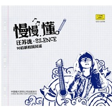

慢慢懂90后新校园民谣
============================

|  |  |
| :--: | :-- |
| [ 慢慢懂90后新校园民谣](https://emumo.xiami.com/album/411559) | **艺人**: [汪苏泷](../index.md) **语种**: 国语 **唱片公司**: 金船文化 **发行时间**: 2010年11月19日 **专辑类别**: 录音室专辑 **专辑风格**: 国语流行 Mandarin Pop, 校园民谣 Campus Folk, 华语唱作人 Chinese Singer-Songwriter **播放数**: 20689484 **收藏数**: 1651 **评论数**: 104  |

## 简介

《慢慢懂》中收录了汪苏泷（silence）之前发布过的经典歌曲和几首新作。整张专辑精心打造，经典老歌全部重新制作，而几首新作更是带来让人惊艳的全新突破。才华横溢的汪苏泷（silence）到底还有多少让众人折服的才思泉涌？让我们拭目以待11月19日即将在汪苏泷母校沈阳音乐学院发行的首张大碟《慢慢懂》。

## 曲目

## 评论

|  |  |  |
| :-- | :-- | :-- |
|  [虾米用户](https://emumo.xiami.com/u/404425923)  2019-03-28 18:33 赞(0) 踩(0) | 
特别特别好！！！都不知道该怎么夸奖了。。。。
 |
|  [虾米用户](https://emumo.xiami.com/u/295700763)  2018-06-12 15:26 赞(1) 踩(0) | 
最喜欢这张专辑  我的青春啊  一去不回
 |
|  [虾米用户](https://emumo.xiami.com/u/359543305)  2018-05-26 20:58 赞(1) 踩(0) | 
好听
 |
|  [虾米用户](https://emumo.xiami.com/u/23691949)  2018-05-06 00:09 赞(2) 踩(0) | 
首首都好听，中毒了，不听睡不着 
 |
|  [虾米用户](https://emumo.xiami.com/u/51996767) 情歌2021.01.05... 2018-04-12 00:43 赞(1) 踩(0) | 
小学时情窦初开的感觉可能是最真实的情感
 |
|  [虾米用户](https://emumo.xiami.com/u/355482047)  2018-04-04 22:08 赞(2) 踩(0) | 
十分完美！永爱汪苏泷！
 |
|  [虾米用户](https://emumo.xiami.com/u/330896007) 汪汪汪 2018-03-25 00:35 赞(1) 踩(0) | 
很好听
 |
|  [虾米用户](https://emumo.xiami.com/u/31113703) 无个性，不签名 2018-02-22 10:43 赞(2) 踩(0) | 
我的高中回忆 编曲现在听来也非常棒，不愧校园新民谣的称号。就是歌曲主题能再丰富点就更好了，校园不是只有情情爱爱。。。。
 |
|  [虾米用户](https://emumo.xiami.com/u/348245649)  2018-02-08 20:45 赞(0) 踩(0) | 
好听
 |
|  [虾米用户](https://emumo.xiami.com/u/330851129) 爱过知轻重，醉过知酒浓 2018-02-05 18:05 赞(0) 踩(0) | 
好好听哦
 |
|  [虾米用户](https://emumo.xiami.com/u/346696655)  2018-01-30 13:51 赞(0) 踩(0) | 
想听听老大以前的歌是哪种风格
 |
|  [虾米用户](https://emumo.xiami.com/u/249880711)  2018-01-05 22:52 赞(0) 踩(0) | 
喜欢这个日子
 |
|  [虾米用户](https://emumo.xiami.com/u/339759889)  2017-12-14 12:15 赞(0) 踩(0) | 
苏音唯美爱泷不悔
 |
|  [虾米用户](https://emumo.xiami.com/u/322542079) 苏音唯美，爱泷不悔 2017-12-03 16:51 赞(0) 踩(0) | 
精心制作
 |
|  [虾米用户](https://emumo.xiami.com/u/3527198)  2017-10-27 23:30 赞(1) 踩(0) | 
非常好听的一张专辑，最近喜欢他这个调调
 |
|  [虾米用户](https://emumo.xiami.com/u/329244169)  2017-10-27 20:02 赞(0) 踩(0) | 
慢慢懂 
 |
|  [虾米用户](https://emumo.xiami.com/u/319027976) 这家伙很聪明什么也没留下... 2017-08-13 07:21 赞(0) 踩(0) | 
支持小哥哥❤️ 苏音唯美 爱泷不悔
 |
|  [虾米用户](https://emumo.xiami.com/u/317579561)  2017-08-06 09:22 赞(0) 踩(0) | 
太好听了
 |
|  [虾米用户](https://emumo.xiami.com/u/290353015)  2017-07-07 17:06 赞(1) 踩(0) | 
与汪苏泷的初相识，然后就是日以继日的单曲循环
 |
|  [虾米用户](https://emumo.xiami.com/u/88671788) 彳亍 2017-06-26 23:04 赞(1) 踩(0) | 
回忆杀( &amp;bull;̅_&amp;bull;̅ )
 |
|  [虾米用户](https://emumo.xiami.com/u/293813184)  2017-06-24 18:35 赞(0) 踩(0) | 
呵呵呵
 |
|  [虾米用户](https://emumo.xiami.com/u/290051603) 嘿，抬头！ 2017-06-18 20:14 赞(2) 踩(0) | 
算是他被大众熟悉的一个起点吧，是汪苏泷第一张实体专辑，，呃呃特别想要这张专辑，谁有啊
 |
|  [虾米用户](https://emumo.xiami.com/u/304073980)  2017-06-18 14:28 赞(0) 踩(0) | 
666666666666666
 |
|  [虾米用户](https://emumo.xiami.com/u/293609719) 努力到无能为力  拼搏到... 2017-05-04 07:19 赞(1) 踩(0) | 
超喜欢
 |
|  [虾米用户](https://emumo.xiami.com/u/244900004)  2017-04-29 10:12 赞(0) 踩(0) | 
           
 |
|  [虾米用户](https://emumo.xiami.com/u/290017800) silence 2017-04-27 23:27 赞(0) 踩(0) | 
厉害了
 |
|  [虾米用户](https://emumo.xiami.com/u/285961237)  2017-04-23 03:51 赞(0) 踩(0) | 
回忆。。。
 |
|  [虾米用户](https://emumo.xiami.com/u/276339524)  2017-03-17 17:47 赞(0) 踩(0) | 
嗯嗯(⊙_⊙)，好听
 |
|  [虾米用户](https://emumo.xiami.com/u/84942676)  2017-01-13 22:54 赞(0) 踩(0) | 
好听
 |
|  [虾米用户](https://emumo.xiami.com/u/258313010) 你就是我心中的蓝 2017-01-04 14:14 赞(2) 踩(0) | 
第一张实体专辑，有我的入坑曲，每次听都会想起那段美好的时光，这些歌一直都在我的列表里。
 |
|  [虾米用户](https://emumo.xiami.com/u/247349692)  2016-12-04 08:16 赞(0) 踩(0) | 
      
 |
|  [虾米用户](https://emumo.xiami.com/u/251077068)  2016-12-01 18:02 赞(0) 踩(0) | 
好好听  
 |
|  [虾米用户](https://emumo.xiami.com/u/124935212)   2016-10-29 21:29 赞(0) 踩(0) | 
最爱的专辑，来回忆
 |
|  [虾米用户](https://emumo.xiami.com/u/43135317) 别做空想家！ 2016-10-20 23:36 赞(0) 踩(0) | 
老大的歌瞬间都可以听了。
 |
|  [虾米用户](https://emumo.xiami.com/u/187218610) 略略略 2016-10-05 00:38 赞(0) 踩(0) | 
非主流时期最爱的歌手吧算是 晚上写数学卷子无聊回来回忆小学
 |
|  [虾米用户](https://emumo.xiami.com/u/113549762) 思念压着悲伤好累…… 2016-09-28 18:02 赞(0) 踩(0) | 
翻弄着回忆，熟悉的音调  记忆中的苏音一直陪着我。一直喜欢老大，谢谢老大谱写的青春旋律。
 |
|  [虾米用户](https://emumo.xiami.com/u/125359776)  2016-06-21 19:14 赞(0) 踩(0) | 
很好听  很有天赋的创作歌手 加油小泷
 |
|  [虾米用户](https://emumo.xiami.com/u/139500328) 爱大东 2016-04-12 21:49 赞(0) 踩(0) | 
很棒
 |
|  [虾米用户](https://emumo.xiami.com/u/139500328) 爱大东 2016-04-12 21:48 赞(0) 踩(0) | 
很早就喜欢啦  很喜欢小泷的声音
 |
|  [虾米用户](https://emumo.xiami.com/u/120313448) 你是爱上我的才华 还是我... 2016-03-27 00:54 赞(0) 踩(0) | 
表白老大
 |
|  [虾米用户](https://emumo.xiami.com/u/122298662)  2016-03-11 20:44 赞(0) 踩(0) | 
太好听了。
 |
|  [虾米用户](https://emumo.xiami.com/u/52442540)  2015-11-19 14:22 赞(0) 踩(0) | 
太好听了！
 |
|  [虾米用户](https://emumo.xiami.com/u/51763102)  2015-06-27 08:08 赞(0) 踩(0) | 
为什么下加
 |
|  [虾米用户](https://emumo.xiami.com/u/50681691) 世间最毒的仇恨是有缘却无... 2015-06-11 19:55 赞(0) 踩(0) | 
好听
 |
|  [虾米用户](https://emumo.xiami.com/u/50681691) 世间最毒的仇恨是有缘却无... 2015-06-11 19:55 赞(0) 踩(0) | 
加油
 |
|  [虾米用户](https://emumo.xiami.com/u/37968657)  2015-06-09 12:00 赞(0) 踩(0) | 
大爱
 |
|  [虾米用户](https://emumo.xiami.com/u/18024895) Valar Morghu... 2015-01-09 22:27 赞(0) 踩(0) | 
#虾米你虫洞穿越观光团#到此一游～
 |
|  [虾米用户](https://emumo.xiami.com/u/28968585)  2013-12-03 20:47 赞(0) 踩(0) | 
很好聽
 |
|  [虾米用户](https://emumo.xiami.com/u/28968585)  2013-12-03 20:46 赞(0) 踩(0) | 
很好聽
 |
|  [虾米用户](https://emumo.xiami.com/u/28968585)  2013-12-03 20:46 赞(0) 踩(0) | 
很好聽
 |
|  [虾米用户](https://emumo.xiami.com/u/28968585)  2013-12-03 20:46 赞(0) 踩(0) | 
很好聽
 |
|  [虾米用户](https://emumo.xiami.com/u/16313633)  2013-08-13 21:57 赞(0) 踩(0) | 
他的歌还是蛮好的。
 |
|  [虾米用户](https://emumo.xiami.com/u/16313633)  2013-08-13 21:57 赞(0) 踩(0) | 
他的歌还是蛮好的。
 |
|  [虾米用户](https://emumo.xiami.com/u/4201092) 爱音乐 2013-08-07 11:34 赞(0) 踩(0) | 
很好听
 |
|  [虾米用户](https://emumo.xiami.com/u/15367598)  2013-05-21 16:01 赞(1) 踩(0) | 
love
 |
|  [虾米用户](https://emumo.xiami.com/u/13031181)  2013-02-13 17:55 赞(1) 踩(0) | 
好听
 |
|  [虾米用户](https://emumo.xiami.com/u/12186807) 改变生活 2013-01-02 22:28 赞(1) 踩(0) | 
好聽唄
 |
|  [虾米用户](https://emumo.xiami.com/u/11194886)  2012-10-25 16:23 赞(1) 踩(0) | 
喜欢你，喜欢你的歌~~
 |
|  [虾米用户](https://emumo.xiami.com/u/10043075)  2012-08-06 23:38 赞(1) 踩(0) | 
喜欢
 |
|  [虾米用户](https://emumo.xiami.com/u/9722004)  2012-07-07 15:07 赞(1) 踩(0) | 
❤
 |
|  [虾米用户](https://emumo.xiami.com/u/5847388) 拥有太多却不够深刻 2012-07-04 14:37 赞(1) 踩(0) | 
嘻嘻
 |
|  [虾米用户](https://emumo.xiami.com/u/8481146)  2012-03-18 12:07 赞(1) 踩(0) | 
这里的歌特别好听！
 |
|  [虾米用户](https://emumo.xiami.com/u/8219442)  2012-02-28 14:20 赞(1) 踩(0) | 
是一个天才来着
 |
|  [虾米用户](https://emumo.xiami.com/u/8219442)  2012-02-28 14:20 赞(1) 踩(0) | 
是一个天才来着
 |
|  [虾米用户](https://emumo.xiami.com/u/8219442)  2012-02-28 14:20 赞(0) 踩(0) | 
是一个天才来着
 |
|  [虾米用户](https://emumo.xiami.com/u/8219442)  2012-02-28 14:19 赞(0) 踩(0) | 
是一个天才来着
 |
|  [虾米用户](https://emumo.xiami.com/u/5160754)  2012-02-22 14:48 赞(0) 踩(0) | 
说中心中所想的吧....
 |
|  [虾米用户](https://emumo.xiami.com/u/6487297)  2011-12-30 18:45 赞(0) 踩(0) | 
又一个才子啊
 |
|  [虾米用户](https://emumo.xiami.com/u/6903833)  2011-12-09 22:33 赞(0) 踩(0) | 
好听
 |
|  [虾米用户](https://emumo.xiami.com/u/6231664)  2011-12-08 10:36 赞(0) 踩(0) | 
，，
 |
|  [虾米用户](https://emumo.xiami.com/u/6189166)  2011-10-10 11:41 赞(0) 踩(0) | 
好听
 |
|  [虾米用户](https://emumo.xiami.com/u/3645741)  2011-10-01 14:57 赞(0) 踩(0) | 
对唱，耐听，领悟
 |
|  [虾米用户](https://emumo.xiami.com/u/5738898)  2011-09-07 17:22 赞(0) 踩(0) | 
狠（*@ο@*） 哇～喜欢！天籁之音！！！
 |
|  [虾米用户](https://emumo.xiami.com/u/5682186)  2011-09-03 19:10 赞(0) 踩(0) | 
每一首都非常不错啊
 |
|  [虾米用户](https://emumo.xiami.com/u/5681415)  2011-09-03 03:37 赞(0) 踩(0) | 
，，，
 |
|  [虾米用户](https://emumo.xiami.com/u/5192174)  2011-08-09 13:08 赞(0) 踩(0) | 
回旋与梦想和现实之间，慢慢懂得飘渺的梦，并非遥不可及；和汪苏泷silence一起用自己的力量，实现梦想..
 |
|  [虾米用户](https://emumo.xiami.com/u/4794997)  2011-07-10 21:04 赞(0) 踩(0) | 
刚刚开始听第一首汪苏泷的歌的时候就觉得他的歌很好听，一张专辑听下来，果真，没首都很好听哦
 |
|  [虾米用户](https://emumo.xiami.com/u/4794997)  2011-07-10 21:03 赞(0) 踩(0) | 
每一首都很好听、
 |
|  [虾米用户](https://emumo.xiami.com/u/2805436) 咕咚～ 2011-06-22 17:46 赞(0) 踩(0) | 
我很喜欢
 |
|  [虾米用户](https://emumo.xiami.com/u/4297739)  2011-06-15 12:09 赞(0) 踩(0) | 
一直关注
 |
|  [虾米用户](https://emumo.xiami.com/u/4216879)  2011-06-08 10:49 赞(0) 踩(0) | 
慢慢懂
 |
|  [虾米用户](https://emumo.xiami.com/u/2768583) 你还好吗？ 2011-06-04 23:28 赞(0) 踩(0) | 
很不错哦
 |
|  [虾米用户](https://emumo.xiami.com/u/1481985)  2011-06-03 19:49 赞(0) 踩(0) | 
唱的安静，就像我现在心情，或爱或不爱
 |
|  [虾米用户](https://emumo.xiami.com/u/3301071)  2011-05-22 15:31 赞(0) 踩(0) | 
大爱啊，声音真的很好听，很多歌都很好听~
 |
|  [虾米用户](https://emumo.xiami.com/u/3856885)  2011-05-06 23:30 赞(0) 踩(0) | 
慢慢的你iu会董
 |
|  [虾米用户](https://emumo.xiami.com/u/3783779)  2011-04-30 10:52 赞(0) 踩(0) | 
很好
 |
|  [虾米用户](https://emumo.xiami.com/u/3687317)  2011-04-22 09:58 赞(0) 踩(0) | 
慢慢懂
 |
|  [虾米用户](https://emumo.xiami.com/u/3228809)  2011-04-16 22:40 赞(0) 踩(0) | 
稀饭
 |
|  [虾米用户](https://emumo.xiami.com/u/3593485)  2011-04-13 17:21 赞(0) 踩(0) | 
en
 |
|  [虾米用户](https://emumo.xiami.com/u/3427646)  2011-03-31 19:40 赞(0) 踩(0) | 
、、、
 |
|  [虾米用户](https://emumo.xiami.com/u/3346754)  2011-03-31 10:19 赞(0) 踩(0) | 
超喜欢
 |
|  [虾米用户](https://emumo.xiami.com/u/3205571)   2011-03-30 18:57 赞(0) 踩(0) | 
很喜欢的专辑，大爱汪苏泷
 |
|  [虾米用户](https://emumo.xiami.com/u/988463)  2011-03-04 21:51 赞(0) 踩(0) | 
90后的新鲜声音。
 |
|  [虾米用户](https://emumo.xiami.com/u/2910354)  2011-02-20 14:49 赞(0) 踩(0) | 
记忆里的感动，让人的内心变得丰盈而温润
 |
|  [虾米用户](https://emumo.xiami.com/u/1918891)  2011-02-09 03:59 赞(0) 踩(0) | 
小节奏
 |
|  [虾米用户](https://emumo.xiami.com/u/1745665)  2011-01-25 22:45 赞(0) 踩(0) | 
Silence.w
 |
|  [虾米用户](https://emumo.xiami.com/u/2518027)  2011-01-16 23:07 赞(0) 踩(0) | 
爱乌及乌
 |
|  [虾米用户](https://emumo.xiami.com/u/2464962)  2011-01-11 22:17 赞(0) 踩(0) | 
=。=
 |
|  [虾米用户](https://emumo.xiami.com/u/1534576)  2010-12-25 23:05 赞(0) 踩(0) | 
很喜欢这种风格，每一首都好听
 |
|  [虾米用户](https://emumo.xiami.com/u/1861161)  2010-12-06 11:46 赞(0) 踩(0) | 
silence的声音很特别
 |
|  [虾米用户](https://emumo.xiami.com/u/99173)  2010-11-26 23:23 赞(0) 踩(0) | 
唯你懂我心最好听。其它的。。。没什么可听的。
 |
|  [虾米用户](https://emumo.xiami.com/u/1942099)  2010-11-26 23:19 赞(0) 踩(0) | 
怎么没人顶呢 哎 他的每首歌我都喜欢都好听 有才的一沓~
 |
|  [虾米用户](https://emumo.xiami.com/u/1126992)  2010-11-24 23:32 赞(0) 踩(0) | 
膜拜~
 |
