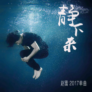
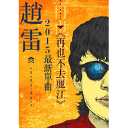
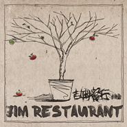

赵雷
============================

|  |  |
| :--: | :-- |
| [ 赵雷](https://i.xiami.com/zhaolei) | **地区**: China 中国大陆 **风格**: 民谣 Folk, 华语唱作人 Chinese Singer-Songwriter **播放数**: 587810245 **粉丝数**: 770414 **评论数**: 3687  |

## 档案

赵雷，  1986  年  7  月  20  日生于北京，中国内地民谣歌手、音乐人。   2011  年，赵雷发行个人第一张唱片《赵小雷》，专辑收录的主打歌曲《南方姑娘》被众多歌手及乐迷翻唱，赵雷也因此被更多人认识受到关注。  2014  年发行第二张个人专辑《吉姆餐厅》。  2016  年  12  月  21  日，赵雷发行专辑《无法长大》；  2  月，赵雷参加湖南卫视综艺节目《歌手》第三期，作为补位歌手演唱歌曲《成都》突围成功。 
基本资料 
中文名：赵雷 
生日：  1986-07-20 
代表作品：《画》、《南方姑娘》、《成都》 
别名：雷子 
国籍：中国 
出生地：北京 
身高：  175CM 
星座：巨蟹座 
民族：回族 
从艺历程 
2009  年，赵雷通过参与《速写穿乐》全国巡演；同年创办反拍音乐工作室。 
2010  年  5  月  1  日  ~3  日，赵雷参加了北京草莓音乐节、北京迷笛音乐节，引起关注；  8  月，参加《快乐男生》先在长沙唱区演唱了歌曲《塔吉汗》和《画》，从而获得  PASS  卡，但长沙唱区因合约问题取消  PASS  卡，赵雷选择从而转战广州唱区，并通过演唱原创歌曲《画》、《南方姑娘》、《雪人》等成功晋级全国  20  强，止步全国  12  强；  9  月  22  日在北京房山举行的长阳音乐节蒲公英舞台压轴演出。 
2011  年  7  月，赵雷发行个人首张专辑《赵小雷》，专辑收录的主打歌曲《南方姑娘》；  7  月  27-29  日，赵雷参加张北草原音乐节；  12  月  4  日，赵雷在糖果举办了自己的首张个人专辑发布会。 
2012  年  9  月  20  日，赵雷助阵赵照个人  “2012  新专辑《糙》北京首唱会暨全国巡演  ”  演出，与恩师赵照合唱一曲《北京的冬天》。  10-11  月，赵雷作为  “  十个轮子摩托车巡演  ”  的创始人，同浩子，小猛，冠奇，旭东等人展开摩托车摇滚巡演，从成都出发到广州共途径  20  个城市，三十天共进行  11  场演出。 
2013  年，赵雷进行了个人  44  站全国巡演，  9  月  10  日巡演的第三站在烟台  “  小灯塔咖啡馆  ”  里举行，成为烟台举办首场开在咖啡馆里的个人演唱会。 
2014  年  1  月，赵雷以民谣歌手的身份参加《中国好歌曲》，原创歌曲作品《画》被刘欢选中，并收录于刘欢的原创大碟《新九拍》中；  4  月  ~5  月，参加《长江国际音乐节》；  5  月，赵雷参加香港青年音乐节，与谢安琪、张靓颖、吉克隽逸、王铮亮等同台。同年推出个人第二张专辑《吉姆餐厅》。  10  月  26  日，赵雷携专辑来到全国巡演沈阳站，用音乐讲述心中的那个吉姆餐厅。  11  月，赵雷发布了专辑中的首支单曲  MV  《我们的时光》。 
2015  年  1  月，赵雷在山东济南举行的月木纹时光  MINI live  系列演唱会  ——  赵雷专场开唱；  9  月，赵雷发表单曲《再也不会去丽江》；  11  月，赵雷  “  我们的时光  ”  全国剧院巡演正式启动，历史两个月，  11  月  27  日西安站和  11  月  29  日南京站圆满结束，演出共历经十三个城市；  12  月，获微博音乐人网络评选的  “  年度金曲  ”  以及  “  年度最受欢迎音乐人  ”  称号。 
2016  年  3  月，与歌手伍佰一道参加台湾唱片公司  STREETVOICE  主办的  “  大事发声  ”StudioLive  在线直播演出第一期演唱嘉宾，一周内演出视频点播达  1400  万次。 
2017  年  1  月  21  日，赵雷发行专辑《无法长大》；  2  月，赵雷参加湖南卫视综艺节目《歌手》第三期，作为补位歌手演唱歌曲《成都》突围成功；  7  月  20  日，赵雷创作的《成都》获得首届唱工委音乐奖  CMA  年度歌曲奖；  11  月  18  日，在北京工人体育馆举办  “  浮游  ”  演唱会。 
人物评价 
赵雷的音乐，虽然没有诗句般的柔情感动，但痞子气的调侃，单纯率直。词作、编曲朴实坦诚以描写生活中细微见长，画面感极强。 
生在北京长在北京的赵雷，他的音乐作品具有传统北京胡同的文化气质，正如他沉默寡言的性格，质朴坦诚。作词以白描为主，编曲朴实简洁，主题都是以生活的细节见长，不做作，不矫情，又接地气。

## 专辑

| 名称 | 语种 | 唱片公司 | 发行时间 | 专辑类别 | 专辑风格 |
| :--: | :-- | :-- | :-- | :-- | :-- |
| [ 小人物](./albums/2105597349.md) | 国语 | StreetVoice, 上海飞短流长文化工作室 | 2019年12月18日 | EP, 单曲 | 当代唱作人 Contemporary Singer-Songwriter |
| [ 十九岁At The Age of Nineteen](./albums/2103495206.md) | 国语 | StreetVoice | 2018年01月19日 | 录音室专辑 | 独立民谣 Indie Folk, 当代民谣 Contemporary Folk, 当代唱作人 Contemporary Singer-Songwriter |
| [ 静下来Slow Down](./albums/2102905112.md) | 国语 | StreetVoice | 2017年11月08日 | EP, 单曲 | 当代民谣 Contemporary Folk, 当代唱作人 Contemporary Singer-Songwriter |
| [ 无法长大Unable To Grow Up](./albums/2102413795.md) | 国语 | StreetVoice | 2016年12月21日 | 录音室专辑 | 华语唱作人 Chinese Singer-Songwriter, 民谣流行 Folk Pop |
| [ 再也不会去丽江](./albums/2100205356.md) | 国语 | StreetVoice | 2015年09月23日 | EP, 单曲 | 民谣流行 Folk Pop |
| [ 吉姆餐厅Jim Restaurant](./albums/2013969781.md) | 国语 | StreetVoice | 2014年10月19日 | 录音室专辑 | 民谣流行 Folk Pop, 华语唱作人 Chinese Singer-Songwriter |
| [ 赵小雷](./albums/465009.md) | 国语 | StreetVoice | 2011年08月07日 | 录音室专辑 | 民谣流行 Folk Pop, 当代民谣 Contemporary Folk, 华语唱作人 Chinese Singer-Songwriter |

## 评论

|  |  |  |
| :-- | :-- | :-- |
|  [虾米用户](https://emumo.xiami.com/u/351713377)  2021-01-23 23:24 赞(0) 踩(0) | 
雷子哥 啥时候出歌呢 等着你呢！ 《理想》没被磨灭呢！
 |
|  [虾米用户](https://emumo.xiami.com/u/440199638)  2021-01-10 00:20 赞(1) 踩(0) | 
886
 |
|  [虾米用户](https://emumo.xiami.com/u/118405026)  2021-01-09 09:10 赞(1) 踩(0) | 
雷子，虾米快要没了，听你的歌挺多年，也没留过言，因为觉得你也不会看到，但今天还是留下一段话，证明来过。
 |
|  [虾米用户](https://emumo.xiami.com/u/78428936) stay true 2021-01-06 01:02 赞(2) 踩(0) | 
在这里认识的雷子，虾米再见
 |
|  [虾米用户](https://emumo.xiami.com/u/279464022)  2021-01-06 00:17 赞(1) 踩(0) | 
886
 |
|  [虾米用户](https://emumo.xiami.com/u/442826926)  2021-01-01 16:58 赞(1) 踩(0) | 
666
 |
|  [虾米用户](https://emumo.xiami.com/u/358104299) 悲观的唯心存在现实解构虚... 2020-12-29 10:27 赞(0) 踩(0) | 
44596
 |
|  [虾米用户](https://emumo.xiami.com/u/2125820)  2020-12-13 21:57 赞(0) 踩(0) | 
喜欢你们去西藏那次，服，
 |
|  [虾米用户](https://emumo.xiami.com/u/2125820)  2020-12-13 21:56 赞(0) 踩(0) | 
喜欢你
 |
|  [虾米用户](https://emumo.xiami.com/u/440856004) 冷暖自知 2020-11-12 02:58 赞(1) 踩(0) | 
庆幸虾米还有赵雷
 |
|  [虾米用户](https://emumo.xiami.com/u/2125820)  2020-10-19 20:41 赞(1) 踩(0) | 
第一次听是两条路上的人，那时候还叫雷子，以为是个昙花一现，谁料是我的赵雷啊，刺心，大部分都深刺，默默关注不言不弃，能有机会喝酒那就三生有幸，
 |
|  [虾米用户](https://emumo.xiami.com/u/279076706)  2020-10-10 21:18 赞(0) 踩(0) | 
成都很打动我，很容易学会唱。希望雷子再创作出这样走心的歌曲，就像初恋，一辈子都烙印住，任何时候哼起来，都是一幕回忆的电影。。。。。。期待雷子的下一首&amp;ldquo;成都&amp;rdquo;
 |
|  [虾米用户](https://emumo.xiami.com/u/11446884) New York MoM... 2020-09-18 07:11 赞(0) 踩(0) | 
真的听出京味十足的。第一次发现这位宝藏创作人。
 |
|  [虾米用户](https://emumo.xiami.com/u/11446884) New York MoM... 2020-09-18 07:10 赞(0) 踩(0) | 
真好听
 |
|  [虾米用户](https://emumo.xiami.com/u/293891079) 拿音乐来拯救我的灵魂 2020-09-13 21:02 赞(0) 踩(0) | 
什么时候来太原，期待
 |
|  [虾米用户](https://emumo.xiami.com/u/69033490) cool. 2020-09-11 15:22 赞(0) 踩(0) | 

 |
|  [虾米用户](https://emumo.xiami.com/u/430824143)  2020-08-21 22:52 赞(0) 踩(0) | 
什么时候来深圳开个演唱会啊啊啊啊啊？
 |
|  [虾米用户](https://emumo.xiami.com/u/430824143)  2020-08-16 22:43 赞(0) 踩(0) | 
疫情后来深圳开场演唱会挺好的
 |
|  [虾米用户](https://emumo.xiami.com/u/430824143)  2020-08-16 22:41 赞(0) 踩(0) | 
喜欢你的歌
 |
|  [虾米用户](https://emumo.xiami.com/u/421382880)  2020-08-03 16:23 赞(0) 踩(0) | 
我想和他拉着手，他把我的手揣进他的裤兜，他穿着白衬衣，我们走过小酒馆，走过柿子树，走过丰收的稻田，走在月光里，我们一起生来一起活一起乐，乐，乐
 |
|  [虾米用户](https://emumo.xiami.com/u/444051961)  2020-07-15 19:01 赞(1) 踩(0) | 
家有小宝超级喜欢《成都》
 |
|  [虾米用户](https://emumo.xiami.com/u/408121521)  2020-07-09 20:22 赞(0) 踩(0) | 
666666666666666666666666666666 666666666666666666666666666666 666666666666666666666666666666 666666666666666666666666666666 666666666666666666666666666666 666666666666666666666666666666 666666666666666666666666666666 666666666666666666666666666666 666666666666666666666666666666 666666666666666666666666666666
 |
|  [虾米用户](https://emumo.xiami.com/u/276944698) 不要自我设限..... 2020-07-06 18:15 赞(1) 踩(0) | 

 |
|  [虾米用户](https://emumo.xiami.com/u/408168594)  2020-06-06 09:07 赞(1) 踩(0) | 
赵雷的歌都很好听，希望未来能听到更多
 |
|  [虾米用户](https://emumo.xiami.com/u/38221495)  2020-05-26 22:22 赞(1) 踩(0) | 
返璞归真，音乐越简单越动人，每一首歌都是一幅画，都是一部电影，都是回忆杀。
 |
|  [虾米用户](https://emumo.xiami.com/u/417500741)  2020-05-24 12:52 赞(1) 踩(0) | 
听了你的巜成都》让我对成都有了牵挂和思念，希望在我的有生之年，能到成都走一走。
 |
|  [虾米用户](https://emumo.xiami.com/u/430402158)  2020-04-26 23:04 赞(1) 踩(0) | 
喜欢雷子的歌！希望你过得好！雷子！
 |
|  [虾米用户](https://emumo.xiami.com/u/12000844)  2020-04-26 20:36 赞(0) 踩(0) | 
嗓音真好听，
 |
|  [虾米用户](https://emumo.xiami.com/u/21206167) 笑一個吧 2020-04-25 15:41 赞(0) 踩(0) | 
等新砖等新砖等新砖～
 |
|  [虾米用户](https://emumo.xiami.com/u/428465919) 想了就去做，别等后悔！ 2020-04-18 20:45 赞(0) 踩(0) | 
就是好听，说别的没用!   一个七零后的老男人，喜欢你，雷子
 |
|  [虾米用户](https://emumo.xiami.com/u/442013298) 认真音乐 认真生活 2020-04-14 14:59 赞(0) 踩(0) | 
分享  木子 的歌曲《留恋的光阴》<a href="https://www.xiami.com/song/1902032099" target="_blank" rel="nofollow noreferrer noopener">https://www.xiami.com/song/1902032099</a> (分享自@虾米音乐)
 |
|  [虾米用户](https://emumo.xiami.com/u/4365181) Flyman 2020-04-13 15:10 赞(0) 踩(0) | 
成都鸭子民谣 
 |
|  [虾米用户](https://emumo.xiami.com/u/260824165) 卧看青天行白云 2020-04-11 13:24 赞(0) 踩(0) | 
请购买已是两条路上的人，谢谢
 |
|  [虾米用户](https://emumo.xiami.com/u/404918565)  2020-04-04 22:52 赞(0) 踩(0) | 
好听，我的姑凉。。。
 |
|  [虾米用户](https://emumo.xiami.com/u/321947421)  2020-03-26 06:07 赞(0) 踩(0) | 
谁知道这首歌曲的魅力在哪里？那几句歌词最动人？哪里最难唱？唱的时候有什么技巧？什么心里准备
 |
|  [虾米用户](https://emumo.xiami.com/u/429143951) 音乐，不仅慰藉暖心，而且... 2020-03-25 06:45 赞(1) 踩(0) | 
你啥时会写一首《武汉》吗？
 |
|  [虾米用户](https://emumo.xiami.com/u/1669981) 我还没想好要写什么... 2020-03-24 22:34 赞(0) 踩(0) | 
阳光帅气的兄弟男孩
 |
|  [虾米用户](https://emumo.xiami.com/u/375000563) 能夠避开的，就不是命運；... 2020-03-13 07:35 赞(0) 踩(0) | 
加油雷子，能唱到我心里和帮助我认清自己唯有两个人，以前是杰哥现在是你 希望你越来越好，少些遗憾和无奈，迷惘和撑不住嘚时候，多回想你嘚初衷和理想，尽力演绎和诠释你自己^_^
 |
|  [虾米用户](https://emumo.xiami.com/u/178176102) 找一首歌… 2020-03-04 22:13 赞(0) 踩(0) | 
真是个人才啊
 |
|  [虾米用户](https://emumo.xiami.com/u/430112173)  2020-03-01 22:50 赞(0) 踩(0) | 
好听
 |
|  [虾米用户](https://emumo.xiami.com/u/29888539)  2020-02-29 17:24 赞(0) 踩(0) | 
唱的是感情，听的是生活……
 |
|  [虾米用户](https://emumo.xiami.com/u/309161231)  2020-02-25 14:44 赞(2) 踩(0) | 
这封面使人心动
 |
|  [虾米用户](https://emumo.xiami.com/u/2757180)  2020-02-23 01:36 赞(0) 踩(0) | 
出名其实不是什么好事
 |
| ⇒ |  [虾米用户](https://emumo.xiami.com/u/3140019) 天马行空 2020-02-26 02:13 赞(0) 踩(0) | 
管它是不是好事，愿他好就是
 |
|  [虾米用户](https://emumo.xiami.com/u/440500510) 唯有苦难诠释音乐 2020-02-17 18:53 赞(2) 踩(0) | 
唯有苦难，才是音乐的真谛。
 |
|  [虾米用户](https://emumo.xiami.com/u/435112968)  2020-02-16 21:28 赞(0) 踩(0) | 
第一次听就喜欢听这首歌了
 |
|  [虾米用户](https://emumo.xiami.com/u/232180378) 我的挚爱→_→温馨辣梅-... 2020-02-11 00:12 赞(1) 踩(0) | 
不错，挺好听的。
 |
|  [虾米用户](https://emumo.xiami.com/u/325999004)  2020-02-08 11:07 赞(1) 踩(0) | 
让我相信原来这世间真是还有&amp;ldquo;情怀&amp;rdquo;。
 |
|  [虾米用户](https://emumo.xiami.com/u/3566813) 菩萨，祝您身体健康！34... 2020-02-06 20:13 赞(2) 踩(0) | 
快乐男生时的一首妈妈，好歌曲的画，好吧，收了。
 |
|  [虾米用户](https://emumo.xiami.com/u/171109250) 我还没想好要写什么... 2020-01-14 00:59 赞(1) 踩(0) | 
我想听我们的时光
 |
|  [虾米用户](https://emumo.xiami.com/u/32204245) 暂无签名~ 2020-01-11 22:02 赞(1) 踩(0) | 
好听
 |
|  [虾米用户](https://emumo.xiami.com/u/435131663)  2020-01-08 08:06 赞(0) 踩(0) | 
平凡不简单
 |
|  [虾米用户](https://emumo.xiami.com/u/32020694)  2020-01-02 22:35 赞(0) 踩(0) | 
等个唱
 |
|  [虾米用户](https://emumo.xiami.com/u/433494129)  2019-12-19 21:07 赞(1) 踩(0) | 
和我生日同一天
 |
|  [虾米用户](https://emumo.xiami.com/u/25287364) 于有声处，觅内心音 2019-12-19 19:13 赞(1) 踩(0) | 
封面还是2016年不想长大的耶，门票还留着 
 |
|  [虾米用户](https://emumo.xiami.com/u/2796166) 最爱莫文蔚..... 2019-12-19 00:24 赞(1) 踩(0) | 
加油~~~
 |
|  [虾米用户](https://emumo.xiami.com/u/370716548) 我还没想好要写什么... 2019-12-18 17:40 赞(1) 踩(0) | 
他可能就是下一个朴树，加油。
 |
|  [虾米用户](https://emumo.xiami.com/u/52366333)  2019-12-17 01:15 赞(1) 踩(0) | 
他的歌里有经历，有城市的特色，有情感的感悟。比一些所谓的民谣好，好歌手就该火，别说什么希望大家都不知道他，歌手还要吃饭呢
 |
|  [虾米用户](https://emumo.xiami.com/u/7398337)  2019-12-05 08:29 赞(3) 踩(0) | 
赵雷长得帅，有没有跟我看法一样的！
 |
|  [虾米用户](https://emumo.xiami.com/u/32832654) 我爱beyond,我只下... 2019-12-01 21:35 赞(1) 踩(0) | 
赞
 |
|  [虾米用户](https://emumo.xiami.com/u/293692544) 你敢给我说话吗？我咬你 2019-11-30 18:11 赞(2) 踩(0) | 
好听
 |
|  [虾米用户](https://emumo.xiami.com/u/293692544) 你敢给我说话吗？我咬你 2019-11-24 08:20 赞(2) 踩(0) | 
好听
 |
|  [虾米用户](https://emumo.xiami.com/u/21206167) 笑一個吧 2019-11-22 02:20 赞(2) 踩(0) | 
想听新歌了！
 |
|  [虾米用户](https://emumo.xiami.com/u/432492655) 听着舒服的音乐，做着自己... 2019-11-20 22:56 赞(3) 踩(0) | 
听着赵雷的歌，好像讲述的是自己的青春岁月，让人不禁回想起发生在自己身上的故事。有一种与生命对话的感觉，让人的心灵得到净化！加油吧，雷子，希望你能创作出更多这样的作品。
 |
|  [虾米用户](https://emumo.xiami.com/u/3989578) 音乐无国界 2019-11-18 00:30 赞(2) 踩(0) | 
我们再也回不去了
 |
|  [虾米用户](https://emumo.xiami.com/u/324424545) 热爱音乐 2019-11-05 22:58 赞(4) 踩(0) | 
痨病在唱歌！有气无力
 |
|  [虾米用户](https://emumo.xiami.com/u/3593768)  2019-11-05 18:09 赞(2) 踩(0) | 
对呀  该出新歌啦！
 |
|  [虾米用户](https://emumo.xiami.com/u/425910552)  2019-10-24 14:59 赞(3) 踩(0) | 
我从来没有喜欢过哪个明星或歌星，但自从听了雷子的歌后，深深的被打动心坎里，再也抑制不住想要歌唱你每一首歌曲，为此也拿起了吉他学会了弹唱南方姑娘 三十岁的女人与成都。
 |
|  [虾米用户](https://emumo.xiami.com/u/325463538) 你可以一直爱我吗 2019-10-20 16:24 赞(3) 踩(0) | 
你好 任性的拳手。因为喜欢你也喜欢过他，从情意绵绵到互相折磨再到现在的一别两宽。由远到近再到远，心历路程也经过了十万八千里，已经不爱了，但是没忘记，大概我对自己无能为力。
 |
|  [虾米用户](https://emumo.xiami.com/u/408264221)  2019-10-17 14:48 赞(2) 踩(0) | 
我今年也去学吉他，因为喜欢。
 |
|  [虾米用户](https://emumo.xiami.com/u/12503031) hahah 2019-10-15 14:41 赞(2) 踩(0) | 
第一次去音乐节，你还未那么火，现在再去，依旧希望你没那么火，有点自私哈
 |
|  [虾米用户](https://emumo.xiami.com/u/430522606)  2019-10-10 14:39 赞(2) 踩(0) | 
最早听赵雷的那首  画  就觉得这个首歌有意思，喜欢
 |
|  [虾米用户](https://emumo.xiami.com/u/300217618)  2019-09-15 21:00 赞(1) 踩(0) | 
哥你啥时出新专，小雨中，小人物都会唱了。。
 |
|  [虾米用户](https://emumo.xiami.com/u/428746303)  2019-08-29 10:49 赞(1) 踩(0) | 
怎么看不到歌词
 |
|  [虾米用户](https://emumo.xiami.com/u/410779269)  2019-08-27 22:43 赞(1) 踩(0) | 
的dge
 |
|  [虾米用户](https://emumo.xiami.com/u/327039734)   2019-08-18 22:10 赞(2) 踩(0) | 
很久没有过这样喜欢听歌了…是赵雷的歌…也没这样喜欢过任何一个歌手…赵雷的歌像给人注入了年轻的血液…关于爱情…关于迷茫…关于未来…听着他的歌声…仿佛又回到了当年的自己…那种心境…那种忧郁…重温着当年的自己…一遍又一遍地重复着听着…每一首每一句都是不一样的意境…
 |
|  [虾米用户](https://emumo.xiami.com/u/379348027)  2019-08-12 16:02 赞(0) 踩(0) | 
希望你坚守本真路线，用实力来感染歌友，而媚谷 
 |
| ⇒ |  [虾米用户](https://emumo.xiami.com/u/379348027)  2019-08-12 16:04 赞(0) 踩(0) | 
非媚俗
 |
|  [虾米用户](https://emumo.xiami.com/u/332535138)  2019-08-06 23:23 赞(1) 踩(0) | 
你的歌曲好听 
 |
|  [虾米用户](https://emumo.xiami.com/u/411115702)  2019-07-30 18:26 赞(0) 踩(0) | 
期待新歌
 |
|  [虾米用户](https://emumo.xiami.com/u/409328541)  2019-07-28 20:14 赞(0) 踩(0) | 
i…/The p?
 |
|  [虾米用户](https://emumo.xiami.com/u/409328541)  2019-07-28 20:13 赞(0) 踩(0) | 
1； 0父，我^厂冫r〉乛！！；一。
 |
|  [虾米用户](https://emumo.xiami.com/u/49895220) 一念静心花开遍世界 2019-07-27 00:31 赞(0) 踩(0) | 
新专辑什么时候发啊！！！
 |
|  [虾米用户](https://emumo.xiami.com/u/84872680)  2019-07-20 16:06 赞(0) 踩(0) | 
  
 |
|  [虾米用户](https://emumo.xiami.com/u/250501051) 孤独的自由 2019-07-20 11:31 赞(1) 踩(0) | 
生日快乐 
 |
|  [虾米用户](https://emumo.xiami.com/u/32906148) 我还没想好 2019-07-20 02:39 赞(3) 踩(0) | 
雷子，今天你生日，祝你永远19岁
 |
|  [虾米用户](https://emumo.xiami.com/u/244995498)  2019-07-20 02:26 赞(2) 踩(0) | 
算得上真正意义上的歌手，生日快乐哈 
 |
|  [虾米用户](https://emumo.xiami.com/u/53737210) 哼哼哼 2019-07-12 19:13 赞(0) 踩(0) | 
吉他弹唱，民谣个蛋
 |
|  [虾米用户](https://emumo.xiami.com/u/426741779) http://www.b... 2019-07-04 23:16 赞(0) 踩(0) | 
谢谢雷叔
 |
|  [虾米用户](https://emumo.xiami.com/u/412416452)  2019-07-02 15:41 赞(2) 踩(0) | 
第一次离开《家乡》去了《成都》遇到一个《南方姑娘》她是个《三十岁的女人》我们谈起了《理想》我像个《无法长大的孩子》她向我《辞行》我望着她的《背影》我知道我们《已是两条路上的人》回到了我的《小屋》想起《我们的时光》《画》了她的模样。
 |
|  [虾米用户](https://emumo.xiami.com/u/53737210) 哼哼哼 2019-06-28 13:31 赞(0) 踩(0) | 
不怎么样
 |
|  [虾米用户](https://emumo.xiami.com/u/219284774)  2019-06-25 18:46 赞(0) 踩(0) | 
ùfj，
 |
|  [虾米用户](https://emumo.xiami.com/u/50478261) 陈奕迅粉 赵雷粉 2019-06-18 13:06 赞(2) 踩(0) | 
赵小雷 今天我分手啦 那个陪我去鼓楼找寻你气息的他 泪流满面
 |
|  [虾米用户](https://emumo.xiami.com/u/139561784) 雨季总要来 2019-05-11 23:22 赞(0) 踩(0) | 
我要早睡 治痘痘 消黑眼圈 要懂很多很多知识 我要把自己该做的事情高速高质量做完 我要这样一个我
 |
|  [虾米用户](https://emumo.xiami.com/u/410914431)  2019-05-09 21:10 赞(2) 踩(0) | 
最近迷上了你的歌，觉得每首歌都能把自己融入其中
 |
|  [虾米用户](https://emumo.xiami.com/u/421050028)  2019-05-04 09:09 赞(1) 踩(0) | 
版权！版权？版权！
 |
|  [虾米用户](https://emumo.xiami.com/u/405285179)  2019-04-21 08:36 赞(2) 踩(0) | 
好好休息，再出来开演唱会.
 |
|  [虾米用户](https://emumo.xiami.com/u/7651083) 不知不觉中，已经在虾米上... 2019-04-04 21:52 赞(1) 踩(0) | 
听一听，然后，日子继续。。。
 |
|  [虾米用户](https://emumo.xiami.com/u/7346477) 这个人很复杂，一句话说不... 2019-03-30 11:25 赞(0) 踩(0) | 
雷子怎么不出新歌了？
 |
| ⇒ |  [虾米用户](https://emumo.xiami.com/u/79360608) 我才不聪明呢！！ 2019-03-31 17:27 赞(0) 踩(0) | 
等吧
 |
|  [虾米用户](https://emumo.xiami.com/u/303506160) 因为我对你爱的深沉 2019-03-28 22:35 赞(1) 踩(0) | 
嘿哟
 |
|  [虾米用户](https://emumo.xiami.com/u/262097914)  2019-03-23 11:24 赞(1) 踩(0) | 
 
 |
|  [虾米用户](https://emumo.xiami.com/u/49895220) 一念静心花开遍世界 2019-03-13 00:11 赞(1) 踩(0) | 
大事发声，大家去听雷子的新歌 
 |
| ⇒ |  [虾米用户](https://emumo.xiami.com/u/79360608) 我才不聪明呢！！ 2019-03-20 21:22 赞(0) 踩(0) | 
我喜欢明天
 |
| ⇒ |  [虾米用户](https://emumo.xiami.com/u/49895220) 一念静心花开遍世界 2019-03-20 21:56 赞(0) 踩(0) | 
<q><b>阿乗说：</b></q>
 |
|  [虾米用户](https://emumo.xiami.com/u/47463993) 我还没想好要写什么... 2019-03-11 02:31 赞(2) 踩(0) | 
听他的歌，很有味道。每个人都有不一样的感觉。
 |
|  [虾米用户](https://emumo.xiami.com/u/82019708) 下辈子不做巨蟹了 2019-03-09 15:07 赞(0) 踩(0) | 
我88年7月20的
 |
|  [虾米用户](https://emumo.xiami.com/u/420521274) 音乐让生活更美好！ 2019-03-08 14:46 赞(0) 踩(0) | 
真的很不错，一首成都百听不腻！越听越有感觉
 |
|  [虾米用户](https://emumo.xiami.com/u/420130884)  2019-03-01 13:46 赞(0) 踩(0) | 
是你的成都  南方姑娘伴随了我的高中三年  马上高考了  希望能够给我力量
 |
|  [虾米用户](https://emumo.xiami.com/u/8877886)  2019-03-01 08:40 赞(0) 踩(0) | 
喜欢他的《我们的时光》，唱出了无忧无虑的时光；喜欢他的《家乡》，唱出了乡愁；
 |
|  [虾米用户](https://emumo.xiami.com/u/347258748)  2019-02-19 19:27 赞(0) 踩(0) | 
你的歌我非常喜欢。祝你身体健康，生活快乐！
 |
|  [虾米用户](https://emumo.xiami.com/u/324560600) 1  2019-02-17 19:43 赞(0) 踩(0) | 
昨天刚听你的歌，很棒，你很像李健、许巍，窦唯，持续关注你，希望能给我带来心里的声音
 |
|  [虾米用户](https://emumo.xiami.com/u/5974696) 个性潜力智慧 @毛娟_8... 2019-02-16 19:49 赞(0) 踩(0) | 

 |
|  [虾米用户](https://emumo.xiami.com/u/341255089) T H e W o u ... 2019-02-15 20:33 赞(0) 踩(0) | 
安利雷子的《人家》，雷子溜溜溜
 |
|  [虾米用户](https://emumo.xiami.com/u/405376931)  2019-02-03 21:22 赞(1) 踩(0) | 
雷子，你是我想活成的人
 |
|  [虾米用户](https://emumo.xiami.com/u/404236906)  2019-02-03 16:56 赞(0) 踩(0) | 
他的歌怎么都有点别人的节奏。。
 |
|  [虾米用户](https://emumo.xiami.com/u/279582035) 摯愛的旋律 2019-01-30 08:10 赞(0) 踩(0) | 
喜歡沒原因
 |
|  [虾米用户](https://emumo.xiami.com/u/409997423) ～心生则一切法生～ 2019-01-26 11:16 赞(2) 踩(0) | 
雷子把自己的歌做到了极致！
 |
|  [虾米用户](https://emumo.xiami.com/u/104036934) 我还没想好要写什么... 2019-01-24 20:38 赞(1) 踩(0) | 
小人物，啥时候正式上线发行
 |
|  [虾米用户](https://emumo.xiami.com/u/288792819)   2019-01-24 12:39 赞(0) 踩(0) | 
雷子声音也太好听了8⃣️
 |
|  [虾米用户](https://emumo.xiami.com/u/35062303) 一个喜欢唱歌的小女孩 2019-01-20 11:50 赞(1) 踩(0) | 
独立唱作人 唱歌的孩子 我行我素的旅者 任性的拳手 穿梭老北京胡同间的&amp;amp;quot;自由侠&amp;amp;quot; ...哈哈哈 点赞！
 |
|  [虾米用户](https://emumo.xiami.com/u/27813736) 我还没想好要写什么... 2019-01-17 08:54 赞(4) 踩(0) | 
《小人物》什么时候出啊   
 |
|  [虾米用户](https://emumo.xiami.com/u/278836961)  2019-01-15 20:56 赞(1) 踩(0) | 
今天首次把赵雷的歌全部听了一遍，真好听！！歌中的某个人、某件事、某个城，总有一首歌听到你心动！
 |
|  [虾米用户](https://emumo.xiami.com/u/348071291) 图南未可料，变化有鲲鹏 2019-01-12 13:15 赞(2) 踩(0) | 
一想到有个小伙叫赵雷，我都高兴的睡不着
 |
|  [虾米用户](https://emumo.xiami.com/u/348071291) 图南未可料，变化有鲲鹏 2019-01-12 13:14 赞(1) 踩(0) | 
和我一起喊，赵雷！赵雷！
 |
|  [虾米用户](https://emumo.xiami.com/u/348071291) 图南未可料，变化有鲲鹏 2019-01-12 13:13 赞(1) 踩(0) | 
赵雷不死，民谣不败
 |
|  [虾米用户](https://emumo.xiami.com/u/348071291) 图南未可料，变化有鲲鹏 2019-01-12 13:12 赞(3) 踩(0) | 
〝他除了成都还有什么？〞。我听了这句真他妈生气，真想抡圆了抽他一大嘴巴
 |
|  [虾米用户](https://emumo.xiami.com/u/43932046) 爱雷鬼，爱民谣，爱电音。 2019-01-04 13:24 赞(3) 踩(0) | 
雷子，你该出专辑了，一年了，等了你一年了
 |
|  [虾米用户](https://emumo.xiami.com/u/300217618)  2018-12-31 20:11 赞(4) 踩(0) | 
坐等出新专好久了
 |
|  [虾米用户](https://emumo.xiami.com/u/407294648)  2018-12-30 17:25 赞(1) 踩(0) | 
你哪所大学毕业
 |
|  [虾米用户](https://emumo.xiami.com/u/269653302) 爱听音乐的80后 2018-12-30 08:34 赞(2) 踩(0) | 
感动
 |
|  [虾米用户](https://emumo.xiami.com/u/267517259) 超级无敌大美女哈哈哈 2018-12-27 13:44 赞(1) 踩(0) | 
你
 |
|  [虾米用户](https://emumo.xiami.com/u/332491237)   2018-12-25 13:31 赞(2) 踩(0) | 
第一次听了赵雷的歌就让我听到了那份纯粹。
 |
|  [虾米用户](https://emumo.xiami.com/u/410561637) 我还没想好要写什么... 2018-12-21 07:29 赞(2) 踩(0) | 
好听 
 |
|  [虾米用户](https://emumo.xiami.com/u/375118212)  2018-12-20 20:55 赞(0) 踩(0) | 
赵雷，我好喜欢你呀？你现在在哪？
 |
|  [虾米用户](https://emumo.xiami.com/u/114588506)  2018-12-20 17:00 赞(1) 踩(0) | 
我怎么给赵雷私信不了啊
 |
|  [虾米用户](https://emumo.xiami.com/u/200449698)  2018-12-17 12:48 赞(0) 踩(0) | 
bwoomozyyyx''yxxw于y'
 |
|  [虾米用户](https://emumo.xiami.com/u/410292025) 我不高，但我能比山高18... 2018-12-13 16:45 赞(1) 踩(0) | 
客气了，谢谢你给我带来的享受
 |
|  [虾米用户](https://emumo.xiami.com/u/410453799)  2018-12-13 15:41 赞(3) 踩(0) | 
喜欢你的歌声，我6岁的儿子也非常喜欢你的这首歌。我们每周会去K歌房点唱这首歌。虽然他唱的不熟练也不是所有的字都认识，我看到他认真的跟着音乐在那唱很开心。他喜欢的我会一直支持 
 |
|  [虾米用户](https://emumo.xiami.com/u/4035846)  2018-12-13 14:26 赞(4) 踩(0) | 
赵雷不红，天理难容。
 |
|  [虾米用户](https://emumo.xiami.com/u/377953979)  2018-12-09 10:04 赞(2) 踩(0) | 
加油，谢谢你更加让我坚信我的吉他梦，坚信民谣不可以放弃，我会坚持下去，就算所有人都反对，但梦是我的，只有我说放弃他权利，其他人门都没有！  
 |
|  [虾米用户](https://emumo.xiami.com/u/380107992)  2018-12-05 20:04 赞(3) 踩(0) | 
我能感受到你内心非常纯洁。 
 |
|  [虾米用户](https://emumo.xiami.com/u/405941778)  2018-12-02 14:28 赞(1) 踩(0) | 
赵雷在哪
 |
|  [虾米用户](https://emumo.xiami.com/u/127902218)   2018-12-02 13:56 赞(0) 踩(0) | 
好久没出新歌。这是要十年磨一剑？ 期待ING
 |
|  [虾米用户](https://emumo.xiami.com/u/322386867) 音乐使我快乐 2018-11-24 11:18 赞(0) 踩(0) | 
没毛病
 |
|  [虾米用户](https://emumo.xiami.com/u/25287364) 于有声处，觅内心音 2018-11-23 20:52 赞(0) 踩(0) | 
一样的7.20，一样的巨蟹座 
 |
|  [虾米用户](https://emumo.xiami.com/u/407632389) 千里烟缘一线牵，冲冠怒发... 2018-11-18 23:11 赞(1) 踩(0) | 
很喜欢你的歌曲。能听到这么棒的歌很荣幸 
 |
|  [虾米用户](https://emumo.xiami.com/u/288419043)  2018-11-18 18:39 赞(1) 踩(0) | 
雷哥的每首歌都好听
 |
|  [虾米用户](https://emumo.xiami.com/u/314483310) 唯音乐对我始终忠诚。 2018-11-12 13:08 赞(6) 踩(0) | 
宋冬野唱的是梦，赵雷唱的就是理想，那李志唱的是现实。所以梦很丰满，理想很拽，现实很丑陋。
 |
|  [虾米用户](https://emumo.xiami.com/u/401205896) 我还没想好要写什么... 2018-11-04 09:57 赞(1) 踩(0) | 
千言万语，万语千言汇成一句话，歌真好听
 |
|  [虾米用户](https://emumo.xiami.com/u/48550872)  2018-10-29 12:31 赞(2) 踩(0) | 
写实派
 |
|  [虾米用户](https://emumo.xiami.com/u/311897020) 乐享人生~ 2018-10-29 10:50 赞(2) 踩(0) | 
哦哈呦
 |
|  [虾米用户](https://emumo.xiami.com/u/301201412)  2018-10-28 20:58 赞(3) 踩(0) | 
这嗓音里面的忧郁，让我特心疼雷子。
 |
|  [虾米用户](https://emumo.xiami.com/u/301201412)  2018-10-28 20:57 赞(3) 踩(0) | 
邻家哥哥一样的雷子，永远支持你。做自己，加油。
 |
|  [虾米用户](https://emumo.xiami.com/u/300217618)  2018-10-28 11:39 赞(1) 踩(0) | 
巡演结束是不是要发新专辑了（坐等出）
 |
|  [虾米用户](https://emumo.xiami.com/u/271042576)  2018-10-28 08:55 赞(1) 踩(0) | 
雷军哥你好吗？
 |
|  [虾米用户](https://emumo.xiami.com/u/348071291) 图南未可料，变化有鲲鹏 2018-10-27 00:51 赞(3) 踩(0) | 
十九岁！十九岁！
 |
|  [虾米用户](https://emumo.xiami.com/u/348071291) 图南未可料，变化有鲲鹏 2018-10-27 00:49 赞(1) 踩(0) | 
能不能不要总提《成都》，他自己都说过唱《成都》唱的要吐了
 |
|  [虾米用户](https://emumo.xiami.com/u/777675) 事物发生研究员 2018-10-23 03:01 赞(1) 踩(0) | 
难道放弃虾米了吗。。公告栏木有更新了都。。
 |
|  [虾米用户](https://emumo.xiami.com/u/314954280) Hi  2018-10-22 21:34 赞(2) 踩(0) | 
成都，成都。
 |
|  [虾米用户](https://emumo.xiami.com/u/193801954)  2018-10-19 11:48 赞(3) 踩(0) | 
希望拒绝变商业俗歌，保持本心，大爱
 |
|  [虾米用户](https://emumo.xiami.com/u/405941778)  2018-10-17 01:02 赞(1) 踩(0) | 
我也是
 |
|  [虾米用户](https://emumo.xiami.com/u/27433287) 吾听音乐的时间到了！ 2018-10-13 13:32 赞(1) 踩(0) | 
我喜欢赵老师的音乐，诉说一些我仿佛发生在身边的故事。就是很喜欢！
 |
|  [虾米用户](https://emumo.xiami.com/u/250342457)  2018-10-11 20:51 赞(3) 踩(0) | 
非常喜欢你的风格，贴近生活，就像在歌唱我身边的感触。没有利益缠绊，只是一个平常心对生活的感悟。
 |
|  [虾米用户](https://emumo.xiami.com/u/13837493) 我是张特里 2018-10-02 23:41 赞(2) 踩(0) | 
恨猪教的垃圾～恨猪教雷猪崽子
 |
|  [虾米用户](https://emumo.xiami.com/u/246559089)  2018-10-02 20:01 赞(1) 踩(0) | 
幸好华语音坛他们，幸好，真是太庆幸了！
 |
|  [虾米用户](https://emumo.xiami.com/u/405331192)  2018-10-02 13:19 赞(1) 踩(0) | 
我看好你
 |
|  [虾米用户](https://emumo.xiami.com/u/401897869)  2018-10-02 10:12 赞(1) 踩(0) | 
赵雷能不能来Toronto开演唱会！！！！
 |
|  [虾米用户](https://emumo.xiami.com/u/354125713)  2018-09-30 09:53 赞(3) 踩(0) | 
他到处巡迴演唱，很开心，他很活跃   
 |
|  [虾米用户](https://emumo.xiami.com/u/330290962)  2018-09-28 14:54 赞(1) 踩(0) | 

 |
|  [虾米用户](https://emumo.xiami.com/u/10543319)  2018-09-28 10:41 赞(1) 踩(0) | 
永远支持你，作品是红尘中的一抹绿，生活因此而真实，天马行空、浮华尘世、欲望猛兽因此而安静。 做懂思索的永恒的自己，永不放弃随波逐流。
 |
|  [虾米用户](https://emumo.xiami.com/u/339066685)  2018-09-23 22:58 赞(2) 踩(0) | 
初听不知其中意，再听已是曲中人     
 |
|  [虾米用户](https://emumo.xiami.com/u/324711605)  2018-09-21 08:22 赞(1) 踩(0) | 
2495太燃啦 下次来成都我要继续来支持你
 |
|  [虾米用户](https://emumo.xiami.com/u/380392470) 彩虹下面 2018-09-18 14:57 赞(2) 踩(0) | 
很多时候，听你的歌，总是莫名的心疼。也有一种躁动。心疼你曾经的一路流浪&amp;hellip;&amp;hellip;还好你所吃的苦，都是值得的。 祝你往后的日子里，有酒有肉有姑娘
 |
|  [虾米用户](https://emumo.xiami.com/u/17857) 民谣摇滚 唯爱真爱 2018-09-13 19:39 赞(2) 踩(0) | 
❤️
 |
|  [虾米用户](https://emumo.xiami.com/u/56199057)  2018-09-08 23:59 赞(2) 踩(0) | 
&lt;用心就有好作品，加油吧！[url=/u/18171428]@未知生物 [/url]&gt;&lt;18171428&gt;
 |
|  [虾米用户](https://emumo.xiami.com/u/402204868)  2018-09-08 13:28 赞(2) 踩(0) | 
我就是你这样的歌！ 真实的感觉！ 真真的！ 这个世界假的东西太多啦，麻木啦！ 这也许就是道法自然吧！
 |
| ⇒ |  [虾米用户](https://emumo.xiami.com/u/402204868)  2018-09-08 13:29 赞(0) 踩(0) | 
少个词喜欢
 |
|  [虾米用户](https://emumo.xiami.com/u/341816320)  2018-09-07 16:15 赞(1) 踩(0) | 
真的是觉得，赵雷的每首歌都好听，也很耐听，总有感触。
 |
|  [虾米用户](https://emumo.xiami.com/u/330599057)  2018-09-03 10:36 赞(4) 踩(0) | 
雷子，想看你的自传，写本书吧
 |
|  [虾米用户](https://emumo.xiami.com/u/9080939) 不为无益之事，何遣有涯之... 2018-09-02 14:34 赞(3) 踩(0) | 
 当代歌坛的一股清流～～
 |
|  [虾米用户](https://emumo.xiami.com/u/218233647) 尊崇原创：设计、音乐 2018-09-02 00:09 赞(6) 踩(0) | 
刚从你的演唱会结束回来&amp;hellip;&amp;ldquo;红了&amp;rdquo;仍然不作真实_爱你 深圳粉丝
 |
|  [虾米用户](https://emumo.xiami.com/u/305936671)  2018-08-28 22:27 赞(2) 踩(0) | 
母亲去世16天了，生前一直在外地，很少陪伴她老人家！想她就听听这歌，接地气，不像有些歌词，咿咿呀呀地无病呻吟。唱出了我的心声，这歌让我潸然泪下我也百听不厌！
 |
|  [虾米用户](https://emumo.xiami.com/u/337296464)  2018-08-28 10:11 赞(1) 踩(0) | 
此刻 雷子
 |
|  [虾米用户](https://emumo.xiami.com/u/5935790)  2018-08-26 06:59 赞(1) 踩(0) | 
2018年快完了，赵雷什么时候出新专辑呢？这年头好听的歌不多，期待！！！
 |
|  [虾米用户](https://emumo.xiami.com/u/402466226)  2018-08-23 21:53 赞(2) 踩(0) | 
希望赵雷永远保持他的真诚，纯粹，做有个性的音乐。
 |
|  [虾米用户](https://emumo.xiami.com/u/6770643) 谨言慎行，戒急用忍 2018-08-20 23:01 赞(2) 踩(0) | 
人红了，票也买不起了
 |
|  [虾米用户](https://emumo.xiami.com/u/300217618)  2018-08-20 13:56 赞(1) 踩(0) | 
内容已删除
 |
| ⇒ |  [虾米用户](https://emumo.xiami.com/u/6451052)  2018-08-24 16:49 赞(0) 踩(0) | 
走起
 |
|  [虾米用户](https://emumo.xiami.com/u/103465908) navie的年轻人SPH... 2018-08-19 05:38 赞(1) 踩(0) | 
最喜欢你的我们的时光，加油
 |
|  [虾米用户](https://emumo.xiami.com/u/400124013) 永垂不变的青春岁月 2018-08-17 09:42 赞(2) 踩(0) | 
成都
 |
|  [虾米用户](https://emumo.xiami.com/u/80833464) 为了看看阳光，我来到世上 2018-08-16 20:01 赞(3) 踩(0) | 
之前只听过少数几首赵雷的歌，最近读了大冰的作品，里面有写到赵雷，于是重新来听赵雷的歌，更多了几份深刻的印象，挺耐听的！
 |
|  [虾米用户](https://emumo.xiami.com/u/352944308)  2018-08-15 18:00 赞(2) 踩(0) | 
一
 |
|  [虾米用户](https://emumo.xiami.com/u/400124013) 永垂不变的青春岁月 2018-08-12 20:47 赞(2) 踩(0) | 
乐乐乐乐乐
 |
|  [虾米用户](https://emumo.xiami.com/u/401323016)  2018-08-12 16:16 赞(2) 踩(0) | 
喜欢雷子！
 |
|  [虾米用户](https://emumo.xiami.com/u/400124013) 永垂不变的青春岁月 2018-08-08 09:16 赞(2) 踩(0) | 
❤️
 |
|  [虾米用户](https://emumo.xiami.com/u/253372707) siebzehn für... 2018-08-08 00:55 赞(4) 踩(0) | 
那首画真是很惊艳
 |
|  [虾米用户](https://emumo.xiami.com/u/400124013) 永垂不变的青春岁月 2018-08-06 17:04 赞(2) 踩(0) | 

 |
|  [虾米用户](https://emumo.xiami.com/u/322955168)  2018-08-05 05:44 赞(2) 踩(0) | 
我想跟你一起漂泊，我也很喜欢音乐，
 |
|  [虾米用户](https://emumo.xiami.com/u/400124013) 永垂不变的青春岁月 2018-08-03 15:36 赞(2) 踩(0) | 
6️⃣6️⃣6️⃣6️⃣6️⃣6️⃣6️⃣6️⃣6️⃣6️⃣6️⃣6️⃣6️⃣6️⃣6️⃣6️⃣6️⃣6️⃣6️⃣
 |
|  [虾米用户](https://emumo.xiami.com/u/277610456) 就到這裡沒有以後 2018-08-01 18:38 赞(6) 踩(0) | 
歌是用来听的,不是用来骂的 不喜欢可以不听,歌手也是
 |
|  [虾米用户](https://emumo.xiami.com/u/348071291) 图南未可料，变化有鲲鹏 2018-07-31 23:50 赞(2) 踩(0) | 
民遥的希望
 |
|  [虾米用户](https://emumo.xiami.com/u/43098428)   2018-07-31 16:45 赞(2) 踩(0) | 
什么时候来杭州啊，好想听你演唱会，
 |
|  [虾米用户](https://emumo.xiami.com/u/220964601)  2018-07-28 08:17 赞(3) 踩(0) | 
特别喜欢你，真的，尤其是成都。
 |
|  [虾米用户](https://emumo.xiami.com/u/14864962) 沉默寡言，心里却有一片海 2018-07-26 17:23 赞(7) 踩(0) | 
我没有太多复杂或痛苦的经历，但是，每次一个人静下心来听赵雷的歌我都好想哭，已经记不清莫名其妙红了多少次眼眶。我不弱，甚至我觉得自己内心很强大。我只是个话很少，心事很多的人，我只是不知道如何把我心里的事表达出来&amp;hellip;&amp;hellip;。是不是有很多这样的人呢？或者这种人是某种意义上不适合当下社会的人。我只想心无杂念的一直听着赵雷的各种好歌，歌的旋律一响起，好像世界都安静了，没有任何嘈杂！赵雷让我这种沉默寡言，心里却有一片海的人找到一个风平浪静的地方。
 |
|  [虾米用户](https://emumo.xiami.com/u/358017053) 听音乐就听音乐。 2018-07-26 15:54 赞(3) 踩(0) | 
雷哥可不可以重新录一首抒情版的赵小雷？就朵朵演唱会上的那版，感觉特别好听，走心！
 |
|  [虾米用户](https://emumo.xiami.com/u/9080939) 不为无益之事，何遣有涯之... 2018-07-26 05:43 赞(3) 踩(0) | 
此间少年 初心不变    
 |
|  [虾米用户](https://emumo.xiami.com/u/98141726) 喜欢是很纯粹的，不要去玷... 2018-07-25 13:38 赞(3) 踩(0) | 
雷子出新歌了，彩虹下面！！！！！西红市首富电影插曲
 |
| ⇒ |  [虾米用户](https://emumo.xiami.com/u/348071291) 图南未可料，变化有鲲鹏 2018-07-31 23:51 赞(0) 踩(0) | 
我也听了，曲风不输《十九岁》
 |
| ⇒ |  [虾米用户](https://emumo.xiami.com/u/400124013) 永垂不变的青春岁月 2018-08-08 09:17 赞(0) 踩(0) | 
。
 |
|  [虾米用户](https://emumo.xiami.com/u/379532501)  2018-07-24 13:26 赞(1) 踩(0) | 
喜爱的歌
 |
|  [虾米用户](https://emumo.xiami.com/u/376274499) 其实我只想让你留在我身边... 2018-07-23 19:57 赞(1) 踩(0) | 
听着成都，想起了这些年走过的岁月，也犯过许多错误，也伤害过很多人，不完美的才是人生，
 |
|  [虾米用户](https://emumo.xiami.com/u/297020171) 爱虾米的一切！ 2018-07-23 13:44 赞(2) 踩(0) | 
今年五一和闺蜜去旅游特意去了一下成都，就是为了去那个酒馆听你的成都  但是酒店服务员告诉我们白天没有驻唱的，只有晚上才有的，我们并不知道啊！已经订了下午三点的飞机，好遗憾啊没有听到你唱的成都，回来以后还一直对这事念念不忘的！有机会一定要去听现场版的成都，㊗️你事业步步高升！      
 |
| ⇒ |  [虾米用户](https://emumo.xiami.com/u/400124013) 永垂不变的青春岁月 2018-08-12 20:47 赞(0) 踩(0) | 
乐
 |
|  [虾米用户](https://emumo.xiami.com/u/378296074) Song Life 2018-07-21 17:12 赞(1) 踩(0) | 
我一直以为你是那种老大爷类型的 看了照片儿我才发现小伙子挺帅气錒
 |
|  [虾米用户](https://emumo.xiami.com/u/268226669)  2018-07-21 07:14 赞(1) 踩(0) | 
洋溢五洲，一朝攀桂～
 |
|  [虾米用户](https://emumo.xiami.com/u/93288356) 听歌的人最无情 2018-07-21 02:58 赞(1) 踩(0) | 
喜欢你，不解释！
 |
|  [虾米用户](https://emumo.xiami.com/u/372411664)  2018-07-21 01:17 赞(1) 踩(0) | 
生日快乐！
 |
|  [虾米用户](https://emumo.xiami.com/u/283872707)  2018-07-21 00:11 赞(0) 踩(0) | 
生日快乐
 |
|  [虾米用户](https://emumo.xiami.com/u/49948620) 其实我是个安静的人，只是... 2018-07-21 00:04 赞(0) 踩(0) | 
生日快乐雷子，明天你还是25岁 
 |
|  [虾米用户](https://emumo.xiami.com/u/293360499) 我和我的猫都不喜欢你。 2018-07-20 23:26 赞(0) 踩(0) | 
生日快乐！民遥歌手中最特别的那一个
 |
|  [虾米用户](https://emumo.xiami.com/u/927439)  2018-07-20 22:30 赞(0) 踩(0) | 
逆流而上
 |
|  [虾米用户](https://emumo.xiami.com/u/379156213)  2018-07-20 21:21 赞(0) 踩(0) | 
☝(&amp;bull;̀˓◞&amp;bull;́)哎呦
 |
|  [虾米用户](https://emumo.xiami.com/u/294267637) 仿佛一场仲夏夜之梦，醒来... 2018-07-20 21:11 赞(0) 踩(0) | 
生日快乐 
 |
|  [虾米用户](https://emumo.xiami.com/u/49449669) 相逢 2018-07-20 18:29 赞(0) 踩(0) | 
勇敢的歌手
 |
|  [虾米用户](https://emumo.xiami.com/u/368393756)  2018-07-20 17:28 赞(0) 踩(0) | 
祝你生日快乐！越来越好 
 |
|  [虾米用户](https://emumo.xiami.com/u/328727096) 我看见一条肮脏的河流奔向... 2018-07-20 16:20 赞(0) 踩(0) | 
雷哥生日快乐！
 |
|  [虾米用户](https://emumo.xiami.com/u/253520603)  2018-07-20 16:00 赞(0) 踩(0) | 
很爱你，要加油！
 |
|  [虾米用户](https://emumo.xiami.com/u/331350961)  2018-07-20 15:21 赞(0) 踩(0) | 
赵雷生日快乐。也祝自己生日快乐。
 |
|  [虾米用户](https://emumo.xiami.com/u/338583870)  2018-07-20 14:43 赞(0) 踩(0) | 
生日快乐
 |
|  [虾米用户](https://emumo.xiami.com/u/302407377) 为尊严而战 2018-07-20 14:09 赞(0) 踩(0) | 
生日快乐！赵雷
 |
|  [虾米用户](https://emumo.xiami.com/u/333519122)  2018-07-20 13:52 赞(0) 踩(0) | 
有故事也有酒
 |
|  [虾米用户](https://emumo.xiami.com/u/377682165)  2018-07-20 13:34 赞(0) 踩(0) | 
雷子生日 快乐，永远爱你的音乐。
 |
|  [虾米用户](https://emumo.xiami.com/u/365345261)  2018-07-20 13:08 赞(0) 踩(0) | 
加油雷震子
 |
|  [虾米用户](https://emumo.xiami.com/u/376660578)  2018-07-20 12:22 赞(0) 踩(0) | 
生日快乐  
 |
|  [虾米用户](https://emumo.xiami.com/u/333813801)  2018-07-20 11:50 赞(0) 踩(0) | 
闪亮的星，如果喜欢就做我们的恒星，如果累了您也是我最亮的流星！  生日快乐。(&amp;bull;̀⌄&amp;bull;́)
 |
|  [虾米用户](https://emumo.xiami.com/u/335857425)  2018-07-20 11:39 赞(0) 踩(0) | 
生日快乐！爱你！ 
 |
|  [虾米用户](https://emumo.xiami.com/u/113382818) Believe and ... 2018-07-20 11:32 赞(1) 踩(0) | 
雷哥，我从没想过自己也会有爱上民谣的一天，听了你的南方姑娘，画，成都，少年锦时，吉姆餐厅，静下来，十九岁之后，我真的觉得从你的歌中感受到了很多，有快乐，有哀伤，有忧愁，也有少年时的青涩，你唱出的味道，在我眼里无处可寻，无人可比。 赵小雷，生日快乐啊 
 |
|  [虾米用户](https://emumo.xiami.com/u/364196728)  2018-07-20 11:20 赞(0) 踩(0) | 
生日快乐雷子
 |
|  [虾米用户](https://emumo.xiami.com/u/344811846)  2018-07-20 11:06 赞(0) 踩(0) | 
小雷生日快乐
 |
|  [虾米用户](https://emumo.xiami.com/u/344811846)  2018-07-20 11:05 赞(0) 踩(0) | 
小雷生日快乐
 |
|  [虾米用户](https://emumo.xiami.com/u/298051804)  2018-07-20 11:04 赞(0) 踩(0) | 
好多年前就听他的歌了 雷子，日快
 |
|  [虾米用户](https://emumo.xiami.com/u/298879225)  2018-07-20 10:54 赞(0) 踩(0) | 

 |
|  [虾米用户](https://emumo.xiami.com/u/368630539) 要么跑步，要么读书！别无... 2018-07-20 10:19 赞(0) 踩(0) | 
雷哥，好喜欢你的歌歌！生日快乐！
 |
|  [虾米用户](https://emumo.xiami.com/u/207109221) 红红火火恍恍惚惚 2018-07-20 10:17 赞(0) 踩(0) | 
雷子生日快乐爱你
 |
|  [虾米用户](https://emumo.xiami.com/u/331368390)  2018-07-20 10:17 赞(0) 踩(0) | 
生日快乐 
 |
|  [虾米用户](https://emumo.xiami.com/u/284778190)  2018-07-20 10:17 赞(0) 踩(0) | 
一天生日 抱抱
 |
|  [虾米用户](https://emumo.xiami.com/u/376823713) 听听音乐、放松自己 2018-07-20 10:15 赞(0) 踩(0) | 
祝你生日快乐！
 |
|  [虾米用户](https://emumo.xiami.com/u/125831134) 爱是透明水晶，泪是你悬在... 2018-07-20 10:12 赞(0) 踩(0) | 
雷子生日快乐
 |
|  [虾米用户](https://emumo.xiami.com/u/125089920) 找到北方啦 2018-07-20 10:12 赞(1) 踩(0) | 
生日快乐帅雷雷爱你爱你哦
 |
|  [虾米用户](https://emumo.xiami.com/u/268186402) 音乐是最好的朋友 2018-07-20 10:12 赞(0) 踩(0) | 
感觉红了，和以前不一样了
 |
|  [虾米用户](https://emumo.xiami.com/u/49770742) 命由己造，相由心生，世间... 2018-07-20 10:11 赞(1) 踩(0) | 
生日快乐，感谢有你  
 |
|  [虾米用户](https://emumo.xiami.com/u/245796907)  2018-07-20 10:11 赞(2) 踩(0) | 
生日快乐.雷哥
 |
|  [虾米用户](https://emumo.xiami.com/u/91943874)  2018-07-20 10:10 赞(1) 踩(0) | 
一天的生日 
 |
|  [虾米用户](https://emumo.xiami.com/u/244950199)  2018-07-20 10:09 赞(1) 踩(0) | 
生日快乐 
 |
|  [虾米用户](https://emumo.xiami.com/u/54579125) Rock'roll. 2018-07-20 10:09 赞(2) 踩(0) | 
我的少年生日快乐
 |
|  [虾米用户](https://emumo.xiami.com/u/338760837) 我生君未生，我老君未老…... 2018-07-20 10:08 赞(1) 踩(0) | 
！
 |
|  [虾米用户](https://emumo.xiami.com/u/312355335)   2018-07-20 10:08 赞(2) 踩(0) | 
你的《成都》感谢你的这首歌！让我的人生留下美好的回忆！生日快乐雷哥！愿你所有的梦想都能实现！
 |
|  [虾米用户](https://emumo.xiami.com/u/293463362)   2018-07-20 10:07 赞(1) 踩(0) | 
老公生日快乐爱你爱你爱你
 |
|  [虾米用户](https://emumo.xiami.com/u/346656771) 虾米虾米营养快线！ 2018-07-20 10:07 赞(1) 踩(0) | 
成都，生日快乐
 |
|  [虾米用户](https://emumo.xiami.com/u/47513823)  2018-07-20 10:07 赞(0) 踩(0) | 
雷子生日快乐，越来越棒，天天开心 
 |
|  [虾米用户](https://emumo.xiami.com/u/253333489) 行星饭、EXO-L、爱丽... 2018-07-20 10:07 赞(1) 踩(0) | 
生日快乐！ 32岁的赵小雷， 四街赵广瑞家的儿子赵小雷生日快乐 祝您天天开心，祝老爷子身体健康！
 |
|  [虾米用户](https://emumo.xiami.com/u/47878789) 让爱我的人和我爱的人都幸... 2018-07-20 10:06 赞(1) 踩(0) | 
感谢你的音乐一直陪伴着我，生日快乐！
 |
|  [虾米用户](https://emumo.xiami.com/u/23931969)  2018-07-20 10:06 赞(2) 踩(0) | 
直到所有的灯都熄灭了，也不停留 
 |
|  [虾米用户](https://emumo.xiami.com/u/359392737) 一如既往的热爱音乐 2018-07-20 10:06 赞(1) 踩(0) | 
&lt;雷子，生日快乐，[url=/u/18171428]@赵雷[/url] &gt;&lt;18171428&gt;
 |
|  [虾米用户](https://emumo.xiami.com/u/334689998)  2018-07-20 10:05 赞(1) 踩(0) | 
这个世界太快，总把自己走得慢就被落下来，感谢那些能让人不自觉慢下脚步的人和事
 |
|  [虾米用户](https://emumo.xiami.com/u/284863977)  自律给我自由 2018-07-20 10:05 赞(1) 踩(0) | 
雷子，生日快乐。喜欢你唱的阿叼，因为我小时后绰号就是这个
 |
|  [虾米用户](https://emumo.xiami.com/u/342678222) 我还没想好要写什么... 2018-07-20 10:05 赞(1) 踩(0) | 
生日快乐，祝你作品越好越多
 |
|  [虾米用户](https://emumo.xiami.com/u/194338535) 我还没想好要写什么... 2018-07-20 10:05 赞(2) 踩(0) | 
生日快乐
 |
|  [虾米用户](https://emumo.xiami.com/u/103659178) 永远宠爱哥哥 2018-07-20 10:04 赞(1) 踩(0) | 
雷子生日快乐！一曲成都，声名远扬，愿创作更多好作品，      
 |
|  [虾米用户](https://emumo.xiami.com/u/21691783)  2018-07-20 10:04 赞(1) 踩(0) | 
想听你歌里更多你的故事，32生日快乐！
 |
|  [虾米用户](https://emumo.xiami.com/u/97102818)   2018-07-20 10:02 赞(1) 踩(0) | 
生日快乐，北京爷们儿！
 |
|  [虾米用户](https://emumo.xiami.com/u/39497586)  2018-07-20 10:02 赞(1) 踩(0) | 
生日快乐，我姑娘21号生日，哈哈
 |
|  [虾米用户](https://emumo.xiami.com/u/47900373) 我还没想好要写什么... 2018-07-20 10:02 赞(1) 踩(0) | 
喜欢你两年了雷子
 |
|  [虾米用户](https://emumo.xiami.com/u/379124731) 只有音乐才是我的解药！ 2018-07-20 03:09 赞(1) 踩(0) | 
雷子，今天你生日，祝你生日快乐，也祝你在音乐这条路上越走越远，越走越稳！
 |
|  [虾米用户](https://emumo.xiami.com/u/308317427) 我还没想好要写什么... 2018-07-17 17:28 赞(1) 踩(0) | 
希望您坚持下去 你的歌 是我的精神粮食
 |
|  [虾米用户](https://emumo.xiami.com/u/7101443)  2018-07-17 09:02 赞(1) 踩(0) | 
感谢雷子在虾米给我的回复。祝你 多出几首能够打动人心的实力的歌曲 不要像现代一些比较商业化的歌手出的一些小儿科的东西 经典的东西 什么时候都是金典
 |
|  [虾米用户](https://emumo.xiami.com/u/354125713)  2018-07-13 19:40 赞(1) 踩(0) | 
He is excellent.
 |
|  [虾米用户](https://emumo.xiami.com/u/325180964)  2018-07-12 16:59 赞(3) 踩(0) | 
演艺圈是一个复杂肮脏，纸醉金迷的世界！有一部分的人总是与之渐行渐远，只为表达自己对音乐的喜好，不贪名求利，刀郎是这样，雷子也是这样！他们的歌人人熟知，这类人不是音乐届大佬，但他们是音乐届的传说。
 |
|  [虾米用户](https://emumo.xiami.com/u/268428017) 听歌的人不许掉眼泪 2018-07-11 16:53 赞(0) 踩(0) | 
听了这么久雷子的歌，突然发现还挺催眠的，我一个失眠严重患者趴在办公室桌子上，老板都叫不醒。
 |
|  [虾米用户](https://emumo.xiami.com/u/243966240)  2018-07-10 11:40 赞(2) 踩(0) | 
我是从一九九四年第一次听到大地唱片出品的校园民谣1一直听到今天
 |
| ⇒ |  [虾米用户](https://emumo.xiami.com/u/354125713)  2018-07-13 19:38 赞(0) 踩(0) | 
i am not i know him from t.v show . but finally i still very lucky to hear his singsing and music , like him very very ......
 |
|  [虾米用户](https://emumo.xiami.com/u/243966240)  2018-07-10 11:39 赞(0) 踩(0) | 
你是雷子吧
 |
|  [虾米用户](https://emumo.xiami.com/u/103659178) 永远宠爱哥哥 2018-07-08 20:31 赞(1) 踩(0) | 
中国乐坛需要像赵雷这样的音乐人，他是用灵魂在唱歌的优秀歌者                ，赵雷，加油！支持雷子
 |
|  [虾米用户](https://emumo.xiami.com/u/103659178) 永远宠爱哥哥 2018-07-08 20:26 赞(0) 踩(0) | 
中国乐坛实力唱作人，中国音乐人的典范，才华横溢的民谣才子
 |
|  [虾米用户](https://emumo.xiami.com/u/37203895)  2018-07-08 05:21 赞(1) 踩(0) | 
听他的歌感觉和看王小波的小说有点像。
 |
|  [虾米用户](https://emumo.xiami.com/u/354125713)  2018-07-07 19:47 赞(1) 踩(0) | 
多谢歌手才認识他，very lucky in my life in China for knowing.his songs and music. He is really a Star foe sure, 劲劲劲      
 |
|  [虾米用户](https://emumo.xiami.com/u/354125713)  2018-07-07 19:43 赞(1) 踩(0) | 
赵雷原来好合我！原来是一種和自己配合的感觉！that is instinct feeling ,everyday listening.for sure, love him soso much.
 |
|  [虾米用户](https://emumo.xiami.com/u/292804630)  2018-07-04 22:33 赞(0) 踩(0) | 
窦唯啊
 |
|  [虾米用户](https://emumo.xiami.com/u/376943358)  2018-06-27 15:53 赞(1) 踩(0) | 
喜欢赵磊的歌词，喜欢他的思想。
 |
|  [虾米用户](https://emumo.xiami.com/u/366853459)  2018-06-26 20:31 赞(1) 踩(0) | 
继续努力
 |
|  [虾米用户](https://emumo.xiami.com/u/361478439)  2018-06-26 00:29 赞(2) 踩(0) | 
你的优秀是不能用语言表达的&amp;hellip;&amp;hellip;体会
 |
|  [虾米用户](https://emumo.xiami.com/u/348071291) 图南未可料，变化有鲲鹏 2018-06-23 17:55 赞(1) 踩(0) | 
挺赵雷，死挺   
 |
|  [虾米用户](https://emumo.xiami.com/u/10546776) 来回奔走，来回折腾 2018-06-22 19:59 赞(0) 踩(0) | 
听到雷子的伴奏，我飞了起来，我穿越了！！！
 |
|  [虾米用户](https://emumo.xiami.com/u/46804832)   2018-06-16 19:47 赞(0) 踩(0) | 
最爱雷子
 |
|  [虾米用户](https://emumo.xiami.com/u/375384188)  2018-06-15 22:49 赞(1) 踩(0) | 
雷哥的歌听的舒服。。。
 |
|  [虾米用户](https://emumo.xiami.com/u/312929305)  2018-06-14 13:45 赞(1) 踩(0) | 
3334多不好，我来添到3335
 |
|  [虾米用户](https://emumo.xiami.com/u/375621581)  2018-06-14 12:47 赞(0) 踩(0) | 
世色好嗎
 |
|  [虾米用户](https://emumo.xiami.com/u/375621581)  2018-06-14 12:47 赞(1) 踩(0) | 
公司
 |
|  [虾米用户](https://emumo.xiami.com/u/375566205)  2018-06-13 20:48 赞(1) 踩(0) | 
旋律很熟悉
 |
|  [虾米用户](https://emumo.xiami.com/u/357363237)  2018-06-12 04:35 赞(1) 踩(0) | 
雷子加油
 |
|  [虾米用户](https://emumo.xiami.com/u/125763536)  2018-06-12 01:27 赞(48) 踩(0) | 
高中特喜欢许巍，正好也去西安上了大学，后来许巍火了。大学快毕业，迷上汪峰的鲍家街，后来旭日阳刚把汪峰唱火了。再后来，迷上了小雷子的歌，结果小雷子因为成都火了。。。到了南京，听李志的歌，李志也小范围的火了。到现在，除了汪峰就靠听他们的歌过日子了，每个阶段都有每个阶段的思绪与哀愁。希望大家推荐歌。。。
 |
| ⇒ |  [虾米用户](https://emumo.xiami.com/u/357363237)  2018-06-12 04:32 赞(0) 踩(0) | 
还真的是，哈哈
 |
| ⇒ |  [虾米用户](https://emumo.xiami.com/u/322498584) 谁不眷恋这一词一曲的光辉 2018-07-04 12:57 赞(0) 踩(0) | 
老狼，郁东
 |
| ⇒ |  [虾米用户](https://emumo.xiami.com/u/292804630)  2018-07-04 22:33 赞(0) 踩(0) | 
窦唯
 |
| ⇒ |  [虾米用户](https://emumo.xiami.com/u/379124731) 只有音乐才是我的解药！ 2018-07-20 03:06 赞(0) 踩(0) | 
要是不介意就听下海船上的酒馆这歌！
 |
| ⇒ |  [虾米用户](https://emumo.xiami.com/u/37394511)  2018-08-26 15:56 赞(0) 踩(0) | 
我有几首歌，帮我听听  
 |
| ⇒ |  [虾米用户](https://emumo.xiami.com/u/409843542)  2018-12-02 22:16 赞(0) 踩(0) | 
去听听小猛吧，很低调有才华的音乐人，也是雷子的好哥们。推荐《梦境中的你》，《农夫渔夫》，《紧箍咒》
 |
| ⇒ |  [虾米用户](https://emumo.xiami.com/u/264760784)  2020-06-26 12:46 赞(0) 踩(0) | 
可惜了B哥，不知道得罪了什么人
 |
|  [虾米用户](https://emumo.xiami.com/u/300306045)  2018-06-07 19:25 赞(4) 踩(0) | 
听他的第一首歌是在中国好歌曲上的《画》，真的被感动到了
 |
|  [虾米用户](https://emumo.xiami.com/u/348125361)  2018-06-07 17:45 赞(2) 踩(0) | 
下一首火的歌曲，是乌鲁木齐，
 |
|  [虾米用户](https://emumo.xiami.com/u/365099373)  2018-06-07 07:33 赞(0) 踩(0) | 
Qgd
 |
|  [虾米用户](https://emumo.xiami.com/u/374659193)  2018-06-05 19:39 赞(19) 踩(0) | 
去年年底他回来了，他放这首歌给我听，我听一遍就喜欢上这首歌了。他说我也喜欢这首歌吗？我说也喜欢。他在浙江上班，每年过年才回来，每天都会发信息，发视频我，他是真的爱我，而我也爱他。今天打电话，他在加班，老公辛苦了，过两天我也要上班了，希望一切顺利。我俩一起努力，一起努力还债，一起抚养孩子，一起到县城买套房，然后一起去歌中的成都走走
 |
|  [虾米用户](https://emumo.xiami.com/u/301534036)  2018-06-05 06:10 赞(0) 踩(0) | 
民谣这颗种子有她的先天性，命中注定要经历坎坷和时间的沉淀，从高地迷歌到莎拉布莱曼的斯卡布罗集市，绿袖子、夏日的最后一朵玫瑰等等盖无不是如此。中国的民谣该如何谱写自己的路？或呕哑嘲哳难为听，或为昙花一现，或如京剧苟延残喘。音乐不能逃避现实。高山流水把山水描写的再怎么好，他也别想引起更多共鸣。雨打芭蕉再怎么动听，他也打不动世人的心。音乐必是创作者心灵中对人文与社会的折射，民谣也应该是如此。路漫漫其修远兮，汝将上下而求索。
 |
|  [虾米用户](https://emumo.xiami.com/u/273402108) 生活不止眼前的苟且，，还... 2018-06-03 16:31 赞(0) 踩(0) | 
喜欢他的歌，布不骄不躁
 |
|  [虾米用户](https://emumo.xiami.com/u/354407639)  2018-05-26 23:43 赞(1) 踩(0) | 
我现在的状况有点糟糕，有些事儿没办法诉说。很压抑，每天都要循环听啊刁。心累又不知道怎么去缓解，只有音乐能暂时忘记一些东西，不然怕是爆炸了。
 |
| ⇒ |  [虾米用户](https://emumo.xiami.com/u/50458095)  2018-05-31 10:35 赞(0) 踩(0) | 
加油
 |
| ⇒ |  [虾米用户](https://emumo.xiami.com/u/332843504)  2018-06-01 14:08 赞(0) 踩(0) | 
亲，我推荐你去听许巍，疗伤的歌太多太多了，用心听。
 |
| ⇒ |  [虾米用户](https://emumo.xiami.com/u/354407639)  2018-06-05 21:05 赞(0) 踩(0) | 
谢谢推荐，我现在已经找到让自己放松下来的方式了，用心工作，忙起来才没有心思去想别的东西，身体累了，有成就了有了安全感，想法也不一样了
 |
| ⇒ |  [虾米用户](https://emumo.xiami.com/u/354407639)  2018-06-05 21:05 赞(0) 踩(0) | 
<q><b>投桃报李说：</b></q>
 |
|  [虾米用户](https://emumo.xiami.com/u/371603872)  2018-05-25 20:43 赞(0) 踩(0) | 
好     
 |
|  [虾米用户](https://emumo.xiami.com/u/333186017)  2018-05-18 14:22 赞(0) 踩(0) | 
悦耳动听，百听不厌
 |
|  [虾米用户](https://emumo.xiami.com/u/334561203)  2018-05-18 10:29 赞(0) 踩(0) | 
无言喜欢！
 |
|  [虾米用户](https://emumo.xiami.com/u/234390541)  2018-05-16 22:44 赞(1) 踩(0) | 
第一次认识赵雷是通过大冰介绍的。。确切的说是看了大冰的书才认识的赵雷。。然后爱屋及乌。。不知道有多少人是一样的。。来举个手 。。
 |
|  [虾米用户](https://emumo.xiami.com/u/306378962) 原来爱情没有刚刚好 2018-05-15 20:57 赞(0) 踩(0) | 
磁性的声音超赞
 |
|  [虾米用户](https://emumo.xiami.com/u/306378962) 原来爱情没有刚刚好 2018-05-15 20:56 赞(0) 踩(0) | 
喜欢你的歌，超赞
 |
|  [虾米用户](https://emumo.xiami.com/u/336189199)  2018-05-13 11:31 赞(1) 踩(0) | 
谢了    赵雷
 |
|  [虾米用户](https://emumo.xiami.com/u/336189199)  2018-05-13 11:31 赞(1) 踩(0) | 
唔
 |
|  [虾米用户](https://emumo.xiami.com/u/336926419) 一份孤独，两杯烈酒 2018-05-12 23:19 赞(0) 踩(0) | 
天天听   真想去看你演唱会
 |
|  [虾米用户](https://emumo.xiami.com/u/331434942)  2018-05-12 18:08 赞(0) 踩(0) | 
特别好
 |
|  [虾米用户](https://emumo.xiami.com/u/271403343)  2018-05-10 22:12 赞(0) 踩(0) | 
赵哥微信多少
 |
|  [虾米用户](https://emumo.xiami.com/u/191943708) 昨日的雨曾淋漓过她瘦弱的... 2018-05-10 20:42 赞(2) 踩(0) | 
认识你的第一首歌是开往北京的火车，我的雷子哥。
 |
|  [虾米用户](https://emumo.xiami.com/u/364709586)  2018-05-10 07:12 赞(1) 踩(0) | 
成都，让我听哭了。
 |
|  [虾米用户](https://emumo.xiami.com/u/360990776)  2018-05-09 23:05 赞(0) 踩(0) | 
很喜欢这歌
 |
|  [虾米用户](https://emumo.xiami.com/u/50478261) 陈奕迅粉 赵雷粉 2018-05-09 10:42 赞(0) 踩(0) | 
啥时候出新歌呢？
 |
|  [虾米用户](https://emumo.xiami.com/u/259190508) ﹌O、哈哈大笑……哈哈大... 2018-05-07 18:11 赞(0) 踩(0) | 
不过 v！
 |
|  [虾米用户](https://emumo.xiami.com/u/329218171)  2018-05-06 20:50 赞(0) 踩(0) | 
感谢你的音乐给我生活带来的点缀，非常欣赏你的歌声带给我的心灵的平静。谢谢！
 |
|  [虾米用户](https://emumo.xiami.com/u/353991419)  2018-05-06 20:15 赞(0) 踩(0) | 
你好找雷，我很早就听你的歌，专辑封面你靠着墙，画，南方姑娘，5年前吧
 |
|  [虾米用户](https://emumo.xiami.com/u/354772884)  2018-05-06 10:19 赞(0) 踩(0) | 
好的民谣有一种味道，就是听不腻....
 |
|  [虾米用户](https://emumo.xiami.com/u/710942) 最爱音乐 2018-05-01 22:02 赞(0) 踩(0) | 
有点罗大佑的感觉
 |
| ⇒ |  [虾米用户](https://emumo.xiami.com/u/357522496)  2018-05-02 00:45 赞(0) 踩(0) | 
？，？，，，？， :::::::::6::9:::::9::::::::::::::::::: ::::::::::::: ::::::6::::: ::::::::9::::: 6:::::::::9:9: :::::::::: :66::::::::
 |
|  [虾米用户](https://emumo.xiami.com/u/360990413) 很想听到很多很好听的歌 2018-05-01 18:58 赞(0) 踩(0) | 
有付出就有回报，我支持你们
 |
|  [虾米用户](https://emumo.xiami.com/u/334931620)  2018-04-30 17:35 赞(0) 踩(0) | 
感谢你的歌声！
 |
|  [虾米用户](https://emumo.xiami.com/u/303378145)  2018-04-28 22:26 赞(0) 踩(0) | 
《南方姑娘》总是让我想起那个她
 |
|  [虾米用户](https://emumo.xiami.com/u/300217618)  2018-04-28 21:59 赞(1) 踩(0) | 
雷子《雪人》很赞!
 |
|  [虾米用户](https://emumo.xiami.com/u/260945023)   2018-04-28 09:47 赞(0) 踩(0) | 
终于等到你了，明知道不是你亲手的回复，但还是惊喜。你最近在做什么呢，好久没你的消息，你的歌却依然在我的收藏夹最前。只是，陪我一起听你，聊你，的那个人，不在了。
 |
|  [虾米用户](https://emumo.xiami.com/u/360435463) 革命尚未成功  仍需努力 2018-04-26 12:55 赞(0) 踩(0) | 

 |
|  [虾米用户](https://emumo.xiami.com/u/1372770) 我还没想好要写什么... 2018-04-24 07:39 赞(0) 踩(0) | 
沃！收到了雷总的感谢
 |
|  [虾米用户](https://emumo.xiami.com/u/349015838) 我想好要写什么了，就是这... 2018-04-23 00:59 赞(0) 踩(0) | 
第一张图能正经点吗 
 |
|  [虾米用户](https://emumo.xiami.com/u/303506160) 因为我对你爱的深沉 2018-04-22 00:25 赞(1) 踩(0) | 
嘿呦
 |
|  [虾米用户](https://emumo.xiami.com/u/359360528)  2018-04-21 18:11 赞(0) 踩(0) | 
 
 |
|  [虾米用户](https://emumo.xiami.com/u/355306914)  2018-04-21 13:46 赞(0) 踩(0) | 

 |
|  [虾米用户](https://emumo.xiami.com/u/300217618)  2018-04-21 08:52 赞(1) 踩(0) | 
喜欢下雨天听赵雷的音乐，很幸运。
 |
|  [虾米用户](https://emumo.xiami.com/u/345985338)  2018-04-19 13:06 赞(0) 踩(0) | 
加油哦。小曹很支持你的。
 |
|  [虾米用户](https://emumo.xiami.com/u/351894869)  2018-04-17 15:35 赞(0) 踩(0) | 
i love it.
 |
|  [虾米用户](https://emumo.xiami.com/u/346381975) 世间之烦恼，十有八九为情... 2018-04-15 19:57 赞(1) 踩(0) | 
这是一把没有任何杂念的吉他
 |
|  [虾米用户](https://emumo.xiami.com/u/353056539)  2018-04-15 18:49 赞(0) 踩(0) | 
我想说什么
 |
|  [虾米用户](https://emumo.xiami.com/u/344371626)  2018-04-15 10:44 赞(0) 踩(0) | 
喜欢赵雷，很久没有这样喜欢一个这么年轻的歌手了，略带忧郁和年代感的歌曲，没有经历是写不出来的，唱出来也是别有一番韵味
 |
|  [虾米用户](https://emumo.xiami.com/u/43000306) 等天晴了一起晒太阳吧！ 2018-04-10 16:31 赞(1) 踩(0) | 
期待你的《小雨中》
 |
|  [虾米用户](https://emumo.xiami.com/u/74127078) 因为专业！所以专注！ 2018-04-08 21:45 赞(1) 踩(0) | 
沧桑的声韵，难忘的怀念，谢谢赵雷！让我找到了心底丝丝遗忘的思绪 喜欢与爱的概念已模糊不清，我的姑娘，现在是否已为人母。喜欢这首歌，更喜欢当初心底的懵懂。支持你，赵雷 最近在听你所有能找到的歌，更希望找到歌词后面曾经的故事 真正的实力派歌手   
 |
|  [虾米用户](https://emumo.xiami.com/u/331863713)  2018-04-08 05:31 赞(3) 踩(0) | 
三十岁女人说出了我心声 只能形容赵雷的歌唯一让我感受到的是纯 纯的来不商业，纯的来做音乐人的初心，纯的来生活中泪水，都是深处无法说得出口。 加油赵雷
 |
|  [虾米用户](https://emumo.xiami.com/u/100722012) 我想学习如何去爱 2018-04-07 00:36 赞(0) 踩(0) | 
哎。。。雷子很可能再也回不去原来那个状态了
 |
|  [虾米用户](https://emumo.xiami.com/u/100722012) 我想学习如何去爱 2018-04-07 00:32 赞(0) 踩(0) | 
11年第一张专辑9.5分，第二张9.4，9.4 16年第四张9.4，17年专辑8.6，18年专辑8.7。。人火了太忙了吧，头脑被商业化冲击了，需要真的静下来好好沉淀了
 |
|  [虾米用户](https://emumo.xiami.com/u/352198899)  2018-04-06 14:17 赞(0) 踩(0) | 
听到成都越听越喜欢,赞一个!
 |
|  [虾米用户](https://emumo.xiami.com/u/343814639)  2018-04-06 10:10 赞(0) 踩(0) | 
人才
 |
|  [虾米用户](https://emumo.xiami.com/u/139794880)  2018-04-05 22:36 赞(1) 踩(0) | 
我昨天梦到你了，我们在一起听歌，不知道是什么场合，挺欢乐的哈哈哈，，我要走，你还问我去哪里，开心ヽ(○^㉨^)ﾉ♪
 |
|  [虾米用户](https://emumo.xiami.com/u/349736874)  2018-04-05 21:00 赞(1) 踩(0) | 
期待雷雷的新歌   
 |
|  [虾米用户](https://emumo.xiami.com/u/303219708)  2018-04-02 20:43 赞(1) 踩(0) | 
希望有有一天能见到赵雷，嘻嘻
 |
|  [虾米用户](https://emumo.xiami.com/u/24156628)  2018-04-01 17:23 赞(2) 踩(0) | 
我突然把这首歌强加到我个人感情中来，但和地名没关系
 |
|  [虾米用户](https://emumo.xiami.com/u/356286946)  2018-03-31 08:50 赞(1) 踩(0) | 
加油，为了美好的明天而奋斗吧？
 |
|  [虾米用户](https://emumo.xiami.com/u/326786596)  2018-03-30 14:27 赞(1) 踩(0) | 
赵雷是一个有才华的歌手。
 |
|  [虾米用户](https://emumo.xiami.com/u/346330552)  2018-03-30 00:27 赞(2) 踩(0) | 
一个忠实的粉丝，永远支持你
 |
|  [虾米用户](https://emumo.xiami.com/u/337807691)  2018-03-28 18:27 赞(2) 踩(0) | 
听他的南方姑娘就喜欢上了 后来就火了
 |
|  [虾米用户](https://emumo.xiami.com/u/23056750)  2018-03-26 01:04 赞(1) 踩(0) | 
期待早点发新歌
 |
|  [虾米用户](https://emumo.xiami.com/u/284672696)  2018-03-25 23:41 赞(0) 踩(0) | 
支持你哦，雷子  
 |
|  [虾米用户](https://emumo.xiami.com/u/152222424)  2018-03-25 16:08 赞(1) 踩(0) | 
他唱的歌我都喜欢 
 |
|  [虾米用户](https://emumo.xiami.com/u/8833102) 伟❤️375882267 2018-03-24 10:25 赞(1) 踩(0) | 
大扎好，我系轱天乐，我四渣渣辉，探挽懒月，介四里没有挽过的船新版本，挤需体验三番钟，里造会干我一样，爱象节款游戏。
 |
|  [虾米用户](https://emumo.xiami.com/u/340187946)   2018-03-21 23:25 赞(1) 踩(0) | 
雷砸爱你
 |
|  [虾米用户](https://emumo.xiami.com/u/355136667)  2018-03-21 06:17 赞(1) 踩(0) | 
好听加油(ง &amp;bull;̀_&amp;bull;́)ง
 |
|  [虾米用户](https://emumo.xiami.com/u/355092778)  2018-03-20 17:33 赞(1) 踩(0) | 
赵雷，点赞
 |
|  [虾米用户](https://emumo.xiami.com/u/45087143) 清风微微起 我好喜欢你 2018-03-18 21:08 赞(0) 踩(0) | 
会喜欢的人很多 想嫁的人还是第一个
 |
|  [虾米用户](https://emumo.xiami.com/u/298010920)  2018-03-17 14:28 赞(0) 踩(0) | 

 |
|  [虾米用户](https://emumo.xiami.com/u/298010920)  2018-03-17 14:28 赞(0) 踩(0) | 
 
 |
|  [虾米用户](https://emumo.xiami.com/u/298010920)  2018-03-17 14:28 赞(0) 踩(0) | 
  
 |
|  [虾米用户](https://emumo.xiami.com/u/298010920)  2018-03-17 14:28 赞(0) 踩(0) | 
   
 |
|  [虾米用户](https://emumo.xiami.com/u/298010920)  2018-03-17 14:27 赞(0) 踩(0) | 
    
 |
|  [虾米用户](https://emumo.xiami.com/u/298010920)  2018-03-17 14:27 赞(0) 踩(0) | 
     
 |
|  [虾米用户](https://emumo.xiami.com/u/298010920)  2018-03-17 14:27 赞(0) 踩(0) | 
      
 |
|  [虾米用户](https://emumo.xiami.com/u/298010920)  2018-03-16 16:30 赞(0) 踩(0) | 
赵雷     
 |
|  [虾米用户](https://emumo.xiami.com/u/298010920)  2018-03-16 16:29 赞(0) 踩(0) | 
雷 
 |
|  [虾米用户](https://emumo.xiami.com/u/298010920)  2018-03-16 16:29 赞(0) 踩(0) | 
赵 
 |
|  [虾米用户](https://emumo.xiami.com/u/259590336) 我还没想好要写什么... 2018-03-16 07:27 赞(0) 踩(0) | 
雷先生，我想和你去放羊     
 |
|  [虾米用户](https://emumo.xiami.com/u/298010920)  2018-03-14 18:42 赞(92) 踩(0) | 
赵雷不是人，是人才  人才既是人  赵雷不是人，是艺术家  艺术家也是人  赵雷不是个东西，东西能消遣  赵雷能让你感悟生活，能让你成长  赵雷赵雷，雷鼓助阵，鞭炮起舞  赵雷赵雷，雷打不动，雷厉风行  赵雷赵雷，雷鸣一声，鸡犬不宁  赵雷  
 |
| ⇒ |  [虾米用户](https://emumo.xiami.com/u/354473165)  2018-03-16 02:54 赞(0) 踩(0) | 
赵雷?确实雷的很
 |
| ⇒ |  [虾米用户](https://emumo.xiami.com/u/354473165)  2018-03-16 03:00 赞(0) 踩(0) | 
赵雷艺术家?   呸呸呸
 |
| ⇒ |  [虾米用户](https://emumo.xiami.com/u/36691185) 天王盖地虎朋克操金属 2018-04-21 13:55 赞(0) 踩(0) | 
赵小雷你也有今天哈哈哈哈哈
 |
| ⇒ |  [虾米用户](https://emumo.xiami.com/u/338436169) PSYCHO 2019-01-16 20:08 赞(0) 踩(0) | 
你这么说让我有点害羞
 |
| ⇒ |  [虾米用户](https://emumo.xiami.com/u/144173120) 让子弹飞一会儿 2019-03-06 21:00 赞(0) 踩(0) | 
是不是感觉词不达意？
 |
| ⇒ |  [虾米用户](https://emumo.xiami.com/u/79360608) 我才不聪明呢！！ 2019-06-17 06:53 赞(0) 踩(0) | 
<q><b>XU说：</b></q>
 |
| ⇒ |  [虾米用户](https://emumo.xiami.com/u/300440561)   2019-08-26 02:53 赞(0) 踩(0) | 
这说的啥
 |
|  [虾米用户](https://emumo.xiami.com/u/298010920)  2018-03-14 00:31 赞(0) 踩(0) | 
    
 |
|  [虾米用户](https://emumo.xiami.com/u/298010920)  2018-03-14 00:31 赞(0) 踩(0) | 
 
 |
|  [虾米用户](https://emumo.xiami.com/u/298010920)  2018-03-14 00:31 赞(0) 踩(0) | 
 
 |
|  [虾米用户](https://emumo.xiami.com/u/298010920)  2018-03-14 00:31 赞(0) 踩(0) | 
 
 |
|  [虾米用户](https://emumo.xiami.com/u/298010920)  2018-03-14 00:31 赞(0) 踩(0) | 
 
 |
|  [虾米用户](https://emumo.xiami.com/u/298010920)  2018-03-14 00:30 赞(0) 踩(0) | 
 
 |
|  [虾米用户](https://emumo.xiami.com/u/298010920)  2018-03-14 00:30 赞(0) 踩(0) | 
好听
 |
|  [虾米用户](https://emumo.xiami.com/u/311479018)   2018-03-13 11:16 赞(0) 踩(0) | 
666
 |
|  [虾米用户](https://emumo.xiami.com/u/6545705) ooooo……在于不不不 2018-03-13 11:15 赞(0) 踩(0) | 
GG哥哥
 |
|  [虾米用户](https://emumo.xiami.com/u/6545705) ooooo……在于不不不 2018-03-13 11:14 赞(0) 踩(0) | 
666
 |
|  [虾米用户](https://emumo.xiami.com/u/300179835)  2018-03-11 11:59 赞(0) 踩(0) | 
喜欢
 |
|  [虾米用户](https://emumo.xiami.com/u/346114232) 记得带上卓玛刀 2018-03-10 02:28 赞(0) 踩(0) | 
真的喜欢你的音乐，会一直支持你，赵雷  
 |
|  [虾米用户](https://emumo.xiami.com/u/342478130) 我还没想好要写什么... 2018-03-09 14:10 赞(0) 踩(0) | 
唱的很好听。
 |
|  [虾米用户](https://emumo.xiami.com/u/342478130) 我还没想好要写什么... 2018-03-09 14:09 赞(0) 踩(0) | 
唱的很好听啊！
 |
|  [虾米用户](https://emumo.xiami.com/u/353535754)  2018-03-07 12:39 赞(1) 踩(0) | 
聊聊聊聊聊聊来来来乛茉莉入卜算子♚ 麦分为大麦和小麦： 大麦与小麦的叶片相比，后者的叶片较小，且绿色较淡。大麦的叶片绿色较深，且营养素较高，含有丰富的蛋白质、核黄素、胡萝卜素、维生素C、钾、钙以及叶绿素和SOD成分。它对人体具有抗氧化、抗疲劳、降血脂、降血糖、保护胃黏膜的功效，人经常服用益处多多！
 |
|  [虾米用户](https://emumo.xiami.com/u/252121150) 我还没想好要写什么... 2018-03-04 23:15 赞(0) 踩(0) | 
一首家乡，让我认识了你，。
 |
|  [虾米用户](https://emumo.xiami.com/u/258242124)  2018-03-04 22:44 赞(0) 踩(0) | 
民谣是最感动贴切的东西，喜欢民谣喜欢你
 |
|  [虾米用户](https://emumo.xiami.com/u/351910153)  2018-03-04 12:10 赞(0) 踩(0) | 
支持
 |
|  [虾米用户](https://emumo.xiami.com/u/245053225)   2018-03-04 00:00 赞(0) 踩(0) | 
想去重庆
 |
|  [虾米用户](https://emumo.xiami.com/u/309750490) 就随便听听 2018-03-03 18:42 赞(1) 踩(0) | 
喜欢雷子
 |
|  [虾米用户](https://emumo.xiami.com/u/49901748)  2018-03-03 07:37 赞(0) 踩(0) | 
这个时代最纯粹的声音
 |
|  [虾米用户](https://emumo.xiami.com/u/345821859)  2018-03-01 15:24 赞(0) 踩(0) | 
好听
 |
|  [虾米用户](https://emumo.xiami.com/u/14864962) 沉默寡言，心里却有一片海 2018-03-01 04:10 赞(74) 踩(0) | 
听赵雷的歌让我一个奔三的男人偷偷湿润了数次眼眶，不去百度我甚至不知道他的歌里都有怎样的故事，但是却真的理解了唱歌唱到心里的感觉。从没有一个歌手有如此多的歌能让我的心里感到这么震撼，小屋，家乡，阿刁，鼓楼，吉姆餐厅&amp;hellip;&amp;hellip;。嘴笨，不知道如何表达，谢谢赵雷！希望他能越来越好，能达到让所有人难以企及的高度。却又希望他能继续纯粹的做着音乐，不受太多好与坏的浸淫。
 |
| ⇒ |  [虾米用户](https://emumo.xiami.com/u/412245932) 现在我总是看到事物有趣的... 2019-08-24 15:16 赞(0) 踩(0) | 
哦哦好吧好吧好吧胡
 |
|  [虾米用户](https://emumo.xiami.com/u/350905932)  2018-02-28 20:52 赞(0) 踩(0) | 
支持
 |
|  [虾米用户](https://emumo.xiami.com/u/350905932)  2018-02-28 20:51 赞(0) 踩(0) | 
好听
 |
|  [虾米用户](https://emumo.xiami.com/u/350905932)  2018-02-28 20:51 赞(0) 踩(0) | 
   
 |
|  [虾米用户](https://emumo.xiami.com/u/336077438)  2018-02-28 07:09 赞(0) 踩(0) | 
支持
 |
|  [虾米用户](https://emumo.xiami.com/u/198307866)   2018-02-26 07:32 赞(0) 踩(0) | 
有创意   
 |
|  [虾米用户](https://emumo.xiami.com/u/351894869)  2018-02-25 16:28 赞(1) 踩(0) | 
喜爱您的歌。i love your songs very much.
 |
|  [虾米用户](https://emumo.xiami.com/u/302905242)  2018-02-25 16:05 赞(1) 踩(0) | 
我们都会一直支持你们的．我们的支持力度越来越大。
 |
|  [虾米用户](https://emumo.xiami.com/u/340156893) 哈哈哈O(∩_∩)O哈哈... 2018-02-25 08:08 赞(0) 踩(0) | 
好听          
 |
|  [虾米用户](https://emumo.xiami.com/u/341706360)  2018-02-24 23:42 赞(0) 踩(0) | 
加油，回族兄弟。
 |
|  [虾米用户](https://emumo.xiami.com/u/351444986)  2018-02-20 10:58 赞(1) 踩(0) | 
诚实的感情就是关键。
 |
|  [虾米用户](https://emumo.xiami.com/u/351444986)  2018-02-20 10:57 赞(1) 踩(0) | 
动人
 |
|  [虾米用户](https://emumo.xiami.com/u/351444986)  2018-02-20 10:57 赞(1) 踩(0) | 
                     
 |
|  [虾米用户](https://emumo.xiami.com/u/351444986)  2018-02-20 10:56 赞(1) 踩(0) | 
挺好听的
 |
|  [虾米用户](https://emumo.xiami.com/u/303506160) 因为我对你爱的深沉 2018-02-20 10:10 赞(2) 踩(0) | 

 |
|  [虾米用户](https://emumo.xiami.com/u/1320510)   2018-02-20 08:13 赞(2) 踩(0) | 
城市民谣是一些脏东西
 |
|  [虾米用户](https://emumo.xiami.com/u/346431846) 我去海底找你吧，找不到的... 2018-02-19 19:07 赞(3) 踩(0) | 
哪一首都好听
 |
|  [虾米用户](https://emumo.xiami.com/u/291415147)  2018-02-18 23:02 赞(1) 踩(0) | 
才子，不解释
 |
|  [虾米用户](https://emumo.xiami.com/u/303219708)  2018-02-15 17:22 赞(1) 踩(0) | 
十九岁了，以后三十岁看看十九岁的自己 
 |
|  [虾米用户](https://emumo.xiami.com/u/303219708)  2018-02-15 17:05 赞(1) 踩(0) | 
不管怎么，很喜欢
 |
|  [虾米用户](https://emumo.xiami.com/u/64898778) 假的吧！ 2018-02-14 19:01 赞(2) 踩(0) | 
原来你和大冰有那么多故事。
 |
|  [虾米用户](https://emumo.xiami.com/u/348356442)  2018-02-11 08:23 赞(4) 踩(0) | 
雷子我永远是你的粉丝，支持你！ 
 |
| ⇒ |  [虾米用户](https://emumo.xiami.com/u/349614792)  2018-02-11 13:45 赞(0) 踩(0) | 
热豆腐
 |
|  [虾米用户](https://emumo.xiami.com/u/285961806)  2018-02-10 22:22 赞(1) 踩(0) | 
你一定要像晨曦一样活
 |
|  [虾米用户](https://emumo.xiami.com/u/306777683)  2018-02-10 18:43 赞(2) 踩(0) | 
一定去看雷子演唱会！
 |
|  [虾米用户](https://emumo.xiami.com/u/322139842) 刘昊然. 2018-02-07 21:07 赞(4) 踩(0) | 
看完阿弥陀佛么么哒知道了这位歌手，真的很棒
 |
|  [虾米用户](https://emumo.xiami.com/u/256130380)  2018-02-07 16:49 赞(3) 踩(0) | 
不知道为什么，每一次听到这首歌，都会流下眼泪！你呢？
 |
|  [虾米用户](https://emumo.xiami.com/u/348071291) 图南未可料，变化有鲲鹏 2018-02-06 21:10 赞(4) 踩(0) | 
音乐只听华语，华语只听民谣，民谣只爱赵雷，赵雷最爱《少年锦时》
 |
|  [虾米用户](https://emumo.xiami.com/u/6090960) 人傻还颜控，宅还不主动。 2018-02-05 18:52 赞(3) 踩(0) | 
每首歌都好像是一个温婉绵长的故事。
 |
|  [虾米用户](https://emumo.xiami.com/u/69932054) 致虚极 守静笃 2018-02-04 20:51 赞(1) 踩(0) | 
好好听歌，别一天到晚秒别人。
 |
|  [虾米用户](https://emumo.xiami.com/u/320217696)  2018-02-03 15:40 赞(1) 踩(0) | 
期待你好听的歌
 |
|  [虾米用户](https://emumo.xiami.com/u/347504568) 以后的以后我们还是朋友！... 2018-02-03 15:20 赞(1) 踩(0) | 
很好听！！！   
 |
|  [虾米用户](https://emumo.xiami.com/u/306790865) 音乐无国界，好听的歌曲深... 2018-02-02 21:26 赞(3) 踩(0) | 
哥们加油啊！你让我相信中国本土歌曲的魅力，期待你新的作品上市，祝福你。
 |
|  [虾米用户](https://emumo.xiami.com/u/5687497)  2018-01-29 00:27 赞(3) 踩(0) | 
要是来宁波演出，我一定会去听，现场肯定更棒    
 |
|  [虾米用户](https://emumo.xiami.com/u/313921552) 爱你哦，虾米 2018-01-24 17:42 赞(1) 踩(0) | 
这么几首歌这么多评论
 |
|  [虾米用户](https://emumo.xiami.com/u/246422000)   2018-01-24 14:26 赞(2) 踩(0) | 
雷子加油
 |
|  [虾米用户](https://emumo.xiami.com/u/334935388)  2018-01-24 08:31 赞(1) 踩(0) | 
好听
 |
|  [虾米用户](https://emumo.xiami.com/u/326848583) 许我一个女子 2018-01-24 05:46 赞(6) 踩(0) | 
不好意思阿最近上晚班才赶上你的十九岁 
 |
|  [虾米用户](https://emumo.xiami.com/u/302659755) 手账控一枚爱音乐爱生活 2018-01-23 20:36 赞(4) 踩(0) | 
雷子，单纯做自己，加油
 |
|  [虾米用户](https://emumo.xiami.com/u/303097306) 弃于某片荒芜 你经过我 2018-01-23 19:56 赞(3) 踩(0) | 
谁有封面这张图....没想到点开居然是那样.......... 
 |
| ⇒ |  [虾米用户](https://emumo.xiami.com/u/233397539) 喜你为疾，药石无医 2018-02-02 23:01 赞(0) 踩(0) | 
好坑
 |
| ⇒ |  [虾米用户](https://emumo.xiami.com/u/303097306) 弃于某片荒芜 你经过我 2018-02-12 09:07 赞(0) 踩(0) | 
<q><b>荼蘼说：</b></q>
 |
|  [虾米用户](https://emumo.xiami.com/u/335897254)  2018-01-23 17:50 赞(1) 踩(0) | 
温和
 |
|  [虾米用户](https://emumo.xiami.com/u/21902426)  2018-01-22 22:23 赞(1) 踩(0) | 
不错！
 |
|  [虾米用户](https://emumo.xiami.com/u/338811942)  2018-01-22 22:00 赞(2) 踩(0) | 
因为张韶涵的阿刁过来的 很喜欢 谢谢
 |
|  [虾米用户](https://emumo.xiami.com/u/319808561) 对不起，该用户已经下架 2018-01-22 12:58 赞(1) 踩(0) | 
加油     
 |
|  [虾米用户](https://emumo.xiami.com/u/271904240)  2018-01-22 10:07 赞(1) 踩(0) | 
真实的情感！就像关雎
 |
|  [虾米用户](https://emumo.xiami.com/u/271904240)  2018-01-22 10:07 赞(1) 踩(0) | 
动人！
 |
|  [虾米用户](https://emumo.xiami.com/u/294352317)  2018-01-22 00:35 赞(2) 踩(0) | 
期待您更多美词美曲！
 |
|  [虾米用户](https://emumo.xiami.com/u/345390031)  2018-01-21 14:13 赞(1) 踩(0) | 
哥们歌不错  加油
 |
|  [虾米用户](https://emumo.xiami.com/u/268935002)  2018-01-20 01:52 赞(16) 踩(0) | 
仿佛看到那个十九岁背着吉他的少年，一双细致观察的眼睛！艺术源于生活。2018这首感人的《十九岁》的歌，必将红遍歌坛，谢谢你的新年礼物        
 |
|  [虾米用户](https://emumo.xiami.com/u/14426147)  2018-01-19 22:37 赞(4) 踩(0) | 
不装逼不矫情的民谣歌手，和他的作品一样给人真诚的情感！不管他火与不火，在我心里永远都是最能打动的歌手！
 |
|  [虾米用户](https://emumo.xiami.com/u/321382435)  2018-01-19 19:23 赞(8) 踩(0) | 
雷子，加油！终于来了！
 |
|  [虾米用户](https://emumo.xiami.com/u/341576065)  2018-01-16 10:56 赞(3) 踩(0) | 
希望你能写自己
 |
|  [虾米用户](https://emumo.xiami.com/u/341576065)  2018-01-16 10:56 赞(3) 踩(0) | 
其实他真的很普通
 |
|  [虾米用户](https://emumo.xiami.com/u/341576065)  2018-01-16 10:55 赞(2) 踩(0) | 
不喜欢听爱情的歌
 |
|  [虾米用户](https://emumo.xiami.com/u/344183032)  2018-01-15 21:41 赞(1) 踩(0) | 
好好听
 |
|  [虾米用户](https://emumo.xiami.com/u/344515040)   2018-01-14 10:50 赞(2) 踩(0) | 
赵雷帅啊
 |
|  [虾米用户](https://emumo.xiami.com/u/344624536) potisamohe 2018-01-14 02:43 赞(1) 踩(0) | 
keep go on!
 |
|  [虾米用户](https://emumo.xiami.com/u/319808561) 对不起，该用户已经下架 2018-01-12 22:01 赞(2) 踩(0) | 
牛人
 |
|  [虾米用户](https://emumo.xiami.com/u/342357046)  2018-01-12 20:15 赞(1) 踩(0) | 
你，为什么喜欢听这首歌呢？
 |
| ⇒ |  [虾米用户](https://emumo.xiami.com/u/344490907)  2018-01-12 23:45 赞(0) 踩(0) | 
因为他有着大城市的繁华与回忆的片段，哎！向往轻松与自在。
 |
|  [虾米用户](https://emumo.xiami.com/u/275037996)  2018-01-12 19:51 赞(1) 踩(0) | 
唉！就那么几首还行。
 |
|  [虾米用户](https://emumo.xiami.com/u/337728836) 命和生 2018-01-11 20:33 赞(2) 踩(0) | 
好的没话说！
 |
|  [虾米用户](https://emumo.xiami.com/u/19360239)  2018-01-10 19:29 赞(0) 踩(0) | 
内容已删除
 |
| ⇒ |  [虾米用户](https://emumo.xiami.com/u/13796274)   2018-01-19 14:10 赞(0) 踩(0) | 
他火与不火都一样，好的音乐依是旧好的音乐。
 |
|  [虾米用户](https://emumo.xiami.com/u/35062303) 一个喜欢唱歌的小女孩 2018-01-09 22:35 赞(1) 踩(0) | 
听歌来了  好棒！
 |
|  [虾米用户](https://emumo.xiami.com/u/337576479)  2018-01-09 12:27 赞(1) 踩(0) | 
 
 |
|  [虾米用户](https://emumo.xiami.com/u/13304708)  2018-01-04 18:02 赞(1) 踩(0) | 
ffff
 |
|  [虾米用户](https://emumo.xiami.com/u/13304708)  2018-01-04 18:00 赞(1) 踩(0) | 
dnsj
 |
|  [虾米用户](https://emumo.xiami.com/u/96952686)  2018-01-04 13:45 赞(1) 踩(0) | 
有钱了就很难做出的好歌了，你要抗住！
 |
|  [虾米用户](https://emumo.xiami.com/u/49091486)  2017-12-29 12:14 赞(6) 踩(0) | 
赵雷是个有个性男人，
 |
| ⇒ |  [虾米用户](https://emumo.xiami.com/u/49091486)  2018-01-10 23:03 赞(0) 踩(0) | 
赵雷是个有个性，有勇气的男士，写歌很有品味
 |
|  [虾米用户](https://emumo.xiami.com/u/238165191)  2017-12-28 13:51 赞(10) 踩(0) | 
第一次离开《家乡》去了《成都》遇到一个《南方姑娘》她是个《三十岁的女人》我们谈起了《理想》我像个《无法长大的孩子》她向我《辞行》我望着她的《背影》我知道我们《已是两条路上的人》回到了我的《小屋》想起《我们的时光》《画》了她的模样。
 |
| ⇒ |  [虾米用户](https://emumo.xiami.com/u/329016216)  2018-01-08 07:19 赞(0) 踩(0) | 
成都也是南方啊，你在那只遇到了1个女人吗？
 |
| ⇒ |  [虾米用户](https://emumo.xiami.com/u/303325456)   2018-04-01 22:48 赞(0) 踩(0) | 
666
 |
|  [虾米用户](https://emumo.xiami.com/u/341544202)  2017-12-28 08:40 赞(3) 踩(0) | 
因为雷子  学会了民谣吉他
 |
|  [虾米用户](https://emumo.xiami.com/u/333257496)   2017-12-26 22:50 赞(2) 踩(0) | 
好听！ 
 |
|  [虾米用户](https://emumo.xiami.com/u/42239345)  2017-12-25 21:12 赞(1) 踩(0) | 
加油
 |
|  [虾米用户](https://emumo.xiami.com/u/334244544) 民谣，脑子潮 2017-12-25 15:30 赞(2) 踩(0) | 
我多么希望赵雷再能带给我们成都一样的礼物
 |
|  [虾米用户](https://emumo.xiami.com/u/320792323) 快乐的水瓶 2017-12-25 10:02 赞(4) 踩(0) | 
成都，画，南方姑娘都超好听，分分秒杀tfboys
 |
|  [虾米用户](https://emumo.xiami.com/u/5708413) 音乐是个好东西 2017-12-24 21:32 赞(1) 踩(0) | 
封面好评
 |
|  [虾米用户](https://emumo.xiami.com/u/340531785) 时而热血时而咸鱼 2017-12-24 18:01 赞(1) 踩(0) | 
牛人
 |
|  [虾米用户](https://emumo.xiami.com/u/341236333)  2017-12-24 11:41 赞(1) 踩(0) | 
就这一个偶像
 |
|  [虾米用户](https://emumo.xiami.com/u/340829770)  2017-12-24 10:46 赞(2) 踩(0) | 
一首成都让我认识了他，歌词真实旋律温情。也是这首歌陪我度过了最艰难的三个月。谢谢
 |
|  [虾米用户](https://emumo.xiami.com/u/341224056)  2017-12-24 10:32 赞(1) 踩(0) | 
棒棒棒
 |
|  [虾米用户](https://emumo.xiami.com/u/341196943)  2017-12-24 02:01 赞(4) 踩(0) | 
赵雷的歌奇妙无比，几分朴实，几丝真挚，几点磁性，任我有何消极情愁，内心如何波涛汹涌，都能让我内心平静得似静止的油画般掀不起半丝涟漪...
 |
|  [虾米用户](https://emumo.xiami.com/u/318052579) 进入音乐的天堂 2017-12-23 11:09 赞(1) 踩(0) | 
成都，醉在成都。
 |
|  [虾米用户](https://emumo.xiami.com/u/7399989)  2017-12-22 12:53 赞(2) 踩(0) | 
喜欢雷子的歌
 |
|  [虾米用户](https://emumo.xiami.com/u/11704065) 讲不出再见 2017-12-19 17:45 赞(2) 踩(0) | 
北京演唱会的版权啥时候拿来？南方姑娘那个现场笛子太好听了。
 |
|  [虾米用户](https://emumo.xiami.com/u/7741257)  2017-12-19 17:06 赞(1) 踩(0) | 
不好听 不好听 和欧美日本水准比差远了，我是平心而论！
 |
| ⇒ |  [虾米用户](https://emumo.xiami.com/u/341196943)  2017-12-24 01:25 赞(0) 踩(0) | 
每个人的审美不同，就像有些人觉得人白就是美，为此专门养白，而有些人以黑为美，为了变黑，专门去晒太阳，但以白为美的人没有资格去否认黑人，以黑为美的人照样没有资格去否认白人。歌，亦是如此
 |
| ⇒ |  [虾米用户](https://emumo.xiami.com/u/318231848)  2017-12-28 01:58 赞(0) 踩(0) | 
洋奴，评心不论
 |
| ⇒ |  [虾米用户](https://emumo.xiami.com/u/301493058)   2018-01-04 02:59 赞(0) 踩(0) | 
这能比较在一起？
 |
| ⇒ |  [虾米用户](https://emumo.xiami.com/u/302101952)  2018-01-04 22:15 赞(0) 踩(0) | 
这样的评论只是为了博取眼球，没意思，我们还是陶醉在有旋律的音乐里，别去在乎他
 |
| ⇒ |  [虾米用户](https://emumo.xiami.com/u/34303522) 我还没想好要写什么... 2018-01-06 20:19 赞(0) 踩(0) | 
你在说尼玛呢
 |
|  [虾米用户](https://emumo.xiami.com/u/244822562) 每一天都是修炼 2017-12-19 07:21 赞(2) 踩(0) | 
《三十岁的女人》《静下来》《画》有一样喜欢这三首的吗？
 |
|  [虾米用户](https://emumo.xiami.com/u/3390580) MUSIC MAN 2017-12-18 14:36 赞(1) 踩(0) | 
张楚之后终于再有赵雷
 |
|  [虾米用户](https://emumo.xiami.com/u/340413047)  2017-12-17 22:59 赞(1) 踩(0) | 
老百姓都喜欢的歌
 |
|  [虾米用户](https://emumo.xiami.com/u/25761347)  2017-12-15 08:54 赞(1) 踩(0) | 
好听好听
 |
|  [虾米用户](https://emumo.xiami.com/u/339351534)  2017-12-10 12:00 赞(0) 踩(0) | 
真的很喜欢他的歌。 真的很喜欢 
 |
|  [虾米用户](https://emumo.xiami.com/u/338741871)  2017-12-05 21:32 赞(0) 踩(0) | 
加油＾０＾~孤独的人或许只是一遍又一遍的翻看评论。 
 |
|  [虾米用户](https://emumo.xiami.com/u/268935002)  2017-12-04 05:55 赞(4) 踩(0) | 
一首《成都》的故事感动万千《三十岁的女人》充满怀念《静下来》再次听《八十年代的歌》寻找赵雷，精彩不断，精典永恒，新星闪耀   
 |
|  [虾米用户](https://emumo.xiami.com/u/268935002)  2017-12-04 05:17 赞(3) 踩(0) | 
仿佛清风拂过树叶，吹散一路风尘，在每一段路里，都能找到慰籍的时光。感谢赵雷的原创音乐，再次感受了民谣音乐的魅力，永远流传！
 |
|  [虾米用户](https://emumo.xiami.com/u/334534847)  2017-12-01 23:49 赞(1) 踩(0) | 
这家伙会红。这歌听了完全不一样的感觉
 |
|  [虾米用户](https://emumo.xiami.com/u/280797548)  2017-11-29 17:29 赞(1) 踩(0) | 
》我知道我们《已是两条路上的人》回到了我的《小屋》想起《我们的时光》《画》了她的模样。
 |
|  [虾米用户](https://emumo.xiami.com/u/280797548)  2017-11-29 17:29 赞(1) 踩(0) | 
我像个《无法长大的孩子》她向我《辞行》我望着她的《背影》
 |
|  [虾米用户](https://emumo.xiami.com/u/280797548)  2017-11-29 17:29 赞(1) 踩(0) | 
我像个《无法长大的孩子》她向我《辞行》我望着她的《背影》
 |
|  [虾米用户](https://emumo.xiami.com/u/280797548)  2017-11-29 17:28 赞(0) 踩(0) | 
她是个《三十岁的女人》我们谈起了《理想》
 |
|  [虾米用户](https://emumo.xiami.com/u/280797548)  2017-11-29 17:28 赞(0) 踩(0) | 
《成都》遇到一个《南方姑娘》
 |
|  [虾米用户](https://emumo.xiami.com/u/280797548)  2017-11-29 17:28 赞(0) 踩(0) | 
第一次离开《家乡》去了
 |
|  [虾米用户](https://emumo.xiami.com/u/280797548)  2017-11-29 17:28 赞(0) 踩(0) | 
第一次离开《家乡》去了《成都》遇到一个《南方姑娘》她是个《三十岁的女人》我们谈起了《理想》我像个《无法长大的孩子》她向我《辞行》我望着她的《背影》我知道我们《已是两条路上的人》回到了我的《小屋》想起《我们的时光》《画》了她的模样。
 |
|  [虾米用户](https://emumo.xiami.com/u/280797548)  2017-11-29 17:28 赞(0) 踩(0) | 
第一次离开《家乡》去了《成都》遇到一个《南方姑娘》她是个《三十岁的女人》我们谈起了《理想》我像个《无法长大的孩子》她向我《辞行》我望着她的《背影》我知道我们《已是两条路上的人》回到了我的《小屋》想起《我们的时光》《画》了她的模样
 |
|  [虾米用户](https://emumo.xiami.com/u/301143723)  2017-11-28 02:29 赞(1) 踩(0) | 
有谁可以告诉我怎样下载赵雷主页这张图呀？
 |
|  [虾米用户](https://emumo.xiami.com/u/308605072)  2017-11-28 02:18 赞(0) 踩(0) | 
  
 |
|  [虾米用户](https://emumo.xiami.com/u/337453485)  2017-11-27 00:18 赞(0) 踩(0) | 
当初听成都时，感觉很特别，那种情感，让我有了去成都街头走一走的冲动，但以为是那种炒作的歌手，就没怎么理，看了冰哥的书后，简直了！卧槽，原来是个唱歌的人不会流眼泪的 
 |
|  [虾米用户](https://emumo.xiami.com/u/103659178) 永远宠爱哥哥 2017-11-23 22:01 赞(1) 踩(0) | 
一首成都一夜红遍全国，为你喝釆，优秀青年歌手，才子
 |
|  [虾米用户](https://emumo.xiami.com/u/103659178) 永远宠爱哥哥 2017-11-23 21:59 赞(2) 踩(0) | 
华语乐坛的希望，华语乐坛的新生力量，最接地气的歌手，写实主义的代表，希望多出好作品，支持你            ，加油！
 |
|  [虾米用户](https://emumo.xiami.com/u/336827977) 我想静静 2017-11-23 11:21 赞(1) 踩(0) | 
这个音质还没别的软件好呀怎么？
 |
|  [虾米用户](https://emumo.xiami.com/u/336702286)  2017-11-22 13:42 赞(2) 踩(0) | 
好听，真的喜欢这首赵雷的歌曲成都 
 |
|  [虾米用户](https://emumo.xiami.com/u/280906114)  2017-11-22 12:37 赞(1) 踩(0) | 
做人低调，做事高调，不畏过去，不俱将来
 |
|  [虾米用户](https://emumo.xiami.com/u/11704065) 讲不出再见 2017-11-20 18:30 赞(8) 踩(0) | 
民谣要听现场版，各种乐器的演奏犹如天籁之音。
 |
|  [虾米用户](https://emumo.xiami.com/u/336323724)  2017-11-19 21:46 赞(4) 踩(0) | 
你是全世界最帅的赵雷啊
 |
|  [虾米用户](https://emumo.xiami.com/u/31205648) 一片赤诚、一片净土、用音... 2017-11-19 04:28 赞(1) 踩(0) | 
18号工体演唱会会出live专辑嘛？太好听了！跪求哇！雷子！希望你能看到！
 |
|  [虾米用户](https://emumo.xiami.com/u/321903859)  2017-11-18 23:33 赞(2) 踩(0) | 
第一次离开《家乡》去了《成都》遇到一个《南方姑娘》她是个《三十岁的女人》我们谈起了《理想》我像个《无法长大的孩子》她向我《辞行》我望着她的《背影》我知道我们《已是两条路上的人》回到了我的《小屋》想起《我们的时光》《画》了她的模样。
 |
|  [虾米用户](https://emumo.xiami.com/u/336139058)  2017-11-18 23:01 赞(1) 踩(0) | 
赵雷的成都很好听
 |
|  [虾米用户](https://emumo.xiami.com/u/11704065) 讲不出再见 2017-11-18 21:53 赞(5) 踩(0) | 
腾讯视频在直播他的演唱会，就现在。
 |
| ⇒ |  [虾米用户](https://emumo.xiami.com/u/11704065) 讲不出再见 2017-11-18 22:19 赞(0) 踩(0) | 
希望虾米拿到这场演唱会的版权。
 |
| ⇒ |  [虾米用户](https://emumo.xiami.com/u/275231767)  2017-11-19 00:54 赞(0) 踩(0) | 
哈哈，我今晚去了现场，很棒。
 |
|  [虾米用户](https://emumo.xiami.com/u/314488919) 太帅了，也不好啊！ 2017-11-18 15:49 赞(1) 踩(0) | 
赵雷人不帅，但歌好听。应该是这样才让他粉丝那么少的原因吧。
 |
| ⇒ |  [虾米用户](https://emumo.xiami.com/u/11704065) 讲不出再见 2017-11-18 21:53 赞(0) 踩(0) | 
颜值绝对不差，专注音乐，没怎么精心打扮而已。
 |
| ⇒ |  [虾米用户](https://emumo.xiami.com/u/314488919) 太帅了，也不好啊！ 2017-11-21 21:10 赞(0) 踩(0) | 
<q><b>Myth说：</b></q>
 |
|  [虾米用户](https://emumo.xiami.com/u/305700794) 欲念嗔痴无相忘 不悔梦归... 2017-11-17 14:51 赞(1) 踩(0) | 
我也不知道为了谁会在成都的玉林路走一走，反正现在一听&amp;ldquo; 会挽着你的手在成都的路上走一走&amp;rdquo;我就哭的止不住... 可能那个人没了
 |
|  [虾米用户](https://emumo.xiami.com/u/335753630)  2017-11-17 13:37 赞(1) 踩(0) | 
喜欢你的成都
 |
|  [虾米用户](https://emumo.xiami.com/u/335708430)  2017-11-16 21:55 赞(0) 踩(0) | 
很有味道的一首歌
 |
|  [虾米用户](https://emumo.xiami.com/u/334693898)   2017-11-16 15:07 赞(0) 踩(0) | 
如果你喜欢我&amp;quot;请你告诉我 ~我来 追你
 |
|  [虾米用户](https://emumo.xiami.com/u/335316654)  2017-11-14 20:32 赞(0) 踩(0) | 
好好唱歌吧，快乐的生活
 |
|  [虾米用户](https://emumo.xiami.com/u/45443818) 我还没想好要写什么... 2017-11-14 12:02 赞(0) 踩(0) | 
哈哈 雷子的新封面好洋气啊
 |
|  [虾米用户](https://emumo.xiami.com/u/11704065) 讲不出再见 2017-11-14 00:13 赞(2) 踩(0) | 
真有点王杰年轻时歌坛浪子的味道。
 |
|  [虾米用户](https://emumo.xiami.com/u/334856161) 谁都以为自己是个例外 2017-11-13 15:10 赞(0) 踩(0) | 
慢慢听
 |
|  [虾米用户](https://emumo.xiami.com/u/333493376)  2017-11-12 23:09 赞(0) 踩(0) | 
开头好特别，顿时喜欢上了
 |
|  [虾米用户](https://emumo.xiami.com/u/268935002)  2017-11-12 08:59 赞(0) 踩(0) | 
你是冉冉升起的一颗新星，喜欢你的这首新歌，仿佛心灵深处柔软被触摸的感觉！喜欢你的音乐！！
 |
|  [虾米用户](https://emumo.xiami.com/u/334064268) 偶是一只小可爱，酷酷的！ 2017-11-10 07:20 赞(0) 踩(0) | 
好听
 |
|  [虾米用户](https://emumo.xiami.com/u/334064268) 偶是一只小可爱，酷酷的！ 2017-11-09 13:18 赞(0) 踩(0) | 
好听
 |
|  [虾米用户](https://emumo.xiami.com/u/292031544) 阎勇古诗歌曲KTV 2017-11-09 04:38 赞(0) 踩(0) | 
一个国家、一个民族的强盛离不开文化软实力：需要古诗歌谱伴奏音乐音视频和古诗配乐朗诵的朋友，请登录古诗歌曲网站 www.gushi160.com 免费下载 需要伴奏音乐去&amp;ldquo;全民k歌&amp;rdquo;搜索&amp;ldquo;古诗歌曲&amp;rdquo;亦可找到
 |
|  [虾米用户](https://emumo.xiami.com/u/330362289)  2017-11-08 23:41 赞(0) 踩(0) | 
就是好听，就是喜欢
 |
|  [虾米用户](https://emumo.xiami.com/u/73857918) 在黎明之前 2017-11-08 23:05 赞(0) 踩(0) | 
简介里有个朴实儿是什么意思
 |
| ⇒ |  [虾米用户](https://emumo.xiami.com/u/1922442) 就像青青一样不回来 2017-11-11 14:16 赞(0) 踩(0) | 
飞翔着青春梦想
 |
|  [虾米用户](https://emumo.xiami.com/u/28504608)  2017-11-07 19:56 赞(0) 踩(0) | 
听了这首歌才开始关注雷子！
 |
|  [虾米用户](https://emumo.xiami.com/u/300333527)  2017-11-06 13:15 赞(2) 踩(0) | 
只能说，听他的歌不会腻，每天都要巡回列表几次！
 |
|  [虾米用户](https://emumo.xiami.com/u/332913073)  2017-11-04 21:40 赞(0) 踩(0) | 

 |
|  [虾米用户](https://emumo.xiami.com/u/332578787)  2017-11-04 19:45 赞(1) 踩(0) | 
听了《成都》这首歌快哭死了  ！
 |
|  [虾米用户](https://emumo.xiami.com/u/14815623)  2017-11-03 20:16 赞(0) 踩(0) | 
  
 |
|  [虾米用户](https://emumo.xiami.com/u/5814059)  2017-11-02 22:36 赞(0) 踩(0) | 
静静的，听着歌，一天的烦躁都消失了
 |
|  [虾米用户](https://emumo.xiami.com/u/114566716) 没有花儿香，没有树高！ 2017-11-02 19:05 赞(0) 踩(0) | 
前年你来武汉孩子太小、下次你再来武汉我们一定会带她去听你的演唱，她超级喜欢你的！三岁的她好期待看你的现场！^_^
 |
|  [虾米用户](https://emumo.xiami.com/u/262965908)  2017-11-01 14:32 赞(0) 踩(0) | 
你猜
 |
|  [虾米用户](https://emumo.xiami.com/u/286456514)  2017-11-01 01:40 赞(0) 踩(0) | 
可以
 |
|  [虾米用户](https://emumo.xiami.com/u/3761297) 今日は風が騒がしいな. 2017-10-31 11:25 赞(0) 踩(0) | 
12月1号居然要在我们学校演出厅演出！！可是最便宜的票都要90美刀这是怎么整啊。。。。哭啊
 |
|  [虾米用户](https://emumo.xiami.com/u/332041612) 付兴宇 2017-10-30 18:01 赞(0) 踩(0) | 
赵雷是我人生中最喜爱的第一名,《成都》是我最喜欢的一首歌
 |
|  [虾米用户](https://emumo.xiami.com/u/11389164)  2017-10-30 10:01 赞(0) 踩(0) | 
******
 |
|  [虾米用户](https://emumo.xiami.com/u/1303478)   2017-10-29 11:49 赞(0) 踩(0) | 
并不是声音好听就能唱这首歌的 必须要沙哑嘶吼咆哮的风格才行
 |
|  [虾米用户](https://emumo.xiami.com/u/326666359)  2017-10-29 10:35 赞(2) 踩(0) | 
好听666，还感人。
 |
|  [虾米用户](https://emumo.xiami.com/u/1450698) 若学不会游戏人生便逃不脱... 2017-10-29 08:08 赞(0) 踩(0) | 
巡演没广州是几把意思？
 |
|  [虾米用户](https://emumo.xiami.com/u/32282758) 做自己。 2017-10-28 20:14 赞(1) 踩(0) | 
姐姐若能看到我这边的月亮该多好
 |
|  [虾米用户](https://emumo.xiami.com/u/9286880) 努力活的精彩，好让看起来... 2017-10-28 00:45 赞(104) 踩(0) | 
10几岁的时候追星，不懂世事，喜欢陈奕迅。20几岁，经历了很多，赵雷是唯一一个唱到心里有共鸣的男人。
 |
| ⇒ |  [虾米用户](https://emumo.xiami.com/u/313501257) stay with me 2018-01-22 21:08 赞(0) 踩(0) | 
你的头像出卖了你
 |
| ⇒ |  [虾米用户](https://emumo.xiami.com/u/348071291) 图南未可料，变化有鲲鹏 2018-02-06 21:13 赞(0) 踩(0) | 
  
 |
| ⇒ |  [虾米用户](https://emumo.xiami.com/u/349293731)  2018-02-10 21:26 赞(0) 踩(0) | 
那可能是你的能力问题了
 |
|  [虾米用户](https://emumo.xiami.com/u/271221051)  2017-10-28 00:15 赞(3) 踩(0) | 
我香港的 喜欢雷子  喜欢民摇  曾经因为一首去大理  我把香格里拉  丽江  大理  都走了。 害我现在也出来到处跑的也是民摇。我爱你民摇  你给了我自由的机会。
 |
|  [虾米用户](https://emumo.xiami.com/u/47485607)  2017-10-28 00:04 赞(0) 踩(0) | 
喜欢他典型的北京胡同孩子
 |
|  [虾米用户](https://emumo.xiami.com/u/774208) 我还没想好要写什么... 2017-10-27 23:54 赞(0) 踩(0) | 
赵雷将于10月6日于上海简单生活节演出！  10月4-6日 上海世博公园 简单生活节  刘若英、陈绮贞、郑秀文、张震岳、徐佳莹、朴树、李荣浩、许巍、李志、老狼、窦靖童、陈粒、王若琳、赵雷、苏慧伦、陶晶莹、关淑怡、梁博、韦礼安、Faye飞、邱比、陈珊妮 feat 蔡健雅、MATZKA feat A-Lin、魏如萱 feat 马頔、杨乃文 feat 高旗、HUSH feat 阿肆、草东没有派对、万能青年旅店、逃跑计划、好妹妹、旅行团、果味VC、Hello Nico、声音玩具……众星云集！  微博：@简单生活节上海 <a href="http://weibo.com/simplelifeshanghai" target="_blank" rel="nofollow noreferrer noopener">http://weibo.com/simplelifeshanghai</a>
 |
|  [虾米用户](https://emumo.xiami.com/u/50413051) 你挺有意思 2017-10-27 23:49 赞(1) 踩(0) | 
蛤蛤蛤赵雷迟到
 |
|  [虾米用户](https://emumo.xiami.com/u/47577064) 杂食耳 2017-10-27 23:45 赞(0) 踩(0) | 
西安，今晚见不到了，我去泡温泉啦~
 |
|  [虾米用户](https://emumo.xiami.com/u/267306391)   2017-10-27 23:44 赞(17) 踩(0) | 
赵雷应该是一个写故事的人，他藉以平实入魄且不加任何雕琢的文字和音乐吟喝诠释着每个人过往。在那些被尘俗风化的往昔，没有世故的表演、没有名利的角逐、更不会有这么多的无病抱吟。听赵雷的歌，表明你我心里最隐秘处都珍藏褒晗了一颗净澈、初真、真挚的情感。或亲情友情、亦或爱情、再或是曾经的自己，那个已经死在了成长历程里的自己！有时候缅怀是一种寄托，更多的时候则是一种祭奠和思索。
 |
|  [虾米用户](https://emumo.xiami.com/u/18267153)   2017-10-27 23:43 赞(1) 踩(0) | 
我的天啊，快男前19个比起来简直是小学生！
 |
|  [虾米用户](https://emumo.xiami.com/u/45973854)  2017-10-27 23:42 赞(0) 踩(0) | 
我要他微信不 
 |
|  [虾米用户](https://emumo.xiami.com/u/36215131) 我还没想好要写什么... 2017-10-27 23:34 赞(0) 踩(0) | 
几乎每首都是大爱  听了好多遍，吉姆餐厅  北京的冬天  给姐姐的信……感受到了想表达的平淡平常的感情
 |
|  [虾米用户](https://emumo.xiami.com/u/43090375)  2017-10-27 23:24 赞(0) 踩(0) | 
在大冰的文里看到赵雷的出场。很久之前的雷子在拉萨和一群族人生活，还是很喜欢文中描写的自由自在的你们，很惊奇真的能在虾米随机到雷子的歌。喜欢有梦想的人，喜欢你们的故事。
 |
|  [虾米用户](https://emumo.xiami.com/u/329342)  2017-10-27 23:16 赞(0) 踩(0) | 
哎呀 在一席上听到这个声音就记住了 竟然没歌！！！
 |
|  [虾米用户](https://emumo.xiami.com/u/818145)  2017-10-27 23:03 赞(1) 踩(0) | 
赵雷的歌是平淡生活里不经意盛放的一支毛茛，是走着走着突然下起的爽快的雨，是你拿着公文包穿过高楼大厦突然发现的变化的四季，是睫毛的愁雾下正好相遇的樱瓣纷飞。坐上赵雷的二八车吧，让他带你去看看，午后阳光是怎样透过被单变成慢慢变化的影子，一个温柔娴静的姑娘正对你笑着，沉默的暗夜里向北方的火车孤独地向前行进着，刚刚相识的朋友就要分别了。让他带你看看，生活是怎样把晶晶亮的眼睛变成不知四季的候鸟。 身处奔跑向前的拥挤的城市，我分明看到了夜莺和云雀优美的翅膀。
 |
|  [虾米用户](https://emumo.xiami.com/u/321913569)  2017-10-27 10:32 赞(0) 踩(0) | 
6666666666
 |
|  [虾米用户](https://emumo.xiami.com/u/305954459)  2017-10-26 18:42 赞(0) 踩(0) | 
喜欢成都这首歌，特意跑到成都看看。
 |
|  [虾米用户](https://emumo.xiami.com/u/331698855) 编曲制作后期缩混影视配乐 2017-10-26 14:11 赞(0) 踩(0) | 
不错
 |
|  [虾米用户](https://emumo.xiami.com/u/20725914)  2017-10-26 09:13 赞(0) 踩(0) | 
干净的嗓音，动人的旋律，生活化的语言，细细听来，是一件非常优美的故事
 |
|  [虾米用户](https://emumo.xiami.com/u/328619265)  2017-10-21 22:51 赞(2) 踩(0) | 
今年舂天开始听你的歌唱的很棒歌词也很有意义我喜欢。66年老男人来过 
 |
|  [虾米用户](https://emumo.xiami.com/u/239270369) 我在哪里能重新找到，我逝... 2017-10-21 16:04 赞(1) 踩(0) | 
这歌火了多久？我才第一次听，赵雷唱的太动听优美了……
 |
|  [虾米用户](https://emumo.xiami.com/u/327983256) 祈祷 2017-10-21 14:14 赞(0) 踩(0) | 
喜欢这种感觉
 |
|  [虾米用户](https://emumo.xiami.com/u/206394612) 最老实本分的人无形中杀了... 2017-10-20 21:55 赞(0) 踩(0) | 
听他的歌的时候还是小众音乐
 |
|  [虾米用户](https://emumo.xiami.com/u/330086508) 这家伙很聪明什么也没留下... 2017-10-20 20:24 赞(0) 踩(0) | 
很喜欢听《成都》这首歌，声音太好听了，很像我好朋友的声音，难以忘记的声音，旋律也非常好听，期待明年暑假还能见到他…… 
 |
|  [虾米用户](https://emumo.xiami.com/u/259193024)  2017-10-20 16:46 赞(0) 踩(0) | 
能不能在多唱些歌曲
 |
|  [虾米用户](https://emumo.xiami.com/u/1650115) 痛快 2017-10-17 06:21 赞(1) 踩(0) | 
超喜欢你的未给姐姐递出的信 南方姑娘也爱 看了中国好歌曲最大感觉就是 这么干净的唱民谣的小伙好难得! (果然真人和图片感觉完全不一样)
 |
|  [虾米用户](https://emumo.xiami.com/u/54568065)  2017-10-15 05:48 赞(1) 踩(0) | 
很喜欢他的歌
 |
|  [虾米用户](https://emumo.xiami.com/u/328783186)  2017-10-13 11:38 赞(0) 踩(0) | 
就是喜欢， 没什么为什么
 |
|  [虾米用户](https://emumo.xiami.com/u/1507572) 沉默吧··· 2017-10-12 10:53 赞(0) 踩(0) | 
雷子的歌很生活···不会脱离民众生活实际
 |
|  [虾米用户](https://emumo.xiami.com/u/42809783)  2017-10-12 08:50 赞(1) 踩(0) | 
nice
 |
|  [虾米用户](https://emumo.xiami.com/u/305176133)   2017-10-11 16:52 赞(0) 踩(0) | 
希望你明年来上海开演唱会
 |
|  [虾米用户](https://emumo.xiami.com/u/305176133)   2017-10-11 16:51 赞(0) 踩(0) | 
雷子、你是最好的
 |
|  [虾米用户](https://emumo.xiami.com/u/266396136)  2017-10-11 16:09 赞(2) 踩(0) | 
鼓楼
 |
|  [虾米用户](https://emumo.xiami.com/u/25604073)  2017-10-08 16:48 赞(1) 踩(0) | 
一直都喜欢你的作品，第一次听到是你的《家乡》后来是《妈妈》，首首打动我，希望能够一直出好作品。
 |
|  [虾米用户](https://emumo.xiami.com/u/328201366)  2017-10-07 20:55 赞(0) 踩(0) | 
ejsn
 |
|  [虾米用户](https://emumo.xiami.com/u/322075451)  2017-10-06 17:07 赞(1) 踩(0) | 
加油！
 |
|  [虾米用户](https://emumo.xiami.com/u/328720035)  2017-10-06 15:40 赞(0) 踩(0) | 
这是首完美的歌曲，真实感人，泪点低的人早就下了！值得欣赏！
 |
|  [虾米用户](https://emumo.xiami.com/u/327690231)  2017-10-03 18:30 赞(0) 踩(0) | 
吉姆餐厅
 |
|  [虾米用户](https://emumo.xiami.com/u/49713732)   2017-10-02 15:08 赞(4) 踩(0) | 
第一次离开《家乡》去了《成都》遇到一个《南方姑娘》她是个《三十岁的女人》我们谈起了《理想》我像个《无法长大的孩子》她向我《辞行》我望着她的《背影》我知道我们《已是两条路上的人》回到了我的《小屋》想起《我们的时光》《画》了她的模样。
 |
|  [虾米用户](https://emumo.xiami.com/u/296517923) 音乐人辑《春塔》《夏集》 2017-09-27 12:28 赞(1) 踩(0) | 
人烟寒橘柚，秋色老梧桐。
 |
|  [虾米用户](https://emumo.xiami.com/u/125099130) 有些爱只会在记忆里~ 2017-09-26 15:01 赞(1) 踩(0) | 
我是6月1日~他的生日7月20日~叫我姐姐！！特别喜欢《我们的时光》！！
 |
|  [虾米用户](https://emumo.xiami.com/u/324321392) 爱音乐爱生活！ 2017-09-25 21:49 赞(1) 踩(0) | 
赵雷的歌曲听着让人能安静又有感到！
 |
|  [虾米用户](https://emumo.xiami.com/u/271157855)  2017-09-23 16:27 赞(0) 踩(0) | 
666
 |
|  [虾米用户](https://emumo.xiami.com/u/245002818) 我还没想好要写什么... 2017-09-22 05:28 赞(0) 踩(0) | 
觉得少年锦时才是他的绝唱，你/妳不觉得吗？有没有？
 |
|  [虾米用户](https://emumo.xiami.com/u/323952401)  2017-09-21 10:51 赞(2) 踩(0) | 
突然喜欢上了赵雷的声音，那么的深沉有味道，散发着一股带着艺术的男人味儿
 |
|  [虾米用户](https://emumo.xiami.com/u/19360239)  2017-09-21 00:17 赞(1) 踩(0) | 
自从火了以后，很少听了
 |
|  [虾米用户](https://emumo.xiami.com/u/325355584)  2017-09-16 20:05 赞(2) 踩(0) | 
民谣
 |
|  [虾米用户](https://emumo.xiami.com/u/2652608)  2017-09-15 11:04 赞(1) 踩(0) | 
民谣
 |
|  [虾米用户](https://emumo.xiami.com/u/324096631)  2017-09-10 01:25 赞(1) 踩(0) | 
好听
 |
|  [虾米用户](https://emumo.xiami.com/u/29851394) 音乐之于我的生命像呼吸一... 2017-09-09 19:28 赞(0) 踩(0) | 
画   很民谣
 |
|  [虾米用户](https://emumo.xiami.com/u/324067699)  2017-09-09 01:12 赞(1) 踩(0) | 
赵雷，666
 |
|  [虾米用户](https://emumo.xiami.com/u/213677486) 不许动，小白脸 2017-09-06 10:48 赞(2) 踩(0) | 
不要和靳梦佳在一起好嘛 
 |
| ⇒ |  [虾米用户](https://emumo.xiami.com/u/80746134)  2017-09-21 00:13 赞(0) 踩(0) | 
在一起了么？
 |
|  [虾米用户](https://emumo.xiami.com/u/14062657)  2017-09-01 18:55 赞(2) 踩(0) | 
好听，循环听了几十次了还没听够  
 |
|  [虾米用户](https://emumo.xiami.com/u/260845247) 少女心up吖 2017-09-01 07:41 赞(5) 踩(0) | 
雷哥哥等我 等我长大了去找你！ 
 |
|  [虾米用户](https://emumo.xiami.com/u/322156173)  2017-08-29 00:04 赞(2) 踩(0) | 
我是因为理想这首歌喜欢雷子的，最喜欢听你的歌了。
 |
|  [虾米用户](https://emumo.xiami.com/u/250520671) 聆听美妙的音乐 2017-08-27 19:05 赞(2) 踩(0) | 
赵哥，是你这首歌很我懂了很多，也因为这首歌让我学会爱。可惜我还是失去她 
 |
|  [虾米用户](https://emumo.xiami.com/u/321772848)  2017-08-27 16:05 赞(3) 踩(0) | 
每次听赵雷的吉姆餐厅专辑都会从心里感到忧伤
 |
|  [虾米用户](https://emumo.xiami.com/u/320282998)  2017-08-27 12:16 赞(1) 踩(0) | 
听过同事当铃声感觉不错，就是一直不知道歌的名字
 |
|  [虾米用户](https://emumo.xiami.com/u/321822311) 音乐的意义是找到自己。 2017-08-27 10:55 赞(1) 踩(0) | 
我要去远方,有赵雷陪伴着我。
 |
| ⇒ |  [虾米用户](https://emumo.xiami.com/u/321822311) 音乐的意义是找到自己。 2017-09-16 18:47 赞(0) 踩(0) | 
音乐的意义，是找到自己。
 |
|  [虾米用户](https://emumo.xiami.com/u/166645218)  2017-08-26 21:54 赞(2) 踩(0) | 
少年近视
 |
|  [虾米用户](https://emumo.xiami.com/u/321136624)  2017-08-24 16:30 赞(0) 踩(0) | 
     
 |
| ⇒ |  [虾米用户](https://emumo.xiami.com/u/305616307)  2017-08-25 11:20 赞(0) 踩(0) | 
玩玩，(* ॑꒳ ॑* )⋆*
 |
|  [虾米用户](https://emumo.xiami.com/u/316348468)  2017-08-21 20:19 赞(0) 踩(0) | 
你的歌很好听
 |
|  [虾米用户](https://emumo.xiami.com/u/317221489) 好听。 2017-08-21 15:12 赞(0) 踩(0) | 
好听。
 |
|  [虾米用户](https://emumo.xiami.com/u/296337785)  2017-08-19 16:52 赞(1) 踩(0) | 
          
 |
|  [虾米用户](https://emumo.xiami.com/u/296337785)  2017-08-19 16:51 赞(0) 踩(0) | 
《理想》好听
 |
|  [虾米用户](https://emumo.xiami.com/u/296337785)  2017-08-19 16:50 赞(1) 踩(0) | 
   
 |
|  [虾米用户](https://emumo.xiami.com/u/296337785)  2017-08-19 16:49 赞(4) 踩(0) | 
离开《成都》去了《家乡》
 |
| ⇒ |  [虾米用户](https://emumo.xiami.com/u/293700427)  2017-08-23 22:16 赞(0) 踩(0) | 
回到了！
 |
|  [虾米用户](https://emumo.xiami.com/u/49303880) 我还没想好要写什么... 2017-08-17 23:36 赞(1) 踩(0) | 
淡而有味
 |
|  [虾米用户](https://emumo.xiami.com/u/4406977)  2017-08-16 06:18 赞(2) 踩(0) | 
民谣好听
 |
|  [虾米用户](https://emumo.xiami.com/u/292176162) 生命的具象，原来只是幻象... 2017-08-16 00:45 赞(4) 踩(0) | 
赵雷写出《画》这首歌的时候恰恰是他最艰难的时候，他在越南（还是柬埔寨&amp;hellip;还是老挝）一带给别人当民工，日子特别特别艰难，甚至出现幻想，于是就有了这首歌，这也是我最喜欢的赵雷的一首歌。良心歌手，绝对支持
 |
| ⇒ |  [虾米用户](https://emumo.xiami.com/u/25506186)  2017-11-28 15:56 赞(0) 踩(0) | 
央视的中国好声音吧 ？ 一首画  当时就敢动不行
 |
|  [虾米用户](https://emumo.xiami.com/u/309395257)  2017-08-15 09:01 赞(0) 踩(0) | 
很好
 |
|  [虾米用户](https://emumo.xiami.com/u/305642819)  2017-08-14 20:21 赞(1) 踩(0) | 
用途及合同也将
 |
|  [虾米用户](https://emumo.xiami.com/u/237834475)  2017-08-14 01:20 赞(1) 踩(0) | 
昆明昆明，来昆明，演唱会来昆明
 |
|  [虾米用户](https://emumo.xiami.com/u/319197165) 就任性 2017-08-13 21:50 赞(0) 踩(0) | 
喜欢
 |
|  [虾米用户](https://emumo.xiami.com/u/130681538)  2017-08-13 17:47 赞(1) 踩(0) | 
红与不红。他都是赵雷。
 |
|  [虾米用户](https://emumo.xiami.com/u/258673821)  2017-08-12 23:17 赞(2) 踩(0) | 
  
 |
|  [虾米用户](https://emumo.xiami.com/u/33941879) 别再说自己是单身狗了，你... 2017-08-12 22:01 赞(0) 踩(0) | 
这首歌的火包含太多运气成分了   这首歌放在民谣界来说真的很一般  比它好的民谣太多了
 |
|  [虾米用户](https://emumo.xiami.com/u/317633544)  2017-08-11 13:21 赞(0) 踩(0) | 
一言不合就唱歌
 |
|  [虾米用户](https://emumo.xiami.com/u/317633544)  2017-08-11 13:21 赞(1) 踩(0) | 
很好很好
 |
|  [虾米用户](https://emumo.xiami.com/u/308609315)  2017-08-08 14:28 赞(0) 踩(0) | 
赵雷唱的那画儿话好好笑啊
 |
|  [虾米用户](https://emumo.xiami.com/u/308609315)  2017-08-08 14:24 赞(1) 踩(0) | 
赵雷唱的好好听
 |
|  [虾米用户](https://emumo.xiami.com/u/318036878) 温柔南海 2017-08-08 12:45 赞(1) 踩(0) | 
有坚持的年轻人
 |
|  [虾米用户](https://emumo.xiami.com/u/317825922)  2017-08-07 18:56 赞(1) 踩(0) | 
就是喜欢
 |
|  [虾米用户](https://emumo.xiami.com/u/15986112)  2017-08-07 10:05 赞(2) 踩(0) | 
歌词太有意思啦
 |
|  [虾米用户](https://emumo.xiami.com/u/311706367)  2017-08-07 09:49 赞(1) 踩(0) | 
好听
 |
|  [虾米用户](https://emumo.xiami.com/u/194151174) 音之声•乐之魂 2017-08-06 13:27 赞(1) 踩(0) | 
哈哈，又发现了一个喜欢的歌手，还好，不算晚，我还是来了
 |
|  [虾米用户](https://emumo.xiami.com/u/316380185) 姑凉别在尘世中走丢。 2017-08-06 11:41 赞(1) 踩(0) | 
 
 |
|  [虾米用户](https://emumo.xiami.com/u/313274005)  2017-08-04 04:39 赞(2) 踩(0) | 
一上KTV第一首永远都是，少年锦时
 |
|  [虾米用户](https://emumo.xiami.com/u/316761392)  2017-08-02 13:53 赞(1) 踩(0) | 
好喜欢你的歌！！
 |
|  [虾米用户](https://emumo.xiami.com/u/2958995)  2017-07-30 17:22 赞(1) 踩(0) | 
觉得他已经没法超越好歌曲台上那个眉毛好像永远打不开的，仿佛全世界死剩他一个的男人了
 |
|  [虾米用户](https://emumo.xiami.com/u/303959958)  2017-07-30 15:11 赞(2) 踩(0) | 
赵雷的歌越听越难听，不要喷我，可以去听，上气不接下气，给巨蟹的人丢脸，自己以为有多红，以前的小演唱会50现在内场1000，没有什么好的，我不是黑他，你们可以去听
 |
| ⇒ |  [虾米用户](https://emumo.xiami.com/u/201340834)  2017-08-22 11:44 赞(0) 踩(0) | 
可以我也这么觉得
 |
|  [虾米用户](https://emumo.xiami.com/u/14864962) 沉默寡言，心里却有一片海 2017-07-30 09:28 赞(1) 踩(0) | 
直到成都才喜欢甚至才认识赵雷的人就别来虾米了
 |
|  [虾米用户](https://emumo.xiami.com/u/315609984) 音乐涤荡心灵！ 2017-07-30 06:26 赞(1) 踩(0) | 
所谓的好听就是自己喜欢！这样足够了！
 |
|  [虾米用户](https://emumo.xiami.com/u/9027587)  2017-07-26 17:31 赞(0) 踩(0) | 
第一次知道赵雷是14年的时候听到两位街头歌手唱《我们的时光》，惊为天人，后来听三十岁的女人，那种慵懒，闲适令人陶醉。
 |
|  [虾米用户](https://emumo.xiami.com/u/298377944)  2017-07-25 14:15 赞(2) 踩(0) | 
听多少遍我都想哭
 |
|  [虾米用户](https://emumo.xiami.com/u/303683111)  2017-07-25 11:33 赞(3) 踩(0) | 
因为少年锦时，那会儿没有成都爆红，只有忧郁的白衬衫，青春口袋里的第一支香烟
 |
|  [虾米用户](https://emumo.xiami.com/u/204094787)   2017-07-24 17:56 赞(2) 踩(0) | 
想家了
 |
|  [虾米用户](https://emumo.xiami.com/u/314525229)  2017-07-23 23:42 赞(3) 踩(0) | 
《理想》真的很现实！
 |
|  [虾米用户](https://emumo.xiami.com/u/314525229)  2017-07-23 23:41 赞(651) 踩(0) | 
第一次离开《家乡》去了《成都》遇到一个《南方姑娘》她是个《三十岁的女人》我们谈起了《理想》我像个《无法长大的孩子》她向我《辞行》我望着她的《背影》我知道我们《已是两条路上的人》回到了我的《小屋》想起《我们的时光》《画》了她的模样。
 |
| ⇒ |  [虾米用户](https://emumo.xiami.com/u/278461438)  2017-08-06 13:04 赞(0) 踩(0) | 

 |
| ⇒ |  [虾米用户](https://emumo.xiami.com/u/287465689) 繁华落尽，曲终人散 2017-08-18 17:52 赞(0) 踩(0) | 
6666
 |
| ⇒ |  [虾米用户](https://emumo.xiami.com/u/79825062) 嘿，大白，我是小黑，听见... 2017-08-30 13:15 赞(0) 踩(0) | 
腻害
 |
| ⇒ |  [虾米用户](https://emumo.xiami.com/u/319470236)  2017-08-31 18:41 赞(0) 踩(0) | 
666
 |
| ⇒ |  [虾米用户](https://emumo.xiami.com/u/320033065)  2017-09-18 00:55 赞(0) 踩(0) | 
兄弟，牛掰 
 |
| ⇒ |  [虾米用户](https://emumo.xiami.com/u/38275136)  2017-10-03 23:38 赞(0) 踩(0) | 
    
 |
| ⇒ |  [虾米用户](https://emumo.xiami.com/u/2626027)   2017-10-14 18:10 赞(0) 踩(0) | 
不服不行 
 |
| ⇒ |  [虾米用户](https://emumo.xiami.com/u/246956857)  2017-10-25 10:20 赞(0) 踩(0) | 
厉害了我的哥
 |
| ⇒ |  [虾米用户](https://emumo.xiami.com/u/246956857)  2017-10-25 10:20 赞(0) 踩(0) | 
然后还有吗？
 |
| ⇒ |  [虾米用户](https://emumo.xiami.com/u/45058068)  2017-11-07 20:48 赞(0) 踩(0) | 
666
 |
| ⇒ |  [虾米用户](https://emumo.xiami.com/u/29574872)  2017-12-04 23:27 赞(0) 踩(0) | 
原来有故事
 |
| ⇒ |  [虾米用户](https://emumo.xiami.com/u/337483690)  2017-12-10 15:35 赞(0) 踩(0) | 
闺女说
 |
| ⇒ |  [虾米用户](https://emumo.xiami.com/u/341433951)   2018-01-08 18:47 赞(0) 踩(0) | 
厉害
 |
| ⇒ |  [虾米用户](https://emumo.xiami.com/u/344490907)  2018-01-12 23:41 赞(0) 踩(0) | 
牛
 |
| ⇒ |  [虾米用户](https://emumo.xiami.com/u/321295179) 热爱音乐的小霉 2018-01-20 07:48 赞(0) 踩(0) | 
666老铁
 |
| ⇒ |  [虾米用户](https://emumo.xiami.com/u/348071291) 图南未可料，变化有鲲鹏 2018-02-06 21:12 赞(0) 踩(0) | 
赵雷是我永远的男神
 |
| ⇒ |  [虾米用户](https://emumo.xiami.com/u/298093602)  2018-04-06 17:46 赞(0) 踩(0) | 
哥们你才是人才  
 |
| ⇒ |  [虾米用户](https://emumo.xiami.com/u/354473342)  2018-04-15 13:00 赞(0) 踩(0) | 
点赞
 |
| ⇒ |  [虾米用户](https://emumo.xiami.com/u/276579621)  2018-05-24 21:58 赞(0) 踩(0) | 
.去了成都之后，加一句来到了吉姆餐厅
 |
| ⇒ |  [虾米用户](https://emumo.xiami.com/u/358928795)  2018-06-14 17:25 赞(0) 踩(0) | 
酷
 |
| ⇒ |  [虾米用户](https://emumo.xiami.com/u/5800845)  2018-07-20 12:09 赞(0) 踩(0) | 
牛！
 |
| ⇒ |  [虾米用户](https://emumo.xiami.com/u/355518516) 嘿，能关注下我吗，我也会... 2018-08-24 22:29 赞(0) 踩(0) | 
第444个赞
 |
| ⇒ |  [虾米用户](https://emumo.xiami.com/u/50359325)  2018-09-27 09:10 赞(0) 踩(0) | 
辞行，现在下不到了吧
 |
| ⇒ |  [虾米用户](https://emumo.xiami.com/u/326665179)  2019-01-22 22:35 赞(0) 踩(0) | 
人才 
 |
| ⇒ |  [虾米用户](https://emumo.xiami.com/u/403155236) so what if 2019-01-28 16:32 赞(0) 踩(0) | 
喔
 |
| ⇒ |  [虾米用户](https://emumo.xiami.com/u/347258748)  2019-02-19 19:30 赞(0) 踩(0) | 
<q><b>我是你得不到的啊啊啊啊啊说：</b></q>
 |
| ⇒ |  [虾米用户](https://emumo.xiami.com/u/206514453)  2019-07-26 14:36 赞(0) 踩(0) | 
☺
 |
| ⇒ |  [虾米用户](https://emumo.xiami.com/u/412598726) 笑渐不闻声渐消 2020-05-13 09:04 赞(0) 踩(0) | 
但我《再也不想去丽江》
 |
|  [虾米用户](https://emumo.xiami.com/u/287985191)  2017-07-23 20:17 赞(3) 踩(0) | 
                    
 |
|  [虾米用户](https://emumo.xiami.com/u/287985191)  2017-07-23 20:16 赞(1) 踩(0) | 
成都好好听
 |
| ⇒ |  [虾米用户](https://emumo.xiami.com/u/14864962) 沉默寡言，心里却有一片海 2017-07-30 09:30 赞(0) 踩(0) | 
家乡和吉姆餐厅都不比成都差，家乡是我循环最多的
 |
|  [虾米用户](https://emumo.xiami.com/u/311029844)  2017-07-22 19:07 赞(1) 踩(0) | 
唱真好
 |
|  [虾米用户](https://emumo.xiami.com/u/313931078) T 2017-07-22 18:46 赞(2) 踩(0) | 
让他红
 |
|  [虾米用户](https://emumo.xiami.com/u/307991932)  2017-07-22 14:19 赞(0) 踩(0) | 
&amp;divide;
 |
|  [虾米用户](https://emumo.xiami.com/u/305176133)   2017-07-20 23:24 赞(1) 踩(0) | 
赵小雷，生日快乐
 |
|  [虾米用户](https://emumo.xiami.com/u/305410452) 一首词眉宇间 2017-07-20 17:45 赞(0) 踩(0) | 
赞
 |
|  [虾米用户](https://emumo.xiami.com/u/8232041)  2017-07-20 12:12 赞(0) 踩(0) | 
我听的不多但是在火起来之前听过一些他的作品，有感觉很优秀也有听过就忘的，但是火起来的成都我是一万个看不懂，点在哪里？？？？
 |
| ⇒ |  [虾米用户](https://emumo.xiami.com/u/4191864)  2017-11-29 16:14 赞(0) 踩(0) | 
你的名字好奇怪，是什么意思呢？
 |
|  [虾米用户](https://emumo.xiami.com/u/313411151) 我在麦克风里讲。 2017-07-19 18:08 赞(1) 踩(0) | 
很好
 |
|  [虾米用户](https://emumo.xiami.com/u/299701108)  2017-07-19 16:55 赞(1) 踩(0) | 
每次听起这首歌就想起我在成都和她的每一件事！
 |
|  [虾米用户](https://emumo.xiami.com/u/313057093)  2017-07-18 10:26 赞(3) 踩(0) | 
为什么每每听到此歌，都有一种欲哭的感觉
 |
|  [虾米用户](https://emumo.xiami.com/u/233131259) 和你与众不同 又何必特立... 2017-07-18 04:15 赞(0) 踩(0) | 
都不能试听！还放个毛
 |
|  [虾米用户](https://emumo.xiami.com/u/5574156)   2017-07-18 01:06 赞(1) 踩(0) | 
红了也不足为奇   不好听
 |
| ⇒ |  [虾米用户](https://emumo.xiami.com/u/110896092) 年少轻狂，幸福时光 2017-07-20 11:47 赞(0) 踩(0) | 
这是民谣风格.....
 |
|  [虾米用户](https://emumo.xiami.com/u/49776019) 我还没想好要写什么... 2017-07-17 00:14 赞(2) 踩(0) | 
刚看完赵雷的给小孩演唱会回来 太激动了 过来打个卡
 |
|  [虾米用户](https://emumo.xiami.com/u/312476890)  2017-07-15 22:29 赞(1) 踩(0) | 
被一首民谣圈粉
 |
|  [虾米用户](https://emumo.xiami.com/u/312151905)  2017-07-14 17:47 赞(3) 踩(0) | 
他唱什么，就听什么
 |
|  [虾米用户](https://emumo.xiami.com/u/310171011)  2017-07-14 15:05 赞(1) 踩(0) | 
real
 |
|  [虾米用户](https://emumo.xiami.com/u/10983386) 瘦子 朝夕奔梦 2017-07-13 22:47 赞(0) 踩(0) | 

 |
|  [虾米用户](https://emumo.xiami.com/u/305114095)  2017-07-11 13:53 赞(2) 踩(0) | 
超喜欢你的歌，雷子、你是好样的
 |
|  [虾米用户](https://emumo.xiami.com/u/307314866) DRY 2017-07-09 16:15 赞(1) 踩(0) | 
方
 |
|  [虾米用户](https://emumo.xiami.com/u/24325936) 无忧无虑，向前游。。。 2017-07-09 13:19 赞(2) 踩(0) | 
少年锦时。。。
 |
| ⇒ |  [虾米用户](https://emumo.xiami.com/u/310498744) 我们手中  藏有全宇宙 2017-07-12 21:15 赞(0) 踩(0) | 
这首歌让我想起我的童年，好美好美。。。
 |
|  [虾米用户](https://emumo.xiami.com/u/245002818) 我还没想好要写什么... 2017-07-08 08:13 赞(4) 踩(0) | 
這麼清澈透明自然靈動的聲音一定是發自靈魂的聲音！多說一字怕破壞了這音樂的美！
 |
|  [虾米用户](https://emumo.xiami.com/u/304230670)   2017-07-06 13:39 赞(1) 踩(0) | 
想养一只猫,赵雷,
 |
|  [虾米用户](https://emumo.xiami.com/u/282677056)  2017-07-06 11:51 赞(4) 踩(0) | 
他唱的歌让我每次都有再听一遍的冲动！
 |
|  [虾米用户](https://emumo.xiami.com/u/308530776)  2017-07-05 09:43 赞(0) 踩(0) | 
可以
 |
|  [虾米用户](https://emumo.xiami.com/u/49880410) 戏如人生 2017-07-05 07:39 赞(1) 踩(0) | 
hao ge shou hao yinyue
 |
|  [虾米用户](https://emumo.xiami.com/u/61859522)  2017-07-04 18:43 赞(4) 踩(0) | 
作为一个从来不追星的人，第一次去看演唱会，喜欢上你的歌，第一次试着不局限于那几首，把一位歌手的歌都听一听，喜欢这种状态，只是这状态与你无关了。因为你接触到赵雷，喜欢赵雷，你却不在了。你也不会看到这条，所以可以肆无忌惮
 |
|  [虾米用户](https://emumo.xiami.com/u/309533736)  2017-07-03 23:38 赞(1) 踩(0) | 
八十年代的歌 《八十年代的歌》特喜欢
 |
|  [虾米用户](https://emumo.xiami.com/u/309400867)  2017-07-03 14:27 赞(1) 踩(0) | 
，。: 一
 |
|  [虾米用户](https://emumo.xiami.com/u/308795392) 坚持走完自己选择的路 加... 2017-07-02 15:21 赞(3) 踩(0) | 
百听不厌
 |
| ⇒ |  [虾米用户](https://emumo.xiami.com/u/313339490) 被音乐腐蚀的匠人 2017-07-26 15:25 赞(0) 踩(0) | 
嗯ヽ(○^㉨^)ﾉ♪
 |
|  [虾米用户](https://emumo.xiami.com/u/303579151)  2017-07-02 12:01 赞(0) 踩(0) | 
家长，让我泪流满面
 |
|  [虾米用户](https://emumo.xiami.com/u/240650007) 望着更好的地方。 2017-07-02 01:39 赞(1) 踩(0) | 
赵雷我爱你！
 |
|  [虾米用户](https://emumo.xiami.com/u/309003918)  2017-07-01 23:50 赞(1) 踩(0) | 
作为喜欢音乐的70后老男人，当然喜欢（成都），没有理由的喜欢！
 |
|  [虾米用户](https://emumo.xiami.com/u/309003918)  2017-07-01 23:50 赞(1) 踩(0) | 
作为喜欢音乐的70后老男人，当然喜欢（成都），没有理由的喜欢！
 |
|  [虾米用户](https://emumo.xiami.com/u/282828304)   2017-07-01 14:48 赞(1) 踩(0) | 
爷们，等着你的演唱会，你的演唱会有一个座位永远属于我。
 |
|  [虾米用户](https://emumo.xiami.com/u/300301841)  2017-06-30 22:01 赞(1) 踩(0) | 
稀罕他
 |
|  [虾米用户](https://emumo.xiami.com/u/308688996)  2017-06-30 21:28 赞(3) 踩(0) | 
好听，循环成都中
 |
|  [虾米用户](https://emumo.xiami.com/u/241743798)  2017-06-30 10:08 赞(1) 踩(0) | 
非常喜欢
 |
|  [虾米用户](https://emumo.xiami.com/u/300158262)  2017-06-29 00:42 赞(3) 踩(0) | 
我第一次能把一个MV反复看几百遍！！！ 
 |
|  [虾米用户](https://emumo.xiami.com/u/48564247)  2017-06-29 00:27 赞(3) 踩(0) | 
加油赵雷
 |
|  [虾米用户](https://emumo.xiami.com/u/101737162) 梦幻般的 2017-06-28 17:32 赞(1) 踩(0) | 
真想把他收藏了。珍藏了 ，别太出名了 。呵呵
 |
|  [虾米用户](https://emumo.xiami.com/u/7934239) 简单好 2017-06-28 11:58 赞(2) 踩(0) | 
就这个调调
 |
|  [虾米用户](https://emumo.xiami.com/u/662276) 听我故事的歌 2017-06-25 16:09 赞(3) 踩(0) | 
成都
 |
|  [虾米用户](https://emumo.xiami.com/u/2153904)  2017-06-25 10:57 赞(1) 踩(0) | 
舒缓的曲调、懒懒的吟唱、细腻的歌词，在勾勒出的一个个场景中，加入对生活的热情。  如夜市摊挡中的美味，让人禁不住就想再去品尝一下。
 |
|  [虾米用户](https://emumo.xiami.com/u/6275589)  2017-06-25 10:53 赞(2) 踩(0) | 
像云烟像大海无边如潮
 |
|  [虾米用户](https://emumo.xiami.com/u/8172362)  2017-06-24 17:29 赞(1) 踩(0) | 
舒服的呻吟
 |
|  [虾米用户](https://emumo.xiami.com/u/12862689)  2017-06-24 16:15 赞(1) 踩(0) | 
好听
 |
|  [虾米用户](https://emumo.xiami.com/u/269056873)  2017-06-24 13:11 赞(1) 踩(0) | 
好听     最喜欢这首歌
 |
|  [虾米用户](https://emumo.xiami.com/u/306912250)  2017-06-24 00:08 赞(0) 踩(0) | 
好听，喜欢  
 |
|  [虾米用户](https://emumo.xiami.com/u/278774193)  2017-06-22 22:50 赞(1) 踩(0) | 
太刁啦
 |
|  [虾米用户](https://emumo.xiami.com/u/305410452) 一首词眉宇间 2017-06-22 08:07 赞(2) 踩(0) | 
城市风景，真实的情感，简单朴素。赞!赞
 |
|  [虾米用户](https://emumo.xiami.com/u/301741387)  2017-06-21 21:21 赞(0) 踩(0) | 
力挺
 |
|  [虾米用户](https://emumo.xiami.com/u/263375533) 帅哥 2017-06-21 14:00 赞(1) 踩(0) | 
饿
 |
|  [虾米用户](https://emumo.xiami.com/u/50478261) 陈奕迅粉 赵雷粉 2017-06-21 11:23 赞(3) 踩(0) | 
赵小雷 我在听你喜欢的的Sophie，Sophie&amp;hellip;&amp;hellip;好美的吉他
 |
|  [虾米用户](https://emumo.xiami.com/u/306227999)  2017-06-21 10:25 赞(0) 踩(0) | 
就是喜欢!
 |
|  [虾米用户](https://emumo.xiami.com/u/267216645)  2017-06-19 19:36 赞(1) 踩(0) | 
听起来很舒服
 |
|  [虾米用户](https://emumo.xiami.com/u/291611635) 2017很好 2017-06-18 20:05 赞(1) 踩(0) | 
每天晚上总是他的歌曲让我入睡
 |
|  [虾米用户](https://emumo.xiami.com/u/305379676) 微风飘过 2017-06-18 05:07 赞(1) 踩(0) | 
心的宁静
 |
|  [虾米用户](https://emumo.xiami.com/u/304368407)  2017-06-17 23:37 赞(2) 踩(0) | 
来到成都
 |
|  [虾米用户](https://emumo.xiami.com/u/285920981) 轻松洒脱离轨道…… 2017-06-17 23:18 赞(1) 踩(0) | 
唱进心里的歌手呀
 |
|  [虾米用户](https://emumo.xiami.com/u/62991232)   2017-06-17 16:26 赞(0) 踩(0) | 
已关注
 |
|  [虾米用户](https://emumo.xiami.com/u/305197818) 音乐陪伴每一天，无烦恼 2017-06-17 16:23 赞(2) 踩(0) | 
三十岁的女人很好听
 |
|  [虾米用户](https://emumo.xiami.com/u/4361364) 我还没想好要写什么... 2017-06-16 20:56 赞(1) 踩(0) | 
赵雷的歌可以比肩一些国际大咖，具有国际一线歌手的实力，非常棒，必须赞
 |
| ⇒ |  [虾米用户](https://emumo.xiami.com/u/305060264)  2017-06-16 22:18 赞(0) 踩(0) | 
0  0
 |
| ⇒ |  [虾米用户](https://emumo.xiami.com/u/305060264)  2017-06-16 22:19 赞(0) 踩(0) | 
0 0000w
 |
|  [虾米用户](https://emumo.xiami.com/u/304214200)  2017-06-15 16:04 赞(1) 踩(0) | 
他的歌能让我回到最美好的年代
 |
|  [虾米用户](https://emumo.xiami.com/u/304593169)  2017-06-15 12:11 赞(1) 踩(0) | 
真好听
 |
|  [虾米用户](https://emumo.xiami.com/u/304527697)  2017-06-14 22:35 赞(1) 踩(0) | 
就粉你了，哥们！
 |
|  [虾米用户](https://emumo.xiami.com/u/250500325) 岁月悠悠，念也悠悠…… 2017-06-14 15:33 赞(8) 踩(0) | 
中国音乐人我只服3个，刘欢，许嵩，赵雷
 |
|  [虾米用户](https://emumo.xiami.com/u/288843853) 一却是浮云…… 2017-06-13 07:57 赞(3) 踩(0) | 
金典，他就是金典，比那些现代新垃圾歌曲强千倍
 |
|  [虾米用户](https://emumo.xiami.com/u/118773526) 一切很美，只因有你！ 2017-06-12 21:24 赞(0) 踩(0) | 
支持原创，支持你！ 
 |
|  [虾米用户](https://emumo.xiami.com/u/52306710)  2017-06-12 12:56 赞(1) 踩(0) | 
很有味道的一首歌
 |
|  [虾米用户](https://emumo.xiami.com/u/279034738)  2017-06-12 11:44 赞(4) 踩(0) | 
一个人要经过什么心碎的时光才会看淡一切
 |
|  [虾米用户](https://emumo.xiami.com/u/43738846)   2017-06-11 22:39 赞(2) 踩(0) | 
郑智化我爱你
 |
|  [虾米用户](https://emumo.xiami.com/u/267221244) 心随我动 2017-06-11 11:33 赞(1) 踩(0) | 
 
 |
|  [虾米用户](https://emumo.xiami.com/u/50184603)  2017-06-10 15:38 赞(1) 踩(0) | 
听你的音乐，心会很平静。非常喜欢。
 |
|  [虾米用户](https://emumo.xiami.com/u/248405905)   2017-06-10 11:40 赞(0) 踩(0) | 
喜欢你的音乐
 |
|  [虾米用户](https://emumo.xiami.com/u/215713932)   2017-06-10 00:12 赞(0) 踩(0) | 
错字一雷
 |
|  [虾米用户](https://emumo.xiami.com/u/215713932)   2017-06-10 00:06 赞(1) 踩(0) | 
l赵薇的歌都是好听了好听好听好听    家乡这首歌一开场多少人都哭了我也哭了
 |
|  [虾米用户](https://emumo.xiami.com/u/267840044)  2017-06-09 14:12 赞(0) 踩(0) | 
雷子！
 |
|  [虾米用户](https://emumo.xiami.com/u/301490931)  2017-06-09 02:23 赞(1) 踩(0) | 
成都 
 |
|  [虾米用户](https://emumo.xiami.com/u/1333044) 这世间没有人孤独，但是有... 2017-06-08 23:04 赞(6) 踩(0) | 
看民谣狗口口声声说不想让歌手红笑得肚子疼。其实你心里想的想的只是一首歌红了以后你再听就没法装B了。
 |
| ⇒ |  [虾米用户](https://emumo.xiami.com/u/207046994)  2017-06-16 16:39 赞(0) 踩(0) | 
是吗？
 |
| ⇒ |  [虾米用户](https://emumo.xiami.com/u/275487777)   2017-06-16 19:59 赞(0) 踩(0) | 
说到痛处，其实都心照不宣，小心被喷...
 |
| ⇒ |  [虾米用户](https://emumo.xiami.com/u/354221777)  2018-03-18 11:14 赞(0) 踩(0) | 
哪来的狗比？
 |
| ⇒ |  [虾米用户](https://emumo.xiami.com/u/1333044) 这世间没有人孤独，但是有... 2018-03-18 13:36 赞(0) 踩(0) | 
<q><b>揽岁月之光 照愚者初心说：</b></q>
 |
|  [虾米用户](https://emumo.xiami.com/u/302105238)   2017-06-08 11:21 赞(1) 踩(0) | 
一直很欣赏 你是我的菜
 |
|  [虾米用户](https://emumo.xiami.com/u/274706785)  2017-06-06 21:59 赞(1) 踩(0) | 
赵雷，想和你做朋友
 |
|  [虾米用户](https://emumo.xiami.com/u/233543119)  2017-06-06 12:42 赞(1) 踩(0) | 
喜欢你，没道理
 |
|  [虾米用户](https://emumo.xiami.com/u/255434133) 微于尘,静如谦. 2017-06-05 15:37 赞(1) 踩(0) | 
平淡，安静
 |
|  [虾米用户](https://emumo.xiami.com/u/302059266)  2017-06-05 15:10 赞(2) 踩(0) | 
低调而大气喜欢这小伙
 |
|  [虾米用户](https://emumo.xiami.com/u/154166552) 音乐让人放松 2017-06-05 11:01 赞(2) 踩(0) | 
感动
 |
|  [虾米用户](https://emumo.xiami.com/u/246691070)   2017-06-04 23:42 赞(0) 踩(0) | 
❤️
 |
|  [虾米用户](https://emumo.xiami.com/u/275028102)  2017-06-04 15:42 赞(0) 踩(0) | 
太好听，想多听点。    
 |
|  [虾米用户](https://emumo.xiami.com/u/244966433)  2017-06-04 13:02 赞(1) 踩(0) | 
自由
 |
|  [虾米用户](https://emumo.xiami.com/u/301586389)  2017-06-03 22:43 赞(3) 踩(0) | 
赵雷必红 只是在这个喧嚣的社会没有偶像的脸庞   
 |
|  [虾米用户](https://emumo.xiami.com/u/301475356)  2017-06-03 12:16 赞(1) 踩(0) | 
   
 |
|  [虾米用户](https://emumo.xiami.com/u/301475356)  2017-06-03 12:14 赞(0) 踩(0) | 
額額
 |
|  [虾米用户](https://emumo.xiami.com/u/47653949)  2017-06-03 09:14 赞(1) 踩(0) | 
很早就喜欢他了，我是一个喜欢文学的程序猿~
 |
|  [虾米用户](https://emumo.xiami.com/u/300684498)  2017-06-01 06:10 赞(2) 踩(0) | 
成都必丶大78679955卖
 |
|  [虾米用户](https://emumo.xiami.com/u/267482469)   2017-05-31 02:33 赞(6) 踩(0) | 
民谣是孤独的 孤独也能与喧嚣
 |
| ⇒ |  [虾米用户](https://emumo.xiami.com/u/275487777)   2017-06-16 20:03 赞(0) 踩(0) | 
不要被束缚，民谣不是孤独的、也不是喧嚣的，什么也不是，也不应该是什么
 |
|  [虾米用户](https://emumo.xiami.com/u/241238988)  2017-05-28 13:08 赞(1) 踩(0) | 
喜欢
 |
|  [虾米用户](https://emumo.xiami.com/u/299793950)  2017-05-28 11:39 赞(4) 踩(0) | 
雷子你的侧脸特像我的物理老师 
 |
| ⇒ |  [虾米用户](https://emumo.xiami.com/u/23693781)  2017-06-06 15:27 赞(0) 踩(0) | 
是么，也像我的物理老师，是不是同一个老师   
 |
|  [虾米用户](https://emumo.xiami.com/u/299343231)  2017-05-27 18:37 赞(2) 踩(0) | 
加油相信你会好好最好听的音乐
 |
|  [虾米用户](https://emumo.xiami.com/u/95504648) 猜不透~ 2017-05-27 16:33 赞(4) 踩(0) | 
淡淡的~有种遗世独立的味道
 |
|  [虾米用户](https://emumo.xiami.com/u/296781235)  2017-05-26 10:40 赞(2) 踩(0) | 
喜欢你的音乐风格，上个月这几天去成都了，也去了你歌词里的小酒馆。加油！ 
 |
|  [虾米用户](https://emumo.xiami.com/u/245032378)  2017-05-25 10:37 赞(1) 踩(0) | 
l
 |
|  [虾米用户](https://emumo.xiami.com/u/297735405)  2017-05-24 15:08 赞(0) 踩(0) | 
雷子加油支持你 
 |
|  [虾米用户](https://emumo.xiami.com/u/269014092)  2017-05-24 06:08 赞(1) 踩(0) | 
好
 |
|  [虾米用户](https://emumo.xiami.com/u/264321123)  2017-05-23 18:47 赞(1) 踩(0) | 
因为你，我第一次花钱买歌。
 |
|  [虾米用户](https://emumo.xiami.com/u/268581293)  2017-05-23 15:51 赞(1) 踩(0) | 
他的歌直击心底，纯朴却回味无穷
 |
|  [虾米用户](https://emumo.xiami.com/u/278029467) Yoooooooo～Yo... 2017-05-22 20:02 赞(2) 踩(0) | 
秒杀！
 |
|  [虾米用户](https://emumo.xiami.com/u/294098701)  2017-05-22 19:51 赞(3) 踩(0) | 
喜欢大冰书里的人喜欢你的歌
 |
| ⇒ |  [虾米用户](https://emumo.xiami.com/u/302522734)  2017-06-07 10:49 赞(0) 踩(0) | 
我也喜欢大冰
 |
|  [虾米用户](https://emumo.xiami.com/u/139794880)  2017-05-22 17:23 赞(0) 踩(0) | 
哪位姑娘小伙有最初版本的成都啊？就是那个吃火锅那个
 |
|  [虾米用户](https://emumo.xiami.com/u/284910998)  2017-05-22 11:51 赞(1) 踩(0) | 
带给我几年前在成都的回忆
 |
|  [虾米用户](https://emumo.xiami.com/u/264907620) 人的一生为了什么而活着 2017-05-22 11:23 赞(1) 踩(0) | 
雷
 |
|  [虾米用户](https://emumo.xiami.com/u/12730895) 不要离开！ 2017-05-21 22:37 赞(0) 踩(0) | 
你雷还是你雷，路人还是路人。
 |
|  [虾米用户](https://emumo.xiami.com/u/260868834)  2017-05-21 21:55 赞(1) 踩(0) | 
成都没去过：听歌认您了。
 |
|  [虾米用户](https://emumo.xiami.com/u/290407965)  2017-05-21 20:31 赞(1) 踩(0) | 
听他的歌感觉都好悲伤
 |
|  [虾米用户](https://emumo.xiami.com/u/264956730)  2017-05-21 14:21 赞(0) 踩(0) | 
very nice
 |
|  [虾米用户](https://emumo.xiami.com/u/271042775)  2017-05-21 14:17 赞(3) 踩(0) | 
中国就缺少这种音乐人，能唱能写
 |
| ⇒ |  [虾米用户](https://emumo.xiami.com/u/269014092)  2017-05-24 06:08 赞(0) 踩(0) | 
罗大佑，李宗盛，周杰伦
 |
| ⇒ |  [虾米用户](https://emumo.xiami.com/u/167077846) [cp]“你若想得到这世... 2017-05-29 07:33 赞(0) 踩(0) | 
<q><b>这些年来说：</b></q>
 |
|  [虾米用户](https://emumo.xiami.com/u/295959402)  2017-05-21 11:52 赞(1) 踩(0) | 
我关注了你赵雷
 |
|  [虾米用户](https://emumo.xiami.com/u/290039933) 向来情深，奈何缘浅。 2017-05-20 11:01 赞(1) 踩(0) | 
不适合听这类怀旧的歌曲，～难受
 |
|  [虾米用户](https://emumo.xiami.com/u/245887538)  2017-05-19 21:55 赞(2) 踩(0) | 
非常喜欢他的歌
 |
|  [虾米用户](https://emumo.xiami.com/u/152954086)  2017-05-19 11:07 赞(2) 踩(0) | 

 |
|  [虾米用户](https://emumo.xiami.com/u/259470405)  2017-05-18 23:56 赞(1) 踩(0) | 
南方姑娘
 |
|  [虾米用户](https://emumo.xiami.com/u/297025755) 留啥留 2017-05-18 15:06 赞(2) 踩(0) | 
好听
 |
|  [虾米用户](https://emumo.xiami.com/u/285121623)  2017-05-17 19:54 赞(1) 踩(0) | 
他的歌好好听呀！
 |
|  [虾米用户](https://emumo.xiami.com/u/16030316)  2017-05-17 18:13 赞(1) 踩(0) | 
赵雷舅舅~你什么时候回来呀~ 
 |
|  [虾米用户](https://emumo.xiami.com/u/52092507) 嘿，我想你了…… 2017-05-17 18:08 赞(2) 踩(0) | 
有才华有个性的人。
 |
|  [虾米用户](https://emumo.xiami.com/u/91026696) 不是很有趣的人 2017-05-17 01:00 赞(1) 踩(0) | 
听了就很有动力学习
 |
|  [虾米用户](https://emumo.xiami.com/u/294712907)  2017-05-16 21:53 赞(0) 踩(0) | 
很优秀的音乐人，加油！ 
 |
|  [虾米用户](https://emumo.xiami.com/u/295619544)  2017-05-14 12:40 赞(1) 踩(0) | 
就是喜欢这样
 |
|  [虾米用户](https://emumo.xiami.com/u/127333912)  2017-05-13 23:25 赞(1) 踩(0) | 
就是喜欢
 |
|  [虾米用户](https://emumo.xiami.com/u/283084192)  2017-05-13 06:18 赞(0) 踩(0) | 
我是南方姑娘      莫名我就喜欢上你！
 |
|  [虾米用户](https://emumo.xiami.com/u/294157605)  2017-05-12 23:43 赞(3) 踩(0) | 
喜欢上了赵雷
 |
|  [虾米用户](https://emumo.xiami.com/u/295815073)  2017-05-12 21:50 赞(1) 踩(0) | 
赵雷必红，可是他却，，，，
 |
|  [虾米用户](https://emumo.xiami.com/u/295030471)  2017-05-12 09:30 赞(1) 踩(0) | 
好听，非常有感觉
 |
|  [虾米用户](https://emumo.xiami.com/u/295393873)  2017-05-11 05:51 赞(1) 踩(0) | 
和我爱的水木年华有点神似！
 |
|  [虾米用户](https://emumo.xiami.com/u/295356100)  2017-05-10 22:19 赞(2) 踩(0) | 
没有理由不说好听
 |
|  [虾米用户](https://emumo.xiami.com/u/295176854)  “人不能作 ，事不能拖... 2017-05-10 06:30 赞(0) 踩(0) | 
没有理由爱上你 
 |
|  [虾米用户](https://emumo.xiami.com/u/102676976) 难离难舍想抱紧些 2017-05-10 01:01 赞(1) 踩(0) | 
吃可爱长大的赵小雷 爱你 晚安
 |
|  [虾米用户](https://emumo.xiami.com/u/290834072)  2017-05-09 18:53 赞(1) 踩(0) | 
南方姑娘
 |
|  [虾米用户](https://emumo.xiami.com/u/295030471)  2017-05-09 15:19 赞(1) 踩(0) | 
通过大冰作品了解到赵雷，真心好听！
 |
|  [虾米用户](https://emumo.xiami.com/u/291015003)  2017-05-07 23:55 赞(1) 踩(0) | 
成都
 |
|  [虾米用户](https://emumo.xiami.com/u/3994765) 海蓝的没有方向 2017-05-07 23:20 赞(1) 踩(0) | 
太喜欢少年锦时了
 |
|  [虾米用户](https://emumo.xiami.com/u/37187581)  2017-05-07 17:21 赞(0) 踩(0) | 
慵懒的自在
 |
|  [虾米用户](https://emumo.xiami.com/u/292518427)  2017-05-06 15:21 赞(1) 踩(0) | 
谢谢
 |
|  [虾米用户](https://emumo.xiami.com/u/294161950)  2017-05-06 00:29 赞(1) 踩(0) | 
&amp;nbsp;调调忒好 路过听到一句就烙在了脑海里 
 |
|  [虾米用户](https://emumo.xiami.com/u/52708168) 广天一夜暖如血 2017-05-05 23:28 赞(1) 踩(0) | 
他好帅啊⊙▽⊙
 |
|  [虾米用户](https://emumo.xiami.com/u/294006861)  2017-05-05 13:09 赞(4) 踩(0) | 
酒，古人又名狂药。有时民谣也是一剂狂药，良药苦口，狂药辣心。这个世界病得不轻，失眠的人们听歌去吧，在温吞水一样的日子里咂一口狂药，或许唤醒的不仅仅是麻木的味蕾。
 |
|  [虾米用户](https://emumo.xiami.com/u/51979967)  2017-05-05 12:28 赞(1) 踩(0) | 
雷子好样的！
 |
|  [虾米用户](https://emumo.xiami.com/u/268794034)  2017-05-05 06:26 赞(3) 踩(0) | 
朋友的呢语，温暖啊！
 |
|  [虾米用户](https://emumo.xiami.com/u/258157284)  2017-05-04 16:03 赞(3) 踩(0) | 
纯净的没有被世界污染，最喜欢玛丽，我多想能和你一样永远住下来。
 |
|  [虾米用户](https://emumo.xiami.com/u/293363018)  2017-05-04 11:46 赞(0) 踩(0) | 
喜欢就是喜欢.
 |
|  [虾米用户](https://emumo.xiami.com/u/293664296)  2017-05-03 23:30 赞(4) 踩(0) | 
1号去听了你的音乐会，真的超好听，好感人，大家一起大合唱  
 |
|  [虾米用户](https://emumo.xiami.com/u/293427159)  2017-05-03 02:39 赞(4) 踩(0) | 
因為一個人，愛一個城市
 |
|  [虾米用户](https://emumo.xiami.com/u/293406478)  2017-05-02 23:39 赞(2) 踩(0) | 
好听，加油
 |
|  [虾米用户](https://emumo.xiami.com/u/290487760)  2017-05-02 18:32 赞(2) 踩(0) | 
加油，
 |
|  [虾米用户](https://emumo.xiami.com/u/292276758)  2017-05-02 16:31 赞(1) 踩(0) | 
加油～～^^
 |
|  [虾米用户](https://emumo.xiami.com/u/293229827)  2017-05-02 12:44 赞(2) 踩(0) | 
不错
 |
|  [虾米用户](https://emumo.xiami.com/u/73403256)  2017-05-02 07:48 赞(7) 踩(0) | 
成都好听
 |
|  [虾米用户](https://emumo.xiami.com/u/14004084) 你好 2017-05-01 17:49 赞(0) 踩(0) | 
并不懂热评说了个啥
 |
|  [虾米用户](https://emumo.xiami.com/u/281377515) 自有。 2017-05-01 08:54 赞(2) 踩(0) | 
赵小雷是最好的一张专辑，
 |
|  [虾米用户](https://emumo.xiami.com/u/281377515) 自有。 2017-05-01 08:54 赞(0) 踩(0) | 
变了很多，
 |
|  [虾米用户](https://emumo.xiami.com/u/52842900)  2017-04-30 20:32 赞(3) 踩(0) | 
你的巡演我一定会去的
 |
|  [虾米用户](https://emumo.xiami.com/u/292633577)  2017-04-30 14:41 赞(1) 踩(0) | 
好好听
 |
|  [虾米用户](https://emumo.xiami.com/u/292633577)  2017-04-30 14:40 赞(0) 踩(0) | 
好听
 |
|  [虾米用户](https://emumo.xiami.com/u/292518427)  2017-04-30 07:35 赞(2) 踩(0) | 
阿刁写的太好了。
 |
|  [虾米用户](https://emumo.xiami.com/u/292518427)  2017-04-30 07:35 赞(0) 踩(0) | 
狠
 |
|  [虾米用户](https://emumo.xiami.com/u/292491855)  2017-04-30 01:35 赞(1) 踩(0) | 
歌挺好听啊
 |
|  [虾米用户](https://emumo.xiami.com/u/251756359)  2017-04-29 23:08 赞(5) 踩(0) | 
最喜欢他的歌了，有一种沧桑的感觉，让人莫名的喜欢
 |
|  [虾米用户](https://emumo.xiami.com/u/245086972)   2017-04-29 21:28 赞(1) 踩(0) | 
可以
 |
|  [虾米用户](https://emumo.xiami.com/u/292386965)  2017-04-29 19:23 赞(1) 踩(0) | 
成都
 |
|  [虾米用户](https://emumo.xiami.com/u/287452094)  2017-04-29 10:45 赞(1) 踩(0) | 
不错
 |
|  [虾米用户](https://emumo.xiami.com/u/292159578) .风林 2017-04-28 23:30 赞(1) 踩(0) | 
唱得很好听
 |
|  [虾米用户](https://emumo.xiami.com/u/267917740)  2017-04-28 23:01 赞(0) 踩(0) | 
好听
 |
|  [虾米用户](https://emumo.xiami.com/u/241362716)   2017-04-28 18:33 赞(1) 踩(0) | 
成都好听
 |
|  [虾米用户](https://emumo.xiami.com/u/248121361) gccdjnndhhdh... 2017-04-28 13:50 赞(1) 踩(0) | 
:e
 |
|  [虾米用户](https://emumo.xiami.com/u/13629560)   2017-04-28 10:40 赞(0) 踩(0) | 
以后大家都叫他雷神！
 |
|  [虾米用户](https://emumo.xiami.com/u/213058312) limited to t... 2017-04-28 01:31 赞(1) 踩(0) | 
也不知道为什么觉得《成都》特别有四川的味道，满满的安逸，八年过去了，四川到底应该是没有改变的。
 |
|  [虾米用户](https://emumo.xiami.com/u/291790740)  2017-04-27 14:53 赞(2) 踩(0) | 
马上三十岁的女人了，喜欢靜的听着雷子的歌，想着一路过来的一切，眼泪一直在打转&amp;hellip;&amp;hellip;
 |
| ⇒ |  [虾米用户](https://emumo.xiami.com/u/63868404)  2017-04-30 13:30 赞(0) 踩(0) | 
你还有好年华
 |
|  [虾米用户](https://emumo.xiami.com/u/291790740)  2017-04-27 14:47 赞(1) 踩(0) | 
循环着昕
 |
|  [虾米用户](https://emumo.xiami.com/u/47493892) 创作好听的音乐与您共分享 2017-04-27 14:43 赞(1) 踩(0) | 
有感觉
 |
|  [虾米用户](https://emumo.xiami.com/u/189353464) 正在努力输入中…… 2017-04-27 13:33 赞(3) 踩(0) | 
成都的歌词有一句，我很是质疑，成都深秋的垂柳是嫩绿的吗？？？
 |
| ⇒ |  [虾米用户](https://emumo.xiami.com/u/5106725) 我还没想好要写什么... 2017-04-27 17:19 赞(0) 踩(0) | 
应该不是，成都一年四季都有绿植，但也仅限于常青树，该落叶的照样落
 |
|  [虾米用户](https://emumo.xiami.com/u/291748989)  2017-04-27 09:55 赞(1) 踩(0) | 
喜欢你，爷们儿类型的
 |
|  [虾米用户](https://emumo.xiami.com/u/291743042)   2017-04-27 09:28 赞(1) 踩(0) | 
好听
 |
|  [虾米用户](https://emumo.xiami.com/u/42371222) 不在最能苦的年纪选择安逸 2017-04-26 14:35 赞(1) 踩(0) | 
听起来有点舒适
 |
|  [虾米用户](https://emumo.xiami.com/u/271941544)  2017-04-26 09:07 赞(0) 踩(0) | 
雷子加油！多出精品！
 |
|  [虾米用户](https://emumo.xiami.com/u/287671750)  2017-04-26 07:07 赞(1) 踩(0) | 
成都，棒棒哒️
 |
|  [虾米用户](https://emumo.xiami.com/u/278258948)  2017-04-25 22:20 赞(2) 踩(0) | 
唱的很好    特别是《成都》
 |
|  [虾米用户](https://emumo.xiami.com/u/291439086)  2017-04-25 21:56 赞(0) 踩(0) | 
雷子         
 |
|  [虾米用户](https://emumo.xiami.com/u/291439086)  2017-04-25 21:55 赞(1) 踩(0) | 
我非常喜欢这首歌，我反复的唱还有几句唱不好。
 |
|  [虾米用户](https://emumo.xiami.com/u/44529286) 我还没想好要写什么... 2017-04-24 23:32 赞(2) 踩(0) | 
雷子，么么哒
 |
|  [虾米用户](https://emumo.xiami.com/u/22973399)  2017-04-24 22:47 赞(1) 踩(0) | 
我们的歌，很像我哥的声音，很喜欢
 |
|  [虾米用户](https://emumo.xiami.com/u/288707140)  2017-04-24 22:47 赞(1) 踩(0) | 
3
 |
|  [虾米用户](https://emumo.xiami.com/u/22973399)  2017-04-24 22:46 赞(1) 踩(0) | 
我们的歌，偶然间听到的，好像我的大哥的声音，很好，很喜欢
 |
|  [虾米用户](https://emumo.xiami.com/u/291164352)  2017-04-24 22:09 赞(1) 踩(0) | 
单曲循环
 |
|  [虾米用户](https://emumo.xiami.com/u/46830387)  2017-04-24 21:25 赞(1) 踩(0) | 
清泉
 |
|  [虾米用户](https://emumo.xiami.com/u/265496961)  2017-04-24 10:24 赞(0) 踩(0) | 
看好你哦，你的歌很好。
 |
|  [虾米用户](https://emumo.xiami.com/u/259539834)  2017-04-24 00:27 赞(2) 踩(0) | 
超喜欢你的歌，挺你   
 |
|  [虾米用户](https://emumo.xiami.com/u/291004541)  2017-04-23 23:55 赞(1) 踩(0) | 
很喜欢你的歌。
 |
|  [虾米用户](https://emumo.xiami.com/u/185251314)  2017-04-23 23:43 赞(1) 踩(0) | 
呵呵
 |
|  [虾米用户](https://emumo.xiami.com/u/275717507)  2017-04-23 15:27 赞(1) 踩(0) | 
做自己
 |
|  [虾米用户](https://emumo.xiami.com/u/283012024)  2017-04-23 13:54 赞(1) 踩(0) | 
想占为己有
 |
|  [虾米用户](https://emumo.xiami.com/u/284766147)  2017-04-23 12:38 赞(2) 踩(0) | 
先是被声音惊艳，然后慢慢的旋律，感觉不会听腻。
 |
|  [虾米用户](https://emumo.xiami.com/u/284766147)  2017-04-23 12:37 赞(1) 踩(0) | 
不错啊！
 |
|  [虾米用户](https://emumo.xiami.com/u/281297574)  2017-04-23 08:26 赞(1) 踩(0) | 
还好
 |
|  [虾米用户](https://emumo.xiami.com/u/289037493) 宅妹纸 2017-04-23 03:38 赞(1) 踩(0) | 
因为太喜欢你唱的歌 所以不让你入选歌王 
 |
|  [虾米用户](https://emumo.xiami.com/u/290641850)   2017-04-22 23:23 赞(1) 踩(0) | 
好听。
 |
|  [虾米用户](https://emumo.xiami.com/u/290672933)  2017-04-22 21:25 赞(0) 踩(0) | 
好听
 |
|  [虾米用户](https://emumo.xiami.com/u/247816017)  2017-04-22 16:39 赞(0) 踩(0) | 
666
 |
|  [虾米用户](https://emumo.xiami.com/u/290580060)  2017-04-22 15:19 赞(0) 踩(0) | 
好听
 |
|  [虾米用户](https://emumo.xiami.com/u/290451128)  2017-04-22 12:46 赞(1) 踩(0) | 
成都  成都 
 |
|  [虾米用户](https://emumo.xiami.com/u/269284403)  2017-04-22 12:24 赞(2) 踩(0) | 
三十岁的女人，我不知听了多少遍，越听越想听，越听越好听，真的很喜欢你赵雷，真的很喜欢你
 |
|  [虾米用户](https://emumo.xiami.com/u/269284403)  2017-04-22 12:17 赞(0) 踩(0) | 
我喜欢三十岁女人
 |
|  [虾米用户](https://emumo.xiami.com/u/290492166)  2017-04-22 11:53 赞(0) 踩(0) | 
他带着我们的普通走向了我们向往的殿堂
 |
|  [虾米用户](https://emumo.xiami.com/u/210445540)   2017-04-21 23:24 赞(0) 踩(0) | 
好听
 |
|  [虾米用户](https://emumo.xiami.com/u/280483538)  2017-04-21 15:35 赞(0) 踩(0) | 
好听
 |
|  [虾米用户](https://emumo.xiami.com/u/280401201)  2017-04-21 14:19 赞(1) 踩(0) | 
中國天下是趙雷的
 |
|  [虾米用户](https://emumo.xiami.com/u/288086465)   2017-04-21 08:01 赞(1) 踩(0) | 
好听
 |
|  [虾米用户](https://emumo.xiami.com/u/289358929)  2017-04-20 22:18 赞(0) 踩(0) | 
什么时候有巡演？
 |
| ⇒ |  [虾米用户](https://emumo.xiami.com/u/283012024)  2017-04-23 13:55 赞(0) 踩(0) | 
沈阳4.29
 |
|  [虾米用户](https://emumo.xiami.com/u/290144076)  2017-04-20 21:22 赞(1) 踩(0) | 
好听
 |
|  [虾米用户](https://emumo.xiami.com/u/270556663)  2017-04-20 19:43 赞(1) 踩(0) | 
喜欢
 |
|  [虾米用户](https://emumo.xiami.com/u/288320177)  2017-04-20 07:17 赞(0) 踩(0) | 
很好听
 |
|  [虾米用户](https://emumo.xiami.com/u/816333)  2017-04-19 23:23 赞(1) 踩(0) | 
民谣
 |
|  [虾米用户](https://emumo.xiami.com/u/259331617)  2017-04-19 20:50 赞(3) 踩(0) | 
音乐是要有故事的人写出来的才有情有义有感慨有理想 不是神马节目选秀那些神马玩意
 |
|  [虾米用户](https://emumo.xiami.com/u/273722758) 19953222222 2017-04-19 19:10 赞(1) 踩(0) | 
雷子，我写过很多歌，你要不要选一首唱一唱？
 |
|  [虾米用户](https://emumo.xiami.com/u/231311673) 闹钟相恋 2017-04-19 18:55 赞(1) 踩(0) | 
成都好听
 |
|  [虾米用户](https://emumo.xiami.com/u/289804624)  2017-04-19 18:36 赞(1) 踩(0) | 
听成都的第一句就深深被打动。
 |
|  [虾米用户](https://emumo.xiami.com/u/289882350) 听_____ 2017-04-19 17:49 赞(0) 踩(0) | 
一直都在默默支持着你_____
 |
|  [虾米用户](https://emumo.xiami.com/u/289373527)  2017-04-19 14:38 赞(2) 踩(0) | 
  
 |
|  [虾米用户](https://emumo.xiami.com/u/288253663)  2017-04-19 13:46 赞(1) 踩(0) | 
爷们
 |
|  [虾米用户](https://emumo.xiami.com/u/289641016)  2017-04-19 07:37 赞(0) 踩(0) | 
666
 |
| ⇒ |  [虾米用户](https://emumo.xiami.com/u/289882350) 听_____ 2017-04-19 17:44 赞(0) 踩(0) | 
❤
 |
|  [虾米用户](https://emumo.xiami.com/u/287377805)  2017-04-18 23:01 赞(1) 踩(0) | 
雷哥6
 |
|  [虾米用户](https://emumo.xiami.com/u/260328510)   2017-04-18 19:01 赞(1) 踩(0) | 
爱你，雷 
 |
|  [虾米用户](https://emumo.xiami.com/u/47692691)  2017-04-18 17:28 赞(1) 踩(0) | 
谢谢我收藏你的成都 我还感到遗憾没去给你贡献演出票呢 [带墨镜笑]
 |
|  [虾米用户](https://emumo.xiami.com/u/4478613)  2017-04-18 15:00 赞(1) 踩(0) | 
有一种喜欢，是想自私到不想让你红
 |
|  [虾米用户](https://emumo.xiami.com/u/289391464)  2017-04-18 13:01 赞(0) 踩(0) | 
你的歌真好听
 |
|  [虾米用户](https://emumo.xiami.com/u/97896712)  2017-04-18 12:56 赞(3) 踩(0) | 
好喜欢你的创作
 |
|  [虾米用户](https://emumo.xiami.com/u/97896712)  2017-04-18 12:55 赞(2) 踩(0) | 
成都真好听
 |
|  [虾米用户](https://emumo.xiami.com/u/289574726)  2017-04-18 08:46 赞(0) 踩(0) | 
喜欢喜欢
 |
|  [虾米用户](https://emumo.xiami.com/u/289508883)  2017-04-17 22:18 赞(2) 踩(0) | 
喜欢❤️
 |
|  [虾米用户](https://emumo.xiami.com/u/48047119)   2017-04-17 20:39 赞(1) 踩(0) | 
太棒了雷子
 |
|  [虾米用户](https://emumo.xiami.com/u/86828242)  2017-04-17 20:31 赞(0) 踩(0) | 
很喜欢你的歌。
 |
|  [虾米用户](https://emumo.xiami.com/u/289449510)  2017-04-17 18:42 赞(1) 踩(0) | 
   
 |
|  [虾米用户](https://emumo.xiami.com/u/289256925)  2017-04-17 12:18 赞(1) 踩(0) | 
好 好 好听
 |
|  [虾米用户](https://emumo.xiami.com/u/289368819)  2017-04-17 11:00 赞(1) 踩(0) | 
好听，真实
 |
|  [虾米用户](https://emumo.xiami.com/u/283816965)  2017-04-17 08:31 赞(3) 踩(0) | 
民谣是我一直向往的，在我心里这种音乐可以代替任何一种音乐，谢谢赵雷能把民谣唱的这么好听
 |
|  [虾米用户](https://emumo.xiami.com/u/101602562)  2017-04-17 08:06 赞(1) 踩(0) | 
听了会回忆，会心痛的感觉
 |
|  [虾米用户](https://emumo.xiami.com/u/289324744)  2017-04-17 04:26 赞(1) 踩(0) | 

 |
|  [虾米用户](https://emumo.xiami.com/u/289316790)  2017-04-17 01:21 赞(1) 踩(0) | 
好听
 |
|  [虾米用户](https://emumo.xiami.com/u/288743240)  2017-04-16 23:51 赞(3) 踩(0) | 
我算不上赵雷的痴迷粉丝，只是挺喜欢他的。偶尔在网上书上看到他的故事经历，总会有些感触，每个人都有自己的故事，愿你生活的越来越好。
 |
|  [虾米用户](https://emumo.xiami.com/u/270830881)  2017-04-16 20:53 赞(2) 踩(0) | 
非常喜欢
 |
|  [虾米用户](https://emumo.xiami.com/u/284823994) 之所以沉默 2017-04-16 17:43 赞(1) 踩(0) | 
厉害
 |
|  [虾米用户](https://emumo.xiami.com/u/289194658)  2017-04-16 17:24 赞(1) 踩(0) | 
喜欢
 |
|  [虾米用户](https://emumo.xiami.com/u/289068129)   2017-04-16 09:25 赞(0) 踩(0) | 
好听的旋律
 |
|  [虾米用户](https://emumo.xiami.com/u/287579219)  2017-04-16 06:58 赞(1) 踩(0) | 
听着听着勾起了我童年回忆
 |
|  [虾米用户](https://emumo.xiami.com/u/274298490)  2017-04-15 21:10 赞(1) 踩(0) | 
  
 |
|  [虾米用户](https://emumo.xiami.com/u/246401478)   2017-04-15 20:21 赞(1) 踩(0) | 
好听
 |
|  [虾米用户](https://emumo.xiami.com/u/288911283)  2017-04-15 17:36 赞(0) 踩(0) | 
超好听   
 |
|  [虾米用户](https://emumo.xiami.com/u/282564271)  2017-04-15 14:43 赞(1) 踩(0) | 
我好想我姐姐啊 
 |
|  [虾米用户](https://emumo.xiami.com/u/288860647) 无所不能 2017-04-15 13:51 赞(2) 踩(0) | 
画最好听 
 |
|  [虾米用户](https://emumo.xiami.com/u/288810150)  2017-04-15 10:27 赞(0) 踩(0) | 
疼哇
 |
|  [虾米用户](https://emumo.xiami.com/u/41899522) 我还没想好要写什么... 2017-04-15 02:02 赞(2) 踩(0) | 
好痛啊
 |
|  [虾米用户](https://emumo.xiami.com/u/26625932)  2017-04-14 19:59 赞(1) 踩(0) | 
节奏好听
 |
|  [虾米用户](https://emumo.xiami.com/u/288627689)  2017-04-14 17:19 赞(1) 踩(0) | 
支持你，喜欢你唱的歌！
 |
|  [虾米用户](https://emumo.xiami.com/u/257901941)  2017-04-14 15:08 赞(1) 踩(0) | 
好想有个亲姐姐
 |
|  [虾米用户](https://emumo.xiami.com/u/287665775)  2017-04-14 13:18 赞(1) 踩(0) | 
很好听，不错的歌手
 |
|  [虾米用户](https://emumo.xiami.com/u/288551469)  2017-04-14 10:52 赞(2) 踩(0) | 
第一次知道赵雷，还是陈二狗的妖孽人生片尾曲，理想～很有感觉，慢慢喜欢他的淡然和意境，支持～加油～
 |
|  [虾米用户](https://emumo.xiami.com/u/288514806)  2017-04-14 04:14 赞(1) 踩(0) | 
听着妈妈，无数次泪流满面
 |
| ⇒ |  [虾米用户](https://emumo.xiami.com/u/246036411)  2017-04-14 06:50 赞(0) 踩(0) | 
少年锦时不错
 |
| ⇒ |  [虾米用户](https://emumo.xiami.com/u/288514806)  2018-11-02 13:14 赞(0) 踩(0) | 
<q><b>冷眸说：</b></q>
 |
|  [虾米用户](https://emumo.xiami.com/u/288447595)  2017-04-13 23:12 赞(3) 踩(0) | 
赵雷不红，天理难容！
 |
|  [虾米用户](https://emumo.xiami.com/u/253433265)  2017-04-13 22:34 赞(0) 踩(0) | 
很好听，淳朴素净的嗓音能唱出很多人的心声 
 |
|  [虾米用户](https://emumo.xiami.com/u/247081299) 真心离伤心最近........ 2017-04-13 20:59 赞(3) 踩(0) | 
每首歌都能唱进心里。很感动 
 |
|  [虾米用户](https://emumo.xiami.com/u/778277)  2017-04-13 15:16 赞(3) 踩(0) | 
雷子，喜欢听你的歌！
 |
|  [虾米用户](https://emumo.xiami.com/u/288260995)  2017-04-13 13:01 赞(0) 踩(0) | 
  
 |
|  [虾米用户](https://emumo.xiami.com/u/288313379)  2017-04-13 08:28 赞(1) 踩(0) | 
赞
 |
|  [虾米用户](https://emumo.xiami.com/u/288272740) I will marry... 2017-04-12 23:35 赞(2) 踩(0) | 
加油！   
 |
|  [虾米用户](https://emumo.xiami.com/u/288276615)  2017-04-12 23:31 赞(0) 踩(0) | 
赞
 |
|  [虾米用户](https://emumo.xiami.com/u/256714745)  2017-04-12 21:39 赞(1) 踩(0) | 
满满的感动！
 |
|  [虾米用户](https://emumo.xiami.com/u/221890175)   2017-04-12 21:35 赞(1) 踩(0) | 
支持我雷
 |
|  [虾米用户](https://emumo.xiami.com/u/288167585)  2017-04-12 16:48 赞(1) 踩(0) | 
收费太无语了
 |
|  [虾米用户](https://emumo.xiami.com/u/288149648)  2017-04-12 14:41 赞(1) 踩(0) | 
喜欢他，不需要理由
 |
|  [虾米用户](https://emumo.xiami.com/u/286579979)  2017-04-12 12:06 赞(1) 踩(0) | 
好听，  
 |
|  [虾米用户](https://emumo.xiami.com/u/288095189)  2017-04-12 08:57 赞(0) 踩(0) | 
阿克苏
 |
|  [虾米用户](https://emumo.xiami.com/u/260378806) 这家伙没想到还有人会点进... 2017-04-12 06:13 赞(0) 踩(0) | 
不晓得为什么每个专辑的评分都没到9分 
 |
|  [虾米用户](https://emumo.xiami.com/u/38358562)  2017-04-11 23:15 赞(0) 踩(0) | 
   
 |
|  [虾米用户](https://emumo.xiami.com/u/71982524)  2017-04-11 23:10 赞(1) 踩(0) | 
  
 |
|  [虾米用户](https://emumo.xiami.com/u/288019601)  2017-04-11 21:38 赞(1) 踩(0) | 
喜欢他.没道理
 |
|  [虾米用户](https://emumo.xiami.com/u/181094630)  2017-04-11 17:58 赞(1) 踩(0) | 
不用谢
 |
|  [虾米用户](https://emumo.xiami.com/u/287352115)  2017-04-11 16:59 赞(0) 踩(0) | 
都喜欢听 
 |
|  [虾米用户](https://emumo.xiami.com/u/181217058) 初心。 2017-04-11 11:21 赞(2) 踩(0) | 
每首歌都好听
 |
|  [虾米用户](https://emumo.xiami.com/u/44687583)  2017-04-10 17:57 赞(1) 踩(0) | 

 |
|  [虾米用户](https://emumo.xiami.com/u/287723808)  2017-04-10 17:44 赞(0) 踩(0) | 
  
 |
|  [虾米用户](https://emumo.xiami.com/u/189020777) 但行好事，莫问前程。 2017-04-10 13:12 赞(1) 踩(0) | 
听不够
 |
|  [虾米用户](https://emumo.xiami.com/u/285586521)  2017-04-10 12:39 赞(1) 踩(0) | 
喜欢  雷雷
 |
|  [虾米用户](https://emumo.xiami.com/u/284915668)  2017-04-09 22:07 赞(1) 踩(0) | 
耳朵怀孕了
 |
|  [虾米用户](https://emumo.xiami.com/u/287286152)  2017-04-09 21:47 赞(3) 踩(0) | 
好
 |
|  [虾米用户](https://emumo.xiami.com/u/276268646)  2017-04-09 21:08 赞(1) 踩(0) | 
好听
 |
|  [虾米用户](https://emumo.xiami.com/u/286538685)  2017-04-09 18:53 赞(0) 踩(0) | 
棒棒哒
 |
|  [虾米用户](https://emumo.xiami.com/u/271762970) together 2017-04-09 17:17 赞(1) 踩(0) | 

 |
|  [虾米用户](https://emumo.xiami.com/u/286616488)  2017-04-09 16:25 赞(1) 踩(0) | 
喜欢你的简单
 |
|  [虾米用户](https://emumo.xiami.com/u/287415952) believe me 2017-04-09 14:23 赞(0) 踩(0) | 
喜欢
 |
|  [虾米用户](https://emumo.xiami.com/u/287411840)  2017-04-09 13:48 赞(1) 踩(0) | 
雷哥以前生活并不好，但他仍然坚持在创作，大爱
 |
|  [虾米用户](https://emumo.xiami.com/u/147142606)  2017-04-09 12:07 赞(2) 踩(0) | 
喜欢
 |
|  [虾米用户](https://emumo.xiami.com/u/284724186)  2017-04-09 10:11 赞(0) 踩(0) | 
非常喜欢成都这首歌
 |
|  [虾米用户](https://emumo.xiami.com/u/287344499)  2017-04-09 09:18 赞(4) 踩(0) | 
不想雷雷的歌烂大街
 |
|  [虾米用户](https://emumo.xiami.com/u/287286229)  2017-04-08 23:32 赞(1) 踩(0) | 
家在成都
 |
|  [虾米用户](https://emumo.xiami.com/u/283933053)  2017-04-08 15:02 赞(0) 踩(0) | 
好听
 |
|  [虾米用户](https://emumo.xiami.com/u/286792797)  2017-04-08 13:11 赞(1) 踩(0) | 
好听
 |
|  [虾米用户](https://emumo.xiami.com/u/47004271) 松散生命 2017-04-08 11:26 赞(2) 踩(0) | 
明天青岛见:）
 |
|  [虾米用户](https://emumo.xiami.com/u/217183537) 远方 2017-04-08 10:28 赞(0) 踩(0) | 
想嫁给他
 |
|  [虾米用户](https://emumo.xiami.com/u/286492274)  2017-04-08 09:06 赞(1) 踩(0) | 
净化心灵
 |
|  [虾米用户](https://emumo.xiami.com/u/287005370)  2017-04-08 02:41 赞(1) 踩(0) | 
好听
 |
|  [虾米用户](https://emumo.xiami.com/u/285841081) 鱼跃此时海，花开彼岸天。 2017-04-08 00:58 赞(3) 踩(0) | 
非常好听，闲适中带着美好
 |
|  [虾米用户](https://emumo.xiami.com/u/287012603)  2017-04-08 00:54 赞(1) 踩(0) | 
温暖的感觉
 |
|  [虾米用户](https://emumo.xiami.com/u/286695580)  2017-04-08 00:48 赞(0) 踩(0) | 
好听
 |
|  [虾米用户](https://emumo.xiami.com/u/271354855) 这家伙很聪明什么也没留下... 2017-04-07 23:24 赞(2) 踩(0) | 
喜欢
 |
|  [虾米用户](https://emumo.xiami.com/u/285928271)  2017-04-07 21:23 赞(1) 踩(0) | 
可以让人静下来
 |
|  [虾米用户](https://emumo.xiami.com/u/26579886)  2017-04-07 15:48 赞(0) 踩(0) | 

 |
|  [虾米用户](https://emumo.xiami.com/u/286829474)  2017-04-07 11:52 赞(1) 踩(0) | 
真好听
 |
|  [虾米用户](https://emumo.xiami.com/u/285086972)  2017-04-07 07:21 赞(3) 踩(0) | 
喜欢，没理由
 |
|  [虾米用户](https://emumo.xiami.com/u/284440692)  2017-04-07 00:31 赞(0) 踩(0) | 

 |
|  [虾米用户](https://emumo.xiami.com/u/74118620)  2017-04-06 23:52 赞(5) 踩(0) | 
喜欢赵雷，喜欢他的干净，喜欢他的理想
 |
|  [虾米用户](https://emumo.xiami.com/u/248967968) 爱吃爱玩不爱学习 2017-04-06 23:25 赞(1) 踩(0) | 
好好好的
 |
|  [虾米用户](https://emumo.xiami.com/u/286578981)  2017-04-06 15:20 赞(0) 踩(0) | 
好的
 |
|  [虾米用户](https://emumo.xiami.com/u/278855288)   2017-04-06 14:51 赞(1) 踩(0) | 
秒杀
 |
|  [虾米用户](https://emumo.xiami.com/u/286588426)  2017-04-06 12:08 赞(2) 踩(0) | 
最好听
 |
|  [虾米用户](https://emumo.xiami.com/u/286507173)   2017-04-06 10:07 赞(0) 踩(0) | 
好好听 
 |
|  [虾米用户](https://emumo.xiami.com/u/280875388)  2017-04-06 09:26 赞(1) 踩(0) | 
棒
 |
|  [虾米用户](https://emumo.xiami.com/u/286520820)  2017-04-06 01:14 赞(2) 踩(0) | 
真心喜欢你的作品
 |
|  [虾米用户](https://emumo.xiami.com/u/255128634)  2017-04-06 00:00 赞(1) 踩(0) | 
成都 喜欢就是喜欢
 |
|  [虾米用户](https://emumo.xiami.com/u/39226365) X XX X XX XX... 2017-04-05 16:29 赞(1) 踩(0) | 
他的歌像把刻刀
 |
|  [虾米用户](https://emumo.xiami.com/u/261146290)  2017-04-05 14:18 赞(0) 踩(0) | 
xjhd
 |
|  [虾米用户](https://emumo.xiami.com/u/286255772)  2017-04-05 12:12 赞(1) 踩(0) | 
好好
 |
|  [虾米用户](https://emumo.xiami.com/u/285841081) 鱼跃此时海，花开彼岸天。 2017-04-05 11:39 赞(2) 踩(0) | 
听音乐最大的感动莫过每一句歌词都正好扣住自己的心弦，成都，似曾经在高中那段永远无法忘却的青春故事，如今，又似即将大学毕业的不舍留恋
 |
|  [虾米用户](https://emumo.xiami.com/u/286208548)  2017-04-05 08:56 赞(1) 踩(0) | 
很喜欢
 |
|  [虾米用户](https://emumo.xiami.com/u/266033074)  2017-04-04 23:31 赞(2) 踩(0) | 
以后你的专辑每张我都买
 |
|  [虾米用户](https://emumo.xiami.com/u/286153817)  2017-04-04 22:58 赞(0) 踩(0) | 
挺好的
 |
|  [虾米用户](https://emumo.xiami.com/u/283366225)   2017-04-04 21:41 赞(1) 踩(0) | 
挺喜欢的
 |
|  [虾米用户](https://emumo.xiami.com/u/285490623)  2017-04-04 21:36 赞(1) 踩(0) | 
喜欢雷
 |
|  [虾米用户](https://emumo.xiami.com/u/286042793)  2017-04-04 17:32 赞(1) 踩(0) | 
喜欢，好听
 |
|  [虾米用户](https://emumo.xiami.com/u/261216798)  2017-04-04 15:03 赞(0) 踩(0) | 
好听，有意境，直达心底。大爱赵雷  
 |
|  [虾米用户](https://emumo.xiami.com/u/285986141)  2017-04-04 14:05 赞(1) 踩(0) | 
喜欢
 |
|  [虾米用户](https://emumo.xiami.com/u/285912057)  2017-04-04 09:43 赞(1) 踩(0) | 
好听
 |
|  [虾米用户](https://emumo.xiami.com/u/254223490)  2017-04-04 08:29 赞(2) 踩(0) | 
我去年在成都你不唱？ 好听
 |
| ⇒ |  [虾米用户](https://emumo.xiami.com/u/256535959)   2017-04-05 22:28 赞(0) 踩(0) | 
我也是哈哈
 |
|  [虾米用户](https://emumo.xiami.com/u/285889126)  2017-04-04 08:27 赞(1) 踩(0) | 
好听
 |
|  [虾米用户](https://emumo.xiami.com/u/236464143)  2017-04-04 06:26 赞(1) 踩(0) | 
理想
 |
|  [虾米用户](https://emumo.xiami.com/u/285871324) 爱他一万年 2017-04-04 06:18 赞(0) 踩(0) | 
你唱的成都我非常喜欢
 |
|  [虾米用户](https://emumo.xiami.com/u/284318701) never. 2017-04-04 04:57 赞(3) 踩(0) | 
永远的赵小雷欸
 |
|  [虾米用户](https://emumo.xiami.com/u/285827077)   2017-04-03 22:50 赞(1) 踩(0) | 
都是北京哥们！加油
 |
|  [虾米用户](https://emumo.xiami.com/u/11336395) 鱼唇的人类、 2017-04-03 22:49 赞(1) 踩(0) | 
0.7亿的播放量&amp;hellip;&amp;hellip;
 |
| ⇒ |  [虾米用户](https://emumo.xiami.com/u/282564271)  2017-04-16 14:24 赞(0) 踩(0) | 
实力该如此 
 |
|  [虾米用户](https://emumo.xiami.com/u/199786427) 随心~对的起自己 2017-04-03 19:13 赞(1) 踩(0) | 
可以
 |
|  [虾米用户](https://emumo.xiami.com/u/268445124)  2017-04-03 15:30 赞(5) 踩(0) | 
他那磁性的声音，让我陶醉
 |
|  [虾米用户](https://emumo.xiami.com/u/150182040) 生命太过短暂，今天放弃了... 2017-04-03 13:02 赞(4) 踩(0) | 
虽然淘汰了，但是歌手，让你红了，刚才我爹和我喝酒，就提起你了，44岁都听你的成都
 |
|  [虾米用户](https://emumo.xiami.com/u/282122244)  2017-04-03 11:58 赞(5) 踩(0) | 
不再是年少的孤独诗人，时光飞逝，回眸远望，已是青春别离时！
 |
|  [虾米用户](https://emumo.xiami.com/u/285625917)  2017-04-03 11:57 赞(0) 踩(0) | 
好听
 |
|  [虾米用户](https://emumo.xiami.com/u/274269650)  2017-04-03 09:37 赞(1) 踩(0) | 
我们永远爱你        
 |
|  [虾米用户](https://emumo.xiami.com/u/274269650)  2017-04-03 09:34 赞(0) 踩(0) | 
雷哥你在哪里?
 |
|  [虾米用户](https://emumo.xiami.com/u/283287253)  2017-04-03 08:38 赞(1) 踩(0) | 
很好听
 |
|  [虾米用户](https://emumo.xiami.com/u/245279415)  2017-04-03 07:23 赞(1) 踩(0) | 
很好听啊
 |
|  [虾米用户](https://emumo.xiami.com/u/281741905)  2017-04-03 03:08 赞(1) 踩(0) | 
好
 |
|  [虾米用户](https://emumo.xiami.com/u/43208292) 暂无签名~ 2017-04-03 00:54 赞(1) 踩(0) | 
很好听，没去过成都、听完这首歌下个月去一趟成都看看
 |
|  [虾米用户](https://emumo.xiami.com/u/285140341)  2017-04-02 23:59 赞(5) 踩(0) | 
只有在穷的时候才是最有才的
 |
|  [虾米用户](https://emumo.xiami.com/u/284313393) 雨桐 2017-04-02 22:08 赞(0) 踩(0) | 
很有感觉。慵懒放松还有些许感动。
 |
|  [虾米用户](https://emumo.xiami.com/u/50824257)  2017-04-02 22:06 赞(1) 踩(0) | 
有点意思
 |
|  [虾米用户](https://emumo.xiami.com/u/285463197)  2017-04-02 21:29 赞(1) 踩(0) | 

 |
|  [虾米用户](https://emumo.xiami.com/u/264808712)  2017-04-02 21:12 赞(0) 踩(0) | 
好听
 |
|  [虾米用户](https://emumo.xiami.com/u/267489604)  2017-04-02 21:11 赞(1) 踩(0) | 
自从音乐节后，我深深地喜欢上了成都这首歌
 |
|  [虾米用户](https://emumo.xiami.com/u/285440201)  2017-04-02 20:18 赞(1) 踩(0) | 
南方姑娘啊！
 |
|  [虾米用户](https://emumo.xiami.com/u/89585750)  2017-04-02 18:09 赞(0) 踩(0) | 
成都好听
 |
|  [虾米用户](https://emumo.xiami.com/u/280903562)  2017-04-02 17:39 赞(0) 踩(0) | 
成都好听！
 |
|  [虾米用户](https://emumo.xiami.com/u/285120862)  2017-04-02 16:51 赞(2) 踩(0) | 
喜欢听他的歌
 |
|  [虾米用户](https://emumo.xiami.com/u/285247611) 我为歌狂 2017-04-02 08:22 赞(0) 踩(0) | 
闭着眼，听着雷的歌，平复一天的疲劳的心情，当成习惯，当成享受生活的一种方式。
 |
|  [虾米用户](https://emumo.xiami.com/u/50763615)  2017-04-02 04:43 赞(1) 踩(0) | 
现在超喜欢雷子的歌
 |
|  [虾米用户](https://emumo.xiami.com/u/33633781)  2017-04-01 23:39 赞(1) 踩(0) | 
挺好的
 |
|  [虾米用户](https://emumo.xiami.com/u/285187943)  2017-04-01 23:12 赞(0) 踩(0) | 
你的歌真的蛮好的，一首成都可以让我单曲循环听了一天。
 |
|  [虾米用户](https://emumo.xiami.com/u/285061152)  2017-04-01 15:36 赞(1) 踩(0) | 
喜欢成都
 |
|  [虾米用户](https://emumo.xiami.com/u/285040618)  2017-04-01 13:51 赞(1) 踩(0) | 
牛逼好听
 |
|  [虾米用户](https://emumo.xiami.com/u/277423495)  2017-04-01 13:28 赞(0) 踩(0) | 
他还不错
 |
|  [虾米用户](https://emumo.xiami.com/u/285018275)  2017-04-01 12:08 赞(1) 踩(0) | 
好听，反反复复听了好几遍^o^
 |
|  [虾米用户](https://emumo.xiami.com/u/13001976) 好吧 2017-04-01 09:00 赞(2) 踩(0) | 
压轴不存在的 白教堂的乐迷让你们知道啥叫音乐现场
 |
|  [虾米用户](https://emumo.xiami.com/u/284968086)  2017-04-01 07:49 赞(0) 踩(0) | 
希望还有这么好听的歌
 |
|  [虾米用户](https://emumo.xiami.com/u/99813410)   2017-04-01 00:17 赞(1) 踩(0) | 
周末去玩走在路上、吃饭、咖啡馆都是赵雷的歌。
 |
|  [虾米用户](https://emumo.xiami.com/u/27353463) 别来无恙 2017-03-31 23:44 赞(1) 踩(0) | 
爱
 |
|  [虾米用户](https://emumo.xiami.com/u/284899344)  2017-03-31 21:54 赞(0) 踩(0) | 

 |
|  [虾米用户](https://emumo.xiami.com/u/284905769)  2017-03-31 21:51 赞(2) 踩(0) | 
好听
 |
|  [虾米用户](https://emumo.xiami.com/u/284870313)  2017-03-31 20:03 赞(1) 踩(0) | 
诗与远方
 |
|  [虾米用户](https://emumo.xiami.com/u/284180388)  2017-03-31 19:31 赞(1) 踩(0) | 
《画》原来是首&amp;ldquo;老歌&amp;rdquo;了 
 |
|  [虾米用户](https://emumo.xiami.com/u/284837145)  2017-03-31 18:30 赞(1) 踩(0) | 
在网易云买完专辑发现还有一个叫虾米音乐的东西 
 |
|  [虾米用户](https://emumo.xiami.com/u/270433597)  2017-03-31 18:10 赞(0) 踩(0) | 
不论你将来怎么样，我们都会陪在你身边。
 |
|  [虾米用户](https://emumo.xiami.com/u/284705421)  2017-03-31 15:17 赞(2) 踩(0) | 
好听
 |
|  [虾米用户](https://emumo.xiami.com/u/20863395)  2017-03-31 14:23 赞(0) 踩(0) | 
好听
 |
|  [虾米用户](https://emumo.xiami.com/u/284631174)  2017-03-31 09:42 赞(4) 踩(0) | 
有故事，我喜欢。
 |
|  [虾米用户](https://emumo.xiami.com/u/36221142)  2017-03-30 17:37 赞(0) 踩(0) | 
 
 |
|  [虾米用户](https://emumo.xiami.com/u/284562110)  2017-03-30 16:57 赞(2) 踩(0) | 
真棒
 |
|  [虾米用户](https://emumo.xiami.com/u/283941966)  2017-03-29 18:43 赞(5) 踩(0) | 
一样的年纪  雷子是我们这代人的典范  越走越好
 |
|  [虾米用户](https://emumo.xiami.com/u/284027426) 回首往事，真的是内心交错... 2017-03-29 14:17 赞(1) 踩(0) | 
好听
 |
|  [虾米用户](https://emumo.xiami.com/u/284218603)  2017-03-29 09:45 赞(7) 踩(0) | 
听到他的歌 会让自己恬静  放下浮躁的心享受当下。
 |
| ⇒ |  [虾米用户](https://emumo.xiami.com/u/284631174)  2017-03-31 09:43 赞(0) 踩(0) | 
安静的心
 |
|  [虾米用户](https://emumo.xiami.com/u/124399658)   2017-03-29 00:23 赞(4) 踩(0) | 
睡着时候，没次都打开赵雷
 |
|  [虾米用户](https://emumo.xiami.com/u/283967849)  2017-03-28 21:22 赞(1) 踩(0) | 
每次听完心情都一级棒～
 |
|  [虾米用户](https://emumo.xiami.com/u/47004271) 松散生命 2017-03-28 20:55 赞(3) 踩(0) | 
青岛见
 |
|  [虾米用户](https://emumo.xiami.com/u/211038292)  2017-03-28 20:15 赞(3) 踩(0) | 
安静听着雷子很多有韵味的歌曲 
 |
|  [虾米用户](https://emumo.xiami.com/u/38570017)  2017-03-28 19:47 赞(1) 踩(0) | 
慢节奏，听了都不想动了 
 |
|  [虾米用户](https://emumo.xiami.com/u/284097869)   2017-03-28 19:30 赞(2) 踩(0) | 
成都我非常喜欢   
 |
|  [虾米用户](https://emumo.xiami.com/u/194002853)  2017-03-28 18:44 赞(3) 踩(0) | 
挺好听的
 |
|  [虾米用户](https://emumo.xiami.com/u/268382163)  2017-03-28 14:33 赞(1) 踩(0) | 
喜欢 
 |
|  [虾米用户](https://emumo.xiami.com/u/276619688)  2017-03-28 13:37 赞(2) 踩(0) | 

 |
|  [虾米用户](https://emumo.xiami.com/u/126704002)  2017-03-28 12:57 赞(2) 踩(0) | 
666
 |
|  [虾米用户](https://emumo.xiami.com/u/275937916)  2017-03-28 12:51 赞(1) 踩(0) | 
成都我喜欢   
 |
|  [虾米用户](https://emumo.xiami.com/u/281233420)  2017-03-28 08:45 赞(2) 踩(0) | 
成都把我从醉酒后唤醒，像下过小雨后走过杨柳依依的老巷。
 |
|  [虾米用户](https://emumo.xiami.com/u/283109268) 活在当下 开心就好 2017-03-28 03:40 赞(2) 踩(0) | 
我喜欢
 |
|  [虾米用户](https://emumo.xiami.com/u/283928102)  2017-03-27 23:32 赞(0) 踩(0) | 

 |
|  [虾米用户](https://emumo.xiami.com/u/282047026)  2017-03-27 21:48 赞(1) 踩(0) | 
还可以
 |
|  [虾米用户](https://emumo.xiami.com/u/276276567)  2017-03-27 19:58 赞(1) 踩(0) | 
好听
 |
|  [虾米用户](https://emumo.xiami.com/u/283625536)   2017-03-27 16:43 赞(0) 踩(0) | 
厉害了
 |
|  [虾米用户](https://emumo.xiami.com/u/283802220) 一口饭，一口茶。 2017-03-27 15:38 赞(1) 踩(0) | 
真的很有味道。
 |
|  [虾米用户](https://emumo.xiami.com/u/260937833) 净化精神 2017-03-27 14:41 赞(1) 踩(0) | 
闲暇时光聆听雷子的乐音，安静暇意
 |
|  [虾米用户](https://emumo.xiami.com/u/279326247)  2017-03-27 10:05 赞(0) 踩(0) | 
好听
 |
|  [虾米用户](https://emumo.xiami.com/u/40040047) 我还没想好要写什么... 2017-03-27 09:08 赞(1) 踩(0) | 
很有味道 
 |
|  [虾米用户](https://emumo.xiami.com/u/283696982)   2017-03-27 00:48 赞(2) 踩(0) | 
想去成都的小酒馆
 |
|  [虾米用户](https://emumo.xiami.com/u/283687425)  2017-03-26 23:44 赞(1) 踩(0) | 
赞
 |
|  [虾米用户](https://emumo.xiami.com/u/280801905)  2017-03-26 21:28 赞(3) 踩(0) | 
好听
 |
|  [虾米用户](https://emumo.xiami.com/u/283642756)  2017-03-26 21:01 赞(2) 踩(0) | 
 
 |
|  [虾米用户](https://emumo.xiami.com/u/281925602)  2017-03-26 20:42 赞(1) 踩(0) | 
有味道
 |
|  [虾米用户](https://emumo.xiami.com/u/283620514)  2017-03-26 20:09 赞(1) 踩(0) | 
支持
 |
|  [虾米用户](https://emumo.xiami.com/u/271630607)  2017-03-26 20:06 赞(0) 踩(0) | 
支持
 |
|  [虾米用户](https://emumo.xiami.com/u/195632392) I'm not as s... 2017-03-26 19:06 赞(0) 踩(0) | 
很有感觉 支持！
 |
|  [虾米用户](https://emumo.xiami.com/u/240183383)  2017-03-26 16:25 赞(0) 踩(0) | 
喜欢
 |
|  [虾米用户](https://emumo.xiami.com/u/280344893)  2017-03-26 11:45 赞(0) 踩(0) | 
好听
 |
|  [虾米用户](https://emumo.xiami.com/u/259477252)  2017-03-26 10:46 赞(1) 踩(0) | 
喜欢听你的歌
 |
|  [虾米用户](https://emumo.xiami.com/u/282102952)  2017-03-26 08:08 赞(1) 踩(0) | 
喜欢你
 |
|  [虾米用户](https://emumo.xiami.com/u/283417798)  2017-03-26 08:06 赞(1) 踩(0) | 
永远顶你 
 |
|  [虾米用户](https://emumo.xiami.com/u/277151787)  2017-03-26 02:16 赞(1) 踩(0) | 
有感觉的
 |
|  [虾米用户](https://emumo.xiami.com/u/283386856)  2017-03-26 01:11 赞(1) 踩(0) | 

 |
|  [虾米用户](https://emumo.xiami.com/u/252000842)  2017-03-26 00:42 赞(2) 踩(0) | 
这人很赵雷哈哈哈哈哈
 |
|  [虾米用户](https://emumo.xiami.com/u/283394281)  2017-03-25 23:59 赞(1) 踩(0) | 
赵雷！好听！
 |
|  [虾米用户](https://emumo.xiami.com/u/199264172)  2017-03-25 23:43 赞(1) 踩(0) | 
从来没有这么投入听过八零的歌，清新自然
 |
|  [虾米用户](https://emumo.xiami.com/u/92218952)   2017-03-25 23:14 赞(3) 踩(0) | 
男友喜欢你的歌，我来通通听一遍。 
 |
|  [虾米用户](https://emumo.xiami.com/u/266007389)  2017-03-25 22:26 赞(1) 踩(0) | 
挺好的
 |
|  [虾米用户](https://emumo.xiami.com/u/276540257)  2017-03-25 21:31 赞(1) 踩(0) | 
挺好
 |
|  [虾米用户](https://emumo.xiami.com/u/282358322)  2017-03-25 20:55 赞(1) 踩(0) | 
很赞
 |
|  [虾米用户](https://emumo.xiami.com/u/247793915) 别让情绪左右着你的每一天 2017-03-25 15:53 赞(1) 踩(0) | 
声音好听
 |
| ⇒ |  [虾米用户](https://emumo.xiami.com/u/283245447)  2017-03-25 15:57 赞(0) 踩(0) | 
对很好听
 |
|  [虾米用户](https://emumo.xiami.com/u/247764138) 浮生若梦 2017-03-25 13:17 赞(1) 踩(0) | 
思念家
 |
|  [虾米用户](https://emumo.xiami.com/u/282870955)  2017-03-25 12:41 赞(0) 踩(0) | 
喜欢民谣
 |
|  [虾米用户](https://emumo.xiami.com/u/3715064)   2017-03-25 09:55 赞(2) 踩(0) | 
喜欢你的作品
 |
|  [虾米用户](https://emumo.xiami.com/u/242935)  2017-03-25 09:52 赞(0) 踩(0) | 
矫情
 |
|  [虾米用户](https://emumo.xiami.com/u/266005964)  2017-03-25 08:46 赞(1) 踩(0) | 
还是怀念小时候，那时候我们都有理想。
 |
|  [虾米用户](https://emumo.xiami.com/u/225561881)  2017-03-24 22:40 赞(0) 踩(0) | 
好听 
 |
|  [虾米用户](https://emumo.xiami.com/u/283060050)   2017-03-24 22:22 赞(0) 踩(0) | 
  
 |
|  [虾米用户](https://emumo.xiami.com/u/283051552)  2017-03-24 22:20 赞(0) 踩(0) | 
喜欢听 
 |
|  [虾米用户](https://emumo.xiami.com/u/283054697)  2017-03-24 22:20 赞(0) 踩(0) | 
走在成都的街头听着成都这首歌，很有感觉
 |
|  [虾米用户](https://emumo.xiami.com/u/214945131)  2017-03-24 22:09 赞(0) 踩(0) | 
赵雷哥越听越好听
 |
|  [虾米用户](https://emumo.xiami.com/u/282225748)  2017-03-24 21:37 赞(0) 踩(0) | 
好好听  
 |
|  [虾米用户](https://emumo.xiami.com/u/275808446) 阳光正好，微风不噪，她若... 2017-03-24 18:34 赞(0) 踩(0) | 
好好听啊 
 |
|  [虾米用户](https://emumo.xiami.com/u/277724192)  2017-03-24 18:04 赞(0) 踩(0) | 
赵雷唱歌就是好听 
 |
|  [虾米用户](https://emumo.xiami.com/u/280999533)  2017-03-24 17:27 赞(0) 踩(0) | 
 
 |
|  [虾米用户](https://emumo.xiami.com/u/264560922)  2017-03-24 16:55 赞(0) 踩(0) | 
好听
 |
|  [虾米用户](https://emumo.xiami.com/u/224305359)   2017-03-24 16:46 赞(0) 踩(0) | 
我好喜欢鼓楼这首单曲 
 |
|  [虾米用户](https://emumo.xiami.com/u/282939203)  2017-03-24 16:09 赞(0) 踩(0) | 
还可以吧
 |
|  [虾米用户](https://emumo.xiami.com/u/282925279)  2017-03-24 14:24 赞(0) 踩(0) | 
非常好听，喜欢
 |
|  [虾米用户](https://emumo.xiami.com/u/281835543)  2017-03-24 10:23 赞(0) 踩(0) | 
最喜欢的还是民遥歌
 |
|  [虾米用户](https://emumo.xiami.com/u/9669068)   2017-03-24 09:49 赞(0) 踩(0) | 
我只想说作为从票贩子那里买到票的雷粉，青岛场地换了到底怎么办 
 |
|  [虾米用户](https://emumo.xiami.com/u/52471283)  2017-03-24 09:03 赞(0) 踩(0) | 
    
 |
|  [虾米用户](https://emumo.xiami.com/u/42950502)  2017-03-24 06:38 赞(0) 踩(0) | 
好听啊
 |
|  [虾米用户](https://emumo.xiami.com/u/34362145) 问一百个问题 然后各奔东... 2017-03-24 04:38 赞(2) 踩(0) | 
最紅的那首往往不是最好的
 |
|  [虾米用户](https://emumo.xiami.com/u/34362145) 问一百个问题 然后各奔东... 2017-03-24 04:37 赞(0) 踩(0) | 
也該紅了
 |
|  [虾米用户](https://emumo.xiami.com/u/281500645) 苦逼青年、生命在于折腾 2017-03-24 01:27 赞(1) 踩(0) | 
深夜聆听，别有一番滋味在心头。
 |
|  [虾米用户](https://emumo.xiami.com/u/73857918) 在黎明之前 2017-03-23 23:04 赞(1) 踩(0) | 
民谣只听赵雷和陈粒
 |
|  [虾米用户](https://emumo.xiami.com/u/282656223)  2017-03-23 21:38 赞(0) 踩(0) | 
喜欢
 |
|  [虾米用户](https://emumo.xiami.com/u/74912356)  2017-03-23 18:18 赞(0) 踩(0) | 
嗯
 |
|  [虾米用户](https://emumo.xiami.com/u/47259191)  2017-03-23 17:40 赞(0) 踩(0) | 
喜欢他的声音！
 |
|  [虾米用户](https://emumo.xiami.com/u/282667028)  2017-03-23 15:38 赞(1) 踩(0) | 
不矫情，不做作，这才是做音乐该有的心态。
 |
|  [虾米用户](https://emumo.xiami.com/u/25536389)   2017-03-23 14:12 赞(0) 踩(0) | 
这才是民谣，送麻药之流太矫情
 |
|  [虾米用户](https://emumo.xiami.com/u/203676022)   2017-03-23 13:20 赞(0) 踩(0) | 
赵雷必定会成为大师级别的人物！拭目以待！   
 |
|  [虾米用户](https://emumo.xiami.com/u/282631824)  2017-03-23 11:38 赞(0) 踩(0) | 
这样的歌！！！
 |
|  [虾米用户](https://emumo.xiami.com/u/282473854)  2017-03-23 08:49 赞(2) 踩(0) | 
一定红！
 |
|  [虾米用户](https://emumo.xiami.com/u/262093795)  2017-03-22 21:59 赞(0) 踩(0) | 
还不错
 |
|  [虾米用户](https://emumo.xiami.com/u/282024940)  2017-03-22 21:27 赞(1) 踩(0) | 
真的不错，爷们
 |
|  [虾米用户](https://emumo.xiami.com/u/282498832)  2017-03-22 19:46 赞(0) 踩(0) | 
111
 |
|  [虾米用户](https://emumo.xiami.com/u/282473033)  2017-03-22 19:30 赞(1) 踩(0) | 
赵雷
 |
|  [虾米用户](https://emumo.xiami.com/u/281304590)   2017-03-22 18:51 赞(0) 踩(0) | 
爷们
 |
|  [虾米用户](https://emumo.xiami.com/u/282168971)  2017-03-22 15:53 赞(0) 踩(0) | 
有理想的好青年，加油！
 |
|  [虾米用户](https://emumo.xiami.com/u/279420609)   2017-03-22 15:47 赞(0) 踩(0) | 
 
 |
|  [虾米用户](https://emumo.xiami.com/u/282420720)  2017-03-22 14:26 赞(0) 踩(0) | 
不错
 |
|  [虾米用户](https://emumo.xiami.com/u/282043214)   2017-03-22 14:00 赞(0) 踩(0) | 
好听
 |
|  [虾米用户](https://emumo.xiami.com/u/273227094)   2017-03-22 13:40 赞(1) 踩(0) | 
太喜欢❤️
 |
|  [虾米用户](https://emumo.xiami.com/u/281890534)  2017-03-22 13:26 赞(1) 踩(0) | 
好听
 |
|  [虾米用户](https://emumo.xiami.com/u/259234273)  2017-03-22 09:03 赞(2) 踩(0) | 
 
 |
|  [虾米用户](https://emumo.xiami.com/u/282335254) 敬往事一杯酒 2017-03-22 03:20 赞(2) 踩(0) | 
因为你，爱上成都 
 |
|  [虾米用户](https://emumo.xiami.com/u/267306391)   2017-03-22 01:50 赞(4) 踩(0) | 
有些歌其实是一段隐埋于灵且不予人享的故事 那里溢满一汪回忆的清泉，盛绽漫山的彼岸花浸淫摇曳在春分阴雨的三月，那沐浴在清风徐来初晴里的不只是花红柳绿的新始，还有一个扎着蝴蝶结盈步而来的丽影，一嗓宛若莺燕的浅唱，惊艳了匐身于幽谷山涧石缝的那株杂草，见证了用奋力镌刻着生命的奇迹。
 |
|  [虾米用户](https://emumo.xiami.com/u/255080103)  2017-03-22 00:24 赞(0) 踩(0) | 
很棒的感觉，就像是叙事诗一样的舒缓轻柔
 |
|  [虾米用户](https://emumo.xiami.com/u/265370484)  2017-03-21 23:59 赞(0) 踩(0) | 
喜欢赵磊  喜欢成都
 |
|  [虾米用户](https://emumo.xiami.com/u/127900292)   2017-03-21 23:45 赞(0) 踩(0) | 
赵雷将来还会出超越成都的歌吗？
 |
|  [虾米用户](https://emumo.xiami.com/u/282306013)  2017-03-21 23:40 赞(0) 踩(0) | 
好听   
 |
|  [虾米用户](https://emumo.xiami.com/u/271372681)  2017-03-21 23:02 赞(0) 踩(0) | 
  好听
 |
|  [虾米用户](https://emumo.xiami.com/u/156800326) 周星星 2017-03-21 22:18 赞(0) 踩(0) | 
l
 |
|  [虾米用户](https://emumo.xiami.com/u/99663574)  2017-03-21 21:27 赞(0) 踩(0) | 
好好听
 |
|  [虾米用户](https://emumo.xiami.com/u/281580162)   2017-03-21 19:19 赞(0) 踩(0) | 
 
 |
|  [虾米用户](https://emumo.xiami.com/u/282228896)  2017-03-21 18:47 赞(0) 踩(0) | 
唱的棒棒的
 |
|  [虾米用户](https://emumo.xiami.com/u/282216133)   2017-03-21 17:59 赞(0) 踩(0) | 
真的很好听  
 |
|  [虾米用户](https://emumo.xiami.com/u/256665882)  2017-03-21 16:41 赞(0) 踩(0) | 
111
 |
|  [虾米用户](https://emumo.xiami.com/u/255011885)  2017-03-21 13:55 赞(0) 踩(0) | 
好    
 |
|  [虾米用户](https://emumo.xiami.com/u/280206488)  2017-03-21 12:39 赞(0) 踩(0) | 
好听
 |
| ⇒ |  [虾米用户](https://emumo.xiami.com/u/282162406)  2017-03-21 13:41 赞(0) 踩(0) | 

 |
|  [虾米用户](https://emumo.xiami.com/u/279887332)  2017-03-21 08:13 赞(0) 踩(0) | 
很喜欢。
 |
|  [虾米用户](https://emumo.xiami.com/u/256535959)   2017-03-21 00:32 赞(1) 踩(0) | 
可以    你这个人很赵雷
 |
|  [虾米用户](https://emumo.xiami.com/u/282066234)  2017-03-20 23:43 赞(2) 踩(0) | 
喜欢雷子的歌，喜欢民谣，我觉得，民谣才是never die
 |
|  [虾米用户](https://emumo.xiami.com/u/281212119)  2017-03-20 20:51 赞(1) 踩(0) | 
一直循环播放。。。。 好听
 |
|  [虾米用户](https://emumo.xiami.com/u/281752650)  2017-03-20 20:42 赞(1) 踩(0) | 
喜欢
 |
|  [虾米用户](https://emumo.xiami.com/u/266079022)  2017-03-20 20:02 赞(0) 踩(0) | 
很好听
 |
|  [虾米用户](https://emumo.xiami.com/u/2390182) 能经受得了时间的歌仍是少... 2017-03-20 18:42 赞(1) 踩(0) | 
个人感觉，成都跟赵雷的前两张专辑，还是有差距的，不知道大家怎么看，虽然传唱度比较高。
 |
|  [虾米用户](https://emumo.xiami.com/u/269225385)  2017-03-20 18:18 赞(0) 踩(0) | 
没毛病
 |
|  [虾米用户](https://emumo.xiami.com/u/271396069)  2017-03-20 17:53 赞(1) 踩(0) | 
喜欢赵雷的声音
 |
|  [虾米用户](https://emumo.xiami.com/u/31866063)  2017-03-20 17:25 赞(1) 踩(0) | 
非常棒啊！ 
 |
|  [虾米用户](https://emumo.xiami.com/u/34189544)   2017-03-20 14:11 赞(0) 踩(0) | 

 |
|  [虾米用户](https://emumo.xiami.com/u/281904352)  2017-03-20 13:02 赞(1) 踩(0) | 
。。。
 |
|  [虾米用户](https://emumo.xiami.com/u/38213378)  2017-03-20 10:01 赞(1) 踩(0) | 
评论都是成都 哈哈
 |
|  [虾米用户](https://emumo.xiami.com/u/36542471)   2017-03-20 09:45 赞(0) 踩(0) | 
加油！
 |
|  [虾米用户](https://emumo.xiami.com/u/281517279)  2017-03-20 00:42 赞(1) 踩(0) | 
很有感觉的一个歌手！！！ 
 |
|  [虾米用户](https://emumo.xiami.com/u/275177760)  2017-03-19 23:05 赞(0) 踩(0) | 
超级喜欢民谣
 |
|  [虾米用户](https://emumo.xiami.com/u/281603385)  2017-03-19 22:55 赞(1) 踩(0) | 
很喜欢成都这首歌，加油，我相信你的梦想一定会实现的 
 |
|  [虾米用户](https://emumo.xiami.com/u/234031218)  2017-03-19 22:15 赞(0) 踩(0) | 
好听
 |
|  [虾米用户](https://emumo.xiami.com/u/281739540)  2017-03-19 20:14 赞(1) 踩(0) | 
淡淡的忧伤我喜欢这种味道
 |
|  [虾米用户](https://emumo.xiami.com/u/234117188) 啦 啦 啦  啦！ 2017-03-19 19:45 赞(1) 踩(0) | 
雷哥   
 |
|  [虾米用户](https://emumo.xiami.com/u/77169848)  2017-03-19 13:27 赞(1) 踩(0) | 
好听，喜欢❤️
 |
|  [虾米用户](https://emumo.xiami.com/u/12705578)   2017-03-19 12:49 赞(0) 踩(0) | 
好听 
 |
|  [虾米用户](https://emumo.xiami.com/u/15342897) hi，我在等你 2017-03-19 10:43 赞(2) 踩(0) | 
一直循环，记得常来sh哦，多出好歌
 |
|  [虾米用户](https://emumo.xiami.com/u/281502104)  2017-03-18 23:59 赞(0) 踩(0) | 

 |
|  [虾米用户](https://emumo.xiami.com/u/221633097)  2017-03-18 22:56 赞(0) 踩(0) | 
雷子，大冰，你们最棒
 |
|  [虾米用户](https://emumo.xiami.com/u/281215820)  2017-03-18 21:02 赞(1) 踩(0) | 
雷子，大冰我最喜欢的民谣歌手
 |
| ⇒ |  [虾米用户](https://emumo.xiami.com/u/271865172)  2017-03-22 22:43 赞(0) 踩(0) | 
行走的哥们
 |
| ⇒ |  [虾米用户](https://emumo.xiami.com/u/281215820)  2017-03-22 22:44 赞(0) 踩(0) | 
<q><b>昔陌说：</b></q>
 |
|  [虾米用户](https://emumo.xiami.com/u/281116743)  2017-03-18 20:40 赞(0) 踩(0) | 
让我感到依依不舍的不止你的温柔
 |
|  [虾米用户](https://emumo.xiami.com/u/271230704) 看不出的伤痕最疼，流不出... 2017-03-18 20:14 赞(2) 踩(0) | 
一个有故事的人
 |
| ⇒ |  [虾米用户](https://emumo.xiami.com/u/271382101)  2017-03-19 07:58 赞(0) 踩(0) | 

 |
|  [虾米用户](https://emumo.xiami.com/u/33647943) 听世界 2017-03-18 16:02 赞(0) 踩(0) | 
真是有情怀的人，为之动容
 |
|  [虾米用户](https://emumo.xiami.com/u/261611220)  2017-03-18 14:38 赞(0) 踩(0) | 
奋斗
 |
|  [虾米用户](https://emumo.xiami.com/u/69094060)  2017-03-18 13:56 赞(0) 踩(0) | 
成长了
 |
|  [虾米用户](https://emumo.xiami.com/u/178221720)  2017-03-18 13:11 赞(0) 踩(0) | 

 |
|  [虾米用户](https://emumo.xiami.com/u/50451640)  2017-03-18 11:04 赞(0) 踩(0) | 
充满青春的味道。
 |
|  [虾米用户](https://emumo.xiami.com/u/234773609) 做一个上得厅堂下得厨房的... 2017-03-18 10:03 赞(1) 踩(0) | 
感情真挚，柔情似水，很有味道
 |
|  [虾米用户](https://emumo.xiami.com/u/264626656)  2017-03-18 09:34 赞(1) 踩(0) | 
民间歌手。很多地方的歌曲可是少了一些地方元素的基因体现出来。就单单写《成都》有。其他的&amp;hellip;太千篇一律。没有喜悦的元素太悲观和无所顾虑的感觉。
 |
|  [虾米用户](https://emumo.xiami.com/u/224023213)  2017-03-18 08:17 赞(2) 踩(0) | 
心弦被波动，听着很走心
 |
|  [虾米用户](https://emumo.xiami.com/u/24936490)  2017-03-17 22:40 赞(0) 踩(0) | 
最喜欢的民谣歌手 
 |
|  [虾米用户](https://emumo.xiami.com/u/280997138)  2017-03-17 22:39 赞(0) 踩(0) | 
好听
 |
|  [虾米用户](https://emumo.xiami.com/u/281142113)  2017-03-17 21:16 赞(0) 踩(0) | 
好听
 |
|  [虾米用户](https://emumo.xiami.com/u/280762990)  2017-03-17 20:51 赞(2) 踩(0) | 
好听，哥们看好你，希望你能坚持到底。
 |
|  [虾米用户](https://emumo.xiami.com/u/281119082)  2017-03-17 20:35 赞(0) 踩(0) | 
很好听
 |
|  [虾米用户](https://emumo.xiami.com/u/277634598)  2017-03-17 17:33 赞(2) 踩(0) | 
好听
 |
|  [虾米用户](https://emumo.xiami.com/u/221488939)  2017-03-17 17:06 赞(0) 踩(0) | 
看了歌手赛，唱的很棒
 |
|  [虾米用户](https://emumo.xiami.com/u/250732762)   2017-03-17 16:08 赞(0) 踩(0) | 
不错的
 |
|  [虾米用户](https://emumo.xiami.com/u/280981012) 遥望天之上的血之月 2017-03-17 13:42 赞(0) 踩(0) | 
很好听
 |
|  [虾米用户](https://emumo.xiami.com/u/281010536)  2017-03-17 13:11 赞(0) 踩(0) | 
好听
 |
|  [虾米用户](https://emumo.xiami.com/u/266168646) 淡蓝 2017-03-17 11:17 赞(1) 踩(0) | 
哈哈哈，好听
 |
|  [虾米用户](https://emumo.xiami.com/u/280259419)  2017-03-17 05:58 赞(1) 踩(0) | 
很不错
 |
|  [虾米用户](https://emumo.xiami.com/u/280919953)  2017-03-16 23:46 赞(0) 踩(0) | 

 |
|  [虾米用户](https://emumo.xiami.com/u/265997994)  2017-03-16 23:37 赞(2) 踩(0) | 
如此创作型歌手现在真的不多
 |
|  [虾米用户](https://emumo.xiami.com/u/69747090) 她想要的不多只是和别人的... 2017-03-16 23:37 赞(2) 踩(0) | 
感谢永远有歌把心境道破。
 |
|  [虾米用户](https://emumo.xiami.com/u/279499179) 享受生活每一天。 2017-03-16 23:29 赞(0) 踩(0) | 
听的挺有味道的
 |
|  [虾米用户](https://emumo.xiami.com/u/280873683)  2017-03-16 22:16 赞(1) 踩(0) | 
成都单曲循环！
 |
|  [虾米用户](https://emumo.xiami.com/u/280873683)  2017-03-16 22:14 赞(2) 踩(0) | 
雷子支持你。
 |
|  [虾米用户](https://emumo.xiami.com/u/280879957)   2017-03-16 21:40 赞(0) 踩(0) | 
很棒
 |
|  [虾米用户](https://emumo.xiami.com/u/280847308)  2017-03-16 19:57 赞(0) 踩(0) | 

 |
|  [虾米用户](https://emumo.xiami.com/u/84203674)   2017-03-16 17:34 赞(5) 踩(0) | 
你火了 可能是因为你唱的是真正的民谣.词写进了所有人的心里。
 |
|  [虾米用户](https://emumo.xiami.com/u/280497277)  2017-03-15 22:56 赞(2) 踩(0) | 
挺喜欢成都
 |
|  [虾米用户](https://emumo.xiami.com/u/42133396) 暂无签名~ 2017-03-15 19:17 赞(5) 踩(0) | 
他发的光是他让人舒服的感觉，是他的才华，真实自然耐人寻味。
 |
|  [虾米用户](https://emumo.xiami.com/u/248121361) gccdjnndhhdh... 2017-03-15 18:07 赞(2) 踩(0) | 
shsh
 |
|  [虾米用户](https://emumo.xiami.com/u/277045353)  2017-03-15 17:19 赞(1) 踩(0) | 
      
 |
|  [虾米用户](https://emumo.xiami.com/u/2204233) 生命是一次旅行 2017-03-15 14:49 赞(3) 踩(0) | 
我会挽着你的衣袖 你会把手揣进裤兜 多么美好的一刻 多想拥有这一刻 因为这句歌词 单曲循环了一周
 |
|  [虾米用户](https://emumo.xiami.com/u/277019627)   2017-03-15 12:40 赞(2) 踩(0) | 
最喜欢 南方姑娘
 |
|  [虾米用户](https://emumo.xiami.com/u/280469383)  2017-03-15 09:52 赞(1) 踩(0) | 
歌词很动人。加油↖(^&amp;omega;^)↗
 |
|  [虾米用户](https://emumo.xiami.com/u/35498297)  2017-03-15 09:26 赞(1) 踩(0) | 
有感觉
 |
|  [虾米用户](https://emumo.xiami.com/u/277497485)  2017-03-14 23:16 赞(1) 踩(0) | 
好好听
 |
|  [虾米用户](https://emumo.xiami.com/u/19284975)  2017-03-14 17:14 赞(3) 踩(0) | 
喜欢雷子，真性情，爷们，饱含柔情
 |
|  [虾米用户](https://emumo.xiami.com/u/280288683)  2017-03-14 16:53 赞(1) 踩(0) | 
支持
 |
|  [虾米用户](https://emumo.xiami.com/u/279783704)  2017-03-14 16:01 赞(2) 踩(0) | 
好犹豫
 |
|  [虾米用户](https://emumo.xiami.com/u/43758492)  2017-03-14 15:52 赞(1) 踩(0) | 
听着是那么的有感觉
 |
|  [虾米用户](https://emumo.xiami.com/u/273386254)  2017-03-14 15:42 赞(1) 踩(0) | 
支持雷子！
 |
|  [虾米用户](https://emumo.xiami.com/u/244175656)  2017-03-14 12:09 赞(1) 踩(0) | 
朴实真诚
 |
|  [虾米用户](https://emumo.xiami.com/u/244175656)  2017-03-14 12:08 赞(1) 踩(0) | 
好
 |
|  [虾米用户](https://emumo.xiami.com/u/174724074) 总有自己喜欢的歌。 2017-03-14 10:14 赞(1) 踩(0) | 
好喜欢听你的歌，一首 成都 让你火的一塌糊涂
 |
|  [虾米用户](https://emumo.xiami.com/u/91026696) 不是很有趣的人 2017-03-14 01:06 赞(1) 踩(0) | 
理想永远都年轻
 |
|  [虾米用户](https://emumo.xiami.com/u/54249977)  2017-03-13 23:27 赞(1) 踩(0) | 
他的歌怎么这么好听呢！ 
 |
|  [虾米用户](https://emumo.xiami.com/u/185496934) 还是喜欢 2017-03-13 23:22 赞(0) 踩(0) | 
我想去成都走一走
 |
|  [虾米用户](https://emumo.xiami.com/u/274814268)  2017-03-13 23:10 赞(0) 踩(0) | 
大赞
 |
|  [虾米用户](https://emumo.xiami.com/u/145469442)  2017-03-13 22:48 赞(0) 踩(0) | 
  
 |
|  [虾米用户](https://emumo.xiami.com/u/252321322)  2017-03-13 13:15 赞(0) 踩(0) | 
好听
 |
|  [虾米用户](https://emumo.xiami.com/u/245042035)  2017-03-12 22:36 赞(0) 踩(0) | 
鼓楼，三十岁的女人，辞行大爱！！！
 |
|  [虾米用户](https://emumo.xiami.com/u/119027116)  2017-03-12 20:43 赞(0) 踩(0) | 
垃圾
 |
|  [虾米用户](https://emumo.xiami.com/u/278193611)  2017-03-12 19:03 赞(0) 踩(0) | 
爱你
 |
|  [虾米用户](https://emumo.xiami.com/u/278193611)  2017-03-12 19:03 赞(1) 踩(0) | 
    
 |
|  [虾米用户](https://emumo.xiami.com/u/260302396)  2017-03-12 12:22 赞(1) 踩(0) | 
喜欢他做自己
 |
|  [虾米用户](https://emumo.xiami.com/u/234117188) 啦 啦 啦  啦！ 2017-03-11 20:50 赞(2) 踩(0) | 
雷哥，加油  
 |
|  [虾米用户](https://emumo.xiami.com/u/182631586)  2017-03-11 20:31 赞(2) 踩(0) | 
赵雷支持你
 |
|  [虾米用户](https://emumo.xiami.com/u/182631586)  2017-03-11 20:31 赞(1) 踩(0) | 
赵雷我支持你
 |
|  [虾米用户](https://emumo.xiami.com/u/270433597)  2017-03-11 19:41 赞(1) 踩(0) | 

 |
|  [虾米用户](https://emumo.xiami.com/u/279042868) 年轻没什么不可以 2017-03-11 19:36 赞(1) 踩(0) | 
成都，三十岁的女人，我特喜欢。
 |
|  [虾米用户](https://emumo.xiami.com/u/274269650)  2017-03-11 14:17 赞(1) 踩(0) | 
雷子加油,你的歌是我们最大的愿望
 |
|  [虾米用户](https://emumo.xiami.com/u/274269650)  2017-03-11 14:14 赞(0) 踩(0) | 
赵雷我们是你最坚强的后盾
 |
|  [虾米用户](https://emumo.xiami.com/u/278724410)  2017-03-11 00:41 赞(2) 踩(0) | 
有个小型唱歌比赛，准备唱你的，我们的时光
 |
|  [虾米用户](https://emumo.xiami.com/u/21387734)  2017-03-10 20:30 赞(0) 踩(0) | 
没有什么话，雷子。加油！
 |
|  [虾米用户](https://emumo.xiami.com/u/275558483)  2017-03-10 10:49 赞(0) 踩(0) | 
为了一个喜欢的姑娘，试着去了解民谣。就从赵雷开始吧！
 |
|  [虾米用户](https://emumo.xiami.com/u/49492957)  2017-03-10 08:34 赞(3) 踩(0) | 
五年前你还在后海酒吧驻唱的时候，我和朋友只为听你唱歌，现在每次路过多了cd没了你。不过你的歌依旧那么直白。
 |
|  [虾米用户](https://emumo.xiami.com/u/180422292)  2017-03-09 20:13 赞(1) 踩(0) | 
你会大红
 |
|  [虾米用户](https://emumo.xiami.com/u/43346210)  2017-03-09 20:00 赞(2) 踩(0) | 
第二个许巍
 |
|  [虾米用户](https://emumo.xiami.com/u/255095144) 我的音乐我的世界 2017-03-09 19:27 赞(1) 踩(0) | 
从开始的不到7万到10万+，幸福&amp;hellip;&amp;hellip;
 |
|  [虾米用户](https://emumo.xiami.com/u/40564661) 你丫才是美工 2017-03-09 13:54 赞(1) 踩(0) | 
每一首里都写着对生活的认真和感悟，用心生活的歌手真的不多见了，喜欢雷哥
 |
|  [虾米用户](https://emumo.xiami.com/u/278850322)  2017-03-09 00:46 赞(1) 踩(0) | 
虽然很喜欢赵雷，但是不敢听他的歌，每次听着我一个糙爷们居然想哭
 |
| ⇒ |  [虾米用户](https://emumo.xiami.com/u/281925602)  2017-03-26 20:45 赞(0) 踩(0) | 
哈哈哈哈哈，你好 爷们
 |
|  [虾米用户](https://emumo.xiami.com/u/9773859) 心静如水 2017-03-09 00:34 赞(0) 踩(0) | 
感觉赵雷似乎是突然间冒出来一样，歌风让人耳目一新，两个字~~舒服。加油雷哥！
 |
|  [虾米用户](https://emumo.xiami.com/u/278835926)  2017-03-08 23:31 赞(1) 踩(0) | 
你会挽着我的衣袖，我会把手揣进裤兜声   唱出多少人的心声
 |
|  [虾米用户](https://emumo.xiami.com/u/240368167) 熊猫馆长 2017-03-08 22:19 赞(0) 踩(0) | 
喜欢喜欢喜欢
 |
|  [虾米用户](https://emumo.xiami.com/u/255927043)  2017-03-08 21:55 赞(0) 踩(0) | 
越来越喜欢雷哥的歌曲了！
 |
|  [虾米用户](https://emumo.xiami.com/u/278753743)  2017-03-08 17:46 赞(0) 踩(0) | 
谢谢你在这个快餐时代写出不同的歌
 |
|  [虾米用户](https://emumo.xiami.com/u/74351868) 敬往事一杯酒 2017-03-08 17:26 赞(1) 踩(0) | 
难过的要死 突然听到你的专辑 很想哭 却也很受安慰 谢谢你
 |
|  [虾米用户](https://emumo.xiami.com/u/271818048)  2017-03-08 15:50 赞(0) 踩(0) | 
用心写歌
 |
|  [虾米用户](https://emumo.xiami.com/u/39697330) . 2017-03-08 14:27 赞(0) 踩(0) | 

 |
|  [虾米用户](https://emumo.xiami.com/u/278385764)  2017-03-08 13:08 赞(1) 踩(0) | 
嗯  真的好听
 |
|  [虾米用户](https://emumo.xiami.com/u/121262314) 性格开放。热爱生活。努力... 2017-03-08 08:08 赞(0) 踩(0) | 
  
 |
|  [虾米用户](https://emumo.xiami.com/u/23333145)  2017-03-08 06:41 赞(0) 踩(0) | 
听了全都是泪
 |
|  [虾米用户](https://emumo.xiami.com/u/278545540)  2017-03-07 18:54 赞(0) 踩(0) | 
雷子 是我们的青春！
 |
|  [虾米用户](https://emumo.xiami.com/u/49520952) 我还没想好要写什么... 2017-03-07 17:15 赞(0) 踩(0) | 
成长的青春，淡淡的哀愁，直击心灵深处
 |
|  [虾米用户](https://emumo.xiami.com/u/254572349)  2017-03-07 12:43 赞(0) 踩(0) | 
喜欢他的民谣
 |
|  [虾米用户](https://emumo.xiami.com/u/30788105) 从不失手 2017-03-07 10:43 赞(2) 踩(0) | 
我最近才发现，赵雷跟张译长得好像。
 |
|  [虾米用户](https://emumo.xiami.com/u/275609671)  2017-03-07 00:07 赞(0) 踩(0) | 
  
 |
|  [虾米用户](https://emumo.xiami.com/u/197195558)  2017-03-06 22:29 赞(0) 踩(0) | 
好听
 |
|  [虾米用户](https://emumo.xiami.com/u/98577824)  2017-03-06 21:53 赞(1) 踩(0) | 
我要去给他支持，去听他的两会
 |
|  [虾米用户](https://emumo.xiami.com/u/274960997) ᵕ᷄≀ ̠˘᷅ 2017-03-06 21:24 赞(0) 踩(0) | 
火了=大众
 |
|  [虾米用户](https://emumo.xiami.com/u/548678) ♡~陳陳陳_丫頭 2017-03-06 21:13 赞(0) 踩(0) | 
你会挽着我的衣袖，我会把手揣进裤兜~~~~
 |
|  [虾米用户](https://emumo.xiami.com/u/5617607) 只剩一句感谢，和一句再见... 2017-03-06 15:17 赞(2) 踩(0) | 
牛逼 两会歌手第一人
 |
|  [虾米用户](https://emumo.xiami.com/u/31881599)  2017-03-06 13:42 赞(0) 踩(0) | 
很好听
 |
|  [虾米用户](https://emumo.xiami.com/u/239557602) 99 2017-03-05 23:38 赞(0) 踩(0) | 
很是喜欢他的民谣
 |
|  [虾米用户](https://emumo.xiami.com/u/257082532)  2017-03-05 15:48 赞(0) 踩(0) | 
啊
 |
|  [虾米用户](https://emumo.xiami.com/u/83893196) 我还没想好要写什么... 2017-03-05 11:08 赞(1) 踩(0) | 
  
 |
|  [虾米用户](https://emumo.xiami.com/u/277505907)  2017-03-05 10:45 赞(0) 踩(0) | 
很暖心的音乐
 |
|  [虾米用户](https://emumo.xiami.com/u/277151297)  2017-03-05 09:27 赞(1) 踩(0) | 
跟成都没有关系，动人的歌无地域
 |
|  [虾米用户](https://emumo.xiami.com/u/277151297)  2017-03-05 09:23 赞(0) 踩(0) | 
不知疲倦的歌声一直在路上&amp;hellip;
 |
|  [虾米用户](https://emumo.xiami.com/u/277910235)  2017-03-05 02:23 赞(1) 踩(0) | 
听了你的歌，不会再听其它人的歌了，够我一直听下去了！ 
 |
|  [虾米用户](https://emumo.xiami.com/u/277910235)  2017-03-05 02:20 赞(1) 踩(0) | 
最让我佩服的音乐人，加油！
 |
|  [虾米用户](https://emumo.xiami.com/u/277360518)  2017-03-05 00:09 赞(1) 踩(0) | 
最爱我们的时光
 |
|  [虾米用户](https://emumo.xiami.com/u/211451937)  2017-03-04 22:35 赞(0) 踩(0) | 
1
 |
|  [虾米用户](https://emumo.xiami.com/u/263521751) 没人给你擦眼泪就不许哭 2017-03-04 21:02 赞(2) 踩(0) | 
你的成都，让我遇到一个好哥哥，一个愿意给我唱歌的人。成都。
 |
|  [虾米用户](https://emumo.xiami.com/u/222093214)  2017-03-04 10:04 赞(0) 踩(0) | 
感觉非常好
 |
|  [虾米用户](https://emumo.xiami.com/u/277519651)  2017-03-03 22:31 赞(0) 踩(0) | 
就是要的这种感觉
 |
|  [虾米用户](https://emumo.xiami.com/u/269485188)  2017-03-03 18:25 赞(1) 踩(0) | 
 
 |
|  [虾米用户](https://emumo.xiami.com/u/277462980)  2017-03-03 14:55 赞(0) 踩(0) | 
额额额额
 |
|  [虾米用户](https://emumo.xiami.com/u/277462980)  2017-03-03 14:55 赞(0) 踩(0) | 
 
 |
|  [虾米用户](https://emumo.xiami.com/u/8771615) 在音乐中去欣赏，去感受，... 2017-03-02 22:27 赞(0) 踩(0) | 
惭愧到今天才听到赵雷
 |
|  [虾米用户](https://emumo.xiami.com/u/15809749) zhao871226 2017-03-02 18:54 赞(0) 踩(0) | 
很好听
 |
|  [虾米用户](https://emumo.xiami.com/u/7191766) 从幕后到台前，从明星制作... 2017-03-02 18:26 赞(0) 踩(0) | 
车看好了，房也看好了，就差这张彩票啦！
 |
| ⇒ |  [虾米用户](https://emumo.xiami.com/u/277127411)  2017-03-03 16:18 赞(0) 踩(0) | 
朋友你的事业发展到了和我一样的水平，可以～可以～
 |
|  [虾米用户](https://emumo.xiami.com/u/7878790) 音乐无国界！ 2017-03-02 00:05 赞(3) 踩(0) | 
雷子，永远支持你！写自己的，唱自己的歌，我们听着呐！         
 |
| ⇒ |  [虾米用户](https://emumo.xiami.com/u/277615972)  2017-03-04 15:58 赞(0) 踩(0) | 

 |
|  [虾米用户](https://emumo.xiami.com/u/276971767)  2017-03-01 11:49 赞(2) 踩(0) | 
写的都是什么歌，歌词简直坑爹，这样的人不应该火，应该去s
 |
| ⇒ |  [虾米用户](https://emumo.xiami.com/u/256535959)   2017-03-01 21:24 赞(0) 踩(0) | 
你怎么不去死？？？？
 |
| ⇒ |  [虾米用户](https://emumo.xiami.com/u/263418474)  2017-03-03 07:52 赞(0) 踩(0) | 
有本事你写啊，sb
 |
| ⇒ |  [虾米用户](https://emumo.xiami.com/u/270130343)  2017-03-03 10:49 赞(0) 踩(0) | 
不想说什么，只觉得你有点可悲
 |
|  [虾米用户](https://emumo.xiami.com/u/45225334)  2017-02-28 22:59 赞(2) 踩(0) | 
劳改三个月，他居然红了
 |
| ⇒ |  [虾米用户](https://emumo.xiami.com/u/110822108) 哥哥的粉丝会尊重每一位歌... 2017-03-01 23:30 赞(0) 踩(0) | 
你是他狱友？
 |
| ⇒ |  [虾米用户](https://emumo.xiami.com/u/156070336)   2017-03-03 03:03 赞(0) 踩(0) | 
<q><b>有心人说：</b></q>
 |
|  [虾米用户](https://emumo.xiami.com/u/246116847) 走路看天一眼看不到边 2017-02-28 21:43 赞(0) 踩(0) | 
赵雷不火天理难容
 |
|  [虾米用户](https://emumo.xiami.com/u/276843654) 我还没想好要写什么... 2017-02-28 21:31 赞(1) 踩(0) | 
听着这首歌，想象中的画面，仿佛回到从前，好感人 
 |
|  [虾米用户](https://emumo.xiami.com/u/276771029)   2017-02-28 14:53 赞(4) 踩(0) | 
喜欢内心有沉淀的人儿 
 |
|  [虾米用户](https://emumo.xiami.com/u/36337324)  2017-02-28 08:11 赞(2) 踩(0) | 
无意中听到，好听。
 |
|  [虾米用户](https://emumo.xiami.com/u/274505387)  2017-02-28 00:45 赞(2) 踩(0) | 
超级喜欢
 |
|  [虾米用户](https://emumo.xiami.com/u/276322647) 不等谁 2017-02-28 00:40 赞(2) 踩(0) | 
自私到不想让他红
 |
|  [虾米用户](https://emumo.xiami.com/u/266075452)  2017-02-27 22:53 赞(0) 踩(0) | 
小麦总是在秋天成熟收获
 |
|  [虾米用户](https://emumo.xiami.com/u/262217859)  2017-02-27 16:49 赞(0) 踩(0) | 
是歌也不是歌~~~很喜欢！
 |
|  [虾米用户](https://emumo.xiami.com/u/275728944) 一生热爱  2017-02-27 13:02 赞(0) 踩(0) | 
加油 好喜欢你的歌  期待你的每一张专辑
 |
|  [虾米用户](https://emumo.xiami.com/u/276481575)  2017-02-27 11:35 赞(2) 踩(0) | 
一直默默喜欢着我们家雷子 结果突然他的歌火了满大街都是他的歌  我感觉你们抢了我的爱人  还给我 
 |
| ⇒ |  [虾米用户](https://emumo.xiami.com/u/78507600)  2017-03-04 00:19 赞(0) 踩(0) | 
有同感，从老早一直喜欢的人，突然传唱度这么高，以前自己默默的听，现在人人唱
 |
|  [虾米用户](https://emumo.xiami.com/u/248566393)  2017-02-27 01:36 赞(7) 踩(0) | 
赵雷最终还是属于大众。
 |
|  [虾米用户](https://emumo.xiami.com/u/186797871)  2017-02-26 22:39 赞(0) 踩(0) | 
作为80后好久没有听到这么能直达人心的歌了
 |
|  [虾米用户](https://emumo.xiami.com/u/48319349)   2017-02-26 21:53 赞(1) 踩(0) | 
我想开个小酒馆，陪着你。 
 |
|  [虾米用户](https://emumo.xiami.com/u/259438775) 一曲肝肠断，天涯何处觅知... 2017-02-26 19:02 赞(0) 踩(0) | 
很有感触，，，
 |
|  [虾米用户](https://emumo.xiami.com/u/49655313) 再见 2017-02-26 15:50 赞(2) 踩(0) | 
多读书
 |
|  [虾米用户](https://emumo.xiami.com/u/276231618)  2017-02-26 10:43 赞(1) 踩(0) | 
每首歌都是经典 
 |
|  [虾米用户](https://emumo.xiami.com/u/261339382) sube 2017-02-26 10:04 赞(1) 踩(0) | 
好听
 |
|  [虾米用户](https://emumo.xiami.com/u/207742358) 激情根植于痛苦，专注隐含... 2017-02-25 19:23 赞(3) 踩(0) | 
当年的 少年锦时  和画    让我沉思良久
 |
|  [虾米用户](https://emumo.xiami.com/u/252017504) 爱一个人很简单，忘记一个... 2017-02-25 18:49 赞(1) 踩(0) | 
很不错
 |
|  [虾米用户](https://emumo.xiami.com/u/270433597)  2017-02-25 16:56 赞(0) 踩(0) | 
唱的太好了。
 |
|  [虾米用户](https://emumo.xiami.com/u/256657917) 你在干什么，什么都觉得，... 2017-02-25 13:53 赞(0) 踩(0) | 
一定火
 |
|  [虾米用户](https://emumo.xiami.com/u/256657917) 你在干什么，什么都觉得，... 2017-02-25 13:52 赞(1) 踩(0) | 
这么好听，我现在才知道，真是让人醉了
 |
|  [虾米用户](https://emumo.xiami.com/u/275962650)   2017-02-25 11:03 赞(1) 踩(0) | 
唱到我心坎了  
 |
|  [虾米用户](https://emumo.xiami.com/u/275786111) 支持赵雷 2017-02-24 22:34 赞(0) 踩(0) | 
赵小雷  加油！支持你！
 |
|  [虾米用户](https://emumo.xiami.com/u/48907801) I say you r ... 2017-02-24 21:36 赞(0) 踩(0) | 
等了那么久，他终于红了
 |
|  [虾米用户](https://emumo.xiami.com/u/270074878)  2017-02-24 18:23 赞(1) 踩(0) | 
赵雷必火一直顶
 |
|  [虾米用户](https://emumo.xiami.com/u/249971502)  2017-02-24 17:30 赞(6) 踩(0) | 
从大冰的书里喜欢上了你。你满足了我所有期待中的美好。
 |
|  [虾米用户](https://emumo.xiami.com/u/7674936) 我还没想好要写什么... 2017-02-24 17:13 赞(0) 踩(0) | 
不错哦~~
 |
|  [虾米用户](https://emumo.xiami.com/u/253045942)  2017-02-24 11:54 赞(1) 踩(0) | 
泪目
 |
|  [虾米用户](https://emumo.xiami.com/u/275329195)  2017-02-24 09:07 赞(1) 踩(0) | 
很好听，很有人生，很有生活！
 |
|  [虾米用户](https://emumo.xiami.com/u/47744057)   2017-02-24 07:35 赞(63) 踩(0) | 
赵雷在某些圈子某种程度上讲早就红了，为什么只能用一首听起来很口水的歌在大众媒体红，然后你们再去听再去接受之前无法入耳的那小众又好的作品。然后那些优秀的作品又要开始被你们翻烂。。为什么中国人你必须被别人贩卖一种审美&amp;hellip;
 |
| ⇒ |  [虾米用户](https://emumo.xiami.com/u/50403967) 河两岸，永隔一江水 2017-02-24 19:23 赞(0) 踩(0) | 
在中国音乐只有在商业能立足的才是好音乐
 |
| ⇒ |  [虾米用户](https://emumo.xiami.com/u/262418850)  2017-02-25 18:30 赞(0) 踩(0) | 
同意
 |
| ⇒ |  [虾米用户](https://emumo.xiami.com/u/303104507)  2017-07-06 16:18 赞(0) 踩(0) | 
需要平台去给一个好的歌手向听者演唱和认知的机会
 |
| ⇒ |  [虾米用户](https://emumo.xiami.com/u/340380954) 所爱隔山海，山海不可平。... 2019-08-18 10:12 赞(0) 踩(0) | 
就像你喜欢诗跟远方，但是又必须去赚沾满铜臭味的钱！不矛盾的，大众喜欢的，他并不是代表庸俗，并不是只有你们小众的先听到了，你们就可以找到那种寂寞感，沧桑感，孤独感，根本就没有一个标准的界限。
 |
| ⇒ |  [虾米用户](https://emumo.xiami.com/u/375000563) 能夠避开的，就不是命運；... 2020-03-13 07:29 赞(0) 踩(0) | 
这就是现实啊，改变不了只有适应   
 |
|  [虾米用户](https://emumo.xiami.com/u/54853123)  始于星辰 终于蓝天 2017-02-23 22:07 赞(2) 踩(0) | 
鼓楼之下 便是赵雷
 |
|  [虾米用户](https://emumo.xiami.com/u/275159041)  2017-02-23 14:15 赞(0) 踩(0) | 
好听
 |
|  [虾米用户](https://emumo.xiami.com/u/55785689)  2017-02-23 13:44 赞(0) 踩(0) | 
加油 很喜欢你
 |
|  [虾米用户](https://emumo.xiami.com/u/259875156)  2017-02-23 11:06 赞(0) 踩(0) | 
加油
 |
|  [虾米用户](https://emumo.xiami.com/u/256535959)   2017-02-23 10:34 赞(1) 踩(0) | 
我已经循环了两个星期
 |
|  [虾米用户](https://emumo.xiami.com/u/9669068)   2017-02-23 09:50 赞(0) 踩(0) | 
个人认为这张最好听
 |
|  [虾米用户](https://emumo.xiami.com/u/80990146)  2017-02-23 03:21 赞(0) 踩(0) | 
雷子  很想去青岛看你演唱会  但是我4月得去拉萨  提前预祝你要唱会成功
 |
|  [虾米用户](https://emumo.xiami.com/u/804578)  2017-02-23 00:04 赞(0) 踩(0) | 
是你，让我找回年轻的意义！
 |
|  [虾米用户](https://emumo.xiami.com/u/275296307) 关于银钱的事儿，一切都好... 2017-02-22 20:44 赞(1) 踩(0) | 
超喜欢你的歌，今天刚拜读了《乖，摸摸头》
 |
|  [虾米用户](https://emumo.xiami.com/u/275354590)  2017-02-22 18:21 赞(0) 踩(0) | 
喜欢，好听，已经循环播放了不知多少次了，内心最柔软的地方不时触动
 |
|  [虾米用户](https://emumo.xiami.com/u/274778529)   2017-02-22 13:57 赞(0) 踩(0) | 
不错哦雷子，继续保持 
 |
|  [虾米用户](https://emumo.xiami.com/u/274152871)  2017-02-22 10:36 赞(1) 踩(0) | 
在歌手上看到，很朴素不做作，不会刻意去表现自己！开始到最后都在真真切切的表现自己的实力！很不错！从含蓄的成都到张力的理想！原来有一种安静的张力叫民谣。。。
 |
|  [虾米用户](https://emumo.xiami.com/u/97543300) 求关注的请绕道，关注了取... 2017-02-22 08:08 赞(2) 踩(0) | 
哥，我想再听你唱首《南方姑娘》
 |
|  [虾米用户](https://emumo.xiami.com/u/188712342)   2017-02-21 21:55 赞(1) 踩(0) | 
雷子，我们挺你哦
 |
|  [虾米用户](https://emumo.xiami.com/u/766537)  2017-02-21 19:18 赞(0) 踩(0) | 
慕名来听，很普通
 |
|  [虾米用户](https://emumo.xiami.com/u/273945115) 因为信用，所以简单！ 2017-02-21 16:45 赞(0) 踩(0) | 

 |
|  [虾米用户](https://emumo.xiami.com/u/275102729)  2017-02-21 16:14 赞(4) 踩(0) | 
一年前还是半年前，我已记不清了，微信里有个人跟我说，赵雷要开演唱会了，他们一群人都很忙很累，问我认不认识，我随口就说了一句不认识，不熟悉，没听说过。 最近看了一本书，里面的每一个都是真实的故事，内容里写了赵雷，印象很深，他曾给她姐姐写了一首歌曲，我听了好多遍，一直在单曲循环，然后觉得这个名字好熟悉，是在哪里听过，回想了起码一个星期，我想起了曾有过那么一回事。 当时我说的话，我简直想给自己一巴掌呼死过去[心碎][心碎]不过那个跟我说的陌生人，却很平缓的说，虽然现在他不出名，很多人不认识他，相信会有那么一天的。 而今我却成了你众多粉丝中的一个，不知那个给我说这句话的人我们有没有互删微信。
 |
|  [虾米用户](https://emumo.xiami.com/u/274287551)  2017-02-21 11:22 赞(4) 踩(0) | 
每一首歌都源自赵雷自己生活的点滴，这种音乐不是为了取悦别人，而是去找寻与自己相同故事的知音。无论你红与不红，我都是那么沉浸在你的音乐之中！
 |
|  [虾米用户](https://emumo.xiami.com/u/7005577)  2017-02-21 10:48 赞(0) 踩(0) | 
好歌曲
 |
|  [虾米用户](https://emumo.xiami.com/u/274505387)  2017-02-21 00:47 赞(1) 踩(0) | 
赵雷，我要和你搞基。
 |
|  [虾米用户](https://emumo.xiami.com/u/775394) 聆听耳边风景 2017-02-20 23:46 赞(2) 踩(0) | 
雷子 继续做音乐 我们继续听雷子 
 |
|  [虾米用户](https://emumo.xiami.com/u/271221051)  2017-02-20 22:40 赞(2) 踩(0) | 
多少人因为你的下台，掉眼泪了。 我和媳妇一起掉了。
 |
|  [虾米用户](https://emumo.xiami.com/u/273373381)  2017-02-20 20:14 赞(1) 踩(0) | 
我安徽的 喜欢雷子
 |
|  [虾米用户](https://emumo.xiami.com/u/261804712)  2017-02-20 16:15 赞(1) 踩(0) | 
先听到的是 画  然后是 理想  最近 成都 比较火  每一首都是故事 这就是民谣的魅力
 |
| ⇒ |  [虾米用户](https://emumo.xiami.com/u/78507600)  2017-03-04 00:22 赞(0) 踩(0) | 
最先的南方姑娘^_^
 |
|  [虾米用户](https://emumo.xiami.com/u/11890884) 茫海真我 2017-02-20 15:48 赞(3) 踩(0) | 
自然朴实的声音总在不经意的撩拨心弦，就这么爱上了
 |
|  [虾米用户](https://emumo.xiami.com/u/274846487)  2017-02-20 13:42 赞(0) 踩(0) | 
喜欢你的“理想”，加油！
 |
|  [虾米用户](https://emumo.xiami.com/u/66885042)  2017-02-20 13:23 赞(2) 踩(0) | 
一首《成都》，我已沦陷，加油，赵雷，支持你
 |
|  [虾米用户](https://emumo.xiami.com/u/217415286)  2017-02-20 13:11 赞(5) 踩(0) | 
从少年锦时就入坑了，当时听到这首歌的时候莫名的感动，知道有个人叫赵雷，每首歌都能引起我无限的共鸣。有人说民谣是小众，有人说民谣里的爱情是贫穷的，但是我想说民谣是真诚的，民谣里的爱情是单纯的
 |
| ⇒ |  [虾米用户](https://emumo.xiami.com/u/188712342)   2017-02-21 21:57 赞(0) 踩(0) | 
我也是
 |
|  [虾米用户](https://emumo.xiami.com/u/265592628)  2017-02-20 13:04 赞(4) 踩(0) | 
不想你被世俗和浮华污染，我想你一直做那个带给我们感动的赵小雷！
 |
|  [虾米用户](https://emumo.xiami.com/u/263544888)  2017-02-20 07:55 赞(0) 踩(0) | 
以前就一直在听你的民谣，你的没个民谣都有些不一样的故事。自从成都火了之后，有点高兴有点失落，想让你成名又自私但自己拥有
 |
|  [虾米用户](https://emumo.xiami.com/u/54651264)  2017-02-20 01:10 赞(0) 踩(0) | 
好帅
 |
|  [虾米用户](https://emumo.xiami.com/u/273997986)  2017-02-19 23:33 赞(0) 踩(0) | 
听的浑身麻麻的头皮
 |
|  [虾米用户](https://emumo.xiami.com/u/273997986)  2017-02-19 23:33 赞(0) 踩(0) | 
爷们
 |
|  [虾米用户](https://emumo.xiami.com/u/245196103) 有个性 2017-02-19 21:28 赞(1) 踩(0) | 
先听画
 |
|  [虾米用户](https://emumo.xiami.com/u/273739841)   2017-02-19 18:18 赞(0) 踩(0) | 
先认识南方姑娘！！
 |
|  [虾米用户](https://emumo.xiami.com/u/226951041) 叛逆留给世界，温柔留给你 2017-02-19 18:12 赞(1) 踩(0) | 
发自内心的好声音 总有种感同身受在里面
 |
|  [虾米用户](https://emumo.xiami.com/u/274161801)  2017-02-19 18:08 赞(0) 踩(0) | 
。。。你的歌我只能发点1省略号了兄弟
 |
|  [虾米用户](https://emumo.xiami.com/u/232795856)  2017-02-19 17:27 赞(0) 踩(0) | 
被赵大能推荐来的
 |
|  [虾米用户](https://emumo.xiami.com/u/274651617) 趁年轻走遍中国 2017-02-19 17:09 赞(1) 踩(0) | 
你要经常带着吉他唱歌哦
 |
|  [虾米用户](https://emumo.xiami.com/u/103890476)   2017-02-19 16:16 赞(0) 踩(0) | 
民谣伴我赵小雷
 |
|  [虾米用户](https://emumo.xiami.com/u/232573207) 无可奈何花落去，似曾相识... 2017-02-19 14:34 赞(0) 踩(0) | 
很帅
 |
|  [虾米用户](https://emumo.xiami.com/u/18311651) 赤手空拳来到人世间 2017-02-19 14:20 赞(1) 踩(0) | 
超喜欢南山南，加油！
 |
|  [虾米用户](https://emumo.xiami.com/u/262418850)  2017-02-19 13:40 赞(0) 踩(0) | 
可爱的雷子
 |
|  [虾米用户](https://emumo.xiami.com/u/10459721) 敏感易碎的男子 2017-02-19 13:32 赞(0) 踩(0) | 
超喜欢南山南，加油
 |
| ⇒ |  [虾米用户](https://emumo.xiami.com/u/262418850)  2017-02-19 13:40 赞(0) 踩(0) | 
南山南是马di的……
 |
| ⇒ |  [虾米用户](https://emumo.xiami.com/u/18311651) 赤手空拳来到人世间 2017-02-19 14:20 赞(0) 踩(0) | 
哈哈幽默
 |
| ⇒ |  [虾米用户](https://emumo.xiami.com/u/141696346) 来自河北衡水的…… 2017-03-03 15:22 赞(0) 踩(0) | 
真特码尴尬
 |
|  [虾米用户](https://emumo.xiami.com/u/274489077)  2017-02-19 12:40 赞(0) 踩(0) | 
希望能继续创作出好歌曲！让越来越多的人认识你关注你！加油↖(^ω^)↗
 |
|  [虾米用户](https://emumo.xiami.com/u/39262570)  2017-02-19 11:05 赞(1) 踩(0) | 
大雷，加油！继续出好的作品吧！
 |
|  [虾米用户](https://emumo.xiami.com/u/272647936)  2017-02-18 22:44 赞(0) 踩(0) | 
喜欢
 |
|  [虾米用户](https://emumo.xiami.com/u/271437593)  2017-02-18 22:14 赞(0) 踩(0) | 
唱得真不错
 |
|  [虾米用户](https://emumo.xiami.com/u/14568095)  2017-02-18 18:44 赞(0) 踩(0) | 
喜欢，淡淡的忧伤！
 |
|  [虾米用户](https://emumo.xiami.com/u/1395744) 嘘，我在听音乐。。。 2017-02-18 15:11 赞(4) 踩(0) | 
我已经是当爹的人了，听这些吟游民谣已经只有一丝淡淡的忧伤，并没有太多引起共鸣，更别说召唤起深处的回忆。生活就是这样，责任感和使命会慢慢磨平你，让你慢慢告别不羁，告别流浪，告别动不动就能骚动的文艺情怀。 只能说 相见恨晚吧，赵雷的歌本身还是值得强烈推荐的。 就这样。
 |
| ⇒ |  [虾米用户](https://emumo.xiami.com/u/256595462)  2017-02-19 00:23 赞(0) 踩(0) | 
时光不会倒流
 |
|  [虾米用户](https://emumo.xiami.com/u/13932184)  2017-02-18 14:41 赞(0) 踩(0) | 
还记得好歌曲的画
 |
|  [虾米用户](https://emumo.xiami.com/u/130127334) 知否 2017-02-18 13:35 赞(0) 踩(0) | 
我来迟了
 |
|  [虾米用户](https://emumo.xiami.com/u/274323042) 换行符 2017-02-18 13:24 赞(0) 踩(0) | 
你的声音，总有种让我心安的感觉，很有特色
 |
|  [虾米用户](https://emumo.xiami.com/u/672537) 我还没想好要写什么... 2017-02-18 10:08 赞(2) 踩(0) | 
听他的歌很舒服，特别喜欢他的“成都”真的好听！谢谢你赵雷！
 |
|  [虾米用户](https://emumo.xiami.com/u/273721663) 凌晨潇潇雨，潇潇到黄昏。 2017-02-17 23:33 赞(2) 踩(0) | 
在红之前，他早已在民谣圈中火了……
 |
|  [虾米用户](https://emumo.xiami.com/u/273721663) 凌晨潇潇雨，潇潇到黄昏。 2017-02-17 23:31 赞(2) 踩(0) | 
赵雷火了，冰叔不知道是否为他高兴，这圈子容易让人迷失，喂，还是喜欢那个大昭寺前的你
 |
|  [虾米用户](https://emumo.xiami.com/u/66885042)  2017-02-17 23:20 赞(2) 踩(0) | 
好好听
 |
|  [虾米用户](https://emumo.xiami.com/u/267689997)   2017-02-17 22:21 赞(2) 踩(0) | 
听他的歌很舒服，特别喜欢他的“成都”真的好听！谢谢你赵雷！
 |
|  [虾米用户](https://emumo.xiami.com/u/268924214)  2017-02-17 09:56 赞(393) 踩(0) | 
并不是因为成都才认识雷子的举手
 |
| ⇒ |  [虾米用户](https://emumo.xiami.com/u/8052575)  2017-02-19 04:11 赞(0) 踩(0) | 
嗯 有年头了 
 |
| ⇒ |  [虾米用户](https://emumo.xiami.com/u/193048326) 啊呀，人生还是蛮有意思的... 2017-02-21 07:50 赞(0) 踩(0) | 
<q><b>Lc说：</b></q>
 |
| ⇒ |  [虾米用户](https://emumo.xiami.com/u/193048326) 啊呀，人生还是蛮有意思的... 2017-02-21 07:51 赞(0) 踩(0) | 
三十岁女人[带墨镜笑]
 |
| ⇒ |  [虾米用户](https://emumo.xiami.com/u/267453968) 唱歌的人不许掉眼泪 2017-06-26 23:12 赞(0) 踩(0) | 
鼓楼
 |
| ⇒ |  [虾米用户](https://emumo.xiami.com/u/302248474)  2017-07-04 13:21 赞(0) 踩(0) | 
南方姑娘
 |
| ⇒ |  [虾米用户](https://emumo.xiami.com/u/296509815)  2017-07-08 19:38 赞(0) 踩(0) | 
《中国好歌曲》
 |
| ⇒ |  [虾米用户](https://emumo.xiami.com/u/313057093)  2017-07-18 10:25 赞(0) 踩(0) | 
陈二狗的妖孽人生
 |
| ⇒ |  [虾米用户](https://emumo.xiami.com/u/269419922)  2017-07-21 10:03 赞(0) 踩(0) | 
因为火塘认识雷子，不是赵雷
 |
| ⇒ |  [虾米用户](https://emumo.xiami.com/u/312671566) 五月天是青春 2017-07-27 15:29 赞(0) 踩(0) | 
少年锦时知道的他，好听到爆
 |
| ⇒ |  [虾米用户](https://emumo.xiami.com/u/189691495)  2017-07-28 23:30 赞(0) 踩(0) | 
南方姑娘
 |
| ⇒ |  [虾米用户](https://emumo.xiami.com/u/251156148) 前半生就这样吧 还有明天... 2017-07-31 20:30 赞(0) 踩(0) | 
理想
 |
| ⇒ |  [虾米用户](https://emumo.xiami.com/u/313274005)  2017-08-04 04:37 赞(0) 踩(0) | 
少年锦时
 |
| ⇒ |  [虾米用户](https://emumo.xiami.com/u/253029963)  2017-08-06 18:06 赞(0) 踩(0) | 
家乡
 |
| ⇒ |  [虾米用户](https://emumo.xiami.com/u/300735956)  2017-08-06 22:12 赞(0) 踩(0) | 
我们的时光最喜欢的歌
 |
| ⇒ |  [虾米用户](https://emumo.xiami.com/u/14574951)  2017-08-12 16:35 赞(0) 踩(0) | 
南方姑娘
 |
| ⇒ |  [虾米用户](https://emumo.xiami.com/u/292176162) 生命的具象，原来只是幻象... 2017-08-16 00:44 赞(0) 踩(0) | 
我是因为大冰两本书里详细的讲述了一些赵雷的故事才知道他的
 |
| ⇒ |  [虾米用户](https://emumo.xiami.com/u/18679243)  2017-08-23 04:07 赞(0) 踩(0) | 
南方姑娘。
 |
| ⇒ |  [虾米用户](https://emumo.xiami.com/u/76523248) 我还没想好要写什么...... 2017-08-23 22:23 赞(0) 踩(0) | 
南方姑娘
 |
| ⇒ |  [虾米用户](https://emumo.xiami.com/u/281390986) 时光匆匆独白，将颠沛磨成... 2017-08-24 17:41 赞(0) 踩(0) | 
我们的时光，认识的赵雷的歌。现在24出头，开始学吉他，一直以来的爱好。现在才迟迟去学
 |
| ⇒ |  [虾米用户](https://emumo.xiami.com/u/314474579) 愿你可以朝九晚五，有能够... 2017-08-30 10:19 赞(0) 踩(0) | 
我是从大冰的书上认识赵雷的
 |
| ⇒ |  [虾米用户](https://emumo.xiami.com/u/38275136)  2017-10-03 23:40 赞(0) 踩(0) | 
<q><b>气质不遮人丑说：</b></q>
 |
| ⇒ |  [虾米用户](https://emumo.xiami.com/u/38275136)  2017-10-03 23:41 赞(0) 踩(0) | 
<q><b>气质不遮人丑说：</b></q>
 |
| ⇒ |  [虾米用户](https://emumo.xiami.com/u/61468586) 如果没有如果，结果不是结... 2017-10-06 23:03 赞(0) 踩(0) | 
画
 |
| ⇒ |  [虾米用户](https://emumo.xiami.com/u/321732656) 音乐是活的 2017-10-07 22:59 赞(0) 踩(0) | 
南方姑娘
 |
| ⇒ |  [虾米用户](https://emumo.xiami.com/u/144233474) 我还没想好要写什么... 2017-10-12 03:18 赞(0) 踩(0) | 
吉姆餐厅
 |
| ⇒ |  [虾米用户](https://emumo.xiami.com/u/26665353)  2017-10-13 18:06 赞(0) 踩(0) | 
南方姑娘时就知道赵雷了
 |
| ⇒ |  [虾米用户](https://emumo.xiami.com/u/306427326) 12.19 2017-11-02 10:30 赞(0) 踩(0) | 
少年时代
 |
| ⇒ |  [虾米用户](https://emumo.xiami.com/u/120369712) 脩止符，逗比一枚，絕不黑... 2017-11-02 20:47 赞(0) 踩(0) | 
南方姑娘，那是暗恋的男生喜欢，我就去听了。结果自己也喜欢上赵雷的歌了
 |
| ⇒ |  [虾米用户](https://emumo.xiami.com/u/14015041) 暂无签名~ 2017-11-07 22:32 赞(0) 踩(0) | 
无法长大，循环了好多遍
 |
| ⇒ |  [虾米用户](https://emumo.xiami.com/u/42162650)  2017-11-18 21:33 赞(0) 踩(0) | 
从大冰那里认识 
 |
| ⇒ |  [虾米用户](https://emumo.xiami.com/u/25506186)  2017-11-28 15:54 赞(0) 踩(0) | 
<q><b>陈子午说：</b></q>
 |
| ⇒ |  [虾米用户](https://emumo.xiami.com/u/49901748)  2018-03-03 07:35 赞(0) 踩(0) | 
在大冰的书里知道赵雷
 |
| ⇒ |  [虾米用户](https://emumo.xiami.com/u/296455553)  2018-04-04 15:58 赞(0) 踩(0) | 
实话说，《画》。被惊艳了！
 |
| ⇒ |  [虾米用户](https://emumo.xiami.com/u/354473342)  2018-04-15 13:02 赞(0) 踩(0) | 
还是赵小雷的时候，我就在听，那时候告诉女友，你来听听这个人，女友很不噱，说我听些不出名奇奇怪怪的歌曲。呵呵
 |
| ⇒ |  [虾米用户](https://emumo.xiami.com/u/125763536)  2018-06-12 01:19 赞(0) 踩(0) | 
<q><b>L6zrS2说：</b></q>
 |
| ⇒ |  [虾米用户](https://emumo.xiami.com/u/338073820)  2018-07-10 20:19 赞(0) 踩(0) | 
我是因为南方姑娘
 |
| ⇒ |  [虾米用户](https://emumo.xiami.com/u/54900659)  2018-08-19 08:49 赞(0) 踩(0) | 
少年锦时，想起安妮宝贝的素年锦时刚发售时候去买书还有素雅简单的封面
 |
| ⇒ |  [虾米用户](https://emumo.xiami.com/u/341816320)  2018-09-07 16:13 赞(0) 踩(0) | 
少年锦时
 |
| ⇒ |  [虾米用户](https://emumo.xiami.com/u/374065759) 有内涵的音乐才能流传下来 2018-09-19 05:16 赞(0) 踩(0) | 
画
 |
| ⇒ |  [虾米用户](https://emumo.xiami.com/u/78341678)  2018-10-15 22:27 赞(0) 踩(0) | 
画
 |
| ⇒ |  [虾米用户](https://emumo.xiami.com/u/348071291) 图南未可料，变化有鲲鹏 2019-01-12 13:16 赞(0) 踩(0) | 
<q><b>木头说：</b></q>
 |
| ⇒ |  [虾米用户](https://emumo.xiami.com/u/320792323) 快乐的水瓶 2019-02-05 10:33 赞(0) 踩(0) | 
南方姑娘
 |
| ⇒ |  [虾米用户](https://emumo.xiami.com/u/78555872)  2019-02-06 19:47 赞(0) 踩(0) | 
南方姑娘
 |
| ⇒ |  [虾米用户](https://emumo.xiami.com/u/404106366)   2019-02-20 17:37 赞(0) 踩(0) | 
南方姑娘
 |
| ⇒ |  [虾米用户](https://emumo.xiami.com/u/423890472)  2019-04-29 16:17 赞(0) 踩(0) | 
四年前我哥在我家玩lol时放的家乡
 |
| ⇒ |  [虾米用户](https://emumo.xiami.com/u/8043004) 再见虾米我永远的爱 2020-06-03 21:44 赞(0) 踩(0) | 
中国80后的民谣歌手都有一段漫长的奋斗里程，走歌人，一直唱一点口水歌，用自己的吉他演绎别人的歌演绎出自己的风格，等大家接受自己的风格以后慢慢推出一些自己词曲的新歌，如此新老交替，慢慢成为一名新的音乐人，然后某主打歌曲朗朗上口流行起来如《成都》。
 |
|  [虾米用户](https://emumo.xiami.com/u/38590483) 我还没想好要写什么... 2017-02-17 08:18 赞(5) 踩(0) | 
你红了你就会多很多在KTV唱《成都》的假粉，那我怎么办？ 我希望你小众的红是因为我的传播，而不是某歌手
 |
|  [虾米用户](https://emumo.xiami.com/u/1182212) · 2017-02-16 23:27 赞(4) 踩(0) | 
怎么现在听个民谣都像是在赶时髦了呢
 |
|  [虾米用户](https://emumo.xiami.com/u/266724158)  2017-02-16 22:16 赞(2) 踩(0) | 
仍然自私的不想他红。
 |
|  [虾米用户](https://emumo.xiami.com/u/98964774)  2017-02-16 21:14 赞(0) 踩(0) | 
我有好听的歌曲~
 |
|  [虾米用户](https://emumo.xiami.com/u/267692487) 本夫人征服的男人看头像 2017-02-16 15:22 赞(0) 踩(0) | 
本来想下载，结果需要钱就没下载。。。。。 
 |
|  [虾米用户](https://emumo.xiami.com/u/15988470)  2017-02-15 23:35 赞(2) 踩(0) | 
等看你的演唱会
 |
|  [虾米用户](https://emumo.xiami.com/u/39856231)  2017-02-15 23:32 赞(10) 踩(0) | 
往往一位歌手走红后，会在一夜之间涌入大量的新粉，对这对那品头论足大发感慨。“有资历”的老粉（比如我）多少有些不屑：你们现在瞎bibi个啥，劳资才是陪他一路走过来的人，当年我听他的时候，追他走过N场LiveHouse的时候，你们还不知道在哪呢。
 |
| ⇒ |  [虾米用户](https://emumo.xiami.com/u/14004084) 你好 2017-02-16 17:38 赞(0) 踩(0) | 
无处不在的优越感 
 |
| ⇒ |  [虾米用户](https://emumo.xiami.com/u/274060413)  2017-02-17 12:41 赞(0) 踩(0) | 
可怕的老司机
 |
| ⇒ |  [虾米用户](https://emumo.xiami.com/u/230287061) 垃圾虾米！受够了！ 2017-11-08 19:27 赞(0) 踩(0) | 
牛掰
 |
|  [虾米用户](https://emumo.xiami.com/u/145030150) 马上就要解放的高三党。 2017-02-15 23:16 赞(4) 踩(0) | 
你红了，我们怎么办。
 |
|  [虾米用户](https://emumo.xiami.com/u/269370437)  2017-02-15 22:47 赞(1) 踩(0) | 
很喜欢你的成都 支持你 
 |
|  [虾米用户](https://emumo.xiami.com/u/46698755)  2017-02-15 20:50 赞(1) 踩(0) | 
好听，加油
 |
|  [虾米用户](https://emumo.xiami.com/u/33941879) 别再说自己是单身狗了，你... 2017-02-15 19:38 赞(1) 踩(0) | 

 |
|  [虾米用户](https://emumo.xiami.com/u/3861741)  2017-02-15 11:00 赞(4) 踩(0) | 
一首理想，述尽大时代下，微尘们的爱与哀愁
 |
|  [虾米用户](https://emumo.xiami.com/u/84145038)  2017-02-15 09:19 赞(2) 踩(0) | 
不想长大，第一次听到他的声音
 |
|  [虾米用户](https://emumo.xiami.com/u/15950327) 蓦然回首，语笑嫣然 2017-02-14 22:44 赞(4) 踩(0) | 
偶然听到的，感同身受，收藏了
 |
|  [虾米用户](https://emumo.xiami.com/u/273074143)  2017-02-14 21:52 赞(1) 踩(0) | 
啊
 |
|  [虾米用户](https://emumo.xiami.com/u/22324794)  2017-02-14 21:05 赞(11) 踩(0) | 
自己谱曲、自己填词、自己歌唱的艺人绝对远甩那些只会唱的歌手！赵雷是艺人！
 |
|  [虾米用户](https://emumo.xiami.com/u/3080279)  2017-02-14 20:19 赞(1) 踩(0) | 
我竟然还没收藏，天哪
 |
|  [虾米用户](https://emumo.xiami.com/u/273458099) 我想暗恋一个人（ZL） 2017-02-14 19:44 赞(1) 踩(0) | 
 
 |
|  [虾米用户](https://emumo.xiami.com/u/273412492)  2017-02-14 16:54 赞(5) 踩(0) | 
成都，认识了赵雷，之后听了他的所有的歌，好听入心。
 |
|  [虾米用户](https://emumo.xiami.com/u/226338485)   2017-02-14 12:19 赞(3) 踩(0) | 
喜欢你很久了，就知道你一定会火会很火。
 |
|  [虾米用户](https://emumo.xiami.com/u/258574671) 常常隐身的我 2017-02-14 11:44 赞(1) 踩(0) | 
声音
 |
|  [虾米用户](https://emumo.xiami.com/u/123334176)   2017-02-14 07:29 赞(2) 踩(0) | 
听到他的歌，心就很安定。这样的人，才配称为歌手。
 |
|  [虾米用户](https://emumo.xiami.com/u/270886972)   2017-02-14 01:33 赞(3) 踩(0) | 
有种想哭的冲动
 |
|  [虾米用户](https://emumo.xiami.com/u/270886972)   2017-02-14 01:30 赞(3) 踩(0) | 
每次听成都都会潸然泪下，让我想起了我在成都生活的点点滴滴.感谢有你.祝你找到一个好的归宿.上帝保佑你
 |
| ⇒ |  [虾米用户](https://emumo.xiami.com/u/236157969)   2017-02-15 21:02 赞(0) 踩(0) | 
可以
 |
|  [虾米用户](https://emumo.xiami.com/u/52408112)  2017-02-14 01:19 赞(1) 踩(0) | 
很棒，赵雷
 |
|  [虾米用户](https://emumo.xiami.com/u/273063003)  2017-02-14 00:17 赞(1) 踩(0) | 
越来越喜欢这个单眼皮的大男孩  
 |
|  [虾米用户](https://emumo.xiami.com/u/7834773)  2017-02-13 22:04 赞(1) 踩(0) | 
祝福 坚持自我
 |
|  [虾米用户](https://emumo.xiami.com/u/251987913) 心里的风一直吹向你 2017-02-13 18:53 赞(1) 踩(0) | 

 |
|  [虾米用户](https://emumo.xiami.com/u/105331916) 这个人很懒 2017-02-13 17:42 赞(1) 踩(0) | 
我的小屋 不贵的房租 柜子上面摆着很多电影和书 我的小屋 在星星下面 在城市的楼群之间 我的小屋 门外有棵大树 风儿吹着树叶敲打我的窗户 我的小屋 如果我要离开 请你不要哭
 |
|  [虾米用户](https://emumo.xiami.com/u/242861690) 一见杨逍误终身 2017-02-13 14:10 赞(2) 踩(0) | 
粗狂的温柔
 |
|  [虾米用户](https://emumo.xiami.com/u/223304179)   2017-02-13 11:43 赞(2) 踩(0) | 
没有经历，是写不出这样的词句的，都是当爸爸的人啦。你的理想已不再是理想，而我的却还是梦想。 加油！2017……
 |
|  [虾米用户](https://emumo.xiami.com/u/10834181) 粽子 2017-02-13 11:29 赞(1) 踩(0) | 
赵雷
 |
|  [虾米用户](https://emumo.xiami.com/u/98132996) 给岁月以文明，而不是给文... 2017-02-13 09:24 赞(1) 踩(0) | 
理想，今年你几岁？
 |
|  [虾米用户](https://emumo.xiami.com/u/40073758) 时光不老，我们不散！ 2017-02-13 02:37 赞(1) 踩(0) | 
听完就发现自己蹉跎了 
 |
|  [虾米用户](https://emumo.xiami.com/u/36395652) 爱与想象 2017-02-12 23:30 赞(2) 踩(0) | 
凡是有颗热爱生活的心的听者都应该被赵雷的音乐打动。希望雷子的理想已经不再是理想 
 |
|  [虾米用户](https://emumo.xiami.com/u/273045624)  2017-02-12 22:43 赞(2) 踩(0) | 
喜欢不需要理由
 |
|  [虾米用户](https://emumo.xiami.com/u/52853129) 最爱BIGBANG 2017-02-12 21:44 赞(13) 踩(0) | 
喜欢雷子的赞我
 |
| ⇒ |  [虾米用户](https://emumo.xiami.com/u/33941879) 别再说自己是单身狗了，你... 2017-02-15 19:39 赞(0) 踩(0) | 
弄
 |
|  [虾米用户](https://emumo.xiami.com/u/240332545) 不会原地踏步 2017-02-12 15:22 赞(4) 踩(0) | 
就是毫无缘由的喜欢上了他和他的歌声
 |
|  [虾米用户](https://emumo.xiami.com/u/47773816) 这家伙很二什么都没留下.... 2017-02-12 15:08 赞(4) 踩(0) | 
第一次听民谣的时候，听的第一首就是雷子的南方姑娘  那时候在南方打工，听着南方却想着北方的家人和朋友。
 |
|  [虾米用户](https://emumo.xiami.com/u/125987358)  2017-02-12 12:50 赞(2) 踩(0) | 
旅游的途中，和心爱的人一起听你的歌，一种悠扬的心境和自由的精神油然而生。爱赵雷，爱每一个一步步坚定不移走过来的民谣乐人。
 |
|  [虾米用户](https://emumo.xiami.com/u/250975624) 故事你真的在听么。 2017-02-12 12:25 赞(6) 踩(0) | 
其实我的内心是拒绝的，拒绝他的歌烂大街，但又希望他红，希望他所有的努力有回报，愿不忘初心 
 |
|  [虾米用户](https://emumo.xiami.com/u/3109625) Menic 2017-02-12 11:12 赞(3) 踩(0) | 
别红，别红啊！
 |
|  [虾米用户](https://emumo.xiami.com/u/124413644)   2017-02-12 10:39 赞(15) 踩(0) | 
我想说 喜欢赵雷的人 品味不会太差 同意的点个赞 
 |
|  [虾米用户](https://emumo.xiami.com/u/71031138)  2017-02-12 08:11 赞(3) 踩(0) | 
加油
 |
|  [虾米用户](https://emumo.xiami.com/u/256796483)  2017-02-12 07:56 赞(2) 踩(0) | 
我非常喜欢他唱歌，很真实
 |
|  [虾米用户](https://emumo.xiami.com/u/6024992) 夏天 2017-02-12 01:57 赞(1) 踩(0) | 
  
 |
|  [虾米用户](https://emumo.xiami.com/u/265300207)  2017-02-12 01:36 赞(2) 踩(0) | 
大爱他，大爱他的民谣！ 
 |
|  [虾米用户](https://emumo.xiami.com/u/270337552)  2017-02-11 23:57 赞(4) 踩(0) | 
因为画开始喜欢上了民谣，喜欢上了赵雷
 |
| ⇒ |  [虾米用户](https://emumo.xiami.com/u/209674270)  2017-02-12 00:41 赞(0) 踩(0) | 
一样
 |
|  [虾米用户](https://emumo.xiami.com/u/214505199) 他说过我只能用尽力气按住... 2017-02-11 23:37 赞(2) 踩(0) | 
打动人心的少年
 |
|  [虾米用户](https://emumo.xiami.com/u/15649885)  2017-02-11 23:09 赞(2) 踩(0) | 
喜欢听你的歌很久了
 |
|  [虾米用户](https://emumo.xiami.com/u/43155429) 虾米不见了，以后何去何从 2017-02-11 22:11 赞(1) 踩(0) | 
喜欢他的声音 
 |
|  [虾米用户](https://emumo.xiami.com/u/263823702)   2017-02-11 15:52 赞(0) 踩(0) | 
好歌曲，好歌手是不会被埋没的，也不应该被埋没！顶雷子！
 |
|  [虾米用户](https://emumo.xiami.com/u/272611859)  2017-02-11 12:58 赞(1) 踩(0) | 
最喜欢的民谣乐人之一
 |
|  [虾米用户](https://emumo.xiami.com/u/17415443) 心有猛虎，细嗅蔷薇。 2017-02-11 11:34 赞(2) 踩(0) | 
你终于火了，仔细的找了一圈确实没发现自己的留言。不过这么多年我还是最喜欢那首背影。
 |
|  [虾米用户](https://emumo.xiami.com/u/257324806)  2017-02-11 09:48 赞(2) 踩(0) | 
已经好久没听歌了——这似乎成为一个循环，因为以前听的歌太多，学友、华仔、BEYOND、罗大佑、周华健、克勤、谭咏麟、蔡琴、王菲、叶倩文等等的歌以及一些经典的英日韩文歌曲……听了一段时间的钢琴曲，年前干脆就不听歌了……无意间发现微信朋友圈好友分享的赵磊的《画》，听后感觉一股清流从脑海中涌动，随后便在网上搜索赵雷的歌听，发现的确与以前听的歌风格大相径庭！！！正是大千烦躁世界的一股清流啊！！！
 |
|  [虾米用户](https://emumo.xiami.com/u/272287812)  2017-02-11 09:11 赞(3) 踩(0) | 
北方少年赵雷，你的南方姑娘是谁呢？
 |
|  [虾米用户](https://emumo.xiami.com/u/233471499) 我还没想好要写什么... 2017-02-10 22:58 赞(1) 踩(0) | 
你很棒！每首歌曲都很动人。
 |
|  [虾米用户](https://emumo.xiami.com/u/265858704) 喜欢音乐，只是喜欢 2017-02-10 22:26 赞(1) 踩(0) | 
爷们
 |
|  [虾米用户](https://emumo.xiami.com/u/206327389)  2017-02-10 21:44 赞(2) 踩(0) | 
好听
 |
|  [虾米用户](https://emumo.xiami.com/u/272445565)  2017-02-10 19:43 赞(3) 踩(0) | 
对了，你的发型不要很多头发重重的压在上面，厚重的刘海不是很好看耶，你以前那种发型头发稍短，额头适当露出一点，干净整洁清爽就挺好的
 |
| ⇒ |  [虾米用户](https://emumo.xiami.com/u/102358650)  2017-02-14 00:38 赞(0) 踩(0) | 
我也觉得，短一点好帅哦
 |
|  [虾米用户](https://emumo.xiami.com/u/272445565)  2017-02-10 19:39 赞(1) 踩(0) | 
你的理想也是我们的追求，心想着执着也能撼动不可能
 |
|  [虾米用户](https://emumo.xiami.com/u/271853349)  2017-02-10 15:25 赞(0) 踩(0) | 
你的这首成都很好听，你在歌手的舞台上唱首歌，感动了很多在现场的观众
 |
|  [虾米用户](https://emumo.xiami.com/u/17172926)  2017-02-10 15:04 赞(1) 踩(0) | 

 |
|  [虾米用户](https://emumo.xiami.com/u/151565744) 直到所有的灯都熄灭了 也... 2017-02-10 00:58 赞(1) 踩(0) | 
我发现自己越来越喜欢你了 《成都》这首歌 一直循环 百听不厌
 |
|  [虾米用户](https://emumo.xiami.com/u/262482900)  2017-02-10 00:08 赞(0) 踩(0) | 
所有民谣歌手都有过一段难以忘怀的记忆
 |
|  [虾米用户](https://emumo.xiami.com/u/237088599)  2017-02-09 23:36 赞(1) 踩(0) | 
好喜欢赵雷的歌
 |
|  [虾米用户](https://emumo.xiami.com/u/272249846)  2017-02-09 23:35 赞(0) 踩(0) | 
很喜欢他的成都真的唱的很好。
 |
|  [虾米用户](https://emumo.xiami.com/u/272247692)  2017-02-09 23:34 赞(0) 踩(0) | 
非常喜欢这首歌
 |
|  [虾米用户](https://emumo.xiami.com/u/271285963) 时间的泪眼撕去我伪装，你... 2017-02-09 23:22 赞(0) 踩(0) | 
为什么虾米上粉丝辣么少
 |
|  [虾米用户](https://emumo.xiami.com/u/26537540) 我还没想好要写什么... 2017-02-09 23:15 赞(0) 踩(0) | 
98年刚好1998条评论
 |
|  [虾米用户](https://emumo.xiami.com/u/270267193)  2017-02-09 23:05 赞(0) 踩(0) | 
雷子，加油
 |
|  [虾米用户](https://emumo.xiami.com/u/55244004) 我还没想好要写什么... 2017-02-09 21:51 赞(0) 踩(0) | 
96年刚好1996条评论
 |
|  [虾米用户](https://emumo.xiami.com/u/230287061) 垃圾虾米！受够了！ 2017-02-09 21:22 赞(5) 踩(0) | 
雷子，因《成都》的走红，最近网上出现大量抨击污蔑民谣的言论，例如各大新闻资讯APP上的各种有关民谣的文章，最可气的是某个智障程序猿居然分析统计民谣四十二万字到底在唱什么，麻蛋，没办法，浮躁的社会任何话题都会成为哗众取宠消费舆论的玩物
 |
|  [虾米用户](https://emumo.xiami.com/u/9704645) 铭记或遗忘让时间一如既往 2017-02-09 18:06 赞(1) 踩(0) | 
适合开车时听啊
 |
|  [虾米用户](https://emumo.xiami.com/u/92515024) 怎么有这么多好听的歌啊 2017-02-09 17:12 赞(1) 踩(0) | 
我一直以为赵雷参加的是快乐男生......
 |
| ⇒ |  [虾米用户](https://emumo.xiami.com/u/786701) 也许是那朵白云，天空才蓝... 2017-02-11 11:08 赞(0) 踩(0) | 
他参加过快男，
 |
| ⇒ |  [虾米用户](https://emumo.xiami.com/u/92515024) 怎么有这么多好听的歌啊 2017-02-11 12:48 赞(0) 踩(0) | 
<q><b>elva0333说：</b></q>
 |
| ⇒ |  [虾米用户](https://emumo.xiami.com/u/124413644)   2017-02-12 10:40 赞(0) 踩(0) | 
2010年确实参加过 不过马桶台把他淘汰了
 |
|  [虾米用户](https://emumo.xiami.com/u/2528952)  2017-02-09 16:45 赞(1) 踩(0) | 
很好听的民谣，好久没有好民谣了。
 |
|  [虾米用户](https://emumo.xiami.com/u/855550)  2017-02-09 16:34 赞(0) 踩(0) | 
这首歌有一段旋律会错觉听到杨坤和萧蔷合唱的《月亮可以代表我的心》
 |
|  [虾米用户](https://emumo.xiami.com/u/160201518)  2017-02-09 14:23 赞(1) 踩(0) | 
希望你10年后还能坚持对音乐的执着，不被世俗改变，
 |
|  [虾米用户](https://emumo.xiami.com/u/272095541) 低地爬 2017-02-09 14:20 赞(0) 踩(0) | 
今天才发现，竟然和他同一天生日！
 |
|  [虾米用户](https://emumo.xiami.com/u/8193623) 物是人非的景色里，我最喜... 2017-02-09 13:25 赞(1) 踩(0) | 
总有一天 画中的理想会成为现实
 |
|  [虾米用户](https://emumo.xiami.com/u/267909694)  2017-02-09 13:06 赞(0) 踩(0) | 
赵雷真的有实力
 |
|  [虾米用户](https://emumo.xiami.com/u/272067556)  2017-02-09 12:40 赞(1) 踩(0) | 
赵雷 自己度过了多少个孤枕难眠的夜晚 才走到今天……赵小雷 继续努力吧 总有一天 理想会在画中实现
 |
|  [虾米用户](https://emumo.xiami.com/u/261450066)  2017-02-09 01:24 赞(3) 踩(0) | 
爱你这么久，别怪我自私，身边大部分人我都推荐着你的歌，就像个孤单的小丑。你红了，我又开始自私的希望别人都不知道你。   
 |
|  [虾米用户](https://emumo.xiami.com/u/43932046) 爱雷鬼，爱民谣，爱电音。 2017-02-09 00:26 赞(8) 踩(0) | 
这么多年不想雷子火又想雷子火
 |
|  [虾米用户](https://emumo.xiami.com/u/203899420)  2017-02-09 00:22 赞(7) 踩(0) | 
赵雷火了 开始烂大街了 心疼 
 |
|  [虾米用户](https://emumo.xiami.com/u/55047986)  2017-02-09 00:11 赞(3) 踩(0) | 
在一部分人心中是不希望赵雷火的 不希望雷子的歌烂大街
 |
| ⇒ |  [虾米用户](https://emumo.xiami.com/u/271976187) 总要学会长大…… 2017-02-09 00:13 赞(0) 踩(0) | 
哈哈
 |
|  [虾米用户](https://emumo.xiami.com/u/230287061) 垃圾虾米！受够了！ 2017-02-08 20:36 赞(5) 踩(0) | 
看吧，你火了，民谣不会火，火只是暂时的热度。刷屏和烂大街让我无感忍受，心痛
 |
|  [虾米用户](https://emumo.xiami.com/u/230287061) 垃圾虾米！受够了！ 2017-02-08 20:35 赞(1) 踩(0) | 
你终于烂大街了，我好心痛
 |
| ⇒ |  [虾米用户](https://emumo.xiami.com/u/239748368)  2017-02-09 17:27 赞(0) 踩(0) | 
烂大街是什么意思啊
 |
|  [虾米用户](https://emumo.xiami.com/u/271875185)  2017-02-08 18:05 赞(2) 踩(0) | 
赵照是雷子的师傅，当你老了，还有你就是我想要的丫头都很好听！
 |
|  [虾米用户](https://emumo.xiami.com/u/271840995)  2017-02-08 16:46 赞(0) 踩(0) | 
很好听，有种唱到心里去的感觉
 |
|  [虾米用户](https://emumo.xiami.com/u/81170690)  2017-02-08 16:27 赞(1) 踩(0) | 
最早听赵雷的歌的是《南方姑娘》，前两年听的《画》，《画》真的很美，“姑娘”也很有故事！
 |
|  [虾米用户](https://emumo.xiami.com/u/225271291)  2017-02-08 16:02 赞(1) 踩(0) | 
画，很好听
 |
|  [虾米用户](https://emumo.xiami.com/u/271845445)  2017-02-08 15:59 赞(1) 踩(0) | 
他曾经说过他写过最好的歌是《画》
 |
|  [虾米用户](https://emumo.xiami.com/u/84396932) 终于结束的起点 2017-02-08 15:48 赞(0) 踩(0) | 
默默支持雷子！加油！喜欢你的歌！！  
 |
|  [虾米用户](https://emumo.xiami.com/u/5645664)  2017-02-08 12:42 赞(0) 踩(0) | 
成都成都成成都 好听好听好好听
 |
|  [虾米用户](https://emumo.xiami.com/u/37159474) 儿科咸鱼医生进阶中… 2017-02-08 12:21 赞(1) 踩(0) | 
默默喜欢  
 |
|  [虾米用户](https://emumo.xiami.com/u/196712508) 不一样的，这辈子都不会走... 2017-02-08 12:15 赞(0) 踩(0) | 
所以东西已经注定。每走一步都是不容易的。
 |
|  [虾米用户](https://emumo.xiami.com/u/139247238)  2017-02-08 12:07 赞(0) 踩(0) | 
做最真的自己
 |
|  [虾米用户](https://emumo.xiami.com/u/271747563)  2017-02-08 09:20 赞(0) 踩(0) | 
赵雷 很喜欢很喜欢你
 |
|  [虾米用户](https://emumo.xiami.com/u/187658334) 每个人都有自己的一座音乐... 2017-02-08 03:43 赞(13) 踩(0) | 
有人说民谣很穷，只剩一把吉他，有人说民谣很富，四海为家。
 |
|  [虾米用户](https://emumo.xiami.com/u/187658334) 每个人都有自己的一座音乐... 2017-02-08 03:43 赞(2) 踩(0) | 
赵雷不火你赚钱养他啊！
 |
|  [虾米用户](https://emumo.xiami.com/u/173074274) 做人如果太帅  那和我有... 2017-02-08 00:33 赞(1) 踩(0) | 

 |
|  [虾米用户](https://emumo.xiami.com/u/43838497) 陈奕迅神经研究所 2017-02-08 00:00 赞(2) 踩(0) | 
民谣就是生活
 |
|  [虾米用户](https://emumo.xiami.com/u/245028281)   2017-02-07 23:55 赞(3) 踩(0) | 
又是一个有故事的男人。
 |
|  [虾米用户](https://emumo.xiami.com/u/50780409) 在错误的时间遇到正确的你... 2017-02-07 22:51 赞(5) 踩(0) | 
雷子，一首歌一个故事，渡过多少个难眠的黑夜。
 |
|  [虾米用户](https://emumo.xiami.com/u/266687551)  2017-02-07 22:50 赞(3) 踩(0) | 
我竟然觉得你帅看来我是个有内涵的人，大雷子
 |
|  [虾米用户](https://emumo.xiami.com/u/5035279) 喜乐人生 2017-02-07 22:37 赞(1) 踩(0) | 
今夜听 赵雷~
 |
|  [虾米用户](https://emumo.xiami.com/u/271527206)  2017-02-07 20:52 赞(4) 踩(0) | 
雷子，会静静继续听下去。你的歌里总有一种自由的感觉。
 |
|  [虾米用户](https://emumo.xiami.com/u/2521723)  2017-02-07 16:48 赞(5) 踩(0) | 
民谣的灵魂就是自由，赵雷的歌里有自由，有随意，惬意！
 |
|  [虾米用户](https://emumo.xiami.com/u/10850905) 音乐是为了更好的活着！ 2017-02-07 15:03 赞(3) 踩(0) | 
希望红了之后还能继续出和之前一样好听的歌！
 |
|  [虾米用户](https://emumo.xiami.com/u/10850905) 音乐是为了更好的活着！ 2017-02-07 15:03 赞(3) 踩(0) | 
希望红了之后还能继续出和之前一样好听的歌！
 |
|  [虾米用户](https://emumo.xiami.com/u/47450024) 我还没想好要写什么... 2017-02-07 13:19 赞(2) 踩(0) | 
赵雷 火了 心好累
 |
| ⇒ |  [虾米用户](https://emumo.xiami.com/u/187658334) 每个人都有自己的一座音乐... 2017-02-08 03:44 赞(0) 踩(0) | 
赵雷不火，你赚钱养他？
 |
|  [虾米用户](https://emumo.xiami.com/u/193755642) 生活幸福，豁达宽容 2017-02-07 12:21 赞(2) 踩(0) | 
雷子，静静听你三年了，会一直静静的听！
 |
|  [虾米用户](https://emumo.xiami.com/u/26878347) 我还没想好要写什么... 2017-02-07 11:51 赞(2) 踩(0) | 
难过时，听你
 |
|  [虾米用户](https://emumo.xiami.com/u/243268140) 愿我既可以朝九晚五，也可... 2017-02-07 11:38 赞(2) 踩(0) | 
雷子的歌总是能唱到人们的心里，因为歌中有故事，有他的感情。喜欢你很久很久了，一边舍不得你被大家发现，一边也为你现在的成就而开心。最大的愿望，是有一天在旅途中可以偶然遇见你，听你弹着吉他唱一支歌。会一直一直喜欢雷子  
 |
|  [虾米用户](https://emumo.xiami.com/u/3377944)  2017-02-07 01:24 赞(5) 踩(0) | 
封推二十首歌，三首赵雷的 雷子，你真的火了 为你高兴 又深深的难过，就像小时候最心爱的玩具被抢走了 想再听不知何方的弟弟再唱一次 姐姐我就住在月亮下面的小街道
 |
| ⇒ |  [虾米用户](https://emumo.xiami.com/u/786701) 也许是那朵白云，天空才蓝... 2017-02-11 11:22 赞(0) 踩(0) | 
不过还是希望雷子能火
 |
|  [虾米用户](https://emumo.xiami.com/u/185798343)  2017-02-07 01:17 赞(0) 踩(0) | 
再来一次成都
 |
|  [虾米用户](https://emumo.xiami.com/u/185798343)  2017-02-07 01:16 赞(0) 踩(0) | 
期待赵小雷再来一次郑州
 |
|  [虾米用户](https://emumo.xiami.com/u/271418310)  2017-02-06 23:50 赞(0) 踩(0) | 
真好听
 |
|  [虾米用户](https://emumo.xiami.com/u/110557616) 我终将青春还给了她 2017-02-06 23:50 赞(0) 踩(0) | 
想让你火却又不想让你火
 |
|  [虾米用户](https://emumo.xiami.com/u/66263366)  2017-02-06 23:46 赞(0) 踩(0) | 
声音
 |
|  [虾米用户](https://emumo.xiami.com/u/266179615)  2017-02-06 23:07 赞(0) 踩(0) | 

 |
|  [虾米用户](https://emumo.xiami.com/u/50066462) Metal is for... 2017-02-06 23:00 赞(0) 踩(0) | 
哦哦哦
 |
|  [虾米用户](https://emumo.xiami.com/u/12730895) 不要离开！ 2017-02-06 22:58 赞(4) 踩(0) | 
两个星期前去一个酒吧玩儿，酒吧老板和歌手都特别喜欢赵雷，里面歌手唱的全是赵雷的歌，酒吧的酒的名字也是赵雷的歌名。回家以后，我就开始听赵雷的歌了。然后我就发现，我喜欢上赵雷的时间和赵雷上歌手的时间撞上了。。。。。。
 |
|  [虾米用户](https://emumo.xiami.com/u/265481280) 梦里的哈德森 2017-02-06 22:34 赞(0) 踩(0) | 
加油，别变味儿。
 |
|  [虾米用户](https://emumo.xiami.com/u/10110856) 爱音乐  没理由 2017-02-06 22:30 赞(0) 踩(0) | 
支持雷哥
 |
|  [虾米用户](https://emumo.xiami.com/u/31891590)  2017-02-06 21:53 赞(0) 踩(0) | 
你比歌手里好多人强太多。
 |
|  [虾米用户](https://emumo.xiami.com/u/231356595) 喜欢自己的喜欢 2017-02-06 21:50 赞(0) 踩(0) | 
只想私人独自拥有你！
 |
|  [虾米用户](https://emumo.xiami.com/u/54895574) 像风走了八千里    不... 2017-02-06 21:48 赞(0) 踩(0) | 
慢慢来，慢慢来
 |
|  [虾米用户](https://emumo.xiami.com/u/256535959)   2017-02-06 20:55 赞(1) 踩(0) | 
愿你永远不红 是我的私人读物
 |
|  [虾米用户](https://emumo.xiami.com/u/16912) 暖~ 2017-02-06 17:52 赞(5) 踩(0) | 
跟当初预料的一样，果然火了，还是看看以后他是否能初心不变，踏踏实实的做好音乐
 |
|  [虾米用户](https://emumo.xiami.com/u/17704318) 黑金狗 2017-02-06 16:54 赞(1) 踩(0) | 
不好听 人又丑
 |
| ⇒ |  [虾米用户](https://emumo.xiami.com/u/256535959)   2017-02-06 20:51 赞(0) 踩(0) | 
你这么好看唱得又好你怎么不来
 |
|  [虾米用户](https://emumo.xiami.com/u/265198088)  2017-02-06 16:16 赞(0) 踩(0) | 
每首歌都有故事
 |
|  [虾米用户](https://emumo.xiami.com/u/4146038)  2017-02-06 10:41 赞(1) 踩(0) | 
愿你火了之后，还能一如既往坚持做好音乐，不要走多数人的老路子
 |
|  [虾米用户](https://emumo.xiami.com/u/13728524)  2017-02-06 10:29 赞(0) 踩(0) | 
好听
 |
|  [虾米用户](https://emumo.xiami.com/u/43027987)  2017-02-06 10:19 赞(2) 踩(0) | 
喜欢了你好几年，也从未盼望过你火不火，这个世界终究未辜负过有才华的人，谢谢这么些年的陪伴，祝福你。
 |
|  [虾米用户](https://emumo.xiami.com/u/70482268) 忙着发疯，忙着生活。 2017-02-06 09:24 赞(2) 踩(0) | 
高音虽然惊艳，但更喜欢娓娓道来的调调~
 |
|  [虾米用户](https://emumo.xiami.com/u/2127206) 冬雪小公主 2017-02-06 08:05 赞(1) 踩(0) | 
他的歌就像慢慢地在给你讲一个个过往的故事，只是那故事的主角有可能刚刚就是你
 |
|  [虾米用户](https://emumo.xiami.com/u/100658300) 对自己的心灵招兵买马：不... 2017-02-06 00:11 赞(2) 踩(0) | 
赵小雷 你不要火好不好 
 |
|  [虾米用户](https://emumo.xiami.com/u/123903636)  2017-02-06 00:01 赞(1) 踩(0) | 
雷子你火了，真心希望你还能一如既往地做好自己音乐。千万别学那个什么东野 
 |
|  [虾米用户](https://emumo.xiami.com/u/31440002) 哈哈哈 加油啊  2017-02-05 22:51 赞(1) 踩(0) | 
挺稀罕这样的歌手的 
 |
|  [虾米用户](https://emumo.xiami.com/u/261612315)   2017-02-05 19:08 赞(2) 踩(0) | 
  好喜欢听雷哥
 |
|  [虾米用户](https://emumo.xiami.com/u/11416610) 我就笑笑不说话~~ 2017-02-05 18:09 赞(1) 踩(0) | 
我总觉着认识你～ 
 |
|  [虾米用户](https://emumo.xiami.com/u/186822983)  2017-02-05 17:39 赞(1) 踩(0) | 
很棒
 |
|  [虾米用户](https://emumo.xiami.com/u/35596198) 能激励你奋发向上的人或事... 2017-02-05 17:27 赞(0) 踩(0) | 
马上火了！
 |
|  [虾米用户](https://emumo.xiami.com/u/124732728) 逝去的最好不见、最好不念 2017-02-05 16:41 赞(3) 踩(0) | 
很久很久以前就开始喜欢，自私的希望你只属于那小众的群体，无论如何希望你还是那个最初的你，我们静静地听，你安静的唱，希望这个社会温柔点，喜欢的依然喜欢，不喜欢的也不要喷！
 |
|  [虾米用户](https://emumo.xiami.com/u/124732728) 逝去的最好不见、最好不念 2017-02-05 16:36 赞(0) 踩(0) | 
我和你一样一样的想法
 |
|  [虾米用户](https://emumo.xiami.com/u/10574944) - 2017-02-05 10:51 赞(0) 踩(0) | 
我就是那个突然听到你的歌 很想去听完你所有的歌的人。 希望你一直这样别致下去。
 |
|  [虾米用户](https://emumo.xiami.com/u/235253289)  2017-02-05 09:31 赞(1) 踩(0) | 
好听的
 |
|  [虾米用户](https://emumo.xiami.com/u/267839458) 我要走了米尔大哥 2017-02-05 08:50 赞(5) 踩(0) | 
歌手第二厉害了我的雷
 |
|  [虾米用户](https://emumo.xiami.com/u/269432958)  2017-02-05 06:35 赞(1) 踩(0) | 
挺绅士。
 |
|  [虾米用户](https://emumo.xiami.com/u/268712656)  2017-02-05 03:12 赞(0) 踩(0) | 
喜欢这种风格  
 |
|  [虾米用户](https://emumo.xiami.com/u/45439491)  2017-02-05 02:35 赞(0) 踩(0) | 
听了感动
 |
|  [虾米用户](https://emumo.xiami.com/u/59607154) 林宥嘉～ 2017-02-05 02:03 赞(0) 踩(0) | 
这种不张扬真的让人喜欢
 |
|  [虾米用户](https://emumo.xiami.com/u/206981441) 我要活的恣意妄为～ 2017-02-05 01:19 赞(3) 踩(0) | 
今晚歌手表演很精彩，最好的赵雷，加油
 |
|  [虾米用户](https://emumo.xiami.com/u/270277879)  2017-02-05 01:04 赞(0) 踩(0) | 
他唱的，无话可说
 |
|  [虾米用户](https://emumo.xiami.com/u/7382845) 音乐音乐爱音乐 2017-02-05 00:45 赞(1) 踩(0) | 
做人不必张扬，性格自然彰显
 |
|  [虾米用户](https://emumo.xiami.com/u/34971965) 如果说一朵花很美/那么我... 2017-02-05 00:40 赞(0) 踩(0) | 
看完了《歌手》，就想来看看你。舞台上的你还是像个大男孩，真心希望以后你也一直那么的好。
 |
|  [虾米用户](https://emumo.xiami.com/u/3313157)  2017-02-05 00:23 赞(3) 踩(0) | 
恭喜第二名，下期还可以听到雷子的歌
 |
|  [虾米用户](https://emumo.xiami.com/u/190211947) 抒情与节奏 中英韩以及小... 2017-02-05 00:22 赞(0) 踩(0) | 
你的坦率和简单让我感动
 |
|  [虾米用户](https://emumo.xiami.com/u/42766993) TO HARD THEN... 2017-02-05 00:02 赞(0) 踩(0) | 
很不给别人面子。
 |
|  [虾米用户](https://emumo.xiami.com/u/13849922) ʕ •ᴥ•ʔ听歌就美好 2017-02-04 23:54 赞(1) 踩(0) | 
最棒！
 |
|  [虾米用户](https://emumo.xiami.com/u/201461725) 一生温暖纯良，不舍爱与自... 2017-02-04 23:52 赞(13) 踩(0) | 
心疼在观众席上哭的男孩，在成都背后一定有故事吧。
 |
|  [虾米用户](https://emumo.xiami.com/u/261233268)  2017-02-04 22:35 赞(10) 踩(0) | 
今晚成都是唱给懂它的人，无关名次
 |
|  [虾米用户](https://emumo.xiami.com/u/269369608)  2017-02-04 22:29 赞(1) 踩(0) | 
难过不能看歌手
 |
| ⇒ |  [虾米用户](https://emumo.xiami.com/u/251267859)  2017-02-07 08:02 赞(0) 踩(0) | 
爱奇异跟芒果TV都能免费看
 |
|  [虾米用户](https://emumo.xiami.com/u/12730895) 不要离开！ 2017-02-04 22:29 赞(1) 踩(0) | 
猜猜会唱哪首歌？
 |
|  [虾米用户](https://emumo.xiami.com/u/12730895) 不要离开！ 2017-02-04 22:28 赞(0) 踩(0) | 
在回家的车上，等到家应该就会到他了吧
 |
|  [虾米用户](https://emumo.xiami.com/u/3619853)   2017-02-04 18:56 赞(4) 踩(0) | 
我歌之后，坐等涨粉，目测会有一拨儿姑娘跳脚儿喊着想嫁。
 |
|  [虾米用户](https://emumo.xiami.com/u/270528025) 有雨。 2017-02-04 14:52 赞(1) 踩(0) | 
赵雷加油。爱你。 
 |
|  [虾米用户](https://emumo.xiami.com/u/260508533)  2017-02-04 14:38 赞(1) 踩(0) | 
喜欢
 |
|  [虾米用户](https://emumo.xiami.com/u/270337697)  2017-02-04 11:56 赞(0) 踩(0) | 
非常好听
 |
|  [虾米用户](https://emumo.xiami.com/u/270494863)  2017-02-03 20:32 赞(0) 踩(0) | 
好听
 |
|  [虾米用户](https://emumo.xiami.com/u/270360936)  2017-02-03 12:55 赞(0) 踩(0) | 
赵雷666支持支持
 |
|  [虾米用户](https://emumo.xiami.com/u/244844291)  2017-02-02 13:44 赞(1) 踩(0) | 
他的歌曲，能忘记心中杂念，心情平静
 |
|  [虾米用户](https://emumo.xiami.com/u/7961935)  2017-02-01 19:46 赞(0) 踩(0) | 
雷小赵必火，不火天理难容！
 |
|  [虾米用户](https://emumo.xiami.com/u/187658334) 每个人都有自己的一座音乐... 2017-02-01 14:00 赞(5) 踩(0) | 
阳光爱暖赶路客，星辰不笑异乡人。 昨晚睡前，我在自己的备忘录里写了几句话： 希望赵小雷越来越红，多做自己喜欢的事情多多挣钱活得好好的。 希望看我写故事的人越来越多，越来越快乐，我也多多赚钱活得开开心心的。  希望有一天我会主动带着爱人去听赵雷，跟他唠叨你听听吧你听听吧你听听吧可别爱上他人啊爱他歌就好了你得爱我。  晚安。
 |
|  [虾米用户](https://emumo.xiami.com/u/7961935)  2017-02-01 12:13 赞(3) 踩(0) | 
听说上歌手了，厉害了，我滴雷
 |
| ⇒ |  [虾米用户](https://emumo.xiami.com/u/148712240)  2017-02-01 16:18 赞(0) 踩(0) | 
(⊙o⊙)哇 厉害了
 |
|  [虾米用户](https://emumo.xiami.com/u/269424051)  2017-01-31 00:17 赞(0) 踩(0) | 
喜欢雷子
 |
|  [虾米用户](https://emumo.xiami.com/u/267839458) 我要走了米尔大哥 2017-01-30 22:11 赞(1) 踩(0) | 
QQ音乐雷子的歌好多不能听了于是我下载了虾米
 |
| ⇒ |  [虾米用户](https://emumo.xiami.com/u/267274156)  2017-01-30 22:26 赞(0) 踩(0) | 
我也爱雷子
 |
| ⇒ |  [虾米用户](https://emumo.xiami.com/u/267839458) 我要走了米尔大哥 2017-01-30 22:27 赞(0) 踩(0) | 
<q><b>途人说：</b></q>
 |
| ⇒ |  [虾米用户](https://emumo.xiami.com/u/269676386) 仍然 2017-01-31 22:49 赞(0) 踩(0) | 
可以推荐网易
 |
|  [虾米用户](https://emumo.xiami.com/u/19660536) 心没有家，在哪里不是流浪 2017-01-29 23:20 赞(0) 踩(0) | 
好满足，每首歌都能让我久久不能平静
 |
|  [虾米用户](https://emumo.xiami.com/u/258853830) 我不是高冷，只不过暖的人... 2017-01-28 13:47 赞(0) 踩(0) | 
新春快乐
 |
|  [虾米用户](https://emumo.xiami.com/u/266893205)  2017-01-24 12:53 赞(2) 踩(0) | 
雷雷，加油！挺你的
 |
|  [虾米用户](https://emumo.xiami.com/u/16989979)  2017-01-24 01:09 赞(5) 踩(0) | 
听他的歌让我特别想嫁给他，跟他一起过日子 
 |
| ⇒ |  [虾米用户](https://emumo.xiami.com/u/260443396)  2017-01-27 08:17 赞(0) 踩(0) | 
可惜唱民谣的很少是过日子的人，哎
 |
|  [虾米用户](https://emumo.xiami.com/u/266447322)  2017-01-23 01:07 赞(0) 踩(0) | 
似乎支付宝积分换的这会员用处不大啊。成都，收费我也是赞成 但是不是有点小贵哇，一个人十多块钱还是吓人噢~    
 |
| ⇒ |  [虾米用户](https://emumo.xiami.com/u/48748810) ‌一眼望去，精致的面容很... 2017-01-25 16:56 赞(0) 踩(0) | 
这点钱一张专辑很便宜了。买点临时打个车随便20往上走了吧
 |
|  [虾米用户](https://emumo.xiami.com/u/266447322)  2017-01-23 01:04 赞(0) 踩(0) | 

 |
|  [虾米用户](https://emumo.xiami.com/u/49002758) 没事儿听听音乐，挺好。 2017-01-22 22:47 赞(0) 踩(0) | 
这哥的歌以前免费下载的呀，怎么突然收费了。画，我都免费下的。
 |
| ⇒ |  [虾米用户](https://emumo.xiami.com/u/189846134) 什么是人？欲望满身。 2017-01-24 21:22 赞(0) 踩(0) | 
原来我还能听 结果  更新  啥都不能听了  收费了  哎
 |
|  [虾米用户](https://emumo.xiami.com/u/15367850) 生命就像蛋糕一样脆弱~ 2017-01-22 16:14 赞(0) 踩(0) | 
赵小雷的南方姑娘
 |
|  [虾米用户](https://emumo.xiami.com/u/15367850) 生命就像蛋糕一样脆弱~ 2017-01-22 16:14 赞(0) 踩(0) | 
赵小雷的南方姑娘
 |
|  [虾米用户](https://emumo.xiami.com/u/266212508)  2017-01-22 14:59 赞(3) 踩(0) | 
大家好！ 我是QQ音乐跳槽过来的。QQ音乐赵雷歌都木有了。。。
 |
|  [虾米用户](https://emumo.xiami.com/u/37750597) 可惜时代错 时代乱 没陪... 2017-01-21 11:06 赞(0) 踩(0) | 
赵雷舅舅  
 |
|  [虾米用户](https://emumo.xiami.com/u/265508729) 念你回眸 2017-01-21 09:23 赞(0) 踩(0) | 
三十岁青春最后的余热
 |
|  [虾米用户](https://emumo.xiami.com/u/265144439)  2017-01-21 00:22 赞(0) 踩(0) | 
全都喜欢
 |
|  [虾米用户](https://emumo.xiami.com/u/265254075)  2017-01-20 21:01 赞(0) 踩(0) | 
啦啦啦
 |
|  [虾米用户](https://emumo.xiami.com/u/262836473) 两张相连接的灵魂 2017-01-19 15:00 赞(2) 踩(0) | 
不错，希望中国的音乐的流派快点丰富起来
 |
|  [虾米用户](https://emumo.xiami.com/u/28127738)  2017-01-18 21:48 赞(0) 踩(0) | 
耐听！
 |
|  [虾米用户](https://emumo.xiami.com/u/259906547)  2017-01-18 19:52 赞(0) 踩(0) | 
加油
 |
|  [虾米用户](https://emumo.xiami.com/u/241051719) 外向的孤独患者，自我拉扯 2017-01-18 17:55 赞(0) 踩(0) | 
专辑
 |
|  [虾米用户](https://emumo.xiami.com/u/262635437)  2017-01-17 16:56 赞(1) 踩(0) | 
所有歌都可以循环到天亮。
 |
|  [虾米用户](https://emumo.xiami.com/u/250963475)  2017-01-17 11:49 赞(3) 踩(0) | 
我是赵小雷的终极粉丝  五年前一首《未给姐姐寄过去的信》《画》《来往北京的火车》我就特别喜欢
 |
|  [虾米用户](https://emumo.xiami.com/u/121946714)  2017-01-17 09:44 赞(0) 踩(0) | 
民谣走心
 |
|  [虾米用户](https://emumo.xiami.com/u/250523457) 把所有的春天都揉进了一个... 2017-01-15 03:40 赞(0) 踩(0) | 
 
 |
|  [虾米用户](https://emumo.xiami.com/u/208315167)  2017-01-14 04:11 赞(3) 踩(0) | 
零几年的时候有个歌迷说过一句经典的话“赵雷不红，天理难容”。很荣幸，从他没红的时候我就在听他的歌
 |
| ⇒ |  [虾米用户](https://emumo.xiami.com/u/124732728) 逝去的最好不见、最好不念 2017-02-05 16:44 赞(0) 踩(0) | 
我也是
 |
|  [虾米用户](https://emumo.xiami.com/u/208315167)  2017-01-14 04:09 赞(1) 踩(0) | 
据我所知，大多数男人听逼哥，大多数女人听雷子，而我作为男人，逼哥雷子都喜欢 
 |
| ⇒ |  [虾米用户](https://emumo.xiami.com/u/264400013)  2017-01-19 23:44 赞(0) 踩(0) | 
逼哥为啥那么火
 |
| ⇒ |  [虾米用户](https://emumo.xiami.com/u/124732728) 逝去的最好不见、最好不念 2017-02-05 16:45 赞(0) 踩(0) | 
而我作为女人，逼哥雷子也都喜欢  
 |
|  [虾米用户](https://emumo.xiami.com/u/49701782)  2017-01-13 11:00 赞(0) 踩(0) | 
成都，放不下的只有你。
 |
|  [虾米用户](https://emumo.xiami.com/u/91940046) 爱虾米爱音乐 2017-01-12 21:08 赞(2) 踩(0) | 
赵小雷的专辑又有版权了！
 |
|  [虾米用户](https://emumo.xiami.com/u/91940046) 爱虾米爱音乐 2017-01-12 21:08 赞(2) 踩(0) | 
我目前唯一喜欢的民谣歌手，当然，我认识的民谣歌手并不多
 |
| ⇒ |  [虾米用户](https://emumo.xiami.com/u/32282758) 做自己。 2017-01-24 08:37 赞(0) 踩(0) | 
他不算真正的民谣
 |
|  [虾米用户](https://emumo.xiami.com/u/256756344) 我还没想好要写什么... 2017-01-12 00:33 赞(1) 踩(0) | 
我想好好听歌，付费就无敌了。vip有何用？
 |
|  [虾米用户](https://emumo.xiami.com/u/32131604)   2017-01-11 18:03 赞(0) 踩(0) | 
因为年少锦时转粉，而且声音也好听，听的时候不经回想起自己无忧无虑年少的时光
 |
|  [虾米用户](https://emumo.xiami.com/u/259411853)  2017-01-09 10:55 赞(4) 踩(0) | 
喜欢赵雷的顶我上去 
 |
|  [虾米用户](https://emumo.xiami.com/u/13180134) 敲丫挺的 2017-01-08 15:32 赞(0) 踩(0) | 
说句公道话 赵雷还是不错的……
 |
|  [虾米用户](https://emumo.xiami.com/u/45119335) 好歌不断。 2017-01-07 19:25 赞(0) 踩(0) | 
喜欢赵雷，歌好听。
 |
|  [虾米用户](https://emumo.xiami.com/u/145669546)  2017-01-06 19:16 赞(0) 踩(0) | 
   
 |
|  [虾米用户](https://emumo.xiami.com/u/259303433)  2017-01-06 16:37 赞(0) 踩(0) | 
厉害了我的雷！ 
 |
|  [虾米用户](https://emumo.xiami.com/u/51936788)   2017-01-06 08:01 赞(0) 踩(0) | 
越听越有味道 
 |
|  [虾米用户](https://emumo.xiami.com/u/249937070) 人生若无悔放下过去归零 2017-01-03 10:28 赞(9) 踩(0) | 
不必假装过得很好，其实没多少人在乎你好还是不好。这个世界上过得好的人，大部分是该吃吃，该喝喝，该打扮打扮，该读书读书，追求一定基础的物质，再花钱让自己精神愉悦一下的，接地气的，不清新也不脱俗的普通人。.
 |
|  [虾米用户](https://emumo.xiami.com/u/244107666)  2017-01-03 08:12 赞(1) 踩(0) | 
太耐人寻味我的雷
 |
|  [虾米用户](https://emumo.xiami.com/u/132119586)  2017-01-03 00:04 赞(0) 踩(0) | 
赵雷太牛逼
 |
|  [虾米用户](https://emumo.xiami.com/u/158169548)  2017-01-02 19:49 赞(1) 踩(0) | 
把生活写的很有味道 
 |
|  [虾米用户](https://emumo.xiami.com/u/729160)  2017-01-02 12:36 赞(0) 踩(0) | 
民谣
 |
|  [虾米用户](https://emumo.xiami.com/u/258683810)  2017-01-01 18:54 赞(0) 踩(0) | 
会来苏州吗，期待期待 
 |
|  [虾米用户](https://emumo.xiami.com/u/28333445)  2017-01-01 09:18 赞(0) 踩(0) | 
[文字cool][文字cool]爱民谣，爱赵雷～现在虽然受到了更多关注，希望还能不忘初心，喜欢你的作品！
 |
|  [虾米用户](https://emumo.xiami.com/u/257741370)  2016-12-29 10:15 赞(1) 踩(0) | 
因为前男友接触了民谣喜欢了赵雷，可惜现在，他已不在我身边。
 |
|  [虾米用户](https://emumo.xiami.com/u/256823404)  2016-12-25 11:23 赞(1) 踩(0) | 

 |
|  [虾米用户](https://emumo.xiami.com/u/8608404) 我还没想好要写什么... 2016-12-23 04:25 赞(0) 踩(0) | 
为啥虾米猜播放赵雷的歌的时候，歌手显示“大冰”？。。。。也是无语了
 |
|  [虾米用户](https://emumo.xiami.com/u/166422332)  2016-12-22 12:57 赞(0) 踩(0) | 

 |
|  [虾米用户](https://emumo.xiami.com/u/124756628)  2016-12-21 07:46 赞(0) 踩(0) | 
南方姑娘怎么没有了！！！我的单曲循环播放啊！ 
 |
| ⇒ |  [虾米用户](https://emumo.xiami.com/u/41190273) 你！到底，怎么肥四啊？！ 2016-12-21 15:44 赞(0) 踩(0) | 
有的啊
 |
|  [虾米用户](https://emumo.xiami.com/u/43291325)  2016-12-20 15:12 赞(3) 踩(0) | 
追了他5场演唱会，2016无法长大巡演
 |
| ⇒ |  [虾米用户](https://emumo.xiami.com/u/120775048)  2016-12-23 21:13 赞(0) 踩(0) | 
广州去吗？
 |
|  [虾米用户](https://emumo.xiami.com/u/255112625)  2016-12-19 23:07 赞(1) 踩(0) | 
VIP都不能下载。。。怎么回事哦。
 |
|  [虾米用户](https://emumo.xiami.com/u/41856456) 你要把你的脑子用在正事上 2016-12-19 19:00 赞(0) 踩(0) | 
干净
 |
|  [虾米用户](https://emumo.xiami.com/u/48654189)  2016-12-19 01:20 赞(0) 踩(0) | 
赵雷加油！一直支持你！
 |
|  [虾米用户](https://emumo.xiami.com/u/254353860)   2016-12-17 17:31 赞(0) 踩(0) | 
祝好人一生平安。
 |
|  [虾米用户](https://emumo.xiami.com/u/254353860)   2016-12-17 17:31 赞(0) 踩(0) | 
愿你和大家越来越坚强。
 |
|  [虾米用户](https://emumo.xiami.com/u/254353860)   2016-12-17 17:30 赞(1) 踩(0) | 
特别喜欢你的一首《妈妈》
 |
|  [虾米用户](https://emumo.xiami.com/u/254353860)   2016-12-17 17:30 赞(1) 踩(0) | 
有感情的作品是最能打动人的。
 |
|  [虾米用户](https://emumo.xiami.com/u/254353860)   2016-12-17 17:30 赞(0) 踩(0) | 
有演唱会？
 |
|  [虾米用户](https://emumo.xiami.com/u/254353860)   2016-12-17 17:29 赞(0) 踩(0) | 
好听
 |
|  [虾米用户](https://emumo.xiami.com/u/254353860)   2016-12-17 17:29 赞(0) 踩(0) | 
顶
 |
|  [虾米用户](https://emumo.xiami.com/u/49895220) 一念静心花开遍世界 2016-12-17 00:14 赞(0) 踩(0) | 
加油雷子
 |
|  [虾米用户](https://emumo.xiami.com/u/54816499)  2016-12-16 13:04 赞(1) 踩(0) | 
雷子歌，等我考研结束一定去找你
 |
|  [虾米用户](https://emumo.xiami.com/u/5410346)  2016-12-15 20:30 赞(0) 踩(0) | 
是否象青春版的罗大佑。好吧，很赵雷。
 |
|  [虾米用户](https://emumo.xiami.com/u/249937070) 人生若无悔放下过去归零 2016-12-15 20:12 赞(0) 踩(0) | 
长大以后，似乎没有多少人会关心你是否快乐，所有的人都只看你有没有用。.
 |
|  [虾米用户](https://emumo.xiami.com/u/245002818) 我还没想好要写什么... 2016-12-15 08:02 赞(2) 踩(0) | 
干净干练的嗓音，唱出了慵懒的感觉 
 |
|  [虾米用户](https://emumo.xiami.com/u/355041)  2016-12-14 23:51 赞(1) 踩(0) | 
你唱了这么多北京，胡同什刹海鼓楼，成都，丽江啥的让我们外地人怎么想？赶紧和我到廊坊街头走一走。
 |
|  [虾米用户](https://emumo.xiami.com/u/196812968)  2016-12-14 23:15 赞(0) 踩(0) | 
听着他的歌，整个人都清净了
 |
|  [虾米用户](https://emumo.xiami.com/u/2830645)  2016-12-14 12:18 赞(0) 踩(0) | 
民谣，很喜欢
 |
|  [虾米用户](https://emumo.xiami.com/u/248086489) 聆听！ 2016-12-13 20:28 赞(0) 踩(0) | 
赵雷啊，我的车里，手机里，总是会有你的歌！来长沙吧开演唱会吧，我一定去！
 |
|  [虾米用户](https://emumo.xiami.com/u/254037365)  2016-12-13 10:01 赞(1) 踩(0) | 
喜欢这种旋律，上班听不错
 |
|  [虾米用户](https://emumo.xiami.com/u/40411689) 微信377022861 2016-12-12 13:31 赞(0) 踩(0) | 
侧脸和陈星好像
 |
|  [虾米用户](https://emumo.xiami.com/u/253530891) 飞了这么久，依然在寻找着... 2016-12-11 01:19 赞(1) 踩(0) | 
在北京待了快一年，今年九月初回的成都，记得那时候每天晚上十一点多才下班，坐上地铁听的都是他的歌！ 
 |
|  [虾米用户](https://emumo.xiami.com/u/246102856) 最美的花开在心中 2016-12-10 08:48 赞(1) 踩(0) | 
吉姆餐厅好忧伤
 |
|  [虾米用户](https://emumo.xiami.com/u/10675052) 虾米专栏作者。网易云音乐... 2016-12-09 13:23 赞(2) 踩(0) | 
清爽、亮丽的民谣。
 |
|  [虾米用户](https://emumo.xiami.com/u/8419186) 梦游机长长的长 2016-12-07 03:42 赞(0) 踩(0) | 
雷子 我要听 鼓楼 鼓楼 鼓楼 鼓楼 我要听 鼓楼 鼓楼。鼓楼 鼓楼 鼓楼 鼓楼 鼓楼 鼓楼 鼓楼 鼓楼 快点发表鼓楼 发鼓楼
 |
| ⇒ |  [虾米用户](https://emumo.xiami.com/u/355041)  2016-12-14 23:52 赞(0) 踩(0) | 
鼓楼有啊
 |
| ⇒ |  [虾米用户](https://emumo.xiami.com/u/8419186) 梦游机长长的长 2016-12-14 23:54 赞(0) 踩(0) | 
<q><b>醉着哎吆说：</b></q>
 |
|  [虾米用户](https://emumo.xiami.com/u/178125448)  2016-12-06 23:14 赞(1) 踩(0) | 
他的声音一听就让人动情，一下就能听出是赵小雷
 |
|  [虾米用户](https://emumo.xiami.com/u/49640493) 网易云SAINTDONT... 2016-12-05 12:26 赞(2) 踩(0) | 

 |
|  [虾米用户](https://emumo.xiami.com/u/42562519) 你从来不知道我瞒着所有人... 2016-12-04 09:25 赞(1) 踩(0) | 
喜欢赵雷      
 |
| ⇒ |  [虾米用户](https://emumo.xiami.com/u/254501539)  2016-12-15 12:13 赞(0) 踩(0) | 
喜欢你  ... ...
 |
|  [虾米用户](https://emumo.xiami.com/u/251115155)  2016-11-30 19:55 赞(1) 踩(0) | 
他的歌我不想和别人分享，自己戴上耳机听。
 |
|  [虾米用户](https://emumo.xiami.com/u/250847788)  2016-11-29 20:39 赞(0) 踩(0) | 
来兰州吗？
 |
|  [虾米用户](https://emumo.xiami.com/u/250776201)  2016-11-29 13:43 赞(0) 踩(0) | 
喜欢
 |
|  [虾米用户](https://emumo.xiami.com/u/190462993) 爱音乐 2016-11-29 10:46 赞(0) 踩(0) | 
我自私的给我一个人听
 |
|  [虾米用户](https://emumo.xiami.com/u/250711553)  2016-11-29 08:03 赞(0) 踩(0) | 
牛逼
 |
|  [虾米用户](https://emumo.xiami.com/u/5511551) Hi 2016-11-26 14:47 赞(1) 踩(0) | 
见识过几次赵雷听众的语言水平，真是只能微笑
 |
| ⇒ |  [虾米用户](https://emumo.xiami.com/u/225996330)   2016-12-01 22:13 赞(0) 踩(0) | 
什么意思啊 没太懂
 |
| ⇒ |  [虾米用户](https://emumo.xiami.com/u/10073555) 穿过聒噪的世界听见你。 2016-12-02 22:32 赞(0) 踩(0) | 
唱作人红了就是这样，但也不能以点概面
 |
|  [虾米用户](https://emumo.xiami.com/u/198126063) 本来陌生人，也不担心从此... 2016-11-25 15:30 赞(1) 踩(0) | 
第一耳就会让人爱上的歌手  
 |
|  [虾米用户](https://emumo.xiami.com/u/51546564) 心情操蛋时来点音乐吧 2016-11-21 19:07 赞(2) 踩(0) | 
赵雷的歌，不仅是民谣，更是一代人回忆的摇篮   赵雷，加油
 |
|  [虾米用户](https://emumo.xiami.com/u/9659113)  2016-11-20 20:54 赞(2) 踩(0) | 
同龄人的感同身受，希望雷子越来越好，我们都越来越幸福！
 |
|  [虾米用户](https://emumo.xiami.com/u/247395757) 赵雷金珉锡 2016-11-19 12:02 赞(1) 踩(0) | 
赵雷
 |
|  [虾米用户](https://emumo.xiami.com/u/246338781)   2016-11-18 11:26 赞(3) 踩(0) | 
赵雷不火 天理难容
 |
|  [虾米用户](https://emumo.xiami.com/u/234343466)   2016-11-15 18:41 赞(2) 踩(0) | 
以前喜欢陈奕迅 许巍   现在喜欢赵雷  李志 痛仰
 |
|  [虾米用户](https://emumo.xiami.com/u/234343466)   2016-11-15 18:40 赞(0) 踩(0) | 
年龄越大越能听懂
 |
|  [虾米用户](https://emumo.xiami.com/u/234343466)   2016-11-15 18:38 赞(0) 踩(0) | 
网易给你留言你又看不见
 |
|  [虾米用户](https://emumo.xiami.com/u/234343466)   2016-11-15 18:37 赞(0) 踩(0) | 
我来虾米看你了
 |
|  [虾米用户](https://emumo.xiami.com/u/234343466)   2016-11-15 18:37 赞(0) 踩(0) | 
哈哈  生个正常人不好吗
 |
|  [虾米用户](https://emumo.xiami.com/u/234343466)   2016-11-15 18:37 赞(0) 踩(0) | 
雷子  我要给你生猴子
 |
|  [虾米用户](https://emumo.xiami.com/u/28694982)  2016-11-15 16:01 赞(2) 踩(0) | 
民谣，我只听赵雷；歌手，我只崇拜赵雷。
 |
|  [虾米用户](https://emumo.xiami.com/u/246091845)  2016-11-15 10:37 赞(1) 踩(0) | 
南方姑娘
 |
|  [虾米用户](https://emumo.xiami.com/u/244905973)  2016-11-14 14:05 赞(0) 踩(0) | 
好听
 |
|  [虾米用户](https://emumo.xiami.com/u/245846629)  2016-11-14 13:09 赞(1) 踩(0) | 
赵雷不火，天理不容
 |
|  [虾米用户](https://emumo.xiami.com/u/48778283)   2016-11-11 16:18 赞(2) 踩(0) | 
你丫来次河南能死吗？ 
 |
|  [虾米用户](https://emumo.xiami.com/u/39559837)  2016-11-10 20:15 赞(0) 踩(0) | 
妮可
 |
|  [虾米用户](https://emumo.xiami.com/u/47448978) 今晚月色真美 2016-11-09 11:39 赞(1) 踩(0) | 
雷哥，什么时候可以见你一面，就可以了却我多年的心愿。
 |
|  [虾米用户](https://emumo.xiami.com/u/243872605)   2016-11-08 08:56 赞(0) 踩(0) | 
明年一月我们杭州见 
 |
|  [虾米用户](https://emumo.xiami.com/u/242764415)  2016-11-06 23:22 赞(1) 踩(0) | 
刚听就中毒了
 |
|  [虾米用户](https://emumo.xiami.com/u/151272422)  2016-11-04 09:09 赞(1) 踩(0) | 
你们这些渣渣，我就一句话！赵雷不火，天理难容！
 |
|  [虾米用户](https://emumo.xiami.com/u/71212094) 猎户天狼织女光年外沉默 2016-11-03 23:08 赞(9) 踩(0) | 
很多人说不想他红 我喜欢了他四年了 直到今天我可以很清楚的告诉你们 他已经很红了 他的成都已经刷爆的朋友圈 新歌首发后30秒内就是999+的评论 曾经我也是自私的不想他红 但现在的我更愿意他的好 他的歌被更多人知道 更多的人爱他
 |
|  [虾米用户](https://emumo.xiami.com/u/119035102) Everything w... 2016-11-03 21:46 赞(3) 踩(0) | 
可能这样说也不好 但是我还是没红的时候的你 我知道你和别的歌手不一样
 |
|  [虾米用户](https://emumo.xiami.com/u/6415238) 想你的365天 2016-11-03 20:08 赞(1) 踩(0) | 
永远的赵小雷
 |
|  [虾米用户](https://emumo.xiami.com/u/68176086) 哔咚，哔咚 2016-11-01 14:52 赞(2) 踩(0) | 
最喜欢的民谣歌手，没有之一
 |
|  [虾米用户](https://emumo.xiami.com/u/12554674)  2016-10-31 23:24 赞(2) 踩(0) | 
赵雷你千万别火啊，我怕你火了就没这么好的歌了。
 |
|  [虾米用户](https://emumo.xiami.com/u/32630050)  2016-10-30 21:16 赞(2) 踩(0) | 
我以为是成都的
 |
|  [虾米用户](https://emumo.xiami.com/u/39191989) 单身美人儿 2016-10-29 18:22 赞(2) 踩(0) | 
写那么多南方感觉的歌 居然是北京人？！老乡！
 |
|  [虾米用户](https://emumo.xiami.com/u/48276337) 22世纪不道德 2016-10-29 15:12 赞(1) 踩(0) | 
被朋友推荐来
 |
|  [虾米用户](https://emumo.xiami.com/u/4087956)  2016-10-29 07:32 赞(2) 踩(0) | 
好听，好棒，每首歌都可以无限循环
 |
|  [虾米用户](https://emumo.xiami.com/u/27523435)  2016-10-28 16:43 赞(1) 踩(0) | 
从此爱上赵雷,在合适的时机买张票去听他的演唱会.
 |
|  [虾米用户](https://emumo.xiami.com/u/6215042) 欢迎关注同名音乐公众号 2016-10-28 08:56 赞(8) 踩(0) | 
不想让他红 你养他？
 |
|  [虾米用户](https://emumo.xiami.com/u/773755)  2016-10-27 23:05 赞(2) 踩(0) | 
11月咱们深圳见！！！
 |
|  [虾米用户](https://emumo.xiami.com/u/8393996)  2016-10-27 22:26 赞(3) 踩(0) | 
忽然觉得夜安静下来，空气里漂浮起柔柔的柳絮~
 |
|  [虾米用户](https://emumo.xiami.com/u/50595034)  2016-10-27 11:28 赞(2) 踩(0) | 
毕业了去听一次你的演唱会
 |
|  [虾米用户](https://emumo.xiami.com/u/240616577)  2016-10-27 07:29 赞(4) 踩(0) | 
喜欢民谣。喜欢他朴实又深刻的歌词，动人的旋律。
 |
|  [虾米用户](https://emumo.xiami.com/u/240616577)  2016-10-27 07:29 赞(3) 踩(0) | 
喜欢民谣。喜欢他朴实又深刻的歌词，动人的旋律。
 |
|  [虾米用户](https://emumo.xiami.com/u/228744696)   2016-10-26 12:29 赞(2) 踩(0) | 
为什么没有鼓楼
 |
|  [虾米用户](https://emumo.xiami.com/u/8080825) 哦？ 2016-10-24 23:42 赞(5) 踩(0) | 
成都呐？！
 |
| ⇒ |  [虾米用户](https://emumo.xiami.com/u/46795213)   2016-10-25 12:39 赞(0) 踩(0) | 
想回成都   
 |
| ⇒ |  [虾米用户](https://emumo.xiami.com/u/3455283) 这个人很懒，什么都没写。 2016-10-27 10:49 赞(0) 踩(0) | 
现在有了。
 |
|  [虾米用户](https://emumo.xiami.com/u/127822770) The baddest ... 2016-10-22 08:48 赞(3) 踩(0) | 
《我们的时光》听起来有点儿郑智化的感觉，不仅是歌曲风格、嗓音也有一些近似，很好听！
 |
|  [虾米用户](https://emumo.xiami.com/u/238594887) 鼠先生 2016-10-20 22:01 赞(2) 踩(0) | 
喜欢就是喜欢，不用太多解释
 |
|  [虾米用户](https://emumo.xiami.com/u/238594887) 鼠先生 2016-10-20 22:01 赞(2) 踩(0) | 
喜欢就是喜欢，不用太多解释
 |
|  [虾米用户](https://emumo.xiami.com/u/6044227) 人生如戏，戏如人生…… 2016-10-19 18:34 赞(3) 踩(0) | 
今年整三十，我听哭了……
 |
|  [虾米用户](https://emumo.xiami.com/u/49799570)  2016-10-18 13:12 赞(3) 踩(0) | 
理想从来不曾离去
 |
|  [虾米用户](https://emumo.xiami.com/u/51824191)  2016-10-17 23:30 赞(2) 踩(0) | 
他红了有一种喜欢的男人被抢了的感觉
 |
|  [虾米用户](https://emumo.xiami.com/u/46814990)   2016-10-17 13:18 赞(1) 踩(0) | 
时间是星星的眼睛
 |
|  [虾米用户](https://emumo.xiami.com/u/46814990)   2016-10-17 13:17 赞(1) 踩(0) | 
错过了去年的青岛 今年飞到上海去看你
 |
|  [虾米用户](https://emumo.xiami.com/u/136424078) huge 2016-10-16 22:26 赞(0) 踩(0) | 
12.3武汉，当天联考，考完去你的演唱会
 |
|  [虾米用户](https://emumo.xiami.com/u/208263404) 我还没想好要写什么... 2016-10-15 00:55 赞(0) 踩(0) | 
听了你首我们的时光，歌我全买了
 |
|  [虾米用户](https://emumo.xiami.com/u/85686446) 我想伸出手，摸摸阳光，你... 2016-10-13 23:46 赞(1) 踩(0) | 
才二十喜欢你算不算晚 
 |
|  [虾米用户](https://emumo.xiami.com/u/216627465) so what  2016-10-13 22:58 赞(0) 踩(0) | 
d
 |
|  [虾米用户](https://emumo.xiami.com/u/18780352)   2016-10-09 01:55 赞(0) 踩(0) | 
1月7相约广州，有吗
 |
|  [虾米用户](https://emumo.xiami.com/u/15963682)   2016-10-07 15:33 赞(0) 踩(0) | 
10月，每天都在等新專輯...
 |
|  [虾米用户](https://emumo.xiami.com/u/52542616)   2016-10-07 00:14 赞(1) 踩(0) | 
没有鼓楼
 |
|  [虾米用户](https://emumo.xiami.com/u/47390400)   2016-10-06 22:08 赞(1) 踩(0) | 
好爱他啊
 |
|  [虾米用户](https://emumo.xiami.com/u/195543577)  2016-10-06 14:20 赞(3) 踩(0) | 
唯一喜爱的民谣歌手，极具吸引力的声音，充满才气和浪漫气息的雷哥
 |
|  [虾米用户](https://emumo.xiami.com/u/32599205)  2016-10-04 20:57 赞(0) 踩(0) | 
很棒
 |
|  [虾米用户](https://emumo.xiami.com/u/91940046) 爱虾米爱音乐 2016-10-03 23:16 赞(1) 踩(0) | 
不久前去同里，晚上逛到一家酒吧，里面放的这个歌，我以为有人现场唱的！只是前奏，我觉得特别熟悉特别喜欢，他开口第一句我就激动的叫着，我家雷子的南方姑娘！请原谅我花痴，老板站在门口无语的看着我！！我听了一句才肯定是放的，不可能有人唱的这么像雷子的声音。
 |
|  [虾米用户](https://emumo.xiami.com/u/11638875) 阳光小正太皮皮 2016-10-03 15:43 赞(1) 踩(0) | 
无法长大 重庆等你  
 |
|  [虾米用户](https://emumo.xiami.com/u/13291)   2016-09-25 22:01 赞(0) 踩(0) | 
木有&amp;lt;成都&amp;gt;
 |
|  [虾米用户](https://emumo.xiami.com/u/228804236)  2016-09-25 12:44 赞(0) 踩(0) | 
like me
 |
|  [虾米用户](https://emumo.xiami.com/u/1337397) 心似明月在天涯 2016-09-25 00:13 赞(1) 踩(0) | 
清淡的味道很好听。
 |
|  [虾米用户](https://emumo.xiami.com/u/38781023)  2016-09-23 20:54 赞(1) 踩(0) | 
期待北京无法长大
 |
|  [虾米用户](https://emumo.xiami.com/u/27857090) 有朝一日 2016-09-21 17:29 赞(0) 踩(0) | 
嗯
 |
|  [虾米用户](https://emumo.xiami.com/u/6646534)  2016-09-15 21:48 赞(1) 踩(0) | 
舒服,好听,文艺,民谣,干净
 |
|  [虾米用户](https://emumo.xiami.com/u/91940046) 爱虾米爱音乐 2016-09-15 15:26 赞(0) 踩(0) | 
过半个月就可以在世博园见到你了，第一次去看你的现场哦
 |
|  [虾米用户](https://emumo.xiami.com/u/91940046) 爱虾米爱音乐 2016-09-15 15:25 赞(1) 踩(0) | 
我目前唯一喜欢的民谣歌手！老许应该不算民谣歌手吧？
 |
|  [虾米用户](https://emumo.xiami.com/u/220831179)  2016-09-12 22:43 赞(0) 踩(0) | 
11
 |
|  [虾米用户](https://emumo.xiami.com/u/49236897)  2016-09-12 14:58 赞(1) 踩(0) | 
除了逼哥，雷子就是我最喜欢的民谣歌手了。
 |
| ⇒ |  [虾米用户](https://emumo.xiami.com/u/141007448) 所有的成熟都是我的伪装，... 2016-11-05 18:54 赞(0) 踩(0) | 

 |
|  [虾米用户](https://emumo.xiami.com/u/223112665) 音乐的魔力 2016-09-12 11:23 赞(0) 踩(0) | 
喜欢
 |
|  [虾米用户](https://emumo.xiami.com/u/223456542) 长天一笑空遗恨，天地不仁... 2016-09-12 04:14 赞(3) 踩(0) | 
哇(⊙o⊙)哇！不但歌唱的好，人也长的帅！不去做鸭真是可惜了。 
 |
|  [虾米用户](https://emumo.xiami.com/u/286463) 音乐不是歌 2016-09-11 23:55 赞(0) 踩(0) | 
就我一个看到北展剧场写错了吗
 |
|  [虾米用户](https://emumo.xiami.com/u/8548568) 暂无签名~ 2016-09-10 21:39 赞(0) 踩(0) | 
86年的民谣歌手哦 不错哦
 |
|  [虾米用户](https://emumo.xiami.com/u/47992390) 雷子，你指引我生活！ 2016-09-10 17:01 赞(1) 踩(0) | 
希望能花自己挣的钱去现场看你。大爱雷子
 |
|  [虾米用户](https://emumo.xiami.com/u/42288597)  2016-09-09 15:12 赞(0) 踩(0) | 
休息
 |
|  [虾米用户](https://emumo.xiami.com/u/15827579)   2016-09-09 14:09 赞(0) 踩(0) | 
鼓樓和成都什麼時候才放出來
 |
|  [虾米用户](https://emumo.xiami.com/u/32171141) 著名自我剧场表演者 2016-09-07 01:37 赞(0) 踩(0) | 
今天成人 听着歌 好幸福 你要一直唱我会一直听
 |
| ⇒ |  [虾米用户](https://emumo.xiami.com/u/258673820)  2017-01-02 11:56 赞(0) 踩(0) | 
Cvcacwcexzwgj cshzssvac
 |
|  [虾米用户](https://emumo.xiami.com/u/27857090) 有朝一日 2016-09-05 05:19 赞(0) 踩(0) | 
恩
 |
|  [虾米用户](https://emumo.xiami.com/u/38624151) 我还没想好要写什么... 2016-09-03 05:25 赞(0) 踩(0) | 
为什么不能下载 总提示支持赵磊 怎么做才能下载呢 求大神解释
 |
|  [虾米用户](https://emumo.xiami.com/u/8455982) air for the ... 2016-09-01 22:52 赞(0) 踩(0) | 
爱你
 |
|  [虾米用户](https://emumo.xiami.com/u/32171141) 著名自我剧场表演者 2016-08-29 10:14 赞(0) 踩(0) | 
希望明年长阳还有你
 |
|  [虾米用户](https://emumo.xiami.com/u/37875888)   2016-08-27 18:58 赞(0) 踩(0) | 
爱雷子
 |
|  [虾米用户](https://emumo.xiami.com/u/10298668) 暂无签名~ 2016-08-26 02:00 赞(1) 踩(0) | 
一听见这个少年就想收了 （坏笑脸）
 |
|  [虾米用户](https://emumo.xiami.com/u/209145735)  所有的酒都不如你。 2016-08-25 02:31 赞(0) 踩(0) | 
实力唱将，支持。希望越来越多的人喜欢你。
 |
|  [虾米用户](https://emumo.xiami.com/u/216716184)  2016-08-23 00:23 赞(0) 踩(0) | 
扣扣音乐都有
 |
|  [虾米用户](https://emumo.xiami.com/u/15425082) 一起听电影 2016-08-21 11:51 赞(1) 踩(0) | 
邻家哥哥，冰镇啤酒，亲切中的朴实，入口入心的清凉、美与哀愁。“最终我会回来 / 安静地陪在 / 你的身旁”。
 |
|  [虾米用户](https://emumo.xiami.com/u/26577936) 修行就是修正自己错误的行... 2016-08-20 21:30 赞(0) 踩(0) | 
自由生长！
 |
|  [虾米用户](https://emumo.xiami.com/u/55390132)   2016-08-19 21:09 赞(0) 踩(0) | 
我爱你赵雷
 |
|  [虾米用户](https://emumo.xiami.com/u/25657943)  2016-08-19 20:26 赞(1) 踩(0) | 
说实话我是看了大冰的书才知道有这个歌手，谢谢你对妮可的爱
 |
|  [虾米用户](https://emumo.xiami.com/u/506536)  2016-08-16 11:16 赞(2) 踩(0) | 
他是一个诗人  一个画家 自己编织着自己脑海里的美梦
 |
|  [虾米用户](https://emumo.xiami.com/u/119677264) 众神创造物中只有我最易朽... 2016-08-13 23:29 赞(0) 踩(0) | 
哪里能下到成都啊
 |
| ⇒ |  [虾米用户](https://emumo.xiami.com/u/54406083) 春风十里 不及你 2016-09-14 11:17 赞(0) 踩(0) | 
qq音乐有live版..
 |
|  [虾米用户](https://emumo.xiami.com/u/3556406) 如人饮水 2016-08-13 10:22 赞(1) 踩(0) | 
最近完全迷上了这个男人
 |
|  [虾米用户](https://emumo.xiami.com/u/210674779) 猫爪必须在上 2016-08-10 15:10 赞(0) 踩(0) | 
話說趙雷不紅，天理難容
 |
|  [虾米用户](https://emumo.xiami.com/u/80574870)  2016-08-05 21:22 赞(0) 踩(0) | 
天津大礼堂，长阳，追寻你
 |
|  [虾米用户](https://emumo.xiami.com/u/104640592)  2016-08-05 17:42 赞(0) 踩(0) | 
心
 |
|  [虾米用户](https://emumo.xiami.com/u/11385041) wake me up 2016-08-03 07:47 赞(0) 踩(0) | 
真希望他能演唱会的走起
 |
|  [虾米用户](https://emumo.xiami.com/u/40424927)  2016-08-03 01:11 赞(1) 踩(0) | 
最爱的民谣歌手，没有之一。
 |
| ⇒ |  [虾米用户](https://emumo.xiami.com/u/211981428)  2016-08-12 13:10 赞(0) 踩(0) | 
没错
 |
|  [虾米用户](https://emumo.xiami.com/u/31567845)  2016-07-31 19:52 赞(0) 踩(0) | 
喜欢他的歌。
 |
|  [虾米用户](https://emumo.xiami.com/u/1784870)  2016-07-28 16:32 赞(3) 踩(0) | 
如果有人问我最喜欢的民谣歌手是谁，我一定不假思索的告诉ta，是赵小雷。
 |
|  [虾米用户](https://emumo.xiami.com/u/32171141) 著名自我剧场表演者 2016-07-28 14:58 赞(0) 踩(0) | 
长阳见！
 |
|  [虾米用户](https://emumo.xiami.com/u/8419186) 梦游机长长的长 2016-07-27 20:08 赞(0) 踩(0) | 
什么时候上传发表 鼓楼 啊？一直很喜欢这首
 |
|  [虾米用户](https://emumo.xiami.com/u/14219505) 不辞而别是最洒脱的方式。 2016-07-18 14:55 赞(1) 踩(0) | 
现在唯一爱的民谣歌手了
 |
|  [虾米用户](https://emumo.xiami.com/u/188128960)  2016-07-18 14:04 赞(1) 踩(0) | 
他的民谣总有碰触我灵魂的力量
 |
|  [虾米用户](https://emumo.xiami.com/u/44627771)  2016-07-17 16:03 赞(1) 踩(0) | 
词写得好，婉婉道来，曲风朴实，喜欢《少年锦时》
 |
|  [虾米用户](https://emumo.xiami.com/u/49086299) 语虚，何以言知 2016-07-12 10:07 赞(1) 踩(0) | 
长阳体育公园见 
 |
|  [虾米用户](https://emumo.xiami.com/u/135039858)  2016-07-07 16:06 赞(0) 踩(0) | 
似乎就是身边的吟唱，词意很深，莫非是穿越？词深曲就减。
 |
|  [虾米用户](https://emumo.xiami.com/u/87725412)  2016-07-06 15:43 赞(0) 踩(0) | 
民谣
 |
|  [虾米用户](https://emumo.xiami.com/u/194741612) 我还没想好要写什么... 2016-07-04 20:59 赞(1) 踩(0) | 
没有做作的声腔，词曲也都来源于生活来源于内心，这个热爱音乐的北京小伙子怎么能不让人痴迷
 |
|  [虾米用户](https://emumo.xiami.com/u/165410890)   2016-07-03 17:08 赞(2) 踩(0) | 
他不红是真不对劲，别的人的民谣真的有太多做作了，赵雷的歌让人很舒服！
 |
|  [虾米用户](https://emumo.xiami.com/u/13018021)  2016-07-01 07:32 赞(1) 踩(0) | 
听一首老歌，和初二生活说再见～
 |
|  [虾米用户](https://emumo.xiami.com/u/31389580) 金属 民谣 电音 2016-06-30 01:00 赞(3) 踩(0) | 
为了已是两条路上的人和成都我不得不去下了网易云
 |
|  [虾米用户](https://emumo.xiami.com/u/187982973)  2016-06-29 20:55 赞(0) 踩(0) | 
世界真是多姿多彩！我还是不能离开的！多姿多彩。！
 |
|  [虾米用户](https://emumo.xiami.com/u/187982973)  2016-06-29 20:54 赞(0) 踩(0) | 
港台文化要灭了。也以另一种方式寄存下来了！
 |
|  [虾米用户](https://emumo.xiami.com/u/187982973)  2016-06-29 20:52 赞(0) 踩(0) | 
突然觉得以前的看别人自卑都是有病啊！做自己就好。局势我又不是看不懂！为什么要自卑？幸而现在很看懂了！全都通了。一不小心就看不清。看不透了。就那么简单。因为自卑。甚至把自己封闭起来。世界还是那么多姿多彩的.
 |
|  [虾米用户](https://emumo.xiami.com/u/93054540) 菩提本无树.明镜亦非台.... 2016-06-28 14:36 赞(0) 踩(0) | 
好喜欢他的歌！
 |
|  [虾米用户](https://emumo.xiami.com/u/11369007)  2016-06-17 11:03 赞(3) 踩(0) | 
什么时候能来长沙啊，一定捧场！赵雷是民谣唱作人最有才华的一个，没有之一！
 |
|  [虾米用户](https://emumo.xiami.com/u/148062838)  2016-06-17 00:20 赞(1) 踩(0) | 
什么时候在重庆 广州
 |
| ⇒ |  [虾米用户](https://emumo.xiami.com/u/206083993)  2016-12-14 01:25 赞(0) 踩(0) | 
17年一月广州有一场
 |
| ⇒ |  [虾米用户](https://emumo.xiami.com/u/257426267)  2017-01-11 18:27 赞(0) 踩(0) | 
<q><b>绿猫fxc520说：</b></q>
 |
|  [虾米用户](https://emumo.xiami.com/u/190560384)   2016-06-16 13:47 赞(0) 踩(0) | 
我关注之后，粉丝就是5.9万了
 |
|  [虾米用户](https://emumo.xiami.com/u/48401539)  2016-06-15 23:35 赞(1) 踩(0) | 
爱赵雷，喜欢他的歌
 |
|  [虾米用户](https://emumo.xiami.com/u/110452806)  2016-06-15 23:20 赞(0) 踩(0) | 
听他的歌总忍不住去想他的性子~哈哈，北方爷们儿
 |
|  [虾米用户](https://emumo.xiami.com/u/40679049)   2016-06-15 12:12 赞(0) 踩(0) | 
就是喜欢
 |
|  [虾米用户](https://emumo.xiami.com/u/7632946)  2016-06-15 11:02 赞(0) 踩(0) | 
11
 |
|  [虾米用户](https://emumo.xiami.com/u/80926944)  2016-06-14 18:29 赞(0) 踩(0) | 
最能直击我心灵的音乐人
 |
|  [虾米用户](https://emumo.xiami.com/u/180935504) 浪迹天涯的老男孩儿！ 2016-06-13 23:52 赞(0) 踩(0) | 
  
 |
|  [虾米用户](https://emumo.xiami.com/u/5848249) 暂无签名~ 2016-06-12 01:32 赞(0) 踩(0) | 
瓜洲音乐节没看到你
 |
|  [虾米用户](https://emumo.xiami.com/u/10941971) 优质歌单创作者 2016-06-11 22:48 赞(0) 踩(0) | 
怎么没有鼓楼
 |
|  [虾米用户](https://emumo.xiami.com/u/4412651) 人不会老去，直到悔恨取代... 2016-06-10 13:15 赞(0) 踩(0) | 
乍一听不起耳，多听几遍，就被走心的词曲和雷子率真的演唱俘虏
 |
|  [虾米用户](https://emumo.xiami.com/u/4412651) 人不会老去，直到悔恨取代... 2016-06-10 13:13 赞(0) 踩(0) | 
乍一听不觉得很吸引人，不过多听几遍，就被走心的词曲和真实耿直的演唱俘虏
 |
|  [虾米用户](https://emumo.xiami.com/u/158098712) 歌是少年的春心 2016-06-08 12:59 赞(1) 踩(0) | 
赵雷的歌有毒！！！  
 |
|  [虾米用户](https://emumo.xiami.com/u/42138962) Fuck you and... 2016-06-08 10:54 赞(2) 踩(0) | 
成都 成都！
 |
|  [虾米用户](https://emumo.xiami.com/u/11369007)  2016-06-07 14:39 赞(1) 踩(0) | 
民谣中最有才华的唱作人，没有之一
 |
|  [虾米用户](https://emumo.xiami.com/u/11369007)  2016-06-07 14:39 赞(2) 踩(0) | 
民谣中最有才华的唱作人，没有之一
 |
|  [虾米用户](https://emumo.xiami.com/u/101393840)  2016-06-06 19:07 赞(1) 踩(0) | 
没有原因的喜欢他的每一首歌。
 |
|  [虾米用户](https://emumo.xiami.com/u/186227873) 来了又走 2016-06-05 20:35 赞(2) 踩(0) | 
成都！
 |
|  [虾米用户](https://emumo.xiami.com/u/1786175) 岁月无痕，且行且珍惜。 2016-06-02 19:10 赞(2) 踩(0) | 
为何没成都这首歌？ 
 |
| ⇒ |  [虾米用户](https://emumo.xiami.com/u/101393840)  2016-06-06 19:05 赞(0) 踩(0) | 
QQ音乐上好像有
 |
|  [虾米用户](https://emumo.xiami.com/u/94252904)  2016-06-01 17:35 赞(0) 踩(0) | 
沧桑的啊雷
 |
|  [虾米用户](https://emumo.xiami.com/u/184339773)   2016-06-01 09:02 赞(1) 踩(0) | 
最爱的民谣歌手
 |
|  [虾米用户](https://emumo.xiami.com/u/184265716)  2016-05-31 23:49 赞(0) 踩(0) | 
第一次听到《南方姑娘》就喜欢上了他的声音，从此我的心里住了一个他。
 |
|  [虾米用户](https://emumo.xiami.com/u/184265716)  2016-05-31 23:49 赞(0) 踩(0) | 
第一次听到《南方姑娘》就喜欢上了他的声音，从此我的心里住了一个他。
 |
|  [虾米用户](https://emumo.xiami.com/u/137355404)  2016-05-31 11:03 赞(0) 踩(0) | 
清淡
 |
|  [虾米用户](https://emumo.xiami.com/u/91371914)   2016-05-31 00:45 赞(4) 踩(0) | 
为啥没有成都
 |
|  [虾米用户](https://emumo.xiami.com/u/124909542) 喜欢听歌也许是一种寂寞的... 2016-05-27 16:09 赞(0) 踩(0) | 
巨蟹座的男人就是这样感伤，我不会用歌曲表达情感，但好在有你给我这样的音乐。
 |
|  [虾米用户](https://emumo.xiami.com/u/180280768)  2016-05-26 22:09 赞(0) 踩(0) | 
爱你 赵雷
 |
|  [虾米用户](https://emumo.xiami.com/u/13311)  2016-05-24 19:58 赞(0) 踩(0) | 
我喜欢的歌都哪去了！！？
 |
|  [虾米用户](https://emumo.xiami.com/u/81541) 暂无签名~ 2016-05-22 20:47 赞(2) 踩(0) | 
太湖音乐节，很愉快的现场
 |
|  [虾米用户](https://emumo.xiami.com/u/375612)  2016-05-20 17:31 赞(1) 踩(0) | 
喜欢呗，悠悠荡荡~
 |
|  [虾米用户](https://emumo.xiami.com/u/3079000) 爱电子音的漂流设计者 2016-05-20 14:44 赞(0) 踩(0) | 
喜欢，真的好
 |
|  [虾米用户](https://emumo.xiami.com/u/20471266)  2016-05-19 10:09 赞(0) 踩(0) | 
我的小屋.....
 |
|  [虾米用户](https://emumo.xiami.com/u/72666568)  2016-05-18 14:18 赞(0) 踩(0) | 
时间成就
 |
|  [虾米用户](https://emumo.xiami.com/u/45912193) 暂无签名~ 2016-05-18 01:48 赞(0) 踩(0) | 
听着赵雷的歌心里特别舒服 我觉得红不红 那个赵雷还是赵雷
 |
|  [虾米用户](https://emumo.xiami.com/u/58618966) 人生本无定数、回首已是天... 2016-05-15 21:52 赞(0) 踩(0) | 
赵雷不红 天理难容
 |
| ⇒ |  [虾米用户](https://emumo.xiami.com/u/101393840)  2016-06-06 19:06 赞(0) 踩(0) | 
不像让他红
 |
|  [虾米用户](https://emumo.xiami.com/u/30997128) 我不想谋生，我想生活。 2016-05-14 20:45 赞(2) 踩(0) | 
烟嗓民谣
 |
|  [虾米用户](https://emumo.xiami.com/u/169130274) 记得你说过喜欢任何东西都... 2016-05-14 11:09 赞(0) 踩(0) | 
 
 |
|  [虾米用户](https://emumo.xiami.com/u/169130274) 记得你说过喜欢任何东西都... 2016-05-14 11:09 赞(0) 踩(0) | 
喜欢你啊  赵小雷
 |
|  [虾米用户](https://emumo.xiami.com/u/11930882)  2016-05-12 21:21 赞(1) 踩(0) | 
今年再来天津开唱吧
 |
|  [虾米用户](https://emumo.xiami.com/u/166587948)  2016-05-11 00:16 赞(0) 踩(0) | 
。
 |
|  [虾米用户](https://emumo.xiami.com/u/85643012)  2016-05-10 22:49 赞(1) 踩(0) | 
赵雷啊赵雷，我是奋斗的屌丝，你的歌满满的讲述着，心声
 |
|  [虾米用户](https://emumo.xiami.com/u/15963682)   2016-05-09 00:41 赞(1) 踩(0) | 
成都成都鼓楼鼓楼朵儿朵儿
 |
|  [虾米用户](https://emumo.xiami.com/u/2494918) 我还没想好要写什么... 2016-05-06 22:24 赞(0) 踩(0) | 
我要你的成都
 |
|  [虾米用户](https://emumo.xiami.com/u/156301392)  2016-05-06 21:13 赞(0) 踩(0) | 
赵雷啊赵雷，民谣啊民谣
 |
|  [虾米用户](https://emumo.xiami.com/u/156301392)  2016-05-06 21:12 赞(0) 踩(0) | 
看了评论都是两年以前了
 |
|  [虾米用户](https://emumo.xiami.com/u/59065808)  2016-05-04 17:19 赞(1) 踩(0) | 
我想不在乎收入不在乎年纪的增长，随你一起做几年音乐，哪怕跟在你后面做个小跟班也行。
 |
|  [虾米用户](https://emumo.xiami.com/u/63864182)   2016-05-03 23:04 赞(0) 踩(0) | 
下架了
 |
|  [虾米用户](https://emumo.xiami.com/u/7054968) 龙套最好安静地跑 2016-05-03 00:50 赞(1) 踩(0) | 
允许他不那么红 但是一点要有钱 快乐 自由做自己
 |
|  [虾米用户](https://emumo.xiami.com/u/8673779) 环境的压力下，音乐是浮木 2016-05-01 10:30 赞(0) 踩(0) | 
还是雷子的歌听着舒服
 |
|  [虾米用户](https://emumo.xiami.com/u/123306784) 离乡的游子。 2016-04-30 21:55 赞(0) 踩(0) | 
从快男到现在  真的好棒。
 |
|  [虾米用户](https://emumo.xiami.com/u/127225364) 触底反弹。 2016-04-30 20:54 赞(2) 踩(0) | 
希望有一天可以花着自己赚的钱去成都听一次你的现场 
 |
|  [虾米用户](https://emumo.xiami.com/u/10914849)  2016-04-30 20:40 赞(0) 踩(0) | 
吼吼吼
 |
|  [虾米用户](https://emumo.xiami.com/u/49748006) Fly me to th... 2016-04-28 22:12 赞(0) 踩(0) | 
成都
 |
|  [虾米用户](https://emumo.xiami.com/u/148512682)  2016-04-23 17:18 赞(1) 踩(0) | 
赵雷我想加你qq
 |
| ⇒ |  [虾米用户](https://emumo.xiami.com/u/81355586)  2016-05-15 12:09 赞(0) 踩(0) | 
人家用微信
 |
|  [虾米用户](https://emumo.xiami.com/u/49685623) 暂无签名~ 2016-04-20 22:45 赞(2) 踩(0) | 
虾米好操蛋  几首新歌都听不到 
 |
|  [虾米用户](https://emumo.xiami.com/u/20077799)  2016-04-20 12:27 赞(0) 踩(0) | 
太有味道了 等你的新专辑
 |
|  [虾米用户](https://emumo.xiami.com/u/91940046) 爱虾米爱音乐 2016-04-16 09:39 赞(3) 踩(0) | 
我第一个有些喜欢的民谣歌手
 |
|  [虾米用户](https://emumo.xiami.com/u/13311)  2016-04-15 16:29 赞(1) 踩(0) | 
哎呦不错~
 |
|  [虾米用户](https://emumo.xiami.com/u/13311)  2016-04-15 16:29 赞(1) 踩(0) | 
哎呦不错~
 |
|  [虾米用户](https://emumo.xiami.com/u/105989558) 我过的还好，但是不如照片... 2016-04-14 23:43 赞(0) 踩(0) | 
喜欢你的自由自在，你一直是你，我们也一直是喜欢你的我们！
 |
|  [虾米用户](https://emumo.xiami.com/u/9025675) 开关少女─THE MOD... 2016-04-14 20:32 赞(1) 踩(0) | 
听他的歌我不难过。
 |
|  [虾米用户](https://emumo.xiami.com/u/462923)  2016-04-14 15:24 赞(0) 踩(0) | 
郑智化唱的真好
 |
|  [虾米用户](https://emumo.xiami.com/u/22206321) 烦透了 2016-04-13 15:30 赞(0) 踩(0) | 
还可以
 |
|  [虾米用户](https://emumo.xiami.com/u/139435910) 且把悲歌欢唱 2016-04-13 03:36 赞(0) 踩(0) | 
所有的创作都来源于生活！
 |
|  [虾米用户](https://emumo.xiami.com/u/139987110)  2016-04-12 09:33 赞(0) 踩(0) | 
心里最真的情怀。
 |
|  [虾米用户](https://emumo.xiami.com/u/10102097) 但盼风雨来，能留你在此。 2016-04-11 20:25 赞(0) 踩(0) | 
我也要找个三十岁的女人。
 |
|  [虾米用户](https://emumo.xiami.com/u/10744485)  2016-04-10 18:25 赞(0) 踩(0) | 
2134
 |
|  [虾米用户](https://emumo.xiami.com/u/138038984)  2016-04-09 18:58 赞(0) 踩(0) | 
民谣还是喜欢这个味儿
 |
|  [虾米用户](https://emumo.xiami.com/u/15827579)   2016-04-09 18:25 赞(0) 踩(0) | 
快出新歌阿趙小雷
 |
|  [虾米用户](https://emumo.xiami.com/u/101727002) 人生当中总有那么几个时刻... 2016-04-07 18:44 赞(0) 踩(0) | 
想听你的成都
 |
|  [虾米用户](https://emumo.xiami.com/u/50300504)  2016-04-05 15:25 赞(0) 踩(0) | 
赵雷
 |
|  [虾米用户](https://emumo.xiami.com/u/657559) .. 2016-04-05 02:37 赞(0) 踩(0) | 
喜欢他的曲与词
 |
|  [虾米用户](https://emumo.xiami.com/u/32382525) ᴊᴜsᴛ ғᴏʀ ғᴜɴ 2016-04-03 19:04 赞(1) 踩(0) | 
赵雷的歌永远都听不腻
 |
|  [虾米用户](https://emumo.xiami.com/u/36643981) 一半细致 一半糙汉 2016-04-01 18:11 赞(0) 踩(0) | 
词特好 总有种写自己的感觉 不娇柔 不浮亏 纯粹写写生活小事 踏实
 |
|  [虾米用户](https://emumo.xiami.com/u/6935949) 我已经想好写什么了，你帮... 2016-03-31 14:43 赞(0) 踩(0) | 
有味儿
 |
|  [虾米用户](https://emumo.xiami.com/u/104348652)  2016-03-27 12:18 赞(0) 踩(0) | 
赵雷用的什么琴？
 |
|  [虾米用户](https://emumo.xiami.com/u/39676469)   2016-03-25 10:44 赞(1) 踩(0) | 
鼓楼 成都 朵儿呢 
 |
| ⇒ |  [虾米用户](https://emumo.xiami.com/u/39632732) 让所有的理想成灰，让所有... 2016-04-04 16:23 赞(0) 踩(0) | 
没有正式发行
 |
|  [虾米用户](https://emumo.xiami.com/u/634315)  2016-03-24 17:30 赞(1) 踩(0) | 
这些唱歌跟说话似得男歌手里，我最喜欢就是赵雷。身临其境似的，真的好想是在说事儿似的，你端着啤酒，听他扯淡和抒发情感，你们是朋友。
 |
| ⇒ |  [虾米用户](https://emumo.xiami.com/u/132707878)  2016-04-12 23:33 赞(0) 踩(0) | 
我也是，他的歌来源于生活。我特喜欢他！
 |
| ⇒ |  [虾米用户](https://emumo.xiami.com/u/634315)  2016-06-28 20:37 赞(0) 踩(0) | 
<q><b>f先生说：</b></q>
 |
|  [虾米用户](https://emumo.xiami.com/u/126535030)  2016-03-24 14:14 赞(0) 踩(0) | 
快乐男声之后再也不能忘！
 |
|  [虾米用户](https://emumo.xiami.com/u/49825865) 讀書，喝茶，過日子。 2016-03-23 19:15 赞(0) 踩(0) | 
成都
 |
|  [虾米用户](https://emumo.xiami.com/u/97361214) 用自己喜欢的方式过一生❤... 2016-03-21 15:12 赞(1) 踩(0) | 
爱上赵雷了 
 |
|  [虾米用户](https://emumo.xiami.com/u/1142678) 不培养废物了。 2016-03-20 10:50 赞(2) 踩(0) | 
民谣音乐人的人品我只认赵雷
 |
| ⇒ |  [虾米用户](https://emumo.xiami.com/u/1308967) 虾米听重型极端音乐这块的... 2016-04-14 08:06 赞(0) 踩(0) | 
多听，少说
 |
| ⇒ |  [虾米用户](https://emumo.xiami.com/u/1142678) 不培养废物了。 2016-04-14 08:08 赞(0) 踩(0) | 
<q><b>燕十三说：</b></q>
 |
| ⇒ |  [虾米用户](https://emumo.xiami.com/u/1308967) 虾米听重型极端音乐这块的... 2016-04-14 14:27 赞(0) 踩(0) | 
<q><b>original.说：</b></q>
 |
|  [虾米用户](https://emumo.xiami.com/u/2012204)  2016-03-19 22:45 赞(0) 踩(0) | 
我需要一件忧郁的白衬衫！
 |
|  [虾米用户](https://emumo.xiami.com/u/123039182)  2016-03-17 21:30 赞(0) 踩(0) | 
只因为民谣
 |
|  [虾米用户](https://emumo.xiami.com/u/122892830)  2016-03-17 19:49 赞(0) 踩(0) | 
赵雷
 |
|  [虾米用户](https://emumo.xiami.com/u/43848031) 逍遥红尘外 2016-03-15 17:12 赞(1) 踩(0) | 
爱上一个人  爱上一座城
 |
|  [虾米用户](https://emumo.xiami.com/u/18184489) 我还没想好要写什么... 2016-03-15 12:36 赞(0) 踩(0) | 
赶紧出专辑哈，等着听呢。好爱好爱你的 
 |
|  [虾米用户](https://emumo.xiami.com/u/55690753)   my style i... 2016-03-14 22:32 赞(1) 踩(0) | 
单曲循环我们的时光，醉了。。。。。
 |
|  [虾米用户](https://emumo.xiami.com/u/55690753)   my style i... 2016-03-14 22:32 赞(0) 踩(0) | 
我们的时光，好有感觉
 |
|  [虾米用户](https://emumo.xiami.com/u/4590738) 逃禅者又重新操琴，手势流... 2016-03-13 16:30 赞(3) 踩(0) | 
记得本杰明说听赵雷的《画》，听到哭。作为一个画者，追逐梦，与破碎，与殚精竭虑，与歇斯底里。美好只在笔下，又心疼。
 |
| ⇒ |  [虾米用户](https://emumo.xiami.com/u/132707878)  2016-04-12 23:36 赞(0) 踩(0) | 
画，我会唱！ 
 |
| ⇒ |  [虾米用户](https://emumo.xiami.com/u/4590738) 逃禅者又重新操琴，手势流... 2016-04-29 11:10 赞(0) 踩(0) | 
<q><b>f先生说：</b></q>
 |
| ⇒ |  [虾米用户](https://emumo.xiami.com/u/132707878)  2016-05-23 13:54 赞(0) 踩(0) | 
<q><b>Jupiter说：</b></q>
 |
| ⇒ |  [虾米用户](https://emumo.xiami.com/u/4590738) 逃禅者又重新操琴，手势流... 2016-05-26 13:17 赞(0) 踩(0) | 
<q><b>f先生说：</b></q>
 |
|  [虾米用户](https://emumo.xiami.com/u/4424550) 我已醒来，你应恐惧 2016-03-11 09:29 赞(2) 踩(0) | 
太牛了。新生代最牛。好久没听过这么有才华的歌手了。 有理想有才华的年轻人，一起奋斗吧！
 |
|  [虾米用户](https://emumo.xiami.com/u/99133676)  2016-03-08 15:52 赞(0) 踩(0) | 
静静的就好
 |
|  [虾米用户](https://emumo.xiami.com/u/119717762)  2016-03-03 19:05 赞(1) 踩(0) | 
这软文舔的 真他妈恶心
 |
|  [虾米用户](https://emumo.xiami.com/u/12141210)  2016-03-02 08:41 赞(0) 踩(0) | 
我们的时光
 |
|  [虾米用户](https://emumo.xiami.com/u/77886908)  2016-03-01 23:29 赞(0) 踩(0) | 
雷子的歌以前听的多，好多年未听了，想听听
 |
|  [虾米用户](https://emumo.xiami.com/u/22369213)  正因为不能称心如意，人... 2016-02-29 16:08 赞(4) 踩(0) | 
第一次听南方姑娘的时候 ，伤感就突然就涌上来， 没有理由的悲伤  想到自己一个人在国外 是不是也有这样一个人想我
 |
|  [虾米用户](https://emumo.xiami.com/u/10076598) 自然简单  理想自由 2016-02-23 22:22 赞(4) 踩(0) | 
你没火的时候，我觉得你是房山的一个帅小伙儿，火了以后，我希望你是民谣的种子
 |
|  [虾米用户](https://emumo.xiami.com/u/76928458)  2016-02-23 14:27 赞(2) 踩(0) | 
谁有咬春这首歌
 |
| ⇒ |  [虾米用户](https://emumo.xiami.com/u/18184489) 我还没想好要写什么... 2016-03-15 12:37 赞(0) 踩(0) | 
我
 |
|  [虾米用户](https://emumo.xiami.com/u/97174296) 我还没想好要写什么... 2016-02-22 14:12 赞(0) 踩(0) | 
虾米雷子歌太少了！！！
 |
|  [虾米用户](https://emumo.xiami.com/u/110276554)  2016-02-21 09:00 赞(1) 踩(0) | 
别让我为他的声音而痴狂。
 |
|  [虾米用户](https://emumo.xiami.com/u/13845342) 我很好，希望你也是。 2016-02-18 22:47 赞(0) 踩(0) | 
想听你唱一辈子歌。
 |
|  [虾米用户](https://emumo.xiami.com/u/104991660)  2016-02-18 20:42 赞(0) 踩(0) | 
为一个人去养一身伤，你的声音跟他一样，好怀念曾经的他……
 |
|  [虾米用户](https://emumo.xiami.com/u/90808742) 刘小宁 2016-02-17 17:21 赞(3) 踩(0) | 
赵雷的音乐总能让我回到13，4那年的独家小院，那时的空气中弥漫的只有空气，时间总是那么慢，她从来不会让你感到她会离你远去，那年我知道了大人们的事，一下子就长大了，后来才发现只是知道，生活不是你听到的那个样子，慢慢的习惯了改变，习惯了放弃，能坚持的越来越少，喜欢的只是这个商品社会，哪些爱去哪了，回不去，不会来，独自一人守着窗儿，一年年，我的爱，丢失的爱不会来，我那在路上的女朋友们，希望路上的你不要像我一样孤单………我在一个地方等你回来，
 |
|  [虾米用户](https://emumo.xiami.com/u/710358) 一人摇滚全家光荣。 2016-02-16 21:07 赞(0) 踩(0) | 
真的怀念我们的时光。
 |
|  [虾米用户](https://emumo.xiami.com/u/92492320) 我还没想好要写什么... 2016-02-15 21:24 赞(0) 踩(0) | 
喜欢你 
 |
|  [虾米用户](https://emumo.xiami.com/u/113899686)  2016-02-14 16:58 赞(0) 踩(0) | 
画
 |
|  [虾米用户](https://emumo.xiami.com/u/43888261)  2016-02-14 09:52 赞(1) 踩(0) | 
民谣是什么音乐？会不会过于理想国
 |
|  [虾米用户](https://emumo.xiami.com/u/112338908) Tender 2016-02-11 17:26 赞(1) 踩(0) | 
雷砸。哈哈哈不知道说什么 ，就是想叫你的名字。
 |
|  [虾米用户](https://emumo.xiami.com/u/44260645)   2016-02-11 15:30 赞(4) 踩(0) | 
想要听成都！可是虾米都没有！
 |
|  [虾米用户](https://emumo.xiami.com/u/81027828)   2016-02-11 10:16 赞(0) 踩(0) | 
天理不容
 |
|  [虾米用户](https://emumo.xiami.com/u/40981585) 人如鸿毛，命若野草 2016-02-10 19:14 赞(0) 踩(0) | 
专注编曲十余年，至今没挣一分钱，本人愿意免费为原创词作者编曲制作并发专辑，只求你有好词（拒绝口水歌词），我们一起做出更多年轻的独立Rock，请虾米私信@我
 |
|  [虾米用户](https://emumo.xiami.com/u/70274014) 我还没想好要写什么... 2016-02-10 11:12 赞(0) 踩(0) | 
支持
 |
|  [虾米用户](https://emumo.xiami.com/u/75472964) 清醒的时刻本来就不多 2016-02-06 18:51 赞(1) 踩(0) | 
我看mv看的心跳的不停 
 |
|  [虾米用户](https://emumo.xiami.com/u/1704201)  2016-02-05 20:06 赞(0) 踩(0) | 
雷子把我重新拉回了虾米
 |
|  [虾米用户](https://emumo.xiami.com/u/15399474)  2016-02-03 23:48 赞(2) 踩(0) | 
真正的好音乐，不能像快餐，而应该像酿酒。赵雷全是酿酒师了 
 |
|  [虾米用户](https://emumo.xiami.com/u/15399474)  2016-02-03 23:47 赞(1) 踩(0) | 
这样纯粹的音乐人，太少了
 |
|  [虾米用户](https://emumo.xiami.com/u/9989080)  2016-02-03 22:39 赞(0) 踩(0) | 
真实
 |
|  [虾米用户](https://emumo.xiami.com/u/86597658) 雷子是梦想，宗盛是生活，... 2016-02-02 22:24 赞(2) 踩(0) | 
无意中听到他的哥，然后就喜欢上了
 |
|  [虾米用户](https://emumo.xiami.com/u/102661704) 永远不要放弃 热爱生活 ... 2016-02-02 00:16 赞(2) 踩(0) | 
想嫁
 |
| ⇒ |  [虾米用户](https://emumo.xiami.com/u/132707878)  2016-04-12 23:38 赞(0) 踩(0) | 
赵雷有女朋友了！
 |
|  [虾米用户](https://emumo.xiami.com/u/34301645) 如能忘掉渴望，岁月长，衣... 2016-02-01 23:28 赞(0) 踩(0) | 
庆幸去听了一场你的现场，无憾了
 |
|  [虾米用户](https://emumo.xiami.com/u/25257447)  2016-01-29 21:49 赞(3) 踩(0) | 
那句话咋说开着，赵雷不红，天理难容
 |
|  [虾米用户](https://emumo.xiami.com/u/67873624)  2016-01-27 02:39 赞(0) 踩(0) | 
通过“画”接触了赵氏的歌曲，是不是好笑男 
 |
|  [虾米用户](https://emumo.xiami.com/u/3551520) 一万年太久，只争朝夕 2016-01-25 15:12 赞(4) 踩(0) | 
这个赵雷是大冰书中的雷子吗？在拉萨的妮可是你姐
 |
| ⇒ |  [虾米用户](https://emumo.xiami.com/u/108894846) 我还没想好要写什么... 2016-02-03 19:34 赞(0) 踩(0) | 
是的
 |
| ⇒ |  [虾米用户](https://emumo.xiami.com/u/274269650)  2017-03-11 14:18 赞(0) 踩(0) | 
<q><b>超级闹闹说：</b></q>
 |
|  [虾米用户](https://emumo.xiami.com/u/3289564)  2016-01-23 21:19 赞(0) 踩(0) | 
才气
 |
|  [虾米用户](https://emumo.xiami.com/u/101993418) Love my fat ... 2016-01-21 20:15 赞(0) 踩(0) | 
赵小雷！
 |
|  [虾米用户](https://emumo.xiami.com/u/38045909)  2016-01-20 15:55 赞(0) 踩(0) | 
就是喜欢，没有为什么！喜欢若能用理由概括。那估计我的理由适合用一辈子去回答。
 |
|  [虾米用户](https://emumo.xiami.com/u/93047634) 爱民谣，爱生活，爱赵雷。 2016-01-19 13:36 赞(2) 踩(0) | 
爱民谣，爱生活，爱赵雷。 
 |
|  [虾米用户](https://emumo.xiami.com/u/40320243)   2016-01-16 23:29 赞(1) 踩(0) | 
虾米里赵雷的歌太少了，还有很多他早期的作品有很多好听的。
 |
| ⇒ |  [虾米用户](https://emumo.xiami.com/u/40982822) 嗯。 2016-01-26 23:29 赞(0) 踩(0) | 
恩，没网易的多。但网易也都是别人录的，不是他正式发行的。音质不高。还是现场支持他吧
 |
|  [虾米用户](https://emumo.xiami.com/u/41084225)   2016-01-16 13:35 赞(0) 踩(0) | 

 |
|  [虾米用户](https://emumo.xiami.com/u/52577072)  2016-01-15 03:01 赞(0) 踩(0) | 
我们的时光，好听到哭
 |
|  [虾米用户](https://emumo.xiami.com/u/58494876) 被一瞬的光阴忽略过 2016-01-14 10:30 赞(0) 踩(0) | 
一想到他眼圈就酸就想哭。。不知道为什么     爱他
 |
|  [虾米用户](https://emumo.xiami.com/u/43481918)  2016-01-13 03:43 赞(0) 踩(0) | 
喜欢
 |
|  [虾米用户](https://emumo.xiami.com/u/99416938)  2016-01-12 17:04 赞(1) 踩(0) | 
单纯的喜欢
 |
|  [虾米用户](https://emumo.xiami.com/u/81027294)  2016-01-12 15:10 赞(0) 踩(0) | 
这首歌听得我眼泪流不停<a href="http://www.xiami.com/play?ids=/song/playlist/id/1775408290/object_name/default/object_id/0#loaded" target="_blank" rel="nofollow noreferrer noopener">http://www.xiami.com/play?ids=/song/playlist/id/1775408290/object_name/default/object_id/0#loaded</a>
 |
|  [虾米用户](https://emumo.xiami.com/u/98983358)  2016-01-11 22:05 赞(0) 踩(0) | 
我老公呀 
 |
|  [虾米用户](https://emumo.xiami.com/u/91031828)  2016-01-11 20:29 赞(0) 踩(0) | 
爱他
 |
|  [虾米用户](https://emumo.xiami.com/u/8655518)  2016-01-11 18:51 赞(0) 踩(0) | 
万万没想到 就喜欢了
 |
|  [虾米用户](https://emumo.xiami.com/u/49654259) 这家伙很懒，其实也不是特... 2016-01-11 01:27 赞(0) 踩(0) | 
今天终于见到你了，亲爱的雷子，
 |
|  [虾米用户](https://emumo.xiami.com/u/49654259) 这家伙很懒，其实也不是特... 2016-01-11 01:26 赞(0) 踩(0) | 
成都停不下来了。。。
 |
|  [虾米用户](https://emumo.xiami.com/u/83457556)  2016-01-10 12:13 赞(0) 踩(0) | 
去青岛穷游 青旅喜欢上了雷子 真的很暖的声音
 |
|  [虾米用户](https://emumo.xiami.com/u/51665368)   2016-01-08 23:25 赞(1) 踩(0) | 
2016.1.8 成都
 |
|  [虾米用户](https://emumo.xiami.com/u/50007639)  2016-01-07 17:29 赞(0) 踩(0) | 
喜欢他
 |
|  [虾米用户](https://emumo.xiami.com/u/47050221)  2016-01-07 14:26 赞(0) 踩(0) | 
爱民谣 爱雷子 爱原创 支持支持支持
 |
|  [虾米用户](https://emumo.xiami.com/u/95326334) 如果我真的有一个无话不谈... 2016-01-06 14:37 赞(0) 踩(0) | 
看了大冰的《乖，摸摸头》听了书里推荐的民谣，最喜欢的就是赵雷写的两首歌《画》《未给姐姐递出的信》
 |
| ⇒ |  [虾米用户](https://emumo.xiami.com/u/132707878)  2016-04-12 23:39 赞(0) 踩(0) | 
还有一首歌，叫做偷偷的看你
 |
|  [虾米用户](https://emumo.xiami.com/u/95259808)  2016-01-05 14:59 赞(0) 踩(0) | 
摸摸头
 |
|  [虾米用户](https://emumo.xiami.com/u/72596592) 哈喽 0.0 2016-01-05 10:42 赞(0) 踩(0) | 
自由
 |
|  [虾米用户](https://emumo.xiami.com/u/44293438)  2016-01-03 22:26 赞(0) 踩(0) | 
能引发回忆，遥远……
 |
|  [虾米用户](https://emumo.xiami.com/u/6209847)   2016-01-03 18:38 赞(0) 踩(0) | 
雷砸  
 |
|  [虾米用户](https://emumo.xiami.com/u/39696549)  2016-01-01 12:08 赞(0) 踩(0) | 
来上海 快来上海~
 |
|  [虾米用户](https://emumo.xiami.com/u/16182968)  2015-12-29 19:39 赞(0) 踩(0) | 
喜欢！喜欢你的音乐
 |
|  [虾米用户](https://emumo.xiami.com/u/6705705)  2015-12-29 17:35 赞(3) 踩(0) | 
整体创作都非常棒，歌词、旋律、伴奏、演唱，都非常棒！达到一定高度的创作让人词穷，只能说非常棒这样最简单直白的评价！唯一一点要提，许多原创歌手都没有他歌词写得好，这种才华是音乐文学的才华，非常稀少，赵雷是个稀有动物，赞。
 |
|  [虾米用户](https://emumo.xiami.com/u/1498042) 我还没想好要写什么... 2015-12-27 21:57 赞(7) 踩(0) | 
跪求雷子出数字版成都 
 |
|  [虾米用户](https://emumo.xiami.com/u/22301636)  2015-12-26 20:08 赞(0) 踩(0) | 
喜欢
 |
|  [虾米用户](https://emumo.xiami.com/u/49768024)  2015-12-26 09:13 赞(3) 踩(0) | 
内心美好的人才能唱出这些音乐。雷子如此，许巍也是。
 |
|  [虾米用户](https://emumo.xiami.com/u/94520746) 一些简单的日常记录，不过... 2015-12-25 21:01 赞(0) 踩(0) | 
有人说喜欢赵雷想嫁想睡他，只有我是想变成个像他这样的男的然后到处泡妹子吗[拜拜][拜拜][拜拜]
 |
|  [虾米用户](https://emumo.xiami.com/u/4899758) 自己喜欢的才是最好的。 2015-12-22 15:06 赞(0) 踩(0) | 
理想
 |
|  [虾米用户](https://emumo.xiami.com/u/93597454) 聆听让灵魂颤抖的音乐 2015-12-22 12:13 赞(2) 踩(0) | 
最喜欢的民谣歌手，有故事的歌都是好歌。
 |
|  [虾米用户](https://emumo.xiami.com/u/86361736)  2015-12-21 15:44 赞(1) 踩(0) | 
大爱雷子
 |
|  [虾米用户](https://emumo.xiami.com/u/93047634) 爱民谣，爱生活，爱赵雷。 2015-12-20 09:42 赞(0) 踩(0) | 
是你的歌声让我爱上了民谣，我会好好努力，。一年后去找你。
 |
|  [虾米用户](https://emumo.xiami.com/u/48910735)  2015-12-18 10:22 赞(3) 踩(0) | 
在这个重形式不重内容的年代，赵雷的歌就像绝壁处的灵芝，深深打动了我们的内心。
 |
|  [虾米用户](https://emumo.xiami.com/u/48910735)  2015-12-18 01:22 赞(0) 踩(0) | 
超喜欢你的歌，雷子
 |
|  [虾米用户](https://emumo.xiami.com/u/53553991)  2015-12-16 17:44 赞(1) 踩(0) | 
好听，推荐搜索“刹那乐小组”的音乐，一首“妈妈包的饺子”真的很好听，<a href="http://i.xiami.com/cnyxz" target="_blank" rel="nofollow noreferrer noopener">http://i.xiami.com/cnyxz</a>都给我唱哭了！！！！主唱的声音真是难得，还有禅乐，和佛教音乐加民谣，真的很好。！！！！
 |
|  [虾米用户](https://emumo.xiami.com/u/13601734) 分享你 2015-12-13 09:46 赞(2) 踩(0) | 
点开封面图片有惊喜
 |
|  [虾米用户](https://emumo.xiami.com/u/8833102) 伟❤️375882267 2015-12-10 07:05 赞(0) 踩(0) | 
；         2015.12.10
 |
|  [虾米用户](https://emumo.xiami.com/u/41826764) 你是一首打动我的歌… 2015-12-08 02:10 赞(1) 踩(0) | 
雷子，要做最初的自己 
 |
|  [虾米用户](https://emumo.xiami.com/u/85994306)  2015-12-07 16:54 赞(0) 踩(0) | 
哎，这次演唱会唯一近点的还是成都。。。
 |
|  [虾米用户](https://emumo.xiami.com/u/89440754) 我是诗人 2015-12-07 14:29 赞(1) 踩(0) | 
我天 我怎么这么喜欢他
 |
| ⇒ |  [虾米用户](https://emumo.xiami.com/u/52577072)  2016-01-15 03:02 赞(0) 踩(0) | 
我也是
 |
|  [虾米用户](https://emumo.xiami.com/u/50763687)  2015-12-07 08:57 赞(1) 踩(0) | 
我要鼓楼
 |
|  [虾米用户](https://emumo.xiami.com/u/53938298)   2015-12-06 11:55 赞(0) 踩(0) | 
我爱的是他
 |
|  [虾米用户](https://emumo.xiami.com/u/48998363)  2015-12-06 11:53 赞(0) 踩(0) | 
喜欢！！！
 |
|  [虾米用户](https://emumo.xiami.com/u/85295698) 破落的灵魂 不死的涅磐 2015-12-05 15:59 赞(0) 踩(0) | 
听网上某主播推荐
 |
|  [虾米用户](https://emumo.xiami.com/u/39716649) 暂无签名~ 2015-12-05 12:25 赞(0) 踩(0) | 
昨晚我从北京去天津看你，合唱你的每首歌。从学校到工作以后的记忆，在你的歌声里度过。
 |
| ⇒ |  [虾米用户](https://emumo.xiami.com/u/11930882)  2015-12-05 22:10 赞(0) 踩(0) | 
昨天我也在，没想到听现场这么震撼
 |
|  [虾米用户](https://emumo.xiami.com/u/85851514) 要如何才能想而不问 2015-12-05 00:14 赞(0) 踩(0) | 
雷子谢谢你给我满满力量
 |
|  [虾米用户](https://emumo.xiami.com/u/2494589)  2015-12-04 23:54 赞(0) 踩(0) | 
今天朋友在朋友圈里发了雷子的现场，想想很快我也能现场听到了，激动~
 |
|  [虾米用户](https://emumo.xiami.com/u/88722372) 我是大哥 我改名字啦～～... 2015-12-04 21:13 赞(4) 踩(0) | 
不想让你火 不想让那么多人喜欢你 不想让别人打扰你 太自私了吧
 |
|  [虾米用户](https://emumo.xiami.com/u/34688888) 我还没想好要写什么... 2015-12-04 07:39 赞(1) 踩(0) | 
梦中的哈德森真好听
 |
|  [虾米用户](https://emumo.xiami.com/u/3766799)  2015-12-03 19:38 赞(1) 踩(0) | 
在南方的北方姑娘想念北方的秋凉。
 |
| ⇒ |  [虾米用户](https://emumo.xiami.com/u/68728550)  2015-12-03 22:34 赞(0) 踩(0) | 
我也好想念北方
 |
|  [虾米用户](https://emumo.xiami.com/u/20774873)   2015-12-03 16:47 赞(0) 踩(0) | 
很想听你的演唱会
 |
|  [虾米用户](https://emumo.xiami.com/u/88103492)  2015-12-02 09:41 赞(0) 踩(0) | 
想听你的音乐会。
 |
|  [虾米用户](https://emumo.xiami.com/u/40846739) Feel 2015-12-01 15:33 赞(0) 踩(0) | 
雷子加油
 |
|  [虾米用户](https://emumo.xiami.com/u/84391830) 生活没有那么幸福，也没有... 2015-11-30 15:54 赞(0) 踩(0) | 
刚看完雷子西安的演唱会  各种大合唱 气氛很好
 |
|  [虾米用户](https://emumo.xiami.com/u/87533848)  2015-11-29 23:56 赞(1) 踩(0) | 
原谅病态的我不想让你火，不想要让可怕的社会深渊改变你
 |
|  [虾米用户](https://emumo.xiami.com/u/86890498) 人生如梦，梦如人生！ 2015-11-28 15:01 赞(0) 踩(0) | 
听民谣风的歌，总是最感怀的时候，朗朗上口，一丝丝的走入自己的情感里！
 |
|  [虾米用户](https://emumo.xiami.com/u/48519385)  2015-11-27 12:34 赞(0) 踩(0) | 
雷子
 |
|  [虾米用户](https://emumo.xiami.com/u/60006946) 啦啦啦，下雨了 2015-11-26 00:38 赞(0) 踩(0) | 
网易云里有
 |
|  [虾米用户](https://emumo.xiami.com/u/39555184) 有病 2015-11-23 16:09 赞(0) 踩(0) | 
民谣里最喜欢赵雷
 |
|  [虾米用户](https://emumo.xiami.com/u/51941354) 生命是一场濒临死亡的体验... 2015-11-22 21:05 赞(2) 踩(0) | 
金子出现了。
 |
|  [虾米用户](https://emumo.xiami.com/u/52842116) 面对明天，让我从容些。 2015-11-19 06:05 赞(0) 踩(0) | 

 |
|  [虾米用户](https://emumo.xiami.com/u/80884168)  2015-11-18 14:55 赞(0) 踩(0) | 
味道
 |
|  [虾米用户](https://emumo.xiami.com/u/46598909)   2015-11-17 21:58 赞(6) 踩(0) | 
赵雷，成都和鼓楼这两首歌什么时候才有啊。
 |
|  [虾米用户](https://emumo.xiami.com/u/44025838) Sweet soul w... 2015-11-17 17:31 赞(4) 踩(0) | 
前天的北京站，录了一些视频和音频，联系我给你发。就是想多认识几个喜欢赵雷的朋友。
 |
| ⇒ |  [虾米用户](https://emumo.xiami.com/u/2117937)  2015-11-23 14:12 赞(0) 踩(0) | 
344619324，谢谢
 |
|  [虾米用户](https://emumo.xiami.com/u/83876892) ( -᷅_-᷄ ) 2015-11-17 15:12 赞(0) 踩(0) | 
20号武汉有人吗
 |
|  [虾米用户](https://emumo.xiami.com/u/49086299) 语虚，何以言知 2015-11-16 09:24 赞(2) 踩(0) | 
不虚此行，演出结束时有多寂落，就有多精彩。北京站结束，报道
 |
| ⇒ |  [虾米用户](https://emumo.xiami.com/u/33113721) 你是世上的奇女子呀 我就... 2015-11-19 23:19 赞(0) 踩(0) | 
报道报道 哈哈 结束了又回到现实了
 |
|  [虾米用户](https://emumo.xiami.com/u/33113721) 你是世上的奇女子呀 我就... 2015-11-15 22:29 赞(0) 踩(0) | 
演出结束 报道！
 |
|  [虾米用户](https://emumo.xiami.com/u/11268465)   2015-11-13 23:33 赞(0) 踩(0) | 
票贵了…
 |
| ⇒ |  [虾米用户](https://emumo.xiami.com/u/8769693) 一半海水 一半火焰 2015-11-14 00:16 赞(0) 踩(0) | 
我也想去
 |
| ⇒ |  [虾米用户](https://emumo.xiami.com/u/11268465)   2015-11-14 23:00 赞(0) 踩(0) | 
<q><b>烟雨倾城说：</b></q>
 |
| ⇒ |  [虾米用户](https://emumo.xiami.com/u/8769693) 一半海水 一半火焰 2015-11-14 23:25 赞(0) 踩(0) | 
<q><b>jm007说：</b></q>
 |
| ⇒ |  [虾米用户](https://emumo.xiami.com/u/11268465)   2015-11-15 00:36 赞(0) 踩(0) | 
<q><b>烟雨倾城说：</b></q>
 |
| ⇒ |  [虾米用户](https://emumo.xiami.com/u/8769693) 一半海水 一半火焰 2015-11-17 02:06 赞(0) 踩(0) | 
<q><b>jm007说：</b></q>
 |
|  [虾米用户](https://emumo.xiami.com/u/42573496)  2015-11-13 12:13 赞(0) 踩(0) | 
喜欢~
 |
|  [虾米用户](https://emumo.xiami.com/u/82341394)  2015-11-12 17:34 赞(0) 踩(0) | 
不解释！！！
 |
|  [虾米用户](https://emumo.xiami.com/u/23394172) 唯只七彩音符方可乐动心弦... 2015-11-12 16:34 赞(0) 踩(0) | 
朴实的声音。喜欢的没话说。。。静静听。。。
 |
|  [虾米用户](https://emumo.xiami.com/u/35915548) 暂无签名~ 2015-11-10 08:59 赞(0) 踩(0) | 
为什么每次来都是周内呢 
 |
|  [虾米用户](https://emumo.xiami.com/u/47248509) 喜欢安静，喜欢情感。 2015-11-09 15:18 赞(0) 踩(0) | 
有故事的人
 |
|  [虾米用户](https://emumo.xiami.com/u/8232041)  2015-11-09 10:30 赞(1) 踩(0) | 
点开也没魔都，失望
 |
|  [虾米用户](https://emumo.xiami.com/u/49101983) 巴赫是神 2015-11-08 14:20 赞(0) 踩(0) | 
一开始觉得他的音乐难免向俗气的方向堕落，没有令人眼前一亮的新颖。现在我觉得他还是比较让我欣赏的一个艺术家，是有自己的个性的
 |
|  [虾米用户](https://emumo.xiami.com/u/127597)  2015-11-08 11:15 赞(0) 踩(0) | 
整张专辑为什么只有【画】没有版权？
 |
| ⇒ |  [虾米用户](https://emumo.xiami.com/u/7872650)  2015-12-15 20:38 赞(0) 踩(0) | 
我是来膜拜你头像的
 |
|  [虾米用户](https://emumo.xiami.com/u/7781693) 疯子，或传奇 2015-11-08 03:26 赞(1) 踩(0) | 
名气大了，身价涨了，票价贵了 
 |
|  [虾米用户](https://emumo.xiami.com/u/9289437) 我是桐庐的 2015-11-08 00:00 赞(0) 踩(0) | 
你们好呀
 |
|  [虾米用户](https://emumo.xiami.com/u/8746365)  2015-11-07 21:29 赞(0) 踩(0) | 
来成都吧！！！
 |
|  [虾米用户](https://emumo.xiami.com/u/17473237)  2015-11-07 16:09 赞(0) 踩(0) | 
清纯
 |
|  [虾米用户](https://emumo.xiami.com/u/20608858)  2015-11-07 15:23 赞(1) 踩(0) | 
等我想买赵雷北京演唱会门票时，才发现票早就卖完了。赵雷的日子终于来了
 |
|  [虾米用户](https://emumo.xiami.com/u/57985556)  2015-11-07 11:02 赞(0) 踩(0) | 
爱民谣爱雷子 
 |
|  [虾米用户](https://emumo.xiami.com/u/50440014) 我还没想好要写什么... 2015-11-07 09:24 赞(2) 踩(0) | 
上海呢，怎么不去上海
 |
|  [虾米用户](https://emumo.xiami.com/u/80508052)  2015-11-07 00:21 赞(0) 踩(0) | 
雷子加油
 |
|  [虾米用户](https://emumo.xiami.com/u/15963682)   2015-11-06 22:08 赞(0) 踩(0) | 
好歌遲早會紅
 |
|  [虾米用户](https://emumo.xiami.com/u/80595712)  2015-11-06 16:57 赞(0) 踩(0) | 
民谣万岁
 |
|  [虾米用户](https://emumo.xiami.com/u/36576635) 冰岛游客热带地区唯一指定... 2015-11-06 13:17 赞(6) 踩(0) | 
哥，你贵了
 |
| ⇒ |  [虾米用户](https://emumo.xiami.com/u/2494589)  2015-11-06 15:00 赞(0) 踩(0) | 
当年便宜的时候没舍得买，如今只能含泪割肉买了……再不买以后更贵了……哈哈哈
 |
| ⇒ |  [虾米用户](https://emumo.xiami.com/u/36576635) 冰岛游客热带地区唯一指定... 2015-11-07 10:49 赞(0) 踩(0) | 
<q><b>D调向太阳说：</b></q>
 |
|  [虾米用户](https://emumo.xiami.com/u/28727612)   2015-11-06 13:00 赞(0) 踩(0) | 
来云南
 |
|  [虾米用户](https://emumo.xiami.com/u/79787828)  2015-11-05 17:09 赞(0) 踩(0) | 
雷子
 |
|  [虾米用户](https://emumo.xiami.com/u/51908825)  2015-11-03 19:27 赞(0) 踩(0) | 
我听着如此牛的歌为毛没有女朋友&amp;lt;~&amp;gt;
 |
|  [虾米用户](https://emumo.xiami.com/u/27033619)  2015-11-01 15:50 赞(0) 踩(0) | 
嗯 在虾米上随便听到的 很好听 喜欢 关注下
 |
|  [虾米用户](https://emumo.xiami.com/u/42013729) 芒焰在简淡之中 2015-11-01 14:36 赞(0) 踩(0) | 
赵雷比较酷
 |
|  [虾米用户](https://emumo.xiami.com/u/534911)  2015-10-28 13:12 赞(0) 踩(0) | 
好听，有节奏
 |
|  [虾米用户](https://emumo.xiami.com/u/10892540)  2015-10-27 15:41 赞(0) 踩(0) | 
真誠的聲音,道出人們心中的那一抹 心酸。
 |
|  [虾米用户](https://emumo.xiami.com/u/50714473) qq865288545 2015-10-26 19:24 赞(0) 踩(0) | 
来听听我的歌把，刘俊男
 |
|  [虾米用户](https://emumo.xiami.com/u/39555184) 有病 2015-10-23 19:54 赞(0) 踩(0) | 
好喜欢他
 |
|  [虾米用户](https://emumo.xiami.com/u/7602605) 生活深渊里 2015-10-23 10:50 赞(0) 踩(0) | 
越听越有意思
 |
|  [虾米用户](https://emumo.xiami.com/u/52378357)   2015-10-22 20:34 赞(0) 踩(0) | 
赵小雷
 |
|  [虾米用户](https://emumo.xiami.com/u/30136811) 可以独享，亦可以分享 2015-10-22 15:10 赞(0) 踩(0) | 
民谣,
 |
|  [虾米用户](https://emumo.xiami.com/u/52842116) 面对明天，让我从容些。 2015-10-21 18:44 赞(0) 踩(0) | 
亲，加油。
 |
|  [虾米用户](https://emumo.xiami.com/u/43395572) 喜欢文字，喜欢音乐，喜欢... 2015-10-21 17:13 赞(0) 踩(0) | 
每次听着雷子的声音，都有一种想背着背包去流浪的冲动。
 |
|  [虾米用户](https://emumo.xiami.com/u/68956376)  2015-10-21 11:48 赞(0) 踩(0) | 
可惜我没有戒掉烟
 |
|  [虾米用户](https://emumo.xiami.com/u/54406083) 春风十里 不及你 2015-10-20 19:51 赞(2) 踩(0) | 
这里还有一个每天听到失眠的人
 |
|  [虾米用户](https://emumo.xiami.com/u/47126394)  2015-10-19 22:11 赞(0) 踩(0) | 
赵雷
 |
|  [虾米用户](https://emumo.xiami.com/u/7849320) 飘来飘去 2015-10-19 15:57 赞(0) 踩(0) | 
很感动
 |
|  [虾米用户](https://emumo.xiami.com/u/54154196)   2015-10-18 22:31 赞(1) 踩(0) | 
他和李雷什么关系
 |
| ⇒ |  [虾米用户](https://emumo.xiami.com/u/79959274)  2015-11-05 14:02 赞(0) 踩(0) | 
不知道，但赵照貌似是他老师吧
 |
|  [虾米用户](https://emumo.xiami.com/u/23998735) 爱音乐 爱旅行 2015-10-18 08:13 赞(1) 踩(0) | 
听了现场后更爱你了
 |
|  [虾米用户](https://emumo.xiami.com/u/82088)  2015-10-17 11:27 赞(0) 踩(0) | 
当所有的播放列表，只剩下雷子~~
 |
|  [虾米用户](https://emumo.xiami.com/u/48683887)  2015-10-14 14:37 赞(2) 踩(0) | 
我不想太多人认识他，我怕他让太多人认识后，再也不是那个赵雷。
 |
| ⇒ |  [虾米用户](https://emumo.xiami.com/u/74290876) 请您简单！ 2015-10-17 00:59 赞(0) 踩(0) | 
骨子里的东西不可能变。
 |
|  [虾米用户](https://emumo.xiami.com/u/2082650)  2015-10-13 18:41 赞(0) 踩(0) | 
民谣
 |
|  [虾米用户](https://emumo.xiami.com/u/73511768) 从未停止找寻，而又从未有... 2015-10-13 07:36 赞(0) 踩(0) | 
从中国好声音认识赵雷的，不错
 |
| ⇒ |  [虾米用户](https://emumo.xiami.com/u/73283528)  2015-10-21 19:59 赞(0) 踩(0) | 
好歌曲吧？他也上好声音来？
 |
|  [虾米用户](https://emumo.xiami.com/u/44025838) Sweet soul w... 2015-10-12 14:12 赞(0) 踩(0) | 
北京680，一个人，来约 valveeee
 |
|  [虾米用户](https://emumo.xiami.com/u/53013830) 一个发泄的点 2015-10-11 07:25 赞(0) 踩(0) | 
总是因为一首歌开始想了解一位歌手
 |
|  [虾米用户](https://emumo.xiami.com/u/22586485)  2015-10-09 22:51 赞(0) 踩(0) | 
雷哥雷哥！！
 |
|  [虾米用户](https://emumo.xiami.com/u/50641492) 我世界无敌 2015-10-08 20:42 赞(0) 踩(0) | 
不认识
 |
| ⇒ |  [虾米用户](https://emumo.xiami.com/u/9072248) 知音否？ 2015-10-10 17:35 赞(0) 踩(0) | 
你可以尝试认识认识
 |
| ⇒ |  [虾米用户](https://emumo.xiami.com/u/50641492) 我世界无敌 2015-10-10 19:35 赞(0) 踩(0) | 
<q><b>2爷说：</b></q>
 |
|  [虾米用户](https://emumo.xiami.com/u/926931)  2015-10-06 23:03 赞(1) 踩(0) | 
故事和观点，用民谣来表达，最合适不过。三十岁的女人 颜再美 也无法抗拒时光
 |
| ⇒ |  [虾米用户](https://emumo.xiami.com/u/926931)  2015-10-08 18:38 赞(0) 踩(0) | 
虾小米君你这是在勾搭我？？发我一个空白格
 |
|  [虾米用户](https://emumo.xiami.com/u/72202282) Keep It Real... 2015-10-06 22:28 赞(0) 踩(0) | 
红不红 真的没关系
 |
|  [虾米用户](https://emumo.xiami.com/u/345917) 想做建筑师的产品设计师 2015-10-06 20:11 赞(0) 踩(0) | 
很喜欢他的歌。。真赞！
 |
|  [虾米用户](https://emumo.xiami.com/u/68615972)   2015-10-06 18:32 赞(0) 踩(0) | 
最喜欢《小屋》
 |
|  [虾米用户](https://emumo.xiami.com/u/52842116) 面对明天，让我从容些。 2015-10-05 21:01 赞(0) 踩(0) | 
觉得你和程璧很般配，你，纯粹，简单。她，纯澈，清新。
 |
|  [虾米用户](https://emumo.xiami.com/u/39317525)  2015-10-04 23:42 赞(0) 踩(0) | 
质朴
 |
|  [虾米用户](https://emumo.xiami.com/u/37374227) 愿我们激情永存 2015-10-03 19:49 赞(0) 踩(0) | 
什么时候来南京......
 |
|  [虾米用户](https://emumo.xiami.com/u/70833058)  2015-10-02 18:50 赞(1) 踩(0) | 
武汉480已买 一个人 求偶遇
 |
| ⇒ |  [虾米用户](https://emumo.xiami.com/u/74290876) 请您简单！ 2015-10-17 00:53 赞(0) 踩(0) | 
我也去武汉
 |
| ⇒ |  [虾米用户](https://emumo.xiami.com/u/70833058)  2015-10-17 07:29 赞(0) 踩(0) | 
<q><b>番茄姑娘tomato说：</b></q>
 |
|  [虾米用户](https://emumo.xiami.com/u/11459653) 回顧本人任期內的各項措施 2015-10-02 12:10 赞(0) 踩(0) | 
给我机会来养养你
 |
|  [虾米用户](https://emumo.xiami.com/u/49395618)  2015-10-02 11:35 赞(0) 踩(0) | 
什么时候来广州啊
 |
|  [虾米用户](https://emumo.xiami.com/u/15812499) 我还没想好要写什么... 2015-10-02 02:18 赞(1) 踩(0) | 
内容已删除
 |
| ⇒ |  [虾米用户](https://emumo.xiami.com/u/35877710)   2015-10-03 15:53 赞(0) 踩(0) | 

 |
