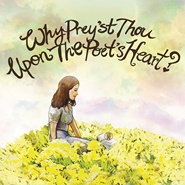

Why Prey'st Thou Upon The Poet's Heart?
============================

|  |  |
| :--: | :-- |
| [ Why Prey'st Thou Upon The Poet's Heart?](https://emumo.xiami.com/album/1264264495) | **艺人**: [樹妮妮Serrini](../index.md) **语种**: 粤语 **唱片公司**: SUI SENG **发行时间**: 2012年12月06日 **专辑类别**: 录音室专辑 **专辑风格**: 粤语流行 Cantopop **播放数**: 814500 **收藏数**: 403 **评论数**: 23  |

## 简介

Serrini是indie folk创作女生，现在还在中大念书。由于非常喜欢写诗和表达自己，Serrini就开始了把melody写进自己的文字，让文字变成歌。Serrini曲风多变，声线轻柔，轻轻的哼唱犹如有人靠近你的耳朵唱一首又一首歌。全部歌都几乎在睡房录的，录音质素很原始，但是每一首都非常诚恳。  
  
这CD由Serrini过去一年写的歌组成，大部分都是她在日留学时期写的。歌曲时而细腻，时而调皮；歌词时而优美动人，时而市井啜核。如果你品味突特，又喜欢清新的indie歌，你绝对可以听听看。

## 曲目

## 评论

|  |  |  |
| :-- | :-- | :-- |
|  [虾米用户](https://emumo.xiami.com/u/2714996) https://www.... 2020-10-13 00:08 赞(1) 踩(0) | 
封面⌒(❤ &amp;omega; ❤）
 |
|  [虾米用户](https://emumo.xiami.com/u/44487048)  2019-11-28 00:19 赞(0) 踩(0) | 
qwq沒了
 |
|  [虾米用户](https://emumo.xiami.com/u/355554280) 我还没想好要写什么... 2019-09-05 10:09 赞(0) 踩(0) | 
这张太完美
 |
|  [虾米用户](https://emumo.xiami.com/u/339191478)   2019-04-10 19:00 赞(0) 踩(0) | 
ღ
 |
|  [虾米用户](https://emumo.xiami.com/u/15270473) 听到喜欢的歌 身体不跟着... 2019-01-17 17:05 赞(0) 踩(0) | 
-
 |
|  [虾米用户](https://emumo.xiami.com/u/23556876) 诗酒趁年华 2018-07-13 06:11 赞(0) 踩(0) | 
好温柔啊哈哈哈哈哈
 |
|  [虾米用户](https://emumo.xiami.com/u/223375008) 但是真诚才是最大本领 2017-12-08 16:05 赞(0) 踩(0) | 
好中意呢张阿
 |
|  [虾米用户](https://emumo.xiami.com/u/223135426)  2017-11-03 16:03 赞(0) 踩(0) | 
(●&amp;mdash;●)
 |
|  [虾米用户](https://emumo.xiami.com/u/247358999) 在荒野上跳舞 2017-10-04 16:06 赞(0) 踩(0) | 

 |
|  [虾米用户](https://emumo.xiami.com/u/42457016) 结束在这吧 2017-10-02 15:47 赞(0) 踩(0) | 

 |
|  [虾米用户](https://emumo.xiami.com/u/5953512) 唯有音乐与食物不可辜负 2017-05-29 04:36 赞(0) 踩(0) | 
天啊 边度仲可以买CD
 |
|  [虾米用户](https://emumo.xiami.com/u/57819034) 我还没想好要写什么... 2017-03-02 11:11 赞(1) 踩(0) | 
即小飞机之后发现serrini 简直是挖到宝
 |
|  [虾米用户](https://emumo.xiami.com/u/87748914) 我的歌 2015-12-24 16:36 赞(0) 踩(0) | 
说不出的感觉
 |
|  [虾米用户](https://emumo.xiami.com/u/11212075) kdkd 2014-05-15 17:34 赞(0) 踩(0) | 
不错
 |
|  [虾米用户](https://emumo.xiami.com/u/22566333) 忘掉開過的花。 2014-03-18 16:52 赞(1) 踩(0) | 
一直在找像my little airport样很独特的歌手。
 |
|  [虾米用户](https://emumo.xiami.com/u/22566333) 忘掉開過的花。 2014-03-18 16:46 赞(0) 踩(0) | 
独立歌手
 |
|  [虾米用户](https://emumo.xiami.com/u/2361171) 音乐响起.又是美好的一天 2013-08-23 14:00 赞(0) 踩(0) | 
有许多钟意的曲目!~
 |
|  [虾米用户](https://emumo.xiami.com/u/6507607) 请把我的尸体埋在音乐里。 2013-08-23 05:20 赞(0) 踩(0) | 
五星。虽然是很简单的调子，但很耐听。这种音质我还蛮爱的
 |
|  [虾米用户](https://emumo.xiami.com/u/3779854) Life is goon 2013-06-09 13:43 赞(0) 踩(0) | 
贴近生活的歌曲。
 |
|  [虾米用户](https://emumo.xiami.com/u/3479064)  2013-06-09 00:09 赞(0) 踩(0) | 
喜欢另类的粤语音乐
 |
|  [虾米用户](https://emumo.xiami.com/u/1108237)  2013-06-01 09:26 赞(0) 踩(0) | 
竟然有喎
 |
|  [虾米用户](https://emumo.xiami.com/u/4769257)  2013-03-28 21:46 赞(3) 踩(0) | 
有點my little airport ,有點the pancakes,有點小清新，又點重口味。簡單講就係very骨啦
 |
|  [虾米用户](https://emumo.xiami.com/u/220719) 自知不自見，自愛不自貴 2013-03-26 12:27 赞(1) 踩(0) | 
Serrunia真是太頑皮了~~~
 |
