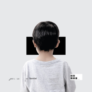

粉碎糖果屋
============================

|  |  |
| :--: | :-- |
| [ 粉碎糖果屋](https://emumo.xiami.com/album/5021389039) | **艺人**: [樹妮妮Serrini](../index.md) **语种**: 粤语 **唱片公司**: StreetVoice, Frenzi Music Limited **发行时间**: 2020年09月04日 **专辑类别**: EP, 单曲 **专辑风格**: 粤语流行 Cantopop, 独立流行 Indie Pop **播放数**: 15214 **收藏数**: 13 **评论数**: 11  |

## 简介

被糖果屋困著的少年人啊！能在糖衣美好下提醒你不忘逃走的，大概就是對世界的好奇。

當美好風景未看夠、新天地尚未建立，天空飛鳥花草都會大聲呼喚你要「粉碎糖果屋」出走啊！

以《糖果屋》童話故事為基調，per se 最新魔幻旅途作品更進一步探討「試煉」的課題。

逃亡以後，人生路上仍然荊棘滿途不減；絆倒人的可怕勢力一直存在，少年人只能一直進化，堅持下去才有盼望。

歌曲中段出現有趣的情節逆轉，以為已經自由的少年人走到平靜青草溪水邊休息，又突然遇到巫女（Serrini）出現，是恐嚇或試煉？森林裡的危機未曾解除，但伴隨旋律律動和豐富的編曲，大家似乎已一起親歷過少年累積「經驗值」的跌宕。

## 曲目

## 评论

|  |  |  |
| :-- | :-- | :-- |
|  [虾米用户](https://emumo.xiami.com/u/16206377) rabbit_❀moon 2020-10-05 21:38 赞(0) 踩(0) | 
这首感觉我听着有些乱.差点男女声没分太清.还是喜欢无穷那样的配合.风格还是不变的
 |
|  [虾米用户](https://emumo.xiami.com/u/45804376) 冻  还有心底一片热  2020-09-14 00:51 赞(0) 踩(0) | 
有机会就去听live
 |
|  [虾米用户](https://emumo.xiami.com/u/24430897) HAVE FUN 2020-09-07 23:51 赞(0) 踩(0) | 
几有意思
 |
|  [虾米用户](https://emumo.xiami.com/u/444089038)  2020-09-04 19:36 赞(0) 踩(0) | 
感覺都差不多？
 |
|  [虾米用户](https://emumo.xiami.com/u/31531934) 恋の道に近道はない 2020-09-04 15:59 赞(0) 踩(0) | 

 |
|  [虾米用户](https://emumo.xiami.com/u/42963872) 我还没想好要写什么... 2020-09-04 13:56 赞(0) 踩(0) | 
～
 |
|  [虾米用户](https://emumo.xiami.com/u/38661467)   2020-09-04 13:24 赞(0) 踩(0) | 
、
 |
|  [虾米用户](https://emumo.xiami.com/u/243234787) 看，流星～ 2020-09-04 11:58 赞(0) 踩(0) | 
来啦来啦～
 |
|  [虾米用户](https://emumo.xiami.com/u/420627093)  2020-09-04 11:48 赞(0) 踩(0) | 
第三第三
 |
|  [虾米用户](https://emumo.xiami.com/u/24968228)  2020-09-04 00:21 赞(0) 踩(0) | 
第一个评分，必须给满分
 |
|  [虾米用户](https://emumo.xiami.com/u/3553665) wyy: LESLIE-... 2020-09-04 00:00 赞(0) 踩(0) | 
♡
 |
