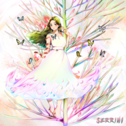
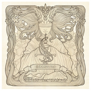
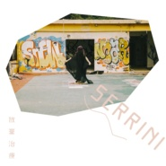

樹妮妮Serrini
============================

|  |  |
| :--: | :-- |
| [ 樹妮妮Serrini](https://i.xiami.com/serrini) | **地区**: China 中国大陆 **风格**: 独立流行 Indie Pop, 文雅流行 Sophisti Pop, 粤语流行 Cantopop **播放数**: 5518377 **粉丝数**: 7865 **评论数**: 225  |

## 档案

SERRINI 是一個蠻奇怪的唱作人，高產如母豬。

## 专辑

| 名称 | 语种 | 唱片公司 | 发行时间 | 专辑类别 | 专辑风格 |
| :--: | :-- | :-- | :-- | :-- | :-- |
| [ 要做更坏的事](./albums/5022143167.md) | 国语 | 索雅音乐 | 2020年12月11日 | EP, 单曲 | 国语流行 Mandarin Pop |
| [ ~旋转with me*](./albums/5021769247.md) | 粤语 | 索雅音乐 | 2020年10月28日 | EP, 单曲 | 粤语流行 Cantopop |
| [ 粉碎糖果屋](./albums/5021389039.md) | 粤语 | StreetVoice, Frenzi Music Limited | 2020年09月04日 | EP, 单曲 | 粤语流行 Cantopop, 独立流行 Indie Pop |
| [ 离原](./albums/5021342392.md) | 国语 | 索雅音乐 | 2020年08月26日 | EP, 单曲 | 国语流行 Mandarin Pop |
| [ 越活越惹祸](./albums/5021187970.md) | 国语 | 索雅音乐 | 2020年07月31日 | EP, 单曲 | 国语流行 Mandarin Pop |
| [ 网络安全隐患 (19841125电台录音) [INK Remix]](./albums/5021154003.md) | 国语 | 索雅音乐 | 2020年07月24日 | EP, 单曲 | 国语流行 Mandarin Pop |
| [ 网络安全隐患](./albums/5020849888.md) | 国语 | 索雅音乐 | 2020年06月15日 | EP, 单曲 | 国语流行 Mandarin Pop |
| [ Diamond Mine♡](./albums/2105782996.md) | 粤语 | 独立发行 | 2020年01月31日 | EP, 单曲 | 阳光流行 Sunshine Pop, 独立民谣 Indie Folk |
| [ 天雷](./albums/2105317057.md) | 粤语 |  | 2019年10月14日 | EP, 单曲 | 粤语流行 Cantopop |
| [ 是你呀, it's you.](./albums/2105315820.md) | 国语 |  | 2019年10月14日 | EP, 单曲 | 国语流行 Mandarin Pop, 民谣流行 Folk Pop |
| [ 邪童謠/Songs of Experience](./albums/2104724418.md) | 粤语 | 独立发行 | 2019年04月04日 | 录音室专辑 | 电子民谣 Folktronica, 女巫浩室 Witch House, 粤语流行 Cantopop |
| [ 靜謐神林/Forest](./albums/2104732201.md) | 粤语 |  | 2019年04月01日 | EP, 单曲 | 华语唱作人 Chinese Singer-Songwriter, 粤语流行 Cantopop, 独立民谣 Indie Folk |
| [ 海妖/Sirens](./albums/2104669948.md) | 粤语 |  | 2019年03月21日 | EP, 单曲 | 迷幻流行 Psychedelic Pop |
| [ 成為/Becoming](./albums/2104649522.md) | 粤语 | 独立发行 | 2019年03月08日 | EP, 单曲 | 电音流行 Electropop, 粤语流行 Cantopop, 独立流行 Indie Pop |
| [ 趣致的响铃](./albums/2104655455.md) | 英语 | Love Da Records | 2018年04月23日 | EP, 单曲 |  |
| [ ～趣致的响铃～Drunk Text Me](./albums/2103666181.md) | 粤语 | 独立发行 | 2018年04月01日 | EP, 单曲 | 粤语流行 Cantopop, 华语唱作人 Chinese Singer-Songwriter |
| [ Don't Text HimSerrini 17曲全创作概念大碟](./albums/2102973446.md) | 粤语 | 独立发行 | 2017年12月13日 | 录音室专辑 | 粤语流行 Cantopop, 流行 Pop, 独立民谣 Indie Folk |
| [ 闪闪发亮Serrini](./albums/2103667258.md) | 粤语 | 独立发行 | 2017年07月05日 | EP, 单曲 | 粤语流行 Cantopop |
| [ 放弃治疗](./albums/2103514357.md) | 粤语 | 独立发行 | 2017年05月11日 | EP, 单曲 | 粤语流行 Cantopop, 华语唱作人 Chinese Singer-Songwriter |
| [ GTB](./albums/2103667260.md) | 粤语 |  | 2017年04月28日 | 合集, 杂锦 | 粤语流行 Cantopop |
| [ 油尖旺金毛玲](./albums/2102410694.md) | 粤语 | 独立发行 | 2016年10月14日 | EP, 单曲 | 粤语流行 Cantopop |
| [ Too Earthly Ye Are For My Sport](./albums/797008655.md) | 粤语 | SUI SENG | 2014年04月03日 | 录音室专辑 | 粤语流行 Cantopop |
| [ Why Prey'st Thou Upon The Poet's Heart?](./albums/1264264495.md) | 粤语 | SUI SENG | 2012年12月06日 | 录音室专辑 | 粤语流行 Cantopop |
| [ 請小心車門](./albums/1307825079.md) | 粤语 | StreetVoice | 2011年09月01日 | 录音室专辑 | 流行 Pop, 粤语流行 Cantopop |

## 评论

|  |  |  |
| :-- | :-- | :-- |
|  [虾米用户](https://emumo.xiami.com/u/431586724) 我还没想好要写什么... 2020-12-10 22:09 赞(0) 踩(0) | 
E條女搞唱乜9？啊哈哈哈哈！真係好中意你啊！
 |
|  [虾米用户](https://emumo.xiami.com/u/7888098) 吃 2020-11-30 11:20 赞(0) 踩(0) | 
高產如母豬？？？？？
 |
|  [虾米用户](https://emumo.xiami.com/u/270391073)  2020-10-28 01:15 赞(0) 踩(0) | 
希望不要再因为不良发言给封禁。喜欢你的声音是在刺客伍六七的片尾曲。
 |
|  [虾米用户](https://emumo.xiami.com/u/4337621) 我还没想好要写什么... 2020-10-16 08:26 赞(0) 踩(0) | 
坐等旋轉with me
 |
|  [虾米用户](https://emumo.xiami.com/u/4337621) 我还没想好要写什么... 2020-10-07 04:57 赞(0) 踩(0) | 
越聽越上癮
 |
|  [虾米用户](https://emumo.xiami.com/u/47810914) 爱听歌 2020-09-27 09:11 赞(1) 踩(0) | 
mami
 |
|  [虾米用户](https://emumo.xiami.com/u/408409486)  2020-08-11 00:25 赞(1) 踩(0) | 
希望继续高产
 |
|  [虾米用户](https://emumo.xiami.com/u/102675082)   2020-07-30 14:31 赞(2) 踩(0) | 
妮这个主页是怎么回事哈哈哈哈哈哈
 |
|  [虾米用户](https://emumo.xiami.com/u/4817647) U2 2020-07-18 09:39 赞(3) 踩(0) | 
我们需要包容不同的声音，希望有些人可以记住。
 |
|  [虾米用户](https://emumo.xiami.com/u/44132236) 比起好好告别 人们更擅长... 2020-07-06 12:06 赞(3) 踩(0) | 
如果连不同的声音都无法忍受  想想那句 &amp;ldquo;不同意你说的每一字 但誓死捍卫你说话的权利～&amp;rdquo; ...
 |
|  [虾米用户](https://emumo.xiami.com/u/376761384) 四季 2020-05-29 08:42 赞(1) 踩(0) | 
好喜欢
 |
|  [虾米用户](https://emumo.xiami.com/u/252346779) #沖繩流浪貓 2020-05-23 19:30 赞(2) 踩(0) | 
啊安安大使
 |
|  [虾米用户](https://emumo.xiami.com/u/231880743)  2020-05-15 18:43 赞(0) 踩(0) | 
想了解你更多(&amp;acute;-&amp;omega;-`)
 |
|  [虾米用户](https://emumo.xiami.com/u/5675424)  2020-05-09 09:04 赞(0) 踩(0) | 
几时黎广州开唱 
 |
|  [虾米用户](https://emumo.xiami.com/u/292811449) 好奇怪 2020-05-04 22:09 赞(0) 踩(0) | 
love you  
 |
|  [虾米用户](https://emumo.xiami.com/u/442513098) 我还没想好要写什么... 2020-04-25 20:36 赞(0) 踩(0) | 
i love you。 
 |
|  [虾米用户](https://emumo.xiami.com/u/442361577)  2020-04-20 02:35 赞(3) 踩(0) | 
希望可以出一些好像&amp;quot;叮叮叮叮叮&amp;quot;这样意境辽阔，开朗的歌曲，特别喜欢里面那句：&amp;quot;小岛慢慢横跨，海风吹都不怕&amp;quot;
 |
|  [虾米用户](https://emumo.xiami.com/u/5708413) 音乐是个好东西 2020-03-30 22:49 赞(2) 踩(0) | 
高产如母猪什么鬼～她的歌好好听啊
 |
|  [虾米用户](https://emumo.xiami.com/u/252346779) #沖繩流浪貓 2020-03-27 12:26 赞(0) 踩(0) | 
挂住你！！！
 |
|  [虾米用户](https://emumo.xiami.com/u/244031591) 我想可以做朋友 2020-03-08 15:31 赞(0) 踩(0) | 
3月8號發表一首新歌for my shisters &amp;amp;lt;3
 |
|  [虾米用户](https://emumo.xiami.com/u/334094308)  2020-01-31 12:32 赞(0) 踩(0) | 
来了妮~爱你妮~么么么么么么么
 |
|  [虾米用户](https://emumo.xiami.com/u/341676933) 昏天暗地，淡忘时分 2020-01-11 19:57 赞(2) 踩(0) | 
“在这个荒诞的世界，我们只需要忠于自己所爱的人”，加油！
 |
|  [虾米用户](https://emumo.xiami.com/u/16773772) 简单爱你心所爱 2019-12-23 09:46 赞(2) 踩(0) | 
这种声音不就是好声音吗 
 |
|  [虾米用户](https://emumo.xiami.com/u/9156809)  2019-12-20 22:46 赞(21) 踩(0) | 
“希望所有人都能被温柔、平等地对待，因为有自由，才有好的艺术。”  加油哦
 |
|  [虾米用户](https://emumo.xiami.com/u/306389937) 粤语歌没有世界末日 2019-12-10 22:00 赞(4) 踩(0) | 
很特别的歌，但是你有你的选择，我有我的选择。
 |
|  [虾米用户](https://emumo.xiami.com/u/142824606) We are one. 2019-11-25 00:52 赞(3) 踩(0) | 
听说了，太遗憾了，再见了。
 |
|  [虾米用户](https://emumo.xiami.com/u/103123510) 今宵多珍重 2019-11-24 16:10 赞(0) 踩(0) | 
特意過來了解
 |
|  [虾米用户](https://emumo.xiami.com/u/142824606) We are one. 2019-11-23 23:21 赞(1) 踩(0) | 
今天看刺客伍六七刷到你的歌了!!!!超好听!!!!虾米什么时候出啊!!!
 |
|  [虾米用户](https://emumo.xiami.com/u/330523715)  2019-11-23 22:20 赞(3) 踩(0) | 
再也不见
 |
|  [虾米用户](https://emumo.xiami.com/u/330523715)  2019-11-23 22:20 赞(2) 踩(0) | 
再见
 |
|  [虾米用户](https://emumo.xiami.com/u/252346779) #沖繩流浪貓 2019-11-23 19:57 赞(2) 踩(0) | 
聽歌便可 其他話咽在肚子里
 |
| ⇒ |  [虾米用户](https://emumo.xiami.com/u/306389937) 粤语歌没有世界末日 2019-12-10 22:01 赞(0) 踩(0) | 
你怎么不叫她把话也咽在肚子里阿？
 |
| ⇒ |  [虾米用户](https://emumo.xiami.com/u/252346779) #沖繩流浪貓 2019-12-15 20:36 赞(0) 踩(0) | 
<q><b>鼻鼻虫虫O说：</b></q>
 |
| ⇒ |  [虾米用户](https://emumo.xiami.com/u/7235001) yoyoyo 2020-03-09 19:06 赞(0) 踩(0) | 
<q><b>陳可樂说：</b></q>
 |
|  [虾米用户](https://emumo.xiami.com/u/6531780) 想要变成你 2019-11-18 22:42 赞(3) 踩(0) | 
呜 再见 你人还是蛮可爱的
 |
|  [虾米用户](https://emumo.xiami.com/u/111537292) 我还没想好要写什么... 2019-11-17 18:19 赞(0) 踩(0) | 
内容已删除
 |
| ⇒ |  [虾米用户](https://emumo.xiami.com/u/6791553)   2019-11-17 19:31 赞(0) 踩(0) | 
<q><b>说：</b></q>
 |
|  [虾米用户](https://emumo.xiami.com/u/6791553)   2019-11-17 16:36 赞(12) 踩(0) | 
内容已删除
 |
| ⇒ |  [虾米用户](https://emumo.xiami.com/u/43058445)  2020-01-26 19:16 赞(0) 踩(0) | 
兄弟她说什么了，，没看到呀，我从567过来不太清楚呀
 |
| ⇒ |  [虾米用户](https://emumo.xiami.com/u/83801604) 原來我非不快樂 2020-02-26 10:33 赞(0) 踩(0) | 
<q><b>songhws说：</b></q>
 |
|  [虾米用户](https://emumo.xiami.com/u/35668527) 停下時光，靜止衰老。 2019-11-17 14:16 赞(2) 踩(0) | 
请大家火速下载
 |
|  [虾米用户](https://emumo.xiami.com/u/13735496) 青瓜過大海。 2019-11-17 12:13 赞(3) 踩(0) | 
以防万一，先把歌都下载了吧。唉。
 |
|  [虾米用户](https://emumo.xiami.com/u/403942799)  2019-10-19 22:51 赞(1) 踩(0) | 
10月27号上海站，不见不散。
 |
|  [虾米用户](https://emumo.xiami.com/u/34360863)   2019-10-15 17:33 赞(2) 踩(0) | 
高产如母猪可还行hhhh
 |
|  [虾米用户](https://emumo.xiami.com/u/42963872) 我还没想好要写什么... 2019-10-14 09:04 赞(2) 踩(0) | 
Serrini树妮妮钻石矿2019秋冬巡演  10.25 杭州 MAO 10.27 上海 Modernsky Lab  11.02 西安 MAO 11.03 北京 MAO  11.09 重庆 寅派动力 11.10 成都 NU SPACE  11.16 厦门 星巢越中心 11.17 南京 欧拉艺术空间  11.29 长沙 红咖俱乐部 12.01 武汉 L7 Livehouse  12.07 广州 TU凸 12.08 广州 TU凸 (下午场)
 |
|  [虾米用户](https://emumo.xiami.com/u/9299876) 反正想要的都不会实现！ 2019-09-21 19:09 赞(0) 踩(0) | 
声音我的菜 
 |
|  [虾米用户](https://emumo.xiami.com/u/429846453)  2019-09-18 12:46 赞(1) 踩(0) | 
妮妮快来成都！！！
 |
|  [虾米用户](https://emumo.xiami.com/u/10147365) 未来，你好！ 2019-08-10 19:27 赞(2) 踩(0) | 
唱得几好，不过就系感觉粤语发音有D怪怪地。点都好啦，支持一下.
 |
|  [虾米用户](https://emumo.xiami.com/u/41839709) 血肉構建你我，理智遺忘一... 2019-08-08 06:37 赞(0) 踩(0) | 
這簡介。。。。。
 |
|  [虾米用户](https://emumo.xiami.com/u/2761156) 活着就要尽兴 2019-08-02 10:31 赞(0) 踩(0) | 
好听
 |
|  [虾米用户](https://emumo.xiami.com/u/39354948)  2019-07-16 08:15 赞(1) 踩(0) | 
呢簡介我鈡意
 |
|  [虾米用户](https://emumo.xiami.com/u/169824892) ROG;BGM 2019-06-26 19:23 赞(0) 踩(0) | 
好听
 |
|  [虾米用户](https://emumo.xiami.com/u/145880020) 那是一个温柔唱歌 温柔生... 2019-06-04 14:33 赞(0) 踩(0) | 
爱你
 |
|  [虾米用户](https://emumo.xiami.com/u/260992790) I'll Be Your... 2019-05-06 03:14 赞(0) 踩(0) | 
〰️
 |
|  [虾米用户](https://emumo.xiami.com/u/662276) 听我故事的歌 2019-05-05 13:59 赞(4) 踩(0) | 
加油，以高产如两头母猪为目标出发！
 |
|  [虾米用户](https://emumo.xiami.com/u/117709258)   2019-04-21 10:46 赞(0) 踩(0) | 
好喜欢
 |
|  [虾米用户](https://emumo.xiami.com/u/342719794)  2019-04-17 11:42 赞(12) 踩(0) | 
这么好听的声音为何自称高产如母猪。。。。
 |
|  [虾米用户](https://emumo.xiami.com/u/44006970) ✨  2019-04-11 17:15 赞(0) 踩(0) | 
好可愛
 |
|  [虾米用户](https://emumo.xiami.com/u/123246788) Music is my ... 2019-04-08 15:08 赞(2) 踩(0) | 
好听！ 
 |
|  [虾米用户](https://emumo.xiami.com/u/173928734) Best wishes 2019-04-07 13:18 赞(0) 踩(0) | 
这声音让我陶醉
 |
|  [虾米用户](https://emumo.xiami.com/u/42870241) 百無禁忌 2019-04-05 19:17 赞(1) 踩(0) | 
:)
 |
|  [虾米用户](https://emumo.xiami.com/u/346165752)  2019-04-03 22:34 赞(0) 踩(0) | 

 |
|  [虾米用户](https://emumo.xiami.com/u/355554280) 我还没想好要写什么... 2019-03-31 22:59 赞(1) 踩(0) | 
新時代的bob dylan 
 |
|  [虾米用户](https://emumo.xiami.com/u/308136668)   2019-03-26 23:12 赞(0) 踩(0) | 
循环无数次金毛玲，中意
 |
|  [虾米用户](https://emumo.xiami.com/u/195208759)  2019-03-23 00:05 赞(4) 踩(0) | 
写简介的人，你给我出来
 |
|  [虾米用户](https://emumo.xiami.com/u/219128193) 猜猜我的占有欲有多可怕_ 2019-03-22 14:39 赞(2) 踩(0) | 
你很好听
 |
|  [虾米用户](https://emumo.xiami.com/u/2255079) 靡不有初，鲜克有终。 2019-03-21 13:02 赞(1) 踩(0) | 
简介是怎么肥事！
 |
|  [虾米用户](https://emumo.xiami.com/u/377348919) 是你 2019-03-20 23:06 赞(1) 踩(0) | 
求求四月四号快点来临
 |
|  [虾米用户](https://emumo.xiami.com/u/243327035)  2019-03-19 23:48 赞(4) 踩(0) | 
高产如母猪哈哈哈哈哈哈哈哈哈哈哈 自己改的简介吗
 |
| ⇒ |  [虾米用户](https://emumo.xiami.com/u/243327035)  2019-04-04 00:42 赞(0) 踩(0) | 
傻妮妮赞了我哈哈哈哈哈哈哈
 |
|  [虾米用户](https://emumo.xiami.com/u/269984852) 好好生活 2019-03-17 13:18 赞(1) 踩(0) | 
你的声音好特别啊
 |
|  [虾米用户](https://emumo.xiami.com/u/23227633)   2019-03-15 12:24 赞(1) 踩(0) | 
简介为什么要这么说自己呢 
 |
|  [虾米用户](https://emumo.xiami.com/u/34971965) 如果说一朵花很美/那么我... 2019-03-09 18:20 赞(2) 踩(0) | 
哈哈哈哈哈哈这是什么奇怪简介
 |
|  [虾米用户](https://emumo.xiami.com/u/414205785)  2019-03-08 00:41 赞(1) 踩(0) | 
啊啊啊啊啊啊啊
 |
|  [虾米用户](https://emumo.xiami.com/u/420594774) 逃到浪漫尽头. 2019-03-07 13:11 赞(1) 踩(0) | 
3月8快点来吧！！
 |
|  [虾米用户](https://emumo.xiami.com/u/405851040)  2019-03-07 11:35 赞(1) 踩(0) | 
坐等新歌
 |
|  [虾米用户](https://emumo.xiami.com/u/420608259) 我还没想好要写什么... 2019-03-07 09:20 赞(1) 踩(0) | 
mami你的babe下好虾米来找你啦~
 |
|  [虾米用户](https://emumo.xiami.com/u/52447611) 无需要快乐 反正你一早枯... 2019-03-07 00:08 赞(0) 踩(0) | 
激动的以为今天3/8
 |
|  [虾米用户](https://emumo.xiami.com/u/346165752)  2019-03-05 09:57 赞(0) 踩(0) | 
么
 |
|  [虾米用户](https://emumo.xiami.com/u/42963872) 我还没想好要写什么... 2019-03-04 12:18 赞(1) 踩(0) | 
有新歌哦耶!
 |
|  [虾米用户](https://emumo.xiami.com/u/12728433) 蓝联机票全国谈生意 2019-03-04 09:34 赞(2) 踩(0) | 
3月8號發表一首新歌for my shisters
 |
|  [虾米用户](https://emumo.xiami.com/u/373318594)  2019-02-15 22:48 赞(0) 踩(0) | 
喜欢
 |
|  [虾米用户](https://emumo.xiami.com/u/376792846)  2019-02-15 15:57 赞(1) 踩(0) | 
刺客五六七过来的，好听
 |
|  [虾米用户](https://emumo.xiami.com/u/38752771)   2019-02-11 22:57 赞(0) 踩(0) | 
校友好！！
 |
|  [虾米用户](https://emumo.xiami.com/u/282013407) 回归，暂停，出发！ 2019-01-28 20:11 赞(1) 踩(0) | 
好钟意！你声音好好听
 |
|  [虾米用户](https://emumo.xiami.com/u/405121325)  2019-01-14 22:02 赞(0) 踩(0) | 
您很可爱 我很喜欢
 |
|  [虾米用户](https://emumo.xiami.com/u/410768529)  2019-01-07 23:37 赞(0) 踩(0) | 
你这颗大钻石迟早会被发现的！！！我的妮妮呀！
 |
|  [虾米用户](https://emumo.xiami.com/u/47494497) 李志、陈升，“虾米也没有... 2019-01-07 11:46 赞(0) 踩(0) | 
是一个人吗
 |
|  [虾米用户](https://emumo.xiami.com/u/55189097) 我的朋友在远方 2019-01-02 08:53 赞(0) 踩(0) | 

 |
|  [虾米用户](https://emumo.xiami.com/u/52447611) 无需要快乐 反正你一早枯... 2018-12-22 04:47 赞(0) 踩(0) | 
期待新歌
 |
|  [虾米用户](https://emumo.xiami.com/u/349113680)  2018-12-18 18:28 赞(0) 踩(0) | 
又柔又漂
 |
|  [虾米用户](https://emumo.xiami.com/u/50684942) 你知道 2018-12-16 23:32 赞(0) 踩(0) | 
今天的现场好棒！还被树妮妮摸头了！
 |
|  [虾米用户](https://emumo.xiami.com/u/50684942) 你知道 2018-12-06 00:53 赞(1) 踩(0) | 
今天定了票！月中苏州见呀！
 |
|  [虾米用户](https://emumo.xiami.com/u/121910914) 我想好好睡个觉 2018-12-05 01:54 赞(0) 踩(0) | 
i
 |
|  [虾米用户](https://emumo.xiami.com/u/87244190)  2018-11-01 01:13 赞(2) 踩(0) | 
深圳草莓见
 |
|  [虾米用户](https://emumo.xiami.com/u/16464180)  2018-10-30 23:12 赞(0) 踩(0) | 
 
 |
|  [虾米用户](https://emumo.xiami.com/u/71178106) 塵世や 酒、風呂を抜け ... 2018-10-25 01:49 赞(1) 踩(0) | 
♡
 |
|  [虾米用户](https://emumo.xiami.com/u/266425770) 好音乐能带来好心情。 2018-10-02 20:28 赞(1) 踩(0) | 
唱的很不错
 |
|  [虾米用户](https://emumo.xiami.com/u/186437644) 任他们多漂亮 未及你矜贵... 2018-09-28 22:08 赞(1) 踩(0) | 
会把大香港精神发上来吗？？？？？啊虾米没有地方可以听到这张专！真的！
 |
|  [虾米用户](https://emumo.xiami.com/u/49542305) 我还没想好要写什么... 2018-09-28 18:59 赞(0) 踩(0) | 
诶 虾米终于有啦
 |
|  [虾米用户](https://emumo.xiami.com/u/186437644) 任他们多漂亮 未及你矜贵... 2018-09-18 20:15 赞(2) 踩(0) | 
啊啊啊啊啊啊啊啊啊大香港精神哦？？？？快上吧！！！
 |
|  [虾米用户](https://emumo.xiami.com/u/30402213)  2018-09-17 20:49 赞(0) 踩(0) | 
放嘿滋溜
 |
|  [虾米用户](https://emumo.xiami.com/u/341190355) 不做大魔王 不要上战场  2018-09-03 14:31 赞(0) 踩(0) | 
可真的太好听惹
 |
|  [虾米用户](https://emumo.xiami.com/u/226260248)  2018-09-03 12:29 赞(2) 踩(0) | 
梁嘉茵，你嚟未啊！
 |
|  [虾米用户](https://emumo.xiami.com/u/34261743)  2018-09-03 01:13 赞(1) 踩(0) | 
hi serrini 
 |
|  [虾米用户](https://emumo.xiami.com/u/335613618) 单恋~ 2018-08-24 09:08 赞(0) 踩(0) | 
喜欢~
 |
|  [虾米用户](https://emumo.xiami.com/u/1886864) Where words ... 2018-08-22 01:34 赞(0) 踩(0) | 
好爱她
 |
|  [虾米用户](https://emumo.xiami.com/u/111193) 微信号toogo1 2018-08-18 14:54 赞(0) 踩(0) | 
中文名？看不到自己的评论。怎么回事？
 |
|  [虾米用户](https://emumo.xiami.com/u/301392053)  2018-08-08 11:52 赞(0) 踩(0) | 
想买实体专辑，哪里有买啊?
 |
|  [虾米用户](https://emumo.xiami.com/u/12683417) 谢谢虾米，再见。 2018-06-23 13:39 赞(0) 踩(0) | 
出张今天北京场票 给钱就卖
 |
|  [虾米用户](https://emumo.xiami.com/u/375221072) 精神和物质，都是数学问题... 2018-06-20 23:05 赞(0) 踩(0) | 
非常有特点和好听，慵懒不是慵懒，舒缓不是舒缓，很舒服的感觉，丝丝缕缕。
 |
|  [虾米用户](https://emumo.xiami.com/u/35398542) 公众号：湾辟斯 2018-06-10 16:55 赞(0) 踩(0) | 
今晚school见
 |
|  [虾米用户](https://emumo.xiami.com/u/201545455)   2018-04-29 13:20 赞(1) 踩(0) | 
萨妮妮会来上海吗 好喜欢你
 |
|  [虾米用户](https://emumo.xiami.com/u/6076438) 起身見頭暈，行路打倒褪。... 2018-04-11 02:52 赞(0) 踩(0) | 
会城有个金毛玲
 |
|  [虾米用户](https://emumo.xiami.com/u/332693721) 今天有個不是但願的願望 2018-04-06 04:04 赞(0) 踩(0) | 
雖然聽歌的時候心情不是很好 但是被翻牌了還是蠻開心的
 |
|  [虾米用户](https://emumo.xiami.com/u/10310498)   2018-04-02 02:31 赞(0) 踩(0) | 
～
 |
|  [虾米用户](https://emumo.xiami.com/u/225398288)  2018-04-01 01:50 赞(0) 踩(0) | 
听你的歌心情很好 
 |
|  [虾米用户](https://emumo.xiami.com/u/4230459) 嘿 2018-03-31 17:27 赞(0) 踩(0) | 
鍾意哩種風格～
 |
|  [虾米用户](https://emumo.xiami.com/u/45760297)  2018-03-23 16:29 赞(2) 踩(0) | 
好掂！我开公司就签你！
 |
|  [虾米用户](https://emumo.xiami.com/u/86185794) 爱好港乐 杨千嬅脑残粉。... 2018-03-12 08:57 赞(0) 踩(0) | 
离开你第二天 想你
 |
|  [虾米用户](https://emumo.xiami.com/u/10079158) 我还没想好要写什么... 2018-03-08 11:57 赞(2) 踩(0) | 
me真的好喜欢傻妮妮说话 真的很cute
 |
|  [虾米用户](https://emumo.xiami.com/u/12446636) Dominique.le... 2018-03-02 14:37 赞(1) 踩(0) | 
听晚见
 |
|  [虾米用户](https://emumo.xiami.com/u/315355001) 我喜欢赫思嘉那句：“无论... 2018-02-16 16:43 赞(0) 踩(0) | 

 |
|  [虾米用户](https://emumo.xiami.com/u/45072803)  2018-02-15 08:26 赞(0) 踩(0) | 
油尖旺金毛玲
 |
|  [虾米用户](https://emumo.xiami.com/u/31811417) 我还没想好要写什么... 2018-02-09 01:53 赞(0) 踩(0) | 
代朋友出3月4号上海场票一张
 |
|  [虾米用户](https://emumo.xiami.com/u/90094694) 喜欢听比自己老很多的粤语... 2018-01-29 00:04 赞(0) 踩(0) | 
一直无限循环奶茶歌
 |
|  [虾米用户](https://emumo.xiami.com/u/272831509)  2018-01-27 16:49 赞(3) 踩(0) | 
da ga hou 我系油尖旺金毛玲
 |
|  [虾米用户](https://emumo.xiami.com/u/233819230) 我还没想好要写什么... 2018-01-09 18:13 赞(1) 踩(0) | 
好鍾意你把聲 加油
 |
|  [虾米用户](https://emumo.xiami.com/u/13917752) . 2017-12-30 19:27 赞(0) 踩(0) | 
T
 |
|  [虾米用户](https://emumo.xiami.com/u/7604768) 关爱小学生… 2017-12-13 13:47 赞(0) 踩(0) | 
要火
 |
|  [虾米用户](https://emumo.xiami.com/u/125089920) 找到北方啦 2017-12-08 00:39 赞(0) 踩(0) | 
 
 |
|  [虾米用户](https://emumo.xiami.com/u/39920136)   2017-12-04 21:25 赞(4) 踩(0) | 
中毒 油尖旺金毛玲
 |
|  [虾米用户](https://emumo.xiami.com/u/14626915) .  2017-12-03 13:04 赞(0) 踩(0) | 
&amp;pound;
 |
|  [虾米用户](https://emumo.xiami.com/u/10079158) 我还没想好要写什么... 2017-11-27 04:38 赞(0) 踩(0) | 
好愛
 |
|  [虾米用户](https://emumo.xiami.com/u/42031592)  2017-11-26 15:37 赞(0) 踩(0) | 
波霸奶茶好搞笑
 |
|  [虾米用户](https://emumo.xiami.com/u/50020777) 我还没想好要写什么... 2017-11-15 10:07 赞(0) 踩(0) | 
可爱可爱可爱！！
 |
|  [虾米用户](https://emumo.xiami.com/u/45810215) 似木头似石头的话得到注意... 2017-10-24 16:15 赞(1) 踩(0) | 
找到宝了
 |
|  [虾米用户](https://emumo.xiami.com/u/53590447) 梦归隐 2017-10-16 13:32 赞(0) 踩(0) | 
我的宝贝
 |
|  [虾米用户](https://emumo.xiami.com/u/247358999) 在荒野上跳舞 2017-10-06 08:19 赞(0) 踩(0) | 
爱你
 |
|  [虾米用户](https://emumo.xiami.com/u/125089920) 找到北方啦 2017-09-16 13:24 赞(0) 踩(0) | 
加油啊哈哈哈
 |
|  [虾米用户](https://emumo.xiami.com/u/319600695)  2017-09-07 02:14 赞(1) 踩(0) | 
10.14广州sd等你啦莎妮猪
 |
| ⇒ |  [虾米用户](https://emumo.xiami.com/u/16459711)   2017-09-15 19:42 赞(0) 踩(0) | 
你好，为何我在网上没查到相关信息？
 |
|  [虾米用户](https://emumo.xiami.com/u/43418234) ^_−☆ 2017-09-01 13:19 赞(0) 踩(0) | 

 |
|  [虾米用户](https://emumo.xiami.com/u/115346238) 我还没想好要写什么... 2017-08-25 20:30 赞(0) 踩(0) | 
&amp;hellip;&amp;hellip;
 |
|  [虾米用户](https://emumo.xiami.com/u/2418238) weibo: @尤米口 2017-08-25 06:42 赞(0) 踩(0) | 
(ᵒ̤̑ ₀̑ ᵒ̤̑)
 |
|  [虾米用户](https://emumo.xiami.com/u/12577095) 这家伙很聪明，留下的东西... 2017-07-18 15:07 赞(2) 踩(0) | 
我的志愿也是做个阔太
 |
| ⇒ |  [虾米用户](https://emumo.xiami.com/u/49714380)  2017-07-25 12:58 赞(0) 踩(0) | 

 |
| ⇒ |  [虾米用户](https://emumo.xiami.com/u/12577095) 这家伙很聪明，留下的东西... 2017-08-09 09:47 赞(0) 踩(0) | 
<q><b>Cyan说：</b></q>
 |
|  [虾米用户](https://emumo.xiami.com/u/54958122) 好听的歌怎么这么多 2017-07-17 14:23 赞(0) 踩(0) | 
很好听
 |
|  [虾米用户](https://emumo.xiami.com/u/28070400)  2017-07-09 18:09 赞(48) 踩(0) | 
serrini 来广州唱歌大家会来吗？
 |
| ⇒ |  [虾米用户](https://emumo.xiami.com/u/323098418)  2018-01-14 22:58 赞(0) 踩(0) | 
黎再讲啦
 |
| ⇒ |  [虾米用户](https://emumo.xiami.com/u/4228451) 886 2018-02-19 21:24 赞(0) 踩(0) | 
<q><b>Fat雯说：</b></q>
 |
| ⇒ |  [虾米用户](https://emumo.xiami.com/u/111193) 微信号toogo1 2018-08-18 14:54 赞(0) 踩(0) | 
她中文名？
 |
|  [虾米用户](https://emumo.xiami.com/u/226777345) 不求不妄，苦乐自当 2017-07-08 07:19 赞(0) 踩(0) | 
听了一年傻妮的歌，继续幸福吧 
 |
|  [虾米用户](https://emumo.xiami.com/u/48006493) 想不起来 2017-07-04 20:33 赞(0) 踩(0) | 
日推发现她的忘鸟也非常好听 
 |
|  [虾米用户](https://emumo.xiami.com/u/11039913) 知音難求~ 2017-06-29 18:21 赞(0) 踩(0) | 
好过瘾~  ♪（＾&amp;forall;＾●）ﾉ
 |
|  [虾米用户](https://emumo.xiami.com/u/248162994) 到此一游 2017-06-26 10:42 赞(1) 踩(0) | 
靠Facebook抒发感情才是意义
 |
|  [虾米用户](https://emumo.xiami.com/u/44165967) 听应该听的音乐，放下不该... 2017-06-24 00:15 赞(1) 踩(0) | 
第一次听金毛玲就被你的唱腔和曲风吸引住了，这几天是中毒模式。加油~
 |
|  [虾米用户](https://emumo.xiami.com/u/40484977)   2017-06-19 13:06 赞(0) 踩(0) | 
好可爱好可爱！
 |
|  [虾米用户](https://emumo.xiami.com/u/46837454) 从来没有念头想爱什么人 2017-06-17 13:32 赞(0) 踩(0) | 
傻妮妮 要继续造歌 一直支持  
 |
|  [虾米用户](https://emumo.xiami.com/u/42457016) 小型歡愉 2017-06-15 09:29 赞(0) 踩(0) | 

 |
|  [虾米用户](https://emumo.xiami.com/u/7556466) 醒醒睡睡 写写画画 2017-06-04 22:08 赞(0) 踩(0) | 
茂利入坑，正！
 |
|  [虾米用户](https://emumo.xiami.com/u/43418234) ^_−☆ 2017-05-31 00:41 赞(0) 踩(0) | 

 |
|  [虾米用户](https://emumo.xiami.com/u/46277360)   2017-05-29 23:41 赞(0) 踩(0) | 

 |
|  [虾米用户](https://emumo.xiami.com/u/5953512) 唯有音乐与食物不可辜负 2017-05-29 03:31 赞(0) 踩(0) | 
盞鬼 率性 希望保持真诚 
 |
|  [虾米用户](https://emumo.xiami.com/u/299901943)  2017-05-28 18:39 赞(0) 踩(0) | 
比心 
 |
|  [虾米用户](https://emumo.xiami.com/u/8629648) 我还没想好要写什么... 2017-05-23 13:26 赞(0) 踩(0) | 
放棄治療可不可以update下
 |
|  [虾米用户](https://emumo.xiami.com/u/49748006) Fly me to th... 2017-05-14 16:51 赞(0) 踩(0) | 
～
 |
|  [虾米用户](https://emumo.xiami.com/u/278510257) 我还没想好要写什么... 2017-04-30 01:36 赞(0) 踩(0) | 
金毛玲过来的 
 |
|  [虾米用户](https://emumo.xiami.com/u/289977829)  2017-04-22 16:58 赞(0) 踩(0) | 
  
 |
|  [虾米用户](https://emumo.xiami.com/u/6076438) 起身見頭暈，行路打倒褪。... 2017-04-21 14:14 赞(0) 踩(0) | 
雞羅友好好味
 |
|  [虾米用户](https://emumo.xiami.com/u/9862335)  2017-03-21 18:00 赞(0) 踩(0) | 
好听
 |
|  [虾米用户](https://emumo.xiami.com/u/7729258)  2017-03-20 23:40 赞(0) 踩(0) | 
******
 |
|  [虾米用户](https://emumo.xiami.com/u/46590738)  2017-03-19 09:12 赞(0) 踩(0) | 
一开口就沉醉
 |
|  [虾米用户](https://emumo.xiami.com/u/3439412) 我还没想好要写什么... 2017-03-17 01:49 赞(0) 踩(0) | 
shit I cried
 |
|  [虾米用户](https://emumo.xiami.com/u/1678193)   2017-03-13 18:44 赞(0) 踩(0) | 
加油哦 很好听
 |
|  [虾米用户](https://emumo.xiami.com/u/226777345) 不求不妄，苦乐自当 2017-02-08 20:55 赞(1) 踩(0) | 
好喜歡你喔 
 |
|  [虾米用户](https://emumo.xiami.com/u/115893390)  2017-02-06 20:16 赞(3) 踩(0) | 
加油！期待更多作品(๑˙ー˙๑)
 |
|  [虾米用户](https://emumo.xiami.com/u/71080310) 接受负面 2017-02-05 14:55 赞(0) 踩(0) | 
金毛玲 我捉住你啦！
 |
|  [虾米用户](https://emumo.xiami.com/u/7399498) I remain in ... 2017-02-04 22:03 赞(1) 踩(0) | 
画风清奇
 |
|  [虾米用户](https://emumo.xiami.com/u/46837454) 从来没有念头想爱什么人 2017-02-04 01:31 赞(0) 踩(0) | 
支持你地！！
 |
|  [虾米用户](https://emumo.xiami.com/u/3096689)  2016-12-16 02:23 赞(0) 踩(0) | 
试问边个无样衰过？仲系康奈尔嘅博士，国语都甘搞野，真系服到贴地
 |
|  [虾米用户](https://emumo.xiami.com/u/3096689)  2016-12-16 01:28 赞(0) 踩(0) | 
好逗…好喜欢
 |
|  [虾米用户](https://emumo.xiami.com/u/8813997)  2016-11-17 14:17 赞(1) 踩(0) | 
好有趣~喜欢
 |
|  [虾米用户](https://emumo.xiami.com/u/219348240) Ashes of tim... 2016-11-03 22:46 赞(0) 踩(0) | 
加油～
 |
|  [虾米用户](https://emumo.xiami.com/u/39079126) 我隐藏我的生活并不代表它... 2016-10-26 10:05 赞(0) 踩(0) | 
莎妮妮加油咩～
 |
|  [虾米用户](https://emumo.xiami.com/u/36057872) 网易/BC: Breat... 2016-10-26 00:13 赞(0) 踩(0) | 
～
 |
|  [虾米用户](https://emumo.xiami.com/u/226048078)  2016-09-14 08:39 赞(0) 踩(0) | 
加油～
 |
|  [虾米用户](https://emumo.xiami.com/u/32804002) 暂无签名~ 2016-07-13 21:33 赞(0) 踩(0) | 
     
 |
| ⇒ |  [虾米用户](https://emumo.xiami.com/u/44165967) 听应该听的音乐，放下不该... 2017-06-24 00:11 赞(0) 踩(0) | 
青峰需要的是男盆友
 |
|  [虾米用户](https://emumo.xiami.com/u/46603129)   2016-05-04 07:58 赞(0) 踩(0) | 
我也喜欢寂寞
 |
|  [虾米用户](https://emumo.xiami.com/u/108150238) 樹木是很重要的 2016-03-17 22:10 赞(315) 踩(0) | 
我刚入驻了虾米音乐人，欢迎大家来我的个人主页，收听我的最新音乐 HAHAHAH
 |
| ⇒ |  [虾米用户](https://emumo.xiami.com/u/83484826) depression 2016-04-05 14:09 赞(0) 踩(0) | 
来网易云啊
 |
| ⇒ |  [虾米用户](https://emumo.xiami.com/u/137763048)   2016-04-09 12:50 赞(0) 踩(0) | 
喜欢你呀
 |
| ⇒ |  [虾米用户](https://emumo.xiami.com/u/8156440) 愛聽歌少女 2016-12-08 18:33 赞(0) 踩(0) | 
好喔～
 |
| ⇒ |  [虾米用户](https://emumo.xiami.com/u/728754) 在歌曲的海洋发现好歌 2017-05-27 11:18 赞(0) 踩(0) | 
作品都很入耳哦！好想识下你啦！要继续加油写更多的好作品哦！n a^o7 !
 |
| ⇒ |  [虾米用户](https://emumo.xiami.com/u/326930884)   2017-09-26 15:28 赞(0) 踩(0) | 
喜欢你Serrini  
 |
| ⇒ |  [虾米用户](https://emumo.xiami.com/u/47970558)  2017-09-27 00:48 赞(0) 踩(0) | 
我
 |
| ⇒ |  [虾米用户](https://emumo.xiami.com/u/47970558)  2017-09-27 00:48 赞(0) 踩(0) | 
《忘鸟》的原名是《忘鸟爱》吗？请问
 |
| ⇒ |  [虾米用户](https://emumo.xiami.com/u/42094656) 我还没想好要写什么... 2017-11-07 18:21 赞(0) 踩(0) | 
哈哈哈 仲记得之前系果壳分享听你唱波霸珍珠奶茶哈哈哈哈
 |
| ⇒ |  [虾米用户](https://emumo.xiami.com/u/10386754) 旅程让我们感到快乐,而不... 2017-11-13 17:36 赞(0) 踩(0) | 
声好听
 |
| ⇒ |  [虾米用户](https://emumo.xiami.com/u/50870966) 用现在 留住如果 2017-12-11 20:08 赞(0) 踩(0) | 
超好听～
 |
| ⇒ |  [虾米用户](https://emumo.xiami.com/u/492360) 失恋不是自杀的借口 继续... 2018-01-12 13:01 赞(0) 踩(0) | 
倒是放歌啊
 |
| ⇒ |  [虾米用户](https://emumo.xiami.com/u/7838822) 自由快乐 2018-02-26 23:23 赞(0) 踩(0) | 
太棒咯 快传新歌！
 |
| ⇒ |  [虾米用户](https://emumo.xiami.com/u/260276914) 顺流 2018-05-19 17:46 赞(0) 踩(0) | 
你好呀，嘿嘿～
 |
| ⇒ |  [虾米用户](https://emumo.xiami.com/u/179523784) 再见了！陪伴了我4年的虾... 2018-08-17 15:04 赞(0) 踩(0) | 
系咪本人啊？
 |
| ⇒ |  [虾米用户](https://emumo.xiami.com/u/111193) 微信号toogo1 2018-08-18 14:53 赞(0) 踩(0) | 
中文名？
 |
| ⇒ |  [虾米用户](https://emumo.xiami.com/u/305841344)  2018-10-27 23:13 赞(0) 踩(0) | 
不错，支持国家取消紫金花旗统一使用五星红旗
 |
| ⇒ |  [虾米用户](https://emumo.xiami.com/u/252346779) #沖繩流浪貓 2019-11-23 19:58 赞(0) 踩(0) | 
粒u 妮  加油
 |
|  [虾米用户](https://emumo.xiami.com/u/4727415) swallowyours... 2016-03-14 23:10 赞(1) 踩(0) | 
入驻
 |
|  [虾米用户](https://emumo.xiami.com/u/289822) 我还没想好要写什么... 2016-03-14 21:48 赞(1) 踩(0) | 
好高兴你入驻啦
 |
|  [虾米用户](https://emumo.xiami.com/u/18583250) 講嘢 2016-01-15 13:33 赞(1) 踩(0) | 

 |
|  [虾米用户](https://emumo.xiami.com/u/4815647) 暂无签名~ 2015-11-21 06:31 赞(1) 踩(0) | 
喜欢你的歌
 |
|  [虾米用户](https://emumo.xiami.com/u/289822) 我还没想好要写什么... 2015-05-16 23:41 赞(1) 踩(0) | 
有么野方法可以支持到你啊？
 |
|  [虾米用户](https://emumo.xiami.com/u/9228402) come up to f... 2015-01-31 01:36 赞(1) 踩(0) | 
归
 |
|  [虾米用户](https://emumo.xiami.com/u/42084512) 以后早点睡   2015-01-08 12:47 赞(1) 踩(0) | 
很喜欢 好可爱
 |
|  [虾米用户](https://emumo.xiami.com/u/5466117)  2014-12-02 03:09 赞(1) 踩(0) | 
@Serrini莎妮妮  快火起来，再多写歌！
 |
|  [虾米用户](https://emumo.xiami.com/u/811739) 清醒的时候从来不是一个感... 2014-10-11 08:15 赞(1) 踩(0) | 
独立小清新
 |
|  [虾米用户](https://emumo.xiami.com/u/3181391) 一期一会 2014-06-25 00:03 赞(2) 踩(0) | 
生日快乐吗
 |
|  [虾米用户](https://emumo.xiami.com/u/36537242)  2014-05-12 23:29 赞(1) 踩(0) | 
serrini的歌很亲近清新
 |
|  [虾米用户](https://emumo.xiami.com/u/268450)  2014-04-08 09:12 赞(1) 踩(0) | 
<a href="http://www.tudou.com/programs/view/Bm6C6R4hZFo/" target="_blank" rel="nofollow noreferrer noopener">http://www.tudou.com/programs/view/Bm6C6R4hZFo/</a> 这首什么歌 有人知道没
 |
| ⇒ |  [虾米用户](https://emumo.xiami.com/u/12576793) 我还没想好要写什么... 2015-02-03 15:00 赞(0) 踩(0) | 
《粟米六粒饭》
 |
|  [虾米用户](https://emumo.xiami.com/u/3374541)  2014-03-12 12:11 赞(1) 踩(0) | 
真正滴小清新~
 |
|  [虾米用户](https://emumo.xiami.com/u/5539174)  2014-01-06 12:31 赞(1) 踩(0) | 
零和深宵小巴好好听!潮文系列嘅片尾曲都系佢唱嘅.好正!
 |
|  [虾米用户](https://emumo.xiami.com/u/3630641) 花开有时、不负春光 2013-09-28 15:03 赞(1) 踩(0) | 
欢快的曲风，上学时候的味道，蛮好。
 |
|  [虾米用户](https://emumo.xiami.com/u/6507607) 请把我的尸体埋在音乐里。 2013-07-25 22:42 赞(1) 踩(0) | 
很喜欢这种小众女歌手，很有自己的感觉
 |
|  [虾米用户](https://emumo.xiami.com/u/220719) 自知不自見，自愛不自貴 2013-03-26 12:34 赞(2) 踩(0) | 
Serrini~~Serrunia~~
 |
