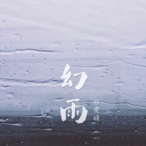

杜婧荧
============================

|  |  |
| :--: | :-- |
| [ 杜婧荧](https://i.xiami.com/windy) | **地区**: China 中国大陆 **风格**: 国语流行 Mandarin Pop, 华语唱作人 Chinese Singer-Songwriter **播放数**: 8322659 **粉丝数**: 1863 **评论数**: 124  |

## 档案

杜婧荧，原名杜雯媞，内地华语乐坛知名唱作人。集演唱、作词作曲、制作为一身。当下热门影视OST作曲及制作人。 
多数人是通过著名的网络游戏《魔兽世界》同人动漫《我叫MT》中一首由她作曲并演唱的《雪》认识到她。由2010年制作并推出首张个人原创专辑《孤独的乐章》获得众多业内人士一致好评与各地歌迷的支持。2016年推出《雪》独唱版，随后年底发表单曲《幻雨》获业内一致好评。 
为 众多中港台韩艺人打造脍炙人口且洞彻人心的歌曲。合作艺人包括刘涛、蔡妍（韩国）、关晓彤、苏盈之、叶一茜、阿悄、安又琪、谢娜、秦岚、刘惜君、韩雪、何晟铭、戴爱玲、任贤齐、平安、李琦等。2014年为香港歌手林欣彤创作的《情歌的意义》获香港“新城国语力”原创歌曲奖。 
先后又为古装玄幻剧《华胥引之绝爱之城》演唱主题曲《浮生尽》、游戏《楼兰：轮回之轨迹缘》演唱主题曲《缘》、古装剧《明珠游龙》演唱主题和片尾曲《雕琢》和《浮云》。还为《醉玲珑》《不得不爱》《锦绣缘之华丽冒险》《夫妻那些事》《无懈可击之美女如云》《娜娜的玫瑰战争》等多部影视剧创作主题曲和插曲。

## 专辑

| 名称 | 语种 | 唱片公司 | 发行时间 | 专辑类别 | 专辑风格 |
| :--: | :-- | :-- | :-- | :-- | :-- |
| [ 이제 안녕（现在，再见了）](./albums/5022611768.md) | 韩语 | 乐人发行 | 2021年01月15日 | EP, 单曲 | 流行 Pop |
| [ 高高的翅膀](./albums/5020775943.md) | 国语 |  | 2020年05月29日 | 录音室专辑 | 流行 Pop |
| [ 为什么一定要听话呢](./albums/5020600275.md) | 国语 | 回声文化 | 2020年05月21日 | EP, 单曲 | 流行 Pop |
| [ 如果你是女人](./albums/2105574842.md) | 国语 | 黑人时代 | 2019年12月05日 | EP, 单曲 | 国语流行 Mandarin Pop |
| [ 化蝶](./albums/2105233598.md) | 国语 | 塑星文化 | 2019年09月09日 | EP, 单曲 |  |
| [ 梦太美](./albums/2104142075.md) | 国语 | 独立发行 | 2018年10月24日 | EP, 单曲 | 国语流行 Mandarin Pop |
| [ 我情愿](./albums/2103886324.md) | 国语 | 中乐恒亚 | 2018年08月01日 | EP, 单曲 | 国语流行 Mandarin Pop |
| [ 太在乎](./albums/2103723488.md) | 国语 | 中乐恒亚 | 2018年05月30日 | EP, 单曲 |  |
| [ 没爱了](./albums/2103492659.md) | 国语 | 华数文化 | 2018年01月17日 | EP, 单曲 |  |
| [ 爱的时差](./albums/2102967800.md) | 国语 | 华数唱片 | 2017年12月18日 | EP, 单曲 |  |
| [ 千面江湖（橙光《天生高手》主题曲）橙光《天生高手》主题曲](./albums/2102975896.md) | 国语 | 独立发行 | 2017年12月17日 | 原声带, 影视音乐 | 流行 Pop |
| [ 读懂（电视剧《特化师》主题曲）电视剧《特化师》主题曲](./albums/2102975902.md) | 国语 | 完美青春OST | 2017年11月29日 | 原声带, 影视音乐 | 流行 Pop, 国语流行 Mandarin Pop, 华语唱作人 Chinese Singer-Songwriter |
| [ 学会忘记你（网剧《我的真芯男友》插曲）网剧《我的真芯男友》插曲](./albums/2102813080.md) | 国语 | 独立发行 | 2017年08月11日 | 原声带, 影视音乐 | 流行 Pop, 国语流行 Mandarin Pop |
| [ 幻雨](./albums/2102663849.md) | 国语 | 独立发行 | 2016年12月14日 | EP, 单曲 | 国语流行 Mandarin Pop |
| [ 雪](./albums/2100283396.md) | 国语 | 华数唱片 | 2016年02月26日 | EP, 单曲 | 国语流行 Mandarin Pop |
| [ 绝恋（网大《诡影迷之赶尸》主题曲）网大《诡影迷之赶尸》主题曲](./albums/2100253022.md) | 国语 | 独立发行 | 2015年12月28日 | 原声带, 影视音乐 | 电影原声 Film Score, 国语流行 Mandarin Pop, 华语唱作人 Chinese Singer-Songwriter |
| [ 浮生尽（电视剧《华胥引之绝爱之城》主题曲）电视剧《华胥引之绝爱之城》主题曲](./albums/535887543.md) | 国语 | 杜雯媞 | 2015年07月03日 | 原声带, 影视音乐 | 国语流行 Mandarin Pop |
| [ 悲伤电影](./albums/1206216249.md) | 国语 | 视界基业 | 2011年07月14日 | EP, 单曲 | 国语流行 Mandarin Pop |
| [ 孤独的乐章首张全主打专辑](./albums/389290.md) | 国语 | 独立发行 | 2010年07月09日 | 录音室专辑 | 国语流行 Mandarin Pop |

## 评论

|  |  |  |
| :-- | :-- | :-- |
|  [虾米用户](https://emumo.xiami.com/u/431637572)  2020-05-15 22:49 赞(0) 踩(0) | 
太好听了
 |
|  [虾米用户](https://emumo.xiami.com/u/407815276)  2019-05-02 00:32 赞(1) 踩(0) | 
加油↖(^ω^)↗，虽然我不认识你，但是你唱的歌，我特别喜欢！祝福你得到最好的！
 |
|  [虾米用户](https://emumo.xiami.com/u/407815276)  2019-05-02 00:28 赞(0) 踩(0) | 
杜婧荧
 |
|  [虾米用户](https://emumo.xiami.com/u/408753583)   2018-11-20 21:33 赞(0) 踩(0) | 
好，好，好听。
 |
|  [虾米用户](https://emumo.xiami.com/u/68283042) 用心聆聽世界的聲音。 2018-08-18 22:02 赞(0) 踩(0) | 
她不是叫杜雯媞嘛？我找了半天没找到这个歌手
 |
| ⇒ |  [虾米用户](https://emumo.xiami.com/u/407815276)  2019-05-02 00:29 赞(0) 踩(0) | 
她叫杜婧荧
 |
|  [虾米用户](https://emumo.xiami.com/u/12835467)  2018-06-05 17:32 赞(2) 踩(0) | 
好听
 |
|  [虾米用户](https://emumo.xiami.com/u/360896036)  2018-04-28 11:44 赞(4) 踩(0) | 
额改名了啊，我说怎么找不到杜雯媞独唱版的雪&amp;hellip;&amp;hellip; 
 |
|  [虾米用户](https://emumo.xiami.com/u/228843687) 懒惰统治人间 2018-03-07 17:17 赞(0) 踩(0) | 
:-O
 |
|  [虾米用户](https://emumo.xiami.com/u/264853936)  2018-01-31 00:03 赞(1) 踩(0) | 
看到你出现在我的消息里愣了一下，镀金荧&amp;hellip;谁啊？本来就不红了还改个这样的名字 再看哪个正红的艺人艺名不是顺口的
 |
| ⇒ |  [虾米用户](https://emumo.xiami.com/u/210216402) 我还没想好要写什么... 2019-03-02 21:39 赞(0) 踩(0) | 
她主要是幕后制作吧
 |
|  [虾米用户](https://emumo.xiami.com/u/344590208) 试卷是一张微凉的遗书 2018-01-14 22:13 赞(2) 踩(0) | 
加油、努力、上进&amp;hellip;&amp;hellip;     
 |
|  [虾米用户](https://emumo.xiami.com/u/301748105) 天使消失的世界，恶魔存在... 2018-01-10 20:02 赞(0) 踩(0) | 
好听&amp;hellip;  
 |
|  [虾米用户](https://emumo.xiami.com/u/55328403)  2017-12-08 11:43 赞(1) 踩(0) | 
超喜欢你的作品，加油
 |
|  [虾米用户](https://emumo.xiami.com/u/53551261)  2017-11-09 03:28 赞(0) 踩(0) | 
汉川老乡
 |
|  [虾米用户](https://emumo.xiami.com/u/7008104)   2017-11-03 13:34 赞(0) 踩(0) | 
好歌 入心 纯粹
 |
|  [虾米用户](https://emumo.xiami.com/u/298948030) 中國詩音樂電影创始人作曲... 2017-10-17 22:19 赞(2) 踩(0) | 
你好
 |
|  [虾米用户](https://emumo.xiami.com/u/68870500)  2017-08-15 23:18 赞(1) 踩(0) | 
好好听啊。
 |
|  [虾米用户](https://emumo.xiami.com/u/23832768) 大道至简 2017-08-10 23:26 赞(1) 踩(0) | 
喜欢你的歌，加油
 |
|  [虾米用户](https://emumo.xiami.com/u/286950778)  2017-05-01 20:30 赞(0) 踩(0) | 
好喜欢    
 |
|  [虾米用户](https://emumo.xiami.com/u/230607722) 闭上眼睛 星辰大海   ... 2017-05-01 17:50 赞(1) 踩(0) | 
孤独的乐章
 |
| ⇒ |  [虾米用户](https://emumo.xiami.com/u/286950778)  2017-05-01 20:31 赞(0) 踩(0) | 
好喜欢
 |
|  [虾米用户](https://emumo.xiami.com/u/288204517)  2017-04-22 09:33 赞(0) 踩(0) | 
好听
 |
|  [虾米用户](https://emumo.xiami.com/u/284809285)   2017-04-20 01:15 赞(0) 踩(0) | 
喜欢听你的歌 
 |
|  [虾米用户](https://emumo.xiami.com/u/289314960)  2017-04-17 03:05 赞(0) 踩(0) | 
66
 |
|  [虾米用户](https://emumo.xiami.com/u/266561179)  2017-01-31 08:34 赞(0) 踩(0) | 
同学的姐姐，加油！
 |
|  [虾米用户](https://emumo.xiami.com/u/269379311)  2017-01-30 21:41 赞(0) 踩(0) | 
加油(ง •̀_•́)ง
 |
|  [虾米用户](https://emumo.xiami.com/u/1510398)  2016-12-05 00:27 赞(3) 踩(0) | 
我至今还记得你小学时为展示新校服到班上来站在讲台上的模样，好像还来过家里找过我妹妹……,好久远的事了，没想到你会在音乐上有如此成就，为你骄傲！你的声音很好听 ，写的这首歌也很好 ，愿你在音乐路上越走越高！
 |
|  [虾米用户](https://emumo.xiami.com/u/241434856)  2016-10-29 22:53 赞(0) 踩(0) | 
  
 |
|  [虾米用户](https://emumo.xiami.com/u/241434856)  2016-10-29 22:52 赞(0) 踩(0) | 
你看，我的头像都是你
 |
|  [虾米用户](https://emumo.xiami.com/u/241434856)  2016-10-29 22:52 赞(0) 踩(0) | 
我想听幻雨
 |
|  [虾米用户](https://emumo.xiami.com/u/241434856)  2016-10-29 22:52 赞(0) 踩(0) | 
雯媞姐姐，加油↖(^ω^)↗
 |
|  [虾米用户](https://emumo.xiami.com/u/33762258)  2016-10-13 10:16 赞(0) 踩(0) | 
在虾米听了你的歌，再看了网页上你朋友写的关于你的故事，太感动了！希望你的音乐之路越来越顺畅！
 |
|  [虾米用户](https://emumo.xiami.com/u/223977055) 浪子天涯 2016-09-19 12:49 赞(0) 踩(0) | 

 |
|  [虾米用户](https://emumo.xiami.com/u/223977055) 浪子天涯 2016-09-19 12:48 赞(0) 踩(0) | 

 |
|  [虾米用户](https://emumo.xiami.com/u/122688364) 生在愤坑，长在赤圈；挣脱 2016-09-16 00:13 赞(1) 踩(0) | 
3495
 |
|  [虾米用户](https://emumo.xiami.com/u/217273603)   2016-08-24 08:00 赞(0) 踩(0) | 
好喜欢你的歌 
 |
|  [虾米用户](https://emumo.xiami.com/u/52127742) 呼。啦啦啦，啦啦啦， 2016-05-17 01:37 赞(0) 踩(0) | 

 |
|  [虾米用户](https://emumo.xiami.com/u/152720458)  2016-05-08 21:03 赞(0) 踩(0) | 
我挺喜欢你唱的《雪》，高音部分我最为喜欢。
 |
|  [虾米用户](https://emumo.xiami.com/u/5519906)  2016-05-08 00:51 赞(0) 踩(0) | 
被低估的大才女 real music girl
 |
|  [虾米用户](https://emumo.xiami.com/u/102120576)  2016-04-10 01:05 赞(0) 踩(0) | 
什么时候出新专辑啊，这张专辑质量AAAAA+++
 |
|  [虾米用户](https://emumo.xiami.com/u/17226843) ☆ 2016-04-03 01:29 赞(0) 踩(0) | 
 
 |
|  [虾米用户](https://emumo.xiami.com/u/115619028)  2016-02-23 20:26 赞(0) 踩(0) | 
加油！！！！
 |
|  [虾米用户](https://emumo.xiami.com/u/1383203) life‘sorange 2016-02-16 09:31 赞(0) 踩(0) | 
风中叮咛的第一张专辑才是最爱，听了无数次，可惜很难找到了
 |
| ⇒ |  [虾米用户](https://emumo.xiami.com/u/241434856)  2016-10-29 22:49 赞(0) 踩(0) | 
QQ音乐有啊
 |
| ⇒ |  [虾米用户](https://emumo.xiami.com/u/241434856)  2016-10-29 22:50 赞(0) 踩(0) | 
QQ音乐有
 |
| ⇒ |  [虾米用户](https://emumo.xiami.com/u/241434856)  2016-10-29 22:50 赞(0) 踩(0) | 
在酷我
 |
|  [虾米用户](https://emumo.xiami.com/u/1383203) life‘sorange 2016-02-16 09:27 赞(0) 踩(0) | 
大学开始喜欢
 |
|  [虾米用户](https://emumo.xiami.com/u/113722012)  2016-02-15 20:17 赞(0) 踩(0) | 
了解这个歌是因为一段农民工的搞笑舞蹈，听了蛮喜欢的
 |
|  [虾米用户](https://emumo.xiami.com/u/104177642)  2016-01-29 16:02 赞(0) 踩(0) | 
从几年前的雪  喜欢你好多年了！ 加油 么么哒
 |
|  [虾米用户](https://emumo.xiami.com/u/16038817)  2016-01-28 17:08 赞(0) 踩(0) | 
旋律
 |
|  [虾米用户](https://emumo.xiami.com/u/100801794)  2016-01-24 22:09 赞(0) 踩(0) | 
评论好少，加我65……咋没有人继续盖呢   
 |
|  [虾米用户](https://emumo.xiami.com/u/979409) 竟然用虾米这么这么久了 2016-01-24 19:22 赞(0) 踩(0) | 
每过一段时间都会想要回味杜雯媞
 |
|  [虾米用户](https://emumo.xiami.com/u/101631938)  2016-01-23 13:52 赞(0) 踩(0) | 
最近才听到雪这首歌，才开始知道杜雯媞这个人，然后虾米，酷狗，酷我，QQ音乐，同时搜索，不错过任何一首她的歌，全部下载了
 |
|  [虾米用户](https://emumo.xiami.com/u/101290974) 爱音乐 爱生活 爱自己 ... 2016-01-19 05:12 赞(0) 踩(0) | 
雪不错哦
 |
|  [虾米用户](https://emumo.xiami.com/u/99776292)  2016-01-13 20:32 赞(0) 踩(0) | 
好喜欢你哦(⊙o⊙)哦
 |
|  [虾米用户](https://emumo.xiami.com/u/42123155)  2015-12-27 01:51 赞(0) 踩(0) | 
很华美的编曲风格
 |
|  [虾米用户](https://emumo.xiami.com/u/6369065) 我还没想好要写什么... 2015-10-06 11:20 赞(0) 踩(0) | 
孤独的乐章
 |
|  [虾米用户](https://emumo.xiami.com/u/10651605) 听歌呗 2015-07-26 15:13 赞(0) 踩(0) | 
加油
 |
|  [虾米用户](https://emumo.xiami.com/u/41650759) 小鹿乱跑 2015-06-10 21:51 赞(0) 踩(0) | 
ht
 |
|  [虾米用户](https://emumo.xiami.com/u/45196167)  2015-04-19 01:47 赞(1) 踩(0) | 
声音不错  赞
 |
|  [虾米用户](https://emumo.xiami.com/u/37896434) 知音知心 2014-07-18 21:46 赞(10) 踩(0) | 
我喜欢编曲能力强的女子
 |
|  [虾米用户](https://emumo.xiami.com/u/37896434) 知音知心 2014-07-18 21:43 赞(0) 踩(0) | 
有几首EP单曲没收入，酷我上有。还有其他杜娟编曲作曲，由别的艺人演唱的歌也麻烦规类到这里，杜娟看到可自己弄一下
 |
|  [虾米用户](https://emumo.xiami.com/u/17148655) 听风入耳 2014-07-09 18:21 赞(0) 踩(0) | 
虽然都是一个风格的 不过首首都好听 声音听着很舒服 单首循环再适合不过
 |
|  [虾米用户](https://emumo.xiami.com/u/6485669)  2014-06-15 23:47 赞(0) 踩(0) | 
声音我很喜欢 希望可以听到更多的好音乐
 |
|  [虾米用户](https://emumo.xiami.com/u/1842946) 我还没想好要写什么... 2014-05-31 07:23 赞(1) 踩(0) | 
很不错 可以出道了
 |
|  [虾米用户](https://emumo.xiami.com/u/13617745)  2014-04-04 04:07 赞(15) 踩(0) | 
几乎每一首都喜欢，这么高质量的专辑太少见了！
 |
|  [虾米用户](https://emumo.xiami.com/u/4178431) 音乐唱作人 2014-03-28 20:34 赞(130) 踩(0) | 
我刚入驻了虾米音乐人，欢迎大家来我的个人主页，收听我的最新音乐
 |
| ⇒ |  [虾米用户](https://emumo.xiami.com/u/9770698) 最近特别喜欢谢安琪 2014-06-17 14:03 赞(0) 踩(0) | 
在5sing开始关注，期待下一张更精彩专辑
 |
| ⇒ |  [虾米用户](https://emumo.xiami.com/u/874501) 心系鎏金，从未离开。 2015-12-04 02:53 赞(0) 踩(0) | 
喜欢你的长相
 |
| ⇒ |  [虾米用户](https://emumo.xiami.com/u/102120576)  2016-04-10 01:06 赞(0) 踩(0) | 
什么时候出新专辑呀期待你开演唱会
 |
| ⇒ |  [虾米用户](https://emumo.xiami.com/u/285223552)  2017-04-02 01:44 赞(0) 踩(0) | 
喜欢听你唱的歌
 |
| ⇒ |  [虾米用户](https://emumo.xiami.com/u/273706900)  2017-04-09 20:46 赞(0) 踩(0) | 
你的歌唱的都很好听很喜欢
 |
| ⇒ |  [虾米用户](https://emumo.xiami.com/u/286950778)  2017-05-01 20:30 赞(0) 踩(0) | 
好喜欢你~
 |
| ⇒ |  [虾米用户](https://emumo.xiami.com/u/286950778)  2017-05-01 20:31 赞(0) 踩(0) | 
我也好喜欢你的声音~~ヾ(≧&amp;cup;≦*)ノ〃
 |
| ⇒ |  [虾米用户](https://emumo.xiami.com/u/313062365)  2017-07-18 18:08 赞(0) 踩(0) | 
歌有点少，很喜欢听你的歌噢
 |
| ⇒ |  [虾米用户](https://emumo.xiami.com/u/311354137)  2017-10-15 11:13 赞(0) 踩(0) | 
你是有实力的、不知道本人能不能看到、你应该红的、唱的很走心、我永远支持你、加油吧 
 |
| ⇒ |  [虾米用户](https://emumo.xiami.com/u/26142131) 暂无签名~ 2018-03-14 22:17 赞(0) 踩(0) | 
很尴尬，更新名字那天我正奇怪呢，杜婧荧是谁？怎么唱的和我原来喜欢的杜雯媞一样，冒牌的吗，结果一看。。。 
 |
| ⇒ |  [虾米用户](https://emumo.xiami.com/u/268722758)  2018-04-05 22:28 赞(0) 踩(0) | 
  
 |
|  [虾米用户](https://emumo.xiami.com/u/5562164) 虾米音乐～::_ 2014-03-27 21:14 赞(2) 踩(0) | 
期待新专辑
 |
|  [虾米用户](https://emumo.xiami.com/u/6839234)  2014-03-20 13:57 赞(1) 踩(0) | 
嚯，唱的这么好照片换一下就更好了，这张不好看啊
 |
|  [虾米用户](https://emumo.xiami.com/u/22454836)  2013-09-26 17:17 赞(1) 踩(0) | 
好听啊~经得起循环的惊喜。这个下午很满足的说。
 |
|  [虾米用户](https://emumo.xiami.com/u/19066641)  2013-08-14 15:30 赞(1) 踩(0) | 
好听
 |
|  [虾米用户](https://emumo.xiami.com/u/19066641)  2013-08-14 15:30 赞(1) 踩(0) | 
好听
 |
|  [虾米用户](https://emumo.xiami.com/u/127975)   2013-07-26 11:01 赞(1) 踩(0) | 
我的最爱!
 |
|  [虾米用户](https://emumo.xiami.com/u/6703002)   2013-07-26 10:08 赞(1) 踩(0) | 
喜欢
 |
|  [虾米用户](https://emumo.xiami.com/u/531610)   2013-05-20 10:34 赞(1) 踩(0) | 
我知道...很好听诶...不错不错~
 |
|  [虾米用户](https://emumo.xiami.com/u/6520721) 找寻我喜欢的歌 2013-04-08 17:20 赞(1) 踩(0) | 
同姓
 |
|  [虾米用户](https://emumo.xiami.com/u/4045617) 我还没想好要写什么... 2013-04-06 20:56 赞(2) 踩(0) | 
= =声音挺好的
 |
|  [虾米用户](https://emumo.xiami.com/u/11061339)  2013-01-22 21:03 赞(2) 踩(0) | 
清新
 |
|  [虾米用户](https://emumo.xiami.com/u/12541138)  2013-01-20 22:28 赞(2) 踩(0) | 
孤独的乐章很好听
 |
|  [虾米用户](https://emumo.xiami.com/u/12034938) 列侬说过，喜欢摇滚的孩子... 2012-12-29 20:02 赞(2) 踩(0) | 
忽然下的一场雪，飘得那么纯洁，将我埋葬在你的世界。。
 |
|  [虾米用户](https://emumo.xiami.com/u/1609946) 一即一切 2012-09-27 20:56 赞(0) 踩(0) | 
于2012年9月27日造访——明达陶瓷致： 艺人：杜雯媞 花性：梅花 月份：一月 试听：《孤独的乐章》 听感：一时想起好几年前的《七月七日晴》的演唱者许慧欣。前者声音高潮部分较亮丽，爆发力更强；杜雯媞的声音同样是令人印象深刻，歌曲高潮部分较温暖，但弹性更足，有一点点沙哑。但俩人的假音真的太像，所以才有了开头的联想。在舞台两边，许慧欣在左边，杜雯媞在右边，缓缓走出，先共同演唱一首《七月七日晴》，前者唱歌曲前面部分，后者第二部分，还有高潮部分。在演唱第二首《你可以不爱我》间歇时间前者是爽朗的笑，后者是微笑。第二首改为二重唱，高潮部分两人合唱。观众的欢呼声和口哨声时起彼伏，现场气氛实在让人热血沸腾。
 |
|  [虾米用户](https://emumo.xiami.com/u/1674939) 开始素食 2012-09-19 17:44 赞(0) 踩(0) | 
CG- -#
 |
|  [虾米用户](https://emumo.xiami.com/u/1709916)  2012-08-31 21:40 赞(1) 踩(0) | 
老乡。。。顶。。。声音饱满圆润，底气十足。。。唱功扎实，努力。。。
 |
|  [虾米用户](https://emumo.xiami.com/u/1497789)  2012-08-30 12:05 赞(1) 踩(0) | 
感觉非常好
 |
|  [虾米用户](https://emumo.xiami.com/u/9661353)  2012-07-28 03:58 赞(1) 踩(0) | 
声音和曲风都好喜欢
 |
|  [虾米用户](https://emumo.xiami.com/u/7673572)  2012-07-06 22:14 赞(0) 踩(0) | 
好听好听
 |
|  [虾米用户](https://emumo.xiami.com/u/9479013)  2012-06-17 14:31 赞(1) 踩(0) | 
非常好
 |
|  [虾米用户](https://emumo.xiami.com/u/6893556)  2012-05-01 21:34 赞(0) 踩(0) | 
.
 |
|  [虾米用户](https://emumo.xiami.com/u/4314350)  2012-04-26 19:36 赞(1) 踩(0) | 
很舒服，很好听的声音
 |
|  [虾米用户](https://emumo.xiami.com/u/866188)  2012-03-25 21:06 赞(0) 踩(0) | 
杜文媞
 |
|  [虾米用户](https://emumo.xiami.com/u/4159123)  2012-01-26 23:27 赞(1) 踩(0) | 
杜雯媞，不多说了
 |
|  [虾米用户](https://emumo.xiami.com/u/7061463)  2011-12-02 13:26 赞(1) 踩(0) | 
喜欢这个声音
 |
|  [虾米用户](https://emumo.xiami.com/u/4019917)  2011-11-26 00:15 赞(1) 踩(0) | 
蛮好听的！
 |
|  [虾米用户](https://emumo.xiami.com/u/3632564)  2011-09-08 23:42 赞(1) 踩(0) | 
好听得不想去睡觉~
 |
|  [虾米用户](https://emumo.xiami.com/u/3704996) 人活着不是单靠食物,而是... 2011-08-08 07:54 赞(0) 踩(0) | 
不见了烟花易冷 :(
 |
|  [虾米用户](https://emumo.xiami.com/u/4244858)  2011-07-17 22:00 赞(1) 踩(0) | 
喜欢没有理由
 |
|  [虾米用户](https://emumo.xiami.com/u/4800065)  2011-07-10 18:54 赞(1) 踩(0) | 
每首歌都唱得很有感觉。。。
 |
|  [虾米用户](https://emumo.xiami.com/u/2252344)  2011-06-14 21:11 赞(1) 踩(0) | 
偶然听到。。。。喜欢上了你的声音，烟花易冷，佳人何处
 |
|  [虾米用户](https://emumo.xiami.com/u/1155577)  2011-05-16 20:53 赞(1) 踩(0) | 
杜雯媞
 |
|  [虾米用户](https://emumo.xiami.com/u/1155577)  2011-05-16 20:53 赞(1) 踩(0) | 
杜雯媞
 |
|  [虾米用户](https://emumo.xiami.com/u/623413) 武汉小狮子 2011-05-14 17:40 赞(2) 踩(0) | 
内地难得的原创女声。
 |
|  [虾米用户](https://emumo.xiami.com/u/2934209) 红颜伴饮，红袖添香 2011-05-14 09:21 赞(0) 踩(0) | 
词曲俱佳型歌手~
 |
|  [虾米用户](https://emumo.xiami.com/u/1387135)  2011-04-30 14:56 赞(1) 踩(0) | 
让人亲近的声音
 |
|  [虾米用户](https://emumo.xiami.com/u/3395113)   2011-04-25 20:53 赞(1) 踩(0) | 
好听
 |
|  [虾米用户](https://emumo.xiami.com/u/3496781)  2011-04-09 19:28 赞(1) 踩(0) | 
有感觉的歌曲
 |
|  [虾米用户](https://emumo.xiami.com/u/3325183)  2011-03-27 15:51 赞(0) 踩(0) | 
因为爱所以爱
 |
|  [虾米用户](https://emumo.xiami.com/u/2414473)  2011-02-19 15:43 赞(1) 踩(0) | 
难得
 |
|  [虾米用户](https://emumo.xiami.com/u/1316736) 我爱77~23333 2011-02-09 21:16 赞(1) 踩(0) | 
不知道
 |
|  [虾米用户](https://emumo.xiami.com/u/2715823)  2011-02-02 18:40 赞(1) 踩(0) | 
很好
 |
|  [虾米用户](https://emumo.xiami.com/u/827814) 快乐的活着。 2011-01-16 22:16 赞(1) 踩(0) | 
杜雯媞
 |
|  [虾米用户](https://emumo.xiami.com/u/656955) 我还没想好要写什么... 2010-11-13 16:52 赞(1) 踩(0) | 
喜欢杜雯媞姐姐
 |
|  [虾米用户](https://emumo.xiami.com/u/1885321) ~\(≧▽≦)/~ 2010-11-10 15:49 赞(1) 踩(0) | 
最爱她的‘雪’！
 |
