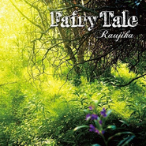

Fairy tale
============================

|  |  |
| :--: | :-- |
| [ Fairy tale](https://emumo.xiami.com/album/389942) | **艺人**: [Raujika](../index.md) **语种**: 日语 **唱片公司**: Palette Sounds **发行时间**: 2010年07月07日 **专辑类别**: 录音室专辑 **专辑风格**: 爵士说唱 Jazz Rap **播放数**: 4617431 **收藏数**: 3105 **评论数**: 198  |

## 简介

坂本龍一や久石 譲を思わせるような、和を基調としたオリエンタルな「Land of grace」、「Alma」や「Roseo Neige」、幻想的な世界に思わず引き込まれるアルバム・タイトル曲「Fairy tale」や「Cry more」、さらにはViolinistとしての顔を持つRaujikaの美しい旋律が聞ける、「Eldorado」、「Silent influence」等アルバムを通して紡ぐ”Fairy Tale”(おとぎ話)全16曲!

## 曲目

## 评论

|  |  |  |
| :-- | :-- | :-- |
|  [虾米用户](https://emumo.xiami.com/u/276944698) 不要自我设限..... 2019-06-24 14:36 赞(1) 踩(0) | 
☑️
 |
|  [虾米用户](https://emumo.xiami.com/u/6858782) 我还没想好要写什么... 2017-12-15 15:49 赞(1) 踩(0) | 
奇迹暖暖？？？？？
 |
|  [虾米用户](https://emumo.xiami.com/u/323982579) 若文明消失,惟有音乐值得... 2017-12-12 11:26 赞(0) 踩(0) | 
好专缉
 |
|  [虾米用户](https://emumo.xiami.com/u/929160) 我还没想好要写什么... 2017-03-23 22:47 赞(1) 踩(0) | 
回味下神专
 |
|  [虾米用户](https://emumo.xiami.com/u/54686131) 要听更多喜欢的歌~~~ 2017-02-22 20:37 赞(0) 踩(0) | 
好好听，不愿摘下耳机~~~
 |
|  [虾米用户](https://emumo.xiami.com/u/88173552) 总有一首会让我感动 2016-10-24 05:44 赞(0) 踩(0) | 
神砖
 |
|  [虾米用户](https://emumo.xiami.com/u/1625387) 吃米飯的老虎 2015-12-10 23:20 赞(0) 踩(0) | 
囧！第一首应该是“Fairy Tale”，而不是“Fairy Tail” 吧？？？最上面专辑名字“tale”也没大写，汗~ 这认真度……
 |
| ⇒ |  [虾米用户](https://emumo.xiami.com/u/14091078) 我还没想好要写什么... 2016-01-16 13:59 赞(0) 踩(0) | 
你可以纠错一下 :D
 |
|  [虾米用户](https://emumo.xiami.com/u/4960476)  2015-11-22 14:20 赞(0) 踩(0) | 
好听！！！
 |
|  [虾米用户](https://emumo.xiami.com/u/14838579)  2015-11-19 16:20 赞(1) 踩(0) | 
几年前在雅燃网上听的，当时就被抓住了，整张专辑都很好听，在音乐上不得不佩服日本人
 |
|  [虾米用户](https://emumo.xiami.com/u/10474874)  2015-10-17 07:11 赞(0) 踩(0) | 
哦！新世纪音乐
 |
|  [虾米用户](https://emumo.xiami.com/u/30617820) 窝列大窝列大哟 2015-10-05 13:08 赞(0) 踩(0) | 
(ಡωಡ)
 |
|  [虾米用户](https://emumo.xiami.com/u/39768955)  2015-09-23 21:56 赞(0) 踩(0) | 
相当不错
 |
|  [虾米用户](https://emumo.xiami.com/u/23554391) 躺着看你们 2015-09-02 13:41 赞(0) 踩(0) | 
封面好啊
 |
|  [虾米用户](https://emumo.xiami.com/u/7322777) ∮ 2015-08-02 08:33 赞(0) 踩(0) | 
...A...
 |
|  [虾米用户](https://emumo.xiami.com/u/13551138) 无所从来，欲无所去。 2015-06-16 18:15 赞(0) 踩(0) | 
这么美。。。。
 |
|  [虾米用户](https://emumo.xiami.com/u/32717429) 音楽は魂の声や、万物の声 2015-06-04 11:17 赞(0) 踩(0) | 
~节奏十足~
 |
|  [虾米用户](https://emumo.xiami.com/u/6629415) =。= 2015-04-25 23:49 赞(0) 踩(0) | 
美好，轻快~
 |
|  [虾米用户](https://emumo.xiami.com/u/960660) 你好，这里是牙买加 2015-01-31 02:29 赞(1) 踩(0) | 
适合骑车时听
 |
|  [虾米用户](https://emumo.xiami.com/u/39351079) peace. 2015-01-21 02:41 赞(0) 踩(0) | 
Tell them we love you .
 |
|  [虾米用户](https://emumo.xiami.com/u/44100434)  2014-12-30 01:00 赞(0) 踩(0) | 
·
 |
|  [虾米用户](https://emumo.xiami.com/u/1740806)  2014-12-21 23:11 赞(0) 踩(0) | 
放松心情
 |
|  [虾米用户](https://emumo.xiami.com/u/42951440)   2014-12-19 22:34 赞(0) 踩(0) | 
轻盈地舞蹈……
 |
|  [虾米用户](https://emumo.xiami.com/u/606760) 魂牵一线 2014-12-18 00:19 赞(0) 踩(0) | 
听
 |
|  [虾米用户](https://emumo.xiami.com/u/5169131) 我还没想好要写什么... 2014-12-13 23:00 赞(0) 踩(0) | 
整张都好听极了 整张都好听极了
 |
|  [虾米用户](https://emumo.xiami.com/u/6807)  2014-12-01 08:51 赞(0) 踩(0) | 
大风天儿~
 |
|  [虾米用户](https://emumo.xiami.com/u/11811199) 多少唏嘘的你在人海　 2014-10-24 13:46 赞(0) 踩(0) | 
誓要听遍所有的jazz HipHop！！！！！残忍到完全不能停下来！！！！深似海啊深似海啊~~~~~~
 |
|  [虾米用户](https://emumo.xiami.com/u/10444814) 拜拜啦 2014-10-19 14:18 赞(0) 踩(0) | 
ヽ(´ー`)ﾉ
 |
|  [虾米用户](https://emumo.xiami.com/u/11824755)  2014-10-12 17:17 赞(0) 踩(0) | 
安抚我的心
 |
|  [虾米用户](https://emumo.xiami.com/u/8223317)  2014-09-19 14:43 赞(0) 踩(0) | 
听着好温暖QUQ能把心头的黑暗抹去呢
 |
|  [虾米用户](https://emumo.xiami.com/u/32149466) 新年快乐 2014-09-10 15:27 赞(0) 踩(0) | 
﹏﹏﹏
 |
|  [虾米用户](https://emumo.xiami.com/u/36119051)         2014-09-08 20:30 赞(0) 踩(0) | 
顶
 |
|  [虾米用户](https://emumo.xiami.com/u/6111570) 春と修羅 2014-08-30 18:03 赞(3) 踩(0) | 
给一星的一定是没听过童话故事的吧
 |
|  [虾米用户](https://emumo.xiami.com/u/27915142)  2014-08-17 23:42 赞(1) 踩(0) | 
很适合周日晚睡前听，周一起来不至于太绝望（.....
 |
|  [虾米用户](https://emumo.xiami.com/u/38615745) 如果你感到辛苦，就来我怀... 2014-08-15 10:57 赞(0) 踩(0) | 
意境^o^  喜欢喜欢喜欢
 |
|  [虾米用户](https://emumo.xiami.com/u/35341268)  2014-08-07 12:00 赞(0) 踩(0) | 
like it
 |
|  [虾米用户](https://emumo.xiami.com/u/10337057) 独自穿行于空灵之境 2014-07-05 20:26 赞(0) 踩(0) | 
~~~
 |
|  [虾米用户](https://emumo.xiami.com/u/37449278)  2014-06-17 15:13 赞(0) 踩(0) | 
Jazz Hiphop
 |
|  [虾米用户](https://emumo.xiami.com/u/6706350) 扭了一手好涛 2014-06-12 13:12 赞(2) 踩(0) | 
只要有jazzhiphop的地方就有林海大大
 |
| ⇒ |  [虾米用户](https://emumo.xiami.com/u/6983749)  2014-12-30 17:15 赞(0) 踩(0) | 
林海只是对伴奏音乐感兴趣,这种清新简单的钢琴旋律是他的菜,我也注意到了
 |
|  [虾米用户](https://emumo.xiami.com/u/6593894)  2014-06-11 05:26 赞(0) 踩(0) | 
还是city of twilight好听
 |
|  [虾米用户](https://emumo.xiami.com/u/11157355) 榕树长青 2014-06-05 14:50 赞(0) 踩(0) | 
ok
 |
|  [虾米用户](https://emumo.xiami.com/u/3834066)   2014-05-31 00:41 赞(0) 踩(0) | 
从这张专辑开始听jazz hiphop的。第一次听这张专辑是大一的时候在雅燃上。差不多也是这个时候。
 |
|  [虾米用户](https://emumo.xiami.com/u/17210979) 我以前怎么那么多废话？ 2014-05-27 23:07 赞(0) 踩(0) | 
这种类型叫Jazz Hiphop？我个人觉得略迷幻
 |
|  [虾米用户](https://emumo.xiami.com/u/4351107) 美的全称是“不完美” 2014-05-01 18:32 赞(0) 踩(0) | 
带我进JazzHiphop的第一张专辑~
 |
| ⇒ |  [虾米用户](https://emumo.xiami.com/u/3834066)   2014-05-31 00:39 赞(0) 踩(0) | 
+1
 |
|  [虾米用户](https://emumo.xiami.com/u/9920950) It's me 2014-04-25 14:13 赞(1) 踩(0) | 
想到穿过重重幽林的白鸟，仰望头顶的层层筛落的希望之光。
 |
|  [虾米用户](https://emumo.xiami.com/u/1730236)   2014-04-22 20:13 赞(0) 踩(0) | 
黑白琴键的呢喃，好像对你述说着什么
 |
|  [虾米用户](https://emumo.xiami.com/u/1317745) limitless 2014-04-20 18:13 赞(0) 踩(0) | 
为啥有俩 tell them i love you
 |
|  [虾米用户](https://emumo.xiami.com/u/7973634) soundonline ... 2014-04-05 18:01 赞(0) 踩(0) | 
妖精的尾巴!!!!?
 |
|  [虾米用户](https://emumo.xiami.com/u/1609946) 一即一切 2014-03-29 15:22 赞(0) 踩(0) | 
心 境不二
 |
|  [虾米用户](https://emumo.xiami.com/u/4068223) JH 2014-03-25 16:39 赞(0) 踩(0) | 
tell them i fucked you
 |
|  [虾米用户](https://emumo.xiami.com/u/11786384) 虾米丶说不出的再见 2014-03-19 16:19 赞(1) 踩(0) | 
.... .....
 |
|  [虾米用户](https://emumo.xiami.com/u/5691521) 孤独是最大的敌人 2014-02-23 17:28 赞(0) 踩(0) | 
适合在需要时间的工作或娱乐期间 随机播放的一张 能成为与时间为伴的极好的点缀
 |
|  [虾米用户](https://emumo.xiami.com/u/4721181)  2014-02-23 16:55 赞(0) 踩(0) | 
行云流水.一气呵成.全碟极赞.
 |
|  [虾米用户](https://emumo.xiami.com/u/6521562) 个人旅行公众号：小欣纪行 2014-02-11 10:24 赞(0) 踩(0) | 
武侠配乐绝佳，大爱日本纯乐
 |
|  [虾米用户](https://emumo.xiami.com/u/14501096) ooo 2014-02-10 20:04 赞(0) 踩(0) | 
流线的快感，不错
 |
|  [虾米用户](https://emumo.xiami.com/u/2981164)  2014-02-06 16:03 赞(0) 踩(0) | 
真是云集了各种风格的神作( ´•̥̥̥ω•̥̥̥` )
 |
|  [虾米用户](https://emumo.xiami.com/u/2681920)  2013-11-25 15:53 赞(0) 踩(0) | 
真神了首首都好听
 |
|  [虾米用户](https://emumo.xiami.com/u/2681920)  2013-11-25 15:51 赞(0) 踩(0) | 
这专辑神了，，首首都好听
 |
|  [虾米用户](https://emumo.xiami.com/u/7246744)  2013-11-24 16:22 赞(0) 踩(0) | 
正常的编曲华丽而恰到好处，给人行云流水的感觉，十分的动听。
 |
|  [虾米用户](https://emumo.xiami.com/u/301218) 一瓢江湖~我沉浮 2013-11-10 13:26 赞(0) 踩(0) | 
真不错的纯音乐~~~嘎嘎，看小说的时候，循环了一下午
 |
|  [虾米用户](https://emumo.xiami.com/u/26211330)  2013-11-06 19:21 赞(0) 踩(0) | 
喜欢日系安静的感觉。
 |
| ⇒ |  [虾米用户](https://emumo.xiami.com/u/30442011)  2014-01-13 03:13 赞(0) 踩(0) | 
听了两首,这张碟说清新可以,算不得安静.
 |
|  [虾米用户](https://emumo.xiami.com/u/11184797)  2013-11-01 17:34 赞(0) 踩(0) | 
心，放松一下
 |
|  [虾米用户](https://emumo.xiami.com/u/11961050) 时间没有流逝，流逝的是我... 2013-10-20 22:10 赞(0) 踩(0) | 
不错。适合拿来做镇静剂。
 |
|  [虾米用户](https://emumo.xiami.com/u/15477519) 爱  是生命的和弦，而不... 2013-09-13 13:27 赞(0) 踩(0) | 
一张很好听的Jazz HipHop专辑...
 |
|  [虾米用户](https://emumo.xiami.com/u/16740936)  2013-08-13 12:52 赞(0) 踩(0) | 
最近朋友的推荐，古典搭配jazz，纯音乐好听 rap也好听，好听好听好听。
 |
|  [虾米用户](https://emumo.xiami.com/u/7973634) soundonline ... 2013-07-13 04:56 赞(1) 踩(0) | 
Fairy tale  瞬间看成了 妖精的尾巴....
 |
| ⇒ |  [虾米用户](https://emumo.xiami.com/u/301218) 一瓢江湖~我沉浮 2013-11-10 12:51 赞(0) 踩(0) | 
me 也是~~~仔细一看，哎不是·~~
 |
|  [虾米用户](https://emumo.xiami.com/u/1397708)  2013-07-10 11:08 赞(0) 踩(0) | 
日系轻音乐DJ风格，BGM的绝佳选择
 |
|  [虾米用户](https://emumo.xiami.com/u/10222865)  2013-07-04 12:00 赞(0) 踩(0) | 
哦哦哦，好好听，不过Cry more 好像在Art Of The World这张专辑里也有，
 |
|  [虾米用户](https://emumo.xiami.com/u/13306312) 音乐是心灵的表达，是对世... 2013-06-25 22:22 赞(0) 踩(0) | 
好好
 |
|  [虾米用户](https://emumo.xiami.com/u/3737540)  2013-06-14 10:10 赞(0) 踩(0) | 
恩。。。。。。不错！
 |
|  [虾米用户](https://emumo.xiami.com/u/8474936) 倾听好音乐 2013-04-23 17:27 赞(0) 踩(0) | 
很轻快的感觉，在这样潮湿得让人心烦意乱的天气里静静听着，内心有一种舒畅感~
 |
|  [虾米用户](https://emumo.xiami.com/u/3784733)  2013-04-22 11:34 赞(0) 踩(0) | 
silent influence
 |
|  [虾米用户](https://emumo.xiami.com/u/1855935) 瞎说 2013-04-19 16:57 赞(0) 踩(0) | 
Cry more
 |
|  [虾米用户](https://emumo.xiami.com/u/10925181)  2013-04-13 16:27 赞(0) 踩(0) | 
jazz rap
 |
|  [虾米用户](https://emumo.xiami.com/u/2142565)   2013-04-09 22:36 赞(0) 踩(0) | 
一个人静静的听
 |
|  [虾米用户](https://emumo.xiami.com/u/1700002) V5_ORZZZZZ 2013-03-28 19:56 赞(0) 踩(0) | 
FLAC:<a href="http://o2v3.imotor.com/thread-1064-1-3.html" target="_blank" rel="nofollow noreferrer noopener">http://o2v3.imotor.com/thread-1064-1-3.html</a>
 |
|  [虾米用户](https://emumo.xiami.com/u/4032293) 记得我们变态的时候还很年... 2013-02-26 16:24 赞(0) 踩(0) | 
Raujika❤
 |
|  [虾米用户](https://emumo.xiami.com/u/9072755)  2013-02-24 15:08 赞(0) 踩(0) | 
這不是某妖精的公會名嗎？
 |
| ⇒ |  [虾米用户](https://emumo.xiami.com/u/6892945) Voltka 2013-03-14 00:59 赞(0) 踩(0) | 
NO，尾巴是tail
 |
| ⇒ |  [虾米用户](https://emumo.xiami.com/u/9072755)  2013-03-14 14:13 赞(0) 踩(0) | 
<q><b>Justine说：</b></q>
 |
| ⇒ |  [虾米用户](https://emumo.xiami.com/u/2059297) 我不想呆在家里，可是什么... 2013-05-17 17:40 赞(0) 踩(0) | 
<q><b>Justine说：</b></q>
 |
| ⇒ |  [虾米用户](https://emumo.xiami.com/u/6892945) Voltka 2013-05-17 18:00 赞(0) 踩(0) | 
<q><b>CC说：</b></q>
 |
| ⇒ |  [虾米用户](https://emumo.xiami.com/u/2059297) 我不想呆在家里，可是什么... 2013-05-17 18:12 赞(0) 踩(0) | 
<q><b>Justine说：</b></q>
 |
|  [虾米用户](https://emumo.xiami.com/u/1855935) 瞎说 2013-01-26 11:58 赞(0) 踩(0) | 
前面还以为是夏目友人帐里的歌曲呢，原来不是啊...
 |
|  [虾米用户](https://emumo.xiami.com/u/9868230)  2013-01-15 08:09 赞(0) 踩(0) | 
Jeez !
 |
|  [虾米用户](https://emumo.xiami.com/u/11644496) ...... 2013-01-10 15:30 赞(15) 踩(0) | 
烦死了整张都很好听....整张循环了n次还会时不时惊艳然后点开来看是哪首歌....
 |
|  [虾米用户](https://emumo.xiami.com/u/11644496) ...... 2013-01-10 12:44 赞(0) 踩(0) | 
- v - ~
 |
|  [虾米用户](https://emumo.xiami.com/u/3497746) 不在乎这10分，我是来听... 2012-12-17 15:36 赞(0) 踩(0) | 
有DJ Okawari的赶脚~~~
 |
|  [虾米用户](https://emumo.xiami.com/u/3497746) 不在乎这10分，我是来听... 2012-12-17 15:35 赞(0) 踩(0) | 
的确有DJ Okawari的赶脚~~~~+1
 |
|  [虾米用户](https://emumo.xiami.com/u/11420216)  2012-12-13 23:04 赞(0) 踩(0) | 
不知道为什么听起来有DJ Okawari的感觉，很和谐的韵律，还有夹杂着hip-hop的随意感。很惬意啊啊
 |
|  [虾米用户](https://emumo.xiami.com/u/6506348)  2012-11-28 15:20 赞(0) 踩(0) | 
这种旋律无需用语言表达。
 |
|  [虾米用户](https://emumo.xiami.com/u/1468862)  2012-11-12 20:16 赞(0) 踩(0) | 
Raujika的都很不错 。 这张最好的~
 |
|  [虾米用户](https://emumo.xiami.com/u/4043410) 唯夜色浪漫 2012-11-12 17:41 赞(0) 踩(0) | 
还是可以听听的唷~
 |
|  [虾米用户](https://emumo.xiami.com/u/4342261)  2012-11-11 18:27 赞(0) 踩(0) | 
好
 |
|  [虾米用户](https://emumo.xiami.com/u/5793159) 9年虾米生涯，走好，有缘... 2012-11-10 07:03 赞(0) 踩(0) | 
又有清澈精致的轻音乐听了
 |
|  [虾米用户](https://emumo.xiami.com/u/7074555)  2012-11-09 09:23 赞(0) 踩(0) | 
优美旋律，清新
 |
|  [虾米用户](https://emumo.xiami.com/u/5781632)  2012-11-08 18:49 赞(0) 踩(0) | 
推荐第一首跟最后一首吧~
 |
|  [虾米用户](https://emumo.xiami.com/u/683286) 一切都在变 2012-11-08 17:54 赞(0) 踩(0) | 
换的320K的吗
 |
| ⇒ |  [虾米用户](https://emumo.xiami.com/u/6892945) Voltka 2012-11-08 18:57 赞(0) 踩(0) | 
Yep.
 |
| ⇒ |  [虾米用户](https://emumo.xiami.com/u/683286) 一切都在变 2012-11-08 19:00 赞(0) 踩(0) | 
<q><b>Justine说：</b></q>
 |
| ⇒ |  [虾米用户](https://emumo.xiami.com/u/6892945) Voltka 2012-11-08 19:08 赞(0) 踩(0) | 
<q><b>Alter?Never!说：</b></q>
 |
| ⇒ |  [虾米用户](https://emumo.xiami.com/u/683286) 一切都在变 2012-11-08 19:30 赞(0) 踩(0) | 
<q><b>Justine说：</b></q>
 |
| ⇒ |  [虾米用户](https://emumo.xiami.com/u/6892945) Voltka 2012-11-08 20:08 赞(0) 踩(0) | 
<q><b>Alter?Never!说：</b></q>
 |
|  [虾米用户](https://emumo.xiami.com/u/5655022)  2012-11-08 17:31 赞(0) 踩(0) | 
好听
 |
|  [虾米用户](https://emumo.xiami.com/u/687193) 自由 2012-11-08 16:11 赞(0) 踩(0) | 
貌似我有这张专辑……
 |
| ⇒ |  [虾米用户](https://emumo.xiami.com/u/5781632)  2012-11-08 18:48 赞(0) 踩(0) | 
有+1..
 |
|  [虾米用户](https://emumo.xiami.com/u/597569) 何必故作姿态 2012-11-08 15:05 赞(0) 踩(0) | 
个人感觉很不错!!!!!
 |
|  [虾米用户](https://emumo.xiami.com/u/1578399) 虾米什么时候才能把版权问... 2012-11-05 14:38 赞(0) 踩(0) | 
伴随着这张专辑起床！虽然不是早晨，却有种清爽的早晨的感觉！
 |
|  [虾米用户](https://emumo.xiami.com/u/4467076) 我不是小皖熊，玩不出你的... 2012-11-01 19:05 赞(0) 踩(0) | 
Fairy Tail
 |
|  [虾米用户](https://emumo.xiami.com/u/11038229)  2012-10-21 16:49 赞(0) 踩(0) | 
看上去不错哦
 |
|  [虾米用户](https://emumo.xiami.com/u/10216979)  2012-10-13 22:19 赞(0) 踩(0) | 
好東西啊!!
 |
|  [虾米用户](https://emumo.xiami.com/u/8256574)  2012-09-22 04:21 赞(0) 踩(0) | 
+1
 |
|  [虾米用户](https://emumo.xiami.com/u/8256574)  2012-09-22 04:20 赞(0) 踩(0) | 
+1
 |
|  [虾米用户](https://emumo.xiami.com/u/334599) 水至清则无鱼 2012-09-07 11:57 赞(0) 踩(0) | 
耳朵告诉我的五星
 |
|  [虾米用户](https://emumo.xiami.com/u/10216630) 水寞花間 2012-08-15 17:52 赞(0) 踩(0) | 
YISHA
 |
|  [虾米用户](https://emumo.xiami.com/u/4302942)  2012-08-13 22:29 赞(0) 踩(0) | 
观望中。。。。。
 |
|  [虾米用户](https://emumo.xiami.com/u/6323674) Love classic... 2012-08-10 14:58 赞(0) 踩(0) | 
让人无比轻松愉悦的音乐风格
 |
|  [虾米用户](https://emumo.xiami.com/u/341091) 偶爱我们呢~ 2012-08-06 00:12 赞(0) 踩(0) | 
我评5星只因专辑封面……
 |
|  [虾米用户](https://emumo.xiami.com/u/4585780) 蛤？ 2012-07-24 11:21 赞(0) 踩(0) | 
這專輯很適合邊聽邊寫稿啊
 |
|  [虾米用户](https://emumo.xiami.com/u/3943834) 酷炫到没朋友！ 2012-07-14 13:56 赞(0) 踩(0) | 
很清爽w非常棒
 |
|  [虾米用户](https://emumo.xiami.com/u/4468807)  2012-06-29 17:05 赞(0) 踩(0) | 
最近超爱听这专辑
 |
|  [虾米用户](https://emumo.xiami.com/u/2929539) 注册家里蹲执照所有者 2012-06-25 11:50 赞(0) 踩(0) | 
为了避免Raujika的专辑出个意外被删啥的，赶快收一收=-=
 |
|  [虾米用户](https://emumo.xiami.com/u/9559040)  2012-06-23 14:40 赞(0) 踩(0) | 
啦啦啦
 |
|  [虾米用户](https://emumo.xiami.com/u/3564226) 我想想.. 2012-06-16 01:29 赞(0) 踩(0) | 
so nice~
 |
|  [虾米用户](https://emumo.xiami.com/u/8910312)  2012-06-07 14:25 赞(0) 踩(0) | 
imagination
 |
|  [虾米用户](https://emumo.xiami.com/u/3540677)  2012-05-24 12:13 赞(0) 踩(0) | 
曲子很干净，感觉超棒
 |
|  [虾米用户](https://emumo.xiami.com/u/589669)  2012-05-23 23:09 赞(0) 踩(0) | 
另一张一听钟情的专辑。适合午夜做layout的苦逼。@法兰客 @Manson_庄瞳 @ivyzhuang 我想念你们。
 |
|  [虾米用户](https://emumo.xiami.com/u/298522)  2012-05-12 12:18 赞(0) 踩(0) | 
很丰富的一张专辑啊
 |
|  [虾米用户](https://emumo.xiami.com/u/1396206) 聆听月升 2012-05-03 10:10 赞(0) 踩(0) | 
这张听了一年多，依旧欢喜
 |
|  [虾米用户](https://emumo.xiami.com/u/1233749)  2012-04-25 11:48 赞(0) 踩(0) | 
优美
 |
|  [虾米用户](https://emumo.xiami.com/u/231797) 活着真好 好好活着 2012-04-23 02:09 赞(0) 踩(0) | 
好曲多~
 |
|  [虾米用户](https://emumo.xiami.com/u/5649860)  2012-04-16 11:32 赞(0) 踩(0) | 
好久没听OST这么上瘾了
 |
|  [虾米用户](https://emumo.xiami.com/u/1463914)  2012-04-14 17:04 赞(0) 踩(0) | 
小清新。。。日系。。。治愈。。。随便咯。。。爱听不听。。。
 |
|  [虾米用户](https://emumo.xiami.com/u/1463914)  2012-04-13 21:51 赞(0) 踩(0) | 
蛋蛋忧伤。。。。
 |
|  [虾米用户](https://emumo.xiami.com/u/8579750)  2012-03-24 22:37 赞(0) 踩(0) | 
喜欢的
 |
|  [虾米用户](https://emumo.xiami.com/u/2106285) 原来我不懂欣赏，我只是看... 2012-03-24 14:01 赞(0) 踩(0) | 
灵动，有感觉的说，
 |
|  [虾米用户](https://emumo.xiami.com/u/2106285) 原来我不懂欣赏，我只是看... 2012-03-24 14:01 赞(0) 踩(0) | 
很喜欢，感觉不错，
 |
|  [虾米用户](https://emumo.xiami.com/u/5514787)  2012-03-12 10:42 赞(0) 踩(0) | 
好听！大爱！
 |
|  [虾米用户](https://emumo.xiami.com/u/8241854)  2012-03-01 09:00 赞(0) 踩(0) | 
灵动、喜欢
 |
|  [虾米用户](https://emumo.xiami.com/u/2530645)  2012-02-29 18:17 赞(0) 踩(0) | 
原来这样的结合，一点都不突兀，跳跃的节奏与精灵般的钢琴声，有时快乐，有时悲伤
 |
|  [虾米用户](https://emumo.xiami.com/u/2817463) 唯有音乐最美 2012-02-29 14:55 赞(1) 踩(0) | 
钢琴的优雅和动感的节奏既矛盾又和谐
 |
|  [虾米用户](https://emumo.xiami.com/u/7940456)  2012-02-06 18:31 赞(0) 踩(0) | 
顶啊
 |
|  [虾米用户](https://emumo.xiami.com/u/155947) 一期一会 2012-02-03 23:15 赞(0) 踩(0) | 
童话~
 |
|  [虾米用户](https://emumo.xiami.com/u/7898972)  2012-02-03 15:23 赞(0) 踩(0) | 
大爱。
 |
|  [虾米用户](https://emumo.xiami.com/u/7850035)  2012-01-31 18:47 赞(0) 踩(0) | 
好听
 |
|  [虾米用户](https://emumo.xiami.com/u/5163814)  2011-12-29 00:25 赞(0) 踩(0) | 
喜欢就是喜欢
 |
|  [虾米用户](https://emumo.xiami.com/u/5086136)  2011-12-20 23:34 赞(0) 踩(0) | 
向日葵的味道
 |
|  [虾米用户](https://emumo.xiami.com/u/5736946)  2011-12-18 20:16 赞(0) 踩(0) | 
好听啊  和DJ OKAWARI的曲风很相似   大赞
 |
|  [虾米用户](https://emumo.xiami.com/u/5051592) 暂无签名~ 2011-12-18 16:53 赞(0) 踩(0) | 
好好听哦！！！
 |
|  [虾米用户](https://emumo.xiami.com/u/7017043)  2011-11-29 14:29 赞(0) 踩(0) | 
喜欢就是喜欢
 |
|  [虾米用户](https://emumo.xiami.com/u/4363360) 我还没想好要写什么... 2011-11-07 21:59 赞(0) 踩(0) | 
节奏很不错~ 遗憾的是个人不喜欢说唱，要是没有那些说唱就太好了
 |
|  [虾米用户](https://emumo.xiami.com/u/3810395)  2011-10-15 15:22 赞(0) 踩(0) | 
安静，澎湃，优美，哥特式
 |
|  [虾米用户](https://emumo.xiami.com/u/2181046)  2011-10-07 18:39 赞(0) 踩(0) | 
封面太美了
 |
|  [虾米用户](https://emumo.xiami.com/u/6089655)  2011-10-03 13:50 赞(0) 踩(0) | 
///
 |
|  [虾米用户](https://emumo.xiami.com/u/5482931)  2011-10-03 01:14 赞(0) 踩(0) | 
你真美
 |
|  [虾米用户](https://emumo.xiami.com/u/3960987)  2011-09-22 13:30 赞(0) 踩(0) | 
小胖喜欢
 |
|  [虾米用户](https://emumo.xiami.com/u/3834066)   2011-09-16 20:39 赞(0) 踩(0) | 
风格很特别啊，
 |
|  [虾米用户](https://emumo.xiami.com/u/1782550)  2011-09-07 19:32 赞(0) 踩(0) | 
本年度最值得推荐的氛围音乐，曲风十分多元化，编曲也是相当的华丽，你可能对它的风格感到质疑，其实这张碟子说到底我还是最偏爱它的抒情唯美调调，不管它是Jazz-hip-hop也好，电子也好！一首首音乐就像童话里面的精灵那般活泼，让你心跳！
 |
|  [虾米用户](https://emumo.xiami.com/u/4764989)  2011-09-01 12:21 赞(0) 踩(0) | 
喜欢 这种纯音乐
 |
|  [虾米用户](https://emumo.xiami.com/u/2432899)  2011-09-01 11:23 赞(0) 踩(0) | 
帅！好听！
 |
|  [虾米用户](https://emumo.xiami.com/u/4018329)  2011-08-29 13:29 赞(0) 踩(0) | 
City of Twilight 好听。Fairy Tail 也不错，挺符合专辑名。
 |
|  [虾米用户](https://emumo.xiami.com/u/4018329)  2011-08-25 12:51 赞(0) 踩(0) | 
赖上了它的美好。
 |
|  [虾米用户](https://emumo.xiami.com/u/5553491)  2011-08-24 12:43 赞(0) 踩(0) | 
好听、灵动的音乐
 |
|  [虾米用户](https://emumo.xiami.com/u/896824) 暂无签名~ 2011-08-23 14:29 赞(0) 踩(0) | 
不善言语 好听……
 |
|  [虾米用户](https://emumo.xiami.com/u/5538858)  2011-08-23 11:15 赞(0) 踩(0) | 
纯净的心灵 与 现代的神秘 完美结合
 |
|  [虾米用户](https://emumo.xiami.com/u/2034047) 暂无签名~ 2011-08-18 19:36 赞(0) 踩(0) | 
jazzhiphop一直是大爱!~!~!~~~~
 |
|  [虾米用户](https://emumo.xiami.com/u/3370353)  2011-07-27 01:05 赞(0) 踩(0) | 
先分享了再说
 |
|  [虾米用户](https://emumo.xiami.com/u/450851)  2011-07-21 09:53 赞(0) 踩(0) | 
nice
 |
|  [虾米用户](https://emumo.xiami.com/u/816327) 暂无签名~ 2011-07-18 11:22 赞(0) 踩(0) | 
浮想联翩的节奏，跳跃的思维~
 |
|  [虾米用户](https://emumo.xiami.com/u/816327) 暂无签名~ 2011-07-18 11:22 赞(0) 踩(0) | 
浮想联翩的节奏~~
 |
|  [虾米用户](https://emumo.xiami.com/u/4790701)  2011-07-13 14:06 赞(0) 踩(0) | 
very well
 |
|  [虾米用户](https://emumo.xiami.com/u/4790502)  2011-07-10 22:10 赞(0) 踩(0) | 
第一首歌名不是Fairy Tale吗？怎么会是Fairy Tair?
 |
|  [虾米用户](https://emumo.xiami.com/u/2533389)  2011-07-06 22:35 赞(0) 踩(0) | 
Raujika
 |
|  [虾米用户](https://emumo.xiami.com/u/2092701)  2011-06-07 02:56 赞(0) 踩(0) | 
日系风格纯音乐，清新，明快，很受亚洲人喜欢。
 |
|  [虾米用户](https://emumo.xiami.com/u/3078114)  2011-05-30 05:58 赞(0) 踩(0) | 
好听
 |
|  [虾米用户](https://emumo.xiami.com/u/3455964)  2011-05-26 23:40 赞(0) 踩(0) | 
Jazz-HipHop
 |
|  [虾米用户](https://emumo.xiami.com/u/891989) 我还没想好要写什么... 2011-05-10 23:42 赞(0) 踩(0) | 
请允许我我晕过去吧   这么好听的  难找了
 |
|  [虾米用户](https://emumo.xiami.com/u/2482752)  2011-04-21 23:14 赞(0) 踩(0) | 
-_______-
 |
|  [虾米用户](https://emumo.xiami.com/u/3495913) 执子数晨星 2011-04-19 18:04 赞(0) 踩(0) | 
好曲子
 |
|  [虾米用户](https://emumo.xiami.com/u/633441)  2011-04-19 11:10 赞(0) 踩(0) | 
喜欢
 |
|  [虾米用户](https://emumo.xiami.com/u/3652066)  2011-04-18 14:28 赞(0) 踩(0) | 
真的是很不错
 |
|  [虾米用户](https://emumo.xiami.com/u/1641485) 头发没了，虾米关了 2011-04-17 12:13 赞(0) 踩(0) | 
好听。。。但是“不为人所知”
 |
|  [虾米用户](https://emumo.xiami.com/u/3465535)  2011-04-06 20:41 赞(0) 踩(0) | 
第一首的音樂就讓我太喜歡了 雖然還不知到其他得歌如何  但就讓我衝動的按下了 不過老實說這種專輯封面還真不是我平常會關注的種類呢 是搜尋妖精尾巴才搜到這來的  音樂好有故事性 像是到一個心地方 不過好像又有點日本傳統的元素參雜其中 讓我很喜歡呢 雖然目前打的只是第一首的感想啦 嘻
 |
|  [虾米用户](https://emumo.xiami.com/u/2106435) 一个人旅行 2011-03-22 23:25 赞(0) 踩(0) | 
nice
 |
|  [虾米用户](https://emumo.xiami.com/u/1927387)  2011-03-10 22:15 赞(0) 踩(0) | 
清新脱俗 ：）
 |
|  [虾米用户](https://emumo.xiami.com/u/1536777)  2011-03-03 00:03 赞(0) 踩(0) | 
轻快
 |
|  [虾米用户](https://emumo.xiami.com/u/2927355)  2011-02-22 19:45 赞(0) 踩(0) | 
这张专辑真的很好听，给人很轻松，耳目一新的感觉，不容错过。
 |
|  [虾米用户](https://emumo.xiami.com/u/2661610)  2011-01-29 14:08 赞(0) 踩(0) | 
cool
 |
|  [虾米用户](https://emumo.xiami.com/u/1052461) @blinK4sy- 2011-01-17 23:15 赞(0) 踩(0) | 
原生态?
 |
|  [虾米用户](https://emumo.xiami.com/u/204408) 暂无签名~ 2011-01-17 19:29 赞(0) 踩(0) | 
好听
 |
|  [虾米用户](https://emumo.xiami.com/u/597569) 何必故作姿态 2011-01-05 20:08 赞(0) 踩(0) | 
太棒了！
 |
|  [虾米用户](https://emumo.xiami.com/u/1024405)  2010-09-11 15:58 赞(0) 踩(0) | 
好听好听
 |
|  [虾米用户](https://emumo.xiami.com/u/492904) 只是喜欢开心的听歌～ 2010-07-22 12:39 赞(0) 踩(0) | 
每曲都很好听啊～～  ====== 君尋くん发现～
 |
|  [虾米用户](https://emumo.xiami.com/u/554156) 我还没想好要写什么... 2010-07-15 10:20 赞(0) 踩(0) | 
這張坂本龍一的味道很濃啊～
 |
