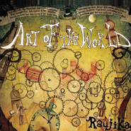

Art Of The World
============================

|  |  |
| :--: | :-- |
| [ Art Of The World](https://emumo.xiami.com/album/437963) | **艺人**: [Raujika](../index.md) **语种**: 日语 **唱片公司**: Palette Sounds **发行时间**: 2011年05月11日 **专辑类别**: 录音室专辑 **专辑风格**: 爵士说唱 Jazz Rap **播放数**: 3176580 **收藏数**: 3270 **评论数**: 162  |

## 简介

新人ながらリリース直後に、iTunes Hip Hopチャートで1位を獲得し、  
独自のサウンドと世界観で衝撃的なデビューを果たしたRaujikaによる、  
おとぎ話「Fairy Tale」に続く待望の2ndアルバム「The Art Of The World」が遂に完成!  
  
LAヒップホップ界からは、「Flowers」等の曲が日本でも大ヒットし、 Stones Throwからのリリースでもお馴染みのDudley Perkinsと、 Mos DefやErykah Baduのアルバムにプロデュース&amp;客演で参加した 音楽界のサラブレッドであるデトロイトの才女Georgia Anne Muldrowがデュエット曲で参加!  
  
さらに1stアルバムでも共演し抜群の相性の良さを見せたDon Cerinoと再共演が実現! スリリングなオーケストレーションをイメージしたViolinアレンジが光る「King of heart」、 スペーシーなトラックにDonのタイトなラップに女性コーラスが光る「Fly away」, キャッチーなFemale Voが絡む「smooth operator」など充実の4曲コラボレーション!  
アーティストについて  
2010年にP-Vine Recordsからリリースされた「My Piano Things」でデビューを飾ったRaujika。 5歳からViolinを始め、Violinistならではの弦アレンジを武器に、本格的なオーケストレーションまで、作曲、アレンジできる 高度な作曲能力は、日本を代表する坂本龍一や久石譲などの作曲家通じる部分がある。 クラシック音楽の持つ音楽性と、現代社会におけるテクノロジーを、ハイブリッドな感覚で融合したオリジナルなスタイルが特徴で、 瀬戸智樹率いるクリエイティブ集団Palette Soundsに所属。 2010年に1stアルバム「Fairy Tale」をリリースし好評を博し、2011年に待望の2ndアルバム「The Art of The World」をリリース。

## 曲目

## 评论

|  |  |  |
| :-- | :-- | :-- |
|  [虾米用户](https://emumo.xiami.com/u/288573630) 准备起飞 2020-04-16 12:27 赞(0) 踩(0) | 
|｡･㉨･)っ♡
 |
|  [虾米用户](https://emumo.xiami.com/u/344485531) 关心则乱 2020-03-13 14:21 赞(1) 踩(0) | 
我更喜欢专辑里没有歌词的轻音
 |
|  [虾米用户](https://emumo.xiami.com/u/54375797) Just be your... 2019-11-01 14:22 赞(0) 踩(0) | 
可可爱爱！！！
 |
|  [虾米用户](https://emumo.xiami.com/u/8840665) 热爱小提琴和电音。 2018-12-22 14:08 赞(1) 踩(0) | 
良心专辑！
 |
|  [虾米用户](https://emumo.xiami.com/u/6171336) 谢谢9年陪伴，你依然是我... 2018-12-16 11:00 赞(0) 踩(0) | 
***
 |
|  [虾米用户](https://emumo.xiami.com/u/52087380) 快乐每一天！ 2018-10-24 05:29 赞(1) 踩(0) | 
封面   
 |
|  [虾米用户](https://emumo.xiami.com/u/51714833)  2017-10-27 23:41 赞(4) 踩(0) | 
学校老师已经被与外高联考的成绩逼疯了，继周考练之后又新增天天练，大题狂练。。虽说是为我们好，忍耐过后是甜蜜，希望能活着看到甜蜜吧。 这里面的歌挺甜的。
 |
|  [虾米用户](https://emumo.xiami.com/u/43714694) WeChat：96529... 2017-10-14 16:57 赞(0) 踩(0) | 
吱/音
 |
|  [虾米用户](https://emumo.xiami.com/u/5169131) 我还没想好要写什么... 2017-06-25 07:28 赞(0) 踩(0) | 
最好的张
 |
|  [虾米用户](https://emumo.xiami.com/u/50430664) 我还没想好要写什么... 2016-08-07 12:38 赞(0) 踩(0) | 
这艺人有一个美妙的大脑，和一双拥有魔力般的双手 
 |
|  [虾米用户](https://emumo.xiami.com/u/13919203) 女朋友的闺蜜就是备胎 2016-05-25 11:58 赞(2) 踩(0) | 
真的黑美。那毛笔枯笔甩出来瀑布，一顿一顿的向下流冲瀑布下的紫龙身上，那刺青被黑化了。想到他的恋人和他一起游走在水墨意境的桃源。这时候拿出匕首相互割肉吃吧
 |
|  [虾米用户](https://emumo.xiami.com/u/9542273) 海外党毛线都听不了。 2016-04-26 00:29 赞(1) 踩(0) | 
冷门神级专辑系列。
 |
|  [虾米用户](https://emumo.xiami.com/u/40516145) 魔术是假的，哄你开心是真... 2016-01-20 09:36 赞(0) 踩(0) | 
大爱。
 |
|  [虾米用户](https://emumo.xiami.com/u/27886827) 请用心听，不要说话。 2015-12-02 15:17 赞(0) 踩(0) | 
清新可爱
 |
|  [虾米用户](https://emumo.xiami.com/u/24345242) 爱谁谁 2015-11-07 16:40 赞(0) 踩(0) | 

 |
|  [虾米用户](https://emumo.xiami.com/u/30617820) 窝列大窝列大哟 2015-10-05 13:08 赞(1) 踩(0) | 

 |
|  [虾米用户](https://emumo.xiami.com/u/5169131) 我还没想好要写什么... 2015-10-03 23:32 赞(0) 踩(0) | 
童话专辑
 |
|  [虾米用户](https://emumo.xiami.com/u/14019727)  2015-08-09 10:51 赞(16) 踩(0) | 
音乐响起时 世界就出现了
 |
|  [虾米用户](https://emumo.xiami.com/u/7322777) ∮ 2015-08-02 08:33 赞(0) 踩(0) | 
...A...
 |
|  [虾米用户](https://emumo.xiami.com/u/14091078) 我还没想好要写什么... 2015-07-25 19:05 赞(0) 踩(0) | 
神专
 |
|  [虾米用户](https://emumo.xiami.com/u/15725146) 最棒： 2015-07-24 14:54 赞(0) 踩(0) | 
这张好好听！
 |
|  [虾米用户](https://emumo.xiami.com/u/11345198)   2015-06-24 13:34 赞(0) 踩(0) | 
最爱
 |
|  [虾米用户](https://emumo.xiami.com/u/35188755) 断线的风筝 2015-05-26 13:08 赞(0) 踩(0) | 
我认得你
 |
|  [虾米用户](https://emumo.xiami.com/u/39788841)  . 2015-05-09 14:28 赞(0) 踩(0) | 
Lium
 |
|  [虾米用户](https://emumo.xiami.com/u/28820911) like me。 2015-04-09 00:02 赞(0) 踩(0) | 
对于关联性这一点。有好多东西不得不发两次。虽然矫情。但是我就是这么bitch。虽然只推荐了一首。其实整张都蛮不错。对于纯音乐。能打动我的真不多。但话多了。安。bitch。go ahead！ヾ(●ω●)ノ
 |
|  [虾米用户](https://emumo.xiami.com/u/16085464) 我还没想好要写什么... 2015-03-15 19:14 赞(0) 踩(0) | 
bamboo太赞了
 |
|  [虾米用户](https://emumo.xiami.com/u/8702599) 在音乐的世界里浮游 2015-02-23 14:17 赞(1) 踩(0) | 
节奏好听
 |
|  [虾米用户](https://emumo.xiami.com/u/34735202)   2015-02-11 11:18 赞(0) 踩(0) | 
喜欢
 |
|  [虾米用户](https://emumo.xiami.com/u/8346626) 悲伤地哼着愉快的小调~ 2015-01-30 15:37 赞(0) 踩(0) | 
好赞，想起Lost Imagination
 |
|  [虾米用户](https://emumo.xiami.com/u/44100434)  2014-12-30 01:00 赞(0) 踩(0) | 
·
 |
|  [虾米用户](https://emumo.xiami.com/u/3987161)  2014-12-17 21:54 赞(0) 踩(0) | 
Jazz-hiphop,日本,清新,
 |
|  [虾米用户](https://emumo.xiami.com/u/34018579) 阁下何不同风起，扶摇直上... 2014-11-09 22:57 赞(0) 踩(0) | 
第四首，谁听谁知道！
 |
|  [虾米用户](https://emumo.xiami.com/u/34018579) 阁下何不同风起，扶摇直上... 2014-11-09 22:56 赞(0) 踩(0) | 
还是Bamboo最好听，特别有味道
 |
|  [虾米用户](https://emumo.xiami.com/u/8213788) 求知若渴 虚怀若愚 2014-10-25 15:48 赞(0) 踩(0) | 
美 受不了
 |
|  [虾米用户](https://emumo.xiami.com/u/5844784)  2014-10-16 09:46 赞(0) 踩(0) | 
要考试了，没看书怎么办？每天晚上都梦见在找考场，然后梦见怎么找都找不着，哈！
 |
| ⇒ |  [虾米用户](https://emumo.xiami.com/u/42628840) 考博还是工作是一个问题 2014-10-20 15:38 赞(0) 踩(0) | 
把焦虑转化为动力，能看多少是多少，因为anxiety没用
 |
|  [虾米用户](https://emumo.xiami.com/u/36119051)         2014-09-14 01:47 赞(0) 踩(0) | 
赞
 |
|  [虾米用户](https://emumo.xiami.com/u/6215586)  2014-09-10 19:20 赞(0) 踩(0) | 
活泼的节奏
 |
|  [虾米用户](https://emumo.xiami.com/u/736893) 身为橘子就要饱满多汁 2014-09-05 09:53 赞(0) 踩(0) | 
少有的整张都很好听   节奏很有意思   活跃好听舒服
 |
|  [虾米用户](https://emumo.xiami.com/u/22280762) 我还没想好要写什么... 2014-09-04 14:09 赞(0) 踩(0) | 
1
 |
|  [虾米用户](https://emumo.xiami.com/u/11364027)   2014-08-17 11:20 赞(0) 踩(0) | 
还是不喜欢Rap的部分。简直蛋疼
 |
|  [虾米用户](https://emumo.xiami.com/u/19372989)  2014-08-09 21:44 赞(0) 踩(0) | 
1
 |
|  [虾米用户](https://emumo.xiami.com/u/13106000) 相似度为零 2014-06-30 17:16 赞(0) 踩(0) | 
不錯
 |
|  [虾米用户](https://emumo.xiami.com/u/2792900) 一副耳机，一个世界 2014-06-26 02:10 赞(0) 踩(0) | 
好听的怎么形容！
 |
|  [虾米用户](https://emumo.xiami.com/u/26070224) 你不要吃我，我唱好听的歌... 2014-06-22 17:16 赞(0) 踩(0) | 
童话也有旋律。
 |
|  [虾米用户](https://emumo.xiami.com/u/16198948)   2014-05-22 17:16 赞(0) 踩(0) | 
最喜欢喵 喵〜
 |
|  [虾米用户](https://emumo.xiami.com/u/30622616) 这个人什么都不想留下 2014-05-20 21:38 赞(0) 踩(0) | 
封面像欧洲童话一样！
 |
|  [虾米用户](https://emumo.xiami.com/u/21958883)  2014-05-18 23:28 赞(0) 踩(0) | 
童话的感觉
 |
|  [虾米用户](https://emumo.xiami.com/u/368635) 积极努力的悲观主义者～ 2014-04-19 23:04 赞(1) 踩(0) | 
更偏爱 Art of The World 就像有一位喃喃细语的人
 |
|  [虾米用户](https://emumo.xiami.com/u/1609946) 一即一切 2014-03-29 15:22 赞(0) 踩(0) | 
心 境不二
 |
| ⇒ |  [虾米用户](https://emumo.xiami.com/u/22219308) 笑一个吧！~ 2014-04-17 16:00 赞(0) 踩(0) | 
很期待你会不会换句评论
 |
|  [虾米用户](https://emumo.xiami.com/u/509556) 我还没想好要写什么... 2014-03-27 21:25 赞(0) 踩(0) | 
Bamboo
 |
|  [虾米用户](https://emumo.xiami.com/u/4219122) Mortal Soul. 2014-03-19 18:50 赞(0) 踩(0) | 
果然还是有点不喜欢rap部分。- -
 |
|  [虾米用户](https://emumo.xiami.com/u/6742564) 暂无签名~ 2014-02-18 23:01 赞(0) 踩(0) | 
喜欢unrestrained wind ~
 |
|  [虾米用户](https://emumo.xiami.com/u/2981164)  2014-02-06 16:02 赞(0) 踩(0) | 
个人最喜欢的一张，Harvest，Little Pico和Cry More不能太赞( ´•̥̥̥ω•̥̥̥` ) 对了，My Thesis和Smooth Operator这种说唱类也好棒
 |
|  [虾米用户](https://emumo.xiami.com/u/1220788) 暂无签名~ 2014-01-28 11:46 赞(0) 踩(0) | 
这么多首，还是第十首最好听，不论听多久都不会腻，有种明媚的夏天的感觉
 |
| ⇒ |  [虾米用户](https://emumo.xiami.com/u/14030247)  2014-02-12 00:26 赞(0) 踩(0) | 
一种爱情萌发的声音
 |
|  [虾米用户](https://emumo.xiami.com/u/6840285) 阿幸 2014-01-20 11:36 赞(0) 踩(0) | 
世界也可以如此勾画出来...
 |
|  [虾米用户](https://emumo.xiami.com/u/4721181)  2014-01-15 20:39 赞(0) 踩(0) | 
极品级别...不能极赞更多........简直太美了....
 |
|  [虾米用户](https://emumo.xiami.com/u/606760) 魂牵一线 2013-12-25 07:55 赞(0) 踩(0) | 
听
 |
|  [虾米用户](https://emumo.xiami.com/u/1539932) 长把桃花换酒钱 2013-12-18 13:48 赞(0) 踩(0) | 
为什么好听的音乐都是日本人写的
 |
|  [虾米用户](https://emumo.xiami.com/u/24622580) BAMBOOYAMATO 2013-11-12 15:10 赞(0) 踩(0) | 
安静，细端详，系品位，唐韵宋风 之东瀛。
 |
|  [虾米用户](https://emumo.xiami.com/u/24622580) BAMBOOYAMATO 2013-11-12 15:08 赞(0) 踩(0) | 
风林火山无限刃，一命二运三风水四阴德，五六七八无限刃
 |
|  [虾米用户](https://emumo.xiami.com/u/2886191)   2013-11-11 23:26 赞(0) 踩(0) | 
为什么little Pico这么少人听！！！
 |
| ⇒ |  [虾米用户](https://emumo.xiami.com/u/30823524) A Place With... 2014-01-26 10:09 赞(0) 踩(0) | 
因为他们不懂欣赏
 |
|  [虾米用户](https://emumo.xiami.com/u/26211330)  2013-11-06 19:25 赞(0) 踩(0) | 
喜欢日系音乐的安静。
 |
|  [虾米用户](https://emumo.xiami.com/u/5935130)  2013-10-14 14:20 赞(0) 踩(0) | 
收藏，收藏
 |
|  [虾米用户](https://emumo.xiami.com/u/11363615) 我还没想好要写什么... 2013-09-03 21:45 赞(0) 踩(0) | 
第十首让我感动了一下。
 |
|  [虾米用户](https://emumo.xiami.com/u/235609)  2013-07-21 18:46 赞(1) 踩(0) | 
很特别
 |
|  [虾米用户](https://emumo.xiami.com/u/4729002) 厨厨厨 2013-05-26 18:14 赞(1) 踩(0) | 
Jpop，raujika的~
 |
|  [虾米用户](https://emumo.xiami.com/u/5969710) Imagination 2013-04-17 22:07 赞(1) 踩(0) | 
大爱！
 |
|  [虾米用户](https://emumo.xiami.com/u/11308186)  2013-04-16 16:13 赞(1) 踩(0) | 
好听
 |
|  [虾米用户](https://emumo.xiami.com/u/1700002) V5_ORZZZZZ 2013-04-10 14:03 赞(1) 踩(0) | 
Art Of The World
 |
|  [虾米用户](https://emumo.xiami.com/u/1376450) 电子音乐拯救世界 2013-04-09 18:01 赞(1) 踩(0) | 
碉堡了，第一首就大爱！
 |
|  [虾米用户](https://emumo.xiami.com/u/2374243) 盐巴洒落一地 2013-04-06 18:43 赞(1) 踩(0) | 
封面继续控
 |
|  [虾米用户](https://emumo.xiami.com/u/7181528)  2013-03-02 09:23 赞(1) 踩(0) | 
很好听
 |
|  [虾米用户](https://emumo.xiami.com/u/7181528)  2013-03-02 09:18 赞(1) 踩(0) | 
很好,谢谢分享
 |
|  [虾米用户](https://emumo.xiami.com/u/7181528)  2013-03-02 09:15 赞(1) 踩(0) | 
很不错
 |
|  [虾米用户](https://emumo.xiami.com/u/11803109)  2013-03-01 17:58 赞(0) 踩(0) | 
喜欢
 |
|  [虾米用户](https://emumo.xiami.com/u/4032293) 记得我们变态的时候还很年... 2013-02-26 14:18 赞(0) 踩(0) | 
童话般的旋律
 |
|  [虾米用户](https://emumo.xiami.com/u/2519807) 。 2013-02-07 20:44 赞(0) 踩(0) | 
感谢琉卡桑分享
 |
|  [虾米用户](https://emumo.xiami.com/u/2495979)  2013-01-31 21:58 赞(0) 踩(0) | 
好听啊啊~~~
 |
|  [虾米用户](https://emumo.xiami.com/u/1479142) 再见虾米音乐 2013-01-14 22:33 赞(0) 踩(0) | 
很温暖
 |
|  [虾米用户](https://emumo.xiami.com/u/11644496) ...... 2013-01-10 12:45 赞(0) 踩(0) | 
- www -
 |
|  [虾米用户](https://emumo.xiami.com/u/4246746) too rush 2013-01-06 14:00 赞(0) 踩(0) | 
传递正能量
 |
|  [虾米用户](https://emumo.xiami.com/u/4073932)  2012-12-11 09:39 赞(0) 踩(0) | 
好！
 |
|  [虾米用户](https://emumo.xiami.com/u/6506348)  2012-11-28 15:24 赞(0) 踩(0) | 
一直很喜欢。
 |
|  [虾米用户](https://emumo.xiami.com/u/4905468)  2012-11-07 11:03 赞(0) 踩(0) | 
赞
 |
|  [虾米用户](https://emumo.xiami.com/u/8786405)  2012-11-02 03:13 赞(0) 踩(0) | 
童话般清澈动人
 |
|  [虾米用户](https://emumo.xiami.com/u/7397321) 随遇而安 2012-10-28 12:56 赞(0) 踩(0) | 
电子♫童话
 |
|  [虾米用户](https://emumo.xiami.com/u/152418) 我只爱我的小萝卜永远 2012-10-05 21:42 赞(0) 踩(0) | 
喜欢哦~
 |
|  [虾米用户](https://emumo.xiami.com/u/4974485)  2012-10-05 12:35 赞(0) 踩(0) | 
看专辑封面就很舒服的样子，听起来能够让人心慢慢静下来！
 |
|  [虾米用户](https://emumo.xiami.com/u/1855935) 瞎说 2012-09-30 22:22 赞(0) 踩(0) | 
┏┛┻━━━┛┻┓ ┃　　　　　　　┃ ┃　　　....　　　┃ ┃　中秋　快乐　┃ ┃　　　　　　　┃ ┃　　　┻　　　┃ ┃　　　　　　　┃ ┗━┓　　　┏━┛ ┃　　　┃ ┃　　　┃ ┃　　　┗━━━┓ ┃　　　　　　　┣┓ ┃　　　　　　　┏┛ ┗┓┓┏━┳┓┏┛
 |
|  [虾米用户](https://emumo.xiami.com/u/1297735)  2012-09-20 11:23 赞(0) 踩(0) | 
清新的编曲，犹如沉入另一侧的世界。
 |
|  [虾米用户](https://emumo.xiami.com/u/3093691) 我还没想好要写什么... 2012-09-19 13:17 赞(0) 踩(0) | 
哎呀 我好喜欢~~~
 |
|  [虾米用户](https://emumo.xiami.com/u/4914342)  2012-09-14 20:23 赞(0) 踩(0) | 
静~~
 |
|  [虾米用户](https://emumo.xiami.com/u/9936575)  2012-09-09 14:25 赞(0) 踩(0) | 
******
 |
|  [虾米用户](https://emumo.xiami.com/u/7365010) 超然 2012-09-07 19:07 赞(0) 踩(0) | 
仿佛进入一个童话的世界
 |
|  [虾米用户](https://emumo.xiami.com/u/10530117) 一个人走走 2012-09-07 14:49 赞(0) 踩(0) | 
这种感觉、没得说
 |
|  [虾米用户](https://emumo.xiami.com/u/7484071)   2012-08-20 21:04 赞(0) 踩(0) | 
完全沉迷 不止是梦幻
 |
|  [虾米用户](https://emumo.xiami.com/u/3943834) 酷炫到没朋友！ 2012-07-14 14:13 赞(0) 踩(0) | 
还是好棒TUT太赞
 |
|  [虾米用户](https://emumo.xiami.com/u/9559040)  2012-06-23 14:23 赞(0) 踩(0) | 
沫
 |
|  [虾米用户](https://emumo.xiami.com/u/8026098)  2012-06-13 13:25 赞(0) 踩(0) | 
喵
 |
|  [虾米用户](https://emumo.xiami.com/u/1012869)  2012-05-22 21:19 赞(0) 踩(0) | 
一听倾心，爱不释手呀
 |
|  [虾米用户](https://emumo.xiami.com/u/3997850)  2012-04-27 22:37 赞(0) 踩(0) | 
=w=
 |
|  [虾米用户](https://emumo.xiami.com/u/5170986) 从小耍流氓，长大风清扬 2012-04-24 09:25 赞(0) 踩(0) | 
Raujika,爵士风格大赞的岛国制作人
 |
|  [虾米用户](https://emumo.xiami.com/u/5170986) 从小耍流氓，长大风清扬 2012-04-24 09:24 赞(0) 踩(0) | 
Raujika,爵士风格大赞的岛国制作人
 |
|  [虾米用户](https://emumo.xiami.com/u/5170986) 从小耍流氓，长大风清扬 2012-04-24 09:24 赞(0) 踩(0) | 
Raujika,爵士风格大赞的岛国制作人
 |
|  [虾米用户](https://emumo.xiami.com/u/5170986) 从小耍流氓，长大风清扬 2012-04-24 09:24 赞(0) 踩(0) | 
Raujika,爵士风格大赞的岛国制作人
 |
|  [虾米用户](https://emumo.xiami.com/u/5170986) 从小耍流氓，长大风清扬 2012-04-24 09:24 赞(0) 踩(0) | 
Raujika,爵士风格大赞的岛国制作人
 |
|  [虾米用户](https://emumo.xiami.com/u/5170986) 从小耍流氓，长大风清扬 2012-04-24 09:24 赞(0) 踩(0) | 
Raujika,爵士风格大赞的岛国制作人
 |
|  [虾米用户](https://emumo.xiami.com/u/231797) 活着真好 好好活着 2012-04-23 02:04 赞(0) 踩(0) | 
收~
 |
|  [虾米用户](https://emumo.xiami.com/u/8024371)  2012-03-11 06:42 赞(0) 踩(0) | 
nice
 |
|  [虾米用户](https://emumo.xiami.com/u/2424541)  2012-01-09 12:04 赞(0) 踩(0) | 
一听倾心，灵魂之作。
 |
|  [虾米用户](https://emumo.xiami.com/u/5736946)  2011-12-18 20:17 赞(0) 踩(0) | 
和DJ OKAWARI的一样   不听会后悔的
 |
|  [虾米用户](https://emumo.xiami.com/u/1396206) 聆听月升 2011-12-16 16:39 赞(0) 踩(0) | 
哇，新专辑啊，含泪打包
 |
|  [虾米用户](https://emumo.xiami.com/u/6102739)  2011-12-11 19:06 赞(0) 踩(0) | 
Nice!
 |
|  [虾米用户](https://emumo.xiami.com/u/47296)   2011-10-27 10:38 赞(0) 踩(0) | 
听到心都在飞了~
 |
|  [虾米用户](https://emumo.xiami.com/u/3666161)  2011-09-22 22:51 赞(0) 踩(0) | 
这个音乐人的资料好少哦
 |
|  [虾米用户](https://emumo.xiami.com/u/2361171) 音乐响起.又是美好的一天 2011-09-22 18:44 赞(0) 踩(0) | 
二辑 出了阿  都没注意呢!~
 |
|  [虾米用户](https://emumo.xiami.com/u/4783028)  2011-09-18 23:19 赞(0) 踩(0) | 
呵呵
 |
|  [虾米用户](https://emumo.xiami.com/u/4728423) 暂无签名~ 2011-09-15 13:20 赞(0) 踩(0) | 
难得的欢快
 |
|  [虾米用户](https://emumo.xiami.com/u/4018329)  2011-08-25 12:52 赞(0) 踩(0) | 
尽在无言中。
 |
|  [虾米用户](https://emumo.xiami.com/u/896824) 暂无签名~ 2011-08-23 14:29 赞(0) 踩(0) | 
第四首……
 |
|  [虾米用户](https://emumo.xiami.com/u/1247234) Silhouette。 2011-08-18 21:13 赞(0) 踩(0) | 
mark
 |
|  [虾米用户](https://emumo.xiami.com/u/2624644) Simple as po... 2011-08-11 15:24 赞(0) 踩(0) | 
瑰丽的Jazz-hiphop风纯音乐 真的太棒了
 |
|  [虾米用户](https://emumo.xiami.com/u/3191091)  2011-07-30 11:44 赞(0) 踩(0) | 
\'Jazz-hiphop\'
 |
|  [虾米用户](https://emumo.xiami.com/u/2769057)  2011-07-20 00:30 赞(0) 踩(0) | 
love it
 |
|  [虾米用户](https://emumo.xiami.com/u/2769057)  2011-07-20 00:30 赞(0) 踩(0) | 
that bound
 |
|  [虾米用户](https://emumo.xiami.com/u/816327) 暂无签名~ 2011-07-18 14:05 赞(0) 踩(0) | 
Raujika的音乐总是很赞~~~
 |
|  [虾米用户](https://emumo.xiami.com/u/816327) 暂无签名~ 2011-07-18 14:00 赞(0) 踩(0) | 
Raujika的音乐都很喜欢~~
 |
|  [虾米用户](https://emumo.xiami.com/u/683286) 一切都在变 2011-07-13 16:48 赞(0) 踩(0) | 
倒数第二首的女声大爱！
 |
|  [虾米用户](https://emumo.xiami.com/u/683286) 一切都在变 2011-07-13 16:47 赞(0) 踩(0) | 
再次推荐！
 |
|  [虾米用户](https://emumo.xiami.com/u/683286) 一切都在变 2011-07-07 21:56 赞(0) 踩(0) | 
nice
 |
|  [虾米用户](https://emumo.xiami.com/u/3548066)  2011-07-01 17:41 赞(0) 踩(0) | 
喜欢
 |
|  [虾米用户](https://emumo.xiami.com/u/1038537) 玉子二号自从从天上掉下来... 2011-06-29 14:22 赞(0) 踩(0) | 
带给我的惊喜。
 |
|  [虾米用户](https://emumo.xiami.com/u/3045776)  2011-06-28 18:33 赞(0) 踩(0) | 
里面的音乐挺喜欢的。
 |
|  [虾米用户](https://emumo.xiami.com/u/4103342) 咱们还是来听音乐吧 2011-05-29 02:46 赞(0) 踩(0) | 
Such nice !
 |
|  [虾米用户](https://emumo.xiami.com/u/3078114)  2011-05-28 02:26 赞(0) 踩(0) | 
好听
 |
|  [虾米用户](https://emumo.xiami.com/u/931714)  2011-05-06 16:28 赞(0) 踩(0) | 
不错
 |
|  [虾米用户](https://emumo.xiami.com/u/3820620)  2011-05-03 22:27 赞(0) 踩(0) | 
爱死
 |
|  [虾米用户](https://emumo.xiami.com/u/2774216)  2011-05-02 14:42 赞(0) 踩(0) | 
有点神秘色彩，感觉处于玄幻世界
 |
|  [虾米用户](https://emumo.xiami.com/u/2774216)  2011-05-02 14:41 赞(0) 踩(0) | 
喜欢！
 |
|  [虾米用户](https://emumo.xiami.com/u/2118563) 因 果 2011-04-29 21:14 赞(0) 踩(0) | 
这次的专集偏向Classical-Hiphop这两音乐风格，继去年发行了可听性相当高的《Fairy Tale》,这次比较有趣味.喜欢
 |
|  [虾米用户](https://emumo.xiami.com/u/973400) 我还没想好要写什么... 2011-04-27 15:58 赞(0) 踩(0) | 
nice
 |
|  [虾米用户](https://emumo.xiami.com/u/973400) 我还没想好要写什么... 2011-04-27 15:58 赞(0) 踩(0) | 
very nice
 |
|  [虾米用户](https://emumo.xiami.com/u/475552) 小橙子 2011-04-27 12:14 赞(0) 踩(0) | 
已经很不错了！
 |
|  [虾米用户](https://emumo.xiami.com/u/35421) 爱生活 爱音乐 2011-04-27 09:32 赞(0) 踩(0) | 
谢谢分享  收藏了！
 |
|  [虾米用户](https://emumo.xiami.com/u/1002108)  2011-04-27 06:38 赞(0) 踩(0) | 
第五首不错~
 |
|  [虾米用户](https://emumo.xiami.com/u/873848)  2011-04-26 20:52 赞(0) 踩(0) | 
情不自禁的动起来了~~~~
 |
|  [虾米用户](https://emumo.xiami.com/u/431491) 再见，愿你的道路漫长 2011-04-26 20:49 赞(0) 踩(0) | 
稀饭~~
 |
|  [虾米用户](https://emumo.xiami.com/u/2684928) love green 2011-04-26 20:31 赞(0) 踩(0) | 
很让我心乱如麻
 |
|  [虾米用户](https://emumo.xiami.com/u/1730520)  2011-04-26 20:22 赞(0) 踩(0) | 
跟着soso挺
 |
|  [虾米用户](https://emumo.xiami.com/u/1274724)  2011-04-26 16:39 赞(0) 踩(0) | 
纯音乐
 |
|  [虾米用户](https://emumo.xiami.com/u/1052461) @blinK4sy- 2011-04-26 14:54 赞(0) 踩(0) | 
多少有些失望,可能是与上一张相比吧. 喜欢06 Little Pico.
 |
|  [虾米用户](https://emumo.xiami.com/u/490699) 每一个不曾起舞的日子，都... 2011-04-26 14:18 赞(0) 踩(0) | 
绝对强推！！！！
 |
|  [虾米用户](https://emumo.xiami.com/u/447565) 兴奋郁闷互转模式中 2011-04-26 14:18 赞(0) 踩(0) | 
很奇幻的世界- - ！！力挺！
 |
|  [虾米用户](https://emumo.xiami.com/u/447565) 兴奋郁闷互转模式中 2011-04-26 14:17 赞(0) 踩(0) | 
06.07首好可爱~
 |
|  [虾米用户](https://emumo.xiami.com/u/447565) 兴奋郁闷互转模式中 2011-04-26 14:12 赞(0) 踩(0) | 
我来了~
 |
|  [虾米用户](https://emumo.xiami.com/u/1052461) @blinK4sy- 2011-04-26 13:21 赞(0) 踩(0) | 
坐等..
 |
|  [虾米用户](https://emumo.xiami.com/u/2652428)  2011-04-26 13:17 赞(0) 踩(0) | 
呃，坐等审核
 |
|  [虾米用户](https://emumo.xiami.com/u/1151921) 要啥自行车 2011-04-26 13:12 赞(0) 踩(0) | 
好东西来了…虽然没上一张惊艳，但也还是不错的。
 |
