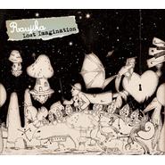

Lost Imagination
============================

|  |  |
| :--: | :-- |
| [ Lost Imagination](https://emumo.xiami.com/album/495726) | **艺人**: [Raujika](../index.md) **语种**: 其他 **唱片公司**: Palette Sounds **发行时间**: 2012年03月07日 **专辑类别**: 录音室专辑 **专辑风格**: 爵士说唱 Jazz Rap **播放数**: 1136506 **收藏数**: 1946 **评论数**: 127  |

## 简介

独自の世界観とオリエンタルなサウンドで絶大な人気を博しているRaujikaによる、ファン待望の新曲全10曲のインストアルバムが完成!これまで要望の絶えなかったインストゥルメンタル作品のみによるRaujikaのImaginary storyが遂にスタート!!!
 

Palette Soundsのコンピレーションアルバム&amp;Relaxing Collection&amp;(PLSD-009)に先行収録された、これぞRaujikaサウンドといえる「Melt Works」を筆頭に、今回もキュートでどこかミラクルな世界へと誘われる楽曲が多数収録!
 

独自の世界観とオリエンタルなサウンドで絶大な人気を博しているRaujikaによる、ファン待望のインストアルバムが完成!

## 曲目

## 评论

|  |  |  |
| :-- | :-- | :-- |
|  [虾米用户](https://emumo.xiami.com/u/20207)  2018-12-28 16:14 赞(0) 踩(0) | 
好听到错过路口还傻呵呵的乐
 |
|  [虾米用户](https://emumo.xiami.com/u/4873531) 喜欢的 西沢 ハチ n-... 2018-09-27 07:37 赞(0) 踩(0) | 
听了几首感觉这张质量巨高&amp;hellip;mark了 几个一点都不阴暗的节奏
 |
|  [虾米用户](https://emumo.xiami.com/u/2647943) 再见了，我亲爱的虾米。 2018-03-26 09:31 赞(0) 踩(0) | 
气氛微妙，暧昧来的刚刚好
 |
|  [虾米用户](https://emumo.xiami.com/u/342217) 其实我一点都不开心  2018-03-22 00:16 赞(0) 踩(0) | 
超爱这张专辑哟
 |
|  [虾米用户](https://emumo.xiami.com/u/71178106) 塵世や 酒、風呂を抜け ... 2017-11-03 08:19 赞(2) 踩(0) | 
♡
 |
|  [虾米用户](https://emumo.xiami.com/u/47971691) 听歌杂。偏爱纯音。 2017-07-29 08:09 赞(0) 踩(0) | 
灰常喜欢
 |
|  [虾米用户](https://emumo.xiami.com/u/1096231)  2017-01-04 21:48 赞(0) 踩(0) | 
第一次听到想哭的电子乐
 |
|  [虾米用户](https://emumo.xiami.com/u/367185)   2016-01-03 11:30 赞(2) 踩(0) | 
一次满足所有想象~
 |
|  [虾米用户](https://emumo.xiami.com/u/45349942)  2015-11-09 19:36 赞(0) 踩(0) | 
轻快
 |
|  [虾米用户](https://emumo.xiami.com/u/30617820) 窝列大窝列大哟 2015-10-05 13:09 赞(0) 踩(0) | 
(ಡωಡ)
 |
|  [虾米用户](https://emumo.xiami.com/u/7322777) ∮ 2015-08-02 08:32 赞(1) 踩(0) | 
...A...
 |
|  [虾米用户](https://emumo.xiami.com/u/806759) 时日曷丧,予及汝偕亡 2015-08-02 03:47 赞(0) 踩(0) | 
纯音乐，风格虽不单一，但是每首都令人陶醉
 |
|  [虾米用户](https://emumo.xiami.com/u/14091078) 我还没想好要写什么... 2015-07-25 19:23 赞(0) 踩(0) | 
正点
 |
|  [虾米用户](https://emumo.xiami.com/u/9025580) 听音乐是净化心理的必备过... 2015-06-03 11:19 赞(1) 踩(0) | 
赞
 |
|  [虾米用户](https://emumo.xiami.com/u/5169131) 我还没想好要写什么... 2015-03-30 22:03 赞(0) 踩(0) | 
迟来的赞!!
 |
|  [虾米用户](https://emumo.xiami.com/u/5019512) 琐碎即心碎。 2015-03-30 06:22 赞(0) 踩(0) | 
精灵=。=
 |
|  [虾米用户](https://emumo.xiami.com/u/7757466) 只想好好当个垃圾✓ 2015-03-23 14:29 赞(0) 踩(0) | 
☣
 |
|  [虾米用户](https://emumo.xiami.com/u/19121167)  2015-01-27 22:51 赞(0) 踩(0) | 
练习
 |
| ⇒ |  [虾米用户](https://emumo.xiami.com/u/7757466) 只想好好当个垃圾✓ 2015-03-23 14:29 赞(0) 踩(0) | 
☣
 |
|  [虾米用户](https://emumo.xiami.com/u/573642) 常不在线请留言 2015-01-05 14:12 赞(0) 踩(0) | 
路遇童话中的小精灵。
 |
|  [虾米用户](https://emumo.xiami.com/u/44100434)  2014-12-30 01:01 赞(0) 踩(0) | 
·
 |
|  [虾米用户](https://emumo.xiami.com/u/355865) Let it go, l... 2014-12-20 13:34 赞(0) 踩(0) | 
mark
 |
|  [虾米用户](https://emumo.xiami.com/u/6569477) 风随风飞 云随云走 雨落... 2014-11-23 21:06 赞(0) 踩(0) | 
赞~
 |
|  [虾米用户](https://emumo.xiami.com/u/32149466) 新年快乐 2014-11-11 23:54 赞(0) 踩(0) | 
﹏﹏﹏
 |
|  [虾米用户](https://emumo.xiami.com/u/2981584) 我去  虾米又改版了 2014-11-06 22:01 赞(0) 踩(0) | 
待听
 |
|  [虾米用户](https://emumo.xiami.com/u/7603978) 抽象为美，具象为女。 2014-09-06 23:51 赞(1) 踩(0) | 
喜欢背景里吱吱呀呀的声音好诡异又好可爱
 |
|  [虾米用户](https://emumo.xiami.com/u/35341268)  2014-09-04 00:00 赞(0) 踩(0) | 
哈哈
 |
|  [虾米用户](https://emumo.xiami.com/u/5844784)  2014-08-21 16:35 赞(16) 踩(0) | 
刚被老板劈头盖脸的骂过，转身听见这样的音乐响起。身边似有清风划过，无数小精灵跳跃，擦！嘿嘿嘿····突然觉得不能再好。
 |
| ⇒ |  [虾米用户](https://emumo.xiami.com/u/2542364) 再见虾米，以后再会。 2015-01-01 13:38 赞(0) 踩(0) | 
看到你这条评论我心情突然也变好了~
 |
| ⇒ |  [虾米用户](https://emumo.xiami.com/u/12222652) 再也不能好好的收藏了 2015-01-25 13:53 赞(0) 踩(0) | 
身份证找不着了，虾米歌单里突然听到这个音乐， 忽然觉得身外之物也不那么在意了。。。
 |
|  [虾米用户](https://emumo.xiami.com/u/33867346) 我想让喜欢就是单纯的喜欢 2014-08-09 11:14 赞(2) 踩(0) | 
真的很喜欢Raujika做的音乐，纯真带着一些灵气。美丽却把所有感情付诸之内。
 |
|  [虾米用户](https://emumo.xiami.com/u/5637112)  2014-07-31 15:44 赞(0) 踩(0) | 
LIKE!
 |
|  [虾米用户](https://emumo.xiami.com/u/1839447)  2014-06-07 08:06 赞(0) 踩(0) | 
Prim 还是朋友推荐我听的。听过之后好像感觉在田野里奔跑的感觉。
 |
|  [虾米用户](https://emumo.xiami.com/u/6626224)  2014-05-03 13:54 赞(0) 踩(0) | 
so mazing fucking so cool
 |
|  [虾米用户](https://emumo.xiami.com/u/990478) 「但愿人长久」 2014-05-02 08:24 赞(0) 踩(0) | 
梦幻的早晨～
 |
|  [虾米用户](https://emumo.xiami.com/u/1281870)  2014-04-24 15:39 赞(0) 踩(0) | 
是张非常有意思的专辑
 |
|  [虾米用户](https://emumo.xiami.com/u/1317745) limitless 2014-04-23 01:21 赞(0) 踩(0) | 
喂！(#`O′) 这专辑的曲风怎么这么多变啊！&amp;gt;&amp;lt;
 |
|  [虾米用户](https://emumo.xiami.com/u/30700444) Hovige 2014-03-31 13:40 赞(0) 踩(0) | 
我喜欢！
 |
|  [虾米用户](https://emumo.xiami.com/u/1609946) 一即一切 2014-03-29 15:22 赞(0) 踩(0) | 
心 境不二
 |
|  [虾米用户](https://emumo.xiami.com/u/5721676) 瀑瀑是最棒的！ 2014-03-24 22:44 赞(0) 踩(0) | 
<a href="http://emumo.xiami.com/u/1226831" target="_blank" rel="nofollow" name_card="1226831">@Fish</a> 我一直没找到我要的曲子- -但是遇到了这张 算是意外的收获？
 |
|  [虾米用户](https://emumo.xiami.com/u/19791860) 暂无签名~ 2014-03-23 00:15 赞(0) 踩(0) | 
这是歌吗？是微风细雨才对。
 |
|  [虾米用户](https://emumo.xiami.com/u/4721181)  2014-01-24 19:58 赞(0) 踩(0) | 
不能太美.轻灵.优雅.惊艳的曲风和编曲手法.不能极赞更多.
 |
| ⇒ |  [虾米用户](https://emumo.xiami.com/u/1832864)  2014-03-07 02:09 赞(0) 踩(0) | 
实在太好听了！
 |
|  [虾米用户](https://emumo.xiami.com/u/12345381)  2013-12-20 02:22 赞(0) 踩(0) | 
太好听了！
 |
|  [虾米用户](https://emumo.xiami.com/u/5844784)  2013-12-18 21:05 赞(0) 踩(0) | 
不想画图了，手指好痛头好痛心更痛。你他妈选专业的时候吃错药了，你他妈的不好好学习画毛线画啊！得！捂着被窝哭一台起来继续画图吧，有歌听世界还不错！
 |
| ⇒ |  [虾米用户](https://emumo.xiami.com/u/8543156)   2014-02-20 08:36 赞(0) 踩(0) | 
活捉一只画图狗 握个爪
 |
| ⇒ |  [虾米用户](https://emumo.xiami.com/u/1317745) limitless 2017-10-30 10:18 赞(0) 踩(0) | 
<q><b>ChloeE说：</b></q>
 |
|  [虾米用户](https://emumo.xiami.com/u/8697454)  2013-12-04 18:21 赞(0) 踩(0) | 
之前在豆瓣上收藏的，虾米猜出来了
 |
|  [虾米用户](https://emumo.xiami.com/u/3640177) 说神马好呢 2013-11-19 16:18 赞(0) 踩(0) | 
精灵古怪，机械人
 |
|  [虾米用户](https://emumo.xiami.com/u/26211330)  2013-11-06 19:24 赞(0) 踩(0) | 
喜欢日系的安静和动感。
 |
|  [虾米用户](https://emumo.xiami.com/u/757262) 虾米深挖掘员。 2013-07-19 14:26 赞(0) 踩(0) | 
好绚烂华丽的一张
 |
|  [虾米用户](https://emumo.xiami.com/u/745617) 我还没想好要写什么... 2013-06-19 11:05 赞(0) 踩(0) | 
听完这张顿时觉得他会成为另一个领袖！
 |
|  [虾米用户](https://emumo.xiami.com/u/12573731)  2013-05-26 10:32 赞(0) 踩(0) | 
qu
 |
|  [虾米用户](https://emumo.xiami.com/u/1700002) V5_ORZZZZZ 2013-03-28 19:57 赞(0) 踩(0) | 
FLAC:<a href="http://o2v3.imotor.com/thread-2085-1-2.html" target="_blank" rel="nofollow noreferrer noopener">http://o2v3.imotor.com/thread-2085-1-2.html</a>
 |
|  [虾米用户](https://emumo.xiami.com/u/606954)  2013-03-25 21:48 赞(0) 踩(0) | 
大爱
 |
|  [虾米用户](https://emumo.xiami.com/u/11883189) Sorting out 2013-03-20 20:54 赞(0) 踩(0) | 
Grim~~~~~~~~ 梦幻和大气可以并存！！
 |
|  [虾米用户](https://emumo.xiami.com/u/6873291) 我还没想好要写什么... 2013-03-19 17:26 赞(0) 踩(0) | 
好听
 |
|  [虾米用户](https://emumo.xiami.com/u/742352)  2013-03-18 21:11 赞(0) 踩(0) | 
很美好
 |
|  [虾米用户](https://emumo.xiami.com/u/11482506)  2013-03-02 22:17 赞(0) 踩(0) | 
宛若童话。
 |
|  [虾米用户](https://emumo.xiami.com/u/7181528)  2013-03-02 09:18 赞(0) 踩(0) | 
很好,谢谢分享
 |
|  [虾米用户](https://emumo.xiami.com/u/8608040) 在荒原里永远解不开的心结 2013-02-26 12:23 赞(0) 踩(0) | 
小浪漫
 |
|  [虾米用户](https://emumo.xiami.com/u/10456493)  2013-02-20 11:42 赞(0) 踩(0) | 
总感觉非常有生活的气息~~~恬静的电子音乐感觉让人非常的舒服
 |
|  [虾米用户](https://emumo.xiami.com/u/9342724)  2013-01-29 13:28 赞(0) 踩(0) | 
Grim~~~~~~~~~~~~~~~~~~~~~~~~~~~~~~~~~~~~ ~~~~~~~~~~~~~~~~~~~~~~~~~~~~~~~~~~~~~~~~ ~~~~~~~~~~~~~~~~~~~~~~~~~~~~~~~~~~~~~~~~ ~~~~·
 |
|  [虾米用户](https://emumo.xiami.com/u/11718752)  2012-11-30 10:49 赞(0) 踩(0) | 
有点小古怪德小小电子乐
 |
|  [虾米用户](https://emumo.xiami.com/u/6506348)  2012-11-28 15:25 赞(0) 踩(0) | 
每一辑都是经典。
 |
|  [虾米用户](https://emumo.xiami.com/u/6762617)  2012-10-25 22:03 赞(0) 踩(0) | 
一个很偶然的机会，听到了city of twilight ，从此大爱。
 |
|  [虾米用户](https://emumo.xiami.com/u/3812689)  2012-09-28 00:34 赞(0) 踩(0) | 
Grim很有味道
 |
|  [虾米用户](https://emumo.xiami.com/u/5388521) 我还没想好要写什么... 2012-08-16 16:14 赞(0) 踩(0) | 
真的超赞～
 |
|  [虾米用户](https://emumo.xiami.com/u/5388521) 我还没想好要写什么... 2012-08-16 13:10 赞(0) 踩(0) | 
大赞！
 |
|  [虾米用户](https://emumo.xiami.com/u/10172935)   2012-08-11 17:08 赞(0) 踩(0) | 
Grim 最愛
 |
|  [虾米用户](https://emumo.xiami.com/u/7688950) 中老年人 2012-08-06 14:36 赞(0) 踩(0) | 
.........gooood！
 |
|  [虾米用户](https://emumo.xiami.com/u/5383081)  2012-07-21 17:59 赞(0) 踩(0) | 
痛觉残留是大好人…… T.T 感动 真好听
 |
|  [虾米用户](https://emumo.xiami.com/u/3943834) 酷炫到没朋友！ 2012-07-14 14:16 赞(0) 踩(0) | 
我次奥！！！这位的曲子都好棒TWT！！！
 |
|  [虾米用户](https://emumo.xiami.com/u/9645012) 每一首歌，都是我想对你说... 2012-06-30 19:43 赞(0) 踩(0) | 
很清新的声音，
 |
|  [虾米用户](https://emumo.xiami.com/u/8381855)  2012-06-25 01:13 赞(0) 踩(0) | 
求高音质啊
 |
|  [虾米用户](https://emumo.xiami.com/u/9559040)  2012-06-23 14:22 赞(0) 踩(0) | 
摸
 |
|  [虾米用户](https://emumo.xiami.com/u/9045552)  2012-05-27 17:39 赞(0) 踩(0) | 
不用说了
 |
|  [虾米用户](https://emumo.xiami.com/u/3356244) Prominent 2012-05-26 18:56 赞(0) 踩(0) | 
太强大了      心灵世界太强大了
 |
|  [虾米用户](https://emumo.xiami.com/u/2892857)  2012-05-26 16:45 赞(0) 踩(0) | 
出专辑出到我不知道..好听死了..
 |
|  [虾米用户](https://emumo.xiami.com/u/7346084) 面倒くさい 2012-05-24 23:17 赞(0) 踩(0) | 
诡异的风格
 |
|  [虾米用户](https://emumo.xiami.com/u/5275136)  2012-05-20 13:11 赞(0) 踩(0) | 
good
 |
|  [虾米用户](https://emumo.xiami.com/u/3855326) 暂无签名~ 2012-05-17 19:49 赞(0) 踩(0) | 
惊艳
 |
|  [虾米用户](https://emumo.xiami.com/u/1460680)   2012-05-08 21:24 赞(0) 踩(0) | 
第六首好、
 |
|  [虾米用户](https://emumo.xiami.com/u/1396206) 聆听月升 2012-05-03 10:12 赞(0) 踩(0) | 
依旧忘不了那张童话
 |
|  [虾米用户](https://emumo.xiami.com/u/3652066)  2012-05-02 14:49 赞(0) 踩(0) | 
Raujika专辑的风格都很喜欢
 |
|  [虾米用户](https://emumo.xiami.com/u/3652066)  2012-05-02 14:48 赞(0) 踩(0) | 
第三张都有了啊？希望保持每年都出一张，我好有个盼头，嘿嘿
 |
|  [虾米用户](https://emumo.xiami.com/u/2527832) 超越生命 解放自由 2012-04-29 22:39 赞(0) 踩(0) | 
好開心啊,推薦給女孩子一定會很棒!!!
 |
|  [虾米用户](https://emumo.xiami.com/u/2448735)  2012-04-29 21:45 赞(0) 踩(0) | 
真的很喜欢第5首啊
 |
|  [虾米用户](https://emumo.xiami.com/u/6476743)  2012-04-29 09:12 赞(0) 踩(0) | 
Valerian 超赞
 |
|  [虾米用户](https://emumo.xiami.com/u/231797) 活着真好 好好活着 2012-04-23 02:14 赞(0) 踩(0) | 
收~
 |
|  [虾米用户](https://emumo.xiami.com/u/683286) 一切都在变 2012-04-21 19:53 赞(0) 踩(0) | 
必须赞！
 |
|  [虾米用户](https://emumo.xiami.com/u/5170986) 从小耍流氓，长大风清扬 2012-04-15 11:34 赞(0) 踩(0) | 
童话色彩浓郁~
 |
|  [虾米用户](https://emumo.xiami.com/u/6993154) 我还没想好要写什么... 2012-04-07 21:52 赞(0) 踩(0) | 
超赞啊~~~~~~~~~~~~~~~~
 |
|  [虾米用户](https://emumo.xiami.com/u/68796)  2012-04-02 17:00 赞(0) 踩(0) | 
惊喜~~
 |
|  [虾米用户](https://emumo.xiami.com/u/7501285) Minor Cause 2012-04-01 19:04 赞(0) 踩(0) | 
灰常好
 |
|  [虾米用户](https://emumo.xiami.com/u/7501285) Minor Cause 2012-04-01 19:03 赞(0) 踩(0) | 
好听
 |
|  [虾米用户](https://emumo.xiami.com/u/53096) 我还没想好要写什么... 2012-03-30 16:07 赞(0) 踩(0) | 
童真！
 |
|  [虾米用户](https://emumo.xiami.com/u/2361171) 音乐响起.又是美好的一天 2012-03-26 20:02 赞(0) 踩(0) | 
Raujika 作品!~
 |
|  [虾米用户](https://emumo.xiami.com/u/3164946)  2012-03-22 14:52 赞(0) 踩(0) | 
畅快的小清新
 |
|  [虾米用户](https://emumo.xiami.com/u/4471466)  2012-03-22 09:34 赞(0) 踩(0) | 
喔 Raujika新专辑……3.7还是我生日那天发布啊
 |
|  [虾米用户](https://emumo.xiami.com/u/5514787)  2012-03-12 10:41 赞(0) 踩(0) | 
好听！
 |
|  [虾米用户](https://emumo.xiami.com/u/3062740)  2012-03-11 20:21 赞(0) 踩(0) | 
心情大好。。。
 |
|  [虾米用户](https://emumo.xiami.com/u/1331982) 最初的记忆…… 2012-03-09 11:31 赞(0) 踩(0) | 
日本人的功力还是很深的
 |
|  [虾米用户](https://emumo.xiami.com/u/4053059)  2012-03-09 00:23 赞(0) 踩(0) | 
叛逆的小清新。
 |
|  [虾米用户](https://emumo.xiami.com/u/6515082)  2012-03-08 06:10 赞(0) 踩(0) | 
raujika的音乐都十分不不错
 |
|  [虾米用户](https://emumo.xiami.com/u/597569) 何必故作姿态 2012-03-07 22:59 赞(0) 踩(0) | 
来晚了 0 0
 |
|  [虾米用户](https://emumo.xiami.com/u/2365902)  2012-03-06 17:58 赞(0) 踩(0) | 
痛觉不残留 医生V5
 |
|  [虾米用户](https://emumo.xiami.com/u/2273878) for freedom! 2012-03-06 02:04 赞(0) 踩(0) | 
可爱。
 |
|  [虾米用户](https://emumo.xiami.com/u/1052461) @blinK4sy- 2012-03-05 22:43 赞(0) 踩(0) | 
M.
 |
|  [虾米用户](https://emumo.xiami.com/u/1128005)  2012-03-05 19:45 赞(0) 踩(0) | 
@suki纳言门ting9推荐，的确不错
 |
| ⇒ |  [虾米用户](https://emumo.xiami.com/u/931843)  2012-03-11 15:30 赞(0) 踩(0) | 
me？？？
 |
|  [虾米用户](https://emumo.xiami.com/u/1247234) Silhouette。 2012-03-05 19:43 赞(0) 踩(0) | 
m
 |
|  [虾米用户](https://emumo.xiami.com/u/2015278) 呵呵。。== 2012-03-05 19:15 赞(0) 踩(0) | 
nice..
 |
|  [虾米用户](https://emumo.xiami.com/u/883397) 回首向来萧瑟处，也无风雨... 2012-03-05 19:11 赞(0) 踩(0) | 
另类清新纯音乐~大爱之……
 |
|  [虾米用户](https://emumo.xiami.com/u/1006409)  2012-03-05 17:24 赞(0) 踩(0) | 
从第五首开始，我的菜来了~~@小禹纷飞
 |
|  [虾米用户](https://emumo.xiami.com/u/1495255) 时间是炸弹 2012-03-05 14:33 赞(0) 踩(0) | 
@@ 必须收
 |
|  [虾米用户](https://emumo.xiami.com/u/3971084) Life sucks，m... 2012-03-05 12:29 赞(0) 踩(0) | 
mark.
 |
|  [虾米用户](https://emumo.xiami.com/u/1327194)  2012-03-05 11:16 赞(0) 踩(0) | 
wow，相当不错……
 |
|  [虾米用户](https://emumo.xiami.com/u/1327194)  2012-03-05 11:04 赞(0) 踩(0) | 
wow，相当不错……
 |
|  [虾米用户](https://emumo.xiami.com/u/1327194)  2012-03-05 10:59 赞(0) 踩(0) | 
wow，相当不错……
 |
|  [虾米用户](https://emumo.xiami.com/u/1396206) 聆听月升 2012-03-04 15:47 赞(0) 踩(0) | 
听了第五轨，大爱啊。焦急等待完整专辑。。。
 |
|  [虾米用户](https://emumo.xiami.com/u/1156608)   2012-03-04 12:12 赞(0) 踩(0) | 
灰常好听~
 |
|  [虾米用户](https://emumo.xiami.com/u/4147939)  2012-03-03 21:19 赞(0) 踩(0) | 

 |
| ⇒ |  [虾米用户](https://emumo.xiami.com/u/654083)  2012-03-05 13:23 赞(0) 踩(0) | 
&amp;amp;nbsp;
 |
|  [虾米用户](https://emumo.xiami.com/u/5555550) 一只小小鲤 2012-03-03 17:29 赞(0) 踩(0) | 
Valerian .赞！
 |
|  [虾米用户](https://emumo.xiami.com/u/4925267)  2012-03-01 11:00 赞(0) 踩(0) | 
期待!!!
 |
|  [虾米用户](https://emumo.xiami.com/u/5170986) 从小耍流氓，长大风清扬 2012-02-26 10:33 赞(0) 踩(0) | 
YO~可算有新专了
 |
