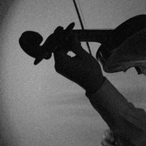
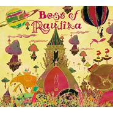

Raujika
============================

|  |  |
| :--: | :-- |
| [ Raujika](https://i.xiami.com/raujika) | **地区**: Japan 日本 **风格**: 爵士嘻哈 Jazz Hip Hop, 流行 Pop, 爵士 Jazz **播放数**: 9138847 **粉丝数**: 11806 **评论数**: 347  |

## 档案

小档案 
原    名：Raujika 
性    别：男 
国    籍：日本 Japan 
涉及分类：爵士 Jazz 
涉及风格：爵士钢琴 Jazz Piano、爵士人声 Vocal Jazz 
微博： https://www.weibo.com/raujika 
简介 
Raujika，来自日本的爵士歌手，他的歌曲将古典与现代流行元素完美结合。2010年，他推出的第一张专辑《Fairy Tale》，运用了许多和风元素和布曲，很好地将把hip-hop跟钢琴音律融合在一起。除了音乐之外，他在专辑里制作的Vocal部分也是值得细听和回味的。 
专辑 
2010-07-07 《Fairy Tale》 
2011-05-11 《Art Of The World》 
2012-03-07 《Lost Imagination》 
2014-12    《Best of Raujika》 
—————————————————————————————————————— 
Raujika、クラシック音楽の持つ音楽性と、 現代社会におけるテクノロジーを、ハイブリッドな感覚で融合したオリジナルなスタイルが特徴で、瀬戸智樹率いるクリエイティブ集団Palette Soundsに所属。 
経歴 
5歳からViolinを始め、Violinistならではの弦アレンジを武器に、本格的なオーケスト レーションまで、作曲、アレンジできる高度な作曲能力は、日本を代表する坂本龍一や久石譲などの作曲家通じる部分がある。2010年に1stアルバム「Fairy tale」をリリースし好評を博し、2011年に2ndアルバム「The Art of World」をリリース。 
アルバム 
「Fairy Tale」  2010-07-07 
「Art Of The World」  2011-05-11 
「Lost Imagination」  2012-3-7 
「Best of Raujika」  2014-12 
—————————————————————————————————————— 
艺人经纪公司：上海乐梦实业有限公司（Bad News）新浪微博：@上海乐梦_Bad_News_China 
同时我们也乐于与大家进行关于承接Bad News签约艺人演出活动、音乐制作、以及音乐版权使用等相关合作，如有意向，请及时与我们联系

## 专辑

| 名称 | 语种 | 唱片公司 | 发行时间 | 专辑类别 | 专辑风格 |
| :--: | :-- | :-- | :-- | :-- | :-- |
| [ Best of Raujika](./albums/17501726.md) | 日语 | Fauvisme | 2014年12月10日 | 精选集 |  |
| [ Lost Imagination](./albums/495726.md) | 其他 | Palette Sounds | 2012年03月07日 | 录音室专辑 | 爵士说唱 Jazz Rap |
| [ Art Of The World](./albums/437963.md) | 日语 | Palette Sounds | 2011年05月11日 | 录音室专辑 | 爵士说唱 Jazz Rap |
| [ Fairy tale](./albums/389942.md) | 日语 | Palette Sounds | 2010年07月07日 | 录音室专辑 | 爵士说唱 Jazz Rap |

## 评论

|  |  |  |
| :-- | :-- | :-- |
|  [虾米用户](https://emumo.xiami.com/u/40603098) You can’t ho... 2019-11-15 13:41 赞(0) 踩(0) | 

 |
|  [虾米用户](https://emumo.xiami.com/u/352606128) 内心丰富的人，永远不会孤... 2019-10-20 12:58 赞(0) 踩(0) | 
喜欢你的音乐，充满希望，积极向上，暴风雨或许只是暂时的，乌云背后总会出现阳光！
 |
|  [虾米用户](https://emumo.xiami.com/u/356763773) 我还没想好要写什么... 2019-10-11 11:51 赞(0) 踩(0) | 
。
 |
|  [虾米用户](https://emumo.xiami.com/u/276944698) 不要自我设限..... 2019-06-24 14:36 赞(1) 踩(0) | 

 |
|  [虾米用户](https://emumo.xiami.com/u/14630357) 初次见面，请多指教。 2019-05-20 15:53 赞(1) 踩(0) | 
多少年没新专辑了？ QAQ 对了 这个音乐人Hidetake Takayama的很多首 简直跟Raujika一模一样的风格 我都怀疑是同一个人了 你们快去听
 |
|  [虾米用户](https://emumo.xiami.com/u/228843687) 懒惰统治人间 2018-10-23 15:10 赞(0) 踩(0) | 
。
 |
|  [虾米用户](https://emumo.xiami.com/u/2928117) 你好 2018-08-09 20:53 赞(2) 踩(0) | 
Raujika先生来中国啊，我等你好久了。
 |
|  [虾米用户](https://emumo.xiami.com/u/7872701) 多一份远见，就少一分刺激 2018-08-09 16:21 赞(1) 踩(0) | 
这是，要来了？？？ bad news带？
 |
| ⇒ |  [虾米用户](https://emumo.xiami.com/u/345106099)  2018-08-13 18:14 赞(0) 踩(0) | 
什么时候哇
 |
| ⇒ |  [虾米用户](https://emumo.xiami.com/u/7872701) 多一份远见，就少一分刺激 2018-08-13 20:02 赞(0) 踩(0) | 
<q><b>美緖说：</b></q>
 |
|  [虾米用户](https://emumo.xiami.com/u/1115247) @Nebula_7293 2018-05-24 19:50 赞(0) 踩(0) | 
❤️
 |
|  [虾米用户](https://emumo.xiami.com/u/52415194) ♬♩♫♪♡ 2018-04-16 23:54 赞(0) 踩(0) | 
｜
 |
|  [虾米用户](https://emumo.xiami.com/u/12464012) 这个世界太疯狂 2018-04-08 16:14 赞(0) 踩(0) | 
为什么会有白岩松的相片？？？？？
 |
|  [虾米用户](https://emumo.xiami.com/u/20177386) 感谢一切美好的遇见❤️ 2018-04-02 19:33 赞(0) 踩(0) | 

 |
|  [虾米用户](https://emumo.xiami.com/u/45511319) 天太冷了不想起床上厕所…... 2018-01-19 19:27 赞(1) 踩(0) | 
艺人相册里都什么妖魔鬼怪&amp;hellip;&amp;hellip;（&amp;minus;＿&amp;minus;；）
 |
|  [虾米用户](https://emumo.xiami.com/u/210275172) 麦田里的守望者 2017-12-30 21:05 赞(0) 踩(0) | 
初中到大学打卡
 |
|  [虾米用户](https://emumo.xiami.com/u/276944698) 不要自我设限..... 2017-11-27 14:35 赞(0) 踩(0) | 

 |
|  [虾米用户](https://emumo.xiami.com/u/55130001) 大道至简，幻悲立轩 2017-11-21 20:06 赞(0) 踩(0) | 
听他的曲子回忆起了梦境中童话般的城堡和蓝天绿草，还有一个在城堡中驻足凝望的公主 
 |
|  [虾米用户](https://emumo.xiami.com/u/7184132) 我很聪明，什么也没留下。 2017-10-30 10:18 赞(1) 踩(0) | 
当年我听fairy tail百度连raujika都搜不到，现在渐渐有人知道了但还是不火啊。这样的风格好喜欢，希望继续写出好歌=￣ω￣=
 |
|  [虾米用户](https://emumo.xiami.com/u/5169131) 我还没想好要写什么... 2017-06-25 12:19 赞(0) 踩(0) | 
消失人群，望能再次出现
 |
|  [虾米用户](https://emumo.xiami.com/u/245249479) 张盛渔 2017-06-07 22:35 赞(0) 踩(0) | 
[带墨镜笑][带墨镜笑][带墨镜笑]
 |
|  [虾米用户](https://emumo.xiami.com/u/10418785)  2017-04-20 23:32 赞(0) 踩(0) | 
老鸡卡
 |
|  [虾米用户](https://emumo.xiami.com/u/35486787) 寻找最优秀的…… 2017-04-17 10:22 赞(0) 踩(0) | 
接近无国界标准。
 |
|  [虾米用户](https://emumo.xiami.com/u/43418234) ^_−☆ 2017-04-04 09:52 赞(0) 踩(0) | 

 |
|  [虾米用户](https://emumo.xiami.com/u/253330496)   2017-03-20 10:51 赞(0) 踩(0) | 
  
 |
|  [虾米用户](https://emumo.xiami.com/u/13911932) 暂冇签名~ 2016-12-30 14:21 赞(1) 踩(0) | 
[带墨镜笑]
 |
|  [虾米用户](https://emumo.xiami.com/u/45298985) Wechat:dqx19... 2016-10-16 18:01 赞(2) 踩(0) | 
+
 |
|  [虾米用户](https://emumo.xiami.com/u/2542364) 再见虾米，以后再会。 2016-08-03 16:50 赞(2) 踩(0) | 
今天才注意到介绍…  “史诗与hip-hop的完美融合”  史诗……史诗？？？！
 |
|  [虾米用户](https://emumo.xiami.com/u/119896142)   2016-07-27 07:44 赞(0) 踩(0) | 

 |
|  [虾米用户](https://emumo.xiami.com/u/35318386) QWQ 2016-05-26 11:55 赞(1) 踩(0) | 
大师
 |
|  [虾米用户](https://emumo.xiami.com/u/45818524) 致我所爱的人好夢~Twi... 2016-05-10 09:33 赞(0) 踩(0) | 
喜欢
 |
|  [虾米用户](https://emumo.xiami.com/u/9513422) 虾米歌单迁徙到网易☁️:... 2016-04-20 20:32 赞(0) 踩(0) | 
Back again❤️
 |
|  [虾米用户](https://emumo.xiami.com/u/49982597) fatalistic 2016-04-05 21:50 赞(0) 踩(0) | 
らうじか
 |
|  [虾米用户](https://emumo.xiami.com/u/35626829)  2016-03-06 23:27 赞(0) 踩(0) | 
很不错的风格
 |
|  [虾米用户](https://emumo.xiami.com/u/48044308) 跳坑隔壁某易云中，欢迎来... 2016-03-05 21:23 赞(0) 踩(0) | 
真的纯净透明灵动，喜欢的不行   
 |
|  [虾米用户](https://emumo.xiami.com/u/52506830) 再见 2016-02-23 18:51 赞(0) 踩(0) | 
回
 |
|  [虾米用户](https://emumo.xiami.com/u/7184132) 我很聪明，什么也没留下。 2016-02-16 15:32 赞(12) 踩(0) | 
认识他的时候甚至百度都找不到他的名字，现在也是不甚红火的样子。不过小众也好，喜希望你继续创作呀。
 |
|  [虾米用户](https://emumo.xiami.com/u/22881143) ㅤㅤㅤㅤ 2016-02-12 01:48 赞(0) 踩(0) | 
.
 |
|  [虾米用户](https://emumo.xiami.com/u/47079481) 投喂我吧  2016-02-06 16:20 赞(2) 踩(0) | 
raujika有顆很童真的心
 |
|  [虾米用户](https://emumo.xiami.com/u/68095692) 遠離憂愁  :) 2016-01-08 17:00 赞(0) 踩(0) | 
nice
 |
|  [虾米用户](https://emumo.xiami.com/u/9281390)  2015-12-05 22:06 赞(0) 踩(0) | 
大大大大大是大大
 |
|  [虾米用户](https://emumo.xiami.com/u/6205474) 我只是个酱油~ 2015-11-17 21:10 赞(0) 踩(0) | 
~~~~~~~~~~~~~~~~~~~~~~~~~~~~~~ ~~~~~~
 |
|  [虾米用户](https://emumo.xiami.com/u/11752665) 。 2015-11-13 18:06 赞(0) 踩(0) | 
无解
 |
|  [虾米用户](https://emumo.xiami.com/u/70195274)   2015-11-10 20:32 赞(0) 踩(0) | 
赞一个
 |
|  [虾米用户](https://emumo.xiami.com/u/49354248) 纯音乐是语言 2015-11-10 16:03 赞(1) 踩(0) | 
听过很多曲子，从未注意作曲者。今日有幸认知，相见恨晚！
 |
|  [虾米用户](https://emumo.xiami.com/u/49354248) 纯音乐是语言 2015-11-10 16:00 赞(1) 踩(0) | 
@OKAWRI
 |
|  [虾米用户](https://emumo.xiami.com/u/44511491) 爱动漫、纯音、音游、东方... 2015-10-23 00:15 赞(0) 踩(0) | 
留名
 |
|  [虾米用户](https://emumo.xiami.com/u/12034309) 一直在一起 2015-10-17 12:16 赞(0) 踩(0) | 
合胃口
 |
|  [虾米用户](https://emumo.xiami.com/u/11874730) 沉舟侧畔 千帆过。 2015-10-04 11:19 赞(0) 踩(0) | 
相见恨晚。
 |
|  [虾米用户](https://emumo.xiami.com/u/44784434) 变得和我一样库 2015-09-27 23:28 赞(3) 踩(0) | 
日本jazz hip hop为何辣么屌
 |
|  [虾米用户](https://emumo.xiami.com/u/44784434) 变得和我一样库 2015-09-27 23:28 赞(0) 踩(0) | 
阔以！
 |
|  [虾米用户](https://emumo.xiami.com/u/12348095) 青空晴雨，霡霂如画。 2015-08-30 19:48 赞(0) 踩(0) | 
因bamboo发现了他，然后一听三年。每首都有故事。
 |
|  [虾米用户](https://emumo.xiami.com/u/37840483) 再說吧 2015-08-22 19:37 赞(0) 踩(0) | 
嘿嘿
 |
|  [虾米用户](https://emumo.xiami.com/u/55486334)  2015-08-19 17:17 赞(0) 踩(0) | 
日风还是很强烈，一听就是。
 |
|  [虾米用户](https://emumo.xiami.com/u/5197721) ÔvÔ 2015-08-10 18:49 赞(0) 踩(0) | 
这种每张专辑都可以循环好几遍的音乐人，真不容易找。。。
 |
|  [虾米用户](https://emumo.xiami.com/u/11052613) 阳光猛烈，万物显形。 2015-08-01 20:04 赞(0) 踩(0) | 
早破茧了，揍是这样
 |
|  [虾米用户](https://emumo.xiami.com/u/42361373) 感恩虾米，让我们相遇！请... 2015-07-22 21:25 赞(11) 踩(0) | 
其实看见第二热门的“破茧”论 的时候我是拒绝的，音乐释放自己想表达的就够了，管你觉得好坏呢？累
 |
|  [虾米用户](https://emumo.xiami.com/u/37925975) 朋克  日系摇滚  民谣... 2015-06-23 14:00 赞(0) 踩(0) | 
牛逼！曲子我爱！很有创作才华！
 |
|  [虾米用户](https://emumo.xiami.com/u/13704947) 豆瓣见：无悲渊。 2015-06-23 10:41 赞(0) 踩(0) | 
有故事的人，想要告诉你更多故事。
 |
|  [虾米用户](https://emumo.xiami.com/u/13704947) 豆瓣见：无悲渊。 2015-06-23 10:41 赞(0) 踩(0) | 
有故事的人，想要告诉你更多故事。
 |
|  [虾米用户](https://emumo.xiami.com/u/4306664) 我还没想好要写什么... 2015-06-12 10:43 赞(0) 踩(0) | 
奶斯
 |
|  [虾米用户](https://emumo.xiami.com/u/49766600)  2015-05-31 21:21 赞(4) 踩(0) | 
作为一名音乐家，能做出这样的曲子 一定是心里有种各种各样的故事，才能传达给人们，喜欢热爱生活的人，所以更想知道每首曲子背后的故事......
 |
|  [虾米用户](https://emumo.xiami.com/u/10389859) 摇节奏品感觉 2015-05-13 17:33 赞(0) 踩(0) | 
Raujika
 |
|  [虾米用户](https://emumo.xiami.com/u/39788841)  . 2015-05-09 14:28 赞(0) 踩(0) | 
Lium
 |
|  [虾米用户](https://emumo.xiami.com/u/3097798) 爱二次元，二次元赛高 2015-04-25 00:07 赞(0) 踩(0) | 
日本的JAZZ HIP HOP 辨识度可真高
 |
|  [虾米用户](https://emumo.xiami.com/u/27929421) FOREVER KOBE... 2015-04-23 12:25 赞(0) 踩(0) | 
音乐没有国界
 |
|  [虾米用户](https://emumo.xiami.com/u/9022095) Freestyle 2015-04-18 16:10 赞(0) 踩(0) | 
匿
 |
|  [虾米用户](https://emumo.xiami.com/u/22091218)  2015-04-10 16:10 赞(0) 踩(0) | 
梦境冒险
 |
|  [虾米用户](https://emumo.xiami.com/u/5765043) 我还没想好要写什么... 2015-04-05 22:57 赞(3) 踩(0) | 
从来没有哪位音乐家有这么多首都让人百听不厌
 |
|  [虾米用户](https://emumo.xiami.com/u/47204099)   2015-04-05 05:58 赞(0) 踩(0) | 
很好听
 |
|  [虾米用户](https://emumo.xiami.com/u/5169131) 我还没想好要写什么... 2015-03-30 21:59 赞(0) 踩(0) | 
张张精品
 |
|  [虾米用户](https://emumo.xiami.com/u/6111570) 我想请你吃雪糕 2015-03-30 18:19 赞(1) 踩(0) | 
三年了 只想说声感谢！
 |
|  [虾米用户](https://emumo.xiami.com/u/12237675) 脑乱/喜欢听伴奏 2015-03-29 01:06 赞(0) 踩(0) | 
0 0
 |
|  [虾米用户](https://emumo.xiami.com/u/33732659) 暂无签名~ 2015-03-27 22:47 赞(1) 踩(0) | 
天才，音乐很快，轻而有力。
 |
|  [虾米用户](https://emumo.xiami.com/u/6066908) 光芒与希望 *JazzH... 2015-03-26 22:43 赞(0) 踩(0) | 
明亮的音乐~听了让人心情好起来~
 |
|  [虾米用户](https://emumo.xiami.com/u/41559850) . 2015-03-25 20:30 赞(1) 踩(0) | 
Nu叔詐屍後你也放了麼⋯
 |
|  [虾米用户](https://emumo.xiami.com/u/11203730)  2015-03-25 14:31 赞(0) 踩(0) | 
这哥们简直森男
 |
|  [虾米用户](https://emumo.xiami.com/u/7757466) 只想好好当个垃圾✓ 2015-03-23 14:30 赞(0) 踩(0) | 
☣
 |
|  [虾米用户](https://emumo.xiami.com/u/31567159) Wha Dah Fah  2015-03-14 09:54 赞(0) 踩(0) | 
1
 |
|  [虾米用户](https://emumo.xiami.com/u/6500137)  2015-03-12 20:19 赞(0) 踩(0) | 
√
 |
|  [虾米用户](https://emumo.xiami.com/u/5662640) 失落 2015-02-28 11:24 赞(0) 踩(0) | 
Raujika
 |
|  [虾米用户](https://emumo.xiami.com/u/44368575)   2015-02-25 18:10 赞(0) 踩(0) | 
。
 |
|  [虾米用户](https://emumo.xiami.com/u/10437744) 我还没想好要写什么..b... 2015-02-25 08:15 赞(1) 踩(0) | 
听过nujabes的作品听这些都有点挑了
 |
|  [虾米用户](https://emumo.xiami.com/u/12222652) 再也不能好好的收藏了 2015-02-24 15:54 赞(0) 踩(0) | 
是不是国内的同类系艺人的成长环境差别太大， 总觉得国内真的很难出一个这类的人才，虽然已经有很多了。
 |
| ⇒ |  [虾米用户](https://emumo.xiami.com/u/5062396) 热爱真实生活即真实英雄主... 2015-08-28 02:01 赞(0) 踩(0) | 
多吗？
 |
|  [虾米用户](https://emumo.xiami.com/u/43579820)  2015-02-14 17:29 赞(0) 踩(0) | 
最喜欢的音乐大师
 |
|  [虾米用户](https://emumo.xiami.com/u/44760704) 暂无签名~ 2015-02-11 16:11 赞(0) 踩(0) | 
听到吗，音乐也是有颜色的。日本人做音乐，总有一种沉静在里面，听*
 |
|  [虾米用户](https://emumo.xiami.com/u/8254943)  2015-01-21 15:34 赞(1) 踩(0) | 
剪日系片子可以用到
 |
|  [虾米用户](https://emumo.xiami.com/u/43340213)  2015-01-13 19:34 赞(0) 踩(0) | 
灵动。。
 |
|  [虾米用户](https://emumo.xiami.com/u/13220391)  2014-12-30 05:37 赞(0) 踩(0) | 
融入好多元素的繽紛旋律
 |
|  [虾米用户](https://emumo.xiami.com/u/44100434)  2014-12-30 01:00 赞(0) 踩(0) | 
·
 |
|  [虾米用户](https://emumo.xiami.com/u/44100434)  2014-12-30 01:00 赞(0) 踩(0) | 
各个
 |
|  [虾米用户](https://emumo.xiami.com/u/5169131) 我还没想好要写什么... 2014-12-13 23:01 赞(0) 踩(0) | 
还是最喜欢第一张了
 |
|  [虾米用户](https://emumo.xiami.com/u/9231290) 静若瘫痪,动如癫痫 2014-12-12 13:50 赞(0) 踩(0) | 
灵动系 Jazz-hiphop ...
 |
|  [虾米用户](https://emumo.xiami.com/u/32461398) 曾在云上浮想联翩如今也终... 2014-12-04 20:02 赞(0) 踩(0) | 
~
 |
|  [虾米用户](https://emumo.xiami.com/u/5169131) 我还没想好要写什么... 2014-11-26 19:35 赞(0) 踩(0) | 
usr fny 新专也不发了，好伤心
 |
|  [虾米用户](https://emumo.xiami.com/u/9196076)   2014-11-20 13:22 赞(0) 踩(0) | 
好喜欢咩
 |
|  [虾米用户](https://emumo.xiami.com/u/1700002) V5_ORZZZZZ 2014-11-18 14:57 赞(0) 踩(0) | 
Best of Raujika
 |
|  [虾米用户](https://emumo.xiami.com/u/5691092) 爱生活 爱音乐 爱影视 2014-11-17 13:57 赞(0) 踩(0) | 
来晚了。
 |
|  [虾米用户](https://emumo.xiami.com/u/365166) 人不可无自信 2014-11-11 13:13 赞(0) 踩(0) | 
太屌……
 |
|  [虾米用户](https://emumo.xiami.com/u/14494009)  2014-11-07 17:37 赞(0) 踩(0) | 
钢琴结合hip-hop
 |
|  [虾米用户](https://emumo.xiami.com/u/10367658) Mr. Mechcata 2014-09-03 22:43 赞(0) 踩(0) | 
BGM
 |
|  [虾米用户](https://emumo.xiami.com/u/40599603) IsL 2014-09-02 03:32 赞(0) 踩(0) | 
聲音&amp;gt;  &amp;lt;~
 |
|  [虾米用户](https://emumo.xiami.com/u/40449628) 才知道有目标才最重要 2014-09-01 10:36 赞(1) 踩(0) | 
早晨听到city of twilight真是舒服！！
 |
|  [虾米用户](https://emumo.xiami.com/u/6111570) 我想请你吃雪糕 2014-08-30 18:00 赞(1) 踩(0) | 
听电台时发现男科医院的广告用的是City of Twilight
 |
|  [虾米用户](https://emumo.xiami.com/u/7825617)  2014-08-09 19:28 赞(0) 踩(0) | 
henhao
 |
|  [虾米用户](https://emumo.xiami.com/u/451700) ㊙️ 2014-08-09 00:50 赞(1) 踩(0) | 
小苍MM做LOL视屏用到了他的曲子，找了很多年。终于找到了。
 |
| ⇒ |  [虾米用户](https://emumo.xiami.com/u/6111570) 我想请你吃雪糕 2014-08-30 17:59 赞(0) 踩(0) | 
不谈 当年看的猴子视频  就是里面的曲子
 |
| ⇒ |  [虾米用户](https://emumo.xiami.com/u/451700) ㊙️ 2014-09-01 08:58 赞(0) 踩(0) | 
<q><b>oyasumi说：</b></q>
 |
| ⇒ |  [虾米用户](https://emumo.xiami.com/u/6111570) 我想请你吃雪糕 2014-09-01 09:12 赞(0) 踩(0) | 
<q><b>kisto说：</b></q>
 |
|  [虾米用户](https://emumo.xiami.com/u/16745497) 我还没想好要写什么... 2014-07-30 11:51 赞(0) 踩(0) | 
重温Jazz hip hop
 |
|  [虾米用户](https://emumo.xiami.com/u/3353664)   2014-07-28 16:27 赞(0) 踩(0) | 
Fairy tale循环无数遍，今天突然听到Art Of the World中的Cry More，抬头果然是他，每一曲都是精灵曲~~
 |
|  [虾米用户](https://emumo.xiami.com/u/30335286)  2014-07-20 20:35 赞(0) 踩(0) | 
Nice
 |
|  [虾米用户](https://emumo.xiami.com/u/12067136)  2014-07-13 00:23 赞(0) 踩(0) | 
一赞到底
 |
|  [虾米用户](https://emumo.xiami.com/u/6763057) 逍遙；解脫！ 2014-07-08 19:17 赞(0) 踩(0) | 
喜歡!
 |
|  [虾米用户](https://emumo.xiami.com/u/20714769)  2014-07-07 04:29 赞(0) 踩(0) | 
city of twilight 无解！
 |
|  [虾米用户](https://emumo.xiami.com/u/30349700) 不要吃太胖哦~会被杀掉的 2014-07-05 20:41 赞(0) 踩(0) | 
留名！
 |
|  [虾米用户](https://emumo.xiami.com/u/6066908) 光芒与希望 *JazzH... 2014-07-05 18:21 赞(0) 踩(0) | 
有的曲子，我觉得很适合去配宫崎骏的电影~
 |
|  [虾米用户](https://emumo.xiami.com/u/12551665) 海面星光点点，就像我的眼 2014-07-01 16:06 赞(0) 踩(0) | 
非常棒的一位歌手
 |
|  [虾米用户](https://emumo.xiami.com/u/10538826)  2014-06-03 16:36 赞(0) 踩(0) | 

 |
|  [虾米用户](https://emumo.xiami.com/u/1631157) 他们说我的签名不健康 2014-05-24 08:13 赞(0) 踩(0) | 
这么可爱一定是男孩子
 |
|  [虾米用户](https://emumo.xiami.com/u/11643877) 姑且听之 2014-05-22 19:35 赞(0) 踩(0) | 
居然没留名-_-///
 |
|  [虾米用户](https://emumo.xiami.com/u/11830226)  2014-05-21 18:47 赞(0) 踩(0) | 
sd
 |
|  [虾米用户](https://emumo.xiami.com/u/2307526) 连接比特与像素的造梦师！ 2014-05-19 15:35 赞(0) 踩(0) | 
City of Twilight!
 |
|  [虾米用户](https://emumo.xiami.com/u/34395904)  2014-05-19 09:33 赞(0) 踩(0) | 
安静，世界终于清静了。。
 |
|  [虾米用户](https://emumo.xiami.com/u/6111570) 我想请你吃雪糕 2014-05-10 19:16 赞(0) 踩(0) | 
童话氛围jazz hiphop
 |
|  [虾米用户](https://emumo.xiami.com/u/93178)  2014-05-07 21:19 赞(0) 踩(0) | 
灵动
 |
|  [虾米用户](https://emumo.xiami.com/u/1545527) 努力生活并保持自我就是最... 2014-04-27 19:51 赞(1) 踩(0) | 
好听就足够了
 |
|  [虾米用户](https://emumo.xiami.com/u/1317745) limitless 2014-04-27 19:49 赞(0) 踩(0) | 
每张专辑都好喜欢哦哦哦哦~
 |
| ⇒ |  [虾米用户](https://emumo.xiami.com/u/7572176) 哈哈哈哈 2014-05-14 22:24 赞(0) 踩(0) | 
To X
 |
| ⇒ |  [虾米用户](https://emumo.xiami.com/u/1317745) limitless 2014-05-15 02:20 赞(0) 踩(0) | 
<q><b>fantasy125说：</b></q>
 |
|  [虾米用户](https://emumo.xiami.com/u/4031837) 驾！ 2014-04-24 23:59 赞(0) 踩(0) | 
古典跨界，洋气欢脱
 |
|  [虾米用户](https://emumo.xiami.com/u/9117580)  2014-04-24 18:53 赞(0) 踩(0) | 
I know this guy
 |
|  [虾米用户](https://emumo.xiami.com/u/1555162)  2014-04-03 12:37 赞(5) 踩(0) | 
砖家真他妈的多
 |
|  [虾米用户](https://emumo.xiami.com/u/16151304) 暖暖的 2014-03-29 09:07 赞(0) 踩(0) | 
jazz 么么哒~
 |
|  [虾米用户](https://emumo.xiami.com/u/9452138) 我还没想好要写什么... 2014-03-24 10:24 赞(1) 踩(0) | 
偏向hiphop的电子，和jazz没什么关系，基本上停下来没采样爵士曲
 |
|  [虾米用户](https://emumo.xiami.com/u/19791860) 暂无签名~ 2014-03-23 00:12 赞(1) 踩(0) | 
社会燥热时，就需要雨水的洗礼。
 |
|  [虾米用户](https://emumo.xiami.com/u/12366429)  2014-03-15 14:52 赞(0) 踩(0) | 
Jazz-hiphop绝赞!
 |
|  [虾米用户](https://emumo.xiami.com/u/7501285) Minor Cause 2014-03-07 23:01 赞(0) 踩(0) | 
绝美女声
 |
|  [虾米用户](https://emumo.xiami.com/u/1555162)  2014-03-06 12:30 赞(0) 踩(0) | 
Valerian 和风满满
 |
|  [虾米用户](https://emumo.xiami.com/u/12424426) be aware 2014-03-01 18:37 赞(0) 踩(0) | 
。
 |
|  [虾米用户](https://emumo.xiami.com/u/1912867)  2014-02-12 21:20 赞(0) 踩(0) | 
background 最近听了好多BGM啊
 |
|  [虾米用户](https://emumo.xiami.com/u/30442011)  2014-01-21 10:27 赞(0) 踩(0) | 
路过
 |
|  [虾米用户](https://emumo.xiami.com/u/30749875)  2014-01-10 00:07 赞(0) 踩(0) | 
你太棒了！支持你，永远爱你支持你相信你！
 |
|  [虾米用户](https://emumo.xiami.com/u/30749875)  2014-01-10 00:04 赞(1) 踩(0) | 
发现比之前听过的都好，无论如何我超挺你 ，你的音乐太棒了，首首都爱，好特别，轻易便触动麻木的情绪，让心情开出一朵花 盛放，凋谢，或海浪，总之爱疯了，是有特别天赋i的音乐人才有这种诠释卓越的能力
 |
|  [虾米用户](https://emumo.xiami.com/u/9102421) 为后摇而来。 2013-12-31 09:57 赞(0) 踩(0) | 
成了
 |
|  [虾米用户](https://emumo.xiami.com/u/1949345) Skong(司空) 2013-12-14 01:09 赞(122) 踩(0) | 
Jazz Hip Hop翻译成爵士说唱其实不恰当，hip hop是嘻哈文化的总称，包括rap（饶舌）、涂鸦、街舞、DJ技术等四大项，hip hop翻译成说唱就是错误的，只能音译成嘻哈。 而且这种音乐本体还是jazz，hip hop只是作为元素点缀。 因此，Jazz Hip Hop应该翻译成“嘻哈爵士”。
 |
| ⇒ |  [虾米用户](https://emumo.xiami.com/u/5774103)  2014-04-10 17:46 赞(0) 踩(0) | 
感觉这样翻译很对 Jazz Hip Hop应该翻译成“嘻哈爵士”
 |
| ⇒ |  [虾米用户](https://emumo.xiami.com/u/2170669)  2014-05-01 18:02 赞(0) 踩(0) | 
为什么不是 爵士嘻哈?
 |
| ⇒ |  [虾米用户](https://emumo.xiami.com/u/6111570) 我想请你吃雪糕 2014-06-09 23:14 赞(0) 踩(0) | 
一直翻译成爵士嘻哈0-0
 |
| ⇒ |  [虾米用户](https://emumo.xiami.com/u/11682613)  2014-06-24 11:05 赞(0) 踩(0) | 
够了
 |
| ⇒ |  [虾米用户](https://emumo.xiami.com/u/2690250) 90s 2014-07-07 00:59 赞(0) 踩(0) | 
不管怎么翻译都没那感觉，看书也要看它原来的文字才有意境。不过你说得也在理，通俗易懂。
 |
| ⇒ |  [虾米用户](https://emumo.xiami.com/u/8383989)  2014-10-04 08:49 赞(0) 踩(0) | 
Hip-hop Jazz
 |
| ⇒ |  [虾米用户](https://emumo.xiami.com/u/48548068)  2015-12-25 17:14 赞(0) 踩(0) | 
丞相说得很有道理。
 |
| ⇒ |  [虾米用户](https://emumo.xiami.com/u/290959430) 吹着风 2018-06-02 01:00 赞(0) 踩(0) | 
jazz hiphop最有代表性的是nujabes，他在以前的作品音色都是采样jazz这里是重点，然后配合人声说唱，别人给他这种风格评论为jazz hiphop，现在大多数95%以上的所谓jazz hiphop纯粹就是新世纪一类音乐，和jazz hiphop完全占不到边
 |
|  [虾米用户](https://emumo.xiami.com/u/1700002) V5_ORZZZZZ 2013-12-04 08:38 赞(0) 踩(0) | 
怎麼可能沒收藏- -
 |
|  [虾米用户](https://emumo.xiami.com/u/10547530) 生于白昼，隐与黑夜。 2013-12-02 19:11 赞(0) 踩(0) | 
绿色澄澈。山间的流水，调和阳光的跳跃。自然之欣悦。第一张专辑最为出色。
 |
|  [虾米用户](https://emumo.xiami.com/u/4022529)  2013-11-26 08:51 赞(0) 踩(0) | 
喜欢
 |
|  [虾米用户](https://emumo.xiami.com/u/8036562) 殊途同归 2013-11-25 04:56 赞(1) 踩(0) | 
万万没想到是个男孩子
 |
|  [虾米用户](https://emumo.xiami.com/u/2405591)  2013-11-18 13:51 赞(0) 踩(0) | 
日本的音乐人才真多
 |
|  [虾米用户](https://emumo.xiami.com/u/11640829) ._. 2013-11-16 20:49 赞(0) 踩(0) | 
最好的音乐论坛-神曲音乐论坛-中国最大級别的稀有神曲分享下载基地 www.o2v3.imotor.com  现已开放3张专辑全部无损下载 请自行在论坛中搜索[Raujika]并回复下载 记得要先注册哦~也可以带上你的小伙伴  欢迎常驻论坛www.o2v3.imotor.com
 |
|  [虾米用户](https://emumo.xiami.com/u/27084276)  2013-11-12 23:34 赞(0) 踩(0) | 
很好听
 |
|  [虾米用户](https://emumo.xiami.com/u/4152727) 心无挂碍 2013-10-28 10:05 赞(0) 踩(0) | 
Jazz-hiphop,日本爵黑泡。
 |
|  [虾米用户](https://emumo.xiami.com/u/21045410) so be it 2013-10-14 14:52 赞(0) 踩(0) | 
jazzhiphop
 |
|  [虾米用户](https://emumo.xiami.com/u/9730064) 纯音党 2013-09-26 18:49 赞(0) 踩(0) | 
马克
 |
|  [虾米用户](https://emumo.xiami.com/u/15330538)  2013-09-22 23:11 赞(1) 踩(0) | 
喜欢就是喜欢
 |
|  [虾米用户](https://emumo.xiami.com/u/425812) A fat cat. 2013-09-21 21:52 赞(1) 踩(0) | 
每一首都超好听！！！
 |
|  [虾米用户](https://emumo.xiami.com/u/11363615) 我还没想好要写什么... 2013-09-21 11:05 赞(0) 踩(0) | 
很好听。
 |
|  [虾米用户](https://emumo.xiami.com/u/13786339)  2013-09-17 21:26 赞(54) 踩(0) | 
喜欢睡前听他的音乐，生机满满的感觉，尤其推Cry more和Fairy Tail两首。要是让我来配MV，我就想拍一个金发白裙的小女孩在森林里漫步、旋转、奔跑、跳跃，绿藤蜿蜒，碧树参天，繁花灿若星辰。
 |
| ⇒ |  [虾米用户](https://emumo.xiami.com/u/5555587) 东厂 2014-04-15 16:01 赞(0) 踩(0) | 
然后突然一黑脸壮汉背后大喊：妖孽看剑。
 |
| ⇒ |  [虾米用户](https://emumo.xiami.com/u/1295160) 英伦、旋死、力量、交响。... 2014-05-05 19:29 赞(0) 踩(0) | 
好画面
 |
| ⇒ |  [虾米用户](https://emumo.xiami.com/u/5062396) 热爱真实生活即真实英雄主... 2015-08-28 02:01 赞(0) 踩(0) | 
为什么是金发…
 |
| ⇒ |  [虾米用户](https://emumo.xiami.com/u/5621382)   2016-12-30 20:40 赞(0) 踩(0) | 
b站cry more配了柏原崇的剪辑……美到流泪
 |
|  [虾米用户](https://emumo.xiami.com/u/11008339) 0 w 0 2013-09-12 03:16 赞(0) 踩(0) | 
爵士
 |
|  [虾米用户](https://emumo.xiami.com/u/1099717) LifeGoesOn 2013-08-26 21:04 赞(0) 踩(0) | 
听歌灭小强中
 |
|  [虾米用户](https://emumo.xiami.com/u/3356244) Prominent 2013-07-29 16:20 赞(0) 踩(0) | 
这孩子今年不出专辑了？
 |
|  [虾米用户](https://emumo.xiami.com/u/4037968) 我还没想好要写什么... 2013-07-25 22:34 赞(0) 踩(0) | 
很甜，很清爽。封面真的是太好看了。
 |
|  [虾米用户](https://emumo.xiami.com/u/15323389) ！M！ 2013-07-24 18:08 赞(0) 踩(0) | 
新世纪轻音
 |
|  [虾米用户](https://emumo.xiami.com/u/757262) 虾米深挖掘员。 2013-07-19 14:19 赞(0) 踩(0) | 
有种和别人不一样的绚烂的感觉了
 |
|  [虾米用户](https://emumo.xiami.com/u/5907257)  2013-07-17 23:04 赞(0) 踩(0) | 
喜欢 佩服日本的一些音乐制作人
 |
|  [虾米用户](https://emumo.xiami.com/u/16493863) 人很多，都是不相干。 2013-07-16 18:54 赞(0) 踩(0) | 
很独特。
 |
|  [虾米用户](https://emumo.xiami.com/u/5473827) 暂无签名~ 2013-07-16 16:08 赞(1) 踩(0) | 
city of twilight!!!
 |
|  [虾米用户](https://emumo.xiami.com/u/16938865)  2013-07-09 22:01 赞(0) 踩(0) | 
有一种偏执叫做单曲循环、
 |
|  [虾米用户](https://emumo.xiami.com/u/3356244) Prominent 2013-07-05 11:09 赞(0) 踩(0) | 
超过7月7号 后  应该有第四张了吧
 |
|  [虾米用户](https://emumo.xiami.com/u/13180530)  2013-06-14 23:07 赞(1) 踩(0) | 
bamboo这首让人听了相当舒服
 |
|  [虾米用户](https://emumo.xiami.com/u/10617543) - Robin Guth 2013-06-14 21:50 赞(0) 踩(0) | 
Fairy tale
 |
|  [虾米用户](https://emumo.xiami.com/u/13174158) jazzy hippop 2013-06-10 23:05 赞(0) 踩(0) | 
有些家伙说jazzy hippop是娘炮说唱，我不赞同！爵士的偏迷幻的旋律配上hippop的鼓点，这才是我要的音乐！！！有感情有内容的jazzy hippop
 |
|  [虾米用户](https://emumo.xiami.com/u/3606998)   2013-06-09 15:05 赞(0) 踩(0) | 
好听~
 |
|  [虾米用户](https://emumo.xiami.com/u/10379191) 静谧与激情的融合体 2013-06-09 09:24 赞(0) 踩(0) | 
这种JAZZ感觉不坏。一种淡雅的情调浮现在我心里。炎热被之取缔
 |
|  [虾米用户](https://emumo.xiami.com/u/9196130) 这家伙很聪明 该留下什么... 2013-05-26 00:40 赞(0) 踩(0) | 
惊艳！ 神奇！
 |
|  [虾米用户](https://emumo.xiami.com/u/2154370) 松岛枫过 2013-05-25 12:14 赞(0) 踩(0) | 
这个人有那种要破茧的水准，很好了，离最好差一点点儿
 |
|  [虾米用户](https://emumo.xiami.com/u/14419711)  2013-05-22 22:01 赞(1) 踩(0) | 
超赞！空灵的感觉。
 |
|  [虾米用户](https://emumo.xiami.com/u/13298885) as you wish 2013-05-04 16:05 赞(1) 踩(0) | 
i like
 |
|  [虾米用户](https://emumo.xiami.com/u/8336246) Viva La Vida 2013-04-29 18:18 赞(0) 踩(0) | 
hi,Raujika
 |
|  [虾米用户](https://emumo.xiami.com/u/5414515)  2013-04-28 00:46 赞(0) 踩(0) | 
Awesome!
 |
|  [虾米用户](https://emumo.xiami.com/u/12352010) 人来疯似地拉着我自己的兔 2013-04-28 00:08 赞(1) 踩(0) | 
哈老卵。
 |
|  [虾米用户](https://emumo.xiami.com/u/1247472)  2013-04-24 14:48 赞(0) 踩(0) | 
好的
 |
|  [虾米用户](https://emumo.xiami.com/u/6594805)  2013-04-14 09:00 赞(0) 踩(0) | 
喜欢这种节奏，在心里流淌着！~
 |
| ⇒ |  [虾米用户](https://emumo.xiami.com/u/11845338)  2013-04-20 20:43 赞(0) 踩(0) | 
空灵的节奏，如水一般慢慢溢出。。
 |
| ⇒ |  [虾米用户](https://emumo.xiami.com/u/6594805)  2013-04-21 10:12 赞(0) 踩(0) | 
<q><b>OrcStick说：</b></q>
 |
|  [虾米用户](https://emumo.xiami.com/u/11786873) ToyBox 2013-04-13 12:51 赞(0) 踩(0) | 
jazz曲调
 |
|  [虾米用户](https://emumo.xiami.com/u/9327494) http://www.x... 2013-04-09 14:06 赞(0) 踩(0) | 
love
 |
|  [虾米用户](https://emumo.xiami.com/u/11293823) share8426 2013-04-05 21:10 赞(0) 踩(0) | 
超讚的 RAP 王!
 |
|  [虾米用户](https://emumo.xiami.com/u/9153201)  2013-04-03 19:53 赞(1) 踩(0) | 
用电子乐器演绎出童话的清新感觉，节奏简单而不单调，旋律多变而轻松。
 |
|  [虾米用户](https://emumo.xiami.com/u/8800190) 快到碗里来 2013-03-29 22:45 赞(0) 踩(0) | 
Requiem   现在忘了在那里听过，当初为了这首歌把整张专辑都下了。。。
 |
|  [虾米用户](https://emumo.xiami.com/u/10077527)  2013-03-27 17:23 赞(0) 踩(0) | 
hkl
 |
|  [虾米用户](https://emumo.xiami.com/u/10862308) 抄袭者死一户口本 2013-03-24 16:10 赞(0) 踩(0) | 
被City of Twilight吸引了
 |
| ⇒ |  [虾米用户](https://emumo.xiami.com/u/8975012)  2013-04-24 13:46 赞(0) 踩(0) | 
同吸
 |
|  [虾米用户](https://emumo.xiami.com/u/11883189) Sorting out 2013-03-21 14:33 赞(0) 踩(0) | 
CUTE CUTE CUTE!!!
 |
|  [虾米用户](https://emumo.xiami.com/u/6873291) 我还没想好要写什么... 2013-03-19 17:27 赞(0) 踩(0) | 
good
 |
|  [虾米用户](https://emumo.xiami.com/u/3215922)  2013-03-17 18:42 赞(0) 踩(0) | 
这个又是一个“美好的”jazz-rap艺人...清新的像鱼市场的味儿...拜托说好的人好好听点爵士吧
 |
|  [虾米用户](https://emumo.xiami.com/u/3913571) 我还没想好要写什么... 2013-03-14 15:43 赞(0) 踩(0) | 
动人心魄的轻音乐，好久没被这样触动过了
 |
|  [虾米用户](https://emumo.xiami.com/u/13143126) 文小刀独一无二 2013-03-12 10:43 赞(0) 踩(0) | 
没的说，真的没的说
 |
|  [虾米用户](https://emumo.xiami.com/u/13430540)  2013-03-08 21:43 赞(0) 踩(0) | 
纯音乐
 |
|  [虾米用户](https://emumo.xiami.com/u/11811199) 多少唏嘘的你在人海　 2013-03-04 16:12 赞(0) 踩(0) | 
好听的，也不能这样简单的来形容，就是那个味儿
 |
|  [虾米用户](https://emumo.xiami.com/u/7274255) 各种混乱.. 2013-02-10 20:02 赞(0) 踩(0) | 
这个 这个..
 |
|  [虾米用户](https://emumo.xiami.com/u/12951363) 寻找一切顺耳之音 2013-02-08 14:47 赞(0) 踩(0) | 
童话风格
 |
|  [虾米用户](https://emumo.xiami.com/u/3501116)  2013-02-03 10:57 赞(0) 踩(0) | 
1
 |
|  [虾米用户](https://emumo.xiami.com/u/5629549)  2013-02-02 00:37 赞(0) 踩(0) | 
喜欢这种风格
 |
|  [虾米用户](https://emumo.xiami.com/u/2495979)  2013-01-31 22:00 赞(1) 踩(0) | 
很好听啊，击中我的心！！轻快清新又优雅~~
 |
|  [虾米用户](https://emumo.xiami.com/u/12359106)   2013-01-11 13:11 赞(0) 踩(0) | 
喜欢来来去去，迂回的音符
 |
|  [虾米用户](https://emumo.xiami.com/u/9525778)  2013-01-08 21:19 赞(0) 踩(0) | 
音樂蠻好聽的
 |
|  [虾米用户](https://emumo.xiami.com/u/12265724) HOUSE×TRANCE 2013-01-05 11:00 赞(0) 踩(0) | 
强烈抒情的旋律总是好听的！
 |
|  [虾米用户](https://emumo.xiami.com/u/6924843) 这个战场血流成河，但除了... 2013-01-03 15:23 赞(0) 踩(0) | 
不解释。
 |
|  [虾米用户](https://emumo.xiami.com/u/2527832) 超越生命 解放自由 2012-12-30 20:44 赞(0) 踩(0) | 
聽他的音樂,我就想是在做夢
 |
|  [虾米用户](https://emumo.xiami.com/u/11746649)  2012-12-11 06:57 赞(0) 踩(0) | 
真好听，本来泛泛听着些歌曲，听到这首歌的时候，突然被婉约的声音吸引住，竟反复听了……
 |
|  [虾米用户](https://emumo.xiami.com/u/210239)  2012-12-07 07:45 赞(44) 踩(0) | 
这个人有那种要破茧的水准，很好了，离最好差一点点儿
 |
| ⇒ |  [虾米用户](https://emumo.xiami.com/u/2711464)  2013-01-13 20:29 赞(0) 踩(0) | 
破繭的是哪些呢
 |
| ⇒ |  [虾米用户](https://emumo.xiami.com/u/210239)  2013-01-24 19:03 赞(0) 踩(0) | 
<q><b>Fantasyland说：</b></q>
 |
| ⇒ |  [虾米用户](https://emumo.xiami.com/u/1663905) 世界是语言，神是旋律 2013-02-07 01:03 赞(0) 踩(0) | 
<q><b>冰火清吟说：</b></q>
 |
| ⇒ |  [虾米用户](https://emumo.xiami.com/u/10278608) jjjjjjjjjjjj 2015-06-01 10:49 赞(0) 踩(0) | 
就你能
 |
|  [虾米用户](https://emumo.xiami.com/u/5821209)  2012-12-04 16:27 赞(0) 踩(0) | 
干净
 |
|  [虾米用户](https://emumo.xiami.com/u/10633648) 对你的思念化作歌声， 2012-12-03 12:33 赞(0) 踩(0) | 
good
 |
|  [虾米用户](https://emumo.xiami.com/u/10978277) 希望我能走远一点。 2012-11-30 20:14 赞(0) 踩(0) | 
轻就一个字
 |
|  [虾米用户](https://emumo.xiami.com/u/8848368)  2012-11-24 21:42 赞(0) 踩(0) | 
古典的东方美
 |
|  [虾米用户](https://emumo.xiami.com/u/10320913)  2012-11-23 14:03 赞(0) 踩(0) | 
好听
 |
|  [虾米用户](https://emumo.xiami.com/u/10320913)  2012-11-23 14:02 赞(0) 踩(0) | 
好听
 |
|  [虾米用户](https://emumo.xiami.com/u/10240162) 一三七 2012-11-20 20:57 赞(0) 踩(0) | 
喜歡它獨特的音樂
 |
|  [虾米用户](https://emumo.xiami.com/u/9327494) http://www.x... 2012-11-19 13:27 赞(0) 踩(0) | 
love
 |
|  [虾米用户](https://emumo.xiami.com/u/8034503)  2012-11-14 19:15 赞(0) 踩(0) | 
清新
 |
|  [虾米用户](https://emumo.xiami.com/u/9076669)  2012-10-31 12:53 赞(0) 踩(0) | 
太棒了，听着让人很放松。
 |
|  [虾米用户](https://emumo.xiami.com/u/2961945) 哦耶！ 2012-10-28 21:00 赞(0) 踩(0) | 
听着很舒服。唔浪漫主义情怀。
 |
|  [虾米用户](https://emumo.xiami.com/u/5195830) 我还没想好要写什么... 2012-10-24 15:55 赞(0) 踩(0) | 
击中！
 |
|  [虾米用户](https://emumo.xiami.com/u/10202356)  2012-10-23 11:46 赞(0) 踩(0) | 
挑歌 爵士 纯音乐 背景
 |
|  [虾米用户](https://emumo.xiami.com/u/9389663)  2012-10-07 22:16 赞(0) 踩(0) | 
好听
 |
|  [虾米用户](https://emumo.xiami.com/u/10859374)  2012-09-30 01:14 赞(0) 踩(0) | 
jazzy hiphop
 |
|  [虾米用户](https://emumo.xiami.com/u/10661419) 悟以往之不谏 2012-09-29 22:26 赞(0) 踩(0) | 
Jazz-Rap?
 |
|  [虾米用户](https://emumo.xiami.com/u/5737300)  2012-09-18 09:20 赞(0) 踩(0) | 
123
 |
|  [虾米用户](https://emumo.xiami.com/u/6744435) 歌词都是给你的情书 2012-09-15 13:36 赞(0) 踩(0) | 
！
 |
|  [虾米用户](https://emumo.xiami.com/u/6686375)  2012-09-11 10:49 赞(0) 踩(0) | 
神放自在
 |
|  [虾米用户](https://emumo.xiami.com/u/6818589) 我还没想好要写什么... 2012-09-02 12:10 赞(0) 踩(0) | 
不到5秒钟就喜欢上了。
 |
|  [虾米用户](https://emumo.xiami.com/u/9327494) http://www.x... 2012-08-28 12:04 赞(0) 踩(0) | 
love
 |
|  [虾米用户](https://emumo.xiami.com/u/3787407) 梦想家 2012-08-13 23:08 赞(0) 踩(0) | 
= =.居然还没有点掉啊 补一刀
 |
|  [虾米用户](https://emumo.xiami.com/u/4787900) 我还没想好要写什么... 2012-08-06 10:19 赞(1) 踩(0) | 
值得关注的Jazz-Rap日本DJ，优美系~~~~层次调调
 |
|  [虾米用户](https://emumo.xiami.com/u/9842142)  2012-08-01 01:45 赞(0) 踩(0) | 
用心做的音乐，我用心去听。
 |
|  [虾米用户](https://emumo.xiami.com/u/687193) 自由 2012-07-20 13:29 赞(0) 踩(0) | 
Raujika
 |
|  [虾米用户](https://emumo.xiami.com/u/1090570) 我还没想好要写什么... 2012-07-19 10:36 赞(0) 踩(0) | 
fairy tale
 |
|  [虾米用户](https://emumo.xiami.com/u/9824526)  2012-07-15 21:19 赞(0) 踩(0) | 
毛毛推荐的 慢下来 沉淀下来
 |
|  [虾米用户](https://emumo.xiami.com/u/6121541) 暂无签名~ 2012-07-09 16:17 赞(0) 踩(0) | 
收藏~~
 |
|  [虾米用户](https://emumo.xiami.com/u/5735198)  2012-06-28 20:07 赞(0) 踩(0) | 
声音总是突如其来
 |
|  [虾米用户](https://emumo.xiami.com/u/683286) 一切都在变 2012-06-24 11:05 赞(1) 踩(0) | 
最喜欢的新世纪乐手，没有之一。听他的曲子，能让我找回自己
 |
|  [虾米用户](https://emumo.xiami.com/u/477326)  2012-06-21 16:46 赞(0) 踩(0) | 
JAZZ NICE
 |
|  [虾米用户](https://emumo.xiami.com/u/5975433)  2012-06-17 13:24 赞(0) 踩(0) | 
Talented
 |
|  [虾米用户](https://emumo.xiami.com/u/391355)  2012-06-11 17:22 赞(0) 踩(0) | 
很正！
 |
|  [虾米用户](https://emumo.xiami.com/u/2593600)  2012-06-07 12:42 赞(0) 踩(0) | 
风格多变，很有才
 |
|  [虾米用户](https://emumo.xiami.com/u/3356244) Prominent 2012-05-26 18:54 赞(0) 踩(0) | 
perfect
 |
|  [虾米用户](https://emumo.xiami.com/u/3834066)   2012-05-20 09:16 赞(0) 踩(0) | 
也是去年这个时候听他的曲子
 |
|  [虾米用户](https://emumo.xiami.com/u/5793159) 9年虾米生涯，走好，有缘... 2012-05-19 02:18 赞(0) 踩(0) | 
超级感动 听着听着就回到了童年
 |
| ⇒ |  [虾米用户](https://emumo.xiami.com/u/8386653)  2012-06-04 18:03 赞(0) 踩(0) | 
居然在这看到你了=。=
 |
| ⇒ |  [虾米用户](https://emumo.xiami.com/u/5793159) 9年虾米生涯，走好，有缘... 2012-06-05 08:13 赞(0) 踩(0) | 
<q><b>EthanZhang说：</b></q>
 |
| ⇒ |  [虾米用户](https://emumo.xiami.com/u/8386653)  2012-06-06 14:38 赞(0) 踩(0) | 
<q><b>Zero__wind说：</b></q>
 |
| ⇒ |  [虾米用户](https://emumo.xiami.com/u/5793159) 9年虾米生涯，走好，有缘... 2012-06-07 04:16 赞(0) 踩(0) | 
<q><b>EthanZhang说：</b></q>
 |
| ⇒ |  [虾米用户](https://emumo.xiami.com/u/8386653)  2012-06-07 23:50 赞(0) 踩(0) | 
<q><b>Zero__wind说：</b></q>
 |
|  [虾米用户](https://emumo.xiami.com/u/3458150) Chris Garnea... 2012-05-19 00:46 赞(0) 踩(0) | 
么有歌词，仅仅是音符就胜过千言万语
 |
|  [虾米用户](https://emumo.xiami.com/u/2196181)  2012-05-18 09:35 赞(0) 踩(0) | 
音乐很特别
 |
|  [虾米用户](https://emumo.xiami.com/u/9074983)  2012-05-17 16:22 赞(0) 踩(0) | 
like jazz
 |
|  [虾米用户](https://emumo.xiami.com/u/574020)  2012-05-16 00:02 赞(0) 踩(0) | 
很有节奏的纯音     好听    想跳曲不停旋转的快三
 |
|  [虾米用户](https://emumo.xiami.com/u/1857048)  2012-05-07 19:14 赞(0) 踩(0) | 
小清新什么的
 |
|  [虾米用户](https://emumo.xiami.com/u/231797) 活着真好 好好活着 2012-04-23 02:04 赞(0) 踩(0) | 
收~
 |
|  [虾米用户](https://emumo.xiami.com/u/19877)  2012-04-21 13:18 赞(0) 踩(0) | 
这个绝对可以
 |
|  [虾米用户](https://emumo.xiami.com/u/5834247) none 2012-04-18 09:50 赞(1) 踩(0) | 
bamboo
 |
|  [虾米用户](https://emumo.xiami.com/u/4902731)  2012-04-15 18:30 赞(0) 踩(0) | 
爱
 |
|  [虾米用户](https://emumo.xiami.com/u/5991449)   2012-04-14 21:10 赞(0) 踩(0) | 
赞哦
 |
|  [虾米用户](https://emumo.xiami.com/u/864833)  2012-04-13 02:49 赞(0) 踩(0) | 
恩，不错。。懒的@人了。
 |
|  [虾米用户](https://emumo.xiami.com/u/4159373)  2012-04-11 18:24 赞(0) 踩(0) | 
喜欢 鲜明的节奏 淡雅的曲风  听着很舒服
 |
|  [虾米用户](https://emumo.xiami.com/u/798987) 风筝是什么好吃的 2012-04-11 17:29 赞(0) 踩(0) | 
喵~
 |
|  [虾米用户](https://emumo.xiami.com/u/1782550)  2012-04-10 19:46 赞(0) 踩(0) | 
Raujika
 |
|  [虾米用户](https://emumo.xiami.com/u/8093080)  2012-04-10 13:59 赞(0) 踩(0) | 
征服耳朵~！
 |
|  [虾米用户](https://emumo.xiami.com/u/1821155) 心有如意 手握智珠 2012-03-29 23:58 赞(0) 踩(0) | 
舒服的感受。。
 |
|  [虾米用户](https://emumo.xiami.com/u/7494818)  2012-03-25 12:46 赞(0) 踩(0) | 
迷の感动
 |
|  [虾米用户](https://emumo.xiami.com/u/3164946)  2012-03-22 14:45 赞(0) 踩(0) | 
feel very good@-@
 |
|  [虾米用户](https://emumo.xiami.com/u/1491902)  2012-03-11 22:24 赞(0) 踩(0) | 
不错...
 |
|  [虾米用户](https://emumo.xiami.com/u/7271246)  2012-03-06 20:06 赞(0) 踩(0) | 
like~
 |
|  [虾米用户](https://emumo.xiami.com/u/1342560)  2012-02-23 16:24 赞(0) 踩(0) | 
迷幻&amp;amp;迷幻&amp;amp;迷幻&amp;amp;迷幻...
 |
|  [虾米用户](https://emumo.xiami.com/u/2638537) I got a dise... 2012-02-18 16:13 赞(0) 踩(0) | 
city of twilight 爱死这首了
 |
|  [虾米用户](https://emumo.xiami.com/u/8083280)  2012-02-17 18:27 赞(0) 踩(0) | 
nice
 |
|  [虾米用户](https://emumo.xiami.com/u/7219956)  2012-02-09 16:29 赞(0) 踩(0) | 
喜欢 大爱、
 |
|  [虾米用户](https://emumo.xiami.com/u/639783) 随缘随意 2012-02-09 00:06 赞(0) 踩(0) | 
太爱了
 |
|  [虾米用户](https://emumo.xiami.com/u/1574198) 我还没想好要写什么... 2012-01-29 20:16 赞(0) 踩(0) | 
city of twilight
 |
|  [虾米用户](https://emumo.xiami.com/u/6569450)  2012-01-29 19:13 赞(0) 踩(0) | 
清新
 |
|  [虾米用户](https://emumo.xiami.com/u/4869742)  2012-01-19 12:17 赞(0) 踩(0) | 
心里被一点一点的打扫干净·····清新无比的音乐
 |
|  [虾米用户](https://emumo.xiami.com/u/2424541)  2012-01-09 12:08 赞(0) 踩(0) | 
身处边缘的自由，内心一片清亮回畅。
 |
|  [虾米用户](https://emumo.xiami.com/u/7576385)  2012-01-07 16:42 赞(0) 踩(0) | 
都好听啊
 |
|  [虾米用户](https://emumo.xiami.com/u/833934)  2011-12-23 16:34 赞(0) 踩(0) | 
~
 |
|  [虾米用户](https://emumo.xiami.com/u/6102739)  2011-12-11 18:57 赞(0) 踩(0) | 
Hot!
 |
|  [虾米用户](https://emumo.xiami.com/u/1313958)  2011-12-08 14:40 赞(0) 踩(0) | 
还是jazzhiphop有爱啊
 |
|  [虾米用户](https://emumo.xiami.com/u/5786818)  2011-11-30 14:51 赞(0) 踩(0) | 
想家的的感觉
 |
|  [虾米用户](https://emumo.xiami.com/u/1134195) may  M 2011-11-24 19:21 赞(0) 踩(0) | 
sg本日他的好！！！
 |
|  [虾米用户](https://emumo.xiami.com/u/6496369)  2011-11-20 12:28 赞(0) 踩(0) | 
只是 单纯的 喜欢
 |
|  [虾米用户](https://emumo.xiami.com/u/6735863)  2011-11-16 01:25 赞(0) 踩(0) | 
好听。
 |
|  [虾米用户](https://emumo.xiami.com/u/155947) 一期一会 2011-11-12 17:51 赞(0) 踩(0) | 
又见童话
 |
|  [虾米用户](https://emumo.xiami.com/u/2951051)  2011-11-09 23:40 赞(0) 踩(0) | 
这是能够让我百听不厌的音乐之一
 |
|  [虾米用户](https://emumo.xiami.com/u/6689670)  2011-11-08 22:01 赞(0) 踩(0) | 
丢啊，都系好听咯
 |
|  [虾米用户](https://emumo.xiami.com/u/6089655)  2011-10-03 13:50 赞(0) 踩(0) | 
.//
 |
|  [虾米用户](https://emumo.xiami.com/u/3960987)  2011-09-22 13:24 赞(0) 踩(0) | 
小胖喜欢
 |
|  [虾米用户](https://emumo.xiami.com/u/4764989)  2011-09-06 13:59 赞(0) 踩(0) | 
终于 发现 你了
 |
|  [虾米用户](https://emumo.xiami.com/u/4018329)  2011-08-29 13:19 赞(0) 踩(0) | 
歌很好听，比较爱他的纯音乐，Bamboo是代表.
 |
|  [虾米用户](https://emumo.xiami.com/u/5600638)  2011-08-28 00:08 赞(0) 踩(0) | 
好听，灵动
 |
|  [虾米用户](https://emumo.xiami.com/u/5552793)  2011-08-26 20:07 赞(0) 踩(0) | 
很华丽
 |
|  [虾米用户](https://emumo.xiami.com/u/1495255) 时间是炸弹 2011-08-26 20:00 赞(0) 踩(0) | 
乖乖 喜欢喜欢 还不错
 |
|  [虾米用户](https://emumo.xiami.com/u/5045708)  2011-08-20 15:41 赞(0) 踩(0) | 
1
 |
|  [虾米用户](https://emumo.xiami.com/u/1247234) Silhouette。 2011-08-18 21:13 赞(0) 踩(0) | 
mark
 |
|  [虾米用户](https://emumo.xiami.com/u/5392242)  2011-08-18 17:43 赞(0) 踩(0) | 
就是喜欢
 |
|  [虾米用户](https://emumo.xiami.com/u/2673328)  2011-08-07 00:31 赞(0) 踩(0) | 
！
 |
|  [虾米用户](https://emumo.xiami.com/u/2761108)  2011-08-05 20:30 赞(0) 踩(0) | 
nice music
 |
|  [虾米用户](https://emumo.xiami.com/u/4471466)  2011-08-03 11:23 赞(0) 踩(0) | 
节奏韵律~
 |
|  [虾米用户](https://emumo.xiami.com/u/3971084) Life sucks，m... 2011-07-31 13:54 赞(0) 踩(0) | 
很有feel~
 |
|  [虾米用户](https://emumo.xiami.com/u/816327) 暂无签名~ 2011-07-18 13:49 赞(0) 踩(0) | 
就是喜欢他的音乐风格，最最喜欢的是cheers~~~
 |
|  [虾米用户](https://emumo.xiami.com/u/284231)  2011-07-17 23:09 赞(0) 踩(0) | 
就是这个味儿~~~~
 |
|  [虾米用户](https://emumo.xiami.com/u/683286) 一切都在变 2011-07-14 18:51 赞(0) 踩(0) | 
专辑一个比一个给力！
 |
|  [虾米用户](https://emumo.xiami.com/u/4790502)  2011-07-10 22:10 赞(0) 踩(0) | 
第五首歌名不是Fairy Tale吗？怎么会是Fairy Tair?
 |
|  [虾米用户](https://emumo.xiami.com/u/219634)  2011-06-30 10:52 赞(0) 踩(0) | 
味知
 |
|  [虾米用户](https://emumo.xiami.com/u/1038537) 玉子二号自从从天上掉下来... 2011-06-29 14:24 赞(0) 踩(0) | 
惊喜感
 |
|  [虾米用户](https://emumo.xiami.com/u/1038537) 玉子二号自从从天上掉下来... 2011-06-29 14:23 赞(0) 踩(0) | 
惊喜感
 |
|  [虾米用户](https://emumo.xiami.com/u/252856) 音乐是我情绪的催化剂 2011-06-18 12:28 赞(0) 踩(0) | 
我大概真的是喜欢上了日系风o(&amp;gt;﹏&amp;lt;)o吧。。
 |
|  [虾米用户](https://emumo.xiami.com/u/2092701)  2011-06-07 02:55 赞(0) 踩(0) | 
日系风格纯音乐，清新，明快，很受亚洲人喜欢。
 |
|  [虾米用户](https://emumo.xiami.com/u/2684928) love green 2011-06-04 23:33 赞(0) 踩(0) | 
爱！！
 |
|  [虾米用户](https://emumo.xiami.com/u/1814727) Neverland 2011-05-28 01:58 赞(0) 踩(0) | 
&amp;gt; &amp;lt;
 |
|  [虾米用户](https://emumo.xiami.com/u/2863100) 前尘湮灭,化作乌有. 2011-04-27 13:33 赞(0) 踩(0) | 
旋律蛮喜欢的
 |
|  [虾米用户](https://emumo.xiami.com/u/475552) 小橙子 2011-04-27 12:09 赞(0) 踩(0) | 
着实好听。
 |
|  [虾米用户](https://emumo.xiami.com/u/437235)  2011-04-18 23:07 赞(0) 踩(0) | 
日系风格纯音乐
 |
|  [虾米用户](https://emumo.xiami.com/u/1581902)  2011-03-11 01:16 赞(0) 踩(0) | 
歌曲很细腻~~~听着心情也很愉快！
 |
|  [虾米用户](https://emumo.xiami.com/u/2290393)  2011-03-05 13:54 赞(0) 踩(0) | 
爵士
 |
|  [虾米用户](https://emumo.xiami.com/u/2876611)  2011-02-17 19:16 赞(0) 踩(0) | 
纯音乐
 |
|  [虾米用户](https://emumo.xiami.com/u/1052461) @blinK4sy- 2011-01-17 20:26 赞(0) 踩(0) | 
C'OS SPLENDID
 |
|  [虾米用户](https://emumo.xiami.com/u/2459801)  2011-01-11 17:44 赞(0) 踩(0) | 
地下室
 |
|  [虾米用户](https://emumo.xiami.com/u/1151921) 要啥自行车 2010-12-21 20:18 赞(0) 踩(0) | 
沙发！
 |
