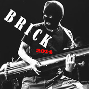

BRICK2014年的最后一天
============================

|  |  |
| :--: | :-- |
| [ BRICK2014年的最后一天](https://emumo.xiami.com/album/1820042509) | **艺人**: [陈弘礼](../index.md) **语种**: 其他 **唱片公司**: 独立发行 **发行时间**: 2014年12月31日 **专辑类别**: EP, 单曲 **专辑风格**: 实验电子 Experimental Electronic, 实验音乐 Experimental, 自由即兴 Free Improvisation **播放数**: 2664 **收藏数**: 14 **评论数**: 6  |

## 简介

2014年的十大事件，百度翻译的语音。
 

1：马航MH370事件中文
 

2：昆明火车站暴力恐怖案阿拉伯语
 

3：韩国岁月号客轮沉没事故韩语
 

4：埃博拉病毒俄语
 

5：北京APEC会议英语
 

6：乌克兰亲俄派总统亚努科维奇中止和欧洲联盟签署政治和自由贸易协议俄语
 

7： ISIS横扫中东阿拉伯语
 

8：香港学民思潮等组织发动香港非法占中事件粤语
 

9：美国弗格森骚乱美语
 

10：阿桑奇和斯诺登仍将流亡西班牙语
 

 
 

 

## 曲目

- [BRICK2014年的最后一天](./1820042509/8GtPczf5b6c.md)

## 评论

|  |  |  |  |
| :-- | :-- | :-- | :-- |
|  [虾米用户](https://emumo.xiami.com/u/495091)  2018-07-11 23:11 赞(0) 踩(0) | 
能不能多来点这种歌啊。
 |
|  [虾米用户](https://emumo.xiami.com/u/7322777) ∮ 2015-09-25 23:32 赞(0) 踩(0) | 
...A...
 |
|  [虾米用户](https://emumo.xiami.com/u/9) 不来都得死 2015-01-05 18:29 赞(0) 踩(0) | 
陈底里默默地就发了一首新歌，也太低调了吧。。。
 |
|  [虾米用户](https://emumo.xiami.com/u/3607350)  2015-01-01 15:34 赞(0) 踩(0) | 
最近高产，灵感爆棚哦
 |
|  [虾米用户](https://emumo.xiami.com/u/18244944) 親友だな 2015-01-01 12:32 赞(0) 踩(0) | 
好搞笑的封面
 |
|  [虾米用户](https://emumo.xiami.com/u/265678)  2015-01-01 09:46 赞(0) 踩(0) | 
好棒 支持底里  支持好音乐！！！
 |
