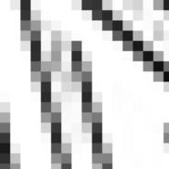

平安-夜
============================

|  |  |
| :--: | :-- |
| [ 平安-夜](https://emumo.xiami.com/album/2019438442) | **艺人**: [陈弘礼](../index.md) **语种**: 其他 **唱片公司**: 独立发行 **发行时间**: 2014年12月25日 **专辑类别**: 录音室专辑 **专辑风格**: 实验音乐 Experimental, 噪音 Noise, 诵读音乐 Spoken Word **播放数**: 1142 **收藏数**: 11 **评论数**: 1  |

## 简介

百度翻译语音，不同语系说的圣诞快乐，纯实验电子噪音。
 

 
 

 

## 曲目

- [圣诞噪音](./2019438442/8GtL3kea7b3.md)

## 评论

|  |  |  |
| :-- | :-- | :-- |
|  [虾米用户](https://emumo.xiami.com/u/1386850)   2014-12-25 09:12 赞(2) 踩(0) | 
好有圣诞节的气氛，赞一个！
 |
