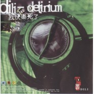

我快乐死了
============================

|  |  |
| :--: | :-- |
| [ 我快乐死了](https://emumo.xiami.com/album/316) | **艺人**: [陈弘礼](../index.md) **语种**: 国语 **唱片公司**: 摩登天空 **发行时间**: 1999年01月01日 **专辑类别**: 录音室专辑 **专辑风格**: 噪音 Noise, 自由即兴 Free Improvisation, 自然采样 Field Recordings, 独立摇滚 Indie Rock, 独立电子乐 Indietronica **播放数**: 18790 **收藏数**: 208 **评论数**: 31  |

## 简介

音乐只是一个玩意，没有那么严肃，但音乐绝对是一种心境，不管你怎么去玩它，表达的肯定是你的感情。人生浮躁及虚无，唯一真实的就是你的心情。既然众心不一，所以音乐也该是丰富多彩的，绝对不应该是几千年来沿袭下来的一种听觉习惯，做音乐的习惯了，听者更是习惯了。这种后果直接导致了心情的乏味，以至于人们离音乐越来越远，其实质是离自己越来越远，离自然越来越远。我讨厌乏味的生活！也厌恶习惯的音乐！所以我把这个专辑纯当作了一次实验，它是寄托在我感情基础上的一个宠物，这种实验对我而言只是刚刚开始。生活需要刺激，如果你还没有找到一种方式的话，那就毫不犹豫的冲到音乐里去吧！  
 

## 曲目

- [我快乐死了II](./316/gm0a66ce.md)
- [新生儿](./316/dBj78bfc.md)
- [月夜如镜](./316/iNKf6d23.md)
- [碰撞](./316/gm3ce879.md)
- [想法](./316/dBm5cb1b.md)
- [无奈的](./316/yz777ea8.md)
- [开一个玩笑](./316/gm6d89b8.md)
- [感情问题](./316/iNPfa2d3.md)
- [燥热](./316/gm8af09c.md)
- [我快乐死了I](./316/iNR1d70c.md)

## 评论

|  |  |  |
| :-- | :-- | :-- |
|  [虾米用户](https://emumo.xiami.com/u/352305007) 我还没想好要写什么... 2020-11-27 20:12 赞(0) 踩(0) | 
我的快乐死了！
 |
|  [虾米用户](https://emumo.xiami.com/u/135379) 我还没想好要写什么... 2019-09-12 12:22 赞(0) 踩(0) | 
wowww
 |
|  [虾米用户](https://emumo.xiami.com/u/41265111) 土法炼钢 2019-07-17 10:49 赞(0) 踩(0) | 
太牛了这张
 |
|  [虾米用户](https://emumo.xiami.com/u/348378813)  2018-02-17 06:31 赞(0) 踩(0) | 
嫩听着了嫩就评论?
 |
|  [虾米用户](https://emumo.xiami.com/u/43492923) 行到水穷我才开始害怕，夕... 2017-11-15 11:32 赞(0) 踩(0) | 
棒
 |
|  [虾米用户](https://emumo.xiami.com/u/7322777) ∮ 2015-09-25 23:34 赞(0) 踩(0) | 
...A...
 |
|  [虾米用户](https://emumo.xiami.com/u/1182761) 松任谷由实的迷弟 2015-08-26 13:50 赞(0) 踩(0) | 
<a href="http://emumo.xiami.com/u/3549659" target="_blank" rel="nofollow" name_card="3549659">@清谈</a> <a href="http://emumo.xiami.com/u/1218669" target="_blank" rel="nofollow" name_card="1218669">@建人阿龙</a> <a href="http://emumo.xiami.com/u/141825" target="_blank" rel="nofollow" name_card="141825">@Moonrest✿</a> <a href="http://emumo.xiami.com/u/36029" target="_blank" rel="nofollow" name_card="36029">@Smoky</a> <a href="http://emumo.xiami.com/u/572626" target="_blank" rel="nofollow" name_card="572626">@诗人二胖子（腐烂）</a> <a href="http://emumo.xiami.com/u/3438702" target="_blank" rel="nofollow" name_card="3438702">@无撒宁</a> <a href="http://emumo.xiami.com/u/7322777" target="_blank" rel="nofollow" name_card="7322777">@大黑豹</a>
 |
|  [虾米用户](https://emumo.xiami.com/u/82006)  2015-04-06 17:40 赞(1) 踩(0) | 
编辑，先把乐手的名字改过来——陈底里，太煞风景！
 |
| ⇒ |  [虾米用户](https://emumo.xiami.com/u/599326) 永远年轻，永远热泪盈眶~ 2019-11-28 18:58 赞(0) 踩(0) | 
这是户口本上的名字
 |
| ⇒ |  [虾米用户](https://emumo.xiami.com/u/82006)  2019-11-28 20:37 赞(0) 踩(0) | 
<q><b>波多说：</b></q>
 |
|  [虾米用户](https://emumo.xiami.com/u/8244559)  2015-01-22 20:02 赞(0) 踩(0) | 
******
 |
|  [虾米用户](https://emumo.xiami.com/u/37193001)  2014-06-28 00:55 赞(0) 踩(0) | 
喜欢
 |
|  [虾米用户](https://emumo.xiami.com/u/355865) Let it go, l... 2014-04-25 13:16 赞(0) 踩(0) | 
经抽样检测，为Noath VBR音质 (合格320K)。
 |
|  [虾米用户](https://emumo.xiami.com/u/4781964) http://data4 2014-04-08 14:18 赞(1) 踩(0) | 
大陆
 |
|  [虾米用户](https://emumo.xiami.com/u/1581934)  2014-02-28 18:24 赞(0) 踩(0) | 
《碰撞》前面那段大提琴是什么曲子？？？
 |
| ⇒ |  [虾米用户](https://emumo.xiami.com/u/7765642) 无我Nothing.Bu... 2014-08-12 01:09 赞(0) 踩(0) | 
Bach,具体不知哪曲，曲目都一个屌样，你可以找个无伴奏大提琴
 |
|  [虾米用户](https://emumo.xiami.com/u/10786093)  2014-01-10 12:32 赞(0) 踩(0) | 
中国（大陆）摇滚30年 我听过的唱片中所喜爱的前99张碟之 No15（实验&amp;amp;前卫类）
 |
|  [虾米用户](https://emumo.xiami.com/u/25655312) 结宇依空林 2013-11-12 15:30 赞(0) 踩(0) | 
可贵的实验精神！
 |
|  [虾米用户](https://emumo.xiami.com/u/25655312) 结宇依空林 2013-11-12 15:23 赞(0) 踩(0) | 
为师兄捧场
 |
|  [虾米用户](https://emumo.xiami.com/u/10827708)   2013-07-04 05:29 赞(1) 踩(0) | 
顺序和唱片不一样啊，高中时收藏的第一批摩登首版专辑，碰撞是我的最爱，整体很有层次感，虽然另类，但从来不会让人心烦
 |
|  [虾米用户](https://emumo.xiami.com/u/4335954)   2013-06-23 12:20 赞(0) 踩(0) | 
这什么？
 |
|  [虾米用户](https://emumo.xiami.com/u/10786093)  2013-03-29 15:49 赞(3) 踩(0) | 
只习惯接受优美或温馨音乐的人 是较难靠近这张专辑的 但具有审丑经验 对有荒诞色彩且不和谐的现代艺术感兴趣的人 估计是寻觅到了知音。。。在貌似纷乱无序的音乐下 潜藏着心灵的表现主义 在没有找到更合适的标签之前 我将其归入艺术摇滚范畴
 |
|  [虾米用户](https://emumo.xiami.com/u/1384633)  2012-10-23 01:41 赞(0) 踩(0) | 
我快乐死了 非常喜欢  感情问题和开个玩笑两首歌名字弄混了 难道说编辑故意弄错的 呵呵 感情和钞票 钞票与感情
 |
|  [虾米用户](https://emumo.xiami.com/u/1644333) 传说中的小明 2012-05-14 20:45 赞(1) 踩(0) | 
ISRC CN-A26-99-331-00/A.J6 1999年出版发行 版权方：摩登天空  这张专辑的歌词本很有意思，歌词用的都是乱码～（其实根本也没有几句真正的歌词～～）
 |
|  [虾米用户](https://emumo.xiami.com/u/1280878)  2012-02-17 09:10 赞(0) 踩(0) | 
太另类
 |
|  [虾米用户](https://emumo.xiami.com/u/7375546) 敌视现实 虚构远方 2012-02-07 18:51 赞(0) 踩(0) | 
这张唱片曾经是我的最爱
 |
|  [虾米用户](https://emumo.xiami.com/u/4142885) 我还没想好要写什么... 2011-11-03 20:05 赞(0) 踩(0) | 
音乐需要实验，不拘泥。需要随性，不刻意。
 |
|  [虾米用户](https://emumo.xiami.com/u/239789) INSERT COIN 2011-07-04 12:44 赞(2) 踩(0) | 
到现在也不知道是：“我快，乐死了”。还是“我，快乐，死了”。
 |
| ⇒ |  [虾米用户](https://emumo.xiami.com/u/5123283) DJ Got Us Fa... 2012-12-16 18:27 赞(0) 踩(0) | 
按底里自己的说法是 两种理解都可以
 |
| ⇒ |  [虾米用户](https://emumo.xiami.com/u/36585109)  2015-04-18 23:15 赞(0) 踩(0) | 
我也是
 |
| ⇒ |  [虾米用户](https://emumo.xiami.com/u/1182761) 松任谷由实的迷弟 2015-08-26 13:45 赞(0) 踩(0) | 
<q><b>FlyKnight说：</b></q>
 |
