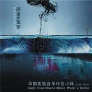

底里和宝罗早期实验音乐作品小样 (1995-2003)
============================

|  |  |
| :--: | :-- |
| [ 底里和宝罗早期实验音乐作品小样 (1995-2003)](https://emumo.xiami.com/album/363975) | **艺人**: [陈弘礼](../index.md) **语种**: 国语 **唱片公司**: 独立发行 **发行时间**: 2003年03月01日 **专辑类别**: 录音室专辑 **专辑风格**: 自由即兴 Free Improvisation, 氛围音乐 Ambient, 当代民谣 Contemporary Folk, 独立摇滚 Indie Rock, 电子民谣 Folktronica **播放数**: 49166 **收藏数**: 284 **评论数**: 31  |

## 简介

1992年我认识了宝罗，那时候我还是穴位乐队的吉他手，共同的音乐爱好和理念让我们有了合作意向，有空的时候我们会在一起谈谈理想，玩玩音乐，参加一些小型的音乐演出。1994年底穴位乐队解散，我们有了更多的时间一起做音乐。1995年我和贝斯手于微，鼓手刘效松和宝罗一起曾在北京最早的迪厅JJ演过一专场，她那独具特色的声音和音乐的灵感给我留下了深刻的印象。1999年我在北京保利剧院的国际爵士音乐节演出，再次邀请宝罗加盟合作，即兴演唱了其中的一个作品。  
  
这里收录的这些即兴音乐作品是我们空闲的时候在工作室录制的，纯属自娱自乐，只是个小样，不是成品。而且时间的跨度非常之久，这些收录的作品是从1992年到2003年之间的音乐灵感收获，是和民歌、民乐、歌剧、西洋乐和现代音乐的一次对话。这些在电脑里搁置了很多年的半成品，偶尔会拿出来和几个朋友一起分享。值得庆幸的是今天有了这个网络平台，能和更多的人一起分享这些音乐。为了保留当时的原创动机，所以没有做任何的改动而展现，就算是对过去的一次总结吧。  

## 曲目

- [8噪音实验](./363975/8GaQfDf40ff.md)
- [四川竹琴](./363975/xLpRrec76e5.md)
- [凤阳花鼓](./363975/xLpRrf1033d.md)
- [彝族民歌](./363975/xLpRrgc2211.md)
- [和歌剧对话](./363975/bCk8IZl48579.md)
- [时间的流逝](./363975/xLpRria2431.md)
- [小白菜](./363975/bf0rM73484ea.md)
- [夜色](./363975/mQ4S2A6932b.md)

## 评论

|  |  |  |
| :-- | :-- | :-- |
|  [虾米用户](https://emumo.xiami.com/u/45039774) 水 歸零地 2019-12-19 03:15 赞(0) 踩(0) | 
超好听..
 |
|  [虾米用户](https://emumo.xiami.com/u/7409152) 自 在 2019-03-25 03:13 赞(0) 踩(0) | 
收了
 |
|  [虾米用户](https://emumo.xiami.com/u/43492923) 行到水穷我才开始害怕，夕... 2018-11-09 12:20 赞(0) 踩(0) | 
有意思
 |
|  [虾米用户](https://emumo.xiami.com/u/23129158)  2016-07-20 00:42 赞(0) 踩(0) | 
说点什么呢？
 |
|  [虾米用户](https://emumo.xiami.com/u/52571663) Naive. 2016-06-20 01:57 赞(0) 踩(0) | 
自创语言？
 |
|  [虾米用户](https://emumo.xiami.com/u/7322777) ∮ 2015-09-25 23:33 赞(0) 踩(0) | 
...A...
 |
|  [虾米用户](https://emumo.xiami.com/u/902639)  2015-08-21 16:04 赞(0) 踩(0) | 
喜欢
 |
|  [虾米用户](https://emumo.xiami.com/u/902639)  2015-08-21 15:56 赞(0) 踩(0) | 
非常好的专辑
 |
|  [虾米用户](https://emumo.xiami.com/u/46355808)  2015-06-08 22:10 赞(0) 踩(0) | 
喜欢
 |
|  [虾米用户](https://emumo.xiami.com/u/701718)  2015-04-03 15:17 赞(0) 踩(0) | 
生活需要一点新的感觉。
 |
|  [虾米用户](https://emumo.xiami.com/u/8244559)  2015-01-22 20:05 赞(0) 踩(0) | 
******
 |
|  [虾米用户](https://emumo.xiami.com/u/4781964) http://data4 2014-04-08 14:24 赞(0) 踩(0) | 
大陆 ,陈底里早期
 |
|  [虾米用户](https://emumo.xiami.com/u/10786093)  2014-01-10 12:39 赞(1) 踩(0) | 
中国（大陆）摇滚30年 我听过的唱片中所喜爱的前99张碟之 No17 （实验&amp;amp;前卫类）
 |
| ⇒ |  [虾米用户](https://emumo.xiami.com/u/13249534) 人们多么仇恨音乐，才会用... 2014-04-26 10:34 赞(0) 踩(0) | 
是排名还是顺序 感觉不是排名 而且也难以排名 话语那个收藏 参差不齐得过分 所以才问
 |
| ⇒ |  [虾米用户](https://emumo.xiami.com/u/45328718) 暂无签名~ 2015-03-17 14:06 赞(0) 踩(0) | 
我是凉山的彝族，里面这首彝族民歌的旋律小时候我们几乎每天都可以听到，难道她是四川的？
 |
| ⇒ |  [虾米用户](https://emumo.xiami.com/u/10786093)  2015-03-18 07:11 赞(0) 踩(0) | 
<q><b>◥◣握紧刀锋◢◤说：</b></q>
 |
|  [虾米用户](https://emumo.xiami.com/u/1046862)  2013-12-24 20:13 赞(1) 踩(0) | 
百花齐放才是春，牛逼了
 |
|  [虾米用户](https://emumo.xiami.com/u/25655312) 结宇依空林 2013-11-12 15:35 赞(0) 踩(0) | 
可贵的实验精神！师兄很赞
 |
|  [虾米用户](https://emumo.xiami.com/u/12788018) blabla 2013-08-23 11:23 赞(0) 踩(0) | 
赞！纯粹
 |
|  [虾米用户](https://emumo.xiami.com/u/2663173)  2013-08-21 23:45 赞(0) 踩(0) | 
牛逼！
 |
|  [虾米用户](https://emumo.xiami.com/u/12788018) blabla 2013-08-09 17:35 赞(0) 踩(0) | 
沧海遗珠
 |
|  [虾米用户](https://emumo.xiami.com/u/1182761) 松任谷由实的迷弟 2013-05-22 02:53 赞(0) 踩(0) | 
早说嘛，原来这张虾米是有的，只是不在宝罗那边的虾米页面。
 |
|  [虾米用户](https://emumo.xiami.com/u/2865677)  2013-02-27 12:46 赞(0) 踩(0) | 
GOOD
 |
|  [虾米用户](https://emumo.xiami.com/u/12494015) 爱极端音乐 2013-02-27 02:34 赞(0) 踩(0) | 
这就是所谓的沧海遗珠！！！
 |
|  [虾米用户](https://emumo.xiami.com/u/244845)  2013-02-26 15:58 赞(0) 踩(0) | 
沧海遗珠
 |
|  [虾米用户](https://emumo.xiami.com/u/9290891)  2012-11-29 01:15 赞(0) 踩(0) | 
赞一个。喜欢
 |
|  [虾米用户](https://emumo.xiami.com/u/243854)  2012-11-13 18:32 赞(0) 踩(0) | 
充斥民族特色的专辑，很棒
 |
|  [虾米用户](https://emumo.xiami.com/u/5024581)  2011-11-25 21:19 赞(0) 踩(0) | 
太赞了啊
 |
|  [虾米用户](https://emumo.xiami.com/u/853784)  2010-11-29 16:37 赞(0) 踩(0) | 
好比约克啊。。
 |
|  [虾米用户](https://emumo.xiami.com/u/1317747)  2010-09-04 20:47 赞(0) 踩(0) | 
不错
 |
|  [虾米用户](https://emumo.xiami.com/u/1224725) 最近很忙啷里个啷，奖励自... 2010-08-11 13:02 赞(0) 踩(0) | 
确实挺埋没的~
 |
