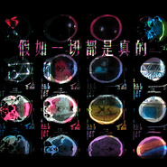

陈弘礼
============================

|  |  |
| :--: | :-- |
| [ 陈弘礼](https://i.xiami.com/chl3d) | **播放数**: 2356057 **粉丝数**: 1243 **评论数**: 57 **地区**: China 中国大陆 **风格**: 实验音乐 Experimental, 自由即兴 Free Improvisation, 氛围音乐 Ambient, 电影原声 Film Score, 自然采样 Field Recordings  |

## 档案

陈弘礼（曾用名：陈底里）当代艺术家，声音行为艺术家，声音博物馆创始人。中国早期实力派独立音乐人，21世纪初中国声音采样、电子先锋音乐、实验音乐的倡导及实践者。全息声音乐、沉浸式声景艺术领域的领军人物。当代极富思维及艺术感知力、潜心于重构音乐、绘画、新媒体等艺术形式的先行者。 
他超前的实验精神及对艺术执着的个性给我们留下很深刻的印象，他是一位具有独立创作精神的艺术家。不仅在观念上始终保持着不断创新的能力，更是在实践中不断拓展艺术的边界，以扎实的功底对声音艺术进行前瞻性的探索。同时，他也是一位非常具有专注力，并且能够长期坚持这种实验态度的艺术家。 
从他大量的实验声音作品演变成现在的声音艺术项目中可以得知，他是在用声音艺术的创作方式来表达对生命的关注和对人性的思考，他在国内声音艺术领域的创作精神是前卫的、具有代表性的。他把声音艺术作为一种介入社会的行为方式，展示了一种新的社会学意义上的方法与实验方向。 
他早期的实验音乐可以说是对传统音乐的批判，用“声音艺术”这个词来定义更为贴切。他提出“实验音乐，就是实验人生”的艺术理念，并创作了大量的作品。他的声音作品也包括对传统音乐和乐器的重新解读，摆脱了传统文化意识的重苛，用声音构造一个属于他自己的精神世界。 
关于这个世界，他有自己的感悟：“这个世界只是一个假象”。他的声音作品就是在这种假象上有意识的重叠了无数的假象，形成多重假象，不断怀疑这个世界的真实性。这种对声音的感悟，也延生出一系列综合材料的绘画作品《多重假象》，还有声音装置作品《删除》。再如受邀于日韩《Out The Window》多媒体艺术展的声音影像作品《NO.5》，也是他对“假象”的又一次探讨：声音不断被意识交织、重叠、切割和抹掉，进而对时间的存在产生质疑。这种基于假象的思考，在其后续的声音艺术创作中不断提炼为更丰富的呈现样式。 
“声音即兴现场”就是其中的一种。他关注现场的声音即兴与观众直接对话的无限可能性，如1994年他策划的摇滚音乐剧《时空之祭》。1996年比利时根特（GENT）音乐节以古琴即兴的方式和各国音乐人进行交流，其实质就是东西方声音文化的对话。1999年北京国际爵士音乐节的《进化&爵士》，是声音行为、装置艺术和多媒体艺术的交互现场，也是城市声音采样与中西乐器之间相碰撞的声音作品，这次实验性的尝试彻底颠覆了声音现场的传统模式，给观众带来很大的震撼！改变了人们对声音现场的惯性认知，这在当时中国是前所未有的。 
他喜欢根据不同的声音环境带来的灵感进行创作，依环境而确定声音和现场的关系。他不刻意要求声音的形态，也不排斥声音之间的干扰，他擅长将一切毫不相关的声音组合到一起，用自己的直觉和灵感去构造一个新的有序的声音世界。 
他把对声音的感悟转化为属于他自己的艺术语言，与环境、与任意形式的艺术对话。他持续地与各国先锋艺术家进行即兴声音现场创作，如纽约古根海姆、欧洲戏剧节、法国蓬皮杜和英国ICA艺术中心等，现场声音创作的经验逐渐形成了他独特的声音艺术观念。与此同时，他与多领域艺术家长期合作，创作了大量与多媒体合作的声音作品，比较近期的有德国卡塞尔文献展《有限艺术项目I》、纽约古根海姆《时间消失的早晨》等，他确信将来的声音艺术是开放多元、积极互动的现场体验方式。 
弘礼是个既感性又理性的艺术家，他的声音作品都是他真实情感的流露。本世纪初始，他的声音作品开始迈入公共艺术领域，如2005年首届深圳城市/建筑双年展的互动声音装置作品《城市映像》、2006年大型户外互动声音装置作品《千年虫》，都是用声音交互的形式来沟通中国城市发展的现状和人与自然的关系，这种极富探索意味的创作方式强烈地表达了他对人与城市之间矛盾共生状态的思考。 
他对声音是癫狂的，对获取声音的行为方式是苛刻的也是自由的。 他认为“声音是可以看得见的，声音是有雕塑感的，声音应该灵魂和有气息……”。以声音为载体的艺术行为在艺术类别中是如何被划分、声音在当代艺术中的不确定性、和在未来创作中声音艺术表现形式的多样性，包括声音和意识之间的关系都是他非常关注的问题。 
经过不断地提炼与思索，他提出了自己的“声音行为艺术”观念：通过有意识的行为方式获得一种强有力的声音。任何有规律的或是杂乱的、无序的、频率不一的、轻重不等的自然的、非自然的声响都是他行为的灵感来源和元素，他通过行为的方式捕捉和制造声响的过程就是他作品的全部，他的声音作品是一种隐形的生命体！和我们内心最质朴的深层意识产生共鸣。 
当代艺术应该打破现代主义式的、假的艺术的自主性,艺术家不仅仅是浪漫主义的个体，应该对当代社会文化，特别是所谓的奇观社会持一种批判性的态度。 
陈弘礼就是持这种态度的声音艺术家，这种精神从1989年他的行为艺术《我要到广场去歌唱》中可以感受得到，并且持续到了今天。他关注社会暴力，关注生命在社会暴力下的麻木和无助。近年他的大型古琴声音艺术项目《对话》逐步进入美术馆和艺术中心，以声音的形式与社会及艺术体系对话。他在声音艺术和当代艺术间游走，以极其强烈的方式表达他对自由的渴望和对人性的关切。2015年初在纽约古根海姆的声音行为和2017年在巴黎蓬皮杜IRCAM声音艺术中心的声音即兴现场获得的极大成功就是对他的声音行为艺术极好的回应。 
“古琴”作为中国三千多年历史文化符号，已然成为中国传统思想的代名词。他是世界上第一个以站立姿势和反传统的态度弹奏古琴的声音艺术家，以极先锋的声音艺术观念，将古琴升级为一件强有力的“声音武器”直接对话社会暴力与传统思想。在我看来，他的声音暴力行为绝不是表演，他是在用一种直接的、严肃的、思考性的声音语言方式来表达他反暴力的情绪，他的这种“声音行为”具有划时代的意义！

## 专辑

| 名称 | 语种 | 唱片公司 | 发行时间 | 专辑类别 | 专辑风格 |
| :--: | :-- | :-- | :-- | :-- | :-- |
| [ BRICK2014年的最后一天](./albums/1820042509.md) | 其他 | 独立发行 | 2014年12月31日 | EP, 单曲 | 实验电子 Experimental Electronic, 实验音乐 Experimental, 自由即兴 Free Improvisation |
| [ 平安-夜](./albums/2019438442.md) | 其他 | 独立发行 | 2014年12月25日 | 录音室专辑 | 实验音乐 Experimental, 噪音 Noise, 诵读音乐 Spoken Word |
| [ 全息音乐](./albums/985972203.md) | 国语 | 独立发行 | 2013年12月02日 | 录音室专辑 | 原声 Soundtrack |
| [ 车逝 电影原声](./albums/186328877.md) | 国语 | 独立发行 | 2008年06月17日 | 原声带, 影视音乐 | 噪音 Noise, 电影原声 Film Score, 自然采样 Field Recordings, 独立电子乐 Indietronica |
| [ 城市映像/City Reflections2005深圳首届城市／建筑双年展](./albums/419590462.md) | 国语 | 独立发行 | 2005年09月20日 | 录音室专辑 | 实验音乐 Experimental, 噪音 Noise, 自然采样 Field Recordings |
| [ 底里和宝罗早期实验音乐作品小样 (1995-2003)](./albums/363975.md) | 国语 | 独立发行 | 2003年03月01日 | 录音室专辑 | 自由即兴 Free Improvisation, 氛围音乐 Ambient, 当代民谣 Contemporary Folk, 独立摇滚 Indie Rock, 电子民谣 Folktronica |
| [ 疯筝](./albums/315.md) | 国语 | BadHead | 2002年05月01日 | 录音室专辑 | 噪音 Noise, 氛围音乐 Ambient, 自然采样 Field Recordings, 独立摇滚 Indie Rock, 独立电子乐 Indietronica |
| [ 假如一切是真的实验声音作品](./albums/2100208098.md) | 国语 | 独立发行 | 1999年09月25日 | EP, 单曲 | 氛围音乐 Ambient, 独立电子乐 Indietronica |
| [ 2‘04“实验声音作品](./albums/2100208070.md) | 其他 | 独立发行 | 1999年09月25日 | EP, 单曲 | 氛围音乐 Ambient, 原声 Soundtrack |
| [ 我快乐死了](./albums/316.md) | 国语 | 摩登天空 | 1999年01月01日 | 录音室专辑 | 噪音 Noise, 自由即兴 Free Improvisation, 自然采样 Field Recordings, 独立摇滚 Indie Rock, 独立电子乐 Indietronica |

## 评论

|  |  |  |  |
| :-- | :-- | :-- | :-- |
|  [虾米用户](https://emumo.xiami.com/u/327738127) 荒诞和虚无 2020-12-01 00:53 赞(0) 踩(0) | 
你很强
 |
|  [虾米用户](https://emumo.xiami.com/u/933157) 泥豪啊同志！ 2020-09-09 20:56 赞(0) 踩(0) | 
已
 |
|  [虾米用户](https://emumo.xiami.com/u/70271654)  2020-05-24 17:34 赞(0) 踩(0) | 
全息那个专实在是太喜欢了
 |
|  [虾米用户](https://emumo.xiami.com/u/228843687) 懒惰统治人间 2020-01-28 13:35 赞(0) 踩(0) | 

 |
|  [虾米用户](https://emumo.xiami.com/u/336945272) 我在想要写什么... 2019-11-12 18:51 赞(0) 踩(0) | 
我的音响都怀孕了，感谢
 |
|  [虾米用户](https://emumo.xiami.com/u/43329792) 我还没想好要写什么... 2019-10-13 16:36 赞(0) 踩(0) | 
穴位帅呆了
 |
|  [虾米用户](https://emumo.xiami.com/u/54127166) / 2019-09-16 23:09 赞(0) 踩(0) | 
▪️
 |
|  [虾米用户](https://emumo.xiami.com/u/346165752)  2019-05-14 14:01 赞(0) 踩(0) | 

 |
|  [虾米用户](https://emumo.xiami.com/u/43492923) 行到水穷我才开始害怕，夕... 2018-11-09 12:19 赞(0) 踩(0) | 
棒
 |
|  [虾米用户](https://emumo.xiami.com/u/4142885) 我还没想好要写什么... 2018-07-16 09:20 赞(1) 踩(0) | 
几年没玩虾米 都不知道你改名了 
 |
|  [虾米用户](https://emumo.xiami.com/u/378270922)  2018-07-11 14:05 赞(0) 踩(0) | 
我在虾米上买过你的音乐，至少是用心的3D音乐，支持一下
 |
|  [虾米用户](https://emumo.xiami.com/u/31696713) 轻音乐群88876205 2018-04-29 13:47 赞(0) 踩(0) | 

 |
|  [虾米用户](https://emumo.xiami.com/u/98914) 耳朵具有自动过滤歌词功能 2017-10-09 00:30 赞(0) 踩(0) | 
有才
 |
|  [虾米用户](https://emumo.xiami.com/u/287858411)  2017-07-01 18:30 赞(0) 踩(0) | 
为何最近没有新作品啊？
 |
|  [虾米用户](https://emumo.xiami.com/u/287858411)  2017-07-01 18:28 赞(0) 踩(0) | 
可恨知道你太晚 
 |
|  [虾米用户](https://emumo.xiami.com/u/287858411)  2017-07-01 18:24 赞(0) 踩(0) | 
你怎可以这么有魅力
 |
|  [虾米用户](https://emumo.xiami.com/u/49981040)  2017-04-18 20:58 赞(0) 踩(0) | 
厉害
 |
|  [虾米用户](https://emumo.xiami.com/u/49133859) 来自森林的音乐。 2017-03-27 22:28 赞(0) 踩(0) | 
很喜欢你的3D音乐
 |
|  [虾米用户](https://emumo.xiami.com/u/254389284)  2017-03-10 16:09 赞(0) 踩(0) | 
很当代艺术
 |
|  [虾米用户](https://emumo.xiami.com/u/8424657) 海岸线 2017-02-17 12:38 赞(1) 踩(0) | 

 |
|  [虾米用户](https://emumo.xiami.com/u/384476)   2017-02-17 10:47 赞(0) 踩(0) | 
发现了一片心大陆
 |
|  [虾米用户](https://emumo.xiami.com/u/14867331) 不论性向 任意嚣张 2016-12-16 22:16 赞(0) 踩(0) | 
耳朵仿佛被轻浮了 
 |
|  [虾米用户](https://emumo.xiami.com/u/97747450) 我还没想好要写什么... 2016-08-12 22:45 赞(1) 踩(0) | 
2454
 |
|  [虾米用户](https://emumo.xiami.com/u/4369495) 此心沉静 2016-07-07 16:15 赞(0) 踩(0) | 
没有什么特别的感觉啊
 |
|  [虾米用户](https://emumo.xiami.com/u/35910211) 暂无签名~ 2016-06-03 20:46 赞(0) 踩(0) | 
立体环绕声音很棒
 |
|  [虾米用户](https://emumo.xiami.com/u/99354792)  2016-01-26 13:13 赞(0) 踩(0) | 
好赞，大爱
 |
|  [虾米用户](https://emumo.xiami.com/u/12559339)  2015-12-04 16:17 赞(0) 踩(0) | 
立体音
 |
|  [虾米用户](https://emumo.xiami.com/u/481046)  2015-11-24 20:51 赞(1) 踩(0) | 
又一位美术出身的实验音乐人
 |
|  [虾米用户](https://emumo.xiami.com/u/42984071)   2015-09-17 23:46 赞(0) 踩(0) | 
天啊，好赞。
 |
|  [虾米用户](https://emumo.xiami.com/u/449354) 我还没想好要写什么... 2015-05-03 23:07 赞(0) 踩(0) | 
什么时候会演出
 |
|  [虾米用户](https://emumo.xiami.com/u/36585109)  2015-04-18 23:20 赞(0) 踩(0) | 
大学买了《我快乐死了》 非常喜欢 实验色彩 惊艳 最喜欢那首 “年轻的姑娘 她怀孕了 无知的生命 就要来到” 整首歌四句歌词 在我脑中循环无数遍 在那个听歌要看歌词纸的年代 非常另类
 |
|  [虾米用户](https://emumo.xiami.com/u/8244559)  2015-01-22 20:04 赞(0) 踩(0) | 
******
 |
|  [虾米用户](https://emumo.xiami.com/u/8128176) 好好活着 2015-01-21 06:32 赞(0) 踩(0) | 
来晚了
 |
|  [虾米用户](https://emumo.xiami.com/u/2768615)   2015-01-19 00:00 赞(0) 踩(0) | 
哇有点流弊
 |
|  [虾米用户](https://emumo.xiami.com/u/8833102) 伟❤️375882267 2014-12-23 06:34 赞(0) 踩(0) | 
路过  支持下
 |
|  [虾米用户](https://emumo.xiami.com/u/9806174) humans have 2014-11-26 13:31 赞(1) 踩(0) | 
吊
 |
|  [虾米用户](https://emumo.xiami.com/u/13249534) 人们多么仇恨音乐，才会用... 2014-11-05 21:19 赞(1) 踩(0) | 
一见钟情。这方面国内只有小红与小小红俘虏我。
 |
|  [虾米用户](https://emumo.xiami.com/u/1269676) 枯荣有时，后会有期 2014-09-24 13:37 赞(1) 踩(0) | 
实在是很喜欢99年的那张Delirium， 磁带被我听坏了之后又花了60块买了一张CD. 底里加油。
 |
|  [虾米用户](https://emumo.xiami.com/u/25655312) 结宇依空林 2014-03-12 10:18 赞(0) 踩(0) | 
印象最深是有次通过姜赛罗师兄跟您通过一次电话，哈哈，那时刚毕业
 |
|  [虾米用户](https://emumo.xiami.com/u/29133015)  2013-12-06 16:49 赞(46) 踩(0) | 
我刚入驻了虾米音乐人，欢迎大家来我的个人主页，收听我的最新音乐
 |
| ⇒ |  [虾米用户](https://emumo.xiami.com/u/722784) Bite me！Baby 2013-12-06 17:48 赞(0) 踩(0) | 
欢迎
 |
| ⇒ |  [虾米用户](https://emumo.xiami.com/u/1182761) 松任谷由实的迷弟 2013-12-07 03:52 赞(0) 踩(0) | 
呀！！！
 |
| ⇒ |  [虾米用户](https://emumo.xiami.com/u/355865) Let it go, l... 2014-01-20 23:09 赞(0) 踩(0) | 
<q><b>tlmgt说：</b></q>
 |
| ⇒ |  [虾米用户](https://emumo.xiami.com/u/1167775) 浪费脑细胞想签名干嘛！ 2016-03-17 15:25 赞(0) 踩(0) | 
你很棒
 |
| ⇒ |  [虾米用户](https://emumo.xiami.com/u/287858411)  2017-07-01 18:25 赞(0) 踩(0) | 
知道你太晚 太棒了
 |
| ⇒ |  [虾米用户](https://emumo.xiami.com/u/287858411)  2017-07-01 18:26 赞(0) 踩(0) | 
你怎可以这么有才 
 |
| ⇒ |  [虾米用户](https://emumo.xiami.com/u/589005)  2017-10-27 23:47 赞(0) 踩(0) | 
搜 奶特，有个蒙牛的精选集里头都是且只有你的3D歌曲。。。既然是商业化品牌的或许可以沟通下看怎么互惠合作？祝福～
 |
| ⇒ |  [虾米用户](https://emumo.xiami.com/u/9495219)  2018-06-07 13:39 赞(0) 踩(0) | 
真的很喜欢这张专辑，听了无数遍了
 |
|  [虾米用户](https://emumo.xiami.com/u/1182761) 松任谷由实的迷弟 2013-05-22 02:53 赞(0) 踩(0) | 
您真棒
 |
|  [虾米用户](https://emumo.xiami.com/u/10786093)  2013-03-27 16:14 赞(10) 踩(0) | 
陈底里尝试把不同的声音采样与音效 放进自己的调色板 通过拼贴绘制出一幅幅音乐的抽象画 题材涉及心理活动 情绪 生活场景以及幻想空间 色调偏晦涩且略显病态 造型则经过了变形处理后显得扭曲 有几分怪诞与丑陋 。。。一位有才华且特立独行的声音艺术家
 |
|  [虾米用户](https://emumo.xiami.com/u/3510038) 海天之恋 2012-07-21 13:48 赞(0) 踩(0) | 
按照楼下指引找歇斯去鸟
 |
|  [虾米用户](https://emumo.xiami.com/u/4915069)  2012-03-19 14:02 赞(0) 踩(0) | 
xihuan
 |
|  [虾米用户](https://emumo.xiami.com/u/220719) 自知不自見，自愛不自貴 2011-12-08 11:00 赞(0) 踩(0) | 
哇塞，有歇斯，果然就有底裡啊，，，一搜竟然還真出來了。。。
 |
| ⇒ |  [虾米用户](https://emumo.xiami.com/u/6958676)  2014-08-29 11:11 赞(0) 踩(0) | 
+
 |
|  [虾米用户](https://emumo.xiami.com/u/7013483)  2011-11-29 11:11 赞(0) 踩(0) | 
.
 |
|  [虾米用户](https://emumo.xiami.com/u/6740771) 你一首我一首，交个朋友吧 2011-11-20 11:19 赞(0) 踩(0) | 
后
 |
|  [虾米用户](https://emumo.xiami.com/u/241926)  2011-10-16 14:10 赞(0) 踩(0) | 
李皖推荐
 |
