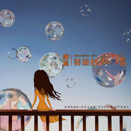
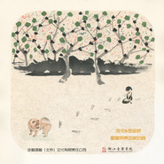
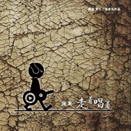
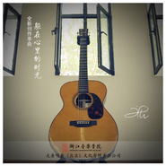
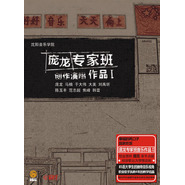
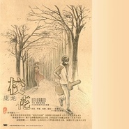
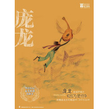

庞龙
============================

|  |  |
| :--: | :-- |
| [ 庞龙](https://i.xiami.com/panglong) | **地区**: China 中国大陆 **风格**: 国语流行 Mandarin Pop **播放数**: 25382347 **粉丝数**: 6322 **评论数**: 251  |

## 档案

浙江音乐学院流行音乐系教师，硕士研究生导师，沈阳音乐学院南校区终身教授，著名歌手、制作人，第十届、十一届全国青联委员，辽宁省青联常委，中华慈善总会第三届理事，中国音乐家协会会员。 
创作作品： 
《走着唱着》《家在东北》、《兄弟干杯》、《校花》、《我要抱着你》、《回家吃饭》、《    70    后》、《躲在心里的时光》、《我的哥们我的好兄弟》、《等你》。 
代表作品 
《两只蝴蝶》、《你是我的玫瑰花》、《兄弟抱一下》、《小眼睛的姑娘》、《家的味道》、《幸福的两口子》、《往日时光》、《唯有兄弟》、《美好》、《家在东北》、《兄弟干杯》、《校花》、《我要抱着你》、《回家吃饭》、《  70  后》、《我们在蓝色海上飘》、《走着唱着》等。 
从业履历 
第五届中国金唱片  “  最佳专辑奖  ”  。 
CCTV—MTV  音乐盛典  “  内地最受欢迎男歌手  ”   。 
亚太音乐榜  2004  年度  “  最佳男歌手  ”“  最佳唱片销量  ”  。 
2007  年度  “  学生最喜欢的唱作人  ”  。 
东南音乐劲爆榜  “  最佳男歌手  ”“  最佳制作人  ”  。 
创作作品《兄弟干杯》荣获  2008  年北京奥运会推荐歌曲奖。 
创作作品《我要抱着你》荣获中央人民广播电台中国  TOP  排行榜年度十大金曲。 
2006  年、  2007  年、  2008  年、  2010  年四次参加中央电视台《春节联欢晚会》。 
2011  年庞龙  “  相逢一笑  ”  全国巡回演唱会。 
2012  年庞龙  “  兄弟抱一下  ”  包头公益演唱会。 
2012  年荣获  “  百度音乐搜索十年网络影响力歌手大奖  ”  。 
2018  年走着唱着  -  庞龙和他的学生们巡回演唱会。 
2019  年越走越远的  &  躲在心里的时光  -  庞龙和他的学生们巡回演唱会。 
2019  年发行巡回演唱会推广曲《我们在路上》。 
出版    12    张个人专辑 
2000  年发行  首张个人专辑《人生三部曲》。 
2004  年发行第二张个人专辑《两只蝴蝶》。 
2005  年发行第三张个人专辑《你是我的玫瑰花》。 
2006  年发行第四张个人专辑《小眼睛的姑娘》。 
2007  年发行第五张个人专辑《开始  &  如果你嫁给我》。 
2009  年发行音乐概念专辑《真的不同了》。 
2009  年发行首张军旅专辑《  我们的宿舍  307  》。 
2010  年发行《家的味道》精选专辑。 
2011  年发行第九张音乐概念专辑《摇》。 
2013  年发行第十张音乐概念专辑《美好》。 
2015  年发行音乐发烧专辑《我们在蓝色海上飘》。 
2017  年发行第十二张专辑《走着唱着》。 
2009  年制作出版沈阳音乐学院南校区庞龙专家班创作演唱作品双张专辑。 
2009  年出版《校花     往日时光》庞龙民谣吉他图文心曲集音乐教材。 
2019  年出版《浙音乐》创作专辑 
2019  年出版     越走越远的  &  躲在心里的时光《浙音乐创作作品集》。 
身为歌者、发行  12  张专辑、获奖无数，家喻户晓； 
身为师者、传道授业、孜孜不倦、提携新人。 
庞龙的歌者姿态、一直从容，一直前进、走着唱着。

## 专辑

| 名称 | 语种 | 唱片公司 | 发行时间 | 专辑类别 | 专辑风格 |
| :--: | :-- | :-- | :-- | :-- | :-- |
| [ 抱抱](./albums/5020460065.md) | 国语 |  | 2020年04月10日 | 录音室专辑 | 国语流行 Mandarin Pop |
| [ 给你](./albums/5022394657.md) | 其他 | 龙翔天乐 | 2019年06月21日 | EP, 单曲 |  |
| [ 给孩子的话](./albums/2103952132.md) | 国语 | 走着唱着 | 2018年08月31日 | EP, 单曲 | 国语流行 Mandarin Pop |
| [ 今生足够了](./albums/2103940713.md) | 国语 | 恒大音乐 | 2018年08月01日 | EP, 单曲 |  |
| [ 美丽的姑娘](./albums/2103699755.md) | 国语 | 走着唱着 | 2018年05月02日 | EP, 单曲 | 国语流行 Mandarin Pop |
| [ 星星照亮回家的路](./albums/2102964670.md) | 国语 | 走着唱着 | 2017年12月01日 | EP, 单曲 | 摇滚 Rock & Roll, 民谣 Folk |
| [ 走着唱着](./albums/2102762376.md) | 国语 | 走着唱着 | 2017年06月09日 | 录音室专辑 |  |
| [ 躲在心里的时光](./albums/2102732040.md) | 国语 | 走着唱着 | 2017年04月14日 | EP, 单曲 | 国语流行 Mandarin Pop |
| [ 面朝大海 春暖花开](./albums/2102719102.md) | 国语 | 星外星音乐 | 2017年03月24日 | EP, 单曲 | 民谣流行 Folk Pop |
| [ 我的哥们我的好兄弟](./albums/2102656496.md) | 国语 | 走着唱着 | 2016年11月25日 | EP, 单曲 |  |
| [ 向北向北](./albums/2100258394.md) | 国语 | 龙翔天乐 | 2015年12月18日 | EP, 单曲 |  |
| [ 祝福2008](./albums/2100194144.md) | 国语 | 龙翔天乐 | 2015年09月08日 | EP, 单曲 |  |
| [ 我们在蓝色海上飘](./albums/1817065200.md) | 国语 | 九乐娃娃 | 2015年01月28日 | 录音室专辑 | 国语流行 Mandarin Pop |
| [ 藏在记忆里的歌](./albums/1201438336.md) | 国语 | 龙翔天乐 | 2014年05月30日 | EP, 单曲 | 国语流行 Mandarin Pop |
| [ 家风](./albums/995126595.md) | 国语 | 嘉华明悦 | 2014年03月18日 | EP, 单曲 |  |
| [ 桃花开了](./albums/623797550.md) | 国语 |  | 2014年01月01日 | EP, 单曲 |  |
| [ 美好](./albums/1061932581.md) | 国语 | 龙翔天乐 | 2013年02月26日 | 录音室专辑 |  |
| [ 热辣辣](./albums/558688.md) | 国语 | 龙翔天乐 | 2012年11月26日 | EP, 单曲 |  |
| [ 摇](./albums/346470.md) | 国语 | 龙翔天乐 | 2011年10月09日 | 录音室专辑 |  |
| [ 十年唱片 慢板经典](./albums/414025.md) | 国语 | 龙翔天乐 | 2010年12月03日 | 精选集 |  |
| [ 勇敢飞翔](./albums/407079.md) | 国语 | 龙翔天乐 | 2010年10月17日 | EP, 单曲 |  |
| [ 庞龙专家班创作演唱作品 Ⅱ](./albums/266425.md) | 国语 | 龙翔天乐 | 2010年06月13日 | 合集, 杂锦 |  |
| [ 庞龙专家班创作演唱专辑 I](./albums/266461.md) | 国语 | 龙翔天乐 | 2010年03月23日 | 合集, 杂锦 |  |
| [ 真的不同了It's Different](./albums/358133.md) | 国语 | 龙翔天乐 | 2009年11月02日 | 录音室专辑 | 国语流行 Mandarin Pop |
| [ 我们的宿舍307](./albums/339784.md) | 国语 | 龙翔天乐 | 2009年07月28日 | 录音室专辑 |  |
| [ 爱爱爱情](./albums/341202.md) | 国语 | 龙翔天乐 | 2009年07月15日 | EP, 单曲 |  |
| [ 校花](./albums/297793.md) | 国语 | 音盒娱乐 | 2008年09月08日 | EP, 单曲 |  |
| [ 开始·如果你嫁给我](./albums/33157.md) | 国语 | 鸟人唱片 | 2007年10月23日 | 精选集 |  |
| [ 因为是你](./albums/3686.md) | 国语 | 鸟人唱片 | 2007年04月01日 | EP, 单曲 |  |
| [ 爱情果Love Apple](./albums/3687.md) | 国语 | 鸟人唱片 | 2006年09月11日 | 录音室专辑 | 国语流行 Mandarin Pop |
| [ 你是我的玫瑰花You Are My Rose](./albums/3688.md) | 国语 | 鸟人唱片 | 2005年09月06日 | 录音室专辑 | 国语流行 Mandarin Pop |
| [ 两只蝴蝶Two Scalewings](./albums/3689.md) | 国语 | 鸟人唱片 | 2004年11月01日 | 录音室专辑 | 国语流行 Mandarin Pop, 华语唱作人 Chinese Singer-Songwriter |

## 评论

|  |  |  |
| :-- | :-- | :-- |
|  [虾米用户](https://emumo.xiami.com/u/440841253)  2020-02-24 21:20 赞(0) 踩(0) | 
怀念啊
 |
|  [虾米用户](https://emumo.xiami.com/u/319688150) 愿经典不被遗忘 2019-10-22 02:01 赞(0) 踩(0) | 
挺难忘的
 |
|  [虾米用户](https://emumo.xiami.com/u/425311090)  2019-06-08 12:32 赞(0) 踩(0) | 
没有吹眼睛这首歌啊！
 |
|  [虾米用户](https://emumo.xiami.com/u/341875754)  2019-04-29 22:34 赞(0) 踩(0) | 
庞叔叔您好，很高兴认识你我是你的忠实的歌迷，我很喜欢您的音乐作品在这里祝你身体健康全家幸福平安快乐工作顺利万事如意
 |
|  [虾米用户](https://emumo.xiami.com/u/221269971) 傻傻地喜欢笨笨地爱 2019-03-16 19:43 赞(0) 踩(0) | 
歌曲浅显大众而不媚俗是优秀的流行作品应具备的优点，庞龙做到了
 |
|  [虾米用户](https://emumo.xiami.com/u/408357445)  2018-11-11 15:42 赞(0) 踩(0) | 
你好兄弟
 |
|  [虾米用户](https://emumo.xiami.com/u/404198927)  2018-09-24 19:06 赞(0) 踩(0) | 
两只蝴蝶经典中的经典  
 |
|  [虾米用户](https://emumo.xiami.com/u/45240314) “你是我仅有的梦” 2018-08-31 16:30 赞(2) 踩(0) | 
庞龙：Punk Dragon 最朋克的歌手名字了
 |
|  [虾米用户](https://emumo.xiami.com/u/402426764)  2018-08-25 12:05 赞(0) 踩(0) | 
谢谢啦！   
 |
|  [虾米用户](https://emumo.xiami.com/u/351190544)  2018-06-06 20:41 赞(1) 踩(0) | 
比刀郎low多了
 |
|  [虾米用户](https://emumo.xiami.com/u/374322742)  2018-06-01 18:44 赞(1) 踩(0) | 
好幅
 |
|  [虾米用户](https://emumo.xiami.com/u/374322742)  2018-06-01 18:44 赞(1) 踩(0) | 
好
 |
|  [虾米用户](https://emumo.xiami.com/u/49828336)   2018-05-04 10:37 赞(3) 踩(0) | 
庞老师有很多好作品 但很多人不愿意去发掘
 |
|  [虾米用户](https://emumo.xiami.com/u/358430033)  2018-04-15 22:22 赞(1) 踩(0) | 
兄弟抱一下
 |
|  [虾米用户](https://emumo.xiami.com/u/320393716)  2018-04-07 07:28 赞(1) 踩(0) | 
生命在奇迹便在  
 |
|  [虾米用户](https://emumo.xiami.com/u/342414376)  2018-04-03 12:39 赞(1) 踩(0) | 
666                 
 |
|  [虾米用户](https://emumo.xiami.com/u/113378418) 清清素心听歌... 2018-03-13 16:59 赞(1) 踩(0) | 
好想听您的《春秋爱美丽》... ... 祝福大家都幸福~~~
 |
|  [虾米用户](https://emumo.xiami.com/u/334268214)  2018-03-05 20:47 赞(2) 踩(0) | 
 
 |
|  [虾米用户](https://emumo.xiami.com/u/94994884)  2018-01-30 16:01 赞(3) 踩(0) | 
我的童年音乐启蒙老师，您2006年发的CD我还保存着呢 
 |
|  [虾米用户](https://emumo.xiami.com/u/337196282)  2018-01-23 14:00 赞(1) 踩(0) | 
你的歌直好听
 |
|  [虾米用户](https://emumo.xiami.com/u/309699386)  2018-01-04 11:27 赞(1) 踩(0) | 
龙哥。你的歌不错。我的嗓子跟你差不多。所以你的歌很适合我。嘿嘿
 |
|  [虾米用户](https://emumo.xiami.com/u/342161119) 8.24 2017-12-30 17:56 赞(0) 踩(0) | 
我爱妳
 |
|  [虾米用户](https://emumo.xiami.com/u/47276106)  2017-12-27 09:11 赞(3) 踩(0) | 
为什么好多庞龙的经典歌曲没有啊&amp;hellip;差评
 |
|  [虾米用户](https://emumo.xiami.com/u/15826803) 纯纯的聆听 2017-12-19 11:11 赞(2) 踩(0) | 
70后的怀旧歌曲，听着这首歌，仿佛又沐浴在暖暖的阳光下，吹着口哨，回到了没有PM2.5指标那时的纯静空气。好吧，我都说怀旧了。。好吧。。承认不是那年代的人，但是尊重那年代的情怀。这首歌让庞龙进化了，希望多多努力。评论说完，下面是吐槽 虾米腹黑什么的最喜欢了，看着大家的评论乐啊。。语重心长的说：**舞也是一种文化。我老妈就喜欢凤凰传奇 老喜欢。我不能咬她对不。。。。
 |
|  [虾米用户](https://emumo.xiami.com/u/337557930)  2017-12-09 10:59 赞(0) 踩(0) | 
多谢你给我们的你拥抱我吧
 |
|  [虾米用户](https://emumo.xiami.com/u/24925878)  2017-12-05 20:49 赞(2) 踩(0) | 
庞龙很刀郎！！！！
 |
|  [虾米用户](https://emumo.xiami.com/u/314426448)  2017-12-05 13:13 赞(3) 踩(0) | 
兄弟抱一下，我最喜欢听。庞龙唱的
 |
|  [虾米用户](https://emumo.xiami.com/u/328970061)  2017-11-08 20:15 赞(2) 踩(0) | 
家风听起来很赞，中国风。喜欢 
 |
|  [虾米用户](https://emumo.xiami.com/u/1993419)  2017-10-26 10:46 赞(3) 踩(0) | 
两只蝴蝶那一年我是多想捅死你，现在想想早该捅死你，这样的审美当教师误人子弟。
 |
|  [虾米用户](https://emumo.xiami.com/u/329174782)  2017-10-15 20:18 赞(1) 踩(0) | 
兄弟抱一下都没有
 |
|  [虾米用户](https://emumo.xiami.com/u/276682584)  2017-10-02 16:16 赞(1) 踩(0) | 
ok
 |
|  [虾米用户](https://emumo.xiami.com/u/276682584)  2017-10-02 16:16 赞(1) 踩(0) | 
ok
 |
|  [虾米用户](https://emumo.xiami.com/u/324964801)  2017-09-15 19:02 赞(1) 踩(0) | 
很久没你的消息了
 |
|  [虾米用户](https://emumo.xiami.com/u/311599172)  2017-07-29 19:05 赞(1) 踩(0) | 
敬爱的庞老师来一首(躲在心里的时光)好吗？
 |
|  [虾米用户](https://emumo.xiami.com/u/311599172)  2017-07-29 19:04 赞(2) 踩(0) | 
尊敬的庞教授来一首(家的味道)好吗？
 |
|  [虾米用户](https://emumo.xiami.com/u/312156307)  2017-07-14 18:06 赞(2) 踩(0) | 

 |
|  [虾米用户](https://emumo.xiami.com/u/23833860)  2017-07-10 08:58 赞(2) 踩(0) | 
  
 |
|  [虾米用户](https://emumo.xiami.com/u/308538777)  2017-07-04 16:59 赞(2) 踩(0) | 
蝴蝶怎么没收? 我的最爱
 |
|  [虾米用户](https://emumo.xiami.com/u/300373928)  2017-05-30 08:50 赞(0) 踩(0) | 
庞龙你唱的歌真好听。
 |
| ⇒ |  [虾米用户](https://emumo.xiami.com/u/311599172)  2017-07-29 19:02 赞(0) 踩(0) | 
说的对极了
 |
|  [虾米用户](https://emumo.xiami.com/u/295126284)  2017-05-27 20:49 赞(0) 踩(0) | 
回复，庞龙那首老歌，我的老家在东北
 |
|  [虾米用户](https://emumo.xiami.com/u/288688417)  2017-05-26 22:14 赞(0) 踩(0) | 
我也喜欢你的歌曲
 |
|  [虾米用户](https://emumo.xiami.com/u/296755387)  2017-05-18 12:48 赞(0) 踩(0) | 
好听，喜欢
 |
|  [虾米用户](https://emumo.xiami.com/u/48709053)  2017-05-05 18:36 赞(0) 踩(0) | 
好听
 |
|  [虾米用户](https://emumo.xiami.com/u/278917519)  2017-05-05 12:10 赞(1) 踩(0) | 
太好听了
 |
|  [虾米用户](https://emumo.xiami.com/u/257273692) 開心快樂每一天✌️ 2017-04-27 04:52 赞(0) 踩(0) | 
好喜欢这首歌
 |
|  [虾米用户](https://emumo.xiami.com/u/127953068)  2017-04-25 09:50 赞(0) 踩(0) | 
好听的为什么都下架了？
 |
|  [虾米用户](https://emumo.xiami.com/u/291146911)  2017-04-25 05:59 赞(1) 踩(0) | 
我喜欢听庞龙的兄弟干杯，我特别爱听的
 |
|  [虾米用户](https://emumo.xiami.com/u/291146911)  2017-04-25 05:56 赞(0) 踩(0) | 
我超喜欢你唱的歌，特别的好听。
 |
|  [虾米用户](https://emumo.xiami.com/u/284706441)  2017-04-23 15:36 赞(0) 踩(0) | 
好听，喜欢。
 |
|  [虾米用户](https://emumo.xiami.com/u/278629762)  2017-04-18 21:26 赞(0) 踩(0) | 
加油吧
 |
|  [虾米用户](https://emumo.xiami.com/u/283575010)  2017-04-18 09:50 赞(0) 踩(0) | 
加油
 |
|  [虾米用户](https://emumo.xiami.com/u/288103588)  2017-04-12 10:13 赞(0) 踩(0) | 
还行
 |
|  [虾米用户](https://emumo.xiami.com/u/284833517)  2017-04-11 18:31 赞(0) 踩(0) | 
兄弟抱一下这首歌呢，在么没了
 |
|  [虾米用户](https://emumo.xiami.com/u/276070211)  2017-04-08 19:23 赞(0) 踩(0) | 
还可以
 |
|  [虾米用户](https://emumo.xiami.com/u/285067812) 王者致最深 2017-04-03 15:58 赞(0) 踩(0) | 
丑八怪
 |
|  [虾米用户](https://emumo.xiami.com/u/283458405)  2017-04-03 11:16 赞(0) 踩(0) | 
好听舒服
 |
|  [虾米用户](https://emumo.xiami.com/u/284245671)  2017-03-29 19:54 赞(0) 踩(0) | 
666666
 |
|  [虾米用户](https://emumo.xiami.com/u/282219457)  2017-03-27 19:04 赞(0) 踩(0) | 
666
 |
|  [虾米用户](https://emumo.xiami.com/u/281143692)  2017-03-26 20:45 赞(0) 踩(0) | 
  
 |
|  [虾米用户](https://emumo.xiami.com/u/282407614)  2017-03-23 17:31 赞(0) 踩(0) | 
好听，舒服
 |
|  [虾米用户](https://emumo.xiami.com/u/7925120)  2017-03-20 21:20 赞(0) 踩(0) | 
歌曲动听
 |
|  [虾米用户](https://emumo.xiami.com/u/267299139)  2017-03-18 09:47 赞(0) 踩(0) | 
帅
 |
|  [虾米用户](https://emumo.xiami.com/u/280655000)  2017-03-15 23:14 赞(0) 踩(0) | 
怎么没两只蝴蝶
 |
|  [虾米用户](https://emumo.xiami.com/u/275438180) 我爱你亲爱的姑娘 2017-03-14 21:40 赞(0) 踩(0) | 
两只蝴蝶，经典
 |
|  [虾米用户](https://emumo.xiami.com/u/248019648)  2017-02-19 17:41 赞(0) 踩(0) | 
唱的好听啊！
 |
|  [虾米用户](https://emumo.xiami.com/u/16135450)  2017-02-14 23:32 赞(1) 踩(0) | 
sb918
 |
|  [虾米用户](https://emumo.xiami.com/u/269078091) hffdcc 2017-02-06 08:30 赞(0) 踩(0) | 
如风方法个废改发个突然如烟头盖骨
 |
|  [虾米用户](https://emumo.xiami.com/u/266041144)  2017-01-24 06:51 赞(0) 踩(0) | 
  
 |
|  [虾米用户](https://emumo.xiami.com/u/266256113)  2017-01-22 16:45 赞(0) 踩(0) | 
我爱你
 |
|  [虾米用户](https://emumo.xiami.com/u/251301441)  2016-12-01 16:05 赞(0) 踩(0) | 
你真帅是你的粉丝强强发大财
 |
|  [虾米用户](https://emumo.xiami.com/u/251301441)  2016-12-01 16:03 赞(0) 踩(0) | 
你是哪里？
 |
|  [虾米用户](https://emumo.xiami.com/u/251301441)  2016-12-01 16:03 赞(0) 踩(0) | 
我爱听你唱的歌请爱着你
 |
|  [虾米用户](https://emumo.xiami.com/u/251301441)  2016-12-01 16:03 赞(0) 踩(0) | 
东北歌王歌神爱你帅酷
 |
|  [虾米用户](https://emumo.xiami.com/u/237727028)  2016-10-29 14:58 赞(1) 踩(0) | 
我的虾米音乐人为什么不能听到你的两只蝴蝶呢？
 |
|  [虾米用户](https://emumo.xiami.com/u/3019759)  2016-09-10 20:27 赞(0) 踩(0) | 
往日时光不错。
 |
|  [虾米用户](https://emumo.xiami.com/u/218095883)  2016-08-25 21:17 赞(0) 踩(0) | 
“韵”好
 |
|  [虾米用户](https://emumo.xiami.com/u/218095883)  2016-08-25 21:16 赞(0) 踩(0) | 
你们最喜欢那首歌呢！
 |
|  [虾米用户](https://emumo.xiami.com/u/11244302) 你我都半斤八a~两 2016-06-18 18:58 赞(1) 踩(0) | 

 |
|  [虾米用户](https://emumo.xiami.com/u/16002160)  2016-05-28 19:54 赞(1) 踩(0) | 
 
 |
|  [虾米用户](https://emumo.xiami.com/u/16002160)  2016-05-24 20:43 赞(1) 踩(0) | 

 |
|  [虾米用户](https://emumo.xiami.com/u/16002160)  2016-05-22 20:50 赞(1) 踩(0) | 

 |
|  [虾米用户](https://emumo.xiami.com/u/16002160)  2016-05-22 20:50 赞(1) 踩(0) | 
  
 |
|  [虾米用户](https://emumo.xiami.com/u/16002160)  2016-05-22 11:13 赞(1) 踩(0) | 
    
 |
|  [虾米用户](https://emumo.xiami.com/u/52750573)  2016-04-19 13:39 赞(1) 踩(0) | 
，
 |
|  [虾米用户](https://emumo.xiami.com/u/103659178) 永远宠爱哥哥 2016-03-31 18:33 赞(1) 踩(0) | 
从两只蝴蝶认识和喜欢上他，情歌王子，两只蝴蝶的旋律非常优美再加上完美的演唱感觉非常不错，庞龙顶你            
 |
|  [虾米用户](https://emumo.xiami.com/u/127934884)  2016-03-28 07:31 赞(1) 踩(0) | 
 
 |
|  [虾米用户](https://emumo.xiami.com/u/127934884)  2016-03-28 07:30 赞(1) 踩(0) | 
 
 |
|  [虾米用户](https://emumo.xiami.com/u/10368644) Soul of musi 2016-03-04 11:44 赞(0) 踩(0) | 
老乡的音乐，给力！
 |
|  [虾米用户](https://emumo.xiami.com/u/6016641) 我还没想好要写什么... 2016-02-27 00:43 赞(0) 踩(0) | 
臭不要脸
 |
|  [虾米用户](https://emumo.xiami.com/u/73763256) 的歌 2015-12-31 12:07 赞(1) 踩(0) | 
我爱你
 |
|  [虾米用户](https://emumo.xiami.com/u/84571232)  2015-11-19 18:01 赞(0) 踩(0) | 
你爸的
 |
|  [虾米用户](https://emumo.xiami.com/u/54058570) 摇滚精神 2015-11-03 23:56 赞(0) 踩(0) | 
兄弟
 |
|  [虾米用户](https://emumo.xiami.com/u/52452155)  2015-09-11 19:24 赞(1) 踩(0) | 
庞龙唱的歌我都喜欢，每天都听。
 |
|  [虾米用户](https://emumo.xiami.com/u/63018848)  2015-09-10 22:15 赞(0) 踩(0) | 
人在年轻时总会有些莫名的坚持，并以此感动着自己，却时常会在不经意间让真正重要的东西从指间流走
 |
|  [虾米用户](https://emumo.xiami.com/u/46768290) 此生一梦，此梦一生！ 2015-09-03 00:05 赞(0) 踩(0) | 
支持下 
 |
|  [虾米用户](https://emumo.xiami.com/u/47745487)  2015-08-23 00:53 赞(0) 踩(0) | 
两只蝴蝶你是我的玫瑰当年也是烂大街金典
 |
|  [虾米用户](https://emumo.xiami.com/u/32238784)   2015-08-10 15:41 赞(0) 踩(0) | 
很想知道教授平时教学生什么
 |
|  [虾米用户](https://emumo.xiami.com/u/11827510)  2015-07-16 00:32 赞(2) 踩(0) | 
Dragon Pung 
 |
|  [虾米用户](https://emumo.xiami.com/u/52180594) 李曦 2015-07-06 09:57 赞(0) 踩(0) | 
厐龙的歌曲我非常喜欢听。
 |
|  [虾米用户](https://emumo.xiami.com/u/517871)  2015-06-13 16:00 赞(1) 踩(0) | 
我记得大学那会儿过年放假回家挤绿皮火车，每次都买抢不到座票，和天南地北的人一起蜷坐在地板上好不容易睡着了，总是会被两种东西吵醒，一个是推车叫卖的乘务员，一个就是民工兄弟拿大喇叭国产手机放《你是我的玫瑰花》，当时一火车的人苦逼哈哈地挤在绿皮车厢里，伴着《你是我的玫瑰花》凄苦的小调，真有种集体哀悼出殡的感觉
 |
| ⇒ |  [虾米用户](https://emumo.xiami.com/u/86940102) 嘻嘻嘻嘻 2015-11-28 03:41 赞(0) 踩(0) | 
哈哈哈哈哈头像 评论双绝
 |
|  [虾米用户](https://emumo.xiami.com/u/36897148) 私信➕v请备注 2015-05-15 16:20 赞(0) 踩(0) | 
真觉得后面的歌越来越好，风格曲风歌词都是
 |
|  [虾米用户](https://emumo.xiami.com/u/7993832) 这家伙很懒....... 2015-05-14 14:57 赞(2) 踩(0) | 
这货居然是叫兽……
 |
|  [虾米用户](https://emumo.xiami.com/u/3575496)  2015-03-31 23:35 赞(1) 踩(0) | 
哎呀，有进步啊，往日时光好听。立马高大上了。
 |
|  [虾米用户](https://emumo.xiami.com/u/7626844) 输入墓志铭... 2015-03-27 13:19 赞(3) 踩(0) | 
Dragon PANG 异教 维京 黑民谣
 |
|  [虾米用户](https://emumo.xiami.com/u/23214891) 阿杰 2015-03-22 11:29 赞(0) 踩(0) | 
好听.
 |
|  [虾米用户](https://emumo.xiami.com/u/37565152)  2015-02-20 22:31 赞(0) 踩(0) | 
哈哈哈哈哈哈
 |
|  [虾米用户](https://emumo.xiami.com/u/46801565)  2015-02-01 13:50 赞(0) 踩(0) | 
pangl
 |
|  [虾米用户](https://emumo.xiami.com/u/30438794)  2015-01-31 18:36 赞(0) 踩(0) | 
Jack Goodbye Goodbye
 |
|  [虾米用户](https://emumo.xiami.com/u/44853854) 暂无签名~ 2015-01-30 10:19 赞(0) 踩(0) | 
幸福很简单
 |
|  [虾米用户](https://emumo.xiami.com/u/44853854) 暂无签名~ 2015-01-29 12:46 赞(0) 踩(0) | 
一首首歌曲，用心感悟！
 |
|  [虾米用户](https://emumo.xiami.com/u/25590032) 咩啊 2015-01-29 09:44 赞(0) 踩(0) | 
中年ktv必有庞龙啊，支持下。
 |
|  [虾米用户](https://emumo.xiami.com/u/44853854) 暂无签名~ 2015-01-29 09:07 赞(0) 踩(0) | 
早安！我们在蓝色海上飘！
 |
|  [虾米用户](https://emumo.xiami.com/u/44895563) 我的人生不在乎长短，只要... 2015-01-28 22:14 赞(0) 踩(0) | 
作为一名龙须面，我也来露个面，龙叔好
 |
|  [虾米用户](https://emumo.xiami.com/u/44853854) 暂无签名~ 2015-01-28 21:51 赞(0) 踩(0) | 
幸福很简单，就是一瞬间觉得感动！
 |
|  [虾米用户](https://emumo.xiami.com/u/44853854) 暂无签名~ 2015-01-28 20:57 赞(0) 踩(0) | 
每天都要听，才能让人静下心来！
 |
|  [虾米用户](https://emumo.xiami.com/u/752707) Hola 2015-01-28 18:41 赞(2) 踩(0) | 
有个粉丝疯了。。
 |
|  [虾米用户](https://emumo.xiami.com/u/44853854) 暂无签名~ 2015-01-28 17:22 赞(0) 踩(0) | 
用心去呵护，用力去支持，永远的铁粉，丽姐顶力支持！
 |
|  [虾米用户](https://emumo.xiami.com/u/44853854) 暂无签名~ 2015-01-28 17:21 赞(0) 踩(0) | 
丽姐顶力支持！祝庞老师新专辑红红火
 |
|  [虾米用户](https://emumo.xiami.com/u/44853854) 暂无签名~ 2015-01-28 17:16 赞(0) 踩(0) | 
支持庞老师新歌，喜欢听！(代替丽姐留言)丽姐顶力支持
 |
| ⇒ |  [虾米用户](https://emumo.xiami.com/u/44853854) 暂无签名~ 2015-01-28 17:18 赞(0) 踩(0) | 
丽姐顶力支持！好听，喜欢，祝庞老师新专辑红火，成为神曲！
 |
|  [虾米用户](https://emumo.xiami.com/u/44853854) 暂无签名~ 2015-01-28 17:02 赞(0) 踩(0) | 
用心听幸福之路，就是好听，
 |
|  [虾米用户](https://emumo.xiami.com/u/44853854) 暂无签名~ 2015-01-28 16:45 赞(0) 踩(0) | 
支持庞老师新歌，好听的旋律，歌声柔情，静下听，是我一路上的感悟，是我的心声，祝庞老师，新专辑大卖！
 |
|  [虾米用户](https://emumo.xiami.com/u/6215042) 欢迎关注同名音乐公众号 2015-01-28 16:28 赞(0) 踩(0) | 
神曲都不在了
 |
|  [虾米用户](https://emumo.xiami.com/u/7133174) 我还没想好要写什么... 2015-01-28 16:10 赞(0) 踩(0) | 
竟然是教授……
 |
|  [虾米用户](https://emumo.xiami.com/u/5855146) 我还没想好要写什么... 2015-01-28 12:37 赞(0) 踩(0) | 
哇擦，庞达达的评论数据库丢失了？
 |
|  [虾米用户](https://emumo.xiami.com/u/46571105)  2015-01-28 12:25 赞(1) 踩(0) | 
酷%&amp;gt;_&amp;lt;%
 |
|  [虾米用户](https://emumo.xiami.com/u/44853854) 暂无签名~ 2015-01-28 12:06 赞(0) 踩(0) | 
支持庞老师新歌，好听，喜欢！
 |
|  [虾米用户](https://emumo.xiami.com/u/7925738) 你不会再写信。 2015-01-26 21:37 赞(0) 踩(0) | 
精die！评论怎么都没了
 |
| ⇒ |  [虾米用户](https://emumo.xiami.com/u/1602758)  2015-03-21 12:02 赞(0) 踩(0) | 
协和了吧
 |
|  [虾米用户](https://emumo.xiami.com/u/44955353)  2015-01-12 19:57 赞(0) 踩(0) | 
加油庞龙老师
 |
|  [虾米用户](https://emumo.xiami.com/u/44893335) 总希望快乐将你围绕；总盼... 2015-01-08 21:53 赞(1) 踩(0) | 
龙哥，真棒，加油，龙哥，我们永远支持您
 |
|  [虾米用户](https://emumo.xiami.com/u/8833102) 伟❤️375882267 2014-12-25 01:19 赞(0) 踩(0) | 
这里的歌真好听                       圣诞快乐  ！！！
 |
|  [虾米用户](https://emumo.xiami.com/u/44953029)  2014-12-23 16:04 赞(0) 踩(0) | 
独特 很喜欢
 |
|  [虾米用户](https://emumo.xiami.com/u/44481559)  2014-12-22 16:51 赞(161) 踩(0) | 
我刚入驻了虾米音乐人，欢迎大家来我的个人主页，收听我的最新音乐
 |
| ⇒ |  [虾米用户](https://emumo.xiami.com/u/44953029)  2014-12-23 16:00 赞(0) 踩(0) | 
好的
 |
| ⇒ |  [虾米用户](https://emumo.xiami.com/u/44893335) 总希望快乐将你围绕；总盼... 2015-01-28 11:49 赞(0) 踩(0) | 
<q><b>说：</b></q>
 |
| ⇒ |  [虾米用户](https://emumo.xiami.com/u/52734741) 兴 2015-11-15 13:58 赞(0) 踩(0) | 
ok
 |
| ⇒ |  [虾米用户](https://emumo.xiami.com/u/261986644)  2017-01-15 15:08 赞(0) 踩(0) | 

 |
| ⇒ |  [虾米用户](https://emumo.xiami.com/u/113378418) 清清素心听歌... 2017-03-29 21:34 赞(0) 踩(0) | 
好想听您的《春秋爱美丽》&amp;middot;&amp;middot;&amp;middot; 祝福！
 |
| ⇒ |  [虾米用户](https://emumo.xiami.com/u/283458405)  2017-04-05 19:15 赞(0) 踩(0) | 
帅
 |
| ⇒ |  [虾米用户](https://emumo.xiami.com/u/274848979)  2017-05-02 08:55 赞(0) 踩(0) | 
很喜欢你的歌 
 |
| ⇒ |  [虾米用户](https://emumo.xiami.com/u/295126284)  2017-05-27 20:47 赞(0) 踩(0) | 
我也喜欢你的歌曲
 |
| ⇒ |  [虾米用户](https://emumo.xiami.com/u/297979362)  2017-06-04 13:04 赞(0) 踩(0) | 
庞哥，我支持你。来首兄弟抱一下。
 |
| ⇒ |  [虾米用户](https://emumo.xiami.com/u/304952948)  2017-06-16 17:12 赞(0) 踩(0) | 
庞老师给个祝福2008的伴奏可以吗
 |
| ⇒ |  [虾米用户](https://emumo.xiami.com/u/85630952)  2017-06-21 22:12 赞(0) 踩(0) | 
都没有授权，好多歌都听不了啊。
 |
| ⇒ |  [虾米用户](https://emumo.xiami.com/u/297979362)  2017-06-27 13:15 赞(0) 踩(0) | 
<q><b>未知生物说：</b></q>
 |
| ⇒ |  [虾米用户](https://emumo.xiami.com/u/311599172)  2017-07-29 19:07 赞(0) 踩(0) | 
那当然你可是我最崇拜的偶像
 |
| ⇒ |  [虾米用户](https://emumo.xiami.com/u/323713313)  2017-09-28 19:12 赞(0) 踩(0) | 
怎么没有庞龙的歌呢   
 |
| ⇒ |  [虾米用户](https://emumo.xiami.com/u/339814912)  2017-12-21 18:36 赞(0) 踩(0) | 
很好
 |
| ⇒ |  [虾米用户](https://emumo.xiami.com/u/113378418) 清清素心听歌... 2018-03-13 15:56 赞(0) 踩(0) | 
好想听您的《春秋爱美丽》... ... 祝福！
 |
| ⇒ |  [虾米用户](https://emumo.xiami.com/u/402426764)  2018-08-25 12:06 赞(0) 踩(0) | 
我想听&amp;lt;&amp;lt;兄弟抱一下﹥﹥
 |
| ⇒ |  [虾米用户](https://emumo.xiami.com/u/354317299)  2018-11-18 01:05 赞(0) 踩(0) | 
我喜欢听幸福两口子，可是下载不了 
 |
| ⇒ |  [虾米用户](https://emumo.xiami.com/u/425311090)  2019-06-08 12:32 赞(0) 踩(0) | 
吹眼睛 没有
 |
|  [虾米用户](https://emumo.xiami.com/u/44853854) 暂无签名~ 2014-12-20 10:52 赞(0) 踩(0) | 
原来这就是幸福，早安
 |
|  [虾米用户](https://emumo.xiami.com/u/44953029)  2014-12-19 11:51 赞(0) 踩(0) | 
好歌听不够
 |
|  [虾米用户](https://emumo.xiami.com/u/44953029)  2014-12-19 11:50 赞(0) 踩(0) | 
赞赞
 |
|  [虾米用户](https://emumo.xiami.com/u/44893335) 总希望快乐将你围绕；总盼... 2014-12-19 11:46 赞(1) 踩(0) | 
龙哥，我永远支持您，加油
 |
|  [虾米用户](https://emumo.xiami.com/u/44853854) 暂无签名~ 2014-12-19 11:39 赞(0) 踩(0) | 
要静下心来，细细体会感悟！
 |
|  [虾米用户](https://emumo.xiami.com/u/44853854) 暂无签名~ 2014-12-19 11:39 赞(0) 踩(0) | 
这就是幸福，
 |
|  [虾米用户](https://emumo.xiami.com/u/11353)  2014-12-18 00:25 赞(0) 踩(0) | 
已下架的唱片，最好能尽快解决版权问题。
 |
| ⇒ |  [虾米用户](https://emumo.xiami.com/u/45167537)  2014-12-22 14:39 赞(0) 踩(0) | 
哪首歌曲的版权问题？！
 |
|  [虾米用户](https://emumo.xiami.com/u/44893335) 总希望快乐将你围绕；总盼... 2014-12-17 11:11 赞(1) 踩(0) | 
龙哥，我们永远支持您
 |
|  [虾米用户](https://emumo.xiami.com/u/44955353)  2014-12-16 21:00 赞(0) 踩(0) | 
唱一天我们支持一天，若有天不做音乐了，我还会记着 曾经有一位歌手给我们带来很多美好的回忆
 |
|  [虾米用户](https://emumo.xiami.com/u/44953029)  2014-12-16 19:08 赞(0) 踩(0) | 

 |
|  [虾米用户](https://emumo.xiami.com/u/44895563) 我的人生不在乎长短，只要... 2014-12-15 18:52 赞(0) 踩(0) | 
我们在蓝色海上飘这歌唱的声音很低沉好听，音低了不太好学啊等我慢慢练嘿嘿
 |
|  [虾米用户](https://emumo.xiami.com/u/44908724) 人生如歌，歌功颂德。 2014-12-15 18:51 赞(0) 踩(0) | 
我来了
 |
|  [虾米用户](https://emumo.xiami.com/u/44853854) 暂无签名~ 2014-12-14 13:14 赞(1) 踩(0) | 
好听
 |
| ⇒ |  [虾米用户](https://emumo.xiami.com/u/9301219) 单纯的阳光就是我 2014-12-15 11:42 赞(0) 踩(0) | 
瑞强吧  我玉红
 |
| ⇒ |  [虾米用户](https://emumo.xiami.com/u/44853854) 暂无签名~ 2014-12-15 18:14 赞(0) 踩(0) | 
<q><b>阳光单玉红说：</b></q>
 |
|  [虾米用户](https://emumo.xiami.com/u/43747167)  2014-11-26 12:48 赞(0) 踩(0) | 
像姜育恒，不过更深沉。
 |
|  [虾米用户](https://emumo.xiami.com/u/8881537)  2014-10-25 02:08 赞(1) 踩(0) | 
向农金教父致敬！
 |
|  [虾米用户](https://emumo.xiami.com/u/13416124)  2014-09-19 17:00 赞(1) 踩(0) | 
庞龙
 |
|  [虾米用户](https://emumo.xiami.com/u/38590103)  2014-06-30 20:11 赞(0) 踩(0) | 
喜欢
 |
|  [虾米用户](https://emumo.xiami.com/u/2248465)  2014-04-26 21:29 赞(82) 踩(0) | 
他不是教疯狂英语的吗？
 |
| ⇒ |  [虾米用户](https://emumo.xiami.com/u/771325) time flies.  2015-02-24 20:50 赞(0) 踩(0) | 
一口黑啤酒吐在屏幕上～～～～
 |
| ⇒ |  [虾米用户](https://emumo.xiami.com/u/7594713) trust no one 2016-06-30 19:09 赞(0) 踩(0) | 
666
 |
| ⇒ |  [虾米用户](https://emumo.xiami.com/u/3019759)  2016-09-10 20:27 赞(0) 踩(0) | 
那个叫李阳，曾经给唐老鸭配过音。哈哈哈开个玩笑。
 |
| ⇒ |  [虾米用户](https://emumo.xiami.com/u/287316849)   2017-05-07 05:37 赞(0) 踩(0) | 
那是李阳&amp;hellip;
 |
| ⇒ |  [虾米用户](https://emumo.xiami.com/u/3019759)  2017-05-11 21:34 赞(0) 踩(0) | 
那是李阳。
 |
| ⇒ |  [虾米用户](https://emumo.xiami.com/u/50510464)  2017-07-04 18:29 赞(0) 踩(0) | 
那个叫李昂吧?
 |
| ⇒ |  [虾米用户](https://emumo.xiami.com/u/28046235)  2018-12-13 18:04 赞(0) 踩(0) | 
<q><b>迷失地带说：</b></q>
 |
|  [虾米用户](https://emumo.xiami.com/u/32207318) 走到哪里，有音乐就是享受 2014-01-28 06:30 赞(0) 踩(0) | 
有热血，有亲情
 |
|  [虾米用户](https://emumo.xiami.com/u/31385347)  2014-01-09 23:00 赞(0) 踩(0) | 
唱人身
 |
|  [虾米用户](https://emumo.xiami.com/u/2541555) Sakha Republ... 2013-11-22 12:35 赞(44) 踩(0) | 
两只蝴蝶怎么没有了？
 |
| ⇒ |  [虾米用户](https://emumo.xiami.com/u/45167537)  2014-12-22 14:38 赞(0) 踩(0) | 
听新歌好了！新歌更好听
 |
| ⇒ |  [虾米用户](https://emumo.xiami.com/u/2541555) Sakha Republ... 2014-12-22 15:15 赞(0) 踩(0) | 
<q><b>可乐氧气猫说：</b></q>
 |
| ⇒ |  [虾米用户](https://emumo.xiami.com/u/261092200)  2017-04-03 07:57 赞(0) 踩(0) | 
。
 |
| ⇒ |  [虾米用户](https://emumo.xiami.com/u/273034969) 听歌，看书，爬山，钓鱼，... 2017-05-01 22:24 赞(0) 踩(0) | 
哈哈哈哈哈哈
 |
| ⇒ |  [虾米用户](https://emumo.xiami.com/u/273034969) 听歌，看书，爬山，钓鱼，... 2017-05-01 22:24 赞(0) 踩(0) | 
我特么也在找，估计飞走了
 |
| ⇒ |  [虾米用户](https://emumo.xiami.com/u/287316849)   2017-05-07 05:38 赞(0) 踩(0) | 
<q><b>林洪洪说：</b></q>
 |
| ⇒ |  [虾米用户](https://emumo.xiami.com/u/2541555) Sakha Republ... 2017-06-22 00:50 赞(0) 踩(0) | 
<q><b>说：</b></q>
 |
|  [虾米用户](https://emumo.xiami.com/u/27767307)  2013-11-16 22:36 赞(0) 踩(0) | 
Y=E
 |
|  [虾米用户](https://emumo.xiami.com/u/5040803) 怪逼探测器 2013-11-01 15:19 赞(1) 踩(0) | 
前几年两只蝴蝶正流行的时候 我同学说单位考试 突然有一个人手机响了 铃声就是两只蝴蝶 考场里至少有半数人随着音乐哼唱起来
 |
|  [虾米用户](https://emumo.xiami.com/u/13350)  2013-06-24 10:45 赞(8) 踩(0) | 
歧视反应着无知与浅薄。 很好听的歌。
 |
|  [虾米用户](https://emumo.xiami.com/u/15378026)  2013-05-22 11:33 赞(0) 踩(0) | 
写实
 |
|  [虾米用户](https://emumo.xiami.com/u/14233727)  2013-05-11 15:44 赞(0) 踩(0) | 
因为是同年同月同日生，好难的
 |
|  [虾米用户](https://emumo.xiami.com/u/349378) 南山何其悲,鬼雨洒空草 2013-05-10 13:29 赞(1) 踩(0) | 
更年期前后女性最爱
 |
|  [虾米用户](https://emumo.xiami.com/u/13457336)  2013-03-21 13:59 赞(0) 踩(0) | 
00
 |
|  [虾米用户](https://emumo.xiami.com/u/10584042) 真火不温不火 2013-02-12 19:18 赞(0) 踩(0) | 
庞龙，衡越，凤凰传奇 我就喜欢
 |
|  [虾米用户](https://emumo.xiami.com/u/12315144) sygyu 2013-01-08 16:52 赞(0) 踩(0) | 
hqa
 |
|  [虾米用户](https://emumo.xiami.com/u/11892628) 人才都是被逼出来的。 2012-12-12 12:03 赞(0) 踩(0) | 
好听
 |
|  [虾米用户](https://emumo.xiami.com/u/958889) 老板，来包点八中南海！ 2012-12-03 20:18 赞(1) 踩(0) | 
兄弟抱一下，不俗气，很有感触，不是非要小清新才行
 |
|  [虾米用户](https://emumo.xiami.com/u/2530008) 好人就是没时间做坏事的人 2012-11-26 17:16 赞(3) 踩(0) | 
“心中的偶像：没找到....”果然神人都是寂寞惆怅西门吹雪独孤求败的。
 |
| ⇒ |  [虾米用户](https://emumo.xiami.com/u/7390764)  2014-05-29 22:05 赞(0) 踩(0) | 
第二次被你这评论笑抽！
 |
| ⇒ |  [虾米用户](https://emumo.xiami.com/u/2530008) 好人就是没时间做坏事的人 2014-06-01 17:00 赞(0) 踩(0) | 
<q><b>鬼形礼说：</b></q>
 |
|  [虾米用户](https://emumo.xiami.com/u/9430128)  2012-09-07 10:58 赞(1) 踩(0) | 
太有味道了，山寨十足的农民音乐
 |
|  [虾米用户](https://emumo.xiami.com/u/1546360) 就是如此清新脱俗 2012-09-01 18:26 赞(0) 踩(0) | 
huge dragon。 豆瓣满分艺人。
 |
|  [虾米用户](https://emumo.xiami.com/u/7128807) kiven 2012-08-10 22:00 赞(0) 踩(0) | 
喜欢
 |
|  [虾米用户](https://emumo.xiami.com/u/10161748)  2012-08-10 20:36 赞(0) 踩(0) | 
想起了我的青春
 |
|  [虾米用户](https://emumo.xiami.com/u/9884379)  2012-08-07 09:46 赞(0) 踩(0) | 
喜欢
 |
|  [虾米用户](https://emumo.xiami.com/u/2560896)  2012-07-19 11:32 赞(0) 踩(0) | 
赞啊。。。。。。
 |
| ⇒ |  [虾米用户](https://emumo.xiami.com/u/3010047)   2012-08-11 11:28 赞(0) 踩(0) | 
牙疼你好..你这句话吓坏我了..
 |
| ⇒ |  [虾米用户](https://emumo.xiami.com/u/2560896)  2012-08-11 12:50 赞(0) 踩(0) | 
<q><b>FF说：</b></q>
 |
|  [虾米用户](https://emumo.xiami.com/u/7796557) 写了，后来又删了。 2012-05-05 21:35 赞(0) 踩(0) | 
实话
 |
|  [虾米用户](https://emumo.xiami.com/u/849435) 双魚 2012-04-30 00:15 赞(1) 踩(0) | 
好久不见了 他现在还走的山寨路线不
 |
|  [虾米用户](https://emumo.xiami.com/u/3029480) huoxinhua 2012-04-16 22:36 赞(0) 踩(0) | 
《兄弟抱一下》
 |
|  [虾米用户](https://emumo.xiami.com/u/8640830)  2012-04-07 19:48 赞(0) 踩(0) | 
阿斯蒂芬
 |
|  [虾米用户](https://emumo.xiami.com/u/1113346) 你曾怀疑，别忧郁我们终将... 2012-03-30 15:41 赞(0) 踩(0) | 
天上下凡三圣母 生下沉香和爹住
 |
| ⇒ |  [虾米用户](https://emumo.xiami.com/u/3385618) 仔细看，阳光也会让皮肤变... 2014-12-15 05:45 赞(0) 踩(0) | 
天上下凡三圣母 生下沉香和爹住。我一直以为是生下沉香 和 爹柱。 一直奇怪沉香还有一个兄弟？我听的宝莲灯故事是后娘生的？
 |
|  [虾米用户](https://emumo.xiami.com/u/8079928)  2012-03-22 17:51 赞(0) 踩(0) | 
太好听了
 |
|  [虾米用户](https://emumo.xiami.com/u/6228518)  2012-03-14 00:49 赞(0) 踩(0) | 
讚
 |
|  [虾米用户](https://emumo.xiami.com/u/7360065) 点击左侧昵称访问他的主页 2012-02-20 10:05 赞(0) 踩(0) | 
校花怎么听起来怪怪的
 |
|  [虾米用户](https://emumo.xiami.com/u/5848482)  2011-12-15 22:53 赞(0) 踩(0) | 
喜欢
 |
|  [虾米用户](https://emumo.xiami.com/u/7087781)  2011-12-04 14:14 赞(0) 踩(0) | 
好
 |
|  [虾米用户](https://emumo.xiami.com/u/6652575) mbz2006 2011-11-15 23:25 赞(0) 踩(0) | 
ok
 |
|  [虾米用户](https://emumo.xiami.com/u/6715921)  2011-11-11 14:38 赞(0) 踩(0) | 
很喜欢那首“我要抱着你”！！
 |
|  [虾米用户](https://emumo.xiami.com/u/6282500)  2011-10-17 10:46 赞(0) 踩(0) | 
庞龙的吹眼睛听味道的 这样的歌曲 喜欢王哲 爱的 代价 多一些 陈瑞 也加入鸟人了
 |
|  [虾米用户](https://emumo.xiami.com/u/342068) 我还没想好要写什么... 2011-10-04 13:35 赞(1) 踩(0) | 
我仔细看了一下专辑的出版。竟然是——鸟人唱片？？？？
 |
|  [虾米用户](https://emumo.xiami.com/u/5785462)  2011-09-11 16:04 赞(0) 踩(0) | 
有时代气息
 |
|  [虾米用户](https://emumo.xiami.com/u/675774)  2011-07-11 14:05 赞(0) 踩(0) | 
喜歡
 |
|  [虾米用户](https://emumo.xiami.com/u/3129955)  2011-05-28 04:53 赞(0) 踩(0) | 
最近口味有点重，纯属恶搞！最近口味有点重，纯属恶搞！
 |
|  [虾米用户](https://emumo.xiami.com/u/4057000) 音乐.啤酒。 2011-05-27 19:33 赞(0) 踩(0) | 
东北歌手
 |
|  [虾米用户](https://emumo.xiami.com/u/4054087)  2011-05-25 00:12 赞(0) 踩(0) | 
hao
 |
|  [虾米用户](https://emumo.xiami.com/u/3395113)   2011-04-23 14:38 赞(0) 踩(0) | 
东北汉子
 |
|  [虾米用户](https://emumo.xiami.com/u/1342581)  2011-01-28 21:29 赞(0) 踩(0) | 
庞龙
 |
|  [虾米用户](https://emumo.xiami.com/u/2567640)  2011-01-21 19:09 赞(0) 踩(0) | 
真切！
 |
|  [虾米用户](https://emumo.xiami.com/u/2068427)  2011-01-16 10:03 赞(0) 踩(0) | 
很温暖！
 |
|  [虾米用户](https://emumo.xiami.com/u/202633) 添加签名 2010-12-01 20:55 赞(0) 踩(0) | 
哈哈
 |
|  [虾米用户](https://emumo.xiami.com/u/750191) my will 2010-09-15 21:45 赞(0) 踩(0) | 
顶龙哥的中国摇滚~
 |
|  [虾米用户](https://emumo.xiami.com/u/105891)  2010-09-03 17:03 赞(0) 踩(0) | 
别人的歌曲可以俗俗的红在你看来就是笑话 不知道自己能做出什么玩意
 |
|  [虾米用户](https://emumo.xiami.com/u/511854)  2010-07-10 12:39 赞(2) 踩(0) | 
两只蝴蝶 就是一个笑话，别侮辱音乐。
 |
| ⇒ |  [虾米用户](https://emumo.xiami.com/u/448685) Lucky, unalt... 2010-07-22 08:47 赞(0) 踩(0) | 
+1  经常被当作笑料来说 原来还有人会喜欢 不可思议
 |
| ⇒ |  [虾米用户](https://emumo.xiami.com/u/374322742)  2018-06-01 18:46 赞(0) 踩(0) | 
你不懂
 |
|  [虾米用户](https://emumo.xiami.com/u/16160) 大噶好，我是穷逼 VIP... 2009-12-29 16:00 赞(0) 踩(0) | 
&amp;quot;
 |
|  [虾米用户](https://emumo.xiami.com/u/18205) 我还没想好要写什么... 2009-12-27 19:58 赞(0) 踩(0) | 
弹吉他想校花 好
 |
|  [虾米用户](https://emumo.xiami.com/u/577256)  2009-12-16 00:20 赞(0) 踩(0) | 
建议你这个网站，在萌芽和发展的阶段，少一点给希望成为你网站的会员和不愿意成为会员的过客制造麻烦！让所有的人更方便地参与到你的讨论社区之中。我只想以过客的身份给点建议，可是找来找去，找不到给你意见的地方，难怪没有人给你们网站的歌曲提提意见，那是没有办法！我想，不管批评也好，赞扬也好，只要大家上你的平台，那就是成功！我不得已做了注册，却发现还那么麻烦！算了吧！拜拜！祝愿你们成长！
 |
| ⇒ |  [虾米用户](https://emumo.xiami.com/u/19) -_-哈哈哈哈哈哈哈. 2009-12-16 11:18 赞(0) 踩(0) | 
右上角有提建议的入口的
 |
| ⇒ |  [虾米用户](https://emumo.xiami.com/u/7) 单恋木吉他 2009-12-16 17:50 赞(0) 踩(0) | 
哈哈，给这个网站提意见的人还真的好多。。。。。。。虾米最热的小组就是提意见小组呀～～这个话说的虾小米肯定又委屈了。。。。。  一路好走吧～～～虽然不知道这位同学遇到了什么麻烦～
 |
|  [虾米用户](https://emumo.xiami.com/u/58) 现在怎么办 2009-12-15 17:35 赞(0) 踩(0) | 
哎
 |
