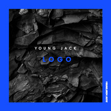

Logo
============================

|  |  |
| :--: | :-- |
| [ Logo](https://emumo.xiami.com/album/2103512883) | **艺人**: [满舒克](../index.md) **语种**: 国语 **唱片公司**: 华宇世博, 摩登天空 **发行时间**: 2018年02月02日 **专辑类别**: EP, 单曲 **专辑风格**:  **播放数**: 6024 **收藏数**: 17 **评论数**: 4  |

## 简介

《Logo》由满舒克作词作曲。传达的是舒克一路成长的态度。音乐可以影响每一个人，也希望更多人可以听到自己的音乐。如果一首歌可以让你更有动力去工作去成长，甚至奔跑。那就是舒克通过自己的音乐想要达成的事情。  
  
“那些韵脚的堆积，是我唯一的消遣。”足以见舒克对于音乐的专注和倾尽所有热情投入在音乐之中忘记一切。“为了更好的自己和不灭的精神”“I Know my Name like a Logo”这句话送给自己，也送给每一个热情音乐热爱生活全身心投入到自己所爱事物之中的每一个人。  
  
舒克的作品有对声音和结构独特的诠释方式，透过情绪细节表达上的处理有娓娓道来的一面，但也不失音乐饱满的张力。共同打造出立体的听感。  
  
《Logo》表达了舒克对自己音乐作品及未来前路的信心。新的一年，舒克将会继续坚持他在音乐这条路上力争做到完美的初衷，不断探索及突破直至将名字作为一个logo印在所有人的心中。  
  
做音乐是一件持续的事情 ，而舒克这样专注的音乐人也必将会有长远的生命力。

## 曲目

## 评论

|  |  |  |  |
| :-- | :-- | :-- | :-- |
|  [虾米用户](https://emumo.xiami.com/u/49902230) R&B-God  2018-10-20 22:16 赞(0) 踩(0) | 
cool 
 |
|  [虾米用户](https://emumo.xiami.com/u/12047889) 我还没想好 2018-03-24 12:51 赞(1) 踩(0) | 
虾米落魄了
 |
|  [虾米用户](https://emumo.xiami.com/u/322236063)  2018-03-14 19:08 赞(1) 踩(0) | 
寻子.特点:喜欢坐沙发
 |
|  [虾米用户](https://emumo.xiami.com/u/13137804) 骨灰級影迷、獨立音樂聽衆... 2018-03-12 22:14 赞(1) 踩(0) | 
沙发
 |
