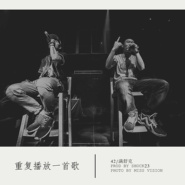

重复播放一首歌
============================

|  |  |
| :--: | :-- |
| [ 重复播放一首歌](https://emumo.xiami.com/album/806106203) | **艺人**: [满舒克](../index.md) **语种**: 国语 **唱片公司**: 独立发行 **发行时间**: 2014年07月23日 **专辑类别**: 录音室专辑 **专辑风格**: 爵士说唱 Jazz Rap **播放数**: 213740 **收藏数**: 39 **评论数**: 6  |

## 简介

&nbsp;&nbsp;&nbsp; 继《闽南人爱饶舌》之后，这次42则是以“流氓诗人”自称，在他说来，表现的是生活傻好难过和精神层面的一个对比，可能在作品中歌词中有多种状态，有梦想的热血青年，热衷本土文化的闽南人，对社会现象不满的愤青，追忆过去的怀旧者，但是在生活中，也是照样穿着裤衩拖鞋，很邋遢的出门买夜宵，在家里翘着腿看电视。“流氓”这个词其实是有点调侃的意思，而“诗人”呢，刚好符合街头饶舌歌手的身份。这张专辑从曲风上来说，可以说是很纯粹的爵士说唱，很适合泡壶茶，坐下来静静听。而在歌词上，可谓是精雕细琢，为了符合“诗人”的身份，在文字上下了很多功夫，甚至在很多地方牺牲了饶舌乐的一个基本要素——押韵。
 

&nbsp;&nbsp;&nbsp; 流氓诗人，有点玩世不恭，却又饱含深情，有点慵懒，却也满腔热血，这个夏天，就让我们来感受下来自一个“流氓”的真情告白吧。
 

更多消息请关注微博@FreshTape鲜卡带
 

 

## 曲目

## 评论

|  |  |  |  |
| :-- | :-- | :-- | :-- |
|  [虾米用户](https://emumo.xiami.com/u/5557217) 海风轻轻～牵动无忧♂无虑 2015-12-07 19:44 赞(0) 踩(0) | 
歌词。。。没一点意思...
 |
|  [虾米用户](https://emumo.xiami.com/u/53009011) 世间好物不坚固 2015-10-24 06:28 赞(0) 踩(0) | 
(≧ω≦)
 |
|  [虾米用户](https://emumo.xiami.com/u/2483956) 情绪控制音乐 2015-07-24 01:04 赞(0) 踩(0) | 

 |
|  [虾米用户](https://emumo.xiami.com/u/10613989) 唯有音乐安抚我 2015-05-25 11:41 赞(0) 踩(0) | 
不错
 |
|  [虾米用户](https://emumo.xiami.com/u/47921453)   2015-05-22 11:56 赞(0) 踩(0) | 
问42好！  
 |
|  [虾米用户](https://emumo.xiami.com/u/22279005) color 2015-02-23 22:43 赞(0) 踩(0) | 
被此歌洗脑了
 |
