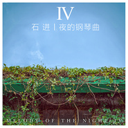

夜的钢琴曲ⅣMelody of the Night Ⅳ
============================

|  |  |
| :--: | :-- |
| [ 夜的钢琴曲ⅣMelody of the Night Ⅳ](https://emumo.xiami.com/album/2102722420) | **艺人**: [石进](../index.md) **语种**: 纯音乐 **唱片公司**: 独立发行 **发行时间**: 2017年04月05日 **专辑类别**: 录音室专辑 **专辑风格**: 轻音乐 Easy Listening **播放数**: 5662576 **收藏数**: 13024 **评论数**: 558  |

## 简介

IIIIIIIIIIIIIIIIIIIIIIIIIIIIIIIIIIIIIIIIIIIIII&nbsp;虾米音乐人&nbsp;·&nbsp;全网独家首发&nbsp;IIIIIIIIIIIIIIIIIIIIIIIIIIIIIIIIIIIIIIIIIIIIII  
石进2017年新专辑，是石进独立音乐人身份制作发行的第五张专辑。  
  
这张专辑，收录了我2015-2016年的所创作的大部分音乐，和之前一样，用音乐来记录生活，这一点我想一直都不会改变。  
&nbsp;  
新专辑像是对之前三张专辑故事的延续，2012年我的第二张专辑，收录了《春雾》，2015年第三张专辑，收录了《秋逝》，2017年这张专辑，收录了新创作的《夏语》和《冬吟》这两首作品，用音乐来表达四季的感悟。  
&nbsp;  
巧的是，在2012年第二张专辑里收录了一首《叶小安》，而这张新专辑，收录了《致叶小安的信》，会让人有一种音乐续集的感觉，而这一封回信，让我们等了五年的时间。  
  
从第三张专辑对于《夜的钢琴曲》系列来说，是一个转折点，因为加入了不同的乐器，而这张是对上张专辑风格的延续和升华，对于夜的音乐，不光光只有钢琴，加入了不同的乐器，会让整个音乐更加丰满和深情。  
  
&nbsp;

## 曲目

- [对你说晚安](./2102722420/8HN9mk189e2.md)
- [被辜负的青春](./2102722420/8HN9mm498b0.md)
- [男和女](./2102722420/xNcAxDce9fc.md)
- [夏语](./2102722420/mSrB9e55f24.md)
- [无言的告别](./2102722420/8HN9mpe71be.md)
- [隐没的天使](./2102722420/mSrB9g903a4.md)
- [记得有人在等你](./2102722420/mSrB9h8479f.md)
- [她的悲伤](./2102722420/8HN9msf5108.md)
- [致叶小安的信](./2102722420/bf2e5Ed4eb57.md)
- [铁塔下的舞会](./2102722420/8HN9mue7ecf.md)
- [冬吟](./2102722420/b1rA3rp3f235.md)
- [我们的婚礼](./2102722420/xNcAxMa5169.md)
- [夜的晚安曲](./2102722420/xNcAxBa804b.md)

## 评论

|  |  |  |
| :-- | :-- | :-- |
|  [虾米用户](https://emumo.xiami.com/u/74487606)  2021-01-10 21:36 赞(1) 踩(0) | 
虾米要关闭了 终将离开 提前已购音乐保存了
 |
|  [虾米用户](https://emumo.xiami.com/u/74487606)  2021-01-10 21:09 赞(0) 踩(0) | 
虾米要关闭了 终将离开 提前已购音乐保存了
 |
|  [虾米用户](https://emumo.xiami.com/u/444253289)  2020-12-03 19:36 赞(0) 踩(0) | 
太好听，相见恨晚。像母亲的手温柔摩挲我的头，笑中带泪(´;︵;`
 |
|  [虾米用户](https://emumo.xiami.com/u/327147056)  2020-09-16 09:25 赞(0) 踩(0) | 
这张专辑是不是在收音的时候放大音量了 比别的专辑都要响一点 每次随机到这张专辑的曲子就得按下低音量&amp;hellip;&amp;hellip;
 |
|  [虾米用户](https://emumo.xiami.com/u/405354840)  2020-08-04 14:16 赞(1) 踩(0) | 
带我去你的城市，你住的城市下雨了，下雨时你会想起谁？就这样远远地看着你，伤恋，回眸，乡念，印迹...... 暗恋春雾、夏语、秋逝、冬吟，被时光移动的城市，遗忘了回忆的温度，这一程，情深缘浅。邂逅，在这个世界相遇。无奈，请忘了，我曾爱过你...... 隐没的天使，隐形的思念，惜别被辜负的青春，何时再见...... 飘落的云，诗与梦，再见四季，此去经年，恍若如梦，虚无缥缈。空中的城堡，就在眼前，触手却不可及。一个人的时光，街道的寂寞，如幻的角落，幻忆，陶醉，停滞，幻影...... 穿越时空的想念，斑驳陆离，梵音萦绕，聆听忧伤，空灵，幽静，如溪流，似海风，仿佛流星划过深邃的太空......
 |
|  [虾米用户](https://emumo.xiami.com/u/100908420) _theoneadore... 2020-06-01 01:44 赞(0) 踩(0) | 
  
 |
|  [虾米用户](https://emumo.xiami.com/u/100908420) _theoneadore... 2020-06-01 01:43 赞(0) 踩(0) | 
啊，我其实也很想看视频啊
 |
|  [虾米用户](https://emumo.xiami.com/u/957383)  2020-04-08 13:00 赞(0) 踩(0) | 
好棒，石进，加油！
 |
|  [虾米用户](https://emumo.xiami.com/u/957383)  2020-04-08 13:00 赞(0) 踩(0) | 
好棒，石进，加油！
 |
|  [虾米用户](https://emumo.xiami.com/u/441473607)  2020-03-16 23:45 赞(0) 踩(0) | 
很棒。就是人声和唱有点碍事。没有歌词能配得上。
 |
|  [虾米用户](https://emumo.xiami.com/u/400467410)  2020-02-26 15:50 赞(0) 踩(0) | 
谢谢你弹出我的心声
 |
|  [虾米用户](https://emumo.xiami.com/u/39019310) 遥遥的一颗星，纵使喜欢不... 2020-02-02 08:34 赞(0) 踩(0) | 
（接上）所以，希望你可以一直坚持你喜欢的音乐创作，无论是钢琴曲（虽然我最爱的是），还是其他的歌曲的创作，能有这样的爱好，能做自己喜欢的事是最最美好的事。虽然非常希望你能创作出更多的曲子，有更多的听众喜欢，但最最希望的是你可以一直找到自己喜欢的生活状态，在从事的各种工作和事情中得到更多的快乐！❤️
 |
|  [虾米用户](https://emumo.xiami.com/u/39019310) 遥遥的一颗星，纵使喜欢不... 2020-01-27 21:28 赞(0) 踩(0) | 
你在台上说好像大家都更喜欢早期的曲子，我是真心喜欢新曲。不是不喜欢原来的，早期的曲子已深入人心，成为一种习惯，奠定了一个基础，一种石进的风格。喜欢夜五的人最多，可我偏爱四七九等。新曲里的节奏里有更多的编曲，小提琴的委婉，大提琴的忧伤，长笛的悠远，让曲子更加立体，但有时也请尽量让钢琴作为主旋律，也许是我的偏爱，我更喜欢你的钢琴，希望其他乐器是围绕着钢琴，但不排斥你的创作。抱歉我不懂乐理，更不会弹奏乐器，说错了，望谅。重要的是，听的人可以从新曲里听到更多的故事，或者说不同的人也许听到不同的故事，但一如既往的，有忧伤，但却治愈。虽然有时不应该夜晚听，因为越陷越深，但却可以心安的伴着入眠。（待续）
 |
|  [虾米用户](https://emumo.xiami.com/u/280520995)  2019-11-29 16:38 赞(1) 踩(0) | 
这张专辑不错！
 |
|  [虾米用户](https://emumo.xiami.com/u/432175868)  2019-11-13 23:57 赞(0) 踩(0) | 
喜欢静静地听舒缓心情的音乐。
 |
|  [虾米用户](https://emumo.xiami.com/u/307409234) 林宥嘉 2019-11-10 16:48 赞(1) 踩(0) | 
最好听的石进
 |
|  [虾米用户](https://emumo.xiami.com/u/282835760)  2019-11-03 23:55 赞(0) 踩(0) | 
听了新专辑，感觉，《夜的钢琴曲Ⅳ》这张最喜欢了，12首，有10都很喜欢，而且很多首是听一遍就喜欢的，新专辑感觉平平淡淡，没有那种一听就爱上的感觉。
 |
|  [虾米用户](https://emumo.xiami.com/u/274976883) 爱听音乐的人 2019-10-13 06:35 赞(1) 踩(0) | 
20191027厦门 
 |
|  [虾米用户](https://emumo.xiami.com/u/104134246) 苏世独立，横而不流. 2019-09-22 19:48 赞(0) 踩(0) | 
几年以后再来听，依旧喜欢。
 |
|  [虾米用户](https://emumo.xiami.com/u/274976883) 爱听音乐的人 2019-07-23 09:22 赞(1) 踩(0) | 
2019.厦门
 |
|  [虾米用户](https://emumo.xiami.com/u/257317638) 沉寂...... 2019-07-11 00:38 赞(0) 踩(0) | 
《冬吟》
 |
|  [虾米用户](https://emumo.xiami.com/u/410175639)  2019-07-07 07:55 赞(0) 踩(0) | 
第一次听到石先生 夜的钢琴曲还在上学，听到就哭了，一晃十几年过去了，石先生的钢琴依然深情 触人心弦……
 |
|  [虾米用户](https://emumo.xiami.com/u/12986174)   2019-07-06 12:42 赞(0) 踩(0) | 
高品质的专辑
 |
|  [虾米用户](https://emumo.xiami.com/u/27737836)  2019-07-03 07:52 赞(0) 踩(0) | 
这张专辑更加成熟了，从夜的钢琴曲再到-一个人的时光-陪着我的她-我们的婚礼
 |
|  [虾米用户](https://emumo.xiami.com/u/294296260) 今でもあなたはわたしの光 2019-06-28 20:04 赞(0) 踩(0) | 
喜欢
 |
|  [虾米用户](https://emumo.xiami.com/u/423453320)  2019-06-25 13:22 赞(0) 踩(0) | 
加油!
 |
|  [虾米用户](https://emumo.xiami.com/u/425703366)  2019-06-08 18:42 赞(0) 踩(0) | 
悠扬的琴声 悲伤的旋律进行 让人不可自拔 沉浸在音乐的世界里
 |
|  [虾米用户](https://emumo.xiami.com/u/63160938) 你听得到 2019-06-02 06:42 赞(1) 踩(0) | 
纯钢琴比较喜欢
 |
|  [虾米用户](https://emumo.xiami.com/u/304121523) 也许来自火星 2019-05-31 17:22 赞(1) 踩(0) | 
高音质居然还是免费，让我们这些粉丝受用
 |
|  [虾米用户](https://emumo.xiami.com/u/291017177)  2019-05-28 15:06 赞(0) 踩(0) | 
谢谢你，石进先生，做了这么好音乐，
 |
|  [虾米用户](https://emumo.xiami.com/u/424481248) Never back . 2019-05-21 18:54 赞(0) 踩(0) | 
太好听了，每睌我只听这个。
 |
|  [虾米用户](https://emumo.xiami.com/u/42084678) 此心安处是吾乡 2019-05-09 23:56 赞(0) 踩(0) | 
你们知道哪里有琴谱吗？
 |
|  [虾米用户](https://emumo.xiami.com/u/42084678) 此心安处是吾乡 2019-05-09 23:48 赞(1) 踩(0) | 
值得最高分！
 |
|  [虾米用户](https://emumo.xiami.com/u/343889790)  2019-05-04 13:05 赞(0) 踩(0) | 
想去听石进先生的一场音乐会，先来感受一下这张专辑
 |
|  [虾米用户](https://emumo.xiami.com/u/347550929)  2019-05-04 11:04 赞(1) 踩(0) | 
牵着你的灵魂让你丢了魂
 |
|  [虾米用户](https://emumo.xiami.com/u/423957304)  2019-05-03 13:58 赞(1) 踩(0) | 
安静亦有千钧之力
 |
|  [虾米用户](https://emumo.xiami.com/u/420463194)  2019-04-24 20:56 赞(1) 踩(0) | 
好听
 |
|  [虾米用户](https://emumo.xiami.com/u/310784278)  2019-04-21 23:52 赞(0) 踩(0) | 
很动听
 |
|  [虾米用户](https://emumo.xiami.com/u/335794092) aa哈 2019-04-10 10:06 赞(0) 踩(0) | 
好听啊！！！
 |
|  [虾米用户](https://emumo.xiami.com/u/339824828)  2019-04-02 20:39 赞(0) 踩(0) | 
没有石进钢琴曲的音乐APP我全删了  
 |
|  [虾米用户](https://emumo.xiami.com/u/422134783)  2019-04-01 21:56 赞(0) 踩(0) | 
同样白羊座，同样敲键盘，都曾敲过方格键，也敲过黑白键，你最终选择了黑白键，听了5年的石进老师，多羡慕你的才华，可以在黑白键中倾诉理想和人生，而我却只能放下黑白键，在方格键中敲代码为生
 |
|  [虾米用户](https://emumo.xiami.com/u/357956538)  2019-03-29 19:49 赞(0) 踩(0) | 
感觉小提琴啊人声啊压过钢琴了，想听的那种阳光里风轻轻掠起头发的钢琴，没有听到
 |
|  [虾米用户](https://emumo.xiami.com/u/421572696)  2019-03-22 14:26 赞(1) 踩(0) | 
✨
 |
|  [虾米用户](https://emumo.xiami.com/u/140942502) 爱生活，更爱音乐。 2019-03-11 22:26 赞(0) 踩(0) | 
大爱那首（被辜负的青春）由此我将自己的微信名字也改成了同名
 |
|  [虾米用户](https://emumo.xiami.com/u/177059302)  2019-03-08 23:14 赞(0) 踩(0) | 
能让浮躁的心平静下来，适合在追忆过往时，乘着音符，回味着时间给我们留下无数美好与遗憾的瞬间。很喜欢石进的音乐，正如他所说＂那就是逝去的日子，那些珍贵的东西我们都需要珍藏，让自己在将来的日子里慢慢回忆”。
 |
|  [虾米用户](https://emumo.xiami.com/u/69381144) 爱与音乐不可辜负！ 2019-03-03 22:37 赞(0) 踩(0) | 
钢琴曲，我全部的爱！
 |
|  [虾米用户](https://emumo.xiami.com/u/302765348)  2019-02-23 22:35 赞(0) 踩(0) | 
最喜欢这张专辑
 |
|  [虾米用户](https://emumo.xiami.com/u/328487786) 95后独立音乐制作人 2019-02-23 20:06 赞(0) 踩(0) | 
隐没的天使最好听
 |
|  [虾米用户](https://emumo.xiami.com/u/328487786) 95后独立音乐制作人 2019-02-23 20:06 赞(0) 踩(0) | 
隐没的天使最好听
 |
|  [虾米用户](https://emumo.xiami.com/u/407101720)  2019-02-23 08:21 赞(0) 踩(0) | 
好听
 |
|  [虾米用户](https://emumo.xiami.com/u/191316836) 愿星光指引你我前行，愿我... 2019-02-23 06:48 赞(1) 踩(0) | 
无论什么时候。听石老师的曲子。再糟糕也心情也会变好。永远支持您。 我要弹会您的曲子
 |
|  [虾米用户](https://emumo.xiami.com/u/378301091) 青草，树木和花 2019-02-19 21:56 赞(0) 踩(0) | 
一直很喜欢
 |
|  [虾米用户](https://emumo.xiami.com/u/377924587) 我还没想好要写什么... 2019-02-07 22:32 赞(0) 踩(0) | 
很不错，深入人心的钢琴音乐，喜欢这样的感觉。
 |
|  [虾米用户](https://emumo.xiami.com/u/259728994)  2019-02-03 20:11 赞(0) 踩(0) | 
陪我走过一晚又一晚
 |
|  [虾米用户](https://emumo.xiami.com/u/408794917)  2019-02-02 12:18 赞(0) 踩(0) | 
好！
 |
|  [虾米用户](https://emumo.xiami.com/u/213166474) 听一会…… 2019-01-31 16:53 赞(0) 踩(0) | 
好听！
 |
|  [虾米用户](https://emumo.xiami.com/u/410485328)  2019-01-29 22:51 赞(0) 踩(0) | 
整体上很不错的一张专辑，很有幸到了石进的成都音乐会，买了这张专辑并得到了亲笔签名，送给了心爱的女生，虽然没有结果，但我希望优美的曲子能够给她带来宁静与美好！
 |
|  [虾米用户](https://emumo.xiami.com/u/30401670) 失败者的飞翔... 2018-12-12 22:59 赞(0) 踩(0) | 
还是很喜欢
 |
|  [虾米用户](https://emumo.xiami.com/u/665560)  2018-09-07 11:38 赞(1) 踩(0) | 
买了你的演奏会，12月去听
 |
|  [虾米用户](https://emumo.xiami.com/u/675007) 我还没想好要写什么... 2018-07-21 15:31 赞(0) 踩(0) | 
这个专辑整体给人感觉偏沉重，望以后加一些小清新的
 |
|  [虾米用户](https://emumo.xiami.com/u/347898113) 只愿一直听下去 2018-07-13 19:19 赞(1) 踩(0) | 
真诚之作，就应十分相待
 |
|  [虾米用户](https://emumo.xiami.com/u/265415655)   2018-06-25 00:24 赞(4) 踩(0) | 
今天听了石老师在重庆的现场演奏会，从第二首曲子开始，听的时候几度泪流不止，现场版的演奏和听虾米上的曲子感受完全不一样，尤其是加入大小提琴和长笛，感情更饱满，意境更深远，最开心的莫过于最后还第一个得到石老师的现场签名，完赞！
 |
|  [虾米用户](https://emumo.xiami.com/u/11216870) 只听最好听的 2018-06-03 20:45 赞(0) 踩(0) | 
好听好听
 |
|  [虾米用户](https://emumo.xiami.com/u/13165169)  2018-05-10 09:51 赞(0) 踩(0) | 
喜欢你的音乐，很有自己的内涵。
 |
|  [虾米用户](https://emumo.xiami.com/u/311849816)   …… 2018-05-08 23:55 赞(1) 踩(0) | 
很喜欢石进的钢琴曲，每天中午和晚上睡觉前都要听一首！
 |
|  [虾米用户](https://emumo.xiami.com/u/224616644) 孤独的我也有善良的心。 2018-05-07 08:45 赞(0) 踩(0) | 
听了好多年了，你还是我最喜欢的石进，希望不忘初心
 |
|  [虾米用户](https://emumo.xiami.com/u/36497288) 走不下去就别再对彼此坏 2018-04-02 03:27 赞(0) 踩(0) | 
还是纯钢琴好&amp;hellip;
 |
|  [虾米用户](https://emumo.xiami.com/u/341022845)  2018-03-25 10:42 赞(1) 踩(0) | 
喜欢    
 |
|  [虾米用户](https://emumo.xiami.com/u/341022845)  2018-03-25 10:41 赞(1) 踩(0) | 

 |
|  [虾米用户](https://emumo.xiami.com/u/43492923) 行到水穷我才开始害怕，夕... 2018-03-23 10:52 赞(0) 踩(0) | 
▲
 |
|  [虾米用户](https://emumo.xiami.com/u/79850366)  2018-03-20 17:25 赞(0) 踩(0) | 
特别喜欢石进的曲子
 |
|  [虾米用户](https://emumo.xiami.com/u/299700471) 即使生生不见，也要岁岁平... 2018-02-27 22:33 赞(0) 踩(0) | 
一直很喜欢石进的钢琴曲这张是最喜欢的一张。
 |
|  [虾米用户](https://emumo.xiami.com/u/349719593) 雨整整下了一季，心轻轻碎... 2018-02-11 21:13 赞(1) 踩(0) | 
喜欢
 |
|  [虾米用户](https://emumo.xiami.com/u/125654428) 我还没想好要写什么... 2018-02-05 10:40 赞(0) 踩(0) | 
期待广州演奏会 
 |
|  [虾米用户](https://emumo.xiami.com/u/95824352)  2018-02-05 00:02 赞(0) 踩(0) | 
真是很优秀的专辑
 |
|  [虾米用户](https://emumo.xiami.com/u/9940120)   2018-01-14 22:00 赞(0) 踩(0) | 

 |
|  [虾米用户](https://emumo.xiami.com/u/69712128) 世非济济，谦谦君子 2018-01-10 01:43 赞(0) 踩(0) | 
三年不忘。
 |
|  [虾米用户](https://emumo.xiami.com/u/23739858) 依然是这些可以打动我的音... 2018-01-06 16:30 赞(0) 踩(0) | 
石先生的曲子总是那么忧伤，很喜欢
 |
|  [虾米用户](https://emumo.xiami.com/u/269056456)  2018-01-05 21:25 赞(0) 踩(0) | 
一直是石进的粉丝 
 |
|  [虾米用户](https://emumo.xiami.com/u/294995766)  2018-01-04 19:21 赞(0) 踩(0) | 
同样是写软件的，我也有个钢琴梦，希望有一天能弹奏石老师的钢琴曲，特别喜欢，已经买了音乐会的门票，期待现场去倾听！！！第一次听石老师的音乐就被感动到，虽然没有专业的那么完美，但是能够感动到我们的音乐！
 |
|  [虾米用户](https://emumo.xiami.com/u/23630703)  2017-12-31 16:08 赞(0) 踩(0) | 
越来越不顺耳了&amp;hellip;&amp;hellip;
 |
|  [虾米用户](https://emumo.xiami.com/u/16526464)  2017-12-24 13:53 赞(1) 踩(0) | 
石老师钢琴曲都很耐听，如果要配人声也是安德烈波切利这样的美声流行夸界的音色歌声才匹配，否则破坏曲子的意境。
 |
|  [虾米用户](https://emumo.xiami.com/u/90432228)  2017-12-23 20:08 赞(0) 踩(0) | 
每次听石进的钢琴曲都会很平静
 |
|  [虾米用户](https://emumo.xiami.com/u/7824614) 我还没想好要写什么... 2017-12-20 10:07 赞(2) 踩(0) | 
高考的复习 大学的夜晚 工作后上下班的路上 感谢石进老师音乐的陪伴 第一时间贡献自己的支持！
 |
|  [虾米用户](https://emumo.xiami.com/u/323023729)  2017-12-17 20:16 赞(0) 踩(0) | 
这是我最喜欢的钢琴曲了
 |
|  [虾米用户](https://emumo.xiami.com/u/338456203) 澄清静心，听世界音。 2017-12-16 04:00 赞(0) 踩(0) | 
感谢！
 |
|  [虾米用户](https://emumo.xiami.com/u/20366535)  2017-12-15 21:59 赞(3) 踩(0) | 
大爱进哥的每一首曲子，从10年至今一路追随。等了好久的终于有幸见到本人，如愿听到现场版的， 好听到爆 让我那晚潸然落泪数次。
 |
|  [虾米用户](https://emumo.xiami.com/u/338476581)  2017-12-03 21:08 赞(2) 踩(0) | 
为了鼓励、支持你的正版音乐，我分别在2016和2017年买了你的现场音乐会门票。
 |
|  [虾米用户](https://emumo.xiami.com/u/205026130)  2017-11-26 22:03 赞(0) 踩(0) | 
为了石进来到了虾米
 |
|  [虾米用户](https://emumo.xiami.com/u/336502148)  2017-11-21 00:39 赞(2) 踩(0) | 
特别喜欢 期待更多新作品
 |
|  [虾米用户](https://emumo.xiami.com/u/47191452) listening 2017-11-01 19:37 赞(9) 踩(0) | 
内容已删除
 |
| ⇒ |  [虾米用户](https://emumo.xiami.com/u/180342264)  2017-11-01 23:46 赞(0) 踩(0) | 
被你感动到了  其实伤害这些 我都不太记得了 只记得你对我好
 |
| ⇒ |  [虾米用户](https://emumo.xiami.com/u/199069405)  2018-05-13 23:01 赞(0) 踩(0) | 
武汉那一场诶  加油 希望你已如愿～
 |
|  [虾米用户](https://emumo.xiami.com/u/332687073) 我就是来听纯音乐的。 2017-11-01 16:37 赞(1) 踩(0) | 
找了好多的音乐软件、、终于在这找到你，12月1日不见不散^_^
 |
|  [虾米用户](https://emumo.xiami.com/u/296838825) 白费 2017-10-31 14:12 赞(2) 踩(0) | 
毫不吝啬自己的眼泪
 |
|  [虾米用户](https://emumo.xiami.com/u/305668340)  2017-10-30 21:20 赞(3) 踩(0) | 
新的歌曲，旧的回忆
 |
|  [虾米用户](https://emumo.xiami.com/u/12986927) 龙泽西 2017-10-27 23:48 赞(1) 踩(0) | 
中国好歌曲音乐人 #龙泽西# 已入驻虾米音乐 新歌《夏天的日记》已上线！
 |
|  [虾米用户](https://emumo.xiami.com/u/219316031)   2017-10-27 23:40 赞(1) 踩(0) | 
哈哈，第137位购买者
 |
|  [虾米用户](https://emumo.xiami.com/u/4702402)   2017-10-27 23:00 赞(3) 踩(0) | 
那年刚刚毕业，刚刚认识她，孤身一人，在音乐厅听着你的音乐，傻傻的用手机的录音和文字告诉她自己的诗与梦，却迟迟得不到回复..…转眼三年，与她再无联系…原来最远的距离不是异地，不是时空，而是心…
 |
|  [虾米用户](https://emumo.xiami.com/u/296541632)  金基德 李志 2017-09-29 00:14 赞(2) 踩(0) | 
不如5啊哎
 |
|  [虾米用户](https://emumo.xiami.com/u/12538903)  2017-09-26 10:28 赞(2) 踩(0) | 
冬吟有共鸣
 |
|  [虾米用户](https://emumo.xiami.com/u/12538903)  2017-09-26 10:28 赞(0) 踩(0) | 
冬吟有共鸣
 |
|  [虾米用户](https://emumo.xiami.com/u/45918881)   2017-09-24 14:48 赞(0) 踩(0) | 
昨晚在武汉琴台音乐厅听了您音乐会最后弹奏的一曲《夜的晚安曲》，晚上安然入眠&amp;hellip;&amp;hellip; 
 |
|  [虾米用户](https://emumo.xiami.com/u/6463750) 清风拂山岗 2017-09-21 11:05 赞(0) 踩(0) | 
石进的钢琴曲总是很清淡但却展示出悠悠的故事。。。
 |
|  [虾米用户](https://emumo.xiami.com/u/225049484) 最后她的纯洁战胜了好奇 2017-09-14 23:01 赞(30) 踩(0) | 
为了石老师才来的虾米 
 |
| ⇒ |  [虾米用户](https://emumo.xiami.com/u/41815257)   2018-06-13 23:24 赞(0) 踩(0) | 
我也是
 |
|  [虾米用户](https://emumo.xiami.com/u/250318940) 我还没想好要写什么... 2017-09-10 21:24 赞(0) 踩(0) | 
有没有广州看过6月那场演奏会的？12月的还去吗 
 |
|  [虾米用户](https://emumo.xiami.com/u/285463681)   2017-09-07 11:55 赞(0) 踩(0) | 
支持，一如既往
 |
|  [虾米用户](https://emumo.xiami.com/u/47476500) 爱你宝贝 2017-09-03 21:40 赞(0) 踩(0) | 
听着都似曾相识，引人回忆，好喜欢。
 |
|  [虾米用户](https://emumo.xiami.com/u/287540959)  2017-08-29 12:52 赞(0) 踩(0) | 
刚开始接触石进老师夜曲的时候是在青岛玩偶尔听到你的夜五然后来家去百度找青岛金沙滩背景音乐是什么没想到查出来了 
 |
|  [虾米用户](https://emumo.xiami.com/u/284460164)  2017-08-25 16:08 赞(0) 踩(0) | 
          
 |
|  [虾米用户](https://emumo.xiami.com/u/320807495)  2017-08-22 11:37 赞(1) 踩(0) | 
风格多变，依旧很好听，毕竟有舍必有得，也估计是大大近来有了更多生活体验，改变了些生活方式，才造就曲子的多元化。不过恕我直言，专辑名依旧是夜的钢琴曲的话不是十分贴合内容了。也不必一直用夜的钢琴曲的名头，既然要改变也该突破夜晚。
 |
|  [虾米用户](https://emumo.xiami.com/u/319525424)  2017-08-21 17:22 赞(0) 踩(0) | 
一直以来都是那么好听。听起来很入迷。从夜的钢琴曲出专辑到现在都是喜欢听。大力支持~
 |
|  [虾米用户](https://emumo.xiami.com/u/31498793) 暂无签名~ 2017-08-19 09:49 赞(0) 踩(0) | 
好棒，支持一个
 |
|  [虾米用户](https://emumo.xiami.com/u/34311650)  2017-08-17 21:46 赞(0) 踩(0) | 
太牛了
 |
|  [虾米用户](https://emumo.xiami.com/u/319938935)  2017-08-17 19:23 赞(0) 踩(0) | 
Nice又找到了最初听1的感觉
 |
|  [虾米用户](https://emumo.xiami.com/u/259003329)   2017-08-16 11:42 赞(1) 踩(0) | 
想知道石进老师微博上的新demo-3叫什么名字？好像没有收进来，超喜欢那首的！ 
 |
|  [虾米用户](https://emumo.xiami.com/u/6639072)  2017-08-10 10:32 赞(0) 踩(0) | 
神曲 不做解释
 |
|  [虾米用户](https://emumo.xiami.com/u/317510259)  2017-08-05 21:27 赞(0) 踩(0) | 
嗯呐。，
 |
|  [虾米用户](https://emumo.xiami.com/u/247826197)  2017-08-04 00:23 赞(0) 踩(0) | 
越夜越好听！
 |
|  [虾米用户](https://emumo.xiami.com/u/315574352)  2017-07-28 11:11 赞(0) 踩(0) | 
还行
 |
|  [虾米用户](https://emumo.xiami.com/u/315127318)  2017-07-27 23:32 赞(0) 踩(0) | 
睡前听一首令人安心的歌曲，今晚不会再失眠。
 |
|  [虾米用户](https://emumo.xiami.com/u/307445251)  2017-07-25 17:32 赞(0) 踩(0) | 
真是太好的歌曲
 |
|  [虾米用户](https://emumo.xiami.com/u/231945557)  2017-07-24 14:10 赞(1) 踩(0) | 
还是最喜欢石进的曲子，不知道为什么，总觉得他的曲子对我来说很特别，一听便知道是他所作
 |
|  [虾米用户](https://emumo.xiami.com/u/305069600)   2017-07-23 16:13 赞(0) 踩(0) | 
听着心好痛，会回忆很多事情，但终究还是过去了，人生也很迷茫，也不知道现在做的事情是对还是错，该怎么办呢
 |
|  [虾米用户](https://emumo.xiami.com/u/27878400) www.nimer.co... 2017-07-19 00:42 赞(0) 踩(0) | 
还要买吗
 |
|  [虾米用户](https://emumo.xiami.com/u/2825003)  2017-07-18 14:24 赞(0) 踩(0) | 
石进
 |
|  [虾米用户](https://emumo.xiami.com/u/313065332)  2017-07-18 11:21 赞(0) 踩(0) | 
美
 |
|  [虾米用户](https://emumo.xiami.com/u/184093436)  2017-07-16 19:59 赞(0) 踩(0) | 
喜欢石进的钢琴曲！一直一直一直
 |
|  [虾米用户](https://emumo.xiami.com/u/259462408)   2017-07-12 20:44 赞(1) 踩(0) | 
从&amp;ldquo;夜的钢琴曲一&amp;rdquo;开始听到现在，基本每天都在听
 |
|  [虾米用户](https://emumo.xiami.com/u/277939236) 享受生命，随心所欲！ 2017-07-12 15:02 赞(0) 踩(0) | 
很好！作曲家本人也来     
 |
|  [虾米用户](https://emumo.xiami.com/u/304810986)   2017-07-11 03:30 赞(0) 踩(0) | 
被辜负的青春和花的微笑好相似
 |
|  [虾米用户](https://emumo.xiami.com/u/311092934)  2017-07-10 09:47 赞(0) 踩(0) | 
非常非常好听！
 |
|  [虾米用户](https://emumo.xiami.com/u/34455253) 人的梦想 是不会终结的！ 2017-07-08 10:12 赞(0) 踩(0) | 
很好听，继续努力！一直支持你！
 |
|  [虾米用户](https://emumo.xiami.com/u/291188441)   2017-07-07 17:44 赞(0) 踩(0) | 
很爱夜的钢琴曲，安静的倾诉
 |
|  [虾米用户](https://emumo.xiami.com/u/35188131)  2017-07-04 23:00 赞(1) 踩(0) | 
免费了嘛
 |
|  [虾米用户](https://emumo.xiami.com/u/288051580)  2017-06-30 00:45 赞(1) 踩(0) | 
从13年听到夜的钢琴曲5到现在，我开始喜欢上了纯音乐。虽然没有歌词，但每个旋律都似乎那么优美，心情不同，感受也不一样。也许是因为是没有歌词，虽然每一首都非常熟悉了，却百听不厌，每一首都很喜欢。
 |
|  [虾米用户](https://emumo.xiami.com/u/54786307)  2017-06-25 21:49 赞(0) 踩(0) | 
从14年听到现在，你的曲总能让人安静下来，每首都有一个场景一个故事，有机会一定去听现场版，安心！
 |
|  [虾米用户](https://emumo.xiami.com/u/306381720)  2017-06-21 21:38 赞(0) 踩(0) | 
是我傻还是怎么样？   这个专辑只能一首一首点着下?   这也太麻烦了吧？ 
 |
|  [虾米用户](https://emumo.xiami.com/u/306140361)  2017-06-20 22:36 赞(0) 踩(0) | 
最好的专辑，给人不同的感动！
 |
|  [虾米用户](https://emumo.xiami.com/u/305668340)  2017-06-18 23:39 赞(0) 踩(0) | 
希望能买到夜1和夜2的专辑，可惜已经没有了 
 |
|  [虾米用户](https://emumo.xiami.com/u/255660621) 虾米混进垃圾人，这种人不... 2017-06-18 15:16 赞(0) 踩(0) | 
没有第一张好，貌似石进的宣传也不到位，知名度不高
 |
|  [虾米用户](https://emumo.xiami.com/u/238182236) 慢慢喜欢你，你好，我是慢... 2017-06-12 08:20 赞(3) 踩(0) | 
为什么喜欢听音乐～音乐可以与灵魂对话。 为什么与石进夜的钢琴曲一听钟情～他的音乐给了我别人给不了的一种感觉。
 |
|  [虾米用户](https://emumo.xiami.com/u/250318940) 我还没想好要写什么... 2017-06-09 22:57 赞(0) 踩(0) | 
今晚有幸听到现场的演奏会，真的很棒！可惜太短了，意犹未尽啊，希望下次长一点，哈哈，进哥棒棒哒！
 |
| ⇒ |  [虾米用户](https://emumo.xiami.com/u/261214134)  2017-06-10 01:28 赞(0) 踩(0) | 
嗯我也是，今天特意休息去听他的演奏会
 |
|  [虾米用户](https://emumo.xiami.com/u/301614557)  2017-06-08 17:59 赞(1) 踩(0) | 
怎么才能整张专辑全部购买？？？
 |
|  [虾米用户](https://emumo.xiami.com/u/301461929)  2017-06-03 11:25 赞(0) 踩(0) | 
好听，坐等9月24日的青岛演奏会。就算请假逃课十个小时的火车我也要回去
 |
|  [虾米用户](https://emumo.xiami.com/u/260427752)  2017-06-03 09:00 赞(0) 踩(0) | 
很好的
 |
|  [虾米用户](https://emumo.xiami.com/u/206794516)  2017-06-02 22:15 赞(0) 踩(0) | 
支持石进老师！
 |
|  [虾米用户](https://emumo.xiami.com/u/238182236) 慢慢喜欢你，你好，我是慢... 2017-05-31 22:35 赞(10) 踩(0) | 
夜的钢琴曲每一首都是在夜里诞生，《夜Ⅳ》的封面充分阐述了专辑的主题～浓浓的思念。石进老师一直坚持用自己喜欢和独特的方式记录生活记录心情，Melody流淌着对生活的感悟，对心事的诉说。那不受拘束的音符汇聚成一首首浪漫的小诗，你听得到青春的悸动，听得到回忆的美好，听得到四季的情愫。你甚至看得到失眠的夜，未说出口的情话，想家时的泪水，无聊时的随想&amp;hellip;生活在继续，记录着生活的诗歌集～夜的钢琴曲也一定不会停止。 愿一如既往的任性，一如既往的固执，一如既往的让人期待。
 |
|  [虾米用户](https://emumo.xiami.com/u/6361118) 黑洞無始終，音樂無疆界 2017-05-29 23:07 赞(0) 踩(0) | 
标题明明是夜的钢琴曲，3、4两张封面却是阳光明媚，这算是反差萌吗？
 |
|  [虾米用户](https://emumo.xiami.com/u/6361118) 黑洞無始終，音樂無疆界 2017-05-29 23:06 赞(0) 踩(0) | 
一位优秀的音乐人必定是不断在尝试拓展自己的音乐领域，而只有才华有限之辈才会紧紧守着侥幸得来的一点成功不敢轻易放手，即使明知路越走越狭窄也只愿在一条路上走到黑。很遗憾，石进无疑是后者。加了点人声提琴笛子之类就自以为是突破和升华了？连百步都算不上，只是51步笑50步罢了。
 |
| ⇒ |  [虾米用户](https://emumo.xiami.com/u/292009204)  2017-06-10 23:38 赞(0) 踩(0) | 
音乐对于石老师只是爱好并非专业，他创作之初并非想过会得到很多人的认可，他不同于真实的音乐家，他更喜欢把情感通过音乐的方式来释放，不会想着创作多好的音乐。每个人对于事物的要求不一样，并非你认为的要求就是好的，无需把自己的想法强加于人，要求于人。若非非要，或许那个人可以是你自己，岂不比论他人之过来的有效
 |
| ⇒ |  [虾米用户](https://emumo.xiami.com/u/6361118) 黑洞無始終，音樂無疆界 2017-06-11 21:23 赞(0) 踩(0) | 
<q><b>灰灰说：</b></q>
 |
|  [虾米用户](https://emumo.xiami.com/u/52258807)  2017-05-25 22:41 赞(0) 踩(0) | 
可以
 |
|  [虾米用户](https://emumo.xiami.com/u/7247900)  2017-05-24 15:29 赞(0) 踩(0) | 
新专辑。人声的那个不好
 |
|  [虾米用户](https://emumo.xiami.com/u/235985446) 因为爱所以爱，长不大的童... 2017-05-24 08:19 赞(0) 踩(0) | 
前进
 |
|  [虾米用户](https://emumo.xiami.com/u/11652731)   2017-05-24 06:28 赞(0) 踩(0) | 
喜欢
 |
|  [虾米用户](https://emumo.xiami.com/u/203260683)  2017-05-23 20:26 赞(1) 踩(0) | 
大学里面，考会计证，考英语六级，太多的考试都是听着夜的钢琴曲系列，在六楼的宿舍，最后通过了。现在买下一张最新的专辑，挺好。
 |
|  [虾米用户](https://emumo.xiami.com/u/298042191)   2017-05-23 13:43 赞(0) 踩(0) | 
有很多新的东西，也能带给人新的回忆
 |
|  [虾米用户](https://emumo.xiami.com/u/20366535)  2017-05-22 22:39 赞(2) 踩(0) | 
昨晚在西安音乐厅有幸聆听石进老师现场演绎的很多新专辑的作品，真的非常棒！很好听。签售会也已买了CD和乐谱，用来珍藏。到现在想想 我都还激动的不要不要。
 |
|  [虾米用户](https://emumo.xiami.com/u/297245714) 你是人间四月天 2017-05-22 19:32 赞(0) 踩(0) | 
昨天现场买了专辑，可是没有播放的设备，迫不及待想听，购了数字专辑，为了听石老师的钢琴曲所以下载了虾米
 |
|  [虾米用户](https://emumo.xiami.com/u/261719880)  2017-05-22 19:19 赞(0) 踩(0) | 
这张专辑做的很认真
 |
|  [虾米用户](https://emumo.xiami.com/u/86948804)   2017-05-22 11:15 赞(0) 踩(0) | 
很值得买。接下来就是等武汉音乐会了。
 |
|  [虾米用户](https://emumo.xiami.com/u/47715474)  2017-05-19 22:09 赞(0) 踩(0) | 
不错不错 虽然我买不起
 |
|  [虾米用户](https://emumo.xiami.com/u/16389759)  2017-05-19 12:54 赞(2) 踩(0) | 
从《夜的钢琴曲5》被电，到《隐形的思念》、《1981》、《一个人的时光》&amp;hellip;每一首都如山间的小溪，宁静的忧郁，低调的优雅&amp;hellip;支持产权保护！果断支持石进！
 |
|  [虾米用户](https://emumo.xiami.com/u/293052531)  2017-05-18 14:18 赞(1) 踩(0) | 
下载不了！！！！！！！！！！！！！！！！！！！！！！！！！！！！！！！！！！！！！！！！！！！！！！！！！！！！！！！！！！！！！！！！！！！！！
 |
|  [虾米用户](https://emumo.xiami.com/u/78141136)  2017-05-14 08:02 赞(2) 踩(0) | 
为啥要钱？直接听不行吗，石老师你缺钱吗？ 来我家教我女儿钢琴吧，三餐都包的。
 |
| ⇒ |  [虾米用户](https://emumo.xiami.com/u/6179778) 弹琴打鼓，耍帅装酷 2017-05-14 09:58 赞(0) 踩(0) | 
您讲话带刺儿
 |
| ⇒ |  [虾米用户](https://emumo.xiami.com/u/78141136)  2017-05-14 12:34 赞(0) 踩(0) | 
<q><b>林音炫说：</b></q>
 |
| ⇒ |  [虾米用户](https://emumo.xiami.com/u/266428882)  2017-05-15 10:52 赞(0) 踩(0) | 
您写作品然后制作出来白送给别人？这不是义务给您创作的。
 |
| ⇒ |  [虾米用户](https://emumo.xiami.com/u/279642719) 永远忠诚 2017-05-17 01:57 赞(0) 踩(0) | 
<q><b>小丸纸的理想说：</b></q>
 |
| ⇒ |  [虾米用户](https://emumo.xiami.com/u/294951771)  2017-05-18 10:48 赞(0) 踩(0) | 
一
 |
| ⇒ |  [虾米用户](https://emumo.xiami.com/u/297245714) 你是人间四月天 2017-05-22 19:37 赞(0) 踩(0) | 
这思想&amp;hellip;&amp;hellip;&amp;hellip;&amp;hellip;&amp;hellip;，千万别教给孩子！
 |
| ⇒ |  [虾米用户](https://emumo.xiami.com/u/8334567)  2017-11-26 01:50 赞(0) 踩(0) | 
<q><b>rousongdanjuan说：</b></q>
 |
| ⇒ |  [虾米用户](https://emumo.xiami.com/u/78141136)  2019-02-11 12:19 赞(0) 踩(0) | 
真的很抱歉，我随口一说。引起了公愤。 我很喜欢石老师。一年之后才看到这些评论。 我都忘了我说了这话。 现在我很诚恳的道歉。 祝福大家猪年吉祥如意。
 |
|  [虾米用户](https://emumo.xiami.com/u/45999588) 我还没想好要写什么... 2017-05-12 13:54 赞(7) 踩(0) | 
买的会员等于没有用 我冲会员干嘛？？？
 |
|  [虾米用户](https://emumo.xiami.com/u/292019613)   2017-05-11 06:33 赞(2) 踩(0) | 
试听都不行，必定是垃圾。
 |
|  [虾米用户](https://emumo.xiami.com/u/261650021)  2017-05-09 21:37 赞(1) 踩(0) | 
还是一如既往的好
 |
| ⇒ |  [虾米用户](https://emumo.xiami.com/u/274569426)  2017-05-10 21:03 赞(0) 踩(0) | 
能分享一下吗？
 |
|  [虾米用户](https://emumo.xiami.com/u/196628669)  2017-05-07 13:25 赞(0) 踩(0) | 
好听
 |
|  [虾米用户](https://emumo.xiami.com/u/287540959)  2017-05-05 15:32 赞(0) 踩(0) | 
谁可以送我一首
 |
|  [虾米用户](https://emumo.xiami.com/u/275017271)  2017-05-04 07:59 赞(0) 踩(0) | 
石进的钢琴曲超级喜欢。是一种心灵的相通
 |
|  [虾米用户](https://emumo.xiami.com/u/1935870)  2017-05-03 21:16 赞(0) 踩(0) | 
无言的告别最好听
 |
|  [虾米用户](https://emumo.xiami.com/u/255660621) 虾米混进垃圾人，这种人不... 2017-05-03 19:04 赞(0) 踩(0) | 
现在才不到四千
 |
|  [虾米用户](https://emumo.xiami.com/u/255660621) 虾米混进垃圾人，这种人不... 2017-05-03 19:04 赞(0) 踩(0) | 
我是第65位
 |
|  [虾米用户](https://emumo.xiami.com/u/255660621) 虾米混进垃圾人，这种人不... 2017-05-03 19:03 赞(1) 踩(0) | 
销量太差了
 |
|  [虾米用户](https://emumo.xiami.com/u/238182236) 慢慢喜欢你，你好，我是慢... 2017-05-02 17:40 赞(1) 踩(0) | 
终于盼到了《夜Ⅳ》，看到了那封信，读到了夏语，虽然暂时不在它身边，但特别开心～谢谢石进老师!两年一专辑，我会一直一直等下去。
 |
|  [虾米用户](https://emumo.xiami.com/u/2819260)  2017-05-02 11:13 赞(2) 踩(0) | 
南京，见到了石进。 风格变了，更加全面，更加刻骨......很多很多。 2017，是属于石进的New Age。
 |
|  [虾米用户](https://emumo.xiami.com/u/293060706)  2017-05-01 19:57 赞(1) 踩(0) | 
采访过石进，一下子被圈粉，个人魅力让我更加期待他的新专辑。果然很棒
 |
| ⇒ |  [虾米用户](https://emumo.xiami.com/u/248693145) 巧巧一家幸福快乐！ 2017-05-06 08:28 赞(0) 踩(0) | 
，
 |
|  [虾米用户](https://emumo.xiami.com/u/104224890) Only one 2017-05-01 15:11 赞(4) 踩(0) | 
宝宝我刚刚买了石进哥哥一张专辑，这是我第一次买的数字专辑，本来想留给twins的，但是我快乐毕业了，想用这些钢琴曲调节一下，好好努力，完成学业，实现梦想，加油，小L。
 |
| ⇒ |  [虾米用户](https://emumo.xiami.com/u/294951771)  2017-05-18 10:51 赞(0) 踩(0) | 
，了
 |
|  [虾米用户](https://emumo.xiami.com/u/292940489)  2017-05-01 13:40 赞(1) 踩(0) | 

 |
|  [虾米用户](https://emumo.xiami.com/u/26277719) 落花人独立,微雨燕双飞 2017-05-01 08:46 赞(0) 踩(0) | 
谢谢
 |
|  [虾米用户](https://emumo.xiami.com/u/17675338)  2017-04-30 17:32 赞(1) 踩(0) | 
听着，听着，又感觉自己成了文艺青年了
 |
|  [虾米用户](https://emumo.xiami.com/u/30713606)  2017-04-30 15:20 赞(0) 踩(0) | 
喜欢 《我们的婚礼》这样悠扬而不悲的，并且有足够的间隙回忆的⊙▽⊙这张专辑给我的总体感觉是好悲啊。
 |
|  [虾米用户](https://emumo.xiami.com/u/253607792) 我还没想好要写什么... 2017-04-30 10:59 赞(2) 踩(0) | 
第一次买专辑，第一次去听演奏会(苏州站)
 |
| ⇒ |  [虾米用户](https://emumo.xiami.com/u/250318940) 我还没想好要写什么... 2017-06-09 23:00 赞(0) 踩(0) | 
我也是，广州站
 |
| ⇒ |  [虾米用户](https://emumo.xiami.com/u/292009204)  2017-06-10 23:40 赞(0) 踩(0) | 
<q><b>gtt说：</b></q>
 |
| ⇒ |  [虾米用户](https://emumo.xiami.com/u/277371540)  2017-06-11 01:56 赞(0) 踩(0) | 
<q><b>灰灰说：</b></q>
 |
|  [虾米用户](https://emumo.xiami.com/u/292383421)  2017-04-29 18:54 赞(0) 踩(0) | 

 |
|  [虾米用户](https://emumo.xiami.com/u/292264622) 一只小小的皮皮虾，漫游在... 2017-04-29 13:58 赞(0) 踩(0) | 
怎么买
 |
|  [虾米用户](https://emumo.xiami.com/u/94397848) 若无人仰慕，那就继续忙碌... 2017-04-28 09:42 赞(0) 踩(0) | 
第二次买专辑，第一次是10年前的磁卡带，祝大卖，认真做好好音乐。
 |
|  [虾米用户](https://emumo.xiami.com/u/71422602) 是我为落叶而飘落。 2017-04-26 23:18 赞(0) 踩(0) | 
人生第一次买专辑 
 |
| ⇒ |  [虾米用户](https://emumo.xiami.com/u/291699780)  2017-04-27 00:31 赞(0) 踩(0) | 
我这立即购买怎么没有反应
 |
|  [虾米用户](https://emumo.xiami.com/u/50247755) 我还没想好要写什么... 2017-04-25 15:11 赞(0) 踩(0) | 
  
 |
|  [虾米用户](https://emumo.xiami.com/u/238182236) 慢慢喜欢你，你好，我是慢... 2017-04-24 15:58 赞(8) 踩(0) | 
本专辑单独播放分不出哪个特惊艳，和别的曲子放在一起，会突然惊醒你的耳朵。
 |
|  [虾米用户](https://emumo.xiami.com/u/291012484)  2017-04-24 00:24 赞(1) 踩(0) | 
无论怎样 心怀阳光 便不惧悲伤
 |
|  [虾米用户](https://emumo.xiami.com/u/291012484)  2017-04-24 00:17 赞(0) 踩(0) | 
大爱
 |
|  [虾米用户](https://emumo.xiami.com/u/282904635)   2017-04-23 01:32 赞(0) 踩(0) | 
专辑大卖，专辑大卖
 |
|  [虾米用户](https://emumo.xiami.com/u/32295492) 别说：这家伙很懒～ 2017-04-22 23:28 赞(0) 踩(0) | 
值
 |
|  [虾米用户](https://emumo.xiami.com/u/4765991) 突然多了不着调的音乐评论... 2017-04-22 21:37 赞(0) 踩(0) | 
zhichizhichi
 |
|  [虾米用户](https://emumo.xiami.com/u/273038679)  2017-04-22 18:13 赞(0) 踩(0) | 
大爱
 |
|  [虾米用户](https://emumo.xiami.com/u/226540468)  2017-04-21 20:45 赞(0) 踩(0) | 
安抚灵魂
 |
|  [虾米用户](https://emumo.xiami.com/u/290240173)  2017-04-21 07:32 赞(0) 踩(0) | 
石进错估了形势，这个专辑不会大卖的。
 |
| ⇒ |  [虾米用户](https://emumo.xiami.com/u/32295492) 别说：这家伙很懒～ 2017-04-22 23:30 赞(0) 踩(0) | 
何以见得？
 |
| ⇒ |  [虾米用户](https://emumo.xiami.com/u/260840896)  2017-04-25 00:29 赞(0) 踩(0) | 
怎么讲？
 |
|  [虾米用户](https://emumo.xiami.com/u/288838897)  2017-04-20 13:57 赞(0) 踩(0) | 
好听 
 |
|  [虾米用户](https://emumo.xiami.com/u/286493494)  2017-04-20 10:44 赞(1) 踩(0) | 
真爱粉，已经买了5月石进音乐会票了，期待现场～
 |
|  [虾米用户](https://emumo.xiami.com/u/6125747) 2011年11月 《夜的... 2017-04-20 10:27 赞(21) 踩(0) | 
内容已删除
 |
| ⇒ |  [虾米用户](https://emumo.xiami.com/u/228937300)  2017-04-21 10:27 赞(0) 踩(0) | 
收到！！
 |
| ⇒ |  [虾米用户](https://emumo.xiami.com/u/291699780)  2017-04-27 00:29 赞(0) 踩(0) | 
怎么无法购买
 |
| ⇒ |  [虾米用户](https://emumo.xiami.com/u/283515923)  2017-04-29 17:56 赞(0) 踩(0) | 
<q><b>旅人说：</b></q>
 |
| ⇒ |  [虾米用户](https://emumo.xiami.com/u/283515923)  2017-04-29 17:56 赞(0) 踩(0) | 
<q><b>旅人说：</b></q>
 |
|  [虾米用户](https://emumo.xiami.com/u/289768856)  2017-04-20 03:26 赞(0) 踩(0) | 
好听
 |
|  [虾米用户](https://emumo.xiami.com/u/241108571) lalalay 2017-04-19 19:23 赞(0) 踩(0) | 
全部下的无损 生怕一丝瑕疵破坏了这美好  
 |
|  [虾米用户](https://emumo.xiami.com/u/10362744)  2017-04-19 17:03 赞(0) 踩(0) | 
一如既往的好！
 |
|  [虾米用户](https://emumo.xiami.com/u/289768856)  2017-04-19 02:36 赞(0) 踩(0) | 
好好听！一直很喜欢！！！！
 |
|  [虾米用户](https://emumo.xiami.com/u/241108571) lalalay 2017-04-18 19:10 赞(1) 踩(0) | 
不是任何音乐都能触及灵魂的
 |
|  [虾米用户](https://emumo.xiami.com/u/241108571) lalalay 2017-04-18 19:10 赞(2) 踩(0) | 
试听版三十秒 够了 美哭_(:з」&amp;ang;)_买买买
 |
| ⇒ |  [虾米用户](https://emumo.xiami.com/u/290675260)  2017-04-25 09:29 赞(0) 踩(0) | 
怎么试听？
 |
|  [虾米用户](https://emumo.xiami.com/u/259944665)   2017-04-18 18:11 赞(1) 踩(0) | 
&amp;zwj;帶帶我？
 |
|  [虾米用户](https://emumo.xiami.com/u/280345007)  2017-04-18 18:00 赞(0) 踩(0) | 
对国内这种所谓的之流的嗤之以鼻
 |
|  [虾米用户](https://emumo.xiami.com/u/282262799)  2017-04-18 12:52 赞(1) 踩(0) | 
喜欢《男和女》，无需任何字句的意味深长
 |
|  [虾米用户](https://emumo.xiami.com/u/12375897)  2017-04-18 02:05 赞(1) 踩(0) | 
6,8,13
 |
|  [虾米用户](https://emumo.xiami.com/u/264637416)  2017-04-17 23:23 赞(0) 踩(0) | 
石老师，祝专辑大卖
 |
|  [虾米用户](https://emumo.xiami.com/u/41912195)  2017-04-17 22:21 赞(1) 踩(0) | 
为继续推出高质量的音乐支持一下
 |
|  [虾米用户](https://emumo.xiami.com/u/276264055)  2017-04-17 18:45 赞(0) 踩(0) | 
好听
 |
|  [虾米用户](https://emumo.xiami.com/u/289312975)  2017-04-17 16:24 赞(1) 踩(0) | 
怎么试听啊？谁能告诉我？
 |
|  [虾米用户](https://emumo.xiami.com/u/289312975)  2017-04-17 16:22 赞(3) 踩(0) | 
买个歌跟看脸买歌一样，没有试听谁知道他的音乐做的怎么样，值不值得买。
 |
|  [虾米用户](https://emumo.xiami.com/u/289376661)  2017-04-17 11:54 赞(0) 踩(0) | 
好听好听
 |
|  [虾米用户](https://emumo.xiami.com/u/3381003)   2017-04-17 01:08 赞(4) 踩(0) | 
vip要了有何用
 |
| ⇒ |  [虾米用户](https://emumo.xiami.com/u/244795880)  2017-04-17 01:55 赞(0) 踩(0) | 
我也是这样认为的。
 |
| ⇒ |  [虾米用户](https://emumo.xiami.com/u/289376661)  2017-04-17 11:54 赞(0) 踩(0) | 
是得
 |
|  [虾米用户](https://emumo.xiami.com/u/289137387)   2017-04-16 18:10 赞(1) 踩(0) | 
会员 不能听？只能买专辑吗 
 |
|  [虾米用户](https://emumo.xiami.com/u/37899237) 音乐可以给人带来快乐。 2017-04-15 22:54 赞(0) 踩(0) | 
不错不错，好听
 |
|  [虾米用户](https://emumo.xiami.com/u/810926)  2017-04-15 20:17 赞(0) 踩(0) | 
购买的来支持一下~~
 |
|  [虾米用户](https://emumo.xiami.com/u/5884813)  2017-04-15 18:23 赞(1) 踩(0) | 
试听了三十秒就买了，让人感觉舒服、放松的感觉就刚刚好。
 |
| ⇒ |  [虾米用户](https://emumo.xiami.com/u/86948804)   2017-05-22 14:18 赞(0) 踩(0) | 
试听了一遍就买了。很抓耳 
 |
|  [虾米用户](https://emumo.xiami.com/u/49710571)   2017-04-15 08:50 赞(0) 踩(0) | 
终于出新专辑了，马上购买支持！！6月9号，广州见~~
 |
|  [虾米用户](https://emumo.xiami.com/u/35926490)  2017-04-14 21:59 赞(0) 踩(0) | 
好像卖完了。
 |
|  [虾米用户](https://emumo.xiami.com/u/9317511) 一枚悲烈的女子。 2017-04-14 16:28 赞(0) 踩(0) | 
为什么我买不了。。。
 |
|  [虾米用户](https://emumo.xiami.com/u/3487328)  2017-04-14 13:22 赞(0) 踩(0) | 
支持了  期待音乐会现场  相信会比去年更加精彩 能在家乡看进哥的音乐会真是太好了 不用飞了 
 |
|  [虾米用户](https://emumo.xiami.com/u/288569146)  2017-04-14 12:15 赞(0) 踩(0) | 
好听
 |
|  [虾米用户](https://emumo.xiami.com/u/12277041) 迷幻，前卫，太空，爵士， 2017-04-14 11:58 赞(0) 踩(0) | 
么的谁给起的外号叫石老师的？人家又不教课瞎起什么外号，出专辑就叫老师，那查得老师，李老师，狼老师，马老师你们咋都不提
 |
| ⇒ |  [虾米用户](https://emumo.xiami.com/u/239924468) 微笑面对每一天，做一个太... 2017-04-17 13:19 赞(0) 踩(0) | 
教一声石老师那是尊称，写出了这么多好听的音乐，难道被叫一声老师不应该？
 |
| ⇒ |  [虾米用户](https://emumo.xiami.com/u/273757550)  2017-04-25 08:16 赞(0) 踩(0) | 
<q><b>木笔说：</b></q>
 |
| ⇒ |  [虾米用户](https://emumo.xiami.com/u/298042191)   2017-05-22 20:30 赞(0) 踩(0) | 
你是脑子有坑么？这样好的音乐人就是值得尊重
 |
|  [虾米用户](https://emumo.xiami.com/u/256123647) 宽仁以洒脱，睿智以不扰 2017-04-14 11:23 赞(0) 踩(0) | 
好好
 |
|  [虾米用户](https://emumo.xiami.com/u/52683150)  2017-04-14 09:57 赞(0) 踩(0) | 
希望大家能多多支持国人正版音乐
 |
|  [虾米用户](https://emumo.xiami.com/u/39739326) 暂无签名~ 2017-04-14 06:32 赞(0) 踩(0) | 
30秒试听总感觉没啥意思
 |
|  [虾米用户](https://emumo.xiami.com/u/284843158)  2017-04-14 05:34 赞(0) 踩(0) | 
好听
 |
|  [虾米用户](https://emumo.xiami.com/u/8244559)  2017-04-14 00:49 赞(0) 踩(0) | 
******
 |
|  [虾米用户](https://emumo.xiami.com/u/263736845)  2017-04-13 21:51 赞(0) 踩(0) | 
很好的曲子
 |
|  [虾米用户](https://emumo.xiami.com/u/267688763)  2017-04-13 20:59 赞(1) 踩(0) | 
忘了我爱你，记忆犹新的爱，再见，或许你我下一世再次相遇，不是嘻嘻哈哈转身而去，红姗。
 |
|  [虾米用户](https://emumo.xiami.com/u/2439370)  2017-04-13 19:57 赞(0) 踩(0) | 
支持啦
 |
|  [虾米用户](https://emumo.xiami.com/u/95599564) 你相信并期待的东西便是你... 2017-04-13 12:50 赞(2) 踩(0) | 
记得以前不要钱 
 |
| ⇒ |  [虾米用户](https://emumo.xiami.com/u/198897583)  2017-04-16 23:43 赞(0) 踩(0) | 
再也找不回夜二的感觉，也许你变了，也许我变了
 |
| ⇒ |  [虾米用户](https://emumo.xiami.com/u/95599564) 你相信并期待的东西便是你... 2017-04-18 07:56 赞(0) 踩(0) | 
<q><b>Melody Tree说：</b></q>
 |
|  [虾米用户](https://emumo.xiami.com/u/279560611) 我真没想好写什么…… 2017-04-13 07:40 赞(0) 踩(0) | 
还是只喜欢纯音乐 
 |
|  [虾米用户](https://emumo.xiami.com/u/286371579) 心态决定未来 2017-04-13 05:51 赞(0) 踩(0) | 

 |
|  [虾米用户](https://emumo.xiami.com/u/11252964) 选择留在自己的岁月里。 2017-04-13 01:06 赞(3) 踩(0) | 
与初恋2009年时相恋于2010年分手，此时犹记他与我分手时，电话那头播放着的《夜的钢琴曲五》，就这样一个人在上海漂着，每每想起他便听夜五，陪我日日夜夜，直至今日，成了某种执念，如今他已娶，我未嫁。
 |
|  [虾米用户](https://emumo.xiami.com/u/288275586)  2017-04-12 23:21 赞(0) 踩(0) | 
啊啊啊啊啊啊啊
 |
|  [虾米用户](https://emumo.xiami.com/u/35479234)   2017-04-12 21:49 赞(0) 踩(0) | 
喜欢这张专辑。
 |
|  [虾米用户](https://emumo.xiami.com/u/43062950)   2017-04-12 20:48 赞(0) 踩(0) | 
真不错，一如既往的支持下去。
 |
|  [虾米用户](https://emumo.xiami.com/u/45269755)  2017-04-12 19:28 赞(0) 踩(0) | 
喜欢石进
 |
|  [虾米用户](https://emumo.xiami.com/u/37315329)   2017-04-12 18:03 赞(1) 踩(0) | 
为什么不能微信或支付宝直接购买 ，还要跑去充Apple ID值，最少50块钱起充   
 |
| ⇒ |  [虾米用户](https://emumo.xiami.com/u/41284147) 我就是你要找的贱人 2017-04-12 20:04 赞(0) 踩(0) | 
iOS 用户可以去天猫旗舰店购买哦～支付更方便～
 |
| ⇒ |  [虾米用户](https://emumo.xiami.com/u/48182466) 我还没想好要写什么... 2017-04-13 04:57 赞(0) 踩(0) | 
iTunes能直接绑卡消费啊
 |
| ⇒ |  [虾米用户](https://emumo.xiami.com/u/244795880)  2017-04-17 02:02 赞(0) 踩(0) | 
苹果手机可以用支付宝付款，支付宝绑定ID账号，然后在支付宝里设置限制额度，比如限制额度两百，这样既方便又安全。
 |
| ⇒ |  [虾米用户](https://emumo.xiami.com/u/41284147) 我就是你要找的贱人 2017-04-17 08:30 赞(0) 踩(0) | 
<q><b>tb_0487237说：</b></q>
 |
|  [虾米用户](https://emumo.xiami.com/u/4378082)  2017-04-12 12:33 赞(2) 踩(0) | 
整张专辑质量不错，相比以往有一定的突破，加入了其他乐器和人声，让曲风更生动丰富了，提高了辨识度（以前有很多首听起来都分不清哪首是哪首），满满的诚意。只是第一首女声有点喧宾夺主的感觉，放在一整张钢琴曲的专辑里有些突兀。真想自己把声轨扣出来，好在《夜的晚安曲》就是第一首的纯乐，不用我自己动手了。不过这种与歌声融合的新尝试也不是没有意义的，以后可以用在电视剧的ost里。
 |
|  [虾米用户](https://emumo.xiami.com/u/32008453) yy 2017-04-12 12:28 赞(0) 踩(0) | 
棒棒的作品
 |
|  [虾米用户](https://emumo.xiami.com/u/211440816)  2017-04-12 11:52 赞(1) 踩(0) | 
不知道演出会不会演奏新专辑啊
 |
|  [虾米用户](https://emumo.xiami.com/u/211440816)  2017-04-12 11:52 赞(1) 踩(0) | 
南京演出有人想去吗 我有事去不了想转票 呜呜呜
 |
|  [虾米用户](https://emumo.xiami.com/u/47160140)  2017-04-12 11:40 赞(1) 踩(0) | 
支持石老师，谢谢你的钢琴曲在我最孤独时刻默默的相伴，给予我莫大精神的力量，看到你出新专辑毫不犹豫购买支持，听完后感觉心灵接受一场洗礼！
 |
|  [虾米用户](https://emumo.xiami.com/u/274431534)  2017-04-12 11:15 赞(1) 踩(0) | 
想问哪里可以买CD啊
 |
| ⇒ |  [虾米用户](https://emumo.xiami.com/u/32782036) 我还没想好要写什么... 2017-04-20 08:42 赞(0) 踩(0) | 
淘宝虾米音乐官方旗舰店
 |
|  [虾米用户](https://emumo.xiami.com/u/238182236) 慢慢喜欢你，你好，我是慢... 2017-04-12 09:29 赞(0) 踩(0) | 
越听越好听
 |
|  [虾米用户](https://emumo.xiami.com/u/41284147) 我就是你要找的贱人 2017-04-12 09:21 赞(0) 踩(0) | 
棒！
 |
|  [虾米用户](https://emumo.xiami.com/u/30314268) 春来花自青，秋至叶飘零 2017-04-12 09:20 赞(0) 踩(0) | 
程序员鼓励师
 |
|  [虾米用户](https://emumo.xiami.com/u/250318940) 我还没想好要写什么... 2017-04-11 23:04 赞(0) 踩(0) | 
从夜的钢琴曲开始熟悉您。曲子带给我很多感动，这次新专辑也很棒，知道有广州场的演奏会，就算一个人去，也想现场听听！  
 |
|  [虾米用户](https://emumo.xiami.com/u/60396102) Lady luck is... 2017-04-11 22:28 赞(0) 踩(0) | 

 |
|  [虾米用户](https://emumo.xiami.com/u/286435570)  2017-04-11 18:52 赞(0) 踩(0) | 
喜欢石进的钢琴曲 
 |
|  [虾米用户](https://emumo.xiami.com/u/286435570)  2017-04-11 18:51 赞(0) 踩(0) | 
6月9广州见！！！
 |
|  [虾米用户](https://emumo.xiami.com/u/13513850) 远山 2017-04-11 13:05 赞(0) 踩(0) | 
同一个账号，我在手机上买过了，为什么在电脑上还要重新买？
 |
|  [虾米用户](https://emumo.xiami.com/u/10735464) 人的生命中如果没有音乐就... 2017-04-11 11:26 赞(0) 踩(0) | 
一直喜欢
 |
|  [虾米用户](https://emumo.xiami.com/u/276437885)  2017-04-11 04:07 赞(0) 踩(0) | 
石老师，专辑大卖哦 
 |
|  [虾米用户](https://emumo.xiami.com/u/285120805)  2017-04-10 23:24 赞(0) 踩(0) | 
。。。。
 |
|  [虾米用户](https://emumo.xiami.com/u/87616326)   2017-04-10 22:59 赞(0) 踩(0) | 
晚安
 |
|  [虾米用户](https://emumo.xiami.com/u/287094145)  2017-04-10 22:36 赞(0) 踩(0) | 
无限循环《夏语》和《她的悲伤》，总是有莫名的想流泪的冲动。
 |
|  [虾米用户](https://emumo.xiami.com/u/36316280) 我还没想好要写什么... 2017-04-10 13:03 赞(1) 踩(0) | 
《夜的钢琴曲Ⅳ》专辑不错，每首音乐都喜欢，520北京见！！！
 |
|  [虾米用户](https://emumo.xiami.com/u/287551284)  2017-04-10 12:27 赞(1) 踩(0) | 
昨晚约了一个只有两分钟，哎～有长一的吗？
 |
|  [虾米用户](https://emumo.xiami.com/u/34230490) 听好听的歌，做一个快乐有... 2017-04-10 12:00 赞(0) 踩(0) | 
没哟有试听的曲子麽？ 
 |
|  [虾米用户](https://emumo.xiami.com/u/6125747) 2011年11月 《夜的... 2017-04-10 10:53 赞(303) 踩(0) | 
目前评分最高的专辑，谢谢大家。
 |
| ⇒ |  [虾米用户](https://emumo.xiami.com/u/260536645)  2017-06-16 00:57 赞(0) 踩(0) | 
无论欢喜还是忧伤，你的作品总能治愈，忧伤，忧郁，舒缓，欢快，谢谢有你！ 石进加油！
 |
| ⇒ |  [虾米用户](https://emumo.xiami.com/u/260536645)  2017-06-16 01:06 赞(0) 踩(0) | 
从你钢琴Demo到钢琴Ⅲ，至今陆续听了近四个年头，有些音乐并非听久了会厌，是每次听到都如久别重逢，想问下你是不是有些是亲身经历了，才把它们演奏的的淋淋尽致！
 |
| ⇒ |  [虾米用户](https://emumo.xiami.com/u/278793779)  2017-09-07 19:06 赞(0) 踩(0) | 
大爱，大爱
 |
| ⇒ |  [虾米用户](https://emumo.xiami.com/u/341022845)  2018-03-25 10:41 赞(0) 踩(0) | 
特喜欢
 |
| ⇒ |  [虾米用户](https://emumo.xiami.com/u/184805596)  2019-07-09 14:55 赞(0) 踩(0) | 
特别喜欢你的曲子，希望有更多的好的创作
 |
| ⇒ |  [虾米用户](https://emumo.xiami.com/u/355715120)  2019-07-15 22:47 赞(0) 踩(0) | 
多年来还是喜欢夜的钢琴曲系列，入心入肺
 |
| ⇒ |  [虾米用户](https://emumo.xiami.com/u/419974375)  2019-08-17 09:13 赞(0) 踩(0) | 
你的哪张专辑评分不高？
 |
| ⇒ |  [虾米用户](https://emumo.xiami.com/u/229443218)  2019-10-22 15:33 赞(0) 踩(0) | 
真棒
 |
| ⇒ |  [虾米用户](https://emumo.xiami.com/u/407430194)  2019-10-30 06:49 赞(0) 踩(0) | 
超级喜欢您的曲子，想买正版碟片从哪里买呢？
 |
| ⇒ |  [虾米用户](https://emumo.xiami.com/u/407430194)  2019-10-30 06:52 赞(0) 踩(0) | 
听扰人清梦总会有泪涌动！
 |
| ⇒ |  [虾米用户](https://emumo.xiami.com/u/420632346) 入心的东西，你总能感知到 2019-12-14 12:00 赞(0) 踩(0) | 
昨晚终于在北京音乐厅看到了石进老师，超帅 现场的每一首曲子都喜欢加油哦最爱还是夜的钢琴曲五，一直喜欢，以后也是❤️
 |
|  [虾米用户](https://emumo.xiami.com/u/248916841)   2017-04-10 09:17 赞(1) 踩(0) | 
我擦，我是会员还要钱，假的会员吗
 |
| ⇒ |  [虾米用户](https://emumo.xiami.com/u/119504670)  2017-04-11 16:38 赞(0) 踩(0) | 
我也是会员 
 |
|  [虾米用户](https://emumo.xiami.com/u/287628070)  2017-04-10 09:13 赞(0) 踩(0) | 
那天也是你生日
 |
|  [虾米用户](https://emumo.xiami.com/u/282647317)  2017-04-10 07:55 赞(1) 踩(0) | 
这张专辑不错，好多轻松活泼的曲子，第一次支持正版专辑就给了石老师，支持，有机会今年去听你的演奏会。
 |
|  [虾米用户](https://emumo.xiami.com/u/8320697)  2017-04-10 00:00 赞(0) 踩(0) | 

 |
|  [虾米用户](https://emumo.xiami.com/u/287467419)  2017-04-09 23:37 赞(0) 踩(0) | 
好听
 |
|  [虾米用户](https://emumo.xiami.com/u/55785985) A girl shoul... 2017-04-09 23:27 赞(0) 踩(0) | 
无条件支持
 |
| ⇒ |  [虾米用户](https://emumo.xiami.com/u/287782507)  2017-04-10 21:15 赞(0) 踩(0) | 
一个慵懒的午后，突然听见您的钢琴曲，然后我就去搜寻一切关于您的百科，最后发现我是深深地爱上您的钢琴曲，最后推荐给我朋友，这次看见您音乐出专辑四，我必须支持，人生第一次支持正版！祝专辑大卖！  
 |
|  [虾米用户](https://emumo.xiami.com/u/271007768) Everything s... 2017-04-09 21:35 赞(0) 踩(0) | 
喜欢  
 |
|  [虾米用户](https://emumo.xiami.com/u/218922678) 机会不是别人给的 2017-04-09 21:06 赞(0) 踩(0) | 
好听！
 |
|  [虾米用户](https://emumo.xiami.com/u/2667796)   2017-04-09 20:14 赞(1) 踩(0) | 
我也很想夸夸石老师，可是付费二维码没给我这个机会。连一首试听都没有，我怎么会付费听整张呢。石老师，再见啦，祝你幸福。
 |
| ⇒ |  [虾米用户](https://emumo.xiami.com/u/250438543) 听 2017-04-09 21:51 赞(0) 踩(0) | 
有每首试听30秒哎
 |
| ⇒ |  [虾米用户](https://emumo.xiami.com/u/2667796)   2017-04-10 01:56 赞(0) 踩(0) | 
<q><b>桃子说：</b></q>
 |
|  [虾米用户](https://emumo.xiami.com/u/287481861)  2017-04-09 17:57 赞(0) 踩(0) | 
哈哈
 |
|  [虾米用户](https://emumo.xiami.com/u/3496718) idle space 2017-04-09 00:09 赞(0) 踩(0) | 
唉，听不了
 |
|  [虾米用户](https://emumo.xiami.com/u/3496718) idle space 2017-04-09 00:09 赞(0) 踩(0) | 
唉，听不了
 |
|  [虾米用户](https://emumo.xiami.com/u/49286192) 国家欠我一个亲弟弟 2017-04-08 21:43 赞(0) 踩(0) | 
。。。ios不能试听不能试听。。。
 |
|  [虾米用户](https://emumo.xiami.com/u/61080276)  2017-04-08 19:35 赞(0) 踩(0) | 
非常好听
 |
|  [虾米用户](https://emumo.xiami.com/u/53580679)   2017-04-08 16:04 赞(0) 踩(0) | 
春风纵有情，桃花难再寻。
 |
|  [虾米用户](https://emumo.xiami.com/u/287131162) 行星，对于我来说，你们就... 2017-04-08 14:29 赞(0) 踩(0) | 

 |
|  [虾米用户](https://emumo.xiami.com/u/278094863)  2017-04-08 13:38 赞(0) 踩(0) | 
哦哦
 |
|  [虾米用户](https://emumo.xiami.com/u/287112050)  2017-04-08 13:21 赞(0) 踩(0) | 
好听
 |
|  [虾米用户](https://emumo.xiami.com/u/233727757) 一个有趣的小凡人 有着自... 2017-04-08 09:08 赞(1) 踩(0) | 
那个叶小安......一定是很重要的人吧
 |
|  [虾米用户](https://emumo.xiami.com/u/229794200)  2017-04-08 00:56 赞(0) 踩(0) | 
试听下来，这首印象最深刻。
 |
|  [虾米用户](https://emumo.xiami.com/u/5655371)  2017-04-08 00:44 赞(0) 踩(0) | 
楼上的  我用微信支付成功了哦
 |
|  [虾米用户](https://emumo.xiami.com/u/5655371)  2017-04-08 00:43 赞(0) 踩(0) | 
一首两分多钟不够听
 |
|  [虾米用户](https://emumo.xiami.com/u/286703366)   2017-04-07 23:05 赞(0) 踩(0) | 
为啥不能微信支付呢
 |
|  [虾米用户](https://emumo.xiami.com/u/286628431) 我还没想好要写什么... 2017-04-07 21:02 赞(0) 踩(0) | 
为嘛不能微信支付
 |
|  [虾米用户](https://emumo.xiami.com/u/247229852)  2017-04-07 17:57 赞(0) 踩(0) | 
不过还算不错
 |
|  [虾米用户](https://emumo.xiami.com/u/247229852)  2017-04-07 17:53 赞(0) 踩(0) | 
不要加歌词&amp;hellip;&amp;hellip;   
 |
|  [虾米用户](https://emumo.xiami.com/u/272718752)   2017-04-07 17:34 赞(0) 踩(0) | 
他亲人去世了 ，他病复发了，他要去学钢琴了，他说别联系了.   噢 ，我的爱 ，希望你好好的
 |
|  [虾米用户](https://emumo.xiami.com/u/272718752)   2017-04-07 17:28 赞(0) 踩(0) | 
我又来支持你啦，我的青春
 |
|  [虾米用户](https://emumo.xiami.com/u/279487922)  2017-04-07 16:12 赞(0) 踩(0) | 
怎么买石老师的新专辑？直接付费吗？？
 |
|  [虾米用户](https://emumo.xiami.com/u/280358502)  2017-04-07 14:12 赞(1) 踩(0) | 
6月9号广州见
 |
| ⇒ |  [虾米用户](https://emumo.xiami.com/u/46562643) 我还没想好要写什么... 2017-04-12 11:30 赞(0) 踩(0) | 
请问哪里可以购票？或者相关的信息？谢谢！
 |
| ⇒ |  [虾米用户](https://emumo.xiami.com/u/41284147) 我就是你要找的贱人 2017-04-12 11:31 赞(0) 踩(0) | 
<q><b>matthew,说：</b></q>
 |
| ⇒ |  [虾米用户](https://emumo.xiami.com/u/46562643) 我还没想好要写什么... 2017-04-12 11:41 赞(0) 踩(0) | 
<q><b>大宁说：</b></q>
 |
| ⇒ |  [虾米用户](https://emumo.xiami.com/u/280358502)  2017-04-13 15:45 赞(0) 踩(0) | 
<q><b>matthew,说：</b></q>
 |
|  [虾米用户](https://emumo.xiami.com/u/15477519) 爱  是生命的和弦，而不... 2017-04-07 13:24 赞(1) 踩(0) | 
最爱之一...
 |
|  [虾米用户](https://emumo.xiami.com/u/12174123)   2017-04-07 11:05 赞(2) 踩(0) | 
希望有朝一日可以拾起钢琴 希望自己赶紧从忙碌中挣脱出来 去看老师的音乐会
 |
| ⇒ |  [虾米用户](https://emumo.xiami.com/u/260949687)  2017-04-07 20:24 赞(0) 踩(0) | 
嗯好加油
 |
|  [虾米用户](https://emumo.xiami.com/u/12310072)   2017-04-07 10:10 赞(0) 踩(0) | 
5.20那天，我在北京等你。
 |
|  [虾米用户](https://emumo.xiami.com/u/156621692)  2017-04-07 09:21 赞(1) 踩(0) | 
其实还是喜欢以前不加其他乐器曲子，听起来更暖心，更舒服，这专辑最喜欢无言的告别，3年前听了石老师的钢琴曲，就买了钢琴从零基础学起，非常喜欢石老师的创作，让我有学琴满满的动力
 |
|  [虾米用户](https://emumo.xiami.com/u/42209403) 苏沪两地 2017-04-07 08:15 赞(0) 踩(0) | 
赶不及回苏州或上海听现场，此专辑也能伴我春游 
 |
|  [虾米用户](https://emumo.xiami.com/u/54832700) 不老的花儿 2017-04-07 08:06 赞(0) 踩(0) | 
希望早日能在长沙听到你的音乐会 
 |
|  [虾米用户](https://emumo.xiami.com/u/2780448) 看清自己。 2017-04-07 03:46 赞(0) 踩(0) | 
2017.4.6亲手结束了与曾经自以为最交心的朋友的联系。 刚好听到这张专辑，决定还是留下足迹吧。你 真的有把我当朋友吗&amp;hellip;&amp;hellip;还是我自以为是？
 |
|  [虾米用户](https://emumo.xiami.com/u/267746374)  2017-04-07 02:24 赞(0) 踩(0) | 
那天我从北京赶到郑州，下了火车到象剧场时间刚好。
 |
|  [虾米用户](https://emumo.xiami.com/u/286652506)  2017-04-07 00:01 赞(0) 踩(0) | 
买完了，但是为啥不能下载啊。。。omg
 |
|  [虾米用户](https://emumo.xiami.com/u/286580762)  2017-04-06 23:24 赞(0) 踩(0) | 
第一次在星海音乐厅听到现场的钢琴演奏，没有办法不再喜欢你的，夜的钢琴曲
 |
|  [虾米用户](https://emumo.xiami.com/u/6746699) 只是个不合格的Mixer 2017-04-06 23:14 赞(0) 踩(0) | 
已入手，听起来还不错，挺通俗的。不过比起隔壁的dayxx，&amp;alpha;xxx，月xx，削x之类的还有一段距离（笑
 |
|  [虾米用户](https://emumo.xiami.com/u/4083325) 致虚极，守静笃。万物并作... 2017-04-06 22:45 赞(4) 踩(0) | 
是夜的钢琴曲让我重新捡起十五年不弹的钢琴，谢谢你，石进。
 |
|  [虾米用户](https://emumo.xiami.com/u/286734449)  2017-04-06 22:34 赞(0) 踩(0) | 
好听，我喜欢这钢琴奏出的感觉  
 |
|  [虾米用户](https://emumo.xiami.com/u/286715589)  2017-04-06 22:00 赞(1) 踩(0) | 
叶小安的样子，我想，一千个人心里会有一千个样子，没有谁辜负了我的青春，在这里，负了我自己的只有我自己，也许我是我生命中的叶小安，叶小安仿佛成为了美好的符号，跳跃在黑白键上，倾诉回忆，让人在无尽的夜里陷入迷惘，喜欢她的悲伤，那是怎样的感觉，春夏秋冬里还是让秋逝惊艳了 
 |
|  [虾米用户](https://emumo.xiami.com/u/44602771)   2017-04-06 21:22 赞(0) 踩(0) | 
二零一六年四月，广州，下着小雨的夜晚
 |
|  [虾米用户](https://emumo.xiami.com/u/253381423)  2017-04-06 20:51 赞(4) 踩(0) | 
我心仪的女孩喜欢你的曲子。所以我也买了钢琴，学了你的曲子。非常好听。虽然和她不可能了，但夜挺喜欢你的创作。加油。
 |
|  [虾米用户](https://emumo.xiami.com/u/42419485) 耶稣基督怜悯我们！ 2017-04-06 20:30 赞(0) 踩(0) | 
第901位收藏者 
 |
|  [虾米用户](https://emumo.xiami.com/u/42060964) 喜欢就争取，得到就珍惜 2017-04-06 20:13 赞(0) 踩(0) | 
恨梦归处，悔太匆匆
 |
|  [虾米用户](https://emumo.xiami.com/u/280946502)  2017-04-06 19:25 赞(1) 踩(0) | 
每天睡觉前循环
 |
|  [虾米用户](https://emumo.xiami.com/u/42473280) 从车窗里看世界 2017-04-06 17:42 赞(0) 踩(0) | 
好听
 |
|  [虾米用户](https://emumo.xiami.com/u/286631948)   2017-04-06 17:03 赞(0) 踩(0) | 
uu
 |
|  [虾米用户](https://emumo.xiami.com/u/177893294) 一花一世界，一笑一尘缘 2017-04-06 16:46 赞(1) 踩(0) | 
最爱里面 冬吟 有一些失望 对于 叶小安  想象因该是另一个样子的吧 好的音乐总会给人画面感 而这个我却是模糊的
 |
|  [虾米用户](https://emumo.xiami.com/u/282412974) 东瓜 2017-04-06 16:00 赞(1) 踩(0) | 
喜欢钢琴
 |
|  [虾米用户](https://emumo.xiami.com/u/15108141)  2017-04-06 15:15 赞(1) 踩(0) | 
才知道是跨界大神，厉害了。一直有下载，补上亏欠的正版。祝曲子越来越美。
 |
|  [虾米用户](https://emumo.xiami.com/u/11267013) 我还没想好要写什么... 2017-04-06 13:24 赞(2) 踩(0) | 
支持正版！支持石进！第一张购买的专辑 
 |
|  [虾米用户](https://emumo.xiami.com/u/13088227) Ashes of tim... 2017-04-06 13:21 赞(0) 踩(0) | 
[Reply@石进的迷妹...]早就删了&amp;hellip;
 |
|  [虾米用户](https://emumo.xiami.com/u/121258772) Last Ramona 2017-04-06 13:01 赞(1) 踩(0) | 
希望你能在吃饱的情况下，还能好好的作音乐，不要迷失了自己，不忘初心。
 |
|  [虾米用户](https://emumo.xiami.com/u/10183109) 我一直假装自己是个学霸… 2017-04-06 12:21 赞(0) 踩(0) | 
买起来呀
 |
|  [虾米用户](https://emumo.xiami.com/u/96638162)   2017-04-06 12:11 赞(1) 踩(0) | 
就不能试听一下吗？买衣服可以试穿，买音乐得可以试听才对啊
 |
| ⇒ |  [虾米用户](https://emumo.xiami.com/u/9538110) 要么留，要么滚 2017-04-06 13:14 赞(0) 踩(0) | 
对啊，哪怕就10秒
 |
| ⇒ |  [虾米用户](https://emumo.xiami.com/u/262123146) 我愿用没有情感的躯壳换回... 2017-04-06 18:22 赞(0) 踩(0) | 
<q><b>淘淘说：</b></q>
 |
| ⇒ |  [虾米用户](https://emumo.xiami.com/u/133507802)  2017-04-09 07:08 赞(0) 踩(0) | 
可以每首试听30秒
 |
| ⇒ |  [虾米用户](https://emumo.xiami.com/u/250438543) 听 2017-04-09 21:53 赞(0) 踩(0) | 
<q><b>淘淘说：</b></q>
 |
|  [虾米用户](https://emumo.xiami.com/u/201391232) 最快的方法是先抱抱 2017-04-06 11:58 赞(0) 踩(0) | 
□■
 |
|  [虾米用户](https://emumo.xiami.com/u/4334438) 贫穷而倔强 2017-04-06 11:51 赞(1) 踩(0) | 
可以试听真心好评，希望以后的付费专辑都能提供试听选项。
 |
|  [虾米用户](https://emumo.xiami.com/u/286224836)  2017-04-06 10:43 赞(0) 踩(0) | 
虾米音乐这里没有歌词的吗？？
 |
| ⇒ |  [虾米用户](https://emumo.xiami.com/u/39732543) 我还没想好要写什么... 2017-04-06 21:14 赞(0) 踩(0) | 
纯音乐是没有歌词的，只有第一首有歌词
 |
|  [虾米用户](https://emumo.xiami.com/u/14000141)  2017-04-06 10:37 赞(0) 踩(0) | 
赞成付费模式， 不过我认为至少给一两首曲子的三十秒左右试听会好点。
 |
| ⇒ |  [虾米用户](https://emumo.xiami.com/u/6125747) 2011年11月 《夜的... 2017-04-06 10:43 赞(0) 踩(0) | 
下载虾米最新版APP，你就会发现你的愿望可以实现了。
 |
| ⇒ |  [虾米用户](https://emumo.xiami.com/u/228937300)  2017-04-06 11:40 赞(0) 踩(0) | 
<q><b>石进说：</b></q>
 |
| ⇒ |  [虾米用户](https://emumo.xiami.com/u/508481) 不要认为自己没有用 2017-04-06 22:46 赞(0) 踩(0) | 
补获fanfan
 |
|  [虾米用户](https://emumo.xiami.com/u/23823440) oooooooooooo... 2017-04-06 09:32 赞(2) 踩(0) | 
要是能微信零钱支付就好了&amp;hellip;
 |
|  [虾米用户](https://emumo.xiami.com/u/35929982)   2017-04-06 08:49 赞(0) 踩(0) | 
留个脚印证明我来过
 |
|  [虾米用户](https://emumo.xiami.com/u/9749404) 就这样远远地看着你。 2017-04-06 08:39 赞(0) 踩(0) | 
终于等到你 
 |
|  [虾米用户](https://emumo.xiami.com/u/245220209) 静心的地方~ 2017-04-06 08:05 赞(0) 踩(0) | 
第190位支持者 ，从高中听到了现在，一直很支持 
 |
|  [虾米用户](https://emumo.xiami.com/u/51753748)  2017-04-06 07:43 赞(0) 踩(0) | 
争取5.28成都见
 |
|  [虾米用户](https://emumo.xiami.com/u/163576598)   2017-04-06 07:23 赞(0) 踩(0) | 
哪里可以买cd？
 |
| ⇒ |  [虾米用户](https://emumo.xiami.com/u/29) 耍中偶得 2017-04-06 10:34 赞(0) 踩(0) | 
新专辑吗？快了。
 |
| ⇒ |  [虾米用户](https://emumo.xiami.com/u/29) 耍中偶得 2017-04-06 10:35 赞(0) 踩(0) | 
预计在4月20号发售，地址见石进微博链接。
 |
|  [虾米用户](https://emumo.xiami.com/u/8337431) 以乐会友 2017-04-06 06:49 赞(0) 踩(0) | 
143
 |
|  [虾米用户](https://emumo.xiami.com/u/286527300) 依依不舍 舍不得 2017-04-06 03:46 赞(0) 踩(0) | 
钢琴 陪了我好多年 无论何时都不会感觉寂寞孤独的原因就是钢琴对我的陪伴 1个月前时间了 反复听着弹着你的曲子 回忆我10年的青春 加油
 |
|  [虾米用户](https://emumo.xiami.com/u/40042063)  2017-04-06 00:46 赞(0) 踩(0) | 
请问哪里可以购买到这张专辑的实体CD呢？
 |
| ⇒ |  [虾米用户](https://emumo.xiami.com/u/6125747) 2011年11月 《夜的... 2017-04-06 08:52 赞(0) 踩(0) | 
预计在4月20号发售，地址见微博链接。
 |
| ⇒ |  [虾米用户](https://emumo.xiami.com/u/40042063)  2017-04-06 09:12 赞(0) 踩(0) | 
<q><b>石进说：</b></q>
 |
| ⇒ |  [虾米用户](https://emumo.xiami.com/u/32461398) 曾在云上浮想联翩如今也终... 2017-04-06 15:19 赞(0) 踩(0) | 
<q><b>石进说：</b></q>
 |
|  [虾米用户](https://emumo.xiami.com/u/284780080) 恶心的世界 2017-04-06 00:32 赞(0) 踩(0) | 
第一次出钱买音乐
 |
|  [虾米用户](https://emumo.xiami.com/u/260976771)  2017-04-06 00:10 赞(0) 踩(0) | 
[Reply@海诺和鲸...]浮夸哦
 |
|  [虾米用户](https://emumo.xiami.com/u/260976771)  2017-04-06 00:09 赞(0) 踩(0) | 
好音乐值得被尊重
 |
|  [虾米用户](https://emumo.xiami.com/u/265359704)  2017-04-06 00:04 赞(0) 踩(0) | 
前几天无意间听到前辈的曲子  想不到这么快就出新专辑了  也是本人  第一次 买正版哦   
 |
|  [虾米用户](https://emumo.xiami.com/u/286514130)  2017-04-06 00:04 赞(0) 踩(0) | 
从16岁到22岁 谢谢每个艰难的日子和夜晚有夜曲的陪伴
 |
|  [虾米用户](https://emumo.xiami.com/u/226081577) 人生总要有点喜欢的事情吧... 2017-04-05 23:50 赞(0) 踩(0) | 
这次的封面好美腻～～
 |
|  [虾米用户](https://emumo.xiami.com/u/260976771)  2017-04-05 23:46 赞(0) 踩(0) | 
陪伴我无数个夜晚
 |
|  [虾米用户](https://emumo.xiami.com/u/93518028) 哎呀呀，听什么好呢 2017-04-05 23:29 赞(0) 踩(0) | 
喜欢石进的曲子，不单单是喜欢而已，喜欢每一首，每一首里面的故事！
 |
|  [虾米用户](https://emumo.xiami.com/u/251218599) 我想要的安静 2017-04-05 23:27 赞(1) 踩(0) | 
进哥，生日快乐，看到这么多人一直在支持你，替你开心，加油 
 |
|  [虾米用户](https://emumo.xiami.com/u/82422164) mayday is ev... 2017-04-05 23:17 赞(0) 踩(0) | 
额，原谅我草草听了一遍，还没找到啥值得一听的地方！
 |
| ⇒ |  [虾米用户](https://emumo.xiami.com/u/45951934)  2017-04-06 09:11 赞(0) 踩(0) | 
第一次买音乐，满满回忆
 |
|  [虾米用户](https://emumo.xiami.com/u/31498793) 暂无签名~ 2017-04-05 23:05 赞(0) 踩(0) | 
一直都欠你一张专辑，看到这里，立刻补上，加油！
 |
|  [虾米用户](https://emumo.xiami.com/u/7686338) 静静深夜 月涌江流 2017-04-05 22:11 赞(0) 踩(0) | 
第811位 不算靠前 只为石进
 |
|  [虾米用户](https://emumo.xiami.com/u/286455912)  2017-04-05 21:30 赞(0) 踩(0) | 
销售第714张  人生中买的第一张专辑，意义重大，当然我也是个钢琴控。我表示我的夜龄7个多月，一首夜五让我认识到你@石老师。喜欢上您的夜曲，接触钢琴这门艺术。
 |
|  [虾米用户](https://emumo.xiami.com/u/95360876)  2017-04-05 21:18 赞(1) 踩(0) | 
最喜欢你的印迹！
 |
|  [虾米用户](https://emumo.xiami.com/u/41302590) 有音乐，有生活，有阳光 2017-04-05 21:05 赞(0) 踩(0) | 
喜欢最后一首
 |
|  [虾米用户](https://emumo.xiami.com/u/286455912)  2017-04-05 20:48 赞(0) 踩(0) | 
刚刚买下了，在听呢。石进老师来一个 
 |
|  [虾米用户](https://emumo.xiami.com/u/35003767) 灵魂伴侣? 2017-04-05 20:35 赞(0) 踩(0) | 
终于又有了 都等了多久了？
 |
|  [虾米用户](https://emumo.xiami.com/u/286441829)   2017-04-05 20:08 赞(3) 踩(0) | 
进哥，因你，因夜的钢琴曲，喜爱上了钢琴，半年多的时间，我初学钢琴总算弹会了你的夜五、1981&amp;hellip;&amp;hellip;虽然弹得不那么好，但我终究找到了我的兴趣爱好，也圆了儿时的钢琴梦，虽然学好很难，但我会坚持，只因夜曲，只因你，第一次买专辑，希望进哥专辑大卖，以后出更多动人的曲子&amp;hellip;
 |
| ⇒ |  [虾米用户](https://emumo.xiami.com/u/226081577) 人生总要有点喜欢的事情吧... 2017-04-05 23:41 赞(0) 踩(0) | 
我跟你一样呢！去年学钢琴可以练曲子了我马上就跟老师说我要学夜五，哈哈，，目前只学会了两首曲子，再接再厉！
 |
| ⇒ |  [虾米用户](https://emumo.xiami.com/u/286441829)   2017-04-06 07:16 赞(0) 踩(0) | 
<q><b>nodame说：</b></q>
 |
|  [虾米用户](https://emumo.xiami.com/u/163602500) stay foolish... 2017-04-05 20:00 赞(1) 踩(0) | 
生日快乐
 |
|  [虾米用户](https://emumo.xiami.com/u/284922505)   2017-04-05 19:42 赞(1) 踩(0) | 
要如何孤独的夜晚才能弹奏出这样美妙的音乐
 |
|  [虾米用户](https://emumo.xiami.com/u/13088227) Ashes of tim... 2017-04-05 19:41 赞(1) 踩(0) | 
从初一到大四，他的音乐一直陪我。加过他qq,和他说过几句，访问过他Blog。他的音乐谱大家都说简单，但是我想弹出这样的曲子的你，背后的故事不会太简单吧。他的qq名一直叫做恍若如梦。恍恍惚惚过了这么多年了。真如一场梦。
 |
| ⇒ |  [虾米用户](https://emumo.xiami.com/u/228937300)  2017-04-06 11:43 赞(0) 踩(0) | 
他的qq？ 能私聊我吗，我也要    
 |
|  [虾米用户](https://emumo.xiami.com/u/11127946) 浮生能有幾，貧富一般窮。 2017-04-05 19:24 赞(2) 踩(0) | 
好喜欢那首《被辜负的青春》啊啊啊啊啊啊啊啊啊啊啊
 |
|  [虾米用户](https://emumo.xiami.com/u/20607155)  2017-04-05 19:23 赞(1) 踩(0) | 
听音乐听哭了石进老师音乐很走心
 |
|  [虾米用户](https://emumo.xiami.com/u/11075258) 我还没想好要写什么... 2017-04-05 19:18 赞(3) 踩(0) | 
几首钢琴独奏都很喜欢，熟悉的配方熟悉的味道，但几首加了管弦的有点不适应&amp;mdash;&amp;mdash;不过《铁塔下的舞会》和《夜的晚安曲》相对抓耳。个人觉得第一首的人声是这张专辑的败笔&amp;hellip;
 |
| ⇒ |  [虾米用户](https://emumo.xiami.com/u/133507802)  2017-04-09 07:10 赞(0) 踩(0) | 
是的总觉得人声的声音和音乐不搭
 |
|  [虾米用户](https://emumo.xiami.com/u/286426452)  2017-04-05 19:01 赞(1) 踩(0) | 
不错
 |
|  [虾米用户](https://emumo.xiami.com/u/205784807)  2017-04-05 18:41 赞(1) 踩(0) | 
老师过生日了？
 |
|  [虾米用户](https://emumo.xiami.com/u/282910060) 你好，，再见。。yyz 2017-04-05 18:28 赞(1) 踩(0) | 
无言的告别，，不需要太多的言语，，
 |
|  [虾米用户](https://emumo.xiami.com/u/262123146) 我愿用没有情感的躯壳换回... 2017-04-05 18:28 赞(1) 踩(0) | 
石进变了&amp;hellip;&amp;hellip;
 |
| ⇒ |  [虾米用户](https://emumo.xiami.com/u/9538110) 要么留，要么滚 2017-04-06 13:17 赞(0) 踩(0) | 
人都会变的
 |
|  [虾米用户](https://emumo.xiami.com/u/3819460)  2017-04-05 18:15 赞(3) 踩(0) | 
可以有人声，但不要有歌声 
 |
|  [虾米用户](https://emumo.xiami.com/u/31696713) 轻音乐群88876205 2017-04-05 17:59 赞(2) 踩(0) | 
  
 |
|  [虾米用户](https://emumo.xiami.com/u/45007276)   2017-04-05 17:57 赞(1) 踩(0) | 
为了夜的钢琴曲系列学钢琴的举手
 |
|  [虾米用户](https://emumo.xiami.com/u/8561203)  2017-04-05 17:42 赞(1) 踩(0) | 
任何再美的歌词，再美的嗓音，比不过单纯的琴键声，那才是最最美的。尤其是石进的演奏那是最深情，最美的天籁！
 |
|  [虾米用户](https://emumo.xiami.com/u/282113958)  2017-04-05 17:42 赞(1) 踩(0) | 
不好听没夜4和5好听
 |
|  [虾米用户](https://emumo.xiami.com/u/8561203)  2017-04-05 17:36 赞(1) 踩(0) | 
我不喜欢有歌声！让我失望了 
 |
|  [虾米用户](https://emumo.xiami.com/u/280828031)  2017-04-05 16:26 赞(1) 踩(0) | 
石老师 你的专辑我可是从小听到大的 
 |
|  [虾米用户](https://emumo.xiami.com/u/709888) 音乐是时间的坐标 2017-04-05 16:21 赞(1) 踩(0) | 
用音乐记录时光，不难感觉到在岁月的递进中石进通过一张张专辑传达着他在离他心中的幸福越来越近，祝福
 |
|  [虾米用户](https://emumo.xiami.com/u/285054266)  2017-04-05 16:06 赞(0) 踩(0) | 
进哥，5.01南京见
 |
|  [虾米用户](https://emumo.xiami.com/u/241777595) 你看海/你看天/就是不看... 2017-04-05 14:58 赞(0) 踩(0) | 
第435位支持者！
 |
|  [虾米用户](https://emumo.xiami.com/u/286322732)  2017-04-05 13:50 赞(0) 踩(0) | 
进哥，生日快乐。
 |
|  [虾米用户](https://emumo.xiami.com/u/286322505)  2017-04-05 13:46 赞(0) 踩(0) | 
生日快乐~谢谢带来的新曲子~等了一年，听完了再评论~
 |
|  [虾米用户](https://emumo.xiami.com/u/222007294)  2017-04-05 13:46 赞(0) 踩(0) | 
睡醒就想到这件事
 |
|  [虾米用户](https://emumo.xiami.com/u/22574153)  2017-04-05 13:43 赞(0) 踩(0) | 
必顶
 |
|  [虾米用户](https://emumo.xiami.com/u/271798335)  2017-04-05 13:11 赞(0) 踩(0) | 
123
 |
|  [虾米用户](https://emumo.xiami.com/u/40506017)  2017-04-05 13:11 赞(0) 踩(0) | 
生日快乐～
 |
|  [虾米用户](https://emumo.xiami.com/u/63628602)  2017-04-05 12:53 赞(0) 踩(0) | 
我是第326位支持者。
 |
|  [虾米用户](https://emumo.xiami.com/u/95295) 虾米，再见！网易云账号名... 2017-04-05 12:48 赞(0) 踩(0) | 
夏语、她的悲伤、铁塔下的舞会、冬吟、夜的晚安曲
 |
|  [虾米用户](https://emumo.xiami.com/u/264638753) 他很优秀啊，和我一样。 2017-04-05 12:48 赞(1) 踩(0) | 
学生党没什么钱，省吃俭用买来听听把
 |
|  [虾米用户](https://emumo.xiami.com/u/286203020) 我还没想好要写什么... 2017-04-05 12:28 赞(0) 踩(0) | 
生日快乐！
 |
|  [虾米用户](https://emumo.xiami.com/u/11886422) 做一名优秀的铲屎官 2017-04-05 12:05 赞(2) 踩(0) | 
听了几循环：1.商场、餐厅、情感节目，这三兄弟表示第一首用不了啊进哥 2.＜夜的晚安曲＞就是＜对你说晚安＞的钢琴版 3.＜男和女＞、＜无言的告别＞、＜她的悲伤＞、＜我们的婚礼＞让我找到当初第一次听夜曲的自己 
 |
|  [虾米用户](https://emumo.xiami.com/u/82712926)   2017-04-05 11:49 赞(1) 踩(0) | 
我等CD出来～
 |
|  [虾米用户](https://emumo.xiami.com/u/262123146) 我愿用没有情感的躯壳换回... 2017-04-05 11:48 赞(0) 踩(0) | 
我没买！因为没钱....
 |
|  [虾米用户](https://emumo.xiami.com/u/95719414)  2017-04-05 11:43 赞(0) 踩(0) | 

 |
|  [虾米用户](https://emumo.xiami.com/u/6179778) 弹琴打鼓，耍帅装酷 2017-04-05 11:39 赞(112) 踩(0) | 
撇开电影不谈。《夜的钢琴曲》也许同样也再不是我们那时听到所爱上的《夜的钢琴曲》，但请相信，有时候音乐人会想优化或改变自己的音乐风格，也只不过是想告诉他们&amp;ldquo;我不是只能做这种的，我还能做这样的&amp;rdquo;，而作为追随者或简单一个听众的我们，认同大大们的故事记录方式与表现方式，即好。 哦，对了，说起来很不好意思，这会儿，我突然也想变成某个人生命里的叶小安。
 |
| ⇒ |  [虾米用户](https://emumo.xiami.com/u/284537932)  2017-04-06 19:16 赞(0) 踩(0) | 
g
 |
| ⇒ |  [虾米用户](https://emumo.xiami.com/u/276898545)  2017-04-11 23:07 赞(0) 踩(0) | 
晚安
 |
| ⇒ |  [虾米用户](https://emumo.xiami.com/u/255660621) 虾米混进垃圾人，这种人不... 2017-06-14 23:58 赞(0) 踩(0) | 
还以为你是林志炫，吓死我了
 |
|  [虾米用户](https://emumo.xiami.com/u/6179778) 弹琴打鼓，耍帅装酷 2017-04-05 11:39 赞(64) 踩(0) | 
石进前辈新专辑《夜的钢琴曲Ⅳ》，写了一封信给叶小安，记得久前《夜Ⅱ》就出现过她了，我想她一定不平凡，在你的世界里。 音乐人都有这样一个忧忧吧&amp;mdash;&amp;mdash; 刚做音乐决定发专辑那会儿，我在想自己是要像进哥这样给自己一个也许今后大半生都要用生命追求的另一个系列生命体，还是每张专辑做成独立不相干的。我很羡慕与钦佩那些将整个人生都倾入一个系列生命体的人儿们，他们的一个系列承载了追随者的青春，也承载了自己生命里所有的一切。 嗯，一个系列越到后面越是跟刚出现的时候不同，就像前段时间我看《生化危机终章》的评论，有人说&amp;mdash;&amp;mdash;这再也不是我们的生化危机，再也不是我们的爱丽丝。其实已经成长的孩子跟刚出世的时候怎么可能完全相同呢
 |
| ⇒ |  [虾米用户](https://emumo.xiami.com/u/195596755)  2017-04-14 00:12 赞(0) 踩(0) | 
tffyuuggg
 |
|  [虾米用户](https://emumo.xiami.com/u/68657276) 惟江上之清风，与山间之明... 2017-04-05 11:32 赞(1) 踩(0) | 
我是第一百位支持者
 |
|  [虾米用户](https://emumo.xiami.com/u/20607155)  2017-04-05 11:27 赞(1) 踩(0) | 
期待很久了很喜欢
 |
|  [虾米用户](https://emumo.xiami.com/u/29) 耍中偶得 2017-04-05 11:27 赞(1) 踩(0) | 
生日快乐哦。石进。加油。
 |
|  [虾米用户](https://emumo.xiami.com/u/218637866) 凉薄世态难动荡，市井冷眼... 2017-04-05 11:26 赞(1) 踩(0) | 
多少钱能买
 |
|  [虾米用户](https://emumo.xiami.com/u/246115885)   2017-04-05 11:17 赞(0) 踩(0) | 
哭哭喔   
 |
|  [虾米用户](https://emumo.xiami.com/u/246115885)   2017-04-05 11:17 赞(2) 踩(0) | 
第一次 买正版数字专辑 给了石老师     
 |
|  [虾米用户](https://emumo.xiami.com/u/155947) 一期一会 2017-04-05 11:07 赞(0) 踩(0) | 
谢谢石老师，陪伴很多年
 |
|  [虾米用户](https://emumo.xiami.com/u/50123618) 做好自己 无愧于心 色难... 2017-04-05 11:06 赞(0) 踩(0) | 
听了这么久你的音乐，必须要支持一下
 |
|  [虾米用户](https://emumo.xiami.com/u/286230544)  2017-04-05 10:54 赞(0) 踩(0) | 
一架钢琴，一个人的夜，于是，诞生了《夜的钢琴曲》，已经第四张了。
 |
|  [虾米用户](https://emumo.xiami.com/u/6179778) 弹琴打鼓，耍帅装酷 2017-04-05 10:49 赞(0) 踩(0) | 
留下脚印，祝贺进哥。
 |
|  [虾米用户](https://emumo.xiami.com/u/286203335)  2017-04-05 10:27 赞(1) 踩(0) | 
为了听《无言的告别》去年特地跑去魔都听了老师的演奏会，现在终于能在手机上单循，满满的幸福感
 |
|  [虾米用户](https://emumo.xiami.com/u/271271827)  2017-04-05 10:20 赞(0) 踩(0) | 
还是一如既往 听岁月静静流逝的感觉
 |
|  [虾米用户](https://emumo.xiami.com/u/14801101)   2017-04-05 10:09 赞(0) 踩(0) | 
必须支持石进老师   
 |
|  [虾米用户](https://emumo.xiami.com/u/26455176)  2017-04-05 10:06 赞(2) 踩(0) | 
石老师生日快乐。期待回归云村
 |
| ⇒ |  [虾米用户](https://emumo.xiami.com/u/285186203)  2017-04-05 10:24 赞(0) 踩(0) | 
同样期待 哈哈哈
 |
|  [虾米用户](https://emumo.xiami.com/u/40456561) 希望音乐不会让你孤单❤ 2017-04-05 10:03 赞(1) 踩(0) | 
听起来耐人寻味，期待5月20号的北京音乐会~
 |
|  [虾米用户](https://emumo.xiami.com/u/286218757)  2017-04-05 09:54 赞(0) 踩(0) | 
第141位购买者
 |
|  [虾米用户](https://emumo.xiami.com/u/282966213)  2017-04-05 09:43 赞(0) 踩(0) | 
石先生 专辑大卖 和去年依旧 我们广州深圳场见
 |
|  [虾米用户](https://emumo.xiami.com/u/11886422) 做一名优秀的铲屎官 2017-04-05 09:36 赞(3) 踩(0) | 
餐厅，商场，情感节目三兄弟同时表示：进哥，第一首我们用不了 
 |
|  [虾米用户](https://emumo.xiami.com/u/3338260) 网易云ID 荼靡姐 欢迎... 2017-04-05 09:33 赞(0) 踩(0) | 
好喜欢，值得购买。
 |
|  [虾米用户](https://emumo.xiami.com/u/26309766) 你就不要想起我 2017-04-05 09:30 赞(0) 踩(0) | 
直到今天，我还是觉得他是中国的石久让
 |
| ⇒ |  [虾米用户](https://emumo.xiami.com/u/14801101)   2017-04-05 10:10 赞(0) 踩(0) | 
久石让 哈哈
 |
|  [虾米用户](https://emumo.xiami.com/u/11833355) 我还没想好要写什么... 2017-04-05 09:25 赞(1) 踩(0) | 
这张专辑每首曲的名字都非常喜欢，别有意境。
 |
|  [虾米用户](https://emumo.xiami.com/u/68657276) 惟江上之清风，与山间之明... 2017-04-05 09:17 赞(0) 踩(0) | 
专辑
 |
|  [虾米用户](https://emumo.xiami.com/u/111120844) 向往心灵的宁静。 2017-04-05 09:15 赞(1) 踩(0) | 
生日快乐！接下来的一周的事就是把新专辑好好听完~有点小伤心，没把诗于梦放进这张专辑
 |
| ⇒ |  [虾米用户](https://emumo.xiami.com/u/282835760)  2017-04-05 20:26 赞(0) 踩(0) | 
我也挺喜欢诗与梦的，最起码这首出完整版可以听就，我也很喜欢进哥微博16年4月6号发的那首Dome-2，都没有出完整版，好喜欢的，就只能听那么一小段
 |
|  [虾米用户](https://emumo.xiami.com/u/68657276) 惟江上之清风，与山间之明... 2017-04-05 09:10 赞(0) 踩(0) | 
第一次花钱购买的专利
 |
|  [虾米用户](https://emumo.xiami.com/u/281856786) 知世故而不世故，是最善良... 2017-04-05 09:01 赞(0) 踩(0) | 
进哥，生日快乐！ 
 |
|  [虾米用户](https://emumo.xiami.com/u/219501841)  2017-04-05 09:00 赞(0) 踩(0) | 
夜的钢琴曲我是一首一首买的，出于一种信仰，
 |
| ⇒ |  [虾米用户](https://emumo.xiami.com/u/31441687)  2017-04-05 10:48 赞(0) 踩(0) | 
我就是你的信仰。
 |
|  [虾米用户](https://emumo.xiami.com/u/42993101)  2017-04-05 08:59 赞(1) 踩(0) | 
2014.10.3/2015.12.30/2016.9.2/2016.9.4/2017.5.20
 |
|  [虾米用户](https://emumo.xiami.com/u/8326332) 后来，即便是音乐，也无法... 2017-04-05 08:53 赞(0) 踩(0) | 
太坏了，居然不给下载
 |
|  [虾米用户](https://emumo.xiami.com/u/255660621) 虾米混进垃圾人，这种人不... 2017-04-05 08:43 赞(1) 踩(0) | 
哈哈，第一张付费专辑
 |
|  [虾米用户](https://emumo.xiami.com/u/751666) 堕落~~~非卖 2017-04-05 08:38 赞(1) 踩(0) | 
曾经无数个不眠的夜，辗转反侧，都是听着静静入睡
 |
|  [虾米用户](https://emumo.xiami.com/u/284170585)  2017-04-05 08:04 赞(0) 踩(0) | 
已经购买了，希望尽早可以听...  
 |
|  [虾米用户](https://emumo.xiami.com/u/198552688) Melody Of Th... 2017-04-05 08:04 赞(0) 踩(0) | 
被辜負的青春 我來了
 |
|  [虾米用户](https://emumo.xiami.com/u/68394924) 厚厚的想念，随月光蔓延。 2017-04-05 08:03 赞(1) 踩(0) | 

 |
|  [虾米用户](https://emumo.xiami.com/u/28694491)  2017-04-05 08:02 赞(0) 踩(0) | 
第十一位支持者来报道
 |
|  [虾米用户](https://emumo.xiami.com/u/188071089) 倘若我有幸  能再听见你... 2017-04-05 08:01 赞(0) 踩(0) | 
开卖了
 |
|  [虾米用户](https://emumo.xiami.com/u/111120844) 向往心灵的宁静。 2017-04-05 07:56 赞(0) 踩(0) | 
还有几分钟
 |
|  [虾米用户](https://emumo.xiami.com/u/268824208) 没什么好写的了 2017-04-05 07:20 赞(0) 踩(0) | 
开卖了 
 |
|  [虾米用户](https://emumo.xiami.com/u/238182236) 慢慢喜欢你，你好，我是慢... 2017-04-05 07:14 赞(1) 踩(0) | 
我想我在等你，不知你是否也如此。 8点，你就会出现，可我觉得还要很久很久&amp;hellip;&amp;hellip; 初次见面，跟你说点什么好呢? 夜Ⅳ～早安！
 |
|  [虾米用户](https://emumo.xiami.com/u/42108939)  2017-04-05 06:30 赞(0) 踩(0) | 
今天快出吧
 |
|  [虾米用户](https://emumo.xiami.com/u/279379760)  2017-04-05 03:11 赞(1) 踩(0) | 
五月一号，南京文化艺术馆第二次见面，我等你 
 |
|  [虾米用户](https://emumo.xiami.com/u/246115885)   2017-04-05 00:28 赞(0) 踩(0) | 
还不出   
 |
|  [虾米用户](https://emumo.xiami.com/u/69381144) 爱与音乐不可辜负！ 2017-04-05 00:19 赞(0) 踩(0) | 
估计要白天了，睡觉了
 |
|  [虾米用户](https://emumo.xiami.com/u/270254535)  2017-04-05 00:04 赞(0) 踩(0) | 
期待！
 |
|  [虾米用户](https://emumo.xiami.com/u/251702796)   2017-04-05 00:04 赞(0) 踩(0) | 
怎么还没开放
 |
|  [虾米用户](https://emumo.xiami.com/u/13088227) Ashes of tim... 2017-04-04 23:47 赞(0) 踩(0) | 
加油！从初中大四。那些年找不到，经常跑到你博客去听，哈哈哈哈，没想到这么久了
 |
|  [虾米用户](https://emumo.xiami.com/u/285186203)  2017-04-04 23:28 赞(1) 踩(0) | 
当时去现场听了一次进哥的音乐会 听到新专辑里的对你说晚安后简直太爱了 终于快等到发布了 好激动！
 |
|  [虾米用户](https://emumo.xiami.com/u/104224890) Only one 2017-04-04 23:08 赞(0) 踩(0) | 
我猜不是数学专辑&amp;hellip;
 |
|  [虾米用户](https://emumo.xiami.com/u/279957851)  2017-04-04 22:21 赞(0) 踩(0) | 
守夜等开售
 |
|  [虾米用户](https://emumo.xiami.com/u/5490437) 女士优先 2017-04-04 14:03 赞(0) 踩(0) | 
wish
 |
|  [虾米用户](https://emumo.xiami.com/u/262123146) 我愿用没有情感的躯壳换回... 2017-04-04 10:34 赞(0) 踩(0) | 
这是...夜？
 |
|  [虾米用户](https://emumo.xiami.com/u/188071089) 倘若我有幸  能再听见你... 2017-04-04 08:31 赞(0) 踩(0) | 
唉，过几天就要上学了，不过回来会买下来的
 |
|  [虾米用户](https://emumo.xiami.com/u/90130792)  2017-04-03 23:32 赞(2) 踩(0) | 
估计是数字专辑
 |
|  [虾米用户](https://emumo.xiami.com/u/255660621) 虾米混进垃圾人，这种人不... 2017-04-03 21:57 赞(0) 踩(0) | 
哈哈
 |
|  [虾米用户](https://emumo.xiami.com/u/247229852)  2017-04-03 18:51 赞(1) 踩(0) | 
坚持2天
 |
|  [虾米用户](https://emumo.xiami.com/u/247229852)  2017-04-03 18:51 赞(1) 踩(0) | 
还差2天
 |
|  [虾米用户](https://emumo.xiami.com/u/104224890) Only one 2017-04-03 13:53 赞(1) 踩(0) | 
小宝宝我疯了好久才等到。
 |
|  [虾米用户](https://emumo.xiami.com/u/234241263)  2017-04-03 00:45 赞(1) 踩(0) | 
期待！
 |
|  [虾米用户](https://emumo.xiami.com/u/283860953)  2017-04-02 23:48 赞(1) 踩(0) | 
期待
 |
|  [虾米用户](https://emumo.xiami.com/u/87174696)   2017-04-02 17:14 赞(1) 踩(0) | 
期待啊，每一首曲子都是那么美
 |
|  [虾米用户](https://emumo.xiami.com/u/217027469) 随着音乐的节奏，我的灵魂... 2017-04-02 02:45 赞(1) 踩(0) | 
好期待，美好的音乐真的可以疗愈身心
 |
|  [虾米用户](https://emumo.xiami.com/u/267802638)  2017-04-01 23:01 赞(1) 踩(0) | 
哇，新专辑终于来了，支持石老师！
 |
|  [虾米用户](https://emumo.xiami.com/u/41190273) 你！到底，怎么肥四啊？！ 2017-04-01 16:00 赞(1) 踩(0) | 
在前排嗷嗷待哺，期待脸！
 |
|  [虾米用户](https://emumo.xiami.com/u/284922505)   2017-03-31 22:40 赞(13) 踩(0) | 
像是一只鱼在等待一场雨
 |
|  [虾米用户](https://emumo.xiami.com/u/69381144) 爱与音乐不可辜负！ 2017-03-31 20:01 赞(1) 踩(0) | 
好期待，好期待！
 |
|  [虾米用户](https://emumo.xiami.com/u/165894964)  2017-03-30 23:31 赞(1) 踩(0) | 
期待～
 |
|  [虾米用户](https://emumo.xiami.com/u/264641828)  2017-03-30 23:28 赞(1) 踩(0) | 
要是在广州的演唱会，我会去&amp;hellip;&amp;hellip;
 |
|  [虾米用户](https://emumo.xiami.com/u/250318940) 我还没想好要写什么... 2017-03-30 22:33 赞(1) 踩(0) | 
期待！棒棒哒！ 
 |
|  [虾米用户](https://emumo.xiami.com/u/284654061)  2017-03-30 21:52 赞(1) 踩(0) | 
期待哦
 |
|  [虾米用户](https://emumo.xiami.com/u/284063267) 。。。。 2017-03-30 19:30 赞(1) 踩(0) | 
好期待
 |
|  [虾米用户](https://emumo.xiami.com/u/282647317)  2017-03-30 18:45 赞(1) 踩(0) | 
期待期待
 |
|  [虾米用户](https://emumo.xiami.com/u/238182236) 慢慢喜欢你，你好，我是慢... 2017-03-30 13:22 赞(1) 踩(0) | 
喜欢封面。屋顶的叶子溢出，思念还有厚厚一叠。
 |
|  [虾米用户](https://emumo.xiami.com/u/260427752)  2017-03-30 12:40 赞(1) 踩(0) | 
还有一个星期QAQ感觉要一个世纪啊，请赶紧出
 |
|  [虾米用户](https://emumo.xiami.com/u/20607155)  2017-03-30 10:57 赞(1) 踩(0) | 
好期待
 |
|  [虾米用户](https://emumo.xiami.com/u/283196592)  2017-03-29 19:52 赞(1) 踩(0) | 
一种音乐，就仿佛我一直陪在你身边，现实&amp;hellip;
 |
|  [虾米用户](https://emumo.xiami.com/u/68657276) 惟江上之清风，与山间之明... 2017-03-28 08:21 赞(2) 踩(0) | 
很期待，谢谢石进哥带给我们最好的音乐。支持。
 |
|  [虾米用户](https://emumo.xiami.com/u/46910211) 我还没想好要写什么... 2017-03-28 00:49 赞(1) 踩(0) | 
来吧！！！！！！
 |
|  [虾米用户](https://emumo.xiami.com/u/282835760)  2017-03-28 00:03 赞(10) 踩(0) | 
好期待，好期待，好期待，提前祝进哥生日快乐！专辑大卖。
 |
|  [虾米用户](https://emumo.xiami.com/u/275335481)  2017-03-27 23:48 赞(2) 踩(0) | 
期待新的专辑新的音乐！
 |
|  [虾米用户](https://emumo.xiami.com/u/273757550)  2017-03-27 22:44 赞(1) 踩(0) | 
等的花儿都谢了！ 
 |
|  [虾米用户](https://emumo.xiami.com/u/41284147) 我就是你要找的贱人 2017-03-27 21:20 赞(121) 踩(0) | 
石老师，专辑大卖哦
 |
| ⇒ |  [虾米用户](https://emumo.xiami.com/u/260427752)  2017-06-03 09:16 赞(0) 踩(0) | 
嗯，石进老师加油
 |
