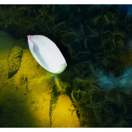
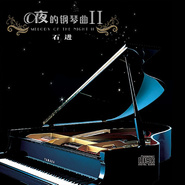
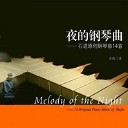

石进
============================

|  |  |
| :--: | :-- |
| [ 石进](https://i.xiami.com/sjhome) | **地区**: China 中国大陆 **风格**: 轻音乐 Easy Listening **播放数**: 458811691 **粉丝数**: 380696 **评论数**: 5365  |

## 档案

小档案 
中   文   名   石进 
国        籍   中国 
民        族   汉族 
出   生   地   广西   柳州 
出生日期   1981  年  4  月  5  日 
职        业   网络工程师 
主要成就   2011  提名华语金曲奖 
代表作品   《夜的钢琴曲   》 
现   居   地   广西   南宁 
星        座   白羊座 
业余爱好   钢琴 
专        业   计算机信息管理专业 
艺人资料 
石进，  1981  年  4  月  5  日生，广西柳州人，国内钢琴音乐创作演奏爱好者。 
凭着自己业余爱好创作《夜的钢琴曲》系列被冯小刚经典电影《非诚勿扰  2  》川川朗诵诗歌《见与不见》的选为该段配乐，之后成为广播电视媒体经典的背景音乐，  2011  年  5  月代表作品《夜的钢琴曲五》被提名华语金曲奖，提名年度最佳独奏专辑。 
人物经历 
石进来自柳州，在南宁工作，从  2005  年开始创作至今，他已经写了  50  余首钢琴曲和多首通俗歌曲，大学学的是计算机信息管理专业，现是区内一家国有网络企业的工程师。写钢琴曲对他来说只是业余爱好，“当初根本没想到会有这么多人喜欢”。 
石进说，自己小学时学过两年电子琴，由于学业忙就停止了对音乐的学习。到了  2002  年，因为看了一场周杰伦的音乐会，他决定自学钢琴。  2004  年，自学到有一定基础后，他开始自己写歌。  2005  年离开柳州到南宁工作生活，也就是从那时候起，有了《夜的钢琴曲》系列。他把《夜的钢琴曲》（五）（以下简称“夜五”）等音乐小样传到网上，和朋友分享。  2010  年，这首曲子被《非诚勿扰》剧组的工作人员发现，作为备选音乐推荐给冯小刚导演，冯导一听，当即决定用这首钢琴曲作为片中川川朗诵诗歌《见与不见》的配乐。 
石进写的钢琴曲不是多么精深、高妙，演奏起来也不需要什么高难度的技巧，但却打动了包括冯导在内的众多听众，南宁钢琴家陈斯凡也很喜欢“夜五”，他觉得石进的作品非常真诚。对于“夜五”，石进坦言背后没有太多复杂的故事，“录音是即兴的，弹了三遍，  "  夜五  "  花了  40  分钟就完成了，只是记录爱与被爱的体会。” 
2009  年  6  月发行录音室专辑《夜的钢琴曲   Demo  集》。 
2010  年  10  月发行录音室专辑《夜的钢琴曲   石进原创钢琴曲  14  首》。 
2012  年  11  月发行录音室专辑《夜的钢琴曲Ⅱ》。 
2014  年开启夜的钢琴曲上海个人演奏会，  6  月发行现场专辑。 
2015  年  8  月发行个人专辑《夜的钢琴曲Ⅲ》。 
2016  年  4  月起在全国各地开启《夜的钢琴曲》音乐会。 
2017  年  4  月发行个人专辑《夜的钢琴曲 IV》 
2017  年 11 月受邀到澳洲悉尼、墨尔本、布里斯班三城演出，场场爆满。 
从2016至今，演出近百场，将《夜的钢琴曲》分享给更多喜欢的听众朋友。 
2019年，现场好音乐待续。

## 专辑

| 名称 | 语种 | 唱片公司 | 发行时间 | 专辑类别 | 专辑风格 |
| :--: | :-- | :-- | :-- | :-- | :-- |
| [ 夜的钢琴曲ⅤMelody of the Night Ⅴ](./albums/2105365977.md) | 纯音乐 | 独立发行 | 2019年10月29日 | 录音室专辑 | 轻音乐 Easy Listening |
| [ 黑暗花园](./albums/2104092798.md) | 纯音乐 | 独立发行 | 2018年10月10日 | 录音室专辑 | 轻音乐 Easy Listening |
| [ 夜的钢琴曲ⅣMelody of the Night Ⅳ](./albums/2102722420.md) | 纯音乐 | 独立发行 | 2017年04月05日 | 录音室专辑 | 轻音乐 Easy Listening |
| [ 夜的钢琴曲ⅢMelody of the Night Ⅲ](./albums/2100180307.md) | 其他 | 独立发行 | 2015年08月10日 | 录音室专辑 | 轻音乐 Easy Listening |
| [ 夜的钢琴曲 上海演奏会石进首次个人演奏会现场录音](./albums/703076155.md) | 其他 | 虾米音乐人 | 2014年06月18日 | 现场专辑 | 轻音乐 Easy Listening |
| [ 夜的钢琴曲ⅡMelody of the Night Ⅱ](./albums/559706.md) | 其他 | 独立发行 | 2012年11月20日 | 录音室专辑 | 轻音乐 Easy Listening |
| [ 夜的钢琴曲 石进原创钢琴曲14首Melody of the Night](./albums/419871.md) | 国语 | 独立发行 | 2010年10月27日 | 录音室专辑 | 轻音乐 Easy Listening |
| [ 夜的钢琴曲 Demo集Melody of the Night](./albums/406532.md) | 其他 | 独立发行 | 2009年06月06日 | 录音室专辑 | 轻音乐 Easy Listening |

## 评论

|  |  |  |
| :-- | :-- | :-- |
|  [虾米用户](https://emumo.xiami.com/u/427535967)  2021-01-24 20:47 赞(0) 踩(0) | 
石老师我们会一直关注您的，期待您的作品
 |
|  [虾米用户](https://emumo.xiami.com/u/426264673)  2021-01-22 14:29 赞(1) 踩(0) | 
期待
 |
|  [虾米用户](https://emumo.xiami.com/u/426264673)  2021-01-22 14:28 赞(1) 踩(0) | 
夜系列牛逼了⛳️我的偶像 
 |
|  [虾米用户](https://emumo.xiami.com/u/6022210)  2021-01-21 11:06 赞(1) 踩(0) | 
我就是为了您才一直没卸载虾米，虽然不经常来听，但还希望以后还能听啊！
 |
|  [虾米用户](https://emumo.xiami.com/u/355354749)  2021-01-16 00:30 赞(1) 踩(0) | 
谢谢你的曲子每天陪伴我。
 |
|  [虾米用户](https://emumo.xiami.com/u/21298776) 荣誉，死亡，宿醉 2021-01-14 23:35 赞(1) 踩(0) | 
为了钢琴曲下的虾米，这么多年了，不开心全是听夜的钢琴曲睡的，以后怎么办啊 
 |
|  [虾米用户](https://emumo.xiami.com/u/321583271)  2021-01-13 04:50 赞(3) 踩(0) | 
当初就是因为想听老师的钢琴曲才下载的虾米，没想到一用就用了三年多，我爱石进，也爱虾米。
 |
|  [虾米用户](https://emumo.xiami.com/u/446591553)  2021-01-10 13:20 赞(1) 踩(0) | 
真的要没了，特意注册了个号，留个评论。无用户的状态听了好久。
 |
|  [虾米用户](https://emumo.xiami.com/u/11284045) 顶顶顶 2021-01-09 19:00 赞(1) 踩(0) | 
江湖再见
 |
|  [虾米用户](https://emumo.xiami.com/u/245606768)  2021-01-09 14:48 赞(1) 踩(0) | 
很感谢石进老师的钢琴曲陪伴我从本科到研究生，现在又快毕业了，《夜的钢琴曲》纾解烦恼的最棒依托✨ 当然也要和虾米说再见啦
 |
|  [虾米用户](https://emumo.xiami.com/u/112165004) 你若盛开，清风自来 2021-01-09 14:04 赞(2) 踩(0) | 
老师，之后要在哪个平台听您的音乐呢？ 
 |
|  [虾米用户](https://emumo.xiami.com/u/376486579) 飘落的云 2021-01-07 11:54 赞(0) 踩(0) | 
石先生，喜欢你的音乐好久了，虾米关闭了又去哪里听您的作品呢？？为了您，开了会员，连续两年在成都听你的音乐会  
 |
|  [虾米用户](https://emumo.xiami.com/u/44824707) 多希望你是我独家记忆～ ... 2021-01-06 16:00 赞(0) 踩(0) | 
要到哪里听您的钢琴曲呀
 |
|  [虾米用户](https://emumo.xiami.com/u/280984744)  2021-01-05 23:32 赞(0) 踩(0) | 
我还能去哪听你的曲子呢。
 |
|  [虾米用户](https://emumo.xiami.com/u/13093228) 女人变态点有什么错！ 2021-01-05 23:26 赞(1) 踩(0) | 
我们也爱你
 |
|  [虾米用户](https://emumo.xiami.com/u/13567962) 静静地听歌，真好！ 2021-01-05 23:24 赞(0) 踩(0) | 
虾米关了，能否在其他平台再见石老师的音乐？真的好喜欢。
 |
|  [虾米用户](https://emumo.xiami.com/u/355556659)  2021-01-05 23:04 赞(0) 踩(0) | 
虾米音乐关掉后要在哪里才能听到石进老师的专辑啊 
 |
|  [虾米用户](https://emumo.xiami.com/u/351293142) 会者定离 一期一祈 2021-01-05 20:36 赞(0) 踩(0) | 
我们去哪听你的歌，虾米n年了，就是因为一直有你的原版
 |
|  [虾米用户](https://emumo.xiami.com/u/334751051) Worth it 2021-01-05 18:02 赞(0) 踩(0) | 
舍不得虾米
 |
|  [虾米用户](https://emumo.xiami.com/u/36165817) 我还没想好要写什么... 2021-01-05 13:25 赞(45) 踩(0) | 
老师会在其他平台上发钢琴曲吗，虾米要关了去哪听呢 
 |
| ⇒ |  [虾米用户](https://emumo.xiami.com/u/334655105) 不管一切如何，用微笑面对... 2021-01-09 20:54 赞(0) 踩(0) | 
虾米总是提醒我，石进老师更新了公告栏，为啥我找不到呀~
 |
|  [虾米用户](https://emumo.xiami.com/u/258896718) 岁月长 衣裳薄 2021-01-05 12:26 赞(4) 踩(0) | 
虾米没了去哪里听你的曲子呀？石进老师？ 
 |
|  [虾米用户](https://emumo.xiami.com/u/362083809) 尘归尘 2021-01-04 22:12 赞(4) 踩(0) | 
我们总在追逐想而不得的东西，却忘了简单的也是极好的，比如你的音乐 
 |
|  [虾米用户](https://emumo.xiami.com/u/42584586) 喜欢听～ 2020-12-31 20:45 赞(3) 踩(0) | 
好遗憾，石进老师今天在青岛举办音乐会没能去。下一次如果再来青岛我一定要去！
 |
|  [虾米用户](https://emumo.xiami.com/u/189379121) 我还没想好要写什么... 2020-12-30 10:55 赞(3) 踩(0) | 
....
 |
|  [虾米用户](https://emumo.xiami.com/u/377353629)  2020-12-28 00:33 赞(9) 踩(0) | 
明年我还能再哪里听到您的钢琴曲哇？
 |
|  [虾米用户](https://emumo.xiami.com/u/71478) 这里住着未在任何世界露脸... 2020-12-22 20:46 赞(2) 踩(0) | 
这两天都在虾米官博看到石进老师的评论 
 |
|  [虾米用户](https://emumo.xiami.com/u/405104653)  2020-12-18 14:15 赞(2) 踩(0) | 
&lt;2020年不来昆明巡回演奏了么 [url=/u/6125747]@石进 [/url]&gt;&lt;6125747&gt;
 |
|  [虾米用户](https://emumo.xiami.com/u/420640646) 帅帅很懒 2020-12-15 23:53 赞(0) 踩(0) | 
好难受啊，成都的取消了。10月份看到就买了票。去年也想去，没去成。
 |
|  [虾米用户](https://emumo.xiami.com/u/307997219) 不要太依赖一个人，即便是... 2020-12-13 22:37 赞(0) 踩(0) | 
2020.12.13广州星海音乐演奏会打卡成功～好开心！期待石进老师《樱之四月》完整版在虾米的早日发行，太好听了❤️
 |
| ⇒ |  [虾米用户](https://emumo.xiami.com/u/86109750)  2020-12-18 12:30 赞(0) 踩(0) | 
对了，记得还有夏雨长笛版，交响长笛大提小提清一色的爷们，请个妹子有那么难吗？
 |
|  [虾米用户](https://emumo.xiami.com/u/274455748)   2020-11-30 17:26 赞(0) 踩(0) | 
石进老师的夜的钢琴曲妙不可言！但是在其他音乐平台没有，因为他是虾米的签约艺人。但是！！虾米这个平台真是&amp;hellip;&amp;hellip;听个专辑不知卡多少次，而且有时竟然播不下去了（网速正常，其他平台播放音乐很流畅）不知各位朋友有没有遇到过类似情况？如果不是为了听石进，绝不会用虾米了。石进老师不要被虾米拴在这里啊！世界很大啊，您的乐迷期待您的音乐能有更大的舞台！！
 |
|  [虾米用户](https://emumo.xiami.com/u/442776492)   2020-11-30 12:21 赞(3) 踩(0) | 
虾米倒掉了 石进老师去哪个平台呀
 |
| ⇒ |  [虾米用户](https://emumo.xiami.com/u/377353629)  2020-12-28 00:32 赞(0) 踩(0) | 
我也在思考这个问题
 |
|  [虾米用户](https://emumo.xiami.com/u/358104299) 悲观的唯心存在现实解构虚... 2020-11-15 10:26 赞(0) 踩(0) | 
41853
 |
|  [虾米用户](https://emumo.xiami.com/u/273519338)  2020-10-22 17:20 赞(0) 踩(0) | 
12月24西安站的票还没上线 
 |
| ⇒ |  [虾米用户](https://emumo.xiami.com/u/6125747) 2011年11月 《夜的... 2020-10-28 15:42 赞(0) 踩(0) | 
已经开票了 
 |
| ⇒ |  [虾米用户](https://emumo.xiami.com/u/336797809)  2020-12-13 02:01 赞(0) 踩(0) | 
<q><b>石进说：</b></q>
 |
| ⇒ |  [虾米用户](https://emumo.xiami.com/u/39019310) 遥遥的一颗星，纵使喜欢不... 2020-12-16 06:13 赞(0) 踩(0) | 
<q><b>fielf说：</b></q>
 |
| ⇒ |  [虾米用户](https://emumo.xiami.com/u/377353629)  2020-12-28 00:33 赞(0) 踩(0) | 
<q><b>石进说：</b></q>
 |
| ⇒ |  [虾米用户](https://emumo.xiami.com/u/258896718) 岁月长 衣裳薄 2021-01-05 12:27 赞(0) 踩(0) | 
<q><b>Bad    mood说：</b></q>
 |
|  [虾米用户](https://emumo.xiami.com/u/8326332) 后来，即便是音乐，也无法... 2020-10-14 07:29 赞(0) 踩(0) | 
榨取自己的剩余价值？
 |
|  [虾米用户](https://emumo.xiami.com/u/357172913)  2020-10-13 12:10 赞(0) 踩(0) | 
喜欢你的钢琴曲，期待更多佳作。
 |
|  [虾米用户](https://emumo.xiami.com/u/226390869) 风轻轻，捎来自然的音律。 2020-09-01 20:19 赞(2) 踩(0) | 
21岁自学钢琴真的厉害，或许能成事者都不怕晚起步。 谁都不是天生就会，时间固然其不可小觑的影响，但热情和天赋更是大权重。 输在起跑线并不意味着就是输家，赢在起跑线上的也可能早已迈不动步伐。
 |
|  [虾米用户](https://emumo.xiami.com/u/151640548) 捉摸不透才叫人痴迷 2020-08-14 16:41 赞(1) 踩(0) | 
我的天，我要哭了，好几年前听到夜钢五就喜欢的不行，但慢慢的就都下架了，现在就是，，，特别欣喜又有些回忆世事变故的沧桑感，全融在曲子里，喜泣   
 |
|  [虾米用户](https://emumo.xiami.com/u/442692451)  2020-08-11 20:07 赞(0) 踩(0) | 
说实话，一开始以为是一位日本作曲家。
 |
|  [虾米用户](https://emumo.xiami.com/u/2796166) 最爱莫文蔚..... 2020-07-29 00:00 赞(0) 踩(0) | 
不错哟~ 加油~ yeah~
 |
|  [虾米用户](https://emumo.xiami.com/u/2796166) 最爱莫文蔚..... 2020-07-29 00:00 赞(0) 踩(0) | 
不错哟~ 加油~ yeah~
 |
|  [虾米用户](https://emumo.xiami.com/u/432758303) Minecraft，这行... 2020-07-28 12:32 赞(3) 踩(0) | 
竟然没想到他是个码农 
 |
|  [虾米用户](https://emumo.xiami.com/u/229076879) 听我听的歌，等我该等的人 2020-07-26 23:04 赞(1) 踩(0) | 
听他的钢琴声，猜他应该是个很温柔的人。
 |
|  [虾米用户](https://emumo.xiami.com/u/374582748) 感悟人生～舍得～感恩 2020-07-23 09:17 赞(1) 踩(0) | 
它直接向人的心灵诉说！ 用动人的音符，引你走向一个素静的地方。
 |
|  [虾米用户](https://emumo.xiami.com/u/349260691)  2020-07-13 14:35 赞(0) 踩(0) | 

 |
|  [虾米用户](https://emumo.xiami.com/u/43155429) 虾米不见了，以后何去何从 2020-07-01 20:45 赞(1) 踩(0) | 
 
 |
|  [虾米用户](https://emumo.xiami.com/u/409493782)  2020-06-20 20:48 赞(1) 踩(0) | 
我是无意间收藏了夜五，本来只是听贝多芬的比较多。今晚无聊的听到了这首歌，发现是广西老乡。我是玉林的。钢琴曲真的大棒了，看到是五，我就来听听别的系列。真的太棒！我还记得小时候录音机放的贝多芬交响曲系列，我哥买的，也很赞。
 |
|  [虾米用户](https://emumo.xiami.com/u/297875678)  2020-06-19 22:13 赞(3) 踩(0) | 
一直以为石进就是专业的钢琴家，因为我也只是听音乐也不会弹奏，结果今天一看他介绍原来是理工科的男人太超赞了。
 |
|  [虾米用户](https://emumo.xiami.com/u/290448115) 修行于生活中 2020-06-15 22:21 赞(1) 踩(0) | 
分享指尖流淌出的音符很久了，了不起  
 |
|  [虾米用户](https://emumo.xiami.com/u/404191650) 我虾米会一点你信吗？组队... 2020-06-07 16:47 赞(1) 踩(0) | 

 |
|  [虾米用户](https://emumo.xiami.com/u/443282440)  2020-06-02 22:19 赞(0) 踩(0) | 

 |
|  [虾米用户](https://emumo.xiami.com/u/342222613)  2020-05-26 13:38 赞(0) 踩(0) | 
听了这么多钢琴曲，最喜欢您的夜系列！
 |
|  [虾米用户](https://emumo.xiami.com/u/334285317) 这家伙很聪明什么也没留下... 2020-05-17 11:05 赞(0) 踩(0) | 
没有想到自己会对钢琴曲这么着迷，尤其是石进先生的原创系列，说来大家可能不信 为了一直听下去他的音乐，保留了虾米音乐。 
 |
|  [虾米用户](https://emumo.xiami.com/u/426484144) 高山流水 2020-05-16 16:10 赞(0) 踩(0) | 
来自宇宙深处的摩羯+1
 |
|  [虾米用户](https://emumo.xiami.com/u/351131456)  2020-05-11 21:00 赞(0) 踩(0) | 
夜深人静的时候，石进的钢琴曲和一本书
 |
|  [虾米用户](https://emumo.xiami.com/u/73986220)  2020-05-07 20:20 赞(0) 踩(0) | 
太棒啦！！！
 |
|  [虾米用户](https://emumo.xiami.com/u/431164950)  2020-04-27 13:01 赞(0) 踩(0) | 
牛逼
 |
|  [虾米用户](https://emumo.xiami.com/u/378413057)  2020-04-23 16:07 赞(1) 踩(0) | 
石进老师是我一个非常喜欢的艺人！人很nice！力挺石进老师！
 |
|  [虾米用户](https://emumo.xiami.com/u/424257016)  2020-04-22 02:17 赞(0) 踩(0) | 
好听，愿意把你的钢琴放在田野里吗？扶贫，一起？
 |
|  [虾米用户](https://emumo.xiami.com/u/424257016)  2020-04-22 02:17 赞(0) 踩(0) | 
好听，愿意把你的钢琴放在田野里吗？扶贫，一起？
 |
|  [虾米用户](https://emumo.xiami.com/u/434932172)  2020-04-20 15:00 赞(0) 踩(0) | 
我太喜欢了，这种安静的钢琴曲
 |
|  [虾米用户](https://emumo.xiami.com/u/432758303) Minecraft，这行... 2020-04-13 16:14 赞(0) 踩(0) | 
想都没想到石进原来是酱紫的 （程序猿）
 |
|  [虾米用户](https://emumo.xiami.com/u/432758303) Minecraft，这行... 2020-04-13 16:14 赞(0) 踩(0) | 
想都没想到石进原来是酱紫的 （程序猿）
 |
|  [虾米用户](https://emumo.xiami.com/u/39019310) 遥遥的一颗星，纵使喜欢不... 2020-04-08 21:18 赞(1) 踩(0) | 
只有石进的音乐可以走进心里，埋藏在心里  或安静，或澎湃，无人知晓，也无需他人知晓
 |
|  [虾米用户](https://emumo.xiami.com/u/224054196)  2020-04-07 23:24 赞(0) 踩(0) | 
2020有厦门的一站吗？
 |
|  [虾米用户](https://emumo.xiami.com/u/268426995) 人生百年草头霜 2020-04-07 21:37 赞(0) 踩(0) | 
石进说话声音像周杰伦，不过比周杰伦普通话标准一些，建议那个叫一分钟的demo叫1.05秒，不到一分的demo叫46秒，这样命名可以有很多 
 |
|  [虾米用户](https://emumo.xiami.com/u/414153275) 潇洒与冒险 2020-04-06 21:32 赞(0) 踩(0) | 
因为石进想学钢琴
 |
|  [虾米用户](https://emumo.xiami.com/u/20143770)  2020-04-01 20:13 赞(0) 踩(0) | 
不知为何，你的琴音总是能够打动我
 |
|  [虾米用户](https://emumo.xiami.com/u/20143770)  2020-04-01 20:12 赞(1) 踩(0) | 
之前只是听过夜的钢琴曲5，从未如此喜欢这么干净的钢琴曲，没有浮华的技巧，有的只是娓娓道来。
 |
|  [虾米用户](https://emumo.xiami.com/u/441883464)  2020-03-31 23:25 赞(2) 踩(0) | 
石进老师，我从几岁开始就听过您的《夜的钢琴曲五》，那时候还听不懂。直到14岁，我又听到这样熟悉的旋律，真的彻底爱上了，我听完了您所有的钢琴曲，一遍又一遍。现在20岁。我也好想去您的钢琴演奏会，那是我几年以来的梦想，我会让我这个愿望实现的！
 |
|  [虾米用户](https://emumo.xiami.com/u/323547930) 洛者为秋 2020-03-31 14:11 赞(0) 踩(0) | 
我一直都以为石进是小
 |
| ⇒ |  [虾米用户](https://emumo.xiami.com/u/401922894)  2020-04-07 12:56 赞(0) 踩(0) | 
天哪！！！！！！！！！！！！！！！！！！竟然有人这么想
 |
| ⇒ |  [虾米用户](https://emumo.xiami.com/u/401922894)  2020-04-07 12:56 赞(0) 踩(0) | 
天哪！！！！！！！！！！！！！！！！！！竟然有人这么想
 |
|  [虾米用户](https://emumo.xiami.com/u/414153275) 潇洒与冒险 2020-03-28 17:31 赞(0) 踩(0) | 
2020年在广州和珠海一定要开音乐会啊。
 |
|  [虾米用户](https://emumo.xiami.com/u/414153275) 潇洒与冒险 2020-03-28 17:31 赞(0) 踩(0) | 
2020年在广州和珠海一定要开音乐会啊。
 |
|  [虾米用户](https://emumo.xiami.com/u/414153275) 潇洒与冒险 2020-03-28 17:31 赞(0) 踩(0) | 
2020年在广州和珠海一定要开音乐会啊
 |
|  [虾米用户](https://emumo.xiami.com/u/414153275) 潇洒与冒险 2020-03-28 17:31 赞(0) 踩(0) | 
2020年在广州和珠海一定要开音乐会啊
 |
|  [虾米用户](https://emumo.xiami.com/u/319488692)   2020-03-25 23:21 赞(1) 踩(0) | 
因为他一直用虾米 
 |
|  [虾米用户](https://emumo.xiami.com/u/250149100) 瑶瑶 2020-03-22 11:47 赞(0) 踩(0) | 
谢谢你的音乐
 |
|  [虾米用户](https://emumo.xiami.com/u/404708866) 我还没想好要写什么...... 2020-03-11 20:45 赞(0) 踩(0) | 
good
 |
|  [虾米用户](https://emumo.xiami.com/u/358104299) 悲观的唯心存在现实解构虚... 2020-03-09 13:13 赞(2) 踩(0) | 
14856
 |
|  [虾米用户](https://emumo.xiami.com/u/429767353)  2020-03-07 10:13 赞(2) 踩(0) | 
我非常喜欢石进先生的钢琴曲，特别是他的《雨葵》，总有一种淡淡的忧伤，却还夹杂着不甘，当然这只是我个人的感觉。我心里也曾有过钢琴梦，奈何家里没条件，现在的我已经十八岁了，感觉跟钢琴注定无缘了。大概这就是梦想与现实的差距吧。
 |
|  [虾米用户](https://emumo.xiami.com/u/342993653)  2020-03-01 21:35 赞(1) 踩(0) | 
为了石进的钢琴曲才下载的虾米，从以前看书想一个人静静，都是无限循环钢琴曲，一直在我的收藏列表里面，觉得听了心情会平静下来，尤其是整个人很浮躁的时候，感觉更是必不可少
 |
|  [虾米用户](https://emumo.xiami.com/u/440894426) 年少不知曲中意，听懂以是... 2020-02-27 00:13 赞(1) 踩(0) | 
因为一人，喜欢上了石进的钢琴曲，始终如一的听到现在，曾经我们因为漂流瓶而相知相惜，后来我走丢了，只有它陪伴了我许多个年头，一切的起源都在这里，我回来了，如果还有机会我不会再走丢了，pp
 |
|  [虾米用户](https://emumo.xiami.com/u/308300571)  2020-02-26 22:12 赞(0) 踩(0) | 
喜欢很多年，我一直在！
 |
|  [虾米用户](https://emumo.xiami.com/u/308300571)  2020-02-26 22:12 赞(0) 踩(0) | 
喜欢很多年，我一直在！
 |
|  [虾米用户](https://emumo.xiami.com/u/73740960)  2020-02-26 18:11 赞(0) 踩(0) | 

 |
|  [虾米用户](https://emumo.xiami.com/u/73740960)  2020-02-26 18:11 赞(0) 踩(0) | 

 |
|  [虾米用户](https://emumo.xiami.com/u/400467410)  2020-02-26 15:43 赞(1) 踩(0) | 
收藏你的曲子还能收到通知说谢谢我的收藏，其实，是我要谢谢你，创作出这些曲子。谢谢！
 |
|  [虾米用户](https://emumo.xiami.com/u/356080307) 音符啊～你是風你是雲，你... 2020-02-24 21:53 赞(0) 踩(0) | 
有沉甸的健乐
 |
|  [虾米用户](https://emumo.xiami.com/u/412956353)  2020-02-22 23:47 赞(0) 踩(0) | 
才发现咱们是老乡！我也是柳州人！ 
 |
|  [虾米用户](https://emumo.xiami.com/u/359549618)  2020-02-22 16:30 赞(0) 踩(0) | 
寂静的夜晚 躁动或是雀跃的心
 |
|  [虾米用户](https://emumo.xiami.com/u/262242158)  2020-02-22 14:08 赞(0) 踩(0) | 
什么时候能来武汉开场演奏会。
 |
|  [虾米用户](https://emumo.xiami.com/u/125247) 文艺青年 2020-02-20 17:34 赞(0) 踩(0) | 
服气，QQ音乐，网易云，咪咕音乐都没有石进的钢琴曲，只有这里有（来自年费会员的骄傲）
 |
|  [虾米用户](https://emumo.xiami.com/u/416671389)  2020-02-19 03:20 赞(0) 踩(0) | 
谢谢您的音乐，陪伴我度过了这几年最难熬的时光
 |
|  [虾米用户](https://emumo.xiami.com/u/435305948) 不同的节日，不同的回忆，... 2020-02-13 22:29 赞(0) 踩(0) | 
我非常喜欢，能下载吗？
 |
|  [虾米用户](https://emumo.xiami.com/u/437258928) 我与蓝山咖啡结婚，禁止加... 2020-02-13 07:28 赞(1) 踩(0) | 
，
 |
|  [虾米用户](https://emumo.xiami.com/u/87827600) 山水两相忘，日月无瓜葛；... 2020-02-12 07:29 赞(1) 踩(0) | 
《夜的钢琴曲》系列应该按作 者的名字每年特质一首留作纪念，你会发现那是你一生的故事。如今越来越多的人到了夜晚反而比白天更有精神，那是身体以对应的方式倾诉，倾诉那不被他人理解的眼泪。
 |
|  [虾米用户](https://emumo.xiami.com/u/87827600) 山水两相忘，日月无瓜葛；... 2020-02-12 07:29 赞(0) 踩(0) | 
《夜的钢琴曲》系列应该按作 者的名字每年特质一首留作纪念，你会发现那是你一生的故事。如今越来越多的人到了夜晚反而比白天更有精神，那是身体以对应的方式倾诉，倾诉那不被他人理解的眼泪。有多少细数音符的时光就有多少难隐藏的辛酸与向往在夜色中回流。
 |
|  [虾米用户](https://emumo.xiami.com/u/87827600) 山水两相忘，日月无瓜葛；... 2020-02-12 07:28 赞(1) 踩(0) | 
《夜的钢琴曲》系列应该按作 者的名字每年特质一首留作纪念，你会发现那是你一生的故事。如今越来越多的人到了夜晚反而比白天更有精神，那是身体以对 抗的方式倾诉，倾诉那不被他人理解的眼泪。有多少细数音符的时光就有多少难隐藏的辛酸与向往在夜色中回流。
 |
|  [虾米用户](https://emumo.xiami.com/u/87827600) 山水两相忘，日月无瓜葛；... 2020-02-12 07:28 赞(0) 踩(0) | 
《夜的钢琴曲》系列应该按作 者的名字每年特质一首留作纪念，你会发现那是你一生的故事。如今越来越多的人到了夜晚反而比白天更有精神，那是身体以对抗的方式倾诉，倾诉那不被他人理解的眼泪。有多少细数音符的时光就有多少难隐藏的辛酸与向往在夜色中回流。
 |
|  [虾米用户](https://emumo.xiami.com/u/87827600) 山水两相忘，日月无瓜葛；... 2020-02-12 07:27 赞(0) 踩(0) | 
《夜的钢琴曲》系列应该按作者的名字每年特质一首留作纪念，你会发现那是你一生的故事。如今越来越多的人到了夜晚反而比白天更有精神，那是身体以对抗的方式倾诉，倾诉那不被他人理解的眼泪。有多少细数音符的时光就有多少难隐藏的辛酸与向往在夜色中回流。
 |
|  [虾米用户](https://emumo.xiami.com/u/124760734) ？v ？ 2020-02-10 10:29 赞(2) 踩(0) | 
虾米有石进的版权真是太神奇了ॱଳ͘
 |
|  [虾米用户](https://emumo.xiami.com/u/124760734) ？v ？ 2020-02-10 10:29 赞(1) 踩(0) | 
虾米有石进的版权真是太神奇了ॱଳ͘
 |
|  [虾米用户](https://emumo.xiami.com/u/353609151) 我还没想好要写什么... 2020-02-10 00:40 赞(0) 踩(0) | 
2020错过了
 |
|  [虾米用户](https://emumo.xiami.com/u/413689946) 此生如此  便好 2020-02-06 03:04 赞(0) 踩(0) | 
夜深人静 听着安静音乐 回忆种种过往 愉快的 不愉快的
 |
|  [虾米用户](https://emumo.xiami.com/u/253100822) 要做哥哥们的御用舞者 E... 2020-01-23 20:17 赞(0) 踩(0) | 
谢谢您的音乐
 |
|  [虾米用户](https://emumo.xiami.com/u/404297372)  2020-01-11 01:25 赞(0) 踩(0) | 
期待能够在现场聆听您弹奏的钢琴曲
 |
|  [虾米用户](https://emumo.xiami.com/u/435018103)  2019-12-31 23:56 赞(0) 踩(0) | 
妈呀妈耶这这这窝太喜欢听啦
 |
|  [虾米用户](https://emumo.xiami.com/u/352926555)  2019-12-30 08:30 赞(1) 踩(0) | 
这首曲子让心变得好平静
 |
|  [虾米用户](https://emumo.xiami.com/u/433334516)  2019-12-26 18:20 赞(0) 踩(0) | 
前段时间在长沙听完石进先生的钢琴会，仿佛在音乐里安抚了情绪，心情很宁静的说~
 |
|  [虾米用户](https://emumo.xiami.com/u/422128206)  2019-12-23 22:53 赞(1) 踩(0) | 
昨天听了现场，欢迎来到长沙。感谢你带来的音乐，很享受，后来的签售会虽然没有参加，但是特意到虾米里支持你的新专，希望继续分享更多感人的音乐！谢谢！
 |
|  [虾米用户](https://emumo.xiami.com/u/289460363)   2019-12-22 22:38 赞(0) 踩(0) | 
今天听了现场，几次都哭出来。夜的钢琴曲一出来，简直太感动了。意外的是听了夏语想起很多小时候的事，希望时光永远停留。爱你 つつ
 |
|  [虾米用户](https://emumo.xiami.com/u/403666181)  2019-12-20 20:49 赞(1) 踩(0) | 
第一次做第一排听你曲子时哭梨花带雨，还借用了一旁小美女的纸巾，而这一次身边有他陪着，心情好愉悦！ 我走出来了…谢谢你的曲子，谢谢你<a href="http://emumo.xiami.com/u/6125747" target="_blank" rel="nofollow" name_card="6125747">@石进 </a>
 |
|  [虾米用户](https://emumo.xiami.com/u/410423345)  2019-12-17 14:56 赞(0) 踩(0) | 
我天啊，听了这么久才发现竟然是柳州老乡！！！
 |
|  [虾米用户](https://emumo.xiami.com/u/2491956) 我还没想好要写什么... 2019-12-15 11:04 赞(1) 踩(0) | 
不要看低任何一个程序员，说他们没有艺术细胞
 |
|  [虾米用户](https://emumo.xiami.com/u/431393305)  2019-12-14 10:54 赞(0) 踩(0) | 
我不喜欢郎朗或者贝多芬那些浮夸技巧所展现出来的音乐，石进是我喜欢很久的音乐家，他的音乐也许没有多少技巧，但满满的都是自己内心的独白，都是走心的曲子。三年一千天个夜晚，诉说着自己每天的故事，很佩服石进先生。作为和石进先生同专业的程序员，但在内心深处也有着一个音乐梦，钢琴梦，但也许没有石进先生这样的才华，甚至没有学习钢琴的机会，只记得在高一放学偷偷在学校音乐教室学会了这首夜的钢琴曲五，过了这么久，估计也忘得差不多了吧。今年才17岁，以后有时间一定要实现自己的钢琴梦。也希望石进先生能继续创作出更多这样走心的音乐，一起加油！
 |
|  [虾米用户](https://emumo.xiami.com/u/428378829) 我还没想好要写什么... 2019-12-13 12:53 赞(0) 踩(0) | 
有南宁的再通知我哦！我一定去
 |
|  [虾米用户](https://emumo.xiami.com/u/289460363)   2019-12-12 11:41 赞(0) 踩(0) | 
还记得第一次听是2010年上高中的我，现在终于要去现场听啦 
 |
|  [虾米用户](https://emumo.xiami.com/u/205318928)  2019-12-07 23:21 赞(0) 踩(0) | 
评论5520，被我占了，  
 |
|  [虾米用户](https://emumo.xiami.com/u/229076879) 听我听的歌，等我该等的人 2019-12-05 11:15 赞(0) 踩(0) | 
11月30那天我搬家，所以错过了石进的音乐会。 希望下次能有幸，现场感受。一位优秀的安静的程序员的音乐世界！
 |
|  [虾米用户](https://emumo.xiami.com/u/228937300)  2019-12-03 20:44 赞(0) 踩(0) | 
嘎嘎嘎，我又找到号了  踩踩踩踩踩踩踩，留个爪子
 |
|  [虾米用户](https://emumo.xiami.com/u/408715987)  2019-12-01 23:43 赞(0) 踩(0) | 
石进的曲子为什么一听就想哭？
 |
|  [虾米用户](https://emumo.xiami.com/u/332740816)  2019-11-28 19:59 赞(0) 踩(0) | 
Rbj
 |
|  [虾米用户](https://emumo.xiami.com/u/408929372)  2019-11-27 15:56 赞(0) 踩(0) | 
上周去听你的演奏会啦！太可爱了吧，最后朝你们挥手了哦！
 |
|  [虾米用户](https://emumo.xiami.com/u/431648436)  2019-11-12 20:53 赞(1) 踩(0) | 
记住，人家职业是网络工程师、业余爱好是弹钢琴
 |
|  [虾米用户](https://emumo.xiami.com/u/431836481)  2019-11-08 13:22 赞(1) 踩(0) | 
为了石进，下的虾米音乐
 |
| ⇒ |  [虾米用户](https://emumo.xiami.com/u/440345627)  2020-03-06 23:19 赞(0) 踩(0) | 
一样
 |
| ⇒ |  [虾米用户](https://emumo.xiami.com/u/440345627)  2020-03-06 23:19 赞(0) 踩(0) | 
一样
 |
|  [虾米用户](https://emumo.xiami.com/u/431773846)  2019-11-07 14:46 赞(1) 踩(0) | 
很喜欢石进的音乐，感觉每一段音乐都是一个故事
 |
|  [虾米用户](https://emumo.xiami.com/u/376941695)  2019-11-05 21:38 赞(0) 踩(0) | 
喜欢石进的所有钢琴曲，听着听着就忘记了烦恼
 |
|  [虾米用户](https://emumo.xiami.com/u/270921662)   2019-10-31 13:58 赞(0) 踩(0) | 
喜欢
 |
|  [虾米用户](https://emumo.xiami.com/u/89051606)  2019-10-30 16:52 赞(0) 踩(0) | 
虾米啊，不太方便的就是一定要下载虾米APP，诶。。。要是有网页版直接能够买专辑就更好了
 |
|  [虾米用户](https://emumo.xiami.com/u/42810132) Aprés l'amou... 2019-10-30 15:10 赞(0) 踩(0) | 

 |
|  [虾米用户](https://emumo.xiami.com/u/3250268) 一首好歌都比爱一个人长久... 2019-10-30 00:22 赞(1) 踩(0) | 
好喜欢石进的曲子   
 |
|  [虾米用户](https://emumo.xiami.com/u/31440002) 哈哈哈 加油啊  2019-10-13 00:03 赞(0) 踩(0) | 
看了简介很受启发
 |
|  [虾米用户](https://emumo.xiami.com/u/279977846)  2019-10-11 00:11 赞(1) 踩(0) | 
11.30上海等你
 |
|  [虾米用户](https://emumo.xiami.com/u/8326332) 后来，即便是音乐，也无法... 2019-10-10 21:21 赞(0) 踩(0) | 
希望，继续提升作曲编曲能力。
 |
|  [虾米用户](https://emumo.xiami.com/u/428158454)  2019-10-10 21:09 赞(0) 踩(0) | 
你的eesāwsi
 |
|  [虾米用户](https://emumo.xiami.com/u/337185561) 后会有期。 2019-09-22 13:28 赞(0) 踩(0) | 
秋天到了桂花开放的季节 也到了该听石进先生钢琴的时候啦
 |
|  [虾米用户](https://emumo.xiami.com/u/429272333)  2019-09-15 22:29 赞(1) 踩(0) | 
最棒的钢琴演奏大师，数字系列也是我最喜欢听的轻音乐，广西南宁
 |
|  [虾米用户](https://emumo.xiami.com/u/45769486) 美妙的音乐时光，现在开启 2019-09-09 13:39 赞(1) 踩(0) | 
真好听。优美，干净。
 |
|  [虾米用户](https://emumo.xiami.com/u/8179523) 岁月的琴声 2019-09-08 16:54 赞(2) 踩(0) | 
原来是柳州仔啊！
 |
|  [虾米用户](https://emumo.xiami.com/u/429205777)  2019-08-29 12:49 赞(1) 踩(0) | 
石进先生，是个很温柔细腻的人吧，我是个孤僻的女生，听了你的钢琴曲，我好像也被世界善待了 
 |
|  [虾米用户](https://emumo.xiami.com/u/191316836) 愿星光指引你我前行，愿我... 2019-08-29 07:37 赞(0) 踩(0) | 
飘落的云怎么没了
 |
|  [虾米用户](https://emumo.xiami.com/u/429099574)  2019-08-26 11:53 赞(1) 踩(0) | 
好听
 |
|  [虾米用户](https://emumo.xiami.com/u/212809691)  2019-08-23 22:43 赞(1) 踩(0) | 
很喜欢你的音乐，灵动的声音，安慰的情感。
 |
|  [虾米用户](https://emumo.xiami.com/u/401167037)  2019-08-15 13:10 赞(10) 踩(0) | 
石老师，我长大了，工作了。很希望听您音乐会，很棒的是我幸运的买到了12月贵州您的音乐会票 12月，贵州见  
 |
| ⇒ |  [虾米用户](https://emumo.xiami.com/u/322081597)  2019-10-14 12:20 赞(0) 踩(0) | 
帮我买一张
 |
| ⇒ |  [虾米用户](https://emumo.xiami.com/u/401167037)  2019-10-17 16:08 赞(0) 踩(0) | 
<q><b>未知生物说：</b></q>
 |
|  [虾米用户](https://emumo.xiami.com/u/274431534)  2019-08-15 07:26 赞(1) 踩(0) | 
从大学到研究生，七年，谢谢有你的音乐一直陪伴，我永远都记得第一次在星海音乐厅听你演奏会的情景，尽管那些现场演奏的曲目已经听过无数遍了，但心里仍为听到现场版而兴奋激动，每一首曲子都丝丝扣人心弦，自己的情绪也被带入其中。
 |
|  [虾米用户](https://emumo.xiami.com/u/428583169)  2019-08-12 21:41 赞(4) 踩(0) | 
石进，不知道你是否还记我的这个朋友，既还记看道音乐网站吗？那是我们偶然机会认识，我听的你原创夜曲12345……。然后我把你的曲子发表那个网站了。给你推广，好的音乐是不会埋没的，庆幸你火了。十年了……看到了记得联系我，你之前的QQ我找不到了
 |
|  [虾米用户](https://emumo.xiami.com/u/259163424)  2019-08-12 00:38 赞(1) 踩(0) | 
觉得他的钢琴曲真的动人 每个人都能从中听到自己的故事 
 |
|  [虾米用户](https://emumo.xiami.com/u/341903717) 不是东西 2019-08-10 19:37 赞(0) 踩(0) | 
好多demo都不见了啊~~~~~
 |
|  [虾米用户](https://emumo.xiami.com/u/358481927)  2019-08-07 15:09 赞(3) 踩(0) | 
贝多芬：狼狼是谁？搞笑的么？
 |
| ⇒ |  [虾米用户](https://emumo.xiami.com/u/358481927)  2019-08-07 15:10 赞(0) 踩(0) | 
是的
 |
|  [虾米用户](https://emumo.xiami.com/u/268543641) 守一人终老，护一世安好。 2019-08-06 10:13 赞(3) 踩(0) | 
感谢你的钢琴曲，陪了我这么多年，每当我复习时，心浮气躁时，无所适从时，迷茫时，都会去听一听，不知道为什么，就可以安静思考自己该做什么了，不急不躁，谢谢你。祝安好。
 |
|  [虾米用户](https://emumo.xiami.com/u/33341742) 听音乐 2019-07-28 01:49 赞(0) 踩(0) | 
做的音乐都很棒！
 |
|  [虾米用户](https://emumo.xiami.com/u/193235171) 饭能养身  歌能养心 2019-07-27 20:59 赞(2) 踩(0) | 
人才啊
 |
|  [虾米用户](https://emumo.xiami.com/u/280520995)  2019-07-18 08:54 赞(2) 踩(0) | 
请坚持做你喜欢的音乐，带着所有人喜爱的梦想，谢谢你！
 |
|  [虾米用户](https://emumo.xiami.com/u/43015954) 邪不压正 2019-07-17 18:55 赞(2) 踩(0) | 
为啥 《飘落的云》和 《扰人清梦》播放不了了
 |
| ⇒ |  [虾米用户](https://emumo.xiami.com/u/274431534)  2019-08-15 07:29 赞(0) 踩(0) | 
同问，都是很美的demo呀 
 |
|  [虾米用户](https://emumo.xiami.com/u/356035642) 怎奈那林海石径深幽处，夕... 2019-07-13 11:31 赞(2) 踩(0) | 
真实感受：如果说发现一首好歌就像发现了一个宝物，那么发现石进就像掉进了藏宝库里。   
 |
|  [虾米用户](https://emumo.xiami.com/u/162787262)  2019-07-07 09:39 赞(3) 踩(0) | 
厉害厉害，一个工程师能做出这么优美的曲子，太厉害了，真是被互联网耽误的音乐家啊！ 
 |
| ⇒ |  [虾米用户](https://emumo.xiami.com/u/162787262)  2019-07-07 09:40 赞(0) 踩(0) | 
优秀的人真是哪哪都优秀啊！ 
 |
|  [虾米用户](https://emumo.xiami.com/u/272035173)  2019-07-04 17:29 赞(2) 踩(0) | 
听石进好多年，每一首曲子都是生命，怎么听都爱。
 |
|  [虾米用户](https://emumo.xiami.com/u/323045709)  2019-07-03 14:32 赞(2) 踩(0) | 
哈哈哈，给娃做胎教选曲的过程中发现了夜的刚琴曲，娃貌似很喜欢石先生的作品  ，娃爸也是程序员一枚  
 |
|  [虾米用户](https://emumo.xiami.com/u/27737836)  2019-07-03 07:55 赞(2) 踩(0) | 
从一个人的时光---到陪着我的她---我们的婚礼。 很期待2019新专辑故事。
 |
|  [虾米用户](https://emumo.xiami.com/u/426634724) 为了夜的钢琴曲而来 2019-06-29 00:59 赞(2) 踩(0) | 
初一听的夜的钢琴曲一和五，到了大学终于自己学会了 ，想在大学把这一系列全学会，不知道有没有可能
 |
|  [虾米用户](https://emumo.xiami.com/u/337798184)  2019-06-20 15:42 赞(1) 踩(0) | 
为什么没有合奏的“印迹”，现场很精彩，网上却搜不到，只能反复听自己录制的视频，
 |
| ⇒ |  [虾米用户](https://emumo.xiami.com/u/6125747) 2011年11月 《夜的... 2019-06-21 16:37 赞(0) 踩(0) | 
新专辑会收录这首
 |
|  [虾米用户](https://emumo.xiami.com/u/44596071)  2019-06-18 23:20 赞(1) 踩(0) | 
石进的音乐越听越孤独。少听为妙
 |
|  [虾米用户](https://emumo.xiami.com/u/425981336)  2019-06-14 02:20 赞(4) 踩(0) | 
喜欢多年了，终于再次听到原版
 |
|  [虾米用户](https://emumo.xiami.com/u/337798184)  2019-06-08 20:50 赞(0) 踩(0) | 
现场听还是很不一样的，今年等到了
 |
|  [虾米用户](https://emumo.xiami.com/u/411489287) l'm your gir... 2019-06-08 09:03 赞(2) 踩(0) | 
一直都很喜欢石进老师的作品 听着很舒服 并觉得挺感动的 我一直想学习他的曲子 但由于学习原因 导致只学了几首 闲暇之时会自己弹了平复心情
 |
|  [虾米用户](https://emumo.xiami.com/u/424927173)  2019-05-22 06:51 赞(0) 踩(0) | 
寻找到能够收听石进钢琴曲的APP，很难过在其它APP不能收听。百听不厌催我入眠的超棒的钢琴曲！
 |
|  [虾米用户](https://emumo.xiami.com/u/344276588)  2019-05-21 15:43 赞(1) 踩(0) | 
盆！， yaa，
 |
|  [虾米用户](https://emumo.xiami.com/u/322979961)  2019-05-10 01:10 赞(0) 踩(0) | 
石进大哥哥，希望在广西参加你的演奏会，可是回国只有寒暑假，看了下2019你的演奏会安排，完美错过我要怎么办       
 |
|  [虾米用户](https://emumo.xiami.com/u/406096939)  2019-05-09 09:31 赞(0) 踩(0) | 
喜欢 夜的钢琴曲五 六 飘落的云
 |
|  [虾米用户](https://emumo.xiami.com/u/43872155)  2019-05-07 15:14 赞(1) 踩(0) | 
今天课上朗读贾平凹的《一个小桃树》配上了您的音乐。学生反应极好！
 |
|  [虾米用户](https://emumo.xiami.com/u/288556925)  2019-05-07 13:02 赞(1) 踩(0) | 
真的喜欢，感谢一曲深得我心！
 |
|  [虾米用户](https://emumo.xiami.com/u/122936768)  2019-05-07 08:28 赞(1) 踩(0) | 
难眠的夜里， 有一颗不安的心， 但有你， 和你的曲， 于是 无我， 唯曲， 伴着一夜安眠的梦。
 |
|  [虾米用户](https://emumo.xiami.com/u/320577070)   2019-04-30 22:17 赞(0) 踩(0) | 
为了石进才下载了虾米
 |
|  [虾米用户](https://emumo.xiami.com/u/375002083)  2019-04-28 11:11 赞(0) 踩(0) | 
期待有更灵魂的曲子
 |
|  [虾米用户](https://emumo.xiami.com/u/35812861)  2019-04-20 14:27 赞(1) 踩(0) | 
昨天（19年4月19日 ）第一次听您的演唱会，音乐很美，很感动。
 |
|  [虾米用户](https://emumo.xiami.com/u/20417156) 如果只能遇见不能停留，不... 2019-04-14 23:55 赞(1) 踩(0) | 
2019.10.27厦门 不知道我有没有机会....我只想现场听听街道的寂寞。有多悲的调子，为什么我能听得沉沦下去，无尽的底。又在曲子结束的瞬间被现实拽回地面
 |
| ⇒ |  [虾米用户](https://emumo.xiami.com/u/403666181)  2019-05-13 21:59 赞(0) 踩(0) | 
10.27有音乐会吗？
 |
| ⇒ |  [虾米用户](https://emumo.xiami.com/u/20417156) 如果只能遇见不能停留，不... 2019-05-13 23:49 赞(0) 踩(0) | 
<q><b>孝顺的鸡翅说：</b></q>
 |
| ⇒ |  [虾米用户](https://emumo.xiami.com/u/403666181)  2019-05-16 21:10 赞(0) 踩(0) | 
有机会可以一起去听听吧！今年上海的第一场我去听过了
 |
| ⇒ |  [虾米用户](https://emumo.xiami.com/u/20417156) 如果只能遇见不能停留，不... 2019-05-18 23:44 赞(0) 踩(0) | 
<q><b>孝顺的鸡翅说：</b></q>
 |
| ⇒ |  [虾米用户](https://emumo.xiami.com/u/403666181)  2019-06-02 22:44 赞(0) 踩(0) | 
<q><b>小二娘说：</b></q>
 |
| ⇒ |  [虾米用户](https://emumo.xiami.com/u/403666181)  2019-08-26 18:25 赞(0) 踩(0) | 
现场不吵，很美好的一场音乐会！回忆满满
 |
| ⇒ |  [虾米用户](https://emumo.xiami.com/u/20417156) 如果只能遇见不能停留，不... 2019-08-27 03:13 赞(0) 踩(0) | 
<q><b>孝顺的鸡翅说：</b></q>
 |
|  [虾米用户](https://emumo.xiami.com/u/413449492)  2019-04-13 21:39 赞(1) 踩(0) | 
每每听你的纯音乐都有种安静，思考的，让心平静的感觉。是我喜欢的旋律。
 |
|  [虾米用户](https://emumo.xiami.com/u/337798184)  2019-04-09 15:28 赞(0) 踩(0) | 
2019年6月8日宁波站不聚不散
 |
|  [虾米用户](https://emumo.xiami.com/u/421284086)  2019-04-03 21:38 赞(1) 踩(0) | 
我喜欢你的音乐，听了可以让人平静下来，可以让人高兴起来，我很欣赏您！
 |
|  [虾米用户](https://emumo.xiami.com/u/337282422) 我还没想好要写什么... 2019-04-03 18:17 赞(0) 踩(0) | 
期待五月份武汉的音乐会
 |
|  [虾米用户](https://emumo.xiami.com/u/321672082) 浮生若茶，甘苦一念。 2019-04-03 17:16 赞(1) 踩(0) | 
哇，12月16号在南宁。我一定要去！我与石进先生竟是同一天生日。 
 |
|  [虾米用户](https://emumo.xiami.com/u/219479094) 長夜安乐，自为诸洲。 2019-04-02 09:30 赞(1) 踩(0) | 
明明可以靠音乐出名，确是一个网络工程师。  —————致行业的楷模 
 |
|  [虾米用户](https://emumo.xiami.com/u/422686867)  2019-04-01 01:48 赞(2) 踩(0) | 
为了这首夜五，我不知道下下载了几个音乐播放器，这次终于找到了。 
 |
|  [虾米用户](https://emumo.xiami.com/u/55295191) Write, loaf,... 2019-03-23 15:26 赞(0) 踩(0) | 
怎么说呢，常备鲁宾斯坦肖邦夜曲曲目的人，会为每日推荐里见到石进而皱起眉头
 |
|  [虾米用户](https://emumo.xiami.com/u/361037631)  2019-03-21 03:30 赞(2) 踩(0) | 
******
 |
|  [虾米用户](https://emumo.xiami.com/u/421284086)  2019-03-16 16:51 赞(2) 踩(0) | 
音乐的魅力，无结界
 |
|  [虾米用户](https://emumo.xiami.com/u/408684813)  2019-03-11 21:45 赞(0) 踩(0) | 
太佩服你了，向你学习，工作以后开始学习钢琴
 |
|  [虾米用户](https://emumo.xiami.com/u/406600462)  2019-03-10 08:01 赞(0) 踩(0) | 
音乐无国界，打击盗版人人有责，取关
 |
|  [虾米用户](https://emumo.xiami.com/u/401756653)  2019-03-05 05:01 赞(2) 踩(0) | 
感谢您  您的作品，让我感觉像在凉爽夏夜的微风中一边吃西瓜一般看星星～ 
 |
| ⇒ |  [虾米用户](https://emumo.xiami.com/u/353207828) 音乐是世间最美的魔法 2019-07-08 16:06 赞(0) 踩(0) | 
这个形容非常贴切 反正就是感觉惬意
 |
| ⇒ |  [虾米用户](https://emumo.xiami.com/u/427205306)  2019-07-13 17:35 赞(0) 踩(0) | 
<q><b>Cat说：</b></q>
 |
|  [虾米用户](https://emumo.xiami.com/u/420218536)  2019-03-01 23:45 赞(0) 踩(0) | 
真的很美
 |
|  [虾米用户](https://emumo.xiami.com/u/419837880)  2019-02-24 08:44 赞(3) 踩(0) | 
差点被网络工程师耽误了音乐大才 
 |
|  [虾米用户](https://emumo.xiami.com/u/407614649) 你越来越耀眼 而我越来越... 2019-02-23 13:32 赞(1) 踩(0) | 
字打错了，是钢琴曲
 |
|  [虾米用户](https://emumo.xiami.com/u/407614649) 你越来越耀眼 而我越来越... 2019-02-23 13:31 赞(1) 踩(0) | 
戴上耳机听着优美的刚情趣，很惬意
 |
|  [虾米用户](https://emumo.xiami.com/u/191316836) 愿星光指引你我前行，愿我... 2019-02-23 06:51 赞(1) 踩(0) | 
加油加油加油！！！
 |
|  [虾米用户](https://emumo.xiami.com/u/411210156) 不要找我，故事讲不完 2019-02-22 11:36 赞(1) 踩(0) | 
好听，老早就来了    
 |
|  [虾米用户](https://emumo.xiami.com/u/324384189)  2019-02-20 19:57 赞(1) 踩(0) | 
喜欢石进先生的每一首曲子
 |
|  [虾米用户](https://emumo.xiami.com/u/419522269)  2019-02-19 14:49 赞(1) 踩(0) | 
继续努力创作更多好听曲子，期待你的新作品！
 |
|  [虾米用户](https://emumo.xiami.com/u/354205849) 一辈子只爱一个人真的很难... 2019-02-16 03:03 赞(3) 踩(0) | 
计划经济时代，没有明星文化，也没有娱乐圈，那时演员都是拿国家工资。而且以前演员歌手都是艺校出身的，不像现在。只是我们走了港台的老路。黄家驹说过，香港没有乐坛，只有娱乐圈。其实不无道理。。
 |
|  [虾米用户](https://emumo.xiami.com/u/354205849) 一辈子只爱一个人真的很难... 2019-02-16 02:49 赞(1) 踩(0) | 
计划经济时代，没有明星文化，也没有娱乐圈，那时演员都是拿国家工资。而且以前演员歌手都是艺校出身的，不像现在。只是我们走了港台的老路。黄家驹说过，香港没有乐坛，只有娱乐圈。其实不无道理
 |
|  [虾米用户](https://emumo.xiami.com/u/210325758)  2019-02-15 21:15 赞(0) 踩(0) | 
因为喜欢石进的曲子特别喜欢钢琴的声音。( ´ ▽ ` )ﾉ
 |
|  [虾米用户](https://emumo.xiami.com/u/416180362)  2019-02-15 07:57 赞(1) 踩(0) | 
我最喜欢的钢琴人
 |
|  [虾米用户](https://emumo.xiami.com/u/418841562)  2019-02-12 18:00 赞(1) 踩(0) | 
偶然听到，真的太好听啦！
 |
|  [虾米用户](https://emumo.xiami.com/u/209392299)  2019-02-08 10:11 赞(2) 踩(0) | 
自学钢琴曲才发现夜的钢琴曲是广西人作的，同住南宁的妹子飘过哈哈，没想到咱们这么近。。。
 |
|  [虾米用户](https://emumo.xiami.com/u/326631359) 遇一人白首，择一城终老 2019-02-05 22:25 赞(0) 踩(0) | 
倾听每一首夜的钢琴曲，回味曾经的多少个茫然夜晚
 |
|  [虾米用户](https://emumo.xiami.com/u/416945004)  2019-02-03 13:00 赞(3) 踩(0) | 
程序员的谱曲，可以说着代码的特性吗？ 
 |
|  [虾米用户](https://emumo.xiami.com/u/401472922)  2019-01-31 18:02 赞(0) 踩(0) | 
请忘了我曾爱过你
 |
|  [虾米用户](https://emumo.xiami.com/u/25180672) 生命，是一场未知的旅行。 2019-01-25 23:22 赞(0) 踩(0) | 
天才 
 |
|  [虾米用户](https://emumo.xiami.com/u/279712942) 往事恩怨随风而逝 2019-01-17 20:09 赞(4) 踩(0) | 
很好听，很多橙光游戏伴奏几乎都是他的钢琴曲，我不懂钢琴，但是我知道他的钢琴曲可以让我一秒钟爱上。
 |
|  [虾米用户](https://emumo.xiami.com/u/401789472)  2019-01-16 11:31 赞(0) 踩(0) | 
好听
 |
|  [虾米用户](https://emumo.xiami.com/u/367781483)  2019-01-13 19:52 赞(0) 踩(0) | 
石进老师的音乐很好听，不知道曲谱除了31首的demo，后面的出来了没有？很想买呢
 |
|  [虾米用户](https://emumo.xiami.com/u/25877459)   2019-01-12 15:18 赞(3) 踩(0) | 
谢谢你的钢琴曲，总会给我一片内心的宁静，一个人时静静品味，脑海中有一片无边的湛蓝的海水在月光下静静地涌起片片浪花，开车时老婆坐在旁边，一起听您的曲子，能感受到宝宝的腹中调皮的胎动，看来宝宝也喜欢听  
 |
|  [虾米用户](https://emumo.xiami.com/u/11099044)  2019-01-07 22:06 赞(3) 踩(0) | 
难道没人注意石先生的职业是计算机吗？居然不是学音乐的，有多少学音乐专业都混不到这水平？
 |
|  [虾米用户](https://emumo.xiami.com/u/334583252)  2019-01-05 16:54 赞(2) 踩(0) | 
从高中听到大学毕业，以后争取去听石进老师的音乐会
 |
|  [虾米用户](https://emumo.xiami.com/u/409319575) 细雨湿衣看不见，闲花落地... 2018-12-30 20:17 赞(3) 踩(0) | 
听你的夜的钢琴曲很多年了，却不曾深入地去了解过你，钢琴曲响起时，灵魂与你就完全没有了距离  
 |
|  [虾米用户](https://emumo.xiami.com/u/10214945)  2018-12-30 10:40 赞(3) 踩(0) | 
天才呦
 |
|  [虾米用户](https://emumo.xiami.com/u/345053491)  2018-12-27 22:02 赞(3) 踩(0) | 
石进呀，你要是能到Spotify上发音乐该多好呀！喜欢你的音乐很久了
 |
|  [虾米用户](https://emumo.xiami.com/u/345321979)  2018-12-24 21:35 赞(3) 踩(0) | 
长沙音乐会场外一位男生弹石进老师的曲子也蛮好听的，穿牛仔衣。
 |
|  [虾米用户](https://emumo.xiami.com/u/411058963) 用心感触每一首音乐的灵魂 2018-12-23 00:11 赞(4) 踩(0) | 
昨晚刚刚听了石进先生在长沙的演奏会！真的是能触碰到内心的旋律！很享受、很满足也很感谢！
 |
|  [虾米用户](https://emumo.xiami.com/u/327469694)  2018-12-22 15:55 赞(2) 踩(0) | 
第一次听音乐会的时候，我正处在一段艰难的感情中，独自一个在观众群里，眼泪滂沱而下，每一个音符都好像落在我的心上，现在回想起来，即使这样的经历也弥足珍贵
 |
|  [虾米用户](https://emumo.xiami.com/u/121255694) 人一闲，就废了 2018-12-16 18:47 赞(3) 踩(0) | 
昨晚听了你的音乐会，喜欢，加油！！
 |
|  [虾米用户](https://emumo.xiami.com/u/410627278)  2018-12-16 11:50 赞(0) 踩(0) | 
       
 |
|  [虾米用户](https://emumo.xiami.com/u/49775338)  2018-12-16 01:23 赞(0) 踩(0) | 
我有多爱你，就会多努力。
 |
|  [虾米用户](https://emumo.xiami.com/u/334655105) 不管一切如何，用微笑面对... 2018-12-12 17:45 赞(2) 踩(0) | 
高中时期偶然的听了一次就喜欢上了，今天突然发现虾米有版权，超级开心ヽ(○^㉨^)ﾉ♪
 |
|  [虾米用户](https://emumo.xiami.com/u/344838442)   2018-12-12 00:01 赞(0) 踩(0) | 
夜的钢琴曲专辑，每首想个独特的名字不好吗？还有可不可以不穿格子衫，毕竟都艺术家了 
 |
|  [虾米用户](https://emumo.xiami.com/u/403549027) 张艺兴 黄旼泫！ 2018-12-10 20:47 赞(2) 踩(0) | 
看韩国综艺背景音乐也有好多石进的 太厉害了 简单却优美独特 有记忆点 也算是中国音乐走出国门了
 |
|  [虾米用户](https://emumo.xiami.com/u/27482995) 喜欢老猫、V系、遥久、各... 2018-12-09 23:58 赞(0) 踩(0) | 
居然只是业余的时候写的歌啊，佩服不已！
 |
|  [虾米用户](https://emumo.xiami.com/u/10938311) 努力Y^_^Y 2018-12-09 22:37 赞(0) 踩(0) | 
又一年了，还是最爱钢琴曲；等下周的现场了，上次两张票最后还是一个人去听了，这次还是一个人，很想和她一起去听；好想念我女朋友，不知道她现在在哪里，过得怎么样，家里住哪里，，叫什么名字，今年多大了
 |
|  [虾米用户](https://emumo.xiami.com/u/327766440)  2018-12-09 08:04 赞(0) 踩(0) | 
加油石先生
 |
|  [虾米用户](https://emumo.xiami.com/u/288463870) 我还没想好要写什么... 2018-12-08 21:23 赞(0) 踩(0) | 
刚刚听完石进上海演奏会，好几次听得落泪，感谢石进的音乐，在这个冬天不再感到寒冷
 |
|  [虾米用户](https://emumo.xiami.com/u/336520014)  2018-12-01 21:21 赞(1) 踩(0) | 
长沙12月21日的音乐会因为计划有变去不了180档的票两张，320出，有人要嘛
 |
|  [虾米用户](https://emumo.xiami.com/u/409697395)  2018-11-30 22:44 赞(0) 踩(0) | 
你好毒
 |
|  [虾米用户](https://emumo.xiami.com/u/263778648) 人生是一次旅行，迈开腿享... 2018-11-29 22:20 赞(1) 踩(0) | 
最好听的就三首曲子， 夜的钢琴曲五，卡农，克罗地亚狂想曲
 |
|  [虾米用户](https://emumo.xiami.com/u/409375270) 我从宇宙来，归宇宙中去。 2018-11-29 11:36 赞(0) 踩(0) | 
用写故事写诗
 |
|  [虾米用户](https://emumo.xiami.com/u/409074817)  2018-11-20 23:16 赞(3) 踩(0) | 
一向不喜欢下几个功能相同的app，为了听石进的钢琴曲，我专门下了虾米
 |
|  [虾米用户](https://emumo.xiami.com/u/220617372) 谢谢命运，谢谢爱我的我爱... 2018-11-20 18:04 赞(3) 踩(0) | 
是的，因为你的钢琴曲下的虾米。
 |
|  [虾米用户](https://emumo.xiami.com/u/298626228) 我还没想好要写什么... 2018-11-20 11:46 赞(1) 踩(0) | 
听着石进的钢琴曲又再次激发出继续学钢琴的激情，不知道在哪里可以找到钢琴的乐谱，如果找到了这次一定坚持弹下去直到能够熟练的掌握哪怕1、2首曲子也是达成了用音乐来传播和激励人心的愿望。感谢天才的音乐家为人类创造出这么优美的音乐。
 |
|  [虾米用户](https://emumo.xiami.com/u/351558317)  2018-11-20 08:30 赞(0) 踩(0) | 
在我难过的时候可以抚平我内心的不安，一觉醒来，相信自己可以做的更好。 
 |
|  [虾米用户](https://emumo.xiami.com/u/328798430)  2018-11-19 20:46 赞(0) 踩(0) | 
想知道你经历了什么
 |
|  [虾米用户](https://emumo.xiami.com/u/400803162)  2018-11-18 14:41 赞(1) 踩(0) | 
12月一定去看你的音乐会 不见不散！
 |
| ⇒ |  [虾米用户](https://emumo.xiami.com/u/298626228) 我还没想好要写什么... 2018-11-20 11:49 赞(0) 踩(0) | 
请问有石进音乐会的详情吗？地址、时间等？也很想去现场感受下这个天才音乐人的精彩！
 |
| ⇒ |  [虾米用户](https://emumo.xiami.com/u/400803162)  2018-12-03 23:58 赞(0) 踩(0) | 
<q><b>我心深处说：</b></q>
 |
|  [虾米用户](https://emumo.xiami.com/u/339518551) 外太空fairy 2018-11-12 14:40 赞(0) 踩(0) | 
听着他的音乐让我的心瞬间沉静下来，进入了只属于自己的世界……
 |
|  [虾米用户](https://emumo.xiami.com/u/408290011)  2018-11-10 14:24 赞(0) 踩(0) | 
最爱石进老师的钢琴曲，深入没心，直到骨髓
 |
|  [虾米用户](https://emumo.xiami.com/u/335124697) 别拿善良喂了狗，还一去不... 2018-11-08 20:39 赞(2) 踩(0) | 
最喜欢听你的钢琴曲，在夜深人静的时候给自己疲惫一天的身心放松一下，每每听到这些曲子，往事历历在目，开心的，不开心的，原来自己经历了那么多，成熟了那么多！是你的曲子让我能全身心的放松心情，感谢～   
 |
|  [虾米用户](https://emumo.xiami.com/u/298626228) 我还没想好要写什么... 2018-11-07 14:20 赞(1) 踩(0) | 
天才音乐人，曲曲打动人心，激发一腔热情，一股暖流，一丝暇想，一抹希望，一个故事，只是不知每曲的主题名，任凭音乐领着思绪飘向遥远的想象
 |
|  [虾米用户](https://emumo.xiami.com/u/323646103)  2018-11-07 11:03 赞(0) 踩(0) | 
黑夜里灵动的心在静静的跳动，与时间轻轻的勾勒夜的华章
 |
|  [虾米用户](https://emumo.xiami.com/u/375820800)  2018-11-06 10:50 赞(0) 踩(0) | 
怎么会这么悲伤
 |
|  [虾米用户](https://emumo.xiami.com/u/406087178)  2018-11-04 23:59 赞(2) 踩(0) | 
喜欢了四年半的样子了吧，那会初中。第一次听见石老师的曲子是在不经意间，QQ音乐歌单。当时好像特别喜欢安静舒缓的轻音乐，瞬间喜欢上了，记住了那曲子名～《花的微笑》，从此不忘。后来的四川文旅频道《幸福在哪里》栏目配乐就是老师的这首曲子，还有《雨葵》。四川新闻频道4公益广告插曲是《雨葵》我的学校也是特喜欢课间在课件放轻音乐的，每当听到石老师的《夜的钢琴曲五》我都会激动的在教室里大叫。四年多以来的梦，终于将要在11.17圆了，可以去现场听了，肯定会听哭！一定要和老师合影，要老师给我签名  
 |
|  [虾米用户](https://emumo.xiami.com/u/406087178)  2018-11-04 23:07 赞(0) 踩(0) | 
11.17成都见
 |
| ⇒ |  [虾米用户](https://emumo.xiami.com/u/263778648) 人生是一次旅行，迈开腿享... 2018-11-29 22:16 赞(0) 踩(0) | 
我也准备11.17去听的，，最后还是没去，有点小遗憾
 |
|  [虾米用户](https://emumo.xiami.com/u/63160938) 你听得到 2018-11-03 12:43 赞(1) 踩(0) | 
12.1 昆明 春城剧院见
 |
|  [虾米用户](https://emumo.xiami.com/u/50534716) 静若泰山动如Tarzan 2018-11-02 20:57 赞(3) 踩(0) | 
石进弹得不是钢琴，是诗。
 |
|  [虾米用户](https://emumo.xiami.com/u/284367176)   2018-10-31 21:14 赞(1) 踩(0) | 
不太懂音乐，就是觉着让人心静。每天听一点，当成休息。
 |
|  [虾米用户](https://emumo.xiami.com/u/407141019)  2018-10-27 20:47 赞(1) 踩(0) | 
因为你的钢琴曲我才下载了虾米
 |
|  [虾米用户](https://emumo.xiami.com/u/335519077)  2018-10-27 15:29 赞(0) 踩(0) | 
Q音没版权了，还得开虾米会员。。。
 |
|  [虾米用户](https://emumo.xiami.com/u/402840491)  2018-10-21 23:26 赞(0) 踩(0) | 
好喜欢这首曲子，为此专门开了这个会员来下载原版无损音质的 
 |
|  [虾米用户](https://emumo.xiami.com/u/375061343)  2018-10-19 21:17 赞(0) 踩(0) | 
在每一个雨季，他陪着，而现在只有思念！ 
 |
|  [虾米用户](https://emumo.xiami.com/u/379971787) 阿。。 2018-10-13 02:35 赞(0) 踩(0) | 
阿....
 |
|  [虾米用户](https://emumo.xiami.com/u/119125926) 我还没想好要写什么... 2018-10-11 19:56 赞(0) 踩(0) | 
每段钢琴曲 都能找到你的故事
 |
|  [虾米用户](https://emumo.xiami.com/u/343269226)  2018-10-06 23:18 赞(0) 踩(0) | 
&lt;天底下只有你弹出了我的心情，弹出我的记忆，[url=/u/6125747]@石进 [/url]你的曲子让人流的都是幸福的泪&gt;&lt;6125747&gt;
 |
|  [虾米用户](https://emumo.xiami.com/u/343269226)  2018-10-06 22:32 赞(0) 踩(0) | 
作为桂林人，只想亲眼看见你
 |
|  [虾米用户](https://emumo.xiami.com/u/354881203)  2018-10-06 02:09 赞(1) 踩(0) | 
谢谢，你的音乐陪伴我八年了，虽然我不懂音乐，但我还是非常感谢您   
 |
|  [虾米用户](https://emumo.xiami.com/u/334928461)  2018-10-05 19:45 赞(0) 踩(0) | 
钢琴烘托凄凉气氛，小提琴又像是一个落寞的人，如泣如诉，诉说着多少不可说的往事。斯人已去，如今只能各别东西。
 |
|  [虾米用户](https://emumo.xiami.com/u/282915318) 青山元不动 白云自去来 2018-10-03 07:46 赞(0) 踩(0) | 
这首曲子让人陷入一个人的世界，是乌镇柳条拂过的轻风，是西塘水草倾心的碧波
 |
|  [虾米用户](https://emumo.xiami.com/u/20204131) 倾听者 2018-09-25 15:01 赞(1) 踩(0) | 
石进老师是无心插柳柳成荫！他的钢琴作品同样是不求高度难度，但求沁入人心&amp;hellip;&amp;hellip;
 |
|  [虾米用户](https://emumo.xiami.com/u/306411464)  2018-09-23 19:01 赞(2) 踩(0) | 
求石进上传，此去今年、印迹纯音乐
 |
|  [虾米用户](https://emumo.xiami.com/u/375283005) 天南地北四方客  万水千... 2018-09-20 20:48 赞(1) 踩(0) | 
我听《街道的寂寞》。 少时清贫，没出过什么远门，于是读了不少书。工作后，开始独行，走遍中国二百多个城市。 那年十一，准备去呼伦贝尔看草原，结果发现草已枯黄，而且被当做冬储牧料收割完毕。巴彦库仁镇，徜徉在午后慵懒的内蒙小镇，耀目的日光，寂寞的街道，一种时空交错的感觉。是第一次来这里吗，还是多年以后的梦中？ 2013年，我结束单身，不再独行。
 |
|  [虾米用户](https://emumo.xiami.com/u/271128885) 神明(´･_･`) 2018-09-07 23:29 赞(0) 踩(0) | 
一曲曲的回忆与故事，感谢虾米让我终于找到了自己曾经的回忆
 |
|  [虾米用户](https://emumo.xiami.com/u/15477519) 爱  是生命的和弦，而不... 2018-09-03 08:45 赞(0) 踩(0) | 
2010年开始就喜欢夜的钢琴曲系列&amp;hellip;至今未变&amp;hellip;
 |
|  [虾米用户](https://emumo.xiami.com/u/263778648) 人生是一次旅行，迈开腿享... 2018-09-03 00:22 赞(1) 踩(0) | 
夜的钢琴曲五是我觉得世界上最好听的曲子，没有之一！  第二首是卡农，但是卡农，目前最好听的是虾米音乐里面tebby这一首，总是没有曾经第一次听的那首好听。  如果可以，希望你能弹一首卡农，一首曲子，没有真情，再高的技法，也不能融入听众的心。 我能体会到，你夜的钢琴曲五的心情，也是我此刻的心情。因为你是用心在弹&amp;hellip;
 |
|  [虾米用户](https://emumo.xiami.com/u/4604418)   2018-09-02 02:02 赞(0) 踩(0) | 
从2011年开始听夜五以来，这些安静的旋律一直陪伴着我，让我在悲伤失落的时候回想曾经的梦想，让我在欢愉兴奋的时候对梦想更加坚定，爱过，恨过，哭过，笑过，百味陈杂的人生还在继续，这些宁静祥和音乐也会一直陪伴我走完这珍贵的一生。谢谢您，石进！
 |
|  [虾米用户](https://emumo.xiami.com/u/378717810) 苍云飞鸽，牧野耕山，慕阳... 2018-08-29 16:24 赞(2) 踩(0) | 
&lt;12月8号，石进先生，我们上海不见不散。[url=/u/6125747]@石进[/url] &gt;&lt;6125747&gt;
 |
|  [虾米用户](https://emumo.xiami.com/u/402769860)  2018-08-27 10:42 赞(0) 踩(0) | 
我的虾米里只有石进
 |
|  [虾米用户](https://emumo.xiami.com/u/335125105)  2018-08-25 03:58 赞(0) 踩(0) | 
念书那会儿偶然听到石禁先生的曲子，慢慢了解才知道夜曲会有30多章，当看到《白羊座的忧伤》时，心沉了下，我不就是白羊么，我就是个神经质么 
 |
|  [虾米用户](https://emumo.xiami.com/u/47093402)  2018-08-24 17:15 赞(0) 踩(0) | 
被同事转个我的一首歌想起了以前，然后突然就想到了夜的钢琴曲，唉
 |
|  [虾米用户](https://emumo.xiami.com/u/378717810) 苍云飞鸽，牧野耕山，慕阳... 2018-08-24 12:56 赞(0) 踩(0) | 
无数个夜晚，因为有你的钢琴曲陪伴才能熬过失眠，熬过那些思念&amp;hellip;&amp;hellip;也是因为一个心底深处的人，才爱上钢琴曲，爱上你。
 |
|  [虾米用户](https://emumo.xiami.com/u/378450363)  2018-08-23 22:58 赞(0) 踩(0) | 
在考研的夜里幸好有石进的钢琴曲陪着我
 |
|  [虾米用户](https://emumo.xiami.com/u/331928953)  2018-08-23 10:06 赞(0) 踩(0) | 
原来是南宁友仔??
 |
|  [虾米用户](https://emumo.xiami.com/u/364741227)  2018-08-17 07:44 赞(0) 踩(0) | 
喜欢你的音乐
 |
|  [虾米用户](https://emumo.xiami.com/u/400728108)  2018-08-14 21:37 赞(0) 踩(0) | 
很不错
 |
|  [虾米用户](https://emumo.xiami.com/u/11105318) 我是个很懒很懒的人，懒到... 2018-08-08 22:19 赞(0) 踩(0) | 
夜
 |
|  [虾米用户](https://emumo.xiami.com/u/327381004) 念念不忘，必有回响。 2018-08-05 11:46 赞(0) 踩(0) | 
2
 |
|  [虾米用户](https://emumo.xiami.com/u/128219656)  2018-08-04 14:58 赞(0) 踩(0) | 
喜欢
 |
|  [虾米用户](https://emumo.xiami.com/u/331783984) 追寻一些流年的味道，为行... 2018-08-02 07:03 赞(0) 踩(0) | 
夜的宁静，黑夜中的守望者，懂
 |
|  [虾米用户](https://emumo.xiami.com/u/380295540)  2018-08-01 03:43 赞(0) 踩(0) | 
长大，就是，亲自给自己带上一个只会微笑的面具吗？ 笑脸背后都是悲伤抑郁 可从来没有人知道 你真正的感情 面对世态炎凉，只能笑着咽下所有的委屈吗？ 如果是这样 我希望 我可以永远做一个真实的自己 永远活在真实的社会中。 这些只是我对社会的猜想，希望有阅历的老师可以给我更多的对于社会的看法，谢谢。
 |
|  [虾米用户](https://emumo.xiami.com/u/296159802) 听说，真的喜欢一个人，第... 2018-08-01 01:49 赞(1) 踩(0) | 
那上面都是音乐会现场的时间吗？在哪里提前买门票呢
 |
| ⇒ |  [虾米用户](https://emumo.xiami.com/u/6125747) 2011年11月 《夜的... 2018-08-01 22:14 赞(0) 踩(0) | 
大麦网
 |
|  [虾米用户](https://emumo.xiami.com/u/377736101) 一首歌记住一个人，一首歌... 2018-07-29 21:52 赞(3) 踩(0) | 
我想去听你的演奏会，很想！！
 |
|  [虾米用户](https://emumo.xiami.com/u/323583678) 静下心感受: 2018-07-27 11:57 赞(2) 踩(0) | 
因为他，才用了虾米
 |
|  [虾米用户](https://emumo.xiami.com/u/323583678) 静下心感受: 2018-07-27 11:55 赞(1) 踩(0) | 
在最无助的时候，是石进的音乐伴着我走过抑郁的那几年
 |
|  [虾米用户](https://emumo.xiami.com/u/343342205)  2018-07-27 09:56 赞(0) 踩(0) | 
石进的曲子很平淡，起伏不大，每首曲子都很相似，弹奏时虽没有很多技巧，但音符却能打动人心。
 |
|  [虾米用户](https://emumo.xiami.com/u/379812332)  2018-07-27 00:15 赞(0) 踩(0) | 
我的那个她一直喜欢你的曲
 |
|  [虾米用户](https://emumo.xiami.com/u/26450478)  2018-07-24 09:03 赞(1) 踩(0) | 
为什么虾米这里的评论这么可怕，人家发表意见就要被攻击？？
 |
|  [虾米用户](https://emumo.xiami.com/u/282387825) 我爱的是你爱我 2018-07-23 00:14 赞(1) 踩(0) | 
又来
 |
|  [虾米用户](https://emumo.xiami.com/u/38568702)  2018-07-21 23:46 赞(1) 踩(0) | 
一位以悲伤迷茫渴望基调为主的创作者。
 |
|  [虾米用户](https://emumo.xiami.com/u/282387825) 我爱的是你爱我 2018-07-19 15:59 赞(2) 踩(0) | 

 |
|  [虾米用户](https://emumo.xiami.com/u/15611132) 能有，很好；没有，也没关... 2018-07-16 01:06 赞(2) 踩(0) | 
南宁那么近，有一天会不会遇见 ！！生活总是充满困惑又充满希望。晚安，加油自己。
 |
|  [虾米用户](https://emumo.xiami.com/u/336399326)  2018-07-09 20:23 赞(3) 踩(0) | 
下载虾米音乐就是为了听您的作品
 |
| ⇒ |  [虾米用户](https://emumo.xiami.com/u/46338953)  2018-07-23 20:22 赞(0) 踩(0) | 
第一次买到的正版签名就是他的作品，看来都是热情的石进粉
 |
|  [虾米用户](https://emumo.xiami.com/u/50939179) 那一世 我翻遍十万大山 ... 2018-07-09 00:19 赞(0) 踩(0) | 
各位大哥大姐，之前现场听了，没带节目单回来，想听其中自己迷恋的却不晓得名，所以求问：石进先生2018音乐会节目单有木有呀
 |
|  [虾米用户](https://emumo.xiami.com/u/375310883)  2018-07-08 15:28 赞(0) 踩(0) | 
加油你的歌曲和谐舒畅人心真好听，我会静静的聆听
 |
|  [虾米用户](https://emumo.xiami.com/u/356084897)  2018-07-03 19:22 赞(1) 踩(0) | 
六年前听石进，到现在，依然喜欢，每首曲子都是一个故事，让人回忆往事。
 |
|  [虾米用户](https://emumo.xiami.com/u/360308469)  2018-06-30 07:18 赞(1) 踩(0) | 
不开心，就不要笑，笑的那么勉强还不如哭。
 |
|  [虾米用户](https://emumo.xiami.com/u/51820174)  2018-06-29 22:52 赞(0) 踩(0) | 
终于有版权了，点赞！
 |
|  [虾米用户](https://emumo.xiami.com/u/334420071)  2018-06-26 20:28 赞(0) 踩(0) | 
还以为是周杰伦的声音，还以为走错地方了
 |
|  [虾米用户](https://emumo.xiami.com/u/376679536)  2018-06-24 19:33 赞(1) 踩(0) | 
昨晚成都音乐会，现场感觉超爽，还跟石进老师合照了！本人比照片还帅
 |
| ⇒ |  [虾米用户](https://emumo.xiami.com/u/367412067)  2018-07-04 19:01 赞(0) 踩(0) | 
是吗  太激动了 怎么才能和石进合照？？、
 |
|  [虾米用户](https://emumo.xiami.com/u/376643822)  2018-06-24 15:41 赞(2) 踩(0) | 
为了听《夜的钢琴曲》特意下载虾米！
 |
|  [虾米用户](https://emumo.xiami.com/u/344984203) 山风来，思君起 2018-06-24 14:38 赞(1) 踩(0) | 
从今天5点发现这个歌手，然后，听他的歌到现在
 |
|  [虾米用户](https://emumo.xiami.com/u/376426165) 我要去宇宙了 回来摘星星... 2018-06-23 08:55 赞(1) 踩(0) | 
&lt;是个很迷人的理工男喔[url=/u/6125747]@石进 [/url]&gt;&lt;6125747&gt;
 |
|  [虾米用户](https://emumo.xiami.com/u/320416263)  2018-06-20 17:28 赞(0) 踩(0) | 
我第一首听的就是《夜的钢琴曲五》，那时候还不知道是什么曲子呢，找了好久终于找到了
 |
|  [虾米用户](https://emumo.xiami.com/u/260988817) 我还没想好要写什么... 2018-06-19 17:39 赞(1) 踩(0) | 
是从青丝到白发的陪伴
 |
|  [虾米用户](https://emumo.xiami.com/u/44236482)  2018-06-18 23:24 赞(1) 踩(0) | 
&lt;趁着上海巡演，有幸听了一次现场太棒了大提琴长笛合奏[url=/u/6125747]@石进[/url]  &gt;&lt;6125747&gt;
 |
|  [虾米用户](https://emumo.xiami.com/u/277837240)  2018-06-18 21:36 赞(0) 踩(0) | 
昨晚去听了现场版，这哥们长得帅又有才，马克西姆外最喜欢的钢琴演奏家了，加油 
 |
|  [虾米用户](https://emumo.xiami.com/u/372088784) 我还没想好要写什么... 2018-06-15 11:46 赞(1) 踩(0) | 
太好听了！声音清澈透明，像是溪流潺潺   
 |
|  [虾米用户](https://emumo.xiami.com/u/375537354)  2018-06-13 15:28 赞(0) 踩(0) | 
很喜欢
 |
|  [虾米用户](https://emumo.xiami.com/u/369721155)  2018-06-11 13:44 赞(1) 踩(0) | 
喜欢就勇敢去追！
 |
|  [虾米用户](https://emumo.xiami.com/u/259314109) 回到虾米的日子，就觉得很... 2018-06-10 23:29 赞(1) 踩(0) | 
为了你，我来到了柳州，只为感受当初你创作的心情
 |
|  [虾米用户](https://emumo.xiami.com/u/374232543)  2018-06-08 19:44 赞(2) 踩(0) | 
喜欢你的音乐，沉静而悠扬~在每个时刻，每个角落，仿佛都隐藏了一个故事，回忆起来起来情绪百态，可是故事的最后又让人沉思~~
 |
|  [虾米用户](https://emumo.xiami.com/u/245307158)   2018-06-06 07:53 赞(2) 踩(0) | 
听了让我觉得静心静思
 |
|  [虾米用户](https://emumo.xiami.com/u/46414968)  2018-06-03 22:41 赞(1) 踩(0) | 
人生有时候顺逆要求的是 内心的坚强 ，强大的自己 不惧怕任何风吹雨打 ，音乐是一种听觉的享受 。逆境 音乐带给我们的是 心灵鸡汤
 |
|  [虾米用户](https://emumo.xiami.com/u/331233949)  2018-06-02 21:27 赞(2) 踩(0) | 
很喜欢石进的钢琴曲， 有时候， 跟音乐对话， 就是满腹的委屈也都会烟消云散了&amp;hellip;&amp;hellip;
 |
|  [虾米用户](https://emumo.xiami.com/u/374414891)  2018-06-02 15:17 赞(2) 踩(0) | 
每次听，都会静下心来思考自己的人生以及以及得下一个目标。然后对自己说，加油！！！
 |
|  [虾米用户](https://emumo.xiami.com/u/40486425)  2018-06-01 17:06 赞(1) 踩(0) | 
全国巡演正在进行中，我看到很多城市都有，可以上网上搜到，家门口看石进，不是问题。
 |
|  [虾米用户](https://emumo.xiami.com/u/359710465)  2018-05-29 23:19 赞(1) 踩(0) | 
真好听
 |
|  [虾米用户](https://emumo.xiami.com/u/366647323)  2018-05-20 13:56 赞(3) 踩(0) | 
很献慕你们能听到他的音乐会
 |
|  [虾米用户](https://emumo.xiami.com/u/341307494)  2018-05-18 21:02 赞(3) 踩(0) | 
只有认真听的人才会有享受呢。
 |
| ⇒ |  [虾米用户](https://emumo.xiami.com/u/366647323)  2018-05-20 13:57 赞(0) 踩(0) | 
我也有同感
 |
|  [虾米用户](https://emumo.xiami.com/u/311503801)  2018-05-16 23:55 赞(0) 踩(0) | 
他在景晖巷8号7楼
 |
|  [虾米用户](https://emumo.xiami.com/u/367030352)  2018-05-14 10:19 赞(2) 踩(0) | 
昨晚，邂逅在泉城济南。
 |
|  [虾米用户](https://emumo.xiami.com/u/243504623)  2018-05-13 12:58 赞(2) 踩(0) | 
我喜欢过一个弹钢琴的女孩，虽然这辈子可能与她不能在一起了，但听到你的钢琴曲我依然还能想起和她过往的点点滴滴&amp;middot;&amp;middot;&amp;middot;&amp;middot;&amp;middot;&amp;middot;
 |
|  [虾米用户](https://emumo.xiami.com/u/116727738)  2018-05-10 13:45 赞(2) 踩(0) | 
有没有5.18去西安音乐厅听石进音乐会的
 |
| ⇒ |  [虾米用户](https://emumo.xiami.com/u/178239046) 我还没想好要写什么... 2018-08-25 21:50 赞(0) 踩(0) | 
感觉怎摸样。门票多少钱？
 |
|  [虾米用户](https://emumo.xiami.com/u/224616644) 孤独的我也有善良的心。 2018-05-08 01:58 赞(3) 踩(0) | 
希望石进哥能够不忘初心，虽然你现在比以前出名了，但我期待创作出更加美妙，更加动听，更加纯粹，不参合一点杂质的钢琴曲，谢谢石进，从初中陪我到大学。等我有一份自己稳定工作后，一定来听你演奏会，相隔千里旅途虽然遥远，可是有曲子陪伴，我心里着实踏实了许多，曲子很美很治愈，曲子无时无刻都在拍打着我内心的烦躁，让我恢复平静阳光的我！
 |
|  [虾米用户](https://emumo.xiami.com/u/326100437) How old are ... 2018-05-07 18:11 赞(0) 踩(0) | 
不是不是
 |
|  [虾米用户](https://emumo.xiami.com/u/363929859)  2018-05-06 10:09 赞(0) 踩(0) | 
哪里可以买到专辑阿
 |
|  [虾米用户](https://emumo.xiami.com/u/332724762) 最爱蹲妹 2018-05-01 10:25 赞(1) 踩(0) | 
狠   
 |
|  [虾米用户](https://emumo.xiami.com/u/346966339)  2018-05-01 09:36 赞(2) 踩(0) | 
520北京见
 |
|  [虾米用户](https://emumo.xiami.com/u/362211147)  2018-04-30 23:08 赞(1) 踩(0) | 
为了收听全集夜的钢琴曲，特地下载了虾米。
 |
|  [虾米用户](https://emumo.xiami.com/u/362211147)  2018-04-30 23:07 赞(1) 踩(0) | 
第一次听到夜的钢琴曲五就把我震撼到了，石进的曲子会让我心情不好时平静下来，今天才知道原来夜的钢琴曲有这么多个曲子，每一个都让我喜欢的不得了，感觉有了它，心就舒畅。感恩石进的创作，佛的化身。
 |
|  [虾米用户](https://emumo.xiami.com/u/347586498) 越走越漫长的林径 2018-04-30 22:14 赞(1) 踩(0) | 
今天很委屈，心情很烦躁。本来也是不经意，天猫精灵推荐的轻音乐就是石进先生的几首钢琴曲，静静地&amp;hellip;&amp;hellip;听，莫名的就安静了下来，也看开了很多事情。曲四~谢谢你的陪伴
 |
|  [虾米用户](https://emumo.xiami.com/u/323149237)  2018-04-28 07:49 赞(1) 踩(0) | 
有音乐
 |
|  [虾米用户](https://emumo.xiami.com/u/210302156)  2018-04-27 18:57 赞(2) 踩(0) | 
原以为我听到这曲子的感受很独特，直到来到了这里，才发现有这么多同感的人
 |
|  [虾米用户](https://emumo.xiami.com/u/288387030) 只是不能见死不救而已…… 2018-04-27 11:35 赞(3) 踩(0) | 
一个人独处，听着钢琴曲，看着书，共同沉浸在一个人的世界中&amp;hellip;&amp;hellip;
 |
|  [虾米用户](https://emumo.xiami.com/u/326016687)  2018-04-26 19:23 赞(1) 踩(0) | 
诗与梦好好听呀，什么时候能有谱子啊，超想学 
 |
|  [虾米用户](https://emumo.xiami.com/u/81523728)  2018-04-25 19:00 赞(1) 踩(0) | 
因为石进下的虾米，就虾米才有夜的钢琴曲
 |
|  [虾米用户](https://emumo.xiami.com/u/81523728)  2018-04-25 18:59 赞(0) 踩(0) | 
钢琴只是爱好，计算机专业         6666
 |
|  [虾米用户](https://emumo.xiami.com/u/355438755)  2018-04-25 17:39 赞(1) 踩(0) | 
终于 要有一场在家乡的演奏会 2018.5.26 南宁演奏会 我们会相遇到谁？
 |
|  [虾米用户](https://emumo.xiami.com/u/357264087)  2018-04-25 11:10 赞(0) 踩(0) | 
听着听着，居然哭了。
 |
|  [虾米用户](https://emumo.xiami.com/u/359959663)  2018-04-23 12:14 赞(0) 踩(0) | 
真是温柔。
 |
|  [虾米用户](https://emumo.xiami.com/u/43753932) 燕归巢 2018-04-22 23:42 赞(1) 踩(0) | 
简简单单的如生活一般，不浮躁，刚刚好，很平静。
 |
|  [虾米用户](https://emumo.xiami.com/u/359868687) 我的世界他来过就好… 2018-04-22 22:07 赞(1) 踩(0) | 
石进的每一个音乐都像诉说着一个故事，心里有情的人才会弹出有情有故事
 |
|  [虾米用户](https://emumo.xiami.com/u/342403785) 幸福是一个人爱着一个人 2018-04-20 02:45 赞(1) 踩(0) | 
谢谢石进，在最漫长，又痛苦的日子里，我听着音乐，感受了悲伤与无奈，幻想，然后真诚的祝福。 我不善良，甚至还恨你，可是如果你不幸福，我会难过的。 陈省委 你说要一辈子爱我的，怎么就食言了。  &amp;hellip;&amp;hellip;
 |
|  [虾米用户](https://emumo.xiami.com/u/226081577) 人生总要有点喜欢的事情吧... 2018-04-19 19:44 赞(0) 踩(0) | 
想寻个石进小伙伴一起听                深圳4.22演奏会
 |
|  [虾米用户](https://emumo.xiami.com/u/290089536) 喜欢A神的电音。喜欢家驹... 2018-04-13 13:57 赞(0) 踩(0) | 
从那时第一次从别人的手机中听到夜五，便深深的爱上了这首曲子，在学校夜晚偷听音乐。
 |
|  [虾米用户](https://emumo.xiami.com/u/285055049)  2018-04-08 19:53 赞(0) 踩(0) | 
希望石进大大不用出太多作品，希望多出一些像夜5的作品，可以慢慢创作我们听众可以等好几年。因为您是我们的信仰
 |
|  [虾米用户](https://emumo.xiami.com/u/357196679)  2018-04-07 02:57 赞(0) 踩(0) | 
忽然间觉得，跟你生活在同一个城市，真的好幸福，愿有人知你冷暖 
 |
|  [虾米用户](https://emumo.xiami.com/u/357196679)  2018-04-07 02:54 赞(3) 踩(0) | 
原谅我才发现虾米音乐，原谅我才找到你，一进来就直接搜了你的名字，发现这里竟然能下载及分享你的曲子，我果断冲了会员。你的曲子在QQ音乐下载不了一直很难过，好在手机里都下有夜的钢琴曲系列，这些曲子陪伴我多年，我不记得什么时候开始接触的曲子，只知道从一开始听到，就深深爱上从不厌倦，甚至很心疼你，不知道你会在什么样的境遇下创作的曲子，这些曲子在我失意的时候总能能让我内心平静、能让我安心入睡，从心底感激。愿你一切安好，愿你有人疼有人懂 
 |
|  [虾米用户](https://emumo.xiami.com/u/336167650)  2018-04-06 00:02 赞(0) 踩(0) | 
是个人才啊
 |
|  [虾米用户](https://emumo.xiami.com/u/286478887) 开心就好 2018-04-05 15:37 赞(0) 踩(0) | 
进哥生日快乐！
 |
|  [虾米用户](https://emumo.xiami.com/u/322086073)  2018-04-05 14:09 赞(0) 踩(0) | 
谢谢您的音乐祝生日快乐 
 |
|  [虾米用户](https://emumo.xiami.com/u/335114115)  2018-04-05 14:01 赞(0) 踩(0) | 
喜欢听你的钢琴曲 生日快乐
 |
|  [虾米用户](https://emumo.xiami.com/u/352384181) 愿得一心人，白首不相离！ 2018-04-05 13:45 赞(0) 踩(0) | 
生日快乐！
 |
|  [虾米用户](https://emumo.xiami.com/u/323668091) 刘华 2018-04-05 13:33 赞(0) 踩(0) | 
Happy birthday
 |
|  [虾米用户](https://emumo.xiami.com/u/351625245)  2018-04-05 12:59 赞(0) 踩(0) | 
生日快乐 
 |
|  [虾米用户](https://emumo.xiami.com/u/309791948) 你走后，心空了，我找了些... 2018-04-05 12:34 赞(1) 踩(0) | 
生日快乐，石进。一直很奇怪为什么音乐里透露出很多白羊座的特质，看了先生的简介原来也是白羊男[微笑]
 |
|  [虾米用户](https://emumo.xiami.com/u/175009074) 人活着就是为了伤心难过 2018-04-05 11:23 赞(0) 踩(0) | 
石进先生，生日快乐❤️
 |
|  [虾米用户](https://emumo.xiami.com/u/341903717) 不是东西 2018-04-05 10:47 赞(0) 踩(0) | 
阿进，生日快乐
 |
|  [虾米用户](https://emumo.xiami.com/u/32080782)  2018-04-05 10:45 赞(0) 踩(0) | 
生日快乐
 |
|  [虾米用户](https://emumo.xiami.com/u/291890101)  2018-04-05 10:25 赞(0) 踩(0) | 
大神生日哎，生日快乐呦~
 |
|  [虾米用户](https://emumo.xiami.com/u/251866731) 幸福就是有耳机有音乐听。 2018-04-05 10:18 赞(1) 踩(0) | 
您的生日决定了您的曲风。
 |
|  [虾米用户](https://emumo.xiami.com/u/260261569)  2018-04-05 10:14 赞(2) 踩(0) | 
我很喜欢你 很喜欢你的钢琴曲 遇见你之前，我从未想过我也会爱上钢琴曲 我从未想过，没有词的钢琴曲也能曼妙无比 我很感谢能遇到你 很感谢你的琴声给我的悲伤和欢喜 感谢你让我知道人生有很多很多种可能  我很想去济南看你，可是呀，课程很紧 等到暑假吧，暑假一定去看你 远一点也没关系，听到就会很安心 因为是你  生日快乐～ 我很感激你的到来
 |
|  [虾米用户](https://emumo.xiami.com/u/58024514)   2018-04-05 10:05 赞(1) 踩(0) | 
石老师，生日快乐，我高中的记忆上少不了你，南京的音乐会我去了，下次要来无锡哦
 |
|  [虾米用户](https://emumo.xiami.com/u/351974802)  2018-04-05 10:04 赞(1) 踩(0) | 
夜的钢琴曲是第一首听哭的纯音乐，虽不了解石进，但还是享受他创作的这些，生日快乐
 |
|  [虾米用户](https://emumo.xiami.com/u/287131099)  2018-04-05 10:04 赞(1) 踩(0) | 
生日快乐！
 |
|  [虾米用户](https://emumo.xiami.com/u/293748860)   2018-04-05 10:04 赞(1) 踩(0) | 
生日快乐
 |
|  [虾米用户](https://emumo.xiami.com/u/343939450)   2018-04-05 10:04 赞(1) 踩(0) | 
生日快乐，您创作的曲子都很动听，谢谢您的用心。
 |
|  [虾米用户](https://emumo.xiami.com/u/246689960) 我还没想好要写什么... 2018-04-05 10:03 赞(1) 踩(0) | 
生日快乐，很喜欢你。 
 |
|  [虾米用户](https://emumo.xiami.com/u/138774566)  2018-04-05 10:02 赞(1) 踩(0) | 
加油！！！
 |
|  [虾米用户](https://emumo.xiami.com/u/356853010)  2018-04-05 00:07 赞(1) 踩(0) | 
怎么说呢？时隔多年吧，能再次遇见熟悉的旋律
 |
|  [虾米用户](https://emumo.xiami.com/u/311256337) 是金子总会发光的，要相信... 2018-04-03 18:11 赞(2) 踩(0) | 
喜欢石进的音乐，听他的音乐感到幸福，有了几分安静、宽慰，仿佛旁开了一切烦恼。
 |
|  [虾米用户](https://emumo.xiami.com/u/354466214)  2018-04-01 22:52 赞(1) 踩(0) | 
因为夜的钢琴曲，下载虾米&amp;hellip;&amp;hellip;好羡慕那些亲临现场听石进先生弹奏的人。
 |
|  [虾米用户](https://emumo.xiami.com/u/322699073)  2018-04-01 00:38 赞(2) 踩(0) | 
太美了 妙
 |
|  [虾米用户](https://emumo.xiami.com/u/356280740)  2018-03-31 21:39 赞(3) 踩(0) | 
觉得好的给我点赞
 |
|  [虾米用户](https://emumo.xiami.com/u/256788788) 灵魂和身体，总有一个要在... 2018-03-25 14:03 赞(1) 踩(0) | 
契科夫的《苦恼》里，没有一个人听马夫姚纳诉说苦恼，一个都没有，只有马在听&amp;hellip;&amp;hellip;  有的时候，你是自己的姚纳，也是自己的马，马棚里你给自己单曲循环着《夜的钢琴曲五》&amp;hellip;&amp;hellip;
 |
|  [虾米用户](https://emumo.xiami.com/u/355540160)  2018-03-24 19:05 赞(1) 踩(0) | 
终于听到了，网易云QQ都没有，刚百度了虾米可以听，这一年多了我怎么没想到呢
 |
|  [虾米用户](https://emumo.xiami.com/u/355534729)  2018-03-24 18:26 赞(1) 踩(0) | 
石进我特别喜欢你的的钢琴曲，真的希望有一天可以让您给我签个名，教教我弹钢琴啊 
 |
|  [虾米用户](https://emumo.xiami.com/u/43492923) 行到水穷我才开始害怕，夕... 2018-03-23 00:00 赞(1) 踩(0) | 
▼
 |
|  [虾米用户](https://emumo.xiami.com/u/224616644) 孤独的我也有善良的心。 2018-03-21 11:57 赞(3) 踩(0) | 
从初中到现在大学，石进哥的钢琴曲陪我度过多少个难过夜晚，让我成长了很多。
 |
|  [虾米用户](https://emumo.xiami.com/u/307467833) 夜幕降临、满天星辰、思念... 2018-03-20 23:48 赞(2) 踩(0) | 
既然是我老表 
 |
|  [虾米用户](https://emumo.xiami.com/u/199922520) 陈奕迅是露骨的现实，五月... 2018-03-20 19:04 赞(1) 踩(0) | 
小学的时候把夜的钢琴曲听了个遍，以前家里没钱买钢琴上课，现在即将初中毕业，打算考个好高中，以后可以用自己的钱买一架钢琴学
 |
|  [虾米用户](https://emumo.xiami.com/u/264597811)  2018-03-19 16:52 赞(2) 踩(0) | 
可否加一场青岛
 |
|  [虾米用户](https://emumo.xiami.com/u/334637215)  2018-03-19 10:30 赞(3) 踩(0) | 
石进你好！在这里看到你2018年的巡演计划，很可惜没有重庆。热烈的期盼你能来重庆。我们全家都很喜欢你的音乐，出门的路上、周末的早晨都有你的音乐陪伴，它们能让人内心平静柔软。谢谢！家里的女儿很喜欢你的音乐，能弹奏夜的钢琴曲一直是她练琴的动力！期待能在重庆看到你的演出。
 |
|  [虾米用户](https://emumo.xiami.com/u/351501740)  2018-03-18 23:44 赞(2) 踩(0) | 
下载这个APP只是为了听石进   
 |
|  [虾米用户](https://emumo.xiami.com/u/347114060)  2018-03-17 23:51 赞(1) 踩(0) | 
谢谢！
 |
|  [虾米用户](https://emumo.xiami.com/u/182241612)  2018-03-17 19:41 赞(1) 踩(0) | 
已经不知道听力多少遍
 |
|  [虾米用户](https://emumo.xiami.com/u/45146429) 暂无签名~ 2018-03-17 00:33 赞(3) 踩(0) | 
春夜喜曲 一灯一雨一夜曲， 一丝一旋绕心间。 曲自天来香飘远， 随风开遍万顷田。  谨以此诗预祝石进老师2018音乐会的圆满完成
 |
|  [虾米用户](https://emumo.xiami.com/u/4406065) （闷树） 2018-03-17 00:00 赞(1) 踩(0) | 
去年9月份你可是在台上说的&amp;ldquo;青岛，明年见！&amp;rdquo;   2018加一场青岛？？
 |
|  [虾米用户](https://emumo.xiami.com/u/45146429) 暂无签名~ 2018-03-16 19:28 赞(1) 踩(0) | 
请问一下人物信息那里的地点和时间是今年的全国巡演信息吗？
 |
| ⇒ |  [虾米用户](https://emumo.xiami.com/u/6125747) 2011年11月 《夜的... 2018-03-16 19:58 赞(0) 踩(0) | 
是的
 |
| ⇒ |  [虾米用户](https://emumo.xiami.com/u/45146429) 暂无签名~ 2018-03-16 23:28 赞(0) 踩(0) | 
<q><b>石进说：</b></q>
 |
|  [虾米用户](https://emumo.xiami.com/u/257551037) 温柔处事 2018-03-15 10:07 赞(1) 踩(0) | 
应该是我们感谢石进先生的音乐，谢谢您让我们在有生之年听着您的音乐，感悟自己的人生，抒发自己对人生的感慨，无论老少，谢谢您倾情的创作演奏...让我们都进入了一个可以停下去思考的世界...
 |
|  [虾米用户](https://emumo.xiami.com/u/354294622) 爱笑的人运气不会太差 2018-03-14 13:25 赞(1) 踩(0) | 
喜欢没道理，最爱五、六
 |
|  [虾米用户](https://emumo.xiami.com/u/353443300)  2018-03-07 21:06 赞(1) 踩(0) | 
为夜的钢琴曲卸载了网易云，换成了虾米。
 |
|  [虾米用户](https://emumo.xiami.com/u/353546430)  2018-03-07 13:39 赞(2) 踩(0) | 
听到夜的钢琴曲，感觉从没听到过这么好听的曲子，买了台电钢，零基础，但愿学到能弹奏。
 |
|  [虾米用户](https://emumo.xiami.com/u/1625219)  2018-03-05 17:32 赞(1) 踩(0) | 
想买钢琴了
 |
|  [虾米用户](https://emumo.xiami.com/u/311479018)   2018-03-05 14:08 赞(1) 踩(0) | 
哟哟哟
 |
|  [虾米用户](https://emumo.xiami.com/u/353120643)  2018-03-03 21:38 赞(2) 踩(0) | 
好像有点感触  
 |
|  [虾米用户](https://emumo.xiami.com/u/353120643)  2018-03-03 21:37 赞(1) 踩(0) | 
刚开始听
 |
|  [虾米用户](https://emumo.xiami.com/u/20888768)  2018-03-03 20:09 赞(1) 踩(0) | 
有无损就更好了，听来听去，还是感动，循环
 |
|  [虾米用户](https://emumo.xiami.com/u/37535578) 一个人。一座城。一生心疼... 2018-03-02 21:39 赞(1) 踩(0) | 
喜欢石进很久了。他的作品才是真实的生活的情感。
 |
|  [虾米用户](https://emumo.xiami.com/u/352718462) 我还没想好要写什么... 2018-03-01 16:49 赞(0) 踩(0) | 
来虾米，只为你 石进❦
 |
|  [虾米用户](https://emumo.xiami.com/u/352366159)  2018-02-26 14:52 赞(0) 踩(0) | 
来虾米，只为你
 |
|  [虾米用户](https://emumo.xiami.com/u/352354691) 就在昨夜 我拉着你的手 ... 2018-02-26 09:01 赞(0) 踩(0) | 
QQ酷狗不知道从什么时候听不了 现在还是很喜欢 他的弹的钢琴曲 很久很久了
 |
|  [虾米用户](https://emumo.xiami.com/u/331825674) 相由心生，境随心转 2018-02-25 19:53 赞(3) 踩(0) | 
喜欢石进的作品 他的乐曲不如肖邦的铿锵有力，也没有贝多芬的华丽盛大，但处处叩击着人们的心灵最深处，诉说着一个个故事，令我心有感触，泪水不觉悄然落下。
 |
|  [虾米用户](https://emumo.xiami.com/u/302905242)  2018-02-25 16:22 赞(0) 踩(0) | 
我们都会一直支持你的。
 |
|  [虾米用户](https://emumo.xiami.com/u/40202348)  2018-02-25 10:15 赞(0) 踩(0) | 
人家好像有主业，是计算机工程吧好像，有些专业院校学音乐的没有做出成绩，还喷石进老师谱子简单？
 |
|  [虾米用户](https://emumo.xiami.com/u/269123212) 生如夏花 2018-02-24 23:33 赞(1) 踩(0) | 
被钢琴耽误的程序猿 
 |
|  [虾米用户](https://emumo.xiami.com/u/336270700)  2018-02-23 14:29 赞(0) 踩(0) | 
说实话，一系列叫夜的进行曲是因为大多旋律都差不多，我认为五是经典，本系列十分像卡农
 |
|  [虾米用户](https://emumo.xiami.com/u/326384075)  2018-02-20 16:06 赞(0) 踩(0) | 
真的很好听。
 |
|  [虾米用户](https://emumo.xiami.com/u/295987523)  2018-02-14 23:17 赞(1) 踩(0) | 
终生有幸听到真正为孤独所写之曲，谢谢你的不懈努力
 |
|  [虾米用户](https://emumo.xiami.com/u/22687581)  2018-02-14 16:46 赞(1) 踩(0) | 
感恩，石进
 |
|  [虾米用户](https://emumo.xiami.com/u/22687581)  2018-02-14 16:46 赞(0) 踩(0) | 
终于找到
 |
|  [虾米用户](https://emumo.xiami.com/u/349729463)  2018-02-12 12:01 赞(0) 踩(0) | 
为他而来
 |
|  [虾米用户](https://emumo.xiami.com/u/349024690)  2018-02-12 10:53 赞(2) 踩(0) | 
很好聽，我一聽到你的歌我就愛上了，雖然我不是大陸人但是我的心是大陸人的
 |
|  [虾米用户](https://emumo.xiami.com/u/348044882) 最爱大自然，其次是艺术 2018-02-10 20:00 赞(1) 踩(0) | 
石进的钢琴曲是孤独一个人时最好的陪伴。夜的钢琴曲一直是喜欢的曲目
 |
|  [虾米用户](https://emumo.xiami.com/u/348506493)  2018-02-08 09:07 赞(0) 踩(0) | 
您唱的歌太好听了。
 |
|  [虾米用户](https://emumo.xiami.com/u/259854217)  2018-02-06 22:32 赞(0) 踩(0) | 
&lt;进哥，请问夜的钢琴曲一和街道的寂寞有什么不同吗   [url=/u/6125747]@石进 [/url]&gt;&lt;6125747&gt;
 |
| ⇒ |  [虾米用户](https://emumo.xiami.com/u/286478887) 开心就好 2018-02-07 22:50 赞(0) 踩(0) | 
《夜的钢琴曲一》是G小调。《街道的寂寞》是降B小调的。而且《街道的寂寞》包含了《夜的钢琴曲一》和《夜的钢琴曲八》两首钢琴曲的部分旋律。
 |
|  [虾米用户](https://emumo.xiami.com/u/346606092)  2018-01-30 22:55 赞(0) 踩(0) | 
第一次听夜的钢琴曲五，很是爱听，所以收藏！百听不厌。。。。。。
 |
|  [虾米用户](https://emumo.xiami.com/u/332311211) “一如既往，万事胜意” 2018-01-23 22:30 赞(1) 踩(0) | 
沁人心脾的好音乐
 |
|  [虾米用户](https://emumo.xiami.com/u/313599273)  2018-01-23 19:33 赞(2) 踩(0) | 
他的弹奏能击碎心灵
 |
|  [虾米用户](https://emumo.xiami.com/u/315016060)   2018-01-20 22:35 赞(1) 踩(0) | 
深圳音乐厅，20180120，打卡 
 |
|  [虾米用户](https://emumo.xiami.com/u/340638763)  2018-01-15 20:35 赞(1) 踩(0) | 
感谢石进先生的音乐，真诚、舒缓，带来精神愉悦。
 |
|  [虾米用户](https://emumo.xiami.com/u/341421180) 每晚听轻音乐 2018-01-13 22:34 赞(0) 踩(0) | 
深圳演奏会是否在1.20号
 |
|  [虾米用户](https://emumo.xiami.com/u/71157688)  2018-01-12 16:57 赞(0) 踩(0) | 
老乡
 |
|  [虾米用户](https://emumo.xiami.com/u/344396831)  2018-01-12 12:36 赞(1) 踩(0) | 
网易云音乐也听不了石进的曲子  
 |
| ⇒ |  [虾米用户](https://emumo.xiami.com/u/274874861)  2018-01-13 22:46 赞(0) 踩(0) | 
我就是因为这个才下载虾米音乐的，现在网易云和虾米轮流听歌qaq
 |
|  [虾米用户](https://emumo.xiami.com/u/342994293) 诗和远方，一路有你(虾米... 2018-01-09 18:02 赞(3) 踩(0) | 
一个人的时光，伴我在薄情的世界里深情的活着～感谢石进老师的倾情馈赠 
 |
| ⇒ |  [虾米用户](https://emumo.xiami.com/u/342994293) 诗和远方，一路有你(虾米... 2018-01-12 21:01 赞(0) 踩(0) | 
谢谢来访 
 |
|  [虾米用户](https://emumo.xiami.com/u/343974643)  2018-01-09 16:25 赞(2) 踩(0) | 
为什么扣扣音乐上放不了他的钢琴曲，真的是他们的损失
 |
|  [虾米用户](https://emumo.xiami.com/u/20776751)  2018-01-08 21:52 赞(1) 踩(0) | 
喜欢石进是从第101次约会开始的，不懂音乐，但是感觉他的钢琴曲听着很舒服，很喜欢，支持！！
 |
|  [虾米用户](https://emumo.xiami.com/u/343428227)  2018-01-08 17:37 赞(1) 踩(0) | 
随便试听了几个，就全部下载了，旋律触动心灵，石进，这个名字记住了。
 |
|  [虾米用户](https://emumo.xiami.com/u/343740166)  2018-01-07 23:36 赞(1) 踩(0) | 
大哥哥，听说你也是广西人。高中三年都是听着你的钢琴曲过来的。
 |
|  [虾米用户](https://emumo.xiami.com/u/296109884) 等待戈多 2018-01-07 17:04 赞(1) 踩(0) | 
谢谢你。
 |
|  [虾米用户](https://emumo.xiami.com/u/253018227) 一切随缘，随遇而安。 2018-01-07 04:26 赞(1) 踩(0) | 
诉说着自己内心的故事，与人分享。
 |
|  [虾米用户](https://emumo.xiami.com/u/343409903) Seize the da... 2018-01-06 20:19 赞(1) 踩(0) | 
旋律没有太大的变化，适合调整平复心情
 |
|  [虾米用户](https://emumo.xiami.com/u/309453914) 谁也不能打败我 2018-01-06 17:56 赞(0) 踩(0) | 
加油，愿你有更好作品，祝你越来越好。
 |
|  [虾米用户](https://emumo.xiami.com/u/193471485) 等待千年，刹那为你开 2018-01-06 04:11 赞(0) 踩(0) | 
很遗憾在圣诞前夜错过了你的音乐会，下次还回来西安吧。你也是白羊座吧，
 |
| ⇒ |  [虾米用户](https://emumo.xiami.com/u/126423908)  2018-01-10 15:38 赞(0) 踩(0) | 
VIP能免费下载石进的钢琴曲吗
 |
|  [虾米用户](https://emumo.xiami.com/u/340938684) 懒 2018-01-05 19:03 赞(0) 踩(0) | 
夜的钢琴曲伴随我度过了高三每一个难以入眠的长夜
 |
|  [虾米用户](https://emumo.xiami.com/u/321300403) 没有一首歌不能解决的心情 2018-01-05 13:39 赞(0) 踩(0) | 
感觉很动听，触动内心的那种旋律罢
 |
|  [虾米用户](https://emumo.xiami.com/u/117340358) ♥ 2018-01-05 13:25 赞(0) 踩(0) | 
喜欢
 |
|  [虾米用户](https://emumo.xiami.com/u/336375371)   2018-01-03 08:31 赞(0) 踩(0) | 
到处找石进的钢琴曲，终于在虾米找到，感谢，感恩 
 |
|  [虾米用户](https://emumo.xiami.com/u/98342618) 大地的孩子 2018-01-02 12:46 赞(0) 踩(0) | 
走过许多的夏天 最爱的依然是黑与白 
 |
|  [虾米用户](https://emumo.xiami.com/u/274014829) 人生不如意十之八九，你是... 2018-01-01 13:41 赞(0) 踩(0) | 
一直都很喜欢石进
 |
|  [虾米用户](https://emumo.xiami.com/u/342073355)  2017-12-31 17:59 赞(0) 踩(0) | 
20
 |
|  [虾米用户](https://emumo.xiami.com/u/342255665)  2017-12-31 00:29 赞(0) 踩(0) | 
特别伤感
 |
|  [虾米用户](https://emumo.xiami.com/u/53008228) 尝试用旋律纪念我成长的一... 2017-12-29 18:43 赞(0) 踩(0) | 
没钱听歌。
 |
|  [虾米用户](https://emumo.xiami.com/u/156017700)  2017-12-28 09:47 赞(3) 踩(0) | 
石进老师，我不知道有多少人是专门为听你的曲子才留的虾米音乐。我想说，我就是那其中一个曾为了听你的曲子而徘徊不定的，又专门下载虾米音乐的人。祝你的人生和事业越来越好！
 |
|  [虾米用户](https://emumo.xiami.com/u/173855910)  2017-12-27 23:48 赞(1) 踩(0) | 
不希望你被过于商业化
 |
|  [虾米用户](https://emumo.xiami.com/u/337294421)  2017-12-26 20:48 赞(0) 踩(0) | 
非常反反复复反反复复犹犹豫豫     
 |
|  [虾米用户](https://emumo.xiami.com/u/337294421)  2017-12-26 20:48 赞(1) 踩(0) | 
据此提出车祸
 |
|  [虾米用户](https://emumo.xiami.com/u/284427315)   2017-12-26 14:04 赞(1) 踩(0) | 
上次深圳音乐厅我被挤死了，没有好好拍到男神照片，这次2018希望可以和男神拍照
 |
|  [虾米用户](https://emumo.xiami.com/u/341481308)  2017-12-25 23:51 赞(1) 踩(0) | 
夜的钢琴曲 满满的回忆
 |
|  [虾米用户](https://emumo.xiami.com/u/105178042)  2017-12-25 19:49 赞(0) 踩(0) | 
哇哦～
 |
|  [虾米用户](https://emumo.xiami.com/u/264777551) 我不介意荆棘，倘若你是玫... 2017-12-24 00:45 赞(3) 踩(0) | 
听说你又来了，我也如约而至。在安静的角落里，听着你和你的伙伴们倾诉，如同无数个有着不同色彩的夜一样。你并不认识我，但我已经分享了你很多很多个夜，所以我认为我们是朋友。那么你来了，哪怕要坐很久的公交和地铁，我也会去。 一样这是最后一次一个人去听，下一次，可以带一个有同样志趣的姑娘。从一个人的时光，听到陪着我的她。哈哈。
 |
|  [虾米用户](https://emumo.xiami.com/u/93226796) 只见雪色映衣袂，抚琴月显... 2017-12-23 17:43 赞(2) 踩(0) | 
真正的音乐是用心来演奏的，而不是一味的要用技巧博众，这也是我喜欢石进的钢琴曲的原因，虽然你并不像那些钢琴大家一样出名，但我喜欢的是你谱的每一个让人充满感情的音乐
 |
|  [虾米用户](https://emumo.xiami.com/u/18268178) joker 2017-12-23 16:56 赞(0) 踩(0) | 
励志
 |
|  [虾米用户](https://emumo.xiami.com/u/340910544)  2017-12-22 10:02 赞(1) 踩(0) | 
一次不经意的瞬间听到石进老师的音乐夜的钢琴曲五就被石进老师的曲子深深的给吸引了，用心的感受之后才发现这首音乐也正表达出了我的内心独白，我欣喜若狂终于有一首歌是真正读懂我的内心世界！内心孤独了8年的我有幸遇到了相互一见钟情之人，我们未认识之前都受过伤彼此都相见恨晚，我知道我们的爱恋因为家族观念不会有结果，我小心翼翼的珍惜着与他在一起的每一个瞬间，默默承受着那份相思之愁，忧伤无奈而心疼着，朦胧了双眼！一直寻找着石进的钢琴曲才发现还有这么多动听而富含感情色彩跟我心境相似的曲子，我如获至宝，无比感激！谢谢你石进老师！
 |
|  [虾米用户](https://emumo.xiami.com/u/211023969)  2017-12-21 19:18 赞(2) 踩(0) | 
我从小学到现在的中职一直听石进的音乐，不过直到现在才知道石进是学网络专业的，还是学计算机管理专业的，而我也正是一名网络专业的学生，我的学校也有这门课程，现在才知道大家眼中的IT男也可以弹出这么好听的音乐，希望我毕业后可以买一架钢琴，看着五线谱把石进的音乐一首首谈出来
 |
|  [虾米用户](https://emumo.xiami.com/u/340763044)  2017-12-20 20:54 赞(0) 踩(0) | 
没有太多的修饰 只有用心弹奏出来的音乐 石进老师
 |
|  [虾米用户](https://emumo.xiami.com/u/82712926)   2017-12-18 21:17 赞(1) 踩(0) | 
只想说，石进老师的钢琴曲是我所听到的唯一没有商业性质的钢琴曲，我非常喜欢它，因为我能从中体会到生活的情调@石进。我希望某些人别在群里哗众取宠，甚至满嘴的生殖器。没本事就低调点呗，半瓶子水还要装B
 |
|  [虾米用户](https://emumo.xiami.com/u/3614877)  2017-12-18 21:00 赞(1) 踩(0) | 
静静的唯美，仿佛是一位历经沧桑的长者在诉说着自己的故事，故事包涵伤感，淡淡的愁思
 |
|  [虾米用户](https://emumo.xiami.com/u/257429238) 笑对明天。 2017-12-17 11:05 赞(4) 踩(0) | 
2017年12月3日，辽宁沈阳，辽宁大剧院的音乐会，终于见到您本尊了，还跟您握了手，当天晚上兴奋得睡不着觉，到凌晨两点多才睡着吧，这是真的！  石老师，您的钢琴曲陪了我整整5年，很感谢您！虽然您的每首曲子不是很难，但是曲子里蕴含的感情很丰富，所以我一直很喜欢，支持您，加油↖(^&amp;omega;^)↗
 |
| ⇒ |  [虾米用户](https://emumo.xiami.com/u/156017700)  2017-12-28 09:50 赞(0) 踩(0) | 
虽然我是男的，但是嫉妒啊羡慕呀 
 |
| ⇒ |  [虾米用户](https://emumo.xiami.com/u/257429238) 笑对明天。 2017-12-28 19:07 赞(0) 踩(0) | 
<q><b>Appler。说：</b></q>
 |
| ⇒ |  [虾米用户](https://emumo.xiami.com/u/257429238) 笑对明天。 2018-06-13 21:40 赞(0) 踩(0) | 
<q><b>Appler。说：</b></q>
 |
|  [虾米用户](https://emumo.xiami.com/u/330156686) 你看到了什么？世界的模样... 2017-12-16 12:48 赞(0) 踩(0) | 
加油哦！
 |
|  [虾米用户](https://emumo.xiami.com/u/320520328) 喜欢石进  喜欢卢明俊 2017-12-14 22:00 赞(2) 踩(0) | 
以后第一桶金要跑去看石进的演奏会
 |
|  [虾米用户](https://emumo.xiami.com/u/320520328) 喜欢石进  喜欢卢明俊 2017-12-14 21:59 赞(1) 踩(0) | 
希望  每个音乐人都被善待
 |
|  [虾米用户](https://emumo.xiami.com/u/199452426) ઇଓ 2017-12-14 20:59 赞(1) 踩(0) | 
回听～依然满满的感动。
 |
|  [虾米用户](https://emumo.xiami.com/u/268077290) 我还没想好要写什么... 2017-12-13 19:06 赞(1) 踩(0) | 
晚上加班的時候總聽著你的曲子，總覺的很安寧也沒那麼累，練習滑冰的時候也習慣了聽著你的曲子，那樣步伐會更穩⋯⋯
 |
|  [虾米用户](https://emumo.xiami.com/u/339727982)  2017-12-13 07:23 赞(1) 踩(0) | 
2017年的十二月十二号 我知道你的从前是有多么的不堪
 |
|  [虾米用户](https://emumo.xiami.com/u/41099135)  2017-12-11 14:25 赞(1) 踩(0) | 
12.9 在上海东方艺术中心听了一场心灵演奏，石进先生虽然比我大两岁，但他的钢琴曲却陪我走过人生最难最难的日子。而今终于去了现场，并且于10号在自己的微信公众号上发表了一篇文章，希望能与更多的石进迷们分享。 但却不知如何分享。。。。。。
 |
|  [虾米用户](https://emumo.xiami.com/u/188311808) 窗明几净，柳暗花明 2017-12-10 23:21 赞(0) 踩(0) | 
终于从我的mp3和shuffle中走出见到了真人，陪伴了我很多年的很多个夜晚，思绪万千，一个半小时的演奏，简单纯粹，走心动听，满满的享受，满满的感动，感觉整个人都温柔起来，你和我说明年会来，我们再见面！
 |
|  [虾米用户](https://emumo.xiami.com/u/12136033)   2017-12-10 13:22 赞(1) 踩(0) | 
非常好听的音乐。干净
 |
|  [虾米用户](https://emumo.xiami.com/u/218990386) 如果有来生，我不想再遇见... 2017-12-10 12:15 赞(1) 踩(0) | 
哎哟，住在南宁，过年找机会见一下真人，正好也学了几年钢琴
 |
|  [虾米用户](https://emumo.xiami.com/u/18277892)  2017-12-09 23:08 赞(1) 踩(0) | 
在上海听到新的曲子此去今年，坐等cd，话说cd和琴谱买全咯啊，郑州的签名肿么办？我拿西安签过的再让你签吧 
 |
|  [虾米用户](https://emumo.xiami.com/u/339296435)  2017-12-09 23:01 赞(3) 踩(0) | 
今天在上海听了你的指尖旋律 很感动 忍不住就会热泪盈眶
 |
|  [虾米用户](https://emumo.xiami.com/u/339219607)  2017-12-09 15:07 赞(0) 踩(0) | 
喜欢你在我们学校唱的歌    
 |
|  [虾米用户](https://emumo.xiami.com/u/49747139)  2017-12-07 15:05 赞(0) 踩(0) | 
我爱的
 |
|  [虾米用户](https://emumo.xiami.com/u/307992224) 这家伙很聪明什么也没留下... 2017-12-05 19:17 赞(0) 踩(0) | 
刚去听了你的音乐会
 |
| ⇒ |  [虾米用户](https://emumo.xiami.com/u/338958410)  2017-12-07 17:30 赞(0) 踩(0) | 
8号，杭州场，期待
 |
|  [虾米用户](https://emumo.xiami.com/u/317971276)  2017-12-04 16:23 赞(0) 踩(0) | 
上海的朋友12.9的门票有没买到的嘛   我被放鸽子了 出两张双人连座票 东方艺术中心 可单出 希望大家2017年少一些遗憾
 |
| ⇒ |  [虾米用户](https://emumo.xiami.com/u/317971276)  2017-12-04 16:25 赞(0) 踩(0) | 
在永乐买到的 原价180＊2 有缘的朋友可以优惠
 |
|  [虾米用户](https://emumo.xiami.com/u/338495838) 我还没想好要写什么... 2017-12-03 22:23 赞(1) 踩(0) | 
今天沈阳演奏会！超级好听！还有新专辑的曲子！！接下来还有三场演奏会，各地的朋友抓紧吧，最后签售新专辑
 |
|  [虾米用户](https://emumo.xiami.com/u/338476581)  2017-12-03 20:28 赞(1) 踩(0) | 
为了鼓励、支持你的正版音乐，我分别在2016和2017年买了你的现场音乐会门票。
 |
|  [虾米用户](https://emumo.xiami.com/u/297966514)  2017-11-30 14:40 赞(2) 踩(0) | 
从夜的钢琴曲五，知道有个石进。进来听，觉得有新鲜，有重复，直到听到雨葵，看了本书，叫摆渡人。这是我最喜欢的曲子。后来听古典，听日本，l李润珉，其实还是更喜欢李的曲子，连贯。今天又听回了石进，也是有趣。祝更好
 |
|  [虾米用户](https://emumo.xiami.com/u/220617372) 谢谢命运，谢谢爱我的我爱... 2017-11-29 13:24 赞(1) 踩(0) | 
爱你
 |
|  [虾米用户](https://emumo.xiami.com/u/337616771) 悠悠一切 2017-11-28 08:51 赞(2) 踩(0) | 
同为石氏，为你骄傲！
 |
|  [虾米用户](https://emumo.xiami.com/u/15113559)   2017-11-27 14:10 赞(3) 踩(0) | 
为了找石进的钢琴曲，我下载了很多听歌软件，一次偶然的机会在虾米这，找全了 
 |
|  [虾米用户](https://emumo.xiami.com/u/27373510)  2017-11-27 00:43 赞(1) 踩(0) | 
喜欢好久，第一次摸过来见到照片，希望有机会能亲自听到演奏。
 |
|  [虾米用户](https://emumo.xiami.com/u/187540891) 你是我的独家记忆，还是很... 2017-11-26 19:34 赞(0) 踩(0) | 
让心沉淀♡
 |
|  [虾米用户](https://emumo.xiami.com/u/285351506)  2017-11-26 10:57 赞(0) 踩(0) | 
好听，听了这么久才发现是咱柳州人，厉害。
 |
|  [虾米用户](https://emumo.xiami.com/u/102649684) 如果我死了 2017-11-26 04:40 赞(1) 踩(0) | 
石进是白羊座
 |
|  [虾米用户](https://emumo.xiami.com/u/337096148)  2017-11-26 00:30 赞(0) 踩(0) | 
对夜的钢琴曲22情有独钟 
 |
|  [虾米用户](https://emumo.xiami.com/u/335514298) 我还没想好要写什么... 2017-11-25 16:12 赞(0) 踩(0) | 
一直以为石进是古典乐时期的&amp;hellip;&amp;hellip;
 |
|  [虾米用户](https://emumo.xiami.com/u/326364797)  2017-11-25 09:42 赞(1) 踩(0) | 
石进的风格很喜欢清淡优雅
 |
|  [虾米用户](https://emumo.xiami.com/u/336789491)  2017-11-22 23:25 赞(0) 踩(0) | 
重庆会不会有石进老师的音乐会哇 
 |
|  [虾米用户](https://emumo.xiami.com/u/18582414)  2017-11-18 12:22 赞(0) 踩(0) | 
一切的偶然变成必然！
 |
|  [虾米用户](https://emumo.xiami.com/u/335947122)  2017-11-18 02:17 赞(1) 踩(0) | 
CD在哪能买到正版，求解
 |
| ⇒ |  [虾米用户](https://emumo.xiami.com/u/18582414)  2017-11-18 12:24 赞(0) 踩(0) | 
能买到吗？！我迫不及待了！
 |
|  [虾米用户](https://emumo.xiami.com/u/335308770)  2017-11-16 19:42 赞(0) 踩(0) | 
好听太优美动听
 |
|  [虾米用户](https://emumo.xiami.com/u/250936634) 人生如逆旅，你我亦是行人... 2017-11-14 10:58 赞(0) 踩(0) | 
不错呀，很轻松的钢琴曲～
 |
|  [虾米用户](https://emumo.xiami.com/u/277745863)  2017-11-11 21:47 赞(0) 踩(0) | 
静心
 |
|  [虾米用户](https://emumo.xiami.com/u/269164535)  2017-11-10 01:37 赞(0) 踩(0) | 
什么时候宁波能有一场石老师的演奏会就好了
 |
|  [虾米用户](https://emumo.xiami.com/u/98845756) 我于杀戮中绽放， 2017-11-09 14:43 赞(0) 踩(0) | 
竟然是老乡的人才，我以为我看错了。
 |
|  [虾米用户](https://emumo.xiami.com/u/334045875)  2017-11-09 10:25 赞(1) 踩(0) | 
有你们才有这么好听的音乐，谢谢
 |
|  [虾米用户](https://emumo.xiami.com/u/333893207)  2017-11-08 21:05 赞(420) 踩(0) | 
我不喜欢郎朗或者贝多芬那些浮夸技巧所展现出来的音乐，石进是我喜欢很久的音乐家，他的音乐也许没有多少技巧，但满满的都是自己内心的独白，都是走心的曲子。三年一千天个夜晚，诉说着自己每天的故事，很佩服石进先生。作为和石进先生同专业的程序员，但在内心深处也有着一个音乐梦，钢琴梦，但也许没有石进先生这样的才华，甚至没有学习钢琴的机会，只记得在高一放学偷偷在学校音乐教室学会了这首夜的钢琴曲五，过了这么久，估计也忘得差不多了吧。今年才17岁，以后有时间一定要实现自己的钢琴梦。也希望石进先生能继续创作出更多这样走心的音乐，一起加油！
 |
| ⇒ |  [虾米用户](https://emumo.xiami.com/u/43860462)  2017-12-11 18:53 赞(0) 踩(0) | 
古典音乐怎么浮夸了，不懂不要乱黑。
 |
| ⇒ |  [虾米用户](https://emumo.xiami.com/u/128199548) Sweet Pain 2017-12-21 12:31 赞(0) 踩(0) | 
吹一波石进还要黑一下贝多芬 这么皮的吗
 |
| ⇒ |  [虾米用户](https://emumo.xiami.com/u/191297057) 当星宿都沉没山岳 2017-12-31 07:26 赞(0) 踩(0) | 
我也17 等高考完 也想自己学学看 如果大学能加入音乐社就更好了
 |
| ⇒ |  [虾米用户](https://emumo.xiami.com/u/343019121)  2018-01-04 00:42 赞(0) 踩(0) | 
<q><b>時間の終わ&nbsp;说：</b></q>
 |
| ⇒ |  [虾米用户](https://emumo.xiami.com/u/75825720)   2018-01-07 17:08 赞(0) 踩(0) | 
你敢侮辱我贝爷！Beethoven浮夸？笑话！恕我直言，石进在Beethoven面前就是粒沙子。
 |
| ⇒ |  [虾米用户](https://emumo.xiami.com/u/75825720)   2018-01-07 17:10 赞(0) 踩(0) | 
<q><b>星星火燎原说：</b></q>
 |
| ⇒ |  [虾米用户](https://emumo.xiami.com/u/327530249)  2018-01-22 19:41 赞(0) 踩(0) | 
浮夸的技巧？没有情感支撑的音乐就算再怎么富有技巧又如何？ 不要对贝多芬这样的音乐家随意作出评价，谢谢。
 |
| ⇒ |  [虾米用户](https://emumo.xiami.com/u/332624484)  2018-02-25 12:03 赞(0) 踩(0) | 
么得
 |
| ⇒ |  [虾米用户](https://emumo.xiami.com/u/332624484)  2018-02-25 12:03 赞(0) 踩(0) | 
么么呃呃女
 |
| ⇒ |  [虾米用户](https://emumo.xiami.com/u/332624484)  2018-02-25 12:03 赞(0) 踩(0) | 
侬哭咯呕吐兔兔图咯呕吐兔子
 |
| ⇒ |  [虾米用户](https://emumo.xiami.com/u/353266444) 因为我也是既幼稚，又怕输... 2018-03-06 00:47 赞(0) 踩(0) | 
我最喜欢二十三，很有感觉。前半部分孤独但是中间的旋律突然变换，感觉一道阳光突然透过心中那种难过孤独的内心，真的很喜欢。我同学说这情节好像在幽郁的森林中，独自一个人走在踩着落叶，尽情感受那温暖的阳光透过绿叶撒在身上和四周，或感觉好像和爱人一起，漫步在乡间小路似的，远处的田埂，还有那些随风摇曳的小麦，给人一种美好，四周都是美好的事物。听到这首歌就是这样的感觉，感觉可以想到很多开心美好的事。仿佛走近我们的内心深处
 |
| ⇒ |  [虾米用户](https://emumo.xiami.com/u/305265794)  2018-03-19 14:50 赞(0) 踩(0) | 
赞赞赞
 |
| ⇒ |  [虾米用户](https://emumo.xiami.com/u/201882555)  2018-04-10 11:06 赞(0) 踩(0) | 
你对音乐很了解是吗？你是如何判断贝多芬的音乐是浮夸技巧展现出的音乐？麻烦不要捧一踩一ok？？？
 |
| ⇒ |  [虾米用户](https://emumo.xiami.com/u/47662517)   2018-04-13 07:20 赞(0) 踩(0) | 
<q><b>青城陆陆19说：</b></q>
 |
| ⇒ |  [虾米用户](https://emumo.xiami.com/u/245122932) 让我在看你一眼，从南到北... 2018-05-10 13:02 赞(0) 踩(0) | 
你连大师也敢攻击。。。而且石进也算音乐家。。。多学学习吧，2b
 |
| ⇒ |  [虾米用户](https://emumo.xiami.com/u/245122932) 让我在看你一眼，从南到北... 2018-05-10 13:04 赞(0) 踩(0) | 
<q><b>俄狄浦斯的百年孤独说：</b></q>
 |
| ⇒ |  [虾米用户](https://emumo.xiami.com/u/331292596)  2018-05-19 20:27 赞(0) 踩(0) | 
这有个自以为是自不量力的人哎
 |
| ⇒ |  [虾米用户](https://emumo.xiami.com/u/366149902)  2018-06-07 23:05 赞(0) 踩(0) | 
作为程序员，我们不觉得贝多芬的曲子有什么优雅，因为我们没学过，也听不出来什么技巧，我能听到的是心情(这个评论是强调的大众审美，不是攻击某些音乐，不知道为什么那么多人要来抠字眼，难道是杠精？   要优雅和技巧请出门右拐   )
 |
| ⇒ |  [虾米用户](https://emumo.xiami.com/u/337623809)   2018-06-08 17:14 赞(0) 踩(0) | 
月光奏鸣曲 
 |
| ⇒ |  [虾米用户](https://emumo.xiami.com/u/311774595)  2018-06-23 07:54 赞(0) 踩(0) | 
你完了。
 |
| ⇒ |  [虾米用户](https://emumo.xiami.com/u/311774595)  2018-06-23 08:04 赞(0) 踩(0) | 
浮夸演技?你的言行的确很浮夸，你根本不懂什么叫伟大。我觉得你应该去小学进修下什么叫尊重。你不配提起贝多芬的名字，下水道才是你该待着的地方。你根本不配听见音乐，也许狗吠和狼嚎更适合刺激你的听觉。你听不见音乐的，你所听到的，都是迂腐懒惰在你身体里滋长的声音。简单来说，你太浮夸，太不像话。你不配谈喜欢，因为你根本把无知当勇气，个性当德行，你的教育水平，是胎教吗?你不配谈技巧，因为你的技巧十分高明，讲自己的恶心展现得淋漓尽致世人皆知。下水道才是你该待的地方，老鼠啃食你的肉所发出的声音也许比较动听，愿你葬礼上的哀乐，也有此番，更加适合你。你咋不去死呢？你不可称之为&amp;quot;人&amp;quot;，下水道的，渣滓。
 |
| ⇒ |  [虾米用户](https://emumo.xiami.com/u/311774595)  2018-06-23 08:06 赞(0) 踩(0) | 
你也不配说Hello，掩饰，你为何还不现形?懦夫，你还要掩藏多久?人皮不能算人的。
 |
| ⇒ |  [虾米用户](https://emumo.xiami.com/u/311774595)  2018-06-23 08:07 赞(0) 踩(0) | 
你的梦想，终将逝去，很快的
 |
| ⇒ |  [虾米用户](https://emumo.xiami.com/u/311774595)  2018-06-23 08:09 赞(0) 踩(0) | 
<q><b>lsc183754539说：</b></q>
 |
| ⇒ |  [虾米用户](https://emumo.xiami.com/u/340180335) 掌握好自我 进退有度量 2018-07-19 22:53 赞(0) 踩(0) | 
浮夸？呵呵
 |
| ⇒ |  [虾米用户](https://emumo.xiami.com/u/378073235) 小粉猪跳水 2018-07-25 19:07 赞(0) 踩(0) | 
<q><b>沧说：</b></q>
 |
| ⇒ |  [虾米用户](https://emumo.xiami.com/u/276400658)  2018-07-25 22:23 赞(0) 踩(0) | 
<q><b>沧说：</b></q>
 |
| ⇒ |  [虾米用户](https://emumo.xiami.com/u/276400658)  2018-07-25 22:25 赞(0) 踩(0) | 
<q><b>沧说：</b></q>
 |
| ⇒ |  [虾米用户](https://emumo.xiami.com/u/276400658)  2018-07-25 22:29 赞(0) 踩(0) | 
<q><b>沧说：</b></q>
 |
| ⇒ |  [虾米用户](https://emumo.xiami.com/u/323583678) 静下心感受: 2018-07-27 11:53 赞(0) 踩(0) | 
<q><b>只听古典音乐说：</b></q>
 |
| ⇒ |  [虾米用户](https://emumo.xiami.com/u/245122932) 让我在看你一眼，从南到北... 2018-10-04 10:26 赞(0) 踩(0) | 
<q><b>说：</b></q>
 |
| ⇒ |  [虾米用户](https://emumo.xiami.com/u/252907815) 浮生若梦，依旧如初 2018-11-22 09:55 赞(0) 踩(0) | 
不知道石进先生看到这样的评论会不会感到伤心难过。朗朗我还是第一次听，但是贝多芬受过九年义务教育的人都知道吧，贝多芬的作品大概就是他的梦想。每个作品的创造都是发自内心，也希望得到别人的欣赏和尊重。如果不喜欢，你不必讽刺诋毁，这样是不道德。有人还说这是个人观点什么的，如果别人的观点是不正确，就不能开开你的口纠正。别拿无知做挡箭牌
 |
| ⇒ |  [虾米用户](https://emumo.xiami.com/u/402246796)  2018-11-23 14:57 赞(0) 踩(0) | 
黑贝多芬的你是第一个 
 |
| ⇒ |  [虾米用户](https://emumo.xiami.com/u/345321979)  2019-01-13 23:50 赞(0) 踩(0) | 
居然说贝多芬的音乐浮夸。。。我很无语，真的。世界最伟大的音乐家之一，居然被这么多人这样说，知之为知之，不知为不知，是知也。不知道的就不要随意说，这真的是文明的悲哀！！月光奏鸣曲没听过？？？算了我不想多说了，毕竟这是石进老师的地盘还是别提其他人比较好。
 |
| ⇒ |  [虾米用户](https://emumo.xiami.com/u/333711475)  2019-01-14 10:44 赞(0) 踩(0) | 
<q><b>lsc183754539说：</b></q>
 |
| ⇒ |  [虾米用户](https://emumo.xiami.com/u/211788283)  2019-01-28 08:07 赞(0) 踩(0) | 
加油
 |
| ⇒ |  [虾米用户](https://emumo.xiami.com/u/419605155)  2019-03-10 17:22 赞(0) 踩(0) | 
因为欣赏不了而已，各有喜欢就好，大师的作品其实不浮夸
 |
| ⇒ |  [虾米用户](https://emumo.xiami.com/u/416528909) 我还没想好要写什么... 2019-03-14 08:42 赞(0) 踩(0) | 
你这么说贝多芬来夸石先生，恐怕会让石先生不安的。
 |
| ⇒ |  [虾米用户](https://emumo.xiami.com/u/410393962)  2019-03-15 23:52 赞(0) 踩(0) | 
<q><b>只听古典音乐说：</b></q>
 |
| ⇒ |  [虾米用户](https://emumo.xiami.com/u/408878335) 我还没想好要写什么... 2019-03-17 12:48 赞(0) 踩(0) | 
你怎么能说贝多芬浮夸呢
 |
| ⇒ |  [虾米用户](https://emumo.xiami.com/u/408878335) 我还没想好要写什么... 2019-03-17 12:52 赞(0) 踩(0) | 
<q><b>沧说：</b></q>
 |
| ⇒ |  [虾米用户](https://emumo.xiami.com/u/408878335) 我还没想好要写什么... 2019-03-17 12:55 赞(0) 踩(0) | 
<q><b>俄狄浦斯的百年孤独说：</b></q>
 |
| ⇒ |  [虾米用户](https://emumo.xiami.com/u/191935095) 小舟从此逝 江海寄余生 2019-04-21 02:02 赞(0) 踩(0) | 
不喜欢贝多芬，听不懂贝多芬都没关系，但是说贝多芬浮夸就不应该了吧
 |
| ⇒ |  [虾米用户](https://emumo.xiami.com/u/325058071) 一条懒狗 2019-05-02 18:44 赞(0) 踩(0) | 
朋友，你应该去听听贝九，多么富有哲理，多么高尚伟大的思想，你居然说他浮夸...
 |
| ⇒ |  [虾米用户](https://emumo.xiami.com/u/48142204) 与苦共乐，心攻惰情 2019-05-13 08:37 赞(0) 踩(0) | 
额，贝多芬不算浮夸吧？……有听完老贝的作品了吗？
 |
| ⇒ |  [虾米用户](https://emumo.xiami.com/u/418959756)  2019-06-09 11:12 赞(0) 踩(0) | 
看来你都不知道贝多芬是干什么的，你以为他是弹钢琴的？
 |
| ⇒ |  [虾米用户](https://emumo.xiami.com/u/418959756)  2019-06-09 11:18 赞(0) 踩(0) | 
你说你没听过贝多芬，听不懂贝多芬都没关系啊，你竟然骂贝多芬浮夸摘想让人不怼你？
 |
| ⇒ |  [虾米用户](https://emumo.xiami.com/u/361181962)  2019-07-18 00:12 赞(0) 踩(0) | 
加油
 |
| ⇒ |  [虾米用户](https://emumo.xiami.com/u/401283017)  2019-07-25 21:12 赞(0) 踩(0) | 
你说朗朗演奏技巧浮夸没问题。 对贝多芬只能说你根本不懂吧。
 |
| ⇒ |  [虾米用户](https://emumo.xiami.com/u/420073362)  2019-08-25 23:44 赞(0) 踩(0) | 
<q><b>海天星说：</b></q>
 |
| ⇒ |  [虾米用户](https://emumo.xiami.com/u/409301780)  2019-10-16 22:10 赞(0) 踩(0) | 
我也一样！
 |
| ⇒ |  [虾米用户](https://emumo.xiami.com/u/419818987)  2019-10-23 20:36 赞(0) 踩(0) | 
浮夸技巧…太过分了吧
 |
| ⇒ |  [虾米用户](https://emumo.xiami.com/u/408878335) 我还没想好要写什么... 2019-10-25 20:33 赞(0) 踩(0) | 
<q><b>海天星说：</b></q>
 |
| ⇒ |  [虾米用户](https://emumo.xiami.com/u/410263707) 武汉加油！中国加油！世界... 2019-10-26 13:26 赞(0) 踩(0) | 
贝多芬还行，毕竟你没真正感受他的歌。  
 |
| ⇒ |  [虾米用户](https://emumo.xiami.com/u/442437567)  2020-04-23 14:27 赞(0) 踩(0) | 
浮夸？就是纯粹的不喜欢而已，没什么浮夸不浮夸的，也没什么听懂听不懂的，就只有不喜欢，也不知道某些人为什么会有听的人越少歌越好的感觉，就算真是这样，好的是歌，也不是你。
 |
| ⇒ |  [虾米用户](https://emumo.xiami.com/u/442437567)  2020-04-23 14:27 赞(0) 踩(0) | 
浮夸？就是纯粹的不喜欢而已，没什么浮夸不浮夸的，也没什么听懂听不懂的，就只有不喜欢，也不知道某些人为什么会有听的人越少歌越好的感觉，就算真是这样，好的是歌，也不是你。
 |
| ⇒ |  [虾米用户](https://emumo.xiami.com/u/404191650) 我虾米会一点你信吗？组队... 2020-06-07 16:49 赞(0) 踩(0) | 
<q><b>tb936591128说：</b></q>
 |
| ⇒ |  [虾米用户](https://emumo.xiami.com/u/379448058)  2020-06-08 13:01 赞(0) 踩(0) | 
浮夸个锤子，贝多芬写着玩的致爱丽丝也能把石进吊着打...
 |
| ⇒ |  [虾米用户](https://emumo.xiami.com/u/23914272)  2020-06-27 16:37 赞(0) 踩(0) | 
<q><b>myh说：</b></q>
 |
| ⇒ |  [虾米用户](https://emumo.xiami.com/u/23914272)  2020-06-27 16:38 赞(0) 踩(0) | 
<q><b>myh说：</b></q>
 |
| ⇒ |  [虾米用户](https://emumo.xiami.com/u/45794635) 虾米音乐亡了。 2020-07-19 22:16 赞(0) 踩(0) | 
17岁就不要在网络上批评些什么，因为根本没有经过调查，观点一定是偏见。
 |
| ⇒ |  [虾米用户](https://emumo.xiami.com/u/45794635) 虾米音乐亡了。 2020-07-19 22:30 赞(0) 踩(0) | 
<q><b>淘宝干嘛呢说：</b></q>
 |
|  [虾米用户](https://emumo.xiami.com/u/333963078)  2017-11-08 19:57 赞(2) 踩(0) | 
音乐真的有净化心灵的作用。。。我信了
 |
|  [虾米用户](https://emumo.xiami.com/u/333963078)  2017-11-08 19:45 赞(2) 踩(0) | 
因为老师您我才喜欢上听钢琴音乐，记得第一次听是刚买手机的高三，听的是夜的钢琴曲5，那个时候高考压力大，就像听一点安静的纯音乐，夜。。。就搜了这个关键词，那个时候酷狗还有您的钢琴曲，没想到，我会迷上，哈哈。。。后来酷狗没有了，我伤心了一阵子，不想听别人弹的夜的钢琴曲，今天，我在大学，一个朋友说虾米音乐有您的钢琴曲，我就下载了，还是熟悉的感觉，没有变。。。。。。谢谢老师 
 |
|  [虾米用户](https://emumo.xiami.com/u/329169798)   2017-11-06 17:47 赞(1) 踩(0) | 
特别喜欢石进的钢琴曲&amp;hellip;&amp;hellip;很优美&amp;hellip;&amp;hellip;钢琴曲中的魁宝  
 |
|  [虾米用户](https://emumo.xiami.com/u/275260331) 我还没想好要写什么... 2017-11-05 13:35 赞(0) 踩(0) | 
深圳音乐厅有没有人去 dd
 |
|  [虾米用户](https://emumo.xiami.com/u/331809192)  2017-11-05 11:52 赞(0) 踩(0) | 
******
 |
|  [虾米用户](https://emumo.xiami.com/u/48730519) 毕竟远方路长水错，三军对... 2017-11-04 20:20 赞(0) 踩(0) | 
很想知道夜的钢琴曲6和爱如烟花一瞬间是不是一样的
 |
|  [虾米用户](https://emumo.xiami.com/u/324099709) 自助者，天助之。 2017-11-04 18:40 赞(0) 踩(0) | 
12月9日，漂洋过海13个小时，要去听的音乐会。喜欢你的音乐。曾经它陪我走过我最幸福时光，后来，我不敢再听，每次听都会泪如雨下。现在，我放过了自己。我学会了爱自己。我要重新坐在音乐会里，感受我曾经最爱的钢琴曲。
 |
|  [虾米用户](https://emumo.xiami.com/u/330437597) 谁 谁 2017-11-04 15:15 赞(0) 踩(0) | 
一定要去听一次你的音乐会。 
 |
|  [虾米用户](https://emumo.xiami.com/u/331604830)   2017-11-04 08:17 赞(1) 踩(0) | 
他的音乐十分清静
 |
|  [虾米用户](https://emumo.xiami.com/u/331809192)  2017-11-04 07:35 赞(0) 踩(0) | 
******
 |
|  [虾米用户](https://emumo.xiami.com/u/3499142)  2017-11-03 20:58 赞(0) 踩(0) | 
good
 |
|  [虾米用户](https://emumo.xiami.com/u/305019975) 音乐可相伴长夜 2017-11-02 15:14 赞(0) 踩(0) | 
我也是广西的哈哈，我喜欢纯音乐，你的歌好好听，好喜欢，希望你可以一直开心地一直创作下去
 |
|  [虾米用户](https://emumo.xiami.com/u/47191452) listening 2017-11-01 19:38 赞(0) 踩(0) | 
2016年的平安夜，武汉，我看到了这个风度翩翩的钢琴家，期待下次重逢
 |
|  [虾米用户](https://emumo.xiami.com/u/262326500) 过往云霄，不如你回暇相濡... 2017-11-01 12:41 赞(1) 踩(0) | 
一段音乐一个故事，倾听他的声音，沉思我的故事
 |
|  [虾米用户](https://emumo.xiami.com/u/235343535)  2017-10-31 23:19 赞(2) 踩(0) | 
等明年成都音乐会了，今年错过了。。。
 |
|  [虾米用户](https://emumo.xiami.com/u/316406756)  2017-10-31 13:32 赞(0) 踩(0) | 
喜欢他的钢琴曲
 |
|  [虾米用户](https://emumo.xiami.com/u/215281620)  2017-10-31 09:15 赞(0) 踩(0) | 
听这样的旋律，能感受到真实的我
 |
|  [虾米用户](https://emumo.xiami.com/u/332427239)  2017-10-30 20:04 赞(3) 踩(0) | 
有多少人是为他而来的？
 |
|  [虾米用户](https://emumo.xiami.com/u/23150049)  2017-10-30 17:28 赞(0) 踩(0) | 
弹得不错
 |
|  [虾米用户](https://emumo.xiami.com/u/9447245) 蓝丝萦 2017-10-30 10:10 赞(2) 踩(0) | 
很安静！粒粒音符沁人心脾，那是对浮躁的洗礼。随乐的思绪，柔美了自己......
 |
|  [虾米用户](https://emumo.xiami.com/u/1427578)  2017-10-30 10:02 赞(0) 踩(0) | 
使人心回到远处的感觉。旋律平畅但有味道。
 |
|  [虾米用户](https://emumo.xiami.com/u/115904318)   2017-10-30 09:55 赞(9) 踩(0) | 
星空很希腊，希腊那是一个只有蓝白颜色的地方美的让人窒息，希腊是一个浪漫的国度，长期应受爱情文化熏陶的雅尼，也让他的音乐 岀满了浪漫的气息，聆听雅尼有时候真的会让你感觉到你的心是安静的好无旁木的，就这样默默的伴随着流淌的音乐等待一切微微到来，丝丝入扣的展现在你的面前，那时候你仿佛是一个最忠实的听众，听着他用音乐向你深请的讲述与一个个与浪漫有关的故事，喜欢急了这样的音乐人仿佛是上帝派来拯救人类灵魂的天使，有音乐抚平我们受伤的灵魂，让我们有一颗潮社的心去感恩生活。
 |
|  [虾米用户](https://emumo.xiami.com/u/287123989)  2017-10-28 11:59 赞(1) 踩(0) | 
以前在最喜欢QQ音乐里听你的《夜的钢琴曲五》，后来想听的时候尽然找不到了，现在竟然只有在虾米音乐才能找到你的专辑，那我就在虾米听你的音乐吧！音乐唯美入我心，感谢你的天赋，感谢你的努力与付出……会一路欣赏下去的！
 |
| ⇒ |  [虾米用户](https://emumo.xiami.com/u/302602174)  2017-11-01 23:22 赞(0) 踩(0) | 
QQ音乐，虾米音乐同时在用 
 |
|  [虾米用户](https://emumo.xiami.com/u/31610854)  2017-10-28 11:08 赞(0) 踩(0) | 
滋润在心田！ 涤荡在脑海！ 启迪在激发！ 慰籍在飘浮！ 喜欢为人着想的高人！
 |
|  [虾米用户](https://emumo.xiami.com/u/124126478)   2017-10-28 00:25 赞(0) 踩(0) | 
喜欢石进的音乐，幸好虾米还可以听，可以不能分享给QQ好友。遗憾
 |
|  [虾米用户](https://emumo.xiami.com/u/5057165)  2017-10-28 00:22 赞(1) 踩(0) | 
最近對鋼琴曲的喜愛 是因為在深夜也只有它們可以 安靜而美好的存在 擁抱笑容 埋葬眼淚.
 |
|  [虾米用户](https://emumo.xiami.com/u/6868295)  2017-10-28 00:17 赞(0) 踩(0) | 
聽了令人想哭的音樂,但又令心靈平靜.
 |
|  [虾米用户](https://emumo.xiami.com/u/273832111) 我思故我在 2017-10-28 00:16 赞(2) 踩(0) | 
为你放弃网易 期待四月新作
 |
|  [虾米用户](https://emumo.xiami.com/u/9749404) 就这样远远地看着你。 2017-10-28 00:03 赞(3) 踩(0) | 
来了，小蝴蝶转战虾米，继续支持你！已经买好了五月北京的演出票，不过你承诺过会来天津的哦，我等你 
 |
|  [虾米用户](https://emumo.xiami.com/u/3554383)   2017-10-28 00:02 赞(1) 踩(0) | 
安静如时光静淌。最重要的一段日子希望能就这样平稳走过。
 |
|  [虾米用户](https://emumo.xiami.com/u/1313141) 暂无签名~ 2017-10-27 23:56 赞(0) 踩(0) | 
因为更贴近内心
 |
|  [虾米用户](https://emumo.xiami.com/u/290089536) 喜欢A神的电音。喜欢家驹... 2017-10-27 23:48 赞(1) 踩(0) | 
太棒了，下载了虾米音乐只为听到你的歌曲
 |
|  [虾米用户](https://emumo.xiami.com/u/282416846)  2017-10-27 23:39 赞(1) 踩(0) | 
高中时候就很喜欢，之后在我平时听的地方突然没有授权了！ 幸亏虾米还有~
 |
|  [虾米用户](https://emumo.xiami.com/u/30970966)  2017-10-27 23:39 赞(0) 踩(0) | 
高潮部分有点像风居住的街道
 |
|  [虾米用户](https://emumo.xiami.com/u/8987867)  2017-10-27 23:27 赞(0) 踩(0) | 
一个人，静坐。心可以平稳得像深山老林里一弯湖水，无人涉足，无风拨弄，没有一丝涟漪；默默地喝一泡茶，看几页书，似乎找寻到了某种寄托，思路渐渐清晰。偶有解不开的情结，求不出的结果，未达到的愿望，都慢慢释然了。放空自己，收获更多。                 （一个人的时光）
 |
|  [虾米用户](https://emumo.xiami.com/u/11941053) 呐呐 2017-10-27 23:26 赞(0) 踩(0) | 
石进大哥的音乐很能治愈人心，他让我们学会了安静。他也平复了我们狂躁心情。
 |
|  [虾米用户](https://emumo.xiami.com/u/6916414)  2017-10-27 23:25 赞(0) 踩(0) | 
旋律很美，干净清透的感觉，在平缓中又带着令人愉悦的起伏。
 |
|  [虾米用户](https://emumo.xiami.com/u/331809192)  2017-10-26 17:12 赞(0) 踩(0) | 
******
 |
|  [虾米用户](https://emumo.xiami.com/u/62540356)  2017-10-26 14:32 赞(2) 踩(0) | 
曾经看到这个名字我以为只是钢琴曲的演奏者，没有想到，这么优美的曲子出自至现在一位年轻而有才华的人之手，我之前一直认为是历史上哪位我不认识的大师做的。你的钢琴曲和诗歌是绝配。
 |
|  [虾米用户](https://emumo.xiami.com/u/17050909)  2017-10-25 23:23 赞(1) 踩(0) | 
本人对你的音乐作品仰慕已久，所有特意收集起来你不要谢我，谢你自己吧因为是你自己创造出来的，我只是个很小的欣赏者就那么多，希望你再次创造出新的乐曲
 |
|  [虾米用户](https://emumo.xiami.com/u/312766123)  2017-10-25 20:12 赞(0) 踩(0) | 
我的青春
 |
|  [虾米用户](https://emumo.xiami.com/u/310930014)  2017-10-23 21:39 赞(1) 踩(0) | 
好好听啊！ 
 |
|  [虾米用户](https://emumo.xiami.com/u/43156603) 请叫我何小河 2017-10-17 16:28 赞(0) 踩(0) | 

 |
|  [虾米用户](https://emumo.xiami.com/u/330514987)   2017-10-16 22:54 赞(2) 踩(0) | 
专为听你的“夜的钢琴曲”才下载的虾米音乐
 |
|  [虾米用户](https://emumo.xiami.com/u/330406119) 我愿做一缕阳光，在每天都... 2017-10-16 09:39 赞(1) 踩(0) | 
因为你才下载的虾米音乐，夜的钢琴曲五是我的铃声，我最喜欢的曲子！   
 |
|  [虾米用户](https://emumo.xiami.com/u/255098311)  2017-10-15 15:21 赞(0) 踩(0) | 
由心
 |
|  [虾米用户](https://emumo.xiami.com/u/47519692) 你走以后，我总是很努力。... 2017-10-14 21:38 赞(0) 踩(0) | 
曲风感人。
 |
|  [虾米用户](https://emumo.xiami.com/u/330139389)  2017-10-14 17:49 赞(0) 踩(0) | 
好听
 |
|  [虾米用户](https://emumo.xiami.com/u/307171860)  2017-10-13 22:48 赞(0) 踩(0) | 
太好听了。
 |
|  [虾米用户](https://emumo.xiami.com/u/329739202)  2017-10-12 01:23 赞(0) 踩(0) | 
喜欢，也听了好几年，我刚买了北京音乐会的票，然后发现自己定的出发的机票也是12月1号 ，好心痛，快点在北京在办场
 |
|  [虾米用户](https://emumo.xiami.com/u/70703734) 直到青春一定程度的浪费，... 2017-10-11 22:57 赞(0) 踩(0) | 
网易云的版权为什么没了？
 |
| ⇒ |  [虾米用户](https://emumo.xiami.com/u/29) 耍中偶得 2017-12-07 15:56 赞(0) 踩(0) | 
因为在虾米独家啊
 |
|  [虾米用户](https://emumo.xiami.com/u/329648571)  2017-10-11 20:35 赞(0) 踩(0) | 
他的音乐十分值得享受
 |
|  [虾米用户](https://emumo.xiami.com/u/329247271)  2017-10-09 22:37 赞(0) 踩(0) | 
由《非诚勿扰》电影中的配乐，认识了这位音乐人，夜的钢琴曲
 |
|  [虾米用户](https://emumo.xiami.com/u/326658409)  2017-10-08 13:01 赞(0) 踩(0) | 
一直不知道为何，听这首曲子总感觉很伤心，直到昨天看评论区一位朋友说 无可奈何花落去，才明白伤心的原因。
 |
|  [虾米用户](https://emumo.xiami.com/u/217050426) 怎么说 毕竟百年难得 2017-10-07 17:55 赞(3) 踩(0) | 
为了夜的钢琴曲，下载虾米
 |
|  [虾米用户](https://emumo.xiami.com/u/328910081)  2017-10-07 13:37 赞(1) 踩(0) | 
唯美中带着一丝丝凄凉
 |
|  [虾米用户](https://emumo.xiami.com/u/328850161)  2017-10-07 01:12 赞(1) 踩(0) | 
下这个APP只为了听你的歌
 |
|  [虾米用户](https://emumo.xiami.com/u/328493832)  2017-10-05 11:23 赞(2) 踩(0) | 
每一个音符都有一个小心情，或悲伤，或雀跃，你的钢琴曲把我带入了一个只有我一个人的森林，时而孤独，时而欣喜，
 |
|  [虾米用户](https://emumo.xiami.com/u/292594802)  2017-10-02 19:37 赞(0) 踩(0) | 
最喜欢你的音乐
 |
|  [虾米用户](https://emumo.xiami.com/u/245731998)  2017-10-02 18:43 赞(1) 踩(0) | 
那年偶尔听到，然后搜集了整个系列，再然后很久很久以后每当在大街上听到都会好幸福的听完，觉得整个心情都好了。
 |
|  [虾米用户](https://emumo.xiami.com/u/199692087)  2017-10-02 13:49 赞(0) 踩(0) | 
听歌看书备考！加油
 |
|  [虾米用户](https://emumo.xiami.com/u/275429164)  2017-10-01 16:15 赞(0) 踩(0) | 
加油！
 |
|  [虾米用户](https://emumo.xiami.com/u/16696912) kiss rain 2017-09-30 21:40 赞(0) 踩(0) | 
我今年高四她今年大一
 |
|  [虾米用户](https://emumo.xiami.com/u/318858486) 傻兮兮的回忆 2017-09-27 23:52 赞(0) 踩(0) | 
他的歌，让我想起来一个人
 |
|  [虾米用户](https://emumo.xiami.com/u/9046536)  2017-09-27 06:39 赞(0) 踩(0) | 
喜欢
 |
|  [虾米用户](https://emumo.xiami.com/u/4406065) （闷树） 2017-09-25 00:23 赞(0) 踩(0) | 
今晚看了石进的现场，喜欢《1981》。
 |
|  [虾米用户](https://emumo.xiami.com/u/58009764) 我还没想好要写什么... 2017-09-24 07:25 赞(0) 踩(0) | 
昨晚在琴台音乐厅演奏的《何时再见》声声入心，求发表！
 |
|  [虾米用户](https://emumo.xiami.com/u/326513412)  2017-09-23 23:55 赞(0) 踩(0) | 
我找那首《有我在身旁》找了好久 ..石老师可以出个伴奏吗
 |
|  [虾米用户](https://emumo.xiami.com/u/45036685) Be a better ... 2017-09-18 13:51 赞(115) 踩(0) | 
发现喜欢了这么久的音乐天才居然是广西老乡   
 |
| ⇒ |  [虾米用户](https://emumo.xiami.com/u/320372370)  2017-09-18 22:05 赞(0) 踩(0) | 
我也是才发现      
 |
| ⇒ |  [虾米用户](https://emumo.xiami.com/u/333281788)  2017-11-07 00:10 赞(0) 踩(0) | 
我才刚发现呢 
 |
| ⇒ |  [虾米用户](https://emumo.xiami.com/u/305019975) 音乐可相伴长夜 2017-11-30 13:12 赞(0) 踩(0) | 
我也是，他很低调的吧，如果他有在南宁的演奏会就好了
 |
| ⇒ |  [虾米用户](https://emumo.xiami.com/u/313762678) 这家伙很聪明什么也没留下... 2017-12-25 02:19 赞(0) 踩(0) | 
我也是，以前没发现竟然在同一个城市
 |
| ⇒ |  [虾米用户](https://emumo.xiami.com/u/89105082) 我只有笑得很欢，悲伤才不... 2017-12-26 02:26 赞(0) 踩(0) | 
我也是，喜欢了那么久才知道是老乡
 |
| ⇒ |  [虾米用户](https://emumo.xiami.com/u/114937038)  2018-01-14 01:48 赞(0) 踩(0) | 
柳州老乡
 |
| ⇒ |  [虾米用户](https://emumo.xiami.com/u/252151116)  2018-04-05 01:08 赞(0) 踩(0) | 
<q><b>嘻说：</b></q>
 |
| ⇒ |  [虾米用户](https://emumo.xiami.com/u/357196679)  2018-04-09 05:33 赞(0) 踩(0) | 
<q><b>嘻说：</b></q>
 |
| ⇒ |  [虾米用户](https://emumo.xiami.com/u/308947808) 无… 2018-06-08 01:55 赞(0) 踩(0) | 
广西的路过
 |
| ⇒ |  [虾米用户](https://emumo.xiami.com/u/322979961)  2019-05-10 01:10 赞(0) 踩(0) | 
嘻嘻老乡
 |
| ⇒ |  [虾米用户](https://emumo.xiami.com/u/425842167) 无限思念 2019-07-29 08:55 赞(0) 踩(0) | 
广西一向出人才！广西一直有我喜欢的地方！
 |
| ⇒ |  [虾米用户](https://emumo.xiami.com/u/429272333)  2019-09-15 22:27 赞(0) 踩(0) | 
不久前刚刚发现，
 |
| ⇒ |  [虾米用户](https://emumo.xiami.com/u/323547930) 洛者为秋 2020-03-31 14:11 赞(0) 踩(0) | 
我一直都以为是小
 |
|  [虾米用户](https://emumo.xiami.com/u/323982579) 若文明消失,惟有音乐值得... 2017-09-17 22:58 赞(2) 踩(0) | 
收藏了，感恩！    
 |
|  [虾米用户](https://emumo.xiami.com/u/325477718)  2017-09-17 13:18 赞(0) 踩(0) | 
好听
 |
|  [虾米用户](https://emumo.xiami.com/u/325084984)  2017-09-15 11:07 赞(0) 踩(0) | 
有谁有下载了石进的歌的呀？可以送我几首吗  购买好贵呀 
 |
| ⇒ |  [虾米用户](https://emumo.xiami.com/u/352745129)  2018-03-01 03:05 赞(0) 踩(0) | 
我下载完了
 |
|  [虾米用户](https://emumo.xiami.com/u/204291333) 一个人要走很长的路 2017-09-14 21:28 赞(0) 踩(0) | 
听着很舒服
 |
|  [虾米用户](https://emumo.xiami.com/u/317829645) 这家伙很聪明什么也没留下... 2017-09-14 19:23 赞(0) 踩(0) | 
呵呵
 |
|  [虾米用户](https://emumo.xiami.com/u/262123146) 我愿用没有情感的躯壳换回... 2017-09-14 18:38 赞(0) 踩(0) | 
石进，更需要的是宁静和安逸
 |
|  [虾米用户](https://emumo.xiami.com/u/323562636)   2017-09-13 15:46 赞(0) 踩(0) | 
心动的音乐
 |
|  [虾米用户](https://emumo.xiami.com/u/320528370)  2017-09-12 19:29 赞(0) 踩(0) | 
第一次听的是你的《一个人的时光》虽然是杨钰莹弹奏的，一下子我就被触动了，后来你的《夜的钢琴曲五》更是我的最爱，你的钢琴曲都很好听，我特别喜欢。
 |
|  [虾米用户](https://emumo.xiami.com/u/310764738)  2017-09-12 03:42 赞(0) 踩(0) | 
不错的作品，拼的不是技术，不像贝多芬，肖邦那样激烈，这乐谱创作贴合民众。非常好听
 |
|  [虾米用户](https://emumo.xiami.com/u/275637816)  2017-09-11 13:27 赞(0) 踩(0) | 
什么时候能来石家庄 
 |
|  [虾米用户](https://emumo.xiami.com/u/259619587)   2017-09-11 08:04 赞(2) 踩(0) | 
突然觉得，喜欢石进钢琴曲的，都是有故事的人，因为大多数的曲子都有淡淡的忧伤，直达灵魂深处
 |
|  [虾米用户](https://emumo.xiami.com/u/321810108)  2017-09-10 22:53 赞(0) 踩(0) | 
当我了解和喜欢上石进的音乐的时候，成都的演奏会已经过了。
 |
|  [虾米用户](https://emumo.xiami.com/u/324264111)  2017-09-10 02:24 赞(2) 踩(0) | 
是你不够成熟才会一次次伤心
 |
|  [虾米用户](https://emumo.xiami.com/u/321663874)  2017-09-09 09:46 赞(0) 踩(0) | 
好听
 |
|  [虾米用户](https://emumo.xiami.com/u/267701455) 我是条咸鱼 2017-09-07 22:24 赞(0) 踩(0) | 
上海还有三个月，武汉十一放假前又回不去，mmp 
 |
|  [虾米用户](https://emumo.xiami.com/u/323583678) 静下心感受: 2017-09-06 08:17 赞(0) 踩(0) | 
去年的厦门演奏会没赶上，很遗憾。
 |
|  [虾米用户](https://emumo.xiami.com/u/260472263)  2017-09-05 21:05 赞(1) 踩(0) | 
石进  你的音乐让人沉醉  感觉很有韵味  像是一种过往 我很喜欢
 |
|  [虾米用户](https://emumo.xiami.com/u/322794900)  2017-09-02 17:20 赞(0) 踩(0) | 
好听
 |
|  [虾米用户](https://emumo.xiami.com/u/320091429) 人活得要坦荡！！ 2017-09-01 15:47 赞(0) 踩(0) | 
很偶然的机会很偶然地听到了你的音乐，静谧，淡然，喜欢！！   
 |
|  [虾米用户](https://emumo.xiami.com/u/322657246)  2017-09-01 12:32 赞(0) 踩(0) | 
❤️
 |
|  [虾米用户](https://emumo.xiami.com/u/322601884)  2017-08-31 16:18 赞(0) 踩(0) | 
凄凄琴曲扣人心。
 |
|  [虾米用户](https://emumo.xiami.com/u/322021729)  2017-08-29 14:49 赞(4) 踩(0) | 
喜欢你的夜的钢琴曲五，安静，伤感，长大之后，我一定要在家买上一个高级音响，里面全是你的钢琴曲，高兴，伤心，睡不着觉的时候听听
 |
|  [虾米用户](https://emumo.xiami.com/u/321181092) 心中有曲儿自然嗨！ 2017-08-29 05:31 赞(0) 踩(0) | 
已删除
 |
|  [虾米用户](https://emumo.xiami.com/u/321992976)  2017-08-28 12:29 赞(0) 踩(0) | 
好听纯粹
 |
|  [虾米用户](https://emumo.xiami.com/u/321992976)  2017-08-28 12:29 赞(0) 踩(0) | 
好听纯粹
 |
|  [虾米用户](https://emumo.xiami.com/u/319228446)  2017-08-26 23:57 赞(2) 踩(0) | 
午夜时分，窗外一片漆黑，这首曲子刚刚好，好安静，这样的思念深入骨髓，如这一曲夜曲
 |
|  [虾米用户](https://emumo.xiami.com/u/296703167) 音乐是我生命中的一部分 ... 2017-08-24 19:02 赞(0) 踩(0) | 
听说你要到悉尼来演出 也需会来现场伶听
 |
|  [虾米用户](https://emumo.xiami.com/u/126162916)  2017-08-24 14:51 赞(1) 踩(0) | 
喧闹的城市，难寻一丝清静！
 |
|  [虾米用户](https://emumo.xiami.com/u/302463575)   2017-08-23 04:28 赞(3) 踩(0) | 
听了好几年的曲子，却不知为何，特别想知道你当时是怎样的心情，才写出了这首曲子，每次听着曲子，总感觉我像站在你的身后，却不知所措
 |
|  [虾米用户](https://emumo.xiami.com/u/313357824) 横看迷人侧潇洒，远近高低... 2017-08-22 18:30 赞(1) 踩(0) | 
很好听
 |
|  [虾米用户](https://emumo.xiami.com/u/320669298) 不断地努力，加油，梦想就... 2017-08-21 17:04 赞(0) 踩(0) | 
非常好听，呵呵
 |
|  [虾米用户](https://emumo.xiami.com/u/235822341) 错过，意味着已离去 2017-08-21 02:47 赞(0) 踩(0) | 
一个故事
 |
|  [虾米用户](https://emumo.xiami.com/u/318951592) 如果可以… 2017-08-18 19:16 赞(0) 踩(0) | 
我觉得弹钢琴的人的耐心都很好。
 |
|  [虾米用户](https://emumo.xiami.com/u/54786464)  2017-08-14 16:10 赞(0) 踩(0) | 
好听有才
 |
|  [虾米用户](https://emumo.xiami.com/u/309012347)  2017-08-14 01:44 赞(0) 踩(0) | 
不管怎样，感谢你。
 |
|  [虾米用户](https://emumo.xiami.com/u/309012347)  2017-08-14 01:44 赞(0) 踩(0) | 
忧伤的感觉并不是很好，但值得体验。仅仅只是体验。
 |
|  [虾米用户](https://emumo.xiami.com/u/317379469)  2017-08-13 17:53 赞(2) 踩(0) | 
希望石进有一天能像李云迪一样有名，他的钢琴曲很不错
 |
|  [虾米用户](https://emumo.xiami.com/u/23334170) 哦哦哦哦哦 2017-08-13 11:22 赞(0) 踩(0) | 
可惜我不是双鱼座 怎么没有
 |
|  [虾米用户](https://emumo.xiami.com/u/2942511) 点亮生命。 2017-08-11 21:56 赞(0) 踩(0) | 
真牛
 |
|  [虾米用户](https://emumo.xiami.com/u/206029922) 一笑泯恩仇 2017-08-11 20:08 赞(0) 踩(0) | 
老哥应该和我一个专业
 |
|  [虾米用户](https://emumo.xiami.com/u/318652333)  2017-08-11 12:23 赞(0) 踩(0) | 
一直听不了你的音乐，今天听翻版的都快哭了
 |
|  [虾米用户](https://emumo.xiami.com/u/45863249)  2017-08-07 23:25 赞(0) 踩(0) | 
石进，我的偶像
 |
|  [虾米用户](https://emumo.xiami.com/u/279689859) 反反复复，静静的聆听。那... 2017-08-07 18:58 赞(1) 踩(0) | 
只钟爱你的音乐。它像一股清泉流进内心。又像一个亲密的朋友陪伴每个孤独的时光，它安慰过一颗苍桑的年轻之心千千万万次。感谢你创造了它。
 |
|  [虾米用户](https://emumo.xiami.com/u/316579140) 我还没想好要写什么... 2017-08-07 12:24 赞(0) 踩(0) | 
感谢石进先生把这么多朴实、入心的音乐带给我们，从10年到现在7年了，每晚睡前听一遍，难受时我会听小提琴版的1981，流泪的不是人，而是心
 |
|  [虾米用户](https://emumo.xiami.com/u/317379469)  2017-08-05 18:13 赞(1) 踩(0) | 
我只能说太好听了
 |
|  [虾米用户](https://emumo.xiami.com/u/317317172)  2017-08-04 23:04 赞(2) 踩(0) | 
纯音乐   安静   随性    具有情感
 |
|  [虾米用户](https://emumo.xiami.com/u/261756469)  2017-08-04 10:30 赞(0) 踩(0) | 
石进来澳洲吧。开演唱会
 |
|  [虾米用户](https://emumo.xiami.com/u/261756469)  2017-08-04 10:30 赞(2) 踩(0) | 
这是个天才
 |
|  [虾米用户](https://emumo.xiami.com/u/51636731)   2017-08-03 22:23 赞(0) 踩(0) | 
爱乐汇石进音乐会是石进先生本人演奏吗
 |
|  [虾米用户](https://emumo.xiami.com/u/316425414) 记得有人在等你 2017-08-03 19:51 赞(2) 踩(0) | 
虽然我不会弹琴，但还是在尽力学着弹会每一首，希望你听到会想起我
 |
|  [虾米用户](https://emumo.xiami.com/u/316059412) 往事如风！ 2017-08-03 00:03 赞(1) 踩(0) | 
well!well!well!
 |
|  [虾米用户](https://emumo.xiami.com/u/279337761)  2017-08-02 23:35 赞(1) 踩(0) | 
很喜欢《夜的钢琴曲》，让我内心平静的也不忘奋斗
 |
| ⇒ |  [虾米用户](https://emumo.xiami.com/u/279689859) 反反复复，静静的聆听。那... 2017-08-07 19:13 赞(0) 踩(0) | 
同感
 |
|  [虾米用户](https://emumo.xiami.com/u/308920821)  2017-08-02 19:50 赞(0) 踩(0) | 
在闹市区
 |
|  [虾米用户](https://emumo.xiami.com/u/308920821)  2017-08-02 19:50 赞(0) 踩(0) | 
记者从
 |
|  [虾米用户](https://emumo.xiami.com/u/316680709)  2017-08-02 12:39 赞(0) 踩(0) | 
垃圾   骗子！无法下载！
 |
|  [虾米用户](https://emumo.xiami.com/u/304641325) 我还没想好要写什么... 2017-07-31 16:01 赞(0) 踩(0) | 
朋友推荐的。。很喜欢，谢谢～～
 |
|  [虾米用户](https://emumo.xiami.com/u/24937524)  2017-07-30 13:08 赞(1) 踩(0) | 
感谢石进。自从你夜的钢琴五出来到现在一直陪伴我。
 |
|  [虾米用户](https://emumo.xiami.com/u/3084502) legege007 2017-07-30 10:14 赞(2) 踩(0) | 
Ta的钢琴曲很不错~
 |
|  [虾米用户](https://emumo.xiami.com/u/294505132)  2017-07-29 22:25 赞(0) 踩(0) | 
666666
 |
|  [虾米用户](https://emumo.xiami.com/u/292452403)  2017-07-28 16:24 赞(1) 踩(0) | 
真的真的很喜欢你的曲子 每一次听 都能泪流满面 无法言喻的感动
 |
|  [虾米用户](https://emumo.xiami.com/u/312261556) 爱听歌的小朋友 2017-07-27 23:33 赞(0) 踩(0) | 
一家子，真喜欢你的曲子
 |
|  [虾米用户](https://emumo.xiami.com/u/48623923) 不要越走越远丢掉最初的自... 2017-07-27 15:21 赞(4) 踩(0) | 
一直以后都觉得石进弹的很不错，但是也没有刻意去了解他是谁，只觉得安安静静的听他弹的曲子就很美好了，不想被一切繁琐的事打破这份宁静。刚才突然想听他所有的曲子，资料显示他是广西柳州的，感觉很亲切，因为是家乡人，所以也很自豪有那么棒的弹作家，加油
 |
|  [虾米用户](https://emumo.xiami.com/u/98784262)  2017-07-26 22:43 赞(4) 踩(0) | 
酷狗没了你的歌，网易云没了你的歌，现在只有在这里才找到了你，你让我找的好辛苦啊，很感谢又让我找到了你！谢谢！
 |
| ⇒ |  [虾米用户](https://emumo.xiami.com/u/279689859) 反反复复，静静的聆听。那... 2017-08-07 19:15 赞(0) 踩(0) | 
恩，感谢百度让我找到虾米，找到夜的钢琴曲
 |
|  [虾米用户](https://emumo.xiami.com/u/234109478)  2017-07-26 08:31 赞(0) 踩(0) | 
暗恋这首曲子入坑
 |
|  [虾米用户](https://emumo.xiami.com/u/126573952)  2017-07-25 21:45 赞(1) 踩(0) | 
活着，经历，爱我的人，我爱的人，爱在梦中，喜欢心里，诗与远方，梦里相随，爱我的人，我爱的人，越过尘世的阻挡，跨过山与海，你与我那看似绝望短路，争取奋进中前行，累点也好，享受这片刻的安宁，放松自我
 |
|  [虾米用户](https://emumo.xiami.com/u/309528953)  2017-07-25 19:00 赞(0) 踩(0) | 
支持石进！！！！非常喜欢你写的曲！！！
 |
|  [虾米用户](https://emumo.xiami.com/u/78317678)  2017-07-24 17:38 赞(0) 踩(0) | 
为什么不支持下载
 |
|  [虾米用户](https://emumo.xiami.com/u/268619310)  2017-07-24 17:16 赞(0) 踩(0) | 
请问哪首歌是最满意的？
 |
|  [虾米用户](https://emumo.xiami.com/u/280681982)  2017-07-22 21:56 赞(1) 踩(0) | 
夜曲5百听不腻
 |
|  [虾米用户](https://emumo.xiami.com/u/44161162) 音乐人生 2017-07-21 16:14 赞(0) 踩(0) | 
简洁的音符，植入心灵的也是美丽诗意风景！
 |
|  [虾米用户](https://emumo.xiami.com/u/139701866)  2017-07-19 23:12 赞(0) 踩(0) | 
很想很想很想去听你的音乐会！
 |
|  [虾米用户](https://emumo.xiami.com/u/312333890)  2017-07-19 21:59 赞(0) 踩(0) | 
            
 |
|  [虾米用户](https://emumo.xiami.com/u/267459931)  2017-07-19 21:07 赞(0) 踩(0) | 
真好
 |
|  [虾米用户](https://emumo.xiami.com/u/27878400) www.nimer.co... 2017-07-19 00:41 赞(0) 踩(0) | 
他的音乐抒情 悲伤 这是我感觉的 所以必听
 |
|  [虾米用户](https://emumo.xiami.com/u/299082255) I’m fine   2017-07-17 14:00 赞(0) 踩(0) | 
超喜欢他的音乐 
 |
|  [虾米用户](https://emumo.xiami.com/u/312762254)  2017-07-17 00:16 赞(1) 踩(0) | 
听着钢琴曲就感觉在自己编织梦境，可能刹那间所有的温情都一点点浮现，慢慢的在空气里像有水花卷起，星光璀璨下，款款深情随之而来。
 |
| ⇒ |  [虾米用户](https://emumo.xiami.com/u/317969908)  2017-08-07 23:24 赞(0) 踩(0) | 
纯净的梦的溪流在夜色下静静流淌
 |
|  [虾米用户](https://emumo.xiami.com/u/238182236) 慢慢喜欢你，你好，我是慢... 2017-07-16 12:17 赞(0) 踩(0) | 
说实话～听全部六张专辑不要流量。
 |
|  [虾米用户](https://emumo.xiami.com/u/311507079)  2017-07-16 10:44 赞(0) 踩(0) | 
你的歌曲我会全部收藏
 |
|  [虾米用户](https://emumo.xiami.com/u/223517468) 我们终此一生就是要摆脱他... 2017-07-16 00:42 赞(1) 踩(0) | 
石进先生原来是广西的，老乡呢
 |
|  [虾米用户](https://emumo.xiami.com/u/311126133)  2017-07-15 18:59 赞(0) 踩(0) | 
超喜欢夜的钢琴曲
 |
|  [虾米用户](https://emumo.xiami.com/u/56320589) 我还没想好要写什么... 2017-07-14 19:07 赞(0) 踩(0) | 
haohao
 |
|  [虾米用户](https://emumo.xiami.com/u/8326332) 后来，即便是音乐，也无法... 2017-07-13 11:03 赞(0) 踩(0) | 
钱
 |
|  [虾米用户](https://emumo.xiami.com/u/269979358)  2017-07-11 15:40 赞(4) 踩(0) | 
第一次听你的歌我就喜欢上了，以前听了无数次的纯音乐，但总是找不到自己喜欢听的。你的歌让我感觉我的心一下子都明白了，原来这就是所谓的，失落，孤单，无赖，无法挽留的爱。
 |
|  [虾米用户](https://emumo.xiami.com/u/23205025)  2017-07-11 15:02 赞(0) 踩(0) | 
不看名字，我还以为是贝多芬的呢
 |
|  [虾米用户](https://emumo.xiami.com/u/311385050)  2017-07-11 13:53 赞(0) 踩(0) | 
好喜欢 
 |
|  [虾米用户](https://emumo.xiami.com/u/293321269)   2017-07-09 20:25 赞(0) 踩(0) | 
好好听
 |
|  [虾米用户](https://emumo.xiami.com/u/291188441)   2017-07-07 17:38 赞(1) 踩(0) | 
听了好多好多年，总是听不厌。
 |
|  [虾米用户](https://emumo.xiami.com/u/6895507) 世界上最缺的是看得远的人 2017-07-07 14:21 赞(0) 踩(0) | 
天黑，有你在，就不怕！
 |
|  [虾米用户](https://emumo.xiami.com/u/309758882) 嗳在哪条街 2017-07-04 22:17 赞(0) 踩(0) | 
夜的钢琴曲
 |
|  [虾米用户](https://emumo.xiami.com/u/172649810)  2017-07-04 21:56 赞(1) 踩(0) | 
夜的钢琴曲
 |
|  [虾米用户](https://emumo.xiami.com/u/231877275) 网易云难民 2017-07-04 20:25 赞(0) 踩(0) | 
竟然是我们广西人诶 
 |
| ⇒ |  [虾米用户](https://emumo.xiami.com/u/191888867)  2017-07-10 16:03 赞(0) 踩(0) | 
广西的音乐人不少的啊
 |
|  [虾米用户](https://emumo.xiami.com/u/302108010) 人生不就是目送许多人的背... 2017-07-03 14:27 赞(0) 踩(0) | 
            
 |
|  [虾米用户](https://emumo.xiami.com/u/32899660)  2017-07-03 08:14 赞(0) 踩(0) | 
听听，静静听听 
 |
|  [虾米用户](https://emumo.xiami.com/u/267053947) ranking 2017-07-01 18:47 赞(0) 踩(0) | 
路转粉，真的，我也控制不住我自己
 |
|  [虾米用户](https://emumo.xiami.com/u/250411584)  2017-06-29 17:15 赞(2) 踩(0) | 
一本书，一杯茶，石进的曲，寂寞孤独通通走开
 |
|  [虾米用户](https://emumo.xiami.com/u/60827912) 神明之类就相信吧迷惘之时... 2017-06-29 06:30 赞(1) 踩(0) | 
新专买买买啊ˉ▽￣～
 |
|  [虾米用户](https://emumo.xiami.com/u/251487494) 若一去不回，便一去不回 2017-06-27 22:18 赞(0) 踩(0) | 
静静的就好
 |
|  [虾米用户](https://emumo.xiami.com/u/232234264) 志存高远，脚踏实地 2017-06-26 23:01 赞(1) 踩(0) | 
音乐中有你、有生活。你走了，生活还在。
 |
|  [虾米用户](https://emumo.xiami.com/u/5730186)  2017-06-26 14:44 赞(0) 踩(0) | 
鋼琴曲好聽
 |
|  [虾米用户](https://emumo.xiami.com/u/122319108) 偶开天眼觑红尘，可怜身是... 2017-06-25 14:44 赞(1) 踩(0) | 
六月九号那一天你在广州星海音乐厅，那么近但很可惜，那一天是学业水平考试。如愿十二月的时候能感受你的琴怀。
 |
|  [虾米用户](https://emumo.xiami.com/u/307095811)  2017-06-24 17:11 赞(0) 踩(0) | 
等我大学了就去听您的演唱会
 |
|  [虾米用户](https://emumo.xiami.com/u/282990383)  2017-06-24 01:03 赞(0) 踩(0) | 
谢谢您
 |
|  [虾米用户](https://emumo.xiami.com/u/151502844)   2017-06-23 23:53 赞(0) 踩(0) | 
什么时候可以听到你的演唱会
 |
|  [虾米用户](https://emumo.xiami.com/u/277571252) 我还没想好要写什么... 2017-06-23 17:26 赞(0) 踩(0) | 
好好听
 |
|  [虾米用户](https://emumo.xiami.com/u/306704395) 风起云散 2017-06-23 07:55 赞(2) 踩(0) | 
下虾米为了石进，谁让虾米把版权都买了 
 |
|  [虾米用户](https://emumo.xiami.com/u/306649488) 不多不少，正好戳中心坎 2017-06-22 22:43 赞(1) 踩(0) | 
你倾心演奏，我用心聆听。喜欢你轻柔的钢琴曲，伴我度过无数个夜晚  
 |
|  [虾米用户](https://emumo.xiami.com/u/305869232)  2017-06-22 12:14 赞(0) 踩(0) | 
为了听石进，下的虾米。这几天心情很不好，听石进的夜曲，我才能平静下来。谢谢你。此刻，我正在听。
 |
|  [虾米用户](https://emumo.xiami.com/u/306421978)  2017-06-22 11:29 赞(0) 踩(0) | 
你
 |
|  [虾米用户](https://emumo.xiami.com/u/306421978)  2017-06-22 10:49 赞(0) 踩(0) | 
石进为什么在QQ音乐听不到你歌。
 |
|  [虾米用户](https://emumo.xiami.com/u/305591795) 别人说什么都是不对的 2017-06-18 19:22 赞(0) 踩(0) | 
好听
 |
|  [虾米用户](https://emumo.xiami.com/u/224616644) 孤独的我也有善良的心。 2017-06-18 02:48 赞(1) 踩(0) | 
等我大学毕业，工作了，我就一定来听你演唱会，因为我真的很喜欢你的曲子
 |
|  [虾米用户](https://emumo.xiami.com/u/305307706) 叶落无声，茯苓花开 2017-06-17 20:26 赞(0) 踩(0) | 
如此旋律，轻柔，淡雅，有些忧伤，有些愉悦，挺立乐界，不知是因为乐器还是因为曲，亦或是人，感觉内心是在听的。应该也会有美妙契合的配音吧，不过这样的人不多，正如伯牙绝琴。
 |
|  [虾米用户](https://emumo.xiami.com/u/304970089)  2017-06-17 18:46 赞(1) 踩(0) | 
我喜欢你的旋律，悠扬，宁静，在你的音乐中我感受到了温馨，愉悦，平和，在这个快节奏竞争激烈的社会中勿忘初心显得难能可贵&amp;hellip;&amp;hellip;
 |
|  [虾米用户](https://emumo.xiami.com/u/126710426)   2017-06-17 18:09 赞(1) 踩(0) | 
刚刚听完深圳上周六的演奏会，很感动，谢谢你的音乐陪我好几年
 |
|  [虾米用户](https://emumo.xiami.com/u/304783754)  2017-06-17 13:13 赞(4) 踩(0) | 
带上耳机，整个世界都安静了，想着我和她以前的点点滴滴，眼泪在翻涌，告诉自己，她，，走了，放下吧，可是眼泪却不争气的流了下来，，，我，好想她，，风吹过，不曾察觉，原来这是风给我的温柔，，而她就是风，，，
 |
|  [虾米用户](https://emumo.xiami.com/u/223134240)  2017-06-17 13:01 赞(2) 踩(0) | 
喜欢钢琴曲
 |
|  [虾米用户](https://emumo.xiami.com/u/301201870)  2017-06-16 21:54 赞(1) 踩(0) | 
只有一种感觉。。。如梦如幻
 |
|  [虾米用户](https://emumo.xiami.com/u/3275357)  2017-06-13 14:58 赞(1) 踩(0) | 
轻音乐 Easy Listening
 |
|  [虾米用户](https://emumo.xiami.com/u/60395) 春种一粒粟 2017-06-13 13:34 赞(2) 踩(0) | 
才补完你的知乎live，很有收获，说的那些创作过程都那么熟悉，自己发作品也才刚开了个头，也怀疑这么写有意义吗，听完你说，觉得这样工作之余边学边做心平气和的音乐之路值得走下去
 |
|  [虾米用户](https://emumo.xiami.com/u/47787403)  2017-06-12 21:00 赞(0) 踩(0) | 
喜欢
 |
|  [虾米用户](https://emumo.xiami.com/u/8322366) 我还没想好要写什么... 2017-06-12 17:17 赞(0) 踩(0) | 
刚刚听完前两天星海演奏会
 |
|  [虾米用户](https://emumo.xiami.com/u/303344463)  2017-06-10 14:10 赞(1) 踩(0) | 
简单而纯粹，温暖舒服！！！
 |
|  [虾米用户](https://emumo.xiami.com/u/298065944)  2017-06-09 13:05 赞(0) 踩(0) | 
0[p0\
 |
|  [虾米用户](https://emumo.xiami.com/u/297962201)  2017-06-08 01:35 赞(0) 踩(0) | 
喜欢
 |
|  [虾米用户](https://emumo.xiami.com/u/232939054) 你是我的魔力 心情不好我... 2017-06-07 09:12 赞(2) 踩(0) | 
喜欢他的风格，钢琴曲很温柔
 |
|  [虾米用户](https://emumo.xiami.com/u/18432432) 想除了音乐什么也不了解 2017-06-06 21:26 赞(2) 踩(0) | 
我发誓，只能在心情低落的时候，才能听使劲地歌。听完之后好哭的痛快
 |
|  [虾米用户](https://emumo.xiami.com/u/16874267)  2017-06-06 16:17 赞(0) 踩(0) | 
一个人的夜晚
 |
|  [虾米用户](https://emumo.xiami.com/u/226081577) 人生总要有点喜欢的事情吧... 2017-06-06 00:23 赞(2) 踩(0) | 
6.10日深圳保利大剧院，不见不散～
 |
|  [虾米用户](https://emumo.xiami.com/u/105178042)  2017-06-04 13:37 赞(0) 踩(0) | 
天才
 |
|  [虾米用户](https://emumo.xiami.com/u/298373606)  2017-06-04 12:29 赞(2) 踩(0) | 
12月23日西安见
 |
| ⇒ |  [虾米用户](https://emumo.xiami.com/u/22699103)  2017-06-11 09:22 赞(0) 踩(0) | 
石进来西安么？
 |
| ⇒ |  [虾米用户](https://emumo.xiami.com/u/298373606)  2017-06-12 00:39 赞(0) 踩(0) | 
<q><b>zyq说：</b></q>
 |
| ⇒ |  [虾米用户](https://emumo.xiami.com/u/190427260)  2017-06-16 21:34 赞(0) 踩(0) | 
有没有他的演出时间表啊  想计划个时间去听
 |
| ⇒ |  [虾米用户](https://emumo.xiami.com/u/298373606)  2017-06-16 22:08 赞(0) 踩(0) | 
<q><b>it＇s me说：</b></q>
 |
| ⇒ |  [虾米用户](https://emumo.xiami.com/u/190427260)  2017-06-16 22:09 赞(0) 踩(0) | 
<q><b>一起看草原kl说：</b></q>
 |
| ⇒ |  [虾米用户](https://emumo.xiami.com/u/298373606)  2017-06-16 22:10 赞(0) 踩(0) | 
<q><b>it＇s me说：</b></q>
 |
|  [虾米用户](https://emumo.xiami.com/u/301482916)  2017-06-03 12:58 赞(2) 踩(0) | 
简短的钢琴曲，两分钟融化了人的心！唯一被征服的纯音乐。
 |
|  [虾米用户](https://emumo.xiami.com/u/301482916)  2017-06-03 12:47 赞(1) 踩(0) | 
超一流的夜五；世界级的天才。
 |
|  [虾米用户](https://emumo.xiami.com/u/301261836)  2017-06-02 16:23 赞(0) 踩(0) | 
同行
 |
|  [虾米用户](https://emumo.xiami.com/u/1418202)  江山共老 2017-06-02 09:43 赞(0) 踩(0) | 
要來深圳啦
 |
|  [虾米用户](https://emumo.xiami.com/u/287633229)  我不是你最爱的，但……... 2017-06-02 08:37 赞(0) 踩(0) | 
12.26东莞来一场演奏会就好了 
 |
|  [虾米用户](https://emumo.xiami.com/u/301096417)   2017-06-01 21:49 赞(0) 踩(0) | 
故事有悲伤的，有开心的，有催人泪下的。它不需要太多的言语表达，而这些都被一些人用一首歌表达了出来。
 |
|  [虾米用户](https://emumo.xiami.com/u/301096417)   2017-06-01 21:42 赞(0) 踩(0) | 
一段动人的音符，一曲悲伤的歌谣，一个令人回味的故事。也许，这就是我们人生。
 |
|  [虾米用户](https://emumo.xiami.com/u/54959843) 未必爱我所听~ 2017-05-29 23:39 赞(4) 踩(0) | 
朗朗辣么专业辣么牛，我竟然记不起一首他的钢琴代表作！
 |
| ⇒ |  [虾米用户](https://emumo.xiami.com/u/26993155)  2017-06-03 00:18 赞(0) 踩(0) | 
郎朗用的是技巧，而石进用的是心。
 |
|  [虾米用户](https://emumo.xiami.com/u/101064460)   2017-05-29 18:47 赞(1) 踩(0) | 
六月九日，廣州見
 |
| ⇒ |  [虾米用户](https://emumo.xiami.com/u/280358502)  2017-06-08 16:13 赞(0) 踩(0) | 
明天就是演奏会了
 |
|  [虾米用户](https://emumo.xiami.com/u/290390380) 最喜欢绿色，外面雨篷一样... 2017-05-28 19:00 赞(0) 踩(0) | 
这么年轻啊！ 
 |
|  [虾米用户](https://emumo.xiami.com/u/46356598)  2017-05-28 12:10 赞(1) 踩(0) | 
你不懂街道的寂寞，就像我不懂路灯的悲伤
 |
|  [虾米用户](https://emumo.xiami.com/u/279826) 有音乐，一个人，整个世界 2017-05-27 23:27 赞(3) 踩(0) | 
听了几年，今晚终于见到大神真人了，虽然不是很听得清楚大神说话的声音，不过总的说来还是挺高兴的
 |
|  [虾米用户](https://emumo.xiami.com/u/103494594) 当车声隆隆，梦开始阵痛 2017-05-27 23:18 赞(2) 踩(0) | 
昆明演奏会，石老大估计对调音师无语了！满意！感谢《陪着我的她》 
 |
|  [虾米用户](https://emumo.xiami.com/u/68494148)  2017-05-27 00:56 赞(2) 踩(0) | 
今天第一次见你的图片，不知道怎么，心里竟突然说，这就是我要找的人。好奇妙，越活越离奇了。 喜欢你的曲子，让我心安心静。
 |
|  [虾米用户](https://emumo.xiami.com/u/250715063)  2017-05-25 23:35 赞(0) 踩(0) | 
喜欢
 |
|  [虾米用户](https://emumo.xiami.com/u/296709811)  2017-05-25 22:17 赞(1) 踩(0) | 
最近才喜欢他的音乐，感觉很适合晚上听，就是都太短了
 |
|  [虾米用户](https://emumo.xiami.com/u/299093141)  2017-05-25 17:21 赞(4) 踩(0) | 
高二听到大一 石进的钢琴曲听不厌
 |
|  [虾米用户](https://emumo.xiami.com/u/120354456) 音乐＊是思维着的声音 ⭐... 2017-05-25 10:59 赞(0) 踩(0) | 
 
 |
|  [虾米用户](https://emumo.xiami.com/u/120354456) 音乐＊是思维着的声音 ⭐... 2017-05-25 10:59 赞(3) 踩(0) | 
喜欢你的每一首钢琴曲！  
 |
|  [虾米用户](https://emumo.xiami.com/u/293225882)  2017-05-24 23:48 赞(0) 踩(0) | 
勾起回忆，思乡念旧，佳人在何方
 |
|  [虾米用户](https://emumo.xiami.com/u/286553901)  2017-05-23 10:44 赞(1) 踩(0) | 
喜欢他的钢琴
 |
|  [虾米用户](https://emumo.xiami.com/u/38059604) 我还没想好要写什么... 2017-05-22 21:10 赞(0) 踩(0) | 
我弹钢琴中 所以喜欢
 |
|  [虾米用户](https://emumo.xiami.com/u/214874397)   2017-05-22 11:45 赞(0) 踩(0) | 
在哪买票啊？
 |
|  [虾米用户](https://emumo.xiami.com/u/264777551) 我不介意荆棘，倘若你是玫... 2017-05-22 11:19 赞(268) 踩(0) | 
昨晚第一次听了你的音乐会。你的夜曲陪我度过了将近1500个夜晚，终于见到了你，没有兴奋，就像一位相识多年的老友，还是他在弹，我在听&amp;hellip;&amp;hellip;能够充分地运用好每一个乐器的精神：钢琴清脆的流淌，小提琴凄婉的倾诉，大提琴低沉的呜咽，长笛悠扬地唱，人声清丽地和&amp;hellip;&amp;hellip;把乐曲的灵魂展现的淋漓尽致。
 |
| ⇒ |  [虾米用户](https://emumo.xiami.com/u/214874397)   2017-05-22 11:46 赞(0) 踩(0) | 
你在哪买的票呀
 |
| ⇒ |  [虾米用户](https://emumo.xiami.com/u/264777551) 我不介意荆棘，倘若你是玫... 2017-05-29 21:25 赞(0) 踩(0) | 
<q><b>1995邱甜甜说：</b></q>
 |
| ⇒ |  [虾米用户](https://emumo.xiami.com/u/299984564)  2017-06-15 00:02 赞(0) 踩(0) | 
音乐会在哪儿开的？
 |
| ⇒ |  [虾米用户](https://emumo.xiami.com/u/264777551) 我不介意荆棘，倘若你是玫... 2017-06-16 10:19 赞(0) 踩(0) | 
<q><b>未知生物说：</b></q>
 |
| ⇒ |  [虾米用户](https://emumo.xiami.com/u/310783237)  2017-07-09 00:11 赞(0) 踩(0) | 
以后我们约着一起去看吧，默默的喜欢了夜系列好多年，陪伴我每个夜晚
 |
| ⇒ |  [虾米用户](https://emumo.xiami.com/u/281176423)  2017-07-27 10:18 赞(0) 踩(0) | 
感觉美好的音乐，每个音符跳进了上帝的原点，溥肯野纤维
 |
| ⇒ |  [虾米用户](https://emumo.xiami.com/u/264777551) 我不介意荆棘，倘若你是玫... 2017-08-09 18:03 赞(0) 踩(0) | 
<q><b>铿锵玫瑰说：</b></q>
 |
| ⇒ |  [虾米用户](https://emumo.xiami.com/u/264777551) 我不介意荆棘，倘若你是玫... 2017-08-09 18:03 赞(0) 踩(0) | 
<q><b>海风123311说：</b></q>
 |
| ⇒ |  [虾米用户](https://emumo.xiami.com/u/328803813)  2017-10-06 20:47 赞(0) 踩(0) | 
喜欢你的钢琴曲，尤其喜欢《夜的钢琴曲 五》，听着曲子，心情也放松归于平静！！
 |
| ⇒ |  [虾米用户](https://emumo.xiami.com/u/87827600) 山水两相忘，日月无瓜葛；... 2017-10-13 21:46 赞(0) 踩(0) | 
我想知道他的曲子是他自己做的吗？还有就是如果是在现场音乐会，是不是他本人弹钢琴呢？虽然我很喜欢《夜的钢琴曲五》但有时候会感觉缺乏一份灵动的美好感觉，所以我想如果用钢琴弹，会好很多，会特别适合安静的时候听。
 |
| ⇒ |  [虾米用户](https://emumo.xiami.com/u/87827600) 山水两相忘，日月无瓜葛；... 2017-10-13 21:46 赞(0) 踩(0) | 
我想知道他的曲子是他自己做的吗？还有就是如果是在现场音乐会，是不是他本人弹钢琴呢？虽然我很喜欢《夜的钢琴曲五》但有时候会感觉却发现一份灵动的感觉，所以我想如果用钢琴弹，会好很多，会特别适合安静的时候听。
 |
| ⇒ |  [虾米用户](https://emumo.xiami.com/u/264777551) 我不介意荆棘，倘若你是玫... 2017-10-20 22:00 赞(0) 踩(0) | 
<q><b>绽放的蔷薇0076说：</b></q>
 |
| ⇒ |  [虾米用户](https://emumo.xiami.com/u/87827600) 山水两相忘，日月无瓜葛；... 2017-10-20 22:58 赞(0) 踩(0) | 
<q><b>浪人谈诗说：</b></q>
 |
| ⇒ |  [虾米用户](https://emumo.xiami.com/u/313302272)  2017-11-15 17:39 赞(0) 踩(0) | 
我也要去听！去哪儿买票呢？
 |
| ⇒ |  [虾米用户](https://emumo.xiami.com/u/264777551) 我不介意荆棘，倘若你是玫... 2017-11-24 21:25 赞(0) 踩(0) | 
<q><b>婷婷说：</b></q>
 |
| ⇒ |  [虾米用户](https://emumo.xiami.com/u/263753903)  2017-11-24 23:50 赞(0) 踩(0) | 
石进先生竟然和我一样是一个IT男 
 |
| ⇒ |  [虾米用户](https://emumo.xiami.com/u/267539792) 赌书消得泼茶香，当时只道... 2017-12-05 08:35 赞(0) 踩(0) | 
<q><b>1995邱甜甜说：</b></q>
 |
| ⇒ |  [虾米用户](https://emumo.xiami.com/u/267539792) 赌书消得泼茶香，当时只道... 2017-12-05 08:40 赞(0) 踩(0) | 
<q><b>绽放的蔷薇0076说：</b></q>
 |
| ⇒ |  [虾米用户](https://emumo.xiami.com/u/89105082) 我只有笑得很欢，悲伤才不... 2018-03-05 23:24 赞(0) 踩(0) | 
<q><b>绽放的蔷薇0076说：</b></q>
 |
| ⇒ |  [虾米用户](https://emumo.xiami.com/u/298256659) 明天你是否依然爱我 2018-03-28 20:48 赞(0) 踩(0) | 
<q><b>余生、之谦、、说：</b></q>
 |
| ⇒ |  [虾米用户](https://emumo.xiami.com/u/87827600) 山水两相忘，日月无瓜葛；... 2018-05-08 09:11 赞(0) 踩(0) | 
<q><b>余生、之谦、、说：</b></q>
 |
|  [虾米用户](https://emumo.xiami.com/u/297515730)  2017-05-21 22:01 赞(0) 踩(0) | 
为什么每一首都很好听，但要首首都付费
 |
|  [虾米用户](https://emumo.xiami.com/u/297903979)  2017-05-20 22:40 赞(1) 踩(0) | 
特意找的石进弹的，感觉很好。瞬间安静下来了，大脑变得平静。
 |
|  [虾米用户](https://emumo.xiami.com/u/296436045)  2017-05-20 14:37 赞(1) 踩(0) | 
我是想寻求心灵的安静，初三压力大。
 |
| ⇒ |  [虾米用户](https://emumo.xiami.com/u/70998376) 向往，最自由的使命。 2017-05-24 12:30 赞(0) 踩(0) | 
我也是初三 
 |
| ⇒ |  [虾米用户](https://emumo.xiami.com/u/55177875) Trekkie 2017-06-05 18:12 赞(0) 踩(0) | 
<q><b>远夜银风说：</b></q>
 |
| ⇒ |  [虾米用户](https://emumo.xiami.com/u/70998376) 向往，最自由的使命。 2017-06-05 18:44 赞(0) 踩(0) | 
<q><b>Eric说：</b></q>
 |
|  [虾米用户](https://emumo.xiami.com/u/297715558)  2017-05-20 11:35 赞(0) 踩(0) | 
厉害
 |
|  [虾米用户](https://emumo.xiami.com/u/297012570)  2017-05-17 14:30 赞(0) 踩(0) | 
好音乐要钱了，我不服
 |
|  [虾米用户](https://emumo.xiami.com/u/288051580)  2017-05-15 00:46 赞(1) 踩(0) | 
非常好听
 |
|  [虾米用户](https://emumo.xiami.com/u/203565617)  2017-05-13 15:30 赞(2) 踩(0) | 
爱
 |
|  [虾米用户](https://emumo.xiami.com/u/252623283) 最好不相见，便可不相恋。... 2017-05-12 07:39 赞(3) 踩(0) | 
很好听！听音乐听的是心情！
 |
|  [虾米用户](https://emumo.xiami.com/u/278143739)  2017-05-11 14:16 赞(1) 踩(0) | 
治愈系夜曲
 |
|  [虾米用户](https://emumo.xiami.com/u/257430081) glass window 2017-05-10 16:35 赞(1) 踩(0) | 
乐音好听
 |
|  [虾米用户](https://emumo.xiami.com/u/289290408)  2017-05-10 01:19 赞(4) 踩(0) | 
五一节专门去听石进的演奏会。提前一天带小孩去听的，很荣幸在演奏结束能和石进老师合影！很喜欢听石进老师的钢琴演奏会！以后有机会一定再去听。
 |
|  [虾米用户](https://emumo.xiami.com/u/2975163)  2017-05-08 22:19 赞(0) 踩(0) | 
好听 舒服,感动
 |
|  [虾米用户](https://emumo.xiami.com/u/276863580) 如果你也知道麦迪 2017-05-07 23:50 赞(0) 踩(0) | 
   
 |
|  [虾米用户](https://emumo.xiami.com/u/35393120)  2017-05-07 21:16 赞(0) 踩(0) | 
好听
 |
|  [虾米用户](https://emumo.xiami.com/u/292492287) GOD KNOWS BE... 2017-05-07 00:07 赞(2) 踩(0) | 
每一首都好听炸裂!!!!!!!!
 |
|  [虾米用户](https://emumo.xiami.com/u/292492287) GOD KNOWS BE... 2017-05-07 00:06 赞(0) 踩(0) | 
石进简直amazing。他的每一首曲子都为世间珍宝，唱遍人间烟火，融进山川河流。
 |
|  [虾米用户](https://emumo.xiami.com/u/286361599)  2017-05-07 00:01 赞(1) 踩(0) | 
石进的每一首钢琴曲，都令我陶醉。特别在写作品的时候或许在阅读时心平静的那一刻起，所听到的每一首曲子都令我深深的陶醉。每一首曲子都拥有独特的吸引力。把你深深的吸引住，每一首曲子它所带的：伤感、悠伤、快乐、祝愿和幸福。每一种心情都与内心相连接，都充分地表达了出来真的是太完美了。我真心喜欢，我相信听了石进钢琴曲的朋友们都会随着这种旋律慢慢的入睡。
 |
|  [虾米用户](https://emumo.xiami.com/u/289464766) 心若向阳，无谓悲伤。 2017-05-06 22:49 赞(0) 踩(0) | 
你的音乐有种魔力，深深的我喜欢上了
 |
|  [虾米用户](https://emumo.xiami.com/u/55496135)  2017-05-06 19:48 赞(0) 踩(0) | 
来啊！操作系统
 |
|  [虾米用户](https://emumo.xiami.com/u/205274947) 心，随乐而动！ 2017-05-06 15:49 赞(0) 踩(0) | 
于千万首歌里面终于找到一首能触动内心的音乐了，欢喜不已！
 |
|  [虾米用户](https://emumo.xiami.com/u/205274947) 心，随乐而动！ 2017-05-06 15:49 赞(1) 踩(0) | 
于千万首歌里面终于找到一首能触动内心的音乐了，欢喜不已！
 |
|  [虾米用户](https://emumo.xiami.com/u/281896635)  2017-05-06 10:22 赞(0) 踩(0) | 
我喜欢夜的钢琴曲十二，花的微笑，
 |
|  [虾米用户](https://emumo.xiami.com/u/269392674) so yours! 2017-05-05 21:48 赞(0) 踩(0) | 
完全沉浸在他的指尖
 |
|  [虾米用户](https://emumo.xiami.com/u/293679163)  2017-05-04 12:05 赞(1) 踩(0) | 
从上大学开始听 现在宝宝出生了多给宝宝听听 专门下的虾米音乐 可是好多都要钱 伤心:&amp;#39;(
 |
|  [虾米用户](https://emumo.xiami.com/u/289525002)   2017-05-03 15:27 赞(66) 踩(0) | 
内容已删除
 |
| ⇒ |  [虾米用户](https://emumo.xiami.com/u/4261928)   2017-05-05 19:11 赞(0) 踩(0) | 
顶你上去[带墨镜笑]
 |
| ⇒ |  [虾米用户](https://emumo.xiami.com/u/52430641)   2017-05-09 00:00 赞(0) 踩(0) | 
我是g区~帮你顶上去
 |
| ⇒ |  [虾米用户](https://emumo.xiami.com/u/173311256) 一切有为法，如梦幻泡影，... 2017-05-16 09:09 赞(0) 踩(0) | 
顶你上去
 |
| ⇒ |  [虾米用户](https://emumo.xiami.com/u/225262592)  2017-06-04 16:11 赞(0) 踩(0) | 
水货
 |
| ⇒ |  [虾米用户](https://emumo.xiami.com/u/226081577) 人生总要有点喜欢的事情吧... 2017-06-06 00:17 赞(0) 踩(0) | 
如果她能看到你的留言，那这就是你们的缘分吧～
 |
| ⇒ |  [虾米用户](https://emumo.xiami.com/u/151502844)   2017-06-23 23:55 赞(0) 踩(0) | 
当时怎么不直接去认识呢
 |
| ⇒ |  [虾米用户](https://emumo.xiami.com/u/307404538) 缘来缘去终成空 2017-06-25 19:41 赞(0) 踩(0) | 
希望不要错过美好的缘分！
 |
| ⇒ |  [虾米用户](https://emumo.xiami.com/u/256265858) 剑雨 2017-07-01 00:17 赞(0) 踩(0) | 
还有这功能，加油小哥
 |
| ⇒ |  [虾米用户](https://emumo.xiami.com/u/309180139)     宁愿孤独，比爱你... 2017-07-04 12:30 赞(0) 踩(0) | 
<q><b>nodame说：</b></q>
 |
| ⇒ |  [虾米用户](https://emumo.xiami.com/u/41715737) 喜欢简直就是把人变蠢的魔... 2017-07-18 19:42 赞(0) 踩(0) | 
不帮顶 当时不勇敢去勾搭 现在在虚拟世界求赞求关注 就算当事人看到应该不会有多感动的吧 个人觉得
 |
|  [虾米用户](https://emumo.xiami.com/u/189701064) 用一个月来告别，用一生去... 2017-05-02 22:39 赞(1) 踩(0) | 
不知道会不会来合肥呢【期待(❁&amp;acute;&amp;omega;`❁)】
 |
|  [虾米用户](https://emumo.xiami.com/u/42160740)  2017-05-02 21:08 赞(0) 踩(0) | 
他的音乐 让人深沉和安稳
 |
|  [虾米用户](https://emumo.xiami.com/u/292189357) 最爱钢琴曲…… 2017-05-01 23:17 赞(0) 踩(0) | 
石进的钢琴曲每一首都喜欢，支持你！之前酷狗里收藏的突然全部听不了，在这里找到了！
 |
|  [虾米用户](https://emumo.xiami.com/u/292464446)  2017-05-01 22:29 赞(0) 踩(0) | 
好聽，孩子聽著睡覺很舒服的音樂
 |
|  [虾米用户](https://emumo.xiami.com/u/206172608) 人理所当然的忘记 2017-05-01 19:21 赞(1) 踩(0) | 
石进，听到第一首歌是，一个人人的时光。一个人分享给我的
 |
|  [虾米用户](https://emumo.xiami.com/u/292647062)  2017-05-01 15:10 赞(3) 踩(0) | 
那个这些钢琴曲能不能免费下载呀！  
 |
|  [虾米用户](https://emumo.xiami.com/u/292538128) 愿你我带着最微薄的行李和... 2017-05-01 14:29 赞(0) 踩(0) | 
舒服的曲调
 |
|  [虾米用户](https://emumo.xiami.com/u/120559834)   2017-04-30 22:25 赞(1) 踩(0) | 
今天刚去听了音乐会！。感觉新作品较之前愈发成熟。已被圈～
 |
|  [虾米用户](https://emumo.xiami.com/u/292512973)  2017-04-30 14:52 赞(1) 踩(0) | 
百听不厌   进哥加油！祝 新曲大卖
 |
|  [虾米用户](https://emumo.xiami.com/u/289391133)  2017-04-30 12:54 赞(0) 踩(0) | 
品牌
 |
|  [虾米用户](https://emumo.xiami.com/u/186306984)  2017-04-29 22:43 赞(0) 踩(0) | 
大爱
 |
|  [虾米用户](https://emumo.xiami.com/u/31776947)   2017-04-29 22:18 赞(0) 踩(0) | 
好有才华
 |
|  [虾米用户](https://emumo.xiami.com/u/126292368)  2017-04-29 19:45 赞(0) 踩(0) | 

 |
|  [虾米用户](https://emumo.xiami.com/u/280957143)  2017-04-28 23:52 赞(0) 踩(0) | 
有魔力的音乐
 |
|  [虾米用户](https://emumo.xiami.com/u/290907133)  2017-04-28 23:11 赞(0) 踩(0) | 
不知道有没有机会可以听石进老师的音乐会呀
 |
|  [虾米用户](https://emumo.xiami.com/u/292087783)  2017-04-28 19:43 赞(0) 踩(0) | 
很好吧真的好
 |
|  [虾米用户](https://emumo.xiami.com/u/289853494)  2017-04-28 14:08 赞(0) 踩(0) | 
好听
 |
|  [虾米用户](https://emumo.xiami.com/u/279626452) 默默 2017-04-27 22:45 赞(1) 踩(0) | 
真好听！让孩子睡觉前，听这个音乐！很好！ 
 |
|  [虾米用户](https://emumo.xiami.com/u/291746040)  2017-04-27 09:37 赞(0) 踩(0) | 
这首音乐有魔力
 |
|  [虾米用户](https://emumo.xiami.com/u/25910531)  2017-04-26 21:24 赞(3) 踩(0) | 
虽然最喜欢的是久石让，却发现你的曲子更让我沉迷，石进，我陌生的音乐王子！
 |
|  [虾米用户](https://emumo.xiami.com/u/291615567)  2017-04-26 18:57 赞(0) 踩(0) | 
好听
 |
|  [虾米用户](https://emumo.xiami.com/u/291415359)  2017-04-25 20:33 赞(0) 踩(0) | 

 |
|  [虾米用户](https://emumo.xiami.com/u/47149491) 你好…… 2017-04-25 20:31 赞(0) 踩(0) | 
好喜欢你的  夜的钢琴曲  系列  么么哒
 |
|  [虾米用户](https://emumo.xiami.com/u/290554133)  2017-04-25 12:13 赞(0) 踩(0) | 
好听
 |
|  [虾米用户](https://emumo.xiami.com/u/290675260)  2017-04-24 16:08 赞(0) 踩(0) | 
怎么试听
 |
|  [虾米用户](https://emumo.xiami.com/u/289305178) 倾听 2017-04-24 00:13 赞(0) 踩(0) | 
好听
 |
|  [虾米用户](https://emumo.xiami.com/u/290458595)  2017-04-23 21:15 赞(1) 踩(0) | 
特别喜欢听夜的五，超级好听
 |
|  [虾米用户](https://emumo.xiami.com/u/290840098)  2017-04-23 13:14 赞(1) 踩(0) | 
找了很久，终于找到了，只是和当年听的心境完全不同了！依然好听！
 |
|  [虾米用户](https://emumo.xiami.com/u/289124236) 花是美丽的。 2017-04-23 12:15 赞(0) 踩(0) | 
好
 |
|  [虾米用户](https://emumo.xiami.com/u/282800100)  2017-04-23 08:39 赞(0) 踩(0) | 
很好听
 |
|  [虾米用户](https://emumo.xiami.com/u/41700269) 求实 2017-04-23 00:13 赞(3) 踩(0) | 
听着听着好想哭，悲伤之中又有点倔强，含笑带泪。
 |
|  [虾米用户](https://emumo.xiami.com/u/41700269) 求实 2017-04-23 00:11 赞(0) 踩(0) | 
石进，当发现与你同是广西人的时候，发现曲子更好听了，虽然心境可能不同。
 |
|  [虾米用户](https://emumo.xiami.com/u/128347628) 我们留恋往返，在贝加洱湖... 2017-04-22 23:43 赞(1) 踩(0) | 
给我爱的人送了《夜的琴话》这次音乐会想和她一起去  
 |
|  [虾米用户](https://emumo.xiami.com/u/41387645)  2017-04-22 23:37 赞(0) 踩(0) | 
讲话语速好快  ，跟我一样
 |
|  [虾米用户](https://emumo.xiami.com/u/256866831)  2017-04-22 20:58 赞(0) 踩(0) | 
中等偏上，值得一听。
 |
|  [虾米用户](https://emumo.xiami.com/u/288330763)  2017-04-22 20:53 赞(0) 踩(0) | 
挺&amp;middot;好
 |
|  [虾米用户](https://emumo.xiami.com/u/290089536) 喜欢A神的电音。喜欢家驹... 2017-04-22 00:09 赞(0) 踩(0) | 
石进加油，我支持你，优美的旋律
 |
|  [虾米用户](https://emumo.xiami.com/u/268507288)  2017-04-21 23:50 赞(2) 踩(0) | 
很棒的音乐
 |
|  [虾米用户](https://emumo.xiami.com/u/290433188)  2017-04-21 22:47 赞(0) 踩(0) | 
最喜欢一了
 |
|  [虾米用户](https://emumo.xiami.com/u/18991681)  2017-04-20 20:33 赞(0) 踩(0) | 
听了很多年
 |
|  [虾米用户](https://emumo.xiami.com/u/258017082) 慢慢的喜欢，很幸福。 2017-04-20 18:45 赞(0) 踩(0) | 
石进先生，看好你!
 |
|  [虾米用户](https://emumo.xiami.com/u/282363506)  2017-04-20 16:10 赞(0) 踩(0) | 
喜欢
 |
|  [虾米用户](https://emumo.xiami.com/u/272179242) 乖摸摸头 2017-04-20 13:22 赞(0) 踩(0) | 
好
 |
|  [虾米用户](https://emumo.xiami.com/u/289999918)  2017-04-20 07:00 赞(0) 踩(0) | 
好听
 |
|  [虾米用户](https://emumo.xiami.com/u/289987915)  2017-04-20 00:31 赞(2) 踩(0) | 
多年的前在酒店听到的钢琴曲，每次听都莫名地感动，酷狗搜不到，网上查到，专门下载虾米音乐
 |
|  [虾米用户](https://emumo.xiami.com/u/281896635)  2017-04-19 22:53 赞(0) 踩(0) | 
好听
 |
|  [虾米用户](https://emumo.xiami.com/u/100225124)  2017-04-19 22:26 赞(1) 踩(0) | 
好喜欢夜的钢琴曲  尤其是一
 |
| ⇒ |  [虾米用户](https://emumo.xiami.com/u/31290150)  2017-04-22 00:26 赞(0) 踩(0) | 
是DEMO集还是夜的钢琴曲I
 |
|  [虾米用户](https://emumo.xiami.com/u/289497467)  2017-04-19 21:37 赞(2) 踩(0) | 
特别喜欢夜的钢琴曲，31首每晚都听，没想到作者这么年轻，感谢你的音乐！
 |
|  [虾米用户](https://emumo.xiami.com/u/289915638)  2017-04-19 20:47 赞(0) 踩(0) | 
曲五经典不可超越
 |
|  [虾米用户](https://emumo.xiami.com/u/287633229)  我不是你最爱的，但……... 2017-04-19 14:26 赞(0) 踩(0) | 
什么来东莞开演奏会喔 
 |
|  [虾米用户](https://emumo.xiami.com/u/49747139)  2017-04-19 13:23 赞(0) 踩(0) | 
始于颜值 忠于才华 陷于人品
 |
|  [虾米用户](https://emumo.xiami.com/u/49747139)  2017-04-19 13:22 赞(1) 踩(0) | 
喜欢
 |
|  [虾米用户](https://emumo.xiami.com/u/289557490) simple input... 2017-04-19 08:59 赞(0) 踩(0) | 
看着虾米老是推，好奇听了一下，这样的水平也能如此出名，国外的钢琴家们都要都笑哭了....
 |
| ⇒ |  [虾米用户](https://emumo.xiami.com/u/161222798)   2017-04-19 22:30 赞(0) 踩(0) | 
好想把你打一顿
 |
| ⇒ |  [虾米用户](https://emumo.xiami.com/u/289557490) simple input... 2017-04-20 09:57 赞(0) 踩(0) | 
<q><b>✎淡淡的。说：</b></q>
 |
| ⇒ |  [虾米用户](https://emumo.xiami.com/u/278478074)  2017-05-22 13:16 赞(0) 踩(0) | 
你只是在用专业眼光来看待每一个作品，而民间大众所热爱追捧的，并不是因为它有多么专业，多么出名，多么技艺高超，而是那些真真正正抓住他们内心情感的东西。专业的东西并一定能得到人内心的认可，这个专辑能让虾米天天推送，自有其道理。还有很多来自得不到权威认可的&amp;ldquo;不专业的&amp;rdquo;美，你也该细细去体会一下啦~~
 |
| ⇒ |  [虾米用户](https://emumo.xiami.com/u/403666181)  2019-05-16 21:29 赞(0) 踩(0) | 
你不喜欢默默的路过就好嘛！你这样很伤人！如果我去评论你喜欢的人，你感受如何呢？
 |
|  [虾米用户](https://emumo.xiami.com/u/202902868)  2017-04-19 00:29 赞(0) 踩(0) | 
很久没那么心动了
 |
|  [虾米用户](https://emumo.xiami.com/u/289412497)  2017-04-18 18:13 赞(0) 踩(0) | 
很好听，赞
 |
|  [虾米用户](https://emumo.xiami.com/u/242301)  2017-04-18 09:49 赞(0) 踩(0) | 
安静，闲适
 |
|  [虾米用户](https://emumo.xiami.com/u/7847186) 爱音乐。 2017-04-18 00:34 赞(0) 踩(0) | 
夜深不能听  
 |
|  [虾米用户](https://emumo.xiami.com/u/255458453) 昔日南下 2017-04-18 00:14 赞(0) 踩(0) | 
让人沉迷在音乐里，这才是真正的音乐
 |
|  [虾米用户](https://emumo.xiami.com/u/289411586)  2017-04-17 14:54 赞(0) 踩(0) | 
因为网易云里听不了所以下了虾米
 |
| ⇒ |  [虾米用户](https://emumo.xiami.com/u/119574462)  2017-04-21 09:41 赞(0) 踩(0) | 
看来一样，后悔手残把下载的都删掉了
 |
|  [虾米用户](https://emumo.xiami.com/u/15413515)  2017-04-17 12:31 赞(0) 踩(0) | 
好听，舒服
 |
|  [虾米用户](https://emumo.xiami.com/u/258540027)   2017-04-17 12:26 赞(0) 踩(0) | 
最爱石进！
 |
|  [虾米用户](https://emumo.xiami.com/u/287359479)  2017-04-17 10:35 赞(0) 踩(0) | 
真的好好听
 |
|  [虾米用户](https://emumo.xiami.com/u/289312401)  2017-04-17 08:49 赞(0) 踩(0) | 
静谧
 |
|  [虾米用户](https://emumo.xiami.com/u/28229265)  2017-04-17 07:54 赞(0) 踩(0) | 
百听不厌，非常好
 |
|  [虾米用户](https://emumo.xiami.com/u/289261328)  2017-04-16 21:11 赞(0) 踩(0) | 
弹琴真好听
 |
|  [虾米用户](https://emumo.xiami.com/u/286891379)  2017-04-16 19:47 赞(0) 踩(0) | 
好想学会
 |
|  [虾米用户](https://emumo.xiami.com/u/288472537)  2017-04-16 11:23 赞(0) 踩(0) | 
超爱
 |
|  [虾米用户](https://emumo.xiami.com/u/273291668)  2017-04-16 03:13 赞(0) 踩(0) | 
石老师好样的，希望继续创作好的音乐
 |
|  [虾米用户](https://emumo.xiami.com/u/286203020) 我还没想好要写什么... 2017-04-15 23:58 赞(1) 踩(0) | 
《夜的晚安曲》这首曲的乐器有长笛、大提琴、小提琴和钢琴。在高音的长笛、小提琴和中音的钢琴的衬托下显得大提琴是如此低沉而更有旋律美，特别是每次高音的小提琴插着悠扬的长笛再跟随着深沉的大提琴，表面上是小提琴显得光彩夺目，其实等到大提琴演奏时更让人深入思考更打动内心......
 |
|  [虾米用户](https://emumo.xiami.com/u/272512481)  2017-04-15 16:59 赞(0) 踩(0) | 
ヾ(≧&amp;cup;≦*)ノ〃g
 |
|  [虾米用户](https://emumo.xiami.com/u/288811430)  2017-04-15 10:45 赞(0) 踩(0) | 
真好听，被他的音乐感动哭
 |
|  [虾米用户](https://emumo.xiami.com/u/288713340)  2017-04-15 04:16 赞(0) 踩(0) | 
  
 |
|  [虾米用户](https://emumo.xiami.com/u/17164338)  2017-04-14 21:02 赞(0) 踩(0) | 
能听他的歌无限循环
 |
|  [虾米用户](https://emumo.xiami.com/u/288568904)  2017-04-14 12:06 赞(0) 踩(0) | 
纯音乐 钢琴曲
 |
|  [虾米用户](https://emumo.xiami.com/u/238182236) 慢慢喜欢你，你好，我是慢... 2017-04-14 08:45 赞(2) 踩(0) | 
林夕懂每一个心思细腻、又平凡的我们正如石进的曲。
 |
| ⇒ |  [虾米用户](https://emumo.xiami.com/u/288581414)   2017-04-14 15:34 赞(0) 踩(0) | 
还是不要跟林夕比了
 |
| ⇒ |  [虾米用户](https://emumo.xiami.com/u/258017082) 慢慢的喜欢，很幸福。 2017-04-14 17:14 赞(0) 踩(0) | 
说的很好。
 |
| ⇒ |  [虾米用户](https://emumo.xiami.com/u/238182236) 慢慢喜欢你，你好，我是慢... 2017-04-14 17:38 赞(0) 踩(0) | 
<q><b>语逸书yuer说：</b></q>
 |
| ⇒ |  [虾米用户](https://emumo.xiami.com/u/258017082) 慢慢的喜欢，很幸福。 2017-04-14 18:11 赞(0) 踩(0) | 
<q><b>语忆诗说：</b></q>
 |
|  [虾米用户](https://emumo.xiami.com/u/284342656)   2017-04-13 22:01 赞(0) 踩(0) | 
好听
 |
|  [虾米用户](https://emumo.xiami.com/u/288282198) 在这个年龄承受着不该有的... 2017-04-13 13:20 赞(0) 踩(0) | 
大爱ヽ(*&amp;acute;з｀*)ﾉ   
 |
|  [虾米用户](https://emumo.xiami.com/u/167538168)   2017-04-13 10:22 赞(0) 踩(0) | 
好听的钢琴曲
 |
|  [虾米用户](https://emumo.xiami.com/u/28750632) 应急v192424523... 2017-04-12 11:54 赞(0) 踩(0) | 
加油，年轻有为
 |
|  [虾米用户](https://emumo.xiami.com/u/29140734)  2017-04-12 11:22 赞(0) 踩(0) | 
真诚
 |
|  [虾米用户](https://emumo.xiami.com/u/288104530)  2017-04-12 09:59 赞(0) 踩(0) | 
钢琴曲
 |
|  [虾米用户](https://emumo.xiami.com/u/842123)  2017-04-11 21:41 赞(0) 踩(0) | 
国内的钢琴，唯独钟意
 |
|  [虾米用户](https://emumo.xiami.com/u/286768664) 欢而不俗，静而不伤 2017-04-11 08:09 赞(0) 踩(0) | 
好棒&amp;hellip;好听
 |
|  [虾米用户](https://emumo.xiami.com/u/286374086)  2017-04-11 00:25 赞(1) 踩(0) | 
好听，非常喜欢！ 
 |
|  [虾米用户](https://emumo.xiami.com/u/244941671) 啊 2017-04-10 23:12 赞(0) 踩(0) | 
第一次认真的喜欢钢琴曲，只因为石进，和&amp;hellip;夜的钢琴曲，加油
 |
|  [虾米用户](https://emumo.xiami.com/u/87519176) 用灵魂谛听高尚的音乐，品... 2017-04-10 19:30 赞(0) 踩(0) | 
请问上海买过票的朋友在哪里可以买到？谢谢了！
 |
| ⇒ |  [虾米用户](https://emumo.xiami.com/u/6125747) 2011年11月 《夜的... 2017-04-10 19:49 赞(0) 踩(0) | 
大麦网。
 |
|  [虾米用户](https://emumo.xiami.com/u/14049683)  2017-04-10 18:25 赞(1) 踩(0) | 
喜欢石进音乐中表达出来的感觉吧？说不清具体是什么，就是觉得好听，有时伤感，有时惆怅，有时平和，有时却又有点痛&amp;hellip;&amp;hellip;
 |
|  [虾米用户](https://emumo.xiami.com/u/14049683)  2017-04-10 18:25 赞(4) 踩(0) | 
喜欢石进音乐中表达出来的感觉吧？说不清具体是什么，就是觉得好听，有时伤感，有时惆怅，有时平和，有时却又有点痛&amp;hellip;&amp;hellip;
 |
|  [虾米用户](https://emumo.xiami.com/u/287716001)  2017-04-10 17:16 赞(0) 踩(0) | 
非常喜欢！
 |
|  [虾米用户](https://emumo.xiami.com/u/178666378) 岁月有着不动声色的力量 ... 2017-04-10 14:30 赞(0) 踩(0) | 
支持你，石进～ 你是最棒的 我很喜欢听你弹奏的钢琴曲
 |
|  [虾米用户](https://emumo.xiami.com/u/47274237) 良才难令,然可以致君见尊... 2017-04-10 12:53 赞(0) 踩(0) | 
好好做音乐，因为你的一句话关注了你（我喜欢随性做音乐，有了金钱的禁锢，就做不好音乐），做音乐本来很惬意的，一旦有关金钱的，音乐就很难做好。
 |
|  [虾米用户](https://emumo.xiami.com/u/282723914)  2017-04-09 23:04 赞(0) 踩(0) | 
好听，不瞎说。有故事。
 |
|  [虾米用户](https://emumo.xiami.com/u/15441183) 读书不多又想得太多 2017-04-09 21:41 赞(0) 踩(0) | 
买了你的新专 希望你能继续写下去 加油
 |
|  [虾米用户](https://emumo.xiami.com/u/32149201)  2017-04-09 21:11 赞(0) 踩(0) | 
简单不浮华
 |
|  [虾米用户](https://emumo.xiami.com/u/287259716)  2017-04-09 13:56 赞(0) 踩(0) | 

 |
|  [虾米用户](https://emumo.xiami.com/u/287259716)  2017-04-09 13:55 赞(0) 踩(0) | 

 |
|  [虾米用户](https://emumo.xiami.com/u/287351772)  2017-04-09 09:32 赞(0) 踩(0) | 
ok
 |
|  [虾米用户](https://emumo.xiami.com/u/207171385)  2017-04-09 09:08 赞(0) 踩(0) | 
风格太单一
 |
|  [虾米用户](https://emumo.xiami.com/u/152274212) 但愿你得眼睛，只看得到笑... 2017-04-08 20:20 赞(0) 踩(0) | 
好喜欢 
 |
|  [虾米用户](https://emumo.xiami.com/u/287059175)  2017-04-08 09:34 赞(0) 踩(0) | 
1
 |
|  [虾米用户](https://emumo.xiami.com/u/287039267)  2017-04-08 07:54 赞(0) 踩(0) | 
好听
 |
|  [虾米用户](https://emumo.xiami.com/u/260019933) 早就不信生命像什麼詩 2017-04-07 23:22 赞(0) 踩(0) | 
5.1有一起看南京的石老师音乐会嘛
 |
| ⇒ |  [虾米用户](https://emumo.xiami.com/u/253319587) 我还没想好要写什么... 2017-04-08 14:18 赞(0) 踩(0) | 
有
 |
| ⇒ |  [虾米用户](https://emumo.xiami.com/u/260019933) 早就不信生命像什麼詩 2017-04-08 14:29 赞(0) 踩(0) | 
<q><b>K说：</b></q>
 |
| ⇒ |  [虾米用户](https://emumo.xiami.com/u/253319587) 我还没想好要写什么... 2017-04-08 14:53 赞(0) 踩(0) | 
<q><b>写生装里的你说：</b></q>
 |
| ⇒ |  [虾米用户](https://emumo.xiami.com/u/260019933) 早就不信生命像什麼詩 2017-04-08 14:54 赞(0) 踩(0) | 
<q><b>K说：</b></q>
 |
|  [虾米用户](https://emumo.xiami.com/u/200322508) 因为生来当机器人，竟然感... 2017-04-07 22:56 赞(0) 踩(0) | 
有一段时间以为石进是日本人 
 |
|  [虾米用户](https://emumo.xiami.com/u/6055594)  2017-04-07 22:22 赞(0) 踩(0) | 
廣州的票已入手
 |
|  [虾米用户](https://emumo.xiami.com/u/286628431) 我还没想好要写什么... 2017-04-07 21:21 赞(0) 踩(0) | 
为嘛不能开通一个微信支付的渠道。 
 |
|  [虾米用户](https://emumo.xiami.com/u/279487922)  2017-04-07 16:32 赞(3) 踩(0) | 
4月30号上海有去听石老师音乐会的吗？
 |
| ⇒ |  [虾米用户](https://emumo.xiami.com/u/263229771)  2017-04-07 21:39 赞(0) 踩(0) | 
一个多月前已经入手票了
 |
|  [虾米用户](https://emumo.xiami.com/u/286526377) 好安静，好听；我一直都在... 2017-04-07 11:29 赞(0) 踩(0) | 
下载虾米音乐，终于又可以听你钢琴曲了；酷狗好多音乐都听不了了，也卸掉了。
 |
|  [虾米用户](https://emumo.xiami.com/u/286679125)  2017-04-07 07:28 赞(0) 踩(0) | 
好好听
 |
|  [虾米用户](https://emumo.xiami.com/u/283099978) 没有你的地方 都是他乡没... 2017-04-07 04:24 赞(0) 踩(0) | 
第一次觉得钢琴曲这么美
 |
|  [虾米用户](https://emumo.xiami.com/u/279657262)  2017-04-06 22:16 赞(0) 踩(0) | 
赞赞赞
 |
|  [虾米用户](https://emumo.xiami.com/u/279657262)  2017-04-06 22:16 赞(0) 踩(0) | 
真好听
 |
|  [虾米用户](https://emumo.xiami.com/u/114912948) 我还没想好要写什么... 2017-04-06 17:00 赞(0) 踩(0) | 
呵呵
 |
|  [虾米用户](https://emumo.xiami.com/u/277808065) 快乐就好 2017-04-06 16:53 赞(0) 踩(0) | 
与其违心赔笑，不如一人安静听音乐，与其在意别人的背弃和不善，不如经营自己的尊严和美好。
 |
|  [虾米用户](https://emumo.xiami.com/u/277808065) 快乐就好 2017-04-06 16:53 赞(0) 踩(0) | 
与其违心赔笑，不如一人安静听音乐，与其在意别人的背弃和不善，不如经营自己的尊严和美好。
 |
| ⇒ |  [虾米用户](https://emumo.xiami.com/u/286816541)  2017-04-08 10:16 赞(0) 踩(0) | 

 |
|  [虾米用户](https://emumo.xiami.com/u/279156063)  2017-04-06 15:31 赞(0) 踩(0) | 
朋友第一次分享石老师的夜的钢琴之五我听，就一发不可收拾，已买了正版CD。  
 |
|  [虾米用户](https://emumo.xiami.com/u/155317926) 我还没想好要写什么... 2017-04-06 14:58 赞(0) 踩(0) | 
有人买了专辑了吗？可以分享给我吗
 |
|  [虾米用户](https://emumo.xiami.com/u/286152661)  2017-04-06 00:31 赞(4) 踩(0) | 
石先生的作品我全听过了，旋律流畅，清新，非常不错！ 各位网友的评论也看了大部份，大部份听众还是很肯定的。一些网友指出弹奏技巧的问题，石先生也不要放在心上，往往一些简单的旋律能引起听者的共鸣就是好的作品。 轻音乐就是旋律缓慢优美，让人放松，思绪随音符跳动。 期待石先生更多更好的作品出现。
 |
|  [虾米用户](https://emumo.xiami.com/u/3338260) 网易云ID 荼靡姐 欢迎... 2017-04-06 00:27 赞(0) 踩(0) | 
谢谢你让我听到如此美妙的音乐
 |
|  [虾米用户](https://emumo.xiami.com/u/286490795)  2017-04-05 23:03 赞(0) 踩(0) | 
喜欢石老师的风格！
 |
|  [虾米用户](https://emumo.xiami.com/u/93604930)   2017-04-05 23:03 赞(0) 踩(0) | 
我们广西好像很多人才啊
 |
| ⇒ |  [虾米用户](https://emumo.xiami.com/u/286548875)  2017-04-06 08:37 赞(0) 踩(0) | 
哪都有自大的广西人！广西人才肯定多啦！你不就是一个人才么？
 |
|  [虾米用户](https://emumo.xiami.com/u/37380063) 情深难免害怕，偏偏还故作... 2017-04-05 22:47 赞(0) 踩(0) | 
思念绵长细腻忧伤
 |
|  [虾米用户](https://emumo.xiami.com/u/139492392)   2017-04-05 22:21 赞(0) 踩(0) | 
其实专辑封面可以好好的设计一下
 |
|  [虾米用户](https://emumo.xiami.com/u/286479473)  2017-04-05 21:57 赞(0) 踩(0) | 
从网易云追过来的
 |
|  [虾米用户](https://emumo.xiami.com/u/286460928)  2017-04-05 21:08 赞(0) 踩(0) | 
期待你的音乐会 
 |
|  [虾米用户](https://emumo.xiami.com/u/286422491)  2017-04-05 19:24 赞(0) 踩(0) | 
买过他的正版CD
 |
|  [虾米用户](https://emumo.xiami.com/u/262123146) 我愿用没有情感的躯壳换回... 2017-04-05 18:45 赞(0) 踩(0) | 
老石挺有天分啊
 |
|  [虾米用户](https://emumo.xiami.com/u/8946950) 灌不饱的耳朵 2017-04-05 17:19 赞(1) 踩(0) | 
妈呀，真的是全国都听过他的钢琴，没毛病。
 |
|  [虾米用户](https://emumo.xiami.com/u/60747788) 一直会等你  2017-04-05 13:36 赞(0) 踩(0) | 
业余爱好：钢琴？
 |
|  [虾米用户](https://emumo.xiami.com/u/41682607)  2017-04-05 13:30 赞(0) 踩(0) | 
作为老乡还是为石老师感到骄傲呐~
 |
|  [虾米用户](https://emumo.xiami.com/u/114912948) 我还没想好要写什么... 2017-04-05 13:11 赞(0) 踩(0) | 
到底是热门歌曲坑了我，还是你就是没实力，比我强，然后呢？差太多了
 |
|  [虾米用户](https://emumo.xiami.com/u/267315493) 我还没想好要写什么... 2017-04-05 11:50 赞(0) 踩(0) | 
纯净至极天籁之音一首曲贯彻人生
 |
|  [虾米用户](https://emumo.xiami.com/u/24205102)  2017-04-04 18:10 赞(0) 踩(0) | 
yeah 在虾米可以听了
 |
|  [虾米用户](https://emumo.xiami.com/u/192349531) 用心甘情愿的态度，过随遇... 2017-04-04 07:01 赞(1) 踩(0) | 
自学两年就可以创作，我们能做到吗？
 |
| ⇒ |  [虾米用户](https://emumo.xiami.com/u/7151265) 清净明洁 2017-04-04 23:19 赞(0) 踩(0) | 
发现没有，非音乐科班出身的音乐人有相当一部分是学理科的&amp;hellip;&amp;hellip;当然，非汉语言文学科班出身的写手也有相当多一部分是理科出身&amp;hellip;&amp;hellip;学理都是潜力股的感觉&amp;hellip;&amp;hellip;不说了，文科生表示都是泪&amp;hellip;&amp;hellip;
 |
| ⇒ |  [虾米用户](https://emumo.xiami.com/u/25361886)  2017-04-05 10:22 赞(0) 踩(0) | 
<q><b>雨生百谷说：</b></q>
 |
|  [虾米用户](https://emumo.xiami.com/u/271322799) 永远相信美好的事情即将发... 2017-04-03 22:39 赞(0) 踩(0) | 

 |
|  [虾米用户](https://emumo.xiami.com/u/255660621) 虾米混进垃圾人，这种人不... 2017-04-03 21:59 赞(0) 踩(0) | 
哈哈
 |
|  [虾米用户](https://emumo.xiami.com/u/279448439)   2017-04-03 16:47 赞(0) 踩(0) | 
带给人宁静
 |
|  [虾米用户](https://emumo.xiami.com/u/285590439)  2017-04-03 10:09 赞(1) 踩(0) | 
没有更美好华丽的装饰语，我把我最补实发至内心的赞美送给你。很动听，让人心随着音乐身临其境，我也是一个音乐爱好者，尤其是钢琴弹奏的。你的钢琴是我人生中遇到最独特也最容易牵引我思维去感触人生的一些哲理深发故事。谢谢你，我的钢琴大师，我相信有一我会用自己的实力把你的钢琴写成感人的文章。
 |
|  [虾米用户](https://emumo.xiami.com/u/118611780) Baby,I'm a l... 2017-04-03 09:41 赞(0) 踩(0) | 
刚发现石进住在南宁呢
 |
|  [虾米用户](https://emumo.xiami.com/u/282809477)  2017-04-02 19:29 赞(0) 踩(0) | 
安静、干净的声音
 |
|  [虾米用户](https://emumo.xiami.com/u/60703294) 音乐调味剂 2017-04-02 09:23 赞(0) 踩(0) | 
问题是不能下载啊
 |
|  [虾米用户](https://emumo.xiami.com/u/279314632)  2017-04-01 18:36 赞(0) 踩(0) | 
喜欢他有故事的钢琴曲
 |
|  [虾米用户](https://emumo.xiami.com/u/285063064) 爱好，是最好的老师！ 2017-04-01 17:56 赞(0) 踩(0) | 
很喜欢他的曲子
 |
|  [虾米用户](https://emumo.xiami.com/u/283806474)  2017-03-31 19:01 赞(0) 踩(0) | 
好
 |
|  [虾米用户](https://emumo.xiami.com/u/281413457)  2017-03-31 14:43 赞(0) 踩(0) | 
我最喜欢第五首夜的钢琴曲，我女儿也学钢琴，在当钢琴老师，教小朋友，现在网上没有你的无损格式的钢琴曲了，遗憾！
 |
| ⇒ |  [虾米用户](https://emumo.xiami.com/u/253905005) 大雾过后必是晴天，遇见你... 2017-04-03 12:49 赞(0) 踩(0) | 
有的啊  除了Demo集我没有找到无损版的
 |
|  [虾米用户](https://emumo.xiami.com/u/281298037) ➰世间的每次相遇都是久别... 2017-03-30 12:38 赞(0) 踩(0) | 
与月醉在钢琴曲里
 |
|  [虾米用户](https://emumo.xiami.com/u/284433092)  2017-03-30 00:08 赞(0) 踩(0) | 
那么爱你的每一个作品，有机会一定去现场  
 |
|  [虾米用户](https://emumo.xiami.com/u/6930347)  2017-03-29 09:01 赞(0) 踩(0) | 
听到这首钢琴曲，你想起了谁
 |
|  [虾米用户](https://emumo.xiami.com/u/6930347)  2017-03-29 09:00 赞(0) 踩(0) | 
一起看星星
 |
|  [虾米用户](https://emumo.xiami.com/u/164266882) 只是喜欢音乐   2017-03-29 08:02 赞(0) 踩(0) | 
近两年听的最好听的音乐
 |
|  [虾米用户](https://emumo.xiami.com/u/277337130)  2017-03-27 22:27 赞(0) 踩(0) | 
好羡慕石进能自学成才！不是每个人都会有机会学钢琴！我就是非常喜欢钢琴曲！
 |
|  [虾米用户](https://emumo.xiami.com/u/23970658)  2017-03-27 20:47 赞(0) 踩(0) | 
喜欢你的音乐
 |
|  [虾米用户](https://emumo.xiami.com/u/283520531)   2017-03-26 13:53 赞(0) 踩(0) | 
好
 |
|  [虾米用户](https://emumo.xiami.com/u/278789631)  2017-03-26 11:22 赞(1) 踩(0) | 
他的钢琴曲十分好听
 |
|  [虾米用户](https://emumo.xiami.com/u/283384468)  2017-03-26 08:55 赞(0) 踩(0) | 
真的很喜欢
 |
|  [虾米用户](https://emumo.xiami.com/u/276669398) 人来人往，我跟你之间为何... 2017-03-26 00:40 赞(0) 踩(0) | 
音乐非常感人，很好听。继续发展。
 |
|  [虾米用户](https://emumo.xiami.com/u/273132607)  2017-03-25 11:11 赞(0) 踩(0) | 
心情音乐，瑜伽伴侣
 |
|  [虾米用户](https://emumo.xiami.com/u/68394924) 厚厚的想念，随月光蔓延。 2017-03-24 21:36 赞(0) 踩(0) | 
发现虾米的专辑最全
 |
|  [虾米用户](https://emumo.xiami.com/u/47122963)  2017-03-24 19:19 赞(0) 踩(0) | 
相遇恨晚，同专业，同喜欢钢琴，感谢你实现了梦。
 |
|  [虾米用户](https://emumo.xiami.com/u/277975349)  2017-03-24 10:22 赞(1) 踩(0) | 
我最喜欢的一个钢琴演奏家，听说今年在昆明有他的演奏会，我无论如何都会去，感受现场不一样的演奏
 |
| ⇒ |  [虾米用户](https://emumo.xiami.com/u/103494594) 当车声隆隆，梦开始阵痛 2017-03-24 12:26 赞(0) 踩(0) | 
我已经买好票了！ 
 |
|  [虾米用户](https://emumo.xiami.com/u/25915414) 秋·叶 落地成伤 2017-03-24 01:29 赞(0) 踩(0) | 
石老师的钢琴曲可以治疗失眠   
 |
|  [虾米用户](https://emumo.xiami.com/u/13731582) 森久保直子ですが… 2017-03-23 22:44 赞(0) 踩(0) | 
今年4月30日，去看你。给签名不？带谱子
 |
|  [虾米用户](https://emumo.xiami.com/u/40990131) fuck off 2017-03-23 21:25 赞(0) 踩(0) | 
评论一下
 |
|  [虾米用户](https://emumo.xiami.com/u/281295976) 当虾米不再是虾米，就要学... 2017-03-23 19:49 赞(0) 踩(0) | 
一个人的时光，听了会莫名想哭。
 |
|  [虾米用户](https://emumo.xiami.com/u/1229105) 秋雁两行江上雨 2017-03-22 23:55 赞(0) 踩(0) | 
谢谢灵魂摆渡让我知道夜的钢琴曲，谢谢你让我开始喜欢钢琴
 |
|  [虾米用户](https://emumo.xiami.com/u/282498854)  2017-03-22 20:20 赞(0) 踩(0) | 
才人
 |
|  [虾米用户](https://emumo.xiami.com/u/279504689) 行走的草莓 2017-03-22 01:10 赞(1) 踩(0) | 
加油石进，想不到你的职业是一名工程师，你的钢琴曲子真的非常好听，希望你能成为一个，你理想中的人，无论是优秀的工程师还是钢琴家！ 
 |
|  [虾米用户](https://emumo.xiami.com/u/280403552)  2017-03-20 21:06 赞(0) 踩(0) | 
帅
 |
|  [虾米用户](https://emumo.xiami.com/u/184236042)   2017-03-20 14:56 赞(2) 踩(0) | 
听夜五总会有一种怀念感 
 |
|  [虾米用户](https://emumo.xiami.com/u/280269985)  2017-03-20 00:28 赞(0) 踩(0) | 
认识你的钢琴曲才有10天，相见恨晚啊！！可惜不能下载啊！  
 |
|  [虾米用户](https://emumo.xiami.com/u/268044485)  2017-03-19 23:51 赞(0) 踩(0) | 
听着一个一个，眼泪吧嗒吧嗒的掉，我怎么听得是忧伤多了一些呢
 |
|  [虾米用户](https://emumo.xiami.com/u/281695023)  2017-03-19 18:21 赞(0) 踩(0) | 
好喜欢，很喜欢
 |
|  [虾米用户](https://emumo.xiami.com/u/281509606)  2017-03-19 00:12 赞(0) 踩(0) | 
  
 |
|  [虾米用户](https://emumo.xiami.com/u/281509606)  2017-03-19 00:12 赞(0) 踩(0) | 
你是谁
 |
|  [虾米用户](https://emumo.xiami.com/u/278840327)  2017-03-18 23:49 赞(0) 踩(0) | 
一个人的时光
 |
|  [虾米用户](https://emumo.xiami.com/u/281445355)  2017-03-18 21:03 赞(0) 踩(0) | 
这是第一次，听歌落了泪&amp;hellip;&amp;hellip;
 |
|  [虾米用户](https://emumo.xiami.com/u/276471087) 事情往往不是你看到的那样... 2017-03-17 10:36 赞(2) 踩(0) | 
我们需要音乐的陪伴，在这里找到了答案！
 |
|  [虾米用户](https://emumo.xiami.com/u/274455748)   2017-03-17 10:17 赞(0) 踩(0) | 
夜的钢琴曲美不胜收！遗憾的是不能下载
 |
|  [虾米用户](https://emumo.xiami.com/u/280885387)  2017-03-16 21:48 赞(72) 踩(0) | 
为了生活，离开家人孤身在深圳打工。同事、朋友们总是问：&amp;lsquo;&amp;rsquo;你一个人怎么受的了这离家的寂寞，我回答是：&amp;lsquo;&amp;rsquo;以前有理查德、现在有石进的音乐陪伴，我忍的住这夜色下霓虹灯的诱惑。
 |
| ⇒ |  [虾米用户](https://emumo.xiami.com/u/277337130)  2017-03-27 22:36 赞(0) 踩(0) | 
我和你有同样的感受！我们都陶醉在音乐里！
 |
| ⇒ |  [虾米用户](https://emumo.xiami.com/u/73986220)  2020-05-07 20:22 赞(0) 踩(0) | 
嗯&amp;hellip;&amp;hellip;
 |
|  [虾米用户](https://emumo.xiami.com/u/280690170) 轻装上阵，活在当下 2017-03-16 15:08 赞(2) 踩(0) | 
第一次听这首五，是2012年，就像在缓缓对我倾诉又像是娓娓道出我的心声，此后每每失眠也都是单曲重复着，这首曲子也记录着我的很多成长过程，谢谢你
 |
|  [虾米用户](https://emumo.xiami.com/u/278983477)  2017-03-16 11:39 赞(2) 踩(0) | 
听着心痛的感觉绵延不断
 |
|  [虾米用户](https://emumo.xiami.com/u/157000520)  2017-03-15 23:04 赞(0) 踩(0) | 
晚安
 |
|  [虾米用户](https://emumo.xiami.com/u/18291572)  key of memo... 2017-03-15 12:33 赞(0) 踩(0) | 
听着听着就流眼泪，石进啊石进，你到底经历了些什么？
 |
|  [虾米用户](https://emumo.xiami.com/u/280192151)  2017-03-14 11:16 赞(0) 踩(0) | 
好好听啊
 |
|  [虾米用户](https://emumo.xiami.com/u/280249102)  2017-03-14 08:14 赞(0) 踩(0) | 
钢琴界的天才
 |
|  [虾米用户](https://emumo.xiami.com/u/211023969)  2017-03-13 18:54 赞(0) 踩(0) | 
今年六月中考，希望可以赶上石进演奏会 
 |
|  [虾米用户](https://emumo.xiami.com/u/274475550)  2017-03-12 15:00 赞(0) 踩(0) | 
总有些人是受上天眷顾的，曲子的旋律简单，却是那么的打动人心，听着听着不知何时不知为何已潸然泪下。真的非常感谢您能拿起笔创作钢琴曲，谢谢！
 |
|  [虾米用户](https://emumo.xiami.com/u/279585915)  2017-03-11 20:19 赞(1) 踩(0) | 
好听～偶然的机会听了夜的钢琴曲五 爱上了您的钢琴曲 ！～～～可惜基本上都要付费   
 |
|  [虾米用户](https://emumo.xiami.com/u/279186790)  2017-03-10 14:31 赞(0) 踩(0) | 
好听
 |
|  [虾米用户](https://emumo.xiami.com/u/278589224)  2017-03-07 21:25 赞(0) 踩(0) | 
好听。你的粉
 |
|  [虾米用户](https://emumo.xiami.com/u/276961921)  2017-03-07 20:11 赞(1) 踩(0) | 
我也是特意为了听石进的歌才下载这个软件的，真的太好听了，好喜欢你哦，石进
 |
|  [虾米用户](https://emumo.xiami.com/u/276961921)  2017-03-07 20:08 赞(0) 踩(0) | 
好喜欢听石进的钢琴曲，百听不厌
 |
|  [虾米用户](https://emumo.xiami.com/u/57175586) 我就是我 2017-03-07 08:40 赞(0) 踩(0) | 
能找到不同心情下的合适的旋律，或轻柔、或灵动、或活泼，都可以沁人心脾~~
 |
|  [虾米用户](https://emumo.xiami.com/u/278416351)  2017-03-07 02:14 赞(0) 踩(0) | 
很好听这歌
 |
|  [虾米用户](https://emumo.xiami.com/u/276798782) 我还没..想好要写什么. 2017-03-05 17:19 赞(0) 踩(0) | 
好！！！
 |
|  [虾米用户](https://emumo.xiami.com/u/21267386) Answzhdba 2017-03-04 12:03 赞(0) 踩(0) | 
   
 |
|  [虾米用户](https://emumo.xiami.com/u/39133571) 把永远爱你写进故事结尾 2017-03-04 00:15 赞(1) 踩(0) | 
等待5月20号的现场   
 |
| ⇒ |  [虾米用户](https://emumo.xiami.com/u/243403109) 未语可知心?! 2017-03-10 23:19 赞(0) 踩(0) | 
問伈碰见问心 
 |
|  [虾米用户](https://emumo.xiami.com/u/276786314)  2017-03-03 21:01 赞(0) 踩(0) | 
好听死了
 |
|  [虾米用户](https://emumo.xiami.com/u/277409404) 默默向风呆企 2017-03-03 09:57 赞(3) 踩(0) | 
因为石进 彻底爱上钢琴
 |
|  [虾米用户](https://emumo.xiami.com/u/226081577) 人生总要有点喜欢的事情吧... 2017-03-03 08:51 赞(0) 踩(0) | 
期待今年的新专辑和巡演，深圳保利剧院，票已买，就等你来了！
 |
|  [虾米用户](https://emumo.xiami.com/u/86052574) 我一个人跳舞，从清晨到日... 2017-03-02 20:39 赞(0) 踩(0) | 
希望来星城 
 |
|  [虾米用户](https://emumo.xiami.com/u/267938500) 大圣 2017-03-02 20:07 赞(0) 踩(0) | 
好听 
 |
|  [虾米用户](https://emumo.xiami.com/u/203240572) 千载勋名身外影   百年... 2017-03-02 17:13 赞(0) 踩(0) | 
期待2017.6.10石进广州星海音乐厅上演的一幕幕精彩表演！
 |
| ⇒ |  [虾米用户](https://emumo.xiami.com/u/276173289)  2017-03-03 08:23 赞(0) 踩(0) | 
6.10不是在深圳保利剧院吗&amp;hellip;&amp;hellip;
 |
| ⇒ |  [虾米用户](https://emumo.xiami.com/u/226081577) 人生总要有点喜欢的事情吧... 2017-03-03 08:47 赞(0) 踩(0) | 
<q><b>猫叔叔.说：</b></q>
 |
| ⇒ |  [虾米用户](https://emumo.xiami.com/u/276173289)  2017-03-03 08:54 赞(0) 踩(0) | 
<q><b>nodame说：</b></q>
 |
| ⇒ |  [虾米用户](https://emumo.xiami.com/u/226081577) 人生总要有点喜欢的事情吧... 2017-03-03 09:18 赞(0) 踩(0) | 
<q><b>猫叔叔.说：</b></q>
 |
|  [虾米用户](https://emumo.xiami.com/u/2174863) 无想 2017-03-02 08:50 赞(2) 踩(0) | 
石进又不是科班出身，钢琴只是业余爱好。真搞不懂你们这帮人，干嘛一个个的逼着攮着的让人家创作，人家爱写不写，跟你有毛线关系？有能耐你自己写一个曲子啊。每天替别人操心这么多不怕心脏爆炸么？好好管好你自己得了。真他妈的服气，去哪都有这么一帮人&amp;mdash;&amp;mdash;表面上是替别人操心，其实只是自己无能，想让别人代劳，又需要一些理由来支撑。
 |
|  [虾米用户](https://emumo.xiami.com/u/84300054) 珠江新城！ 2017-03-01 06:00 赞(0) 踩(0) | 
石进老师是我第一偶像同时也是同乡。谢谢老师！
 |
|  [虾米用户](https://emumo.xiami.com/u/276860196)  2017-02-28 22:07 赞(1) 踩(0) | 
石进的粉丝中，脑残粉也不少。我愿做一位聆听者，两耳不闻窗外事
 |
|  [虾米用户](https://emumo.xiami.com/u/238182236) 慢慢喜欢你，你好，我是慢... 2017-02-28 13:21 赞(0) 踩(0) | 
我喜欢的样子你都有，石进老师，加油！
 |
|  [虾米用户](https://emumo.xiami.com/u/275844358)  2017-02-27 14:18 赞(0) 踩(0) | 
石进，永远支持你！
 |
|  [虾米用户](https://emumo.xiami.com/u/25969091)  2017-02-27 12:37 赞(0) 踩(0) | 
这么多年了，你总是音乐出名人不红，看到你成为热门很是替你高兴。
 |
|  [虾米用户](https://emumo.xiami.com/u/276177399)  2017-02-26 01:00 赞(2) 踩(0) | 
石进，你的曲子是我唯一想付费的，我觉得你一定是个情感细腻丰富的人，想对你表白！你看到了吗？吱一声呗
 |
|  [虾米用户](https://emumo.xiami.com/u/268568500)  2017-02-25 23:24 赞(1) 踩(0) | 
虽然要付费 但是靠流量活也是可以的 
 |
|  [虾米用户](https://emumo.xiami.com/u/12862689)  2017-02-25 22:01 赞(0) 踩(0) | 
好听
 |
|  [虾米用户](https://emumo.xiami.com/u/271072054)  2017-02-25 18:23 赞(0) 踩(0) | 
好喜欢，听的心静静的 
 |
|  [虾米用户](https://emumo.xiami.com/u/246343883) 我还没想好要写什么... 2017-02-25 01:27 赞(0) 踩(0) | 
好喜欢你的钢琴曲，好喜欢...喜欢到...刚刚听着听着就哭了&amp;hellip;&amp;hellip;期待你更多新作。
 |
|  [虾米用户](https://emumo.xiami.com/u/222671191)  2017-02-23 22:07 赞(0) 踩(0) | 
喜欢你的钢琴曲，如果什么时候办演奏会，我一定去听。
 |
|  [虾米用户](https://emumo.xiami.com/u/275510500)  2017-02-23 12:30 赞(0) 踩(0) | 
下载了好几个听音乐的 都没有你的曲 好不容易找到可以听你弹得钢琴曲 特意为你的歌下载的这个软件  
 |
| ⇒ |  [虾米用户](https://emumo.xiami.com/u/246343883) 我还没想好要写什么... 2017-02-25 01:30 赞(0) 踩(0) | 
我也是为了听他的钢琴曲才用的虾米，把酷狗卸掉了，什么玩意啊，这么好听的歌都听不到，留它何用？
 |
| ⇒ |  [虾米用户](https://emumo.xiami.com/u/265414643)  2017-03-01 22:43 赞(0) 踩(0) | 
<q><b>小红帽疯了说：</b></q>
 |
| ⇒ |  [虾米用户](https://emumo.xiami.com/u/278699107)  2017-03-09 22:00 赞(0) 踩(0) | 
<q><b>小红帽疯了说：</b></q>
 |
|  [虾米用户](https://emumo.xiami.com/u/275510500)  2017-02-23 12:28 赞(0) 踩(0) | 
太好听了 
 |
|  [虾米用户](https://emumo.xiami.com/u/275260331) 我还没想好要写什么... 2017-02-23 10:32 赞(0) 踩(0) | 
喜欢轻音乐
 |
|  [虾米用户](https://emumo.xiami.com/u/275260331) 我还没想好要写什么... 2017-02-23 10:32 赞(0) 踩(0) | 
很喜欢石进
 |
|  [虾米用户](https://emumo.xiami.com/u/270445106) exo  is   my... 2017-02-22 19:21 赞(0) 踩(0) | 
好听，石进加油(ง &amp;bull;̀_&amp;bull;́)ง
 |
|  [虾米用户](https://emumo.xiami.com/u/274995036)  2017-02-22 05:03 赞(0) 踩(0) | 
还好这里可以听
 |
|  [虾米用户](https://emumo.xiami.com/u/87190074) 刘若英  2017-02-21 21:08 赞(1) 踩(0) | 
没有早点听到你的纯音乐是我的错
 |
|  [虾米用户](https://emumo.xiami.com/u/87190074) 刘若英  2017-02-21 21:06 赞(0) 踩(0) | 
好听
 |
|  [虾米用户](https://emumo.xiami.com/u/4160046) 把时间花在对的人！ 2017-02-21 08:12 赞(0) 踩(0) | 
夜的钢琴曲
 |
|  [虾米用户](https://emumo.xiami.com/u/269753430) 不可避免做出选择。 2017-02-19 11:50 赞(0) 踩(0) | 
你的钢琴曲真的好棒，我听的都想哭了
 |
|  [虾米用户](https://emumo.xiami.com/u/274029201) 音乐，无处不在！ 2017-02-19 09:27 赞(0) 踩(0) | 
原来就是这样啊！不能找个好的录音棚好的录音师录吗？
 |
|  [虾米用户](https://emumo.xiami.com/u/274029201) 音乐，无处不在！ 2017-02-19 09:24 赞(0) 踩(0) | 
为什么我买的夜的钢琴曲 里面有噪音？
 |
| ⇒ |  [虾米用户](https://emumo.xiami.com/u/6125747) 2011年11月 《夜的... 2017-02-19 16:29 赞(0) 踩(0) | 
你在那买的？
 |
| ⇒ |  [虾米用户](https://emumo.xiami.com/u/45712503) (Ｔ▽Ｔ) 2017-02-20 08:55 赞(0) 踩(0) | 
<q><b>石进说：</b></q>
 |
| ⇒ |  [虾米用户](https://emumo.xiami.com/u/274029201) 音乐，无处不在！ 2017-02-20 13:55 赞(0) 踩(0) | 
<q><b>石进说：</b></q>
 |
| ⇒ |  [虾米用户](https://emumo.xiami.com/u/91729582)  2017-02-23 01:53 赞(0) 踩(0) | 
<q><b>石进说：</b></q>
 |
|  [虾米用户](https://emumo.xiami.com/u/274100888)  2017-02-19 01:30 赞(0) 踩(0) | 
超喜欢你的钢琴曲，越听越有韵味
 |
|  [虾米用户](https://emumo.xiami.com/u/274440157)  2017-02-18 20:43 赞(0) 踩(0) | 
Good。 快来鼓脚 
 |
|  [虾米用户](https://emumo.xiami.com/u/274098497)  2017-02-17 18:11 赞(1) 踩(0) | 
好听.
 |
|  [虾米用户](https://emumo.xiami.com/u/41710062) appetite... 2017-02-15 10:31 赞(1) 踩(0) | 
厉害了我的虾米~
 |
|  [虾米用户](https://emumo.xiami.com/u/273248647)  2017-02-14 22:30 赞(1) 踩(0) | 
虾米有你而精彩，加油！
 |
|  [虾米用户](https://emumo.xiami.com/u/273248647)  2017-02-14 22:28 赞(1) 踩(0) | 
情人节快乐
 |
|  [虾米用户](https://emumo.xiami.com/u/251218599) 我想要的安静 2017-02-14 20:29 赞(1) 踩(0) | 
进哥，情人节快乐
 |
|  [虾米用户](https://emumo.xiami.com/u/198552688) Melody Of Th... 2017-02-14 03:03 赞(3) 踩(0) | 
無限循環四萬多次 只有你
 |
|  [虾米用户](https://emumo.xiami.com/u/272791424)  2017-02-11 23:48 赞(0) 踩(0) | 
哪里我想下载
 |
|  [虾米用户](https://emumo.xiami.com/u/257024945) 我还没想好要写什么... 2017-02-11 23:38 赞(1) 踩(0) | 
即兴小曲很单纯清新，我们工程师也能写出这么优美的曲子，给你点赞！
 |
|  [虾米用户](https://emumo.xiami.com/u/95762338)  2017-02-11 23:05 赞(0) 踩(0) | 
我就为了听石进的钢琴曲才下载虾米的！太棒了！都能听！
 |
| ⇒ |  [虾米用户](https://emumo.xiami.com/u/274989118)  2017-02-20 23:48 赞(0) 踩(0) | 
我也是，找了半天虾米中才找到的
 |
|  [虾米用户](https://emumo.xiami.com/u/272687298)  2017-02-11 17:42 赞(0) 踩(0) | 
怪不得找不到，原来是虾米…
 |
|  [虾米用户](https://emumo.xiami.com/u/79566610) “音乐是人心纯净的殿堂，... 2017-02-10 23:19 赞(0) 踩(0) | 
特别喜欢，尤其是在午后听一曲，就感觉特幸福，我就是为了这个才下的虾米音乐。
 |
|  [虾米用户](https://emumo.xiami.com/u/36342662)  2017-02-10 01:41 赞(1) 踩(0) | 
没她的夜里还好有你的琴声陪着我......
 |
|  [虾米用户](https://emumo.xiami.com/u/270861470)  2017-02-05 05:06 赞(0) 踩(0) | 
我就为了你才来的
 |
|  [虾米用户](https://emumo.xiami.com/u/254702513)  2017-02-04 21:46 赞(1) 踩(0) | 
好听，虾米里第一个关注
 |
|  [虾米用户](https://emumo.xiami.com/u/270569726)  2017-02-04 03:32 赞(1) 踩(0) | 
刚刚下载的虾米 ，期待你的的新专辑
 |
|  [虾米用户](https://emumo.xiami.com/u/35465035) Silver Bulle... 2017-02-02 21:06 赞(1) 踩(0) | 
好听
 |
|  [虾米用户](https://emumo.xiami.com/u/9940120)   2017-01-30 12:56 赞(2) 踩(0) | 
终于找到能够播放夜的钢琴曲的软件了
 |
|  [虾米用户](https://emumo.xiami.com/u/50077441) Duang 2017-01-25 21:13 赞(0) 踩(0) | 
[Reply@彩の無い世界]什么范围？
 |
|  [虾米用户](https://emumo.xiami.com/u/114873164) 你是年少的欢喜 2017-01-24 22:40 赞(0) 踩(0) | 
感谢石进，每次都能找到符合我心情的曲子
 |
|  [虾米用户](https://emumo.xiami.com/u/266592797)  2017-01-23 11:32 赞(0) 踩(0) | 
很好听这歌
 |
|  [虾米用户](https://emumo.xiami.com/u/266592797)  2017-01-23 11:31 赞(0) 踩(0) | 
..
 |
|  [虾米用户](https://emumo.xiami.com/u/266542716)  2017-01-23 09:48 赞(0) 踩(0) | 
给人以独特的石进式的舒畅。
 |
|  [虾米用户](https://emumo.xiami.com/u/194081225)  2017-01-22 03:05 赞(0) 踩(0) | 
一些昏沉的夜晚，有你陪着我，真好
 |
|  [虾米用户](https://emumo.xiami.com/u/157217366) 不与傻瓜论短长。喜欢这里... 2017-01-20 16:49 赞(0) 踩(0) | 
2016年新年很难受，听着过了年，今年又是同样情形，昨天又开始听着才能入睡
 |
|  [虾米用户](https://emumo.xiami.com/u/37910207)  2017-01-20 02:41 赞(2) 踩(0) | 
专门下了虾米听歌，没想到在这也能听到石进的钢琴曲   
 |
| ⇒ |  [虾米用户](https://emumo.xiami.com/u/68256964)  2017-01-31 12:11 赞(0) 踩(0) | 
我也是
 |
|  [虾米用户](https://emumo.xiami.com/u/15785178) 谨慎 才智 克制 深藏 2017-01-17 11:54 赞(0) 踩(0) | 
不错
 |
|  [虾米用户](https://emumo.xiami.com/u/262409201)  2017-01-16 18:47 赞(0) 踩(0) | 
好听        
 |
| ⇒ |  [虾米用户](https://emumo.xiami.com/u/259928721)  2017-01-16 20:36 赞(0) 踩(0) | 
恩嗯
 |
|  [虾米用户](https://emumo.xiami.com/u/262317304)  2017-01-16 17:04 赞(0) 踩(0) | 
你哭
 |
|  [虾米用户](https://emumo.xiami.com/u/256668336) 夜里独自享受着宁静，独自... 2017-01-15 21:52 赞(7) 踩(0) | 
我也是经常老喜欢听，睡前必须的音乐，唯独石进的，只可惜老要收费有点太高了……
 |
| ⇒ |  [虾米用户](https://emumo.xiami.com/u/269753921)   2017-02-01 10:48 赞(0) 踩(0) | 
同感啊，如果手机是华为的可以下载华为音乐来听，那上面都是免费的
 |
|  [虾米用户](https://emumo.xiami.com/u/71236792)  2017-01-15 15:36 赞(0) 踩(0) | 
我喜欢石进
 |
|  [虾米用户](https://emumo.xiami.com/u/223517468) 我们终此一生就是要摆脱他... 2017-01-15 13:18 赞(0) 踩(0) | 
爱虾米，爱石进
 |
|  [虾米用户](https://emumo.xiami.com/u/262069408) 整理一下自己的心情，忘记... 2017-01-15 13:04 赞(2) 踩(0) | 
哇 老大，你居然放弃了所有app选择了虾米！终于找到你了！刚刚注册的新号来追你呦……      
 |
|  [虾米用户](https://emumo.xiami.com/u/257615888)  2017-01-15 10:46 赞(1) 踩(0) | 
是吗？他有那么多故事
 |
|  [虾米用户](https://emumo.xiami.com/u/261806573)  2017-01-14 22:23 赞(0) 踩(0) | 
男神！！！！
 |
|  [虾米用户](https://emumo.xiami.com/u/9549704)  2017-01-11 22:26 赞(1) 踩(0) | 
纯净的声音，来自❤️的宁静。
 |
|  [虾米用户](https://emumo.xiami.com/u/190896703) 撒花！✿✿ヽ(ﾟ▽ﾟ)ノ... 2017-01-11 13:00 赞(0) 踩(0) | 
我们学校每次有通知时都要放这首曲子。。。。。。
 |
|  [虾米用户](https://emumo.xiami.com/u/260759436)  2017-01-10 00:31 赞(0) 踩(0) | 
很喜欢静心的钢琴曲
 |
|  [虾米用户](https://emumo.xiami.com/u/43916991)  2017-01-08 11:43 赞(2) 踩(0) | 
原来不是日本人啊！！！！
 |
|  [虾米用户](https://emumo.xiami.com/u/199022178) 上帝从来不会没收你的任何... 2017-01-08 10:55 赞(0) 踩(0) | 
天天听，太好听了
 |
|  [虾米用户](https://emumo.xiami.com/u/260005263)  2017-01-07 08:27 赞(1) 踩(0) | 
我昨天晚上刚看了他的演奏会，超震撼，每一首都录下了 。
 |
|  [虾米用户](https://emumo.xiami.com/u/11253508)  2017-01-06 04:26 赞(0) 踩(0) | 
6
 |
|  [虾米用户](https://emumo.xiami.com/u/259425799)  2017-01-04 16:28 赞(0) 踩(0) | 
能让人安静下来...
 |
|  [虾米用户](https://emumo.xiami.com/u/259287086)  2017-01-03 22:07 赞(2) 踩(0) | 
为了听石进的钢琴曲，我特意下了一个虾米音乐
 |
|  [虾米用户](https://emumo.xiami.com/u/258775623)  2017-01-01 23:10 赞(1) 踩(0) | 
爱上钢琴曲，是从听石进钢琴曲开始的，每一段旋律都能触动心灵，喜欢。
 |
|  [虾米用户](https://emumo.xiami.com/u/258431369)  2016-12-31 21:53 赞(1) 踩(0) | 
他的每一首歌，都是一个故事
 |
|  [虾米用户](https://emumo.xiami.com/u/258247590)  2016-12-31 10:52 赞(1) 踩(0) | 
哪位老哥老姐下载了全部？能否分享给我1216021491
 |
|  [虾米用户](https://emumo.xiami.com/u/258085650)  2016-12-30 19:01 赞(0) 踩(0) | 
好听
 |
|  [虾米用户](https://emumo.xiami.com/u/49497063)   2016-12-29 14:04 赞(2) 踩(0) | 
以前不喜欢轻音乐觉得没有技术含量，但他的音乐给人一种别样的感觉 
 |
|  [虾米用户](https://emumo.xiami.com/u/257652575)  2016-12-28 20:57 赞(0) 踩(0) | 
超爱
 |
|  [虾米用户](https://emumo.xiami.com/u/246488233)  2016-12-28 13:17 赞(0) 踩(0) | 
每当有姑娘对我说你是最帅的，我都会告诫她话不要讲太满，宇宙广阔，别做井底之蛙。
 |
|  [虾米用户](https://emumo.xiami.com/u/50285117)  2016-12-28 13:10 赞(0) 踩(0) | 
什么时候来沈阳！！！！！！！
 |
|  [虾米用户](https://emumo.xiami.com/u/243403109) 未语可知心?! 2016-12-26 10:19 赞(1) 踩(0) | 
他想去看看你曾经生活的城市，重走一遍你走过的路吧
 |
|  [虾米用户](https://emumo.xiami.com/u/130964462) 一日就旧、情何以堪 2016-12-24 14:43 赞(1) 踩(0) | 
好牛掰((﹡ˆ︶ˆ﹡))
 |
|  [虾米用户](https://emumo.xiami.com/u/6974775) Flightless B... 2016-12-24 05:50 赞(10) 踩(0) | 
[爱心][爱心][爱心][玫瑰][玫瑰][玫瑰]你的每一首钢琴曲都有一个故事，而每一个故事都有许许多多情绪，每一次聆听你都会感到心是安静的毫无旁木的，就这样默默的伴随着流淌的音乐等待一切微微到来，聆听着你用音乐深情的讲述一个个与浪漫有关的故事，丝丝入扣的带我走进你的内心，展现所有真实难忘的一切，仿佛遇到了知音一般欣喜，每一个琴键敲下去的同时也触碰到我内心最柔软的地方，忧伤的倾心是一种不舍得离去的陶醉，你的旋律仿佛是上帝派来拯救失落的灵魂的天使，让感动温暖了冰冷，让光明驱逐了黑暗，是繁杂躁动的生活里的救赎，让我有一颗简简单单的心去感恩着生活。[爱心][爱心][爱心][玫瑰][玫瑰][玫瑰]
 |
|  [虾米用户](https://emumo.xiami.com/u/6361678)  2016-12-18 01:47 赞(0) 踩(0) | 
2015年从成都的学校毕业，2016年他就去了成都。爱他这么久，有一种失落。
 |
| ⇒ |  [虾米用户](https://emumo.xiami.com/u/246048349)   2016-12-26 00:50 赞(0) 踩(0) | 
2017年也有全国巡演，有机会你可以去他的演奏会，静静的聆听。
 |
|  [虾米用户](https://emumo.xiami.com/u/253233191)  2016-12-17 22:10 赞(0) 踩(0) | 
我喜欢
 |
|  [虾米用户](https://emumo.xiami.com/u/50972340)  2016-12-15 18:27 赞(0) 踩(0) | 
<a href="http://www.baidu.com" target="_blank" rel="nofollow noreferrer noopener">http://www.baidu.com</a> javascript:<a href="http://www.baidu.comxxx" target="_blank" rel="nofollow noreferrer noopener">http://www.baidu.comxxx</a>
 |
|  [虾米用户](https://emumo.xiami.com/u/50972340)  2016-12-15 18:26 赞(0) 踩(0) | 
<a href="http://www.baidu.com" target="_blank" rel="nofollow noreferrer noopener">http://www.baidu.com</a> <a href="http://www.baidu.com" target="_blank" rel="nofollow noreferrer noopener">http://www.baidu.com</a>
 |
|  [虾米用户](https://emumo.xiami.com/u/50972340)  2016-12-15 18:26 赞(0) 踩(0) | 
<a href="http://www.baidu.comhttp://www.baidu.com" target="_blank" rel="nofollow noreferrer noopener">http://www.baidu.comhttp://www.baidu.com</a>
 |
|  [虾米用户](https://emumo.xiami.com/u/50646640)  2016-12-15 16:25 赞(0) 踩(0) | 
记忆
 |
|  [虾米用户](https://emumo.xiami.com/u/1576694)  2016-12-15 09:46 赞(0) 踩(0) | 
钢琴曲非常优美动听
 |
|  [虾米用户](https://emumo.xiami.com/u/252931293) 做自己喜欢的事，爱自己所... 2016-12-12 02:33 赞(1) 踩(0) | 
第一次听老石的钢琴曲，就一直很喜欢了，是我喜欢的曲风，感谢分享
 |
|  [虾米用户](https://emumo.xiami.com/u/139562092) 你还没想好说什么 2016-12-09 21:10 赞(0) 踩(0) | 

 |
|  [虾米用户](https://emumo.xiami.com/u/139562092) 你还没想好说什么 2016-12-09 21:09 赞(0) 踩(0) | 

 |
|  [虾米用户](https://emumo.xiami.com/u/252487690)  2016-12-06 23:31 赞(2) 踩(0) | 
第一次这么喜欢一个偶像，从来没有喜欢过一个名人，超级喜欢你的曲子，喜欢到着魔，我学生都跟着我着魔了，要弹给她听，哈哈。
 |
|  [虾米用户](https://emumo.xiami.com/u/252459384)  2016-12-06 11:26 赞(1) 踩(0) | 
最好听的钢琴
 |
|  [虾米用户](https://emumo.xiami.com/u/229767860)  2016-12-03 14:37 赞(0) 踩(0) | 
一杯咖啡、一首琴音、悠然人生
 |
| ⇒ |  [虾米用户](https://emumo.xiami.com/u/243523441) 绿巨人聊聊聊聊聊啦啦啦借... 2016-12-05 17:59 赞(0) 踩(0) | 
哦哦哦哦哦哦
 |
|  [虾米用户](https://emumo.xiami.com/u/251325768)   2016-12-01 17:50 赞(60) 踩(0) | 
为了夜的钢琴曲才下载的虾米音乐！！！石进你一定要加油，我也是南宁妹子～
 |
| ⇒ |  [虾米用户](https://emumo.xiami.com/u/345966430)  2018-06-25 08:33 赞(0) 踩(0) | 
me too
 |
| ⇒ |  [虾米用户](https://emumo.xiami.com/u/404632717)  2018-10-16 23:23 赞(0) 踩(0) | 
只知道爱听他的音乐，却不知道他也是南宁人。夜的钢琴曲是一直在qq收藏里的歌单。今天无意间听夜的钢琴曲五，发现不到两岁的儿子竟听得入迷了。
 |
| ⇒ |  [虾米用户](https://emumo.xiami.com/u/443694514)  2020-06-19 21:35 赞(0) 踩(0) | 
说出了我想说的话，看到艺人的名字，看到夜的钢琴曲，一下子就吸引了我，有点相见恨晚的感觉，不知道还有这么多好听的钢琴曲 
 |
|  [虾米用户](https://emumo.xiami.com/u/49640493) 网易云SAINTDONT... 2016-11-27 19:01 赞(0) 踩(0) | 
请你等我 等我 我在努力的朝着有你的地方狂奔 等我 我在努力 我要给你最好的我 等我 等我 等我
 |
|  [虾米用户](https://emumo.xiami.com/u/248748825)  2016-11-24 02:35 赞(0) 踩(0) | 
能挑动神经的调 舒服 能醉
 |
|  [虾米用户](https://emumo.xiami.com/u/50972340)  2016-11-17 21:03 赞(0) 踩(0) | 
[url=xxx]<a href="http://www.baidu.com&quot;'" target="_blank" rel="nofollow noreferrer noopener">http://www.baidu.com"'</a>[/url]
 |
|  [虾米用户](https://emumo.xiami.com/u/50972340)  2016-11-17 21:03 赞(1) 踩(0) | 
[url]<a href="http://www.baidu.com&quot;'" target="_blank" rel="nofollow noreferrer noopener">http://www.baidu.com"'</a>[/url]
 |
|  [虾米用户](https://emumo.xiami.com/u/50972340)  2016-11-17 21:02 赞(0) 踩(0) | 
&amp;quot;&amp;#039;&amp;gt;&amp;lt;img src=x onerror=aler&amp;gt;
 |
|  [虾米用户](https://emumo.xiami.com/u/57176916) 57176916 2016-11-16 15:19 赞(0) 踩(0) | 
喜欢这种静谧轻柔的音乐
 |
|  [虾米用户](https://emumo.xiami.com/u/246121914)  2016-11-15 12:07 赞(0) 踩(0) | 
太喜欢了
 |
|  [虾米用户](https://emumo.xiami.com/u/245564759)  2016-11-14 01:51 赞(0) 踩(0) | 
很美，有意境，   
 |
|  [虾米用户](https://emumo.xiami.com/u/170880084)  2016-11-13 20:18 赞(1) 踩(0) | 
有机会一定去听一次石进的音乐会
 |
|  [虾米用户](https://emumo.xiami.com/u/232606893)  2016-11-11 22:55 赞(0) 踩(0) | 
可惜每首都有买   没那么多钱啊……
 |
|  [虾米用户](https://emumo.xiami.com/u/243523441) 绿巨人聊聊聊聊聊啦啦啦借... 2016-11-07 20:23 赞(0) 踩(0) | 
好听，感人
 |
|  [虾米用户](https://emumo.xiami.com/u/242662493)  2016-11-03 18:59 赞(1) 踩(0) | 
有些歌会传染人，喜欢的人喜欢你也会喜欢
 |
|  [虾米用户](https://emumo.xiami.com/u/795748) 我还没想好要写什么... 2016-10-24 23:16 赞(0) 踩(0) | 
好有才
 |
|  [虾米用户](https://emumo.xiami.com/u/235277576) 没有难度.就没有进步！ 2016-10-22 16:26 赞(3) 踩(0) | 
石进就是那夜空中最亮的星⭐
 |
|  [虾米用户](https://emumo.xiami.com/u/234161011)   2016-10-21 14:14 赞(7) 踩(0) | 
不知不觉，已经5年多了啊，曲调婉转，像山涧溪流温柔的在静谧的夜里缓缓地流淌着。
 |
|  [虾米用户](https://emumo.xiami.com/u/40106518)   2016-10-20 21:05 赞(0) 踩(0) | 
怎么还没新曲子呢？期待！！！
 |
| ⇒ |  [虾米用户](https://emumo.xiami.com/u/198552688) Melody Of Th... 2016-10-25 01:21 赞(0) 踩(0) | 
新專明年發行
 |
| ⇒ |  [虾米用户](https://emumo.xiami.com/u/236877939) 吾乃地狱主宰者大恶魔萨塔... 2016-10-28 21:50 赞(0) 踩(0) | 
同感
 |
|  [虾米用户](https://emumo.xiami.com/u/42280937)  2016-10-20 18:01 赞(1) 踩(0) | 
安静，让人放松！
 |
|  [虾米用户](https://emumo.xiami.com/u/225813165)  2016-10-16 13:34 赞(0) 踩(0) | 
什么时候来重庆办一场啊
 |
|  [虾米用户](https://emumo.xiami.com/u/225813165)  2016-10-16 13:32 赞(0) 踩(0) | 
喜欢二十一和五
 |
|  [虾米用户](https://emumo.xiami.com/u/198036178)  2016-10-16 12:35 赞(0) 踩(0) | 
逗死我了，别处没版权
 |
|  [虾米用户](https://emumo.xiami.com/u/3496718) idle space 2016-10-15 23:06 赞(0) 踩(0) | 
很想认识他！
 |
|  [虾米用户](https://emumo.xiami.com/u/212868530) 要旅行✈️先高考 2016-10-15 07:20 赞(0) 踩(0) | 
羡慕，上海的吗
 |
|  [虾米用户](https://emumo.xiami.com/u/54230739)  2016-10-12 21:01 赞(0) 踩(0) | 
安静，干净
 |
|  [虾米用户](https://emumo.xiami.com/u/235576595) 音乐 2016-10-11 14:20 赞(1) 踩(0) | 
找到你了，
 |
|  [虾米用户](https://emumo.xiami.com/u/12682487) 音乐爱好者 2016-10-10 21:21 赞(3) 踩(0) | 
这是一个有故事的人，喜欢听的都是被往事缠绕
 |
|  [虾米用户](https://emumo.xiami.com/u/11322848) 喜欢古典美声，史诗bgm 2016-10-09 23:57 赞(1) 踩(0) | 
感觉你的钢琴曲每一首都有好多情绪
 |
|  [虾米用户](https://emumo.xiami.com/u/8552878)  2016-10-07 12:38 赞(0) 踩(0) | 
喜欢
 |
|  [虾米用户](https://emumo.xiami.com/u/206119949)   2016-10-05 21:22 赞(3) 踩(0) | 
钢琴王子❤️每次听都会泪流 然后第二天满血复活❤️❤️
 |
|  [虾米用户](https://emumo.xiami.com/u/233377640)  2016-10-04 22:30 赞(14) 踩(0) | 
曲子真的很美，一切忧伤烦恼都随着音乐慢慢的淡忘了，情不自禁的陶醉在曲子当中，听了很久他的曲子，今天才知道他也是白羊座 。听着他的每一曲，仿佛弹出了白羊座的心声……希望，有更多的音符去打动着听热爱你音乐得听众们的心！ 
 |
| ⇒ |  [虾米用户](https://emumo.xiami.com/u/194076268)  2016-11-10 21:39 赞(0) 踩(0) | 
我也是白羊座弹出了白羊座的心啊
 |
|  [虾米用户](https://emumo.xiami.com/u/132141142) 流浪远方 2016-10-03 17:27 赞(1) 踩(0) | 
这里面歌曲不能购买吗？哪位解答下
 |
| ⇒ |  [虾米用户](https://emumo.xiami.com/u/198552688) Melody Of Th... 2016-10-25 01:22 赞(0) 踩(0) | 
可以買
 |
| ⇒ |  [虾米用户](https://emumo.xiami.com/u/246005666)  2016-11-29 16:19 赞(0) 踩(0) | 
我也想问一下，虾米会员也不能下载么
 |
| ⇒ |  [虾米用户](https://emumo.xiami.com/u/69712128) 世非济济，谦谦君子 2017-01-07 03:53 赞(0) 踩(0) | 
<q><b>人送外号罗有才说：</b></q>
 |
|  [虾米用户](https://emumo.xiami.com/u/222595531)   2016-10-03 13:16 赞(0) 踩(0) | 
大大好~
 |
|  [虾米用户](https://emumo.xiami.com/u/8881103)  2016-10-03 09:17 赞(0) 踩(0) | 
钢琴曲
 |
|  [虾米用户](https://emumo.xiami.com/u/230276625)  2016-10-02 10:34 赞(0) 踩(0) | 
好听
 |
|  [虾米用户](https://emumo.xiami.com/u/13392441)   2016-09-30 23:22 赞(0) 踩(0) | 
几天去听了世进的音乐会 好幸福～
 |
|  [虾米用户](https://emumo.xiami.com/u/9302748)  2016-09-28 00:33 赞(0) 踩(0) | 
好听
 |
|  [虾米用户](https://emumo.xiami.com/u/140046752)  2016-09-27 09:23 赞(0) 踩(0) | 
四
 |
|  [虾米用户](https://emumo.xiami.com/u/130457882) 旅游、美食、健身、读书，... 2016-09-27 08:53 赞(0) 踩(0) | 
我只喜欢十二 
 |
|  [虾米用户](https://emumo.xiami.com/u/224680763)  2016-09-25 22:59 赞(2) 踩(0) | 
每一首歌都有不同的故事和情感
 |
|  [虾米用户](https://emumo.xiami.com/u/15722408)  2016-09-11 23:23 赞(1) 踩(0) | 
好听的钢琴曲
 |
|  [虾米用户](https://emumo.xiami.com/u/224008109)   2016-09-07 21:23 赞(1) 踩(0) | 
去听了音乐会 
 |
| ⇒ |  [虾米用户](https://emumo.xiami.com/u/91663302) 每一个不曾起舞的日子，都... 2016-09-16 03:49 赞(0) 踩(0) | 
好听么？
 |
|  [虾米用户](https://emumo.xiami.com/u/73272718)  2016-09-07 16:14 赞(0) 踩(0) | 
 虾米听石进的音乐需要付费了
 |
|  [虾米用户](https://emumo.xiami.com/u/220617372) 谢谢命运，谢谢爱我的我爱... 2016-09-07 00:17 赞(1) 踩(0) | 
喜欢
 |
| ⇒ |  [虾米用户](https://emumo.xiami.com/u/91663302) 每一个不曾起舞的日子，都... 2016-09-16 03:51 赞(0) 踩(0) | 
同感
 |
|  [虾米用户](https://emumo.xiami.com/u/223260563)  2016-09-05 22:31 赞(2) 踩(0) | 
石进，听着你的音乐，感觉世界都安静了，所有所有的浮躁，都能被抚平息，期待你创作些婚礼的曲子，一定很美，很美 
 |
| ⇒ |  [虾米用户](https://emumo.xiami.com/u/91663302) 每一个不曾起舞的日子，都... 2016-09-16 03:52 赞(0) 踩(0) | 
你想结婚了？
 |
|  [虾米用户](https://emumo.xiami.com/u/179427094) 只有音乐让我放下重重的思... 2016-09-05 21:05 赞(1) 踩(0) | 
好喜欢听！以前总只知道石进的安静而淡雅中带点那倾心的忧伤，却不知他是多么的帅气！
 |
|  [虾米用户](https://emumo.xiami.com/u/176750224) sss 2016-09-04 04:44 赞(1) 踩(0) | 
21324
 |
|  [虾米用户](https://emumo.xiami.com/u/12020701)  2016-09-02 15:25 赞(2) 踩(0) | 
最初就是在虾米猜听到石进的夜曲系列，动人旋律的背后是丰富的感情，夜深人静的时候听很容易掉眼泪。今晚终于要去听他的音乐会，期待。
 |
|  [虾米用户](https://emumo.xiami.com/u/1310634)   2016-09-01 22:27 赞(0) 踩(0) | 
最喜欢夜的钢琴曲十三
 |
|  [虾米用户](https://emumo.xiami.com/u/221594837)  2016-09-01 20:26 赞(2) 踩(0) | 
虽然不懂钢琴，但是音乐不隔阂，听的是心情，是气氛。  
 |
|  [虾米用户](https://emumo.xiami.com/u/15477519) 爱  是生命的和弦，而不... 2016-08-31 09:05 赞(0) 踩(0) | 
我心中的钢琴王子…
 |
|  [虾米用户](https://emumo.xiami.com/u/220617372) 谢谢命运，谢谢爱我的我爱... 2016-08-30 07:44 赞(0) 踩(0) | 
真是的，让我好找
 |
|  [虾米用户](https://emumo.xiami.com/u/52811661)  2016-08-28 22:22 赞(0) 踩(0) | 
很棒
 |
|  [虾米用户](https://emumo.xiami.com/u/52811661)  2016-08-28 22:22 赞(2) 踩(0) | 
有机会一定要去看看石进的钢琴演奏会
 |
| ⇒ |  [虾米用户](https://emumo.xiami.com/u/221594837)  2016-09-01 20:24 赞(0) 踩(0) | 
欢迎
 |
| ⇒ |  [虾米用户](https://emumo.xiami.com/u/223300498)  2016-09-06 00:52 赞(0) 踩(0) | 
<q><b>一二三四五六七说：</b></q>
 |
| ⇒ |  [虾米用户](https://emumo.xiami.com/u/91663302) 每一个不曾起舞的日子，都... 2016-09-16 03:54 赞(0) 踩(0) | 
同感，有机会和你一起去 
 |
|  [虾米用户](https://emumo.xiami.com/u/212868530) 要旅行✈️先高考 2016-08-26 23:12 赞(0) 踩(0) | 
支持石进！明年等我！
 |
|  [虾米用户](https://emumo.xiami.com/u/85550822) 再多的不舍也无法挽留剩下... 2016-08-25 22:54 赞(3) 踩(0) | 
石进的钢琴曲就是和别人的不一样，他的钢琴曲让人感到悲伤每次听到他的钢琴曲泪水就会在眼睛里打。 
 |
|  [虾米用户](https://emumo.xiami.com/u/739767)  2016-08-25 10:00 赞(2) 踩(0) | 
非常喜欢
 |
|  [虾米用户](https://emumo.xiami.com/u/201391232) 最快的方法是先抱抱 2016-08-24 21:36 赞(1) 踩(0) | 
get.
 |
|  [虾米用户](https://emumo.xiami.com/u/203555441) 在最美的年华里不要辜负最... 2016-08-23 23:22 赞(3) 踩(0) | 
天天听着他的钢琴曲睡觉，已成习惯
 |
| ⇒ |  [虾米用户](https://emumo.xiami.com/u/91663302) 每一个不曾起舞的日子，都... 2016-09-16 03:56 赞(0) 踩(0) | 
同样，听着非常好入梦
 |
|  [虾米用户](https://emumo.xiami.com/u/49806287) 我不是淑女，我是女超人！ 2016-08-23 10:23 赞(0) 踩(0) | 
喜欢单纯钢琴的声音
 |
|  [虾米用户](https://emumo.xiami.com/u/215403227)   2016-08-22 10:34 赞(0) 踩(0) | 
不错！
 |
|  [虾米用户](https://emumo.xiami.com/u/60528480) うちのまさしは天真爛漫な... 2016-08-20 14:47 赞(0) 踩(0) | 
好棒啊！ 
 |
|  [虾米用户](https://emumo.xiami.com/u/214874197)  2016-08-19 09:38 赞(0) 踩(0) | 
让我的心能够平静的下来
 |
|  [虾米用户](https://emumo.xiami.com/u/491487)   2016-08-17 18:31 赞(0) 踩(0) | 
《夜的钢琴曲》陪伴过多少个难眠的晚上
 |
|  [虾米用户](https://emumo.xiami.com/u/213930715) 走过了人来人往  不喜欢... 2016-08-17 07:25 赞(2) 踩(0) | 
矛盾，是因为自己的想法， 对方都不懂;  生气，是因为自己的心情， 对方都不明。
 |
|  [虾米用户](https://emumo.xiami.com/u/212794793)  2016-08-14 23:33 赞(0) 踩(0) | 
这位大叔，我支持你！
 |
|  [虾米用户](https://emumo.xiami.com/u/212794793)  2016-08-14 23:33 赞(0) 踩(0) | 
支持
 |
|  [虾米用户](https://emumo.xiami.com/u/11727157)  2016-08-13 11:49 赞(0) 踩(0) | 
是繁杂躁动的生活里的救赎 
 |
|  [虾米用户](https://emumo.xiami.com/u/210756124)  2016-08-11 09:19 赞(0) 踩(0) | 
很好听
 |
|  [虾米用户](https://emumo.xiami.com/u/211101772)  2016-08-10 07:13 赞(1) 踩(0) | 
石先生纯音乐世界第一
 |
|  [虾米用户](https://emumo.xiami.com/u/25619237)  2016-08-09 18:16 赞(1) 踩(0) | 
第一次听《被时光移动的城市》就被圈粉
 |
|  [虾米用户](https://emumo.xiami.com/u/13239600)  2016-08-09 14:23 赞(1) 踩(0) | 
每次听夜的钢琴曲(五)，都会被感动的一塌糊涂，下次有机会一定要现场听！！！
 |
| ⇒ |  [虾米用户](https://emumo.xiami.com/u/91663302) 每一个不曾起舞的日子，都... 2016-09-16 03:57 赞(0) 踩(0) | 
到时候和你一起去
 |
|  [虾米用户](https://emumo.xiami.com/u/160468672)  2016-08-06 11:42 赞(0) 踩(0) | 
一个音诉说着一个故事，勾起了我们所有伤心的往事
 |
|  [虾米用户](https://emumo.xiami.com/u/49290914)  2016-08-05 15:38 赞(1) 踩(0) | 
越听越感性
 |
|  [虾米用户](https://emumo.xiami.com/u/208447118)  2016-08-03 13:41 赞(1) 踩(0) | 
疯狂迷上。。。
 |
|  [虾米用户](https://emumo.xiami.com/u/207732168)  2016-08-01 16:36 赞(0) 踩(0) | 
钢琴曲
 |
|  [虾米用户](https://emumo.xiami.com/u/195916778)  2016-07-31 00:30 赞(0) 踩(0) | 
好听
 |
|  [虾米用户](https://emumo.xiami.com/u/32461398) 曾在云上浮想联翩如今也终... 2016-07-29 19:43 赞(1) 踩(0) | 
我在现场！！！
 |
| ⇒ |  [虾米用户](https://emumo.xiami.com/u/91663302) 每一个不曾起舞的日子，都... 2016-09-16 03:57 赞(0) 踩(0) | 
感觉怎么样
 |
|  [虾米用户](https://emumo.xiami.com/u/206305093)  2016-07-28 23:04 赞(0) 踩(0) | 
不错
 |
|  [虾米用户](https://emumo.xiami.com/u/28799297) 我还没想好要写什么... 2016-07-27 16:16 赞(0) 踩(0) | 
第4000！
 |
|  [虾米用户](https://emumo.xiami.com/u/205299564)  2016-07-26 11:52 赞(2) 踩(0) | 
很喜欢石进的钢琴曲~很放松。静静的。
 |
|  [虾米用户](https://emumo.xiami.com/u/7876820)  2016-07-26 01:12 赞(0) 踩(0) | 
好
 |
|  [虾米用户](https://emumo.xiami.com/u/1229105) 秋雁两行江上雨 2016-07-23 15:46 赞(0) 踩(0) | 
很安静的声音，可惜现在已经不能用在天涯了
 |
|  [虾米用户](https://emumo.xiami.com/u/1229105) 秋雁两行江上雨 2016-07-23 15:46 赞(2) 踩(0) | 
第一次在灵魂摆渡听到就喜欢上，能让人安静下来的声音，百听不厌
 |
|  [虾米用户](https://emumo.xiami.com/u/45435466) Learn By Hea... 2016-07-14 10:15 赞(7) 踩(0) | 
两年过去了，我还是那句话：众人皆爱五，唯我独爱四。
 |
| ⇒ |  [虾米用户](https://emumo.xiami.com/u/10309633)  2016-07-14 16:49 赞(0) 踩(0) | 
同感
 |
| ⇒ |  [虾米用户](https://emumo.xiami.com/u/230379235)  2016-09-27 00:26 赞(0) 踩(0) | 
我也喜欢四，还有十四
 |
|  [虾米用户](https://emumo.xiami.com/u/8797285) 我还没想好要写什么... 2016-07-14 01:32 赞(0) 踩(0) | 
石进大哥的琴风我很喜欢！净化我的浮躁的内心   与喧嚣！如有机会若能听到他的个人音乐会我一定是到场的那一位！！  
 |
|  [虾米用户](https://emumo.xiami.com/u/42717987)  2016-07-10 23:40 赞(1) 踩(0) | 
棒棒的
 |
|  [虾米用户](https://emumo.xiami.com/u/52580184) 音乐故偶在 2016-07-07 20:50 赞(3) 踩(0) | 
睡觉前必听，好舒服
 |
| ⇒ |  [虾米用户](https://emumo.xiami.com/u/91663302) 每一个不曾起舞的日子，都... 2016-09-16 04:00 赞(0) 踩(0) | 
和你一样，在加些书，听着看着就入梦乡了
 |
|  [虾米用户](https://emumo.xiami.com/u/196851266)  2016-07-03 12:23 赞(0) 踩(0) | 
什么时候来长沙弄个演奏会！ 
 |
|  [虾米用户](https://emumo.xiami.com/u/93972550)  2016-07-03 10:40 赞(1) 踩(0) | 
喜欢你的钢琴
 |
|  [虾米用户](https://emumo.xiami.com/u/167323844)  2016-07-02 21:08 赞(2) 踩(0) | 
走心不走肾
 |
|  [虾米用户](https://emumo.xiami.com/u/195989897)  2016-07-01 10:16 赞(12) 踩(0) | 
一直非常喜欢听没有唱词的纯音乐，苦苦寻觅多年，终于找到了石进，听石进的音乐，仿佛遇到了知音，每一个琴键敲下去的同时也剧烈的触碰到我内心最最柔软最痛的心弦。
 |
|  [虾米用户](https://emumo.xiami.com/u/195602667)  2016-06-30 08:33 赞(2) 踩(0) | 
开通了包月的以为能下载了
 |
|  [虾米用户](https://emumo.xiami.com/u/189470501)  2016-06-29 00:50 赞(1) 踩(0) | 
每次想他的时候就会听你的曲子，每次听到你的曲子就会想他，这如同一个魔咒，而我却忍不住沉沦！
 |
|  [虾米用户](https://emumo.xiami.com/u/195151491)  2016-06-28 23:04 赞(0) 踩(0) | 
好听，让人想起不少往事
 |
|  [虾米用户](https://emumo.xiami.com/u/194219230)  2016-06-26 11:00 赞(0) 踩(0) | 
你的琴声陪了我好多年，永远支持你。 
 |
|  [虾米用户](https://emumo.xiami.com/u/13923362)  2016-06-25 12:54 赞(0) 踩(0) | 
好多曲目都没了,罢了,不听也罢,听Kevin Kern 也行.
 |
|  [虾米用户](https://emumo.xiami.com/u/86052574) 我一个人跳舞，从清晨到日... 2016-06-23 21:15 赞(2) 踩(0) | 
看到版权还在，我就放心了
 |
|  [虾米用户](https://emumo.xiami.com/u/175199684)  2016-06-18 08:14 赞(1) 踩(0) | 
夜…静美~是优美魂
 |
|  [虾米用户](https://emumo.xiami.com/u/179284890)  2016-06-15 10:53 赞(1) 踩(0) | 
听石进的钢琴曲，能平静浮燥的心绪  
 |
|  [虾米用户](https://emumo.xiami.com/u/188957779)  2016-06-11 22:19 赞(2) 踩(0) | 
从来没有想到自己，能会欣赏钢琴曲，听到他的钢琴曲，整个人都静了下来，只想静静的欣赏，好好听
 |
| ⇒ |  [虾米用户](https://emumo.xiami.com/u/91663302) 每一个不曾起舞的日子，都... 2016-09-16 04:01 赞(0) 踩(0) | 
陪着你一起欣赏与享受
 |
|  [虾米用户](https://emumo.xiami.com/u/184647049)  2016-06-10 15:16 赞(0) 踩(0) | 
这首曲子是我最喜欢听的
 |
|  [虾米用户](https://emumo.xiami.com/u/50755926)  2016-06-10 13:26 赞(0) 踩(0) | 
寻求心灵的平静。。。
 |
|  [虾米用户](https://emumo.xiami.com/u/99768562)  2016-06-06 15:12 赞(1) 踩(0) | 
他的钢琴曲都好伤感，好好听
 |
|  [虾米用户](https://emumo.xiami.com/u/71247362)  2016-06-05 10:05 赞(2) 踩(0) | 
从高中就喜欢上了石进的音乐，第一次听到夜的钢琴曲，感受到了音乐的伟大....
 |
|  [虾米用户](https://emumo.xiami.com/u/48787944) 我还没想好要写什么... 2016-06-04 12:06 赞(2) 踩(0) | 
之前听了很多石进的曲，无知的我看着他这个名字一直以为是个日本的专业音乐人～惭愧～惭愧
 |
| ⇒ |  [虾米用户](https://emumo.xiami.com/u/91663302) 每一个不曾起舞的日子，都... 2016-09-16 04:01 赞(0) 踩(0) | 
相同
 |
|  [虾米用户](https://emumo.xiami.com/u/11891492)  2016-06-04 10:06 赞(0) 踩(0) | 
石进
 |
|  [虾米用户](https://emumo.xiami.com/u/68657276) 惟江上之清风，与山间之明... 2016-06-02 15:26 赞(1) 踩(0) | 
《夜》系列真的太好听了。
 |
|  [虾米用户](https://emumo.xiami.com/u/54369727) 这家伙真的很聪明什么也没... 2016-06-01 21:26 赞(2) 踩(0) | 
我要感谢石进，如果没有他，我估计要听一辈子周杰伦了，不是说华语流行不好，有了他的钢琴曲我才能像现在这样听到更多好听的歌曲
 |
|  [虾米用户](https://emumo.xiami.com/u/121880058) 是霍躲不过 2016-06-01 17:16 赞(1) 踩(0) | 
终于看到有天津的演出了，希望能顺利的腾出时间来去听！
 |
|  [虾米用户](https://emumo.xiami.com/u/176723100)   2016-05-27 16:09 赞(1) 踩(0) | 
一定会成为人们称颂的人   
 |
|  [虾米用户](https://emumo.xiami.com/u/168456296)  2016-05-25 23:55 赞(1) 踩(0) | 
忽然找到了我的所爱
 |
|  [虾米用户](https://emumo.xiami.com/u/178636074) 与之相印，只因有你——音... 2016-05-25 21:59 赞(10) 踩(0) | 
不懂钢琴也不懂音乐，可是耳朵从未离开过我喜欢的声音。今天，第一次听石进的钢琴曲，突然发现，原来喜欢，竟是可以这样简单的没有一点防备的、驻留在心里。谢谢石进，很感动！
 |
| ⇒ |  [虾米用户](https://emumo.xiami.com/u/188832514)  2016-06-11 17:41 赞(0) 踩(0) | 
真棒写的
 |
|  [虾米用户](https://emumo.xiami.com/u/4027967)  2016-05-22 13:51 赞(2) 踩(0) | 
昨天来成都举办了钢琴演奏会。现场o(≧v≦)o~~好棒
 |
|  [虾米用户](https://emumo.xiami.com/u/163736486)  2016-05-21 11:38 赞(0) 踩(0) | 
喜欢放松
 |
|  [虾米用户](https://emumo.xiami.com/u/28540045) 我还没想好要写什么... 2016-05-17 15:25 赞(2) 踩(0) | 
不知不觉听了很多他的曲子。当个粉丝吧。
 |
|  [虾米用户](https://emumo.xiami.com/u/170663838)  2016-05-15 23:09 赞(0) 踩(0) | 

 |
|  [虾米用户](https://emumo.xiami.com/u/170663838)  2016-05-15 23:09 赞(2) 踩(0) | 
我太喜欢石进的钢琴曲了，听了他的琴声简直就是一种享受！ 
 |
|  [虾米用户](https://emumo.xiami.com/u/92218542)  2016-05-15 21:45 赞(1) 踩(0) | 
喜欢他的钢琴曲，安静的、轻柔的
 |
|  [虾米用户](https://emumo.xiami.com/u/138333494)  2016-05-13 13:15 赞(1) 踩(0) | 
夜的钢琴曲，已经听了好多年～
 |
| ⇒ |  [虾米用户](https://emumo.xiami.com/u/91663302) 每一个不曾起舞的日子，都... 2016-09-16 04:06 赞(0) 踩(0) | 
同样，若能遇上一个伴侣也喜欢他的曲的话，那该有多享受呢
 |
|  [虾米用户](https://emumo.xiami.com/u/24229035)  2016-05-13 10:09 赞(0) 踩(0) | 
好音乐就是好音乐。
 |
|  [虾米用户](https://emumo.xiami.com/u/119398014) 我喜欢姚晨和赵微 2016-05-11 12:25 赞(0) 踩(0) | 
从来不听钢琴的我，偶然听过一次就再也停不下来了！超赞！
 |
|  [虾米用户](https://emumo.xiami.com/u/153720056) 爱音乐，爱生活，爱自己. 2016-05-11 09:45 赞(0) 踩(0) | 
一直都这样认为，听了他的音乐心中很宁静.会安静的想所有的事. 
 |
| ⇒ |  [虾米用户](https://emumo.xiami.com/u/138333494)  2016-05-13 13:15 赞(0) 踩(0) | 
对的
 |
|  [虾米用户](https://emumo.xiami.com/u/153720056) 爱音乐，爱生活，爱自己. 2016-05-11 09:43 赞(0) 踩(0) | 
好美的音乐. 
 |
|  [虾米用户](https://emumo.xiami.com/u/164318536)  2016-05-09 00:06 赞(0) 踩(0) | 
喜欢走心走情的音乐
 |
|  [虾米用户](https://emumo.xiami.com/u/11748659)  2016-05-06 19:55 赞(2) 踩(0) | 
我去。一直以为他是日本的老头
 |
| ⇒ |  [虾米用户](https://emumo.xiami.com/u/170145068)  2016-05-19 13:30 赞(0) 踩(0) | 
看着这个看着他的名字我也以为是个日本人 
 |
|  [虾米用户](https://emumo.xiami.com/u/160048638) Qq：192093582 2016-05-06 00:25 赞(0) 踩(0) | 
喜欢你
 |
|  [虾米用户](https://emumo.xiami.com/u/33253313)  2016-05-05 22:43 赞(1) 踩(0) | 
每首曲子都那么引人入胜
 |
|  [虾米用户](https://emumo.xiami.com/u/7434336)  2016-05-05 15:01 赞(1) 踩(0) | 
因为夜的第五章
 |
|  [虾米用户](https://emumo.xiami.com/u/159557812)  2016-05-03 21:27 赞(0) 踩(0) | 
最爱   
 |
|  [虾米用户](https://emumo.xiami.com/u/47190931) 恋上一座城因为城里那个人 2016-05-02 19:37 赞(1) 踩(0) | 
宁静致远  曲境优美
 |
|  [虾米用户](https://emumo.xiami.com/u/53836849) 按自己的意愿过一生 2016-05-01 22:17 赞(3) 踩(0) | 
期待5.21，成都 
 |
|  [虾米用户](https://emumo.xiami.com/u/101286766) 我还没想好要写什么... 2016-04-30 19:43 赞(2) 踩(0) | 
石进你真是个天才
 |
|  [虾米用户](https://emumo.xiami.com/u/80977186) 给我一个弥漫书香的咖啡屋 2016-04-29 18:02 赞(1) 踩(0) | 
By up
 |
|  [虾米用户](https://emumo.xiami.com/u/155044492)  2016-04-29 07:04 赞(2) 踩(0) | 
好有思绪的钢琴曲
 |
|  [虾米用户](https://emumo.xiami.com/u/137685876)  2016-04-28 19:22 赞(3) 踩(0) | 
因为你的曲子，再次结缘
 |
|  [虾米用户](https://emumo.xiami.com/u/143490460) 从此以后，哪怕再不遇见，... 2016-04-28 07:39 赞(1) 踩(0) | 
     真好听喜欢。 
 |
|  [虾米用户](https://emumo.xiami.com/u/35967713)  2016-04-28 00:23 赞(2) 踩(0) | 
赞啊
 |
|  [虾米用户](https://emumo.xiami.com/u/153821296)  2016-04-27 21:47 赞(36) 踩(0) | 
石进老师：您是在什么样的心情下去创作的哦！沁入人心，伤感而清晰，仿佛经历千山万水而又历历在目……撩动心情
 |
|  [虾米用户](https://emumo.xiami.com/u/72740868) 浮生若梦 2016-04-22 21:41 赞(4) 踩(0) | 
伤感钢琴王子 永远支持你 石进 纯音乐比较好听 加女声就不完美了
 |
|  [虾米用户](https://emumo.xiami.com/u/82291072)  2016-04-22 18:56 赞(1) 踩(0) | 
爱
 |
|  [虾米用户](https://emumo.xiami.com/u/146445566)  2016-04-22 15:14 赞(4) 踩(0) | 
阴天，雨声，潮湿的空气，风带着泥土的气息，疾驰而过的车影，耳边轻盈的音乐，手边温热的乌龙茶
 |
|  [虾米用户](https://emumo.xiami.com/u/143839026) 法澤如雨，伊澤如安。 2016-04-22 10:56 赞(2) 踩(0) | 
最近才開始聽，沒有理由，就是能讓人一直聽下去的好音樂 。。
 |
|  [虾米用户](https://emumo.xiami.com/u/42564281)  2016-04-22 09:06 赞(1) 踩(0) | 
haoting
 |
|  [虾米用户](https://emumo.xiami.com/u/5389078)  2016-04-21 21:18 赞(2) 踩(0) | 
每次聽夜的鋼琴曲五，都有種想哭的感覺，他的鋼琴曲適合邊寫文邊聽。
 |
|  [虾米用户](https://emumo.xiami.com/u/49453857) the fool dot... 2016-04-21 10:25 赞(1) 踩(0) | 
~
 |
|  [虾米用户](https://emumo.xiami.com/u/49437843) 我还没想好要写什么... 2016-04-20 18:14 赞(2) 踩(0) | 
在哪里可买到CD??
 |
|  [虾米用户](https://emumo.xiami.com/u/49437843) 我还没想好要写什么... 2016-04-14 23:06 赞(1) 踩(0) | 
听着…焦虑不安都变平静
 |
|  [虾米用户](https://emumo.xiami.com/u/49437843) 我还没想好要写什么... 2016-04-14 23:03 赞(0) 踩(0) | 
喜欢21，想买cd，在哪买呢？
 |
|  [虾米用户](https://emumo.xiami.com/u/139636928)  2016-04-11 21:46 赞(1) 踩(0) | 
haoting
 |
|  [虾米用户](https://emumo.xiami.com/u/139659780)  2016-04-11 20:24 赞(0) 踩(0) | 
灵性的声音
 |
|  [虾米用户](https://emumo.xiami.com/u/139478690)  2016-04-11 18:05 赞(0) 踩(0) | 
好听
 |
|  [虾米用户](https://emumo.xiami.com/u/52437690)  2016-04-10 20:40 赞(0) 踩(0) | 
  
 |
|  [虾米用户](https://emumo.xiami.com/u/7593784) 时光沉淀 2016-04-09 13:45 赞(1) 踩(0) | 
4.29深圳见o(∩_∩)o
 |
|  [虾米用户](https://emumo.xiami.com/u/54396274)  2016-04-08 20:53 赞(0) 踩(0) | 
能把弹的过程也发网上吗？我想学习一下
 |
|  [虾米用户](https://emumo.xiami.com/u/136999224)  2016-04-08 12:34 赞(0) 踩(0) | 
听着优美的旋律，心情也豁然开朗了
 |
|  [虾米用户](https://emumo.xiami.com/u/117729656)  2016-04-07 13:24 赞(0) 踩(0) | 
在这个充满压力得社会中，还有这样一份音乐可以让人忘却所有，赞石进。
 |
| ⇒ |  [虾米用户](https://emumo.xiami.com/u/128139716) 中华风韵 2016-04-19 18:16 赞(0) 踩(0) | 
<a href="http://i.xiami.com/loyianavo?spm=a1z1s.7775822.350708669.1.iZfO3S" target="_blank" rel="nofollow noreferrer noopener">http://i.xiami.com/loyianavo?spm=a1z1s.7775822.350708669.1.iZfO3S</a> 中华古韵，欢迎收听
 |
|  [虾米用户](https://emumo.xiami.com/u/47908298)  2016-04-07 11:32 赞(0) 踩(0) | 
听着很舒服。
 |
|  [虾米用户](https://emumo.xiami.com/u/111157892)  2016-04-04 23:56 赞(0) 踩(0) | 
每当听到你的钢琴曲，都会让我的心感到悸动，这种旋律深入我的灵魂，让我感受到音乐的魅力。
 |
| ⇒ |  [虾米用户](https://emumo.xiami.com/u/128139716) 中华风韵 2016-04-19 18:17 赞(0) 踩(0) | 
<a href="http://i.xiami.com/loyianavo?spm=a1z1s.7775822.350708669.1.iZfO3S" target="_blank" rel="nofollow noreferrer noopener">http://i.xiami.com/loyianavo?spm=a1z1s.7775822.350708669.1.iZfO3S</a> 中华古韵，欢迎收听
 |
|  [虾米用户](https://emumo.xiami.com/u/27826495)  2016-04-04 22:09 赞(0) 踩(0) | 
悠扬
 |
|  [虾米用户](https://emumo.xiami.com/u/61337190)  2016-04-04 20:51 赞(0) 踩(0) | 
自得其乐
 |
|  [虾米用户](https://emumo.xiami.com/u/11833355) 我还没想好要写什么... 2016-04-04 20:05 赞(0) 踩(0) | 
5.21见
 |
|  [虾米用户](https://emumo.xiami.com/u/130707720)  2016-04-03 22:12 赞(3) 踩(0) | 
从小就特别喜欢钢琴 可我是农村的孩子 家里没有条件让学钢琴 只能眼巴巴望着电视里面的钢琴 每每想到你的手指和琴键的接触的那一刻那该有多么幸福啊  最后欢迎你来合肥
 |
|  [虾米用户](https://emumo.xiami.com/u/130707720)  2016-04-03 22:08 赞(16) 踩(0) | 
一直都有几个梦想 考上梦想的大学，陪父母出去好好的旅行一次，给自己买台钢琴，去梦想的城市发展 看一次日出，然后就是去听一场石进的钢琴演奏会 。 我现在高二的学生了 喜欢你的曲子也有好几年了 学习是件很枯燥的事情但有你的曲子就能让我那颗浮躁的心安静下来 写作业的时候都会放着你的曲子 已经成为我学习 ，生活的一部分了  我可以每天只睡几个小时 可以每天除了刷题还是刷题  可以每天三点一线  总觉得你的曲子有种无形的力量来激励着我催我奋进 曲子就那样静静的躺在手机里 安静得我的音乐列表里只有你的曲子 希望你能一直这么发展下去 我要跟你立个约定 数年后我一定要去听一次你的演奏会，为了那久违的梦  从小
 |
| ⇒ |  [虾米用户](https://emumo.xiami.com/u/27826495)  2016-04-04 22:05 赞(0) 踩(0) | 
加油，会有这么一天的，一起努力！
 |
| ⇒ |  [虾米用户](https://emumo.xiami.com/u/433388343)  2020-04-13 20:53 赞(0) 踩(0) | 
<q><b>moshu1263934434说：</b></q>
 |
| ⇒ |  [虾米用户](https://emumo.xiami.com/u/433388343)  2020-04-13 20:53 赞(0) 踩(0) | 
<q><b>moshu1263934434说：</b></q>
 |
|  [虾米用户](https://emumo.xiami.com/u/13655342)  2016-04-03 10:53 赞(2) 踩(0) | 
国产音乐的典范
 |
|  [虾米用户](https://emumo.xiami.com/u/132504704)  2016-04-03 05:46 赞(0) 踩(0) | 
就是喜欢   没有理由
 |
|  [虾米用户](https://emumo.xiami.com/u/80609556)  2016-04-02 21:25 赞(0) 踩(0) | 
钢琴很好听
 |
|  [虾米用户](https://emumo.xiami.com/u/80609556)  2016-04-02 21:25 赞(0) 踩(0) | 
钢琴很好听
 |
|  [虾米用户](https://emumo.xiami.com/u/132116592)  2016-04-02 18:31 赞(0) 踩(0) | 
好听
 |
|  [虾米用户](https://emumo.xiami.com/u/43847952)  2016-04-02 12:33 赞(0) 踩(0) | 
悠扬
 |
|  [虾米用户](https://emumo.xiami.com/u/131662542)  2016-04-02 11:55 赞(0) 踩(0) | 
轻快，舒适。。
 |
|  [虾米用户](https://emumo.xiami.com/u/129125704) 别的东西，是你人生的乐趣... 2016-04-01 20:56 赞(0) 踩(0) | 
喜欢
 |
|  [虾米用户](https://emumo.xiami.com/u/124627082) 6.8 2016-04-01 19:20 赞(1) 踩(0) | 
夜的钢琴曲五，无限循环。
 |
|  [虾米用户](https://emumo.xiami.com/u/101003042)   2016-04-01 00:02 赞(0) 踩(0) | 
越听越抑郁，又舍不得删……
 |
|  [虾米用户](https://emumo.xiami.com/u/121131900)  2016-03-31 22:36 赞(0) 踩(0) | 
好听，夜的钢琴曲九
 |
|  [虾米用户](https://emumo.xiami.com/u/101347940)  2016-03-31 16:37 赞(0) 踩(0) | 
好听
 |
|  [虾米用户](https://emumo.xiami.com/u/128863770) 王鸿章 2016-03-31 13:38 赞(0) 踩(0) | 
hhhhhhhhhhhhhhhhhhhhhhhhhhhhhh hhhhhhhhhhhhhhhhhhhhhhhhhhhhhh hhhhhhhhhhhhhhhhhhhhhhhhhhhhhh hhhhhhhhhhhhhhhhhhhhhhhhhhhhhh hhhhhhhhhhhhhhhhhhhh
 |
|  [虾米用户](https://emumo.xiami.com/u/36678509) 阳光自由晨间剧 2016-03-28 18:33 赞(0) 踩(0) | 
DEMO略缺感情啊
 |
|  [虾米用户](https://emumo.xiami.com/u/34306711)  2016-03-26 23:29 赞(2) 踩(0) | 
08、09年QQ空间里面有一首《见与不见》和仓央嘉措其他的一些诗，背景音乐就是《夜的钢琴曲5》，我第一次听就觉得非常好听，震惊了，那时候疯转了一阵子，后来就有了《非2》里面的片段。我在猜想是不是编剧看了那篇文章之后索性连带背景音乐一起弄进来了，《夜5》才有这么快的传播速度，不过歌曲本身确实好听，2011年有个夜晚加班到半夜，睡不着的时候单曲循环了后半夜。
 |
|  [虾米用户](https://emumo.xiami.com/u/4160046) 把时间花在对的人！ 2016-03-26 09:28 赞(0) 踩(0) | 
很好听~~
 |
|  [虾米用户](https://emumo.xiami.com/u/6257079)  2016-03-25 12:26 赞(0) 踩(0) | 
让人静心的音乐
 |
|  [虾米用户](https://emumo.xiami.com/u/21000275)  2016-03-23 17:17 赞(0) 踩(0) | 
静谧沉思
 |
|  [虾米用户](https://emumo.xiami.com/u/126214234)  2016-03-23 13:56 赞(0) 踩(0) | 
听起来好舒服
 |
|  [虾米用户](https://emumo.xiami.com/u/126153498)  2016-03-23 11:33 赞(0) 踩(0) | 
听了钢琴曲好多年，唯有石进的钢琴曲入人情怀
 |
|  [虾米用户](https://emumo.xiami.com/u/125510716)  2016-03-21 17:12 赞(0) 踩(0) | 
音乐很有故事感，让人容易沉静下来
 |
|  [虾米用户](https://emumo.xiami.com/u/48721594) 离愁 2016-03-20 22:53 赞(1) 踩(0) | 
一个温暖的艺术家
 |
|  [虾米用户](https://emumo.xiami.com/u/124841960) 月落清涧  星垂幽谷 2016-03-19 16:19 赞(0) 踩(0) | 
听着夜的钢琴曲，更能感受瑜伽的魅力
 |
|  [虾米用户](https://emumo.xiami.com/u/124545528)  2016-03-19 09:33 赞(0) 踩(0) | 
喜歡
 |
|  [虾米用户](https://emumo.xiami.com/u/45360887)  2016-03-16 09:44 赞(0) 踩(0) | 
石进
 |
|  [虾米用户](https://emumo.xiami.com/u/47092094)  2016-03-14 23:23 赞(1) 踩(0) | 
有深圳同城的人4月29去看演奏会的吗！！
 |
|  [虾米用户](https://emumo.xiami.com/u/114275450)   2016-03-14 18:45 赞(0) 踩(0) | 
石进很棒啊！
 |
|  [虾米用户](https://emumo.xiami.com/u/101003042)   2016-03-14 12:52 赞(1) 踩(0) | 
每当我为高考复习头昏脑胀时，总有夜的钢琴曲陪伴我，谢谢你的音乐
 |
|  [虾米用户](https://emumo.xiami.com/u/102670610) 爱生活爱音乐 2016-03-13 22:57 赞(0) 踩(0) | 
夜的钢琴曲真的很好听
 |
|  [虾米用户](https://emumo.xiami.com/u/69381144) 爱与音乐不可辜负！ 2016-03-12 16:37 赞(1) 踩(0) | 
4月22有去看演奏会的吗？在越秀区，可以一起去
 |
|  [虾米用户](https://emumo.xiami.com/u/20414776) 让音乐咬耳朵^_^ 2016-03-11 11:30 赞(3) 踩(0) | 
最喜欢的，我的愿望就是在结婚前谈一首石进的曲子给我最爱的人！把我的最爱分享给他   
 |
|  [虾米用户](https://emumo.xiami.com/u/22910242)  2016-03-10 21:23 赞(1) 踩(0) | 
净
 |
|  [虾米用户](https://emumo.xiami.com/u/7420735)  2016-03-10 10:19 赞(0) 踩(0) | 
买到一张他在南京演奏会的票
 |
|  [虾米用户](https://emumo.xiami.com/u/116844830)  2016-03-08 19:36 赞(0) 踩(0) | 
安静，非常喜欢，有时候静静听着，让我找到另一个自己，心静如水
 |
|  [虾米用户](https://emumo.xiami.com/u/80977186) 给我一个弥漫书香的咖啡屋 2016-03-08 04:20 赞(0) 踩(0) | 
我喜欢你钢琴曲哪种暖心的味道，听了3年都还没有腻耳
 |
|  [虾米用户](https://emumo.xiami.com/u/10048689) 我还没想好要写什么... 2016-03-07 19:56 赞(0) 踩(0) | 
公告处显示是4.22在广州有演奏会吗？求票求票求你  
 |
| ⇒ |  [虾米用户](https://emumo.xiami.com/u/91663302) 每一个不曾起舞的日子，都... 2016-09-16 04:12 赞(0) 踩(0) | 
下次和你一起去
 |
|  [虾米用户](https://emumo.xiami.com/u/88820994)  2016-03-07 19:11 赞(1) 踩(0) | 
好喜欢石进 让我的心能如此安静 却又不单调
 |
|  [虾米用户](https://emumo.xiami.com/u/8171747)   2016-03-07 12:31 赞(0) 踩(0) | 
喜欢你的钢琴曲
 |
|  [虾米用户](https://emumo.xiami.com/u/15335367)  2016-03-05 21:07 赞(1) 踩(0) | 
喜欢
 |
|  [虾米用户](https://emumo.xiami.com/u/120238302)  2016-03-05 12:48 赞(0) 踩(0) | 
石进，愿与你相见～ 
 |
|  [虾米用户](https://emumo.xiami.com/u/120238302)  2016-03-05 12:47 赞(0) 踩(0) | 
石进，我喜欢你 
 |
| ⇒ |  [虾米用户](https://emumo.xiami.com/u/91663302) 每一个不曾起舞的日子，都... 2016-09-16 04:12 赞(0) 踩(0) | 
同样
 |
|  [虾米用户](https://emumo.xiami.com/u/120054504)  2016-03-04 21:26 赞(2) 踩(0) | 
大爱 酷狗没版权，果断卸载下的虾米就是奔着石大来的。 
 |
| ⇒ |  [虾米用户](https://emumo.xiami.com/u/120238302)  2016-03-05 13:00 赞(0) 踩(0) | 
一样，刚卸载
 |
|  [虾米用户](https://emumo.xiami.com/u/116426716) 旅游丶摄影丶健身lol丶... 2016-03-04 16:31 赞(0) 踩(0) | 
好美
 |
|  [虾米用户](https://emumo.xiami.com/u/37976979) 青草鱼羊 2016-03-04 13:11 赞(0) 踩(0) | 
音乐性，画面感，思考性
 |
|  [虾米用户](https://emumo.xiami.com/u/119665710)  2016-03-03 15:33 赞(0) 踩(0) | 
你的作品太优美了，真的很喜欢，谢谢你。
 |
|  [虾米用户](https://emumo.xiami.com/u/119546270)  2016-03-03 02:14 赞(0) 踩(0) | 
;;;;
 |
|  [虾米用户](https://emumo.xiami.com/u/119466440)  2016-03-02 20:33 赞(1) 踩(0) | 
怀孕的时候当胎教音乐听能让烦躁的心平静下来，比直接搜胎教音乐出来的歌好听太多。孩子两岁了，最近睡眠不是很好，想搜些安静的音乐听，又想起了他，看来是一辈子离不开也忘不了了。
 |
|  [虾米用户](https://emumo.xiami.com/u/101745578)  2016-02-29 22:03 赞(0) 踩(0) | 
好听
 |
|  [虾米用户](https://emumo.xiami.com/u/39861541) 音乐是世界上最美的语言 2016-02-28 10:49 赞(0) 踩(0) | 

 |
|  [虾米用户](https://emumo.xiami.com/u/117852478) 落羽无声，飘无处，尘埃无... 2016-02-26 21:45 赞(0) 踩(0) | 
平和
 |
|  [虾米用户](https://emumo.xiami.com/u/117694202)  2016-02-26 12:48 赞(0) 踩(0) | 
好爱好爱
 |
|  [虾米用户](https://emumo.xiami.com/u/94318086)  2016-02-26 10:52 赞(3) 踩(0) | 
其实我不懂音乐里的含义，但是我真的好喜欢好喜欢好喜欢好喜欢听，而且听起来让人有想哭的欲望如果我会弹奏就好了
 |
|  [虾米用户](https://emumo.xiami.com/u/117450004)  2016-02-25 18:51 赞(0) 踩(0) | 

 |
|  [虾米用户](https://emumo.xiami.com/u/117219912)  2016-02-24 22:02 赞(0) 踩(0) | 
好好听
 |
|  [虾米用户](https://emumo.xiami.com/u/99190576)  2016-02-24 10:42 赞(0) 踩(0) | 
听他的音乐觉得很有感情
 |
|  [虾米用户](https://emumo.xiami.com/u/101406834)  2016-02-21 21:54 赞(0) 踩(0) | 
夜的钢琴曲
 |
|  [虾米用户](https://emumo.xiami.com/u/114902910) 寒星 2016-02-21 09:18 赞(0) 踩(0) | 
喜欢轻音乐
 |
|  [虾米用户](https://emumo.xiami.com/u/44182711)  2016-02-20 00:08 赞(0) 踩(0) | 
加油！
 |
|  [虾米用户](https://emumo.xiami.com/u/9762906) 风中摇曳，心如止水 2016-02-18 10:49 赞(1) 踩(0) | 
每个人都有属于自己的音乐，石进的音乐是我心里的音乐。谢谢
 |
|  [虾米用户](https://emumo.xiami.com/u/38846141) 我还没想好要写什么... 2016-02-16 13:39 赞(2) 踩(0) | 
谢谢你的音乐
 |
|  [虾米用户](https://emumo.xiami.com/u/101003042)   2016-02-14 23:34 赞(1) 踩(0) | 
一个月，连续31天，一天听一首夜的钢琴曲
 |
|  [虾米用户](https://emumo.xiami.com/u/47926873)  2016-02-14 20:27 赞(0) 踩(0) | 
好听
 |
|  [虾米用户](https://emumo.xiami.com/u/44554663) 我们每个人都有一个死角 ... 2016-02-13 16:45 赞(2) 踩(0) | 
为什么我听你的曲子我居然会心痛。我居然哭了……
 |
| ⇒ |  [虾米用户](https://emumo.xiami.com/u/91663302) 每一个不曾起舞的日子，都... 2016-09-16 04:13 赞(0) 踩(0) | 
嗯
 |
|  [虾米用户](https://emumo.xiami.com/u/113429594)  2016-02-13 08:49 赞(15) 踩(0) | 
石进的夜系列虽然无法和肖邦的夜曲相比，但是他写出的中国人夜晚对宁静甜蜜的眷恋。忧愁散去，岁月静好，只留温馨的中国式夜晚。
 |
|  [虾米用户](https://emumo.xiami.com/u/108632054) 一生一世，谁也不许中途下... 2016-02-12 13:36 赞(4) 踩(0) | 
好听啊，继续加油创作哦，挺你  
 |
|  [虾米用户](https://emumo.xiami.com/u/70274014) 我还没想好要写什么... 2016-02-10 11:08 赞(0) 踩(0) | 
支持
 |
|  [虾米用户](https://emumo.xiami.com/u/51639219)   2016-02-07 21:06 赞(0) 踩(0) | 
太好听了
 |
|  [虾米用户](https://emumo.xiami.com/u/109811574)  2016-02-05 16:23 赞(0) 踩(0) | 
让我想起了我的童年啊
 |
|  [虾米用户](https://emumo.xiami.com/u/41509298) 暂无签名~ 2016-02-04 23:52 赞(1) 踩(0) | 
回忆起当年 可是已经回不去了
 |
|  [虾米用户](https://emumo.xiami.com/u/14003703) ......... 2016-02-04 19:35 赞(0) 踩(0) | 
好听 
 |
|  [虾米用户](https://emumo.xiami.com/u/43745341) 音乐无处不在。 2016-02-04 18:59 赞(2) 踩(0) | 
静心的曲调，唯美入心。  
 |
|  [虾米用户](https://emumo.xiami.com/u/109811574)  2016-02-04 17:58 赞(1) 踩(0) | 
好听的歌再加多一点
 |
|  [虾米用户](https://emumo.xiami.com/u/98771846)  2016-02-04 01:46 赞(0) 踩(0) | 
真好听
 |
|  [虾米用户](https://emumo.xiami.com/u/108235230)  2016-02-03 21:33 赞(1) 踩(0) | 
心里难受了，就过来听听他的钢琴曲，顿时觉得好多时候做的事，确实错了
 |
|  [虾米用户](https://emumo.xiami.com/u/9292907)  2016-02-03 16:19 赞(0) 踩(0) | 
太好了
 |
|  [虾米用户](https://emumo.xiami.com/u/38574247)  2016-02-01 11:36 赞(2) 踩(0) | 
夜的钢琴曲五，寂静神品！
 |
|  [虾米用户](https://emumo.xiami.com/u/105772902) Pisces 2016-02-01 01:03 赞(1) 踩(0) | 
听到心里 
 |
|  [虾米用户](https://emumo.xiami.com/u/105772902) Pisces 2016-02-01 01:02 赞(1) 踩(0) | 
喜欢石进创作每一个曲子，
 |
|  [虾米用户](https://emumo.xiami.com/u/105360496)  2016-01-31 19:47 赞(1) 踩(0) | 
平凡，简单
 |
|  [虾米用户](https://emumo.xiami.com/u/3716718)   2016-01-31 01:47 赞(0) 踩(0) | 
喜欢石进的钢琴曲 喜欢石进最美好的感觉   
 |
|  [虾米用户](https://emumo.xiami.com/u/14117832) 心事说给谁听 2016-01-31 00:49 赞(0) 踩(0) | 
谢谢你的音乐 
 |
|  [虾米用户](https://emumo.xiami.com/u/11833355) 我还没想好要写什么... 2016-01-29 21:49 赞(0) 踩(0) | 
成都音乐厅见
 |
|  [虾米用户](https://emumo.xiami.com/u/46139368) 是否是你的歌 2016-01-28 23:14 赞(0) 踩(0) | 
总是会勾起回忆，是有故事的音乐呢
 |
|  [虾米用户](https://emumo.xiami.com/u/45045311)   2016-01-28 23:06 赞(0) 踩(0) | 
大麦上搜不到4．22号广州的票
 |
|  [虾米用户](https://emumo.xiami.com/u/7020683)  2016-01-28 10:32 赞(0) 踩(0) | 
旋律感很强
 |
|  [虾米用户](https://emumo.xiami.com/u/49752449) 范丞丞:） 2016-01-27 21:58 赞(0) 踩(0) | 
很好听的音乐。没此听他的歌曲，都会睡着......  
 |
|  [虾米用户](https://emumo.xiami.com/u/103102104)  2016-01-25 17:51 赞(1) 踩(0) | 
沁人心脾！清凉优美。优秀的钢琴曲作品。我的非常喜欢。
 |
| ⇒ |  [虾米用户](https://emumo.xiami.com/u/103349348)  2016-01-26 18:19 赞(0) 踩(0) | 
我也是，跟你拥有同样的品味。哈哈。。。大爱啊。不过下午在虾米上有听到一首歌叫《永远》，好像是鹏泊的，觉得挺不错，不知道你是否跟我有同样的品味，哈哈
 |
|  [虾米用户](https://emumo.xiami.com/u/103102104)  2016-01-25 17:50 赞(0) 踩(0) | 
非常好听。能让心灵得到净化。释放工作以及生活的压力。
 |
|  [虾米用户](https://emumo.xiami.com/u/102985032)   2016-01-25 09:01 赞(1) 踩(0) | 
纯美钢琴曲
 |
|  [虾米用户](https://emumo.xiami.com/u/102671052)  2016-01-24 00:44 赞(0) 踩(0) | 
触动了我的心，不错，感谢
 |
|  [虾米用户](https://emumo.xiami.com/u/102166564)  2016-01-22 13:17 赞(0) 踩(0) | 
感觉很舒服
 |
|  [虾米用户](https://emumo.xiami.com/u/49006498) 弱水三千只取一瓢饮，轮回... 2016-01-20 12:25 赞(0) 踩(0) | 
我喜欢的曲风
 |
|  [虾米用户](https://emumo.xiami.com/u/96742708) 阳光万里，光芒万丈。 2016-01-20 01:30 赞(0) 踩(0) | 
凌晨一点半，睡不着， 还好有你的音乐陪伴。
 |
|  [虾米用户](https://emumo.xiami.com/u/101064460)   2016-01-18 09:16 赞(0) 踩(0) | 
深圳音乐厅见 
 |
|  [虾米用户](https://emumo.xiami.com/u/24545595)  2016-01-17 23:35 赞(0) 踩(0) | 
喜欢
 |
|  [虾米用户](https://emumo.xiami.com/u/23505711) Sleep 2016-01-17 18:41 赞(0) 踩(0) | 
石进的钢琴曲，怀念
 |
| ⇒ |  [虾米用户](https://emumo.xiami.com/u/7882771)  2016-01-18 17:13 赞(0) 踩(0) | 
很棒的音乐
 |
|  [虾米用户](https://emumo.xiami.com/u/100520092)  2016-01-16 11:12 赞(0) 踩(0) | 
好听
 |
|  [虾米用户](https://emumo.xiami.com/u/29032196)  2016-01-15 22:02 赞(0) 踩(0) | 
喜欢，为什么呢，因为有引力。
 |
|  [虾米用户](https://emumo.xiami.com/u/100302010)   2016-01-15 15:09 赞(0) 踩(0) | 
广西的音乐人（钢琴曲）
 |
|  [虾米用户](https://emumo.xiami.com/u/99087732)  2016-01-10 21:11 赞(0) 踩(0) | 
夜的钢琴曲-
 |
|  [虾米用户](https://emumo.xiami.com/u/85419258)  2016-01-10 14:16 赞(0) 踩(0) | 
一看介绍居然是我老家的，曲子真好听，听到心里去了！
 |
|  [虾米用户](https://emumo.xiami.com/u/98849904)  2016-01-10 00:26 赞(0) 踩(0) | 
好听
 |
|  [虾米用户](https://emumo.xiami.com/u/98849904)  2016-01-09 23:53 赞(0) 踩(0) | 
很喜欢听，夜的钢琴曲
 |
|  [虾米用户](https://emumo.xiami.com/u/98825534)  2016-01-09 22:25 赞(0) 踩(0) | 
我好喜欢啊！让我都哭了。
 |
|  [虾米用户](https://emumo.xiami.com/u/54822280)   2016-01-08 16:05 赞(0) 踩(0) | 
让人心安的音符，让人感动的乐曲。
 |
|  [虾米用户](https://emumo.xiami.com/u/54822280)   2016-01-08 16:05 赞(1) 踩(0) | 
让人心安的音符，让人感动的乐曲。
 |
|  [虾米用户](https://emumo.xiami.com/u/84229524)   2016-01-07 15:12 赞(0) 踩(0) | 
听了北京的音乐会，回忆了那些年的日子
 |
|  [虾米用户](https://emumo.xiami.com/u/77310516)  2016-01-06 15:30 赞(1) 踩(0) | 
看书的时候总喜欢听你的音乐
 |
|  [虾米用户](https://emumo.xiami.com/u/48267427) 你我是敌是友 2016-01-04 23:14 赞(3) 踩(0) | 
我们学校拿他所有的钢琴曲在吃饭午休的时候轮播一遍…再也不能好好听了…满脑都是学校的餐盒 
 |
|  [虾米用户](https://emumo.xiami.com/u/33011706)   2016-01-04 21:41 赞(0) 踩(0) | 
夜的钢琴曲系列，每次心烦一听就安静。感谢
 |
|  [虾米用户](https://emumo.xiami.com/u/96974232)  2016-01-02 23:45 赞(0) 踩(0) | 
好听
 |
|  [虾米用户](https://emumo.xiami.com/u/93239798) 不管唱歌再难听我都会继续... 2016-01-01 14:58 赞(2) 踩(0) | 
用心做音乐的艺人
 |
|  [虾米用户](https://emumo.xiami.com/u/8326332) 后来，即便是音乐，也无法... 2015-12-31 13:02 赞(1) 踩(0) | 
现在，为了，名和利。
 |
|  [虾米用户](https://emumo.xiami.com/u/9706615) 找寻生活之美, 音乐之灵 2015-12-30 22:06 赞(1) 踩(0) | 
夜五夜五 听多了中毒！
 |
|  [虾米用户](https://emumo.xiami.com/u/1386608) 没有音乐，是个错误。 2015-12-29 23:53 赞(0) 踩(0) | 
有北京的明天想去的吗？多一张票~
 |
|  [虾米用户](https://emumo.xiami.com/u/92997864)  2015-12-29 09:28 赞(0) 踩(0) | 
夜的钢琴曲系列，从第一次听就迷上了
 |
|  [虾米用户](https://emumo.xiami.com/u/95470734)  2015-12-29 02:11 赞(0) 踩(0) | 
light music for work
 |
|  [虾米用户](https://emumo.xiami.com/u/11623604) 行走，音乐，远方… 2015-12-28 22:05 赞(0) 踩(0) | 
宁静
 |
|  [虾米用户](https://emumo.xiami.com/u/87217866)  2015-12-28 01:14 赞(1) 踩(0) | 
要是能来汕头开演奏会就好了！好想听
 |
|  [虾米用户](https://emumo.xiami.com/u/43922983)  2015-12-27 21:29 赞(1) 踩(0) | 
做作业时最适合用了做背景音乐
 |
|  [虾米用户](https://emumo.xiami.com/u/91007798) whhh 2015-12-27 18:18 赞(0) 踩(0) | 
whh
 |
|  [虾米用户](https://emumo.xiami.com/u/94827626)  2015-12-26 21:23 赞(0) 踩(0) | 
qq音乐之前一直都能听的，最近突然说没有版权，不能播放。
 |
|  [虾米用户](https://emumo.xiami.com/u/94177104)  2015-12-24 16:30 赞(1) 踩(0) | 
请忘了，我曾爱过你
 |
|  [虾米用户](https://emumo.xiami.com/u/94100342) 北方以北 2015-12-24 09:19 赞(1) 踩(0) | 
喜欢，没有理由~
 |
|  [虾米用户](https://emumo.xiami.com/u/13471121) 繁华似水，玩世独行 2015-12-23 21:06 赞(0) 踩(0) | 
请忘了 我曾爱过你
 |
|  [虾米用户](https://emumo.xiami.com/u/23804627)  2015-12-20 23:03 赞(0) 踩(0) | 
真的蛮喜欢他的曲子
 |
|  [虾米用户](https://emumo.xiami.com/u/23804627)  2015-12-20 22:58 赞(0) 踩(0) | 
我很喜欢他的钢琴曲啊，有活力啊感觉
 |
|  [虾米用户](https://emumo.xiami.com/u/35376337)  2015-12-19 20:18 赞(0) 踩(0) | 
太好听
 |
|  [虾米用户](https://emumo.xiami.com/u/92703998) 聆听心底那一份纯真感动 2015-12-19 03:45 赞(2) 踩(0) | 
喜欢那种宁静，本人比较喜欢轻音乐，相同爱好的朋友们欢迎多互动 
 |
| ⇒ |  [虾米用户](https://emumo.xiami.com/u/92703998) 聆听心底那一份纯真感动 2015-12-23 19:05 赞(0) 踩(0) | 
呵呵，共同爱好 
 |
|  [虾米用户](https://emumo.xiami.com/u/17565094)   2015-12-16 13:14 赞(1) 踩(0) | 
我猜男神也是白羊座吧！ 
 |
|  [虾米用户](https://emumo.xiami.com/u/34717688)   2015-12-16 00:05 赞(1) 踩(0) | 
为了能继续听 下载了虾米 喜欢你的音乐  一直爱听
 |
|  [虾米用户](https://emumo.xiami.com/u/7878790) 音乐无国界！ 2015-12-14 12:34 赞(1) 踩(0) | 
好作品，大家都喜欢！石进，好样的！
 |
|  [虾米用户](https://emumo.xiami.com/u/91129458) 那些年…… 2015-12-13 11:56 赞(2) 踩(0) | 
也许是上天的安排，让我们与这般的音乐接触，碰撞内心。内心的力量变得无穷大，对待感情也不像以前不堪一击，是你与我为伴倾听你回忆我，就这样，今天又重新找到你，此生便觉得就这样了，最好的我已拥有，该来的我会珍惜，全然的生命之重。
 |
|  [虾米用户](https://emumo.xiami.com/u/90677214) 音乐的天堂 2015-12-12 17:28 赞(1) 踩(0) | 
他的钢琴曲是我喜欢的类型，动听，有灵性
 |
|  [虾米用户](https://emumo.xiami.com/u/56475658)  2015-12-12 16:50 赞(0) 踩(0) | 
好听
 |
|  [虾米用户](https://emumo.xiami.com/u/90351922)  2015-12-10 19:26 赞(2) 踩(0) | 
好喜欢这种安静，又有点悲伤的曲子
 |
|  [虾米用户](https://emumo.xiami.com/u/8833102) 伟❤️375882267 2015-12-10 07:03 赞(0) 踩(0) | 
；         2015.12.10
 |
|  [虾米用户](https://emumo.xiami.com/u/883533) 如果这就是结束，不如，一... 2015-12-09 23:42 赞(2) 踩(0) | 
真是走到哪里都能碰见“高人”……音乐就是音乐，打着音乐性讨论的旗号，又能提升自己多少？自己不喜欢也没必要贴上什么商业非商业的标签，我觉得简简单单，令人倾慕，能引起共鸣的就是好音乐，不喜欢呵呵一笑跳过就好，貌似专业的黑评并不能衬托你的高大。
 |
|  [虾米用户](https://emumo.xiami.com/u/32104365) 顾问 全能音乐人 主播 2015-12-09 21:42 赞(0) 踩(0) | 
支持一下，我是来宾这边的哦。
 |
|  [虾米用户](https://emumo.xiami.com/u/2054417)  2015-12-09 14:00 赞(0) 踩(0) | 
安静
 |
|  [虾米用户](https://emumo.xiami.com/u/54177353)  2015-12-08 11:42 赞(0) 踩(0) | 
来看怎么撕叉的，不负所望 
 |
|  [虾米用户](https://emumo.xiami.com/u/89294174)  2015-12-06 22:09 赞(0) 踩(0) | 
每一段都想听
 |
|  [虾米用户](https://emumo.xiami.com/u/89051606)  2015-12-05 23:43 赞(0) 踩(0) | 
有吸引我的地方
 |
|  [虾米用户](https://emumo.xiami.com/u/88890362)  2015-12-05 14:33 赞(0) 踩(0) | 
职高的一节语文课让我接触石进的音乐。
 |
|  [虾米用户](https://emumo.xiami.com/u/88789608)  2015-12-05 04:29 赞(0) 踩(0) | 
yy上的？石进？
 |
|  [虾米用户](https://emumo.xiami.com/u/35051644)  2015-12-02 20:22 赞(0) 踩(0) | 
业余时间把玩乐器 是个好榜样
 |
|  [虾米用户](https://emumo.xiami.com/u/35051644)  2015-12-02 20:22 赞(0) 踩(0) | 
业余时间把玩乐器 是个好榜样
 |
|  [虾米用户](https://emumo.xiami.com/u/18658749) 我还没想好要写什么... 2015-11-30 13:01 赞(0) 踩(0) | 
那是我曾经的年少时光啊！
 |
|  [虾米用户](https://emumo.xiami.com/u/87519176) 用灵魂谛听高尚的音乐，品... 2015-11-29 23:05 赞(0) 踩(0) | 
终于找到了我最爱的钢琴大师，我听他的三+一首钢琴曲已不下百遍，和久石让的风恪作过对比，他其实应该是中国的久石让，如果来上海演出一定要前往谛听，如果大师能看到，肯请留下联系方式，期待
 |
|  [虾米用户](https://emumo.xiami.com/u/24967082)  2015-11-28 23:23 赞(0) 踩(0) | 
任何一个能带我我们灵魂宁静的人都是天使
 |
|  [虾米用户](https://emumo.xiami.com/u/87190908)  2015-11-28 21:27 赞(0) 踩(0) | 
情感表达效果好，同感
 |
|  [虾米用户](https://emumo.xiami.com/u/42059911)  2015-11-27 14:44 赞(1) 踩(0) | 
喜欢听22，我是因为(灵魂摆渡)才认识石进(夜的钢琴曲)，希望可以出更多的作品
 |
|  [虾米用户](https://emumo.xiami.com/u/68657276) 惟江上之清风，与山间之明... 2015-11-26 15:57 赞(1) 踩(0) | 
业余爱好也可以做的这么好，实在是一个无比优秀的男人。
 |
|  [虾米用户](https://emumo.xiami.com/u/42246950)  2015-11-24 23:15 赞(1) 踩(0) | 
Nice
 |
|  [虾米用户](https://emumo.xiami.com/u/86124348) 无聊 2015-11-24 21:58 赞(2) 踩(0) | 
他的音乐就像小溪水滑过手指的那种感觉 柔柔的 暖暖的
 |
|  [虾米用户](https://emumo.xiami.com/u/50570284) 东团死忠饭一个 2015-11-24 09:33 赞(0) 踩(0) | 
原来是广西柳州人！好棒 ！
 |
|  [虾米用户](https://emumo.xiami.com/u/85902400)  2015-11-24 01:44 赞(7) 踩(0) | 
为了听他的钢琴曲特地下了这个app
 |
|  [虾米用户](https://emumo.xiami.com/u/43050322)  2015-11-23 22:07 赞(0) 踩(0) | 
安静
 |
|  [虾米用户](https://emumo.xiami.com/u/26190000)  2015-11-23 11:27 赞(0) 踩(0) | 
就是喜欢
 |
|  [虾米用户](https://emumo.xiami.com/u/38168812) 他人即是地狱 2015-11-22 18:34 赞(2) 踩(0) | 
四个月后那些自以为是的乐评人原来还在这里找存在感…告诉别人你要努力啊写不出好歌不行啊你退步了！是啊批判也是前进的动力，但你们真的这么善良？说一遍不喜欢也够了啊怎么还要像每日必行一样到处宣扬这首歌烂俗，显得自己高雅有文化有音乐素养？能不能不要绑架别人给别人自由的空间？你那么懂音乐也没见憋出来个屁，安静做伯乐就好为什么一定要去这么关心你不喜欢音乐？还是爱之深责之切？有缘分看到的懂就懂求不撕逼
 |
| ⇒ |  [虾米用户](https://emumo.xiami.com/u/82712926)   2015-12-07 21:27 赞(0) 踩(0) | 
说得好！
 |
| ⇒ |  [虾米用户](https://emumo.xiami.com/u/82712926)   2015-12-07 22:42 赞(0) 踩(0) | 
说得好！这帮人自己没本事只能拿别人的成果发泄！他们只配活在别人的口水里。石进老师曾说过，他写作品完全没有任何追求名誉的目的，只是表达感情的另一种方式。那些什么所谓的专业乐评，纯粹就是大煞风景。人家对其不屑，他们还以为自己有多厉害，太可笑了
 |
| ⇒ |  [虾米用户](https://emumo.xiami.com/u/248666167)  2016-11-23 21:51 赞(0) 踩(0) | 
<q><b>doctor说：</b></q>
 |
|  [虾米用户](https://emumo.xiami.com/u/84674594)  2015-11-19 22:50 赞(2) 踩(0) | 
我太喜欢他的钢琴曲。让我安静。
 |
|  [虾米用户](https://emumo.xiami.com/u/46276801) 做一个合格的良人 坦荡荡... 2015-11-18 01:49 赞(0) 踩(0) | 
你是不是会一直当当当 当的人烦死为止 不说想说 你会不会一直坚持这样 愁
 |
|  [虾米用户](https://emumo.xiami.com/u/24272425) 我要学琵琶 2015-11-17 09:00 赞(0) 踩(0) | 
什么时候来深圳呀，好期待
 |
|  [虾米用户](https://emumo.xiami.com/u/59007696)  2015-11-17 01:58 赞(0) 踩(0) | 
每首曲都叙述着一个故事,一种情绪
 |
|  [虾米用户](https://emumo.xiami.com/u/83744422) 纯粹 2015-11-16 22:31 赞(0) 踩(0) | 
每首曲都能左右我的情绪 时而安静时而泪下
 |
|  [虾米用户](https://emumo.xiami.com/u/23261249)  2015-11-16 21:38 赞(0) 踩(0) | 
安静的让人忘记
 |
|  [虾米用户](https://emumo.xiami.com/u/23261249)  2015-11-16 21:38 赞(0) 踩(0) | 
安静的让人忘记
 |
|  [虾米用户](https://emumo.xiami.com/u/51823149)  2015-11-16 20:54 赞(0) 踩(0) | 
5
 |
|  [虾米用户](https://emumo.xiami.com/u/1386608) 没有音乐，是个错误。 2015-11-16 17:07 赞(0) 踩(0) | 
票已买，12.30，等着你~
 |
|  [虾米用户](https://emumo.xiami.com/u/44201325)  2015-11-16 14:26 赞(0) 踩(0) | 
喜欢不用解释
 |
|  [虾米用户](https://emumo.xiami.com/u/10914849)  2015-11-15 21:39 赞(0) 踩(0) | 
嘎嘎嘎嘎嘎
 |
|  [虾米用户](https://emumo.xiami.com/u/9720624) 请叫我射鸡师 2015-11-14 12:41 赞(0) 踩(0) | 
把 曲 5  送给巴黎。愿世界和平
 |
|  [虾米用户](https://emumo.xiami.com/u/82413484)  2015-11-12 21:24 赞(1) 踩(0) | 
在这里寻求 灵魂上的平静 谢谢石进
 |
|  [虾米用户](https://emumo.xiami.com/u/45107542)  2015-11-11 12:03 赞(0) 踩(0) | 
加油！ 
 |
|  [虾米用户](https://emumo.xiami.com/u/80734740)  2015-11-07 14:58 赞(1) 踩(0) | 
每首曲都带有些忧感，安静中有美妙，深度中有他的伤感故事也有浪漫，也有无奈。他安静美妙的曲中含有很多故事与情感！
 |
|  [虾米用户](https://emumo.xiami.com/u/80734740)  2015-11-07 14:53 赞(0) 踩(0) | 
歌声能悟出一个人的心绪
 |
|  [虾米用户](https://emumo.xiami.com/u/80536978)  2015-11-07 13:29 赞(0) 踩(0) | 
好听  
 |
|  [虾米用户](https://emumo.xiami.com/u/80734740)  2015-11-07 12:36 赞(0) 踩(0) | 
回复石进
 |
|  [虾米用户](https://emumo.xiami.com/u/80734740)  2015-11-07 12:34 赞(0) 踩(0) | 
自从听到石进的第一首曲开始，就想往继续听曲，听着听着就不想听其它人的曲了
 |
| ⇒ |  [虾米用户](https://emumo.xiami.com/u/87519176) 用灵魂谛听高尚的音乐，品... 2015-11-29 23:12 赞(0) 踩(0) | 
和我的感觉如此吻合，赞一下我们的大师，石进，他的曲子都是开往人类心灵之门的地铁…
 |
|  [虾米用户](https://emumo.xiami.com/u/80759108)  2015-11-07 06:56 赞(0) 踩(0) | 
非常动听 夜五 夜七
 |
|  [虾米用户](https://emumo.xiami.com/u/78111010)  2015-11-07 00:30 赞(0) 踩(0) | 
拜
 |
|  [虾米用户](https://emumo.xiami.com/u/80471934) 白羊男 2015-11-06 14:36 赞(1) 踩(0) | 
舒服的旋律
 |
|  [虾米用户](https://emumo.xiami.com/u/51720459) 活着或死去。 2015-11-06 13:19 赞(1) 踩(0) | 
闺蜜还专程下载到虾米来，就是为了石进的钢琴曲
 |
|  [虾米用户](https://emumo.xiami.com/u/79917518)  2015-11-05 14:47 赞(0) 踩(0) | 
夜的钢琴曲五，我的最爱
 |
|  [虾米用户](https://emumo.xiami.com/u/73372254)  2015-11-04 09:19 赞(1) 踩(0) | 
好喜欢夜的钢琴曲
 |
|  [虾米用户](https://emumo.xiami.com/u/44594732)  2015-11-03 08:19 赞(0) 踩(0) | 
喜欢
 |
|  [虾米用户](https://emumo.xiami.com/u/61996278)  2015-11-02 13:11 赞(1) 踩(0) | 
夜五很喜欢这才是华人钢琴家的水准！
 |
|  [虾米用户](https://emumo.xiami.com/u/78481606)  2015-11-01 22:56 赞(0) 踩(0) | 
狠喜欢钢琴曲，尤其是夜五～
 |
|  [虾米用户](https://emumo.xiami.com/u/3185136) I hear u. 2015-10-31 19:01 赞(0) 踩(0) | 
其實之前有想過給每一首都搭配一個故事，可後來不了了之
 |
|  [虾米用户](https://emumo.xiami.com/u/40959150)  2015-10-30 22:36 赞(2) 踩(0) | 
很好听
 |
|  [虾米用户](https://emumo.xiami.com/u/27747915) 墨 2015-10-29 23:25 赞(0) 踩(0) | 
每首曲子都把我推进到一个故事里
 |
|  [虾米用户](https://emumo.xiami.com/u/65068518)  2015-10-28 21:26 赞(1) 踩(0) | 
每首曲子都会感动，都能找到我的故事
 |
|  [虾米用户](https://emumo.xiami.com/u/77316062)  2015-10-27 21:13 赞(1) 踩(0) | 
我好喜欢他的曲
 |
|  [虾米用户](https://emumo.xiami.com/u/54808435) 旅游舞蹈家 2015-10-25 21:32 赞(0) 踩(0) | 
舒服的感觉
 |
| ⇒ |  [虾米用户](https://emumo.xiami.com/u/46933968) 我为歌狂 2015-10-27 20:10 赞(0) 踩(0) | 

 |
| ⇒ |  [虾米用户](https://emumo.xiami.com/u/46933968) 我为歌狂 2015-10-27 20:10 赞(0) 踩(0) | 

 |
| ⇒ |  [虾米用户](https://emumo.xiami.com/u/46933968) 我为歌狂 2015-10-27 20:10 赞(0) 踩(0) | 

 |
|  [虾米用户](https://emumo.xiami.com/u/76433462)  2015-10-25 11:10 赞(1) 踩(0) | 
喜欢他的夜的钢情曲，静静地......
 |
|  [虾米用户](https://emumo.xiami.com/u/14742097)  2015-10-24 19:00 赞(0) 踩(0) | 
笔录睡起来六天路吐了咯去啦咯零零碎碎
 |
|  [虾米用户](https://emumo.xiami.com/u/18331474)  2015-10-22 18:19 赞(0) 踩(0) | 
安静、舒服
 |
|  [虾米用户](https://emumo.xiami.com/u/14513522) 陪伴是我对你最长情的告白 2015-10-21 23:58 赞(1) 踩(0) | 
温暖 耐听
 |
|  [虾米用户](https://emumo.xiami.com/u/54877758)  2015-10-21 12:57 赞(1) 踩(0) | 
好动听的旋律！
 |
|  [虾米用户](https://emumo.xiami.com/u/59444398)  2015-10-21 08:56 赞(0) 踩(0) | 
好听的哈 
 |
|  [虾米用户](https://emumo.xiami.com/u/73681566)  2015-10-20 23:57 赞(0) 踩(0) | 
我的痛，你不问，我不说。
 |
| ⇒ |  [虾米用户](https://emumo.xiami.com/u/9026935) 路，还是那条路，只是每天... 2015-10-21 18:03 赞(0) 踩(0) | 
听听音乐就好了
 |
| ⇒ |  [虾米用户](https://emumo.xiami.com/u/73681566)  2015-10-21 21:28 赞(0) 踩(0) | 
<q><b>天下说：</b></q>
 |
|  [虾米用户](https://emumo.xiami.com/u/74979930)  2015-10-20 12:23 赞(8) 踩(0) | 
特别喜欢他的钢琴曲
 |
| ⇒ |  [虾米用户](https://emumo.xiami.com/u/35781181) 暂无签名~ 2015-10-24 02:06 赞(0) 踩(0) | 
同爱
 |
|  [虾米用户](https://emumo.xiami.com/u/10436541)  2015-10-17 04:06 赞(0) 踩(0) | 
谢谢他的手指弹拨出的美丽音符，伴随我走过起伏跌宕的曾经岁月
 |
|  [虾米用户](https://emumo.xiami.com/u/49813517)  2015-10-16 16:06 赞(3) 踩(0) | 
平静而感悟人生，喜欢
 |
|  [虾米用户](https://emumo.xiami.com/u/74180726)  2015-10-16 15:38 赞(0) 踩(0) | 
夜的钢琴曲五好美！来听听其他的曲子！
 |
|  [虾米用户](https://emumo.xiami.com/u/74096266)  2015-10-16 03:32 赞(4) 踩(0) | 
简单的琴音却是那么触动人心，唯你石进。
 |
| ⇒ |  [虾米用户](https://emumo.xiami.com/u/35781181) 暂无签名~ 2015-10-24 02:07 赞(0) 踩(0) | 
感同身受
 |
|  [虾米用户](https://emumo.xiami.com/u/74096266)  2015-10-16 03:26 赞(0) 踩(0) | 
最喜欢夜的钢琴曲二十二
 |
|  [虾米用户](https://emumo.xiami.com/u/74094184)  2015-10-16 02:19 赞(0) 踩(0) | 
谢谢有你
 |
|  [虾米用户](https://emumo.xiami.com/u/74046340)   2015-10-15 23:15 赞(1) 踩(0) | 
第一次听就喜欢上了
 |
|  [虾米用户](https://emumo.xiami.com/u/52696611) 就这样逃跑吧 2015-10-15 21:54 赞(1) 踩(0) | 
石进,钢琴,夜的钢琴曲,纯音乐,
 |
|  [虾米用户](https://emumo.xiami.com/u/73499110)  2015-10-13 03:28 赞(0) 踩(0) | 
勾起心底最深的回忆
 |
|  [虾米用户](https://emumo.xiami.com/u/36731410)  2015-10-11 13:45 赞(0) 踩(0) | 
我爱你 
 |
|  [虾米用户](https://emumo.xiami.com/u/72985454)  2015-10-10 17:49 赞(1) 踩(0) | 
远方的故人   你们还好麽？
 |
|  [虾米用户](https://emumo.xiami.com/u/5947385) 戴耳机聋 摘眼镜瞎 2015-10-10 00:58 赞(4) 踩(0) | 
记得那年年末 听着夜的钢琴曲五读雪国 窝在老家的小屋子里 不依赖网络的年代 没什么物质要求的年龄 真好
 |
|  [虾米用户](https://emumo.xiami.com/u/70376096)  2015-10-07 22:08 赞(0) 踩(0) | 
让人心静
 |
|  [虾米用户](https://emumo.xiami.com/u/1258127)  2015-10-07 17:02 赞(0) 踩(0) | 
喜欢
 |
|  [虾米用户](https://emumo.xiami.com/u/72347188)  2015-10-07 15:47 赞(0) 踩(0) | 
瞬间令自己安静下来。偏偏自己又是一个喜欢回忆往事的人、
 |
|  [虾米用户](https://emumo.xiami.com/u/71858968) 啦啦啦 2015-10-05 15:50 赞(1) 踩(0) | 
声音干净 琴音纯粹
 |
|  [虾米用户](https://emumo.xiami.com/u/48126313) 征服王 永远都不要忘了世... 2015-10-05 15:36 赞(0) 踩(0) | 
很喜欢( ´▽` )ﾉ  还记得第一次听夜5 在秋天 十多岁 现在听到这首曲子 还是会想到那个秋天 脚下踩过梧桐叶的声响 放在校服里的p3 用短发遮住塞着耳机的耳朵 嗯 是段很青葱的日子
 |
|  [虾米用户](https://emumo.xiami.com/u/71359236)   2015-10-03 20:15 赞(1) 踩(0) | 
很美
 |
|  [虾米用户](https://emumo.xiami.com/u/22773256) 听我所爱，爱我所听。 2015-10-03 14:48 赞(0) 踩(0) | 
可以的额
 |
|  [虾米用户](https://emumo.xiami.com/u/71252106)  2015-10-03 06:26 赞(0) 踩(0) | 
一家亲
 |
|  [虾米用户](https://emumo.xiami.com/u/71143018)  2015-10-02 20:02 赞(0) 踩(0) | 
最爱钢琴曲
 |
|  [虾米用户](https://emumo.xiami.com/u/70738994)  2015-10-01 08:39 赞(0) 踩(0) | 
一直很喜欢他的钢琴给人很舒服很留恋的感觉… 
 |
|  [虾米用户](https://emumo.xiami.com/u/56040102)   2015-10-01 04:53 赞(0) 踩(0) | 
风格与日本的久石让很像，二者无法比
 |
|  [虾米用户](https://emumo.xiami.com/u/66616188)  2015-10-01 02:35 赞(0) 踩(0) | 
很喜欢你的钢琴曲
 |
|  [虾米用户](https://emumo.xiami.com/u/37969230) 我还没想好要写什么... 2015-09-29 22:18 赞(0) 踩(0) | 
想起三年前深夜独自听电台的时光✨
 |
|  [虾米用户](https://emumo.xiami.com/u/21431853) 暂无签名~ 2015-09-28 21:48 赞(0) 踩(0) | 
她一直对我说，你看  我是多么的快乐，没有一点烦恼， 那么地幸福！ 但我只看到了 你的无助和孤独 ！
 |
|  [虾米用户](https://emumo.xiami.com/u/69241198) 后知后觉 2015-09-26 09:04 赞(0) 踩(0) | 
夜的钢琴曲 非常好听
 |
|  [虾米用户](https://emumo.xiami.com/u/69241198) 后知后觉 2015-09-26 09:04 赞(1) 踩(0) | 
夜的钢琴曲 非常好听
 |
|  [虾米用户](https://emumo.xiami.com/u/15327285) 我是街上的游魂 你是闻到... 2015-09-24 12:53 赞(0) 踩(0) | 
快听哭了
 |
|  [虾米用户](https://emumo.xiami.com/u/44813541)  2015-09-24 11:58 赞(1) 踩(0) | 
他的钢琴曲都很好听
 |
|  [虾米用户](https://emumo.xiami.com/u/33365640)  2015-09-23 11:53 赞(1) 踩(0) | 
……我一直以为他是日本人……
 |
|  [虾米用户](https://emumo.xiami.com/u/68661546)  2015-09-22 20:00 赞(0) 踩(0) | 
很安静的、很干净的乐韵！ 
 |
|  [虾米用户](https://emumo.xiami.com/u/33153356) 且 2015-09-18 23:28 赞(0) 踩(0) | 
伤感的背后是成长，就像是曲名那样，忘了我还爱你
 |
|  [虾米用户](https://emumo.xiami.com/u/13012891) Musicneverce... 2015-09-16 17:16 赞(0) 踩(0) | 
不错，有特点。
 |
|  [虾米用户](https://emumo.xiami.com/u/65263546)  2015-09-15 20:36 赞(1) 踩(0) | 
艺术是我们不懂。我们只懂得欣赏如何以自我角度评判人格以及他的作品。别拿艺术来诋毁他人，也不用他人来与艺术对比。练好自己琴弹好自己的谱子，足矣。
 |
|  [虾米用户](https://emumo.xiami.com/u/537075)  2015-09-14 11:55 赞(2) 踩(0) | 
一直非常喜欢石进的音乐
 |
|  [虾米用户](https://emumo.xiami.com/u/63753056)  2015-09-12 19:46 赞(0) 踩(0) | 
嘻嘻，石进哥哥，我也是柳州的
 |
|  [虾米用户](https://emumo.xiami.com/u/63753056)  2015-09-12 19:46 赞(0) 踩(0) | 
嘻嘻，石进哥哥，我也是柳州的
 |
|  [虾米用户](https://emumo.xiami.com/u/32415707)  2015-09-12 14:19 赞(3) 踩(0) | 
我不管什么艺不艺术的，其实我也不懂，普通老百姓也不懂，好听就行
 |
|  [虾米用户](https://emumo.xiami.com/u/61832222)  2015-09-08 05:42 赞(0) 踩(0) | 
一首音乐一段故事 ❤️
 |
|  [虾米用户](https://emumo.xiami.com/u/32189200) come on 2015-09-07 21:21 赞(0) 踩(0) | 
嗯……嗯……
 |
|  [虾米用户](https://emumo.xiami.com/u/57189252)  2015-09-07 01:55 赞(2) 踩(0) | 
也不知道喜欢这种感觉多久了，这些歌真能走到心坎，感谢创作！
 |
|  [虾米用户](https://emumo.xiami.com/u/58178302) Keep calm an... 2015-09-06 23:16 赞(0) 踩(0) | 
语言已显苍白 
 |
|  [虾米用户](https://emumo.xiami.com/u/23810088)  2015-09-06 20:58 赞(1) 踩(0) | 
心静的感觉
 |
|  [虾米用户](https://emumo.xiami.com/u/52788325)  2015-09-06 16:55 赞(0) 踩(0) | 
支持老乡
 |
|  [虾米用户](https://emumo.xiami.com/u/60892144)  2015-09-05 12:21 赞(2) 踩(0) | 
每首都很好听，真是难得
 |
|  [虾米用户](https://emumo.xiami.com/u/15937994)  2015-09-04 18:32 赞(0) 踩(0) | 
听名字以为是日本人呢？原来是广西的，牛！！
 |
|  [虾米用户](https://emumo.xiami.com/u/15937994)  2015-09-04 18:32 赞(0) 踩(0) | 
听名字以为是日本人呢？原来是广西的，牛！！
 |
|  [虾米用户](https://emumo.xiami.com/u/60550056)  2015-09-03 19:09 赞(0) 踩(0) | 
安静，好听。
 |
|  [虾米用户](https://emumo.xiami.com/u/24272425) 我要学琵琶 2015-09-02 00:00 赞(0) 踩(0) | 
加油  
 |
|  [虾米用户](https://emumo.xiami.com/u/49118319) 不懂音乐，却不能没有音乐... 2015-08-31 02:49 赞(1) 踩(0) | 
轻柔的流淌，情感肆意摇曳
 |
|  [虾米用户](https://emumo.xiami.com/u/59348674) 在一事无成的时候，遇到最... 2015-08-30 16:14 赞(0) 踩(0) | 
还有啊，建议夜的钢琴曲尽量别把人声加进去，钢琴弹的好好的突然有个女生啊啊～的（虽然知道是艺术）半夜听会有一种心跳加速的感觉（你懂的） 
 |
|  [虾米用户](https://emumo.xiami.com/u/58045960)  2015-08-30 15:13 赞(0) 踩(0) | 
觉得4最好啊
 |
|  [虾米用户](https://emumo.xiami.com/u/11065036) 暂无签名~ 2015-08-29 09:40 赞(6) 踩(0) | 
内容已删除
 |
| ⇒ |  [虾米用户](https://emumo.xiami.com/u/60395194)  2015-09-04 10:58 赞(0) 踩(0) | 
音乐，无论复杂简单，音乐，就是给人听觉的享受，只要迎合了大众，那就是最好的音乐，没有什么可挑挑拣拣的
 |
| ⇒ |  [虾米用户](https://emumo.xiami.com/u/11065036) 暂无签名~ 2015-09-04 11:07 赞(0) 踩(0) | 
<q><b>黄昏※ 旅人说：</b></q>
 |
| ⇒ |  [虾米用户](https://emumo.xiami.com/u/60395194)  2015-09-06 09:13 赞(0) 踩(0) | 
<q><b>沙门豆说：</b></q>
 |
| ⇒ |  [虾米用户](https://emumo.xiami.com/u/60395194)  2015-09-06 09:24 赞(0) 踩(0) | 
<q><b>说：</b></q>
 |
| ⇒ |  [虾米用户](https://emumo.xiami.com/u/11065036) 暂无签名~ 2015-09-06 09:25 赞(0) 踩(0) | 
<q><b>黄昏※ 旅人说：</b></q>
 |
| ⇒ |  [虾米用户](https://emumo.xiami.com/u/3713514) 明天我会在哪只鞋子里？ 2015-09-19 00:56 赞(0) 踩(0) | 
<q><b>沙门豆说：</b></q>
 |
| ⇒ |  [虾米用户](https://emumo.xiami.com/u/74096266)  2015-10-16 03:30 赞(0) 踩(0) | 
简单如何，复杂如何，如果不走心，音乐又如何。
 |
| ⇒ |  [虾米用户](https://emumo.xiami.com/u/11065036) 暂无签名~ 2015-11-06 20:57 赞(0) 踩(0) | 
<q><b>说：</b></q>
 |
| ⇒ |  [虾米用户](https://emumo.xiami.com/u/78111010)  2015-11-06 23:36 赞(0) 踩(0) | 
<q><b>黄昏※ 旅人说：</b></q>
 |
| ⇒ |  [虾米用户](https://emumo.xiami.com/u/78111010)  2015-11-06 23:42 赞(0) 踩(0) | 
<q><b>沙门豆说：</b></q>
 |
| ⇒ |  [虾米用户](https://emumo.xiami.com/u/11065036) 暂无签名~ 2015-11-06 23:52 赞(0) 踩(0) | 
<q><b>听风念故人说：</b></q>
 |
| ⇒ |  [虾米用户](https://emumo.xiami.com/u/11065036) 暂无签名~ 2015-11-06 23:57 赞(0) 踩(0) | 
<q><b>说：</b></q>
 |
| ⇒ |  [虾米用户](https://emumo.xiami.com/u/11065036) 暂无签名~ 2015-11-07 00:05 赞(0) 踩(0) | 
<q><b>说：</b></q>
 |
| ⇒ |  [虾米用户](https://emumo.xiami.com/u/78111010)  2015-11-07 00:06 赞(0) 踩(0) | 
<q><b>沙门豆说：</b></q>
 |
| ⇒ |  [虾米用户](https://emumo.xiami.com/u/78111010)  2015-11-07 00:07 赞(0) 踩(0) | 
<q><b>沙门豆说：</b></q>
 |
| ⇒ |  [虾米用户](https://emumo.xiami.com/u/78111010)  2015-11-07 00:11 赞(0) 踩(0) | 
<q><b>沙门豆说：</b></q>
 |
| ⇒ |  [虾米用户](https://emumo.xiami.com/u/78111010)  2015-11-07 00:14 赞(0) 踩(0) | 
<q><b>沙门豆说：</b></q>
 |
| ⇒ |  [虾米用户](https://emumo.xiami.com/u/11065036) 暂无签名~ 2015-11-07 00:15 赞(0) 踩(0) | 
<q><b>听风念故人说：</b></q>
 |
| ⇒ |  [虾米用户](https://emumo.xiami.com/u/78111010)  2015-11-07 00:21 赞(0) 踩(0) | 
<q><b>沙门豆说：</b></q>
 |
| ⇒ |  [虾米用户](https://emumo.xiami.com/u/11065036) 暂无签名~ 2015-11-07 00:27 赞(0) 踩(0) | 
<q><b>听风念故人说：</b></q>
 |
| ⇒ |  [虾米用户](https://emumo.xiami.com/u/78111010)  2015-11-07 00:30 赞(0) 踩(0) | 
<q><b>沙门豆说：</b></q>
 |
| ⇒ |  [虾米用户](https://emumo.xiami.com/u/11065036) 暂无签名~ 2015-11-07 00:33 赞(0) 踩(0) | 
<q><b>听风念故人说：</b></q>
 |
| ⇒ |  [虾米用户](https://emumo.xiami.com/u/78111010)  2015-11-07 00:47 赞(0) 踩(0) | 
<q><b>沙门豆说：</b></q>
 |
| ⇒ |  [虾米用户](https://emumo.xiami.com/u/7673394) 隐。 2015-11-16 19:08 赞(0) 踩(0) | 
<q><b>沙门豆说：</b></q>
 |
| ⇒ |  [虾米用户](https://emumo.xiami.com/u/11065036) 暂无签名~ 2015-11-16 19:17 赞(0) 踩(0) | 
<q><b>说：</b></q>
 |
| ⇒ |  [虾米用户](https://emumo.xiami.com/u/82712926)   2015-12-07 21:30 赞(0) 踩(0) | 
<q><b>沙门豆说：</b></q>
 |
| ⇒ |  [虾米用户](https://emumo.xiami.com/u/82712926)   2015-12-07 22:03 赞(0) 踩(0) | 
<q><b>说：</b></q>
 |
| ⇒ |  [虾米用户](https://emumo.xiami.com/u/273989758)  2017-02-17 00:14 赞(0) 踩(0) | 
<q><b>沙门豆说：</b></q>
 |
| ⇒ |  [虾米用户](https://emumo.xiami.com/u/11065036) 暂无签名~ 2017-02-17 12:46 赞(0) 踩(0) | 
<q><b>未知生物说：</b></q>
 |
| ⇒ |  [虾米用户](https://emumo.xiami.com/u/236085109)  2017-02-17 18:52 赞(0) 踩(0) | 
<q><b>沙门豆说：</b></q>
 |
| ⇒ |  [虾米用户](https://emumo.xiami.com/u/269455354)  2017-04-01 08:05 赞(0) 踩(0) | 
<q><b>沙门豆说：</b></q>
 |
| ⇒ |  [虾米用户](https://emumo.xiami.com/u/269455354)  2017-04-01 08:21 赞(0) 踩(0) | 
<q><b>沙门豆说：</b></q>
 |
|  [虾米用户](https://emumo.xiami.com/u/3675947) 除了演戏什么都会 2015-08-28 12:10 赞(1) 踩(0) | 
欢迎来装单机
 |
|  [虾米用户](https://emumo.xiami.com/u/25062161)  2015-08-28 11:57 赞(0) 踩(0) | 
安静的背景音乐。
 |
|  [虾米用户](https://emumo.xiami.com/u/57510806)  2015-08-27 15:20 赞(1) 踩(0) | 
真的喜欢你的音乐，只要曲子里还是你真实的心境，我们都会继续关注你，不需要多红火，像夜一样平静，才是最真实的！
 |
|  [虾米用户](https://emumo.xiami.com/u/58045960)  2015-08-27 10:44 赞(0) 踩(0) | 
我去
 |
|  [虾米用户](https://emumo.xiami.com/u/10594923) for 2015-08-26 21:36 赞(0) 踩(0) | 
好激动，那天见到真人了，什么时候在南宁有演出呢
 |
|  [虾米用户](https://emumo.xiami.com/u/2417727) Hi~ 2015-08-26 13:33 赞(0) 踩(0) | 
你关注的音乐人：石进更新了&amp;quot;公告栏&amp;quot;，点击查看他的最新信息
 |
|  [虾米用户](https://emumo.xiami.com/u/44739243) 生活如此   何必强求 2015-08-24 01:02 赞(1) 踩(0) | 
有些音乐  不要一定要火  献给小众  献给爱音乐的人  感谢你石进  献给我们那么好的音乐
 |
|  [虾米用户](https://emumo.xiami.com/u/8755706) the greatest... 2015-08-23 19:42 赞(0) 踩(0) | 
你的音乐很动人，曲子里能听出故事，很厉害。纯音乐能表达出如此接地气的情感，就跟经历了一场恋爱一般，着实刷新了像我这般见识短浅的人在这方面的认知。加油！
 |
|  [虾米用户](https://emumo.xiami.com/u/12682923) 暂无签名~ 2015-08-23 19:21 赞(1) 踩(0) | 
有才～
 |
|  [虾米用户](https://emumo.xiami.com/u/1162587)  2015-08-23 13:26 赞(0) 踩(0) | 
石先生，只能说，你已经故步自封了。沉浸在夜的钢琴曲走不出来了。09年至今，作品全是夜的钢琴曲。你没有其他的想法了？？风格不一定要变，但，顶着夜的钢琴曲这个帽子你的眼界和能力也就仅限于那个范围。筷子兄弟的小苹果火了后他们创作了个小水果。结果上架第一天1星就过百了。你需要突破了。july的《my soul》火了。可是他没有止步于此，继续创作着，继续有更多能烂大街的作品出来了。所以，看你了。继续顶着这个帽子那么我觉得没有再听你的作品的必要了
 |
| ⇒ |  [虾米用户](https://emumo.xiami.com/u/6125747) 2011年11月 《夜的... 2015-08-23 15:26 赞(0) 踩(0) | 
请你千万别听。
 |
| ⇒ |  [虾米用户](https://emumo.xiami.com/u/1162587)  2015-08-23 15:53 赞(0) 踩(0) | 
<q><b>石进说：</b></q>
 |
| ⇒ |  [虾米用户](https://emumo.xiami.com/u/47262914) 我舍不得。 2015-08-29 13:33 赞(0) 踩(0) | 
<q><b>石进说：</b></q>
 |
| ⇒ |  [虾米用户](https://emumo.xiami.com/u/80734740)  2015-11-07 12:20 赞(0) 踩(0) | 
<q><b>石进说：</b></q>
 |
| ⇒ |  [虾米用户](https://emumo.xiami.com/u/80734740)  2015-11-07 12:21 赞(0) 踩(0) | 
<q><b>石进说：</b></q>
 |
| ⇒ |  [虾米用户](https://emumo.xiami.com/u/82712926)   2015-12-07 21:38 赞(0) 踩(0) | 
像你这样带着商业目的的人，永远不会理解石进老师钢琴曲的内在
 |
| ⇒ |  [虾米用户](https://emumo.xiami.com/u/82712926)   2015-12-07 21:38 赞(0) 踩(0) | 
像你这样带着商业目的的人，永远不会理解石进老师钢琴曲的内在
 |
| ⇒ |  [虾米用户](https://emumo.xiami.com/u/1162587)  2015-12-08 09:50 赞(0) 踩(0) | 
<q><b>doctor说：</b></q>
 |
| ⇒ |  [虾米用户](https://emumo.xiami.com/u/45435466) Learn By Hea... 2017-01-25 13:08 赞(0) 踩(0) | 
知乎用户路过 
 |
| ⇒ |  [虾米用户](https://emumo.xiami.com/u/37551558)  2017-02-12 22:29 赞(0) 踩(0) | 
<q><b>彩の無い世界说：</b></q>
 |
| ⇒ |  [虾米用户](https://emumo.xiami.com/u/37551558)  2017-02-12 22:30 赞(0) 踩(0) | 
<q><b>彩の無い世界说：</b></q>
 |
| ⇒ |  [虾米用户](https://emumo.xiami.com/u/45435466) Learn By Hea... 2017-02-13 00:17 赞(0) 踩(0) | 
<q><b>lsudalv说：</b></q>
 |
| ⇒ |  [虾米用户](https://emumo.xiami.com/u/440381619) 在认清生活的真相之后，依... 2020-02-17 07:22 赞(0) 踩(0) | 
亲，你错了，错在不明白做音乐是个寻找知音的过程，并不一定改变风格就好，因为别的粉丝未必会接受这种风格，反而会失去听众，所以一般做音乐的如果没有把握，很少改风格。而且石先生算不上故步自封，他只是找到了自己合适的类型。我没有受过音乐的正规训练，班门弄斧了，如有错误，请见谅。
 |
| ⇒ |  [虾米用户](https://emumo.xiami.com/u/440381619) 在认清生活的真相之后，依... 2020-02-17 07:22 赞(0) 踩(0) | 
亲，你错了，错在不明白做音乐是个寻找知音的过程，并不一定改变风格就好，因为别的粉丝未必会接受这种风格，反而会失去听众，所以一般做音乐的如果没有把握，很少改风格。而且石先生算不上故步自封，他只是找到了自己合适的类型。我没有受过音乐的正规训练，班门弄斧了，如有错误，请见谅。
 |
| ⇒ |  [虾米用户](https://emumo.xiami.com/u/404191650) 我虾米会一点你信吗？组队... 2020-06-07 16:44 赞(0) 踩(0) | 
<q><b>石进说：</b></q>
 |
| ⇒ |  [虾米用户](https://emumo.xiami.com/u/70200674) 离不开音乐的双子座怪女孩 2020-09-29 23:27 赞(0) 踩(0) | 
<q><b>石进说：</b></q>
 |
|  [虾米用户](https://emumo.xiami.com/u/56151397)  2015-08-23 12:27 赞(0) 踩(0) | 
非常感谢  石进 带来的钢琴曲，每次听到这段旋律就是回忆。
 |
|  [虾米用户](https://emumo.xiami.com/u/56151397)  2015-08-23 12:27 赞(0) 踩(0) | 
非常感谢  石进 带来的钢琴曲，每次听到这段旋律就是回忆。
 |
|  [虾米用户](https://emumo.xiami.com/u/22743826)  2015-08-23 10:54 赞(0) 踩(0) | 
惊醒灵魂
 |
|  [虾米用户](https://emumo.xiami.com/u/55794294)  2015-08-23 09:59 赞(1) 踩(0) | 
喜欢这里的音乐
 |
|  [虾米用户](https://emumo.xiami.com/u/11119095) 享受经过每件事每件物 2015-08-23 09:03 赞(0) 踩(0) | 
他的歌曲使人感到安静
 |
|  [虾米用户](https://emumo.xiami.com/u/50203322) 心里的故事 2015-08-22 18:25 赞(0) 踩(0) | 
仅次于   朗朗啊
 |
|  [虾米用户](https://emumo.xiami.com/u/32056965) stay gold. 2015-08-22 17:40 赞(0) 踩(0) | 
实话总是不好听的 总之再也没有当年听5的感觉了
 |
|  [虾米用户](https://emumo.xiami.com/u/54463802)  2015-08-22 14:27 赞(0) 踩(0) | 
一闻倾心啊
 |
|  [虾米用户](https://emumo.xiami.com/u/41775126)  2015-08-22 09:48 赞(0) 踩(0) | 
第一次听 就爱上了
 |
|  [虾米用户](https://emumo.xiami.com/u/55612614)  2015-08-20 20:21 赞(0) 踩(0) | 
曲子都安静动人 
 |
|  [虾米用户](https://emumo.xiami.com/u/51932935)  2015-08-20 14:33 赞(1) 踩(0) | 
清新悦耳陶醉
 |
|  [虾米用户](https://emumo.xiami.com/u/198983)  2015-08-20 11:22 赞(0) 踩(0) | 
夜的钢琴曲
 |
|  [虾米用户](https://emumo.xiami.com/u/44324917) 虾米硬起来 2015-08-20 02:14 赞(0) 踩(0) | 
很帅很温柔
 |
|  [虾米用户](https://emumo.xiami.com/u/1523567)  2015-08-19 20:16 赞(0) 踩(0) | 
会不会带新专回南宁开演奏会
 |
|  [虾米用户](https://emumo.xiami.com/u/8943891) 你咋那么可爱？ 2015-08-19 17:12 赞(0) 踩(0) | 
€IIIIIIIIIIIII&amp;lt;
 |
|  [虾米用户](https://emumo.xiami.com/u/3664254) 看我的唐诗剑法 2015-08-19 11:31 赞(2) 踩(0) | 
石进是虾米音乐人中的扛把子
 |
|  [虾米用户](https://emumo.xiami.com/u/47112027)   2015-08-18 16:37 赞(0) 踩(0) | 
钢琴
 |
|  [虾米用户](https://emumo.xiami.com/u/1237639)  2015-08-12 16:33 赞(1) 踩(0) | 
好听
 |
|  [虾米用户](https://emumo.xiami.com/u/16993695) 我还没想好要写什么... 2015-08-10 04:06 赞(0) 踩(0) | 
好喜欢你呀
 |
|  [虾米用户](https://emumo.xiami.com/u/29487871) 我还没想好要写什么... 2015-08-09 21:50 赞(1) 踩(0) | 
III很动听……第一个曲目《带我去你的城市》就已经和之前的歌有差别，不过还是熟悉的感觉。
 |
|  [虾米用户](https://emumo.xiami.com/u/54885944)  2015-08-09 21:40 赞(0) 踩(0) | 
听着你的钢琴曲，久违的平静！
 |
|  [虾米用户](https://emumo.xiami.com/u/41214379) 我爱吃柠檬 2015-08-07 17:05 赞(1) 踩(0) | 
如此美妙 如此迷人 如此醉心 小时候去游泳馆的时候路上听见 一直不到名字 一直在寻找 终于让我找见了 想象中的激动并没有 唯有淡淡感动 音乐 你好
 |
| ⇒ |  [虾米用户](https://emumo.xiami.com/u/80734740)  2015-11-07 12:23 赞(0) 踩(0) | 
风:
 |
|  [虾米用户](https://emumo.xiami.com/u/32095452)   2015-08-03 21:31 赞(0) 踩(0) | 
进哥、贴吧里有人发现外国有人盗你曲目，我已经在你的帖子里发地址了
 |
|  [虾米用户](https://emumo.xiami.com/u/32095452)   2015-08-03 21:31 赞(0) 踩(0) | 
进哥。贴吧里有人发现外国有人盗你曲目，我已经在你的帖子里发地址了
 |
|  [虾米用户](https://emumo.xiami.com/u/32095452)   2015-08-03 21:31 赞(1) 踩(0) | 
进哥，贴吧里有人发现外国有人盗你曲目，我已经在你的帖子里发地址了
 |
|  [虾米用户](https://emumo.xiami.com/u/32095452)   2015-08-03 21:29 赞(1) 踩(0) | 
进哥贴吧里有人发现外国有人盗你曲目，我已经在你的帖子里发地址了
 |
|  [虾米用户](https://emumo.xiami.com/u/4077651) 我希望像音乐一样纯粹 2015-08-03 19:56 赞(0) 踩(0) | 
期待这里能听到Ⅲ
 |
| ⇒ |  [虾米用户](https://emumo.xiami.com/u/41775126)  2015-08-22 09:47 赞(0) 踩(0) | 
已经有了
 |
|  [虾米用户](https://emumo.xiami.com/u/3998) 门槛过去是门，过不去是槛 2015-08-03 15:33 赞(1) 踩(0) | 
已经从站内信中给的地址购买了最新的专辑，希望能依旧能够听到沁人心脾的新旋律，加油！
 |
| ⇒ |  [虾米用户](https://emumo.xiami.com/u/6125747) 2011年11月 《夜的... 2015-08-03 15:59 赞(0) 踩(0) | 
谢谢，我相信，会的。
 |
| ⇒ |  [虾米用户](https://emumo.xiami.com/u/50280591)  2015-08-23 18:33 赞(0) 踩(0) | 
<q><b>石进说：</b></q>
 |
| ⇒ |  [虾米用户](https://emumo.xiami.com/u/82712926)   2015-12-07 21:44 赞(0) 踩(0) | 
<q><b>石进说：</b></q>
 |
|  [虾米用户](https://emumo.xiami.com/u/628442) 万物皆有音 2015-08-03 12:22 赞(1) 踩(0) | 
难得收一次站内信竟然是你，我表示伤心。
 |
| ⇒ |  [虾米用户](https://emumo.xiami.com/u/2761014) 我还没想好要写什么... 2015-08-03 15:33 赞(0) 踩(0) | 
让我狠伤心
 |
|  [虾米用户](https://emumo.xiami.com/u/45435466) Learn By Hea... 2015-08-03 11:05 赞(1) 踩(0) | 
感觉4应该是第二位，夜的钢琴曲有时候听多了感觉都是一个调
 |
|  [虾米用户](https://emumo.xiami.com/u/13731582) 森久保直子ですが… 2015-08-03 07:07 赞(0) 踩(0) | 
艺人信息里微博的博写错成薄啦
 |
|  [虾米用户](https://emumo.xiami.com/u/13731582) 森久保直子ですが… 2015-08-03 07:07 赞(0) 踩(0) | 
艺人信息里微博的博写错成薄啦
 |
|  [虾米用户](https://emumo.xiami.com/u/28983817)  2015-08-02 21:25 赞(0) 踩(0) | 
音乐让人如此感动～
 |
|  [虾米用户](https://emumo.xiami.com/u/8858907)  2015-08-02 07:58 赞(0) 踩(0) | 
好听
 |
|  [虾米用户](https://emumo.xiami.com/u/8858907)  2015-08-02 07:58 赞(0) 踩(0) | 
好听
 |
|  [虾米用户](https://emumo.xiami.com/u/29487871) 我还没想好要写什么... 2015-07-30 21:03 赞(0) 踩(0) | 
夜的钢琴曲III已预购！！
 |
|  [虾米用户](https://emumo.xiami.com/u/53835177)  2015-07-29 23:24 赞(0) 踩(0) | 
呵呵  
 |
|  [虾米用户](https://emumo.xiami.com/u/3703199)  2015-07-28 23:32 赞(0) 踩(0) | 
缓解压力得以入眠
 |
|  [虾米用户](https://emumo.xiami.com/u/16278035)   2015-07-28 21:12 赞(0) 踩(0) | 
八错八错
 |
|  [虾米用户](https://emumo.xiami.com/u/9254041)  2015-07-27 10:29 赞(0) 踩(0) | 
心里话，听他的钢琴曲能够让人的心情安静下来，品一口香茶，慢慢体味音乐带给你的愉悦和美感，与之交流，心灵贯通！现如今城市的喧闹，工作的压抑让人们心情烦躁、浮夸，让美好的钢琴曲带我们去品味享受真实的生活吧！
 |
|  [虾米用户](https://emumo.xiami.com/u/53328759)  2015-07-26 01:50 赞(0) 踩(0) | 
喜欢
 |
|  [虾米用户](https://emumo.xiami.com/u/5165224)  2015-07-22 21:53 赞(1) 踩(0) | 
很赞的音乐 
 |
|  [虾米用户](https://emumo.xiami.com/u/52853421)  2015-07-22 20:46 赞(0) 踩(0) | 
许久许久没有听过这么心动的曲子，只能说感谢石进
 |
|  [虾米用户](https://emumo.xiami.com/u/31696713) 轻音乐群88876205 2015-07-20 02:49 赞(1) 踩(0) | 
石进
 |
|  [虾米用户](https://emumo.xiami.com/u/13622646) 澄寂名空，动摇名尘。 2015-07-19 14:12 赞(0) 踩(0) | 
艺人信息上方，播放艺人电台的左边。
 |
|  [虾米用户](https://emumo.xiami.com/u/8226204) ≡ 2015-07-17 22:25 赞(0) 踩(0) | 
爱
 |
|  [虾米用户](https://emumo.xiami.com/u/1696494) 这一天天~~~ 2015-07-17 17:20 赞(0) 踩(0) | 
这个怎么关注名人啊 ，我为什么找不到点哪？
 |
| ⇒ |  [虾米用户](https://emumo.xiami.com/u/13622646) 澄寂名空，动摇名尘。 2015-07-19 14:12 赞(0) 踩(0) | 
。
 |
|  [虾米用户](https://emumo.xiami.com/u/39069410)  2015-07-17 13:14 赞(0) 踩(0) | 
太好听啦，好喜欢~   
 |
|  [虾米用户](https://emumo.xiami.com/u/39671579) 专听日语歌曲。 2015-07-15 13:32 赞(1) 踩(0) | 
太赞了！
 |
|  [虾米用户](https://emumo.xiami.com/u/52533525) 我还没想好要写什么... 2015-07-13 11:14 赞(0) 踩(0) | 
钢琴
 |
| ⇒ |  [虾米用户](https://emumo.xiami.com/u/80734740)  2015-11-07 12:26 赞(0) 踩(0) | 
石进的 回复 oo雅朵儿oo:  
 |
|  [虾米用户](https://emumo.xiami.com/u/1663749)  2015-07-12 09:38 赞(1) 踩(0) | 
钢琴 1981
 |
|  [虾米用户](https://emumo.xiami.com/u/32031632)  2015-07-11 13:20 赞(1) 踩(0) | 
好曲目，赞！
 |
|  [虾米用户](https://emumo.xiami.com/u/4487129)  2015-07-11 10:03 赞(2) 踩(0) | 
音乐不在于它高深不高深   只要作曲者本身传递的情感我们感受到了～共鸣了就好～～
 |
|  [虾米用户](https://emumo.xiami.com/u/323374) 如果在冬夜，一个旅人 2015-07-07 11:45 赞(0) 踩(0) | 
当年经常放的曲子
 |
|  [虾米用户](https://emumo.xiami.com/u/38168812) 他人即是地狱 2015-07-04 22:14 赞(8) 踩(0) | 
用了不起的盖茨比里的话说，你得到的未必别人拥有，不要拿自己有的去束缚别人，你可能听多了被熏陶多了，耳朵的口味比较刁了但那并不是所有人都是这样的，请尊重别人！作为一个非专业但学了十六年钢琴的人来说，我觉得我听了五也想落泪！可能那几个重复的小节主旋律戳中感官的某个敏感点！大众口味？不想再深入探讨这个问题,和电影一样，个人有个人的观点喜好
 |
| ⇒ |  [虾米用户](https://emumo.xiami.com/u/10363201) 你听见了吗？ 2015-07-05 00:50 赞(0) 踩(0) | 
嗯
 |
| ⇒ |  [虾米用户](https://emumo.xiami.com/u/1794170) 偶然 2015-07-11 11:59 赞(0) 踩(0) | 
斗胆问一句，你这是在跟谁讲话？
 |
|  [虾米用户](https://emumo.xiami.com/u/38168812) 他人即是地狱 2015-07-04 22:04 赞(2) 踩(0) | 
音乐不在于它高深不高深就是听了暖心和感动～这就是作曲者本身传递的情感我们感受到了～共鸣了就好～难道难度大技术好就一定是好曲子吗？
 |
|  [虾米用户](https://emumo.xiami.com/u/38168812) 他人即是地狱 2015-07-04 22:02 赞(0) 踩(0) | 
在微信上听到别人用小提琴和钢琴合声的很感动～啊～感动
 |
| ⇒ |  [虾米用户](https://emumo.xiami.com/u/9164821) beauty.. 2015-07-07 13:00 赞(0) 踩(0) | 
哪里能听到呐！
 |
|  [虾米用户](https://emumo.xiami.com/u/4082146)  2015-07-03 21:48 赞(2) 踩(0) | 
太好听了！谢谢你让我们听到这么好听的钢琴曲。
 |
|  [虾米用户](https://emumo.xiami.com/u/51612703)  2015-07-02 23:27 赞(1) 踩(0) | 
每天必听的音乐
 |
| ⇒ |  [虾米用户](https://emumo.xiami.com/u/50688232)  2015-07-07 22:55 赞(0) 踩(0) | 
一样
 |
|  [虾米用户](https://emumo.xiami.com/u/717255)  2015-07-02 18:18 赞(0) 踩(0) | 
333
 |
|  [虾米用户](https://emumo.xiami.com/u/36536789) 深锁广寒宫殿 2015-07-02 00:24 赞(0) 踩(0) | 
红红火火
 |
|  [虾米用户](https://emumo.xiami.com/u/9362560)  2015-07-01 22:39 赞(0) 踩(0) | 
喜欢，听着舒服
 |
|  [虾米用户](https://emumo.xiami.com/u/51913780)  2015-06-30 18:50 赞(0) 踩(0) | 
好听 能让人的心情沉静下来
 |
|  [虾米用户](https://emumo.xiami.com/u/42125668)  2015-06-27 22:25 赞(0) 踩(0) | 
石进长得好帅，温文尔雅的感觉
 |
|  [虾米用户](https://emumo.xiami.com/u/412540) - 织梦者 - 2015-06-27 21:07 赞(0) 踩(0) | 
安静的钢琴，能治愈你的身心
 |
|  [虾米用户](https://emumo.xiami.com/u/32043333)  2015-06-27 12:15 赞(0) 踩(0) | 
就是喜欢
 |
|  [虾米用户](https://emumo.xiami.com/u/15320694)  2015-06-27 10:18 赞(0) 踩(0) | 
好听
 |
|  [虾米用户](https://emumo.xiami.com/u/15320694)  2015-06-27 10:18 赞(1) 踩(0) | 
好听
 |
|  [虾米用户](https://emumo.xiami.com/u/1008841) 幸福在我们手上 2015-06-26 22:22 赞(1) 踩(0) | 
夜的钢琴曲，最美妙的轻音乐~
 |
|  [虾米用户](https://emumo.xiami.com/u/48210171)  2015-06-24 11:27 赞(0) 踩(0) | 
好好听啊！
 |
|  [虾米用户](https://emumo.xiami.com/u/48210171)  2015-06-24 11:27 赞(0) 踩(0) | 
好好听啊！
 |
|  [虾米用户](https://emumo.xiami.com/u/48210171)  2015-06-24 11:27 赞(0) 踩(0) | 
好好听啊！
 |
|  [虾米用户](https://emumo.xiami.com/u/48210171)  2015-06-24 11:27 赞(0) 踩(0) | 
好好听啊！
 |
|  [虾米用户](https://emumo.xiami.com/u/48210171)  2015-06-24 11:27 赞(0) 踩(0) | 
好好听啊！  
 |
|  [虾米用户](https://emumo.xiami.com/u/48210171)  2015-06-24 11:27 赞(0) 踩(0) | 
好好听啊！  
 |
|  [虾米用户](https://emumo.xiami.com/u/48210171)  2015-06-24 11:27 赞(0) 踩(0) | 
好好听啊！  
 |
|  [虾米用户](https://emumo.xiami.com/u/48210171)  2015-06-24 11:27 赞(0) 踩(0) | 
好好听啊！  
 |
|  [虾米用户](https://emumo.xiami.com/u/48210171)  2015-06-24 11:27 赞(0) 踩(0) | 
好好听啊！  
 |
|  [虾米用户](https://emumo.xiami.com/u/48210171)  2015-06-24 11:26 赞(0) 踩(0) | 
好好听啊！
 |
|  [虾米用户](https://emumo.xiami.com/u/51681262) 哈哈哈哈哈… 2015-06-23 23:29 赞(0) 踩(0) | 
有一种声音，让我安然         享受……………………    
 |
|  [虾米用户](https://emumo.xiami.com/u/46139652)  2015-06-18 18:20 赞(1) 踩(0) | 
好听
 |
|  [虾米用户](https://emumo.xiami.com/u/17632913)   2015-06-17 22:09 赞(0) 踩(0) | 
真棒
 |
|  [虾米用户](https://emumo.xiami.com/u/2536103)  2015-06-17 20:15 赞(0) 踩(0) | 
太美的琴声，赞
 |
|  [虾米用户](https://emumo.xiami.com/u/1137473) 我还没想好要写什么... 2015-06-17 14:56 赞(0) 踩(0) | 
网络工程师已经逆袭了~ 程序猿还不跟上？
 |
|  [虾米用户](https://emumo.xiami.com/u/49173601)  2015-06-16 21:35 赞(0) 踩(0) | 
喜欢
 |
|  [虾米用户](https://emumo.xiami.com/u/8326332) 后来，即便是音乐，也无法... 2015-06-16 19:48 赞(1) 踩(0) | 
夜的钢琴曲Ⅲ终于是要来了啊~~~支持下~~~
 |
|  [虾米用户](https://emumo.xiami.com/u/44265785)  2015-06-15 15:21 赞(0) 踩(0) | 
夜五真的太优秀了!杰作!不过的确其它作品很多影子 ，不大创新 。但是夜五足矣
 |
|  [虾米用户](https://emumo.xiami.com/u/50713694)  2015-06-10 21:01 赞(0) 踩(0) | 
好听
 |
|  [虾米用户](https://emumo.xiami.com/u/9676672) 我还没想好要写什么... 2015-06-09 16:45 赞(0) 踩(0) | 
央视的时光倒流BGM是他的曲吗？好美...
 |
|  [虾米用户](https://emumo.xiami.com/u/50037794)  2015-06-08 07:10 赞(0) 踩(0) | 
每天忙碌过后，听着慢慢又静了下来！
 |
|  [虾米用户](https://emumo.xiami.com/u/13731582) 森久保直子ですが… 2015-06-06 23:01 赞(0) 踩(0) | 
我已经买了谱子了，真没想到自己弹了以后，最喜欢的曲子变成了夜钢一。世事难料
 |
| ⇒ |  [虾米用户](https://emumo.xiami.com/u/4911883) 如果你也爱Eason 2015-06-16 19:52 赞(0) 踩(0) | 
一也很棒  我也挺喜欢的
 |
|  [虾米用户](https://emumo.xiami.com/u/45439591)  2015-06-06 13:11 赞(0) 踩(0) | 
有没有
 |
|  [虾米用户](https://emumo.xiami.com/u/3147317)  2015-06-05 03:10 赞(0) 踩(0) | 
石进的钢琴曲中每个音符郁表现的十分诚肯，阳光，从别一角度展示了钢琴的表现力
 |
|  [虾米用户](https://emumo.xiami.com/u/6810084) 聆听大海的声音 2015-06-02 00:17 赞(0) 踩(0) | 
喜欢
 |
|  [虾米用户](https://emumo.xiami.com/u/33514232) 喜欢来这里找我喜欢的 2015-05-31 17:30 赞(0) 踩(0) | 
原来如此熟悉
 |
|  [虾米用户](https://emumo.xiami.com/u/38567299)  2015-05-29 21:46 赞(0) 踩(0) | 
 
 |
|  [虾米用户](https://emumo.xiami.com/u/29487871) 我还没想好要写什么... 2015-05-28 12:19 赞(0) 踩(0) | 
诗与梦已扒：<a href="http://www.gangqinpu.com/html/26449.htm" target="_blank" rel="nofollow noreferrer noopener">http://www.gangqinpu.com/html/26449.htm</a>
 |
|  [虾米用户](https://emumo.xiami.com/u/7138479) 无事生非 2015-05-28 08:50 赞(0) 踩(0) | 
这个人是我表妹的男朋友.....
 |
| ⇒ |  [虾米用户](https://emumo.xiami.com/u/29487871) 我还没想好要写什么... 2015-05-28 12:18 赞(0) 踩(0) | 
石进的女朋友是谁？
 |
| ⇒ |  [虾米用户](https://emumo.xiami.com/u/844974) 谁道飘零不可怜 2015-06-15 23:58 赞(0) 踩(0) | 
哈哈，别放手
 |
|  [虾米用户](https://emumo.xiami.com/u/46243834) 我要稳稳的幸福…… 2015-05-26 20:51 赞(2) 踩(0) | 
“五”最好听…
 |
|  [虾米用户](https://emumo.xiami.com/u/49908159)  2015-05-26 18:32 赞(1) 踩(0) | 
爱你
 |
|  [虾米用户](https://emumo.xiami.com/u/49762372) 道有亦盗 2015-05-26 02:46 赞(2) 踩(0) | 
钢琴高手。
 |
|  [虾米用户](https://emumo.xiami.com/u/50326722)  2015-05-25 14:03 赞(2) 踩(0) | 
真的有触动到了我的心灵深处，好感人的音乐！谢谢你！感恩！
 |
|  [虾米用户](https://emumo.xiami.com/u/50304502)  2015-05-24 14:42 赞(2) 踩(0) | 
没有什么可以比在晚上听它来的舒服
 |
|  [虾米用户](https://emumo.xiami.com/u/50304502)  2015-05-24 14:40 赞(3) 踩(0) | 
轻快中带着忧伤
 |
|  [虾米用户](https://emumo.xiami.com/u/19661005)  2015-05-24 13:22 赞(0) 踩(0) | 
喜欢这样简单轻松的音乐，relaxing!
 |
|  [虾米用户](https://emumo.xiami.com/u/50298712)  2015-05-24 11:17 赞(0) 踩(0) | 

 |
|  [虾米用户](https://emumo.xiami.com/u/50167007)  2015-05-22 22:58 赞(0) 踩(0) | 
没什么！就是想安静一下。
 |
|  [虾米用户](https://emumo.xiami.com/u/50167007)  2015-05-22 22:58 赞(1) 踩(0) | 
没什么！就是想安静一下。
 |
|  [虾米用户](https://emumo.xiami.com/u/42289393) 生活妙比音乐，音乐娱乐生... 2015-05-20 23:27 赞(1) 踩(0) | 
很棒的音乐！每一首都很动听，让人心里自然流淌一种温情 绵软 感动……
 |
|  [虾米用户](https://emumo.xiami.com/u/48568513)  2015-05-19 06:15 赞(0) 踩(0) | 
听得我想哭 你是受过伤吗
 |
|  [虾米用户](https://emumo.xiami.com/u/46624729)  2015-05-17 20:44 赞(0) 踩(0) | 
专辑名取为“demo”,一下就把你it男的身份暴露了，谢谢你的这些作品 
 |
| ⇒ |  [虾米用户](https://emumo.xiami.com/u/773393) GALAXY 2015-05-25 19:28 赞(0) 踩(0) | 
其实demo和IT没关系的~
 |
|  [虾米用户](https://emumo.xiami.com/u/12882231)  2015-05-17 06:59 赞(0) 踩(0) | 
广州的演奏会没人上传录音吗？
 |
|  [虾米用户](https://emumo.xiami.com/u/4380909)  2015-05-15 22:05 赞(0) 踩(0) | 
shishi
 |
|  [虾米用户](https://emumo.xiami.com/u/43381647) 暂无签名~ 2015-05-15 21:35 赞(3) 踩(0) | 
比朗朗好听多了
 |
|  [虾米用户](https://emumo.xiami.com/u/50042510)  2015-05-13 21:31 赞(1) 踩(0) | 
喜欢你几年了……一直会喜欢
 |
|  [虾米用户](https://emumo.xiami.com/u/13350492)  2015-05-13 09:33 赞(0) 踩(0) | 
超爱，没有理由
 |
|  [虾米用户](https://emumo.xiami.com/u/36181347) 薛定谔的明天 2015-05-11 19:05 赞(0) 踩(0) | 
...只能买网络票了
 |
|  [虾米用户](https://emumo.xiami.com/u/25180081)  2015-05-09 11:43 赞(1) 踩(0) | 
很安静的曲子
 |
|  [虾米用户](https://emumo.xiami.com/u/25180081)  2015-05-09 11:43 赞(1) 踩(0) | 
很安静的曲子
 |
|  [虾米用户](https://emumo.xiami.com/u/49881563) 这个人很帅 2015-05-09 05:50 赞(1) 踩(0) | 
我会说我是看了灵魂摆渡之后爱上他的钢琴曲的吗
 |
|  [虾米用户](https://emumo.xiami.com/u/49754251)  2015-05-06 20:08 赞(3) 踩(0) | 
最喜欢的钢琴家！没有之一！
 |
|  [虾米用户](https://emumo.xiami.com/u/49857678)  2015-05-06 12:42 赞(1) 踩(0) | 
听着音乐，不自觉想起很多…
 |
|  [虾米用户](https://emumo.xiami.com/u/39861541) 音乐是世界上最美的语言 2015-05-05 22:19 赞(0) 踩(0) | 
关注起来～～～ 
 |
|  [虾米用户](https://emumo.xiami.com/u/49781074) 她嚼着口香糖 对着墙漫谈... 2015-05-04 08:07 赞(0) 踩(0) | 
每个故事重复一个人
 |
|  [虾米用户](https://emumo.xiami.com/u/49801045)  2015-05-03 22:54 赞(0) 踩(0) | 
说不上为什么喜欢，听着舒服，听着安静，听着感动……
 |
|  [虾米用户](https://emumo.xiami.com/u/49790419)  2015-05-03 16:12 赞(0) 踩(0) | 
喜欢纯净的音乐，想起往事。留下时光沉淀下的美好
 |
|  [虾米用户](https://emumo.xiami.com/u/3601926) 到了独自行走的时候。 2015-05-02 23:44 赞(0) 踩(0) | 
<a href="http://emumo.xiami.com/u/17330125" target="_blank" rel="nofollow" name_card="17330125">@虾米音乐人</a>  夜的钢琴曲已经成了单独的音乐风格或者流派啦？确定不是数据录入错误？
 |
|  [虾米用户](https://emumo.xiami.com/u/8152381)  2015-05-01 12:51 赞(0) 踩(0) | 
石进
 |
|  [虾米用户](https://emumo.xiami.com/u/49632723)  2015-04-29 19:25 赞(0) 踩(0) | 
一首歌一个故事，一个传奇
 |
|  [虾米用户](https://emumo.xiami.com/u/49632723)  2015-04-27 21:05 赞(1) 踩(0) | 
好歌
 |
|  [虾米用户](https://emumo.xiami.com/u/35718638)  2015-04-27 15:29 赞(0) 踩(0) | 
好听
 |
|  [虾米用户](https://emumo.xiami.com/u/49614725) 你不懂我的沉默，又怎么会... 2015-04-27 11:22 赞(1) 踩(0) | 
很好听的曲子。
 |
|  [虾米用户](https://emumo.xiami.com/u/43358275) 物以稀为贵 2015-04-26 00:17 赞(0) 踩(0) | 
真的很好听，全部打包收藏了，他的钢琴曲能安神疗伤，感觉很舒服。
 |
|  [虾米用户](https://emumo.xiami.com/u/49533149)  2015-04-24 19:18 赞(0) 踩(0) | 
夜的钢琴曲听了几年了，谢谢你
 |
|  [虾米用户](https://emumo.xiami.com/u/13788606)  2015-04-24 01:54 赞(0) 踩(0) | 
s
 |
|  [虾米用户](https://emumo.xiami.com/u/5169131) 我还没想好要写什么... 2015-04-22 19:40 赞(0) 踩(0) | 
呵呵
 |
|  [虾米用户](https://emumo.xiami.com/u/31353005) 按自己的想法过自己的人生 2015-04-21 12:43 赞(1) 踩(0) | 
柳州人!老乡必须支持一下
 |
|  [虾米用户](https://emumo.xiami.com/u/49427629)  2015-04-21 02:10 赞(0) 踩(0) | 
很美，恬静
 |
|  [虾米用户](https://emumo.xiami.com/u/32781178)  2015-04-19 13:33 赞(0) 踩(0) | 
国人原创，支持一下
 |
|  [虾米用户](https://emumo.xiami.com/u/1032669)  2015-04-18 22:49 赞(1) 踩(0) | 
据说这是虾米试听最多的，进来膜拜
 |
|  [虾米用户](https://emumo.xiami.com/u/39431618)  2015-04-18 03:29 赞(3) 踩(0) | 
天哪！钢琴五这个旋律居然是我们国人写的！今天才知道！太棒了！
 |
| ⇒ |  [虾米用户](https://emumo.xiami.com/u/45435466) Learn By Hea... 2015-05-02 16:28 赞(0) 踩(0) | 
。。。
 |
|  [虾米用户](https://emumo.xiami.com/u/885215) 唯有音乐抚慰我心 2015-04-17 17:12 赞(0) 踩(0) | 
我觉得刘也很好听
 |
|  [虾米用户](https://emumo.xiami.com/u/23133585) 暂无签名~ 2015-04-16 12:52 赞(0) 踩(0) | 
宁静，动人……有才华的年轻人
 |
|  [虾米用户](https://emumo.xiami.com/u/49000895)  2015-04-14 15:40 赞(0) 踩(0) | 
他的作品会让人安静！  沉思！忧伤！
 |
|  [虾米用户](https://emumo.xiami.com/u/49173601)  2015-04-13 16:14 赞(0) 踩(0) | 
相见恨晚～
 |
|  [虾米用户](https://emumo.xiami.com/u/49173601)  2015-04-13 16:13 赞(0) 踩(0) | 
 
 |
|  [虾米用户](https://emumo.xiami.com/u/29236529) 厨房家族 2015-04-09 11:08 赞(0) 踩(0) | 
在我的第一张精选集“孤独的织梦人”中，选了您的一首曲目，谢谢！
 |
|  [虾米用户](https://emumo.xiami.com/u/48981878) 好音乐不可以辜负 2015-04-08 00:48 赞(0) 踩(0) | 
钢琴曲5听了会落泪的… 希望你的人跟作品一样红！
 |
|  [虾米用户](https://emumo.xiami.com/u/26469697)  2015-04-08 00:18 赞(0) 踩(0) | 
不止两千
 |
|  [虾米用户](https://emumo.xiami.com/u/13704947) 豆瓣见：无悲渊。 2015-04-07 09:53 赞(0) 踩(0) | 
看到评论封顶两千我就放心了。
 |
|  [虾米用户](https://emumo.xiami.com/u/13704947) 豆瓣见：无悲渊。 2015-04-07 09:53 赞(0) 踩(0) | 
看到评论封顶两千我就放心了。
 |
|  [虾米用户](https://emumo.xiami.com/u/21841304)  2015-04-06 02:44 赞(0) 踩(0) | 
还能说点什么呢，喜欢啊
 |
|  [虾米用户](https://emumo.xiami.com/u/48786067)  2015-04-02 10:06 赞(0) 踩(0) | 
好喜欢
 |
|  [虾米用户](https://emumo.xiami.com/u/2523557) Shush please... 2015-03-28 23:28 赞(0) 踩(0) | 
一直以为是韩国人
 |
|  [虾米用户](https://emumo.xiami.com/u/36073007) so young so ... 2015-03-28 22:52 赞(0) 踩(0) | 
恨晚
 |
|  [虾米用户](https://emumo.xiami.com/u/48493941)  2015-03-25 20:04 赞(0) 踩(0) | 
真的很好听
 |
|  [虾米用户](https://emumo.xiami.com/u/48452378) 他年我若为青帝，报与桃花... 2015-03-24 15:22 赞(0) 踩(0) | 
挺你
 |
|  [虾米用户](https://emumo.xiami.com/u/3111667)  2015-03-22 08:42 赞(0) 踩(0) | 
静静的钢琴
 |
|  [虾米用户](https://emumo.xiami.com/u/43033938) 懒得想 2015-03-21 16:03 赞(0) 踩(0) | 
最容易勾起回忆的琴声
 |
|  [虾米用户](https://emumo.xiami.com/u/6818713)  2015-03-13 21:08 赞(0) 踩(0) | 
Mark for yoga time~~
 |
|  [虾米用户](https://emumo.xiami.com/u/11637879)  2015-03-12 21:45 赞(1) 踩(0) | 
好听，孤寂的夜里，伤感袭来
 |
|  [虾米用户](https://emumo.xiami.com/u/39405022)  2015-03-09 20:09 赞(0) 踩(0) | 
good
 |
|  [虾米用户](https://emumo.xiami.com/u/36776150) 好好活着。 2015-03-06 13:53 赞(0) 踩(0) | 
这世上总有一些东西，你说不清是冷是暖，是喜是悲，却是你生命里的光，耀眼到流泪。
 |
|  [虾米用户](https://emumo.xiami.com/u/47459927) 冷吗 2015-03-05 18:04 赞(0) 踩(0) | 
很喜欢他的曲子
 |
|  [虾米用户](https://emumo.xiami.com/u/28153334) 该努力拼搏的时候千万别选... 2015-03-02 20:56 赞(0) 踩(0) | 
超喜欢的~
 |
|  [虾米用户](https://emumo.xiami.com/u/33185075)  2015-02-28 09:57 赞(0) 踩(0) | 
钢琴曲
 |
|  [虾米用户](https://emumo.xiami.com/u/38812126)   2015-02-27 15:01 赞(0) 踩(0) | 
相见恨晚
 |
|  [虾米用户](https://emumo.xiami.com/u/13013449)  2015-02-26 19:39 赞(0) 踩(0) | 
安静
 |
|  [虾米用户](https://emumo.xiami.com/u/43624727) 这家伙一点也不聪明 2015-02-26 02:11 赞(0) 踩(0) | 
现在是凌晨两点十一分，新疆时间的两点十一分
 |
|  [虾米用户](https://emumo.xiami.com/u/20852399) 又一年 天空都变了 2015-02-21 08:02 赞(0) 踩(0) | 
没有其他乐器的辅助，纯纯的钢琴声也如此摄动人心～简简单单，安安静静。真好^ _ ^
 |
|  [虾米用户](https://emumo.xiami.com/u/45365272) 暂无签名~ 2015-02-20 20:01 赞(0) 踩(0) | 
好听，qq773233387
 |
|  [虾米用户](https://emumo.xiami.com/u/7909558)  2015-02-20 13:14 赞(0) 踩(0) | 
good
 |
|  [虾米用户](https://emumo.xiami.com/u/9926480) 暂无签名~ 2015-02-18 11:41 赞(0) 踩(0) | 
为什么进哥的好几首曲，里面的音修改了？
 |
|  [虾米用户](https://emumo.xiami.com/u/1706625) Simplify ur ... 2015-02-15 17:07 赞(0) 踩(0) | 
在好几年前无意听到他的钢琴，然后就觉得这是一个多么安静的夜晚~ 然后慢慢看到了他的作品在电视和电影里出现，为同是广西人赞一个！
 |
|  [虾米用户](https://emumo.xiami.com/u/8738283) 人入梦里 月走天边 2015-02-14 08:59 赞(0) 踩(0) | 
喜欢~感恩音乐！
 |
|  [虾米用户](https://emumo.xiami.com/u/12023636) 人活着不一定要有意义，但... 2015-02-11 23:58 赞(4) 踩(0) | 
作品名字是懒得取吗-_-#
 |
|  [虾米用户](https://emumo.xiami.com/u/7059130)  2015-02-10 17:31 赞(0) 踩(0) | 
拨动灵魂
 |
|  [虾米用户](https://emumo.xiami.com/u/35197471) ☀⭐ 2015-02-09 17:51 赞(0) 踩(0) | 
好听
 |
|  [虾米用户](https://emumo.xiami.com/u/44473452)  2015-02-08 23:56 赞(0) 踩(0) | 
钢琴曲，我的最爱
 |
|  [虾米用户](https://emumo.xiami.com/u/42419077) 音乐制作进修中…… 2015-02-06 20:10 赞(0) 踩(0) | 
石进
 |
|  [虾米用户](https://emumo.xiami.com/u/1042394)   2015-02-06 17:56 赞(0) 踩(0) | 
每次听，都有不同的感受，相同的是感动和美好。
 |
|  [虾米用户](https://emumo.xiami.com/u/46979588)   2015-02-05 22:49 赞(1) 踩(0) | 
好喜欢 床前一杯白水 一本书 一盏灯 配上如此动听的音乐
 |
|  [虾米用户](https://emumo.xiami.com/u/10534355)  2015-02-05 13:16 赞(0) 踩(0) | 
总有一首配合你每个时间的每个心情，不去在乎技巧，哪怕只有一个音乐细胞也能被感动到
 |
|  [虾米用户](https://emumo.xiami.com/u/46949529)  2015-02-05 05:13 赞(0) 踩(0) | 
什么时候能有北京的演奏会啊？特别期待。
 |
|  [虾米用户](https://emumo.xiami.com/u/44670528)  2015-02-01 13:44 赞(0) 踩(0) | 
真正的音乐人
 |
|  [虾米用户](https://emumo.xiami.com/u/46696440) 喜欢虾米音乐 2015-01-29 23:52 赞(0) 踩(0) | 
静心 好像在梦里很美的感觉...
 |
|  [虾米用户](https://emumo.xiami.com/u/41584516)  2015-01-29 15:19 赞(0) 踩(0) | 
好听，没什么好说的。
 |
|  [虾米用户](https://emumo.xiami.com/u/5835161)  2015-01-27 11:00 赞(0) 踩(0) | 
静心～～
 |
|  [虾米用户](https://emumo.xiami.com/u/44483963) 活在梦里 2015-01-23 15:22 赞(0) 踩(0) | 
4654664648468
 |
|  [虾米用户](https://emumo.xiami.com/u/46141030)  2015-01-17 14:36 赞(0) 踩(0) | 
轻。
 |
|  [虾米用户](https://emumo.xiami.com/u/9095509)   2015-01-17 09:48 赞(0) 踩(0) | 
安静中夹藏这一抹忧伤
 |
|  [虾米用户](https://emumo.xiami.com/u/9026935) 路，还是那条路，只是每天... 2015-01-13 16:20 赞(0) 踩(0) | 
钢琴的音色是很洋气的，弹的曲目却一味的求静，可以换个合拍的钢琴(#∩_∩#)
 |
|  [虾米用户](https://emumo.xiami.com/u/45944298) 暂无签名~ 2015-01-12 19:06 赞(0) 踩(0) | 
宁静而不失节奏          一万零八个赞！！！！！！！！！！！！！！！！！！！！！！！！！！！！！！！！！！！！！！！！！！！
 |
|  [虾米用户](https://emumo.xiami.com/u/7397419)  2015-01-11 13:05 赞(1) 踩(0) | 
挺好，但为何感觉他的曲子都一个风格一个调呢？
 |
|  [虾米用户](https://emumo.xiami.com/u/45517457) 音乐是灵魂的营养 2015-01-08 21:45 赞(1) 踩(0) | 
让人心静
 |
|  [虾米用户](https://emumo.xiami.com/u/35006755)  2015-01-08 01:36 赞(0) 踩(0) | 
现在时间，1点35分
 |
|  [虾米用户](https://emumo.xiami.com/u/9267114)  2015-01-07 23:28 赞(1) 踩(0) | 
你的钢琴曲陪我走了很长很长的一段路，从南宁到广州，从白天到傍晚，从傍晚到凌晨，感谢你，当朋友不在身边的时候一路的陪伴。我相信有一天我指尖下的黑白键一定会在漆黑的夜里响起你的旋律。
 |
|  [虾米用户](https://emumo.xiami.com/u/39465813)  2015-01-05 15:35 赞(1) 踩(0) | 
每一曲都让人听得难过
 |
|  [虾米用户](https://emumo.xiami.com/u/44400865) 爱 2015-01-05 02:55 赞(0) 踩(0) | 
感动  舒心 让人不易忘怀
 |
|  [虾米用户](https://emumo.xiami.com/u/2595123)  2015-01-04 19:52 赞(0) 踩(0) | 
石进
 |
|  [虾米用户](https://emumo.xiami.com/u/45632035)  2015-01-04 17:57 赞(0) 踩(0) | 
有一种恬静的感觉
 |
|  [虾米用户](https://emumo.xiami.com/u/12996076) 我还没想好要写什么... 2015-01-03 09:59 赞(0) 踩(0) | 
哈哈老乡～但是以前不怎么了解呢。。下次在柳州或广州有演奏会我一定要去！
 |
|  [虾米用户](https://emumo.xiami.com/u/43449727)  2014-12-28 16:57 赞(0) 踩(0) | 
静
 |
|  [虾米用户](https://emumo.xiami.com/u/5169131) 我还没想好要写什么... 2014-12-27 14:00 赞(0) 踩(0) | 
sdf
 |
|  [虾米用户](https://emumo.xiami.com/u/5070784)  2014-12-26 20:51 赞(0) 踩(0) | 
舒缓
 |
|  [虾米用户](https://emumo.xiami.com/u/42461229) Adolf 2014-12-26 13:45 赞(0) 踩(0) | 
好听
 |
|  [虾米用户](https://emumo.xiami.com/u/8833102) 伟❤️375882267 2014-12-25 00:18 赞(0) 踩(0) | 
一段音乐一个故事，倾听他的声音，沉思我的故事 太感人了，
 |
|  [虾米用户](https://emumo.xiami.com/u/30187593)  2014-12-21 20:51 赞(1) 踩(0) | 
太感人了，嗯嗯嗯，都哭了，嗯嗯嗯嗯嗯嗯嗯嗯嗯嗯嗯嗯嗯嗯嗯嗯啊啊啊啊啊啊啊啊啊，我都狂哭了
 |
|  [虾米用户](https://emumo.xiami.com/u/44333133)  2014-12-21 16:23 赞(1) 踩(0) | 
直入内心深处，赞
 |
|  [虾米用户](https://emumo.xiami.com/u/15813511) F 10 2014-12-21 15:07 赞(1) 踩(0) | 
1
 |
|  [虾米用户](https://emumo.xiami.com/u/24030470)  2014-12-20 20:17 赞(1) 踩(0) | 
无法用语言表达内心的喜欢
 |
|  [虾米用户](https://emumo.xiami.com/u/45045131)  2014-12-19 01:30 赞(1) 踩(0) | 
喜欢
 |
|  [虾米用户](https://emumo.xiami.com/u/44613869) 一直开心最好～多笑笑吧 2014-12-15 12:24 赞(1) 踩(0) | 
谈钢琴曲的 每曲都意味深长旋律的  来欣赏下吧 ~
 |
|  [虾米用户](https://emumo.xiami.com/u/44596659) 停一停，想一想，稳妥很多 2014-12-10 20:44 赞(1) 踩(0) | 
纯
 |
|  [虾米用户](https://emumo.xiami.com/u/27831095)  2014-12-08 13:05 赞(1) 踩(0) | 
高考前听过一段时间，很静心  那段时光
 |
|  [虾米用户](https://emumo.xiami.com/u/16123041) 一个人的意志可以越来越坚 2014-12-06 23:07 赞(1) 踩(0) | 
适合一个人的时光
 |
|  [虾米用户](https://emumo.xiami.com/u/32461398) 曾在云上浮想联翩如今也终... 2014-12-04 19:11 赞(0) 踩(0) | 
只是爱他
 |
|  [虾米用户](https://emumo.xiami.com/u/4032173)  2014-12-04 16:10 赞(0) 踩(0) | 
(*^__^*) 嘻嘻…… 听到演奏会了 拿到签名了~忙碌中幽幽飘过~~
 |
|  [虾米用户](https://emumo.xiami.com/u/44323585) 恋风 2014-12-02 14:49 赞(0) 踩(0) | 
爱死你的钢琴曲了～
 |
|  [虾米用户](https://emumo.xiami.com/u/355865) Let it go, l... 2014-12-01 14:36 赞(1) 踩(0) | 
★31首音频，31首曲谱，五年等待《夜的钢琴曲31首Demo集(附光盘)》一书问世。全国各大书店均有销售★ ！！！！！！！！！！FINALLY！
 |
| ⇒ |  [虾米用户](https://emumo.xiami.com/u/7776021) memento mori 2014-12-01 19:58 赞(0) 踩(0) | 
♪(^∇^*)
 |
|  [虾米用户](https://emumo.xiami.com/u/12336630) Frank 2014-11-27 21:43 赞(0) 踩(0) | 
柔软的钢琴曲
 |
|  [虾米用户](https://emumo.xiami.com/u/43153020) 四叶草 2014-11-25 13:52 赞(0) 踩(0) | 
听心情！
 |
|  [虾米用户](https://emumo.xiami.com/u/44082745)  2014-11-25 12:44 赞(0) 踩(0) | 
听他的音乐很舒服
 |
|  [虾米用户](https://emumo.xiami.com/u/35737106)  2014-11-22 07:22 赞(0) 踩(0) | 
期待石进来上海
 |
|  [虾米用户](https://emumo.xiami.com/u/43900147)  2014-11-20 16:17 赞(0) 踩(0) | 
超喜欢你的钢琴曲，每曲一个故事，就是有时候听太多了会想哭，希望你的钢琴能带给人平静的心
 |
|  [虾米用户](https://emumo.xiami.com/u/43384266)  2014-11-19 09:25 赞(0) 踩(0) | 
前来膜拜
 |
|  [虾米用户](https://emumo.xiami.com/u/18070875) 寡文乡人，不闻世道 2014-11-18 21:59 赞(0) 踩(0) | 
在充斥着盗版与侵权的中国大地之上，也终于孕育出一些才子，夜的钢琴曲，已经夺走了我的心，夜深人静，细细品味，如入幻境，乐符轻灵，直入我心~~~
 |
|  [虾米用户](https://emumo.xiami.com/u/9712003)  2014-11-16 23:39 赞(0) 踩(0) | 
这样晚的夜里，来听夜的钢琴曲最为合适。今晚还不知多久能睡下，工作呀，还是工作。晚安，我的城，晚安，我的亲爱。
 |
|  [虾米用户](https://emumo.xiami.com/u/41562994)   2014-11-16 23:37 赞(0) 踩(0) | 
夜的钢琴曲系列有五线谱吗？
 |
|  [虾米用户](https://emumo.xiami.com/u/1093530)  2014-11-16 19:45 赞(0) 踩(0) | 
走心
 |
|  [虾米用户](https://emumo.xiami.com/u/9524102) 我还没想好要写什么... 2014-11-16 00:31 赞(0) 踩(0) | 
美妙至极
 |
|  [虾米用户](https://emumo.xiami.com/u/41257612)  2014-11-15 09:47 赞(0) 踩(0) | 
宁静 真实
 |
|  [虾米用户](https://emumo.xiami.com/u/43395664)  2014-11-14 20:28 赞(0) 踩(0) | 
但凡过去了的，回不来的，就彻底忘记吧。回忆是毒药伤人心。
 |
|  [虾米用户](https://emumo.xiami.com/u/20025417) 暂无签名~ 2014-11-12 23:42 赞(0) 踩(0) | 
曲子时间有点短听不过瘾，只好单曲循环啦！我所喜欢的几位国内作曲人之一。膜拜
 |
|  [虾米用户](https://emumo.xiami.com/u/12298808)  2014-11-12 15:55 赞(0) 踩(0) | 
钢琴曲
 |
|  [虾米用户](https://emumo.xiami.com/u/1344327)  2014-11-12 13:13 赞(0) 踩(0) | 
有画面感的音乐
 |
|  [虾米用户](https://emumo.xiami.com/u/7542225)  2014-11-11 22:08 赞(0) 踩(0) | 
聽了會不自覺在腦海裡迴盪著旋律
 |
|  [虾米用户](https://emumo.xiami.com/u/18339846) 念念不忘，必有回响。 2014-11-11 13:56 赞(0) 踩(0) | 
乐者。
 |
|  [虾米用户](https://emumo.xiami.com/u/43508442)  2014-11-09 20:32 赞(0) 踩(0) | 
喜欢你的音乐！
 |
|  [虾米用户](https://emumo.xiami.com/u/42971077)  2014-11-09 10:48 赞(0) 踩(0) | 
feeling
 |
|  [虾米用户](https://emumo.xiami.com/u/43087863) 往事若能下酒 回忆便是一... 2014-11-07 17:17 赞(2) 踩(0) | 
往事若能下酒，回忆便是一场宿醉。
 |
| ⇒ |  [虾米用户](https://emumo.xiami.com/u/43395664)  2014-11-14 20:29 赞(0) 踩(0) | 
宿醉过后便是痛苦回忆。
 |
| ⇒ |  [虾米用户](https://emumo.xiami.com/u/43087863) 往事若能下酒 回忆便是一... 2014-11-18 12:34 赞(0) 踩(0) | 
<q><b>千堆雪946说：</b></q>
 |
| ⇒ |  [虾米用户](https://emumo.xiami.com/u/32461398) 曾在云上浮想联翩如今也终... 2014-12-04 19:11 赞(0) 踩(0) | 
好√
 |
|  [虾米用户](https://emumo.xiami.com/u/42605178) 妄穷乐景二十余年 唯遗心... 2014-11-06 22:52 赞(0) 踩(0) | 
虽然没有独特的地方  但是很祥和
 |
|  [虾米用户](https://emumo.xiami.com/u/10848502)  2014-11-06 16:13 赞(0) 踩(0) | 
一直很喜欢！
 |
|  [虾米用户](https://emumo.xiami.com/u/43275704)  2014-11-05 20:45 赞(1) 踩(0) | 
真心喜欢，让人听得很平静～
 |
|  [虾米用户](https://emumo.xiami.com/u/23103543)  2014-11-04 22:54 赞(0) 踩(0) | 
10.3，有幸在北京音乐厅欣赏了石进老师的演奏，至今难忘
 |
|  [虾米用户](https://emumo.xiami.com/u/68548)  2014-11-04 22:21 赞(0) 踩(0) | 
很久以前知道了夜的钢琴曲 很赞
 |
|  [虾米用户](https://emumo.xiami.com/u/2280317) 地中有山，永远 2014-11-03 11:39 赞(0) 踩(0) | 
一直就喜欢石进！
 |
|  [虾米用户](https://emumo.xiami.com/u/7993882) 我还没想好要写什么... 2014-11-02 05:12 赞(0) 踩(0) | 
进哥加油!
 |
|  [虾米用户](https://emumo.xiami.com/u/3597960)  2014-11-02 00:13 赞(0) 踩(0) | 
前几年在学校的电脑里偶然听到，以为是国内新生代的钢琴演奏家，去百科看了下，出乎意料。现在听来，有范宗沛的味道。
 |
|  [虾米用户](https://emumo.xiami.com/u/745605)  2014-11-01 12:30 赞(0) 踩(0) | 
经常听到，没想到81年的，还是我大广西人。
 |
| ⇒ |  [虾米用户](https://emumo.xiami.com/u/1686055)  2014-11-01 21:36 赞(0) 踩(0) | 
赞我大广西人！
 |
|  [虾米用户](https://emumo.xiami.com/u/43045300)  2014-11-01 12:24 赞(0) 踩(0) | 
低声耳语的感觉
 |
|  [虾米用户](https://emumo.xiami.com/u/5899734) On the Road 2014-10-30 10:14 赞(0) 踩(0) | 
夜的钢琴曲！
 |
|  [虾米用户](https://emumo.xiami.com/u/28953463)  2014-10-29 17:05 赞(0) 踩(0) | 
都很好听，适合一个人静静地听着
 |
|  [虾米用户](https://emumo.xiami.com/u/13552)  2014-10-29 08:42 赞(0) 踩(0) | 
夜的钢琴曲一、二、三、五、七、八、十三、十五、二十三、倾诉、下雨时你会想起谁、街道的寂寞、初恋的美好、就这样远远地看着你
 |
|  [虾米用户](https://emumo.xiami.com/u/41773026) 青青子衿，悠悠我心。 2014-10-28 07:07 赞(0) 踩(0) | 
这么多年坚持下来的东西，就被那么一刹那的冲动给毁了，人说到底就是那么脆弱而敏感的动物
 |
|  [虾米用户](https://emumo.xiami.com/u/40132314) 净 2014-10-27 15:22 赞(0) 踩(0) | 
灵魂的撞击
 |
|  [虾米用户](https://emumo.xiami.com/u/28468058)  2014-10-26 00:47 赞(0) 踩(0) | 
回想起一个人，很讨厌 得一个人
 |
|  [虾米用户](https://emumo.xiami.com/u/43018891)  2014-10-25 21:15 赞(0) 踩(0) | 
谢谢你的音乐让我很安心。
 |
|  [虾米用户](https://emumo.xiami.com/u/42055764)  2014-10-23 22:41 赞(0) 踩(0) | 
最稀饭夜的钢琴曲5 ！！ 每次听都有种流泪的感动。
 |
|  [虾米用户](https://emumo.xiami.com/u/32498371)  2014-10-20 23:51 赞(0) 踩(0) | 
新曲子感觉不一样。
 |
|  [虾米用户](https://emumo.xiami.com/u/28739736) Silly fish 2014-10-19 12:15 赞(0) 踩(0) | 
每次心理不能平静时，他的缓缓吟唱总能让心里的不安分拘禁在心底…
 |
|  [虾米用户](https://emumo.xiami.com/u/25742425)  2014-10-19 12:14 赞(0) 踩(0) | 
为音乐而音乐√
 |
|  [虾米用户](https://emumo.xiami.com/u/35152497) 暂无签名~jhdhjk 2014-10-16 17:31 赞(0) 踩(0) | 
不错
 |
|  [虾米用户](https://emumo.xiami.com/u/4002002)  2014-10-14 09:37 赞(1) 踩(0) | 
夜五原来是出自石进的~一段淡淡的旋律，一个忧伤的故事，一种复杂的心情，喜欢这张专辑！分享给你，快来听吧~！
 |
|  [虾米用户](https://emumo.xiami.com/u/11682961)  2014-10-13 18:04 赞(0) 踩(0) | 
《街道的寂寞》也赞！
 |
|  [虾米用户](https://emumo.xiami.com/u/8761419) shengCn 2014-10-13 12:39 赞(0) 踩(0) | 
for the day 10-13/14, 1kg-PaiXieWu??
 |
|  [虾米用户](https://emumo.xiami.com/u/373283) 爱是遥望同一方向。。。 2014-10-02 00:16 赞(0) 踩(0) | 
每一个音符都因饱含了情感而存在。。。今天现场的背景影像与音乐很切合，《被遗忘的城市》让我仿佛置身于午夜时繁华的都市，路灯照亮着被雨水打湿的街道，洒满金色光线的路面，在这清澈的夜色中，享受着音乐带来的宁静。。。
 |
|  [虾米用户](https://emumo.xiami.com/u/11253938) 白癡。。。 = = 2014-10-01 23:30 赞(0) 踩(0) | 
石老师，一直以来都非常喜欢您的作品，简单的旋律却诉说着一个个令人动容的故事，闭上双瞳仔细聆听这些触动灵魂的音符，使人有一种感同身受的感觉，或喜悦、或悲伤，久久无法忘怀。每每聆听您的作品时，仿佛过往种种历历在目，不得不为您的音乐折服。而今天的演奏会更是令我感动到三度落泪。请您一定还来上海啊，下次与您合照时我保证不会再激动得手发抖，我永远支持您！
 |
|  [虾米用户](https://emumo.xiami.com/u/6988644)  2014-10-01 22:57 赞(0) 踩(0) | 
10月1号 就刚才听完你的演奏会 听的时候还在想石进是一个什么样的人呢 脑补的画面是：从小生活在一个音乐世家 住在大城市 留学过欧美的顶级音乐学院 演奏会后买了书 看了简介 这才彻底颠覆了我的三观 并彻底折服：您就是个不世出的音乐奇才啊！排队签售的人太长了 看您这么辛苦
 |
|  [虾米用户](https://emumo.xiami.com/u/57294) 女子。 2014-09-28 23:11 赞(0) 踩(0) | 
很喜欢你的音乐。每每夜深人静的时候，听着你的《夜》，总能找到内心的祥和，inner peace.
 |
|  [虾米用户](https://emumo.xiami.com/u/7835684) 一切无著，明觉知心 2014-09-28 20:17 赞(0) 踩(0) | 
进哥，几时回柳州啊？  我请你吃螺蛳粉，卤菜你随便点！  我要跟合照！！！
 |
|  [虾米用户](https://emumo.xiami.com/u/1444570) Less is more 2014-09-27 10:47 赞(0) 踩(0) | 
非常好的背景音乐
 |
|  [虾米用户](https://emumo.xiami.com/u/4994374) 我會微笑，不代表一切都好 2014-09-25 16:57 赞(0) 踩(0) | 
多麼希望你在哈爾濱也辦演奏會~
 |
|  [虾米用户](https://emumo.xiami.com/u/373283) 爱是遥望同一方向。。。 2014-09-25 09:01 赞(0) 踩(0) | 
听说有新书，希望能在现场买到
 |
|  [虾米用户](https://emumo.xiami.com/u/38770233) 我还没想好要写什么... 2014-09-24 20:16 赞(0) 踩(0) | 
有时候当你默默无闻时，心很静。一切很真实！当被人时，你惊喜，你更努力。那个静静的你还会回来吗
 |
|  [虾米用户](https://emumo.xiami.com/u/32498255)  2014-09-23 23:03 赞(0) 踩(0) | 
上海的第一场演奏会没去很后悔。
 |
| ⇒ |  [虾米用户](https://emumo.xiami.com/u/6125747) 2011年11月 《夜的... 2014-09-24 08:30 赞(0) 踩(0) | 
10月1日，上海东方艺术中心继续上演。
 |
|  [虾米用户](https://emumo.xiami.com/u/39085975) 义和原创钢琴曲 2014-09-23 00:08 赞(0) 踩(0) | 
我也分享一下自己的作品吧，《故乡》原创钢琴曲介绍:每个人都热爱自己的家乡。还记得童年时代，在父母及爷爷奶奶、外公外婆等亲戚的关爱下，我们收获了太多的幸福，这些幸福的记忆，一直陪伴着我们慢慢变老，也让我们情不自禁的去回味与故乡有关的人和事，感受家乡的那一份温暖、亲情以及小伙伴带给我们的友情。这张专辑以故乡为主题，记录着与故乡有关的情感和故事。喜欢钢琴曲的朋友有时间也去听听我的原创钢琴曲，目前发布了12首作品，<a href="http://i.xiami.com/yihe" target="_blank" rel="nofollow noreferrer noopener">http://i.xiami.com/yihe</a>
 |
|  [虾米用户](https://emumo.xiami.com/u/39085975) 义和原创钢琴曲 2014-09-23 00:08 赞(0) 踩(0) | 
喜欢夜的钢琴曲五
 |
|  [虾米用户](https://emumo.xiami.com/u/26469697)  2014-09-23 00:07 赞(0) 踩(0) | 
进哥  《回眸》那么好听，怎么这里面没有，只有微博有呢？？？？
 |
| ⇒ |  [虾米用户](https://emumo.xiami.com/u/6125747) 2011年11月 《夜的... 2014-09-24 08:31 赞(0) 踩(0) | 
演奏会里也能听到呢~
 |
|  [虾米用户](https://emumo.xiami.com/u/11867839)  2014-09-22 23:37 赞(0) 踩(0) | 
舒缓，全身心可以放松的旋律......
 |
|  [虾米用户](https://emumo.xiami.com/u/33977169)  2014-09-22 12:17 赞(0) 踩(0) | 
伤心的时候听想流泪，开心时听能想到很多美好的事情
 |
|  [虾米用户](https://emumo.xiami.com/u/41427846) 我的最爱 2014-09-20 14:16 赞(0) 踩(0) | 
太美了
 |
|  [虾米用户](https://emumo.xiami.com/u/26469697)  2014-09-20 11:46 赞(0) 踩(0) | 
听着你的音乐让我感觉整个世界都变得很美好
 |
|  [虾米用户](https://emumo.xiami.com/u/41406774) 暂无签名~ 2014-09-19 19:20 赞(1) 踩(0) | 
你所有的钢琴曲我都好喜欢!谢谢你给我们带来这么美妙的音乐
 |
|  [虾米用户](https://emumo.xiami.com/u/33790441)  2014-09-19 17:35 赞(0) 踩(0) | 
很适合学习的时候听……
 |
|  [虾米用户](https://emumo.xiami.com/u/9046536)  2014-09-19 12:16 赞(0) 踩(0) | 
钢琴
 |
|  [虾米用户](https://emumo.xiami.com/u/7515761) 巴拉拉 2014-09-18 23:34 赞(0) 踩(0) | 
挺喜欢的，觉得有什么故事呢，28号相约广州啦~~~~
 |
|  [虾米用户](https://emumo.xiami.com/u/7164062) 一个爱古典音乐的码农 2014-09-17 11:29 赞(0) 踩(0) | 
什么时候能来成都啊
 |
|  [虾米用户](https://emumo.xiami.com/u/3577389)   2014-09-17 10:45 赞(0) 踩(0) | 
没找到大麦网上有广州11月28日的售票口呢？
 |
| ⇒ |  [虾米用户](https://emumo.xiami.com/u/6125747) 2011年11月 《夜的... 2014-09-17 15:48 赞(0) 踩(0) | 
在星海官网有
 |
| ⇒ |  [虾米用户](https://emumo.xiami.com/u/3577389)   2014-09-17 17:51 赞(0) 踩(0) | 
<q><b>石进说：</b></q>
 |
|  [虾米用户](https://emumo.xiami.com/u/40340927) 晚风轻轻柔柔的吹拂着，宛... 2014-09-17 01:15 赞(0) 踩(0) | 
一直以来听着听着就回慢慢的心痛
 |
|  [虾米用户](https://emumo.xiami.com/u/4702402)   2014-09-16 13:08 赞(0) 踩(0) | 
10月3号 ，期待你的演奏
 |
|  [虾米用户](https://emumo.xiami.com/u/41274073) 独立DJ，治愈系女主播。 2014-09-15 22:25 赞(0) 踩(0) | 
节目垫乐集。
 |
|  [虾米用户](https://emumo.xiami.com/u/4351824) ..? ..late~♥ 2014-09-15 21:33 赞(0) 踩(0) | 
南宁的表示求签名QwQ
 |
|  [虾米用户](https://emumo.xiami.com/u/544925) 暂无签名~ 2014-09-15 21:13 赞(0) 踩(0) | 
加油！俺是西安的！
 |
|  [虾米用户](https://emumo.xiami.com/u/2351903) 你可知我从此居无定所。 2014-09-15 20:47 赞(0) 踩(0) | 
加油~
 |
|  [虾米用户](https://emumo.xiami.com/u/39694751) 沉醉不知处。 2014-09-14 15:02 赞(0) 踩(0) | 
很沉静
 |
|  [虾米用户](https://emumo.xiami.com/u/3852502)  2014-09-14 00:39 赞(0) 踩(0) | 
好听…
 |
|  [虾米用户](https://emumo.xiami.com/u/28164933)  2014-09-11 15:12 赞(0) 踩(0) | 
静
 |
|  [虾米用户](https://emumo.xiami.com/u/36653639)   2014-09-11 02:58 赞(2) 踩(0) | 
想问石老师，您应该不是个容易亢奋的人吧才能创作出这些曲。我喜欢一个人沉思一个人悲伤一个人在夜里听着您的钢琴曲！
 |
|  [虾米用户](https://emumo.xiami.com/u/41088504)  2014-09-10 22:29 赞(0) 踩(0) | 
流畅
 |
|  [虾米用户](https://emumo.xiami.com/u/6121035) from here to... 2014-09-10 08:12 赞(0) 踩(0) | 
感覺他的感情世界好豐富
 |
|  [虾米用户](https://emumo.xiami.com/u/41034713)  2014-09-09 14:06 赞(0) 踩(0) | 
故事里的音乐，音乐里的故事，身在音乐厅端坐，心在夜的街头徜徉，平静地回忆着那些不平静的往事。
 |
|  [虾米用户](https://emumo.xiami.com/u/41034713)  2014-09-09 14:04 赞(0) 踩(0) | 
平静着听着那些不平静的回忆
 |
|  [虾米用户](https://emumo.xiami.com/u/34999600) 暂无签名~ 2014-09-07 00:23 赞(0) 踩(0) | 
隐形的思念
 |
|  [虾米用户](https://emumo.xiami.com/u/34999600) 暂无签名~ 2014-09-07 00:19 赞(0) 踩(0) | 
一个人的时光
 |
|  [虾米用户](https://emumo.xiami.com/u/40878475)  2014-09-05 16:31 赞(0) 踩(0) | 
长春音乐会有网络直播吗？特别期待
 |
|  [虾米用户](https://emumo.xiami.com/u/13080835) 爱生活，爱音乐 2014-09-04 10:26 赞(1) 踩(0) | 
一个音符，一个心声。一段旋律，一段故事。
 |
|  [虾米用户](https://emumo.xiami.com/u/37976093)  2014-09-03 14:02 赞(0) 踩(0) | 
轻音乐，听起来舒畅
 |
|  [虾米用户](https://emumo.xiami.com/u/40599603) IsL 2014-09-03 00:11 赞(0) 踩(0) | 
聲音&amp;gt;  &amp;lt;~
 |
|  [虾米用户](https://emumo.xiami.com/u/9606577)  2014-09-02 00:46 赞(0) 踩(0) | 
最近很喜欢钢琴曲，很好听，
 |
|  [虾米用户](https://emumo.xiami.com/u/5407996) Jane Lian 2014-08-31 17:57 赞(0) 踩(0) | 
喜欢就这么简单
 |
|  [虾米用户](https://emumo.xiami.com/u/114557)  2014-08-31 15:39 赞(0) 踩(0) | 
很好的钢琴曲子。。。
 |
|  [虾米用户](https://emumo.xiami.com/u/20361802)  2014-08-30 20:40 赞(0) 踩(0) | 
安静 有质感
 |
|  [虾米用户](https://emumo.xiami.com/u/40600959) 我想见你 2014-08-30 07:33 赞(0) 踩(0) | 
自我感觉夜的钢琴曲一到五很好听
 |
|  [虾米用户](https://emumo.xiami.com/u/125247) 文艺青年 2014-08-29 19:06 赞(0) 踩(0) | 
石进，中国人的骄傲.............
 |
|  [虾米用户](https://emumo.xiami.com/u/16700647) 音乐从童年开始，还记两个... 2014-08-28 21:33 赞(0) 踩(0) | 
喜欢
 |
|  [虾米用户](https://emumo.xiami.com/u/36745933)  2014-08-28 20:47 赞(0) 踩(0) | 
喜欢他的夜的钢琴曲系列
 |
|  [虾米用户](https://emumo.xiami.com/u/29478444) 雲水深處是吾家 2014-08-28 19:47 赞(0) 踩(0) | 
感觉大部分都太短了……
 |
|  [虾米用户](https://emumo.xiami.com/u/21902173)  2014-08-26 23:01 赞(0) 踩(0) | 
终于找到这一个，呵呵，真不容易啊~~~~~~~·
 |
|  [虾米用户](https://emumo.xiami.com/u/4462967) ☀️ 2014-08-22 14:54 赞(0) 踩(0) | 
想念一个人，曾经很羡慕别人拥有的爱情，我也幸运的拥有过。可是人生就是这么不完美，总会让你空欢喜一场，以为她就是一辈子的爱人，到头来却只剩自己一个人。我想忘了他，但却很难实现；其实我依旧爱他，但那会变成过去；我渴望幸福，却从此不再羡慕!
 |
| ⇒ |  [虾米用户](https://emumo.xiami.com/u/8383989)  2014-09-01 10:04 赞(0) 踩(0) | 
她？他？真的很博爱呢！
 |
|  [虾米用户](https://emumo.xiami.com/u/13898201) 爱音乐爱生活 2014-08-18 20:06 赞(0) 踩(0) | 
夜的鋼琴曲不知感動多少人
 |
|  [虾米用户](https://emumo.xiami.com/u/26786239)  2014-08-18 11:17 赞(0) 踩(0) | 
很舒服的音乐
 |
|  [虾米用户](https://emumo.xiami.com/u/7553659)  2014-08-11 23:11 赞(1) 踩(0) | 
觉得石进的音乐才华并不是多么高，这么多年也只有这些旋律重复度极高的夜的钢琴曲。哪一首单独拿出来都没辨识度。没什么古典韵味，上面每一张专辑九点五分以上的打分在我看来是虚高了。
 |
| ⇒ |  [虾米用户](https://emumo.xiami.com/u/40717291) 好久不见 2014-09-03 11:54 赞(0) 踩(0) | 
石进是一个业余的钢琴家，自创这么多的钢琴曲，难道还不厉害？原创啊
 |
| ⇒ |  [虾米用户](https://emumo.xiami.com/u/5834269)  2014-11-03 14:54 赞(0) 踩(0) | 
有兴趣可听听我的新钢琴作品集，期待你的品评。
 |
|  [虾米用户](https://emumo.xiami.com/u/6669602) 地狱在身后。 2014-08-09 23:31 赞(1) 踩(0) | 
作者自诩“夜的钢琴曲”，不由让人想起肖邦的夜曲，然而曲不似名，石进几张纯音乐专辑专辑古典风味荡然无存，反而独具浓浓的流行气息，更像是流行歌曲的种种钢琴演绎版本。
 |
| ⇒ |  [虾米用户](https://emumo.xiami.com/u/1065807)  2014-08-14 14:30 赞(0) 踩(0) | 
D2Q
 |
| ⇒ |  [虾米用户](https://emumo.xiami.com/u/1065807)  2014-08-14 14:32 赞(0) 踩(0) | 
<q><b>三文说：</b></q>
 |
| ⇒ |  [虾米用户](https://emumo.xiami.com/u/8531805) 怀念那不勒斯的暴雨 2014-08-14 22:58 赞(0) 踩(0) | 
也只有你听石进会想到肖邦，他目前的定位本来就是流行
 |
| ⇒ |  [虾米用户](https://emumo.xiami.com/u/6669602) 地狱在身后。 2014-08-14 23:04 赞(0) 踩(0) | 
<q><b>百里登疯说：</b></q>
 |
| ⇒ |  [虾米用户](https://emumo.xiami.com/u/3597960)  2014-11-02 00:16 赞(0) 踩(0) | 
哈哈，楼主的意思是说夜的钢琴曲简称也就是夜曲了，夜曲嘛，自然就想到肖邦。只是楼主要是不说，我还真没想到这一层。
 |
| ⇒ |  [虾米用户](https://emumo.xiami.com/u/5834269)  2014-11-03 17:20 赞(0) 踩(0) | 
嗨，我也是西安的，有兴趣可听听我的新钢琴作品集，期待你的品评。
 |
|  [虾米用户](https://emumo.xiami.com/u/38803192)  2014-08-09 21:29 赞(0) 踩(0) | 
好听的钢琴
 |
|  [虾米用户](https://emumo.xiami.com/u/6214033)  2014-08-09 21:01 赞(0) 踩(0) | 
淡雅，柔和，从容，内敛，自在
 |
|  [虾米用户](https://emumo.xiami.com/u/2802109) 暂无签名~ 2014-08-09 20:17 赞(0) 踩(0) | 
支持
 |
|  [虾米用户](https://emumo.xiami.com/u/4491721) 画一张皮，演一只妖孽 2014-08-07 19:47 赞(0) 踩(0) | 
那天听到同学弹得5，今天又偶然听到，不能更惊喜，顺其自然，一切终将遇见。
 |
|  [虾米用户](https://emumo.xiami.com/u/3127275)   2014-08-07 11:39 赞(0) 踩(0) | 
真的棒。
 |
|  [虾米用户](https://emumo.xiami.com/u/7754668)  2014-08-04 11:15 赞(0) 踩(0) | 
还是最喜欢二十二
 |
|  [虾米用户](https://emumo.xiami.com/u/10637) 音乐唱作人 2014-07-31 22:12 赞(0) 踩(0) | 
林海~~~~~~~~~~~
 |
|  [虾米用户](https://emumo.xiami.com/u/15932976) 与你街角偶遇。 2014-07-28 20:05 赞(0) 踩(0) | 
石进
 |
|  [虾米用户](https://emumo.xiami.com/u/38452931) 音乐天空中的鹰 2014-07-24 19:28 赞(0) 踩(0) | 
夜的钢琴
 |
|  [虾米用户](https://emumo.xiami.com/u/199491) 暂无签名~ 2014-07-23 19:47 赞(0) 踩(0) | 
喜欢安静、纯净的音乐，还有赵聪的琵琶等。很高兴国内音乐家开始多了起来。
 |
|  [虾米用户](https://emumo.xiami.com/u/36370566) 耳机中的世界！ 2014-07-23 14:33 赞(0) 踩(0) | 
夜五给人的感觉就是自己坐在安静的列车上看着窗外的风景，自己与当初的理想早已相行甚远
 |
|  [虾米用户](https://emumo.xiami.com/u/8953203)  2014-07-22 22:16 赞(0) 踩(0) | 
夜的鋼琴曲為什麼這麼出名呢？好像很久很久以前就聽過這名字了
 |
|  [虾米用户](https://emumo.xiami.com/u/6690119) 暂无签名~ 2014-07-22 15:43 赞(0) 踩(0) | 
11.30深圳音乐厅！！
 |
|  [虾米用户](https://emumo.xiami.com/u/18989220)  2014-07-21 22:45 赞(0) 踩(0) | 
沉淀心灵，寂静欢喜！随缘放旷，一萧烟雨任平生，回首向来萧瑟处，也无“风云”也无晴..........
 |
|  [虾米用户](https://emumo.xiami.com/u/432651) 不疯魔，不成活。 2014-07-21 21:41 赞(1) 踩(0) | 
为了夜五而学钢琴的上班狗默默抹泪…
 |
|  [虾米用户](https://emumo.xiami.com/u/891797)  2014-07-17 19:28 赞(0) 踩(0) | 
当代最喜欢钢琴演奏家之一
 |
|  [虾米用户](https://emumo.xiami.com/u/681476) 衣不如新，人不如故 2014-07-13 23:39 赞(0) 踩(0) | 
终于要出新CD了么！！！期待desu！！！！
 |
|  [虾米用户](https://emumo.xiami.com/u/7754668)  2014-07-13 19:58 赞(0) 踩(0) | 
不知道为啥夜的钢琴曲喜欢第20首，可能因为做了电视ED的关系，很喜欢那个感觉
 |
|  [虾米用户](https://emumo.xiami.com/u/2829623) 野蛮生长，不忘初心 2014-07-13 19:34 赞(0) 踩(0) | 
那一年，由虾米到林海、范宗沛，再得知石进。
 |
|  [虾米用户](https://emumo.xiami.com/u/355865) Let it go, l... 2014-07-13 18:47 赞(0) 踩(0) | 
太棒了，期待CD的出版～
 |
|  [虾米用户](https://emumo.xiami.com/u/1091908) 一切随缘 2014-07-13 18:12 赞(0) 踩(0) | 
赞 ~
 |
|  [虾米用户](https://emumo.xiami.com/u/37806109)  2014-07-12 13:42 赞(0) 踩(0) | 
喜欢
 |
|  [虾米用户](https://emumo.xiami.com/u/7572176) 哈哈哈哈 2014-07-12 11:29 赞(0) 踩(0) | 
H n
 |
| ⇒ |  [虾米用户](https://emumo.xiami.com/u/7572176) 哈哈哈哈 2014-07-12 11:30 赞(0) 踩(0) | 
g
 |
|  [虾米用户](https://emumo.xiami.com/u/7572176) 哈哈哈哈 2014-07-12 11:27 赞(0) 踩(0) | 
M
 |
|  [虾米用户](https://emumo.xiami.com/u/25554877) 星星 2014-07-12 10:30 赞(0) 踩(0) | 
忧伤
 |
|  [虾米用户](https://emumo.xiami.com/u/4924645) 音乐制作 2014-07-10 19:35 赞(0) 踩(0) | 
给个赞哈哈哈～
 |
| ⇒ |  [虾米用户](https://emumo.xiami.com/u/7572176) 哈哈哈哈 2014-07-12 11:28 赞(0) 踩(0) | 
Appbankwdm
 |
| ⇒ |  [虾米用户](https://emumo.xiami.com/u/7572176) 哈哈哈哈 2014-07-12 11:30 赞(0) 踩(0) | 
hpny
 |
|  [虾米用户](https://emumo.xiami.com/u/6889748)  2014-07-09 15:51 赞(0) 踩(0) | 
不是石进，我都不知道有虾米音乐。。。。。。。。
 |
| ⇒ |  [虾米用户](https://emumo.xiami.com/u/7572176) 哈哈哈哈 2014-07-12 11:29 赞(0) 踩(0) | 
t
 |
|  [虾米用户](https://emumo.xiami.com/u/546816)  2014-07-08 16:11 赞(0) 踩(0) | 
百度介绍他不是科班出身，小时练过2年电子琴，大学学的计算机网络，后来工作了才开始学习钢琴，然后竟然就谱曲了！！果然有志者事竟成！！！
 |
|  [虾米用户](https://emumo.xiami.com/u/33351098) 一个奇怪的人。 2014-07-08 00:48 赞(0) 踩(0) | 
听到的第一首石老师的音乐是夜五，在小学军训的时候，起初只是觉得很好听，于是之后就一直苦苦寻找，无果，直到后来随机到，听哭了。。。
 |
|  [虾米用户](https://emumo.xiami.com/u/8483660)  2014-07-07 22:01 赞(0) 踩(0) | 
=。=挺美的
 |
|  [虾米用户](https://emumo.xiami.com/u/8483660)  2014-07-07 22:01 赞(0) 踩(0) | 
美
 |
|  [虾米用户](https://emumo.xiami.com/u/1412528)  2014-07-06 17:32 赞(0) 踩(0) | 
!
 |
|  [虾米用户](https://emumo.xiami.com/u/1486619) 我也不想这样 2014-07-04 03:31 赞(2) 踩(0) | 
啊呀老乡
 |
|  [虾米用户](https://emumo.xiami.com/u/29929890)  2014-07-02 21:52 赞(0) 踩(0) | 
非常不错
 |
|  [虾米用户](https://emumo.xiami.com/u/38621949)  2014-07-01 16:31 赞(0) 踩(0) | 
纯粹的让人舒服的钢琴曲，阳春白雪，你也可以！
 |
|  [虾米用户](https://emumo.xiami.com/u/27706951)   2014-06-29 01:08 赞(0) 踩(0) | 
很纯粹的音乐，听完之后心灵都觉得被净化了。
 |
|  [虾米用户](https://emumo.xiami.com/u/7628711) 我还没想好要写什么... 2014-06-26 21:29 赞(0) 踩(0) | 
希望老师可以那么美妙的音乐感染更多的人
 |
|  [虾米用户](https://emumo.xiami.com/u/5693451) Seethenature 2014-06-25 10:18 赞(0) 踩(0) | 
钢琴曲就是酱紫滴~
 |
|  [虾米用户](https://emumo.xiami.com/u/2689520)  2014-06-24 21:20 赞(4) 踩(0) | 
原来粟裕也玩音乐啊！！！。。
 |
|  [虾米用户](https://emumo.xiami.com/u/37791700)  2014-06-24 12:00 赞(0) 踩(0) | 
百度才知道，原来石进老师根本没有受过任何音乐方面的培养和教育 ，就是一次听了周杰伦的演唱会才自己买了一架钢琴，自学并创作了这么多优美的曲子，给大家带来了快乐，真了不起，谢谢～
 |
|  [虾米用户](https://emumo.xiami.com/u/37791700)  2014-06-24 11:57 赞(0) 踩(0) | 
非常非常好听，第一次听就像吃了鸦片，然后再也不会去听别人的歌了，每天就是听石进的钢琴曲，听着很舒服，忘记一切烦恼，感觉自己都飘起来了，每一首都非常好，但最喜欢的是《陪着我的她》，还有《情人节的礼物》，我个人最喜欢的，反正都喜欢喜欢喜欢，谢谢石进老师给我们带来这么优美的曲子，让我们能够在夜深人静的时候、开心的时候、快乐的时候、寂寞的时候，不再寂寞，很幸福～！
 |
|  [虾米用户](https://emumo.xiami.com/u/308339) 暂无签名~ 2014-06-21 00:00 赞(1) 踩(0) | 
远看黄海波~
 |
|  [虾米用户](https://emumo.xiami.com/u/7659019)  2014-06-20 17:46 赞(0) 踩(0) | 
夜的钢琴曲
 |
|  [虾米用户](https://emumo.xiami.com/u/16031024) 要学习咩 2014-06-20 15:01 赞(0) 踩(0) | 
静谧，沉思
 |
|  [虾米用户](https://emumo.xiami.com/u/4240342)  2014-06-19 17:12 赞(0) 踩(0) | 
石进老师考虑巡回演奏会吧！考虑地点：上海！！ ^0^ 很喜欢你的音乐！加油
 |
| ⇒ |  [虾米用户](https://emumo.xiami.com/u/6125747) 2011年11月 《夜的... 2014-06-19 20:27 赞(0) 踩(0) | 
今年就会有。
 |
| ⇒ |  [虾米用户](https://emumo.xiami.com/u/10183109) 我一直假装自己是个学霸… 2014-06-20 12:52 赞(0) 踩(0) | 
<q><b>石进说：</b></q>
 |
| ⇒ |  [虾米用户](https://emumo.xiami.com/u/1137473) 我还没想好要写什么... 2014-06-23 23:10 赞(0) 踩(0) | 
<q><b>石进说：</b></q>
 |
| ⇒ |  [虾米用户](https://emumo.xiami.com/u/5598268) 我还没想好要写什么... 2014-06-28 20:19 赞(0) 踩(0) | 
<q><b>石进说：</b></q>
 |
|  [虾米用户](https://emumo.xiami.com/u/22281531) stand by me 2014-06-18 23:33 赞(0) 踩(0) | 
很舒服很简单却又温柔鉴定
 |
|  [虾米用户](https://emumo.xiami.com/u/1987167)  2014-06-18 18:21 赞(0) 踩(0) | 
k&amp;#039;s love
 |
|  [虾米用户](https://emumo.xiami.com/u/7309423) 再见 2014-06-18 14:10 赞(0) 踩(0) | 
配乐
 |
|  [虾米用户](https://emumo.xiami.com/u/37674164) 音乐融入了生命，它便成为 2014-06-17 10:30 赞(0) 踩(0) | 
静夜聆听，让心灵停泊在一段安静的时光。。。
 |
|  [虾米用户](https://emumo.xiami.com/u/4478394) 爱吃土豆丝 2014-06-17 09:23 赞(0) 踩(0) | 
好听
 |
|  [虾米用户](https://emumo.xiami.com/u/11797839)  2014-06-16 18:01 赞(0) 踩(0) | 
安静
 |
|  [虾米用户](https://emumo.xiami.com/u/10027071)  2014-06-14 23:37 赞(0) 踩(0) | 
音乐温柔的让你想哭
 |
|  [虾米用户](https://emumo.xiami.com/u/4294931) 胯下一匹駿馬，心中一只蝸... 2014-06-12 18:49 赞(0) 踩(0) | 
从这次做石进兄的LIVE MIX，认识了石进的音乐。这样素未蒙面的纯音乐交流，挺有意思。
 |
|  [虾米用户](https://emumo.xiami.com/u/37416433)  2014-06-11 18:31 赞(0) 踩(0) | 
听石进的曲子是能让人的心安静下来的，像这个纷扰世间的静心剂。
 |
|  [虾米用户](https://emumo.xiami.com/u/34178883)  2014-06-10 22:43 赞(0) 踩(0) | 
很喜欢
 |
|  [虾米用户](https://emumo.xiami.com/u/11181206)  2014-06-10 22:14 赞(0) 踩(0) | 
好安静，好好听的钢琴
 |
|  [虾米用户](https://emumo.xiami.com/u/29045004) 凤箫声动，玉壶光转 2014-06-07 18:12 赞(0) 踩(0) | 
记得上学期末复习备考的时候，夜的钢琴曲陪我度过一个又一个困顿的晚上。
 |
|  [虾米用户](https://emumo.xiami.com/u/12707207) 返躬内省，莫要因循 2014-06-06 10:58 赞(0) 踩(0) | 
大爱夜的钢琴曲
 |
|  [虾米用户](https://emumo.xiami.com/u/7769980) horseman, pa... 2014-06-05 16:06 赞(5) 踩(0) | 
不要攻击我，可是我真的无法喜欢石进的钢琴曲，无论曲子本身还是弹奏水准，其实听来都一样，听多了只会觉得枯燥。流行钢琴曲之所以无法成为经典，可能就是因为这些作曲家没有真正经历过大起大落，曲子里没有故事，弹出来没有感情，所以，不能称之为钢琴家。
 |
| ⇒ |  [虾米用户](https://emumo.xiami.com/u/35863550) 出门转左 2014-06-05 21:49 赞(0) 踩(0) | 
+1
 |
| ⇒ |  [虾米用户](https://emumo.xiami.com/u/218477)  2014-06-12 10:02 赞(0) 踩(0) | 
你可以建议，但是不要否定啊。已经是个有才华的音乐人，接下来是突破自我了。
 |
| ⇒ |  [虾米用户](https://emumo.xiami.com/u/34327660) 每个人都有自己的喜好 2014-06-19 17:03 赞(0) 踩(0) | 
比朗朗好 朗朗只能叫钢琴家
 |
| ⇒ |  [虾米用户](https://emumo.xiami.com/u/639699) 浮华梦生 2014-06-22 10:02 赞(0) 踩(0) | 
你比较牛逼你可以成为钢琴家 那你世界巡回一个！
 |
| ⇒ |  [虾米用户](https://emumo.xiami.com/u/4412959) fresh steame... 2014-06-22 22:43 赞(0) 踩(0) | 
曲子里都是故事啊，你哪个脑半球听不出故事啊？他本来就不是钢琴家，但至少他在有工作的时候 能搞创作，写自己的情感，写给我们听喂！
 |
| ⇒ |  [虾米用户](https://emumo.xiami.com/u/7769980) horseman, pa... 2014-06-23 09:26 赞(0) 踩(0) | 
<q><b>新鮮饅頭说：</b></q>
 |
| ⇒ |  [虾米用户](https://emumo.xiami.com/u/7769980) horseman, pa... 2014-06-23 09:27 赞(0) 踩(0) | 
<q><b>TT说：</b></q>
 |
| ⇒ |  [虾米用户](https://emumo.xiami.com/u/7945276) o(≧v≦)o 2014-07-28 02:35 赞(0) 踩(0) | 
我听他的钢琴曲能想起自己的故事，我觉得这就足够了。再说了，当时的很多大家，他们的曲子也是流行一时啊，个人感觉流行与经典之间的界限并没有那么明显。
 |
| ⇒ |  [虾米用户](https://emumo.xiami.com/u/7769980) horseman, pa... 2014-07-29 18:46 赞(0) 踩(0) | 
<q><b>42马里奥说：</b></q>
 |
| ⇒ |  [虾米用户](https://emumo.xiami.com/u/233596) 我还没想好要写什么... 2014-11-01 07:05 赞(0) 踩(0) | 
你不是一个人
 |
| ⇒ |  [虾米用户](https://emumo.xiami.com/u/5834269)  2014-11-03 14:56 赞(0) 踩(0) | 
有兴趣可以听下我的原创钢琴集，期待你的品评！
 |
| ⇒ |  [虾米用户](https://emumo.xiami.com/u/5834269)  2014-11-03 14:56 赞(0) 踩(0) | 
<q><b>林在海边说：</b></q>
 |
|  [虾米用户](https://emumo.xiami.com/u/6238108)  2014-06-03 19:49 赞(0) 踩(0) | 
你好
 |
|  [虾米用户](https://emumo.xiami.com/u/11896695) 一入糗百深似海 2014-05-31 09:03 赞(0) 踩(0) | 
难得有这份心情静下来听你的钢琴曲，一个人的时候，算是种慰藉吧
 |
|  [虾米用户](https://emumo.xiami.com/u/14850876)  2014-05-29 16:37 赞(0) 踩(0) | 
安静，好听
 |
|  [虾米用户](https://emumo.xiami.com/u/4306566) 旋律住进我心里 2014-05-29 12:20 赞(1) 踩(0) | 
一段音乐一个故事，每一个时段也有属于自己的一个故事，正如此刻没有任何理由的爱上了夜的钢琴曲。
 |
|  [虾米用户](https://emumo.xiami.com/u/2160525) 暂无签名~ 2014-05-29 08:30 赞(0) 踩(0) | 
夜的钢琴曲，个人最喜爱第十三首：）
 |
|  [虾米用户](https://emumo.xiami.com/u/14109160)  2014-05-25 00:41 赞(0) 踩(0) | 
真正好音乐 真心支持!
 |
|  [虾米用户](https://emumo.xiami.com/u/36992150)  2014-05-24 21:07 赞(0) 踩(0) | 
我昨天有事错过了，后悔啊
 |
|  [虾米用户](https://emumo.xiami.com/u/36950757)  2014-05-24 11:19 赞(0) 踩(0) | 
昨晚结尾倒数第二首今年的新曲很好听，是就《陪伴的他》还是什么名字有点记不清了，网上有下载吗？博客里也没找到，这首是非常欢快的风格，和《夜十五，太美丽》的风格差不多，好想下载啊。
 |
|  [虾米用户](https://emumo.xiami.com/u/36964991)  2014-05-24 10:24 赞(0) 踩(0) | 
昨晚临时有事没听成网络直播~有什么补救措施么？客服不理我T_T
 |
| ⇒ |  [虾米用户](https://emumo.xiami.com/u/4780041)   2014-05-27 11:10 赞(0) 踩(0) | 
=。=我那天自个儿出去遛弯了，结果错过了。。。。哎。。。
 |
|  [虾米用户](https://emumo.xiami.com/u/36922456) 暂无签名~ 2014-05-23 23:25 赞(0) 踩(0) | 
peaceful
 |
|  [虾米用户](https://emumo.xiami.com/u/373283) 爱是遥望同一方向。。。 2014-05-23 23:06 赞(0) 踩(0) | 
现场很不错，真切的表达，暖暖的祝福，期待进哥下次出演。。。
 |
|  [虾米用户](https://emumo.xiami.com/u/609877)  2014-05-23 23:00 赞(0) 踩(0) | 
现场太棒了！什么时候会发到虾米？
 |
|  [虾米用户](https://emumo.xiami.com/u/20106821)  2014-05-23 22:42 赞(0) 踩(0) | 
终于看完了  还真得感谢淘宝卖家【caiziyijia昂志专卖店】免费赠送一张  大爱！！！
 |
|  [虾米用户](https://emumo.xiami.com/u/17792097) 喜欢美丽的曲子 2014-05-23 22:36 赞(0) 踩(0) | 
现场听了 ，感觉很棒！！！
 |
|  [虾米用户](https://emumo.xiami.com/u/31220584)  2014-05-23 22:32 赞(0) 踩(0) | 
石进使劲！！！
 |
|  [虾米用户](https://emumo.xiami.com/u/15520071) 心之所向 2014-05-23 22:00 赞(0) 踩(0) | 
错过了今晚的演奏会。。泪奔！！！
 |
|  [虾米用户](https://emumo.xiami.com/u/27419800)  2014-05-23 20:19 赞(0) 踩(0) | 
我买的也是淘宝的预订票，现在找不到呀
 |
|  [虾米用户](https://emumo.xiami.com/u/4370606) 我爱头发比人多 2014-05-23 20:11 赞(0) 踩(0) | 
我想问一下淘宝预订的票在哪里观看啊,找了半天也没找到.
 |
| ⇒ |  [虾米用户](https://emumo.xiami.com/u/30705) 我还没想好要写什么... 2014-05-23 20:24 赞(0) 踩(0) | 
<a href="http://www.xiami.com/event/shijin2014concert" target="_blank" rel="nofollow noreferrer noopener">http://www.xiami.com/event/shijin2014concert</a>
 |
| ⇒ |  [虾米用户](https://emumo.xiami.com/u/847574)  2014-05-23 21:12 赞(0) 踩(0) | 
我也是呀，订票了，没法看呀
 |
|  [虾米用户](https://emumo.xiami.com/u/27419800)  2014-05-23 20:10 赞(0) 踩(0) | 
直播票去哪里获得呀？看不到，大家帮下忙
 |
| ⇒ |  [虾米用户](https://emumo.xiami.com/u/30705) 我还没想好要写什么... 2014-05-23 20:24 赞(0) 踩(0) | 
<a href="http://www.xiami.com/event/shijin2014concert" target="_blank" rel="nofollow noreferrer noopener">http://www.xiami.com/event/shijin2014concert</a> 在这里啊~虾米首页不是有很明显的广告嘛……
 |
|  [虾米用户](https://emumo.xiami.com/u/11366779) 让我们一起耳朵怀孕吧！ 2014-05-23 20:07 赞(0) 踩(0) | 
看到啦~很喜欢石进~加油~~
 |
|  [虾米用户](https://emumo.xiami.com/u/4197195) 你还好吗 朋友最近怎么样... 2014-05-23 20:04 赞(0) 踩(0) | 
怎么进去啊
 |
| ⇒ |  [虾米用户](https://emumo.xiami.com/u/30705) 我还没想好要写什么... 2014-05-23 20:24 赞(0) 踩(0) | 
<a href="http://www.xiami.com/event/shijin2014concert" target="_blank" rel="nofollow noreferrer noopener">http://www.xiami.com/event/shijin2014concert</a>
 |
| ⇒ |  [虾米用户](https://emumo.xiami.com/u/4197195) 你还好吗 朋友最近怎么样... 2014-05-23 21:44 赞(0) 踩(0) | 
<q><b>beson说：</b></q>
 |
|  [虾米用户](https://emumo.xiami.com/u/35511298)  2014-05-23 19:40 赞(0) 踩(0) | 
坐等八点，好期待啊
 |
|  [虾米用户](https://emumo.xiami.com/u/36948442)  2014-05-23 19:21 赞(0) 踩(0) | 
半年前在淘宝上买的，等会怎么观看啊，短信也没有收到。
 |
| ⇒ |  [虾米用户](https://emumo.xiami.com/u/13003793) 花之魅 2014-05-23 20:15 赞(0) 踩(0) | 
就是啊，我也是这样的呀！急死我了！你现在进去了吗？
 |
| ⇒ |  [虾米用户](https://emumo.xiami.com/u/30705) 我还没想好要写什么... 2014-05-23 20:23 赞(0) 踩(0) | 
<a href="http://www.xiami.com/event/shijin2014concert" target="_blank" rel="nofollow noreferrer noopener">http://www.xiami.com/event/shijin2014concert</a> 在这里看哦
 |
| ⇒ |  [虾米用户](https://emumo.xiami.com/u/30705) 我还没想好要写什么... 2014-05-23 20:24 赞(0) 踩(0) | 
<q><b>闲云野鹤说：</b></q>
 |
| ⇒ |  [虾米用户](https://emumo.xiami.com/u/36948442)  2014-05-23 20:47 赞(0) 踩(0) | 
<q><b>beson说：</b></q>
 |
| ⇒ |  [虾米用户](https://emumo.xiami.com/u/36948442)  2014-05-23 20:48 赞(0) 踩(0) | 
<q><b>闲云野鹤说：</b></q>
 |
| ⇒ |  [虾米用户](https://emumo.xiami.com/u/847574)  2014-05-23 21:16 赞(0) 踩(0) | 
我和你一样呀，你是怎么看到的？我看不到呀，总是提示我购票啊！！！
 |
|  [虾米用户](https://emumo.xiami.com/u/847574)  2014-05-23 18:52 赞(0) 踩(0) | 
我订的网络票怎么才能得到呀？马上就要开始了
 |
| ⇒ |  [虾米用户](https://emumo.xiami.com/u/30705) 我还没想好要写什么... 2014-05-23 20:24 赞(0) 踩(0) | 
就在虾米首页啊 <a href="http://www.xiami.com/event/shijin2014concert" target="_blank" rel="nofollow noreferrer noopener">http://www.xiami.com/event/shijin2014concert</a>
 |
| ⇒ |  [虾米用户](https://emumo.xiami.com/u/5737411) rice maple 2014-05-23 20:33 赞(0) 踩(0) | 
<q><b>beson说：</b></q>
 |
| ⇒ |  [虾米用户](https://emumo.xiami.com/u/847574)  2014-05-23 21:05 赞(0) 踩(0) | 
<q><b>beson说：</b></q>
 |
| ⇒ |  [虾米用户](https://emumo.xiami.com/u/847574)  2014-05-23 21:20 赞(0) 踩(0) | 
<q><b>beson说：</b></q>
 |
|  [虾米用户](https://emumo.xiami.com/u/6638261) 已下架。。。。20200... 2014-05-23 11:16 赞(0) 踩(0) | 
老乡 哈哈哈哈 支持支持！！
 |
|  [虾米用户](https://emumo.xiami.com/u/373283) 爱是遥望同一方向。。。 2014-05-22 21:31 赞(0) 踩(0) | 
直播票，怎么分享给别人，这好像是个问题。。。
 |
|  [虾米用户](https://emumo.xiami.com/u/101293)  2014-05-22 17:56 赞(0) 踩(0) | 
喜欢，关注
 |
|  [虾米用户](https://emumo.xiami.com/u/11425874) 石頭飄逸 2014-05-21 20:58 赞(1) 踩(0) | 
聽了順耳 , 感覺順心 , 我喜歡聽 !!!
 |
|  [虾米用户](https://emumo.xiami.com/u/36862464)  2014-05-21 14:56 赞(0) 踩(0) | 
清新，舒服，大爱
 |
|  [虾米用户](https://emumo.xiami.com/u/4164277)  2014-05-21 13:42 赞(0) 踩(0) | 
网络直播应该没有现场效果好。这跟下载听专辑有什么不一样呢？
 |
|  [虾米用户](https://emumo.xiami.com/u/36622401)  2014-05-21 08:45 赞(0) 踩(0) | 
音似流水
 |
|  [虾米用户](https://emumo.xiami.com/u/32381098) 怦然心动 flipped 2014-05-20 19:59 赞(0) 踩(0) | 
喜欢他的钢琴曲^﹏^
 |
|  [虾米用户](https://emumo.xiami.com/u/36793716) 我想长出小翅膀哇 2014-05-19 18:25 赞(0) 踩(0) | 
hao
 |
|  [虾米用户](https://emumo.xiami.com/u/36505255)  2014-05-19 10:48 赞(0) 踩(0) | 
喜欢
 |
|  [虾米用户](https://emumo.xiami.com/u/32293877) 音乐 2014-05-18 23:30 赞(0) 踩(0) | 
喜欢
 |
|  [虾米用户](https://emumo.xiami.com/u/21165375)  2014-05-18 19:21 赞(0) 踩(0) | 
期待DEMO赶紧出来
 |
|  [虾米用户](https://emumo.xiami.com/u/36702603) 心里爱你，永远 2014-05-17 13:44 赞(0) 踩(0) | 
就是喜欢，还要说理由吗？
 |
|  [虾米用户](https://emumo.xiami.com/u/36699289)  2014-05-17 12:19 赞(0) 踩(0) | 
好听...
 |
|  [虾米用户](https://emumo.xiami.com/u/9561344) 戏里巅峰飘渺三狗子，村口... 2014-05-17 11:33 赞(0) 踩(0) | 
下场演唱会什么时候。。。
 |
|  [虾米用户](https://emumo.xiami.com/u/36525583)  2014-05-17 00:04 赞(0) 踩(0) | 
喜欢
 |
|  [虾米用户](https://emumo.xiami.com/u/3743690)  2014-05-16 18:35 赞(0) 踩(0) | 
可爱
 |
|  [虾米用户](https://emumo.xiami.com/u/36674393)  2014-05-16 18:00 赞(0) 踩(0) | 
亲 天猫 zour旗舰店 有赠送哦，可以过来看看哈~
 |
|  [虾米用户](https://emumo.xiami.com/u/29058536)  2014-05-15 21:00 赞(0) 踩(0) | 
好听，听完心里很静
 |
|  [虾米用户](https://emumo.xiami.com/u/36629449)  2014-05-15 15:02 赞(0) 踩(0) | 
好听，听完心里很静
 |
|  [虾米用户](https://emumo.xiami.com/u/36549333)  2014-05-15 13:10 赞(0) 踩(0) | 
好听
 |
|  [虾米用户](https://emumo.xiami.com/u/36618815)  2014-05-15 09:44 赞(0) 踩(0) | 
ukyuykuy
 |
|  [虾米用户](https://emumo.xiami.com/u/28119537)  2014-05-14 16:19 赞(1) 踩(0) | 
哪里才能买到现场的票啊~？？？？
 |
|  [虾米用户](https://emumo.xiami.com/u/20651598)  2014-05-14 14:26 赞(0) 踩(0) | 
简单，朴素，纯净，动听
 |
|  [虾米用户](https://emumo.xiami.com/u/36574814)  2014-05-14 14:19 赞(0) 踩(0) | 
夜的钢琴曲（五）不能喜欢更多，唉唉唉
 |
|  [虾米用户](https://emumo.xiami.com/u/36574814)  2014-05-14 14:17 赞(0) 踩(0) | 
夜的钢琴曲（五）
 |
|  [虾米用户](https://emumo.xiami.com/u/36589381)  2014-05-14 13:40 赞(0) 踩(0) | 
怎么能获得门票。
 |
| ⇒ |  [虾米用户](https://emumo.xiami.com/u/36674393)  2014-05-16 18:01 赞(0) 踩(0) | 
亲  天猫zour旗舰店 有送哦
 |
|  [虾米用户](https://emumo.xiami.com/u/35744643)  2014-05-14 10:58 赞(0) 踩(0) | 
我又来了，吼吼
 |
|  [虾米用户](https://emumo.xiami.com/u/25875657)  2014-05-14 09:02 赞(0) 踩(0) | 
安静
 |
|  [虾米用户](https://emumo.xiami.com/u/36579864)  2014-05-14 08:27 赞(0) 踩(0) | 
不错，令人很陶醉，是一种享受
 |
|  [虾米用户](https://emumo.xiami.com/u/36571541)  2014-05-13 21:55 赞(0) 踩(0) | 
怎么能拿到门票呀？
 |
| ⇒ |  [虾米用户](https://emumo.xiami.com/u/36674393)  2014-05-16 18:03 赞(0) 踩(0) | 
天猫 zour旗舰店 现在有赠票活动哦  可以去看看哈
 |
|  [虾米用户](https://emumo.xiami.com/u/1064036) 潮起潮落 啤酒泡沫 2014-05-13 20:44 赞(2) 踩(0) | 
你是我的新目标。非科班出生本来并不能在钢琴上有太多奢望，但是一步一个脚印走到现在，你的成就令人敬佩。
 |
|  [虾米用户](https://emumo.xiami.com/u/36556393)  2014-05-13 16:13 赞(0) 踩(0) | 
55
 |
|  [虾米用户](https://emumo.xiami.com/u/36547795)  2014-05-13 14:13 赞(0) 踩(0) | 
121
 |
|  [虾米用户](https://emumo.xiami.com/u/36547795)  2014-05-13 14:13 赞(0) 踩(0) | 
121
 |
|  [虾米用户](https://emumo.xiami.com/u/36528689)  2014-05-12 20:36 赞(0) 踩(0) | 
我爱这曲子，让我感伤，让我垂泪，让我神往。 我爱这节奏，让我心动，让我沉思，让我断肠。
 |
|  [虾米用户](https://emumo.xiami.com/u/36528529)  2014-05-12 20:34 赞(0) 踩(0) | 
听着他的曲子能让我想起以前的回忆。
 |
|  [虾米用户](https://emumo.xiami.com/u/36528529)  2014-05-12 20:31 赞(0) 踩(0) | 
听着曲子让我勾起了无尽回忆。
 |
|  [虾米用户](https://emumo.xiami.com/u/36507357)  2014-05-12 17:37 赞(0) 踩(0) | 
没理由的喜欢
 |
|  [虾米用户](https://emumo.xiami.com/u/5995721)  2014-05-12 15:42 赞(0) 踩(0) | 
我爱这曲子，让我感伤，让我垂泪，让我神往。 我爱这节奏，让我心动，让我沉思，让我断肠。
 |
|  [虾米用户](https://emumo.xiami.com/u/3801502)  2014-05-12 15:18 赞(0) 踩(0) | 
纯净的曲风，淡淡的忧伤，勾起的是无尽回忆。
 |
|  [虾米用户](https://emumo.xiami.com/u/36507357)  2014-05-12 11:00 赞(0) 踩(0) | 
你好，进哥。我叫文洁，自深圳。非常喜欢你的钢琴曲，记得我学习的第一首钢琴曲就是一个人的时光，很美~ 期待与你在深圳相遇。祝这次上海演奏会圆满成功！
 |
|  [虾米用户](https://emumo.xiami.com/u/10570525) 没有音乐的世界是黑暗的！ 2014-05-12 09:43 赞(0) 踩(0) | 
很不错，声音和杰伦说话有点分不清楚
 |
|  [虾米用户](https://emumo.xiami.com/u/1857798)  2014-05-11 13:18 赞(0) 踩(0) | 
什么玩意儿。。。。。果然是easy listening....
 |
|  [虾米用户](https://emumo.xiami.com/u/7286609) 为你，负了天下又何妨？ 2014-05-11 09:01 赞(0) 踩(0) | 
我去，现在才知道，好后悔啊……我要去现场听演奏会啊……啊 啊
 |
|  [虾米用户](https://emumo.xiami.com/u/653215) 无须解释 2014-05-10 19:38 赞(0) 踩(0) | 
说实话，欣赏音乐家就欣赏他的作品就好~石进一开口，就把我对他的所有幻想打破了~
 |
| ⇒ |  [虾米用户](https://emumo.xiami.com/u/373283) 爱是遥望同一方向。。。 2014-05-10 23:38 赞(0) 踩(0) | 
那更要开口了，免得大家误会。一个艺术家令人敬佩的品质之一，就是敢于表达自己，当然能得到大家的认同那是最好了。。。
 |
| ⇒ |  [虾米用户](https://emumo.xiami.com/u/36479323) 何弃疗 2014-05-11 15:49 赞(0) 踩(0) | 
他开口啥了？音乐家也是普通人，只不过他在某个领域更为卓越罢了，，妹子，，不要完美化啊。
 |
|  [虾米用户](https://emumo.xiami.com/u/17749030) Columbia Uni... 2014-05-10 13:57 赞(0) 踩(0) | 
有梦想的人总是闪闪发光
 |
|  [虾米用户](https://emumo.xiami.com/u/35226222) 暂无签名~ 2014-05-09 22:13 赞(0) 踩(0) | 
喜欢
 |
|  [虾米用户](https://emumo.xiami.com/u/572626) 不能让好的被埋没，也不能... 2014-05-09 17:19 赞(1) 踩(0) | 
宋小宝 我爱你
 |
|  [虾米用户](https://emumo.xiami.com/u/1963290)  2014-05-09 12:44 赞(0) 踩(0) | 
老乡啊
 |
|  [虾米用户](https://emumo.xiami.com/u/36360718)  2014-05-08 15:33 赞(0) 踩(0) | 
喜欢夜的钢琴曲。 伊人饰界商城来支持了。
 |
|  [虾米用户](https://emumo.xiami.com/u/33891254) 音乐不死 2014-05-08 14:32 赞(2) 踩(0) | 
旋律好单调，没高潮！
 |
| ⇒ |  [虾米用户](https://emumo.xiami.com/u/653215) 无须解释 2014-05-10 19:38 赞(0) 踩(0) | 
同意
 |
| ⇒ |  [虾米用户](https://emumo.xiami.com/u/5834269)  2014-11-03 17:22 赞(0) 踩(0) | 
有兴趣可听听我的新钢琴作品集，期待你的品评。
 |
| ⇒ |  [虾米用户](https://emumo.xiami.com/u/5834269)  2014-11-03 17:22 赞(0) 踩(0) | 
<q><b>芊若君说：</b></q>
 |
|  [虾米用户](https://emumo.xiami.com/u/36346304)  2014-05-08 00:56 赞(0) 踩(0) | 
在这个宁静的夜晚听着夜的钢琴曲,整个人都似乎一下子就放松了下来，所有的不快都瞬间飘到了九霄云外，夜的钢琴曲很好听，超赞哦~
 |
|  [虾米用户](https://emumo.xiami.com/u/27008617) 爱唱歌，爱音乐。 2014-05-07 13:25 赞(0) 踩(0) | 
喜欢夜的钢琴曲。
 |
|  [虾米用户](https://emumo.xiami.com/u/36317849)  2014-05-07 12:19 赞(0) 踩(0) | 
好听，舒服，可以静心~
 |
|  [虾米用户](https://emumo.xiami.com/u/36317329)  2014-05-07 12:01 赞(0) 踩(0) | 
赞
 |
|  [虾米用户](https://emumo.xiami.com/u/36297692)  2014-05-07 09:57 赞(0) 踩(0) | 
好听，舒服，可以静心~
 |
|  [虾米用户](https://emumo.xiami.com/u/36313139)  2014-05-07 09:53 赞(0) 踩(0) | 
好
 |
|  [虾米用户](https://emumo.xiami.com/u/36303167)  2014-05-06 21:49 赞(0) 踩(0) | 
很到听，舒服
 |
|  [虾米用户](https://emumo.xiami.com/u/12920791)  2014-05-05 20:57 赞(0) 踩(0) | 
石进钢琴曲的风格很特殊 也许只是对我个人而言吧  终于找到属于我类型的音乐了 大爱！
 |
|  [虾米用户](https://emumo.xiami.com/u/1565140)  2014-05-05 10:26 赞(0) 踩(0) | 
没有为什么
 |
|  [虾米用户](https://emumo.xiami.com/u/36236348)  2014-05-05 10:19 赞(0) 踩(0) | 
《夜五》超级好听，听了可以静心！
 |
|  [虾米用户](https://emumo.xiami.com/u/11280435) 侧耳倾听 2014-05-05 09:44 赞(0) 踩(0) | 
简单，安静
 |
|  [虾米用户](https://emumo.xiami.com/u/25309652)  2014-05-04 10:49 赞(0) 踩(0) | 
好喜欢你的音乐。听着好想哭。
 |
|  [虾米用户](https://emumo.xiami.com/u/36186950)  2014-05-03 23:17 赞(0) 踩(0) | 
好啊！
 |
|  [虾米用户](https://emumo.xiami.com/u/14810907) QQ1056213993 2014-04-30 04:29 赞(0) 踩(0) | 
听音乐回忆过去故事
 |
|  [虾米用户](https://emumo.xiami.com/u/14810907) QQ1056213993 2014-04-30 04:28 赞(0) 踩(0) | 
听音乐想过去事！枯燥的世界，只有音乐能带走那些所谓的疲倦！
 |
|  [虾米用户](https://emumo.xiami.com/u/4032173)  2014-04-29 16:34 赞(0) 踩(0) | 
本来想支持现场，不过上海不是太方便 于是支持了在线，石哥，预祝你演奏会成功~么么哒！希望有机会来深圳！
 |
|  [虾米用户](https://emumo.xiami.com/u/24513995)  2014-04-27 12:27 赞(0) 踩(0) | 
钢琴曲 石进
 |
|  [虾米用户](https://emumo.xiami.com/u/2750725) Imagination.... 2014-04-26 18:37 赞(0) 踩(0) | 
一开始听听夜的钢琴曲五就有一种似曾相似的感觉。
 |
|  [虾米用户](https://emumo.xiami.com/u/17022193)   2014-04-26 16:57 赞(0) 踩(0) | 
喜欢
 |
|  [虾米用户](https://emumo.xiami.com/u/35879330)  2014-04-26 14:16 赞(0) 踩(0) | 
超喜欢的  很遗憾没有学钢琴
 |
|  [虾米用户](https://emumo.xiami.com/u/540588)  2014-04-25 20:41 赞(0) 踩(0) | 
有人转让现场票的么？看到消息晚了，想去听
 |
|  [虾米用户](https://emumo.xiami.com/u/35501762)  2014-04-24 23:17 赞(0) 踩(0) | 
夜的钢琴曲的确属于宁静的夜晚
 |
|  [虾米用户](https://emumo.xiami.com/u/33970925)  2014-04-24 14:09 赞(0) 踩(0) | 
听着能让心静下来
 |
|  [虾米用户](https://emumo.xiami.com/u/540588)  2014-04-24 12:56 赞(0) 踩(0) | 
喜欢这么安静的音乐，能让烦躁的情绪一点点消退
 |
|  [虾米用户](https://emumo.xiami.com/u/3746453) 谢谢虾米温暖的你们：） 2014-04-24 11:08 赞(0) 踩(0) | 
在他的琴声中所有嘈杂，喧闹一切都可以静止，就像流淌的溪水一样平静悠长
 |
|  [虾米用户](https://emumo.xiami.com/u/727126)  2014-04-23 18:37 赞(0) 踩(0) | 
只恨不在上海，不能亲自到现场观看~~之前预购了网络票，收到短信通知了，还不懂到时怎么收看。。。
 |
| ⇒ |  [虾米用户](https://emumo.xiami.com/u/4032173)  2014-04-29 16:34 赞(0) 踩(0) | 
可以在线看~
 |
| ⇒ |  [虾米用户](https://emumo.xiami.com/u/4032173)  2014-04-29 16:35 赞(0) 踩(0) | 
不过我也还没弄明白呢 呵呵
 |
|  [虾米用户](https://emumo.xiami.com/u/31033889)  2014-04-23 16:48 赞(0) 踩(0) | 
谢谢你的音乐，希望有一天能够有和你一样的生活节奏！
 |
|  [虾米用户](https://emumo.xiami.com/u/35753539)  2014-04-23 13:49 赞(2) 踩(0) | 
我觉得石进是国内少数几个能与国外媲美的音乐人，一个音乐人一个梦想，孕育梦想，挺石进。
 |
|  [虾米用户](https://emumo.xiami.com/u/35744643)  2014-04-23 10:53 赞(0) 踩(0) | 
网络直播什么时候可以购买啊 啊啊 啊，我要看进哥的演奏
 |
|  [虾米用户](https://emumo.xiami.com/u/6567298)  2014-04-22 17:35 赞(0) 踩(0) | 
石进大哥，有这么妹子陪同，演唱会圆满
 |
|  [虾米用户](https://emumo.xiami.com/u/17050)  2014-04-22 16:10 赞(0) 踩(0) | 
最右边的妹子
 |
|  [虾米用户](https://emumo.xiami.com/u/1267165) 步履不停。 2014-04-22 15:42 赞(0) 踩(0) | 
真好听，真有才，支持。加油！↖(^ω^)↗
 |
|  [虾米用户](https://emumo.xiami.com/u/33575558) 一丈孤勇心外仙 2014-04-22 14:41 赞(0) 踩(0) | 
在坚持的路上，遍地花开，石进的钢琴曲如此。
 |
|  [虾米用户](https://emumo.xiami.com/u/34902976) 让人忘记一切又让人想起一 2014-04-22 13:40 赞(0) 踩(0) | 
还有现场票卖吗？点击哪里可以网上购买，速回复，谢谢~或有粉丝高价转让票也可，跪求。。。感谢！
 |
| ⇒ |  [虾米用户](https://emumo.xiami.com/u/21871929) 我还没想好要写什么... 2014-04-22 15:17 赞(0) 踩(0) | 
我有一张 照目前来看应该是么法去上海了
 |
| ⇒ |  [虾米用户](https://emumo.xiami.com/u/34902976) 让人忘记一切又让人想起一 2014-04-23 10:32 赞(0) 踩(0) | 
<q><b>Letnich说：</b></q>
 |
|  [虾米用户](https://emumo.xiami.com/u/13812207) 长安回望绣成堆 铁马冰河... 2014-04-22 12:31 赞(0) 踩(0) | 
现场的票还卖么还卖么？！~
 |
| ⇒ |  [虾米用户](https://emumo.xiami.com/u/35797252)  2014-04-24 15:04 赞(0) 踩(0) | 
现在TM有送网络音乐会的票子的呀~~~
 |
| ⇒ |  [虾米用户](https://emumo.xiami.com/u/13812207) 长安回望绣成堆 铁马冰河... 2014-04-25 08:47 赞(0) 踩(0) | 
<q><b>aoao222说：</b></q>
 |
|  [虾米用户](https://emumo.xiami.com/u/2323184) 鱼鸟，鲲鹏 2014-04-22 01:34 赞(0) 踩(0) | 
喜欢左边第二个
 |
| ⇒ |  [虾米用户](https://emumo.xiami.com/u/2417255)  2014-06-21 07:57 赞(0) 踩(0) | 
嗯我也选B
 |
|  [虾米用户](https://emumo.xiami.com/u/3783479) 2011-04-30 加... 2014-04-22 00:06 赞(0) 踩(0) | 
吸引我的果然还是美女
 |
|  [虾米用户](https://emumo.xiami.com/u/19980097)  2014-04-21 23:27 赞(0) 踩(0) | 
这位钢琴家还是挺牛的
 |
|  [虾米用户](https://emumo.xiami.com/u/3739847) 还好有音乐，提醒我活过 2014-04-21 23:12 赞(0) 踩(0) | 
梦是不可望不可即的相，人是不可望不可即的念。为何执着，明知缘已尽，为何哭泣，故人辞去不复回
 |
|  [虾米用户](https://emumo.xiami.com/u/1397708)  2014-04-21 20:52 赞(2) 踩(0) | 
从回复可以看出美女的广告效应果然是巨大的... 据说几位妹子的微博如下： 左一 <a href="http://weibo.com/u/1934057331" target="_blank" rel="nofollow noreferrer noopener">http://weibo.com/u/1934057331</a> 左二 <a href="http://weibo.com/u/2054198071" target="_blank" rel="nofollow noreferrer noopener">http://weibo.com/u/2054198071</a> 右二 <a href="http://weibo.com/u/2406832381" target="_blank" rel="nofollow noreferrer noopener">http://weibo.com/u/2406832381</a> 最右 <a href="http://weibo.com/u/1813302467" target="_blank" rel="nofollow noreferrer noopener">http://weibo.com/u/1813302467</a>  前面有朋友贴过来，我只是搬运工...比较喜欢最右边那位妹子，很上镜
 |
| ⇒ |  [虾米用户](https://emumo.xiami.com/u/17050)  2014-04-22 16:13 赞(0) 踩(0) | 
最右边的妹子真好看
 |
|  [虾米用户](https://emumo.xiami.com/u/25789376)  2014-04-21 17:24 赞(0) 踩(0) | 
加油！
 |
|  [虾米用户](https://emumo.xiami.com/u/1568042) 不信抬头看，苍天绕过谁 2014-04-21 16:51 赞(0) 踩(0) | 
除了中间那位，其他我选择都关心一下！
 |
|  [虾米用户](https://emumo.xiami.com/u/26186839)  2014-04-21 11:21 赞(0) 踩(0) | 
喜欢，不过是第一次来
 |
|  [虾米用户](https://emumo.xiami.com/u/5179328)  2014-04-21 11:16 赞(0) 踩(0) | 
我只关心左二是谁！
 |
|  [虾米用户](https://emumo.xiami.com/u/5179328)  2014-04-21 11:16 赞(0) 踩(0) | 
我只关心左二是谁！
 |
|  [虾米用户](https://emumo.xiami.com/u/2145473) 别回复我…你们都很专业 2014-04-21 01:40 赞(0) 踩(0) | 
右边第两个都不错。。。
 |
|  [虾米用户](https://emumo.xiami.com/u/35656014)  2014-04-21 01:09 赞(0) 踩(0) | 
右的第一个  当然是我的审美观
 |
|  [虾米用户](https://emumo.xiami.com/u/1479163)  2014-04-20 22:09 赞(0) 踩(0) | 
想去现场听，不知道是否还有方式订到票么？
 |
|  [虾米用户](https://emumo.xiami.com/u/10185921) 虚度光阴～ 2014-04-20 20:41 赞(0) 踩(0) | 
石进老师的成熟与可爱，还是位钢琴音乐师～ 好敬佩啊！
 |
|  [虾米用户](https://emumo.xiami.com/u/1392195)  2014-04-20 17:57 赞(0) 踩(0) | 
最右→ →
 |
|  [虾米用户](https://emumo.xiami.com/u/29599522)  2014-04-20 17:20 赞(0) 踩(0) | 
安静
 |
|  [虾米用户](https://emumo.xiami.com/u/6705873) 吐翔而亡 =皿 = 2014-04-20 15:00 赞(0) 踩(0) | 
最右真美女 最爱看美女耶！
 |
|  [虾米用户](https://emumo.xiami.com/u/5503711)  2014-04-20 12:53 赞(0) 踩(0) | 
欢快而又安静
 |
|  [虾米用户](https://emumo.xiami.com/u/13954193) 暂无签名~ 2014-04-20 11:21 赞(1) 踩(0) | 
什么时候来长沙啊  T^T
 |
|  [虾米用户](https://emumo.xiami.com/u/5946977) 泰然处之，谦悲平和，一切... 2014-04-20 10:16 赞(0) 踩(0) | 
支持
 |
|  [虾米用户](https://emumo.xiami.com/u/1742171) 已搬到网易 2014-04-20 09:59 赞(1) 踩(0) | 
我是奔着最右边的妹子来的，请称我是一个充满低级趣味的人！
 |
| ⇒ |  [虾米用户](https://emumo.xiami.com/u/2590549)  2014-04-20 14:34 赞(0) 踩(0) | 
我也是！！！！最右真的好看…………
 |
| ⇒ |  [虾米用户](https://emumo.xiami.com/u/1397708)  2014-04-21 20:18 赞(0) 踩(0) | 
右边两个妹子都挺漂亮的
 |
|  [虾米用户](https://emumo.xiami.com/u/4349682)  2014-04-20 09:58 赞(0) 踩(0) | 
主要是看到有妹纸:D
 |
|  [虾米用户](https://emumo.xiami.com/u/3244743)  2014-04-20 07:10 赞(0) 踩(0) | 
我是奔着妹子来的，请称我是一个充满低级趣味的人！
 |
|  [虾米用户](https://emumo.xiami.com/u/10250565)  2014-04-20 05:30 赞(0) 踩(0) | 
我是奔着最右边的妹子来的，请称我是一个充满低级趣味的人！
 |
|  [虾米用户](https://emumo.xiami.com/u/788637) 逆光的芒，远在远方 2014-04-19 22:57 赞(0) 踩(0) | 
banner上的第五个妹纸，我心跳了一下
 |
|  [虾米用户](https://emumo.xiami.com/u/10472712)  2014-04-19 21:09 赞(1) 踩(0) | 
什么时候来广州？
 |
|  [虾米用户](https://emumo.xiami.com/u/7649672) 我还没想好要写什么... 2014-04-19 21:04 赞(0) 踩(0) | 
1981!
 |
|  [虾米用户](https://emumo.xiami.com/u/6377726) 低头思故乡…… 2014-04-19 20:32 赞(0) 踩(0) | 
能来北京开么？？？？？
 |
|  [虾米用户](https://emumo.xiami.com/u/3706730)  2014-04-19 20:13 赞(1) 踩(0) | 
很喜欢他的音乐，啥时候能回广西开演奏会吖？！
 |
|  [虾米用户](https://emumo.xiami.com/u/346208)  2014-04-19 19:42 赞(0) 踩(0) | 
何时能来北京演出呢？
 |
|  [虾米用户](https://emumo.xiami.com/u/36810) 金风玉露一相逢，便胜却朝... 2014-04-19 17:34 赞(0) 踩(0) | 
现场演奏会的门票现在还可以买吗？
 |
|  [虾米用户](https://emumo.xiami.com/u/6961259)  2014-04-19 14:21 赞(0) 踩(0) | 
什么时候来深圳开演奏会呢？
 |
|  [虾米用户](https://emumo.xiami.com/u/3606437) 好饱，感觉不会再吃了 2014-04-19 13:07 赞(0) 踩(0) | 
好想去现场
 |
|  [虾米用户](https://emumo.xiami.com/u/12668973) 深河之际，深心之渊 2014-04-19 12:36 赞(0) 踩(0) | 
想去看(*^__^*) 嘻嘻……
 |
