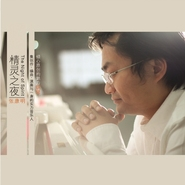

精灵之夜
============================

|  |  |
| :--: | :-- |
| [ 精灵之夜](https://emumo.xiami.com/album/177739113) | **艺人**: [张康明](../index.md) **语种**: 国语 **唱片公司**: 紫窗文化 **发行时间**: 2013年07月20日 **专辑类别**: 录音室专辑 **专辑风格**: 器乐独奏 Solo Instrumental, 轻音乐 Easy Listening, 新世纪音乐 New Age **播放数**: 160410 **收藏数**: 372 **评论数**: 47  |

## 简介

这是一张将多风格题材融为一体的钢琴New Age专辑。耗时一年创作，有澎湃交响，亦有淡雅抒情；有哥特哲学，亦有小桥流水。录制过程中更是包含了上海多位一线乐手的鼎力支持。同名音乐会也在积极筹划之中。  
实体唱片官方购买地址： <a href="http://item.taobao.com/item.htm?spm=686.1000925.1000774.13.keDKvD&amp;id=37959380091" target="_blank" rel="nofollow noreferrer noopener">http://item.taobao.com/item.htm?spm=686.1000925.1000774.13.keDKvD&amp;id=37959380091</a> 

## 曲目

## 评论

|  |  |  |
| :-- | :-- | :-- |
|  [虾米用户](https://emumo.xiami.com/u/444404872)  2020-08-10 20:33 赞(0) 踩(0) | 
超好听
 |
|  [虾米用户](https://emumo.xiami.com/u/361909247)  2018-05-19 15:29 赞(0) 踩(0) | 
文化没有界定，创作是发自内心的，音乐的多元化，因听者内心而定。感谢张康明先生，每一首我都喜欢
 |
| ⇒ |  [虾米用户](https://emumo.xiami.com/u/17428379) 由心而起的旋律 2018-05-19 16:47 赞(0) 踩(0) | 
谢谢您！！
 |
| ⇒ |  [虾米用户](https://emumo.xiami.com/u/361909247)  2018-05-19 16:53 赞(0) 踩(0) | 
张老师您好！我是吴燕鸣老师的学生，通过吴老师了解的你 喜欢芭蕾，喜欢钢琴，喜欢你的音乐，喜欢你的每一首曲子 
 |
| ⇒ |  [虾米用户](https://emumo.xiami.com/u/361909247)  2018-05-19 17:15 赞(0) 踩(0) | 
张老师，夏天的时候来青岛，喝啤酒吃海鲜 
 |
| ⇒ |  [虾米用户](https://emumo.xiami.com/u/361909247)  2018-07-01 15:44 赞(0) 踩(0) | 
张老师好！9月23日，你的音乐会？能介绍一下详情，谢谢！
 |
|  [虾米用户](https://emumo.xiami.com/u/47016546)  2018-04-24 13:51 赞(0) 踩(0) | 
感谢虾米的AI和静静搬砖系列让我听到很多好音乐
 |
|  [虾米用户](https://emumo.xiami.com/u/14581790) 不做平凡的人，但求超越自... 2018-03-23 00:46 赞(0) 踩(0) | 
皓月，最爱此曲，第一次约会，飞焰其次
 |
|  [虾米用户](https://emumo.xiami.com/u/5651992) 哈哈哈哈 2018-01-17 23:29 赞(0) 踩(0) | 
旋律优美
 |
|  [虾米用户](https://emumo.xiami.com/u/9933021)   2016-11-13 14:28 赞(0) 踩(0) | 
好喜欢张老师的所有作品 
 |
|  [虾米用户](https://emumo.xiami.com/u/23019173) 驹驹 2016-10-06 22:04 赞(0) 踩(0) | 
起源，真科幻，一群生命科学家组成的顶尖团队，只差最后的实验步骤，即将揭示我们的基因究竟来自何方。与时间赛跑，与外星文明争锋，关系到整个人类的前途……
 |
|  [虾米用户](https://emumo.xiami.com/u/23019173) 驹驹 2016-10-06 21:36 赞(0) 踩(0) | 
当年，第一次在上戏莲花路欣赏康师傅的内部专场时，就有那种观赏功夫巨片的澎湃通感o(∩_∩)o...哈哈
 |
|  [虾米用户](https://emumo.xiami.com/u/23019173) 驹驹 2016-10-06 21:32 赞(0) 踩(0) | 
竹梦，很适合功夫熊猫耍五郎八卦棍，或者忍者神龟操练少林棍，一定是竹棍奥^_^
 |
|  [虾米用户](https://emumo.xiami.com/u/6965782)  2016-05-22 18:38 赞(0) 踩(0) | 
这真的是首首都是精品!!!!!
 |
|  [虾米用户](https://emumo.xiami.com/u/730717) 一听音乐，都好了。 2016-04-25 16:06 赞(0) 踩(0) | 
正好在创作一个森林的场景。听着正合适。
 |
|  [虾米用户](https://emumo.xiami.com/u/41811572)   2016-02-17 22:46 赞(0) 踩(0) | 
好听！
 |
|  [虾米用户](https://emumo.xiami.com/u/4960476)  2016-01-16 11:56 赞(0) 踩(0) | 
好听！！！
 |
|  [虾米用户](https://emumo.xiami.com/u/9285862) 感谢大家的一路支持。今后... 2015-08-21 10:40 赞(3) 踩(0) | 
在这里提雅尼什么的，感觉完全扯远了。要说 Omar Akram 还有些相似之处。New Age范围很大。即便同属New Age，也是大相径庭。只是雅尼、班得瑞在国内比较有名，一提New Age有些人会自动往他们身上联想。实际上根本不是一回事。
 |
|  [虾米用户](https://emumo.xiami.com/u/1700002) V5_ORZZZZZ 2015-05-27 19:25 赞(2) 踩(0) | 
极品，别听楼下拙见，新专必须继续坚持各种曲风，期待会有新专，简直大期待....................
 |
|  [虾米用户](https://emumo.xiami.com/u/8777610) 前路迢迢 2014-09-30 19:52 赞(0) 踩(0) | 
实体碟这是卖光了的节奏么= =
 |
|  [虾米用户](https://emumo.xiami.com/u/10337057) 独自穿行于空灵之境 2014-06-08 21:16 赞(0) 踩(0) | 
真心点赞~~~
 |
|  [虾米用户](https://emumo.xiami.com/u/35731289) 爱音乐，爱交友！ 2014-05-18 10:42 赞(0) 踩(0) | 
先收藏，还没听
 |
|  [虾米用户](https://emumo.xiami.com/u/1609946) 一即一切 2014-05-03 22:58 赞(0) 踩(0) | 
心 境不二
 |
|  [虾米用户](https://emumo.xiami.com/u/12427112) 独醉到天亮。。。。。。 2014-04-16 21:35 赞(0) 踩(0) | 
好听的邪乎！！！
 |
|  [虾米用户](https://emumo.xiami.com/u/209486)  2014-04-10 22:11 赞(0) 踩(0) | 
正好有心事，听到肖恩的回忆终于控制不住嚎啕大哭了起来……
 |
| ⇒ |  [虾米用户](https://emumo.xiami.com/u/17428379) 由心而起的旋律 2014-04-12 20:25 赞(0) 踩(0) | 
哭完了之后好了吗？
 |
|  [虾米用户](https://emumo.xiami.com/u/11640829) ._. 2014-03-31 09:54 赞(0) 踩(0) | 
fusion?
 |
|  [虾米用户](https://emumo.xiami.com/u/16745497) 我还没想好要写什么... 2014-03-27 13:22 赞(0) 踩(0) | 
我代表全体中国人民点赞！～～～～　　－．＊
 |
| ⇒ |  [虾米用户](https://emumo.xiami.com/u/17428379) 由心而起的旋律 2014-04-05 10:31 赞(0) 踩(0) | 
哈哈，谢谢哦～请对拙作多提宝贵意见！
 |
|  [虾米用户](https://emumo.xiami.com/u/6162188)  2014-03-25 21:39 赞(0) 踩(0) | 
当再次听这张专辑时，正是2014年the 56th Annual Grammy Awards出炉之际，Laura Sullivan的Love&amp;#039;s River获最佳new age专辑，也同样有着新古典音乐元素。精灵之夜丝毫不逊色Love&amp;#039;s River。
 |
| ⇒ |  [虾米用户](https://emumo.xiami.com/u/17428379) 由心而起的旋律 2014-03-26 21:59 赞(0) 踩(0) | 
谢谢你哦～哈！过奖啦！
 |
| ⇒ |  [虾米用户](https://emumo.xiami.com/u/6162188)  2014-03-26 22:07 赞(0) 踩(0) | 
<q><b>张康明说：</b></q>
 |
| ⇒ |  [虾米用户](https://emumo.xiami.com/u/17428379) 由心而起的旋律 2014-03-27 17:41 赞(0) 踩(0) | 
<q><b>Andy说：</b></q>
 |
| ⇒ |  [虾米用户](https://emumo.xiami.com/u/6162188)  2014-04-04 22:09 赞(0) 踩(0) | 
<q><b>张康明说：</b></q>
 |
| ⇒ |  [虾米用户](https://emumo.xiami.com/u/17428379) 由心而起的旋律 2014-04-05 10:30 赞(0) 踩(0) | 
<q><b>Andy说：</b></q>
 |
|  [虾米用户](https://emumo.xiami.com/u/34379757)  2014-03-25 12:04 赞(0) 踩(0) | 
飞焰后面部分要是用小提琴演奏应该有更飞的感觉
 |
|  [虾米用户](https://emumo.xiami.com/u/34379757)  2014-03-25 11:27 赞(0) 踩(0) | 
真好听，全身毛孔都张开来了
 |
|  [虾米用户](https://emumo.xiami.com/u/9285862) 感谢大家的一路支持。今后... 2014-03-24 11:17 赞(1) 踩(0) | 
才知道这张专辑
 |
|  [虾米用户](https://emumo.xiami.com/u/5007699) 我所有的美好回忆 2014-03-20 22:27 赞(0) 踩(0) | 
实体唱片购买：<a href="http://item.taobao.com/item.htm?spm=686.1000925.1000774.13.keDKvD&amp;amp;id=37959380091" target="_blank" rel="nofollow noreferrer noopener">http://item.taobao.com/item.htm?spm=686.1000925.1000774.13.keDKvD&amp;amp;id=37959380091</a>
 |
| ⇒ |  [虾米用户](https://emumo.xiami.com/u/7680420) 纯音控 2014-03-21 21:24 赞(0) 踩(0) | 
感谢告知~
 |
|  [虾米用户](https://emumo.xiami.com/u/7680420) 纯音控 2014-03-20 11:58 赞(0) 踩(0) | 
实在太赞了，不知道哪有实体碟可以入手~
 |
|  [虾米用户](https://emumo.xiami.com/u/9318738)  2014-03-19 22:19 赞(1) 踩(0) | 
国人的骄傲啊！
 |
|  [虾米用户](https://emumo.xiami.com/u/9318738)  2014-03-19 21:49 赞(0) 踩(0) | 
果断占领前排！
 |
|  [虾米用户](https://emumo.xiami.com/u/16044893)  2014-03-02 12:38 赞(1) 踩(0) | 
很好听 清新愉快
 |
|  [虾米用户](https://emumo.xiami.com/u/23019173) 驹驹 2013-09-25 22:29 赞(0) 踩(0) | 
先听前三首，后面的会细细品味：）
 |
|  [虾米用户](https://emumo.xiami.com/u/6221331)  2013-08-30 10:50 赞(0) 踩(0) | 
很大气的音乐啊~喜欢~
 |
| ⇒ |  [虾米用户](https://emumo.xiami.com/u/11369948)  2014-02-19 13:37 赞(0) 踩(0) | 
他是我好朋友。谢谢你的支持哈！
 |
