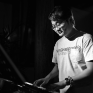
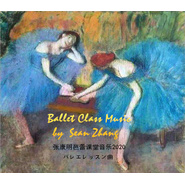
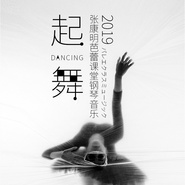
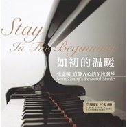
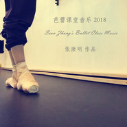
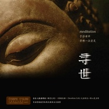
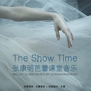
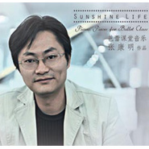

张康明
============================

|  |  |
| :--: | :-- |
| [ 张康明](https://i.xiami.com/touchblue) | **地区**: China 中国大陆 **风格**: 器乐独奏 Solo Instrumental, 电影原声 Film Score, 轻音乐 Easy Listening, 新世纪音乐 New Age **播放数**: 19691582 **粉丝数**: 9365 **评论数**: 112  |

## 档案

张康明，80年生人， 
自幼受音乐细菌感染至今，游荡于音乐之海不曾浮出水面。 
享受一个人，一个键盘，一盏台灯，一本书的生活。 
多年前从事即兴舞蹈音乐伴奏至今，给上海芭蕾舞团，香港芭蕾舞团，辽宁芭蕾舞团还有N个芭蕾舞团，上戏的各种大师班弹过小曲儿。给话剧《鼠疫》，现代版《哈姆雷特》，《自杀俱乐部》等做过现场钢琴即兴配乐，做过儿童科幻剧《金甲战士》的全剧配乐，and so on....... 
出版上海戏剧学院教材一本（《芭蕾基训钢琴小品》） 
，SunShine Life即兴演奏钢琴舞蹈音乐CD一张， 
原创POP竹笛《花叶》CD一张。 
《精灵之夜》是新近出版的专辑。更多新专辑正在筹划制作中。

## 专辑

| 名称 | 语种 | 唱片公司 | 发行时间 | 专辑类别 | 专辑风格 |
| :--: | :-- | :-- | :-- | :-- | :-- |
| [ 张康明芭蕾课堂音乐2020](./albums/2420333411.md) | 其他 | 独立发行 | 2020年02月28日 | 录音室专辑 | 轻音乐 Easy Listening, 世界音乐 World Music, 器乐独奏 Solo Instrumental |
| [ 起舞2019张康明芭蕾课堂钢琴音乐](./albums/2104682246.md) | 纯音乐 | 独立发行 | 2019年03月16日 | 录音室专辑 | 轻音乐 Easy Listening, 新世纪音乐 New Age |
| [ 如初的温暖Stay In The Begining](./albums/2104595809.md) | 国语 | 上海音乐出版社 | 2018年09月23日 | 录音室专辑 | 器乐独奏 Solo Instrumental, 器乐流行 Instrumental Pop, 新世纪音乐 New Age |
| [ 张康明芭蕾课堂音乐张康明 钢琴音乐作品](./albums/2103773642.md) | 其他 | 独立发行 | 2018年07月02日 | 录音室专辑 | 器乐流行 Instrumental Pop, 歌舞剧 Cabaret, 器乐独奏 Solo Instrumental |
| [ 细眉张康明中国舞课堂音乐](./albums/2103499971.md) | 其他 | 独立发行 | 2018年01月25日 | 录音室专辑 | 中国风 China-Wave, 民族融合新世纪 Ethnic Fusion New Age, 器乐流行 Instrumental Pop |
| [ 寻世于浮世中，寻那一点空灵](./albums/2105258836.md) | 纯音乐 | 独立发行 | 2017年08月19日 | 录音室专辑 | 器乐流行 Instrumental Pop, 新世纪音乐 New Age |
| [ 张康明芭蕾课堂音乐精选集Best Collection Of Sean Zhang's Ballet Music](./albums/2102776082.md) | 国语 | 独立发行 | 2017年07月02日 | 录音室专辑 | 键盘音乐 Keyboard, 芭蕾 Ballet, 自然新世纪 Nature New Age |
| [ 张康明芭蕾课堂音乐](./albums/2100297248.md) | 纯音乐 | 独立发行 | 2016年11月25日 | 录音室专辑 | 新世纪音乐 New Age, 世界音乐 World Music, 轻音乐流行 Light Pop |
| [ Ballet Music of Zhangkangming](./albums/2102665491.md) | 其他 | 独立发行 | 2015年06月01日 | 录音室专辑 | 芭蕾 Ballet |
| [ 精灵之夜](./albums/177739113.md) | 国语 | 紫窗文化 | 2013年07月20日 | 录音室专辑 | 器乐独奏 Solo Instrumental, 轻音乐 Easy Listening, 新世纪音乐 New Age |
| [ SunShine LifePiano Pieces for Ballet Class](./albums/1482706626.md) | 国语 | 紫窗文化 | 2012年06月30日 | 录音室专辑 | 器乐独奏 Solo Instrumental, 轻音乐 Easy Listening, 新世纪音乐 New Age |

## 评论

|  |  |  |
| :-- | :-- | :-- |
|  [虾米用户](https://emumo.xiami.com/u/681153) 我还没想好要写什么... 2021-01-06 20:55 赞(0) 踩(0) | 
要迁往网易云了 那里没有张老师
 |
| ⇒ |  [虾米用户](https://emumo.xiami.com/u/17428379) 由心而起的旋律 2021-01-10 08:26 赞(0) 踩(0) | 
腾讯音乐，哈哈
 |
|  [虾米用户](https://emumo.xiami.com/u/681153) 我还没想好要写什么... 2021-01-06 20:55 赞(0) 踩(0) | 
要迁往网易云了 那里没有张老师 以后你会在哪呢
 |
|  [虾米用户](https://emumo.xiami.com/u/276944698) 不要自我设限..... 2020-08-29 20:22 赞(0) 踩(0) | 

 |
|  [虾米用户](https://emumo.xiami.com/u/341603399)  2020-06-02 11:20 赞(1) 踩(0) | 
张老师怎么买您的专辑
 |
|  [虾米用户](https://emumo.xiami.com/u/4834656)   2020-05-22 09:17 赞(1) 踩(0) | 
老师什么时候 在出张 中国古典舞 音乐专辑呀？很期待。
 |
|  [虾米用户](https://emumo.xiami.com/u/8589595)   2020-04-17 23:44 赞(2) 踩(0) | 
最爱放老师的歌练最痛苦的功 慰藉 
 |
|  [虾米用户](https://emumo.xiami.com/u/425293197) "I have thor... 2020-03-04 22:48 赞(0) 踩(0) | 
康明，我真喜欢你弹的钢琴曲。
 |
| ⇒ |  [虾米用户](https://emumo.xiami.com/u/17428379) 由心而起的旋律 2020-03-05 11:38 赞(0) 踩(0) | 
谢谢你哦！！
 |
|  [虾米用户](https://emumo.xiami.com/u/291315149) 奕怡 2020-01-30 16:44 赞(0) 踩(0) | 
想要13mid-priouette的琴谱 
 |
| ⇒ |  [虾米用户](https://emumo.xiami.com/u/17428379) 由心而起的旋律 2020-01-31 10:05 赞(0) 踩(0) | 
都是即兴弹滴，木有琴谱   
 |
| ⇒ |  [虾米用户](https://emumo.xiami.com/u/291315149) 奕怡 2020-01-31 12:14 赞(0) 踩(0) | 
<q><b>张康明说：</b></q>
 |
| ⇒ |  [虾米用户](https://emumo.xiami.com/u/17428379) 由心而起的旋律 2020-01-31 17:21 赞(0) 踩(0) | 
<q><b>奕怡说：</b></q>
 |
| ⇒ |  [虾米用户](https://emumo.xiami.com/u/291315149) 奕怡 2020-01-31 18:17 赞(0) 踩(0) | 
<q><b>张康明说：</b></q>
 |
| ⇒ |  [虾米用户](https://emumo.xiami.com/u/17428379) 由心而起的旋律 2020-01-31 18:42 赞(0) 踩(0) | 
<q><b>奕怡说：</b></q>
 |
| ⇒ |  [虾米用户](https://emumo.xiami.com/u/291315149) 奕怡 2020-01-31 20:59 赞(0) 踩(0) | 
<q><b>张康明说：</b></q>
 |
|  [虾米用户](https://emumo.xiami.com/u/343411937)  2019-12-16 22:15 赞(1) 踩(0) | 
张老师  希望你多出些芭蕾课的曲子  稍微加入一点Jazz风格的音乐  作为专业的芭蕾教师和编导很喜欢你的曲子  
 |
| ⇒ |  [虾米用户](https://emumo.xiami.com/u/17428379) 由心而起的旋律 2019-12-17 10:03 赞(0) 踩(0) | 
谢谢哦！我继续努力哈！
 |
|  [虾米用户](https://emumo.xiami.com/u/410321834) EXO12-9 2019-12-11 21:32 赞(0) 踩(0) | 
有一种发现了宝藏的感觉
 |
|  [虾米用户](https://emumo.xiami.com/u/52280973) 娇彦 2019-11-25 20:42 赞(0) 踩(0) | 
张老师，如果能有试听就好了 
 |
|  [虾米用户](https://emumo.xiami.com/u/71178106) 塵世や 酒、風呂を抜け ... 2019-08-31 00:24 赞(1) 踩(0) | 
♡
 |
|  [虾米用户](https://emumo.xiami.com/u/344509150) 心以愉止 2019-07-06 17:16 赞(1) 踩(0) | 
好想听张老师钢琴版的《追光者》
 |
|  [虾米用户](https://emumo.xiami.com/u/344509150) 心以愉止 2019-07-06 17:14 赞(1) 踩(0) | 
听到老师的音乐总能静下心来开始基训
 |
|  [虾米用户](https://emumo.xiami.com/u/1197493) 我想我还听的太少 2019-07-01 09:11 赞(0) 踩(0) | 
好听啊 
 |
|  [虾米用户](https://emumo.xiami.com/u/292751445)   2019-05-23 15:40 赞(0) 踩(0) | 
用老師的音樂上課，學生也跟著買了，老師的音樂非常好聽，希望未來能再出更多的變化跟風格，讓上課更多彩多姿。
 |
|  [虾米用户](https://emumo.xiami.com/u/7779138) 研究所 2019-05-12 15:48 赞(0) 踩(0) | 
全是即兴的好厉害！
 |
|  [虾米用户](https://emumo.xiami.com/u/253661943)  2018-12-09 20:42 赞(0) 踩(0) | 
才华横溢
 |
|  [虾米用户](https://emumo.xiami.com/u/11946092) 我还没想好要写什么... 2018-09-30 15:11 赞(0) 踩(0) | 
真好！
 |
|  [虾米用户](https://emumo.xiami.com/u/257732742)  2018-09-28 20:54 赞(1) 踩(0) | 
偶然中听到张先生的《Piroutte》，觉得好听，就收藏了单曲。只是觉得太短，意犹未尽。若干天后，无意中翻看消息中心，居然收到了张先生对收藏表示感谢的信息，顿时有诚挚之情流于心间，于是点开了张先生的专辑，就像又打开了一扇窗。
 |
| ⇒ |  [虾米用户](https://emumo.xiami.com/u/17428379) 由心而起的旋律 2018-09-28 22:46 赞(0) 踩(0) | 
谢谢你！音乐，就是心灵往内的窗口 
 |
|  [虾米用户](https://emumo.xiami.com/u/35520728) Music  aroun... 2018-09-09 20:38 赞(0) 踩(0) | 

 |
|  [虾米用户](https://emumo.xiami.com/u/2052669) 温柔 坚定 明净 2018-07-05 22:09 赞(0) 踩(0) | 
上了三年成人芭蕾课，听过不少很美的strech, pli&amp;eacute; 和adagio的音乐，居然现在才听到张老师的钢琴。相闻恨晚。这些音乐是能让我宁愿忍受身体疼痛也会加倍练功的曲子 
 |
| ⇒ |  [虾米用户](https://emumo.xiami.com/u/262131190)  2018-07-30 08:17 赞(0) 踩(0) | 
在ip
 |
|  [虾米用户](https://emumo.xiami.com/u/345886564)   2018-06-14 10:12 赞(3) 踩(0) | 
用张老师伴奏上基训真是美到没朋友，学生也超级投入！      
 |
| ⇒ |  [虾米用户](https://emumo.xiami.com/u/17428379) 由心而起的旋律 2018-06-14 10:29 赞(0) 踩(0) | 
嗯，张老师现场弹更美  
 |
|  [虾米用户](https://emumo.xiami.com/u/13173319) mmmm hasjmj 2018-06-08 10:34 赞(0) 踩(0) | 
很艰难
 |
| ⇒ |  [虾米用户](https://emumo.xiami.com/u/17428379) 由心而起的旋律 2018-06-08 11:36 赞(0) 踩(0) | 
艰难啥？
 |
|  [虾米用户](https://emumo.xiami.com/u/358972453)  2018-04-18 21:56 赞(0) 踩(0) | 
张老师 真棒
 |
|  [虾米用户](https://emumo.xiami.com/u/287681224)  2018-04-13 13:30 赞(0) 踩(0) | 
张老师，细眉专辑出谱子了吗？求谱子 
 |
|  [虾米用户](https://emumo.xiami.com/u/3934907) 追寻诗人的足迹 2018-03-30 02:18 赞(0) 踩(0) | 
太美了
 |
|  [虾米用户](https://emumo.xiami.com/u/1604346) 再見 2018-03-08 11:49 赞(0) 踩(0) | 
能來廣州辦一場嗎～
 |
| ⇒ |  [虾米用户](https://emumo.xiami.com/u/17428379) 由心而起的旋律 2018-03-08 12:32 赞(0) 踩(0) | 
哈哈，以后有机会！～
 |
|  [虾米用户](https://emumo.xiami.com/u/9327494) http://www.x... 2018-01-22 19:09 赞(0) 踩(0) | 
烛
 |
|  [虾米用户](https://emumo.xiami.com/u/338616089)  2018-01-03 11:34 赞(0) 踩(0) | 
老师，能帮推荐一首44拍的大跳音乐吗？谢谢.
 |
|  [虾米用户](https://emumo.xiami.com/u/247079704)   2017-12-27 22:30 赞(0) 踩(0) | 
沉醉
 |
|  [虾米用户](https://emumo.xiami.com/u/338616089)  2017-12-04 21:41 赞(0) 踩(0) | 
张老师，请问您有这些芭蕾基训的钢琴谱吗？或者您什么时候还出书呀？
 |
|  [虾米用户](https://emumo.xiami.com/u/7431698) smoke 2017-12-03 16:28 赞(1) 踩(0) | 
空灵，悠远，不孤独。这是我听到的第一感应。也许点评的不到位，非音乐人，只知道听到的瞬间是否引起共鸣。支持原创，发掘更多绝世美曲！
 |
|  [虾米用户](https://emumo.xiami.com/u/333247910)  2017-11-04 20:25 赞(1) 踩(0) | 
好好听
 |
|  [虾米用户](https://emumo.xiami.com/u/5021202)  2017-09-21 12:04 赞(0) 踩(0) | 
可以 运动
 |
|  [虾米用户](https://emumo.xiami.com/u/324155757)  2017-09-09 15:34 赞(0) 踩(0) | 
音乐好听到让人陶醉
 |
|  [虾米用户](https://emumo.xiami.com/u/13960356) 心有猛虎 细嗅蔷薇 2017-08-28 14:40 赞(0) 踩(0) | 
老友粉一个 
 |
|  [虾米用户](https://emumo.xiami.com/u/275948)  2017-08-24 10:23 赞(0) 踩(0) | 
来天津开音乐会吧～
 |
| ⇒ |  [虾米用户](https://emumo.xiami.com/u/17428379) 由心而起的旋律 2017-08-24 11:19 赞(0) 踩(0) | 
成！你帮我操办～ 
 |
|  [虾米用户](https://emumo.xiami.com/u/314636959)  2017-07-24 14:57 赞(0) 踩(0) | 
张老师，爱你哦！我以后的课打算一直用您的音乐！❤️
 |
|  [虾米用户](https://emumo.xiami.com/u/11741807) 咳嗽晃动咳嗽晃动咳嗽晃动... 2017-07-07 01:18 赞(0) 踩(0) | 
超棒!!!![文字up][文字up][文字up]   
 |
|  [虾米用户](https://emumo.xiami.com/u/64188854)  2017-06-30 15:41 赞(1) 踩(0) | 
张老师  我是从淘宝搜钢琴谱找你你这来哒  你的音乐好好听 和我平时演奏的风格也很接近。请问你三张芭蕾基训专辑都有钢琴谱售卖吗？分别叫什么名字呀？
 |
| ⇒ |  [虾米用户](https://emumo.xiami.com/u/17428379) 由心而起的旋律 2017-07-12 15:03 赞(0) 踩(0) | 
没有曲谱哎&amp;hellip;
 |
|  [虾米用户](https://emumo.xiami.com/u/17419307) 呀呀 2017-06-18 13:33 赞(1) 踩(0) | 
希望您多多创作好听的音乐
 |
|  [虾米用户](https://emumo.xiami.com/u/17419307) 呀呀 2017-06-18 13:33 赞(1) 踩(0) | 
老师，您的音乐很棒，我特别喜欢，
 |
|  [虾米用户](https://emumo.xiami.com/u/38805732) 岂能尽如人意 但求无愧于... 2017-05-03 15:28 赞(1) 踩(0) | 
超级爱
 |
|  [虾米用户](https://emumo.xiami.com/u/1746808)  2017-04-07 16:29 赞(1) 踩(0) | 
dweDFWEC
 |
|  [虾米用户](https://emumo.xiami.com/u/40676881) 我还没想好要写什么... 2017-03-06 22:21 赞(1) 踩(0) | 
感谢你的芭蕾钢琴伴奏 是这几年来集训课听到最好听的 最不一样的。收藏了两张您的专辑
 |
| ⇒ |  [虾米用户](https://emumo.xiami.com/u/17428379) 由心而起的旋律 2017-03-08 17:30 赞(0) 踩(0) | 
表客气表客气，慢慢听~~：）
 |
|  [虾米用户](https://emumo.xiami.com/u/277437522)  2017-03-03 12:40 赞(1) 踩(0) | 
张老师威武   
 |
|  [虾米用户](https://emumo.xiami.com/u/11052613) 阳光猛烈，万物显形。 2017-02-06 08:19 赞(1) 踩(0) | 
老师加油
 |
|  [虾米用户](https://emumo.xiami.com/u/225179035)  2016-12-27 19:30 赞(0) 踩(0) | 
已经买了老师两张舞蹈专辑啦～喜欢老师可以出更多好听的上课音乐，到时候一定继续支持    太好听了
 |
| ⇒ |  [虾米用户](https://emumo.xiami.com/u/17428379) 由心而起的旋律 2017-08-09 08:32 赞(0) 踩(0) | 
你是在香港？
 |
|  [虾米用户](https://emumo.xiami.com/u/247714521)  2016-12-03 18:50 赞(0) 踩(0) | 
张老师，你前面那个芭蕾音乐怎么不见了，特别喜欢那一版。能不能再发出来啊？
 |
|  [虾米用户](https://emumo.xiami.com/u/235189438)  2016-10-10 00:19 赞(0) 踩(0) | 
求Audrey's hair  小溪边的微风
 |
|  [虾米用户](https://emumo.xiami.com/u/235175631)  2016-10-09 23:11 赞(0) 踩(0) | 
张老师，为何找不到你10月8日晚上音乐会的第二首曲子，叫什么溪边，求这首曲子！
 |
|  [虾米用户](https://emumo.xiami.com/u/16745497) 我还没想好要写什么... 2016-08-25 13:40 赞(0) 踩(0) | 
新专辑 “寻世” 太给力啦！
 |
| ⇒ |  [虾米用户](https://emumo.xiami.com/u/17428379) 由心而起的旋律 2016-08-25 21:00 赞(0) 踩(0) | 
你拿到碟啦？！
 |
| ⇒ |  [虾米用户](https://emumo.xiami.com/u/16745497) 我还没想好要写什么... 2016-08-26 10:09 赞(0) 踩(0) | 
<q><b>张康明说：</b></q>
 |
| ⇒ |  [虾米用户](https://emumo.xiami.com/u/17428379) 由心而起的旋律 2016-08-26 11:22 赞(0) 踩(0) | 
<q><b>MusicTingzi说：</b></q>
 |
|  [虾米用户](https://emumo.xiami.com/u/1604346) 再見 2016-07-20 00:28 赞(0) 踩(0) | 
啊10月7
 |
|  [虾米用户](https://emumo.xiami.com/u/2554746) 越努力 越优秀 越独立 ... 2016-05-28 14:35 赞(0) 踩(0) | 
不错的练功music
 |
|  [虾米用户](https://emumo.xiami.com/u/133248738)  2016-04-03 18:00 赞(0) 踩(0) | 
你的音乐太棒！芭蕾舞音乐（stretch plié 等等）有没有高清可以下载，付钱没问题！！
 |
|  [虾米用户](https://emumo.xiami.com/u/34731243)   2016-03-22 17:18 赞(0) 踩(0) | 
太好了 
 |
|  [虾米用户](https://emumo.xiami.com/u/41811572)   2016-03-15 22:10 赞(0) 踩(0) | 
相见恨晚！❤不过总算是遇见了！❤
 |
|  [虾米用户](https://emumo.xiami.com/u/1700002) V5_ORZZZZZ 2015-12-26 11:33 赞(0) 踩(0) | 
希望会有新专辑  一定要出啊
 |
|  [虾米用户](https://emumo.xiami.com/u/5584813)  2015-11-04 11:52 赞(0) 踩(0) | 
咱们中国也有自己好听的原创啦 老师还有音乐会么？想去现场
 |
|  [虾米用户](https://emumo.xiami.com/u/53933441) 温温然唱唱婷婷 2015-08-27 09:55 赞(0) 踩(0) | 
自然、舒适，让人感到温暖的音乐。
 |
|  [虾米用户](https://emumo.xiami.com/u/8339938) 我还没想好要写什么... 2015-08-09 13:58 赞(0) 踩(0) | 
着实惊艳了下，期待更好的砖和创意！[中国旗帜] 
 |
|  [虾米用户](https://emumo.xiami.com/u/1604346) 再見 2015-08-07 01:28 赞(0) 踩(0) | 
！
 |
|  [虾米用户](https://emumo.xiami.com/u/51425318)  2015-06-19 13:02 赞(0) 踩(0) | 
康师傅，有没有芭蕾行礼钢琴伴奏呢？你的音乐很好听
 |
|  [虾米用户](https://emumo.xiami.com/u/10454104) 2009~2021如果不... 2015-06-18 20:07 赞(0) 踩(0) | 
酒香不怕巷子深，非常出色的原创钢琴曲！很喜欢！深深支持！  
 |
|  [虾米用户](https://emumo.xiami.com/u/3186803)  2015-04-20 13:37 赞(2) 踩(0) | 
国内这样的音乐家感觉太稀有了。加油~~~
 |
|  [虾米用户](https://emumo.xiami.com/u/47809920) 锲而舍之，朽木不折，锲而... 2015-03-05 12:38 赞(4) 踩(0) | 
张老师2月14日的音乐会太好听了，之前比较喜欢久石让，威廉姆斯，神秘园组合这些外国音乐家，没想到国内也有这么优秀的音乐作曲家，以后就是张老师的粉丝了！
 |
| ⇒ |  [虾米用户](https://emumo.xiami.com/u/17428379) 由心而起的旋律 2015-03-09 08:03 赞(0) 踩(0) | 
哟，你来啦？哈哈，谢谢捧场啊～～
 |
| ⇒ |  [虾米用户](https://emumo.xiami.com/u/47809920) 锲而舍之，朽木不折，锲而... 2015-03-14 14:55 赞(0) 踩(0) | 
<q><b>张康明说：</b></q>
 |
| ⇒ |  [虾米用户](https://emumo.xiami.com/u/17428379) 由心而起的旋律 2015-03-21 08:30 赞(0) 踩(0) | 
<q><b>季后红说：</b></q>
 |
| ⇒ |  [虾米用户](https://emumo.xiami.com/u/47809920) 锲而舍之，朽木不折，锲而... 2015-03-27 15:21 赞(0) 踩(0) | 
<q><b>张康明说：</b></q>
 |
| ⇒ |  [虾米用户](https://emumo.xiami.com/u/17428379) 由心而起的旋律 2015-03-27 21:57 赞(0) 踩(0) | 
<q><b>季后红说：</b></q>
 |
|  [虾米用户](https://emumo.xiami.com/u/381844)  2015-01-18 16:03 赞(1) 踩(0) | 
太好听了！
 |
|  [虾米用户](https://emumo.xiami.com/u/45745864)  2015-01-07 20:08 赞(15) 踩(0) | 
好听啊！康师傅
 |
|  [虾米用户](https://emumo.xiami.com/u/719995) 事出有音 2014-08-23 11:01 赞(1) 踩(0) | 
neoclassical!赞一个！
 |
|  [虾米用户](https://emumo.xiami.com/u/31184261) 没有音乐我们都会死吧。 2014-08-19 17:24 赞(0) 踩(0) | 
顶~！ 好音乐需要更多人知道
 |
|  [虾米用户](https://emumo.xiami.com/u/7818401) 没有缺憾才不完美 2014-08-18 13:41 赞(0) 踩(0) | 
原创即王道。加油！
 |
|  [虾米用户](https://emumo.xiami.com/u/2588900)  2014-08-13 10:06 赞(0) 踩(0) | 
有幸!
 |
|  [虾米用户](https://emumo.xiami.com/u/7776021) memento mori 2014-08-04 16:48 赞(0) 踩(0) | 
~
 |
|  [虾米用户](https://emumo.xiami.com/u/6965782)  2014-06-28 14:07 赞(0) 踩(0) | 
只能说,与众不同
 |
|  [虾米用户](https://emumo.xiami.com/u/7644964) 畅游音乐博爱的海洋！ 2014-05-21 17:06 赞(0) 踩(0) | 
想起了伍芳。很漂亮，期待demo变成品。
 |
|  [虾米用户](https://emumo.xiami.com/u/5691092) 爱生活 爱音乐 爱影视 2014-05-05 19:46 赞(0) 踩(0) | 
十分强悍啊。
 |
|  [虾米用户](https://emumo.xiami.com/u/4306729) 不敢收新歌，往往是怕丢掉... 2014-04-20 16:57 赞(1) 踩(0) | 
一入康明深似海，从此忧桑是路人……听过的每一首中都能激励人心的力量，张老师頑張って！
 |
|  [虾米用户](https://emumo.xiami.com/u/12427112) 独醉到天亮。。。。。。 2014-04-17 18:55 赞(0) 踩(0) | 
好听的邪乎！
 |
|  [虾米用户](https://emumo.xiami.com/u/10337057) 独自穿行于空灵之境 2014-04-05 22:23 赞(0) 踩(0) | 
~~~
 |
|  [虾米用户](https://emumo.xiami.com/u/16745497) 我还没想好要写什么... 2014-03-27 13:16 赞(0) 踩(0) | 
－。＊
 |
|  [虾米用户](https://emumo.xiami.com/u/6162188)  2014-03-25 21:49 赞(0) 踩(0) | 
高水准、原创，这两点就足够了！！
 |
|  [虾米用户](https://emumo.xiami.com/u/11640829) ._. 2014-03-23 09:58 赞(0) 踩(0) | 
精灵之夜!!!!!!!!!!!!!!
 |
|  [虾米用户](https://emumo.xiami.com/u/9318738)  2014-03-19 22:21 赞(1) 踩(0) | 
骄傲啊！！
 |
|  [虾米用户](https://emumo.xiami.com/u/15244009) hihihihihihi 2013-11-05 00:28 赞(1) 踩(0) | 
61!!!第一次约会!!! 广东时代美术馆 万达** 电影院. 星巴克.. 泰道!!!
 |
|  [虾米用户](https://emumo.xiami.com/u/1161870)  2013-09-28 23:55 赞(1) 踩(0) | 
第一次约会！！
 |
