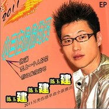

陈玉建
============================

|  |  |
| :--: | :-- |
| [ 陈玉建](https://i.xiami.com/chenyujian) | **播放数**: 19093683 **粉丝数**: 2061 **评论数**: 69 **地区**: China 中国大陆 **风格**: 国语流行 Mandarin Pop  |

## 档案

陈玉建 ，中国内地音乐人、男歌手， 出生于吉林省长白山，毕业于长春艺术学校，是北京七彩音符文化传媒有限公司旗下艺人。2008年首发单曲《爱上离婚的女人》， 同年10月20日陈玉建荣登北京时代中国杂志封面，并在全国发行刊物。 2009年一首《男人就是累》让他网络走红，而该作品也在打榜两周之后就荣登网络音乐榜首，试听量日均超百万。2010年4月推出情感单曲《偷偷的哭》，并成为全国卫视热播推荐曲目，而歌曲的彩铃下载量也进入全国前二名。2012年作为广东卫视春晚特邀原创嘉宾出席活动现场，并演唱了成名单曲《偷偷的哭》。2015年推出主打单曲《我的小女人》一度成为广场舞友人的热爱和追捧。

## 专辑

| 名称 | 语种 | 唱片公司 | 发行时间 | 专辑类别 | 专辑风格 |
| :--: | :-- | :-- | :-- | :-- | :-- |
| [ 小鸟丢了](./albums/2103922104.md) | 国语 | HIFIVE | 2018年08月10日 | EP, 单曲 |  |
| [ 爱情酒杯](./albums/2103849823.md) | 国语 | 一阳文化 | 2018年07月25日 | EP, 单曲 |  |
| [ 丢了爱情怎么走](./albums/2103791872.md) | 国语 | HIFIVE | 2018年06月19日 | EP, 单曲 |  |
| [ 完美人生](./albums/2103648930.md) | 国语 | 英曼唱片 | 2018年03月27日 | EP, 单曲 |  |
| [ 等她](./albums/2103498496.md) | 国语 | 禾信科技 | 2018年01月23日 | EP, 单曲 |  |
| [ 快手有毒](./albums/2103641315.md) | 国语 | 酝星文化 | 2017年12月04日 | EP, 单曲 |  |
| [ 后海酒吧](./albums/2103525165.md) | 国语 | HIFIVE | 2017年11月10日 | EP, 单曲 |  |
| [ 我被爱情撞了一下腰](./albums/2102766740.md) | 国语 | 一阳文化 | 2017年06月11日 | EP, 单曲 |  |
| [ 情义好兄弟](./albums/2102725014.md) | 国语 | 看见音乐 (上海) | 2017年03月31日 | EP, 单曲 |  |
| [ 不想一个人睡](./albums/2103641319.md) | 国语 | 酝星文化 | 2017年02月20日 | EP, 单曲 |  |
| [ 我爱你](./albums/2103641476.md) | 国语 | 酝星文化 | 2017年02月14日 | EP, 单曲 |  |
| [ 爱你无所求](./albums/2103655378.md) | 国语 | 酝星文化 | 2017年01月01日 | EP, 单曲 |  |
| [ 你爱了吗](./albums/2103641318.md) | 国语 | 酝星文化 | 2016年10月01日 | EP, 单曲 |  |
| [ 曾经爱过就足够](./albums/2103641324.md) | 国语 | 酝星文化 | 2016年10月01日 | EP, 单曲 |  |
| [ 大哥小弟(DJV混音版)](./albums/2103521210.md) | 国语 | 酝星文化 | 2016年10月01日 | EP, 单曲 |  |
| [ 谁来安慰我](./albums/2103641483.md) | 国语 | 酝星文化 | 2016年10月01日 | EP, 单曲 |  |
| [ 那天很冷](./albums/2103641316.md) | 国语 | 酝星文化 | 2016年10月01日 | EP, 单曲 |  |
| [ 天堂的呼唤](./albums/2103641484.md) | 国语 | 酝星文化 | 2016年10月01日 | EP, 单曲 |  |
| [ 爸爸妈妈别为我哭](./albums/2103641321.md) | 国语 | 酝星文化 | 2016年10月01日 | EP, 单曲 |  |
| [ 我陪你](./albums/2320309403.md) | 国语 | 启韵传媒 | 2016年08月10日 |  | 流行 Pop |
| [ 永远爱你的](./albums/2103641648.md) | 国语 | 酝星文化 | 2015年11月28日 | EP, 单曲 |  |
| [ 不老的回忆](./albums/2103641320.md) | 国语 | 酝星文化 | 2015年11月05日 | EP, 单曲 |  |
| [ 我的小女人](./albums/1035048164.md) | 国语 | 七彩音符 | 2015年06月19日 | EP, 单曲 |  |
| [ 爱情么么哒](./albums/1633903345.md) | 国语 | 七彩音符 | 2015年06月08日 | EP, 单曲 |  |
| [ 让我一生爱着你](./albums/1231910985.md) | 国语 | 酝星文化 | 2015年05月17日 | EP, 单曲 |  |
| [ 忘了伤悲](./albums/327095553.md) | 国语 | 七彩音符 | 2015年03月20日 | EP, 单曲 |  |
| [ 喜气洋洋过大年](./albums/23532723.md) | 国语 | 可心文化 | 2015年02月06日 | EP, 单曲 |  |
| [ 甜蜜爱情](./albums/1320621455.md) | 国语 | 七彩音符 | 2015年01月07日 | 录音室专辑 |  |
| [ 草原姑娘](./albums/307830211.md) | 国语 | 七彩音符 | 2014年08月12日 | EP, 单曲 |  |
| [ 生意兴隆](./albums/1912735510.md) | 国语 | 酝星文化 | 2014年08月05日 | EP, 单曲 |  |
| [ 说说爱情](./albums/1194504591.md) | 国语 | 七彩音符 | 2014年03月09日 | EP, 单曲 |  |
| [ 忘记你还需要多久](./albums/1493470365.md) | 国语 | 七彩音符 | 2014年02月25日 | EP, 单曲 |  |
| [ 蒙圈了](./albums/779321161.md) | 国语 | 七彩音符 | 2013年09月16日 | EP, 单曲 |  |
| [ 爱的残酷](./albums/1870499314.md) | 国语 | 百纳音格 | 2013年06月03日 | EP, 单曲 |  |
| [ 情泪 ](./albums/968414029.md) | 国语 | 七彩音符文化 | 2013年05月13日 | EP, 单曲 |  |
| [ 红颜你我](./albums/1163836663.md) | 国语 | 七彩音符文化 | 2013年03月20日 | EP, 单曲 |  |
| [ 没你我和别人睡](./albums/564692.md) | 国语 | 七彩音符 | 2012年12月17日 | EP, 单曲 |  |
| [ 白头偕老](./albums/546684.md) | 国语 | 七彩音符 | 2012年10月02日 | EP, 单曲 |  |
| [ 含泪做朋友](./albums/507127.md) | 国语 | 七彩音符 | 2012年04月12日 | EP, 单曲 |  |
| [ 因为爱情Ⅱ DSD](./albums/2103641646.md) | 国语 | 酝星文化 | 2012年04月01日 | EP, 单曲 |  |
| [ 第一次失恋](./albums/504038.md) | 国语 | 七彩音符 | 2012年03月30日 | EP, 单曲 |  |
| [ 放弃后的心疼 ](./albums/500929.md) | 国语 | 七彩音符 | 2012年03月20日 | EP, 单曲 |  |
| [ 谁能给我温暖的家 ](./albums/500410.md) | 国语 | 七彩音符 | 2012年03月16日 | EP, 单曲 |  |
| [ 火辣辣](./albums/495324.md) | 国语 | 酝星文化 | 2012年02月21日 | EP, 单曲 |  |
| [ 我不让你哭](./albums/479855.md) | 国语 | 七彩音符 | 2011年11月25日 | EP, 单曲 |  |
| [ 赌注](./albums/479551.md) | 国语 | 酝星文化 | 2011年11月24日 | EP, 单曲 |  |
| [ 听情歌忘了她](./albums/469050.md) | 国语 | 七彩音符 | 2011年09月25日 | EP, 单曲 |  |
| [ 偷偷的哭Secretly Cry](./albums/468435.md) | 国语 | 怡人唱片 | 2011年09月01日 | 录音室专辑 |  |
| [ 你是我的女人](./albums/450100.md) | 国语 | 龙乐唱片 | 2011年07月04日 | EP, 单曲 |  |
| [ 恋曲2012](./albums/446535.md) | 国语 | 沸星娱乐 | 2011年06月16日 | EP, 单曲 |  |
| [ 伤害](./albums/441927.md) | 国语 | 沸星娱乐 | 2011年05月13日 | EP, 单曲 |  |
| [ 小三在偷偷的哭](./albums/2103655383.md) | 国语 | 酝星文化 | 2011年05月11日 | EP, 单曲 |  |
| [ 小三在偷偷的哭](./albums/440020.md) | 国语 | 华友飞乐 | 2011年05月05日 | EP, 单曲 |  |
| [ 浓浓的情](./albums/436233.md) | 国语 | 沸星娱乐 | 2010年10月22日 | 录音室专辑 |  |
| [ 男人就是累](./albums/392732.md) | 国语 | 华元文化 | 2009年07月30日 | EP, 单曲 |  |
| [ 陈玉建单曲集](./albums/2103641365.md) | 国语 | 酝星文化 | 2008年01月01日 | 合集, 杂锦 |  |

## 评论

|  |  |  |  |
| :-- | :-- | :-- | :-- |
|  [虾米用户](https://emumo.xiami.com/u/261355585) 我还没想好要写什么... 2020-03-12 21:51 赞(0) 踩(0) | 
好听
 |
|  [虾米用户](https://emumo.xiami.com/u/206029922) 一笑泯恩仇 2020-02-29 18:10 赞(0) 踩(0) | 
非主流
 |
|  [虾米用户](https://emumo.xiami.com/u/112513928)  2019-05-13 23:46 赞(0) 踩(0) | 
我从小听着你的歌
 |
|  [虾米用户](https://emumo.xiami.com/u/403196951)  2019-04-20 07:10 赞(0) 踩(0) | 
好听
 |
|  [虾米用户](https://emumo.xiami.com/u/282700317) 你不懂我的沉默，又怎懂我... 2018-12-28 23:03 赞(1) 踩(0) | 
我很喜欢伤感歌曲，期待你更好的作品哦
 |
|  [虾米用户](https://emumo.xiami.com/u/346457088)  2018-06-10 15:57 赞(1) 踩(0) | 
 我爱你，亲爱的  表白歌曲！
 |
|  [虾米用户](https://emumo.xiami.com/u/341955835)  2018-06-07 16:02 赞(1) 踩(0) | 
感同深受，实在是太好听了，我听这首歌长大
 |
|  [虾米用户](https://emumo.xiami.com/u/352804120)  2018-03-21 21:34 赞(1) 踩(0) | 
还可以不错
 |
|  [虾米用户](https://emumo.xiami.com/u/210901211)  2018-02-16 18:16 赞(0) 踩(0) | 
我想和你聊聊天呢，红包也准备好了微信A11401010
 |
|  [虾米用户](https://emumo.xiami.com/u/13552)  2017-10-27 23:03 赞(1) 踩(0) | 
微信爱、红颜你我
 |
|  [虾米用户](https://emumo.xiami.com/u/329018578) 我很喜欢音乐 2017-10-08 00:03 赞(1) 踩(0) | 
很喜欢陈玉建的歌曲！
 |
| ⇒ |  [虾米用户](https://emumo.xiami.com/u/337776009)  2018-02-19 11:02 赞(0) 踩(0) | 
七八年就听你的哥
 |
|  [虾米用户](https://emumo.xiami.com/u/293692544) 你敢给我说话吗？我咬你 2017-09-18 17:40 赞(2) 踩(0) | 
不错啊
 |
|  [虾米用户](https://emumo.xiami.com/u/271236132) 乐王 2017-08-21 03:35 赞(2) 踩(0) | 
你的歌非常棒，非常好听！谢谢你
 |
|  [虾米用户](https://emumo.xiami.com/u/293379623)  2017-06-17 07:02 赞(3) 踩(0) | 
唱的非常棒！听了还想听！你的歌声把我的心带走让我听了还想再听！
 |
|  [虾米用户](https://emumo.xiami.com/u/289274699)  2017-04-20 11:24 赞(2) 踩(0) | 
   
 |
|  [虾米用户](https://emumo.xiami.com/u/22393699)  2017-04-19 20:53 赞(2) 踩(0) | 

 |
|  [虾米用户](https://emumo.xiami.com/u/277572912)  2017-04-15 23:46 赞(2) 踩(0) | 

 |
|  [虾米用户](https://emumo.xiami.com/u/234031720)  2017-03-18 15:02 赞(2) 踩(0) | 
 
 |
|  [虾米用户](https://emumo.xiami.com/u/122688364) 生在愤坑，长在赤圈；挣脱 2016-07-19 23:43 赞(2) 踩(0) | 
2078
 |
|  [虾米用户](https://emumo.xiami.com/u/180640844) 音乐就是一切，玩全民k歌... 2016-06-25 00:17 赞(1) 踩(0) | 
    
 |
|  [虾米用户](https://emumo.xiami.com/u/74639208) Music is per... 2016-06-04 19:02 赞(3) 踩(0) | 
这头发……
 |
|  [虾米用户](https://emumo.xiami.com/u/52451792) Among No One 2016-04-10 08:09 赞(2) 踩(0) | 
嗯，太tm俗
 |
|  [虾米用户](https://emumo.xiami.com/u/16459711)   2015-12-16 23:56 赞(14) 踩(0) | 
他的封面是不是被雷打了？
 |
|  [虾米用户](https://emumo.xiami.com/u/38772792)  2015-10-07 15:22 赞(1) 踩(0) | 
做人真难
 |
|  [虾米用户](https://emumo.xiami.com/u/11763865)  2015-08-22 23:33 赞(1) 踩(0) | 

 |
|  [虾米用户](https://emumo.xiami.com/u/11763865)  2015-08-22 23:33 赞(1) 踩(0) | 

 |
|  [虾米用户](https://emumo.xiami.com/u/39788841)  . 2015-08-22 10:37 赞(1) 踩(0) | 
Lium
 |
|  [虾米用户](https://emumo.xiami.com/u/48090365) 救世主的死亡，即为天启！ 2015-08-13 00:06 赞(4) 踩(0) | 
哥们我觉得你不容易，真的
 |
| ⇒ |  [虾米用户](https://emumo.xiami.com/u/51567885) Shining Holl... 2016-04-08 11:14 赞(0) 踩(0) | 
哈哈哈哈哈哈哈居然在这里看到你
 |
| ⇒ |  [虾米用户](https://emumo.xiami.com/u/48090365) 救世主的死亡，即为天启！ 2016-04-09 20:32 赞(0) 踩(0) | 
<q><b>Cambria说：</b></q>
 |
|  [虾米用户](https://emumo.xiami.com/u/276385)   2015-07-02 19:53 赞(1) 踩(0) | 
你的水军也入驻了阿里虾米音乐
 |
|  [虾米用户](https://emumo.xiami.com/u/36536789) 深锁广寒宫殿 2015-07-02 00:27 赞(1) 踩(0) | 
红红火火
 |
|  [虾米用户](https://emumo.xiami.com/u/49860711) 有点意思 2015-07-01 12:05 赞(1) 踩(0) | 
我要疯了！现在的虾米首页【大虾推荐】版块共有4个人推荐这首歌！这素有多好听啊，大虾们！玩我乜？？？
 |
|  [虾米用户](https://emumo.xiami.com/u/720647)  2015-06-30 14:48 赞(2) 踩(0) | 
我刚入驻了阿里音乐人，欢迎大家来我的个人主页，收听我的最新音乐
 |
| ⇒ |  [虾米用户](https://emumo.xiami.com/u/298910323)  2017-05-24 20:47 赞(0) 踩(0) | 
好
 |
|  [虾米用户](https://emumo.xiami.com/u/6652575) mbz2006 2015-02-01 22:08 赞(1) 踩(0) | 
ok
 |
|  [虾米用户](https://emumo.xiami.com/u/45196647)  2014-12-26 07:50 赞(1) 踩(0) | 
听情歌忘了她好听。
 |
|  [虾米用户](https://emumo.xiami.com/u/4742826)  2014-07-19 07:44 赞(1) 踩(0) | 
怎么和干露露苟合了
 |
|  [虾米用户](https://emumo.xiami.com/u/26501646)  2014-05-10 13:01 赞(1) 踩(0) | 
不错
 |
|  [虾米用户](https://emumo.xiami.com/u/1024746) 灵魂不该屈服 2014-05-03 10:13 赞(1) 踩(0) | 
传说中的叼炸天....
 |
|  [虾米用户](https://emumo.xiami.com/u/5855146) 我还没想好要写什么... 2013-10-07 13:53 赞(34) 踩(0) | 
通俗易懂旋律简单，是乡镇少年、新农村青年及长途运输大叔、路边摊、城郊洗剪吹必备之异能量歌曲！
 |
| ⇒ |  [虾米用户](https://emumo.xiami.com/u/289274699)  2017-04-20 11:21 赞(0) 踩(0) | 
评论很全面
 |
| ⇒ |  [虾米用户](https://emumo.xiami.com/u/283320169)  2017-04-22 22:48 赞(0) 踩(0) | 
评论很到位
 |
| ⇒ |  [虾米用户](https://emumo.xiami.com/u/338441370) 大笑姑婆 2017-12-08 10:46 赞(0) 踩(0) | 
好聽聽 
 |
| ⇒ |  [虾米用户](https://emumo.xiami.com/u/369865303)  2018-10-01 21:37 赞(0) 踩(0) | 
我很喜欢听你的左手摸右手这首歌，可惜下载不了。
 |
|  [虾米用户](https://emumo.xiami.com/u/588121) 我还没想好要写什么... 2013-07-25 00:08 赞(1) 踩(0) | 
彪悍的音乐无需多言，简介都是空白。。
 |
|  [虾米用户](https://emumo.xiami.com/u/6068906)  2013-07-09 00:08 赞(0) 踩(0) | 
求《丢弃的玫瑰》歌曲。
 |
|  [虾米用户](https://emumo.xiami.com/u/4926807) 你会变成这样都是我害的 2013-06-06 18:55 赞(0) 踩(0) | 
哈哈哈哈哈哈哈哈哈哈
 |
|  [虾米用户](https://emumo.xiami.com/u/3256844) 恩斯波肯 多姆 2013-01-30 06:05 赞(11) 踩(0) | 
太炫酷 壮哉我农金
 |
|  [虾米用户](https://emumo.xiami.com/u/3256844) 恩斯波肯 多姆 2013-01-30 06:04 赞(3) 踩(0) | 
太炫酷了
 |
|  [虾米用户](https://emumo.xiami.com/u/2203995)  2013-01-18 09:36 赞(0) 踩(0) | 
喜欢声音
 |
|  [虾米用户](https://emumo.xiami.com/u/11107897)  2012-10-19 17:05 赞(0) 踩(0) | 
蛮嗨
 |
|  [虾米用户](https://emumo.xiami.com/u/1546360) 就是如此清新脱俗 2012-09-04 20:38 赞(1) 踩(0) | 
好听.么么哒.
 |
|  [虾米用户](https://emumo.xiami.com/u/1447058) 已迁移至网易云，祝好——... 2012-08-19 20:04 赞(18) 踩(0) | 
没你我和别人睡！别！人！睡！
 |
| ⇒ |  [虾米用户](https://emumo.xiami.com/u/1828555) Omnivore 2013-08-19 19:04 赞(0) 踩(0) | 
哈哈哈哈，我今天在我们单位通勤车上听到小三在偷偷的哭，硬是被我找到了....
 |
| ⇒ |  [虾米用户](https://emumo.xiami.com/u/1447058) 已迁移至网易云，祝好——... 2013-08-19 20:28 赞(0) 踩(0) | 
<q><b>CâllMëQùeen说：</b></q>
 |
| ⇒ |  [虾米用户](https://emumo.xiami.com/u/1828555) Omnivore 2013-08-19 20:41 赞(0) 踩(0) | 
<q><b>暗叉说：</b></q>
 |
| ⇒ |  [虾米用户](https://emumo.xiami.com/u/948132) 冰岛 2013-10-24 18:12 赞(0) 踩(0) | 
点赞！
 |
| ⇒ |  [虾米用户](https://emumo.xiami.com/u/1333044) 这世间没有人孤独，但是有... 2016-01-15 23:23 赞(0) 踩(0) | 
暗叉在这都能发现你你听歌真多233333
 |
| ⇒ |  [虾米用户](https://emumo.xiami.com/u/1447058) 已迁移至网易云，祝好——... 2016-01-15 23:53 赞(0) 踩(0) | 
<q><b>例外状态说：</b></q>
 |
| ⇒ |  [虾米用户](https://emumo.xiami.com/u/228475868) Meh 2017-02-05 05:21 赞(0) 踩(0) | 
哈哈哈哈哈
 |
| ⇒ |  [虾米用户](https://emumo.xiami.com/u/228475868) Meh 2017-02-05 05:21 赞(0) 踩(0) | 
<q><b>暗叉说：</b></q>
 |
|  [虾米用户](https://emumo.xiami.com/u/6229958) 音乐天下最美的东西 2012-07-08 21:34 赞(0) 踩(0) | 
1
 |
|  [虾米用户](https://emumo.xiami.com/u/8142644)  2012-03-03 11:55 赞(0) 踩(0) | 
陈玉建的歌感动、感染着受创伤的人。
 |
|  [虾米用户](https://emumo.xiami.com/u/4352794)  2011-06-20 17:05 赞(1) 踩(0) | 
垃圾的 音乐真可悲 中国音乐
 |
| ⇒ |  [虾米用户](https://emumo.xiami.com/u/2104186)  2011-11-22 18:59 赞(0) 踩(0) | 
是啊，可悲，而且已经不可做更的。
 |
|  [虾米用户](https://emumo.xiami.com/u/942393)  2011-06-10 00:50 赞(0) 踩(0) | 
谁能发布偷偷的哭原版呢，非常非常的好听，银奇跪求了O(∩_∩)O~″
 |
| ⇒ |  [虾米用户](https://emumo.xiami.com/u/5141462)  2012-05-28 13:14 赞(0) 踩(0) | 
请上 QQ音乐
 |
