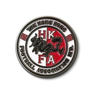

Come On Hong Kong!香港足球代表队官方打气歌
============================

|  |  |
| :--: | :-- |
| [ Come On Hong Kong!香港足球代表队官方打气歌](https://emumo.xiami.com/album/2103604656) | **艺人**: [Supper Moment](../index.md) **语种**: 粤语 **唱片公司**: Redline Music **发行时间**: 2013年09月10日 **专辑类别**: EP, 单曲 **专辑风格**: 粤语流行 Cantopop, 流行摇滚 Pop Rock **播放数**: 2836 **收藏数**: 9 **评论数**: 1  |

## 简介

2013年，Supper Moment为香港足球代表队主唱官方打气歌《Come On Hong Kong!》。 
香港勁揪！

## 曲目

## 评论

|  |  |  |
| :-- | :-- | :-- |
|  [虾米用户](https://emumo.xiami.com/u/10980652)   2018-04-07 14:22 赞(0) 踩(0) | 
几时发布？
 |
