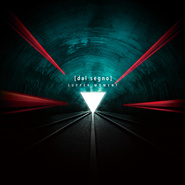

[dal segno]
============================

|  |  |
| :--: | :-- |
| [ [dal segno]](https://emumo.xiami.com/album/2103667671) | **艺人**: [Supper Moment](../index.md) **语种**: 粤语 **唱片公司**: 奇跡娱乐 **发行时间**: 2018年04月13日 **专辑类别**: 录音室专辑 **专辑风格**: 流行摇滚 Pop Rock, 粤语流行 Cantopop **播放数**: 1312549 **收藏数**: 561 **评论数**: 71  |

## 简介

2014 年发表了《世界变了样》大碟后，Supper Moment 四子踏上一条无尽旅途，展开了他们的“温柔革命”，让音乐红线把四人和大家连系起来。继 2016年的《The Moment》EP，违睽2年后终于带来全新专辑 [dal segno] 。四人用自己的音乐记录了这十二年来的点滴，感恩总有你们的支持。Supper Moment 带着全新大碟 [dal segno] ，期待和大家分享他们努力的成果。  
  
dal segno (连续记号，简称 D.S.)是乐谱符号，指示演奏乐章至“D.S.”后返回记号从头再奏。构思这个专辑时正是 Supper Moment 第十个年头，也是他们最重要的一个章节。Supper Moment的创作历程从 [dal segno] 从新出发，将最美好的呈现给大家。 

## 曲目

## 评论

|  |  |  |
| :-- | :-- | :-- |
|  [虾米用户](https://emumo.xiami.com/u/423338215)  2019-05-20 10:51 赞(1) 踩(0) | 
香港樂隊也有熱血的
 |
|  [虾米用户](https://emumo.xiami.com/u/255373139) 湿趴 kolor Mr.... 2019-03-25 11:01 赞(0) 踩(0) | 
你的音乐现场我总是跳得最疯颠
 |
|  [虾米用户](https://emumo.xiami.com/u/13078246) 新一年一起携手嘻哈！！！ 2019-03-06 13:20 赞(0) 踩(0) | 
sunny 我心目中的神级主唱
 |
|  [虾米用户](https://emumo.xiami.com/u/121658050)   2019-02-18 11:23 赞(0) 踩(0) | 
現場圈粉系列
 |
|  [虾米用户](https://emumo.xiami.com/u/243327035)  2019-02-09 01:49 赞(0) 踩(0) | 
神专
 |
|  [虾米用户](https://emumo.xiami.com/u/297287606)  2018-11-07 13:31 赞(0) 踩(0) | 
supper moment的歌一定要细心品味，每个旋律每个歌词每个节奏都非常用心！
 |
|  [虾米用户](https://emumo.xiami.com/u/41313413)   2018-11-06 19:58 赞(0) 踩(0) | 
❤️❤️✨
 |
|  [虾米用户](https://emumo.xiami.com/u/9628889) How about I ... 2018-11-06 12:10 赞(0) 踩(0) | 
我还在听
 |
|  [虾米用户](https://emumo.xiami.com/u/344026750) 我还没想好要写什么... 2018-11-04 11:32 赞(0) 踩(0) | 
❤️
 |
|  [虾米用户](https://emumo.xiami.com/u/9628889) How about I ... 2018-10-17 14:49 赞(0) 踩(0) | 
有厚度的大碟！！！好野！！！
 |
|  [虾米用户](https://emumo.xiami.com/u/50534943)  2018-05-29 16:29 赞(1) 踩(0) | 
来到我大珠海5.27那场真的大振奋人心啦，新专再encore飞，风筝仲有无尽，翻到屋企回味咗成晚，训教都霖紧现场个阵，刺激
 |
|  [虾米用户](https://emumo.xiami.com/u/38616721) 平凡女子一枚 2018-05-24 16:14 赞(2) 踩(0) | 
觉得新专辑里面多了后摇的元素。有新尝试系好事！
 |
|  [虾米用户](https://emumo.xiami.com/u/326003425)   2018-05-13 13:34 赞(0) 踩(0) | 
无尽 那张专已经开始很大胆 将创作摇滚延续下午
 |
|  [虾米用户](https://emumo.xiami.com/u/9969587)   2018-05-12 22:01 赞(2) 踩(0) | 
上海ModernSkyLAB现场归来！现场炒鸡好听！预祝年底红馆大卖！
 |
|  [虾米用户](https://emumo.xiami.com/u/44434340)   2018-05-02 12:56 赞(0) 踩(0) | 
港乐团崛起！！！
 |
| ⇒ |  [虾米用户](https://emumo.xiami.com/u/9667510)   2018-05-10 01:29 赞(0) 踩(0) | 
上一次听到这个评论的时候，那两个大团都开始谈出视线了，而SUPPRR也在用一首《不要死在崇拜里》道出了担忧或者说他们拒绝迎合&amp;ldquo;流行&amp;rdquo;的姿态。
 |
|  [虾米用户](https://emumo.xiami.com/u/300747859)   2018-04-28 23:51 赞(1) 踩(0) | 
橙海无敌 258激扬 同一励志
 |
|  [虾米用户](https://emumo.xiami.com/u/293398853) 港樂迷 2018-04-24 13:24 赞(0) 踩(0) | 
supper无敌
 |
|  [虾米用户](https://emumo.xiami.com/u/264994174) 排第一或排第二千四 2018-04-19 11:43 赞(1) 踩(0) | 
湿趴成都见！！！
 |
|  [虾米用户](https://emumo.xiami.com/u/18330272) 。 2018-04-18 14:12 赞(11) 踩(0) | 
请购入实体专辑收听Hidden Track：最后晚餐 (Acoustic Version)
 |
| ⇒ |  [虾米用户](https://emumo.xiami.com/u/5781632)  2019-06-08 03:40 赞(0) 踩(0) | 
这张专辑还能买到吗
 |
|  [虾米用户](https://emumo.xiami.com/u/10980652)   2018-04-17 11:39 赞(1) 踩(0) | 
新專隱藏咗一首新編版本嘅最後晚餐，好warm
 |
|  [虾米用户](https://emumo.xiami.com/u/334890780)  2018-04-16 23:52 赞(0) 踩(0) | 
挺好的啊好好听哦
 |
|  [虾米用户](https://emumo.xiami.com/u/47078213)  2018-04-16 17:59 赞(0) 踩(0) | 
好听~~有两首听出了铁树兰的感觉[哭笑]
 |
|  [虾米用户](https://emumo.xiami.com/u/327027981) 我还没想好要写什么... 2018-04-16 11:52 赞(0) 踩(0) | 
描畫你愛的愛  
 |
|  [虾米用户](https://emumo.xiami.com/u/6076438) 起身見頭暈，行路打倒褪。... 2018-04-16 01:42 赞(0) 踩(0) | 
0..0
 |
|  [虾米用户](https://emumo.xiami.com/u/1320669) ツ 2018-04-15 14:21 赞(0) 踩(0) | 
0.0
 |
|  [虾米用户](https://emumo.xiami.com/u/18551819) 撻著廣東歌 2018-04-15 10:57 赞(0) 踩(0) | 
好
 |
|  [虾米用户](https://emumo.xiami.com/u/37157775) 粤语歌种下程/哪个时势能... 2018-04-14 18:27 赞(0) 踩(0) | 
4.15MAO LIVEHOUSE 见
 |
|  [虾米用户](https://emumo.xiami.com/u/189625922) 这家伙很聪明什么也没留下... 2018-04-14 09:00 赞(1) 踩(0) | 
SUNHOUSE 今晚有无？
 |
|  [虾米用户](https://emumo.xiami.com/u/23660674) Bye 2018-04-14 03:15 赞(0) 踩(0) | 
现场更酷
 |
|  [虾米用户](https://emumo.xiami.com/u/49411332)   2018-04-13 23:52 赞(0) 踩(0) | 
湿趴出品 必属精品
 |
|  [虾米用户](https://emumo.xiami.com/u/7670022)   2018-04-13 15:08 赞(0) 踩(0) | 
有今晚去深圳A8的吗
 |
| ⇒ |  [虾米用户](https://emumo.xiami.com/u/11501857) 无定向丧心病狂杂食性 2018-04-13 16:28 赞(0) 踩(0) | 
有
 |
|  [虾米用户](https://emumo.xiami.com/u/773393) GALAXY 2018-04-13 14:49 赞(0) 踩(0) | 
专辑名都不会读orz
 |
| ⇒ |  [虾米用户](https://emumo.xiami.com/u/240841512) 又一次心醉酿成心碎 2018-04-17 00:21 赞(0) 踩(0) | 
谐音&amp;ldquo;大山油&amp;rdquo;
 |
|  [虾米用户](https://emumo.xiami.com/u/337839921)  2018-04-13 14:47 赞(0) 踩(0) | 
又上线了 
 |
|  [虾米用户](https://emumo.xiami.com/u/326775318)   2018-04-13 14:22 赞(0) 踩(0) | 
正
 |
|  [虾米用户](https://emumo.xiami.com/u/12688813)   2018-04-13 14:17 赞(0) 踩(0) | 
上了！
 |
|  [虾米用户](https://emumo.xiami.com/u/12260424) 暂无签名~ 2018-04-13 14:16 赞(0) 踩(0) | 
睇
 |
|  [虾米用户](https://emumo.xiami.com/u/41313413)   2018-04-11 14:26 赞(0) 踩(0) | 
呜呜，听不到新专，你地都去边听
 |
| ⇒ |  [虾米用户](https://emumo.xiami.com/u/316086854)  2018-04-12 13:28 赞(0) 踩(0) | 
qq音乐有
 |
|  [虾米用户](https://emumo.xiami.com/u/264139513)  2018-04-10 23:13 赞(2) 踩(0) | 
晚上来学校演出说再见了吧最后一曲    超好听！大丈夫也很好听！
 |
|  [虾米用户](https://emumo.xiami.com/u/35141236) 魚缸是我的敵人  2018-04-10 08:28 赞(0) 踩(0) | 
唔係騰訊解禁咗咩？
 |
|  [虾米用户](https://emumo.xiami.com/u/10626405) 我还没想好要写什么... 2018-04-09 17:42 赞(1) 踩(0) | 
好多专辑都无咗
 |
|  [虾米用户](https://emumo.xiami.com/u/3961242) ◔౪◔ 2018-04-09 17:35 赞(0) 踩(0) | 
哇，昨天忘了缓存下来啊。
 |
|  [虾米用户](https://emumo.xiami.com/u/258581506)  2018-04-09 12:30 赞(2) 踩(0) | 
点解变成QQ独家：（
 |
|  [虾米用户](https://emumo.xiami.com/u/336912606)  2018-04-09 08:20 赞(1) 踩(0) | 
今次q音乐独家 唔使等啦
 |
|  [虾米用户](https://emumo.xiami.com/u/243327035)  2018-04-08 23:10 赞(2) 踩(0) | 
激动地点开发现是灰色的&amp;hellip;&amp;hellip;
 |
|  [虾米用户](https://emumo.xiami.com/u/9185802)  2018-04-08 17:55 赞(0) 踩(0) | 
为什么听不到？
 |
|  [虾米用户](https://emumo.xiami.com/u/48928071) 我还没想好要写什么... 2018-04-08 17:36 赞(0) 踩(0) | 
终于来了
 |
|  [虾米用户](https://emumo.xiami.com/u/237337337) 中意音樂卻唔識音樂 2018-04-08 17:28 赞(0) 踩(0) | 
不能播放
 |
|  [虾米用户](https://emumo.xiami.com/u/2823008) 一个很瘦的人 @史太郎d... 2018-04-08 17:11 赞(0) 踩(0) | 
居然是灰色的&amp;hellip;&amp;hellip;
 |
|  [虾米用户](https://emumo.xiami.com/u/1375665)  2018-04-08 16:13 赞(0) 踩(0) | 
在哪里买？！
 |
|  [虾米用户](https://emumo.xiami.com/u/43636470) 业余选手 2018-04-08 16:03 赞(0) 踩(0) | 
等待已久 很精彩
 |
|  [虾米用户](https://emumo.xiami.com/u/3961242) ◔౪◔ 2018-04-08 15:52 赞(0) 踩(0) | 
喜欢橙海。
 |
|  [虾米用户](https://emumo.xiami.com/u/41322277)   2018-04-08 15:11 赞(0) 踩(0) | 
越来越钟意虾米了 
 |
|  [虾米用户](https://emumo.xiami.com/u/239494707) 从你的全世界路过…… 2018-04-08 14:40 赞(0) 踩(0) | 
最爱
 |
|  [虾米用户](https://emumo.xiami.com/u/10626405) 我还没想好要写什么... 2018-04-08 14:36 赞(1) 踩(0) | 
哇开心！虾米上架啦
 |
|  [虾米用户](https://emumo.xiami.com/u/117132340) 我还没想好要写什么... 2018-04-08 14:20 赞(0) 踩(0) | 
4.14见
 |
|  [虾米用户](https://emumo.xiami.com/u/337839921)  2018-04-08 14:20 赞(0) 踩(0) | 
哇，又要转回虾米了
 |
|  [虾米用户](https://emumo.xiami.com/u/2568762)  2018-04-08 14:19 赞(1) 踩(0) | 
4.15见
 |
|  [虾米用户](https://emumo.xiami.com/u/333879715) 我也算是正常，不敢梦与想... 2018-04-08 14:19 赞(0) 踩(0) | 
火钳刘明
 |
|  [虾米用户](https://emumo.xiami.com/u/4088577)   2018-04-08 14:19 赞(1) 踩(0) | 
Yeah
 |
|  [虾米用户](https://emumo.xiami.com/u/47329425) 恭喜你揾到我ฅ^•ﻌ•^... 2018-04-08 14:18 赞(0) 踩(0) | 
 
 |
|  [虾米用户](https://emumo.xiami.com/u/282913402) 窮一世心力換取一秒領略愛 2018-04-07 20:35 赞(0) 踩(0) | 
内容已删除
 |
| ⇒ |  [虾米用户](https://emumo.xiami.com/u/3851702) 爱我就给我看你的播放列表 2018-04-08 08:56 赞(0) 踩(0) | 
走好，不送
 |
|  [虾米用户](https://emumo.xiami.com/u/343747949)  2018-04-07 00:28 赞(0) 踩(0) | 
吊胃口真系 
 |
|  [虾米用户](https://emumo.xiami.com/u/114379552) 黑夜不再来 2018-04-06 20:09 赞(0) 踩(0) | 
keep住先
 |
|  [虾米用户](https://emumo.xiami.com/u/258581506)  2018-04-06 15:41 赞(1) 踩(0) | 
为何变成群星了 
 |
|  [虾米用户](https://emumo.xiami.com/u/240841512) 又一次心醉酿成心碎 2018-04-06 10:49 赞(1) 踩(0) | 
迷之华语群星？
 |
|  [虾米用户](https://emumo.xiami.com/u/52240727) 乐与苦同样无价 2018-04-06 07:51 赞(1) 踩(0) | 
橙海正爆
 |
