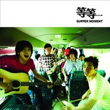

等等…
============================

|  |  |
| :--: | :-- |
| [ 等等…](https://emumo.xiami.com/album/393464) | **艺人**: [Supper Moment](../index.md) **语种**: 粤语 **唱片公司**: 奇跡娱乐 **发行时间**: 2010年07月19日 **专辑类别**: EP, 单曲 **专辑风格**: 粤语流行 Cantopop **播放数**: 1168997 **收藏数**: 180 **评论数**: 14  |

## 简介

2006年夏天，Supper Moment刚成立，当时的我们只希望在生活中可以有一些时间用音乐来点缀一下。慢慢开始遇到一些喜欢我们音乐的人，得到一些经历。有些人因我们而相识成为好朋友；有些人用我们的音乐去点缀他们的生活；有些人与我们分享他们对Supper Moment音乐的感觉；我们亦因为Supper Moment而得到了很多新朋友。因为Supper Moment，我们都得到了很多意外收获！  
  
2010年夏天，我们用了大半年时间，于自己Band房灌录了《等等…》这张唱片。《等等…》意思为「停下来，细尝生活中被省略了的」，正好用来总结我们过去四年所领略到的。正因为我们停了下来，用我们的Supper Moment去回味我们身边发生的事，化成音乐与大家分享，集结成这张唱片。

## 曲目

## 评论

|  |  |  |
| :-- | :-- | :-- |
|  [虾米用户](https://emumo.xiami.com/u/5732142) 。 2020-03-14 07:36 赞(0) 踩(0) | 
M
 |
|  [虾米用户](https://emumo.xiami.com/u/255373139) 湿趴 kolor Mr.... 2019-06-07 19:19 赞(0) 踩(0) | 
超级爱你地
 |
|  [虾米用户](https://emumo.xiami.com/u/4874420)   2018-10-16 17:23 赞(0) 踩(0) | 
少数喜欢的香港乐队之一，sunny声音很铿锵很有辨识度！
 |
|  [虾米用户](https://emumo.xiami.com/u/264994174) 排第一或排第二千四 2018-05-19 20:39 赞(0) 踩(0) | 
好正好正 越听越喜欢
 |
|  [虾米用户](https://emumo.xiami.com/u/36581239)  2014-11-28 19:01 赞(0) 踩(0) | 
聽得太多無盡和小伙子，都忘了一開始驚豔的supper moment和最後晚餐，今次還有新發現話別空氣 好像找不到他們更heavy的歌了
 |
| ⇒ |  [虾米用户](https://emumo.xiami.com/u/16255463)   2015-03-05 00:45 赞(0) 踩(0) | 
:)
 |
| ⇒ |  [虾米用户](https://emumo.xiami.com/u/16255463)   2015-03-05 00:45 赞(0) 踩(0) | 
<q><b>GaGaaaah说：</b></q>
 |
|  [虾米用户](https://emumo.xiami.com/u/38901302)  2014-09-30 01:08 赞(0) 踩(0) | 
好喜欢，循环
 |
|  [虾米用户](https://emumo.xiami.com/u/10040470)  2014-09-26 20:10 赞(0) 踩(0) | 
很不错得嗓音
 |
|  [虾米用户](https://emumo.xiami.com/u/5658010) 誒？誒，誒....誒誒！ 2014-09-25 21:07 赞(0) 踩(0) | 
很用心的 专辑~
 |
|  [虾米用户](https://emumo.xiami.com/u/11259253) 听靓歌 2014-08-27 17:23 赞(0) 踩(0) | 
不错。
 |
|  [虾米用户](https://emumo.xiami.com/u/8174832) 暂无签名~ 2014-07-13 21:49 赞(0) 踩(0) | 
最后晚餐幾正 ，尤其系純粹的結它
 |
|  [虾米用户](https://emumo.xiami.com/u/235916)  2011-08-29 13:28 赞(0) 踩(0) | 
Supper Moment 广州音乐会 演出调查！ 活动详情：<a href="http://www.douban.com/event/14493890/" target="_blank" rel="nofollow noreferrer noopener">http://www.douban.com/event/14493890/</a> 有兴趣的朋友麻烦登陆豆瓣点击参加！ 更多消息可关注微博：@粤血青年YouthCanton @Cather1ne凱瑟琳 @后青年木瓜 @后青年神不能法式湿吻
 |
|  [虾米用户](https://emumo.xiami.com/u/3725799) 我好想推薦你靈魂的收斂水 2011-08-28 10:46 赞(0) 踩(0) | 
正
 |
