Supper Moment
============================

|  |  |
| :--: | :-- |
| [ Supper Moment](https://i.xiami.com/suppermoment) | **播放数**: 10848129 **粉丝数**: 8728 **评论数**: 271 **地区**: Hong Kong, PRC 中国香港 **风格**: 流行摇滚 Pop Rock  |

## 档案

Supper Moment  的名字  ，  来自乐团成员对  ”   晚餐   ”  的态度。无论大家生活有多繁忙  ，  工作后回家与家人共进晚餐的时间  ，  往往是每天最窝心的时光  ，  但又有多少人有好好珍惜与家人每一日的  Supper Moment  ？ 
感情不单只有爱情，还有亲情、友情，诚如乐团的名字，希望以音乐让大家仔细品味感受身边的一切情感，让生命再次添上暖色情怀。 
乐团成员： 
陈仕燊         Sunny /     主唱、吉他 
梁耀鹏         Martin (    阿鸡    ) /     吉他 
张祖光         CK /     低音吉他 
陈鸿达         Hugh (    阿达    )/     鼓 
2006  年在香港成军的  Supper Moment  ，一开始只是  Sunny  、阿鸡、  CK  、阿达四个爱玩团的好朋友组团创作自己喜欢的音乐，一直到  2009  遇到他们的伯乐，经纪人为了他们成立红线音乐唱片公司，正式出道，发行第一张  EP  「等等  …  」。 
以充满活力与感染力的现场演出、温暖热情的歌声、正能量的歌词，触动了许许多多人的心；出道至今推出不少大热歌曲，包括「最后晚餐」、「小伙子」、「无尽」、「幸福之歌」等等，广受乐迷热爱欢迎，亦得到乐坛上诸多奖项肯定：  2015  及  2017  年获得  叱咤十大和叱咤组合金奖，亦连续四年得到观众票选的我最喜爱的组合奖；  2018  年更获得中文十大金曲的全球华人至尊金曲奖，成为现今香港最重要的乐团之一。 
Supper Moment  近年先后参与不同歌手如郑秀文、杨千嬅等天后的音乐创作。  2016  年为香港电影「点五步」演唱主题曲，为他们获得首个香港电影金像奖「最  佳原创电影歌曲奖」。同年，在香港湾仔会议展览中心举行组团以来最大型演唱会，他们从最初只有两个客人的餐厅演唱，一步一步努力耕耘音乐路，终于踏上了面向八千多名乐迷的大舞台。 
2017  年  Supper Moment  首次踏足欧洲  ，  在英国举行了两场满场小型音乐会。 
2018  年  ，  Supper Moment  推出第七张专辑   [dal segno]  ，  并先后在香港、北京、上海、成都、长沙、东莞、珠海和台北等多个城市举行新专辑发布音乐会。专辑象征他们十年过后在创作上，时时刻刻抱持着创新求变的精神，在市场与口碑上均大获佳绩。同年年底，四人终于踏上香港标志性场地  —  红磡体育馆，举行三场演唱会，两万多张票开售后迅速售罄秒杀，为乐团刻画了新的里程碑。 
将音乐带到世界，一直是四人的目标，演出足迹遍及东京、首尔、伦敦、悉尼  …  等不同城市。一路走来，这四个小伙子用了  13  年的时间探索音乐，并继续向外推展，希望把自己的音乐带到更远的地方，用音乐认识更多人，也感动更多心！

## 专辑

| 名称 | 语种 | 唱片公司 | 发行时间 | 专辑类别 | 专辑风格 |
| :--: | :-- | :-- | :-- | :-- | :-- |
| [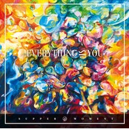 Everything Is You](./albums/5022269698.md) | 粤语 | 奇跡娱乐 | 2020年12月22日 | 录音室专辑 | 粤语流行 Cantopop |
| [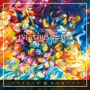 Everything Is You (国语版)](./albums/5022289181.md) | 国语 | 奇跡娱乐 | 2020年12月22日 | 录音室专辑 | 国语流行 Mandarin Pop |
| [ 波板糖](./albums/5022153528.md) | 粤语 | 杰威尔音乐 | 2020年12月14日 | EP, 单曲 | 粤语流行 Cantopop |
| [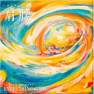 肩膀](./albums/5022138349.md) | 国语 | 杰威尔音乐 | 2020年12月14日 | EP, 单曲 | 国语流行 Mandarin Pop |
| [ 用呼吸栽种最艳美的花](./albums/5021996662.md) | 粤语 | 杰威尔音乐 | 2020年11月25日 | EP, 单曲 | 流行摇滚 Pop Rock |
| [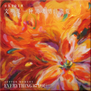 文明是一种灵魂里的蛮荒](./albums/5021984923.md) | 国语 | 杰威尔音乐 | 2020年11月25日 | EP, 单曲 | 流行摇滚 Pop Rock |
| [ 19 Moment](./albums/2105736538.md) | 粤语 | 奇迹音乐 | 2020年01月19日 | 录音室专辑 | 摇滚 Rock & Roll, 粤语流行 Cantopop |
| [ 点滴 (2019)](./albums/2105271109.md) | 粤语 | 奇迹音乐 | 2019年09月25日 | 录音室专辑 | 粤语流行 Cantopop |
| [ 寻回一碗汤 (2019)](./albums/2105156843.md) | 国语 | 奇跡娱乐 | 2019年08月16日 | EP, 单曲 |  |
| [ 无尽](./albums/2105043960.md) | 国语 | 奇跡娱乐 | 2019年08月02日 | 录音室专辑 |  |
| [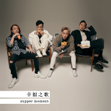 幸福之歌 (国语版)](./albums/2105002614.md) | 国语 | 奇跡娱乐 | 2019年07月22日 | EP, 单曲 |  |
| [ 一样不一样 (国语版)](./albums/2104928574.md) | 国语 | 奇跡娱乐 | 2019年06月07日 | EP, 单曲 | 摇滚 Rock & Roll |
| [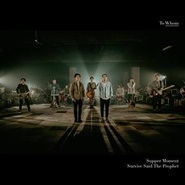 To Whom](./albums/2104362448.md) | 粤语 | 奇跡娱乐 | 2018年12月11日 | EP, 单曲 | 粤语流行 Cantopop |
| [ LOVE is NEARBY](./albums/2104366503.md) | 国语 | 后青年 | 2018年12月11日 | EP, 单曲 | 国语流行 Mandarin Pop |
| [ 撼动](./albums/2104042237.md) | 国语 | 奇跡娱乐 | 2018年09月21日 | EP, 单曲 |  |
| [ 橙海](./albums/2103799371.md) | 国语 | 奇跡娱乐 | 2018年07月13日 | EP, 单曲 | 流行摇滚 Pop Rock |
| [ [dal segno]](./albums/2103667671.md) | 粤语 | 奇跡娱乐 | 2018年04月13日 | 录音室专辑 | 流行摇滚 Pop Rock, 粤语流行 Cantopop |
| [ 不要死在崇拜里](./albums/2105057436.md) | 国语 | 奇跡娱乐 | 2018年02月12日 | EP, 单曲 |  |
| [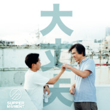 大丈夫](./albums/2105057469.md) | 国语 | 奇跡娱乐 | 2017年10月17日 | EP, 单曲 |  |
| [ 灵感床](./albums/2105057434.md) | 国语 | 奇跡娱乐 | 2017年07月19日 | EP, 单曲 |  |
| [ 说再见了吧](./albums/2105057433.md) | 国语 | 奇跡娱乐 | 2017年04月10日 | EP, 单曲 |  |
| [ 同一](./albums/2105057432.md) | 国语 | 奇跡娱乐 | 2016年10月03日 | EP, 单曲 |  |
| [ 沙燕之歌](./albums/2105057431.md) | 国语 | 奇跡娱乐 | 2016年08月09日 | EP, 单曲 |  |
| [ 啱数](./albums/2100348330.md) | 粤语 | 奇跡娱乐 | 2016年05月30日 | EP, 单曲 | 粤语流行 Cantopop |
| [ 一样不一样](./albums/2105057430.md) | 国语 | 奇跡娱乐 | 2016年05月03日 | EP, 单曲 |  |
| [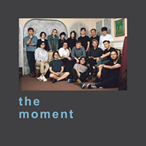 The Moment](./albums/32539748.md) | 粤语 | 奇跡娱乐 | 2016年01月30日 | EP, 单曲 | 粤语流行 Cantopop |
| [ 风筝](./albums/2105057428.md) | 国语 | 奇跡娱乐 | 2016年01月01日 | EP, 单曲 |  |
| [ 讨厌的我](./albums/298404509.md) | 粤语 | 奇跡娱乐 | 2015年12月04日 | EP, 单曲 | 粤语流行 Cantopop |
| [ 孤独先生](./albums/2105057427.md) | 国语 | 奇跡娱乐 | 2015年09月11日 | EP, 单曲 |  |
| [ 烦扰中起舞](./albums/2105057426.md) | 国语 | 奇跡娱乐 | 2015年07月03日 | EP, 单曲 |  |
| [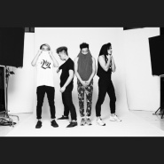 幸福之歌](./albums/2105057425.md) | 国语 | 奇跡娱乐 | 2015年05月22日 | EP, 单曲 |  |
| [ 世界变了样World Changed](./albums/1899256863.md) | 粤语 | 奇跡娱乐 | 2014年05月16日 | 录音室专辑 | 流行摇滚 Pop Rock |
| [ Come On Hong Kong!香港足球代表队官方打气歌](./albums/2103604656.md) | 粤语 | Redline Music | 2013年09月10日 | EP, 单曲 | 粤语流行 Cantopop, 流行摇滚 Pop Rock |
| [ 小伙子出城记](./albums/558894.md) | 粤语 | 奇跡娱乐 | 2012年11月23日 | EP, 单曲 | 粤语流行 Cantopop |
| [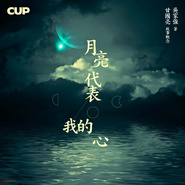 月亮代表我的心](./albums/2100206506.md) | 国语 | Redline Music | 2012年09月29日 | EP, 单曲 |  |
| [ 再次心跳](./albums/459168.md) | 粤语 | 奇跡娱乐 | 2011年08月11日 | 录音室专辑 | 粤语流行 Cantopop |
| [ AAA](./albums/424811.md) | 粤语 | Redline Music | 2010年11月30日 | EP, 单曲 | 粤语流行 Cantopop |
| [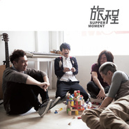 旅程](./albums/415043.md) | 粤语 | 奇跡娱乐 | 2010年11月24日 | EP, 单曲 | 粤语流行 Cantopop |
| [ 等等…](./albums/393464.md) | 粤语 | 奇跡娱乐 | 2010年07月19日 | EP, 单曲 | 粤语流行 Cantopop |

## 评论

|  |  |  |  |
| :-- | :-- | :-- | :-- |
|  [虾米用户](https://emumo.xiami.com/u/39160915) 怀着乐观总有转机 2020-11-24 21:40 赞(0) 踩(0) | 
跪求新歌
 |
|  [虾米用户](https://emumo.xiami.com/u/933157) 泥豪啊同志！ 2020-09-02 00:18 赞(1) 踩(0) | 
已
 |
|  [虾米用户](https://emumo.xiami.com/u/362083809) 尘归尘 2020-07-17 22:11 赞(0) 踩(0) | 
干巴爹
 |
|  [虾米用户](https://emumo.xiami.com/u/379162683) 我想要记住你们，我想要你... 2020-05-01 15:59 赞(0) 踩(0) | 

 |
|  [虾米用户](https://emumo.xiami.com/u/7014158)  2020-02-20 01:33 赞(0) 踩(0) | 
supper moment真的很棒
 |
|  [虾米用户](https://emumo.xiami.com/u/218542478)  2020-02-07 21:24 赞(0) 踩(0) | 
顺尼高音，阿鸡中音，祖光低音，阿达合音。supper moment，苏泊尔莫汶特。
 |
|  [虾米用户](https://emumo.xiami.com/u/7676740) 没关系。 2019-12-24 00:52 赞(3) 踩(0) | 
新公告新专辑 - 湿鸠毛文    
 |
| ⇒ |  [虾米用户](https://emumo.xiami.com/u/54471584)  2020-03-13 15:33 赞(0) 踩(0) | 
点解你可以甘优秀的。
 |
| ⇒ |  [虾米用户](https://emumo.xiami.com/u/7676740) 没关系。 2020-03-13 20:13 赞(0) 踩(0) | 
<q><b>D.N-Hunter.说：</b></q>
 |
|  [虾米用户](https://emumo.xiami.com/u/326454264)  2019-12-06 00:56 赞(0) 踩(0) | 
看不到主页
 |
|  [虾米用户](https://emumo.xiami.com/u/267110104) 掌心因此多出一根刺，没有... 2019-08-05 23:17 赞(0) 踩(0) | 
超惊喜！今天上新这么多，慢慢听慢慢品，要加油呀！
 |
|  [虾米用户](https://emumo.xiami.com/u/49637572) 看到我写的评论@下我 我... 2019-06-16 23:09 赞(1) 踩(0) | 
佛山站还有半个月 激动 小声说不要那么多首国语
 |
| ⇒ |  [虾米用户](https://emumo.xiami.com/u/237272616) 我还没想好要写什么... 2019-06-27 00:19 赞(0) 踩(0) | 
盲猜有 一样不一样国语版没所谓，照high 哈哈哈哈哈哈
 |
| ⇒ |  [虾米用户](https://emumo.xiami.com/u/2513089) don't treat ... 2019-07-09 23:28 赞(0) 踩(0) | 
<q><b>周不时.说：</b></q>
 |
|  [虾米用户](https://emumo.xiami.com/u/3425353)  2019-06-08 23:37 赞(0) 踩(0) | 
棒！ 有点像年轻时候的beyond 好好干 不错的！
 |
|  [虾米用户](https://emumo.xiami.com/u/250950037) 踏上这无尽旅途 2019-05-02 15:20 赞(0) 踩(0) | 
歌都好听
 |
|  [虾米用户](https://emumo.xiami.com/u/8101492) 落日秋山孤柏，寒夜路冷风... 2019-03-19 10:11 赞(2) 踩(0) | 
不像独立音乐，标准的香港流行曲风。我话讲完，边个赞成？边个反对？
 |
| ⇒ |  [虾米用户](https://emumo.xiami.com/u/243327035)  2019-06-04 00:39 赞(0) 踩(0) | 
净係听红嘅几首就梗係流行风喇 又唔听晒专辑有punk有metal 同埋人地本身就无话自己几独立 一直都係流行摇滚 係去流行乐坛颁奖典礼摞最受欢迎乐队奖嘅band
 |
| ⇒ |  [虾米用户](https://emumo.xiami.com/u/5781632)  2019-06-08 03:34 赞(0) 踩(0) | 
我反对！
 |
| ⇒ |  [虾米用户](https://emumo.xiami.com/u/6726118) halo 2019-10-15 19:21 赞(0) 踩(0) | 
<q><b>Rebecca_YYi说：</b></q>
 |
|  [虾米用户](https://emumo.xiami.com/u/421269372)  2019-03-18 11:07 赞(0) 踩(0) | 

 |
|  [虾米用户](https://emumo.xiami.com/u/26966315) 家會為你開 永遠為你等待 2019-03-12 01:13 赞(0) 踩(0) | 
現場正爆！ #大奇蹟日
 |
|  [虾米用户](https://emumo.xiami.com/u/49637572) 看到我写的评论@下我 我... 2019-02-24 21:20 赞(1) 踩(0) | 
寻晚系澳门睇完show啦
 |
|  [虾米用户](https://emumo.xiami.com/u/22495624) 黎明的那道光~会越过黑暗... 2019-01-22 17:49 赞(1) 踩(0) | 
好听，加油哦⊙∀⊙！
 |
|  [虾米用户](https://emumo.xiami.com/u/350812006) 心情不好的時候聽聽歌 2018-12-08 15:59 赞(0) 踩(0) | 
大愛 支持     
 |
|  [虾米用户](https://emumo.xiami.com/u/8285218)  2018-12-02 14:17 赞(0) 踩(0) | 
下年2月SUPPER澳门场，12月5日开始在KLOOK独家优先卖票喔！有人一起去吗？
 |
|  [虾米用户](https://emumo.xiami.com/u/10980652)   2018-11-29 08:59 赞(0) 踩(0) | 
新歌the whom和love is nearby发布未？
 |
|  [虾米用户](https://emumo.xiami.com/u/98863258) 港樂愛好者 菇徒 2018-11-27 14:04 赞(0) 踩(0) | 
中文译名：饭点时间
 |
| ⇒ |  [虾米用户](https://emumo.xiami.com/u/3812784)  2019-02-26 21:20 赞(0) 踩(0) | 
改病句：语义重复www
 |
|  [虾米用户](https://emumo.xiami.com/u/379830295) 不会经常回来了 ，网易云... 2018-11-23 00:29 赞(2) 踩(0) | 
偷偷发现了一个好喜欢的粤语组合，才不要分享给别人呢
 |
|  [虾米用户](https://emumo.xiami.com/u/47494497) 李志、陈升，“虾米也没有... 2018-11-21 23:43 赞(0) 踩(0) | 
get
 |
|  [虾米用户](https://emumo.xiami.com/u/9582561) 静静听歌 2018-11-17 14:59 赞(0) 踩(0) | 
遇到好的音乐人，我只想自己一人静静欣赏，才不分享给别人，就是这么自私 
 |
|  [虾米用户](https://emumo.xiami.com/u/293142259) 若我還是不回來 就把我靈... 2018-11-05 03:44 赞(1) 踩(0) | 
你們終於上到紅館喇
 |
|  [虾米用户](https://emumo.xiami.com/u/5884394) rizar 2018-11-03 06:59 赞(1) 踩(0) | 
尾場演唱會。我等左10年啦。成軍10年的時候買不到票。今次，我可入場做個濕扒人～哭
 |
|  [虾米用户](https://emumo.xiami.com/u/9582561) 静静听歌 2018-10-31 21:38 赞(1) 踩(0) | 
经常到这里来给自己充电，充充正能量 
 |
|  [虾米用户](https://emumo.xiami.com/u/4228451) 886 2018-10-30 17:23 赞(0) 踩(0) | 
To whom仲未有？
 |
|  [虾米用户](https://emumo.xiami.com/u/118122530) 我还没想好要写什么... 2018-10-01 21:13 赞(0) 踩(0) | 
看烟花来打卡
 |
|  [虾米用户](https://emumo.xiami.com/u/81512146)  2018-09-26 10:21 赞(0) 踩(0) | 
11月红馆有冇内地朋友一起港深高铁 
 |
|  [虾米用户](https://emumo.xiami.com/u/337839921)  2018-09-11 08:16 赞(0) 踩(0) | 
没
 |
|  [虾米用户](https://emumo.xiami.com/u/259069578)  2018-07-13 23:16 赞(0) 踩(0) | 
很开心之前去了长沙红馆的演唱会，距离真的很近了，都能看见你们的汗水！
 |
|  [虾米用户](https://emumo.xiami.com/u/339191478)   2018-06-08 19:29 赞(0) 踩(0) | 
:-)
 |
|  [虾米用户](https://emumo.xiami.com/u/7399498) I remain in ... 2018-05-06 02:47 赞(1) 踩(0) | 
想約死黨一起去拒地concert 唔知道這個會實現還是願望呢
 |
|  [虾米用户](https://emumo.xiami.com/u/334890780)  2018-04-17 00:10 赞(0) 踩(0) | 
 
 |
|  [虾米用户](https://emumo.xiami.com/u/6076438) 起身見頭暈，行路打倒褪。... 2018-04-16 01:44 赞(0) 踩(0) | 
0..0
 |
|  [虾米用户](https://emumo.xiami.com/u/212848793) 热带的悲伤少女 2018-04-12 17:49 赞(0) 踩(0) | 
哦哦
 |
|  [虾米用户](https://emumo.xiami.com/u/16704874) ⚠️ 2018-03-26 00:02 赞(2) 踩(0) | 
后青年现场被圈粉
 |
|  [虾米用户](https://emumo.xiami.com/u/333048715)  2018-03-25 20:25 赞(3) 踩(0) | 
太鐘意sunny把聲 香港樂隊最喜歡beyond、supper moment同Tonick 
 |
|  [虾米用户](https://emumo.xiami.com/u/3961242) ◔౪◔ 2018-03-19 23:38 赞(0) 踩(0) | 
+u!
 |
|  [虾米用户](https://emumo.xiami.com/u/18330272) 。 2018-02-22 00:18 赞(0) 踩(0) | 
<a href="http://imgcache.wechat.com/music/joox/photo_hk/mid_singer_1000/9/0/f949b1fcb8d02cc7175bd0ec7fcd6e90.jpg" target="_blank" rel="nofollow noreferrer noopener">http://imgcache.wechat.com/music/joox/photo_hk/mid_singer_1000/9/0/f949b1fcb8d02cc7175bd0ec7fcd6e90.jpg</a>
 |
|  [虾米用户](https://emumo.xiami.com/u/255562871)  2018-02-21 21:30 赞(0) 踩(0) | 
like
 |
|  [虾米用户](https://emumo.xiami.com/u/46583488)  2018-02-12 21:01 赞(0) 踩(0) | 
<a href="https://www.kkbox.com/sg/en/album/hO91btGkGmoTn0F1u0n6009H-index.html" target="_blank" rel="nofollow noreferrer noopener">https://www.kkbox.com/sg/en/album/hO91btGkGmoTn0F1u0n6009H-index.html</a>2018/Feb/【不要死在崇拜裡】
 |
|  [虾米用户](https://emumo.xiami.com/u/1411759) 你为什么一脸严肃 2018-01-28 10:19 赞(0) 踩(0) | 
今晚见
 |
|  [虾米用户](https://emumo.xiami.com/u/261332301) 我还没想好要写什么... 2018-01-14 22:42 赞(2) 踩(0) | 
叱咤三十年打卡
 |
|  [虾米用户](https://emumo.xiami.com/u/282084907)  2018-01-03 19:58 赞(0) 踩(0) | 
加油
 |
|  [虾米用户](https://emumo.xiami.com/u/307499632) 这家伙很聪明什么也没留下... 2018-01-02 00:26 赞(1) 踩(0) | 
恭喜Supper Moment！！！
 |
|  [虾米用户](https://emumo.xiami.com/u/293929294)   2017-12-21 23:42 赞(0) 踩(0) | 
我是第5579个粉丝
 |
|  [虾米用户](https://emumo.xiami.com/u/430169)  2017-12-07 22:05 赞(1) 踩(0) | 
应该是称我们才合适吧?
 |
|  [虾米用户](https://emumo.xiami.com/u/260671903)  2017-11-20 13:54 赞(0) 踩(0) | 
大丈夫仲未买到？
 |
|  [虾米用户](https://emumo.xiami.com/u/18172461)  2017-11-10 22:44 赞(0) 踩(0) | 
新歌呢
 |
|  [虾米用户](https://emumo.xiami.com/u/88917892)  2017-10-14 03:14 赞(0) 踩(0) | 
香港乐队中始终都系 supermoment系心头爱  希望你们得到更多认可
 |
|  [虾米用户](https://emumo.xiami.com/u/10980652)   2017-10-10 12:54 赞(1) 踩(0) | 
大丈夫上架未？ 
 |
| ⇒ |  [虾米用户](https://emumo.xiami.com/u/275347399) 我还没想好要写什么... 2017-10-10 15:19 赞(0) 踩(0) | 
刚刚上903度看到，派紧台，过几天应该有的听吧
 |
|  [虾米用户](https://emumo.xiami.com/u/18551819) 撻著廣東歌 2017-10-03 22:59 赞(0) 踩(0) | 
好
 |
|  [虾米用户](https://emumo.xiami.com/u/307499632) 这家伙很聪明什么也没留下... 2017-07-13 01:23 赞(0) 踩(0) | 
我地等出年啦嘻嘻
 |
|  [虾米用户](https://emumo.xiami.com/u/307499632) 这家伙很聪明什么也没留下... 2017-07-13 01:23 赞(0) 踩(0) | 
濕趴跟住去成都台灣啊，今年估計好忙。
 |
| ⇒ |  [虾米用户](https://emumo.xiami.com/u/118459710)  2017-08-11 23:23 赞(0) 踩(0) | 
去台湾啊？？求问！是什么时候啊？？
 |
|  [虾米用户](https://emumo.xiami.com/u/307499632) 这家伙很聪明什么也没留下... 2017-07-13 01:22 赞(0) 踩(0) | 
sunny話下年要開演唱會啦，我地一齊去啦 
 |
|  [虾米用户](https://emumo.xiami.com/u/10980652)   2017-07-12 14:36 赞(1) 踩(0) | 
supper moment出新歌灵感床 啦。虾米音乐还会上架吗？ 
 |
|  [虾米用户](https://emumo.xiami.com/u/284422347)   2017-05-27 22:16 赞(1) 踩(0) | 
依然在成都等着
 |
| ⇒ |  [虾米用户](https://emumo.xiami.com/u/24838376) ++++++++++++ 2017-05-29 16:41 赞(0) 踩(0) | 
一起等啊 等得心焦 不过PY说不出意外可能会有铁树兰的内陆巡演。
 |
| ⇒ |  [虾米用户](https://emumo.xiami.com/u/284422347)   2017-05-29 20:43 赞(0) 踩(0) | 
<q><b>Heggs说：</b></q>
 |
| ⇒ |  [虾米用户](https://emumo.xiami.com/u/24838376) ++++++++++++ 2017-05-29 23:30 赞(0) 踩(0) | 
<q><b>蝗虫号说：</b></q>
 |
|  [虾米用户](https://emumo.xiami.com/u/49748006) Fly me to th... 2017-05-14 16:23 赞(0) 踩(0) | 
:)
 |
|  [虾米用户](https://emumo.xiami.com/u/304693)  2017-05-13 19:08 赞(1) 踩(0) | 
有实力商业就理所当然,张学友系环球既,一年唱一两百场首首老歌都唔觉得商业,MR一年出一只碟都觉得距多,呢个系越出越无好歌既问题,Dear Jane、Supper Moment 、出歌慢但有精品,连RubberBand出歌甘快品质都仲系度,呢几支队都同MR差唔多时期了挂,我讲既商业变质系甘解,你讲既过程一对比翻就出晒黎啦!就虾米唔计电台我听过4万几首歌,听MR系第二多,09年开始听距地,所以我甘讲并不是多旧鱼噶,傻西!
 |
|  [虾米用户](https://emumo.xiami.com/u/10980652)   2017-04-05 06:51 赞(0) 踩(0) | 
说再见了吧？虾米音乐还会发布上架吗？
 |
| ⇒ |  [虾米用户](https://emumo.xiami.com/u/288283456)  For the Emp... 2017-04-14 01:37 赞(0) 踩(0) | 
已經上了
 |
| ⇒ |  [虾米用户](https://emumo.xiami.com/u/10980652)   2017-04-14 19:38 赞(0) 踩(0) | 
<q><b>LkKit说：</b></q>
 |
|  [虾米用户](https://emumo.xiami.com/u/51899014)  2017-03-20 23:10 赞(0) 踩(0) | 
機械人
 |
|  [虾米用户](https://emumo.xiami.com/u/47329425) 恭喜你揾到我ฅ^•ﻌ•^... 2017-02-23 17:57 赞(0) 踩(0) | 
正正正❤️
 |
|  [虾米用户](https://emumo.xiami.com/u/8447203) 暂无签名~ 2017-02-08 11:34 赞(0) 踩(0) | 
什么时候有演出 好想听现场
 |
|  [虾米用户](https://emumo.xiami.com/u/261473384)  2017-01-14 00:09 赞(0) 踩(0) | 
sunny啊sunny
 |
|  [虾米用户](https://emumo.xiami.com/u/8488607) 要说身材，没有身材；要说... 2016-12-31 10:29 赞(0) 踩(0) | 
love u all
 |
|  [虾米用户](https://emumo.xiami.com/u/7399498) I remain in ... 2016-12-17 22:03 赞(1) 踩(0) | 
已經排入有生之年睇現場嘎list入面.
 |
|  [虾米用户](https://emumo.xiami.com/u/10980652)   2016-12-08 18:31 赞(0) 踩(0) | 
supper moment歌曲虾米音乐不会同步上架了吗？
 |
|  [虾米用户](https://emumo.xiami.com/u/53789266) Alex 2016-11-13 03:30 赞(0) 踩(0) | 
深圳有唔？
 |
|  [虾米用户](https://emumo.xiami.com/u/49637572) 看到我写的评论@下我 我... 2016-11-07 17:21 赞(0) 踩(0) | 
十周年在香港湾仔会展中心 去不了
 |
|  [虾米用户](https://emumo.xiami.com/u/9029590) 享受着他钟情的音乐 2016-11-06 21:57 赞(0) 踩(0) | 
听晚见
 |
|  [虾米用户](https://emumo.xiami.com/u/10980652)   2016-10-14 18:26 赞(0) 踩(0) | 
等同一发布啊，温柔革命十周年supper moment。每年都有首最热血感动的歌曲出现 
 |
| ⇒ |  [虾米用户](https://emumo.xiami.com/u/214488498)  2016-10-23 03:07 赞(0) 踩(0) | 
同一JOOX可以听，哈哈，已经买了温柔革命的票了
 |
|  [虾米用户](https://emumo.xiami.com/u/41313413)   2016-08-31 19:56 赞(0) 踩(0) | 
⁽⁽٩( ´͈ ᗨ `͈ )۶⁾⁾
 |
|  [虾米用户](https://emumo.xiami.com/u/49732332)  2016-07-18 02:47 赞(0) 踩(0) | 
 等你们再来成都
 |
| ⇒ |  [虾米用户](https://emumo.xiami.com/u/284422347)   2017-05-27 22:15 赞(0) 踩(0) | 
一样
 |
|  [虾米用户](https://emumo.xiami.com/u/9029590) 享受着他钟情的音乐 2016-05-25 16:18 赞(1) 踩(0) | 
求上啱数！！
 |
|  [虾米用户](https://emumo.xiami.com/u/18985669) 悲观过界 2016-04-15 19:55 赞(0) 踩(0) | 
一样不一样..
 |
|  [虾米用户](https://emumo.xiami.com/u/12062855) Halo 2016-04-09 22:23 赞(0) 踩(0) | 
热血结霜了吗
 |
|  [虾米用户](https://emumo.xiami.com/u/7032511)  2016-02-24 12:58 赞(2) 踩(0) | 
听《无尽》和《幸福之歌》十分感动，真的被感动到流泪了，大爱Supper Moment！！！
 |
|  [虾米用户](https://emumo.xiami.com/u/22383888) 没什么是不可能的。 2016-02-15 14:47 赞(0) 踩(0) | 
最後晚餐不錯～
 |
|  [虾米用户](https://emumo.xiami.com/u/84571136) 唯有音乐不离不弃 2016-01-11 19:35 赞(0) 踩(0) | 
<a href="https://itunes.apple.com/mo/album/feng-zheng-single/id1068722173#" target="_blank" rel="nofollow noreferrer noopener">https://itunes.apple.com/mo/album/feng-zheng-single/id1068722173#</a>
 |
|  [虾米用户](https://emumo.xiami.com/u/84571136) 唯有音乐不离不弃 2016-01-11 19:34 赞(0) 踩(0) | 
Supper Moment – 風箏
 |
|  [虾米用户](https://emumo.xiami.com/u/10980652)   2016-01-09 23:13 赞(1) 踩(0) | 
还有一首风筝意外在其它音乐软件听到，希望supper moment在虾米发布
 |
|  [虾米用户](https://emumo.xiami.com/u/98109564) 我还没想好要写什么... 2016-01-09 08:52 赞(0) 踩(0) | 
中意呢种感觉，太正了 ...
 |
|  [虾米用户](https://emumo.xiami.com/u/10980652)   2016-01-08 23:52 赞(0) 踩(0) | 
新专辑还有其他歌曲等住发布和上架。继续加油，supper moment
 |
|  [虾米用户](https://emumo.xiami.com/u/5059731) 感谢永远有歌把心境道破 2016-01-06 13:33 赞(0) 踩(0) | 
听幸福之歌听到泪目&amp;gt;&amp;lt;
 |
|  [虾米用户](https://emumo.xiami.com/u/3073763) 我还没想好要写什么... 2016-01-02 14:13 赞(0) 踩(0) | 
叱咤903颁奖live好掂下喔
 |
|  [虾米用户](https://emumo.xiami.com/u/45485152) Wubba lubba ... 2015-12-29 01:06 赞(2) 踩(0) | 
只为在虾米中多看你一眼
 |
|  [虾米用户](https://emumo.xiami.com/u/18583250) 講嘢 2015-12-27 02:23 赞(0) 踩(0) | 

 |
|  [虾米用户](https://emumo.xiami.com/u/60332256) 我等春雷 来提醒你爱谁 2015-12-05 12:20 赞(0) 踩(0) | 
Alex的最爱
 |
|  [虾米用户](https://emumo.xiami.com/u/6867621)  2015-11-29 11:28 赞(0) 踩(0) | 
下架…
 |
|  [虾米用户](https://emumo.xiami.com/u/86515696) 原南武7班 原3中高一1... 2015-11-26 12:53 赞(0) 踩(0) | 
新歌係邊度有得聽啊
 |
|  [虾米用户](https://emumo.xiami.com/u/9482905) 粤语 2015-11-09 03:32 赞(1) 踩(0) | 
新专辑什么时候发布
 |
|  [虾米用户](https://emumo.xiami.com/u/50620151)  2015-11-07 12:56 赞(0) 踩(0) | 
sunny sunny
 |
|  [虾米用户](https://emumo.xiami.com/u/7676740) 没关系。 2015-11-02 02:23 赞(1) 踩(0) | 
good night 听完现场睡不着了
 |
|  [虾米用户](https://emumo.xiami.com/u/3961242) ◔౪◔ 2015-10-26 19:06 赞(0) 踩(0) | 
加油啊！！！
 |
|  [虾米用户](https://emumo.xiami.com/u/13164745)   2015-10-24 11:51 赞(0) 踩(0) | 
距刚入驻了虾米音乐人，欢迎大家来距的个人主页，收听距的最新音乐
 |
|  [虾米用户](https://emumo.xiami.com/u/1728101) 离线 2015-10-16 21:49 赞(0) 踩(0) | 
大飞走起！
 |
|  [虾米用户](https://emumo.xiami.com/u/46479219)  2015-10-13 17:28 赞(0) 踩(0) | 
支持你
 |
|  [虾米用户](https://emumo.xiami.com/u/9899279) 我的生命不过是温柔的疯狂 2015-10-05 18:34 赞(1) 踩(0) | 
很有个性 支持小众音乐  加油！
 |
|  [虾米用户](https://emumo.xiami.com/u/11546454) set me free 2015-10-03 19:17 赞(1) 踩(0) | 
Sunny
 |
|  [虾米用户](https://emumo.xiami.com/u/20147189) 嘘 2015-10-03 02:16 赞(0) 踩(0) | 
明天海边！
 |
|  [虾米用户](https://emumo.xiami.com/u/17553369) 对待音乐须要有敬畏的态度... 2015-10-02 12:39 赞(0) 踩(0) | 
四海一家 看到香港如此有活力的band在虾米分享他们音乐创作 充满了期待 加油
 |
|  [虾米用户](https://emumo.xiami.com/u/4744259) 喜欢萌的事物 WeCha... 2015-10-02 02:11 赞(0) 踩(0) | 
怎样买票？急问，不想百度
 |
|  [虾米用户](https://emumo.xiami.com/u/7676740) 没关系。 2015-09-26 10:21 赞(1) 踩(0) | 
顺德北滘走起来 :)
 |
|  [虾米用户](https://emumo.xiami.com/u/43419619) 没法在做那些牵挂，比不上... 2015-09-16 00:00 赞(0) 踩(0) | 
真的好棒！加油啊
 |
|  [虾米用户](https://emumo.xiami.com/u/52764679)  2015-09-08 23:23 赞(0) 踩(0) | 
几时来广州 
 |
|  [虾米用户](https://emumo.xiami.com/u/52764679)  2015-09-08 23:23 赞(0) 踩(0) | 
几时来广州 
 |
|  [虾米用户](https://emumo.xiami.com/u/7573985) 喜欢愉快的节奏 2015-09-01 21:05 赞(0) 踩(0) | 
等新歌
 |
|  [虾米用户](https://emumo.xiami.com/u/6867621)  2015-09-01 17:00 赞(0) 踩(0) | 
快快再来广州
 |
|  [虾米用户](https://emumo.xiami.com/u/4803352) 告世间昂然的我复还 2015-09-01 08:57 赞(1) 踩(0) | 
我心中最好的香港乐队，加油国庆见。
 |
| ⇒ |  [虾米用户](https://emumo.xiami.com/u/31471926)   2015-09-20 16:09 赞(0) 踩(0) | 
国庆？有演出？
 |
| ⇒ |  [虾米用户](https://emumo.xiami.com/u/4803352) 告世间昂然的我复还 2015-09-20 16:27 赞(0) 踩(0) | 
<q><b>AlexLee说：</b></q>
 |
| ⇒ |  [虾米用户](https://emumo.xiami.com/u/4803352) 告世间昂然的我复还 2015-09-20 16:27 赞(0) 踩(0) | 
<q><b>AlexLee说：</b></q>
 |
| ⇒ |  [虾米用户](https://emumo.xiami.com/u/31471926)   2015-09-20 17:06 赞(0) 踩(0) | 
<q><b>惨绿青年说：</b></q>
 |
| ⇒ |  [虾米用户](https://emumo.xiami.com/u/4803352) 告世间昂然的我复还 2015-09-20 17:18 赞(0) 踩(0) | 
<q><b>AlexLee说：</b></q>
 |
| ⇒ |  [虾米用户](https://emumo.xiami.com/u/31471926)   2015-09-22 03:01 赞(0) 踩(0) | 
<q><b>惨绿青年说：</b></q>
 |
|  [虾米用户](https://emumo.xiami.com/u/16255463) @Revolution9... 2015-08-18 15:35 赞(1) 踩(0) | 
又可以见到你们了 国庆见 
 |
| ⇒ |  [虾米用户](https://emumo.xiami.com/u/52764679)  2015-09-08 23:23 赞(0) 踩(0) | 
点解噶.?
 |
|  [虾米用户](https://emumo.xiami.com/u/48951889)  2015-07-15 20:39 赞(0) 踩(0) | 
我會一輩子支持你
 |
|  [虾米用户](https://emumo.xiami.com/u/24585194)  2015-07-13 13:58 赞(0) 踩(0) | 
猴耶
 |
|  [虾米用户](https://emumo.xiami.com/u/7128761)  2015-06-29 18:40 赞(1) 踩(0) | 
好耐冇聽過如此熱血的廣東歌。
 |
| ⇒ |  [虾米用户](https://emumo.xiami.com/u/24585194)  2015-07-13 13:59 赞(0) 踩(0) | 
内猴
 |
|  [虾米用户](https://emumo.xiami.com/u/7351099) let‘s rock.. 2015-06-18 19:43 赞(1) 踩(0) | 
幸福之歌好好听~
 |
|  [虾米用户](https://emumo.xiami.com/u/10980652)   2015-05-29 22:59 赞(1) 踩(0) | 
又换头像啦，supper moment是种新生代的正能量粤语正band。坚持做自己的风格，都更爱铁树兰另一种声音。
 |
|  [虾米用户](https://emumo.xiami.com/u/50349526)  2015-05-26 15:32 赞(0) 踩(0) | 
也许我们不能无所不能，但会竭尽所能。你说的，我永远都会记得！我会默默陪着你们去看这个世界更多的期待。总有一个人坚定的支持你们，永远。supper moment，加油！不可取代！
 |
|  [虾米用户](https://emumo.xiami.com/u/50077061) music 2015-05-25 16:43 赞(0) 踩(0) | 
喜欢这个调调
 |
|  [虾米用户](https://emumo.xiami.com/u/304693)  2015-05-16 23:42 赞(60) 踩(0) | 
乐队就应该坚持自己风格，拒绝商业化变质，MR我觉得就变质得好快
 |
| ⇒ |  [虾米用户](https://emumo.xiami.com/u/42113356) @ElectionicC... 2015-05-26 09:17 赞(0) 踩(0) | 
说得对，我也觉得mr已经变了～
 |
| ⇒ |  [虾米用户](https://emumo.xiami.com/u/21575157)   2015-07-12 13:42 赞(0) 踩(0) | 
我认同，作品在乎贵精不贵多。有时你想用力抓紧一些东西，反而留走得更快，如果与之并肩而行，不快不慢，反而有理想效果。
 |
| ⇒ |  [虾米用户](https://emumo.xiami.com/u/198174249)   2016-09-16 23:39 赞(0) 踩(0) | 
唔商业化 你养佢地啊？ 觉得好听就听 唔好听咪唔听咯 唔好点评咁多
 |
| ⇒ |  [虾米用户](https://emumo.xiami.com/u/251783656)  2017-05-13 12:55 赞(0) 踩(0) | 
你都多9余的，MR开始就签环球，开始就已经非常商业，根本不存在什么商业化的过程。
 |
| ⇒ |  [虾米用户](https://emumo.xiami.com/u/18551819) 撻著廣東歌 2017-10-03 22:59 赞(0) 踩(0) | 
多余，居然咁多人点赞。
 |
| ⇒ |  [虾米用户](https://emumo.xiami.com/u/328132867)  2017-10-19 10:41 赞(0) 踩(0) | 
正一傻闟
 |
| ⇒ |  [虾米用户](https://emumo.xiami.com/u/49732720) 能否融化在心里 2017-10-28 00:06 赞(0) 踩(0) | 
mr也不算变质 只不过mr最近两年真的在走下坡路 继续游戏专辑真的听不下手 感觉一直在吃老本
 |
|  [虾米用户](https://emumo.xiami.com/u/5472823) Falliing 2015-05-14 23:46 赞(0) 踩(0) | 
曲风好像Mr.Children，不错！
 |
|  [虾米用户](https://emumo.xiami.com/u/44145431) 留下我最真挚的情感。不需... 2015-04-21 16:07 赞(0) 踩(0) | 
很不错，挺好的
 |
|  [虾米用户](https://emumo.xiami.com/u/7884123)  2015-04-15 13:22 赞(0) 踩(0) | 
好喜欢最后晚餐
 |
|  [虾米用户](https://emumo.xiami.com/u/10980652)   2015-04-13 23:26 赞(0) 踩(0) | 
换头像了 
 |
|  [虾米用户](https://emumo.xiami.com/u/35433489) 暂无签名~ 2015-03-29 22:17 赞(0) 踩(0) | 
很棒！很厉害！
 |
|  [虾米用户](https://emumo.xiami.com/u/8850442) Garson 2015-03-28 13:19 赞(1) 踩(0) | 
无左距地d歌 我无办法再生活落下
 |
|  [虾米用户](https://emumo.xiami.com/u/6079440)   2015-03-27 23:18 赞(0) 踩(0) | 
歌都很好听
 |
|  [虾米用户](https://emumo.xiami.com/u/6124109)  2015-03-25 13:31 赞(0) 踩(0) | 
还有人在做好音乐！
 |
|  [虾米用户](https://emumo.xiami.com/u/11018219)  2015-03-23 17:09 赞(0) 踩(0) | 
不错哦.~
 |
|  [虾米用户](https://emumo.xiami.com/u/16255463) @Revolution9... 2015-03-15 07:39 赞(0) 踩(0) | 
昨晚的现场 嗨 爆 了
 |
| ⇒ |  [虾米用户](https://emumo.xiami.com/u/5539174)  2015-03-17 16:34 赞(0) 踩(0) | 
haha！有去！仲唱新歌tim~正~
 |
| ⇒ |  [虾米用户](https://emumo.xiami.com/u/16255463) @Revolution9... 2015-03-17 16:35 赞(0) 踩(0) | 
<q><b>些晕说：</b></q>
 |
| ⇒ |  [虾米用户](https://emumo.xiami.com/u/8098186) 音乐边界的拓展 2015-03-24 17:22 赞(0) 踩(0) | 
广州今年有咩音乐节？
 |
| ⇒ |  [虾米用户](https://emumo.xiami.com/u/16255463) @Revolution9... 2015-03-24 17:23 赞(0) 踩(0) | 
<q><b>H.Y.Lee说：</b></q>
 |
|  [虾米用户](https://emumo.xiami.com/u/12597940)   2015-03-04 00:51 赞(0) 踩(0) | 
香港樂壇未死啊
 |
|  [虾米用户](https://emumo.xiami.com/u/2307202)  2015-02-13 17:42 赞(0) 踩(0) | 
超級好聽
 |
|  [虾米用户](https://emumo.xiami.com/u/15896553) 我还没想好要写什么... 2015-02-13 12:28 赞(0) 踩(0) | 
广州☺️☺️☺️
 |
|  [虾米用户](https://emumo.xiami.com/u/16255463) @Revolution9... 2015-02-12 00:16 赞(0) 踩(0) | 
下个月见
 |
|  [虾米用户](https://emumo.xiami.com/u/16255463) @Revolution9... 2015-02-04 00:32 赞(0) 踩(0) | 
错过了珠海站，难过到现在。
 |
| ⇒ |  [虾米用户](https://emumo.xiami.com/u/5085424) 暂无签名~ 2015-02-08 12:40 赞(0) 踩(0) | 
他們有去珠海？怎麼都沒有宣傳..無語了
 |
| ⇒ |  [虾米用户](https://emumo.xiami.com/u/16255463) @Revolution9... 2015-02-08 13:01 赞(0) 踩(0) | 
<q><b>桃桃桃桃*说：</b></q>
 |
|  [虾米用户](https://emumo.xiami.com/u/40952399) 人生苦短，何不一试 2015-01-06 23:26 赞(0) 踩(0) | 
新大陆
 |
|  [虾米用户](https://emumo.xiami.com/u/8833102) 伟❤️375882267 2014-12-25 01:23 赞(0) 踩(0) | 
这里的歌真好听圣诞快乐  ！！！
 |
|  [虾米用户](https://emumo.xiami.com/u/2289560)  2014-12-21 00:05 赞(0) 踩(0) | 
無盡真的太好聽了
 |
|  [虾米用户](https://emumo.xiami.com/u/16255463) @Revolution9... 2014-12-02 23:17 赞(0) 踩(0) | 
广州！
 |
|  [虾米用户](https://emumo.xiami.com/u/766276) 我还没想好要写什么... 2014-12-01 22:25 赞(0) 踩(0) | 
看了两次你们的live，不知道为什么这么喜欢~真是着了魔_(:зゝ∠)_
 |
|  [虾米用户](https://emumo.xiami.com/u/18800068) ... 2014-11-30 22:55 赞(0) 踩(0) | 
今天看了LIVE，太牛逼了
 |
| ⇒ |  [虾米用户](https://emumo.xiami.com/u/38807009)   2014-11-30 23:19 赞(0) 踩(0) | 
LIVE好棒！今天武大好幸运
 |
| ⇒ |  [虾米用户](https://emumo.xiami.com/u/5767056) 隐约雷鸣 阴霾天空 2014-12-01 03:09 赞(0) 踩(0) | 
<q><b>RRoutine说：</b></q>
 |
|  [虾米用户](https://emumo.xiami.com/u/5767056) 隐约雷鸣 阴霾天空 2014-11-30 20:48 赞(0) 踩(0) | 
大赞啊 在武汉大学听现场ing(๑•́ ₃ •̀๑)
 |
|  [虾米用户](https://emumo.xiami.com/u/8200062) 生活 2014-11-18 20:16 赞(0) 踩(0) | 
好久没听粤语歌，[最后晚餐]不错
 |
|  [虾米用户](https://emumo.xiami.com/u/8200062) 生活 2014-11-18 20:10 赞(0) 踩(0) | 
不错啊，说真的
 |
|  [虾米用户](https://emumo.xiami.com/u/16255463) @Revolution9... 2014-11-16 17:21 赞(0) 踩(0) | 
写一首歌给最深处的迷茫。
 |
|  [虾米用户](https://emumo.xiami.com/u/11065036) 暂无签名~ 2014-11-15 00:04 赞(0) 踩(0) | 
刚从vox回来，流行能完成这样也很厉害，竟然听出了beyond的感觉，有些小感动。很阳光，很简单纯粹，超级正能量，治愈系。合影能看到我哦
 |
|  [虾米用户](https://emumo.xiami.com/u/9157001) 累的不像人了 2014-11-04 13:13 赞(0) 踩(0) | 
大爱无尽，词真的太好了
 |
|  [虾米用户](https://emumo.xiami.com/u/31056665)   2014-10-05 02:49 赞(0) 踩(0) | 
偶然在2014广州南方音乐节现场听到
 |
| ⇒ |  [虾米用户](https://emumo.xiami.com/u/13480338) I am a lucky... 2014-10-07 22:10 赞(0) 踩(0) | 
我也是，然后爱上了
 |
| ⇒ |  [虾米用户](https://emumo.xiami.com/u/31056665)   2014-11-28 17:03 赞(0) 踩(0) | 
<q><b>Julin_Dai说：</b></q>
 |
|  [虾米用户](https://emumo.xiami.com/u/38901302)  2014-09-30 01:10 赞(0) 踩(0) | 
大爱
 |
|  [虾米用户](https://emumo.xiami.com/u/1572606)  2014-09-26 17:36 赞(0) 踩(0) | 
唔错啊！
 |
|  [虾米用户](https://emumo.xiami.com/u/947031)  2014-09-26 15:31 赞(0) 踩(0) | 
这种乐队有什么可推荐的，是想说香港又多了个low逼乐队？不是我对香港有偏见，是香港的乐队水平普遍都太低。
 |
| ⇒ |  [虾米用户](https://emumo.xiami.com/u/14065) 人生并不甜~ 2014-09-26 21:13 赞(0) 踩(0) | 
False Alarm这支还不错
 |
| ⇒ |  [虾米用户](https://emumo.xiami.com/u/7384402)  2014-10-25 13:16 赞(0) 踩(0) | 
个人觉得这支band不是很特别但也不算low逼. 无论词还是曲还是能触到很多人的point.
 |
| ⇒ |  [虾米用户](https://emumo.xiami.com/u/12992878) ((　ﾟдﾟ)) 2014-12-02 13:06 赞(0) 踩(0) | 
<q><b>鱼肠-珺说：</b></q>
 |
| ⇒ |  [虾米用户](https://emumo.xiami.com/u/7384402)  2014-12-07 08:30 赞(0) 踩(0) | 
<q><b>上课睡觉大王说：</b></q>
 |
| ⇒ |  [虾米用户](https://emumo.xiami.com/u/18855441) 梦里什么都有 2017-10-30 10:01 赞(0) 踩(0) | 
"是香港的乐队水平普遍都太低。 " 这句话已经是赤裸裸的偏见了吧
 |
| ⇒ |  [虾米用户](https://emumo.xiami.com/u/6726118) halo 2017-12-10 02:44 赞(0) 踩(0) | 
唔聽你未過主咯7碌，扮乜撚嘢專家係度評頭論足者你 
 |
|  [虾米用户](https://emumo.xiami.com/u/20147189) 嘘 2014-09-21 01:49 赞(0) 踩(0) | 
点赞点赞感动人的音乐。
 |
|  [虾米用户](https://emumo.xiami.com/u/11168595)  2014-09-20 12:17 赞(0) 踩(0) | 
哇，很棒的粤语歌。。。
 |
|  [虾米用户](https://emumo.xiami.com/u/10679030) 我只是想告诉你 自己一个... 2014-09-20 08:10 赞(0) 踩(0) | 
live真系好撚正啊！
 |
|  [虾米用户](https://emumo.xiami.com/u/25715210) ♻️ 2014-09-08 10:57 赞(0) 踩(0) | 
喜欢 ～
 |
|  [虾米用户](https://emumo.xiami.com/u/9023951)  2014-09-07 08:21 赞(0) 踩(0) | 
like！有传统港乐味道
 |
|  [虾米用户](https://emumo.xiami.com/u/10647440) 咦，你真可爱 2014-08-28 23:32 赞(0) 踩(0) | 
除了黄耀明，第一次在虾米听粤语。很棒
 |
|  [虾米用户](https://emumo.xiami.com/u/33836600)  2014-08-28 05:48 赞(0) 踩(0) | 
唱的很棒，继续！
 |
|  [虾米用户](https://emumo.xiami.com/u/6638261) 已下架。。。。20200... 2014-08-28 01:39 赞(0) 踩(0) | 
越听越好听啊。。。。
 |
|  [虾米用户](https://emumo.xiami.com/u/6638261) 已下架。。。。20200... 2014-08-28 01:32 赞(0) 踩(0) | 
真系不错~
 |
|  [虾米用户](https://emumo.xiami.com/u/31103205) 暂无签名~ 2014-08-17 22:58 赞(0) 踩(0) | 
很好听
 |
|  [虾米用户](https://emumo.xiami.com/u/39730006)  2014-08-08 15:10 赞(0) 踩(0) | 
不错，加油
 |
|  [虾米用户](https://emumo.xiami.com/u/39788154)  2014-08-08 10:36 赞(241) 踩(0) | 
我刚入驻了虾米音乐人，欢迎大家来我的个人主页，收听我的最新音乐
 |
| ⇒ |  [虾米用户](https://emumo.xiami.com/u/51587741) 姐姐弟弟共用帳號 2015-07-29 00:09 赞(0) 踩(0) | 
我係無盡就開始留意你地啦！好喜歡你地既歌詞！加油加油 ！
 |
| ⇒ |  [虾米用户](https://emumo.xiami.com/u/9029590) 享受着他钟情的音乐 2016-01-10 11:11 赞(0) 踩(0) | 
点解d歌都落晒架？
 |
| ⇒ |  [虾米用户](https://emumo.xiami.com/u/84571136) 唯有音乐不离不弃 2016-01-11 19:35 赞(0) 踩(0) | 
<a href="https://itunes.apple.com/mo/album/feng-zheng-single/id1068722173#" target="_blank" rel="nofollow noreferrer noopener">https://itunes.apple.com/mo/album/feng-zheng-single/id1068722173#</a>
 |
| ⇒ |  [虾米用户](https://emumo.xiami.com/u/151150346)   2016-07-26 15:36 赞(0) 踩(0) | 
佛山！佛山！
 |
| ⇒ |  [虾米用户](https://emumo.xiami.com/u/61314414)  2016-12-28 15:57 赞(0) 踩(0) | 
几时来广州开专场
 |
| ⇒ |  [虾米用户](https://emumo.xiami.com/u/316480870)  2017-08-01 08:02 赞(0) 踩(0) | 
等你们来广州开演唱会!
 |
| ⇒ |  [虾米用户](https://emumo.xiami.com/u/4802512) 我还没想好要写什么... 2017-08-18 10:23 赞(0) 踩(0) | 
嚟深圳开show啦   
 |
| ⇒ |  [虾米用户](https://emumo.xiami.com/u/22967932)  2017-12-21 00:01 赞(0) 踩(0) | 
佛山
 |
| ⇒ |  [虾米用户](https://emumo.xiami.com/u/314567634)  2018-09-14 00:07 赞(0) 踩(0) | 
期待你们再来北京！！湿趴moment！
 |
|  [虾米用户](https://emumo.xiami.com/u/1411759) 你为什么一脸严肃 2014-08-08 10:27 赞(0) 踩(0) | 
来咯~
 |
|  [虾米用户](https://emumo.xiami.com/u/8174832) 暂无签名~ 2014-08-03 11:54 赞(0) 踩(0) | 
梦想，与漆黑里仍然铿锵，仍然大声高唱，仍然期待世界给我鼓掌，是妄想。
 |
|  [虾米用户](https://emumo.xiami.com/u/4930850) After 2014-07-05 00:28 赞(0) 踩(0) | 
无尽
 |
|  [虾米用户](https://emumo.xiami.com/u/25462742) 十个小孩九个跳～。 2014-06-12 13:39 赞(0) 踩(0) | 
今天才发现这个乐队，超赞！
 |
|  [虾米用户](https://emumo.xiami.com/u/22001272) 无朋友。若我记得恋爱过得... 2014-05-30 18:47 赞(0) 踩(0) | 
great songzz........yeah
 |
|  [虾米用户](https://emumo.xiami.com/u/5966213) 暂无签名~ 2014-05-29 12:35 赞(0) 踩(0) | 
一直在循环 无尽
 |
|  [虾米用户](https://emumo.xiami.com/u/11090928)  2014-05-26 18:50 赞(0) 踩(0) | 
*-*
 |
|  [虾米用户](https://emumo.xiami.com/u/11815881) 他朝相睇也相逢 2014-05-09 21:42 赞(0) 踩(0) | 
喜欢Supper Moment
 |
|  [虾米用户](https://emumo.xiami.com/u/7767409) 目標：和喜歡的一切在一起... 2014-04-22 17:39 赞(0) 踩(0) | 
因為一部微電影《男朋友》知道這個樂隊，非常喜歡片中兩個主角面對彼此這份感情以及未來時迷茫、痛苦時的背景音樂——《是你令我再次找到心跳》。
 |
|  [虾米用户](https://emumo.xiami.com/u/10426442) 摇滚！ 2014-04-06 21:14 赞(0) 踩(0) | 
听不腻！
 |
|  [虾米用户](https://emumo.xiami.com/u/11091227) Heavy Metal. 2014-03-09 19:05 赞(0) 踩(0) | 
都几唔错噶香港Band...只可惜鼓手好似唔多够激
 |
|  [虾米用户](https://emumo.xiami.com/u/11042387)  2014-02-18 22:30 赞(0) 踩(0) | 
歌很讚
 |
|  [虾米用户](https://emumo.xiami.com/u/7093508) 人都癫 2014-01-23 11:28 赞(1) 踩(0) | 
主唱唱国语有点谢霆锋的感觉……不过个人更喜欢他在铁树兰的风格，当然这个风格也很ok
 |
|  [虾米用户](https://emumo.xiami.com/u/7093508) 人都癫 2014-01-23 10:00 赞(1) 踩(0) | 
继Dear Jane之后喜欢的主唱声音
 |
|  [虾米用户](https://emumo.xiami.com/u/5539174)  2014-01-21 21:55 赞(1) 踩(0) | 
由地下玩到地面.再行上叱咤台.真系唔简单.真心正
 |
|  [虾米用户](https://emumo.xiami.com/u/325267) 我还没想好要写什么... 2014-01-08 21:33 赞(0) 踩(0) | 
迷笛的一个收获，认识了supper moment，Beyond之后香港又一出色乐队，现场很棒！
 |
|  [虾米用户](https://emumo.xiami.com/u/5884394) rizar 2013-11-24 23:25 赞(1) 踩(0) | 
hush hush hush hush!
 |
|  [虾米用户](https://emumo.xiami.com/u/3906745) …之前虾米用的好好突然歌... 2013-10-04 21:58 赞(0) 踩(0) | 
昨晚热波音乐节你们最嗨啊！！
 |
|  [虾米用户](https://emumo.xiami.com/u/15865351)   2013-09-29 00:21 赞(1) 踩(0) | 
现场太赞了!!!
 |
|  [虾米用户](https://emumo.xiami.com/u/3779740)  2013-09-01 11:16 赞(0) 踩(0) | 
歌词不错
 |
|  [虾米用户](https://emumo.xiami.com/u/6507607) 请把我的尸体埋在音乐里。 2013-08-23 05:50 赞(0) 踩(0) | 
收了
 |
|  [虾米用户](https://emumo.xiami.com/u/13329311)  2013-07-20 20:15 赞(0) 踩(0) | 
很棒。
 |
|  [虾米用户](https://emumo.xiami.com/u/8173032)  2013-07-12 01:32 赞(0) 踩(0) | 
where is 機械人?
 |
|  [虾米用户](https://emumo.xiami.com/u/2606928)  2013-06-05 02:21 赞(0) 踩(0) | 
:3
 |
|  [虾米用户](https://emumo.xiami.com/u/9785879) 滚出我的梦 2013-06-03 07:22 赞(0) 踩(0) | 
十卜陈仕燊
 |
|  [虾米用户](https://emumo.xiami.com/u/10955023) 灵魂共振似碰到太惊喜 2013-05-11 18:02 赞(0) 踩(0) | 
只因悔恨太迟才发现你们@SupperMoment
 |
|  [虾米用户](https://emumo.xiami.com/u/14035995)  2013-04-22 21:49 赞(0) 踩(0) | 
supper
 |
|  [虾米用户](https://emumo.xiami.com/u/1674939) 开始素食 2012-11-24 10:07 赞(0) 踩(0) | 
新砖来了！
 |
|  [虾米用户](https://emumo.xiami.com/u/11196311) 世上乜都有可能 2012-10-25 18:10 赞(0) 踩(0) | 
佢哋就系supper moment喇..
 |
|  [虾米用户](https://emumo.xiami.com/u/1802190) 人生如逆旅，我亦是行人。 2012-10-04 22:09 赞(0) 踩(0) | 
来过
 |
|  [虾米用户](https://emumo.xiami.com/u/746612)  2012-09-26 16:44 赞(0) 踩(0) | 
小伙子几时发布阿？
 |
|  [虾米用户](https://emumo.xiami.com/u/4420667)  2012-02-25 19:00 赞(0) 踩(0) | 
之前在音樂藝術節時聽他們唱點滴便喜上&amp;gt;&amp;lt;
 |
|  [虾米用户](https://emumo.xiami.com/u/289403)  2012-02-14 16:59 赞(0) 踩(0) | 
时光
 |
|  [虾米用户](https://emumo.xiami.com/u/7088261)  2012-01-28 22:58 赞(0) 踩(0) | 
❤
 |
|  [虾米用户](https://emumo.xiami.com/u/4076389)  2012-01-06 04:43 赞(0) 踩(0) | 
HK
 |
|  [虾米用户](https://emumo.xiami.com/u/6798936)  2012-01-01 18:33 赞(0) 踩(0) | 
Supper Moment 既歌開始聽就停吾到想停都停吾到,,何況吾想停 :D
 |
|  [虾米用户](https://emumo.xiami.com/u/7067167)  2011-12-02 20:23 赞(0) 踩(0) | 
喜欢
 |
|  [虾米用户](https://emumo.xiami.com/u/3280075)  2011-10-30 14:09 赞(0) 踩(0) | 
一支非常唔错嘅Past Time独立乐队
 |
|  [虾米用户](https://emumo.xiami.com/u/5447002)  2011-10-04 19:45 赞(0) 踩(0) | 
洗滌人心
 |
|  [虾米用户](https://emumo.xiami.com/u/3917356) rainny 2011-09-24 12:54 赞(0) 踩(0) | 
SUPPER MOMENT!!!
 |
|  [虾米用户](https://emumo.xiami.com/u/3141245)  2011-09-20 17:23 赞(0) 踩(0) | 
乐队
 |
|  [虾米用户](https://emumo.xiami.com/u/235916)  2011-08-29 13:27 赞(0) 踩(0) | 
Supper Moment 广州音乐会 演出调查！活动详情：<a href="http://www.douban.com/event/14493890/" target="_blank" rel="nofollow noreferrer noopener">http://www.douban.com/event/14493890/</a>有兴趣的朋友麻烦登陆豆瓣点击参加！更多消息可关注微博：@粤血青年YouthCanton @Cather1ne凱瑟琳 @后青年木瓜 @后青年神不能法式湿吻
 |
|  [虾米用户](https://emumo.xiami.com/u/5067571) 明 2011-08-27 13:07 赞(0) 踩(0) | 
呢班後生仔D歌正面~吾錯加油阿~Supper Moment
 |
|  [虾米用户](https://emumo.xiami.com/u/2143971)  2011-08-26 15:41 赞(0) 踩(0) | 
歌詞很有意思
 |
|  [虾米用户](https://emumo.xiami.com/u/746612)  2011-08-23 01:14 赞(0) 踩(0) | 
系tonick相关乐队个度发现左衣只band，都唔错阿
 |
|  [虾米用户](https://emumo.xiami.com/u/2923007)  2011-08-13 21:31 赞(0) 踩(0) | 
有沒有新碟&amp;lt;再次心跳&amp;gt; 啊??? 身在海外啊..........
 |
|  [虾米用户](https://emumo.xiami.com/u/1920753)  2011-05-07 19:03 赞(0) 踩(0) | 
HK
 |
|  [虾米用户](https://emumo.xiami.com/u/2401451)  2011-03-24 20:14 赞(0) 踩(0) | 
期待!!
 |
|  [虾米用户](https://emumo.xiami.com/u/1422523)  2011-01-29 18:07 赞(0) 踩(0) | 
支持本港樂隊
 |
|  [虾米用户](https://emumo.xiami.com/u/2401451)  2011-01-22 15:37 赞(0) 踩(0) | 
支持~
 |
|  [虾米用户](https://emumo.xiami.com/u/1224725) 最近很忙啷里个啷，奖励自... 2010-12-04 00:48 赞(0) 踩(0) | 
新专辑旅程还不错~ 等发布~
 |
