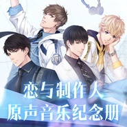
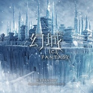
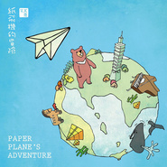
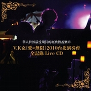

V.K克
============================

|  |  |
| :--: | :-- |
| [ V.K克](https://i.xiami.com/vkmusicstyle) | **地区**: Taiwan, PRC 中国台湾 **风格**: 器乐流行 Instrumental Pop **播放数**: 9139636 **粉丝数**: 13588 **评论数**: 506  |

## 档案

V.K克，流行钢琴演奏界领先指标，惊人的创作才华结合璀璨的演奏技巧，被粉丝们誉为《流行钢琴界的周杰伦》。 如鬼才般不受局限的创作风格横跨个人演奏专辑，电玩、广告、戏剧等配乐，且担任多部电影音乐总监，打造多首令人惊艳的动人歌曲，为台湾少有的跨界音乐代表性人物。 2009年推出第一张个人钢琴演奏创作专辑《镜夜》，引起广大回响及话题，击败心灵演奏排行榜蝉联三年冠军宝座的国外轻音乐大师《凯文‧柯恩》。 2010年推出第二张创作专辑《爱‧无限》，再度攻陷心灵演奏类排行榜冠军，引爆风潮，也在两岸三地华人区引起热烈讨论，持续为华人跨界演奏音乐创下空前历史纪录。同年亦于台北中山堂举办个人首场大型售票演奏会。 2011年发行个人写真书《我就是我的无限大》并于北中南举办签书音乐会，吸引众多粉丝到场支持。同年并与金马导演李佑宁合作，担任电影《面引子》音乐总监。 2012年于台北、台中、高雄及上海举办《I am Infinity》巡回演奏会，并为提倡流行钢琴文化及提升喜爱非古典音乐之爱乐人学习钢琴的兴致，创办《琴之翼V.K克国际钢琴大赛》，为华人首度为自身创作的钢琴曲目所举办的流行钢琴比赛。 2013年V.K克为瑰丽史诗古装大戏《兰陵王》跨刀配乐制作，为丁当演唱的片尾曲「手掌心」作曲并担纲制作人，此曲在YouTube上即将突破1亿人点阅，并获得2013年度最佳电视剧原声带单曲与海内外其他殊荣。 除此优异的成绩外，V.K克也于同年推出个人第三张专辑《第三乐章》，收录多首电影、电玩配乐作品，为台湾演奏史上第一张横跨多平台的创作专辑。 与李鼎导演合作客家电视台【装满的生活时光】之『延续自己的声音篇』频道形象微电影系列配乐获颁第48届电视金钟营销广告奖(频道广告类)。 2014年V.K克为李鼎导演的电影《到不了的地方》担任音乐总监并创作多首动人配乐及为金曲歌王萧敬腾量身打造同名电影主题曲。《到不了的地方》电影配乐入围 Apollo Awards (新加坡阿波罗影视大奖) 最佳音乐音效奖。八月份于内地热播，收视第一的电视剧《离婚律师》也由V.K克制作整部电视剧配乐，并邀约范玮琪演唱插曲《与爱为邻》。 同年V.K克也受邀为台湾第一个女子跨界国乐乐团『无双乐团』作曲并制作专辑，整张专辑结合传统，流行，电子，摇滚等音乐曲风，创造全新国乐流行印象。 原只推出个人流行钢琴演奏专辑的V.K克，跨足配乐及华语流行演唱界仅两年，已和丁当、萧敬腾、范玮琪等大牌歌手合作。这些歌手也都因V.K克极具特色的作曲风格而改变以往唱腔，且受到广大歌迷们喜爱，成功缔造了歌手的不同风貌。 13-15年间V.K克更受邀于温哥华、圣荷西、芝加哥、奥兰多、罗马、哥伦比亚等北美、欧洲与南美洲等地演出。2015年V.K克与兰陵王制作团队再度携手合作，为大时代浪漫动作偶像剧《千金女贼》制作戏剧配乐，并再次创作深情片尾情歌「桃花结」、亦与毕书尽合作游戏主题曲「Adventure」。10月V.K克进军日本，台日两地发行个人新歌精选专辑《Our Story – Best of V.K》，并夺得Amazon演奏排行榜冠军的殊荣。12月V.K克首次于3000人座位TICC台北国际会议中心举办《Best For You》演奏会，座无虚席，此外我的少女时代导演陈玉珊与占星大师唐绮阳等人均是座上嘉宾。 2016年，由中国人气作家郭敬明所写，被称为21世纪华人文坛中最璀璨丰富的幻想文学之作「幻城」全面立体可视化，电视剧再度邀请V.K克担任音乐总监，V.K克为幻城谱写五十多首配乐，并远赴美国与波士顿室内交响乐团合作录音制作。8月份于基隆与母校基隆成功小学管弦乐团举办《Best For You》基隆吉咕拉站演奏会。12月更与音乐游戏《Lethe》合作，携手打造史诗级奇幻音乐游戏。 2017年V.K克于北京、上海、广州举办《有生之年》巡回演奏会，引发广大粉丝回响。更凭借「幻城」电视剧配乐原声带入围2017年第28届金曲奖《最佳演奏录音专辑奖》，为V.K克的音乐生涯立下了重要的里程碑。10月与基隆市国乐团携手演出—基隆潮艺术《域见》，博得热烈掌声。12月再次与游戏《奇迹暖暖》原班人马合作，打造全新超现实恋爱经营手游《恋与制作人》游戏配乐，在中国地区引爆女性玩家热潮，上市不到一个月下载量突破700万人次。   2018年在台北、台中、高雄举办《Those Days》小型巡回演奏会，与粉丝再次重温最初的感动。并再次接受电视剧邀约，由作家明晓溪首度亲任编剧《泡沫之夏》打造全新的戏剧配乐，邀请胡夏、曾之乔、张雪迎等人合作剧中主题、片尾与插曲。同年11月启动 《时空涟漪》亚洲巡演，于广州、武汉、成都、重庆、杭州、上海、北京 进行巡演。并在开卖两小时内完售台北场，紧急加场后又于两小时内完售。 2019 时空涟漪巡演 即将在台北、台中、高雄、香港、韩国、日本、马来西亚等地持续发热。 V.K克14岁时即罹患僵直性脊椎炎，却以乐观的态度克服每天身体的病痛，以不屈不挠的精神及意志力持续在音乐创作上屡屡突破。V.K克的音乐很难用一种风格定义，却充满了大量的幻想因子。除了略为惆怅的钢琴独奏曲，也擅长用单一乐器拉动旋律线，或与弦乐器进行精彩的对话，钩勒内在的情绪；更擅长用交响乐编制构筑如海与风一样宽广的无限边际，创建极具特色的音乐世界观。自创的狂傲炫技「克式钢琴Rap」以进击的旋律贯穿整曲的律动，深受青少年朋友喜爱，也重新定义了钢琴的玩法。近年在国际间也引起注目，数张专辑与多首单曲如「Evolution Era」、 「 Wings of Piano」，荣登日本iTunes演奏类冠军、Amazon排行榜冠军。演奏足迹横跨欧洲、亚洲、美洲、中南美洲，国际粉丝不断累积。 V.K克用他独特的魅力及惊人的创作才华带给粉丝乐迷们不同的音乐惊喜，虏获各地乐迷们的心，在国际舞台上持续闪耀。 V.K克丰富饶趣的多变曲风深具魅力，无须言语就能牵动听众的情绪，用音乐触动心灵深处。 V.K克 官方FB粉丝团  V.K克 YouTube官方频道 V.K克 微博 V.K克作品集 ★音乐专辑★ 2009 《镜夜》创作专辑 2010 《爱‧无限》创作专辑 2011 《我就是我的无限大》EP 2011 V.K克电影配乐作品 - 面引子电影原声带 2013 《第三乐章》创作专辑 2015　《Our Story》创作专辑 (日本亦发行) 2016　《幻城》电视配乐原声带 2018 《泡沫之夏》电视剧原声带 2018 《光 无尽坠落的美丽》十周年纪念专辑 ★V.K克作曲／制作音乐专辑★ 2014　无双乐团《天下》音乐专辑 2015　《到不了的地方》电影原声带 2017　无双乐团丽丝Liz《啾一下》单曲 2018《恋与制作人：初心》原声音乐纪念册 ★出版品★ 2010 《爱‧无限》典藏钢琴谱集Vol.1 2011 《爱‧无限》典藏钢琴谱集Vol.2 2011 《我就是我的无限大》乐谱写真书 2013 《镜夜》典藏钢琴谱集 2014　《第三乐章》钢琴谱集 2015　V.K克精选钢琴谱集(中阶) 2016　《Our Story》钢琴谱集 ★电影、电视剧配乐★ 2011　电影《面引子》配乐制作/音乐总监 2013　电视剧《兰陵王》配乐制作及片尾曲(丁当演唱)「手掌心」作曲/制作人 2013　电影《到不了的地方》配乐制作/音乐总监 2014　电影《到不了的地方》(萧敬腾演唱)主题曲作曲/制作人 2014　电视剧《离婚律师》音乐总监 2014 电视剧《离婚律师》插曲(范玮琪演唱)「与爱为邻」作曲/制作人 2015　电视剧《千金女贼》音乐总监 2015　电视剧《千金女贼》片尾曲(王诗安演唱)「桃花结」作曲/制作人 2016　电视剧《幻城》音乐总监 2016　电视剧《幻城》插曲 (秦宇子演唱) 「我不放手」 作曲 2016　电视剧《隐形的翅膀》插曲(杨蒨时演唱)「天使笑颜」作曲 2018　电视剧《泡沫之夏》音乐总监 「我们的爱没有错」主题曲 （胡夏演唱）作曲/制作人 「泡沫美人鱼」 、「钻石」插曲 （曾之乔演唱） 作曲/制作人 「被你拯救的我」片尾曲（张雪迎演唱）作曲/制作人 ★广告配乐、电玩配乐及企业品牌形象音乐★ 台湾百大旅游景点-熏衣草森林主题曲-《森林漫舞》编曲制作 中国艾伯维之歌制作 中国电视公司CTV频道形象音乐作曲制作 《摩斯汉堡》系列电视广告配乐 中华电视公司频道音乐提供 2013客家电视台【装满的生活时光】频道形象微电影系列配乐 此微电影系列之『延续自己的声音篇』荣获第48届电视金钟奖频道广告奖 2014 《佳音英语》系列电视广告配乐、《台塑生医》系列电视广告配乐 2015　《砍杀吧！佣兵》手机游戏主题曲(毕书尽演唱) 「Adventure」作曲/制作人 2015~2018　《奇迹暖暖》手机游戏音乐制作 2016~2017　《lethe》手机游戏音乐制作 2017~2018　《恋与制作人》手机游戏音乐制作 ★演奏会★ 2010 《爱‧无限》中山堂演奏会 2012 《I am Infinity》台湾巡回演奏会 2012 《I am Infinity》上海演奏会 2012 《琴迷上海》钢琴演奏会 2013　《第三乐章》台北国家音乐厅演奏会 2015 　《Best For You》台北国际会议中心演奏会 2016　《Best For You》基隆吉咕拉站 2017　《有生之年》北京/上海/广州 专场演奏会 2018　《Those Days》台北/台中/高雄 小型巡回演奏会 2018 《时空涟漪》巡演 北京/上海/广州/武汉/杭州/成都/重庆 2019《时空涟漪》 巡演 台北/台中/高雄 ★海外活动演出嘉宾 中国上海 : 音卓钢琴艺术中心亲子音乐会 加拿大温哥华 : 美商亚培药厂 全球经理人大会 中国北京：雷亚游戏嘉年华演出嘉宾 中国上海：雷亚游戏嘉年华演出嘉宾 中国广州：萤火虫动漫嘉年华演出嘉宾 中国杭州、上海 : 《 V.K克和他的音卓朋友们》亲子互动巡演 影像与代言产品 艾伯维药品有限公司&中华民国僵直性脊椎炎关怀协会病友代言 Yamaha reface CP影片介绍 IK Multimedia iRig 系列产品 介绍影片 Yamaha reface CP 介绍影片 初音未来授权官方手游《初音速》音乐宣传演奏影片 KORG 日本电钢琴键盘代言人

## 专辑

| 名称 | 语种 | 唱片公司 | 发行时间 | 专辑类别 | 专辑风格 |
| :--: | :-- | :-- | :-- | :-- | :-- |
| [ 好想和你在一起 网剧原声带](./albums/5022132500.md) | 纯音乐 | HIFIVE | 2020年12月09日 | 原声带, 影视音乐 | 电视原声 Television Music |
| [ Endless Falling Lights : Supernova](./albums/5021411343.md) | 纯音乐 | HIFIVE | 2020年09月07日 | 录音室专辑 | 器乐流行 Instrumental Pop |
| [ 光 无尽坠落的美丽](./albums/2104411522.md) | 纯音乐 | HIFIVE | 2019年01月02日 | 录音室专辑 | 国语流行 Mandarin Pop |
| [ 《恋与制作人：初心》原声音乐纪念册](./albums/2104420774.md) | 纯音乐 | 叠纸科技 | 2018年12月11日 | 精选集 |  |
| [ 手掌心](./albums/2104122696.md) | 国语 | HIFIVE | 2018年10月22日 | EP, 单曲 | 国语流行 Mandarin Pop |
| [ V.K x 有生之年巡演众筹大成功即兴纪念曲](./albums/2104667352.md) | 纯音乐 | Self-Released | 2017年04月20日 | 现场专辑 |  |
| [ 幻城 电视配乐原声带](./albums/2100384179.md) | 纯音乐 | HIFIVE | 2016年08月05日 | 原声带, 影视音乐 | 原声 Soundtrack, 电视原声 Television Music |
| [ Our Story -Best of V.K-](./albums/2100248340.md) | 其他 | HIFIVE | 2015年12月18日 | 录音室专辑 | 轻音乐 Easy Listening |
| [ Paper Plane's Adventure纸飞机的冒险](./albums/706258971.md) | 国语 | HIFIVE | 2014年05月30日 | EP, 单曲 |  |
| [ 第三乐章](./albums/975675094.md) | 国语 | HIFIVE | 2013年08月02日 | 录音室专辑 |  |
| [ 爱∞无限 2010台北演奏会全记录](./albums/511712.md) | 国语 | HIFIVE | 2011年12月27日 | 现场专辑 |  |
| [ 面引子 电影原声带V.K克电影配乐作品](./albums/471354.md) | 国语 | HIFIVE | 2011年10月21日 | 原声带, 影视音乐 |  |
| [ 我就是我的无限大](./albums/449122.md) | 国语 | 喜玛拉雅 | 2011年07月01日 | EP, 单曲 |  |
| [ 爱·无限](./albums/394566.md) | 其他 | HIFIVE | 2010年05月25日 | 录音室专辑 |  |
| [ 镜夜](./albums/397490.md) | 国语 | HIFIVE | 2009年01月05日 | 录音室专辑 |  |

## 评论

|  |  |  |
| :-- | :-- | :-- |
|  [虾米用户](https://emumo.xiami.com/u/310754428) wa da xi… 2020-03-25 07:39 赞(1) 踩(0) | 
大爱deemo
 |
|  [虾米用户](https://emumo.xiami.com/u/440629585)  2020-02-25 17:39 赞(0) 踩(0) | 
钢琴曲跟好听，像一阵清风，像一条流动的河，像一场未竞的梦
 |
|  [虾米用户](https://emumo.xiami.com/u/42225175) 精分成功不是梦 2020-01-05 10:01 赞(0) 踩(0) | 
奇迹暖暖的蝶梦花雾雨呢，好爱的！
 |
|  [虾米用户](https://emumo.xiami.com/u/324365616)  2019-07-06 14:10 赞(0) 踩(0) | 
那就“就”我没有摸着你他1595892191\哟额4他同学d(1826“”@'<a href="http://emumo.xiami.com/u/36005278" target="_blank" rel="nofollow" name_card="36005278">@小号王强 </a>虾小宝 <a href="http://emumo.xiami.com/u/36005278" target="_blank" rel="nofollow" name_card="36005278">@小号王强 </a>
 |
|  [虾米用户](https://emumo.xiami.com/u/8326332) 后来，即便是音乐，也无法... 2019-01-02 19:37 赞(0) 踩(0) | 
渐变式失望
 |
|  [虾米用户](https://emumo.xiami.com/u/50662209) 梦想还是要有的，万一实现... 2018-12-06 22:24 赞(1) 踩(0) | 
超喜欢deemo
 |
|  [虾米用户](https://emumo.xiami.com/u/324879742)   2018-11-11 10:01 赞(1) 踩(0) | 
.
 |
|  [虾米用户](https://emumo.xiami.com/u/52769616) 永恒的 思索者、诗者、乐... 2018-10-20 06:43 赞(1) 踩(0) | 
好差的音樂！
 |
|  [虾米用户](https://emumo.xiami.com/u/271563092) 流行钢琴演奏家、作曲家 2018-09-21 19:28 赞(13) 踩(0) | 
V.K克&amp;ldquo;时空涟漪&amp;rdquo;2018巡回演奏会售票开启！！ &amp;mdash;&amp;mdash;引爆音乐能量，撼动你的小宇宙！ 快来加入V.K星系接收「克能量」的侵袭吧~ 【演出详情】 11月18日 广州&amp;middot;MAO 11月20日 武汉&amp;middot;L7 11月23日 成都&amp;middot;正火艺术中心 11月25日 重庆&amp;middot;文化宫大剧院 11月27日 杭州&amp;middot;MAO 11月30日 上海&amp;middot;万代南梦宫 12月01日 北京&amp;middot;糖果 购票请戳：<a href="http://show.bilibili.com/platform/search.html?searchValue=%E6%97%B6%E7%A9%BA%E6%B6%9F%E6%BC%AA" target="_blank" rel="nofollow noreferrer noopener">http://show.bilibili.com/platform/search.html?searchValue=%E6%97%B6%E7%A9%BA%E6%B6%9F%E6%BC%AA</a>
 |
|  [虾米用户](https://emumo.xiami.com/u/255053757)  2018-07-31 18:07 赞(2) 踩(0) | 
怎么还不出新专辑，多少年过去了 
 |
| ⇒ |  [虾米用户](https://emumo.xiami.com/u/162990188) FOEVER LOVE ... 2018-08-11 11:23 赞(0) 踩(0) | 
spotify上去了
 |
| ⇒ |  [虾米用户](https://emumo.xiami.com/u/255053757)  2018-08-27 16:38 赞(0) 踩(0) | 
啊，啥意思？ 
 |
|  [虾米用户](https://emumo.xiami.com/u/341910501) 纯音乐永远是我的最爱(●... 2018-07-08 12:08 赞(0) 踩(0) | 
Hua Xui Yue 超燃！！！太幸运了，能听到这么好听的曲子！！！
 |
|  [虾米用户](https://emumo.xiami.com/u/341910501) 纯音乐永远是我的最爱(●... 2018-07-08 12:04 赞(0) 踩(0) | 
太好听了！！！！！！啊啊啊那个mirror night和wings of piano以及其他妈呀太棒！！
 |
|  [虾米用户](https://emumo.xiami.com/u/34695799) 经年的天空，轮转的四季，... 2018-07-03 01:38 赞(0) 踩(0) | 
台版玉木宏 
 |
|  [虾米用户](https://emumo.xiami.com/u/238182236) 慢慢喜欢你，你好，我是慢... 2018-07-02 14:07 赞(2) 踩(0) | 
性格还是个孩子，独创音乐很大气，有如行云流水，他的音乐有灵魂。
 |
|  [虾米用户](https://emumo.xiami.com/u/212350656)  2018-05-21 01:01 赞(11) 踩(0) | 
最喜欢的现代钢琴家有两个VK克和Pianoboy，他们都是台湾的，都是现代流行钢琴艺术家中的佼佼者，都是颜值与才华俱佳者...最让人嫉妒的是前者即是电玩家又是钢琴家和作曲家，后者不仅是钢琴家，还是名副其实的大学霸，台大硕士，据说还是物理老师...
 |
|  [虾米用户](https://emumo.xiami.com/u/45818524) 致我所爱的人好夢~Twi... 2018-05-11 19:54 赞(0) 踩(0) | 
vk大大加油
 |
|  [虾米用户](https://emumo.xiami.com/u/280681982)  2018-02-17 21:17 赞(1) 踩(0) | 
大部分曲子很好听，可惜每隔一段时间总要下架几首。。
 |
|  [虾米用户](https://emumo.xiami.com/u/8800190) 快到碗里来 2017-11-25 21:27 赞(2) 踩(0) | 
啥时候来广州，一定捧场
 |
|  [虾米用户](https://emumo.xiami.com/u/317845987)  2017-11-01 23:27 赞(1) 踩(0) | 

 |
|  [虾米用户](https://emumo.xiami.com/u/124848528) 我还没想好要写什么... 2017-10-26 22:32 赞(2) 踩(0) | 
帅气又有才华，真的好棒，加油哦！
 |
|  [虾米用户](https://emumo.xiami.com/u/44726124) 我还没想好要写什么... 2017-10-21 09:51 赞(1) 踩(0) | 
克大啥时候出新曲啊
 |
| ⇒ |  [虾米用户](https://emumo.xiami.com/u/342813734) 崩坏是信仰，无论如何，永... 2018-01-27 15:50 赞(0) 踩(0) | 
今年二月份吧，好像听说大概可能是这样，克大发了B站的
 |
| ⇒ |  [虾米用户](https://emumo.xiami.com/u/44726124) 我还没想好要写什么... 2018-01-27 19:49 赞(0) 踩(0) | 
<q><b>痕说：</b></q>
 |
|  [虾米用户](https://emumo.xiami.com/u/88769390) Raining Bloo... 2017-10-17 23:09 赞(1) 踩(0) | 
颜值居然这么高么！！ 
 |
| ⇒ |  [虾米用户](https://emumo.xiami.com/u/333432447) 我还没想好要写什么... 2017-12-08 22:04 赞(0) 踩(0) | 
emmm是蛮高的不过现在已经从vk克变成uk克了QAQ
 |
| ⇒ |  [虾米用户](https://emumo.xiami.com/u/251385775) 三日月の地はなり麦の花 2018-03-14 14:17 赞(0) 踩(0) | 
<q><b>sholky说：</b></q>
 |
|  [虾米用户](https://emumo.xiami.com/u/298811594)  2017-10-15 22:32 赞(0) 踩(0) | 
超级喜欢你的曲子！！！
 |
|  [虾米用户](https://emumo.xiami.com/u/309427282) 找个蓝盆友， 2017-09-12 19:32 赞(0) 踩(0) | 
加油哦，永远支持你 
 |
|  [虾米用户](https://emumo.xiami.com/u/54686131) 要听更多喜欢的歌~~~ 2017-08-26 21:53 赞(0) 踩(0) | 
喜欢曲子,胜于言语~~~
 |
|  [虾米用户](https://emumo.xiami.com/u/192288404) ❤️ 2017-08-26 03:42 赞(0) 踩(0) | 
第一次听， 被旋律惊艳到。喜欢！
 |
|  [虾米用户](https://emumo.xiami.com/u/16852456) 理想是御用配乐师(/ω＼... 2017-08-12 14:09 赞(0) 踩(0) | 
好帅啊 
 |
|  [虾米用户](https://emumo.xiami.com/u/271563092) 流行钢琴演奏家、作曲家 2017-08-07 17:51 赞(65) 踩(0) | 
今年的願望&amp;mdash;&amp;mdash;更多地見到大家！又要實現啦！這次是10月6日在成都世外桃源大劇院Uni-Con（獨角獸音樂會）的表演喔～～這次除了是坐席會表演一些沒表演過的曲子以外還會有神秘演出嘉賓為我助陣！希望大家多多捧場！現已經在摩點眾籌上開啟了預售，详情请关注我的微博哦！！！！
 |
| ⇒ |  [虾米用户](https://emumo.xiami.com/u/158039430) 乌烟瘴气 2017-08-07 19:23 赞(0) 踩(0) | 
前排买瓜
 |
| ⇒ |  [虾米用户](https://emumo.xiami.com/u/51538914) 哇哈哈哈哈 2017-08-09 21:28 赞(0) 踩(0) | 
看了你b站的直播 超喜欢 支持你！！
 |
| ⇒ |  [虾米用户](https://emumo.xiami.com/u/16852456) 理想是御用配乐师(/ω＼... 2017-08-12 14:09 赞(0) 踩(0) | 

 |
|  [虾米用户](https://emumo.xiami.com/u/12221090) 逍遥于天地而心意自得 2017-06-29 22:00 赞(0) 踩(0) | 
赞
 |
|  [虾米用户](https://emumo.xiami.com/u/30730615)  2017-06-25 18:19 赞(0) 踩(0) | 
好喜欢你啊啊啊啊啊啊啊啊啊啊啊啊啊啊啊啊
 |
|  [虾米用户](https://emumo.xiami.com/u/79105624) 你想她吗？ 2017-06-14 18:04 赞(0) 踩(0) | 
我喜欢这种音乐
 |
|  [虾米用户](https://emumo.xiami.com/u/47069943) A programmer 2017-06-12 03:57 赞(0) 踩(0) | 
最自豪的是买到了《爱无限 vol.2》的谱子
 |
|  [虾米用户](https://emumo.xiami.com/u/47069943) A programmer 2017-06-12 03:53 赞(1) 踩(0) | 
初三时就入了deemo的坑，结果听v.k的歌听了三年，现在我已高三毕业
 |
|  [虾米用户](https://emumo.xiami.com/u/210378796)  2017-05-11 09:05 赞(0) 踩(0) | 
Deemo里最爱这首曲子
 |
|  [虾米用户](https://emumo.xiami.com/u/9052514)  2017-05-07 09:25 赞(0) 踩(0) | 
来的太迟了 广州站5.14的票 怎么买
 |
|  [虾米用户](https://emumo.xiami.com/u/195363032)  2017-05-04 17:23 赞(0) 踩(0) | 
爱你爱你爱你，爱你的所有曲子
 |
|  [虾米用户](https://emumo.xiami.com/u/195363032)  2017-05-04 17:22 赞(1) 踩(0) | 
昨晚在我校交流，在台下的我好激动，听着他的演奏感动到哭   ，就像他说的失去和得到并不是绝对的，V.K克，加油
 |
|  [虾米用户](https://emumo.xiami.com/u/277066423)  2017-04-11 21:09 赞(1) 踩(0) | 
在十三年前我喜欢JJ之后唯一一个让我觉得每首作品都喜欢的艺人~
 |
|  [虾米用户](https://emumo.xiami.com/u/186287431)  2017-04-08 17:53 赞(0) 踩(0) | 
克大！克大！以后我要你的歌当片头曲！！！
 |
|  [虾米用户](https://emumo.xiami.com/u/83757976) alone 2017-03-30 23:45 赞(0) 踩(0) | 
广州的孩子躁起来啊～时间不多了～很想去看他的演奏会 
 |
|  [虾米用户](https://emumo.xiami.com/u/265132729)  2017-03-26 18:03 赞(1) 踩(0) | 
好好听啊！  
 |
|  [虾米用户](https://emumo.xiami.com/u/271695067)   2017-03-18 09:53 赞(44) 踩(0) | 
明明可以靠脸吃饭，偏偏却靠才华的现实版
 |
|  [虾米用户](https://emumo.xiami.com/u/17199128) Nothing. 2017-03-14 10:45 赞(1) 踩(0) | 
抄袭...抄袭
 |
| ⇒ |  [虾米用户](https://emumo.xiami.com/u/194151174) 音之声•乐之魂 2018-05-31 16:56 赞(0) 踩(0) | 
为什么这么说啊[叹号问好]
 |
| ⇒ |  [虾米用户](https://emumo.xiami.com/u/17199128) Nothing. 2018-06-01 08:26 赞(0) 踩(0) | 
<q><b>繁花又开忆成殇说：</b></q>
 |
|  [虾米用户](https://emumo.xiami.com/u/8326332) 后来，即便是音乐，也无法... 2017-03-10 15:59 赞(0) 踩(0) | 
钱
 |
|  [虾米用户](https://emumo.xiami.com/u/7121667) 吃饱撑着~ 2017-03-07 13:30 赞(0) 踩(0) | 
钢琴
 |
|  [虾米用户](https://emumo.xiami.com/u/939534) 纯音乐控 2017-02-24 22:23 赞(0) 踩(0) | 
话说。。。能考虑下音乐厅么？ Live House实在不大适合静静的听音乐...
 |
|  [虾米用户](https://emumo.xiami.com/u/33737484) 暂无签名~ 2017-02-24 15:14 赞(0) 踩(0) | 
更多资讯请移步众筹主页
 |
|  [虾米用户](https://emumo.xiami.com/u/33737484) 暂无签名~ 2017-02-24 15:13 赞(0) 踩(0) | 
感谢有你到场！  你将获得： 价值199元的【北京】演奏会门票一张  以及后续众筹解锁回报。  备注： 为了防止门票在寄送过程当中漏寄或遗失，我们采取现场兑换的形式发放门票。届时请凭摩点后台的姓名及电话等信息现场兑换领取。 一次支持只会获得一份众筹回报。如需要多份回报，请多次支持。  回报发放时间：2017-04
 |
|  [虾米用户](https://emumo.xiami.com/u/33737484) 暂无签名~ 2017-02-24 15:12 赞(0) 踩(0) | 
无法到场累不爱 ○|￣|_： 没关系，我们为你准备了如下礼遇：  1. 巡演专属纪念精选CD 2. 巡演专属写真纪念册  以及后续众筹解锁回报。  备注： 一次支持只会获得一份众筹回报。如需要多份回报，请多次支持。  回报发放时间：2017-05
 |
|  [虾米用户](https://emumo.xiami.com/u/9028760) 豆瓣见 spotify ... 2017-02-23 17:56 赞(0) 踩(0) | 
支持
 |
|  [虾米用户](https://emumo.xiami.com/u/8326332) 后来，即便是音乐，也无法... 2017-02-21 07:18 赞(0) 踩(0) | 
钱
 |
|  [虾米用户](https://emumo.xiami.com/u/9597157) ， 2017-02-13 00:19 赞(0) 踩(0) | 
帅
 |
|  [虾米用户](https://emumo.xiami.com/u/119683832) 我就是我 2017-02-10 16:11 赞(0) 踩(0) | 
很喜欢你啊，百听不厌
 |
|  [虾米用户](https://emumo.xiami.com/u/181199530) 2019.5.3暂退 2017-02-09 18:42 赞(0) 踩(0) | 
ｸﾞｯ!(๑•̀ㅂ•́)و✧
 |
|  [虾米用户](https://emumo.xiami.com/u/31696713) 轻音乐群88876205 2017-02-09 03:27 赞(0) 踩(0) | 
  
 |
|  [虾米用户](https://emumo.xiami.com/u/40174064) 还活着，曾经 2017-02-08 21:21 赞(0) 踩(0) | 
热烈欢迎 
 |
|  [虾米用户](https://emumo.xiami.com/u/33164579) 我还没有完成，还不能… 2017-02-08 15:24 赞(0) 踩(0) | 
       耶✌
 |
|  [虾米用户](https://emumo.xiami.com/u/271563092) 流行钢琴演奏家、作曲家 2017-02-08 14:26 赞(295) 踩(0) | 
哈罗，大家好！好久不见！终于认领了我自己的虾米音乐人主页了，超开心！接下来我即将于5月初在北京上海广州展开我的内地首场巡演，现在摩点网做众筹售票ing，更多消息多多关注我的微博@VK克哦～～～   求帮忙赞起来让更多人看到！
 |
| ⇒ |  [虾米用户](https://emumo.xiami.com/u/249948903) 好风凭借力，送我上青云。 2017-02-08 14:47 赞(0) 踩(0) | 
捕捉大大w
 |
| ⇒ |  [虾米用户](https://emumo.xiami.com/u/2003179) 我不难过，我没有说谎。 2017-02-08 14:48 赞(0) 踩(0) | 
欢迎欢迎~(ˇˍˇ) ～
 |
| ⇒ |  [虾米用户](https://emumo.xiami.com/u/271563092) 流行钢琴演奏家、作曲家 2017-02-08 15:52 赞(0) 踩(0) | 
<q><b>小野道风说：</b></q>
 |
| ⇒ |  [虾米用户](https://emumo.xiami.com/u/54445709) 于无声处听惊雷。 2017-02-08 15:57 赞(0) 踩(0) | 
非常喜欢你给deemo的配乐。
 |
| ⇒ |  [虾米用户](https://emumo.xiami.com/u/271563092) 流行钢琴演奏家、作曲家 2017-02-08 16:01 赞(0) 踩(0) | 
<q><b>墨萧于声说：</b></q>
 |
| ⇒ |  [虾米用户](https://emumo.xiami.com/u/50845132) 征途乃是星辰大海！ 2017-02-08 16:01 赞(0) 踩(0) | 
大大时隔多年终于想起了虾米音乐的账号和密码。。可喜可贺  
 |
| ⇒ |  [虾米用户](https://emumo.xiami.com/u/50845132) 征途乃是星辰大海！ 2017-02-08 16:08 赞(0) 踩(0) | 
最爱你的那首Mirror night  百听不厌啊  
 |
| ⇒ |  [虾米用户](https://emumo.xiami.com/u/271563092) 流行钢琴演奏家、作曲家 2017-02-08 17:26 赞(0) 踩(0) | 
<q><b>勿  羽  韋说：</b></q>
 |
| ⇒ |  [虾米用户](https://emumo.xiami.com/u/271563092) 流行钢琴演奏家、作曲家 2017-02-08 17:26 赞(0) 踩(0) | 
<q><b>勿  羽  韋说：</b></q>
 |
| ⇒ |  [虾米用户](https://emumo.xiami.com/u/271563092) 流行钢琴演奏家、作曲家 2017-02-08 17:27 赞(0) 踩(0) | 
<q><b>墨萧于声说：</b></q>
 |
| ⇒ |  [虾米用户](https://emumo.xiami.com/u/50845132) 征途乃是星辰大海！ 2017-02-08 17:48 赞(0) 踩(0) | 
<q><b>V.K克说：</b></q>
 |
| ⇒ |  [虾米用户](https://emumo.xiami.com/u/49781211) 问君能有几多愁 却道天凉... 2017-02-08 18:57 赞(0) 踩(0) | 
前排捕捉大大！去年我在虾米听的最多的歌是《Paper Plane's Adventure (2015 Remix)》 希望以后会有更多更好的作品哦
 |
| ⇒ |  [虾米用户](https://emumo.xiami.com/u/243323321) 一闪一闪亮晶晶✨ 2017-02-08 21:44 赞(0) 踩(0) | 
超爱克大哇(≧∇≦)/最最最喜欢你的海洋之息啦
 |
| ⇒ |  [虾米用户](https://emumo.xiami.com/u/50574447)   2017-02-09 00:49 赞(0) 踩(0) | 
加油！！！一定支持！！ 
 |
| ⇒ |  [虾米用户](https://emumo.xiami.com/u/6281637)  2017-02-09 04:46 赞(0) 踩(0) | 
<q><b>V.K克说：</b></q>
 |
| ⇒ |  [虾米用户](https://emumo.xiami.com/u/251402565)  2017-02-09 22:33 赞(0) 踩(0) | 
ok  听男神哒  
 |
| ⇒ |  [虾米用户](https://emumo.xiami.com/u/460669)   2017-02-10 04:59 赞(0) 踩(0) | 
支持一下！！ ：）
 |
| ⇒ |  [虾米用户](https://emumo.xiami.com/u/11681189) 木鱼响  小和尚不明了心... 2017-02-16 14:00 赞(0) 踩(0) | 
希望你不会像那些浮躁的戏子一样，这也搞那也搞，最后埋没自己的天赋。
 |
| ⇒ |  [虾米用户](https://emumo.xiami.com/u/36678155)   2017-02-16 14:19 赞(0) 踩(0) | 
啊啊啊，镜夜超好听！！
 |
| ⇒ |  [虾米用户](https://emumo.xiami.com/u/132057670) 我很聪明什么也没留下..... 2017-02-17 02:18 赞(0) 踩(0) | 
我在国外没法去   好可惜 
 |
| ⇒ |  [虾米用户](https://emumo.xiami.com/u/33737484) 暂无签名~ 2017-02-24 15:07 赞(0) 踩(0) | 
<q><b>Cathyqwq说：</b></q>
 |
| ⇒ |  [虾米用户](https://emumo.xiami.com/u/132057670) 我很聪明什么也没留下..... 2017-02-25 06:08 赞(0) 踩(0) | 
<q><b>w6v0v6vv说：</b></q>
 |
| ⇒ |  [虾米用户](https://emumo.xiami.com/u/186287431)  2017-04-08 18:40 赞(0) 踩(0) | 
棒棒棒棒棒棒
 |
| ⇒ |  [虾米用户](https://emumo.xiami.com/u/44785568) 不太懂 2017-07-29 12:44 赞(0) 踩(0) | 
哈哈哈哈哈哈哈哈哈哈  你好棒
 |
| ⇒ |  [虾米用户](https://emumo.xiami.com/u/298899077) 爱情向左，理想向右 2017-08-15 22:40 赞(0) 踩(0) | 
好好听，继续加油！
 |
| ⇒ |  [虾米用户](https://emumo.xiami.com/u/285329534)  2017-11-06 13:43 赞(0) 踩(0) | 
男神
 |
| ⇒ |  [虾米用户](https://emumo.xiami.com/u/337187637)  2017-11-25 16:05 赞(0) 踩(0) | 
呐 我昨天刚看过你演唱会那
 |
| ⇒ |  [虾米用户](https://emumo.xiami.com/u/158578048) 我酷嗜倔强的爱。 2018-06-17 12:52 赞(0) 踩(0) | 
克克你有这么多APP账号，你的手机内存还好吗 
 |
|  [虾米用户](https://emumo.xiami.com/u/252104228) http://image... 2017-02-04 21:39 赞(0) 踩(0) | 
K哥咋成钢琴小天王了?
 |
|  [虾米用户](https://emumo.xiami.com/u/52308720) 音乐生命的源头 2017-01-12 03:08 赞(0) 踩(0) | 
真的好帅
 |
|  [虾米用户](https://emumo.xiami.com/u/258830219)  2017-01-06 16:44 赞(0) 踩(0) | 
vk啊vk
 |
|  [虾米用户](https://emumo.xiami.com/u/251501503) 私たち、輝きたい！ 2017-01-02 20:34 赞(0) 踩(0) | 
vk入驻网易云音乐了！
 |
|  [虾米用户](https://emumo.xiami.com/u/190051973) 这家伙很聪明什么也没留下... 2016-12-23 18:19 赞(0) 踩(0) | 
非常好听
 |
|  [虾米用户](https://emumo.xiami.com/u/251683849) FFFFFFFFF 2016-12-17 19:13 赞(1) 踩(0) | 
张伟。。。。
 |
|  [虾米用户](https://emumo.xiami.com/u/13205338)  2016-12-05 22:58 赞(1) 踩(0) | 
克的曲子，我从初中听到高中。每次最失落眼泪掉下来的时候，听到你那纯净天然又细腻温暖的曲子，总会涌回暖流，你的曲子仿佛一种精神力量支撑着我走过最困难的时候。记得当年失去重要的人，一个人在天台听那首早晨的第一道光芒和你的微笑。
 |
| ⇒ |  [虾米用户](https://emumo.xiami.com/u/235371573) 漫天的我落在积满雪的枫叶... 2016-12-14 00:01 赞(0) 踩(0) | 
是
 |
|  [虾米用户](https://emumo.xiami.com/u/48922840) 大侠 2016-12-01 23:37 赞(1) 踩(0) | 
他清新的曲风即使古典乐爱好者也不会排斥，像钢琴的新天地
 |
|  [虾米用户](https://emumo.xiami.com/u/181199530) 2019.5.3暂退 2016-11-11 19:35 赞(1) 踩(0) | 
谁说电音才能听起飞的，钢琴也能起飞
 |
|  [虾米用户](https://emumo.xiami.com/u/222036030) army 2016-10-31 20:34 赞(0) 踩(0) | 
 ❀.(*´▽`*)❀.
 |
|  [虾米用户](https://emumo.xiami.com/u/214165095) 虾米永恒！！！ 2016-10-03 18:36 赞(2) 踩(0) | 
幻城噢
 |
|  [虾米用户](https://emumo.xiami.com/u/222595531)   2016-09-24 21:07 赞(0) 踩(0) | 
www
 |
|  [虾米用户](https://emumo.xiami.com/u/226948900)  2016-09-16 14:21 赞(0) 踩(0) | 
 好听
 |
|  [虾米用户](https://emumo.xiami.com/u/75597946)  2016-09-11 19:43 赞(0) 踩(0) | 
钢琴好棒
 |
|  [虾米用户](https://emumo.xiami.com/u/12020701)  2016-09-02 15:30 赞(2) 踩(0) | 
同因为deemo而入坑~ 不能自拔
 |
|  [虾米用户](https://emumo.xiami.com/u/52056952) 人生即是到來、相遇、陪伴... 2016-09-01 23:31 赞(0) 踩(0) | 

 |
|  [虾米用户](https://emumo.xiami.com/u/56906410) Believe your... 2016-08-24 22:40 赞(1) 踩(0) | 
好帅啊
 |
|  [虾米用户](https://emumo.xiami.com/u/56906410) Believe your... 2016-08-24 22:39 赞(0) 踩(0) | 
vk最棒
 |
|  [虾米用户](https://emumo.xiami.com/u/56906410) Believe your... 2016-08-24 22:39 赞(0) 踩(0) | 
好帅啊！！！
 |
|  [虾米用户](https://emumo.xiami.com/u/55759019) 冬日朽木 2016-08-20 01:35 赞(0) 踩(0) | 
piano
 |
|  [虾米用户](https://emumo.xiami.com/u/203519203)   2016-08-01 16:00 赞(0) 踩(0) | 
许勤毅比我小八天，同一年同一个月，怎么差距这么大呢！现在人家是太师级
 |
|  [虾米用户](https://emumo.xiami.com/u/11039563) 赞美百合之神。 2016-07-16 00:22 赞(2) 踩(0) | 
克神ヽ(ﾟ∀ﾟ)ﾉ 因为先进了Cytus的坑DEEMO上手超不习惯2333 结果我现在是到哪都摆脱不了DEEMO带给我的「好听但就是TP感人你这咸鱼」这种阴影了吗_(:з」∠)_ 被克神支配的恐惧...
 |
|  [虾米用户](https://emumo.xiami.com/u/110519170)  2016-07-07 19:41 赞(2) 踩(0) | 
完美秒杀tf和exo
 |
|  [虾米用户](https://emumo.xiami.com/u/35212838)  2016-06-11 10:35 赞(0) 踩(0) | 
必必剥剥
 |
|  [虾米用户](https://emumo.xiami.com/u/47940776)  2016-05-18 23:36 赞(4) 踩(0) | 
感谢deemo让我知道了V.K 这种有灵魂的纯音乐才是大爱啊～
 |
|  [虾米用户](https://emumo.xiami.com/u/22528583)  2016-05-17 19:30 赞(0) 踩(0) | 
最喜欢VK的纯白了，月月看到了吗？
 |
|  [虾米用户](https://emumo.xiami.com/u/172139530)  2016-05-17 19:27 赞(0) 踩(0) | 

 |
|  [虾米用户](https://emumo.xiami.com/u/2716081) 人生就是连续不断的妥协 2016-05-09 20:37 赞(0) 踩(0) | 
继续支持，特别喜欢面引子那专辑，希望V.K克可以有更多方向的发挥
 |
|  [虾米用户](https://emumo.xiami.com/u/7686338) 静静深夜 月涌江流 2016-04-12 18:58 赞(0) 踩(0) | 
才子
 |
|  [虾米用户](https://emumo.xiami.com/u/102024702) 穿梭在时空裂缝中，我是时... 2016-03-15 18:20 赞(0) 踩(0) | 
支持克克！克克加油！ 
 |
|  [虾米用户](https://emumo.xiami.com/u/4285877)  2016-03-10 11:03 赞(0) 踩(0) | 
真是人帅有才华
 |
|  [虾米用户](https://emumo.xiami.com/u/50401207) 保罗·班扬的父亲 2016-02-23 01:42 赞(1) 踩(0) | 
听v.k克的曲子比吸大麻还爽。
 |
|  [虾米用户](https://emumo.xiami.com/u/4224691) 人的梦想永不完结 2016-02-19 21:33 赞(0) 踩(0) | 
deemo里最喜欢他的曲子！！
 |
|  [虾米用户](https://emumo.xiami.com/u/43960484) 这家伙非常非常非常非常聪... 2016-02-14 19:41 赞(0) 踩(0) | 
内容已删除
 |
| ⇒ |  [虾米用户](https://emumo.xiami.com/u/43960484) 这家伙非常非常非常非常聪... 2016-04-18 12:42 赞(0) 踩(0) | 
<q><b>说：</b></q>
 |
|  [虾米用户](https://emumo.xiami.com/u/20151808)  2016-02-02 09:47 赞(1) 踩(0) | 
有故事的音乐
 |
|  [虾米用户](https://emumo.xiami.com/u/103462226)  2016-01-30 14:22 赞(0) 踩(0) | 
好帅。
 |
|  [虾米用户](https://emumo.xiami.com/u/49818810)   2016-01-15 18:12 赞(0) 踩(0) | 
人帅歌美 却没女票（雾
 |
|  [虾米用户](https://emumo.xiami.com/u/45599833) 咩…… 2016-01-11 17:29 赞(1) 踩(0) | 
原来是中国人？！！！
 |
|  [虾米用户](https://emumo.xiami.com/u/28946659)   2016-01-11 16:33 赞(0) 踩(0) | 
帅？
 |
|  [虾米用户](https://emumo.xiami.com/u/12470209)   2016-01-07 14:22 赞(3) 踩(0) | 
瘦时李易峰 胖后高晓松
 |
|  [虾米用户](https://emumo.xiami.com/u/48801952)  2015-12-31 16:54 赞(0) 踩(0) | 
太赞了
 |
|  [虾米用户](https://emumo.xiami.com/u/95437970)   2015-12-28 23:16 赞(1) 踩(0) | 
小学五年级就开始看好他，后来我也爱上了钢琴 特别棒的演奏家！
 |
|  [虾米用户](https://emumo.xiami.com/u/52861274) 这里小巴哟~ 2015-12-04 22:34 赞(1) 踩(0) | 
在雷亚音乐嘉年华上现场听了他的演奏，简直……简直太帅了!!!V.K大大我爱你(&amp;gt;_&amp;lt;)
 |
|  [虾米用户](https://emumo.xiami.com/u/3639178) 故事我有，我不喝酒。 2015-11-15 22:58 赞(0) 踩(0) | 
听着赞点开艺人详情 然后被帅到了
 |
|  [虾米用户](https://emumo.xiami.com/u/47757659) 我还没想好要写什么... 2015-11-08 11:37 赞(0) 踩(0) | 
其实我想知道deemo是什么←_←
 |
| ⇒ |  [虾米用户](https://emumo.xiami.com/u/81746352)  2015-11-10 13:25 赞(0) 踩(0) | 
音乐动作节奏游戏，有好多好听的歌&amp;gt;o
 |
| ⇒ |  [虾米用户](https://emumo.xiami.com/u/47757659) 我还没想好要写什么... 2015-11-10 18:40 赞(0) 踩(0) | 
<q><b>霡霂的黎明说：</b></q>
 |
|  [虾米用户](https://emumo.xiami.com/u/33964291) 我还没想好要写什么... 2015-11-01 19:27 赞(1) 踩(0) | 
好听 镜夜之前循环过很多遍
 |
|  [虾米用户](https://emumo.xiami.com/u/49740583)  2015-10-25 20:44 赞(0) 踩(0) | 
蝶梦花雾雨求上架啊超级好听哒  
 |
|  [虾米用户](https://emumo.xiami.com/u/24421175) 可以，虾米我爱你 2015-10-24 15:19 赞(1) 踩(0) | 
3.5 太华丽，容易腻，代替石进一段时间能
 |
|  [虾米用户](https://emumo.xiami.com/u/49353102) ๛ก(ｰ̀ωｰ́ก)  2015-10-23 23:52 赞(0) 踩(0) | 
好听
 |
|  [虾米用户](https://emumo.xiami.com/u/32267226) 我还没想好要写什么... 2015-10-19 06:17 赞(2) 踩(0) | 
Deemo曲子最喜欢的一看作者全是他！路转粉
 |
|  [虾米用户](https://emumo.xiami.com/u/71927878)  2015-10-05 20:49 赞(0) 踩(0) | 
喜欢不解释
 |
|  [虾米用户](https://emumo.xiami.com/u/961332) 直到世界毁灭的那天 2015-09-23 22:45 赞(0) 踩(0) | 
很少被纯音乐感动到，这位不会起名字的大神不愧钢琴王子的头衔，钢琴弹得太好听，人意外的也很池
 |
|  [虾米用户](https://emumo.xiami.com/u/66849030)  2015-09-17 12:34 赞(0) 踩(0) | 
大爱不解释
 |
|  [虾米用户](https://emumo.xiami.com/u/49740583)  2015-09-11 23:46 赞(0) 踩(0) | 
奇迹暖暖的曲子快点出来吧(ง •̀_•́)ง
 |
|  [虾米用户](https://emumo.xiami.com/u/32015175) 一杯茶，一首歌，一轮月 2015-09-06 18:02 赞(2) 踩(0) | 
初中开始就听你的歌，现在大学了…谢谢你
 |
|  [虾米用户](https://emumo.xiami.com/u/52673172)  2015-09-06 16:35 赞(0) 踩(0) | 
年轻有为
 |
|  [虾米用户](https://emumo.xiami.com/u/6491765) 我只是个门外汉。 2015-09-05 10:20 赞(1) 踩(0) | 
奇迹暖暖！
 |
| ⇒ |  [虾米用户](https://emumo.xiami.com/u/12744441) 只要很美就好。 2015-10-07 18:31 赞(0) 踩(0) | 
原来！
 |
| ⇒ |  [虾米用户](https://emumo.xiami.com/u/18644695)   2016-01-01 23:36 赞(0) 踩(0) | 
奇迹暖暖的是哪首？
 |
|  [虾米用户](https://emumo.xiami.com/u/53017282) 葬在民谣和指弹里 2015-09-02 23:06 赞(1) 踩(0) | 
好碾压的颜值
 |
|  [虾米用户](https://emumo.xiami.com/u/36689001)   2015-08-28 17:24 赞(0) 踩(0) | 
很好听的钢琴
 |
|  [虾米用户](https://emumo.xiami.com/u/21732984) 逆者，迎也。 2015-08-18 16:13 赞(0) 踩(0) | 
现今音乐能做到情感自由波折的人已经不多了，而这位是我所见过的最顶尖的现代音乐情感魔术师。
 |
|  [虾米用户](https://emumo.xiami.com/u/23977095) 这个家伙很能吃什么也没留... 2015-08-15 13:36 赞(0) 踩(0) | 
好看
 |
|  [虾米用户](https://emumo.xiami.com/u/13012891) Musicneverce... 2015-08-11 15:45 赞(0) 踩(0) | 
清朗
 |
|  [虾米用户](https://emumo.xiami.com/u/54604950)  2015-08-06 10:35 赞(0) 踩(0) | 
台湾轻音乐天王！
 |
|  [虾米用户](https://emumo.xiami.com/u/7952081)  2015-07-30 01:16 赞(0) 踩(0) | 
喜欢他的曲子_(:з」∠)_
 |
|  [虾米用户](https://emumo.xiami.com/u/45030878) 我是一个调教师⊙▽⊙虽然... 2015-07-29 16:32 赞(0) 踩(0) | 
男神！
 |
|  [虾米用户](https://emumo.xiami.com/u/5390139) 我还没想好要写什么... 2015-07-16 11:29 赞(1) 踩(0) | 
头像让我想到张伟
 |
| ⇒ |  [虾米用户](https://emumo.xiami.com/u/110519170)  2016-07-07 19:42 赞(0) 踩(0) | 
李佳航那个gay跟vk没有可比之处XD
 |
|  [虾米用户](https://emumo.xiami.com/u/50257022) 音游狗，BMS死忠，AC... 2015-07-15 13:03 赞(8) 踩(0) | 
欢迎大家到百度vk克吧逛逛哈( ^ω^ )克克也玩贴吧，混着二次元，人超好的，还超逗( ´ ▽ ` )ﾉ
 |
|  [虾米用户](https://emumo.xiami.com/u/50257022) 音游狗，BMS死忠，AC... 2015-07-15 13:01 赞(0) 踩(0) | 
为何喜欢V.K的人那么少……
 |
|  [虾米用户](https://emumo.xiami.com/u/47757659) 我还没想好要写什么... 2015-07-11 14:49 赞(4) 踩(0) | 
唯一的缺点是不太会给曲子取名字→_→
 |
|  [虾米用户](https://emumo.xiami.com/u/52154662)  2015-07-05 22:28 赞(0) 踩(0) | 
V.K you are awesome 
 |
|  [虾米用户](https://emumo.xiami.com/u/5520724) 傲娇的人注定悲哀... 2015-06-26 15:10 赞(2) 踩(0) | 
T T好久没出新砖了，欲求不满啊
 |
| ⇒ |  [虾米用户](https://emumo.xiami.com/u/52140418)  2015-07-27 17:48 赞(0) 踩(0) | 
同感
 |
|  [虾米用户](https://emumo.xiami.com/u/43492405)  2015-06-21 22:08 赞(0) 踩(0) | 
好像很有故事的样子
 |
|  [虾米用户](https://emumo.xiami.com/u/8220383) 现在体验点还有啥用？ 2015-06-12 08:29 赞(16) 踩(0) | 
上次去KTV有人点了一首VK克作曲的歌。可惜我忘了是哪一首了= =
 |
| ⇒ |  [虾米用户](https://emumo.xiami.com/u/49982597) fatalistic 2015-07-11 20:29 赞(0) 踩(0) | 
丁当的手掌心吧，花水月的曲
 |
| ⇒ |  [虾米用户](https://emumo.xiami.com/u/8220383) 现在体验点还有啥用？ 2015-07-11 20:58 赞(0) 踩(0) | 
<q><b>Cosmos·Vi说：</b></q>
 |
| ⇒ |  [虾米用户](https://emumo.xiami.com/u/44726124) 我还没想好要写什么... 2015-07-16 15:11 赞(0) 踩(0) | 
应该是手掌心吧
 |
| ⇒ |  [虾米用户](https://emumo.xiami.com/u/2188475) 寵貓的人 2015-09-27 04:32 赞(0) 踩(0) | 
我想一定是，手掌心，被兰陵王采用的片尾曲
 |
| ⇒ |  [虾米用户](https://emumo.xiami.com/u/8220383) 现在体验点还有啥用？ 2015-09-29 21:24 赞(0) 踩(0) | 
<q><b>cathay8830说：</b></q>
 |
| ⇒ |  [虾米用户](https://emumo.xiami.com/u/73891058) 教えてあげない 2015-10-27 16:22 赞(0) 踩(0) | 
可能是花水月吧
 |
| ⇒ |  [虾米用户](https://emumo.xiami.com/u/77241702)   2015-11-01 12:02 赞(0) 踩(0) | 
丁当 手掌心
 |
| ⇒ |  [虾米用户](https://emumo.xiami.com/u/8220383) 现在体验点还有啥用？ 2015-11-01 12:18 赞(0) 踩(0) | 
<q><b>睿泽说：</b></q>
 |
| ⇒ |  [虾米用户](https://emumo.xiami.com/u/5905347)  2015-11-14 22:34 赞(0) 踩(0) | 
是不是《手掌心》？
 |
|  [虾米用户](https://emumo.xiami.com/u/46906740) 封印记忆 2015-06-10 22:17 赞(0) 踩(0) | 
你很好。谢谢你。请保持愉快与灵动，还有：珍重。
 |
|  [虾米用户](https://emumo.xiami.com/u/12354783) 自嗨闷骚耍耍酷 2015-06-06 05:50 赞(0) 踩(0) | 
<a href="http://emumo.xiami.com/u/513435" target="_blank" rel="nofollow" name_card="513435">@看看蓝天看看大树</a>
 |
| ⇒ |  [虾米用户](https://emumo.xiami.com/u/513435) 靠近你温暖你也温暖我 2015-06-10 11:21 赞(0) 踩(0) | 
谢谢你，我听听哈
 |
| ⇒ |  [虾米用户](https://emumo.xiami.com/u/12354783) 自嗨闷骚耍耍酷 2015-06-11 01:42 赞(0) 踩(0) | 
<q><b>看看蓝天大树说：</b></q>
 |
| ⇒ |  [虾米用户](https://emumo.xiami.com/u/513435) 靠近你温暖你也温暖我 2015-06-11 12:45 赞(0) 踩(0) | 
<q><b>Original苏说：</b></q>
 |
|  [虾米用户](https://emumo.xiami.com/u/12055045) botmark 2015-06-05 16:48 赞(0) 踩(0) | 
克赋予流行钢琴新的诠释！
 |
|  [虾米用户](https://emumo.xiami.com/u/12055045) botmark 2015-06-05 16:48 赞(0) 踩(0) | 
克赋予流行钢琴新的诠释！
 |
|  [虾米用户](https://emumo.xiami.com/u/50240154)   2015-06-05 00:21 赞(0) 踩(0) | 
他的歌有一种神奇的魔力可以让人平静下来
 |
|  [虾米用户](https://emumo.xiami.com/u/38524619)  2015-06-04 22:55 赞(0) 踩(0) | 
deemo过来的
 |
| ⇒ |  [虾米用户](https://emumo.xiami.com/u/7994074) 中二病，只有爱才能医治。 2015-07-07 22:06 赞(0) 踩(0) | 
+1
 |
|  [虾米用户](https://emumo.xiami.com/u/7495766) 暂无签名~ 2015-05-31 23:27 赞(0) 踩(0) | 
从deemo过来
 |
|  [虾米用户](https://emumo.xiami.com/u/23422210) 我还没想好要写什么... 2015-05-30 23:21 赞(0) 踩(0) | 
Boy的发型有点不显英俊，boy千万不可再发福，如此就是一个完美boy了
 |
|  [虾米用户](https://emumo.xiami.com/u/47327764) 幻想者。 2015-05-30 20:26 赞(0) 踩(0) | 
今天看到这个名字突然觉得诶好熟悉啊好像在哪儿看过诶，于是回想起了大概三四年前我用qq音乐听过他的曲子，当时就喜欢上了啊啊啊好棒！
 |
|  [虾米用户](https://emumo.xiami.com/u/11293823) share8426 2015-05-29 20:04 赞(0) 踩(0) | 
玩過Deemo就知道!
 |
|  [虾米用户](https://emumo.xiami.com/u/5026523) 有话白天说 2015-05-24 16:11 赞(0) 踩(0) | 
Deemo
 |
|  [虾米用户](https://emumo.xiami.com/u/2689520)  2015-05-19 22:39 赞(1) 踩(0) | 
原来，没有文字叙述的纯音乐也能充满故事~~~
 |
|  [虾米用户](https://emumo.xiami.com/u/34456783) HierophantGr... 2015-05-05 18:33 赞(1) 踩(0) | 
deemo过来的
 |
|  [虾米用户](https://emumo.xiami.com/u/12222652) 再也不能好好的收藏了 2015-05-05 08:45 赞(0) 踩(0) | 
之前就关注了 这次是因为cytus手残导致 Darkness 没过。。。
 |
|  [虾米用户](https://emumo.xiami.com/u/40000724)  2015-05-02 11:05 赞(0) 踩(0) | 
因为喜欢
 |
|  [虾米用户](https://emumo.xiami.com/u/5096200) EDM in gener... 2015-04-28 20:06 赞(0) 踩(0) | 
不知道是我一个人嘛 感觉他的很多曲子的旋律都很相似
 |
| ⇒ |  [虾米用户](https://emumo.xiami.com/u/7269690) wwwwwwwww 2015-07-31 20:55 赞(0) 踩(0) | 
+1
 |
|  [虾米用户](https://emumo.xiami.com/u/8215361) 蔻娜[傲雪凌霜] 又新增... 2015-04-13 23:31 赞(0) 踩(0) | 
长得帅音乐又好听
 |
|  [虾米用户](https://emumo.xiami.com/u/30622616) 这个人什么都不想留下 2015-04-09 01:15 赞(0) 踩(0) | 
感觉受的学院派教育，底子好。旋律见长，深情。要是再自由些就更好了
 |
|  [虾米用户](https://emumo.xiami.com/u/38473146)   2015-04-08 17:08 赞(0) 踩(0) | 
deemo过来的加我一个
 |
| ⇒ |  [虾米用户](https://emumo.xiami.com/u/43999740)  2015-04-09 21:47 赞(0) 踩(0) | 
我我我！以修炼大触
 |
| ⇒ |  [虾米用户](https://emumo.xiami.com/u/38473146)   2015-04-12 13:57 赞(0) 踩(0) | 
<q><b>Miss＆岚〜说：</b></q>
 |
|  [虾米用户](https://emumo.xiami.com/u/45577952) Me, myself, ... 2015-04-04 18:15 赞(0) 踩(0) | 
好听
 |
|  [虾米用户](https://emumo.xiami.com/u/8702599) 在音乐的世界里浮游 2015-04-03 14:34 赞(0) 踩(0) | 
钢琴不错啊
 |
|  [虾米用户](https://emumo.xiami.com/u/6248831) 눈_눈 2015-03-31 22:59 赞(0) 踩(0) | 
同Deemo而来~
 |
|  [虾米用户](https://emumo.xiami.com/u/32221304) 大学僧 2015-03-25 09:58 赞(0) 踩(0) | 
deemo过来的+1
 |
|  [虾米用户](https://emumo.xiami.com/u/6877857)  2015-03-22 12:16 赞(1) 踩(0) | 
从deemo那里认识到了v.k克这位台湾创作人，钢琴曲本身好听，在喧嚣的城市里静下心来听一听，感觉心灵都会受到洗涤
 |
|  [虾米用户](https://emumo.xiami.com/u/28190484) ♡voice♡melod... 2015-03-15 11:35 赞(0) 踩(0) | 
大爱地球之泪和镜夜～刚刚才知道心水的手掌心和桃花结配乐也是VK克！！不能更帅了(ᵒ̤̑ ₀̑ ᵒ̤̑)
 |
| ⇒ |  [虾米用户](https://emumo.xiami.com/u/18282119) 我就是我，独一无二 2015-03-15 17:48 赞(0) 踩(0) | 
桃花结和手掌心的作曲都是他。
 |
| ⇒ |  [虾米用户](https://emumo.xiami.com/u/18282119) 我就是我，独一无二 2015-03-15 17:49 赞(0) 踩(0) | 
<a href="http://www.xiami.com/album/1090727968?spm=0.0.0.0.iWS4ji" target="_blank" rel="nofollow noreferrer noopener">http://www.xiami.com/album/1090727968?spm=0.0.0.0.iWS4ji</a>，这里就有V.K克的作品，兰陵王的原声带也有他的配乐。
 |
| ⇒ |  [虾米用户](https://emumo.xiami.com/u/28190484) ♡voice♡melod... 2015-03-15 18:09 赞(0) 踩(0) | 
<q><b>______说：</b></q>
 |
| ⇒ |  [虾米用户](https://emumo.xiami.com/u/18282119) 我就是我，独一无二 2015-03-15 18:27 赞(0) 踩(0) | 
<q><b>Melody♡说：</b></q>
 |
| ⇒ |  [虾米用户](https://emumo.xiami.com/u/28190484) ♡voice♡melod... 2015-03-15 18:36 赞(0) 踩(0) | 
<q><b>______说：</b></q>
 |
| ⇒ |  [虾米用户](https://emumo.xiami.com/u/18282119) 我就是我，独一无二 2015-03-15 18:56 赞(0) 踩(0) | 
<q><b>Melody♡说：</b></q>
 |
|  [虾米用户](https://emumo.xiami.com/u/18862562) 奇蹟 2015-03-10 22:22 赞(0) 踩(0) | 
曲风华丽，流畅，有种童话世界的感觉。
 |
|  [虾米用户](https://emumo.xiami.com/u/47367592)  2015-03-08 11:43 赞(0) 踩(0) | 
because of deemo
 |
|  [虾米用户](https://emumo.xiami.com/u/47831137)  2015-03-06 21:30 赞(0) 踩(0) | 
大爱VK克
 |
| ⇒ |  [虾米用户](https://emumo.xiami.com/u/17060605)  2015-03-27 00:44 赞(0) 踩(0) | 
哈哈，一看名字就知道啦
 |
|  [虾米用户](https://emumo.xiami.com/u/6111314) 夜间飞行 2015-03-02 01:01 赞(0) 踩(0) | 
都是地膜啊，没有人玩cytus么？
 |
| ⇒ |  [虾米用户](https://emumo.xiami.com/u/47045027) よろこそ。 2015-03-06 14:10 赞(0) 踩(0) | 
这里表示玩过cytus～很喜欢这种玩法
 |
| ⇒ |  [虾米用户](https://emumo.xiami.com/u/6111314) 夜间飞行 2015-03-06 18:01 赞(0) 踩(0) | 
<q><b>SaruvilKa说：</b></q>
 |
| ⇒ |  [虾米用户](https://emumo.xiami.com/u/47045027) よろこそ。 2015-03-07 21:31 赞(0) 踩(0) | 
<q><b>类醒说：</b></q>
 |
| ⇒ |  [虾米用户](https://emumo.xiami.com/u/18862562) 奇蹟 2015-03-10 22:24 赞(0) 踩(0) | 
个人玩cytus更顺手  忠实玩家一枚('▽'〃)
 |
| ⇒ |  [虾米用户](https://emumo.xiami.com/u/6111314) 夜间飞行 2015-03-10 23:41 赞(0) 踩(0) | 
<q><b>贰拾叁说：</b></q>
 |
| ⇒ |  [虾米用户](https://emumo.xiami.com/u/6111314) 夜间飞行 2015-03-24 23:41 赞(0) 踩(0) | 
<q><b>贰拾叁说：</b></q>
 |
|  [虾米用户](https://emumo.xiami.com/u/23014895)  2015-02-24 16:46 赞(0) 踩(0) | 
好听的音乐。
 |
|  [虾米用户](https://emumo.xiami.com/u/39928707) ☆★☆★☆★☆★琉光☆★... 2015-02-17 20:18 赞(0) 踩(0) | 
我都懷疑deemo是不是他....太帥了花水月和琴之翼
 |
|  [虾米用户](https://emumo.xiami.com/u/47345780) 诶嘿么么扎w【泥才素BA... 2015-02-16 14:29 赞(0) 踩(0) | 
剛從deeom滾來Q_Q心都化了
 |
|  [虾米用户](https://emumo.xiami.com/u/990478) 「但愿人长久」 2015-02-15 11:17 赞(0) 踩(0) | 
find you  ^ ^
 |
|  [虾米用户](https://emumo.xiami.com/u/47136794)  2015-02-12 10:12 赞(0) 踩(0) | 
demmo
 |
|  [虾米用户](https://emumo.xiami.com/u/13442897) 有虾米不怕歌荒 2015-02-10 12:38 赞(0) 踩(0) | 
全下了~
 |
|  [虾米用户](https://emumo.xiami.com/u/13442897) 有虾米不怕歌荒 2015-02-10 12:31 赞(0) 踩(0) | 
deemo~
 |
|  [虾米用户](https://emumo.xiami.com/u/43801849)  2015-02-10 10:18 赞(0) 踩(0) | 
从deemo滚过来(((o(*ﾟ▽ﾟ*)o)))
 |
|  [虾米用户](https://emumo.xiami.com/u/5800426) Neet一只 2015-02-08 11:44 赞(0) 踩(0) | 
同Deemo认识，听到琴之翼当时就着魔了，前来膜拜
 |
|  [虾米用户](https://emumo.xiami.com/u/45673230)  2015-01-25 22:58 赞(0) 踩(0) | 
deemo认识vk大大的
 |
|  [虾米用户](https://emumo.xiami.com/u/45673230)  2015-01-25 22:56 赞(0) 踩(0) | 
的恶魔！！！
 |
|  [虾米用户](https://emumo.xiami.com/u/43353911) 音乐与灵魂共舞★ 2015-01-24 15:57 赞(0) 踩(0) | 
lile
 |
|  [虾米用户](https://emumo.xiami.com/u/4812498)  2015-01-20 21:59 赞(0) 踩(0) | 
deemo过来的+1
 |
|  [虾米用户](https://emumo.xiami.com/u/34123539)  2015-01-12 00:16 赞(0) 踩(0) | 
原本就超级爱他的曲子 最近玩儿deemo 更爱了
 |
|  [虾米用户](https://emumo.xiami.com/u/7782412) The truth th... 2015-01-08 12:48 赞(0) 踩(0) | 
为什么台湾出这种级别的钢琴家!大陆没有!听的心都要化了!!琴之翼每次都让我停下来静静听!
 |
|  [虾米用户](https://emumo.xiami.com/u/44511491) 爱动漫、纯音、音游、东方... 2015-01-03 21:31 赞(0) 踩(0) | 
deemo把他放大化了。。不过他本身也有这能力。。
 |
|  [虾米用户](https://emumo.xiami.com/u/44789716) Dying in the... 2014-12-20 23:27 赞(0) 踩(0) | 
为Deemo而来
 |
|  [虾米用户](https://emumo.xiami.com/u/11192087) 我还没想好要写什么... 2014-12-18 21:22 赞(1) 踩(0) | 
没人觉得长得像...张益达吗！？
 |
| ⇒ |  [虾米用户](https://emumo.xiami.com/u/39837760)  2015-01-02 15:01 赞(0) 踩(0) | 
我也是。
 |
|  [虾米用户](https://emumo.xiami.com/u/43999740)  2014-12-08 21:21 赞(0) 踩(0) | 
我伤心时，克的钢琴曲陪着我。我开心时，克的钢琴曲也陪着我一起欢乐。克男神〜我们永远支持你！
 |
|  [虾米用户](https://emumo.xiami.com/u/2309672)  2014-12-08 11:13 赞(0) 踩(0) | 
deemo
 |
|  [虾米用户](https://emumo.xiami.com/u/32461398) 曾在云上浮想联翩如今也终... 2014-12-04 19:10 赞(0) 踩(0) | 
当时听到琴之翼就爱上了
 |
|  [虾米用户](https://emumo.xiami.com/u/4744603) 生活万岁 2014-11-28 20:51 赞(0) 踩(0) | 
男神还能再帅一点吗
 |
|  [虾米用户](https://emumo.xiami.com/u/43999740)  2014-11-22 21:49 赞(0) 踩(0) | 
我跟V•K克帅哥〜是同日同月生的噢〜11.18，只不过我是2002年的，呵呵。我也是玩Deemo才知道克的〜超喜欢克的＜亚特兰提斯之恋＞和＜绯樱＞＜小星星幻想曲＞了克永远支持你！
 |
| ⇒ |  [虾米用户](https://emumo.xiami.com/u/10168417)  2014-11-24 16:31 赞(0) 踩(0) | 
亚特兰提斯之恋好评，不过更喜欢《纯白》。
 |
| ⇒ |  [虾米用户](https://emumo.xiami.com/u/43999740)  2014-12-04 19:44 赞(0) 踩(0) | 
<q><b>Hugh7e说：</b></q>
 |
|  [虾米用户](https://emumo.xiami.com/u/6564043)   2014-11-20 02:43 赞(0) 踩(0) | 
是deemo里的音乐好好听！！！！太棒了！！！！
 |
|  [虾米用户](https://emumo.xiami.com/u/39572727) 不知道 2014-11-18 22:51 赞(0) 踩(0) | 
V.K克大大生日快乐！！
 |
|  [虾米用户](https://emumo.xiami.com/u/15484911)  2014-11-18 12:34 赞(0) 踩(0) | 
飘飘伊然，有时很深沉
 |
|  [虾米用户](https://emumo.xiami.com/u/2780814)   2014-11-17 23:41 赞(0) 踩(0) | 
又帅，钢琴曲又好听，居然现在才知道他 啧啧啧
 |
|  [虾米用户](https://emumo.xiami.com/u/39572727) 不知道 2014-11-16 09:38 赞(0) 踩(0) | 
推荐V.K克的《晨星》（专辑：镜夜）和《十亿光年的距离》（专辑：第三乐章）
 |
|  [虾米用户](https://emumo.xiami.com/u/40913586) 喜欢你未必喜欢的 2014-11-09 14:50 赞(0) 踩(0) | 
钢琴帅人更帅
 |
|  [虾米用户](https://emumo.xiami.com/u/2865472) 有如東風射馬耳 2014-11-08 18:06 赞(0) 踩(0) | 
中學時聽過一些
 |
|  [虾米用户](https://emumo.xiami.com/u/10354415) 天地有时尽，宇宙亦轮回 2014-11-05 07:58 赞(0) 踩(0) | 
最开始听过琴之翼，后来玩demmo，发现vk好多音乐很棒，于是就来听了
 |
|  [虾米用户](https://emumo.xiami.com/u/11866084) 不競风花 2014-11-01 09:37 赞(0) 踩(0) | 
Deemo大好！！
 |
|  [虾米用户](https://emumo.xiami.com/u/125247) 文艺青年 2014-10-25 10:09 赞(0) 踩(0) | 
在他出第二张专辑的时候就已经知道他了，现在来学习品位.............
 |
|  [虾米用户](https://emumo.xiami.com/u/10138406) 閉上眼睛倾听世界 2014-10-18 17:04 赞(0) 踩(0) | 
神一般的曲调 醉在里面了
 |
|  [虾米用户](https://emumo.xiami.com/u/32031632)  2014-10-02 07:42 赞(0) 踩(0) | 
V.K克，英文名Vanros Kloud (凡洛斯·克)，本名许勤毅，毕业于 国立台北艺术大学音乐系，台湾新世纪音乐创作人、流行钢琴演奏家。1982年11月18日出生，基隆市人。
 |
|  [虾米用户](https://emumo.xiami.com/u/39085975) 义和原创钢琴曲 2014-09-23 00:14 赞(1) 踩(0) | 
我也分享一下自己的作品吧，《故乡》原创钢琴曲介绍:每个人都热爱自己的家乡。还记得童年时代，在父母及爷爷奶奶、外公外婆等亲戚的关爱下，我们收获了太多的幸福，这些幸福的记忆，一直陪伴着我们慢慢变老，也让我们情不自禁的去回味与故乡有关的人和事，感受家乡的那一份温暖、亲情以及小伙伴带给我们的友情。这张专辑以故乡为主题，记录着与故乡有关的情感和故事。喜欢钢琴曲的朋友有时间也去听听我的原创钢琴曲，目前发布了12首作品，<a href="http://i.xiami.com/yihe" target="_blank" rel="nofollow noreferrer noopener">http://i.xiami.com/yihe</a>
 |
|  [虾米用户](https://emumo.xiami.com/u/39085975) 义和原创钢琴曲 2014-09-23 00:14 赞(0) 踩(0) | 
真心不错的钢琴曲。
 |
|  [虾米用户](https://emumo.xiami.com/u/13070991) 一曲一世界 2014-09-17 11:41 赞(0) 踩(0) | 
听了四首曲子下来，只有三个字可以形容现在的心情：真爱啊T-T
 |
|  [虾米用户](https://emumo.xiami.com/u/13070991) 一曲一世界 2014-09-17 11:35 赞(0) 踩(0) | 
被琴之翼严重打动
 |
|  [虾米用户](https://emumo.xiami.com/u/8204882) 敏感症候群 2014-08-25 23:55 赞(0) 踩(0) | 
记得初中时候很迷所谓的纯音乐，那时候最喜欢的就是v.k克的那几首钢琴曲，今天在deemo里面玩到了，琴之翼花水月听着还是很有感觉啊，果然好音乐是不会过时的
 |
|  [虾米用户](https://emumo.xiami.com/u/7875395)  2014-08-25 11:02 赞(0) 踩(0) | 
like his piano.
 |
|  [虾米用户](https://emumo.xiami.com/u/1892469) All Right 2014-08-25 01:02 赞(0) 踩(0) | 
大学时候的回忆，当初他刚出了镜夜这部专辑，就被我偶然下下来了，之后就爱上了他的专辑了哈哈
 |
|  [虾米用户](https://emumo.xiami.com/u/10374625) 为了宫野真守我也是拼了…... 2014-08-21 09:14 赞(0) 踩(0) | 
从DEEMO过来……听他的钢琴曲莫名的会被感动……
 |
|  [虾米用户](https://emumo.xiami.com/u/39572727) 不知道 2014-08-14 20:35 赞(0) 踩(0) | 
deemo作了很好的媒介，我也是通过deemo而喜欢上Vk克的钢琴曲^_^
 |
|  [虾米用户](https://emumo.xiami.com/u/11875697)  2014-08-12 20:42 赞(0) 踩(0) | 
deemo 只爱他的曲儿
 |
|  [虾米用户](https://emumo.xiami.com/u/505973) 没小仇，忘我也只是种追求 2014-08-10 22:58 赞(0) 踩(0) | 
不错
 |
|  [虾米用户](https://emumo.xiami.com/u/9454106) (^-^) 2014-08-05 00:51 赞(0) 踩(0) | 
deemo限免，不然错过了这么好的曲子！
 |
|  [虾米用户](https://emumo.xiami.com/u/39026806) 腿粗。怎样？ 2014-08-02 20:28 赞(0) 踩(0) | 
人帅。
 |
|  [虾米用户](https://emumo.xiami.com/u/35633205) 雪花飘落之冬，与之邂逅 2014-07-29 10:12 赞(0) 踩(0) | 
现在节奏大师好友闯关也有他的歌，风格很喜欢，才华横溢的钢琴王子
 |
|  [虾米用户](https://emumo.xiami.com/u/3145714) Sue me. 2014-07-22 16:00 赞(0) 踩(0) | 
纸飞机的冒险呢=。=
 |
|  [虾米用户](https://emumo.xiami.com/u/3775752)  2014-07-17 09:17 赞(1) 踩(0) | 
原来歌名是花水月啊 当时玩deemo，还以为叫花碎月，感觉还是喜欢花碎月，有一种飞花绞碎湖中映月的动态美
 |
| ⇒ |  [虾米用户](https://emumo.xiami.com/u/9766248) 我还没想好要写什么... 2014-08-06 14:44 赞(0) 踩(0) | 
我也是以为是花碎月，毕竟是sui啊……
 |
| ⇒ |  [虾米用户](https://emumo.xiami.com/u/43999740)  2014-12-08 21:22 赞(0) 踩(0) | 
我原本以为是华岁月呢哈哈哈
 |
| ⇒ |  [虾米用户](https://emumo.xiami.com/u/3775752)  2014-12-10 09:50 赞(0) 踩(0) | 
<q><b>Miss＆岚〜说：</b></q>
 |
| ⇒ |  [虾米用户](https://emumo.xiami.com/u/43999740)  2014-12-10 21:23 赞(0) 踩(0) | 
<q><b>桃之说：</b></q>
 |
|  [虾米用户](https://emumo.xiami.com/u/9799826)  2014-07-03 00:56 赞(0) 踩(0) | 
玩了DEEmo过来看的，看了照片觉得撞脸张伟hhhh
 |
|  [虾米用户](https://emumo.xiami.com/u/16117022)  2014-06-25 00:12 赞(0) 踩(0) | 
好想玩儿**的古树(′ェ`)
 |
|  [虾米用户](https://emumo.xiami.com/u/37942255) 帅气的平新白黑厨。向着新... 2014-06-24 13:22 赞(0) 踩(0) | 
VK大大QUQ
 |
|  [虾米用户](https://emumo.xiami.com/u/10168417)  2014-06-15 16:22 赞(2) 踩(0) | 
Deemo的朋友们请看过来～～ Atlantic Love－亚特兰提斯之恋 ，收于专辑《爱·无限》｜Melody of Elves－精灵之歌 ，《镜夜》｜Pure White－纯白，《镜夜》｜Xue Wu－雪舞 ，《第三乐章》｜Hua Sui Yue－花水月 ，《爱·无限》｜Yawning Lion－狮子大张嘴，《镜夜》｜Reverse——Parallel Universe －逆动——平行时空 ，《第三乐章》｜Wings of Piano－琴之翼，《爱·无限》｜Evolution Era《第三乐章》｜Reflection （Mirror Night）－镜夜，《镜夜》｜
 |
| ⇒ |  [虾米用户](https://emumo.xiami.com/u/12746724) 本分世俗的庸常人。 2014-09-25 18:33 赞(0) 踩(0) | 
非常感谢!!!
 |
| ⇒ |  [虾米用户](https://emumo.xiami.com/u/10168417)  2014-09-25 18:36 赞(0) 踩(0) | 
<q><b>长生殿说：</b></q>
 |
|  [虾米用户](https://emumo.xiami.com/u/10131079)  2014-06-15 10:49 赞(0) 踩(0) | 
琴之翼碉堡…
 |
|  [虾米用户](https://emumo.xiami.com/u/22535717) kmhp 2014-06-14 14:03 赞(0) 踩(0) | 
狗狗在玩deemo,音乐简直不能更美丽~
 |
|  [虾米用户](https://emumo.xiami.com/u/37075048) 暂无签名~ 2014-06-13 23:45 赞(0) 踩(0) | 
deemo里他的曲子超好听啊！！
 |
|  [虾米用户](https://emumo.xiami.com/u/1612404) 我有时看不了你们的回复 2014-06-09 16:23 赞(0) 踩(0) | 
好多弹钢琴的都喜欢睡在键盘上面有那么好睡么喂
 |
|  [虾米用户](https://emumo.xiami.com/u/932368) 狸奴_贝贝 2014-06-08 18:02 赞(0) 踩(0) | 
deemo 还有什么可说的呢
 |
|  [虾米用户](https://emumo.xiami.com/u/35874552) 最近还好 2014-06-08 17:29 赞(0) 踩(0) | 
赞一个
 |
|  [虾米用户](https://emumo.xiami.com/u/1942293)  2014-06-04 15:17 赞(0) 踩(0) | 
Deemo~~~~~
 |
|  [虾米用户](https://emumo.xiami.com/u/34476245)  2014-05-24 13:29 赞(0) 踩(0) | 
deemo认识并喜欢上的
 |
|  [虾米用户](https://emumo.xiami.com/u/30301751) I am the Doc 2014-05-20 21:51 赞(0) 踩(0) | 
因为女神的介绍玩了Deemo，彻底被vk克的音乐感动了.琴之翼、镜夜、逆动平行时空、纯白、花水月、纸飞机的冒险、亚特兰提斯之恋......听了他的音乐心灵都仿佛被净化了一般。又一位音乐王子！永远喜欢他的钢琴曲！
 |
|  [虾米用户](https://emumo.xiami.com/u/239569) ATフィールド全開！ 2014-05-19 08:35 赞(0) 踩(0) | 
求pure white...好久没有听过这么好听的钢琴曲了T-T
 |
| ⇒ |  [虾米用户](https://emumo.xiami.com/u/10168417)  2014-06-15 16:09 赞(0) 踩(0) | 
《纯白》，收在《镜夜》那张专辑里
 |
| ⇒ |  [虾米用户](https://emumo.xiami.com/u/239569) ATフィールド全開！ 2014-06-16 23:57 赞(0) 踩(0) | 
<q><b>Hugh7e说：</b></q>
 |
| ⇒ |  [虾米用户](https://emumo.xiami.com/u/10168417)  2014-06-17 07:11 赞(0) 踩(0) | 
<q><b>Saberの指輪说：</b></q>
 |
|  [虾米用户](https://emumo.xiami.com/u/2409194)  2014-05-14 00:11 赞(0) 踩(0) | 
因为古树旋律认识vk克。。。
 |
|  [虾米用户](https://emumo.xiami.com/u/35506649)  2014-05-09 22:57 赞(0) 踩(0) | 
从Deemo认识的他，来膜拜
 |
| ⇒ |  [虾米用户](https://emumo.xiami.com/u/33705672)  2014-05-11 14:10 赞(0) 踩(0) | 
是的!!!琴之翼!!!!
 |
|  [虾米用户](https://emumo.xiami.com/u/16838607) 暂无签名~ 2014-05-07 21:20 赞(0) 踩(0) | 
去年暑假听了手掌心钢琴曲知道了Vanros K.但是不了解，今年玩了Deemo，好多他的曲子，被深深感染了，真的是很好听，很好听！
 |
|  [虾米用户](https://emumo.xiami.com/u/7580141)  2014-05-05 22:34 赞(0) 踩(0) | 
大爱mirror night=3=
 |
|  [虾米用户](https://emumo.xiami.com/u/3868179) 不在人间 2014-05-03 21:37 赞(0) 踩(0) | 
Deemo认识的 前来膜拜
 |
|  [虾米用户](https://emumo.xiami.com/u/34663430)  2014-05-01 03:12 赞(0) 踩(0) | 
wansangting
 |
|  [虾米用户](https://emumo.xiami.com/u/12944330) 可以感受 2014-04-19 16:38 赞(0) 踩(0) | 
钢琴
 |
|  [虾米用户](https://emumo.xiami.com/u/11501266) 用流动的音符洗涤心灵。 2014-04-18 11:19 赞(0) 踩(0) | 
从Deemo认识他，钢琴弹得真心好听！
 |
|  [虾米用户](https://emumo.xiami.com/u/6151847) 卷小慧爱阳光~ 2014-04-15 22:36 赞(0) 踩(0) | 
都好听！！
 |
|  [虾米用户](https://emumo.xiami.com/u/3316779) 单身 2014-03-28 21:13 赞(0) 踩(0) | 
Piano
 |
|  [虾米用户](https://emumo.xiami.com/u/2510629)  2014-03-28 16:57 赞(0) 踩(0) | 
曲子不错 名字起的太low
 |
|  [虾米用户](https://emumo.xiami.com/u/34400097)  2014-03-26 19:40 赞(0) 踩(0) | 
从DEEMO开始知道他，很喜欢他的风格
 |
|  [虾米用户](https://emumo.xiami.com/u/24322847)  2014-03-21 15:36 赞(0) 踩(0) | 
我愛鋼琴演奏!!!
 |
|  [虾米用户](https://emumo.xiami.com/u/4481503)  2014-03-18 23:42 赞(0) 踩(0) | 
又一钢琴王子
 |
|  [虾米用户](https://emumo.xiami.com/u/10337057) 独自穿行于空灵之境 2014-03-15 22:33 赞(0) 踩(0) | 
`~~`赞
 |
|  [虾米用户](https://emumo.xiami.com/u/13073673) www 2014-03-15 17:09 赞(0) 踩(0) | 
darkness
 |
|  [虾米用户](https://emumo.xiami.com/u/18005081)  2014-03-14 11:31 赞(0) 踩(0) | 
从《迷宫的十字路口》，到《亚特兰提斯之恋》，可以悠扬婉转，也可以气势恢宏
 |
|  [虾米用户](https://emumo.xiami.com/u/33829573)  2014-03-09 23:15 赞(0) 踩(0) | 
因為無名小站 聽過曲子 後來因為DEMMO 更喜歡他的曲子  讚ㄚ~
 |
|  [虾米用户](https://emumo.xiami.com/u/33077855) 做自己就好 2014-03-02 23:25 赞(0) 踩(0) | 
另一只大神
 |
|  [虾米用户](https://emumo.xiami.com/u/33203806)  2014-02-24 20:09 赞(0) 踩(0) | 
因为deemo
 |
|  [虾米用户](https://emumo.xiami.com/u/12737148) 乐 2014-02-13 02:45 赞(0) 踩(0) | 
玩过deemo后来找曲，不得不让人佩服
 |
|  [虾米用户](https://emumo.xiami.com/u/21713683) 因为懂得，所以慈悲 2014-02-05 21:10 赞(0) 踩(0) | 
朋友介绍的
 |
|  [虾米用户](https://emumo.xiami.com/u/2886417)  2014-02-01 22:34 赞(0) 踩(0) | 
风格很喜欢~~
 |
|  [虾米用户](https://emumo.xiami.com/u/5520724) 傲娇的人注定悲哀... 2014-01-27 00:33 赞(0) 踩(0) | 
因为deemo而遇到了他...真的很棒
 |
|  [虾米用户](https://emumo.xiami.com/u/3628661)  2014-01-26 22:16 赞(0) 踩(0) | 
大爱花水月
 |
|  [虾米用户](https://emumo.xiami.com/u/19408392) 中毒二次元 2014-01-25 22:09 赞(0) 踩(0) | 
纯音乐
 |
|  [虾米用户](https://emumo.xiami.com/u/7649080)  2014-01-24 12:35 赞(1) 踩(0) | 
呵呵  看来大陆是找不出此等人物了
 |
|  [虾米用户](https://emumo.xiami.com/u/20966752) 趙宥瑋 2014-01-20 19:29 赞(0) 踩(0) | 
台灣之光
 |
|  [虾米用户](https://emumo.xiami.com/u/11873617) 不耐听的都不算好歌。 2014-01-20 14:44 赞(0) 踩(0) | 
几年前听过琴之翼很喜欢，可惜换手机之后没保存下来，都快忘了。。。没想到今天在虾米今日歌单里面听到了，帮我找回一首好歌，哈哈
 |
|  [虾米用户](https://emumo.xiami.com/u/31551408) 踮起脚尖就更靠近阳光 2014-01-16 20:53 赞(1) 踩(0) | 
看来有很多人玩了deemo才知道他吧..........
 |
|  [虾米用户](https://emumo.xiami.com/u/31551408) 踮起脚尖就更靠近阳光 2014-01-16 20:52 赞(0) 踩(0) | 
喜欢他的《向日葵的祈愿》《花水月》等作品
 |
|  [虾米用户](https://emumo.xiami.com/u/1287198) 我祈祷拥有一颗透明的心灵 2014-01-15 18:47 赞(0) 踩(0) | 
不过·玩deemo最喜欢的曲子是那个rainy memory，，，虽然玩的分数很差。。。。
 |
|  [虾米用户](https://emumo.xiami.com/u/2686887)  2014-01-11 03:35 赞(0) 踩(0) | 
同是deemo党， wings of piano,只听了开头一小段就非常喜欢~~！ mirror night也很喜欢！ 后来听花水月，才发现他古风也很不错~
 |
|  [虾米用户](https://emumo.xiami.com/u/10948406)  2014-01-06 13:54 赞(1) 踩(0) | 
deemo好多音乐出自他
 |
|  [虾米用户](https://emumo.xiami.com/u/6572680)  2014-01-05 19:30 赞(0) 踩(0) | 
不错，我喜欢这种风格
 |
|  [虾米用户](https://emumo.xiami.com/u/3715196)  2014-01-05 13:56 赞(0) 踩(0) | 
超好聽 超愛他
 |
|  [虾米用户](https://emumo.xiami.com/u/678977) 岂能尽如人意，但求无愧我... 2014-01-03 11:18 赞(0) 踩(0) | 
rayark deemo
 |
|  [虾米用户](https://emumo.xiami.com/u/5112892) 早晨一杯水 2013-12-29 22:32 赞(1) 踩(0) | 
看了雷亞遊戲音樂會立馬滾過來粉
 |
|  [虾米用户](https://emumo.xiami.com/u/9730064) 纯音党 2013-12-22 00:14 赞(0) 踩(0) | 
我回来了！
 |
|  [虾米用户](https://emumo.xiami.com/u/11174099) ~~~~~~ 2013-12-15 18:49 赞(0) 踩(0) | 
!!!!!!!!!!!!!!!!!!!!!!!!!!!!!!!!
 |
|  [虾米用户](https://emumo.xiami.com/u/8384828) 懒货一枚。。。 2013-12-13 23:10 赞(0) 踩(0) | 
纯音乐
 |
|  [虾米用户](https://emumo.xiami.com/u/4171710) 我还没想好要写什么... 2013-12-11 22:19 赞(1) 踩(0) | 
给Deemo大大加分的音乐人ww 第一次听到的时候感动到无以复加
 |
|  [虾米用户](https://emumo.xiami.com/u/1342581)  2013-12-09 19:13 赞(0) 踩(0) | 
好声音！
 |
|  [虾米用户](https://emumo.xiami.com/u/871789)  2013-12-09 11:41 赞(0) 踩(0) | 
因Deemo而知道他的...
 |
|  [虾米用户](https://emumo.xiami.com/u/2147618)  2013-12-06 11:37 赞(0) 踩(0) | 
我也是因为deemo……
 |
|  [虾米用户](https://emumo.xiami.com/u/397095)  2013-12-06 09:15 赞(0) 踩(0) | 
deemo！
 |
|  [虾米用户](https://emumo.xiami.com/u/8157771) 暂无签名~ 2013-12-04 00:30 赞(0) 踩(0) | 
因为deemo，知道了V.K.~曲子真的太棒了~
 |
|  [虾米用户](https://emumo.xiami.com/u/5068880) 为我施与音乐的魔法 2013-12-03 18:16 赞(0) 踩(0) | 
Deemo 就是收藏理由。
 |
|  [虾米用户](https://emumo.xiami.com/u/6368749)  2013-12-02 23:35 赞(0) 踩(0) | 
好
 |
|  [虾米用户](https://emumo.xiami.com/u/4891978)  2013-12-02 10:34 赞(0) 踩(0) | 
只有一个字“赞”！，超治愈的！！
 |
|  [虾米用户](https://emumo.xiami.com/u/221528)  2013-12-01 14:28 赞(0) 踩(0) | 
花水月超级好听啊
 |
|  [虾米用户](https://emumo.xiami.com/u/2712475)  2013-11-27 10:38 赞(0) 踩(0) | 
Deemo好评
 |
|  [虾米用户](https://emumo.xiami.com/u/1931086) 正义，或许会迟到，但永远... 2013-11-24 01:35 赞(0) 踩(0) | 
通过Deemo这个平台，我就渐渐领悟了V.K克的钢琴弹奏犹如马克西姆般精湛。
 |
|  [虾米用户](https://emumo.xiami.com/u/136018)  2013-11-23 13:55 赞(0) 踩(0) | 
已经这么帅了还会弹这么棒的钢琴。
 |
|  [虾米用户](https://emumo.xiami.com/u/2752891)  2013-11-22 01:18 赞(0) 踩(0) | 
赞！
 |
|  [虾米用户](https://emumo.xiami.com/u/1237052) CoffeeAndTea 2013-11-20 20:35 赞(0) 踩(0) | 
记得当初还是狗哥推荐听克桑的曲子的说w
 |
|  [虾米用户](https://emumo.xiami.com/u/1551485)  2013-11-20 12:14 赞(0) 踩(0) | 
因为deemo里听到过来的好多啊\(^o^)/~
 |
|  [虾米用户](https://emumo.xiami.com/u/1797575)  2013-11-19 22:47 赞(0) 踩(0) | 
被deemo拖过来了……曲式感觉好熟悉，还以为是piano boy 的马甲，原来另有其人啊。
 |
|  [虾米用户](https://emumo.xiami.com/u/2298668)  2013-11-19 21:26 赞(0) 踩(0) | 
Wings of Piano
 |
|  [虾米用户](https://emumo.xiami.com/u/251264) stay gold 2013-11-19 13:58 赞(0) 踩(0) | 
Deemo
 |
|  [虾米用户](https://emumo.xiami.com/u/5554090) 无语〈战云朝天骄〉 2013-11-19 13:17 赞(0) 踩(0) | 
无
 |
|  [虾米用户](https://emumo.xiami.com/u/2712475)  2013-11-18 18:11 赞(0) 踩(0) | 
确，确实厉害
 |
|  [虾米用户](https://emumo.xiami.com/u/3720415) 我还没想好要写什么... 2013-11-17 23:43 赞(0) 踩(0) | 
Deemo！
 |
|  [虾米用户](https://emumo.xiami.com/u/8401040)  2013-11-16 18:43 赞(0) 踩(0) | 
居然在古树旋律里面听到VK的曲子，顿时就激动了！！！
 |
|  [虾米用户](https://emumo.xiami.com/u/1044046)  2013-11-15 19:02 赞(131) 踩(0) | 
deemo好多曲子都是出自他啊！
 |
|  [虾米用户](https://emumo.xiami.com/u/9167183)  2013-10-21 22:53 赞(0) 踩(0) | 
话说，曾经看到过这个人弹钢琴的视频，哪天去找找
 |
|  [虾米用户](https://emumo.xiami.com/u/5770150)  2013-10-07 13:38 赞(0) 踩(0) | 
灵动钢琴
 |
|  [虾米用户](https://emumo.xiami.com/u/13945544)  2013-09-17 10:21 赞(0) 踩(0) | 
听听看
 |
|  [虾米用户](https://emumo.xiami.com/u/8241331) Live=eviL 2013-09-17 09:03 赞(1) 踩(0) | 
非常日系new age的曲风，不过对于惯用钢琴和交响乐来呈现作品的音乐人我一向都很喜欢。：）
 |
|  [虾米用户](https://emumo.xiami.com/u/21165987)  2013-09-05 02:00 赞(0) 踩(0) | 
溫暖
 |
|  [虾米用户](https://emumo.xiami.com/u/4082156)   2013-09-04 14:52 赞(0) 踩(0) | 
~
 |
|  [虾米用户](https://emumo.xiami.com/u/3606998)   2013-08-29 07:14 赞(0) 踩(0) | 
好听~~
 |
|  [虾米用户](https://emumo.xiami.com/u/18759938)  2013-08-25 17:14 赞(0) 踩(0) | 
他的琴聲能深深彈進人心♥
 |
|  [虾米用户](https://emumo.xiami.com/u/10623014)  2013-08-16 23:00 赞(0) 踩(0) | 
喜欢没有理由
 |
|  [虾米用户](https://emumo.xiami.com/u/4351107) 美的全称是“不完美” 2013-08-06 13:34 赞(83) 踩(0) | 
人帅，钢琴弹得也帅
 |
| ⇒ |  [虾米用户](https://emumo.xiami.com/u/37471508)   2015-06-22 09:12 赞(0) 踩(0) | 
钢琴长的也帅
 |
| ⇒ |  [虾米用户](https://emumo.xiami.com/u/342813734) 崩坏是信仰，无论如何，永... 2018-01-27 15:49 赞(0) 踩(0) | 
<q><b>德莱文小盆宇说：</b></q>
 |
|  [虾米用户](https://emumo.xiami.com/u/7680420) 纯音控 2013-07-30 17:35 赞(0) 踩(0) | 
坐等第三乐章~
 |
|  [虾米用户](https://emumo.xiami.com/u/2689520)  2013-07-26 20:41 赞(0) 踩(0) | 
终于出新专辑了，等尼玛 好久了 啊 啊撒啊啊啊啊啊！！~~~~~
 |
|  [虾米用户](https://emumo.xiami.com/u/15977373)  2013-07-15 21:03 赞(0) 踩(0) | 
很干净的音乐
 |
|  [虾米用户](https://emumo.xiami.com/u/17135395)  2013-07-11 17:56 赞(0) 踩(0) | 
我也最喜欢镜夜最近看到台湾的众筹网站有他的案子喜欢他也赞助赞助他吧httpwwwflyingvccproject103
 |
|  [虾米用户](https://emumo.xiami.com/u/9445933)  2013-06-29 03:28 赞(0) 踩(0) | 
陪伴我度过一整个暑假的音乐
 |
|  [虾米用户](https://emumo.xiami.com/u/13774989)  2013-05-29 20:48 赞(0) 踩(0) | 
轻音乐
 |
|  [虾米用户](https://emumo.xiami.com/u/14275592) Bite me if y... 2013-04-29 20:26 赞(0) 踩(0) | 
好听的钢琴曲
 |
|  [虾米用户](https://emumo.xiami.com/u/10615751)  2013-04-24 22:34 赞(0) 踩(0) | 
个人十分喜欢。
 |
|  [虾米用户](https://emumo.xiami.com/u/4912219)  2013-04-24 16:18 赞(0) 踩(0) | 
喜欢他的《镜夜》，感觉太好了。是jazz hiphop的。
 |
|  [虾米用户](https://emumo.xiami.com/u/8909132)  2013-04-16 19:29 赞(0) 踩(0) | 
一开始接触的是《镜夜》的一首，然后是一整张专辑，很喜欢的钢琴曲
 |
|  [虾米用户](https://emumo.xiami.com/u/13179395) 忠告等乎废话一大堆 2013-04-13 22:24 赞(0) 踩(0) | 
中文名：凡洛斯·克  不搭调
 |
|  [虾米用户](https://emumo.xiami.com/u/12306037) 借你的曲言我的意 2013-04-06 10:14 赞(0) 踩(0) | 
0.0
 |
|  [虾米用户](https://emumo.xiami.com/u/1700002) V5_ORZZZZZ 2013-03-03 16:59 赞(0) 踩(0) | 
好久木有新专辑了~~
 |
|  [虾米用户](https://emumo.xiami.com/u/8608040) 在荒原里永远解不开的心结 2013-02-20 14:33 赞(0) 踩(0) | 
～～
 |
|  [虾米用户](https://emumo.xiami.com/u/12141210)  2013-02-01 20:43 赞(0) 踩(0) | 
台 乐人
 |
|  [虾米用户](https://emumo.xiami.com/u/7090193)  2013-01-27 11:21 赞(0) 踩(0) | 
好聽阿~
 |
|  [虾米用户](https://emumo.xiami.com/u/5877303)  2013-01-14 15:27 赞(0) 踩(0) | 
好
 |
|  [虾米用户](https://emumo.xiami.com/u/12370449) 心情 2013-01-12 18:44 赞(0) 踩(0) | 
感觉不错
 |
|  [虾米用户](https://emumo.xiami.com/u/3090029)  2013-01-06 19:06 赞(0) 踩(0) | 
听他的小星星变奏曲有一种眼前一亮的感觉，很喜欢
 |
|  [虾米用户](https://emumo.xiami.com/u/9934370) 你的爱人 2013-01-05 14:32 赞(0) 踩(0) | 
钢琴曲
 |
|  [虾米用户](https://emumo.xiami.com/u/9714385) 很喜欢音乐和唱歌，希望能... 2012-12-19 10:56 赞(0) 踩(0) | 
good
 |
|  [虾米用户](https://emumo.xiami.com/u/6515158) weibo：杯砸_aer... 2012-12-04 23:03 赞(0) 踩(0) | 
记得是个喜欢cloud的孩子~
 |
|  [虾米用户](https://emumo.xiami.com/u/2418786) 做个牛逼音乐人 2012-12-02 19:30 赞(0) 踩(0) | 
再录一遍，这些很糟，但还可以再录一下
 |
|  [虾米用户](https://emumo.xiami.com/u/8634523)  2012-11-29 22:46 赞(0) 踩(0) | 
借用他的座右铭：克势力即将引爆
 |
|  [虾米用户](https://emumo.xiami.com/u/231797) 活着真好 好好活着 2012-10-27 10:51 赞(0) 踩(0) | 
再听~
 |
|  [虾米用户](https://emumo.xiami.com/u/3839601)  2012-10-17 23:06 赞(0) 踩(0) | 
台湾小清新
 |
|  [虾米用户](https://emumo.xiami.com/u/4175702)   2012-10-14 11:18 赞(0) 踩(0) | 
超棒
 |
|  [虾米用户](https://emumo.xiami.com/u/2580629)  2012-09-12 12:06 赞(0) 踩(0) | 
流畅的清风的
 |
|  [虾米用户](https://emumo.xiami.com/u/9327494) http://www.x... 2012-08-31 09:31 赞(0) 踩(0) | 
love
 |
|  [虾米用户](https://emumo.xiami.com/u/9954197)  2012-08-27 22:00 赞(0) 踩(0) | 
很温馨的钢琴声
 |
|  [虾米用户](https://emumo.xiami.com/u/3772814) 这家伙很懒 2012-08-16 17:26 赞(0) 踩(0) | 
这钢琴真心喜欢
 |
|  [虾米用户](https://emumo.xiami.com/u/9660167)  2012-07-01 23:30 赞(0) 踩(0) | 
孤獨無憂
 |
|  [虾米用户](https://emumo.xiami.com/u/9632702)  2012-07-01 00:06 赞(0) 踩(0) | 
钢琴小天王
 |
|  [虾米用户](https://emumo.xiami.com/u/8737557)  2012-06-10 19:11 赞(0) 踩(0) | 
好音乐
 |
|  [虾米用户](https://emumo.xiami.com/u/9284889) 暂无签名~ 2012-06-09 12:26 赞(0) 踩(0) | 
很喜欢克克的音乐啦 算是一种很幸运的偶遇 很美的音乐氛围
 |
|  [虾米用户](https://emumo.xiami.com/u/3907306)  2012-06-04 17:40 赞(0) 踩(0) | 
喜欢
 |
|  [虾米用户](https://emumo.xiami.com/u/7051680) 音符爆炸 2012-05-25 00:08 赞(0) 踩(0) | 
下过好几张他的专辑
 |
|  [虾米用户](https://emumo.xiami.com/u/1065666)  2012-05-02 19:45 赞(1) 踩(0) | 
很美的音乐。内心自由的人才能作出如此充满自由气息的曲子。
 |
|  [虾米用户](https://emumo.xiami.com/u/8969908)  2012-04-24 10:55 赞(0) 踩(0) | 
抒情
 |
|  [虾米用户](https://emumo.xiami.com/u/8342161) 我还没想好要写什么... 2012-04-12 10:21 赞(0) 踩(0) | 
喜欢
 |
|  [虾米用户](https://emumo.xiami.com/u/5779463)  2012-03-13 19:24 赞(0) 踩(0) | 
对纯音乐毫无抵抗力 ╮(╯▽╰)╭
 |
|  [虾米用户](https://emumo.xiami.com/u/8320935)  2012-03-06 20:01 赞(0) 踩(0) | 
好听不解释
 |
|  [虾米用户](https://emumo.xiami.com/u/8274013)  2012-03-04 13:33 赞(0) 踩(0) | 
感觉，这些音乐可以直接传到灵魂深处
 |
|  [虾米用户](https://emumo.xiami.com/u/1006409)  2012-03-03 14:30 赞(0) 踩(0) | 
好有爱
 |
|  [虾米用户](https://emumo.xiami.com/u/3338569) 虾米懂我的欢喜，你呢？ 2012-02-29 06:48 赞(0) 踩(0) | 
最愛他的配樂了, 特別是弦樂
 |
|  [虾米用户](https://emumo.xiami.com/u/1680414) Sophia。 2012-02-21 18:21 赞(0) 踩(0) | 
就是欢愉并且跳起舞来
 |
|  [虾米用户](https://emumo.xiami.com/u/1680414) Sophia。 2012-02-21 18:21 赞(0) 踩(0) | 
很棒~
 |
|  [虾米用户](https://emumo.xiami.com/u/2378886) 吃个电影看个饭. 2012-02-15 10:24 赞(0) 踩(0) | 
克克V5
 |
|  [虾米用户](https://emumo.xiami.com/u/2401958) 静以修身，俭以养德；淡泊... 2012-02-11 13:18 赞(0) 踩(0) | 
自然的声音~
 |
|  [虾米用户](https://emumo.xiami.com/u/3432374)  2012-02-11 04:41 赞(0) 踩(0) | 
风格喜欢。
 |
|  [虾米用户](https://emumo.xiami.com/u/6807575)  2012-02-07 13:59 赞(0) 踩(0) | 
他的第一盘专辑好有爱哦。
 |
|  [虾米用户](https://emumo.xiami.com/u/6592588)  2012-01-31 08:34 赞(0) 踩(0) | 
很动人，喜欢V.K克所有的钢琴曲
 |
|  [虾米用户](https://emumo.xiami.com/u/5135933)  2012-01-22 22:40 赞(0) 踩(0) | 
风の痕迹怎么排在花水月前面
 |
|  [虾米用户](https://emumo.xiami.com/u/7688315) 春江花月夜 2012-01-16 09:24 赞(0) 踩(0) | 
就是喜歡钢琴
 |
|  [虾米用户](https://emumo.xiami.com/u/7297679) 欢迎各位客官光临本小店 ... 2012-01-08 20:02 赞(0) 踩(0) | 
很魔幻
 |
|  [虾米用户](https://emumo.xiami.com/u/7297679) 欢迎各位客官光临本小店 ... 2012-01-08 20:01 赞(0) 踩(0) | 
地球之泪 琴之翼······《爱无限》是张很棒的专辑
 |
|  [虾米用户](https://emumo.xiami.com/u/2689520)  2012-01-07 21:29 赞(0) 踩(0) | 
《早晨的第一道光芒与你的微笑》  最爱！！！！！！
 |
|  [虾米用户](https://emumo.xiami.com/u/7473105)  2012-01-07 20:47 赞(0) 踩(0) | 
朋友推荐，嘿嘿，不解释
 |
|  [虾米用户](https://emumo.xiami.com/u/6955976)  2012-01-06 14:55 赞(0) 踩(0) | 
还不错
 |
|  [虾米用户](https://emumo.xiami.com/u/7525400)  2012-01-05 01:43 赞(0) 踩(0) | 
個人也熱愛鋼琴~~
 |
|  [虾米用户](https://emumo.xiami.com/u/4877198)  2011-12-23 22:40 赞(0) 踩(0) | 
V K 克
 |
|  [虾米用户](https://emumo.xiami.com/u/4803979)  2011-12-16 10:36 赞(0) 踩(0) | 
Faily Tale
 |
|  [虾米用户](https://emumo.xiami.com/u/6392005) 挚爱纯音乐 2011-12-11 23:06 赞(0) 踩(0) | 
爱你的不爱你的都是他。
 |
|  [虾米用户](https://emumo.xiami.com/u/5135933)  2011-11-27 16:12 赞(0) 踩(0) | 
。
 |
|  [虾米用户](https://emumo.xiami.com/u/6868888)  2011-11-20 00:12 赞(0) 踩(0) | 
就很赞阿!
 |
|  [虾米用户](https://emumo.xiami.com/u/6755565)  2011-11-13 10:56 赞(0) 踩(0) | 
喜欢钢琴
 |
|  [虾米用户](https://emumo.xiami.com/u/1038427) 寻找小糖人儿 2011-10-31 00:18 赞(0) 踩(0) | 
长得比朗朗帅算是喜欢的理由。
 |
|  [虾米用户](https://emumo.xiami.com/u/1972210)  2011-10-30 21:12 赞(0) 踩(0) | 
爱爱爱
 |
|  [虾米用户](https://emumo.xiami.com/u/4822686)  2011-10-29 21:32 赞(0) 踩(0) | 
good for reading
 |
|  [虾米用户](https://emumo.xiami.com/u/6197743)  2011-10-12 21:52 赞(0) 踩(0) | 
真的很喜欢，第一次听V.K克的曲就被深深迷住了···呵呵~~
 |
|  [虾米用户](https://emumo.xiami.com/u/3661613)  2011-10-09 10:02 赞(0) 踩(0) | 
鋼琴
 |
|  [虾米用户](https://emumo.xiami.com/u/6122384)  2011-10-07 14:41 赞(0) 踩(0) | 
很适合做影视配乐呐
 |
|  [虾米用户](https://emumo.xiami.com/u/1913144)   2011-10-06 11:27 赞(0) 踩(0) | 
独特的钢琴风格
 |
|  [虾米用户](https://emumo.xiami.com/u/4785986) 暂无签名~ 2011-09-29 10:55 赞(0) 踩(0) | 
才华横溢
 |
|  [虾米用户](https://emumo.xiami.com/u/4417045) 游戏美术，上班就靠虾米 2011-09-17 18:08 赞(0) 踩(0) | 
大爱他的曲子
 |
|  [虾米用户](https://emumo.xiami.com/u/2724098) 这家伙很聪明，什么都没留... 2011-07-31 19:34 赞(0) 踩(0) | 
克克快出新專輯啊 聽到有一個新的單曲《戀愛賞味期》 好期待
 |
|  [虾米用户](https://emumo.xiami.com/u/2385601) ♩♪♫♩♪♫♩♪♫♩♪♫ 2011-07-11 21:43 赞(0) 踩(0) | 
钢琴
 |
|  [虾米用户](https://emumo.xiami.com/u/259463)  2011-07-01 11:07 赞(0) 踩(0) | 
很好听啊啊啊
 |
|  [虾米用户](https://emumo.xiami.com/u/450404) 隐于深山静湖.森林流泉间 2011-06-23 23:02 赞(0) 踩(0) | 
嗯.....他终于要出新专辑了.....引颈期盼了好久....... （听了一年多的新兴音乐家，到目前为止，终于小有成绩了。替他开心：）  <a href="http://www.vk-style.com/" target="_blank" rel="nofollow noreferrer noopener">http://www.vk-style.com/</a> VK克一向坚持：『我用画面写风格，我用音乐写人生』 预定2011年暑假发行新专辑的VK克，丰沛创作能量加上独树一格的演奏型态，让许多人惊艳钢琴演奏的无限可能。最新单曲【恋爱赏味期】再度以一贯浪漫情歌风格，替每个美丽恋爱故事画下注脚。 <a href="http://www.vk-style.com/VK-Concert01.html" target="_blank" rel="nofollow noreferrer noopener">http://www.vk-style.com/VK-Concert01.html</a> 2010年11月举办首场大型演奏会「爱‧无限台北演奏会」的他，为了回馈VK克广大歌迷，此场演奏会全程制成网路播放版本，分集在KKBOX和Youtube「VKstation VK」专属频道播放。  VK克，台湾新生代跨界演奏音乐最杰出的钢琴演奏艺人。2009年制作发行首张钢琴全创作演奏专辑─【镜夜】旋即拿下台湾KKBOX心灵演奏类排行榜冠军，击败已久据宝座的外国钢琴家凯文柯恩。刚出道时与摩斯汉堡合作「新形象概念音乐」店内联播其音乐作品。有人称其演奏最著名在ending时的超华丽克式无影手，媲美Maksim Mrvica。  网路素人出身的他自认自己的钢琴曲风没有风格，创作出所谓融合流行抒情Rap的「钢琴式Rap」来颠覆大众对钢琴的想像。起初发迹从编曲设计到自己灌录CD他全都一手包办，再逐一到各唱片行推销自己音乐作品却碰壁之下，他最后回到网路经营自己的音乐博客却受到欢迎，在无任何公司宣传下这在唱片市场创下特例。现在大家喜欢把他归类为 跨界流行演奏音乐人。  年少起罹患僵直性脊椎炎的他，让他至今始终无法站直，对他身心仍带来许多折磨。他把自己比喻为小调，从不拿疾病当借口，而是把疾病痛苦化为希望音符，让人也感受到他越过生命磨难后琴音下清新愉悦的幸福。
 |
| ⇒ |  [虾米用户](https://emumo.xiami.com/u/2724098) 这家伙很聪明，什么都没留... 2011-07-24 21:52 赞(0) 踩(0) | 
你認為大陸的粉絲們能夠去youtube和臉書那裡去嗎？你應該考慮到大陸的政治背景。這些網站我們跟們閱覽不了。
 |
| ⇒ |  [虾米用户](https://emumo.xiami.com/u/2724098) 这家伙很聪明，什么都没留... 2011-07-24 23:19 赞(0) 踩(0) | 
<q><b>☼ Bliss *说：</b></q>
 |
| ⇒ |  [虾米用户](https://emumo.xiami.com/u/450404) 隐于深山静湖.森林流泉间 2011-07-24 23:25 赞(0) 踩(0) | 
<q><b>學者仙·依北说：</b></q>
 |
| ⇒ |  [虾米用户](https://emumo.xiami.com/u/450404) 隐于深山静湖.森林流泉间 2017-10-30 10:02 赞(0) 踩(0) | 
<q><b>學者仙·依北说：</b></q>
 |
|  [虾米用户](https://emumo.xiami.com/u/1470249) 纯听音乐…… 2011-06-19 09:35 赞(0) 踩(0) | 
镜夜
 |
|  [虾米用户](https://emumo.xiami.com/u/1779597)  2011-06-13 09:02 赞(0) 踩(0) | 
感觉········
 |
|  [虾米用户](https://emumo.xiami.com/u/4146406) 清风悠扬 2011-06-01 23:14 赞(0) 踩(0) | 
对美的憧憬
 |
|  [虾米用户](https://emumo.xiami.com/u/3675947) 除了演戏什么都会 2011-05-21 23:04 赞(0) 踩(0) | 
bucuo
 |
|  [虾米用户](https://emumo.xiami.com/u/1078750)  2011-05-06 17:00 赞(0) 踩(0) | 
纯音乐
 |
|  [虾米用户](https://emumo.xiami.com/u/3812513)  2011-05-04 20:54 赞(0) 踩(0) | 
音乐中有清静的感觉，旋律优美而独特！
 |
|  [虾米用户](https://emumo.xiami.com/u/3816484)  2011-05-03 11:43 赞(0) 踩(0) | 
無法下載ㄟ 怪怪的....
 |
|  [虾米用户](https://emumo.xiami.com/u/3816484)  2011-05-03 11:42 赞(0) 踩(0) | 
可以寄給我嗎??
 |
|  [虾米用户](https://emumo.xiami.com/u/3816484)  2011-05-03 11:22 赞(0) 踩(0) | 
感謝啦!!!!!!!!!!!!!
 |
|  [虾米用户](https://emumo.xiami.com/u/1052461) @blinK4sy- 2011-04-30 22:51 赞(0) 踩(0) | 
这算神马风格?
 |
|  [虾米用户](https://emumo.xiami.com/u/3733229)  2011-04-25 13:27 赞(0) 踩(0) | 
还蛮不错的^^
 |
|  [虾米用户](https://emumo.xiami.com/u/770159) 不会卖萌 2011-04-23 11:08 赞(0) 踩(0) | 
淡淡的感觉就很好。
 |
|  [虾米用户](https://emumo.xiami.com/u/3531894)  2011-04-09 00:52 赞(0) 踩(0) | 
終於找到這張專輯了~~~~
 |
|  [虾米用户](https://emumo.xiami.com/u/200705) Deja vu 2011-03-25 20:15 赞(0) 踩(0) | 
钢琴~喜欢~听着能回忆很多美好。。
 |
|  [虾米用户](https://emumo.xiami.com/u/3182024)   2011-03-23 20:22 赞(0) 踩(0) | 
很轻巧幽静的曲子，很喜欢。
 |
|  [虾米用户](https://emumo.xiami.com/u/61297)  2011-03-16 21:37 赞(0) 踩(0) | 
还是个大帅哥……
 |
|  [虾米用户](https://emumo.xiami.com/u/61297)  2011-03-16 21:23 赞(0) 踩(0) | 
超爱的台湾钢琴王子，听过他的音乐，你会知道原来钢琴可以这样弹……
 |
|  [虾米用户](https://emumo.xiami.com/u/3168460)  2011-03-12 23:40 赞(0) 踩(0) | 
好听~~
 |
|  [虾米用户](https://emumo.xiami.com/u/2864527)  2011-03-06 11:42 赞(0) 踩(0) | 
将钢琴弹出时尚感
 |
|  [虾米用户](https://emumo.xiami.com/u/3048283)  2011-03-04 21:27 赞(0) 踩(0) | 
nice
 |
|  [虾米用户](https://emumo.xiami.com/u/61297)  2011-02-20 22:05 赞(0) 踩(0) | 
不可错过的另类钢琴王子V.K克
 |
|  [虾米用户](https://emumo.xiami.com/u/2875419) 我还没想好要写什么... 2011-02-18 11:15 赞(0) 踩(0) | 
因为喜欢乐器的声音，所以喜欢。
 |
|  [虾米用户](https://emumo.xiami.com/u/2776645)  2011-02-09 10:01 赞(0) 踩(0) | 
大爱new age
 |
|  [虾米用户](https://emumo.xiami.com/u/2776645)  2011-02-09 10:01 赞(0) 踩(0) | 
大爱new age
 |
|  [虾米用户](https://emumo.xiami.com/u/2637687)  2011-01-27 09:49 赞(0) 踩(0) | 
V.K 克《镜夜》
 |
|  [虾米用户](https://emumo.xiami.com/u/2378886) 吃个电影看个饭. 2011-01-26 14:49 赞(0) 踩(0) | 
VK大神 我的最爱
 |
|  [虾米用户](https://emumo.xiami.com/u/2485849) 暂无签名~ 2011-01-13 22:51 赞(0) 踩(0) | 
复杂的情感穿插在音乐中
 |
|  [虾米用户](https://emumo.xiami.com/u/1495255) 时间是炸弹 2010-11-27 12:03 赞(0) 踩(0) | 
赞一个啊！我以前听过的钢琴曲只喜欢大卫蓝兹呢，现在也很喜欢你啦！O(∩_∩)O~
 |
|  [虾米用户](https://emumo.xiami.com/u/746292)  2010-11-25 05:46 赞(0) 踩(0) | 
很現代..
 |
|  [虾米用户](https://emumo.xiami.com/u/1124434) 我还没想好要写什么... 2010-10-22 18:21 赞(0) 踩(0) | 
he is the best of the best !!!!
 |
|  [虾米用户](https://emumo.xiami.com/u/1338730)  2010-09-01 02:26 赞(0) 踩(0) | 
这张专辑好像包含了《镜·夜》和《爱·无限》啊？..  《intro~未来》不是《爱·无限》里面的么？...
 |
| ⇒ |  [虾米用户](https://emumo.xiami.com/u/1329494)   2010-09-08 17:13 赞(0) 踩(0) | 
《镜夜》里没有intro~未来呢  有的是intro~Venus
 |
|  [虾米用户](https://emumo.xiami.com/u/617303)  2010-08-25 13:00 赞(0) 踩(0) | 
不错
 |
