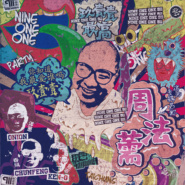

周法薷Faru Chou
============================

|  |  |
| :--: | :-- |
| [ 周法薷Faru Chou](https://emumo.xiami.com/album/2102713950) | **艺人**: [玖壹壹](../index.md) **语种**: 国语 **唱片公司**: 混血儿娱乐工作室, 滚石唱片 **发行时间**: 2017年05月26日 **专辑类别**: 录音室专辑 **专辑风格**: 流行说唱 Pop Rap **播放数**: 2456424 **收藏数**: 1338 **评论数**: 96  |

## 简介

2017 玖壹壹第三张专辑  
  
歌曲一【我是冠军】  
作词：廖建至／洪瑜鸿／陈皓宇   
作曲：廖建至／洪瑜鸿／陈皓宇   
制作人：廖建至／洪瑜鸿／陈皓宇 ／葛子毅  
配唱制作人：葛子毅／陈皓宇  
编曲：陈皓宇  
吉他：许硕钦  
和声：叶永菡／梁世达／梁世韵  
和声编写：叶永菡  
管乐演奏：萨克斯风：林秉宏／小喇叭：郑文凤／伸缩号：邓亦俊  
管乐编写： 林秉宏  
录音师：游朝扬 （佳声录音室）／ 葛子毅（Mimicker Studio )  
混音师：葛子毅 (Mimicker Studio)  
  
「我是冠军」歌曲为即将要发行的第三张所推出的第一波歌曲，这首歌曲以丰富的音乐结合呈现，编曲中加入管乐的演奏，让整首歌曲更加丰富而有气势。MV拍摄为玖壹壹首次以高制作费200万打造冠军歌曲，邀来台湾于世界知名的冠军一同参与演出，歌词以正面励志的文字阐述玖壹壹希望传递台湾其实有很多人才在等待机会，如果企业及政府能够给予他们更多的舞台，他们将有机会在世界发光发热，希望透过玖壹壹歌曲的高度传唱，传播正面励志的思考，『成功的机会是留给准备好的人！「我是冠军」音乐录像带选在2017年01月01日上线，除了是玖壹壹给自己的勉励之外，也希望带给所有人更正面的努力及思考，音乐录像带在台北、高雄取景拍摄，花了3天的拍摄时间及一个月的动画制作，三人于MV中首次体验帅气赛车服，一开始看到脚本时，原以为导演会安排真的在赛车场中拍摄演出，没想到只是电动的小赛车，但童心未泯的三人也是玩得非常开心；MV中也邀来世界超马冠军-林义杰、世界甜点冠军-陈立喆、世界调酒冠军-郭植伶一起入镜，拍摄过程中导演以一些夸张的手法要让玖壹壹体验要获得世界冠军不是这么简单的，需要付出许多的心血；MV外景拍摄，玖壹壹首次坐上气派的游艇站在甲板上飙速游爱河，这次的MV脚本有这段的演出，也让玖壹壹体验象征代表台湾出国比赛得冠军的感觉，2017年从这首歌曲出发，玖壹壹的心理也希望能够有机会能够将台湾文化的歌曲传递到世界，成为大家心目中的冠军。  
  
  
歌曲二【LIHO】  
作词：廖建至／唐溢 Ty.   
作曲：廖建至／唐溢 Ty. ／ Huang Fu  
音乐制作人：葛子毅 / 廖建至／ Huang Fu  
编曲：Huang Fu  
混音师：葛子毅 (Mimicker Studio) / Ty.  
  
总是于歌曲创作上出奇招的玖壹壹，首次与大陆知名饶舌嘻哈歌手「唐溢TY」一起合作这首歌曲《LIHO》，这首歌曲由玖壹壹的「健志」独当一面，将台湾的闽南话结合TY的大陆四川话，歌曲一反玖壹壹之前的幽默创作风格，两人希望分别将不同的两地文化透过歌曲交流带给歌迷听觉上的冲击，编曲以浓厚的中国风味呈现，而歌曲中常常出现的”LIHO”，意旨闽南话中”你好”的意思，由于歌曲当中也有TY特别的唱腔（成都口音），网络一上线后，随即有人留言说歌曲是写给王力宏的 『力宏冰友歌』(LIHO LIHO LI LIHO LIHO 朋友啊)，也让网友对这首歌的关注度超高，简单易懂的歌词搭配特别的曲风更是成为洗脑听众的神曲；玖壹壹的健志则是对于这首歌曲有不一样的突破非常开心的说：『这次编曲的部分找了在地台中音乐人『黄富彦』，我觉得很特别 ，因为他的音乐都是电子居多，但融入传统乐器，变的更像华人做的音乐。』  
这首歌曲的音乐录像带找来谢干干打造音乐录像带视觉，健志和TY开着金色古董车，在黑夜帅气狂飙，城市高楼与300年历史的彰化芳苑普天宫互相辉映，让整首歌充满浓浓的神秘和华丽的色彩，这次的MV中的造型更是以西方的嘻哈文化融入中国特色，让整支音乐录像带与音乐不谋合而，这首《LiHO》是两岸音乐人的创作，质感和曲风都很国际化，让关注玖壹壹的歌迷大开眼界，认为编曲真的够猛、混音真的棒，是一首最『屌』由两岸合作的嘻哈歌曲。  
  
  
歌曲三【加乐福尼亚】  
作词：廖建至／洪瑜鸿／陈皓宇   
作曲：廖建至／洪瑜鸿／陈皓宇   
制作人：廖建至／洪瑜鸿／陈皓宇 ／葛子毅  
配唱制作人：葛子毅／陈皓宇  
编曲：陈皓宇  
吉他：葛子毅  
葛子毅（Mimicker Studio )  
混音师：葛子毅 (Mimicker Studio)  
  
【加乐福尼亚】这首歌曲的创作的完成横跨台湾与美国两地，源自于有一天玖壹壹的春风梦到家里的冷气坏掉，春风热到作梦到自己去买冷气抽奖抽到美国行，而找了健志与洋葱一起去到美国游玩的行程分享，当然在过程中也是由洋葱努力争取掷杯而有了这趟美国行，这趟旅程中让玖壹壹顺利完成这首歌曲创作的最大动力则是到康普顿去探索美国最早流行的嘻哈文化，这趟的旅行探索让玖壹壹学习到许多嘻哈音乐的知识；【加乐福尼亚】当中所出现的环球影城、拉斯韦加斯、迪斯尼乐园等都是三人小时候梦想中的景点，歌词中描写到的”去迪斯尼看恐龙”，这其实是洋葱小时候不知道哪边听来的，这一次的洛杉矶迪斯尼乐园之行，也是洋葱想要去一圆小时候的梦想及看恐龙，没想到玖壹壹一到现场后，发现人山人海而失去了排队的耐心，只好到处到景点拍拍照而已，最后晚上离开到饭店的时候，可爱的洋葱还是问了一句，那到底迪斯尼乐园有没有恐龙。对于春风而言，最想去环球影城游玩，当然大器的春风也在环球影城首次尝试国外当土豪的情境，花了大把银子请所有去美国的同伴一起快速通关；拉斯韦加斯则是让三人小赌怡情，最后没输赢而有了完美结尾的美国行。这首【加乐福尼亚】以轻快的曲风呈现搭配无俚头的歌词组合，希望带给歌迷一种玖壹壹式的幽默。  
  
  
歌曲四【抓泥鳅】  
原作：侯德健  
作词：洪瑜鸿／廖文豪  
作曲： 洪瑜鸿／廖文豪 / DJ Chronic  
编曲：DJ Chronic  
配音：NANA梁云菲  
混音师：DJ Chronic  
制作人：DJ Chronic  
  
【抓泥鳅】为玖壹壹春风与187INC廖文豪共同创作的歌曲，这首歌曲是在一次玖壹壹与187INC户外演出时，春风与文豪一起到田中间拍照时，不约而同嘴巴哼着儿歌《抓泥鳅》而有的创作灵感后诞生的歌曲，一首耳熟能详的儿歌成为重新编曲及谱词后，加入了全新的风貌，歌曲在大陆一上线，更让廖文豪成为人人口中的泥鳅哥，而整支音乐录像带的风格更是以复古的手法呈现，玖壹壹春风饰演抓泥鳅公会总裁，187INC廖文豪饰演泥鳅哥，牵着一头牛去抓泥鳅的剧情设计更是让人拍案叫绝，虽然看完音乐录像带之后，让人有种摸不着头绪的感觉，但却让许多网友非常喜爱，连大陆的音乐人谢帝都因这首歌曲【抓泥鳅】的创作而推荐，虽然许多网友的留言都说MV里面的动作怎么「色色的」，泥鳅哥廖文豪则霸气的说：「怎会色色的，四个男人牵着一头牛能怎么样，而且当初以抓泥鳅为出发点，是觉得这样的事业能够成立职业工会，因为泥鳅是美容圣品，胶质又多，能够让女孩美到出水，如果能够推广这样的事业，搞不好能够带来商机。」【抓泥鳅】这首歌曲及音乐录像带的创意推出，的确造成网友心目中最佳创意与话题性十足的歌曲之一。  
  
歌曲五【大显神威】  
作词：廖建至/洪瑜鸿/陈皓宇  
做曲：廖建至/洪瑜鸿/陈皓宇  
编曲：陈皓宇  
配唱制作人:葛子毅/陈皓宇   
制作人: 陈皓宇/葛子毅   
混音师: 葛子毅 ( Mimicker Studio )  
录音师：葛子毅 ( Mimicker Studio )  
  
2016年大显神威电影主题曲、玖壹壹3场大型售票演唱会开场曲，整首曲风磅礴而有气势，歌词阐述每一个人都能有机会在不同的领域做好准备而发光发热，浅显易懂的歌词中带到刘德华、金曲奖等文字更是代表玖壹壹期望有一天也能够大显神威，闪闪发光，成为人人注目的焦点。  
大显神威所拍摄剪辑的MV更是同步带所有歌迷回顾大型售票演唱会中精彩画面，影像中结合漫画式的动画制作呈现，以透过小时候的梦想期待有一天能够与漫画人物一起成为英雄的憧憬来搭配玖壹壹于演唱会中所演出的桥段呼应，玖壹壹希望未来不管自己及歌迷在任何领域中，都能随时都准备好，一起大显神威。  
  
  
歌曲六【都是我的错】  
作词:陈皓宇  
做曲:陈皓宇  
编曲：葛子毅  
Bass：阿炮老师  
制作人：葛子毅   
混音师: 葛子毅 ( Mimicker Studio )  
录音师：葛子毅 ( Mimicker Studio )  
  
玖壹壹洋葱以内心世界的情感诠释创作收录于第三张专辑周法薷，这首歌曲由洋葱独挑大梁、传达失去一段感情是多么锥心刺骨的创作歌曲，以写实的文字唱出男人表达懊悔的心声，看似简单的文字却充满心理最深的悔意，用来传达失去另一伴的不舍之情，创作灵感来自于每一天朝夕相处的生活方式，虽然简单，但记忆犹新，许多情人总是懊悔失去后才懂得对方的好，才习惯原来有对方的生活是多么的快乐，同样也深刻体悟到带给彼此生活中最美好的事物看似微不足道，但其实才是最刻苦铭心的记忆，字里行间「都是我的错」来表达其实我是认真珍惜有妳的日子，洋葱希望透过这首创作歌曲能够让每一位情人都能永远疼惜，能够将你所认定的对方好好的放在心里呵护。 

## 曲目

## 评论

|  |  |  |  |
| :-- | :-- | :-- | :-- |
|  [虾米用户](https://emumo.xiami.com/u/356174072) 價值是你自己 2019-12-12 10:06 赞(0) 踩(0) | 
心情不好的時候，只要聽三首911立馬揺起來！
 |
|  [虾米用户](https://emumo.xiami.com/u/9229054)  2019-06-29 01:22 赞(0) 踩(0) | 
好聽.
 |
|  [虾米用户](https://emumo.xiami.com/u/38500982)  2019-04-23 08:46 赞(0) 踩(0) | 
好聽
 |
|  [虾米用户](https://emumo.xiami.com/u/288118556)  2018-01-16 07:47 赞(1) 踩(0) | 
很赞，继续加油
 |
|  [虾米用户](https://emumo.xiami.com/u/229803939)  2018-01-05 21:28 赞(0) 踩(0) | 
好好听
 |
|  [虾米用户](https://emumo.xiami.com/u/39014758) 暂无签名~ 2017-09-26 04:55 赞(0) 踩(0) | 
双击666
 |
|  [虾米用户](https://emumo.xiami.com/u/106347630) 阳刚帅哥一枚 欢迎妹子来... 2017-09-20 22:25 赞(0) 踩(0) | 
其实这张专辑最有个性的是黑暗的社会，编曲最丰富的是我是冠军，最符合审美的是8+9 最搞笑到是抓泥鳅 最派对的是派对侠 最适合旅行的是家乐福尼亚    最拉低整张水准的是都是我的错
 |
| ⇒ |  [虾米用户](https://emumo.xiami.com/u/106347630) 阳刚帅哥一枚 欢迎妹子来... 2017-09-20 22:26 赞(0) 踩(0) | 
最香港的是没你我没差  其实很好听的专辑
 |
|  [虾米用户](https://emumo.xiami.com/u/7997485)  2017-07-09 02:11 赞(0) 踩(0) | 
骚
 |
|  [虾米用户](https://emumo.xiami.com/u/7997485)  2017-07-09 02:10 赞(0) 踩(0) | 
骚
 |
|  [虾米用户](https://emumo.xiami.com/u/309093189)  2017-07-02 11:47 赞(0) 踩(0) | 
你好
 |
|  [虾米用户](https://emumo.xiami.com/u/307837417)  2017-06-27 12:53 赞(0) 踩(0) | 
玖壹壹有不好听的歌吗？超屌
 |
|  [虾米用户](https://emumo.xiami.com/u/206926447)  2017-06-15 23:17 赞(1) 踩(0) | 
内容已删除
 |
| ⇒ |  [虾米用户](https://emumo.xiami.com/u/13674385)  2017-06-17 10:29 赞(0) 踩(0) | 
8+9是什么意思
 |
| ⇒ |  [虾米用户](https://emumo.xiami.com/u/280344991)  2017-06-22 13:06 赞(0) 踩(0) | 
这整张专辑不就是三个8+9做出来的吗？
 |
|  [虾米用户](https://emumo.xiami.com/u/257339509)  2017-06-08 12:32 赞(2) 踩(0) | 
超喜欢玖壹壹的歌~
 |
|  [虾米用户](https://emumo.xiami.com/u/37065611)  2017-06-06 21:17 赞(1) 踩(0) | 
抓泥鳅很好听
 |
|  [虾米用户](https://emumo.xiami.com/u/37065611)  2017-06-06 21:16 赞(0) 踩(0) | 
纯rap? 没听全, 里面有R&amp;amp;amp;B吗? 希望有热狗的专辑&amp;amp;lt;wake up&amp;amp;gt;的全面
 |
| ⇒ |  [虾米用户](https://emumo.xiami.com/u/90709428)  2017-06-19 13:30 赞(0) 踩(0) | 
那你别在其他艺人的专辑里评论，行吗？
 |
|  [虾米用户](https://emumo.xiami.com/u/282087434)  2017-06-05 00:15 赞(0) 踩(0) | 
不好听，听完整个人都不舒服。。。
 |
|  [虾米用户](https://emumo.xiami.com/u/56101620) 听世界的声音 它是一剂心... 2017-06-04 19:58 赞(4) 踩(0) | 
其实没必要讨论谁红谁不红的，就五月天顽童等一系列台湾组合而言，每个组合的音乐风格都不一样，每个人也各有所好。再者，评论一个东西火不火难道只看他的mv播放量？时代在不断进步，传播媒介当然也在时时更替，点击率播放量当然会不断增多。歌曲的火也并不直接等于歌曲质量，当然也喜欢911啦，台语在歌曲里超可爱
 |
|  [虾米用户](https://emumo.xiami.com/u/301315335)  2017-06-02 20:03 赞(0) 踩(0) | 
  
 |
|  [虾米用户](https://emumo.xiami.com/u/50759989)  2017-06-02 15:32 赞(1) 踩(0) | 
服了，土成这样，台湾人的品味，真的服
 |
| ⇒ |  [虾米用户](https://emumo.xiami.com/u/280344991)  2017-06-04 22:03 赞(0) 踩(0) | 
台湾人的品味正在走下坡，虽然这几个都是流氓份子，但也让人想到，美国的饶舌嘻哈界不也一堆这样的人物？只能说台湾好的不学.....
 |
| ⇒ |  [虾米用户](https://emumo.xiami.com/u/224153398)   2017-06-18 16:46 赞(0) 踩(0) | 
<q><b>麥麥说：</b></q>
 |
| ⇒ |  [虾米用户](https://emumo.xiami.com/u/90709428)  2017-06-19 13:32 赞(0) 踩(0) | 
你自己什么品味什么水平?你有能力来确定什么是好坏？
 |
| ⇒ |  [虾米用户](https://emumo.xiami.com/u/50759989)  2017-06-20 08:49 赞(0) 踩(0) | 
<q><b>无非说：</b></q>
 |
| ⇒ |  [虾米用户](https://emumo.xiami.com/u/280344991)  2017-06-22 12:41 赞(0) 踩(0) | 
<q><b>宏说：</b></q>
 |
| ⇒ |  [虾米用户](https://emumo.xiami.com/u/3242104)   2017-06-30 11:44 赞(0) 踩(0) | 
不能说很土吧？ 只能说这张专辑很台
 |
| ⇒ |  [虾米用户](https://emumo.xiami.com/u/13780273)  2017-06-30 21:23 赞(0) 踩(0) | 
<q><b>麥麥说：</b></q>
 |
| ⇒ |  [虾米用户](https://emumo.xiami.com/u/280344991)  2017-07-01 19:20 赞(0) 踩(0) | 
<q><b>扁说：</b></q>
 |
| ⇒ |  [虾米用户](https://emumo.xiami.com/u/13780273)  2017-07-04 01:20 赞(0) 踩(0) | 
<q><b>麥麥说：</b></q>
 |
| ⇒ |  [虾米用户](https://emumo.xiami.com/u/106347630) 阳刚帅哥一枚 欢迎妹子来... 2017-08-03 23:18 赞(0) 踩(0) | 
屁才土  我觉得很正常的华语专辑  制作上很一流
 |
| ⇒ |  [虾米用户](https://emumo.xiami.com/u/106347630) 阳刚帅哥一枚 欢迎妹子来... 2017-08-03 23:19 赞(0) 踩(0) | 
我是冠军这首歌的编曲我真没觉得哪里土，要说唯一缺点就是三人唱功不行
 |
| ⇒ |  [虾米用户](https://emumo.xiami.com/u/50759989)  2017-08-15 22:18 赞(0) 踩(0) | 
<q><b>俺村俺最帅说：</b></q>
 |
| ⇒ |  [虾米用户](https://emumo.xiami.com/u/106347630) 阳刚帅哥一枚 欢迎妹子来... 2017-09-26 22:33 赞(0) 踩(0) | 
<q><b>RealAlex说：</b></q>
 |
| ⇒ |  [虾米用户](https://emumo.xiami.com/u/34965085) 天真是冬天的袍子 2018-06-28 11:36 赞(0) 踩(0) | 
<q><b>扁说：</b></q>
 |
| ⇒ |  [虾米用户](https://emumo.xiami.com/u/18031954)   2018-11-08 15:23 赞(0) 踩(0) | 
典型的一概而论，台湾人也不是全喜欢911的歌。另外，音乐品味和审美一样，本来就是众口难调的玩意儿，有的人还爱听电音呢，有的人也觉得电音土呢。前两年流行穿NMD我还觉得像童鞋呢，但不妨别人喜欢。
 |
|  [虾米用户](https://emumo.xiami.com/u/3548285) 没用过的词 2017-06-02 12:48 赞(0) 踩(0) | 
呐 音乐和词都还不错
 |
|  [虾米用户](https://emumo.xiami.com/u/88650890) BE YOURSELF ... 2017-06-02 11:16 赞(0) 踩(0) | 
911帥炸，第一個破蛋的台灣本地饒舌團體
 |
|  [虾米用户](https://emumo.xiami.com/u/7874823) 不再沉溺，做个温暖别人的... 2017-05-31 23:33 赞(0) 踩(0) | 
又开始流行老年disco辣？
 |
|  [虾米用户](https://emumo.xiami.com/u/123888280)   2017-05-28 02:16 赞(1) 踩(0) | 
真的够烂的
 |
| ⇒ |  [虾米用户](https://emumo.xiami.com/u/299348167) 簡單。 2017-05-28 06:40 赞(0) 踩(0) | 
你是照到鏡子哦？
 |
|  [虾米用户](https://emumo.xiami.com/u/9793938) 要说拜拜啦虾米音乐 2017-05-27 11:34 赞(2) 踩(0) | 
顽童在台湾圈内的口碑其实很差的。。
 |
| ⇒ |  [虾米用户](https://emumo.xiami.com/u/39109949) - 2017-05-28 11:04 赞(0) 踩(0) | 
九一一也是差不多
 |
| ⇒ |  [虾米用户](https://emumo.xiami.com/u/48152535) 要么孤独 要么庸俗 2017-05-31 18:52 赞(0) 踩(0) | 
谁告诉你的？我在台湾上学 看过他们很多演出 很明确的告诉你 他们很火 口碑也并不差
 |
| ⇒ |  [虾米用户](https://emumo.xiami.com/u/9793938) 要说拜拜啦虾米音乐 2017-06-01 10:54 赞(0) 踩(0) | 
<q><b>thug life说：</b></q>
 |
| ⇒ |  [虾米用户](https://emumo.xiami.com/u/17408019)   2017-11-08 11:04 赞(0) 踩(0) | 
聼你在唬爛。。。。。
 |
|  [虾米用户](https://emumo.xiami.com/u/299348167) 簡單。 2017-05-27 09:58 赞(0) 踩(0) | 
讚
 |
|  [虾米用户](https://emumo.xiami.com/u/13911932) 暂冇签名~ 2017-05-27 08:35 赞(0) 踩(0) | 
[带墨镜笑]
 |
|  [虾米用户](https://emumo.xiami.com/u/200524658) 永远的永远 2017-05-27 03:13 赞(2) 踩(0) | 
哈哈打铁night
 |
|  [虾米用户](https://emumo.xiami.com/u/7730240) 卫星发射基地 2017-05-27 00:19 赞(0) 踩(0) | 

 |
|  [虾米用户](https://emumo.xiami.com/u/37840483) 再說吧 2017-05-27 00:10 赞(3) 踩(0) | 
先不管土不土嗨 每次唱k必点明日再搁来
 |
|  [虾米用户](https://emumo.xiami.com/u/2418238) weibo: @尤米口 2017-05-27 00:07 赞(0) 踩(0) | 
WOW&amp;not;&amp;not;
 |
|  [虾米用户](https://emumo.xiami.com/u/280511175) ¡Extraño! 2017-05-26 23:21 赞(15) 踩(0) | 
台湾最红的不是五月天？
 |
| ⇒ |  [虾米用户](https://emumo.xiami.com/u/300257830)  2017-05-29 20:42 赞(0) 踩(0) | 
伍佰
 |
|  [虾米用户](https://emumo.xiami.com/u/277748239)  2017-05-26 23:08 赞(0) 踩(0) | 
很好听
 |
|  [虾米用户](https://emumo.xiami.com/u/31410019) 暂无签名~ 2017-05-26 21:51 赞(1) 踩(0) | 
在金曲奖上的演出很惊艳
 |
|  [虾米用户](https://emumo.xiami.com/u/292277013)  2017-05-26 19:15 赞(18) 踩(0) | 
玖壹壹现在是台湾最火的组合YouTube mv播放过2亿
 |
| ⇒ |  [虾米用户](https://emumo.xiami.com/u/106347630) 阳刚帅哥一枚 欢迎妹子来... 2017-09-26 22:30 赞(0) 踩(0) | 
现在7亿点击率了
 |
|  [虾米用户](https://emumo.xiami.com/u/18013100) just fine 2017-05-26 16:29 赞(0) 踩(0) | 
玩泥巴，抓泥鳅
 |
|  [虾米用户](https://emumo.xiami.com/u/84102812) 我还没想好要写什么... 2017-05-26 15:13 赞(0) 踩(0) | 
在台湾超红！
 |
|  [虾米用户](https://emumo.xiami.com/u/9368417) 听最酷的歌，摸最柔的波 2017-05-26 14:14 赞(0) 踩(0) | 
其实我觉得他们直接纯音乐就很好听
 |
|  [虾米用户](https://emumo.xiami.com/u/9368417) 听最酷的歌，摸最柔的波 2017-05-26 14:13 赞(0) 踩(0) | 
嗨，加油
 |
|  [虾米用户](https://emumo.xiami.com/u/13911932) 暂冇签名~ 2017-05-26 12:27 赞(1) 踩(0) | 
抓泥鳅可以
 |
|  [虾米用户](https://emumo.xiami.com/u/263585128)  2017-05-26 10:21 赞(0) 踩(0) | 
厉害！黄立成大哥都来了   
 |
|  [虾米用户](https://emumo.xiami.com/u/49009127)  2017-05-26 08:47 赞(0) 踩(0) | 
动感
 |
|  [虾米用户](https://emumo.xiami.com/u/882766)  2017-05-05 16:31 赞(0) 踩(0) | 
竟然还有 t.y
 |
|  [虾米用户](https://emumo.xiami.com/u/11763865)  2017-05-04 14:16 赞(1) 踩(0) | 

 |
|  [虾米用户](https://emumo.xiami.com/u/280725669) 罗国栋你一定要忠于青春的... 2017-05-03 15:18 赞(0) 踩(0) | 
舒服
 |
|  [虾米用户](https://emumo.xiami.com/u/263585128)  2017-04-21 00:41 赞(1) 踩(0) | 
写的一级棒
 |
|  [虾米用户](https://emumo.xiami.com/u/283865914)  2017-04-02 22:21 赞(0) 踩(0) | 
泥鳅王
 |
|  [虾米用户](https://emumo.xiami.com/u/90865306)   2017-03-31 11:56 赞(0) 踩(0) | 
非常棒的mini砖
 |
|  [虾米用户](https://emumo.xiami.com/u/57191756)  2017-03-22 16:58 赞(0) 踩(0) | 
先打给KEN-G 不知洋葱甘要他们说OK 明天别上班我们就飞我最喜欢这一句！！！！
 |
|  [虾米用户](https://emumo.xiami.com/u/57191756)  2017-03-22 16:55 赞(2) 踩(0) | 
加乐福尼亚单曲循环~感觉好夏天好自由哦！
 |
|  [虾米用户](https://emumo.xiami.com/u/50546183)  2017-03-18 22:52 赞(0) 踩(0) | 
最红的难道不是热狗？
 |
|  [虾米用户](https://emumo.xiami.com/u/3510038) 海天之恋 2017-03-18 19:57 赞(7) 踩(0) | 
泥鳅哥来一斤呗！ 
 |
|  [虾米用户](https://emumo.xiami.com/u/280557179)  2017-03-18 08:47 赞(0) 踩(0) | 
好听歌
 |
|  [虾米用户](https://emumo.xiami.com/u/43479435)  2017-03-18 07:31 赞(0) 踩(0) | 
     
 |
|  [虾米用户](https://emumo.xiami.com/u/272871128)  2017-03-18 06:39 赞(0) 踩(0) | 
不错
 |
|  [虾米用户](https://emumo.xiami.com/u/794813)  2017-03-17 20:23 赞(0) 踩(0) | 
good
 |
|  [虾米用户](https://emumo.xiami.com/u/11471387)   2017-03-17 18:41 赞(8) 踩(0) | 
台湾最红的不是顽童？
 |
| ⇒ |  [虾米用户](https://emumo.xiami.com/u/43479435)  2017-03-18 07:31 赞(0) 踩(0) | 
fuffcffuttrsxxvfg gg
 |
| ⇒ |  [虾米用户](https://emumo.xiami.com/u/8622836)  2017-03-19 15:32 赞(0) 踩(0) | 
玖壹壹和顽童都是好朋友，各有各的风格 都比较火
 |
| ⇒ |  [虾米用户](https://emumo.xiami.com/u/2498975) Your Ghost W... 2017-05-27 13:56 赞(0) 踩(0) | 
<q><b>Kositu说：</b></q>
 |
| ⇒ |  [虾米用户](https://emumo.xiami.com/u/255717752)  2017-05-30 11:08 赞(0) 踩(0) | 
玖壹壹在台湾的人气是跟五月天、周杰伦五五开的，已经不是hiphop圈子可以比的。
 |
| ⇒ |  [虾米用户](https://emumo.xiami.com/u/70323390) 我还没想好要写什么... 2017-05-30 23:09 赞(0) 踩(0) | 
在台灣玖壹壹確實比頑童更紅，但就音樂性來說頑童跟玖壹壹不相上下，各有千秋。
 |
| ⇒ |  [虾米用户](https://emumo.xiami.com/u/106347630) 阳刚帅哥一枚 欢迎妹子来... 2017-09-20 22:26 赞(0) 踩(0) | 
<q><b>兴颢说：</b></q>
 |
|  [虾米用户](https://emumo.xiami.com/u/258130941) 單身 2017-03-17 18:13 赞(0) 踩(0) | 
玖壹壹超讚
 |
|  [虾米用户](https://emumo.xiami.com/u/274169251)  2017-03-17 16:32 赞(0) 踩(0) | 
玖壹壹！！！
 |
|  [虾米用户](https://emumo.xiami.com/u/57191756)  2017-03-17 14:37 赞(0) 踩(0) | 
这编曲真的好棒！好立体。。
 |
|  [虾米用户](https://emumo.xiami.com/u/93786658)   2017-03-17 14:23 赞(0) 踩(0) | 
我很酷
 |
|  [虾米用户](https://emumo.xiami.com/u/42812575) 用音乐填满我的空虚 2017-03-17 14:08 赞(0) 踩(0) | 
可以哦
 |
|  [虾米用户](https://emumo.xiami.com/u/255759307) 喜欢说唱电音，但最爱r&... 2017-03-17 13:06 赞(0) 踩(0) | 
哩厚是健志ft.ty
 |
|  [虾米用户](https://emumo.xiami.com/u/259085250) 我还没想好要写什么... 2017-03-17 12:03 赞(0) 踩(0) | 
终于等到了
 |
|  [虾米用户](https://emumo.xiami.com/u/33016056)  2017-03-16 17:58 赞(0) 踩(0) | 
快出快出
 |
|  [虾米用户](https://emumo.xiami.com/u/8622836)  2017-03-16 16:51 赞(0) 踩(0) | 
cool 坐等
 |
