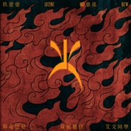
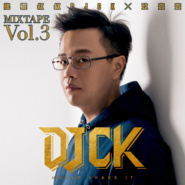
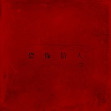

玖壹壹
============================

|  |  |
| :--: | :-- |
| [ 玖壹壹](https://i.xiami.com/nine11) | **播放数**: 12550449 **粉丝数**: 4850 **评论数**: 172 **地区**: Taiwan, PRC 中国台湾 **风格**: 闽南语流行 Bân-lâm-gú Pop  |

## 档案

之所以叫玖壹壹 
是因为成立于2009年9月11日 
简介 
玖壹壹～来自台中的音乐团体～ 
代表作：打铁 / 痴情男子汉 / 冻未条 / 你不爱我 / 宅男俱乐部/ 爱的总铺师 / 吼搭啦 / 梦醒时分

## 专辑

| 名称 | 语种 | 唱片公司 | 发行时间 | 专辑类别 | 专辑风格 |
| :--: | :-- | :-- | :-- | :-- | :-- |
| [ LOCAL](./albums/5021993983.md) | 国语 | 混血儿娱乐工作室 | 2020年11月24日 | 录音室专辑 | 流行 Pop |
| [ 偶喜翻你I LIKE YOU](./albums/2108134876.md) | 国语 | 混血儿娱乐工作室 | 2020年03月06日 | EP, 单曲 | 流行 Pop |
| [ 大家乐](./albums/2108139333.md) | 其他 | Gluten Free Records | 2020年01月17日 | EP, 单曲 | 流行 Pop |
| [ Fire 火](./albums/2105431239.md) | 国语 | 滚石唱片 | 2019年11月15日 | EP, 单曲 |  |
| [ 摇摆叔叔DJ CK x 玖壹壹 MIXTAPE Vol.3](./albums/2105369941.md) | 国语 | 滚石唱片 | 2019年10月24日 | 录音室专辑 |  |
| [ 来个蹦蹦](./albums/2105232806.md) | 国语 | 厂牌发行 | 2019年08月16日 | 录音室专辑 |  |
| [ 搏感情](./albums/2104317328.md) | 国语 | 滚石唱片 | 2018年12月05日 | 录音室专辑 | 摇滚 Rock & Roll, 电子舞曲 EDM / Electronic Dance Music, 嘻哈 Hip-Hop |
| [ 讨债情歌](./albums/2104132596.md) | 国语 | 滚石唱片 | 2018年10月23日 | EP, 单曲 |  |
| [ 恐怖情人](./albums/2103946481.md) | 国语 | 滚石唱片 | 2018年08月17日 | EP, 单曲 |  |
| [ 我跟你卡好](./albums/2103821120.md) | 国语 | 滚石唱片 | 2018年07月21日 | EP, 单曲 | 电子舞曲 EDM / Electronic Dance Music |
| [ Working Holiday](./albums/2103751017.md) | 国语 | 滚石唱片 | 2018年06月15日 | EP, 单曲 | 流行说唱 Pop Rap |
| [ 爱我你会死2018Loving Me Makes You Die](./albums/2103714268.md) | 国语 | 滚石唱片 | 2018年05月21日 | EP, 单曲 | 闽南语流行 Bân-lâm-gú Pop |
| [ G CAR](./albums/2103686742.md) | 国语 | 滚石唱片 | 2018年04月16日 | EP, 单曲 | 陷阱说唱 Trap Rap |
| [ 摇摆叔叔DJ CK x 玖壹壹 MIXTAPE Vol.2](./albums/2103667271.md) | 国语 | 滚石唱片 | 2018年04月04日 | 录音室专辑 | 电子舞曲 EDM / Electronic Dance Music |
| [ 周法薷Faru Chou](./albums/2102713950.md) | 国语 | 混血儿娱乐工作室, 滚石唱片 | 2017年05月26日 | 录音室专辑 | 流行说唱 Pop Rap |
| [ 摇摆叔叔DJ CK x 玖壹壹 MIXTAPE Vol.1](./albums/2100388849.md) | 国语 | 滚石唱片 | 2016年09月11日 | 录音室专辑 |  |
| [ 9453玖肆伍叁](./albums/2100244640.md) | 闽南语 | 滚石唱片 | 2015年12月05日 | 录音室专辑 | 闽南语流行 Bân-lâm-gú Pop |
| [ 歪国人International](./albums/28630129.md) | 国语 | 禾广娱乐 | 2015年04月08日 | EP, 单曲 | 独立电子乐 Indietronica, 流行说唱 Pop Rap |
| [ 心内的话](./albums/909883853.md) | 国语 | 禾广娱乐 | 2014年09月03日 | EP, 单曲 |  |
| [ 打铁PARTY](./albums/1804957406.md) | 闽南语 | 禾广娱乐 | 2014年04月10日 | 录音室专辑 | 闽南语流行 Bân-lâm-gú Pop |
| [ 你不爱我](./albums/1989255108.md) | 闽南语 | 独立发行 | 2013年01月01日 | 录音室专辑 |  |

## 评论

|  |  |  |  |
| :-- | :-- | :-- | :-- |
|  [虾米用户](https://emumo.xiami.com/u/8227072) 什么都会听一点点～ 2020-12-03 22:46 赞(0) 踩(0) | 
从9453追到老周，博感情搏得掉了队，这次要local回来了，sen sen sen .
 |
|  [虾米用户](https://emumo.xiami.com/u/847967) 你们不让老子更老子就不更... 2020-10-06 15:02 赞(0) 踩(0) | 
为什么没有新专辑？
 |
|  [虾米用户](https://emumo.xiami.com/u/40130058) JL 2019-12-01 01:24 赞(0) 踩(0) | 
希望玖壹壹永远都是玖壹壹，不要被无处不在的垃圾给污染了 
 |
|  [虾米用户](https://emumo.xiami.com/u/15322995)  2019-09-11 22:36 赞(1) 踩(0) | 
九一一十年囖
 |
|  [虾米用户](https://emumo.xiami.com/u/8337431) 以乐会友 2019-08-15 02:34 赞(0) 踩(0) | 
台湾168
 |
|  [虾米用户](https://emumo.xiami.com/u/98066030) 念念不忘，必有回响。虾米... 2019-06-30 11:34 赞(0) 踩(0) | 
为什么痴情玫瑰花这首歌没有了呢
 |
|  [虾米用户](https://emumo.xiami.com/u/421222309)  2019-03-15 17:50 赞(0) 踩(0) | 
来重庆开演唱会啦！
 |
|  [虾米用户](https://emumo.xiami.com/u/48924027)  2019-03-08 15:06 赞(0) 踩(0) | 
变态吗这不是？
 |
|  [虾米用户](https://emumo.xiami.com/u/419958771)  2019-02-28 22:52 赞(2) 踩(0) | 
爱听，母语歌能够遮呢有节奏，足欢喜
 |
|  [虾米用户](https://emumo.xiami.com/u/10934599) . 2019-02-05 09:50 赞(2) 踩(0) | 
为健志打个call
 |
|  [虾米用户](https://emumo.xiami.com/u/405062399)  2018-10-20 08:32 赞(2) 踩(0) | 
这几天一直在无限循环嘻哈庄，太洗脑了，国语闽南语英语，这首歌的编词太酷炫了
 |
| ⇒ |  [虾米用户](https://emumo.xiami.com/u/23586839)   2018-12-15 23:54 赞(0) 踩(0) | 
同嘻哈庄，LULU的声音太好听了
 |
|  [虾米用户](https://emumo.xiami.com/u/293692544) 你敢给我说话吗？我咬你 2018-10-04 17:30 赞(1) 踩(0) | 
好听
 |
|  [虾米用户](https://emumo.xiami.com/u/7602146) 一个永远长不大的孩紫 2018-09-07 19:16 赞(4) 踩(0) | 
土味嘻哈是这么的与众不同，让我的耳朵醉了23333333，不过我想再醉久一点！！！！加油多出点好音乐！
 |
|  [虾米用户](https://emumo.xiami.com/u/299932888) 生活无趣，只有在虾米才能... 2018-07-20 16:49 赞(3) 踩(0) | 
喜欢你们的歌曲，很有个性，与现在的社会形成了鲜明的对比
 |
|  [虾米用户](https://emumo.xiami.com/u/5755)  2018-05-28 23:34 赞(3) 踩(0) | 
我滴爱人呀~~ 天。。被洗脑了  靠北。。
 |
|  [虾米用户](https://emumo.xiami.com/u/140426718)  2018-05-11 22:34 赞(2) 踩(0) | 
我喜欢，就是好听的，911
 |
|  [虾米用户](https://emumo.xiami.com/u/298521034)  2018-04-30 21:48 赞(1) 踩(0) | 
溜冰场&amp;hellip;&amp;hellip;好ukiokkkiǒuu&amp;ugrave;uuuuuuu
 |
|  [虾米用户](https://emumo.xiami.com/u/353121727)  2018-04-14 20:23 赞(1) 踩(0) | 
不客气
 |
|  [虾米用户](https://emumo.xiami.com/u/10526872) 海未干涸，艺术未尽，她已... 2018-03-22 20:24 赞(2) 踩(0) | 
棒
 |
|  [虾米用户](https://emumo.xiami.com/u/318661393) 我还没想好要写什么... 2018-03-10 23:54 赞(1) 踩(0) | 
出一张签名CD有要的吗[带墨镜笑]
 |
|  [虾米用户](https://emumo.xiami.com/u/13267981) 很难再醒来 2018-03-09 03:51 赞(3) 踩(0) | 
MV真是土气冲天 笑死我了
 |
| ⇒ |  [虾米用户](https://emumo.xiami.com/u/424166894)  2019-06-24 06:32 赞(0) 踩(0) | 
所以呢？
 |
|  [虾米用户](https://emumo.xiami.com/u/2418238) weibo: @尤米口 2018-01-01 07:17 赞(1) 踩(0) | 
add
 |
|  [虾米用户](https://emumo.xiami.com/u/20297944)   2017-12-27 19:04 赞(7) 踩(0) | 
这就是正港台湾味
 |
|  [虾米用户](https://emumo.xiami.com/u/300801889)  2017-12-11 00:37 赞(13) 踩(0) | 
感觉宝岛台湾很神奇，出了很多有才的音乐人
 |
|  [虾米用户](https://emumo.xiami.com/u/332758432)  2017-11-27 23:56 赞(4) 踩(0) | 
哈哈哈，闽南语八个音，唔是我吹风，贡话就甲唱歌平样
 |
|  [虾米用户](https://emumo.xiami.com/u/231019700) 我还没想好要写什么... 2017-11-26 14:12 赞(5) 踩(0) | 
台湾真是一片神奇的土地，宝岛台湾
 |
|  [虾米用户](https://emumo.xiami.com/u/15250146)  2017-10-27 23:58 赞(10) 踩(0) | 
我是从罗百吉的音乐延伸过来的，因为百吉做过玖壹壹歌曲的混音版。我非常喜欢他们！没想到这里能听到他们的歌！大大的赞！ 
 |
|  [虾米用户](https://emumo.xiami.com/u/113137866) 看不清你，还是看不清自己... 2017-10-15 12:29 赞(1) 踩(0) | 
很强啊 厉害......
 |
|  [虾米用户](https://emumo.xiami.com/u/12959778)  2017-09-22 15:54 赞(1) 踩(0) | 
好听
 |
|  [虾米用户](https://emumo.xiami.com/u/315964684)  2017-09-05 10:47 赞(1) 踩(0) | 
闽南语的腔调更适合说唱，除了台湾地区，喜欢的人太少了
 |
| ⇒ |  [虾米用户](https://emumo.xiami.com/u/239942073)  2017-10-31 20:59 赞(0) 踩(0) | 
什么叫除了台湾，别人就是台湾的，语系还是一样的
 |
|  [虾米用户](https://emumo.xiami.com/u/306933726)  2017-08-30 13:17 赞(1) 踩(0) | 
第128，周围的人咋这么不懂欣赏呢
 |
|  [虾米用户](https://emumo.xiami.com/u/279621449) 我还没想好要写什么... 2017-08-26 16:25 赞(3) 踩(0) | 
推荐大家听嘻哈庄脚情
 |
|  [虾米用户](https://emumo.xiami.com/u/106347630) 阳刚帅哥一枚 欢迎妹子来... 2017-08-01 23:40 赞(0) 踩(0) | 
大爱玖壹壹
 |
|  [虾米用户](https://emumo.xiami.com/u/261332301) 我还没想好要写什么... 2017-07-30 10:09 赞(0) 踩(0) | 
可以的
 |
|  [虾米用户](https://emumo.xiami.com/u/19494335) 我是一只井底之蛙呱 2017-07-28 00:59 赞(1) 踩(0) | 
948794狂 哈哈哈哈哈哈
 |
|  [虾米用户](https://emumo.xiami.com/u/11700485) 闽南语/日语/后摇/摇滚... 2017-07-28 00:09 赞(11) 踩(0) | 
今年十八岁喜欢听闽南歌喜欢玖壹壹
 |
| ⇒ |  [虾米用户](https://emumo.xiami.com/u/239942073)  2017-10-31 20:59 赞(0) 踩(0) | 
我16
 |
|  [虾米用户](https://emumo.xiami.com/u/266069746)  2017-07-18 23:49 赞(3) 踩(0) | 
這rap組合阮甲意
 |
|  [虾米用户](https://emumo.xiami.com/u/258750709)   2017-07-17 02:37 赞(2) 踩(0) | 
911 愛死了
 |
|  [虾米用户](https://emumo.xiami.com/u/823994)  2017-07-13 23:39 赞(2) 踩(0) | 
我是爱你爱你 爱尬欲死的痴情男子汉
 |
|  [虾米用户](https://emumo.xiami.com/u/309635893) YO！Man！ 2017-07-06 19:54 赞(35) 踩(0) | 
玖壹壹在台湾最红的名，在台湾没有人不知道玖壹。因为我是台湾人
 |
| ⇒ |  [虾米用户](https://emumo.xiami.com/u/328388814)  2017-11-26 20:02 赞(0) 踩(0) | 
和顽童比咧
 |
| ⇒ |  [虾米用户](https://emumo.xiami.com/u/5902737)   2017-12-05 16:43 赞(0) 踩(0) | 
<q><b>说：</b></q>
 |
| ⇒ |  [虾米用户](https://emumo.xiami.com/u/239942073)  2018-01-08 23:17 赞(0) 踩(0) | 
<q><b>RoOtz说：</b></q>
 |
| ⇒ |  [虾米用户](https://emumo.xiami.com/u/51753409) 这是蕉皮，来自0917 2018-01-20 22:29 赞(0) 踩(0) | 
<q><b>RoOtz说：</b></q>
 |
| ⇒ |  [虾米用户](https://emumo.xiami.com/u/309635893) YO！Man！ 2018-05-04 20:08 赞(0) 踩(0) | 
嘿兄弟！要这样子说吗？
 |
| ⇒ |  [虾米用户](https://emumo.xiami.com/u/254234500) 我还没想好要写什么... 2019-05-16 02:11 赞(0) 踩(0) | 
还有顽童MJ116 自由发挥
 |
| ⇒ |  [虾米用户](https://emumo.xiami.com/u/424166894)  2019-06-24 06:33 赞(0) 踩(0) | 
<q><b>RoOtz说：</b></q>
 |
|  [虾米用户](https://emumo.xiami.com/u/307117471)  2017-07-05 00:16 赞(7) 踩(0) | 
喜歡的團很多 但你們是我親眼見過最多次的 也是我第一次自己買專輯的團 不知道為什麼 聽你們的歌就會開心笑出來 唱你們的歌搖頭晃腦幾次都不會膩 謝謝你們 有些歌讓我感動 有些歌又讓我忘記了壞情緒 我最喜歡你們堅持做台灣的音樂 最喜歡你們隨性 喜歡你們不受負評影響 喜歡你們 謝謝你們 玖壹壹❤ 最後要更深情表白我最愛的KenG啦☺健志你最帥
 |
| ⇒ |  [虾米用户](https://emumo.xiami.com/u/309635893) YO！Man！ 2017-07-06 19:55 赞(0) 踩(0) | 
Yo！你也是台湾人吗？
 |
| ⇒ |  [虾米用户](https://emumo.xiami.com/u/307117471)  2017-07-06 19:56 赞(0) 踩(0) | 
<q><b>老皮HOHO说：</b></q>
 |
| ⇒ |  [虾米用户](https://emumo.xiami.com/u/309635893) YO！Man！ 2017-07-06 19:56 赞(0) 踩(0) | 
<q><b>二尤说：</b></q>
 |
| ⇒ |  [虾米用户](https://emumo.xiami.com/u/309635893) YO！Man！ 2017-07-06 19:56 赞(0) 踩(0) | 
<q><b>二尤说：</b></q>
 |
| ⇒ |  [虾米用户](https://emumo.xiami.com/u/307117471)  2017-07-06 19:59 赞(0) 踩(0) | 
<q><b>老皮HOHO说：</b></q>
 |
| ⇒ |  [虾米用户](https://emumo.xiami.com/u/309635893) YO！Man！ 2017-07-06 19:59 赞(0) 踩(0) | 
<q><b>二尤说：</b></q>
 |
|  [虾米用户](https://emumo.xiami.com/u/2988078)  2017-07-03 22:50 赞(0) 踩(0) | 
听着听着竟然挺有意思的诶
 |
|  [虾米用户](https://emumo.xiami.com/u/11321585)  2017-07-02 09:29 赞(4) 踩(0) | 
广州show完美演出！实在太好了 你们的第2335个粉丝 标准路转粉
 |
|  [虾米用户](https://emumo.xiami.com/u/13780273)  2017-07-01 23:54 赞(3) 踩(0) | 
回来了累死了深圳过去还跑错火车站折腾一下午，现场实力不俗
 |
|  [虾米用户](https://emumo.xiami.com/u/522410)  2017-06-30 11:27 赞(0) 踩(0) | 
3年前从a站知道下辈子的喔，本来还想去台湾看现场，居然抽中了中央车站的票，啊哈哈哈
 |
|  [虾米用户](https://emumo.xiami.com/u/24968228)  2017-06-29 17:42 赞(1) 踩(0) | 
没看到开奖的公告，这次中奖的人多吗？中央车站能容纳800人的喔
 |
| ⇒ |  [虾米用户](https://emumo.xiami.com/u/522410)  2017-06-30 11:24 赞(0) 踩(0) | 
不知道耶，我居然中了
 |
| ⇒ |  [虾米用户](https://emumo.xiami.com/u/283441752)  2017-07-01 19:26 赞(0) 踩(0) | 
<q><b>gwennd说：</b></q>
 |
|  [虾米用户](https://emumo.xiami.com/u/307090236)  2017-06-29 14:32 赞(0) 踩(0) | 
好听
 |
|  [虾米用户](https://emumo.xiami.com/u/78437822) 你想知道什么问我就好了 2017-06-29 01:43 赞(0) 踩(0) | 
广州有人一起吗。。没有就不去了
 |
| ⇒ |  [虾米用户](https://emumo.xiami.com/u/13780273)  2017-06-29 21:32 赞(0) 踩(0) | 
你哪里
 |
|  [虾米用户](https://emumo.xiami.com/u/274947648)  2017-06-28 21:25 赞(1) 踩(0) | 
7.1广州见 哈哈哈哈
 |
|  [虾米用户](https://emumo.xiami.com/u/13780273)  2017-06-27 17:29 赞(2) 踩(0) | 
7月1号广州中央车站见
 |
| ⇒ |  [虾米用户](https://emumo.xiami.com/u/236210140)   2017-06-28 21:06 赞(0) 踩(0) | 
你也有吗
 |
| ⇒ |  [虾米用户](https://emumo.xiami.com/u/13780273)  2017-06-28 22:59 赞(0) 踩(0) | 
<q><b>敬蚩尤一杯酒说：</b></q>
 |
|  [虾米用户](https://emumo.xiami.com/u/307337861)   2017-06-26 17:24 赞(0) 踩(0) | 
  新曲可以听可以下载！超级开心！就为这个，虾米的VIP我注册了！ 
 |
|  [虾米用户](https://emumo.xiami.com/u/81362858) 我只愿，能把握住自己。 2017-06-22 20:23 赞(1) 踩(0) | 
炒鸡喜欢，炒鸡嗨~吼吼吼吼吼~
 |
|  [虾米用户](https://emumo.xiami.com/u/270556082)  2017-06-22 02:20 赞(0) 踩(0) | 
不知道能不能抢到票，好担心&amp;hellip;&amp;hellip;
 |
|  [虾米用户](https://emumo.xiami.com/u/279898993)  2017-06-21 23:31 赞(0) 踩(0) | 
很好听
 |
|  [虾米用户](https://emumo.xiami.com/u/96687552) Through Jesu... 2017-06-21 21:20 赞(3) 踩(0) | 
看吧，过几年大陆粉丝绝对会超多！
 |
|  [虾米用户](https://emumo.xiami.com/u/189935869)  2017-06-20 14:05 赞(0) 踩(0) | 
很强！听歌本来就是为了开心
 |
|  [虾米用户](https://emumo.xiami.com/u/12043932) 风雅 2017-06-20 11:53 赞(2) 踩(0) | 
抓泥鳅赞
 |
|  [虾米用户](https://emumo.xiami.com/u/289154273) 林泉榮 2017-06-17 12:31 赞(0) 踩(0) | 
聽說又有新歌了嗎
 |
|  [虾米用户](https://emumo.xiami.com/u/303405509)  2017-06-12 23:27 赞(3) 踩(0) | 
不管现在在大陆火不火，反正我喜欢就是了
 |
|  [虾米用户](https://emumo.xiami.com/u/47077289)   2017-06-03 06:05 赞(1) 踩(0) | 
土嗨
 |
|  [虾米用户](https://emumo.xiami.com/u/188225671)   2017-05-31 02:02 赞(1) 踩(0) | 
新人报道，前一百！？   
 |
|  [虾米用户](https://emumo.xiami.com/u/13911932) 暂冇签名~ 2017-05-27 09:05 赞(0) 踩(0) | 
[带墨镜笑]
 |
|  [虾米用户](https://emumo.xiami.com/u/853523)  2017-05-01 13:01 赞(2) 踩(0) | 
惹，国外台湾的凤凰传奇/玖月奇迹
 |
| ⇒ |  [虾米用户](https://emumo.xiami.com/u/293930692)   2017-07-17 00:43 赞(0) 踩(0) | 
国外?
 |
|  [虾米用户](https://emumo.xiami.com/u/35714790)  2017-04-30 19:22 赞(0) 踩(0) | 
大显神威 帅裂苍穹❗️❗️❗️✧*｡٩(ˊᗜˋ*)و✧*｡
 |
|  [虾米用户](https://emumo.xiami.com/u/271995676) yong 2017-04-29 00:54 赞(0) 踩(0) | 

 |
|  [虾米用户](https://emumo.xiami.com/u/289154273) 林泉榮 2017-04-28 18:52 赞(1) 踩(0) | 

 |
|  [虾米用户](https://emumo.xiami.com/u/260273616)  2017-04-28 11:34 赞(0) 踩(0) | 
你迟早会火的
 |
| ⇒ |  [虾米用户](https://emumo.xiami.com/u/309635893) YO！Man！ 2017-07-15 11:34 赞(0) 踩(0) | 
已经火很久了。我的朋友   
 |
|  [虾米用户](https://emumo.xiami.com/u/47355043)  2017-04-27 12:54 赞(0) 踩(0) | 
头像该换了
 |
|  [虾米用户](https://emumo.xiami.com/u/287069274)  2017-04-19 12:12 赞(0) 踩(0) | 
赞
 |
|  [虾米用户](https://emumo.xiami.com/u/289154273) 林泉榮 2017-04-18 17:46 赞(1) 踩(0) | 
玖壹壹的歌不錯  
 |
|  [虾米用户](https://emumo.xiami.com/u/198811011) 再見了 再見 2017-04-14 18:39 赞(1) 踩(0) | 
最喜欢抓泥鳅
 |
|  [虾米用户](https://emumo.xiami.com/u/260367538) 别让忧愁包围了你本该有的... 2017-04-04 09:27 赞(0) 踩(0) | 
玖壹壹你知道嘻哈庄脚情让我哼哼了多久吗？头一次听这么好听的乡村hippop    
 |
|  [虾米用户](https://emumo.xiami.com/u/285876611)  2017-04-04 07:18 赞(0) 踩(0) | 
    
 |
|  [虾米用户](https://emumo.xiami.com/u/283708753)  2017-03-29 10:49 赞(0) 踩(0) | 
简直带感
 |
|  [虾米用户](https://emumo.xiami.com/u/279621449) 我还没想好要写什么... 2017-03-20 20:11 赞(2) 踩(0) | 
玖壹壹的好听
 |
|  [虾米用户](https://emumo.xiami.com/u/33810544) 只要笑一笑没什么大不了*... 2017-03-16 16:23 赞(0) 踩(0) | 
嗯，酷酷是 
 |
|  [虾米用户](https://emumo.xiami.com/u/197320756)   2017-02-28 15:35 赞(1) 踩(0) | 
我覺得有些歌裡面的詞用得很粗俗，如果能更有深度一點比較好
 |
| ⇒ |  [虾米用户](https://emumo.xiami.com/u/10531721) John Doe 2017-03-06 09:26 赞(0) 踩(0) | 
這就是台客 Style，裡面用的詞多半是中南部的閩南語
 |
| ⇒ |  [虾米用户](https://emumo.xiami.com/u/197320756)   2017-03-06 10:00 赞(0) 踩(0) | 
<q><b>John Doe说：</b></q>
 |
|  [虾米用户](https://emumo.xiami.com/u/275804300)  2017-02-24 18:23 赞(0) 踩(0) | 
怎么找不到加乐福尼亚这首哥呢?
 |
|  [虾米用户](https://emumo.xiami.com/u/50834537)   2017-02-24 15:20 赞(0) 踩(0) | 
他们这团是3个人还是4个人？这么抓泥鳅MV里是4个人？
 |
| ⇒ |  [虾米用户](https://emumo.xiami.com/u/10531721) John Doe 2017-03-06 09:27 赞(0) 踩(0) | 
捉泥鰍是和另一團合作的
 |
| ⇒ |  [虾米用户](https://emumo.xiami.com/u/309635893) YO！Man！ 2017-07-15 11:38 赞(0) 踩(0) | 
是春风和別人合作的，但是歌是玖壹壹写的
 |
|  [虾米用户](https://emumo.xiami.com/u/42812575) 用音乐填满我的空虚 2017-02-20 18:34 赞(0) 踩(0) | 
我要听抓泥鳅
 |
|  [虾米用户](https://emumo.xiami.com/u/272682429)  2017-02-11 17:04 赞(0) 踩(0) | 
台湾最新洗脑神曲
 |
|  [虾米用户](https://emumo.xiami.com/u/271443400) 投胎是门技术活！ 2017-02-07 07:44 赞(0) 踩(0) | 
台客911
 |
|  [虾米用户](https://emumo.xiami.com/u/20789876)  2017-02-06 18:20 赞(1) 踩(0) | 
田边的稀泥里到处是泥鳅
 |
|  [虾米用户](https://emumo.xiami.com/u/186407324)   2017-02-05 02:10 赞(1) 踩(0) | 
从喊麦喊出来的 还是有股捞逼味 还是躲在房间喊麦吧
 |
| ⇒ |  [虾米用户](https://emumo.xiami.com/u/293970414)   2017-12-01 13:17 赞(0) 踩(0) | 
Sb
 |
|  [虾米用户](https://emumo.xiami.com/u/251632781) 帅哥魅力永远无法挡  2017-01-31 21:22 赞(1) 踩(0) | 
   
 |
|  [虾米用户](https://emumo.xiami.com/u/251632781) 帅哥魅力永远无法挡  2017-01-31 21:22 赞(0) 踩(0) | 
l O O分
 |
|  [虾米用户](https://emumo.xiami.com/u/261035768)  2017-01-12 06:29 赞(1) 踩(0) | 
不错呀，从〔痴情玫瑰花〕听起的！
 |
|  [虾米用户](https://emumo.xiami.com/u/39109949) - 2017-01-11 01:13 赞(1) 踩(0) | 
哈哈在台湾跨年夜现场听打铁超嗨
 |
|  [虾米用户](https://emumo.xiami.com/u/259533899) ，，，，，， 2017-01-04 23:43 赞(0) 踩(0) | 
超级无敌好听
 |
|  [虾米用户](https://emumo.xiami.com/u/4752053) 我们都长大懂事了多难得 2016-12-07 23:52 赞(0) 踩(0) | 
这团要在大陆火
 |
|  [虾米用户](https://emumo.xiami.com/u/138107706)  2016-11-17 23:02 赞(0) 踩(0) | 
9453，song快
 |
|  [虾米用户](https://emumo.xiami.com/u/245460477) 奔跑吧～ 2016-11-13 12:41 赞(0) 踩(0) | 
  
 |
|  [虾米用户](https://emumo.xiami.com/u/10264548)   2016-10-28 23:01 赞(2) 踩(0) | 
终于有了！！！！！！
 |
|  [虾米用户](https://emumo.xiami.com/u/17408019)   2016-10-28 11:07 赞(2) 踩(0) | 
歡迎加入911QQ粉絲團172179339
 |
|  [虾米用户](https://emumo.xiami.com/u/4301875) 只有音乐最安全 2016-10-26 11:41 赞(57) 踩(0) | 
突然发现虾米竟然可以听啦  从痴情男子汉知道玖壹壹~~可惜周围没人欣赏的来=。=
 |
| ⇒ |  [虾米用户](https://emumo.xiami.com/u/112890324) 我还没想好要写什么... 2017-11-16 23:21 赞(0) 踩(0) | 
哈哈哈我是被台湾同学安利的！！也超级喜欢这首歌！！
 |
|  [虾米用户](https://emumo.xiami.com/u/11109427) Tony 2016-10-26 08:25 赞(0) 踩(0) | 

 |
|  [虾米用户](https://emumo.xiami.com/u/194281866) 梦与想丢低很远 2016-10-14 23:22 赞(1) 踩(0) | 
玖壹壹今天火了吗
 |
| ⇒ |  [虾米用户](https://emumo.xiami.com/u/309635893) YO！Man！ 2017-07-15 11:40 赞(0) 踩(0) | 
火很久了，朋友
 |
|  [虾米用户](https://emumo.xiami.com/u/29) 耍中偶得 2016-09-28 16:18 赞(1) 踩(0) | 
滚石已引进，马上就可以在大陆看到他们了，期待。
 |
|  [虾米用户](https://emumo.xiami.com/u/47101311)  2016-08-15 00:30 赞(0) 踩(0) | 
梦醒时分怎么没掉了！
 |
|  [虾米用户](https://emumo.xiami.com/u/206942090)  2016-07-30 17:28 赞(0) 踩(0) | 
家乡话
 |
|  [虾米用户](https://emumo.xiami.com/u/17753467) 我还没想好要写什么... 2016-07-29 00:57 赞(1) 踩(0) | 
音乐风~很有意思
 |
|  [虾米用户](https://emumo.xiami.com/u/44604863) 每天都睡不着 2016-07-24 16:57 赞(1) 踩(0) | 
闽南人打卡
 |
|  [虾米用户](https://emumo.xiami.com/u/93786658)   2016-07-23 06:55 赞(0) 踩(0) | 
听他们歌好几年咯 好像终于要在大陆火起来了？！
 |
| ⇒ |  [虾米用户](https://emumo.xiami.com/u/29) 耍中偶得 2016-09-28 16:18 赞(0) 踩(0) | 
今年会进入大陆，后续还会有国语专辑。
 |
|  [虾米用户](https://emumo.xiami.com/u/28345978) Currently ba... 2016-07-10 02:32 赞(1) 踩(0) | 
看了《13亿分贝》来哒～被成功洗脑～
 |
|  [虾米用户](https://emumo.xiami.com/u/27715086) 我还没想好要写什么... 2016-07-06 22:44 赞(3) 踩(0) | 
大赞，闽南人终于找到信仰了
 |
|  [虾米用户](https://emumo.xiami.com/u/122688364) 生在愤坑，长在赤圈；挣脱 2016-06-18 23:35 赞(0) 踩(0) | 
1295
 |
|  [虾米用户](https://emumo.xiami.com/u/175876144)  2016-05-24 17:04 赞(0) 踩(0) | 
551265
 |
|  [虾米用户](https://emumo.xiami.com/u/121346208)  2016-05-09 15:27 赞(0) 踩(0) | 
角頭好聽~~~
 |
|  [虾米用户](https://emumo.xiami.com/u/11817443)  2016-05-09 08:26 赞(0) 踩(0) | 
cool
 |
|  [虾米用户](https://emumo.xiami.com/u/4409002) 請叫我俠女 2016-04-18 23:56 赞(0) 踩(0) | 
超讚的樂團!!!
 |
|  [虾米用户](https://emumo.xiami.com/u/135182018)  2016-04-07 08:32 赞(0) 踩(0) | 
因為癡情！
 |
|  [虾米用户](https://emumo.xiami.com/u/8206600) 心中尚未崩壞的地方。 2016-03-12 10:33 赞(2) 踩(0) | 
哈哈臺灣朋友推薦聽的。早上還蠻提神的。
 |
|  [虾米用户](https://emumo.xiami.com/u/90709428)  2016-02-29 07:28 赞(0) 踩(0) | 
棒！
 |
|  [虾米用户](https://emumo.xiami.com/u/114570644)  2016-02-16 18:21 赞(1) 踩(0) | 
台客讚啦
 |
|  [虾米用户](https://emumo.xiami.com/u/4409002) 請叫我俠女 2016-02-16 00:54 赞(0) 踩(0) | 
超愛的!!!
 |
|  [虾米用户](https://emumo.xiami.com/u/1006550) 束缚胜无界 2016-01-11 11:53 赞(0) 踩(0) | 
牛逼哦
 |
|  [虾米用户](https://emumo.xiami.com/u/34962960) 人稱淡江古天樂。雜食系音... 2016-01-08 10:23 赞(0) 踩(0) | 
終於補歌啦~~~~~~~
 |
|  [虾米用户](https://emumo.xiami.com/u/97508540)  2016-01-04 23:06 赞(0) 踩(0) | 
0.0.
 |
|  [虾米用户](https://emumo.xiami.com/u/60123534) ssgkkbcaaa11... 2015-12-21 17:08 赞(0) 踩(0) | 
                                                               [挤眼睛
 |
|  [虾米用户](https://emumo.xiami.com/u/60123534) ssgkkbcaaa11... 2015-12-21 17:07 赞(0) 踩(0) | 
        
 |
|  [虾米用户](https://emumo.xiami.com/u/33971291)  2015-11-04 01:07 赞(1) 踩(0) | 
我最喜欢的乐队之一
 |
|  [虾米用户](https://emumo.xiami.com/u/10729579) 伟大的我 2015-09-19 23:55 赞(0) 踩(0) | 

 |
|  [虾米用户](https://emumo.xiami.com/u/647030)  2015-08-12 01:37 赞(0) 踩(0) | 
网易云音乐有打铁这张
 |
|  [虾米用户](https://emumo.xiami.com/u/8872312)   2015-08-10 13:48 赞(0) 踩(0) | 
想聽
 |
|  [虾米用户](https://emumo.xiami.com/u/8872312)   2015-08-10 13:47 赞(0) 踩(0) | 
想聽   
 |
|  [虾米用户](https://emumo.xiami.com/u/52386123)  2015-07-10 17:16 赞(0) 踩(0) | 
我要那首  再会中港路  dj版的  快点啊！
 |
|  [虾米用户](https://emumo.xiami.com/u/6790136)  2015-06-05 17:10 赞(20) 踩(0) | 
我有打鐵CD,怎麼上傳?
 |
| ⇒ |  [虾米用户](https://emumo.xiami.com/u/187475826)  2017-05-26 17:49 赞(0) 踩(0) | 
mmlmlm
 |
| ⇒ |  [虾米用户](https://emumo.xiami.com/u/329967872)  2017-10-23 13:41 赞(0) 踩(0) | 
能发到我的邮箱吗<a href="mailto:929215046@qq.com">929215046@qq.com</a>
 |
| ⇒ |  [虾米用户](https://emumo.xiami.com/u/231019700) 我还没想好要写什么... 2017-11-26 14:10 赞(0) 踩(0) | 
虾米网页版可以上传
 |
|  [虾米用户](https://emumo.xiami.com/u/7926142)  2015-05-02 22:54 赞(1) 踩(0) | 
求發佈!!!
 |
|  [虾米用户](https://emumo.xiami.com/u/22092012) 星辰月光 2015-04-08 19:53 赞(0) 踩(0) | 
木有
 |
|  [虾米用户](https://emumo.xiami.com/u/2065605) 诸事不宜～ 2015-02-28 02:40 赞(0) 踩(0) | 
居然一首歌都木有
 |
|  [虾米用户](https://emumo.xiami.com/u/44393257)   2015-01-22 15:46 赞(0) 踩(0) | 
为什么没音乐！！！
 |
|  [虾米用户](https://emumo.xiami.com/u/10177323) 你好！ 2014-11-18 11:22 赞(0) 踩(0) | 
快点啦
 |
|  [虾米用户](https://emumo.xiami.com/u/24292645) 捨我其誰 2014-09-22 05:59 赞(0) 踩(0) | 
到底何時才有歌呢
 |
|  [虾米用户](https://emumo.xiami.com/u/35649053)  2014-08-25 17:14 赞(0) 踩(0) | 
为什么一首歌都没有
 |
|  [虾米用户](https://emumo.xiami.com/u/7044597) 有事儿没事儿听听歌 2014-07-07 14:12 赞(0) 踩(0) | 
拜托，赶快来歌听
 |
|  [虾米用户](https://emumo.xiami.com/u/13569778)  2014-06-20 10:36 赞(12) 踩(0) | 
居然有玖壹壹!!??可惜沒歌可以聽!!!
 |
| ⇒ |  [虾米用户](https://emumo.xiami.com/u/239942073)  2017-10-31 20:58 赞(0) 踩(0) | 
现在不一样了，多谢马云爸爸吧
 |
