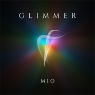

Glimmer
============================

|  |  |
| :--: | :-- |
| [ Glimmer](https://emumo.xiami.com/album/2100252390) | **艺人**: [Mio](../index.md) **语种**: 其他 **唱片公司**: MIO **发行时间**: 2015年12月29日 **专辑类别**: 录音室专辑 **专辑风格**: 沙发音乐 Lounge, 轻音乐 Easy Listening, 新世纪音乐 New Age **播放数**: 6246 **收藏数**: 28 **评论数**: 9  |

## 简介

循着一点微光，探索一个属于自己却未知的世界。 

## 曲目

## 评论

|  |  |  |
| :-- | :-- | :-- |
|  [虾米用户](https://emumo.xiami.com/u/312880409)  2019-12-29 15:41 赞(0) 踩(0) | 
听这张专辑的时候，正是冬天中的“一九”，阴暗的天空中飘着白色的雪花，所有的建筑物上，地上，树上，你所有目光触及到的地方，都被漫天白雪所占据着，雪花柔软的飘逸着，漫无目的地从空中坠下，一层一层的堆积着，晶莹剔透，除了楼下清理地面的工具声音和人们的说话声，只剩下孤寂的静谧，时而随着音乐的响起，向空中无限的延展。
 |
|  [虾米用户](https://emumo.xiami.com/u/11926013)   2016-05-24 23:10 赞(0) 踩(0) | 
没人觉得这个专辑非常适合睡觉听吗
 |
|  [虾米用户](https://emumo.xiami.com/u/11926013)   2016-05-24 23:06 赞(0) 踩(0) | 
怎么不出新歌了呢?
 |
|  [虾米用户](https://emumo.xiami.com/u/31174171) 多人混合人 2015-12-30 12:07 赞(0) 踩(0) | 
棒棒棒！把它作为我的写作音乐
 |
| ⇒ |  [虾米用户](https://emumo.xiami.com/u/8298277) 暂无签名~ 2016-02-23 11:07 赞(0) 踩(0) | 
期待~
 |
|  [虾米用户](https://emumo.xiami.com/u/40584926) 我是萌新～ 2015-12-29 22:40 赞(0) 踩(0) | 
[带墨镜笑]
 |
|  [虾米用户](https://emumo.xiami.com/u/46102833)   2015-12-29 22:22 赞(1) 踩(0) | 
带上耳机就是世界
 |
| ⇒ |  [虾米用户](https://emumo.xiami.com/u/8298277) 暂无签名~ 2016-02-23 11:06 赞(0) 踩(0) | 
创造属于自己的世界
 |
|  [虾米用户](https://emumo.xiami.com/u/46102833)   2015-12-29 22:15 赞(0) 踩(0) | 
好棒！
 |
