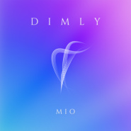

Dimly
============================

|  |  |
| :--: | :-- |
| [ Dimly](https://emumo.xiami.com/album/2102874061) | **艺人**: [Mio](../index.md) **语种**: 纯音乐 **唱片公司**: 独立发行 **发行时间**: 2017年10月17日 **专辑类别**: EP, 单曲 **专辑风格**: 新世纪音乐 New Age, 轻音乐 Easy Listening, 氛围音乐 Ambient **播放数**: 4493 **收藏数**: 4 **评论数**: 3  |

## 简介

 Dimly - Mio

## 曲目

## 评论

|  |  |  |
| :-- | :-- | :-- |
|  [虾米用户](https://emumo.xiami.com/u/9784717) 黑暗藝術家 2018-10-05 22:59 赞(0) 踩(0) | 
听着特别好睡
 |
|  [虾米用户](https://emumo.xiami.com/u/24827395) 吃遍世界美食才是人生的终... 2017-11-03 02:17 赞(0) 踩(0) | 
赞 
 |
|  [虾米用户](https://emumo.xiami.com/u/69023442)  2017-10-17 15:54 赞(0) 踩(0) | 
果然，困了。。。真有效，嘿嘿
 |
