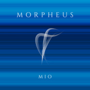

Mio
============================

|  |  |
| :--: | :-- |
| [ Mio](https://i.xiami.com/mio) | **播放数**: 2021198 **粉丝数**: 838 **评论数**: 92 **地区**: China 中国大陆 **风格**: 新世纪音乐 New Age, 氛围音乐 Ambient, 电子 Electronic, 轻音乐 Easy Listening  |

## 档案

Mio的作品更像是一面镜子，映射出每一个听者的内心

## 专辑

| 名称 | 语种 | 唱片公司 | 发行时间 | 专辑类别 | 专辑风格 |
| :--: | :-- | :-- | :-- | :-- | :-- |
| [ Dimly](./albums/2102874061.md) | 纯音乐 | 独立发行 | 2017年10月17日 | EP, 单曲 | 新世纪音乐 New Age, 轻音乐 Easy Listening, 氛围音乐 Ambient |
| [ Vivid](./albums/2102868934.md) | 纯音乐 | 独立发行 | 2017年10月07日 | EP, 单曲 | 氛围音乐 Ambient, 电子 Electronic, 新世纪音乐 New Age |
| [ Morpheus](./albums/2102862848.md) | 纯音乐 | 独立发行 | 2017年09月25日 | EP, 单曲 | 电子 Electronic, 氛围音乐 Ambient, 新世纪音乐 New Age |
| [ Luminous](./albums/2102644285.md) | 英语 | 独立发行 | 2016年11月07日 | EP, 单曲 | 新世纪音乐 New Age, 轻音乐 Easy Listening |
| [ Glimmer](./albums/2100252390.md) | 其他 | MIO | 2015年12月29日 | 录音室专辑 | 沙发音乐 Lounge, 轻音乐 Easy Listening, 新世纪音乐 New Age |
| [ Mio's WorldBlue Fantasy](./albums/1689621753.md) | 其他 | 独立发行 | 2014年01月13日 | 录音室专辑 | 沙发音乐 Lounge, 放松新世纪 Relaxation New Age, 轻音乐 Easy Listening |

## 评论

|  |  |  |  |
| :-- | :-- | :-- | :-- |
|  [虾米用户](https://emumo.xiami.com/u/5424076) 咋个说？要签名？ 2020-07-21 07:58 赞(0) 踩(0) | 
20200721
 |
|  [虾米用户](https://emumo.xiami.com/u/4243795) 我还没想好要写什么... 2020-06-18 23:10 赞(0) 踩(0) | 
buy USD 1 mio
 |
|  [虾米用户](https://emumo.xiami.com/u/46765692) 我还没想好要写什么... 2019-11-28 00:53 赞(0) 踩(0) | 
你是谁呢
 |
|  [虾米用户](https://emumo.xiami.com/u/10537792)  2019-10-15 10:22 赞(0) 踩(0) | 

 |
|  [虾米用户](https://emumo.xiami.com/u/7151428) 暖暖的～～ 2019-09-17 11:14 赞(0) 踩(0) | 
  
 |
|  [虾米用户](https://emumo.xiami.com/u/351134673) 音乐美化生活 2019-07-04 06:02 赞(1) 踩(0) | 
您的作品特别适合我，体现着我的内心，我觉得你我是相通的。
 |
|  [虾米用户](https://emumo.xiami.com/u/425848620) 悲欢难相通 2019-06-13 16:04 赞(0) 踩(0) | 
我喜欢。
 |
|  [虾米用户](https://emumo.xiami.com/u/330900828) 高舉一面五星紅旗在蝦米！ 2019-05-02 14:41 赞(1) 踩(0) | 

 |
|  [虾米用户](https://emumo.xiami.com/u/45530116) 就此别过啦 愿彼此安好  2019-04-22 17:46 赞(0) 踩(0) | 
超好听
 |
|  [虾米用户](https://emumo.xiami.com/u/35226478) 四月 2019-04-22 11:34 赞(0) 踩(0) | 
观心照海
 |
|  [虾米用户](https://emumo.xiami.com/u/276944698) 不要自我设限..... 2019-04-04 11:03 赞(3) 踩(0) | 

 |
|  [虾米用户](https://emumo.xiami.com/u/370791556)  2019-03-09 09:12 赞(0) 踩(0) | 
不知道你的心该有多么清净 
 |
|  [虾米用户](https://emumo.xiami.com/u/324879742)   2019-01-29 10:16 赞(1) 踩(0) | 
.
 |
|  [虾米用户](https://emumo.xiami.com/u/379611679)  2018-07-30 23:14 赞(0) 踩(0) | 
优秀呐( ॑꒳ ॑ )
 |
|  [虾米用户](https://emumo.xiami.com/u/324557258) 一颗佛系&常年潜水循环音... 2017-12-03 01:56 赞(0) 踩(0) | 
加油(ง &amp;bull;̀_&amp;bull;́)ง继续走下去(ง &amp;bull;̀_&amp;bull;́)ง我们永远挺你(ง &amp;bull;̀_&amp;bull;́)ง
 |
|  [虾米用户](https://emumo.xiami.com/u/22881143) ㅤㅤㅤㅤ 2017-12-01 00:31 赞(1) 踩(0) | 
。
 |
|  [虾米用户](https://emumo.xiami.com/u/93624582) 故乡，是天际线的白色沙海... 2017-10-29 08:24 赞(0) 踩(0) | 
我搜别的无意间搜到的mio 封面太美，内容也不赖
 |
|  [虾米用户](https://emumo.xiami.com/u/9597157) ， 2017-10-07 23:07 赞(0) 踩(0) | 
听您的音乐会想起阿尔法的
 |
| ⇒ |  [虾米用户](https://emumo.xiami.com/u/50330585)  2019-09-03 10:23 赞(0) 踩(0) | 
深沉的脑阿尔法波
 |
|  [虾米用户](https://emumo.xiami.com/u/252104228) http://image... 2017-08-19 17:26 赞(0) 踩(0) | 
中国需要您这样的艺术家。
 |
|  [虾米用户](https://emumo.xiami.com/u/570997) 励志成为一名出色的音乐人 2017-07-08 01:09 赞(0) 踩(0) | 
不错的国人新世纪音乐
 |
|  [虾米用户](https://emumo.xiami.com/u/51682793)  2017-04-24 15:20 赞(1) 踩(0) | 
已经深爱这个男人
 |
| ⇒ |  [虾米用户](https://emumo.xiami.com/u/93624582) 故乡，是天际线的白色沙海... 2017-10-29 08:23 赞(0) 踩(0) | 
  
 |
|  [虾米用户](https://emumo.xiami.com/u/50537232)  2017-02-25 20:20 赞(0) 踩(0) | 
空灵，飘渺，纯静
 |
|  [虾米用户](https://emumo.xiami.com/u/45375663)  2016-09-12 14:59 赞(0) 踩(0) | 
很空灵，额，不知道用空灵形容得准不准确。。
 |
|  [虾米用户](https://emumo.xiami.com/u/177436660)  2016-09-03 08:19 赞(0) 踩(0) | 
很喜欢。
 |
|  [虾米用户](https://emumo.xiami.com/u/6244650)  2016-08-26 13:25 赞(0) 踩(0) | 
极简主义，轻音乐
 |
|  [虾米用户](https://emumo.xiami.com/u/217863968)  2016-08-25 13:01 赞(0) 踩(0) | 
在站酷活动听到了Mio的作品，惊艳到了，形如流水，空谷幽音，非常喜欢！
 |
|  [虾米用户](https://emumo.xiami.com/u/217829387)  2016-08-25 11:37 赞(0) 踩(0) | 
空灵
 |
|  [虾米用户](https://emumo.xiami.com/u/213582247)  2016-08-16 11:46 赞(0) 踩(0) | 
超喜欢这个风格！大爱！
 |
|  [虾米用户](https://emumo.xiami.com/u/24253960) 可以行乐，乐行以可 2016-08-15 19:15 赞(0) 踩(0) | 
喜欢
 |
|  [虾米用户](https://emumo.xiami.com/u/213251744)  2016-08-15 14:55 赞(0) 踩(0) | 
铃声
 |
|  [虾米用户](https://emumo.xiami.com/u/17925)  2016-08-10 14:34 赞(0) 踩(0) | 
背景音乐
 |
|  [虾米用户](https://emumo.xiami.com/u/20153438)  2016-07-16 17:59 赞(0) 踩(0) | 
看到在Gymnopedie I下的留言，跟来留名。
 |
|  [虾米用户](https://emumo.xiami.com/u/4172307) 虾米forever 2016-07-13 19:40 赞(0) 踩(0) | 
很好听，开始有种电影OST的感觉，后来就new age了~~
 |
|  [虾米用户](https://emumo.xiami.com/u/40936135)  2016-02-20 17:25 赞(0) 踩(0) | 
如此好听的New Age，原谅我来晚了！
 |
| ⇒ |  [虾米用户](https://emumo.xiami.com/u/8298277) 暂无签名~ 2016-02-23 11:06 赞(0) 踩(0) | 
来了就不算晚~
 |
|  [虾米用户](https://emumo.xiami.com/u/9784717) 黑暗藝術家 2015-11-23 23:26 赞(0) 踩(0) | 
发现你的音乐已经一年，经常不停地循环，很安神
 |
| ⇒ |  [虾米用户](https://emumo.xiami.com/u/9784717) 黑暗藝術家 2015-11-25 22:28 赞(0) 踩(0) | 
<q><b>说：</b></q>
 |
|  [虾米用户](https://emumo.xiami.com/u/47585038) 杂粮。 2015-08-29 13:22 赞(0) 踩(0) | 
为啥我感觉这种音乐本来就已经走向世界了呢？只是国人不太接受吧……反正好美的。
 |
| ⇒ |  [虾米用户](https://emumo.xiami.com/u/8298277) 暂无签名~ 2015-10-02 00:16 赞(0) 踩(0) | 
谢谢你的评价，音乐写给爱听的人就足够了
 |
| ⇒ |  [虾米用户](https://emumo.xiami.com/u/46102833)   2016-02-26 23:34 赞(0) 踩(0) | 
<q><b>Mio说：</b></q>
 |
|  [虾米用户](https://emumo.xiami.com/u/1400679) 在音樂里做著漫長的白日夢 2015-05-05 14:05 赞(0) 踩(0) | 
平靜一下我浮躁的心！
 |
| ⇒ |  [虾米用户](https://emumo.xiami.com/u/8298277) 暂无签名~ 2015-10-02 00:17 赞(0) 踩(0) | 
晚安，好梦
 |
|  [虾米用户](https://emumo.xiami.com/u/15200396)  2015-04-28 16:52 赞(1) 踩(0) | 
你就像一个不会说话的英格玛，一个女版的鲁多维科艾奥迪，这不就是两个了吗？不对，是一个！一个？话说你是女生吗？
 |
| ⇒ |  [虾米用户](https://emumo.xiami.com/u/15200396)  2015-04-29 11:08 赞(0) 踩(0) | 
<q><b>说：</b></q>
 |
|  [虾米用户](https://emumo.xiami.com/u/9767947) 暂无签名~ 2015-04-18 17:44 赞(1) 踩(0) | 
干净 适合发呆下周去参加发呆比赛就指着这个助我放空变身木头人了
 |
|  [虾米用户](https://emumo.xiami.com/u/4173542)  2015-04-13 13:14 赞(0) 踩(0) | 
已经很不错了。
 |
|  [虾米用户](https://emumo.xiami.com/u/8643737)  2015-04-13 08:06 赞(0) 踩(0) | 
很好的音乐，支持国产独立音乐。加油Y！！！！！
 |
|  [虾米用户](https://emumo.xiami.com/u/103298)  2015-04-12 00:13 赞(0) 踩(0) | 
感情丰富
 |
| ⇒ |  [虾米用户](https://emumo.xiami.com/u/8298277) 暂无签名~ 2015-04-12 00:34 赞(0) 踩(0) | 
谢谢 晚安~
 |
|  [虾米用户](https://emumo.xiami.com/u/8346602)  2015-04-11 23:56 赞(0) 踩(0) | 
可能独立音乐和独立电影一样辛苦吧，感谢你们！市场一直在细分，今天的主流或成明天的另类，但愿更多佳作上线。
 |
| ⇒ |  [虾米用户](https://emumo.xiami.com/u/8298277) 暂无签名~ 2015-04-12 00:34 赞(0) 踩(0) | 
也感谢你的支持 晚安~
 |
|  [虾米用户](https://emumo.xiami.com/u/8346602)  2015-04-11 23:31 赞(0) 踩(0) | 
new age 是希望，希望我们有自己的英格玛
 |
| ⇒ |  [虾米用户](https://emumo.xiami.com/u/8298277) 暂无签名~ 2015-04-11 23:40 赞(0) 踩(0) | 
恩~ 国内一直有很多很棒的音乐人和作品 只是大环境下还得不到主流听众的认可 相信会有这样的一天 会有更优秀的国内音乐人的作品走向世界的
 |
|  [虾米用户](https://emumo.xiami.com/u/8346602)  2015-04-11 23:17 赞(0) 踩(0) | 
抛弃easy listening就完美了
 |
|  [虾米用户](https://emumo.xiami.com/u/15200396)  2015-04-11 00:13 赞(0) 踩(0) | 
哇，半夜捡到宝！
 |
| ⇒ |  [虾米用户](https://emumo.xiami.com/u/15200396)  2015-04-28 16:38 赞(0) 踩(0) | 
<q><b>说：</b></q>
 |
|  [虾米用户](https://emumo.xiami.com/u/25994536)  2015-04-10 18:35 赞(0) 踩(0) | 
喜欢 会一直关注下去
 |
|  [虾米用户](https://emumo.xiami.com/u/4164094)  2015-04-10 17:51 赞(0) 踩(0) | 
很不错诶，适合放空，学习，睡眠and so on。打算持续关注，加油 
 |
| ⇒ |  [虾米用户](https://emumo.xiami.com/u/8298277) 暂无签名~ 2015-04-10 21:35 赞(0) 踩(0) | 
谢谢你的支持 晚安
 |
|  [虾米用户](https://emumo.xiami.com/u/12260543) Without Musi... 2015-04-10 15:54 赞(0) 踩(0) | 
:o
 |
|  [虾米用户](https://emumo.xiami.com/u/4470138)  2015-04-06 00:59 赞(0) 踩(0) | 
很澄澈的音乐~适合大脑放空
 |
| ⇒ |  [虾米用户](https://emumo.xiami.com/u/8298277) 暂无签名~ 2015-04-06 20:53 赞(0) 踩(0) | 
谢谢~祝你有个好心情
 |
|  [虾米用户](https://emumo.xiami.com/u/29236529) 厨房家族 2015-04-02 02:52 赞(0) 踩(0) | 
喜欢这种懂得展现美的认真的音乐人。
 |
|  [虾米用户](https://emumo.xiami.com/u/45929720)  2015-03-30 20:45 赞(0) 踩(0) | 
太好听了，有一种心境净化的感觉
 |
|  [虾米用户](https://emumo.xiami.com/u/5661544)  2015-01-24 16:24 赞(0) 踩(0) | 
新年伊始发现了这张碟，觉得很不错：平静中带给人希望和憧憬
 |
| ⇒ |  [虾米用户](https://emumo.xiami.com/u/8298277) 暂无签名~ 2015-01-24 19:10 赞(0) 踩(0) | 
谢谢 祝福新年顺利开心~
 |
| ⇒ |  [虾米用户](https://emumo.xiami.com/u/5661544)  2015-01-25 09:51 赞(0) 踩(0) | 
<q><b>Mio说：</b></q>
 |
|  [虾米用户](https://emumo.xiami.com/u/33121944) @ @ 2015-01-07 21:41 赞(0) 踩(0) | 
喜欢
 |
| ⇒ |  [虾米用户](https://emumo.xiami.com/u/8298277) 暂无签名~ 2015-01-11 23:49 赞(0) 踩(0) | 
^_^
 |
|  [虾米用户](https://emumo.xiami.com/u/12385499) 不同的心境，不同的感觉。 2014-11-29 00:25 赞(0) 踩(0) | 
很喜欢。有种说不出的感觉。
 |
| ⇒ |  [虾米用户](https://emumo.xiami.com/u/8298277) 暂无签名~ 2014-12-04 23:17 赞(0) 踩(0) | 
HAVE A BEAUTIFUL DAY !
 |
|  [虾米用户](https://emumo.xiami.com/u/9158083) like the cig... 2014-10-30 07:31 赞(0) 踩(0) | 
Mio的作品更像是一面镜子，映射出每一个听者的内心~Enjoy my World，Enjoy your World~ Mio 2014 ....加油~~~~~╮(╯▽╰)╭
 |
| ⇒ |  [虾米用户](https://emumo.xiami.com/u/8298277) 暂无签名~ 2014-10-31 22:19 赞(0) 踩(0) | 
O(∩_∩)O Night~
 |
| ⇒ |  [虾米用户](https://emumo.xiami.com/u/9158083) like the cig... 2014-11-02 20:44 赞(0) 踩(0) | 
<q><b>Mio说：</b></q>
 |
|  [虾米用户](https://emumo.xiami.com/u/9784717) 黑暗藝術家 2014-09-13 13:49 赞(0) 踩(0) | 
wooooow。。那麼小眾，但是超讚耶！我看到了中國第二個王三溥。
 |
| ⇒ |  [虾米用户](https://emumo.xiami.com/u/8298277) 暂无签名~ 2014-09-13 22:42 赞(0) 踩(0) | 
作品都是表达内心所想 谢谢你的评语
 |
| ⇒ |  [虾米用户](https://emumo.xiami.com/u/9784717) 黑暗藝術家 2014-09-14 13:15 赞(0) 踩(0) | 
<q><b>Mio说：</b></q>
 |
|  [虾米用户](https://emumo.xiami.com/u/6136079) 江欲其怒，涧欲其清 2014-09-01 23:50 赞(0) 踩(0) | 
很棒的新世纪，中国的新世纪音乐人不少都跑到日本去加盟和平之月了，您的作品真的不比那些大师逊色，希望能越做越好，把中国的New Age也做出影响力来。另外，Mio这个名字是“我的”？还是有什么别的意思？
 |
|  [虾米用户](https://emumo.xiami.com/u/12705257) 每当音乐响起，我总是身不... 2014-07-26 22:56 赞(0) 踩(0) | 
好听哎
 |
|  [虾米用户](https://emumo.xiami.com/u/7937138)  2014-07-07 23:07 赞(0) 踩(0) | 
电台第一首是Stream，很合胃口。干得漂亮。祝越走越远。
 |
| ⇒ |  [虾米用户](https://emumo.xiami.com/u/8298277) 暂无签名~ 2014-07-11 10:32 赞(0) 踩(0) | 
很开心你能喜欢
 |
|  [虾米用户](https://emumo.xiami.com/u/4935021) 没有音乐不能呼吸、 2014-07-07 13:50 赞(0) 踩(0) | 
做个记号
 |
|  [虾米用户](https://emumo.xiami.com/u/157341)  2014-07-07 12:22 赞(0) 踩(0) | 
大中国
 |
|  [虾米用户](https://emumo.xiami.com/u/34344183) i started th... 2014-06-08 22:50 赞(0) 踩(0) | 
原来我要的在这里
 |
| ⇒ |  [虾米用户](https://emumo.xiami.com/u/8298277) 暂无签名~ 2014-07-02 22:28 赞(0) 踩(0) | 
还请多多关注~
 |
|  [虾米用户](https://emumo.xiami.com/u/32379922) 源自丹麦的经典腕表品牌 2014-06-05 10:16 赞(27) 踩(0) | 
不夸张地说，您的作品在我听过的New Age里是可以和许多世界著名大师相提并论的，希望将来有走出国门的一天，加油！
 |
| ⇒ |  [虾米用户](https://emumo.xiami.com/u/8298277) 暂无签名~ 2014-06-07 00:00 赞(0) 踩(0) | 
谢谢你的赞赏~音乐本身就是一种自我治愈的过程，感受到真实的自己，发掘自己的闪亮之处~
 |
| ⇒ |  [虾米用户](https://emumo.xiami.com/u/370791556)  2019-03-09 09:10 赞(0) 踩(0) | 
令人惊艳的钢琴作品，特别是stream！厉害！
 |
| ⇒ |  [虾米用户](https://emumo.xiami.com/u/370791556)  2019-03-09 09:10 赞(0) 踩(0) | 
令人惊艳的钢琴作品，特别是stream！厉害！
 |
|  [虾米用户](https://emumo.xiami.com/u/8298277) 暂无签名~ 2014-01-13 19:57 赞(0) 踩(0) | 
我刚入驻了虾米音乐人，欢迎大家来我的个人主页，收听我的最新音乐
 |
