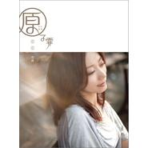

花花世界
============================

|  |  |
| :--: | :-- |
| [ 花花世界](https://emumo.xiami.com/album/399705) | **艺人**: [原子霏](../index.md) **语种**: 国语 **唱片公司**: 金牌大风 **发行时间**: 2010年09月03日 **专辑类别**: 录音室专辑 **专辑风格**:  **播放数**: 120297 **收藏数**: 58 **评论数**: 5  |

## 简介

⊙单纯、直接、简单、快乐。 发现 原子霏   
来自书香世家的原子霏，可说是家学渊源。父亲是北大教授，母亲是音乐老师，自小学习钢琴、舞蹈。原子霏说自己最崇拜的人，永远只有父亲。原子霏的父亲是早年北大毕业的高材生，而后更成为国内在东方语言文化研究领域的重量级人物。父亲两本最重要的文字作品《激扬文字》和《处之泰然》集结了他在工作、研究、生活、情感等许多层面的杂文随笔。  
  
从小跟随父亲接触东方文化，原子霏在耳濡目染，潜移默化下对东方文化产生了浓厚的兴趣，尤其是对印度、佛教的研究。除此之外，原子霏还有着扎实的毛笔书法功底，她师承中国美术家协会理事、中国工笔划学会副会长，被誉为“天下第一虎”的画虎大家-冯大中。从小练习的一手好字，更是备受嘉许。  
  
毕业于北京舞蹈学院音乐剧班的她，曾是内地备受注目的“中国辣妹”团体主唱，也发行过几张合唱专辑，更在内地发行了个人EP。  
  
近几年来，原子霏更参与了多出戏剧演出，原子霏表示：「戏剧让我在唱歌时能更快速的找到情绪，然后透过唱歌找到情感的出口。我想这也是女人爱唱歌的原因吧！因为情歌真的好诱人。」  
  
向来单纯、直接、简单、快乐的她知道，只要用自己小小的力量，坚持住自己的梦想，有一天一定可以拨云见日，品尝到完成梦想的美好。原子霏也希望透过自己，鼓励更多有梦想的熟女们，努力追梦，不管年龄的限制，不怕内心的反对，只要坚定自己的信念，不管梦想有多大、多小，只要今天是往梦想的方向前进，人就可以感觉到美好，而这就是活在当下。  
  
专辑除了邀请到偲菘、伟菘老师为她打造全新专辑外，也邀请了多位词曲老师为“熟女”发声，让有梦、敢爱的轻熟女们打造一个“追梦”的美好时光。  
  
⊙中国辣妹的邻家美眉，用坚持续写梦想的彼端。   
中国辣妹是由原子霏和另外三位同样来自中国舞蹈学院音乐剧专业的同班同学组合而成。然而，因为大环境的关系及成员们相继得步入婚姻而离开后，原子霏还在音乐的世界里坚持不懈。从四个人到一个人，原子霏思考过，错愕过，但爱唱歌的原动力让她不愿意放弃。组合虽然不再继续，但是原子霏没有停下脚步，相继推出了单曲『荣誉』、EP『霏你不可』，更在戏剧中崭露头角。  
  
对于原子霏来说，无论生活、感情有再多的不开心，只要投入工作，只要站上舞台，只要有音乐，所有一切的不愉快都可以瞬间瓦解。她笑说：「对我来说，工作一直是我排解压力的最好方式，我想要唱下去……。」  
  
2010年，原子霏的首张个人专辑『花花世界』，是一份经历后的沉淀，是一次沉淀后的再爆发，只要梦想还在，随时都可以再出发。  
  
⊙蓝天、绿地。 台湾，美丽的福尔摩沙。   
因为这张专辑发行的关系，而让原子霏终于有机会踏上台湾这块土地。她觉得台湾的民众很热情、小吃很丰富又美味，虽然企划工作期间只有短短的几日台湾行，但已让她严重爱上台湾的生活。  
  
虽然只有短短的几天，但是原子霏还是跑了不少地方。因为拍摄唱片封面时，摄影师选在青年公园，这座堪称为台北最老、最大的绿地—青年公园，蓝天、白云、大树的景象，让原子霏觉得很贴近专辑的概念-单纯、 直接 、 简单、 快乐。再看到工作人员为她准备的黑白气球，更觉得开心，直说：「好像回到了小时候，与家人一起出游的景象。」。不过因为工作期间正好遇到台湾最热的季节，工作人员被晒得叫苦连天，原子霏却一点也不觉得辛苦，还在拍摄现场提醒大家要多喝水，以免拍完中暑，让工作人员都感觉到原子霏的体贴。  
  
摄影师除了在青年公园选景拍摄外，也特地商借一个仿若老上海的室内景像，原子霏一到现场连连称赞，直说屋内的家具真的有一种掉入时空的感觉，觉得台湾工作团队真得很专业。  
  
除了拍摄工作外，原子霏还特地抽空到了乌来洗温泉，101逛街、士林夜市吃各式美食小吃、淡水吃阿给，看夕阳，还买了多双木屐，想要带回内地分享给好友。原子霏表示：「台湾真得很好玩，人们都很友善、热情，美食小吃又特多，虽然这次只有机会在北部近郊走走，但下次来做宣传时，一定也要到中南部，趁宣传期间品尝各地美食，还要到不同地方走走，感受更多歌迷朋友的热情喔！」  
  
⊙一个内心像“原子”一般，希望用自己小小的力量，改变世界、追寻梦想的原子霏，花花世界是妳即将要聆听--轻熟女的内心话。   
2010年，歌坛上出现好多新的声音，唱爱情、唱友情、唱亲情，因为人的感情，我们总是有好多感受，在心里绕啊绕，于是成立了各种感情的存在，这是歌坛上不变的道理。而女人啊，常赖以为生的是一首首的情歌，是唱到骨子里的，聆听一次、两次…，是为了正视自己的悲伤，舔干净自己的伤口，然后再次出发。  
  
首次在台湾发行的个人专辑『花花世界』，特地找来新加坡名制作人偲菘、伟菘兄弟档为原子霏量身订作这张全新专辑。  
  
首波主打「花花世界」邀请了姚若龙老师为她写下动人歌词，这也是她自己切身的故事，在拿到这首李伟菘写的DEMO，工作人员在讨论歌词方向时，原子霏自告奋勇的说：「不妨来讲讲我的故事。」，于是她简单的写下几段她感情故事，就交给姚若龙老师填词，没想到录音前拿到歌词，她瞪大了眼睛说：「哇！姚老师太厉害了，完全写出我的痛！」。因此让她在录音室里痛哭了好几次，还常因唱不下去，而暂停的状况更是经常上演。虽然原子霏对于过往的恋情绝口不提，但在旁的人都知道，作词者-姚若龙老师写进了她的内心世界，而这首歌也唱进了每位曾在爱情里受伤女子的内心戏。  
  
原子霏表示：「感情是很私密的，遇到挫折的感情就像“花花世界”中那样无奈与无助，唱歌可以哭，听歌可以哭，但最后，我们一定可以拥有美好的爱情，因为每个女人都值得被爱、被呵护。」也正因为这样的信念，原子霏希望每个女人在听完「花花世界」后，都要像歌词一样，“离开伤悲学会防备”、“窗上有雾，不如干脆打开窗户。勇敢让风的冷酷，划过了皮肤”。  
  
「哭过了吗？要好好的爱自己喔！」原子霏。  
  
⊙传奇 唱出另一种风貌。   
专辑内除了全新的九首歌之外，原子霏也特别将王菲在春晚时演唱的「传奇」收录在这张全新专辑中，原子霏表示：「王菲一直是我的偶像，能够听到她再次复出的消息让人觉得很幸福。在春晚活动中听到王菲唱这首歌时，真的很感动。当知道要收录这首歌时，我真得很开心。跟原词曲作者李健在沟通编曲时，李健希望能唱出另一种不同音乐风格，录完音之后给李健听他非常惊讶可以用如此丰富的编曲，来诠释这首歌给了他很大的惊喜，整个调性有很大的不同。」  
  
王菲在春晚活动上唱的「传奇」很深情，而原子霏在诠释这首歌时却意外的唱出一种甜蜜感，彷若在爱情中的等待，也是一种无以解释的甜蜜。就像原子霏说得那般，每个女人都值得被爱。想要享受这份甜蜜吗？听听原子霏唱的「传奇」，感受另一种「传奇」。  
  
⊙花花世界-勇敢痛哭，然后学会放下，迎接下一次的挑战。   
第一波主打歌「花花世界」在拍摄MV过程中，上演不少插曲。对这首歌很有感觉的名导演-Tony林锦和要求严格，除了找景时花了不少心思外，在第一天拍摄时发现服装不能完全诠释出原子霏的内心世界，而大喊停拍。  
  
第二天开拍时，导演先让原子霏喝了一瓶的红酒，导演表示：这首歌其实是一种女性的内心戏。所以希望原子霏能够去面对自己内心的声音。也因为导演要求，就发生了原子霏又上演了失声痛哭的插曲，当场吓坏所有台湾的工作人员，经内地工作人员解释在录音时，原子霏因这首歌太贴近她内心的感情生活，所以很害怕唱这首歌，几乎可说是每唱必哭，连录唱后，她也不太敢听「花花世界」。  
  
拍摄当天，导演不断地重复播放这首歌，再加上红酒的催化，让原子霏彻底发泄，也由此证明了「花花世界」是一首真正唱进女人心底的歌曲。  
  
而导演也特地邀请了多名马戏团的特技演员，在MV中表演吞火、玩火圈及火舞等表演，希望透过这些与火有关的连结，表现出女人在被爱时的依附、失去自我，仿若进入另一个完全不真实的世界。  
  
为了更贴近姚若龙老师的词意，导演在MV的最后，让原子霏放开手中的红气球，就像原子霏那样勇敢痛哭，然后学会放下，迎接下一次爱情的挑战。  
  
⊙首次进军台湾就受保养品公司青睐！   
只要购买专辑还能获得Sophie Monk最新产品-面膜六片，让熟女在听原子霏的『花花世界』时，也能为自己做好准备，不管何时都要美美的幸福着。  
  
在专辑中，没有太多的华丽造型，只希望透过词曲与原子霏的歌声，让更多听歌者参与专辑里的故事，故事或许天天都在上演，有人在故事里笑、有人在故事里哭，更有人在故事里，傻得伤了自己，但只要有梦想，这一切都会成为一种人生的学习。而这就是”活在当下的美好”！有一天，我们都会懂得这个道理。  
  
⊙关于原子霏   
‧生日：12/16  
‧星座：射手座   
‧体重：48公斤   
‧身高：168公分  
‧血型：O型   
‧‧喜欢的颜色：粉红色、紫色   
‧兴趣：旅游、运动、逛街  
‧专长：唱歌、表演、舞蹈、主持  
‧崇拜的人：爸爸   
‧毕业院校：北京舞蹈学院  
  
‧演艺经历：原中国辣妹组合主唱  
-唱片：『爱情DJ』专辑 、『圣诞专辑』合辑、『最红主打歌』合辑  
『霏爱不可』首张个人EP  
-单曲：《24小时》、《一切为你》、《功夫小妞》   
《点击春天》- 2004年CCTV春节联欢晚会开场曲  
《荣誉》- 2008北京奥运会奥运频道《荣誉殿堂》主题曲   
电视剧《租个女友回家过年》主题曲《爱渐渐离开》、片头曲《给我你的爱》  
-电视剧：《租个女友回家过年》合作演员--杜淳 薛佳凝  
-话剧：《角儿》合作演员--迟帅 李勤勤  
-音乐剧：《灵魂秀》、《新白蛇传》  
-广告：澳大利亚TNS化妆品代言人 韩国“大喜大”调料广告片、诺基亚7650／7250  
  
‧原子霏官方facebook网址：  
<a href="http://www.facebook.com/pages/yuan-zi-fei-de-hua-hua-shi-jie/102710019785208?v=wall" target="_blank" rel="nofollow noreferrer noopener">http://www.facebook.com/pages/yuan-zi-fei-de-hua-hua-shi-jie/102710019785208?v=wall</a>  
  

## 曲目

## 评论

|  |  |  |  |
| :-- | :-- | :-- | :-- |
|  [虾米用户](https://emumo.xiami.com/u/2220053) 在你出现之前，我能和自己... 2015-02-11 21:22 赞(0) 踩(0) | 
这张真的不错
 |
|  [虾米用户](https://emumo.xiami.com/u/1623026)  2012-01-23 18:58 赞(1) 踩(0) | 
感觉喜欢，没道理的
 |
|  [虾米用户](https://emumo.xiami.com/u/221098)  2011-02-25 13:51 赞(0) 踩(0) | 
听着真安静
 |
|  [虾米用户](https://emumo.xiami.com/u/1224725) 最近很忙啷里个啷，奖励自... 2011-02-10 19:47 赞(0) 踩(0) | 
今天又回味了一遍  真正的喜欢上了
 |
|  [虾米用户](https://emumo.xiami.com/u/1492251)  2010-10-05 00:46 赞(0) 踩(0) | 
原子霏声音很有张力
 |
