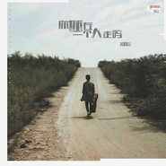

你还在一个人走吗
============================

|  |  |
| :--: | :-- |
| [ 你还在一个人走吗](https://emumo.xiami.com/album/2105354698) | **艺人**: [刘心](../index.md) **语种**: 国语 **唱片公司**: 索雅音乐 **发行时间**: 2019年10月23日 **专辑类别**: EP, 单曲 **专辑风格**:  **播放数**: 698288 **收藏数**: 11 **评论数**: 4  |

## 简介

一群人来，一群人走，认识的人越来越多，心里的空间却越来越少。  
成长给我们宽厚的肩膀，广博的见识；却又拿走了内心最柔软的东西，“无可奈何花落去”，若是注定，怎么还没准备好，面对这失落。  
刘心最让人心疼的一首作品，作词作曲的《你还在一个人走吗》，说话的口吻，每一句歌词没有一个沉重的词汇，却感觉压在心头透不过气。这样的歌词，充满惊喜，又包含温情。把自己足够打开的刘心，是如此细腻，有些音乐让我们相遇，有些音乐，却让我们相知。  
福气文化，诚意乐献。 

## 曲目

## 评论

|  |  |  |  |
| :-- | :-- | :-- | :-- |
|  [虾米用户](https://emumo.xiami.com/u/429701478)  2020-07-10 14:51 赞(0) 踩(0) | 
很暖和的声音
 |
|  [虾米用户](https://emumo.xiami.com/u/4261928)   2019-12-18 19:32 赞(0) 踩(0) | 
自从他结婚了以后，我脱粉了很久，因为娶了个网红。但是他陆陆续续发的作品又把我拉了回来，原来还是我喜欢的那个刘心，没有变，会继续支持他的作品，希望他一切安好 
 |
|  [虾米用户](https://emumo.xiami.com/u/432720447)  2019-11-26 22:18 赞(0) 踩(0) | 
好听加油↖(^ω^)↗
 |
|  [虾米用户](https://emumo.xiami.com/u/13188979)   2019-11-25 20:15 赞(0) 踩(0) | 
喜欢她也喜欢你
 |
