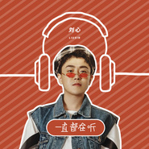
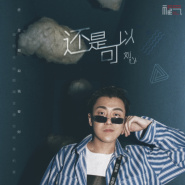
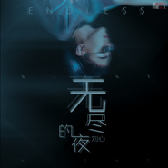
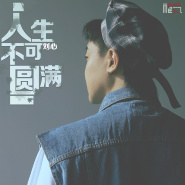
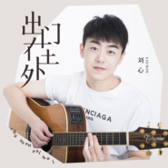
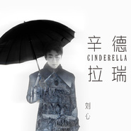
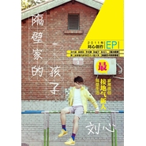
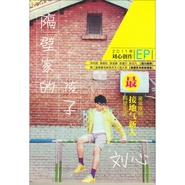

刘心
============================

|  |  |
| :--: | :-- |
| [ 刘心](https://i.xiami.com/liuhaha) | **播放数**: 16763355 **粉丝数**: 7557 **评论数**: 381 **地区**: China 中国大陆 **风格**: 国语流行 Mandarin Pop, 华语唱作人 Chinese Singer-Songwriter  |

## 档案

小档案 
中   文   名：刘心 
别        名：刘哈哈、隔壁家的孩子、气象帝 
国        籍：中华人民共和国 
民        族：回族 
星        座：处女座 
血        型：  A  型 
身        高：  170cm 
体        重：  65kg 
出   生   地：辽宁省鞍山市 
出生日期：  1987  年  8  月  26  日 
职        业：歌手 
毕业院校：鞍山市  68  中学 
经纪公司：天娱传媒有限公司 
代表作品：雨过之后、凭什么说、情人节、一开始、新自己 
粉   丝   名：蜡笔 
艺人简介 
刘心，  1987  年  8  月  26  日出生于辽宁省鞍山市，中国内地男歌手，毕业于鞍山市  68  中学。 
2010  年，参加湖南卫视选秀娱乐节目《快乐男声》的比赛，获得全国总决赛亚军。  2011  年，出席“第二届新锐艺术人物颁奖盛典”，并获得新锐表演艺术奖；同年，推出首张个人  EP  专辑《隔壁家的孩子》。  2012  年，参加《蒙牛酸酸乳巨星梦想学院》，获得前三强，并远赴韩国参加“中韩音乐交流会”；同年，获得第五届蒙牛酸酸乳音乐风云榜新人盛典“年度新人大奖”，  EP  《隔壁家的孩子》获得“年度最佳  EP  奖”。  2013  年，获得“第  20  届东方风云榜”最佳新人奖；同年，推出第二张个人  EP  专辑《小新》。  2014  年，推出与大鹏合唱歌曲《屌丝情歌》。  2015  年，出演小柯音乐剧《凭什么我爱你》。 
演艺经历 
2006  年，参加东方卫视《我型我秀》比赛，获得全国总决赛  32  强。 
2007  年，参加湖南卫视《快乐男声》比赛，转辗济南，西安两大赛区，海选均没通过。 
2009  年，参加  KAPPA  《音乐  ONE  花筒》比赛，获得第一季度总决赛原创组冠军。 
2010  年，参加湖南卫视选秀娱乐节目《快乐男声》的比赛，获得全国总决赛亚军，赛后签约天娱传媒并推出单曲《雨过之后》。 
2011  年  1  月  15  日，出席“第二届新锐艺术人物颁奖盛典”，并获得新锐表演艺术奖；同年  11  月，推出首张个人  EP  专辑《隔壁家的孩子》，收录了包括《写给方大同》、《凭什么说》等在内的  5  首歌曲。 
2012  年，推出个人单曲《情人节》；同年，参加《蒙牛酸酸乳巨星梦想学院》，获得前三强，并远赴韩国参加“中韩音乐交流会”；同年  7  月，获得“青春音乐榜”最佳新人奖；同年  9  月，获得第五届蒙牛酸酸乳音乐风云榜新人盛典“年度新人大奖”，  EP  《隔壁家的孩子》获得“年度最佳  EP  奖”；同年  12  月  28  日，获得山东卫视《歌声传奇》心灵歌手大奖。 
2013  年  3  月，获得“第  20  届东方风云榜”最佳新人奖；同年  9  月，与曹云金合作主演话剧《大人物》；同年  9  月  9  日，推出第二张个人  EP  专辑《小新》，收录了包括《新自己》、《相遇的季节》等在内的  5  首歌曲；同年  10  月，为歌曲《新自己》拍摄创意小短剧；同年  10  月  12  日，与张杰、姚贝娜、  MIC  男团参加在北京朝阳大悦城举行的“  2013MusicRadio  我要上学海马汽车爱·回家助学行动爱心路演”。 
2014  年  3  月，凭借专辑《小新》入围“中国  TOP  榜颁奖典礼”内地校园人气男歌手奖；同年，推出与大鹏合唱歌曲《屌丝情歌》。 
2015  年，出演小柯音乐剧《凭什么我爱你》，在剧中饰演李顺；同年  9  月，与任一宁、白杰、史长青担任腾讯视频《重返好声音》的点评嘉宾；同年  11  月  10  日，推出与谭佑铭、张阳阳、左立合唱的歌曲《单身狗之歌》，该歌曲为谭佑铭的词曲原创；同年  12  月  10  日，参加芒果  TV  《我是歌手谁来踢馆》第一阶段的踢馆  Live Show  。 
主要成就 
2010  年《快乐男声》全国亚军 
第二届报喜鸟新锐艺术大奖 
中国娱乐星锐榜最受欢迎男歌手 
2012  年巨星梦想学院三强之一 
《歌声传奇》六场单场冠军 
第五届新人盛典年度新人大奖 
第二十届东方风云榜东方新人奖

## 专辑

| 名称 | 语种 | 唱片公司 | 发行时间 | 专辑类别 | 专辑风格 |
| :--: | :-- | :-- | :-- | :-- | :-- |
| [ 一首歌](./albums/5020932834.md) | 国语 | 索雅音乐 | 2020年06月24日 | EP, 单曲 | 国语流行 Mandarin Pop |
| [ 掌纹](./albums/5020678100.md) | 国语 | 华声时代 | 2020年05月15日 | 录音室专辑 | 流行 Pop |
| [ 你还在一个人走吗](./albums/2105354698.md) | 国语 | 索雅音乐 | 2019年10月23日 | EP, 单曲 |  |
| [ 一直都在听](./albums/2105163323.md) | 国语 | 新禧未来 | 2019年08月21日 | EP, 单曲 |  |
| [ 还是可以](./albums/2104998050.md) | 国语 | 索雅音乐 | 2019年07月22日 | EP, 单曲 |  |
| [ 心大](./albums/2104956321.md) | 国语 | 百纳娱乐 | 2019年06月24日 | EP, 单曲 |  |
| [ 无尽的夜](./albums/2104926104.md) | 国语 | 索雅音乐 | 2019年06月13日 | EP, 单曲 |  |
| [ 人生不可圆满](./albums/2104870341.md) | 国语 | 索雅音乐 | 2019年05月23日 | EP, 单曲 | 国语流行 Mandarin Pop |
| [ 出门在外](./albums/2104548302.md) | 国语 | YuGe音乐 | 2019年01月25日 | EP, 单曲 | 国语流行 Mandarin Pop |
| [ 小确幸](./albums/2104183858.md) | 国语 | 百纳娱乐 | 2018年11月07日 | EP, 单曲 | 网络流行 Cyber Hit |
| [ 月儿高高挂](./albums/2104040348.md) | 国语 | YuGe音乐 | 2018年09月19日 | EP, 单曲 |  |
| [ 好几年](./albums/2103731321.md) | 国语 | 百纳娱乐 | 2018年06月01日 | EP, 单曲 | 国语流行 Mandarin Pop |
| [ 正月里来年儿来到](./albums/2103519671.md) | 国语 | 北京YuGe音乐 | 2018年02月07日 | EP, 单曲 |  |
| [ 有里也有面儿](./albums/2103512375.md) | 国语 | 北京YuGe音乐 | 2018年02月02日 | EP, 单曲 | 国语流行 Mandarin Pop |
| [ 有回忆的人](./albums/2102778069.md) | 国语 | 百纳娱乐 | 2017年07月06日 | EP, 单曲 | 国语流行 Mandarin Pop |
| [ 疯狂而倔强的你](./albums/2102751708.md) | 国语 | 泰乐星图 | 2017年05月22日 | EP, 单曲 | 国语流行 Mandarin Pop |
| [ 一生的爱人](./albums/2102751467.md) | 国语 | 泰乐星图 | 2017年05月21日 | EP, 单曲 |  |
| [ 辛德瑞拉](./albums/2102728261.md) | 国语 | 北京YuGe音乐 | 2017年04月07日 | EP, 单曲 | 国语流行 Mandarin Pop |
| [ 圣诞节Merry Christmas](./albums/2100250166.md) | 国语 | 天娱传媒 | 2015年12月23日 | EP, 单曲 |  |
| [ 屌丝情歌](./albums/2006529225.md) | 国语 | 天娱传媒 | 2014年07月28日 | EP, 单曲 | 国语流行 Mandarin Pop |
| [ 小新](./albums/1077150395.md) | 国语 | 天娱传媒 | 2013年08月28日 | EP, 单曲 | 国语流行 Mandarin Pop, 华语唱作人 Chinese Singer-Songwriter |
| [ 刘哈哈与大先生](./albums/547434.md) | 国语 | 天娱传媒 | 2012年10月11日 | EP, 单曲 | 国语流行 Mandarin Pop, 华语唱作人 Chinese Singer-Songwriter |
| [ 情人节](./albums/493879.md) | 国语 | 天娱传媒 | 2012年02月14日 | EP, 单曲 | 国语流行 Mandarin Pop, 华语唱作人 Chinese Singer-Songwriter |
| [ 隔壁家的孩子](./albums/447022.md) | 国语 | 天娱传媒 | 2011年11月20日 | EP, 单曲 | 国语流行 Mandarin Pop, 华语唱作人 Chinese Singer-Songwriter |
| [ 隔壁家的 孩子 EP](./albums/5020398559.md) | 其他 | 天娱传媒 | 2011年11月20日 | EP, 单曲 |  |
| [ 雨过之后 (Demo)](./albums/436815.md) | 国语 | 天娱传媒 | 2010年07月11日 | EP, 单曲 | 国语流行 Mandarin Pop, 华语唱作人 Chinese Singer-Songwriter |
| [ 刘心原创作品Demo集](./albums/2103589238.md) | 国语 | 天娱传媒 | 2010年07月11日 | 合集, 杂锦 |  |

## 评论

|  |  |  |  |
| :-- | :-- | :-- | :-- |
|  [虾米用户](https://emumo.xiami.com/u/3140019) 天马行空 2020-08-19 12:18 赞(0) 踩(0) | 
因为长得像前男友，所以现在看到他有些害羞哈哈
 |
|  [虾米用户](https://emumo.xiami.com/u/3140019) 天马行空 2020-08-19 11:43 赞(0) 踩(0) | 
男朋友拔刀吧
 |
|  [虾米用户](https://emumo.xiami.com/u/8384826) 再见，虾米，谢谢！ 2020-03-22 17:29 赞(0) 踩(0) | 
想听  《那个人》重新编曲发行版
 |
|  [虾米用户](https://emumo.xiami.com/u/4261928)   2019-12-18 19:38 赞(2) 踩(0) | 
自从他结婚了以后，我脱粉了很久，因为娶了个网红。但是他陆陆续续发的作品又把我拉了回来，原来还是我喜欢的那个刘心，没有变，会继续支持他的作品，希望他一切安好 
 |
|  [虾米用户](https://emumo.xiami.com/u/423583588) 超超 缘缘  长长 久久 2019-12-02 09:35 赞(1) 踩(0) | 
还是大学的时候 看的屌丝男士  ~
 |
|  [虾米用户](https://emumo.xiami.com/u/421048335) 我还没想好要写什么... 2019-07-27 12:46 赞(0) 踩(0) | 
从快男开始就很喜欢刘心的声音啦 歌声很有力量 不知道最近在干嘛呐
 |
|  [虾米用户](https://emumo.xiami.com/u/184718145)   2019-02-27 21:05 赞(0) 踩(0) | 
优秀的音乐人
 |
|  [虾米用户](https://emumo.xiami.com/u/406729073)  2019-02-04 05:50 赞(0) 踩(0) | 
又把屌丝男士看了一遍，希望才华永远不会被埋没
 |
|  [虾米用户](https://emumo.xiami.com/u/85008772)  2019-01-26 20:18 赞(2) 踩(0) | 
确实很帅了现在，只是现在在快手直播唱的都是些什么快餐歌曲，唉，可惜
 |
|  [虾米用户](https://emumo.xiami.com/u/46444875) Hi～ 2019-01-08 16:44 赞(0) 踩(0) | 
(ง •̀_•́)ง加油
 |
|  [虾米用户](https://emumo.xiami.com/u/208853073) 谢谢虾米 2018-12-01 11:20 赞(0) 踩(0) | 
永远喜欢你
 |
|  [虾米用户](https://emumo.xiami.com/u/1125942) 给您拜早年了。₍₍ (ง... 2018-11-26 21:48 赞(0) 踩(0) | 
不会下雨的云了解一下 最后几秒伴奏真的好抓我
 |
|  [虾米用户](https://emumo.xiami.com/u/342919597)  2018-11-24 18:33 赞(0) 踩(0) | 
你能红，加油
 |
|  [虾米用户](https://emumo.xiami.com/u/6832910)  2018-11-11 10:32 赞(0) 踩(0) | 
从型秀一直听到现在，那个带着黑框眼镜安静弹吉他的小男孩，祝一切都好～
 |
|  [虾米用户](https://emumo.xiami.com/u/3823759) 世界紛擾，只有音樂是我的... 2018-11-01 22:25 赞(0) 踩(0) | 
我就想问问，你那首《不会下雨的云》什么时候放出来溜溜！！！！！
 |
|  [虾米用户](https://emumo.xiami.com/u/305105984) finding me,a... 2018-08-10 23:18 赞(0) 踩(0) | 
你很棒。
 |
|  [虾米用户](https://emumo.xiami.com/u/9612083)  2018-07-26 20:43 赞(1) 踩(0) | 
很有音乐才华的小伙
 |
|  [虾米用户](https://emumo.xiami.com/u/349855701)  2018-06-26 09:25 赞(2) 踩(0) | 
要有自信一直作下去，有一种听一次就爱上的魔力。 不记得在哪一档综艺听到你唱的《爱江山更爱美人》，好听炸了！
 |
|  [虾米用户](https://emumo.xiami.com/u/349855701)  2018-06-26 09:19 赞(1) 踩(0) | 
成为第6720名粉丝 
 |
|  [虾米用户](https://emumo.xiami.com/u/293692544) 你敢给我说话吗？我咬你 2018-06-23 05:13 赞(1) 踩(0) | 
好听
 |
|  [虾米用户](https://emumo.xiami.com/u/331818896)   2018-05-30 19:08 赞(1) 踩(0) | 
哎，为什么这么多年还是这些歌呢。。。哎，啥时候能看到你红啊。。明明当年快男就那么多好歌，为啥这么多年过去了，列表里的还都是我听过很多次的那些歌，这都七年了
 |
| ⇒ |  [虾米用户](https://emumo.xiami.com/u/348943972)   2018-06-25 09:21 赞(0) 踩(0) | 
你还是 回来  听听我的歌吧
 |
|  [虾米用户](https://emumo.xiami.com/u/6612) 谁与我换一颗红豆 2018-04-09 11:35 赞(3) 踩(0) | 
怎么就红不起来呢，可惜了。
 |
| ⇒ |  [虾米用户](https://emumo.xiami.com/u/361683764)  2018-04-29 14:13 赞(0) 踩(0) | 
他总有一天会红的，不用着急，实力会证明一切。
 |
|  [虾米用户](https://emumo.xiami.com/u/214949253)  2018-03-31 07:45 赞(1) 踩(0) | 
拘役，并处或单处罚金。中华人民共和国刑法所以刘x你去年抄袭VIXX的beautiful的那个能不能解释下
 |
|  [虾米用户](https://emumo.xiami.com/u/214949253)  2018-03-31 07:43 赞(1) 踩(0) | 
第二百一十七条【侵犯著作权罪】以营利为目的，有下列侵犯著作权情形之一，违法所得数额较大或者有其他严重情节的，处三年以下有期徒刑或者拘役，并处或者单处罚金；违法所得数额巨大或者有其他特别严重情节的，处三年以上七年以下有期徒刑，并处罚金：（―）未经著作权人许可，复制发行其文字作品、音乐、电影、电视、录像作品、计算机软件及其他作品的；（二）出版他人享有专有出版权的图书的；（三）未经录音录像制作者许可，复制发行其制作的录音录像的；（四）制作、出售假冒他人署名的美术作品的。第二百一十八条  以营利为目的，销售明知是本法第二百一十七条规定的侵权复制品，违法所得数额巨大的，处在三年一下有期徒刑或拘
 |
| ⇒ |  [虾米用户](https://emumo.xiami.com/u/112521494)  2018-08-08 12:13 赞(0) 踩(0) | 
你可真行，听个歌把刑法都搬上来了。。。
 |
|  [虾米用户](https://emumo.xiami.com/u/85247822) 生而为人 不必抱歉 2018-03-25 22:31 赞(1) 踩(0) | 
喜欢你好久好久好久啦！！！！
 |
|  [虾米用户](https://emumo.xiami.com/u/214949253)  2018-03-15 09:52 赞(1) 踩(0) | 
今天也要为抄袭狗增加评论，
 |
|  [虾米用户](https://emumo.xiami.com/u/214949253)  2018-03-14 20:36 赞(1) 踩(0) | 
抄袭狗好好抄袭呦，最近又有好多爱豆回归了呢，不考虑一下抄哪首吗？
 |
| ⇒ |  [虾米用户](https://emumo.xiami.com/u/311535990)  2018-03-28 21:56 赞(0) 踩(0) | 
不要这样，跟愤青一样，好好听歌不好吗？
 |
| ⇒ |  [虾米用户](https://emumo.xiami.com/u/214949253)  2018-03-31 06:59 赞(0) 踩(0) | 
<q><b>懒而抱抱说：</b></q>
 |
| ⇒ |  [虾米用户](https://emumo.xiami.com/u/214949253)  2018-03-31 07:01 赞(0) 踩(0) | 
<q><b>懒而抱抱说：</b></q>
 |
|  [虾米用户](https://emumo.xiami.com/u/40779703) 头像不是我 2018-03-04 13:32 赞(1) 踩(0) | 
我觉得他是很棒的
 |
|  [虾米用户](https://emumo.xiami.com/u/68750564) 我被爱判处终身孤寂。 2018-02-10 07:04 赞(1) 踩(0) | 
版權版權啊。好多歌都挺不到    
 |
|  [虾米用户](https://emumo.xiami.com/u/348693491) 冷暖自知 2018-02-09 03:22 赞(1) 踩(0) | 
加油↖(^&amp;omega;^)↗   
 |
|  [虾米用户](https://emumo.xiami.com/u/343096909)  2018-01-18 04:12 赞(1) 踩(0) | 
我喜欢他唱的，风，那年春天下着雪，还有给你们也很好听
 |
|  [虾米用户](https://emumo.xiami.com/u/214949253)  2017-12-31 12:01 赞(1) 踩(0) | 
抄袭狗
 |
| ⇒ |  [虾米用户](https://emumo.xiami.com/u/40779703) 头像不是我 2018-03-04 13:32 赞(0) 踩(0) | 
？能科普下吗
 |
| ⇒ |  [虾米用户](https://emumo.xiami.com/u/214949253)  2018-03-11 09:24 赞(0) 踩(0) | 
<q><b>lauda说：</b></q>
 |
| ⇒ |  [虾米用户](https://emumo.xiami.com/u/214949253)  2018-03-11 09:25 赞(0) 踩(0) | 
<q><b>lauda说：</b></q>
 |
| ⇒ |  [虾米用户](https://emumo.xiami.com/u/40779703) 头像不是我 2018-03-11 17:12 赞(0) 踩(0) | 
<q><b>房子塌了说：</b></q>
 |
| ⇒ |  [虾米用户](https://emumo.xiami.com/u/214949253)  2018-03-14 20:21 赞(0) 踩(0) | 
<q><b>lauda说：</b></q>
 |
| ⇒ |  [虾米用户](https://emumo.xiami.com/u/214949253)  2018-03-14 20:25 赞(0) 踩(0) | 
<q><b>lauda说：</b></q>
 |
| ⇒ |  [虾米用户](https://emumo.xiami.com/u/214949253)  2018-03-14 20:29 赞(0) 踩(0) | 
<q><b>lauda说：</b></q>
 |
| ⇒ |  [虾米用户](https://emumo.xiami.com/u/214949253)  2018-03-14 20:31 赞(0) 踩(0) | 
<q><b>lauda说：</b></q>
 |
| ⇒ |  [虾米用户](https://emumo.xiami.com/u/214949253)  2018-03-14 20:32 赞(0) 踩(0) | 
<q><b>lauda说：</b></q>
 |
| ⇒ |  [虾米用户](https://emumo.xiami.com/u/40779703) 头像不是我 2018-03-14 23:52 赞(0) 踩(0) | 
<q><b>房子塌了说：</b></q>
 |
|  [虾米用户](https://emumo.xiami.com/u/288799225)  2017-12-19 23:30 赞(1) 踩(0) | 
为啥不火呢
 |
| ⇒ |  [虾米用户](https://emumo.xiami.com/u/214949253)  2018-03-14 20:37 赞(0) 踩(0) | 
因为抄袭 
 |
|  [虾米用户](https://emumo.xiami.com/u/750154) 我还没想好要写什么... 2017-12-18 10:16 赞(1) 踩(0) | 
刘心爱你！看我头像就知道！每张唱片的评分都好高！不能停下创作的脚步啊！今天哼了一段旋律，没赶紧记录下来。否则那就是我的第一首原创啊！哈哈
 |
|  [虾米用户](https://emumo.xiami.com/u/253372707) siebzehn für... 2017-09-19 14:40 赞(4) 踩(0) | 
当时班里大家都喜欢别人 我只有我喜欢刘心。希望他过得好
 |
|  [虾米用户](https://emumo.xiami.com/u/70503510)   2017-08-25 20:02 赞(1) 踩(0) | 
当年小不懂事 现在听 他的声音真的很好听 游响云停！
 |
|  [虾米用户](https://emumo.xiami.com/u/43917641) 嘻嘻 2017-07-09 09:23 赞(1) 踩(0) | 
加油
 |
|  [虾米用户](https://emumo.xiami.com/u/91324230) _(:з」∠)_ 2017-07-06 14:22 赞(3) 踩(0) | 
别打着法律擦边球再抄袭了 能不能自己原创了？
 |
|  [虾米用户](https://emumo.xiami.com/u/91324230) _(:з」∠)_ 2017-07-06 14:21 赞(4) 踩(0) | 
抄袭狗
 |
|  [虾米用户](https://emumo.xiami.com/u/304193283)  2017-06-13 16:13 赞(2) 踩(0) | 
我可以等你像薛之谦一样搞些有的没的再迂回战术回来做音乐！但是一定要回来哦
 |
|  [虾米用户](https://emumo.xiami.com/u/304193283)  2017-06-13 16:12 赞(2) 踩(0) | 
真的好喜欢他呀！！一直写下去唱下去好不好
 |
|  [虾米用户](https://emumo.xiami.com/u/219625815) 你过得快乐或委屈 2017-05-20 00:15 赞(3) 踩(0) | 
那年快男里最萌的小男生
 |
|  [虾米用户](https://emumo.xiami.com/u/292096560) 凉风喜欢听歌，喜欢清唱… 2017-04-30 21:19 赞(1) 踩(0) | 
新生代，听起来耳目一新，加关注了 
 |
|  [虾米用户](https://emumo.xiami.com/u/290972517)  2017-04-23 21:58 赞(2) 踩(0) | 
多少年过去了，蜡笔还是很爱你，刘小心
 |
|  [虾米用户](https://emumo.xiami.com/u/238231275) 凭本事单的身 2017-04-16 16:30 赞(1) 踩(0) | 
感觉是个正经做音乐的
 |
| ⇒ |  [虾米用户](https://emumo.xiami.com/u/214949253)  2018-03-11 09:26 赞(0) 踩(0) | 
不存在的，他前段时间还抄袭别人了呢
 |
|  [虾米用户](https://emumo.xiami.com/u/264648659)  2017-04-12 20:49 赞(1) 踩(0) | 
怎麼那幾首還不能聽 
 |
|  [虾米用户](https://emumo.xiami.com/u/204796074) 再见。 2017-02-23 02:01 赞(1) 踩(0) | 
忽然看到同名，第一反应就是他，原来已经过去这么多年了
 |
|  [虾米用户](https://emumo.xiami.com/u/30321995) 谢谢你, 给过我答案. ... 2017-02-09 15:45 赞(10) 踩(0) | 
音乐狂刘哈哈现在怎么样，从高中到大学毕业 也有个7年啦，想念
 |
|  [虾米用户](https://emumo.xiami.com/u/234545336)  2017-01-26 11:20 赞(1) 踩(0) | 
可能对应了写给方大同里的“连饭都吃不饱还谈什么音乐梦”吧
 |
|  [虾米用户](https://emumo.xiami.com/u/190547220) 我还没想好要写什么... 2017-01-12 11:42 赞(37) 踩(0) | 
毁在天娱手里的一个典型例子！
 |
| ⇒ |  [虾米用户](https://emumo.xiami.com/u/360910006) The one I lo... 2018-06-06 17:04 赞(0) 踩(0) | 
苏醒也是
 |
|  [虾米用户](https://emumo.xiami.com/u/247193556)  2016-12-26 00:47 赞(0) 踩(0) | 
有才华。希望好
 |
|  [虾米用户](https://emumo.xiami.com/u/26694027)   2016-11-16 16:21 赞(0) 踩(0) | 
被严重低估的创作人  
 |
|  [虾米用户](https://emumo.xiami.com/u/57432124) 我还没想好要写什么... 2016-11-03 22:13 赞(1) 踩(0) | 
刘哈哈，真可惜没火
 |
|  [虾米用户](https://emumo.xiami.com/u/16135450)  2016-10-20 22:57 赞(1) 踩(0) | 
4993
 |
|  [虾米用户](https://emumo.xiami.com/u/49762771) 若我固若金汤，于你又有何... 2016-09-30 07:10 赞(2) 踩(0) | 
为什么没有刘心的风
 |
|  [虾米用户](https://emumo.xiami.com/u/8808040)  2016-08-30 11:30 赞(3) 踩(0) | 
刘心的声音好听又有识别度，唱法也是很有感情的那种，很容易把人带入情境，真的会被他唱歌感染觉得很难过很欢快很无奈。天呐真的好棒棒
 |
|  [虾米用户](https://emumo.xiami.com/u/190547220) 我还没想好要写什么... 2016-08-21 14:20 赞(13) 踩(0) | 
虽然你没火，但是依然忘不了你的音乐给我带来的感动！
 |
|  [虾米用户](https://emumo.xiami.com/u/3181391) 一期一会 2016-05-26 22:29 赞(3) 踩(0) | 
原来初中我就知道自己喜欢什么风格的歌了 百转千回
 |
|  [虾米用户](https://emumo.xiami.com/u/140335918)  2016-05-22 00:31 赞(9) 踩(0) | 
新婚快乐      
 |
|  [虾米用户](https://emumo.xiami.com/u/73857918) 在黎明之前 2016-05-21 18:19 赞(4) 踩(0) | 
我的想法跟热评第一是一样的，也想有一个刘心这样的男朋友
 |
|  [虾米用户](https://emumo.xiami.com/u/6758075)  2016-05-01 03:59 赞(4) 踩(0) | 
我的天，随机播到了你的一首歌，觉得不错，然后点进你主页听所有。居然每一首都好听！ 你真是颗遗珠啊！为什么没人发现呢( ⊙ o ⊙ )
 |
|  [虾米用户](https://emumo.xiami.com/u/20653708)   2016-04-15 08:42 赞(2) 踩(0) | 
支持！
 |
|  [虾米用户](https://emumo.xiami.com/u/18724947)   2016-04-13 10:53 赞(4) 踩(0) | 
不知道你在做什么。。。。。我相信你一定会火的。。。。加油加油
 |
|  [虾米用户](https://emumo.xiami.com/u/19932609) 暂无签名~ 2016-04-11 22:46 赞(1) 踩(0) | 
表白 
 |
|  [虾米用户](https://emumo.xiami.com/u/103964642)  2016-04-09 00:59 赞(3) 踩(0) | 
该发光的人被掩盖住，阿猫阿狗倒火的不行
 |
|  [虾米用户](https://emumo.xiami.com/u/33864995)  2016-03-23 15:40 赞(2) 踩(0) | 
顶一下 我还给他投过票···
 |
|  [虾米用户](https://emumo.xiami.com/u/42748375)   2016-02-07 13:20 赞(0) 踩(0) | 
好聽！
 |
|  [虾米用户](https://emumo.xiami.com/u/41599672) 我设置了任何人无法关注我 2016-01-22 09:05 赞(10) 踩(0) | 
总有一天你会发光的 
 |
|  [虾米用户](https://emumo.xiami.com/u/98746716)  2016-01-09 18:37 赞(0) 踩(0) | 
刘心刘心我真的好喜欢好喜欢你！！！
 |
|  [虾米用户](https://emumo.xiami.com/u/41310723) @MelodySpeed 2016-01-09 13:39 赞(0) 踩(0) | 
之前看快男的时候妈妈一直都很喜欢他！现在看了一圈那届快男里的…玛雅唱得都是些啥…
 |
|  [虾米用户](https://emumo.xiami.com/u/28381021) 所有人都跟我没关系 2016-01-07 02:10 赞(1) 踩(0) | 
up
 |
|  [虾米用户](https://emumo.xiami.com/u/94889782)  2015-12-27 00:57 赞(1) 踩(0) | 
喜欢❤️
 |
|  [虾米用户](https://emumo.xiami.com/u/12878826) 谢谢陪伴 再见哦！ 2015-12-24 23:12 赞(1) 踩(0) | 
期待出新专辑啊
 |
|  [虾米用户](https://emumo.xiami.com/u/2987526) no Romeo 2015-12-24 20:29 赞(1) 踩(0) | 
加油
 |
|  [虾米用户](https://emumo.xiami.com/u/13541465)  2015-12-23 20:34 赞(0) 踩(0) | 
哎呀love love
 |
|  [虾米用户](https://emumo.xiami.com/u/34384394) Hello 2015-12-23 20:14 赞(3) 踩(0) | 
特别喜欢刘心的声音！！
 |
|  [虾米用户](https://emumo.xiami.com/u/6301974) 看什么看 2015-12-18 10:56 赞(0) 踩(0) | 

 |
|  [虾米用户](https://emumo.xiami.com/u/33679330) 我是一个坚强的人 2015-12-13 10:52 赞(0) 踩(0) | 
少女心
 |
|  [虾米用户](https://emumo.xiami.com/u/15277654) Easy. 2015-12-04 08:21 赞(2) 踩(0) | 
加油哈 其实我觉得你的歌比方大同好听…
 |
|  [虾米用户](https://emumo.xiami.com/u/51519513)  2015-11-29 08:28 赞(0) 踩(0) | 
萌萌的刘心
 |
|  [虾米用户](https://emumo.xiami.com/u/33634014) 网易云音乐：乌昂科尔 2015-11-04 14:50 赞(1) 踩(0) | 
唱歌唱歌唱歌你！快回来唱歌！
 |
|  [虾米用户](https://emumo.xiami.com/u/45056055)   2015-10-29 10:11 赞(3) 踩(0) | 
请继续唱歌
 |
|  [虾米用户](https://emumo.xiami.com/u/10563947)   2015-10-14 10:24 赞(2) 踩(0) | 
当年最喜欢他 当年最喜欢的那几首歌现在还是好喜欢
 |
|  [虾米用户](https://emumo.xiami.com/u/39632732) 让所有的理想成灰，让所有... 2015-09-21 19:06 赞(0) 踩(0) | 
在我心里，你一直都算是民谣歌手。
 |
|  [虾米用户](https://emumo.xiami.com/u/8653101)  2015-09-15 20:45 赞(0) 踩(0) | 
很喜欢你的创作
 |
|  [虾米用户](https://emumo.xiami.com/u/13715883) [离线留言] 2015-09-14 23:25 赞(0) 踩(0) | 
刘心还是可以的。
 |
|  [虾米用户](https://emumo.xiami.com/u/5412535)  2015-08-31 23:50 赞(0) 踩(0) | 
刘心快来出专辑！！！
 |
|  [虾米用户](https://emumo.xiami.com/u/37471508)   2015-08-16 01:36 赞(1) 踩(0) | 
新生代小清新！
 |
|  [虾米用户](https://emumo.xiami.com/u/40018998)  2015-08-12 17:15 赞(1) 踩(0) | 
加油加油 不要放弃梦想 喜欢你写的歌
 |
|  [虾米用户](https://emumo.xiami.com/u/13948238)  2015-08-12 09:47 赞(1) 踩(0) | 
又找到一个首首歌都对胃口的歌手啦，好棒！
 |
|  [虾米用户](https://emumo.xiami.com/u/4261928)   2015-08-05 22:27 赞(0) 踩(0) | 
又是开理发店又是卖面膜！就是不出新歌！
 |
|  [虾米用户](https://emumo.xiami.com/u/4261928)   2015-08-05 22:27 赞(0) 踩(0) | 
又是开理发店又是卖面膜！就是不出新歌！
 |
|  [虾米用户](https://emumo.xiami.com/u/6115847) TBA 2015-07-29 18:07 赞(0) 踩(0) | 
喜欢他翻唱的再回首 简直喜欢炸 这里居然没有
 |
|  [虾米用户](https://emumo.xiami.com/u/34324534) 爱韩庚，没道理 2015-07-28 23:06 赞(0) 踩(0) | 
特喜欢你的声音，加油，祝早日大发！！
 |
|  [虾米用户](https://emumo.xiami.com/u/52842930)  2015-07-27 10:19 赞(0) 踩(0) | 
加油啊~~~刘心~~~~~~~~~~
 |
|  [虾米用户](https://emumo.xiami.com/u/44131600) 爱与音乐才是全部 2015-07-16 21:18 赞(0) 踩(0) | 
方面就觉得好萌，创作型歌手一定要支持，祝早日大发
 |
|  [虾米用户](https://emumo.xiami.com/u/5161648) 没错我就是很聪明什么也没... 2015-07-06 23:49 赞(0) 踩(0) | 
心塞～想让你快点火起来
 |
|  [虾米用户](https://emumo.xiami.com/u/33075087) AOMG&1LLIONA... 2015-07-03 00:32 赞(1) 踩(0) | 
可惜是在天娱= =
 |
|  [虾米用户](https://emumo.xiami.com/u/50759258)  2015-07-01 09:44 赞(0) 踩(0) | 
那年快男里超爱刘心的声音～
 |
|  [虾米用户](https://emumo.xiami.com/u/50759258)  2015-07-01 09:41 赞(0) 踩(0) | 
刘心加油！！！！
 |
|  [虾米用户](https://emumo.xiami.com/u/4909754)  2015-06-24 14:49 赞(2) 踩(0) | 
快男里 你比闰土能写 唱的也不比他差 唯一的差别就是他嫁给了谢娜 但是现在闰土比其他人都红太多 真想知道闰土凭什么....
 |
|  [虾米用户](https://emumo.xiami.com/u/12878826) 谢谢陪伴 再见哦！ 2015-06-19 21:42 赞(0) 踩(0) | 
爱❤️ 哥都很好听啊
 |
|  [虾米用户](https://emumo.xiami.com/u/39665842) :) 2015-06-17 18:54 赞(0) 踩(0) | 
唱的比冠军还好 
 |
|  [虾米用户](https://emumo.xiami.com/u/1727615) 每天数着日子还是过着人生... 2015-06-07 13:28 赞(0) 踩(0) | 
几时来个《对不起，还想你》这首歌的Demo啊，很好听的一首歌
 |
|  [虾米用户](https://emumo.xiami.com/u/50005460) 漂洋过海来看你。 2015-05-24 21:40 赞(0) 踩(0) | 

 |
|  [虾米用户](https://emumo.xiami.com/u/4977295) Living in th... 2015-05-02 21:32 赞(0) 踩(0) | 
不错的歌手
 |
|  [虾米用户](https://emumo.xiami.com/u/47545843)  2015-04-25 02:01 赞(0) 踩(0) | 
哎
 |
|  [虾米用户](https://emumo.xiami.com/u/40997225)  2015-01-26 22:31 赞(1) 踩(0) | 
为什么感觉《凭什么说》高潮部分有点像Snoop Dogg的《I wanna f*ck you》....
 |
| ⇒ |  [虾米用户](https://emumo.xiami.com/u/5727083) ALOHA 2015-06-14 23:57 赞(0) 踩(0) | 
我特地去听了一下 确实旋律很像
 |
|  [虾米用户](https://emumo.xiami.com/u/6296828)  2015-01-18 10:52 赞(0) 踩(0) | 
挺喜欢的
 |
|  [虾米用户](https://emumo.xiami.com/u/750154) 我还没想好要写什么... 2015-01-17 00:28 赞(1) 踩(0) | 
注意身体，不敢想象。。。哎呀，不说了。咱这辈子红不起来就红不起来吧，开心健康就好。晚安。
 |
|  [虾米用户](https://emumo.xiami.com/u/3496718) idle space 2014-12-02 20:58 赞(0) 踩(0) | 
歌整体都挺好听的~~~~
 |
|  [虾米用户](https://emumo.xiami.com/u/3496718) idle space 2014-12-02 20:58 赞(1) 踩(0) | 
突然好喜欢这个隔壁家的孩子~~~
 |
|  [虾米用户](https://emumo.xiami.com/u/5848249) 暂无签名~ 2014-11-10 16:32 赞(0) 踩(0) | 
萌萌哒
 |
|  [虾米用户](https://emumo.xiami.com/u/32450112) 你会不会带我远走，在这连... 2014-11-07 22:51 赞(0) 踩(0) | 
男神长的像你 声音也像你 可他不知道我喜欢他 我就这样静静的 听你唱歌 当作是他
 |
|  [虾米用户](https://emumo.xiami.com/u/5087269) 活在当下 2014-10-21 19:33 赞(1) 踩(0) | 
终于听到一个靠谱的中国新生代声音了
 |
|  [虾米用户](https://emumo.xiami.com/u/24190058)  2014-10-17 20:58 赞(1) 踩(0) | 
就是莫名其妙地喜欢
 |
|  [虾米用户](https://emumo.xiami.com/u/24190058)  2014-10-17 19:11 赞(4) 踩(0) | 
快消品时代的业界良心···
 |
|  [虾米用户](https://emumo.xiami.com/u/42460184)  2014-10-13 06:26 赞(1) 踩(0) | 
朴树之后大陆唯一的天才
 |
|  [虾米用户](https://emumo.xiami.com/u/454506) 我还没想好要写什么... 2014-10-08 01:35 赞(0) 踩(0) | 
真是可愛的孩子(*´︶`*)
 |
|  [虾米用户](https://emumo.xiami.com/u/12376831) 好像这是叫女流氓(ฅ'ω... 2014-09-10 13:15 赞(0) 踩(0) | 
风呐风。突然发现有些神情有点像我男票，难道因为大众脸了= =o(╯□╰)o
 |
|  [虾米用户](https://emumo.xiami.com/u/16782750)  2014-08-21 07:41 赞(0) 踩(0) | 
不错，很好听，而且喜感~加油！
 |
|  [虾米用户](https://emumo.xiami.com/u/13331127) Hi…听首歌再走吧。 2014-08-09 23:29 赞(1) 踩(0) | 
好厉害啊…本来很讨厌快男……可是这创作这声音……好听！
 |
|  [虾米用户](https://emumo.xiami.com/u/33789769)   2014-07-31 19:09 赞(2) 踩(0) | 
声音真的好听，选秀的歌手只觉得这一位出挑
 |
|  [虾米用户](https://emumo.xiami.com/u/6826560)  2014-07-31 16:25 赞(3) 踩(0) | 
10年追了一整个夏天的呆萌刘心，他在那个垃圾选秀节目里遭遇的一切影响着我心情的起起伏伏。觉得我如此喜欢的声音不该被埋没，这么努力有才华的他应该得到认可。曾希望他能很红很红，奈何很多时候，这世界并不会如你所想。只要他过得比以前好，吃得饱穿得暖，也不用住什么地下室了，开开心心的，红不红什么的，也就算了。现在看他经常在央视某个音乐节目里出现，混口饭吃，唱唱歌。只是曾经那顶标志性的草帽，也没再看到。现在说这话略显幼稚了，但无论如何，只要你还是刘心，我就永永远远都是你的蜡笔。
 |
|  [虾米用户](https://emumo.xiami.com/u/483307)  2014-07-31 10:53 赞(3) 踩(0) | 
不论唱歌水平怎么样。。就这创作。。简直是内地的良心。。
 |
|  [虾米用户](https://emumo.xiami.com/u/8177003) 我还没想好要写什么... 2014-07-30 17:28 赞(1) 踩(0) | 
以前一直不怎么关注快男啊什么的，后知后觉才认识你..不过真的觉得你唱的歌好舒服，好喜欢....
 |
|  [虾米用户](https://emumo.xiami.com/u/2760237) 但永远有人在奋斗着 2014-07-28 19:43 赞(0) 踩(0) | 
再出张新专呗！！！
 |
|  [虾米用户](https://emumo.xiami.com/u/34860685) 世界大，生命长 2014-07-28 12:23 赞(0) 踩(0) | 
喜欢他的嗓音，和努力坚持的态度！会一直支持你
 |
|  [虾米用户](https://emumo.xiami.com/u/35102978) sounds good~ 2014-07-24 09:46 赞(1) 踩(0) | 
有点儿R&amp;amp;B啊  亲
 |
|  [虾米用户](https://emumo.xiami.com/u/18324059)  2014-07-23 16:40 赞(0) 踩(0) | 
也曾幻想过你是我的男朋友~嘻嘻~捂面。。
 |
|  [虾米用户](https://emumo.xiami.com/u/3931995)  2014-07-13 20:01 赞(0) 踩(0) | 
好可爱
 |
|  [虾米用户](https://emumo.xiami.com/u/36681745)   2014-05-16 21:36 赞(0) 踩(0) | 
我的最爱
 |
|  [虾米用户](https://emumo.xiami.com/u/5412535)  2014-04-26 23:31 赞(0) 踩(0) | 
小新那张专辑还是很不错的嘛
 |
|  [虾米用户](https://emumo.xiami.com/u/1332888)  2014-04-21 01:07 赞(0) 踩(0) | 
内地卢广仲
 |
|  [虾米用户](https://emumo.xiami.com/u/8305765) 人体ETC 2014-04-10 20:49 赞(30) 踩(0) | 
看了一圈当年的“快男”，底下的评论都惨不忍睹，终于有好评了！
 |
|  [虾米用户](https://emumo.xiami.com/u/460669)   2014-03-12 01:22 赞(0) 踩(0) | 
hai bu cuo
 |
|  [虾米用户](https://emumo.xiami.com/u/1196468)  2014-02-15 11:45 赞(0) 踩(0) | 
超市放的【凭什么说】才知道刘心这货..是不是很扯哈哈哈没有啦，冗谈~
 |
|  [虾米用户](https://emumo.xiami.com/u/6660873)  2014-02-04 22:58 赞(0) 踩(0) | 
《最爱》好听呀，节奏感太棒了！
 |
| ⇒ |  [虾米用户](https://emumo.xiami.com/u/36681745)   2014-05-16 21:35 赞(0) 踩(0) | 
在这里见到你，蜡笔
 |
|  [虾米用户](https://emumo.xiami.com/u/12197550)  2014-01-24 12:04 赞(0) 踩(0) | 
心心 i love u 我心永恒
 |
|  [虾米用户](https://emumo.xiami.com/u/7010373)  2013-12-23 23:08 赞(0) 踩(0) | 
坐车的时候，广播放《一开始》。节奏和声线就吸引了我。很有表现力，听的出来是很有心意的一首歌。希望怀揣这样的诚意，让这样生活的声音走的更远。
 |
|  [虾米用户](https://emumo.xiami.com/u/28348857)  2013-11-24 21:22 赞(0) 踩(0) | 
我遇见了你 好天气 看天空晴万里
 |
|  [虾米用户](https://emumo.xiami.com/u/15816843)  2013-11-13 09:23 赞(0) 踩(0) | 
他的歌曲适合广播
 |
|  [虾米用户](https://emumo.xiami.com/u/2251590) 気分転換チョウ苦手 2013-11-06 16:17 赞(0) 踩(0) | 
就是想赞一下
 |
|  [虾米用户](https://emumo.xiami.com/u/10074238)  2013-11-06 07:48 赞(0) 踩(0) | 
偶尔听到，喜欢
 |
|  [虾米用户](https://emumo.xiami.com/u/4208096) 为者常成，行者常至 2013-10-26 09:43 赞(0) 踩(0) | 
经历过才精彩，痛，也快乐着
 |
|  [虾米用户](https://emumo.xiami.com/u/5581441)  2013-10-14 19:54 赞(0) 踩(0) | 
如果声音后期处理的部分不多的话，真心是实力派。
 |
|  [虾米用户](https://emumo.xiami.com/u/1202143) R.I.P 2013-10-11 17:59 赞(0) 踩(0) | 
果然有实力的人几乎是不怎么招黑的 话说头像上刘心先生衣服上好听两个字深深戳中了萌点笑点
 |
|  [虾米用户](https://emumo.xiami.com/u/1140827) 气克气~气克气~ 2013-10-10 21:38 赞(0) 踩(0) | 
我的老乡，必须支持！
 |
|  [虾米用户](https://emumo.xiami.com/u/11388528) 無為而治 2013-10-06 14:27 赞(0) 踩(0) | 
快男没看过，偶然听到，觉得挺不错的～～
 |
|  [虾米用户](https://emumo.xiami.com/u/10772778) 音樂就是身體裡的靈魂 2013-09-14 14:48 赞(0) 踩(0) | 
看到每一張的封面，然後終於明白了，論髮型的重要性啊！！！ 嗯～ 還是喜歡慢歌！好聲音一把！ 加油！
 |
|  [虾米用户](https://emumo.xiami.com/u/14007442)  2013-09-13 22:47 赞(0) 踩(0) | 
我很不开心！我和我姐姐都说为什么都很久很久木有新歌
 |
|  [虾米用户](https://emumo.xiami.com/u/2644287) 好看的皮囊现实劈腿 有趣... 2013-09-10 12:22 赞(0) 踩(0) | 
挺喜欢的，有才气，不过这种歌手通常在中国红不了= =
 |
|  [虾米用户](https://emumo.xiami.com/u/21350469)  2013-09-07 10:07 赞(0) 踩(0) | 
曲风有特点，有年轻人的沉淀。
 |
|  [虾米用户](https://emumo.xiami.com/u/4178548)  2013-08-30 20:04 赞(0) 踩(0) | 
在看快乐男声的时候，最喜欢的是霸气的王野，直到他那首《凭什么说》，森森地打动了我，真是油菜花啊，后来，他在地铁唱歌被媒体报道，为他唏嘘，现在终于发片了，支持一个~~~正在听新自己，还不错哦
 |
|  [虾米用户](https://emumo.xiami.com/u/11969868) sad 2013-08-30 16:39 赞(0) 踩(0) | 
123
 |
|  [虾米用户](https://emumo.xiami.com/u/5606974)  2013-08-29 20:29 赞(0) 踩(0) | 
当年在洗浴中心拉皮条的一个屌丝！
 |
| ⇒ |  [虾米用户](https://emumo.xiami.com/u/6967811) 我还没想好要写什么... 2013-08-30 23:09 赞(0) 踩(0) | 
( ⊙ o ⊙ )啊！
 |
|  [虾米用户](https://emumo.xiami.com/u/10919798)  2013-08-29 19:55 赞(0) 踩(0) | 
很棒的年轻人，喜欢他的快歌，很有能量
 |
|  [虾米用户](https://emumo.xiami.com/u/8311916)  2013-08-29 11:22 赞(0) 踩(0) | 
,,Ծ‸Ծ,,
 |
|  [虾米用户](https://emumo.xiami.com/u/20511698)  2013-08-28 16:58 赞(0) 踩(0) | 
一直支持刘心的音乐，加油！
 |
|  [虾米用户](https://emumo.xiami.com/u/20508846)  2013-08-28 16:31 赞(0) 踩(0) | 
刘心从一个隔壁家害羞的男孩，逐渐成长为全新的自己。在舞台上时而活力无限，时而沉稳，展示了多面的他更懂得了掌控舞台的氛围。正如他的新歌《新自己》一样，每天都呈现出新的态度、新的自己去感受音乐，回馈歌迷。
 |
|  [虾米用户](https://emumo.xiami.com/u/20008497) ♡我他妈虾米卸载了又下 ... 2013-08-28 15:04 赞(0) 踩(0) | 
前男友和刘心好像 ~~~
 |
|  [虾米用户](https://emumo.xiami.com/u/2222372) 高山流水只为知音 2013-08-28 12:01 赞(0) 踩(0) | 
看好这个音乐青年！
 |
|  [虾米用户](https://emumo.xiami.com/u/6676983)  2013-08-26 22:31 赞(0) 踩(0) | 
生日快乐！
 |
|  [虾米用户](https://emumo.xiami.com/u/12300825)  2013-08-26 17:08 赞(0) 踩(0) | 
和我同名诶，一定要顶一下的
 |
|  [虾米用户](https://emumo.xiami.com/u/5429478) 唯有音乐和亲情不可遗落！ 2013-08-26 09:29 赞(0) 踩(0) | 
生日快乐
 |
|  [虾米用户](https://emumo.xiami.com/u/2523233) 太热 2013-08-23 20:31 赞(0) 踩(0) | 
歌真的很口水、琅琅上口~~
 |
|  [虾米用户](https://emumo.xiami.com/u/2760237) 但永远有人在奋斗着 2013-08-23 17:47 赞(0) 踩(0) | 
哟。。YEAH!!
 |
|  [虾米用户](https://emumo.xiami.com/u/19239231)  那就这样吧 2013-08-23 11:40 赞(0) 踩(0) | 
喜欢
 |
|  [虾米用户](https://emumo.xiami.com/u/5429478) 唯有音乐和亲情不可遗落！ 2013-08-22 13:59 赞(0) 踩(0) | 
终于出新的了，，
 |
|  [虾米用户](https://emumo.xiami.com/u/5044438) 今天白嘟出雙人曲了嗎？ 2013-08-10 23:48 赞(0) 踩(0) | 
刘心儿是真挺有才啊~
 |
|  [虾米用户](https://emumo.xiami.com/u/2760237) 但永远有人在奋斗着 2013-07-31 23:58 赞(1) 踩(0) | 
求出新专~~~
 |
|  [虾米用户](https://emumo.xiami.com/u/10196810) 歌太多，分不出类，怎么办... 2013-07-25 13:59 赞(1) 踩(0) | 
突然觉得，和我男神好像，哈哈哈
 |
|  [虾米用户](https://emumo.xiami.com/u/4701365) 戴上耳机，一个人的世界~ 2013-07-08 15:36 赞(1) 踩(0) | 
2013 快乐男声 某个唱区，我还好奇怎么老播那个工作人员来着。原来是个快乐男声呀！！！
 |
|  [虾米用户](https://emumo.xiami.com/u/8666578)  2013-07-07 11:07 赞(0) 踩(0) | 
一直对选秀和某公司的意思有偏见 要不是跟我偶像一起上了节目 也许永远不会知道这么好听 的原创歌手。加油~！
 |
|  [虾米用户](https://emumo.xiami.com/u/3413269)  2013-07-04 11:42 赞(0) 踩(0) | 
声音和外表
 |
|  [虾米用户](https://emumo.xiami.com/u/5429478) 唯有音乐和亲情不可遗落！ 2013-06-30 13:12 赞(85) 踩(0) | 
我为嘛那么喜欢你。前段时间一直在想我要找什么样子的男朋友，突然回头来听你的歌，我觉得你就是我想要的。艾玛，表白。。
 |
| ⇒ |  [虾米用户](https://emumo.xiami.com/u/4701365) 戴上耳机，一个人的世界~ 2013-07-08 15:47 赞(0) 踩(0) | 
哈哈哈
 |
| ⇒ |  [虾米用户](https://emumo.xiami.com/u/2523233) 太热 2014-02-16 14:07 赞(0) 踩(0) | 
女神喜欢这类型的！！！！！！！！！！！！！！！！！！！！！！！！！！！！
 |
| ⇒ |  [虾米用户](https://emumo.xiami.com/u/5429478) 唯有音乐和亲情不可遗落！ 2014-02-16 14:58 赞(0) 踩(0) | 
<q><b>ROARRRRoyals说：</b></q>
 |
| ⇒ |  [虾米用户](https://emumo.xiami.com/u/1670510) 职业黑 2014-08-14 16:20 赞(0) 踩(0) | 
我愿意为你整容成刘心
 |
| ⇒ |  [虾米用户](https://emumo.xiami.com/u/5429478) 唯有音乐和亲情不可遗落！ 2014-08-15 19:11 赞(0) 踩(0) | 
<q><b>左伯桃说：</b></q>
 |
| ⇒ |  [虾米用户](https://emumo.xiami.com/u/34678117)  2015-02-15 15:18 赞(0) 踩(0) | 
<q><b>念安娜说：</b></q>
 |
| ⇒ |  [虾米用户](https://emumo.xiami.com/u/1730251)  2015-05-13 22:13 赞(0) 踩(0) | 
李荣浩怎么办
 |
| ⇒ |  [虾米用户](https://emumo.xiami.com/u/6833828) 我还没想好要写什么... 2015-07-05 18:52 赞(0) 踩(0) | 
李荣浩怎么办
 |
| ⇒ |  [虾米用户](https://emumo.xiami.com/u/46958781)  2017-08-15 17:51 赞(0) 踩(0) | 
崇拜爱慕不是爱情,生命中还是要遇到
 |
| ⇒ |  [虾米用户](https://emumo.xiami.com/u/3537843) 只听音乐 2018-10-12 16:26 赞(0) 踩(0) | 
我咋和你想的一样尼 
 |
| ⇒ |  [虾米用户](https://emumo.xiami.com/u/309890917) 看过那么多心灵鸡汤，居然... 2020-02-05 20:18 赞(0) 踩(0) | 
对不起，6年前我就应该来评论你 
 |
|  [虾米用户](https://emumo.xiami.com/u/16044787)  2013-06-15 20:10 赞(1) 踩(0) | 
唱作俱佳，创作才子！
 |
|  [虾米用户](https://emumo.xiami.com/u/8299466)  2013-06-08 17:27 赞(1) 踩(0) | 
原创
 |
|  [虾米用户](https://emumo.xiami.com/u/9054173)  2013-05-28 07:14 赞(1) 踩(0) | 
刘哈哈与大先生超级好听。没想到大鹏唱歌也好听啊
 |
|  [虾米用户](https://emumo.xiami.com/u/10786830)   2013-05-12 16:33 赞(37) 踩(0) | 
终于听到一个靠谱的中国新生代声音了
 |
|  [虾米用户](https://emumo.xiami.com/u/10961996) 理性的力量 2013-05-12 15:14 赞(0) 踩(0) | 
原来大家都觉得屌丝男士片尾曲很好听哈哈哈！
 |
|  [虾米用户](https://emumo.xiami.com/u/2555263) gail 2013-03-16 22:12 赞(0) 踩(0) | 
那届最支持的。
 |
|  [虾米用户](https://emumo.xiami.com/u/1516514)   2013-03-11 03:28 赞(1) 踩(0) | 
想听《风》，当年就是被那首彻底惊艳到了～
 |
|  [虾米用户](https://emumo.xiami.com/u/13432388) 我还没想好要写什么... 2013-03-08 23:59 赞(0) 踩(0) | 
好听
 |
|  [虾米用户](https://emumo.xiami.com/u/11766720)  2013-01-14 05:24 赞(0) 踩(0) | 
用歌曲表达出来的声音很有感染力
 |
|  [虾米用户](https://emumo.xiami.com/u/12005586)  2012-12-20 18:34 赞(0) 踩(0) | 
喜欢没有理由
 |
|  [虾米用户](https://emumo.xiami.com/u/11926253) 追随生命中的自由美丽真相 2012-12-14 17:25 赞(0) 踩(0) | 
音乐态度积极向上
 |
|  [虾米用户](https://emumo.xiami.com/u/2104186)  2012-12-02 15:29 赞(0) 踩(0) | 
这个还行...
 |
|  [虾米用户](https://emumo.xiami.com/u/9181988)  2012-10-31 03:20 赞(0) 踩(0) | 
像咕咕鸡
 |
|  [虾米用户](https://emumo.xiami.com/u/9617432)  2012-10-20 17:13 赞(0) 踩(0) | 
0..0
 |
|  [虾米用户](https://emumo.xiami.com/u/11087455) 岁月留心 2012-10-17 00:37 赞(0) 踩(0) | 
爱音乐！爱刘心！
 |
|  [虾米用户](https://emumo.xiami.com/u/9791249)  2012-10-15 05:34 赞(0) 踩(0) | 
有个性，舒服，有才华
 |
|  [虾米用户](https://emumo.xiami.com/u/9387519) 我大众，我骄傲！ 2012-10-13 16:48 赞(0) 踩(0) | 
傻傻呆呆东北银！
 |
|  [虾米用户](https://emumo.xiami.com/u/8653101)  2012-10-03 12:10 赞(0) 踩(0) | 
喜欢你！！！
 |
|  [虾米用户](https://emumo.xiami.com/u/8653101)  2012-10-03 12:05 赞(0) 踩(0) | 
超喜欢他，希望有人能够发现他！
 |
|  [虾米用户](https://emumo.xiami.com/u/2407025)  2012-09-11 08:21 赞(0) 踩(0) | 
阳光，帅气，纯真，才华横溢，执着于音乐的大男孩，还有他是东北人儿哈~~
 |
|  [虾米用户](https://emumo.xiami.com/u/10445908) 额。 2012-08-31 19:04 赞(0) 踩(0) | 
旋律。歌词都好
 |
|  [虾米用户](https://emumo.xiami.com/u/4819422) 音乐 2012-08-24 10:55 赞(0) 踩(0) | 
让我疯让我爱
 |
|  [虾米用户](https://emumo.xiami.com/u/10119637)  2012-08-07 04:19 赞(0) 踩(0) | 
爱死你，
 |
|  [虾米用户](https://emumo.xiami.com/u/2955220)  2012-08-01 11:37 赞(0) 踩(0) | 
真实 坚韧 可爱
 |
|  [虾米用户](https://emumo.xiami.com/u/2342679) 无 2012-07-05 17:19 赞(0) 踩(0) | 
好嗓子，需要好的经纪人/更特别的人生经历，让自己的音乐有独特的精神
 |
|  [虾米用户](https://emumo.xiami.com/u/320387) 赐我爱上你的力量 2012-06-21 23:29 赞(0) 踩(0) | 
挺不错的，好多歌都很赞，很有才气哦！~~
 |
|  [虾米用户](https://emumo.xiami.com/u/7948432)  2012-05-31 19:16 赞(0) 踩(0) | 
不错
 |
|  [虾米用户](https://emumo.xiami.com/u/9223587)  2012-05-25 22:57 赞(0) 踩(0) | 
蜡笔护航随心歌唱
 |
|  [虾米用户](https://emumo.xiami.com/u/9122310) 你在哪里 2012-05-12 17:34 赞(0) 踩(0) | 
傻hahah
 |
|  [虾米用户](https://emumo.xiami.com/u/7772302)  2012-04-17 23:27 赞(0) 踩(0) | 
节奏。节奏
 |
|  [虾米用户](https://emumo.xiami.com/u/895267)  2012-04-17 15:39 赞(0) 踩(0) | 
快本听到的《一开始》很好听
 |
|  [虾米用户](https://emumo.xiami.com/u/3881657)  2012-04-14 20:41 赞(1) 踩(0) | 
带上草帽，就是路飞。
 |
|  [虾米用户](https://emumo.xiami.com/u/8456410)  2012-04-08 22:27 赞(0) 踩(0) | 
支持刘心，期待好作品
 |
|  [虾米用户](https://emumo.xiami.com/u/4015024) 我还没想好要写什么... 2012-04-08 12:47 赞(0) 踩(0) | 
好棒
 |
|  [虾米用户](https://emumo.xiami.com/u/2616316)  2012-04-07 23:58 赞(0) 踩(0) | 
今天看了大本营觉得唱得很不错呢，特地来听听
 |
|  [虾米用户](https://emumo.xiami.com/u/8769132)  2012-04-07 01:00 赞(0) 踩(0) | 
最动听的声音无论是唱歌或是做人刘心都是最棒的无可取代
 |
|  [虾米用户](https://emumo.xiami.com/u/8632691)  2012-04-02 13:07 赞(0) 踩(0) | 
很喜欢心哥的声音和经历
 |
|  [虾米用户](https://emumo.xiami.com/u/8632691)  2012-04-02 13:06 赞(0) 踩(0) | 
很喜欢你的声音和你的经历
 |
|  [虾米用户](https://emumo.xiami.com/u/8632691)  2012-04-02 13:04 赞(0) 踩(0) | 
力挺心哥
 |
|  [虾米用户](https://emumo.xiami.com/u/8678701)  2012-03-31 19:48 赞(0) 踩(0) | 
无理由喜欢不行嘛
 |
|  [虾米用户](https://emumo.xiami.com/u/2171835)  2012-03-29 21:16 赞(0) 踩(0) | 
多出好歌是王道啊~
 |
|  [虾米用户](https://emumo.xiami.com/u/5432118) 我还没想好要写什么... 2012-03-29 14:09 赞(0) 踩(0) | 
真实而单纯的  干净而充满希望的声音
 |
|  [虾米用户](https://emumo.xiami.com/u/8003906)  2012-03-28 16:29 赞(0) 踩(0) | 
是个诚恳地孩子 用心唱歌的歌手
 |
|  [虾米用户](https://emumo.xiami.com/u/1664901)  2012-03-17 20:24 赞(0) 踩(0) | 
最纯的东北话，创造最用心的音乐！
 |
|  [虾米用户](https://emumo.xiami.com/u/2003179) 我不难过，我没有说谎。 2012-03-12 18:23 赞(0) 踩(0) | 
比赛的时候有评委说他不适合唱歌只适合写歌，这样的声音还有的挑剔么？
 |
|  [虾米用户](https://emumo.xiami.com/u/887059)  2012-03-11 20:52 赞(0) 踩(0) | 
留·心
 |
|  [虾米用户](https://emumo.xiami.com/u/2141673) 喜好一直很随便 2012-03-11 20:50 赞(0) 踩(0) | 
支持原创。原创是一种态度！
 |
|  [虾米用户](https://emumo.xiami.com/u/1129829)  2012-03-02 15:17 赞(0) 踩(0) | 
阿勒……为啥这张专辑开了飞虾都缓冲不出来
 |
|  [虾米用户](https://emumo.xiami.com/u/8155106)  2012-02-23 22:08 赞(0) 踩(0) | 
一种感觉`
 |
|  [虾米用户](https://emumo.xiami.com/u/8091420)  2012-02-18 10:37 赞(0) 踩(0) | 
有才，善良，可爱，歌好听！
 |
|  [虾米用户](https://emumo.xiami.com/u/1529298) 为啥只能十二个字符啊好少 2012-02-11 19:00 赞(0) 踩(0) | 
啥时候出《一个人伤心》，我太爱那首了~
 |
|  [虾米用户](https://emumo.xiami.com/u/8002739)  2012-02-11 17:47 赞(0) 踩(0) | 
因为他的实力！
 |
|  [虾米用户](https://emumo.xiami.com/u/648020)  2012-02-01 15:25 赞(0) 踩(0) | 
过年回家看CCTV6的《爱上电影网》，特别喜欢他唱的那首歌，记得夏天什么什么什么，有人知道是哪首吗？
 |
|  [虾米用户](https://emumo.xiami.com/u/3167599)   2012-01-08 15:23 赞(0) 踩(0) | 
加油啊
 |
|  [虾米用户](https://emumo.xiami.com/u/5714099) 暂无签名~ 2012-01-07 15:29 赞(0) 踩(0) | 
蛮有才的啊。声音也不错。喜欢上了
 |
|  [虾米用户](https://emumo.xiami.com/u/6660873)  2012-01-02 18:44 赞(0) 踩(0) | 
刘心越来越有范了！
 |
|  [虾米用户](https://emumo.xiami.com/u/6504658)  2011-12-23 01:57 赞(0) 踩(0) | 
啊
 |
|  [虾米用户](https://emumo.xiami.com/u/7310107)  2011-12-19 13:55 赞(0) 踩(0) | 
好音乐
 |
|  [虾米用户](https://emumo.xiami.com/u/7247843)  2011-12-15 09:49 赞(0) 踩(0) | 
喜欢磁性的声音~ 为音乐而生的刘小心加油~~~~
 |
|  [虾米用户](https://emumo.xiami.com/u/4125440)  2011-12-14 19:54 赞(0) 踩(0) | 
很赞很喜欢~
 |
|  [虾米用户](https://emumo.xiami.com/u/4125440)  2011-12-14 19:53 赞(0) 踩(0) | 
超赞~
 |
|  [虾米用户](https://emumo.xiami.com/u/5503103)  2011-12-10 23:26 赞(0) 踩(0) | 
灰常喜欢他的声音！驾着黑框眼镜很好玩的样子也超喜欢！哈哈！加油加油！
 |
|  [虾米用户](https://emumo.xiami.com/u/7063279)  2011-12-09 11:54 赞(0) 踩(0) | 
以后的华语乐坛，一定有你刘心的一个位置，坚持住！一定要争气
 |
|  [虾米用户](https://emumo.xiami.com/u/3561059)   2011-12-07 17:54 赞(0) 踩(0) | 
油菜花！
 |
|  [虾米用户](https://emumo.xiami.com/u/769938) 我还没想好要写什么... 2011-12-07 09:57 赞(0) 踩(0) | 
他的原创歌曲超级好听
 |
|  [虾米用户](https://emumo.xiami.com/u/7124130)  2011-12-06 14:00 赞(0) 踩(0) | 
超好听~~~~~
 |
|  [虾米用户](https://emumo.xiami.com/u/7051985)  2011-12-05 17:17 赞(0) 踩(0) | 
喜欢很好
 |
|  [虾米用户](https://emumo.xiami.com/u/6438474)  2011-12-05 16:58 赞(0) 踩(0) | 
很好，，
 |
|  [虾米用户](https://emumo.xiami.com/u/3684749)   2011-12-05 12:43 赞(0) 踩(0) | 
love
 |
|  [虾米用户](https://emumo.xiami.com/u/6649545)  2011-12-02 21:06 赞(0) 踩(0) | 
刘心加油！会创作！你的路会很宽~~
 |
|  [虾米用户](https://emumo.xiami.com/u/5183139)  2011-11-30 17:06 赞(0) 踩(0) | 
非常有感觉 支持!
 |
|  [虾米用户](https://emumo.xiami.com/u/64696) 新浪微博@破产美剧迷 2011-11-26 15:43 赞(0) 踩(0) | 
不做作的实力偶像
 |
|  [虾米用户](https://emumo.xiami.com/u/6102674) 每天要跑五公里 当心前方... 2011-11-26 09:53 赞(0) 踩(0) | 
喜欢喜欢 那年喜欢死他了
 |
|  [虾米用户](https://emumo.xiami.com/u/548767)  2011-11-26 05:54 赞(0) 踩(0) | 
no why.
 |
|  [虾米用户](https://emumo.xiami.com/u/866737) 旋律是记忆的手段 2011-11-25 22:54 赞(0) 踩(0) | 
在我型我秀就喜欢他，但很早就被淘汰了，终于又走出来了
 |
|  [虾米用户](https://emumo.xiami.com/u/1709861)  2011-11-25 19:38 赞(0) 踩(0) | 
好听！！狂顶！！
 |
|  [虾米用户](https://emumo.xiami.com/u/6689411)  2011-11-25 15:17 赞(0) 踩(0) | 
好特别，小清新风格 爷们北腔口音 soul
 |
|  [虾米用户](https://emumo.xiami.com/u/1027070)  2011-11-25 15:17 赞(0) 踩(0) | 
好听！
 |
|  [虾米用户](https://emumo.xiami.com/u/716425)  2011-11-25 14:35 赞(0) 踩(0) | 
选秀还能出几个真正有才的人？
 |
|  [虾米用户](https://emumo.xiami.com/u/2477284) 结束和开始都来的那么突然... 2011-11-25 14:11 赞(0) 踩(0) | 
一个真实而单纯的孩子，一把干净而充满希望的声音
 |
|  [虾米用户](https://emumo.xiami.com/u/2477284) 结束和开始都来的那么突然... 2011-11-25 14:09 赞(0) 踩(0) | 
新专辑真的很不错~~~天娱不好好栽培那真是瞎了氪金狗眼了！
 |
|  [虾米用户](https://emumo.xiami.com/u/1279012)   2011-11-25 10:45 赞(0) 踩(0) | 
还是小清新
 |
|  [虾米用户](https://emumo.xiami.com/u/2062092)  2011-11-25 10:30 赞(0) 踩(0) | 
新人新势力，支持原创！
 |
|  [虾米用户](https://emumo.xiami.com/u/2653736)  2011-11-25 10:04 赞(0) 踩(0) | 
动听～
 |
|  [虾米用户](https://emumo.xiami.com/u/5956081)  2011-11-25 08:47 赞(0) 踩(0) | 
油菜花！！！！！！！！！！！！！！！！！！！！！
 |
|  [虾米用户](https://emumo.xiami.com/u/5956081)  2011-11-25 08:47 赞(0) 踩(0) | 
声音挺好听的还！
 |
|  [虾米用户](https://emumo.xiami.com/u/5956081)  2011-11-25 08:46 赞(0) 踩(0) | 
这位笑声那叫一个有特点，，，，，可爱，，哈哈哈 ！
 |
|  [虾米用户](https://emumo.xiami.com/u/6217712)  2011-11-25 08:00 赞(0) 踩(0) | 
不过总的来说 这张张专辑还蛮好听的 风格不错
 |
|  [虾米用户](https://emumo.xiami.com/u/6217712)  2011-11-25 07:59 赞(0) 踩(0) | 
打扰一下不讲那句独白还好 歌听起来很吵 讲起话来 像首口水歌 都靠拢凤凰传奇了
 |
|  [虾米用户](https://emumo.xiami.com/u/2342679) 无 2011-11-24 21:38 赞(0) 踩(0) | 
嗓音和调调听到了陶喆和周杰伦，节奏和曲子，听到了港台小清新，个人意见。。。。
 |
|  [虾米用户](https://emumo.xiami.com/u/1287022)   2011-11-24 21:28 赞(0) 踩(0) | 
YOU
 |
|  [虾米用户](https://emumo.xiami.com/u/1809745) ... 2011-11-24 19:54 赞(0) 踩(0) | 
我的天啊啊啊啊啊啊啊啊啊啊啊啊啊啊！！！！！！！！！！！！！凭什么说进棚了录出来太爱了！！！！！！！！！！！！！！！！！！！！！！！！！！！！！！！！！！！！！！！！！！！！！！！
 |
|  [虾米用户](https://emumo.xiami.com/u/1266707) \'晚安\'是梦的保护伞 2011-11-24 18:59 赞(0) 踩(0) | 
好听的不得了...
 |
|  [虾米用户](https://emumo.xiami.com/u/837609)  2011-11-24 18:56 赞(0) 踩(0) | 
声音跟郭顶好像，感觉创作不及郭顶
 |
|  [虾米用户](https://emumo.xiami.com/u/987789)  2011-11-24 15:11 赞(0) 踩(0) | 
很自然的声音
 |
|  [虾米用户](https://emumo.xiami.com/u/6934763)  2011-11-24 11:27 赞(0) 踩(0) | 
好听
 |
|  [虾米用户](https://emumo.xiami.com/u/3333502)  2011-11-23 14:14 赞(0) 踩(0) | 
绝对的才华
 |
|  [虾米用户](https://emumo.xiami.com/u/6868799)  2011-11-22 21:43 赞(0) 踩(0) | 
他的声音及音乐曲调听着太舒服了
 |
|  [虾米用户](https://emumo.xiami.com/u/3828233)  2011-11-22 21:24 赞(0) 踩(0) | 
刘心 贼喜欢你~你的小文艺随性和才华~~~还有你的声音和郭顶很像呢~
 |
|  [虾米用户](https://emumo.xiami.com/u/3828233)  2011-11-22 21:22 赞(0) 踩(0) | 
我喜欢他的小文艺 小随性 小才华 还有带着李行亮的梦想 以及安静地辩驳
 |
|  [虾米用户](https://emumo.xiami.com/u/4909167) Love and Pea... 2011-11-21 23:42 赞(0) 踩(0) | 
好听
 |
|  [虾米用户](https://emumo.xiami.com/u/6676983)  2011-11-21 22:41 赞(0) 踩(0) | 
不错，每首歌都好听。期盼更多好作品。
 |
|  [虾米用户](https://emumo.xiami.com/u/6184822)  2011-11-21 20:52 赞(0) 踩(0) | 
加油
 |
|  [虾米用户](https://emumo.xiami.com/u/800807)  2011-11-21 19:46 赞(0) 踩(0) | 
很棒的原创，加油
 |
|  [虾米用户](https://emumo.xiami.com/u/4225872)  2011-11-21 13:27 赞(0) 踩(0) | 
喜欢原创，和他对音乐的坚持
 |
|  [虾米用户](https://emumo.xiami.com/u/3586256)  2011-11-21 06:23 赞(0) 踩(0) | 
唱腔上面真的有些让人惊艳的蜕变啊：）
 |
|  [虾米用户](https://emumo.xiami.com/u/3865176) 不期而遇的触动 2011-11-19 22:03 赞(0) 踩(0) | 
他 李行亮 胡夏   最喜欢的新兴男声
 |
|  [虾米用户](https://emumo.xiami.com/u/2958216) 春风再美也比不上你的笑 2011-11-19 10:18 赞(0) 踩(0) | 
认真生活认真做音乐~
 |
|  [虾米用户](https://emumo.xiami.com/u/693411)   2011-11-19 02:47 赞(0) 踩(0) | 
封面这照片儿萌死了= =
 |
|  [虾米用户](https://emumo.xiami.com/u/3636433)  2011-11-19 00:01 赞(0) 踩(0) | 
新人新歌
 |
|  [虾米用户](https://emumo.xiami.com/u/6843836)  2011-11-18 18:21 赞(0) 踩(0) | 
真诚、投入、好听
 |
|  [虾米用户](https://emumo.xiami.com/u/6840258)  2011-11-18 16:14 赞(0) 踩(0) | 
刘心的声音很好听，有点慵懒的华丽感，还带一点潮流的味道。
 |
|  [虾米用户](https://emumo.xiami.com/u/1748282) Können Sie m... 2011-11-18 09:34 赞(0) 踩(0) | 
乖乖2号~
 |
|  [虾米用户](https://emumo.xiami.com/u/1748282) Können Sie m... 2011-11-18 09:34 赞(0) 踩(0) | 
乖乖~你出专辑啦！！！！！！顶你~~
 |
|  [虾米用户](https://emumo.xiami.com/u/6827736)  2011-11-17 21:09 赞(0) 踩(0) | 
好听！刘心！爱你！加油！永远挺你！灵魂歌手！
 |
|  [虾米用户](https://emumo.xiami.com/u/6823477)  2011-11-17 16:37 赞(0) 踩(0) | 
好听，喜欢
 |
|  [虾米用户](https://emumo.xiami.com/u/6821728)  2011-11-17 14:29 赞(0) 踩(0) | 
就是喜欢！
 |
|  [虾米用户](https://emumo.xiami.com/u/6797471)  2011-11-17 11:57 赞(0) 踩(0) | 
刘心,华语乐坛一定有你一个位置!
 |
|  [虾米用户](https://emumo.xiami.com/u/6553997) 小西 2011-11-15 21:15 赞(0) 踩(0) | 
真有才
 |
|  [虾米用户](https://emumo.xiami.com/u/5956081)  2011-11-14 18:34 赞(0) 踩(0) | 
[凭什么说]真心赶脚不错！
 |
|  [虾米用户](https://emumo.xiami.com/u/257653) 便是粉身碎骨却要活这一次 2011-11-07 20:52 赞(0) 踩(0) | 
可惜决赛时得罪了评委，被黑了。
 |
|  [虾米用户](https://emumo.xiami.com/u/5956081)  2011-11-07 09:13 赞(0) 踩(0) | 
喜欢!
 |
|  [虾米用户](https://emumo.xiami.com/u/6504658)  2011-10-29 23:02 赞(0) 踩(0) | 
呵呵呵
 |
|  [虾米用户](https://emumo.xiami.com/u/2237955) 耳即我心 2011-10-24 18:09 赞(0) 踩(0) | 
年轻的原创歌手里，作品如此成熟的，少见。
 |
|  [虾米用户](https://emumo.xiami.com/u/2914110)  2011-10-13 12:12 赞(0) 踩(0) | 
喜欢他的创作，喜欢他不服输的性格
 |
|  [虾米用户](https://emumo.xiami.com/u/6124333)  2011-10-06 16:56 赞(0) 踩(0) | 
心心
 |
|  [虾米用户](https://emumo.xiami.com/u/380943)  2011-09-29 16:15 赞(0) 踩(0) | 
最喜欢的快男！！
 |
|  [虾米用户](https://emumo.xiami.com/u/38642)  2011-09-13 10:43 赞(0) 踩(0) | 
刘心很有才啊 为什么红不起来
 |
|  [虾米用户](https://emumo.xiami.com/u/38642)  2011-09-13 10:38 赞(0) 踩(0) | 
很好听！他应该也是方大同的歌迷吧 :D
 |
|  [虾米用户](https://emumo.xiami.com/u/5298874)  2011-08-11 01:39 赞(0) 踩(0) | 
为啥没风？
 |
|  [虾米用户](https://emumo.xiami.com/u/5298874)  2011-08-11 01:38 赞(0) 踩(0) | 
为啥没风？
 |
|  [虾米用户](https://emumo.xiami.com/u/4714275)  2011-07-03 15:22 赞(0) 踩(0) | 
喜欢
 |
|  [虾米用户](https://emumo.xiami.com/u/4398921)  2011-07-03 12:56 赞(0) 踩(0) | 
。。
 |
|  [虾米用户](https://emumo.xiami.com/u/2091422) Adam 2011-06-18 07:08 赞(0) 踩(0) | 
爱你还需要道理么，内地华语之光。
 |
|  [虾米用户](https://emumo.xiami.com/u/3943299)  2011-05-16 10:54 赞(0) 踩(0) | 
我很爱你~
 |
|  [虾米用户](https://emumo.xiami.com/u/1748282) Können Sie m... 2011-05-04 13:17 赞(0) 踩(0) | 
嘿嘿。我和我脑公都会支持你的~~~一直欣赏你~想当年我们边放你的歌。边打WOW。边说你唱的好~来成都的话。我们肯定会奔去H&amp;amp;M买个粉丝的标准帽帽~嘿嘿嘿、等你来~~~~~
 |
|  [虾米用户](https://emumo.xiami.com/u/1748282) Können Sie m... 2011-05-04 13:16 赞(0) 踩(0) | 
你终于终于终于出来了~~~~~~~~~~~~~~~~我和我脑公都稀罕你~~~好好加油~~~我们支持你~
 |
|  [虾米用户](https://emumo.xiami.com/u/3319618)  2011-04-28 09:34 赞(0) 踩(0) | 
******
 |
|  [虾米用户](https://emumo.xiami.com/u/1987232)   2011-04-12 08:29 赞(0) 踩(0) | 
要去看演唱会的表示有点小兴奋 最近应该常听听~
 |
|  [虾米用户](https://emumo.xiami.com/u/3088202)  2011-04-10 13:09 赞(0) 踩(0) | 
喜欢他的原创
 |
|  [虾米用户](https://emumo.xiami.com/u/3407228)  2011-03-29 22:20 赞(0) 踩(0) | 
超爱的，
 |
|  [虾米用户](https://emumo.xiami.com/u/2887663) 。 2011-02-27 14:03 赞(0) 踩(0) | 
I am in the whole vast distance between heaven and earth， looking for the traces of you.where are you?
 |
|  [虾米用户](https://emumo.xiami.com/u/2809707)  2011-02-25 22:54 赞(0) 踩(0) | 
爱他
 |
|  [虾米用户](https://emumo.xiami.com/u/2809707)  2011-02-25 22:53 赞(0) 踩(0) | 
我爱他
 |
|  [虾米用户](https://emumo.xiami.com/u/2809707)  2011-02-12 00:04 赞(0) 踩(0) | 
我爱他轰轰烈烈最疯狂
 |
|  [虾米用户](https://emumo.xiami.com/u/1763610)  2011-02-06 23:23 赞(0) 踩(0) | 
创作才子。
 |
|  [虾米用户](https://emumo.xiami.com/u/2516700)   2011-02-05 23:04 赞(0) 踩(0) | 
觉得他真挺有才华的
 |
|  [虾米用户](https://emumo.xiami.com/u/2611524)  2011-01-31 12:40 赞(0) 踩(0) | 
蜡笔的最爱
 |
|  [虾米用户](https://emumo.xiami.com/u/2611524)  2011-01-31 12:28 赞(0) 踩(0) | 
蜡笔的最爱
 |
|  [虾米用户](https://emumo.xiami.com/u/306877)  2011-01-28 18:36 赞(0) 踩(0) | 
看好你！！！
 |
|  [虾米用户](https://emumo.xiami.com/u/2642063)  2011-01-27 16:54 赞(0) 踩(0) | 
永远支持他
 |
|  [虾米用户](https://emumo.xiami.com/u/2613815)  2011-01-25 15:53 赞(0) 踩(0) | 
我爱刘心
 |
|  [虾米用户](https://emumo.xiami.com/u/2612140)  2011-01-25 13:47 赞(0) 踩(0) | 
刘心，超强！
 |
|  [虾米用户](https://emumo.xiami.com/u/2612140)  2011-01-25 13:46 赞(0) 踩(0) | 
刘心！超强
 |
|  [虾米用户](https://emumo.xiami.com/u/2610933)  2011-01-25 12:25 赞(0) 踩(0) | 
蜡笔爱刘心！！！！！！！！！！111
 |
|  [虾米用户](https://emumo.xiami.com/u/2610933)  2011-01-25 12:25 赞(0) 踩(0) | 
蜡笔爱刘心
 |
|  [虾米用户](https://emumo.xiami.com/u/2610693)  2011-01-25 11:44 赞(0) 踩(0) | 
爱刘心！
 |
|  [虾米用户](https://emumo.xiami.com/u/2609826)  2011-01-25 10:28 赞(0) 踩(0) | 
多上几首刘心的歌啊!
 |
|  [虾米用户](https://emumo.xiami.com/u/2609826)  2011-01-25 10:26 赞(0) 踩(0) | 
原创歌手  灵魂歌者
 |
|  [虾米用户](https://emumo.xiami.com/u/1680086) 文艺而穷酸的小布尔乔亚 2010-11-30 23:04 赞(0) 踩(0) | 
雨过之后很好听啊
 |
|  [虾米用户](https://emumo.xiami.com/u/1319671)  2010-11-28 14:39 赞(0) 踩(0) | 
为啥木有歌
 |
| ⇒ |  [虾米用户](https://emumo.xiami.com/u/945897)  2010-12-16 14:49 赞(0) 踩(0) | 
真不巧让我看到你了。。。。
 |
| ⇒ |  [虾米用户](https://emumo.xiami.com/u/1319671)  2010-12-16 15:25 赞(0) 踩(0) | 
<q><b>space说：</b></q>
 |
|  [虾米用户](https://emumo.xiami.com/u/1929914)  2010-11-15 20:06 赞(0) 踩(0) | 
雨过之后，真的很好听。！
 |
|  [虾米用户](https://emumo.xiami.com/u/157601)  2010-11-10 11:18 赞(0) 踩(0) | 
期待他的专辑。大爱。
 |
|  [虾米用户](https://emumo.xiami.com/u/1333032) 岁月是首歌~~ 2010-10-25 20:07 赞(0) 踩(0) | 
期待专辑！
 |
|  [虾米用户](https://emumo.xiami.com/u/159369) 10 2010-10-08 15:09 赞(0) 踩(0) | 
当年看我型我秀，他下来了，一边伤心一边安慰自己，他进了幕后，不过，看着憨憨的他， 其实也蛮帅，活活
 |
|  [虾米用户](https://emumo.xiami.com/u/612827)   2010-10-01 11:11 赞(0) 踩(0) | 
超爱《雨过之后》~
 |
|  [虾米用户](https://emumo.xiami.com/u/1404121)  2010-09-24 17:15 赞(0) 踩(0) | 
期待 ～～
 |
|  [虾米用户](https://emumo.xiami.com/u/630731) 切 2010-09-16 16:34 赞(0) 踩(0) | 
鞍山爷们!
 |
|  [虾米用户](https://emumo.xiami.com/u/730550)  2010-09-15 22:34 赞(0) 踩(0) | 
传刘心的歌上来多好啊~~~
 |
| ⇒ |  [虾米用户](https://emumo.xiami.com/u/1471828)  2010-10-23 17:01 赞(0) 踩(0) | 
<q><b>说：</b></q>
 |
