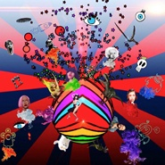
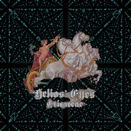
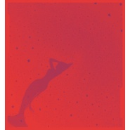
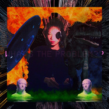
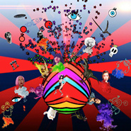

李悦君
============================

|  |  |
| :--: | :-- |
| [ 李悦君](https://i.xiami.com/ericaceae) | **播放数**: 3744677 **粉丝数**: 1733 **评论数**: 70 **地区**: China 中国大陆 **风格**: 电子 Electronic  |

## 档案

李悦君，音乐制作人，歌手Futro Futro Futro

## 专辑

| 名称 | 语种 | 唱片公司 | 发行时间 | 专辑类别 | 专辑风格 |
| :--: | :-- | :-- | :-- | :-- | :-- |
| [ Helios' eyes](./albums/2104917491.md) | 英语 |  | 2019年04月26日 | EP, 单曲 | 电子 Electronic |
| [ Ain't Nobody](./albums/2104675622.md) | 英语 |  | 2019年03月09日 | EP, 单曲 | 电子舞曲 EDM / Electronic Dance Music, 放克电子 Electro (Electro-Funk), 流行舞曲 Dance-Pop |
| [ Man on the moon](./albums/2104460462.md) | 英语 |  | 2018年09月24日 | EP, 单曲 | 爵士流行 Jazz Pop, 巴萨诺瓦 Bossa Nova |
| [ Futro Evolution](./albums/2104649218.md) | 英语 |  | 2018年08月23日 | EP, 单曲 | 电子乐 Electronica, 流行舞曲 Dance-Pop |
| [ 破冰](./albums/2104460466.md) | 粤语 |  | 2018年06月17日 | EP, 单曲 | 当代节奏布鲁斯 Contemporary R&B, 迷幻流行 Psychedelic Pop, 粤语流行 Cantopop |
| [ 爱](./albums/2104460475.md) | 国语 |  | 2018年03月21日 | EP, 单曲 | 当代节奏布鲁斯 Contemporary R&B, 阳光流行 Sunshine Pop, 迷幻流行 Psychedelic Pop |
| [ Irreplaceable](./albums/2104460469.md) | 英语 |  | 2018年01月01日 | EP, 单曲 | 爵士嘻哈 Jazz Hip Hop, 青少年流行 Teen Pop, 嘻哈 Hip-Hop |
| [ 什么问题](./albums/2102871479.md) | 国语 | 独立发行 | 2017年10月12日 | EP, 单曲 | 流行 Pop |
| [ 海王星](./albums/2102870884.md) | 国语 | 独立发行 | 2017年10月11日 | EP, 单曲 | 电子 Electronic, 爵士 Jazz |
| [ Dance with me (twinkle version)](./albums/2102870881.md) | 国语 | 独立发行 | 2017年10月11日 | EP, 单曲 | 电子 Electronic |
| [ 月亮代表我的心](./albums/2104460404.md) | 国语 |  | 2017年10月04日 | 现场专辑 | 爵士流行 Jazz Pop, 室内爵士 Chamber Jazz, 冷爵士 Cool Jazz |
| [ 下一站星光动感101节目主题曲](./albums/2102698306.md) | 国语 | 独立发行 | 2017年02月23日 | EP, 单曲 | 流行 Pop |
| [ 涟漪](./albums/2104460453.md) | 粤语 |  | 2015年10月18日 | EP, 单曲 | 爵士流行 Jazz Pop, 粤语流行 Cantopop |
| [ let it burn](./albums/2104460419.md) | 英语 |  | 2015年05月05日 | EP, 单曲 | 当代节奏布鲁斯 Contemporary R&B |
| [ Erika](./albums/412038.md) | 粤语 | 金牌大风 | 2010年11月26日 | 录音室专辑 | 粤语流行 Cantopop |
| [ 夜来香](./albums/2104460445.md) | 国语 |  | 2009年05月31日 | EP, 单曲 | 迷幻流行 Psychedelic Pop |

## 评论

|  |  |  |  |
| :-- | :-- | :-- | :-- |
|  [虾米用户](https://emumo.xiami.com/u/48160840) 暂无签名~ 2021-01-24 03:15 赞(0) 踩(0) | 
要说再见了&amp;hellip;
 |
|  [虾米用户](https://emumo.xiami.com/u/288920846)  2020-10-05 19:54 赞(0) 踩(0) | 
远方 最经典
 |
|  [虾米用户](https://emumo.xiami.com/u/267679126)  2020-07-07 01:44 赞(0) 踩(0) | 
梦伴这首歌你唱出不同的感觉，但在倒数第七句有点唐突
 |
|  [虾米用户](https://emumo.xiami.com/u/420986839)  2019-10-27 08:44 赞(0) 踩(0) | 
梦伴很好听，虽然听不懂粤语 
 |
|  [虾米用户](https://emumo.xiami.com/u/320433876) 我看着你离座。 2019-08-08 00:12 赞(0) 踩(0) | 
粉上
 |
|  [虾米用户](https://emumo.xiami.com/u/320433876) 我看着你离座。 2019-08-08 00:12 赞(0) 踩(0) | 
粉上。。。。
 |
|  [虾米用户](https://emumo.xiami.com/u/308444185) 你为王，在自己的国度。 2019-04-04 22:56 赞(0) 踩(0) | 
看封面！
 |
|  [虾米用户](https://emumo.xiami.com/u/8135575) 。 2019-01-21 23:45 赞(1) 踩(0) | 
想靜靜地聽你唱歌
 |
|  [虾米用户](https://emumo.xiami.com/u/223518066)  2018-09-27 21:09 赞(1) 踩(0) | 
很有味道
 |
|  [虾米用户](https://emumo.xiami.com/u/73210420) 满足坏人一个 2018-08-19 21:52 赞(1) 踩(0) | 
很喜欢
 |
|  [虾米用户](https://emumo.xiami.com/u/313000708)  2018-06-18 21:52 赞(1) 踩(0) | 
很喜欢你的声音^_^
 |
|  [虾米用户](https://emumo.xiami.com/u/8718026)   2018-03-30 23:37 赞(0) 踩(0) | 
Ericaaaaaa!!!!!!!!❤️
 |
|  [虾米用户](https://emumo.xiami.com/u/52053219) 达则兼济天下，穷则独善其... 2018-01-09 21:59 赞(3) 踩(0) | 
听了这么多年音乐，《小世界》和《生如夏花》这两首歌，耳目一新的感觉！
 |
|  [虾米用户](https://emumo.xiami.com/u/10147365) 未来，你好！ 2017-12-08 22:45 赞(4) 踩(0) | 
冲「星闪闪」入来！
 |
|  [虾米用户](https://emumo.xiami.com/u/288356283) 这是路  2017-12-01 17:29 赞(0) 踩(0) | 
阔以的
 |
|  [虾米用户](https://emumo.xiami.com/u/10106517) 音乐是上帝给予穷人的礼物 2017-11-25 16:06 赞(3) 踩(0) | 
改的真好，这声音无敌了
 |
|  [虾米用户](https://emumo.xiami.com/u/9122210)   2017-11-17 23:57 赞(0) 踩(0) | 
声音很棒
 |
|  [虾米用户](https://emumo.xiami.com/u/4358972)  2017-10-24 19:11 赞(0) 踩(0) | 
.
 |
|  [虾米用户](https://emumo.xiami.com/u/2555645) . 2017-10-18 10:31 赞(1) 踩(0) | 
一把靓声
 |
|  [虾米用户](https://emumo.xiami.com/u/298948030) 中國詩音樂電影创始人作曲... 2017-10-17 22:22 赞(1) 踩(0) | 
你好
 |
|  [虾米用户](https://emumo.xiami.com/u/901190)  SCC 2017-10-12 19:02 赞(1) 踩(0) | 
风格大变啊 
 |
|  [虾米用户](https://emumo.xiami.com/u/13748724) 依然热爱～是以前写给虾米... 2017-08-29 22:04 赞(3) 踩(0) | 
跟着梦伴来到这里
 |
|  [虾米用户](https://emumo.xiami.com/u/307885693)  2017-07-02 22:34 赞(22) 踩(0) | 
最喜欢你的梦伴 
 |
|  [虾米用户](https://emumo.xiami.com/u/27842397)  2017-06-11 14:37 赞(14) 踩(0) | 
把梦伴唱出不同风格
 |
|  [虾米用户](https://emumo.xiami.com/u/202224013) 留我做个垃圾常留恋于你家 2017-05-12 09:43 赞(1) 踩(0) | 
好听 喜欢
 |
|  [虾米用户](https://emumo.xiami.com/u/281725107)  2017-04-12 22:06 赞(0) 踩(0) | 

 |
|  [虾米用户](https://emumo.xiami.com/u/29990215) 暂无签名~ 2017-04-05 18:59 赞(1) 踩(0) | 
来支持留爪印(づ￣3￣)づ
 |
|  [虾米用户](https://emumo.xiami.com/u/233891239)  2017-02-23 15:58 赞(1) 踩(0) | 
稀饭稀饭 
 |
|  [虾米用户](https://emumo.xiami.com/u/275534527) FutroFutroFu... 2017-02-23 14:45 赞(83) 踩(0) | 
我刚入驻了虾米音乐人，欢迎大家来我的个人主页，收听我的最新音乐
 |
| ⇒ |  [虾米用户](https://emumo.xiami.com/u/435326332)  2020-01-13 22:57 赞(0) 踩(0) | 
支持你，努力
 |
| ⇒ |  [虾米用户](https://emumo.xiami.com/u/305177196) 壺中日月長…我是養條狗？... 2020-11-29 01:54 赞(0) 踩(0) | 
小家子氣啦，亞妹，做為個歌手，張相都冇        
 |
|  [虾米用户](https://emumo.xiami.com/u/254097392) 只想保留一颗纯真的心❤ 2016-12-19 14:41 赞(1) 踩(0) | 
声音有共鸣
 |
|  [虾米用户](https://emumo.xiami.com/u/16135450)  2016-05-11 22:23 赞(2) 踩(0) | 
576
 |
|  [虾米用户](https://emumo.xiami.com/u/7135449) 港乐 2016-03-12 08:33 赞(0) 踩(0) | 
呵呵
 |
|  [虾米用户](https://emumo.xiami.com/u/42812575) 用音乐填满我的空虚 2015-02-13 22:43 赞(1) 踩(0) | 
点解冇咗声气，歌几好啊
 |
| ⇒ |  [虾米用户](https://emumo.xiami.com/u/44689363)  2015-02-14 01:45 赞(0) 踩(0) | 
系罗～连佢微博都无乜生气～ 系米比人封杀？
 |
| ⇒ |  [虾米用户](https://emumo.xiami.com/u/42812575) 用音乐填满我的空虚 2015-02-20 22:02 赞(0) 踩(0) | 
<q><b>Ms__Fok说：</b></q>
 |
| ⇒ |  [虾米用户](https://emumo.xiami.com/u/4187272) 多洗心灵少洗脑 2017-03-21 00:55 赞(0) 踩(0) | 
<q><b>喵字～说：</b></q>
 |
|  [虾米用户](https://emumo.xiami.com/u/45558036)  2015-01-18 14:01 赞(0) 踩(0) | 
伤心小箭呢
 |
|  [虾米用户](https://emumo.xiami.com/u/13948856) 被人嫉妒地活着 2015-01-06 16:12 赞(0) 踩(0) | 
听了07版《梁祝》的片头曲找来的
 |
|  [虾米用户](https://emumo.xiami.com/u/10890911) 我还没想好要写什么... 2014-12-25 05:38 赞(0) 踩(0) | 
短发造型太棒～
 |
|  [虾米用户](https://emumo.xiami.com/u/37860054) 宇宙里有什么不是暂时 2014-09-01 17:16 赞(0) 踩(0) | 
她翻唱的『欢颜』也很好听虾米快放上来～
 |
|  [虾米用户](https://emumo.xiami.com/u/4915854) Are you real... 2014-05-02 12:07 赞(1) 踩(0) | 
我总是会故意看错为“李静君”
 |
|  [虾米用户](https://emumo.xiami.com/u/6655953)  2014-01-17 10:50 赞(1) 踩(0) | 
粤语唱歌还能更好听么
 |
|  [虾米用户](https://emumo.xiami.com/u/8384740) 爱音乐,爱电影,爱生活, 2013-05-27 23:19 赞(0) 踩(0) | 
古风
 |
|  [虾米用户](https://emumo.xiami.com/u/5868749) 纵有疾风起，人生不言弃 2013-01-17 11:39 赞(0) 踩(0) | 
广州好声音
 |
|  [虾米用户](https://emumo.xiami.com/u/5868749) 纵有疾风起，人生不言弃 2013-01-17 11:38 赞(0) 踩(0) | 
不错哦
 |
|  [虾米用户](https://emumo.xiami.com/u/2630276)  2012-11-22 12:40 赞(1) 踩(0) | 
梦伴跟星闪闪调换了。。。。。梦伴才是星闪闪 星闪闪才是梦伴 怎么会这样的。。。。。
 |
| ⇒ |  [虾米用户](https://emumo.xiami.com/u/202848092) 80年代的香港无限美好 2017-02-02 13:00 赞(0) 踩(0) | 
不是同一首歌吗
 |
|  [虾米用户](https://emumo.xiami.com/u/11203533)  2012-11-04 16:32 赞(1) 踩(0) | 
大概回长三角发展了吧......
 |
|  [虾米用户](https://emumo.xiami.com/u/11203533)  2012-11-04 16:25 赞(1) 踩(0) | 
她唱歌好听啊，可惜没有继续发片了
 |
|  [虾米用户](https://emumo.xiami.com/u/9846120) 111 2012-07-17 13:27 赞(0) 踩(0) | 
把声好好听
 |
|  [虾米用户](https://emumo.xiami.com/u/9486765)  2012-06-20 09:28 赞(0) 踩(0) | 
屌爆了
 |
|  [虾米用户](https://emumo.xiami.com/u/4874434)  2012-05-31 16:29 赞(1) 踩(0) | 
梦伴
 |
|  [虾米用户](https://emumo.xiami.com/u/7081600)  2012-04-13 12:31 赞(0) 踩(0) | 
喜欢她的声音，歌也不错哦
 |
|  [虾米用户](https://emumo.xiami.com/u/7313997) 你若喜欢怪人，那我便是神 2012-01-10 10:35 赞(0) 踩(0) | 
梦伴。
 |
|  [虾米用户](https://emumo.xiami.com/u/1507213)  2012-01-08 23:08 赞(0) 踩(0) | 
求这次杭州爵士音乐会的《月亮代表我的心》
 |
|  [虾米用户](https://emumo.xiami.com/u/2451787)   2012-01-04 14:40 赞(0) 踩(0) | 
冒住挂科噶风险搵到佢，值得
 |
|  [虾米用户](https://emumo.xiami.com/u/1844964) 暂无签名~ 2011-10-10 19:38 赞(0) 踩(0) | 
梦伴真的很好听
 |
|  [虾米用户](https://emumo.xiami.com/u/3597604) 是不是Crt 2011-10-08 21:12 赞(0) 踩(0) | 
梦伴..
 |
|  [虾米用户](https://emumo.xiami.com/u/4369285) 土黄色的尘埃找到了肺～但... 2011-09-26 03:22 赞(1) 踩(0) | 
很像梅姐~~~但是不能超越！！！
 |
|  [虾米用户](https://emumo.xiami.com/u/5955973)  2011-09-24 15:23 赞(0) 踩(0) | 
声音柔美
 |
|  [虾米用户](https://emumo.xiami.com/u/5556937)  2011-08-24 20:20 赞(0) 踩(0) | 
因为菱花镜
 |
|  [虾米用户](https://emumo.xiami.com/u/2812185) 人生何处不围城 2011-08-24 10:47 赞(0) 踩(0) | 
好爱...
 |
|  [虾米用户](https://emumo.xiami.com/u/2116635) 我还没想好要写什么... 2011-05-20 20:48 赞(0) 踩(0) | 
呢个歌手好特别，怀旧与流行并存。几中意佢啲歌
 |
|  [虾米用户](https://emumo.xiami.com/u/3395113)   2011-04-26 20:23 赞(0) 踩(0) | 
不错
 |
|  [虾米用户](https://emumo.xiami.com/u/3102303)  2011-03-22 13:15 赞(0) 踩(0) | 
好聽
 |
|  [虾米用户](https://emumo.xiami.com/u/3260094)  2011-03-20 20:13 赞(0) 踩(0) | 
******
 |
|  [虾米用户](https://emumo.xiami.com/u/36029) ½ 2011-02-10 17:19 赞(2) 踩(0) | 
头像。。。这个女人很棒，虾米你不能这样糟蹋人家啊
 |
|  [虾米用户](https://emumo.xiami.com/u/672488) 偶尔上来听听歌的懒人 2011-01-26 12:50 赞(0) 踩(0) | 
沙发 头像。。。
 |
