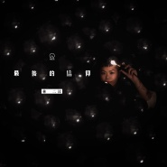
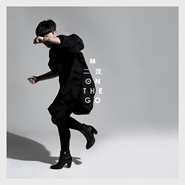
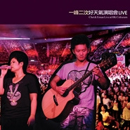
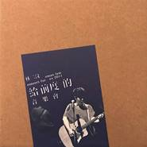
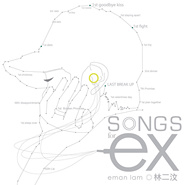
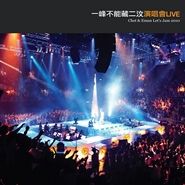
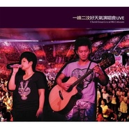

林二汶
============================

|  |  |
| :--: | :-- |
| [ 林二汶](https://i.xiami.com/emanlam) | **地区**: Hong Kong ,PRC 中国香港 **风格**: 国语流行 Mandarin Pop, 粤语流行 Cantopop **播放数**: 29649055 **粉丝数**: 27418 **评论数**: 530  |

## 档案

林二汶，香港最优秀二人唱作女子组合at17主音。曾获多个电台、电视台颁发我最喜爱及最佳组合奖项。 
林二汶在2011年3月以独立制作人身份成立个人厂牌「LAM2 林二制作」，专注开拓包括歌唱以内以"声音"为主导的事业新里程。除了举办多个有话题特色的演唱会，如《给前度的音乐会》系列外，更举办过名为《对妈有话儿》的新式表演『栋笃唱』，大获好评。2012年8月，二汶推出首张同名专辑「Eman Lam 林二汶」获香港及国内乐评人多番好评，唱片于2013年获得《第十三届南方都市报音乐传媒大奖》三项大奖，包括《最佳录音》、《最佳发烧大碟》及《最佳粤语女歌手》。 
除了专注歌唱事业外，二汶亦参与电视节目/广告V.O录音及电影配乐工作。曾为TVB《劲歌金曲》及港台制作《香港故事》、《天地物语》担任主持、亦为多个电视广告录制V.O及节目配音，并为电影《前度》及《华丽之后》创作歌曲及电影配乐，备受外间好评，二汶亦凭《华丽之后》提名2012年《香港电影金像奖》『最佳电影原创音乐』奖项。 
除音乐工作外，对舞台剧演出深具兴趣的二汶，也曾参与舞台剧演出，包括有《你咪理，我爱你，死未！》《姊宫乐园》及《红海人蓝海战》等，演技备受各方赞赏。此外，一向喜爱文字创作的二汶,推出过散文集《我有无问题》及图文集《肥妹与脂脂肪肪》，亦在2011年开始为信报及爽报撰写专栏，专栏于2013年结集成书，名为《我们应该贪新忘旧》。2013年7月获CR2邀请成为「1872游花园」节目主持。

## 专辑

| 名称 | 语种 | 唱片公司 | 发行时间 | 专辑类别 | 专辑风格 |
| :--: | :-- | :-- | :-- | :-- | :-- |
| [ 初音The Beginning of Sound](./albums/2103129666.md) | 粤语 | 索尼音乐娱乐 | 2019年10月25日 | 录音室专辑 | 粤语流行 Cantopop |
| [ 最后的信仰](./albums/2105129430.md) | 粤语 | 索尼音乐娱乐 | 2019年08月09日 | EP, 单曲 | 粤语流行 Cantopop |
| [ 守破离](./albums/2104506722.md) | 粤语 | 索尼音乐娱乐 | 2019年01月18日 | EP, 单曲 | 粤语流行 Cantopop |
| [ 爱情是一种法国甜品](./albums/2103902372.md) | 粤语 | Sony Music | 2018年08月28日 | EP, 单曲 | 粤语流行 Cantopop |
| [ Yeah (Remix Version)](./albums/2103721160.md) | 粤语 | 索尼音乐娱乐 | 2018年05月28日 | EP, 单曲 | 电子舞曲 EDM / Electronic Dance Music |
| [ Yeah](./albums/2103631380.md) | 粤语 | 索尼音乐娱乐 | 2018年03月23日 | EP, 单曲 | 粤语流行 Cantopop |
| [ 有你一个](./albums/2102765078.md) | 粤语 | So Nice Music | 2017年06月13日 | EP, 单曲 | 粤语流行 Cantopop |
| [ People Like Us我们就是这样的人](./albums/2102629126.md) | 粤语 | Smallmslam | 2016年10月25日 | 录音室专辑 | 粤语流行 Cantopop |
| [ About Time](./albums/32196627.md) | 国语 | Smallmslam | 2015年06月26日 | EP, 单曲 | 国语流行 Mandarin Pop, 华语唱作人 Chinese Singer-Songwriter |
| [ 别的](./albums/214736049.md) | 国语 | Smallmslam | 2014年11月12日 | EP, 单曲 | 国语流行 Mandarin Pop |
| [ On The Go在路上](./albums/797455829.md) | 国语 | Smallmslam | 2014年07月25日 | 录音室专辑 | 国语流行 Mandarin Pop |
| [ Wanna be with Eman & the HUSband in concert](./albums/1177765916.md) | 粤语 | Smallmslam | 2013年02月06日 | 现场专辑 | 粤语流行 Cantopop |
| [ Live At the Coliseum](./albums/5021796932.md) | 其他 | LYFE Music | 2012年10月08日 | 录音室专辑 | 流行 Pop |
| [ 林二汶 · Eman Lam](./albums/537175.md) | 粤语 | Smallmslam | 2012年08月28日 | 录音室专辑 | 粤语流行 Cantopop |
| [ 给前度的音乐会Concert for EX](./albums/486444.md) | 粤语 | Smallmslam | 2011年12月29日 | 现场专辑 | 粤语流行 Cantopop |
| [ Songs For EX前度 电影原声配乐](./albums/440135.md) | 纯音乐 | Smallmslam | 2011年05月04日 | 原声带, 影视音乐 | 电影原声 Film Score, 原声 Soundtrack |
| [ 一峰不能藏二汶演唱会Chet & Eman Let's Jam 2010](./albums/414539.md) | 粤语 | LYFE | 2010年12月02日 | 现场专辑 | 粤语流行 Cantopop |
| [ 林一歌林二唱 When She SingsEman Lam Sings Chet Lam Songbook](./albums/402941.md) | 粤语 | 东亚唱片 | 2010年09月20日 | 录音室专辑 | 粤语流行 Cantopop |
| [ 一峰二汶好天气演唱会Chet & Eman Live at HK Coliseum](./albums/361077.md) | 粤语 | LYFE | 2010年01月07日 | 现场专辑 | 粤语流行 Cantopop |
| [ 好天气Good Weather / 一峰二汶三十年 纪念EP](./albums/361266.md) | 粤语 | LYFE | 2009年12月02日 | EP, 单曲 | 儿童音乐 Children's Music |

## 评论

|  |  |  |
| :-- | :-- | :-- |
|  [虾米用户](https://emumo.xiami.com/u/322498584) 谁不眷恋这一词一曲的光辉 2020-11-22 01:00 赞(0) 踩(0) | 
喜欢林二汶
 |
|  [虾米用户](https://emumo.xiami.com/u/87098670) 又蠢又矫情 2020-10-25 10:15 赞(0) 踩(0) | 
All the best !!!
 |
|  [虾米用户](https://emumo.xiami.com/u/9478491) 舌尖紋了瑪利亞 2020-09-02 00:17 赞(0) 踩(0) | 

 |
|  [虾米用户](https://emumo.xiami.com/u/379162683) 我想要记住你们，我想要你... 2020-05-09 12:01 赞(0) 踩(0) | 

 |
|  [虾米用户](https://emumo.xiami.com/u/46001218)  2020-03-08 17:57 赞(0) 踩(0) | 
作品都很好，加油
 |
|  [虾米用户](https://emumo.xiami.com/u/1218669) 我要当一只快乐的喷子！ 2020-02-06 19:34 赞(0) 踩(0) | 
只听过她的《如水》真的优秀。
 |
|  [虾米用户](https://emumo.xiami.com/u/54523494) 怪你过分美丽 2019-12-23 01:53 赞(0) 踩(0) | 
很可惜你没有被全部人知道 不然会有更多人爱你的歌
 |
|  [虾米用户](https://emumo.xiami.com/u/54373639) 腦海有風 發膚無損 2019-10-27 07:11 赞(0) 踩(0) | 
来啦
 |
|  [虾米用户](https://emumo.xiami.com/u/49544593) 随意的生活. 2019-10-10 22:02 赞(0) 踩(0) | 
实力选手 
 |
|  [虾米用户](https://emumo.xiami.com/u/307103347) 音乐知我心，我心依旧。 2019-09-20 22:28 赞(0) 踩(0) | 
最钟意你的两首歌：People like us  像我这样的女孩；在天猫精灵里又无意听到这首歌，爱上了❤️
 |
|  [虾米用户](https://emumo.xiami.com/u/423054446)  2019-07-17 18:37 赞(0) 踩(0) | 
正啊把喉
 |
|  [虾米用户](https://emumo.xiami.com/u/360769)  2019-06-13 22:26 赞(0) 踩(0) | 
二汶，我爱你。
 |
|  [虾米用户](https://emumo.xiami.com/u/403296134)  2019-04-18 19:50 赞(4) 踩(0) | 
你好，二汶，十几年前学生时代很喜欢听你的歌，当然还有你哥哥的，感觉你们都是感情细腻并且恋旧的人，和我一样，哈哈
 |
| ⇒ |  [虾米用户](https://emumo.xiami.com/u/307103347) 音乐知我心，我心依旧。 2019-09-20 22:30 赞(0) 踩(0) | 
林一峰是她哥呀？哈哈，兄妹俩都好有才！
 |
|  [虾米用户](https://emumo.xiami.com/u/34263208) 我还没想好要写什么... 2019-04-18 19:46 赞(1) 踩(0) | 
太喜欢你的声线了
 |
|  [虾米用户](https://emumo.xiami.com/u/258782198) 星海 2019-02-27 16:30 赞(0) 踩(0) | 
爱你
 |
|  [虾米用户](https://emumo.xiami.com/u/339191478)   2019-02-26 00:26 赞(0) 踩(0) | 

 |
|  [虾米用户](https://emumo.xiami.com/u/16887171) 不认真我就赢了 2019-02-24 20:18 赞(0) 踩(0) | 
最初好听
 |
|  [虾米用户](https://emumo.xiami.com/u/12177420) 网易云: FIUFIU_... 2019-02-04 17:50 赞(0) 踩(0) | 
林二汶 林一峰
 |
|  [虾米用户](https://emumo.xiami.com/u/25723899) 寂寞的人  有福了。 2019-01-18 22:27 赞(1) 踩(0) | 
守破離。
 |
|  [虾米用户](https://emumo.xiami.com/u/49640493) 网易云SAINTDONT... 2019-01-06 22:31 赞(3) 踩(0) | 
完全恋爱状态
 |
| ⇒ |  [虾米用户](https://emumo.xiami.com/u/328570828) 酷盖 2019-02-08 18:46 赞(0) 踩(0) | 
第二次看见你了！
 |
| ⇒ |  [虾米用户](https://emumo.xiami.com/u/49640493) 网易云SAINTDONT... 2019-02-08 23:01 赞(0) 踩(0) | 
<q><b>Sia.说：</b></q>
 |
|  [虾米用户](https://emumo.xiami.com/u/123923822)  2019-01-04 15:30 赞(0) 踩(0) | 
很好的声音，很好听的歌声。大爱
 |
|  [虾米用户](https://emumo.xiami.com/u/18395771) 没头没尾又甜又美 2019-01-03 09:44 赞(0) 踩(0) | 
天使嗓子
 |
|  [虾米用户](https://emumo.xiami.com/u/411636205) 这家伙很可爱，什么都不想... 2019-01-02 13:26 赞(0) 踩(0) | 
说真的，林二汶是我最喜欢的华语女歌手之一。
 |
|  [虾米用户](https://emumo.xiami.com/u/49004765)   2018-12-26 15:01 赞(1) 踩(0) | 
专业贴膜林二汶 
 |
|  [虾米用户](https://emumo.xiami.com/u/71178106) 塵世や 酒、風呂を抜け ... 2018-12-08 01:13 赞(0) 踩(0) | 
♡
 |
|  [虾米用户](https://emumo.xiami.com/u/291937606)  2018-12-04 21:10 赞(0) 踩(0) | 
你太棒了   
 |
|  [虾米用户](https://emumo.xiami.com/u/322905899)  2018-11-22 23:04 赞(2) 踩(0) | 
不下王菲
 |
|  [虾米用户](https://emumo.xiami.com/u/272509168) KBSJALF2333 2018-11-15 11:51 赞(0) 踩(0) | 

 |
|  [虾米用户](https://emumo.xiami.com/u/49004765)   2018-10-25 09:41 赞(2) 踩(0) | 
汶姨生日快乐 愿你永远是那个可爱的阿乐 
 |
|  [虾米用户](https://emumo.xiami.com/u/376727045)  2018-10-14 18:47 赞(0) 踩(0) | 
唯独你不可取代    歌词太好，唱得也很好，love  
 |
|  [虾米用户](https://emumo.xiami.com/u/49004765)   2018-10-01 09:46 赞(2) 踩(0) | 
真的是太喜欢二汶了，超级活泼可爱鬼马，瞬间看地球每次要笑死我哈哈哈哈，声音不用说超级迷人，关键是声音还好多变，不去给卡通片配音简直浪费了2333，而且汶姨真的是个有智慧的人，不论是看at17时期小小年纪的访谈，还是看这些年的文字。哦对了，二汶的画画也很棒耶！
 |
|  [虾米用户](https://emumo.xiami.com/u/2796166) 最爱莫文蔚..... 2018-09-11 00:40 赞(0) 踩(0) | 
兄妹都好有才华~~~：）
 |
|  [虾米用户](https://emumo.xiami.com/u/7758802) 永远支持Twins！ 2018-09-08 20:01 赞(2) 踩(0) | 
忽然发现SONY、华纳的歌都下架了..........
 |
|  [虾米用户](https://emumo.xiami.com/u/248054181) 还是差的太远 还要还要翻... 2018-08-28 21:30 赞(3) 踩(0) | 
日子很难 有你的歌也还能一起撑下去
 |
|  [虾米用户](https://emumo.xiami.com/u/306074046) . 2018-08-26 21:47 赞(1) 踩(0) | 
我喜欢你！！
 |
|  [虾米用户](https://emumo.xiami.com/u/234242553) time will te... 2018-08-08 21:24 赞(13) 踩(0) | 
劲中意二汶的声线！希望可以来广州开mini concert。还记得八年前的广州不插电concert！难忘之夜
 |
|  [虾米用户](https://emumo.xiami.com/u/294308132) 细个最喜欢仲夏，世界似一... 2018-08-06 09:24 赞(1) 踩(0) | 
所以二汶真的是一峰的妹妹吗？
 |
| ⇒ |  [虾米用户](https://emumo.xiami.com/u/297999609) 去克洛里吧 2018-08-06 19:27 赞(0) 踩(0) | 
是的啊
 |
|  [虾米用户](https://emumo.xiami.com/u/4246682) 乜X都聽 2018-08-05 13:51 赞(0) 踩(0) | 
傷心
 |
|  [虾米用户](https://emumo.xiami.com/u/257203871) 我把梦撕了一夜，不懂明天... 2018-08-02 07:20 赞(0) 踩(0) | 
六年前，通过前度这部电影知道你的歌曲
 |
|  [虾米用户](https://emumo.xiami.com/u/379517973)  张婷君 2018-07-24 08:15 赞(0) 踩(0) | 
关注我呗  
 |
|  [虾米用户](https://emumo.xiami.com/u/1024746) 灵魂不该屈服 2018-07-21 20:49 赞(0) 踩(0) | 
呢d甘加好也，衣家d人系好难发现得到
 |
|  [虾米用户](https://emumo.xiami.com/u/119399780)  2018-06-30 11:57 赞(13) 踩(0) | 
live水准很高很稳
 |
|  [虾米用户](https://emumo.xiami.com/u/34263208) 我还没想好要写什么... 2018-06-29 18:47 赞(1) 踩(0) | 
好中意这首
 |
|  [虾米用户](https://emumo.xiami.com/u/314366631)  2018-06-28 19:03 赞(0) 踩(0) | 
加油
 |
|  [虾米用户](https://emumo.xiami.com/u/18617868)  2018-06-25 12:28 赞(0) 踩(0) | 
默默喜欢你的音乐好久了  请继续加油
 |
|  [虾米用户](https://emumo.xiami.com/u/358136794)  2018-06-22 03:03 赞(0) 踩(0) | 
偶然听到朋友放你的歌，觉得很好听
 |
|  [虾米用户](https://emumo.xiami.com/u/51988543) Easy come ea... 2018-06-20 13:46 赞(0) 踩(0) | 
美
 |
|  [虾米用户](https://emumo.xiami.com/u/285049473) 剛拿起酒杯想和你碰杯 才... 2018-06-07 14:44 赞(0) 踩(0) | 
太爱你了
 |
|  [虾米用户](https://emumo.xiami.com/u/48478241) 我还没想好要写什么... 2018-06-04 21:37 赞(3) 踩(0) | 
好喜欢你的《给前度的演唱会》。你在前度的惊鸿一现给我留下了很深的念想。
 |
|  [虾米用户](https://emumo.xiami.com/u/269540781) 香港。 2018-05-19 22:18 赞(0) 踩(0) | 
我爱你
 |
|  [虾米用户](https://emumo.xiami.com/u/13748724) 依然热爱～是以前写给虾米... 2018-05-15 20:52 赞(0) 踩(0) | 
好听好听
 |
|  [虾米用户](https://emumo.xiami.com/u/265931037)  2018-05-10 01:04 赞(1) 踩(0) | 
想当年你还是组合的时候就钟意你的歌，你哥哥也是棒棒哒
 |
|  [虾米用户](https://emumo.xiami.com/u/49004765)   2018-04-11 18:42 赞(1) 踩(0) | 
恭喜二汶加入sony啦！期待更多好作品！
 |
|  [虾米用户](https://emumo.xiami.com/u/18975573)  2018-04-09 20:21 赞(0) 踩(0) | 
 
 |
|  [虾米用户](https://emumo.xiami.com/u/231330994)  2018-04-03 14:35 赞(0) 踩(0) | 
真棒！稀饭～
 |
|  [虾米用户](https://emumo.xiami.com/u/321542034) 如果爱，请深爱。 2018-03-27 20:48 赞(0) 踩(0) | 
好听，lam
 |
|  [虾米用户](https://emumo.xiami.com/u/306074046) . 2018-03-21 21:09 赞(0) 踩(0) | 
加油
 |
|  [虾米用户](https://emumo.xiami.com/u/338416385) 我！爱！黄！耀！明！ 2018-03-18 16:02 赞(0) 踩(0) | 
加油！！！
 |
|  [虾米用户](https://emumo.xiami.com/u/351434571)  2018-03-17 20:46 赞(0) 踩(0) | 
666
 |
|  [虾米用户](https://emumo.xiami.com/u/9274302) 那有什么岁月静好 只是有... 2018-02-27 09:57 赞(0) 踩(0) | 
好正
 |
|  [虾米用户](https://emumo.xiami.com/u/48214132)   2018-02-19 13:11 赞(0) 踩(0) | 
會唱歌的歌手，實力派
 |
|  [虾米用户](https://emumo.xiami.com/u/4742941)   2018-02-15 13:26 赞(1) 踩(0) | 
编曲非常好，终于知道很多歌曲不是中文或者粤语的问题，就是很多歌曲编曲太差，既不欢快又不悲伤，皮笑肉不笑。
 |
|  [虾米用户](https://emumo.xiami.com/u/194956718) 走成了一片殘影 2018-02-08 23:34 赞(0) 踩(0) | 
sor，不止聲音好聽啦，節奏是真的舒服
 |
|  [虾米用户](https://emumo.xiami.com/u/194956718) 走成了一片殘影 2018-02-08 23:27 赞(0) 踩(0) | 
好舒服的聲音
 |
|  [虾米用户](https://emumo.xiami.com/u/12164333) hey！Moore 2018-02-02 12:05 赞(0) 踩(0) | 
前来支持Eman
 |
|  [虾米用户](https://emumo.xiami.com/u/338453244)  2017-12-28 20:58 赞(0) 踩(0) | 
在友人的MAYBACH车上首听&amp;lt;银发白&amp;gt;，无法抑止地喜上这声线 
 |
|  [虾米用户](https://emumo.xiami.com/u/5526289) 开心小甜豆 2017-12-14 22:11 赞(0) 踩(0) | 
☆
 |
|  [虾米用户](https://emumo.xiami.com/u/41748767) 还在找我的小仙女。 2017-12-11 23:39 赞(2) 踩(0) | 
声音好好听！
 |
|  [虾米用户](https://emumo.xiami.com/u/15951424)   2017-11-21 18:23 赞(15) 踩(0) | 
头像有点像岳云鹏 哈哈哈
 |
|  [虾米用户](https://emumo.xiami.com/u/5145622)  毎日元気に過ごしましょ... 2017-11-13 09:02 赞(0) 踩(0) | 
额，所以很久前删掉的专辑就一直没踪影了么。我刚刚开始玩虾米就是为了听林二汶的歌啊。唉……
 |
|  [虾米用户](https://emumo.xiami.com/u/229490650) 就像他在游戏中所追求的排... 2017-11-07 22:58 赞(1) 踩(0) | 
因为一峰知道的啊，很好的一对兄妹啊，低调谦逊。
 |
|  [虾米用户](https://emumo.xiami.com/u/291224087)   2017-11-05 12:32 赞(1) 踩(0) | 
努力做好音樂二汶。。。支持妳
 |
|  [虾米用户](https://emumo.xiami.com/u/7298526)  2017-10-28 00:41 赞(0) 踩(0) | 
喜欢《最后》《北京道落雪了》《在你身边》 《无忘花》～～特别是《最后》 那么好听都没有前十！！！
 |
|  [虾米用户](https://emumo.xiami.com/u/3657334) 你打錯電話啦. 嘟--- 2017-10-28 00:15 赞(0) 踩(0) | 
！！！！！！二汶居然会回复评论，我有机会被翻牌子嘛？w(ﾟДﾟ)w 哈哈哈哈哈哈哈XDDD不过真系超中意你唱歌，你把声好正
 |
|  [虾米用户](https://emumo.xiami.com/u/8262976) 巨能吃 2017-10-27 23:27 赞(0) 踩(0) | 
早就知道林二汶很牛逼，从 ex 那张专辑就挺喜欢的，但是也是最近细细听她的歌，才发现她粤语，普通话，英语都驾驶得很走心
 |
|  [虾米用户](https://emumo.xiami.com/u/3249237)  2017-10-27 23:20 赞(1) 踩(0) | 
她的人和她的声音太不一样了。看过她的几个客串角色，都不相信这样的声音出自一个小平头类似男生的女生。但是很喜欢她。从前度开始。
 |
|  [虾米用户](https://emumo.xiami.com/u/304397647)  2017-10-26 22:40 赞(0) 踩(0) | 
看前度的时候，里面的林小姐 感觉声音不像啊
 |
|  [虾米用户](https://emumo.xiami.com/u/14733180) 廣 2017-10-25 01:20 赞(0) 踩(0) | 
A17前成员，实力派
 |
|  [虾米用户](https://emumo.xiami.com/u/326954531) 林二汶给你我的小心心❤ 2017-10-09 07:24 赞(1) 踩(0) | 
林二汶给你我的小心心❤
 |
|  [虾米用户](https://emumo.xiami.com/u/4962245)   2017-09-28 23:05 赞(0) 踩(0) | 
中意你滴声音～
 |
|  [虾米用户](https://emumo.xiami.com/u/324815439)  2017-09-26 10:04 赞(0) 踩(0) | 
喜欢还要理由？逗我吗
 |
|  [虾米用户](https://emumo.xiami.com/u/2958995)  2017-09-08 19:30 赞(0) 踩(0) | 
所有的好印象都毁在漩涡里了 
 |
|  [虾米用户](https://emumo.xiami.com/u/6652575) mbz2006 2017-09-05 19:51 赞(0) 踩(0) | 
ok
 |
|  [虾米用户](https://emumo.xiami.com/u/4879660)  2017-08-23 16:11 赞(0) 踩(0) | 
胸大有脑
 |
|  [虾米用户](https://emumo.xiami.com/u/17004618) 念，于分分，于秒秒。 2017-07-23 00:43 赞(0) 踩(0) | 
最爱你！！
 |
|  [虾米用户](https://emumo.xiami.com/u/50477070) 避难所 2017-07-12 22:09 赞(0) 踩(0) | 
最爱你啦
 |
|  [虾米用户](https://emumo.xiami.com/u/274794273)  2017-07-02 21:09 赞(1) 踩(0) | 
从QQ音乐追过来的，QQ音乐都不能听。声音好听，《至死不渝》真的好听，声音好听以为会长的很美 
 |
| ⇒ |  [虾米用户](https://emumo.xiami.com/u/49838251) 我爱S 2017-07-11 00:26 赞(0) 踩(0) | 
我觉得是很美
 |
|  [虾米用户](https://emumo.xiami.com/u/1608079)  2017-06-30 18:03 赞(0) 踩(0) | 
声音质感。
 |
|  [虾米用户](https://emumo.xiami.com/u/8270213) 清净地 2017-06-25 23:07 赞(0) 踩(0) | 
喜欢，
 |
|  [虾米用户](https://emumo.xiami.com/u/5161648) 没错我就是很聪明什么也没... 2017-06-24 22:17 赞(2) 踩(0) | 
坚毅而温柔
 |
|  [虾米用户](https://emumo.xiami.com/u/1024746) 灵魂不该屈服 2017-06-14 11:43 赞(0) 踩(0) | 
支持香港的声音
 |
|  [虾米用户](https://emumo.xiami.com/u/274820341)  2017-06-13 21:50 赞(0) 踩(0) | 
棒棒的
 |
|  [虾米用户](https://emumo.xiami.com/u/39954947) 我们是保守同一个秘密的两... 2017-05-07 00:27 赞(0) 踩(0) | 
我很爱
 |
|  [虾米用户](https://emumo.xiami.com/u/97668098)   2017-05-02 22:20 赞(1) 踩(0) | 
喜欢二汶的声音～
 |
|  [虾米用户](https://emumo.xiami.com/u/274688664)  2017-04-21 23:29 赞(0) 踩(0) | 
❤️
 |
|  [虾米用户](https://emumo.xiami.com/u/54210982) 咦，你也在这里吗？ 2017-04-19 19:40 赞(0) 踩(0) | 

 |
|  [虾米用户](https://emumo.xiami.com/u/10890911) 我还没想好要写什么... 2017-04-19 18:55 赞(0) 踩(0) | 
加油加油噢～～
 |
|  [虾米用户](https://emumo.xiami.com/u/284606504)  2017-04-18 04:30 赞(0) 踩(0) | 
[Reply@咚咚]的确
 |
|  [虾米用户](https://emumo.xiami.com/u/43014100) 朴素 自然 坚定 2017-04-08 13:39 赞(0) 踩(0) | 
喜欢
 |
|  [虾米用户](https://emumo.xiami.com/u/124002836)   2017-03-25 16:22 赞(0) 踩(0) | 
其实妹妹的声线和哥哥的有点像呢
 |
|  [虾米用户](https://emumo.xiami.com/u/124002836)   2017-03-25 15:56 赞(0) 踩(0) | 
加油 超棒的
 |
|  [虾米用户](https://emumo.xiami.com/u/8548568) 暂无签名~ 2017-03-22 17:28 赞(0) 踩(0) | 
很棒的音乐人  唱功是听不出来的  好唱功却让人们听出感觉
 |
|  [虾米用户](https://emumo.xiami.com/u/43838497) 陈奕迅神经研究所 2017-03-08 00:55 赞(1) 踩(0) | 
唯独你是不可替代
 |
|  [虾米用户](https://emumo.xiami.com/u/322716)  2017-03-06 03:46 赞(1) 踩(0) | 
二汶唱得很好聽，加油！
 |
|  [虾米用户](https://emumo.xiami.com/u/276777298)  2017-02-28 15:34 赞(0) 踩(0) | 
银白发不错的呢
 |
|  [虾米用户](https://emumo.xiami.com/u/61862196) 你们的品味真是太高了， 2017-02-25 08:49 赞(2) 踩(0) | 
胖成这样了&amp;hellip;&amp;hellip;高中就听过你的歌了，现在大学要毕业了都，
 |
|  [虾米用户](https://emumo.xiami.com/u/251091462)   2017-02-16 13:35 赞(1) 踩(0) | 
唯独你是不可替代好好听，加油
 |
|  [虾米用户](https://emumo.xiami.com/u/270040303) 你好。 2017-02-02 15:01 赞(0) 踩(0) | 
来了呢
 |
|  [虾米用户](https://emumo.xiami.com/u/11444785) 经书向前翻 2017-01-31 21:02 赞(36) 踩(0) | 
《刹那的乌托邦》原声大碟现正在众筹出碟中，其中第二章《银发白》有二汶的参与演唱，整张专辑的作曲和作词曾擦出无数火花的冯颖琪和周耀辉，相信喜欢二汶的歌迷们一定不会陌生了。 希望有更多的人支持实体碟，支持唱片，让我们可以把这份了不起的作品永久珍藏。 请广大歌迷自行在以下网址进行购买，付款方式支持支付宝。 记得拍邮费哦。 <a href="https://musicbee.cc/project/utopiamomentarily" target="_blank" rel="nofollow noreferrer noopener">https://musicbee.cc/project/utopiamomentarily</a>  让我们一起支持好的作品，一起支持二汶！
 |
|  [虾米用户](https://emumo.xiami.com/u/260167529) 爱音乐的疯子 2017-01-18 21:52 赞(0) 踩(0) | 
一锋二汶 清新兄妹趴
 |
|  [虾米用户](https://emumo.xiami.com/u/12221090) 逍遥于天地而心意自得 2017-01-14 21:21 赞(1) 踩(0) | 
赞
 |
|  [虾米用户](https://emumo.xiami.com/u/46213973) 飘渺宇宙 天使逡巡 2017-01-10 11:46 赞(1) 踩(0) | 
港乐的希望
 |
|  [虾米用户](https://emumo.xiami.com/u/11530127) 我还没想好要写什么... 2017-01-06 22:25 赞(0) 踩(0) | 
唱出了心底的声音，多多少少唱出了我心底的声音
 |
|  [虾米用户](https://emumo.xiami.com/u/54476465)  2016-12-24 11:25 赞(0) 踩(0) | 
除王菲以外就你的歌好听
 |
|  [虾米用户](https://emumo.xiami.com/u/34707490)  2016-12-22 21:46 赞(0) 踩(0) | 
老天赏饭吃的声音，不管是唱国语还是唱粤语听起来都十分舒服~希望更多人能听到这样的好声音
 |
|  [虾米用户](https://emumo.xiami.com/u/1643164) 阳光淌过手心天空笑了笑！ 2016-12-22 10:13 赞(0) 踩(0) | 
喜欢~_~
 |
|  [虾米用户](https://emumo.xiami.com/u/48276337) 22世纪不道德 2016-12-12 16:23 赞(0) 踩(0) | 

 |
|  [虾米用户](https://emumo.xiami.com/u/117949204)  2016-12-02 03:49 赞(0) 踩(0) | 
喜欢你们兄妹两 加油
 |
|  [虾米用户](https://emumo.xiami.com/u/5660107) 请你不要吃我，我给你唱一... 2016-11-23 01:44 赞(0) 踩(0) | 
开开心心吃吃爆米花 
 |
|  [虾米用户](https://emumo.xiami.com/u/9082148)  2016-11-22 14:24 赞(0) 踩(0) | 
近年来声音特别好听的女歌手
 |
|  [虾米用户](https://emumo.xiami.com/u/30959317) 我还没想好要写什么... 2016-11-22 09:33 赞(0) 踩(0) | 

 |
|  [虾米用户](https://emumo.xiami.com/u/274397) better! 2016-11-10 11:35 赞(0) 踩(0) | 
我喜欢
 |
|  [虾米用户](https://emumo.xiami.com/u/29299020)  2016-10-25 20:53 赞(1) 踩(0) | 
听你唱歌，是一种享受！
 |
|  [虾米用户](https://emumo.xiami.com/u/79474212) 。 2016-09-23 17:14 赞(0) 踩(0) | 
 
 |
|  [虾米用户](https://emumo.xiami.com/u/9194922) 臨湖靜坐 日影飛去 2016-09-22 23:57 赞(2) 踩(0) | 
HK国语很不错的女声
 |
|  [虾米用户](https://emumo.xiami.com/u/35329358)   2016-08-29 11:23 赞(1) 踩(0) | 
昨天去电影院，又看到了正片放映之前的那段很可爱的动画短片，这次注意到了演唱者——林二汶。很可爱的曲子 
 |
|  [虾米用户](https://emumo.xiami.com/u/43220237) With a heart... 2016-08-25 23:05 赞(2) 踩(0) | 
没人觉得封面这张神似小岳岳么 
 |
| ⇒ |  [虾米用户](https://emumo.xiami.com/u/2081245)  2016-12-12 15:44 赞(0) 踩(0) | 
异父异母的小岳岳
 |
|  [虾米用户](https://emumo.xiami.com/u/2248143)  2016-08-10 18:52 赞(2) 踩(0) | 
天籟美聲. 要怎麼形容? 中英文都要詞窮, 文字不足以形容她的美. 深院月. 落梅風. 解語花. 林小姐的歌聲是僊品, 如雪月交光之清朗明淨, 似月下梨花之雅憺雋逸. 你把我灌醉!!
 |
|  [虾米用户](https://emumo.xiami.com/u/33526842) 乐手与人生 2016-08-05 01:58 赞(0) 踩(0) | 
声音很好听哦
 |
|  [虾米用户](https://emumo.xiami.com/u/1378259)   2016-08-03 14:36 赞(0) 踩(0) | 
喜欢你的声音。
 |
|  [虾米用户](https://emumo.xiami.com/u/16339098) 喵 我会疯狂摇尾巴 2016-07-14 14:51 赞(0) 踩(0) | 
好有意思的girl！！！
 |
|  [虾米用户](https://emumo.xiami.com/u/10601625)  2016-07-11 16:06 赞(0) 踩(0) | 
声音炒鸡好听
 |
|  [虾米用户](https://emumo.xiami.com/u/89331344)   2016-07-01 18:50 赞(0) 踩(0) | 
特别特别中意无忘花的歌词 很妙
 |
|  [虾米用户](https://emumo.xiami.com/u/46213973) 飘渺宇宙 天使逡巡 2016-07-01 17:36 赞(0) 踩(0) | 
很喜欢at17，林二坟，卢凯彤，分开了也都各自很棒
 |
|  [虾米用户](https://emumo.xiami.com/u/20166640)   2016-06-25 10:14 赞(2) 踩(0) | 
很带感的女中音，音质有种丝绸般平滑凉爽感。如果不是虾米推荐，还不知道有此女…
 |
|  [虾米用户](https://emumo.xiami.com/u/72666568)  2016-06-17 17:16 赞(0) 踩(0) | 
好久啦
 |
|  [虾米用户](https://emumo.xiami.com/u/7715811)   2016-06-05 12:28 赞(0) 踩(0) | 
想不起来上次收藏的歌手叫什么名字……
 |
| ⇒ |  [虾米用户](https://emumo.xiami.com/u/7715811)   2016-06-12 21:54 赞(0) 踩(0) | 
<q><b>说：</b></q>
 |
| ⇒ |  [虾米用户](https://emumo.xiami.com/u/7715811)   2016-06-13 14:31 赞(0) 踩(0) | 
<q><b>说：</b></q>
 |
|  [虾米用户](https://emumo.xiami.com/u/1604862) 这家伙比较懒，是啊，没空 2016-05-30 17:54 赞(1) 踩(0) | 
他哥哥的歌挺有趣，而她的声音就很好听
 |
|  [虾米用户](https://emumo.xiami.com/u/177916102)  2016-05-23 23:16 赞(0) 踩(0) | 
喜欢二汶的声音里天真的世故，第一首听过的是《别的》，光听声音就很想好好说一些没人听的事
 |
|  [虾米用户](https://emumo.xiami.com/u/50237606) Go Away 2016-05-21 19:05 赞(1) 踩(0) | 
声音好棒
 |
|  [虾米用户](https://emumo.xiami.com/u/16135450)  2016-05-14 21:17 赞(0) 踩(0) | 
666
 |
|  [虾米用户](https://emumo.xiami.com/u/46081663) 我还没想好要写什么... 2016-05-06 15:41 赞(0) 踩(0) | 
蛮不错的
 |
|  [虾米用户](https://emumo.xiami.com/u/41287070)   2016-05-04 10:19 赞(0) 踩(0) | 
好好听啊～～～ 快上我歌
 |
|  [虾米用户](https://emumo.xiami.com/u/45384623)   2016-04-19 12:15 赞(0) 踩(0) | 
❤️
 |
|  [虾米用户](https://emumo.xiami.com/u/45384623)   2016-04-19 12:14 赞(0) 踩(0) | 
❤️
 |
|  [虾米用户](https://emumo.xiami.com/u/45039115) 无限虾米！有你不寂寞！ 2016-04-12 17:05 赞(0) 踩(0) | 
32个赞！
 |
|  [虾米用户](https://emumo.xiami.com/u/5661828) Listen. 2016-04-07 15:20 赞(0) 踩(0) | 
vocal nice
 |
|  [虾米用户](https://emumo.xiami.com/u/5050538)   2016-04-03 23:32 赞(1) 踩(0) | 
很喜欢她的声音，之前是离线音乐包听到的白头，就喜欢上了。然后今晚看饭拍视频的bgm一秒爱上，也是她唱的，最幸运的人。这大概是真的喜欢吧。
 |
|  [虾米用户](https://emumo.xiami.com/u/2206850)  2016-04-01 09:36 赞(0) 踩(0) | 
好听~比那些所谓的大牌好听太多了~现在的都是炒作~难得的好声音最喜欢DO U LOVE ME
 |
|  [虾米用户](https://emumo.xiami.com/u/111794544)  2016-03-20 11:53 赞(0) 踩(0) | 
真的很好听，声音好温柔～ 没想到长得还挺拉拉的哈哈 不过很有风格  好好听加油～
 |
|  [虾米用户](https://emumo.xiami.com/u/5790969) Just listen.... 2016-03-09 22:36 赞(0) 踩(0) | 
声音好棒！
 |
|  [虾米用户](https://emumo.xiami.com/u/12852028) 国家级爱情退堂鼓专业鼓手... 2016-02-29 01:46 赞(3) 踩(0) | 
阿蚊的唱功真的被人低估了好多。。。
 |
|  [虾米用户](https://emumo.xiami.com/u/25471222) 对自由有多大的理解 就有... 2016-02-01 09:55 赞(3) 踩(0) | 
你超级棒的 期待你在内地开演唱会！记得特邀卢凯彤！！
 |
|  [虾米用户](https://emumo.xiami.com/u/2724806) 拥抱你 2016-01-19 00:42 赞(2) 踩(0) | 
喜欢你和你哥
 |
|  [虾米用户](https://emumo.xiami.com/u/2062485) 深夜的沿海公路配音乐 2016-01-18 21:57 赞(2) 踩(0) | 
声线不错哦，好羡慕
 |
|  [虾米用户](https://emumo.xiami.com/u/20484397) 要才有才要貌有貌 2016-01-12 16:41 赞(1) 踩(0) | 
不错呢
 |
|  [虾米用户](https://emumo.xiami.com/u/6121995)  2016-01-04 13:48 赞(1) 踩(0) | 
不错
 |
|  [虾米用户](https://emumo.xiami.com/u/26289534)  2015-12-31 17:15 赞(1) 踩(0) | 
您早该红了 我的15 岁听着AT17 的东西 一晃11年过去了
 |
|  [虾米用户](https://emumo.xiami.com/u/2694422) 我还没想好要写什么... 2015-12-29 08:46 赞(2) 踩(0) | 
关注了二汶这么久 竟然还来参加了好歌曲 祝愿你事业兴盛 但还是自私地只希望你能来我的城市 开一场小小的音乐会 我一定会去 听你唱
 |
|  [虾米用户](https://emumo.xiami.com/u/26289534)  2015-12-28 20:58 赞(2) 踩(0) | 
10来年前就该红了 我的10来岁的时光AT 15 听 AT17一转眼  i AM 26
 |
|  [虾米用户](https://emumo.xiami.com/u/36057872) 网易/BC: Breat... 2015-12-25 21:10 赞(0) 踩(0) | 
看不出声音这么好~
 |
|  [虾米用户](https://emumo.xiami.com/u/20010220) 热爱音乐，享受生活 2015-12-22 19:12 赞(1) 踩(0) | 
At17
 |
|  [虾米用户](https://emumo.xiami.com/u/88639500) 灵与欲已升级了  怎可再... 2015-12-22 00:17 赞(0) 踩(0) | 
听了的两首，都是惊艳
 |
|  [虾米用户](https://emumo.xiami.com/u/92642154)  2015-12-21 20:10 赞(0) 踩(0) | 
二汶
 |
|  [虾米用户](https://emumo.xiami.com/u/403885) 听我的心，走我的路 2015-12-21 10:28 赞(0) 踩(0) | 
人家长得不难看 只是喜欢这种风格 想漂亮还不容易
 |
|  [虾米用户](https://emumo.xiami.com/u/600368) 群众的眼睛是雪亮的=喷子 2015-12-19 00:27 赞(0) 踩(0) | 
最近跟同事在策划一个关于前男友的微电影，听到there is no such thing突然觉得好配好适合做结尾BGM
 |
|  [虾米用户](https://emumo.xiami.com/u/47382964)  2015-12-09 15:00 赞(0) 踩(0) | 
真的！相见恨晚
 |
|  [虾米用户](https://emumo.xiami.com/u/47382964)  2015-12-09 15:00 赞(0) 踩(0) | 
真的！相见恨晚
 |
|  [虾米用户](https://emumo.xiami.com/u/48791475) 一个不知好歹的朋友 2015-12-04 04:24 赞(0) 踩(0) | 
太好聽 耳朵要懷孕    
 |
|  [虾米用户](https://emumo.xiami.com/u/48497404)   2015-11-23 21:33 赞(1) 踩(0) | 
相见恨晚
 |
|  [虾米用户](https://emumo.xiami.com/u/17527) 爱被我们打了死结 2015-11-22 10:31 赞(0) 踩(0) | 
东莞草莓音乐节见！
 |
|  [虾米用户](https://emumo.xiami.com/u/8070377) 爱雾瑞性维欧腐漏 2015-10-25 19:28 赞(0) 踩(0) | 
林姐
 |
| ⇒ |  [虾米用户](https://emumo.xiami.com/u/7645492) CREEPY_DOLL 2015-11-16 21:34 赞(0) 踩(0) | 
这不是那谁吗- -
 |
| ⇒ |  [虾米用户](https://emumo.xiami.com/u/8070377) 爱雾瑞性维欧腐漏 2015-11-16 21:56 赞(0) 踩(0) | 
<q><b>桃子同学❤说：</b></q>
 |
|  [虾米用户](https://emumo.xiami.com/u/43095053)  2015-10-24 15:39 赞(0) 踩(0) | 
声音好听，支持！
 |
|  [虾米用户](https://emumo.xiami.com/u/46727526)   2015-10-24 08:40 赞(0) 踩(0) | 
好爱好爱你❤️有机会来重庆好么
 |
|  [虾米用户](https://emumo.xiami.com/u/438977)  2015-10-08 00:26 赞(0) 踩(0) | 
十分喜欢二文的音乐！
 |
|  [虾米用户](https://emumo.xiami.com/u/6148749) 無理心中日和 2015-10-07 11:59 赞(0) 踩(0) | 
声音太好了
 |
|  [虾米用户](https://emumo.xiami.com/u/7661454) 为宝我的爱 2015-09-29 08:03 赞(1) 踩(0) | 
听成了孙燕姿
 |
|  [虾米用户](https://emumo.xiami.com/u/37142358) crap of the ... 2015-09-26 23:04 赞(3) 踩(0) | 
我高中开始听你的歌 以为你有一天会红的
 |
| ⇒ |  [虾米用户](https://emumo.xiami.com/u/44694702)   2015-11-08 20:57 赞(0) 踩(0) | 
我也是
 |
|  [虾米用户](https://emumo.xiami.com/u/37142358) crap of the ... 2015-09-26 23:04 赞(1) 踩(0) | 
你怎么还没有大红
 |
|  [虾米用户](https://emumo.xiami.com/u/44509299)  2015-09-13 21:29 赞(0) 踩(0) | 
好生意
 |
|  [虾米用户](https://emumo.xiami.com/u/917616) 我只想牵着你 走进很远的... 2015-09-12 20:51 赞(1) 踩(0) | 
第一次听你唱国语歌，跟白话一样赞，还多一份性感。
 |
|  [虾米用户](https://emumo.xiami.com/u/11456980) 我还没想好要写什么... 2015-09-10 17:41 赞(1) 踩(0) | 
声音柔美，还有才华，从at17就很喜欢 
 |
|  [虾米用户](https://emumo.xiami.com/u/16377268) 残酷世界里音乐给你温暖… 2015-08-28 15:52 赞(3) 踩(0) | 
不知道人 但是歌真棒
 |
|  [虾米用户](https://emumo.xiami.com/u/1560591) 我还没想好要写什么... 2015-08-22 19:21 赞(1) 踩(0) | 
曲子很不错，耐听
 |
|  [虾米用户](https://emumo.xiami.com/u/711947)  2015-08-20 20:49 赞(0) 踩(0) | 
这个女人太有魅力
 |
|  [虾米用户](https://emumo.xiami.com/u/16930591)   2015-08-20 00:10 赞(1) 踩(0) | 
原来是她！
 |
|  [虾米用户](https://emumo.xiami.com/u/49914632)  2015-08-20 00:01 赞(0) 踩(0) | 

 |
|  [虾米用户](https://emumo.xiami.com/u/54108069) keep going 2015-08-10 22:50 赞(1) 踩(0) | 
at17时就注意到，支持！
 |
|  [虾米用户](https://emumo.xiami.com/u/573243)  2015-08-10 12:18 赞(0) 踩(0) | 
提起林二汶，我最初想起的还是她爽朗的笑声，不经意地哈哈一笑，仿佛能化掉时光里所有伤心往事。而这样的声音如果用来唱歌，唱姑娘的心声，唱关于时间的往事，仿佛幽幽山谷吹来的清风，细腻柔和，让人心安且温暖。
 |
|  [虾米用户](https://emumo.xiami.com/u/2257555) Enoc 2015-08-10 02:42 赞(0) 踩(0) | 
1872遊花園啦啦啦啦～
 |
|  [虾米用户](https://emumo.xiami.com/u/6273571) 我还没想好要写什么... 2015-08-09 05:38 赞(1) 踩(0) | 
声线尊优美！
 |
|  [虾米用户](https://emumo.xiami.com/u/10119270) 我还没想好要写什么... 2015-08-08 03:18 赞(1) 踩(0) | 
说话请注意分寸  为什么要用长相衡量别人     
 |
|  [虾米用户](https://emumo.xiami.com/u/46673171)  2015-08-07 09:37 赞(0) 踩(0) | 
声音好柔软啊
 |
|  [虾米用户](https://emumo.xiami.com/u/46712874) 痞极泰会来~ 2015-08-07 05:34 赞(0) 踩(0) | 
大姐搞笑的外表居然有如此婉约的歌声~
 |
|  [虾米用户](https://emumo.xiami.com/u/3941724) 就这样潇洒地活着 2015-08-06 16:40 赞(0) 踩(0) | 
歌唱这么好，咋长这么难看！不合理
 |
| ⇒ |  [虾米用户](https://emumo.xiami.com/u/37245828)   2015-09-08 17:31 赞(0) 踩(0) | 
你能删掉么。别拉低内地乐迷的素质行吗？
 |
| ⇒ |  [虾米用户](https://emumo.xiami.com/u/2234543) 走投无路又何妨 2016-05-22 10:51 赞(0) 踩(0) | 
你可以找 犯病病去唱歌给你听哦~
 |
|  [虾米用户](https://emumo.xiami.com/u/1169738)  2015-08-06 03:57 赞(0) 踩(0) | 
胖T -3-
 |
|  [虾米用户](https://emumo.xiami.com/u/3256886)  2015-07-19 20:09 赞(0) 踩(0) | 
又找到一位真爱O(∩_∩)O~~
 |
|  [虾米用户](https://emumo.xiami.com/u/3707997)  2015-07-08 00:08 赞(0) 踩(0) | 
喜欢至死不渝
 |
|  [虾米用户](https://emumo.xiami.com/u/42745263)   2015-07-03 10:06 赞(0) 踩(0) | 
太好听啦～加油↖(^ω^)↗
 |
|  [虾米用户](https://emumo.xiami.com/u/34280565)  2015-07-01 21:33 赞(16) 踩(0) | 
我能说我是听你妹电台才知道并且喜欢你的声音的嘛。哈哈哈哈哈哈
 |
| ⇒ |  [虾米用户](https://emumo.xiami.com/u/17572496)  2019-08-21 08:58 赞(0) 踩(0) | 
你是在说我么。。。
 |
|  [虾米用户](https://emumo.xiami.com/u/2782231) :-( 2015-06-30 12:48 赞(0) 踩(0) | 
爱人
 |
|  [虾米用户](https://emumo.xiami.com/u/35141236) 魚缸是我的敵人  2015-06-30 07:56 赞(0) 踩(0) | 
又有新歌至死不渝啦死人慢蝦米，只懂得下架和未發佈的慢蝦米，硬要人加入vip的慢蝦米。
 |
|  [虾米用户](https://emumo.xiami.com/u/37520642) 本命ikon的康妮 2015-06-17 14:49 赞(0) 踩(0) | 
超级喜欢她啊啊啊啊！
 |
|  [虾米用户](https://emumo.xiami.com/u/37520642) 本命ikon的康妮 2015-06-17 14:49 赞(0) 踩(0) | 
超级喜欢她啊啊啊啊！
 |
|  [虾米用户](https://emumo.xiami.com/u/2888453)  2015-06-14 01:42 赞(0) 踩(0) | 
基因么，一家人声音都好好 
 |
|  [虾米用户](https://emumo.xiami.com/u/5765253)  2015-06-13 22:26 赞(4) 踩(0) | 
谁能告诉我他们兄妹是怎么学普通话的！冠绝HK！
 |
|  [虾米用户](https://emumo.xiami.com/u/16459711)   2015-06-07 15:22 赞(0) 踩(0) | 
这把声真是！
 |
|  [虾米用户](https://emumo.xiami.com/u/23415186) 独立思考 2015-06-06 16:41 赞(0) 踩(0) | 
喜欢声音大过歌曲
 |
|  [虾米用户](https://emumo.xiami.com/u/3228764) 气质不优雅，家世不显赫~ 2015-06-04 14:41 赞(3) 踩(0) | 
糖蒜现场的《从前慢》，非常棒！！被吸引过来的。
 |
| ⇒ |  [虾米用户](https://emumo.xiami.com/u/13823143) 执念孤勇的女子 2015-06-10 11:57 赞(0) 踩(0) | 
你有下到从前慢吗，虾米下架了
 |
|  [虾米用户](https://emumo.xiami.com/u/8943891) 你咋那么可爱？ 2015-05-31 15:06 赞(1) 踩(0) | 
^^
 |
|  [虾米用户](https://emumo.xiami.com/u/3346931) 溺死在终将坍塌的音墙 2015-05-30 14:24 赞(0) 踩(0) | 
魔性的首页
 |
|  [虾米用户](https://emumo.xiami.com/u/49964911) 我还没想好要写什么... 2015-05-24 23:13 赞(0) 踩(0) | 
因為前度這部電影 認識林小姐
 |
|  [虾米用户](https://emumo.xiami.com/u/4987225) Muzik in my ... 2015-05-24 16:26 赞(0) 踩(0) | 
港臺女聲最愛的一把 來自林二汶，              
 |
|  [虾米用户](https://emumo.xiami.com/u/187341) 不管我本人多么平庸 2015-05-22 14:08 赞(1) 踩(0) | 
整个高中 晚自习 夜跑 友情 都被你填充了 AT17
 |
|  [虾米用户](https://emumo.xiami.com/u/9470280) I got stamin... 2015-05-17 11:25 赞(1) 踩(0) | 
记得很久以前，看了《前度》就知道了你
 |
|  [虾米用户](https://emumo.xiami.com/u/7787634) 19 2015-05-06 16:29 赞(0) 踩(0) | 
  
 |
|  [虾米用户](https://emumo.xiami.com/u/49325913) 、J 2015-04-18 15:55 赞(1) 踩(0) | 
声音非常
 |
|  [虾米用户](https://emumo.xiami.com/u/1148416)  2015-04-12 22:23 赞(0) 踩(0) | 
很棒的声音！
 |
|  [虾米用户](https://emumo.xiami.com/u/1148416)  2015-04-12 22:23 赞(0) 踩(0) | 
很棒的声音！
 |
|  [虾米用户](https://emumo.xiami.com/u/4076342) 최승현❤ 2015-04-11 22:34 赞(0) 踩(0) | 
来武汉吧～一定会去看你：）最开始喜欢的是 青春 at17
 |
|  [虾米用户](https://emumo.xiami.com/u/43088484) 月亮的孩子不说话 2015-04-05 23:41 赞(0) 踩(0) | 

 |
|  [虾米用户](https://emumo.xiami.com/u/32049902) 我还没想好要写什么... 2015-04-04 19:33 赞(1) 踩(0) | 
来成都吧！一直爱你的声音，多想听次现场。
 |
|  [虾米用户](https://emumo.xiami.com/u/22990220) 我还没想好要写什么... 2015-03-28 14:36 赞(0) 踩(0) | 
超喜欢你的歌！“惊人”有一阵一直单曲循环
 |
|  [虾米用户](https://emumo.xiami.com/u/9555226) music liker 2015-03-27 10:35 赞(2) 踩(0) | 
原来是林一峰的妹妹 也好有才的说~
 |
|  [虾米用户](https://emumo.xiami.com/u/33938563) 这个世界有太多的挚爱蒙尘... 2015-03-22 18:56 赞(1) 踩(0) | 
我对她最初印象是给杨千嬅那首。
 |
|  [虾米用户](https://emumo.xiami.com/u/13704947) 豆瓣见：无悲渊。 2015-03-18 12:30 赞(0) 踩(0) | 
唯独你是不可替代，我听的第一首。
 |
|  [虾米用户](https://emumo.xiami.com/u/2371163)  ^-^)ﾉ☆.｡･:*... 2015-03-14 17:24 赞(0) 踩(0) | 
新发现！！赞赞赞~~
 |
|  [虾米用户](https://emumo.xiami.com/u/8094301) Bye bye wx n... 2015-03-14 11:24 赞(0) 踩(0) | 
跟林一峰居然是兄妹？！
 |
|  [虾米用户](https://emumo.xiami.com/u/8357614) 暂无签名~ 2015-02-25 21:51 赞(1) 踩(0) | 
真系十分值得听噶歌
 |
|  [虾米用户](https://emumo.xiami.com/u/1396391)  2015-02-23 11:30 赞(0) 踩(0) | 
去咯也没撒子...多认识点朋友。音乐不分辈分年龄。总可以碰撞到想不到的火花
 |
|  [虾米用户](https://emumo.xiami.com/u/8310017)   2015-02-22 09:12 赞(0) 踩(0) | 
好高兴能够有机会听到林二汶的歌声。好喜欢她的声音以及歌曲的感觉，就像一个很懂我的老朋友在唱歌，很舒服，很耐听，听到她的歌整个人就安静下来。真是种奇妙的相见恨晚的感觉。
 |
|  [虾米用户](https://emumo.xiami.com/u/14034038) 當 下 觀 音 2015-02-20 23:16 赞(0) 踩(0) | 
愛你
 |
|  [虾米用户](https://emumo.xiami.com/u/8070377) 爱雾瑞性维欧腐漏 2015-02-20 20:36 赞(0) 踩(0) | 
刚才和爸妈吃饭看电视看见她 上场之前背景音乐的歌很好听 但我不知道唱的哪首 苦恼
 |
| ⇒ |  [虾米用户](https://emumo.xiami.com/u/47523398)  2015-02-23 09:08 赞(0) 踩(0) | 
至死不渝
 |
| ⇒ |  [虾米用户](https://emumo.xiami.com/u/8070377) 爱雾瑞性维欧腐漏 2015-02-23 09:22 赞(0) 踩(0) | 
<q><b>去探险说：</b></q>
 |
| ⇒ |  [虾米用户](https://emumo.xiami.com/u/47523398)  2015-02-23 20:04 赞(0) 踩(0) | 
<q><b>　　　夜宵与战争 ☾　说：</b></q>
 |
| ⇒ |  [虾米用户](https://emumo.xiami.com/u/8070377) 爱雾瑞性维欧腐漏 2015-02-23 20:55 赞(0) 踩(0) | 
<q><b>去探险说：</b></q>
 |
| ⇒ |  [虾米用户](https://emumo.xiami.com/u/47523398)  2015-02-23 21:12 赞(0) 踩(0) | 
<q><b>　　　夜宵与战争 ☾　说：</b></q>
 |
| ⇒ |  [虾米用户](https://emumo.xiami.com/u/8070377) 爱雾瑞性维欧腐漏 2015-02-23 21:15 赞(0) 踩(0) | 
<q><b>去探险说：</b></q>
 |
| ⇒ |  [虾米用户](https://emumo.xiami.com/u/47971461)  2015-03-10 15:25 赞(0) 踩(0) | 
至死不渝
 |
| ⇒ |  [虾米用户](https://emumo.xiami.com/u/8070377) 爱雾瑞性维欧腐漏 2015-03-10 15:43 赞(0) 踩(0) | 
<q><b>厄尼说：</b></q>
 |
| ⇒ |  [虾米用户](https://emumo.xiami.com/u/47971461)  2015-03-10 15:54 赞(0) 踩(0) | 
<q><b>　　　夜宵与战争 ☾　说：</b></q>
 |
| ⇒ |  [虾米用户](https://emumo.xiami.com/u/8070377) 爱雾瑞性维欧腐漏 2015-03-10 16:41 赞(0) 踩(0) | 
<q><b>厄尼说：</b></q>
 |
|  [虾米用户](https://emumo.xiami.com/u/4932561)   2015-02-18 23:53 赞(0) 踩(0) | 
整个专辑都无可挑剔，没有看过电影，但每首都能想到很美的场景。
 |
|  [虾米用户](https://emumo.xiami.com/u/12007420) 暂无签名~ 2015-02-16 14:49 赞(0) 踩(0) | 
这个就是一个好声音
 |
|  [虾米用户](https://emumo.xiami.com/u/9193984) 一个没有脱离低级趣味的人... 2015-02-11 23:06 赞(0) 踩(0) | 
才女。
 |
|  [虾米用户](https://emumo.xiami.com/u/47149469)  2015-02-10 21:19 赞(0) 踩(0) | 
好声音居然没人认出来。。。
 |
|  [虾米用户](https://emumo.xiami.com/u/13927906) 路漫漫其修远吾将上下而其... 2015-02-10 20:23 赞(0) 踩(0) | 
真的好， 跟中国好呻吟卡拉OK大奖赛没关系呵呵~
 |
|  [虾米用户](https://emumo.xiami.com/u/31811417) 我还没想好要写什么... 2015-02-07 00:44 赞(0) 踩(0) | 
今天脑子还在循环 最幸运的人 呜呜呜真的好感慨 既然上了就好好走下去
 |
|  [虾米用户](https://emumo.xiami.com/u/31811417) 我还没想好要写什么... 2015-02-07 00:42 赞(0) 踩(0) | 
你让其他选手怎么活！！！
 |
|  [虾米用户](https://emumo.xiami.com/u/31811417) 我还没想好要写什么... 2015-02-07 00:42 赞(0) 踩(0) | 
我就去读了几天书你咋就上了中国好歌曲！！！
 |
|  [虾米用户](https://emumo.xiami.com/u/10523088)  2015-02-04 13:37 赞(1) 踩(0) | 
二汶今年内地会有live吗
 |
|  [虾米用户](https://emumo.xiami.com/u/5988024) Private Road 2015-02-02 14:50 赞(0) 踩(0) | 
我天，她在广东香港地区挺有名的。。。现在真的是内地市场主导的时代。
 |
| ⇒ |  [虾米用户](https://emumo.xiami.com/u/203394) 三分似神，七分似我。 2015-02-03 14:23 赞(0) 踩(0) | 
如果我们内地的P2P要大多数都是讲粤语的人的信息我绝壁出国。
 |
|  [虾米用户](https://emumo.xiami.com/u/39823316)   2015-02-02 08:20 赞(0) 踩(0) | 
要火！
 |
|  [虾米用户](https://emumo.xiami.com/u/14044953)   2015-02-02 00:11 赞(0) 踩(0) | 
棒棒哒！
 |
|  [虾米用户](https://emumo.xiami.com/u/8930771)  2015-02-01 23:39 赞(1) 踩(0) | 
声音很好听，曲子也很有心意，喜欢侬。
 |
|  [虾米用户](https://emumo.xiami.com/u/1327194)  2015-02-01 23:06 赞(0) 踩(0) | 
从好歌曲看到的，好听
 |
|  [虾米用户](https://emumo.xiami.com/u/1579453)   2015-02-01 19:17 赞(0) 踩(0) | 
二汶跟the xx的主唱 感觉还有点像
 |
|  [虾米用户](https://emumo.xiami.com/u/7373384)   2015-02-01 17:59 赞(0) 踩(0) | 
想起 相见好 曾经陪伴我大三的那一年……真是恍如隔世 祝更好↖(^ω^)↗
 |
|  [虾米用户](https://emumo.xiami.com/u/7054273) music saves ... 2015-02-01 17:41 赞(0) 踩(0) | 
声音好有质感
 |
|  [虾米用户](https://emumo.xiami.com/u/8853824)  2015-02-01 14:53 赞(0) 踩(0) | 
因为偶然看见她在中国好歌曲，所以把目前所有的中国好歌曲的第二季都看完了
 |
|  [虾米用户](https://emumo.xiami.com/u/45085850) 喜欢的就是和你在一起。 2015-02-01 11:29 赞(0) 踩(0) | 
麋鹿，我在这。
 |
|  [虾米用户](https://emumo.xiami.com/u/2145473) 别回复我…你们都很专业 2015-02-01 11:00 赞(0) 踩(0) | 
如果唱粤语的…就不会这样啦！
 |
|  [虾米用户](https://emumo.xiami.com/u/16319176)  2015-02-01 09:34 赞(0) 踩(0) | 
超喜欢你！
 |
|  [虾米用户](https://emumo.xiami.com/u/20028539)   2015-01-31 23:38 赞(1) 踩(0) | 
感觉当时她很尴尬啊导师都不认识她，但是这次选歌不太合适啊，到后来还解释说这个是没卖出去的作品就自己留着唱了是在赌气么亲！
 |
|  [虾米用户](https://emumo.xiami.com/u/8908665)  2015-01-31 21:18 赞(1) 踩(0) | 
二汶，当我看到是你的名字就不敢相信，而下面竟然没有老师认出是at 17的林二汶，真是不可思议.....
 |
|  [虾米用户](https://emumo.xiami.com/u/7637832)  2015-01-31 14:59 赞(0) 踩(0) | 
为什么不唱Do you love me
 |
|  [虾米用户](https://emumo.xiami.com/u/7637832)  2015-01-31 14:58 赞(0) 踩(0) | 
在好歌曲看到你啦
 |
|  [虾米用户](https://emumo.xiami.com/u/13220725)  2015-01-31 14:57 赞(1) 踩(0) | 
居然去了好歌曲
 |
|  [虾米用户](https://emumo.xiami.com/u/866962)  2015-01-31 14:10 赞(0) 踩(0) | 
竟然看到Eman在好歌曲！～
 |
|  [虾米用户](https://emumo.xiami.com/u/7862270) 我还没想好要写什么... 2015-01-31 12:59 赞(0) 踩(0) | 
我之前说不去好声音，现在居然去好歌曲！- -
 |
|  [虾米用户](https://emumo.xiami.com/u/15512073) 因为是奇怪的人和头颅唱出... 2015-01-31 10:57 赞(0) 踩(0) | 
初中就听她的歌儿了 竟然上好歌曲了！！！
 |
|  [虾米用户](https://emumo.xiami.com/u/32052730) 虾米虾米？ 2015-01-30 23:47 赞(0) 踩(0) | 
太好听了！
 |
|  [虾米用户](https://emumo.xiami.com/u/31327629)   2015-01-30 22:34 赞(0) 踩(0) | 
我也要求翻牌子
 |
|  [虾米用户](https://emumo.xiami.com/u/1154239) Imagine. 2015-01-30 22:20 赞(0) 踩(0) | 
一直都棒棒哒~
 |
|  [虾米用户](https://emumo.xiami.com/u/7736221) 偶然的偶数 2015-01-30 21:07 赞(0) 踩(0) | 
居然是at seventeen!!!
 |
|  [虾米用户](https://emumo.xiami.com/u/5103611) 我还没想好要写什么... 2015-01-30 21:05 赞(0) 踩(0) | 
竟然在好歌曲
 |
|  [虾米用户](https://emumo.xiami.com/u/2731549)  2015-01-30 21:03 赞(1) 踩(0) | 
二汶居然去好歌曲了…第一句就开始泪奔，大爱大爱大爱
 |
| ⇒ |  [虾米用户](https://emumo.xiami.com/u/8070377) 爱雾瑞性维欧腐漏 2015-02-20 20:40 赞(0) 踩(0) | 
亲 她开始唱的歌都叫什么啊
 |
|  [虾米用户](https://emumo.xiami.com/u/13062300)  2015-01-30 21:02 赞(0) 踩(0) | 
上了好歌曲啊啊啊吧！！！
 |
|  [虾米用户](https://emumo.xiami.com/u/17061317) 哔哔哔 2015-01-30 21:02 赞(0) 踩(0) | 
你去参加好歌曲啦！
 |
|  [虾米用户](https://emumo.xiami.com/u/5443127) COMING SOON 2015-01-22 18:40 赞(0) 踩(0) | 
二汶二汶 我觉得这一刻我比王菀之还要喜欢你
 |
|  [虾米用户](https://emumo.xiami.com/u/9791900) 暂无签名~ 2015-01-15 15:02 赞(0) 踩(0) | 
听了别的    然后听了所有
 |
|  [虾米用户](https://emumo.xiami.com/u/16651272) sign #seize ... 2015-01-02 12:01 赞(0) 踩(0) | 
二汶！
 |
|  [虾米用户](https://emumo.xiami.com/u/726513) 广东歌never die 2014-12-05 17:00 赞(0) 踩(0) | 
读小学的时候听at17  现在读大学听林二汶的作品  还是那么正
 |
|  [虾米用户](https://emumo.xiami.com/u/3750493)  2014-11-28 11:16 赞(0) 踩(0) | 
喜欢
 |
|  [虾米用户](https://emumo.xiami.com/u/14390480)  2014-11-16 04:36 赞(0) 踩(0) | 
1
 |
|  [虾米用户](https://emumo.xiami.com/u/6633212)  2014-11-15 13:29 赞(1) 踩(0) | 
女版 &amp;quot;崔子恩&amp;quot;  。。。
 |
|  [虾米用户](https://emumo.xiami.com/u/6265746) 嗜睡患者 2014-11-13 22:48 赞(1) 踩(0) | 
封面可以换个嘛…
 |
| ⇒ |  [虾米用户](https://emumo.xiami.com/u/41893330)  2014-12-07 14:43 赞(0) 踩(0) | 
你也觉得？
 |
|  [虾米用户](https://emumo.xiami.com/u/1270333) 无目的的快乐 2014-11-13 21:50 赞(0) 踩(0) | 
每一次都有新感觉 每一次都是第一次
 |
|  [虾米用户](https://emumo.xiami.com/u/16255463) @Revolution9... 2014-11-13 20:17 赞(0) 踩(0) | 
。
 |
|  [虾米用户](https://emumo.xiami.com/u/34272197) 点我头像干嘛？要结婚吗？ 2014-11-13 02:26 赞(0) 踩(0) | 
超棒
 |
|  [虾米用户](https://emumo.xiami.com/u/30649870) 爱生活，爱音乐。 2014-11-12 21:31 赞(0) 踩(0) | 
电影前度里面就有她的插曲，这样才开始认识她，她的声音时而轻快，时而忧郁。我很喜欢！
 |
|  [虾米用户](https://emumo.xiami.com/u/3990204)  2014-11-10 09:48 赞(0) 踩(0) | 
多么惊喜的发现
 |
|  [虾米用户](https://emumo.xiami.com/u/43225644)   2014-11-01 10:19 赞(0) 踩(0) | 
大幅度发
 |
|  [虾米用户](https://emumo.xiami.com/u/32559558) 浓密云团 2014-10-11 17:00 赞(1) 踩(0) | 
觉得她的歌名儿连起来像首诗
 |
|  [虾米用户](https://emumo.xiami.com/u/32559558) 浓密云团 2014-10-11 16:59 赞(1) 踩(0) | 
不好看是真的，好听也是真的。
 |
|  [虾米用户](https://emumo.xiami.com/u/41993256) 为音乐而生 2014-10-03 20:36 赞(0) 踩(0) | 
真棒
 |
|  [虾米用户](https://emumo.xiami.com/u/39913258) 什么都懂得人最可悲。 2014-08-13 15:13 赞(0) 踩(0) | 
声音超级好听。 下雨天听感觉还真是好棒的。
 |
|  [虾米用户](https://emumo.xiami.com/u/2515069)  2014-08-13 08:58 赞(0) 踩(0) | 
声音超赞
 |
|  [虾米用户](https://emumo.xiami.com/u/7862270) 我还没想好要写什么... 2014-08-07 22:00 赞(16) 踩(0) | 
中国好声音？好好一个歌手去参加演员选拔的节目干什么？
 |
|  [虾米用户](https://emumo.xiami.com/u/4987225) Muzik in my ... 2014-08-03 22:35 赞(1) 踩(0) | 
二汶參加中國好聲音把，明明音色那麼好。
 |
|  [虾米用户](https://emumo.xiami.com/u/13617745)  2014-08-01 09:17 赞(68) 踩(0) | 
很有拉拉气质
 |
| ⇒ |  [虾米用户](https://emumo.xiami.com/u/4162334) 我还没想好要写什么... 2015-02-01 12:34 赞(0) 踩(0) | 
本来就是拉
 |
| ⇒ |  [虾米用户](https://emumo.xiami.com/u/42547532) 这家伙很聪明什么也没留下... 2016-10-11 03:11 赞(0) 踩(0) | 
汶姨一早已经结婚
 |
| ⇒ |  [虾米用户](https://emumo.xiami.com/u/318588775)  2017-08-10 23:57 赞(0) 踩(0) | 
<q><b>程大嫂说：</b></q>
 |
| ⇒ |  [虾米用户](https://emumo.xiami.com/u/265931037)  2018-05-10 01:03 赞(0) 踩(0) | 
她早就出柜了
 |
| ⇒ |  [虾米用户](https://emumo.xiami.com/u/49004765)   2018-10-01 09:43 赞(0) 踩(0) | 
<q><b>Kenny光说：</b></q>
 |
|  [虾米用户](https://emumo.xiami.com/u/15315293)   2014-07-29 13:49 赞(0) 踩(0) | 
there&amp;#039;s no such thing...
 |
|  [虾米用户](https://emumo.xiami.com/u/8704864) LLAP 2014-07-23 18:56 赞(0) 踩(0) | 
一听衷情
 |
|  [虾米用户](https://emumo.xiami.com/u/7144090)  2014-07-21 19:13 赞(0) 踩(0) | 
HK singer
 |
|  [虾米用户](https://emumo.xiami.com/u/17784479) 音乐来自生活 2014-07-15 09:31 赞(0) 踩(0) | 
新人入驻，欢迎点播
 |
|  [虾米用户](https://emumo.xiami.com/u/3862081)  2014-07-14 13:00 赞(0) 踩(0) | 
好像是星星太阳月亮！！！！！！！卖火柴的mv超好听
 |
|  [虾米用户](https://emumo.xiami.com/u/2732298)  2014-07-03 17:36 赞(0) 踩(0) | 
太美好的声音。
 |
|  [虾米用户](https://emumo.xiami.com/u/36539007)  2014-06-24 09:41 赞(0) 踩(0) | 
歌曲质量上乘，声音与音乐融合得很好，加油快多出新专辑
 |
|  [虾米用户](https://emumo.xiami.com/u/9206619)  2014-06-02 00:50 赞(0) 踩(0) | 
以前想着烟熏嗓子也许声音会变得性感动人一些，听了她的声音之后才明白纯纯的小女生的声音完全不妨碍表达阴郁的情感，才发觉以前的想法是多么可笑
 |
|  [虾米用户](https://emumo.xiami.com/u/17783464) poet in a ni... 2014-06-01 20:47 赞(1) 踩(0) | 
第一首是After all 传说中麦㬢茵听哭了的歌 悄悄记下这个名字 然后列表开始频繁出现这个名字 最喜欢她唱的玫瑰奴隶
 |
|  [虾米用户](https://emumo.xiami.com/u/3256886)  2014-04-26 17:35 赞(0) 踩(0) | 
不容错过的女声~
 |
|  [虾米用户](https://emumo.xiami.com/u/35474048) 目不识丁，识百为满。 2014-04-16 23:12 赞(0) 踩(0) | 
声色动人
 |
|  [虾米用户](https://emumo.xiami.com/u/16396825) do you ? 2014-04-14 09:31 赞(0) 踩(0) | 
0.0
 |
|  [虾米用户](https://emumo.xiami.com/u/5443127) COMING SOON 2014-04-13 17:14 赞(0) 踩(0) | 
好喜欢二汶～
 |
|  [虾米用户](https://emumo.xiami.com/u/732993) 我还没想好要写什么... 2014-04-01 20:50 赞(0) 踩(0) | 
#我那些无限循环的歌手们#
 |
|  [虾米用户](https://emumo.xiami.com/u/1936040)  2014-03-09 11:33 赞(0) 踩(0) | 
从at17的the best is yet to come 开始。。。
 |
|  [虾米用户](https://emumo.xiami.com/u/5746386)  2014-03-04 09:02 赞(0) 踩(0) | 
在诚实面对自己之前，我们更应该自爱。加油！
 |
|  [虾米用户](https://emumo.xiami.com/u/8951024)  2014-02-24 22:11 赞(0) 踩(0) | 
大二那年听了after all，挺空灵的曲风，加上二汶名字也挺特别，印象很深
 |
|  [虾米用户](https://emumo.xiami.com/u/1054545)  2014-01-27 17:28 赞(0) 踩(0) | 
i like it
 |
|  [虾米用户](https://emumo.xiami.com/u/3508201)  2014-01-25 21:36 赞(0) 踩(0) | 
二汶，快来大广东~~~
 |
|  [虾米用户](https://emumo.xiami.com/u/11739971) 大爱东方 2014-01-22 15:32 赞(0) 踩(0) | 
期待！！
 |
|  [虾米用户](https://emumo.xiami.com/u/8153904)  2014-01-19 11:04 赞(0) 踩(0) | 
喜欢你的英文歌
 |
|  [虾米用户](https://emumo.xiami.com/u/19849243) 嗯 2014-01-14 19:19 赞(0) 踩(0) | 
好声音
 |
|  [虾米用户](https://emumo.xiami.com/u/21788906)  2013-12-18 16:04 赞(0) 踩(0) | 
矮油都入驻虾米了，看来国语新专近在眼前啦~期待期待~
 |
|  [虾米用户](https://emumo.xiami.com/u/4370951)  2013-12-16 14:42 赞(0) 踩(0) | 
欢迎欢迎啊！！！！！！！！ mua!~  好中意你啊！
 |
|  [虾米用户](https://emumo.xiami.com/u/29551073) 林二汶EmanLam 2013-12-13 17:26 赞(920) 踩(0) | 
我刚入驻了虾米音乐人，欢迎大家来我的个人主页，收听我的最新音乐
 |
| ⇒ |  [虾米用户](https://emumo.xiami.com/u/73) 等风景都看透 谁陪我看细... 2013-12-13 17:27 赞(0) 踩(0) | 
哇！！！！欢迎！！！！！！！！！！
 |
| ⇒ |  [虾米用户](https://emumo.xiami.com/u/78567) тоска, одино 2013-12-13 17:32 赞(0) 踩(0) | 
欢迎欢迎！！！
 |
| ⇒ |  [虾米用户](https://emumo.xiami.com/u/1182761) 松任谷由实的迷弟 2013-12-13 17:43 赞(0) 踩(0) | 
二汶 快来北京演出！
 |
| ⇒ |  [虾米用户](https://emumo.xiami.com/u/1178061) 寝れば治る 2013-12-13 17:47 赞(0) 踩(0) | 
welcome！！好开心~看到就立马过来了
 |
| ⇒ |  [虾米用户](https://emumo.xiami.com/u/29551073) 林二汶EmanLam 2013-12-13 18:15 赞(0) 踩(0) | 
<q><b>tlmgt说：</b></q>
 |
| ⇒ |  [虾米用户](https://emumo.xiami.com/u/29551073) 林二汶EmanLam 2013-12-13 18:18 赞(0) 踩(0) | 
<q><b>entropy说：</b></q>
 |
| ⇒ |  [虾米用户](https://emumo.xiami.com/u/29551073) 林二汶EmanLam 2013-12-13 18:28 赞(0) 踩(0) | 
<q><b>▲ боль说：</b></q>
 |
| ⇒ |  [虾米用户](https://emumo.xiami.com/u/29551073) 林二汶EmanLam 2013-12-13 18:29 赞(0) 踩(0) | 
<q><b>一衣说：</b></q>
 |
| ⇒ |  [虾米用户](https://emumo.xiami.com/u/901190)  SCC 2013-12-13 18:41 赞(0) 踩(0) | 
很喜欢你的歌，希望听到你更多的好作品，特别喜欢像《无忘花》这样的，期待来广东的演出
 |
| ⇒ |  [虾米用户](https://emumo.xiami.com/u/29551073) 林二汶EmanLam 2013-12-13 18:41 赞(0) 踩(0) | 
<q><b>Rocksoul说：</b></q>
 |
| ⇒ |  [虾米用户](https://emumo.xiami.com/u/901190)  SCC 2013-12-13 18:46 赞(0) 踩(0) | 
<q><b>林二汶说：</b></q>
 |
| ⇒ |  [虾米用户](https://emumo.xiami.com/u/1738652)   2013-12-13 21:42 赞(0) 踩(0) | 
打动人心的歌者，期待有日能在上海感受现场
 |
| ⇒ |  [虾米用户](https://emumo.xiami.com/u/9109921)  2013-12-14 00:25 赞(0) 踩(0) | 
二汶的声线真的很棒，期待多些作品
 |
| ⇒ |  [虾米用户](https://emumo.xiami.com/u/6869393)  2013-12-14 13:04 赞(0) 踩(0) | 
你一直是港乐坛的鬼才
 |
| ⇒ |  [虾米用户](https://emumo.xiami.com/u/3036888) 暂无签名~ 2013-12-14 13:08 赞(0) 踩(0) | 
二汶，期待你来北京，呜呜呜~~~
 |
| ⇒ |  [虾米用户](https://emumo.xiami.com/u/2947488)  2013-12-14 14:38 赞(0) 踩(0) | 
天呐！！你终于来了！！！欢迎欢迎！！
 |
| ⇒ |  [虾米用户](https://emumo.xiami.com/u/29551073) 林二汶EmanLam 2013-12-14 15:34 赞(0) 踩(0) | 
<q><b>Gin茶说：</b></q>
 |
| ⇒ |  [虾米用户](https://emumo.xiami.com/u/2947488)  2013-12-14 15:39 赞(0) 踩(0) | 
<q><b>林二汶说：</b></q>
 |
| ⇒ |  [虾米用户](https://emumo.xiami.com/u/28869897) 天你若听到 请你待我好  2013-12-14 19:23 赞(0) 踩(0) | 
OMG!!!!终于等到你和你哥哥！！！！！！！！
 |
| ⇒ |  [虾米用户](https://emumo.xiami.com/u/7936487)   2013-12-15 00:25 赞(0) 踩(0) | 
不是很早 从前度开始喜欢你的 又补了at17的专辑  能来真是太好啦！！
 |
| ⇒ |  [虾米用户](https://emumo.xiami.com/u/73) 等风景都看透 谁陪我看细... 2013-12-16 13:13 赞(0) 踩(0) | 
<q><b>林二汶说：</b></q>
 |
| ⇒ |  [虾米用户](https://emumo.xiami.com/u/6408044) 是个笨蛋。 2014-01-03 08:47 赞(0) 踩(0) | 
哈哈哈禁多个新入驻嘅歌手，系得汶姨逐一回复~赞一个！
 |
| ⇒ |  [虾米用户](https://emumo.xiami.com/u/6903092)  2014-01-07 09:46 赞(0) 踩(0) | 
&amp;gt;&amp;lt;* 好好喜欢你歌儿~ 快快广州演唱会~ hahaha!
 |
| ⇒ |  [虾米用户](https://emumo.xiami.com/u/1127888)  2014-01-19 00:57 赞(0) 踩(0) | 
二汶快来上海演出吧！我是猫痴！
 |
| ⇒ |  [虾米用户](https://emumo.xiami.com/u/3256886)  2014-01-23 00:24 赞(0) 踩(0) | 
心水~
 |
| ⇒ |  [虾米用户](https://emumo.xiami.com/u/2351719)  2014-02-15 21:44 赞(0) 踩(0) | 
求来北京！O . O 终于驻进来啦~
 |
| ⇒ |  [虾米用户](https://emumo.xiami.com/u/642328) 大家好! 我來自香港。 2014-07-11 10:11 赞(0) 踩(0) | 
二汶我同我妹都係你粉絲, 亦有去聽你D演唱會~ 我想問點解你既《翻兜前度》唔出DVD既?
 |
| ⇒ |  [虾米用户](https://emumo.xiami.com/u/41065098) hey 2014-11-14 10:10 赞(0) 踩(0) | 
你好棒呀～
 |
| ⇒ |  [虾米用户](https://emumo.xiami.com/u/43695468)  2014-11-14 22:36 赞(0) 踩(0) | 
<q><b>林二汶说：</b></q>
 |
| ⇒ |  [虾米用户](https://emumo.xiami.com/u/4926807) 你会变成这样都是我害的 2014-11-30 09:47 赞(0) 踩(0) | 
HI 二汶~
 |
| ⇒ |  [虾米用户](https://emumo.xiami.com/u/22179902) 我还没想好要写什么... 2015-01-05 00:07 赞(0) 踩(0) | 
AT 17~~AT 17~~~~
 |
| ⇒ |  [虾米用户](https://emumo.xiami.com/u/3577389)   2016-02-19 15:25 赞(0) 踩(0) | 
期待你的音乐会哦，什么时候来广州？
 |
| ⇒ |  [虾米用户](https://emumo.xiami.com/u/3491046)   2016-05-20 03:48 赞(0) 踩(0) | 
美音棒棒哒！ 
 |
| ⇒ |  [虾米用户](https://emumo.xiami.com/u/38826278) 居 2016-09-25 19:46 赞(0) 踩(0) | 

 |
| ⇒ |  [虾米用户](https://emumo.xiami.com/u/3282643) 我还没想好要写什么... 2017-01-24 06:06 赞(0) 踩(0) | 
爱你
 |
| ⇒ |  [虾米用户](https://emumo.xiami.com/u/260852781) 等爱的美男子 2017-02-09 23:37 赞(0) 踩(0) | 
汶姐，我从微博追过来的 
 |
| ⇒ |  [虾米用户](https://emumo.xiami.com/u/269456078)  2017-08-20 17:14 赞(0) 踩(0) | 
细细个就听你的个了（笑）
 |
| ⇒ |  [虾米用户](https://emumo.xiami.com/u/91029) 双耳是盲目的最佳玩伴 2017-10-28 00:32 赞(0) 踩(0) | 
好中意你同你既husband啊哈哈哈哈明天的自由野加油！！！！！！！！！！！！！！！
 |
| ⇒ |  [虾米用户](https://emumo.xiami.com/u/268498929) 及时调整荷尔蒙 2017-11-20 15:11 赞(0) 踩(0) | 
嗨
 |
| ⇒ |  [虾米用户](https://emumo.xiami.com/u/272308400) 元气供养不能停… 2017-12-14 21:57 赞(0) 踩(0) | 
哇，棒呆了！
 |
| ⇒ |  [虾米用户](https://emumo.xiami.com/u/348799898)  2018-02-09 20:13 赞(0) 踩(0) | 
加油！
 |
| ⇒ |  [虾米用户](https://emumo.xiami.com/u/339018347) ｡◕‿◕｡ 2018-02-21 23:14 赞(0) 踩(0) | 
加油，棒棒哒！    
 |
| ⇒ |  [虾米用户](https://emumo.xiami.com/u/7625097) 我还没想好要写什么... 2018-03-05 17:29 赞(0) 踩(0) | 
爱你！
 |
| ⇒ |  [虾米用户](https://emumo.xiami.com/u/104344480)   2018-04-10 18:36 赞(0) 踩(0) | 
必須參黎哦 黎同黎哥哥我都好中意喔[笑臉][笑臉][笑臉]
 |
| ⇒ |  [虾米用户](https://emumo.xiami.com/u/299490046) 抛开人生的顾虑 2018-04-27 07:37 赞(0) 踩(0) | 
加油！
 |
| ⇒ |  [虾米用户](https://emumo.xiami.com/u/1473416) 我还没想好要写什么... 2018-07-13 20:13 赞(0) 踩(0) | 
很喜欢你歌声中快乐
 |
| ⇒ |  [虾米用户](https://emumo.xiami.com/u/234242553) time will te... 2018-08-08 21:24 赞(0) 踩(0) | 
爱你枕边暖！
 |
| ⇒ |  [虾米用户](https://emumo.xiami.com/u/18131990) 我还没想好要写什么... 2019-01-13 10:45 赞(0) 踩(0) | 
喜欢你很久了❤
 |
| ⇒ |  [虾米用户](https://emumo.xiami.com/u/6365984) My Westlife! 2019-04-08 22:49 赞(0) 踩(0) | 
唱的真好
 |
| ⇒ |  [虾米用户](https://emumo.xiami.com/u/7024360)  2019-06-08 21:01 赞(0) 踩(0) | 
加油，一直有关注！喜欢
 |
| ⇒ |  [虾米用户](https://emumo.xiami.com/u/346912388)  2019-08-08 22:08 赞(0) 踩(0) | 
郑秀文的歌好少、差评
 |
|  [虾米用户](https://emumo.xiami.com/u/901190)  SCC 2013-11-19 18:43 赞(0) 踩(0) | 
无忘花
 |
|  [虾米用户](https://emumo.xiami.com/u/8743244)  2013-09-28 09:09 赞(0) 踩(0) | 
很喜欢她在前度里的配乐
 |
|  [虾米用户](https://emumo.xiami.com/u/6507607) 请把我的尸体埋在音乐里。 2013-08-25 00:05 赞(0) 踩(0) | 
我说怎么那么眼熟，17的主唱嘛~不错
 |
|  [虾米用户](https://emumo.xiami.com/u/19158445)  2013-08-14 13:35 赞(0) 踩(0) | 
nice voice~
 |
|  [虾米用户](https://emumo.xiami.com/u/7299622) 暂无签名~ 2013-08-01 22:33 赞(0) 踩(0) | 
终于有歌了 好激动 大爱 强推
 |
|  [虾米用户](https://emumo.xiami.com/u/5008362)  2013-07-26 12:45 赞(1) 踩(0) | 
终于有Songs For EX了……热泪盈眶
 |
|  [虾米用户](https://emumo.xiami.com/u/4878672)  2013-07-20 11:00 赞(0) 踩(0) | 
怎么什么都没有啊，不高兴--------
 |
|  [虾米用户](https://emumo.xiami.com/u/3123251)  2013-06-03 13:30 赞(30) 踩(0) | 
Little Girl In The World-电影前度插曲，求发布。
 |
|  [虾米用户](https://emumo.xiami.com/u/2153576)  2013-05-24 18:11 赞(0) 踩(0) | 
歌呢
 |
|  [虾米用户](https://emumo.xiami.com/u/1428916)  2013-05-23 05:06 赞(0) 踩(0) | 
“谢谢您的热心，因为不符合相关版权政策要求虾米网目前不收录此专辑，若有疑问请联系虾小编” 从没见过这种状况啊是我听歌太少了么？而且林一峰的专辑都没问题。。。
 |
|  [虾米用户](https://emumo.xiami.com/u/12689078)  2013-05-22 10:47 赞(0) 踩(0) | 
歌曲呢？？？？？
 |
|  [虾米用户](https://emumo.xiami.com/u/15244009) hihihihihihi 2013-05-17 10:14 赞(0) 踩(0) | 
虾米咋突然都会全部都没了的= = ~啥问题阿
 |
|  [虾米用户](https://emumo.xiami.com/u/3319891)  2013-04-23 10:36 赞(0) 踩(0) | 
为什么会这样！生活低谷了。。。
 |
|  [虾米用户](https://emumo.xiami.com/u/5044438) 今天白嘟出雙人曲了嗎？ 2013-04-22 21:07 赞(0) 踩(0) | 
卧槽怎么没歌？！！前度的音乐啊啊啊！！！TAT
 |
|  [虾米用户](https://emumo.xiami.com/u/2941280) .. 2013-04-15 22:56 赞(0) 踩(0) | 
为什么没有没有没有！
 |
|  [虾米用户](https://emumo.xiami.com/u/5601536) 毕竟，时间是味药 2013-04-12 23:35 赞(0) 踩(0) | 
虾米我再也不爱你了！
 |
|  [虾米用户](https://emumo.xiami.com/u/5601536) 毕竟，时间是味药 2013-04-12 23:35 赞(0) 踩(0) | 
呜呜呜呜呜呜呜呜呜呜呜呜呜
 |
|  [虾米用户](https://emumo.xiami.com/u/7237462) 百无聊赖。 2013-03-21 12:32 赞(0) 踩(0) | 
怎么回事！！！！！！！！！！！！！！！！！！
 |
| ⇒ |  [虾米用户](https://emumo.xiami.com/u/3360986)  2013-06-26 22:31 赞(0) 踩(0) | 
百度百科 林二汶，介绍下面有热门歌曲
 |
| ⇒ |  [虾米用户](https://emumo.xiami.com/u/7237462) 百无聊赖。 2013-06-26 23:54 赞(0) 踩(0) | 
<q><b>william说：</b></q>
 |
|  [虾米用户](https://emumo.xiami.com/u/3249237)  2013-03-19 12:46 赞(0) 踩(0) | 
好吧。。我彻底伤心了。。
 |
|  [虾米用户](https://emumo.xiami.com/u/503723) 无固定喜好 2013-03-10 14:58 赞(0) 踩(0) | 
叫我去哪里听
 |
| ⇒ |  [虾米用户](https://emumo.xiami.com/u/827445)  2013-04-18 09:37 赞(0) 踩(0) | 
百度音乐有  给前度的音乐会
 |
|  [虾米用户](https://emumo.xiami.com/u/7378606)  2013-02-28 05:08 赞(0) 踩(0) | 
还好当时下了前度的整个专辑！！！ 那个专辑太爱了！！
 |
|  [虾米用户](https://emumo.xiami.com/u/644457)  2013-02-22 07:41 赞(0) 踩(0) | 
虾米....你就不能跟东亚好好谈一谈么？........删了那么多喜欢的专辑....&amp;gt;&amp;lt;....低端港乐粉伤不起啊玻璃心啊
 |
|  [虾米用户](https://emumo.xiami.com/u/1182761) 松任谷由实的迷弟 2013-02-14 20:40 赞(0) 踩(0) | 
卧槽，一首歌都没了。。。东亚唱片真狠。。。TAT卢凯彤每首歌都给虾米网版权，林二汶一首都没有 死坑爹
 |
|  [虾米用户](https://emumo.xiami.com/u/2269324)  2013-02-06 10:56 赞(0) 踩(0) | 
给前度的音乐会 呢》？》》！！
 |
|  [虾米用户](https://emumo.xiami.com/u/5145622)  毎日元気に過ごしましょ... 2013-01-10 16:55 赞(0) 踩(0) | 
额，怎么专辑又没有了。
 |
|  [虾米用户](https://emumo.xiami.com/u/12338904)  2013-01-10 09:29 赞(0) 踩(0) | 
at17
 |
|  [虾米用户](https://emumo.xiami.com/u/411359)  2013-01-02 11:24 赞(0) 踩(0) | 
why don\'t have 驚人？
 |
|  [虾米用户](https://emumo.xiami.com/u/4720170)  2012-12-30 07:05 赞(0) 踩(0) | 
驚人 is one of the best song of 2012 and probably the song that would make 林二汶 more famous. Now no chance for many people to listen to it !
 |
|  [虾米用户](https://emumo.xiami.com/u/4060254)   2012-12-18 16:12 赞(0) 踩(0) | 
咋个回事撒  删了干抓子
 |
|  [虾米用户](https://emumo.xiami.com/u/1604346) 再見 2012-12-17 12:16 赞(0) 踩(0) | 
有無搞錯！
 |
|  [虾米用户](https://emumo.xiami.com/u/2919819) 会找到意义 2012-12-13 20:45 赞(0) 踩(0) | 
使唔使甘啊，删晒
 |
|  [虾米用户](https://emumo.xiami.com/u/1700141) 我还没想好要写什么... 2012-11-23 14:31 赞(0) 踩(0) | 
又被删了啊...
 |
|  [虾米用户](https://emumo.xiami.com/u/8731639) 你真可爱 2012-11-01 16:34 赞(0) 踩(0) | 
玫瑰奴隶
 |
|  [虾米用户](https://emumo.xiami.com/u/6689411)  2012-11-01 15:11 赞(0) 踩(0) | 
汗，二蚊少咗只碟
 |
|  [虾米用户](https://emumo.xiami.com/u/7516452)  2012-10-25 22:09 赞(0) 踩(0) | 
生日快乐
 |
|  [虾米用户](https://emumo.xiami.com/u/10969125)  2012-10-25 15:32 赞(0) 踩(0) | 
happy birthday！
 |
|  [虾米用户](https://emumo.xiami.com/u/3078328) 像吃了朵过敏的花 2012-10-25 13:13 赞(0) 踩(0) | 
生快生快！！！
 |
|  [虾米用户](https://emumo.xiami.com/u/3169477)  2012-10-25 12:18 赞(0) 踩(0) | 
h b d !!
 |
|  [虾米用户](https://emumo.xiami.com/u/7726997)  2012-10-25 11:07 赞(0) 踩(0) | 
二姐生快
 |
|  [虾米用户](https://emumo.xiami.com/u/9260)  2012-10-25 09:21 赞(0) 踩(0) | 
什么时候他的歌再回来呀
 |
|  [虾米用户](https://emumo.xiami.com/u/248214) 想守总有道理,想走总有借... 2012-10-24 09:49 赞(0) 踩(0) | 
咩回事？其他专辑咧？？
 |
|  [虾米用户](https://emumo.xiami.com/u/5782607)  2012-10-18 00:02 赞(0) 踩(0) | 
可惜了
 |
|  [虾米用户](https://emumo.xiami.com/u/3833428)  2012-10-12 10:25 赞(0) 踩(0) | 
二汶二汶！
 |
|  [虾米用户](https://emumo.xiami.com/u/2919819) 会找到意义 2012-10-02 11:10 赞(0) 踩(0) | 
我还没下载啊……555
 |
|  [虾米用户](https://emumo.xiami.com/u/6399031)  2012-09-30 22:29 赞(0) 踩(0) | 
下架了。。。架了。。。。了。。。
 |
|  [虾米用户](https://emumo.xiami.com/u/1236909) 改名字了 2012-09-22 11:38 赞(0) 踩(0) | 
只有一首歌了....= =
 |
|  [虾米用户](https://emumo.xiami.com/u/642328) 大家好! 我來自香港。 2012-09-19 13:09 赞(0) 踩(0) | 
舒服的聲音~
 |
|  [虾米用户](https://emumo.xiami.com/u/10567990) 现实很荒凉。梦境很伤感 2012-09-10 12:49 赞(0) 踩(0) | 
很适合浅凉的秋意
 |
|  [虾米用户](https://emumo.xiami.com/u/3638793)  2012-08-30 21:18 赞(0) 踩(0) | 
想听的怎么都没了= =....抽了？
 |
|  [虾米用户](https://emumo.xiami.com/u/362661) 好听 2012-08-30 14:51 赞(1) 踩(0) | 
下架就下架，没试听就更不会去买了……
 |
|  [虾米用户](https://emumo.xiami.com/u/10402639) Dodododo 2012-08-28 15:53 赞(0) 踩(0) | 
风格
 |
|  [虾米用户](https://emumo.xiami.com/u/2351719)  2012-08-24 12:44 赞(0) 踩(0) | 
为什么呢？  求解释
 |
|  [虾米用户](https://emumo.xiami.com/u/2991805) 暂无签名~ 2012-08-18 22:44 赞(0) 踩(0) | 
不要下架啊啊啊啊
 |
|  [虾米用户](https://emumo.xiami.com/u/1604346) 再見 2012-08-14 12:26 赞(0) 踩(0) | 
搞什么啊究竟！
 |
|  [虾米用户](https://emumo.xiami.com/u/6668157)  2012-08-07 17:44 赞(0) 踩(0) | 
为什么没了呀
 |
|  [虾米用户](https://emumo.xiami.com/u/2652199)  2012-07-27 20:45 赞(0) 踩(0) | 
毛病兮兮
 |
|  [虾米用户](https://emumo.xiami.com/u/5145622)  毎日元気に過ごしましょ... 2012-07-22 17:35 赞(0) 踩(0) | 
搞什么啊，干嘛把林二汶的专辑删掉啊。
 |
|  [虾米用户](https://emumo.xiami.com/u/4350559) 我还没想好要写什么... 2012-07-18 22:19 赞(0) 踩(0) | 
at17就没下架。奇怪
 |
|  [虾米用户](https://emumo.xiami.com/u/6951870)  2012-07-14 09:47 赞(0) 踩(0) | 
专辑呢？？？！！！
 |
|  [虾米用户](https://emumo.xiami.com/u/4752730)  2012-07-07 10:58 赞(0) 踩(0) | 
：。
 |
|  [虾米用户](https://emumo.xiami.com/u/8697158)  2012-06-23 01:33 赞(0) 踩(0) | 
真实的音乐人 我喜欢
 |
|  [虾米用户](https://emumo.xiami.com/u/8207258) 时光的河入海流 2012-06-05 21:53 赞(0) 踩(0) | 
好听的声音
 |
|  [虾米用户](https://emumo.xiami.com/u/9278846) 今天应该很高兴 2012-06-02 13:57 赞(0) 踩(0) | 
动听。收租婆很搞笑啊
 |
|  [虾米用户](https://emumo.xiami.com/u/2648440) 肖邦最恨 流行的歌 2012-05-19 16:53 赞(0) 踩(0) | 
很干净的声音。 喜欢前度的配乐。 很棒。
 |
|  [虾米用户](https://emumo.xiami.com/u/5460878)  2012-05-15 12:23 赞(0) 踩(0) | 
AT17
 |
|  [虾米用户](https://emumo.xiami.com/u/1426570)  2012-05-06 23:28 赞(0) 踩(0) | 
二汶的声音好好听！她哥的声音也好好听！……花痴了……(⊙o⊙)
 |
|  [虾米用户](https://emumo.xiami.com/u/91029) 双耳是盲目的最佳玩伴 2012-04-22 14:15 赞(0) 踩(0) | 
爱你爱你爱你爱你爱你XD！！！！！！
 |
|  [虾米用户](https://emumo.xiami.com/u/5441715)  2012-04-19 20:23 赞(0) 踩(0) | 
假如我是真的，为什么是男人的声音呢？
 |
|  [虾米用户](https://emumo.xiami.com/u/1407509)  2012-04-13 18:37 赞(0) 踩(0) | 
爱
 |
|  [虾米用户](https://emumo.xiami.com/u/623944)  2012-02-24 13:33 赞(0) 踩(0) | 
爱
 |
|  [虾米用户](https://emumo.xiami.com/u/8085819)  2012-02-20 19:19 赞(0) 踩(0) | 
声人不一啊~
 |
|  [虾米用户](https://emumo.xiami.com/u/6475911)  2012-01-17 23:59 赞(0) 踩(0) | 
喜欢二汶的声音
 |
|  [虾米用户](https://emumo.xiami.com/u/7693951)  2012-01-17 10:48 赞(0) 踩(0) | 
好声音
 |
|  [虾米用户](https://emumo.xiami.com/u/4051398)  2011-12-16 21:24 赞(0) 踩(0) | 
喜欢她的调子
 |
|  [虾米用户](https://emumo.xiami.com/u/3446367)  2011-12-06 16:23 赞(0) 踩(0) | 
Little girl in the world
 |
|  [虾米用户](https://emumo.xiami.com/u/3553196)  2011-11-19 15:17 赞(0) 踩(0) | 
除了唱歌, 她說話的聲音也很動聽.
 |
|  [虾米用户](https://emumo.xiami.com/u/3500292)  2011-11-05 01:25 赞(0) 踩(0) | 
there is no such thing
 |
|  [虾米用户](https://emumo.xiami.com/u/6205280)  2011-10-16 01:45 赞(0) 踩(0) | 
Born to SING
 |
|  [虾米用户](https://emumo.xiami.com/u/1330947)  2011-10-14 21:01 赞(0) 踩(0) | 
正啊！
 |
|  [虾米用户](https://emumo.xiami.com/u/4076389)  2011-10-12 04:26 赞(0) 踩(0) | 
二汶
 |
|  [虾米用户](https://emumo.xiami.com/u/4701637)  2011-10-09 21:06 赞(0) 踩(0) | 
就在身边
 |
|  [虾米用户](https://emumo.xiami.com/u/2166371)   2011-09-22 18:08 赞(0) 踩(0) | 
假如我是真的
 |
|  [虾米用户](https://emumo.xiami.com/u/4720170)  2011-09-14 05:21 赞(0) 踩(0) | 
林二汶 聽說
 |
|  [虾米用户](https://emumo.xiami.com/u/5614325)  2011-08-28 22:07 赞(0) 踩(0) | 
feel~
 |
|  [虾米用户](https://emumo.xiami.com/u/4998799)  2011-08-08 05:45 赞(0) 踩(0) | 
好听的音乐，有才华。。。
 |
|  [虾米用户](https://emumo.xiami.com/u/4884171)  2011-07-18 01:18 赞(0) 踩(0) | 
******
 |
|  [虾米用户](https://emumo.xiami.com/u/2619344)  2011-07-15 11:45 赞(0) 踩(0) | 
坚持
 |
|  [虾米用户](https://emumo.xiami.com/u/4164915)  2011-07-02 11:57 赞(0) 踩(0) | 
前度
 |
|  [虾米用户](https://emumo.xiami.com/u/1061664) 别偷我能量了，我要捐爱心... 2011-06-23 21:42 赞(0) 踩(0) | 
前度好听啊
 |
|  [虾米用户](https://emumo.xiami.com/u/3985067)  2011-06-20 10:34 赞(0) 踩(0) | 
和她哥哥很像的聲音~ 而且很有力但又很溫柔
 |
| ⇒ |  [虾米用户](https://emumo.xiami.com/u/56589)  2011-06-29 02:18 赞(0) 踩(0) | 
她哥哥是林一峰么。。。。
 |
| ⇒ |  [虾米用户](https://emumo.xiami.com/u/3985067)  2011-06-30 00:02 赞(0) 踩(0) | 
<q><b>echo说：</b></q>
 |
|  [虾米用户](https://emumo.xiami.com/u/3780572)   2011-06-19 12:58 赞(0) 踩(0) | 
舒服
 |
|  [虾米用户](https://emumo.xiami.com/u/2663553)  2011-06-04 10:03 赞(0) 踩(0) | 
简单的歌
 |
|  [虾米用户](https://emumo.xiami.com/u/4111345)  2011-05-29 18:22 赞(0) 踩(0) | 
好舒服的声音~
 |
|  [虾米用户](https://emumo.xiami.com/u/365261)  2011-05-29 11:28 赞(0) 踩(0) | 
长得跟想象中不一样哈~看来音乐确实和别的无关
 |
|  [虾米用户](https://emumo.xiami.com/u/3643340)  2011-05-28 04:49 赞(0) 踩(0) | 
EX的音乐都来自她啊~
 |
|  [虾米用户](https://emumo.xiami.com/u/3446797) WWLJJ 2011-05-26 15:42 赞(0) 踩(0) | 
喜欢你的声音 纯净透彻直达心底
 |
|  [虾米用户](https://emumo.xiami.com/u/3534534)  2011-05-25 19:45 赞(0) 踩(0) | 
舒服
 |
|  [虾米用户](https://emumo.xiami.com/u/1150050)  2011-05-25 00:58 赞(0) 踩(0) | 
适合夜晚静静聆听的小清新，舒服。
 |
|  [虾米用户](https://emumo.xiami.com/u/1372735)  2011-05-24 23:45 赞(0) 踩(0) | 
纯净的感觉
 |
|  [虾米用户](https://emumo.xiami.com/u/3663287)  2011-05-24 22:50 赞(0) 踩(0) | 
songs for ex。
 |
|  [虾米用户](https://emumo.xiami.com/u/986916)  2011-05-22 22:59 赞(0) 踩(0) | 
太爱佢把声啦
 |
|  [虾米用户](https://emumo.xiami.com/u/2210374)  2011-05-22 11:01 赞(0) 踩(0) | 
喜欢双林
 |
|  [虾米用户](https://emumo.xiami.com/u/3176755)  2011-05-21 12:26 赞(0) 踩(0) | 
難得的香港女歌手
 |
|  [虾米用户](https://emumo.xiami.com/u/3944447)  2011-05-19 11:25 赞(0) 踩(0) | 
轻音乐
 |
|  [虾米用户](https://emumo.xiami.com/u/2505315)  2011-05-19 09:42 赞(0) 踩(0) | 
There's no such thing 前度电影中个歌曲，很喜欢的调调
 |
|  [虾米用户](https://emumo.xiami.com/u/3984225) 我还没想好要写什么... 2011-05-19 00:30 赞(0) 踩(0) | 
听她的歌感觉好舒服啊~~~
 |
|  [虾米用户](https://emumo.xiami.com/u/290444)  2011-05-17 11:08 赞(0) 踩(0) | 
喜欢她的音乐
 |
|  [虾米用户](https://emumo.xiami.com/u/3210136)  2011-05-17 00:02 赞(0) 踩(0) | 
i miss you ,but it is yesterday
 |
|  [虾米用户](https://emumo.xiami.com/u/3014948) 我还没想好要写什么... 2011-05-16 18:21 赞(0) 踩(0) | 
爱她平凡外表下不平凡的声音。
 |
|  [虾米用户](https://emumo.xiami.com/u/3651072)  2011-05-16 17:06 赞(0) 踩(0) | 
EX
 |
|  [虾米用户](https://emumo.xiami.com/u/2617248)  2011-05-15 15:04 赞(1) 踩(0) | 
前度这样的电影如果没有点清新的配乐很容易頽烂了。幸好音乐美。幸好有林二汶。
 |
|  [虾米用户](https://emumo.xiami.com/u/2045375) 迷样タピオカ¤电波星¤ 2011-05-15 11:14 赞(0) 踩(0) | 
\'独立音\' \'香港\' \'林二汶\'
 |
|  [虾米用户](https://emumo.xiami.com/u/614599) hellogoodbye 2011-05-14 19:26 赞(0) 踩(0) | 
声音很甜蜜~
 |
|  [虾米用户](https://emumo.xiami.com/u/527613)  2011-05-14 19:14 赞(0) 踩(0) | 
實力派女歌手
 |
|  [虾米用户](https://emumo.xiami.com/u/2236940)  2011-05-13 21:43 赞(0) 踩(0) | 
香港一个几好噶音乐人~！D歌好有意念~~
 |
|  [虾米用户](https://emumo.xiami.com/u/1355263)  2011-04-24 10:11 赞(0) 踩(0) | 
前度
 |
|  [虾米用户](https://emumo.xiami.com/u/3646552)  2011-04-17 22:06 赞(0) 踩(0) | 
最爱林一二～
 |
|  [虾米用户](https://emumo.xiami.com/u/1993974)  2011-04-13 21:56 赞(0) 踩(0) | 
荡吃上海滩，最爱红烧肉！大家好~我不是@17的Eman，是胖 咄 咄！
 |
|  [虾米用户](https://emumo.xiami.com/u/1240766)  2011-04-04 21:26 赞(0) 踩(0) | 
两蚊
 |
|  [虾米用户](https://emumo.xiami.com/u/1482548)   2011-03-29 17:57 赞(0) 踩(0) | 
no such thing. again.
 |
|  [虾米用户](https://emumo.xiami.com/u/2812243)  2011-03-15 18:34 赞(0) 踩(0) | 
前度的配乐很喜欢
 |
|  [虾米用户](https://emumo.xiami.com/u/3119658)  2011-03-08 00:37 赞(0) 踩(0) | 
喜欢这种唱歌方式
 |
|  [虾米用户](https://emumo.xiami.com/u/2864272)  2011-02-16 16:26 赞(0) 踩(0) | 
.
 |
|  [虾米用户](https://emumo.xiami.com/u/1120111) 我还没想好要写什么... 2011-02-08 22:49 赞(0) 踩(0) | 
好中意你
 |
