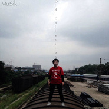

MuSik I自选辑The Old Collection Of MuSik I
============================

|  |  |
| :--: | :-- |
| [ MuSik I自选辑The Old Collection Of MuSik I](https://emumo.xiami.com/album/1701271368) | **艺人**: [MuSik I](../index.md) **语种**: 国语 **唱片公司**: 革路文化传媒 **发行时间**: 2014年05月28日 **专辑类别**: 精选集 **专辑风格**: 青少年流行 Teen Pop, 国语流行 Mandarin Pop **播放数**: 3129364 **收藏数**: 100 **评论数**: 11  |

## 简介

精选辑收录长沙独立音乐人MuSik I(夏呈青)2011-2013原创单曲十首。 

## 曲目

## 评论

|  |  |  |  |
| :-- | :-- | :-- | :-- |
|  [虾米用户](https://emumo.xiami.com/u/93081992) so what 2020-04-11 17:08 赞(1) 踩(0) | 
别回去
 |
|  [虾米用户](https://emumo.xiami.com/u/341601147) 所谓奴隶，就是欲望战胜理... 2019-03-07 09:55 赞(0) 踩(0) | 
这种结合乍一听真的很不错，继续努力。
 |
|  [虾米用户](https://emumo.xiami.com/u/48284045) 君と，生きる 2018-07-05 12:58 赞(0) 踩(0) | 
很棒！
 |
|  [虾米用户](https://emumo.xiami.com/u/13217869) 咯吱咯吱 2018-02-05 15:50 赞(0) 踩(0) | 
回不去
 |
|  [虾米用户](https://emumo.xiami.com/u/34604049) 好好活着。 2017-01-02 22:45 赞(0) 踩(0) | 
回不去
 |
|  [虾米用户](https://emumo.xiami.com/u/4277042) 不是非要飘扬。 2016-04-23 11:27 赞(0) 踩(0) | 
回不去
 |
|  [虾米用户](https://emumo.xiami.com/u/5494913) SO DAMN 2016-02-15 14:40 赞(0) 踩(0) | 
回不去
 |
|  [虾米用户](https://emumo.xiami.com/u/32752544) 100普普通通的大人 2016-01-14 19:57 赞(0) 踩(0) | 
！！！
 |
|  [虾米用户](https://emumo.xiami.com/u/6111570) 春と修羅 2015-06-19 11:55 赞(0) 踩(0) | 
回不去
 |
|  [虾米用户](https://emumo.xiami.com/u/39788841)  . 2015-05-16 19:14 赞(0) 踩(0) | 
lium
 |
|  [虾米用户](https://emumo.xiami.com/u/29230195) Gubba nub nu... 2015-05-07 22:10 赞(0) 踩(0) | 
喜歡
 |
