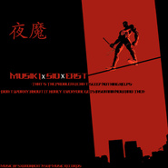

MuSik I
============================

|  |  |
| :--: | :-- |
| [ MuSik I](https://i.xiami.com/musiki) | **播放数**: 5453653 **粉丝数**: 3424 **评论数**: 181 **地区**: China 中国大陆 **风格**: 当代节奏布鲁斯 Contemporary R&B  |

## 档案

AKA:MuSik I  来自长沙 
SXondaBeat制作团队成员 
微博:@夏呈青MuSik

## 专辑

| 名称 | 语种 | 唱片公司 | 发行时间 | 专辑类别 | 专辑风格 |
| :--: | :-- | :-- | :-- | :-- | :-- |
| [ Summer Lovin'](./albums/2103701427.md) | 英语 | Disco:Wax | 2018年05月04日 | EP, 单曲 |  |
| [ Summer Lovin' (ZERB & Hi-Cut Remix)](./albums/2103500738.md) | 英语 | Disco:Wax | 2018年01月26日 | EP, 单曲 |  |
| [ Let Us Build Love When We Make Love](./albums/2100387290.md) | 国语 | 独立发行 | 2016年09月08日 | EP, 单曲 | 节奏布鲁斯 R&B, 当代节奏布鲁斯 Contemporary R&B |
| [ 怯(겁)](./albums/2100380678.md) | 国语 | 独立发行 | 2016年08月19日 | EP, 单曲 | 流行说唱 Pop Rap, 当代节奏布鲁斯 Contemporary R&B |
| [ 独角戏 (英文改编版)](./albums/2100376667.md) | 英语 | 独立发行 | 2016年08月06日 | EP, 单曲 | 当代节奏布鲁斯 Contemporary R&B, 节奏布鲁斯 R&B |
| [ Too GoodA Drake Cover by MuSik I](./albums/2100368299.md) | 英语 | 独立发行 | 2016年07月17日 | EP, 单曲 | 节奏布鲁斯 R&B |
| [ Lady In A Glass Dress (中文版)](./albums/2100361348.md) | 国语 | 独立发行 | 2016年07月01日 | EP, 单曲 | 节奏布鲁斯 R&B, 当代节奏布鲁斯 Contemporary R&B |
| [ 欧洲之星](./albums/2100332668.md) | 国语 | 独立发行 | 2016年05月13日 | EP, 单曲 | 流行说唱 Pop Rap, 当代节奏布鲁斯 Contemporary R&B |
| [ 我若落网](./albums/2100289090.md) | 国语 | 独立发行 | 2016年03月08日 | EP, 单曲 | 当代节奏布鲁斯 Contemporary R&B, 地下说唱 Underground Hip Hop |
| [ Hotline Bling (Drake R&B Cover)](./albums/2100242046.md) | 英语 | 独立发行 | 2015年11月26日 | EP, 单曲 | 当代节奏布鲁斯 Contemporary R&B, 节奏布鲁斯 Rhythm & Blues |
| [ 无中生有(the Album)Something From Nothing(the Album)](./albums/2100212986.md) | 国语 | SXondaBeat | 2015年10月16日 | 录音室专辑 | 流行说唱 Pop Rap, 当代节奏布鲁斯 Contemporary R&B, 国语流行 Mandarin Pop |
| [ No And Not For A Million Years](./albums/2100207244.md) | 国语 | SXondaBeat, NU | 2015年09月24日 | EP, 单曲 | 流行说唱 Pop Rap, 当代节奏布鲁斯 Contemporary R&B, 地下说唱 Underground Hip Hop |
| [ 抵抗](./albums/1837452063.md) | 国语 | SXondaBeat x Gosh | 2015年08月01日 | EP, 单曲 | 放克 Funk, 节奏布鲁斯 Rhythm & Blues, 摩城 Motown |
| [ 夜魔](./albums/1235856106.md) | 国语 | 独立发行 | 2015年07月03日 | EP, 单曲 | 当代节奏布鲁斯 Contemporary R&B, 意识说唱 Conscious Hip Hop |
| [ 撰写](./albums/1732880650.md) | 国语 | 独立发行 | 2015年06月01日 | EP, 单曲 | 当代节奏布鲁斯 Contemporary R&B |
| [ 水手招募会Sailor Recruitment Council](./albums/528267132.md) | 国语 | 独立发行 | 2015年04月06日 | EP, 单曲 | 老派说唱 Old-school Hip Hop |
| [ 冥想盆](./albums/923273189.md) | 国语 | 独立发行 | 2015年01月18日 | 录音室专辑 | 流行说唱 Pop Rap, 当代节奏布鲁斯 Contemporary R&B, 国语流行 Mandarin Pop |
| [ Luv Luv](./albums/704050965.md) | 国语 | 长沙革路文化传媒有限公司 | 2014年06月29日 | EP, 单曲 | 爵士说唱 Jazz Rap, 流行说唱 Pop Rap, 国语流行 Mandarin Pop |
| [ MuSik I自选辑The Old Collection Of MuSik I](./albums/1701271368.md) | 国语 | 革路文化传媒 | 2014年05月28日 | 精选集 | 青少年流行 Teen Pop, 国语流行 Mandarin Pop |
| [ Jeg Vil La' Lyset Brænde](./albums/2103512590.md) | 英语 | Replay | 2002年01月01日 | 录音室专辑 | 流行摇滚 Pop Rock |

## 评论

|  |  |  |  |
| :-- | :-- | :-- | :-- |
|  [虾米用户](https://emumo.xiami.com/u/299698652) 夜很长，思念也很长 2019-02-02 19:36 赞(0) 踩(0) | 
喜欢，虽然不太懂系统的乐理知识，但是很棒很厉害，加油＾０＾~
 |
|  [虾米用户](https://emumo.xiami.com/u/177818128) 至少在我的心中 自己为自... 2019-01-30 13:24 赞(0) 踩(0) | 
夏老师加油！！！
 |
|  [虾米用户](https://emumo.xiami.com/u/357978038)  2019-01-28 19:28 赞(0) 踩(0) | 
崽崽我爱你。
 |
|  [虾米用户](https://emumo.xiami.com/u/300090102)  2018-11-26 21:14 赞(3) 踩(0) | 
很棒的人啊喜欢独角戏
 |
|  [虾米用户](https://emumo.xiami.com/u/34362145) 问一百个问题 然后各奔东... 2018-07-11 05:42 赞(0) 踩(0) | 
加油啊
 |
|  [虾米用户](https://emumo.xiami.com/u/338539128) 慵懒一生 碌碌无为 2018-06-29 14:18 赞(1) 踩(0) | 
都这么好听
 |
|  [虾米用户](https://emumo.xiami.com/u/358988880) 若你喜欢怪人 其实我很美 2018-06-13 20:22 赞(0) 踩(0) | 
我找不到你的微博 
 |
|  [虾米用户](https://emumo.xiami.com/u/2477327) 我爱你音乐 2018-05-15 01:02 赞(0) 踩(0) | 
喜欢他
 |
|  [虾米用户](https://emumo.xiami.com/u/187511125) 听歌， 2018-02-23 14:32 赞(1) 踩(0) | 
喵喵喵，我tm好喜欢你之前听到你的歌我竟然没有认真点进来看看，是我傻逼了。
 |
|  [虾米用户](https://emumo.xiami.com/u/50265923) 我难以放弃的感觉 2018-02-09 17:26 赞(0) 踩(0) | 
加油夏老师
 |
|  [虾米用户](https://emumo.xiami.com/u/27315765) 满腹都是世俗太想跳出平庸 2018-01-24 10:38 赞(0) 踩(0) | 
♡
 |
|  [虾米用户](https://emumo.xiami.com/u/332938013) 如果我能少喜欢你一点，你... 2017-12-02 11:54 赞(2) 踩(0) | 
夏老师，加油
 |
|  [虾米用户](https://emumo.xiami.com/u/332938013) 如果我能少喜欢你一点，你... 2017-11-29 21:02 赞(3) 踩(0) | 
不同的歌，不一样的夏老师。
 |
|  [虾米用户](https://emumo.xiami.com/u/20564762)   2017-10-30 10:20 赞(1) 踩(0) | 
哈哈 可以叫你长沙满舒克吗?
 |
| ⇒ |  [虾米用户](https://emumo.xiami.com/u/11596057) 迷～ 2018-09-17 22:00 赞(0) 踩(0) | 
夏老师会哭
 |
|  [虾米用户](https://emumo.xiami.com/u/973400) 我还没想好要写什么... 2017-10-28 00:01 赞(2) 踩(0) | 
不赖  不过长沙人的港台腔调让人有点出戏
 |
|  [虾米用户](https://emumo.xiami.com/u/331404163)  2017-10-26 18:59 赞(1) 踩(0) | 
很棒
 |
|  [虾米用户](https://emumo.xiami.com/u/116281566) 你最好 好在你 2017-10-24 22:35 赞(0) 踩(0) | 
~
 |
|  [虾米用户](https://emumo.xiami.com/u/325027876) Be Water, My... 2017-10-06 23:54 赞(0) 踩(0) | 
标记
 |
|  [虾米用户](https://emumo.xiami.com/u/42894053)  2017-10-03 23:56 赞(1) 踩(0) | 
真不错
 |
|  [虾米用户](https://emumo.xiami.com/u/80919640) 白日梦患者 2017-09-11 15:24 赞(1) 踩(0) | 
我若落网怎么下架了，再传下好吗，想听找不到了
 |
|  [虾米用户](https://emumo.xiami.com/u/119215670) 我必上天 2017-08-12 11:21 赞(0) 踩(0) | 
夏老师胖了
 |
|  [虾米用户](https://emumo.xiami.com/u/49265597) 我还没想好要写什么... 2017-07-31 13:31 赞(0) 踩(0) | 
(○&amp;#39;&amp;omega;&amp;#39;○)
 |
|  [虾米用户](https://emumo.xiami.com/u/105107010) 如果不失眠 那就是好事 ... 2017-07-24 20:37 赞(0) 踩(0) | 
老公~
 |
|  [虾米用户](https://emumo.xiami.com/u/13111079) 有缘再见 2017-07-10 20:26 赞(0) 踩(0) | 

 |
|  [虾米用户](https://emumo.xiami.com/u/25639638)  2017-06-10 22:08 赞(0) 踩(0) | 
好棒！就缺宣传力度
 |
|  [虾米用户](https://emumo.xiami.com/u/216720354) 蝦米再見有緣再愛你 2017-05-23 01:06 赞(1) 踩(0) | 
喜欢一直坚持不做Trap的rap。
 |
|  [虾米用户](https://emumo.xiami.com/u/216720354) 蝦米再見有緣再愛你 2017-05-23 01:06 赞(0) 踩(0) | 
cool。
 |
|  [虾米用户](https://emumo.xiami.com/u/208068626) 有套路的人为了名利什么都... 2017-04-14 23:27 赞(0) 踩(0) | 
帅
 |
|  [虾米用户](https://emumo.xiami.com/u/35831550) 点击查看 2017-04-08 21:11 赞(0) 踩(0) | 
夏老师受我一拜
 |
|  [虾米用户](https://emumo.xiami.com/u/286054495)   2017-04-04 17:57 赞(0) 踩(0) | 
嘻嘻
 |
|  [虾米用户](https://emumo.xiami.com/u/32272549)   2017-03-28 13:23 赞(0) 踩(0) | 
会成功的，请继续坚持❤
 |
|  [虾米用户](https://emumo.xiami.com/u/114361884)  2017-03-27 23:11 赞(0) 踩(0) | 
歌都好喜欢啊！！！
 |
|  [虾米用户](https://emumo.xiami.com/u/114361884)  2017-03-27 23:06 赞(1) 踩(0) | 
感觉声音真的很好听
 |
|  [虾米用户](https://emumo.xiami.com/u/279587849)  2017-03-20 22:30 赞(0) 踩(0) | 
很好听
 |
|  [虾米用户](https://emumo.xiami.com/u/226153582) 缅甸  第二特区 佤邦 2017-03-18 07:54 赞(0) 踩(0) | 
好听 怎么没人关注
 |
|  [虾米用户](https://emumo.xiami.com/u/84658774) The only one 2017-02-08 09:10 赞(0) 踩(0) | 
最初听你的歌，是从满舒克跟你合唱的那首，然后发现你唱的好好听
 |
|  [虾米用户](https://emumo.xiami.com/u/52147836)   2017-02-04 11:18 赞(0) 踩(0) | 
每首歌都很好听
 |
|  [虾米用户](https://emumo.xiami.com/u/35831550) 点击查看 2017-01-24 18:18 赞(0) 踩(0) | 
火前留名
 |
|  [虾米用户](https://emumo.xiami.com/u/191150948) Dͩͩiͥͥeͤͤ 2017-01-24 03:34 赞(0) 踩(0) | 
你人真好
 |
|  [虾米用户](https://emumo.xiami.com/u/263125502) 夏呈青の脑残粉\\LRC... 2017-01-18 15:21 赞(0) 踩(0) | 
承包！
 |
|  [虾米用户](https://emumo.xiami.com/u/255558076) 我们再见。 2017-01-01 10:48 赞(0) 踩(0) | 
谢谢~
 |
|  [虾米用户](https://emumo.xiami.com/u/6965583) 人體穿刺師° 2016-12-29 04:07 赞(0) 踩(0) | 

 |
|  [虾米用户](https://emumo.xiami.com/u/39673782) 我记得她的样子，还知道她... 2016-12-17 19:41 赞(0) 踩(0) | 
厉害
 |
|  [虾米用户](https://emumo.xiami.com/u/44140680) 旅途愉快 2016-11-29 22:29 赞(0) 踩(0) | 
⚫️
 |
|  [虾米用户](https://emumo.xiami.com/u/26166944) 游走在社会边缘的神秘者 2016-11-27 08:54 赞(1) 踩(0) | 
这娘炮声音还是唱流行情歌，说唱听起来太gay
 |
| ⇒ |  [虾米用户](https://emumo.xiami.com/u/250443850) (￣∇￣) 2016-12-10 11:06 赞(0) 踩(0) | 
兄弟 让我听听你的作品
 |
| ⇒ |  [虾米用户](https://emumo.xiami.com/u/114998056) 我还没想好要写什么... 2016-12-13 15:14 赞(0) 踩(0) | 
你也就这幅德行了兄弟别人的作品是花了多少心血熬夜制作出
 |
| ⇒ |  [虾米用户](https://emumo.xiami.com/u/114998056) 我还没想好要写什么... 2016-12-13 15:16 赞(0) 踩(0) | 
别TM站着说话不腰疼 请尊重别人作品
 |
| ⇒ |  [虾米用户](https://emumo.xiami.com/u/87660504)  2016-12-17 18:04 赞(0) 踩(0) | 
蛇皮
 |
| ⇒ |  [虾米用户](https://emumo.xiami.com/u/56147986) 我袒护的人你跟我讲什么道... 2017-03-23 21:31 赞(0) 踩(0) | 
你好像很想火，恭喜你，你成功了
 |
| ⇒ |  [虾米用户](https://emumo.xiami.com/u/304372176)  2019-03-28 22:03 赞(0) 踩(0) | 
让我听听你的作品？
 |
|  [虾米用户](https://emumo.xiami.com/u/41021627) Breathturn 2016-11-21 17:10 赞(0) 踩(0) | 
赫赫
 |
|  [虾米用户](https://emumo.xiami.com/u/152876308) 做到一流程度 2016-11-20 17:04 赞(0) 踩(0) | 
男神
 |
|  [虾米用户](https://emumo.xiami.com/u/184098672) 低級影迷 2016-11-15 23:12 赞(0) 踩(0) | 
原來你就是夏呈青
 |
|  [虾米用户](https://emumo.xiami.com/u/24984880)  2016-11-15 04:59 赞(1) 踩(0) | 
我真的好爱你的声音，每一首歌曲都会单曲循环。为什么关注的这么少。。
 |
|  [虾米用户](https://emumo.xiami.com/u/12398466) 暂无签名~ 2016-11-12 09:06 赞(0) 踩(0) | 
冥想盆…迷幻盆~zZ
 |
|  [虾米用户](https://emumo.xiami.com/u/34362145) 问一百个问题 然后各奔东... 2016-10-28 22:24 赞(1) 踩(0) | 
好喜欢
 |
|  [虾米用户](https://emumo.xiami.com/u/882766)  2016-10-24 16:02 赞(1) 踩(0) | 
NB啊！！！！！！！
 |
|  [虾米用户](https://emumo.xiami.com/u/124071972) 山海风光无限 我的心里只... 2016-10-14 17:20 赞(0) 踩(0) | 
Great
 |
|  [虾米用户](https://emumo.xiami.com/u/877309)  2016-09-27 21:18 赞(0) 踩(0) | 
好棒！偶然听到感觉被说唱炸到！
 |
|  [虾米用户](https://emumo.xiami.com/u/10542595) cool 2016-09-27 00:04 赞(0) 踩(0) | 
顶啊
 |
|  [虾米用户](https://emumo.xiami.com/u/38872424) 别想泡我 2016-09-22 08:30 赞(0) 踩(0) | 
有年代感的评论真的好揪心阿
 |
|  [虾米用户](https://emumo.xiami.com/u/2504012) 嘻嘻 2016-09-16 23:10 赞(2) 踩(0) | 
求灵魂尽头demo     
 |
|  [虾米用户](https://emumo.xiami.com/u/2504012) 嘻嘻 2016-09-16 23:04 赞(3) 踩(0) | 
那首demo灵魂尽头怎么没了,真的很好听很好听
 |
|  [虾米用户](https://emumo.xiami.com/u/36148446) richypanda 2016-09-07 13:38 赞(0) 踩(0) | 
不错
 |
|  [虾米用户](https://emumo.xiami.com/u/140415656) 网易云难民 2016-09-04 18:46 赞(15) 踩(0) | 
中国人大多只听男默女爱的流行歌曲 听说唱的少数人都是最帅的 比如说这个评论上的我和你
 |
|  [虾米用户](https://emumo.xiami.com/u/160416962)  2016-08-31 20:31 赞(0) 踩(0) | 
好听 
 |
|  [虾米用户](https://emumo.xiami.com/u/42436509) whatz up 2016-08-27 10:06 赞(2) 踩(0) | 
真的服 这个副歌 这个声线
 |
|  [虾米用户](https://emumo.xiami.com/u/47850575)   2016-08-23 21:30 赞(0) 踩(0) | 
同是满舒克那一路听过来的 赞 
 |
|  [虾米用户](https://emumo.xiami.com/u/36514939) 她留着超酷的短发 网易云... 2016-08-09 14:26 赞(1) 踩(0) | 
⚙
 |
| ⇒ |  [虾米用户](https://emumo.xiami.com/u/42983870)   2016-08-11 13:48 赞(0) 踩(0) | 
我舔你大腿根
 |
|  [虾米用户](https://emumo.xiami.com/u/28134911)  2016-08-08 05:36 赞(13) 踩(0) | 
都不知道国内是怎么回事，这么好的音乐家不红，偏偏那些没能力而红了，真的很为你打抱不平
 |
|  [虾米用户](https://emumo.xiami.com/u/209522117)  2016-08-06 08:20 赞(0) 踩(0) | 
好听
 |
|  [虾米用户](https://emumo.xiami.com/u/1813258)  2016-08-01 11:31 赞(0) 踩(0) | 
真tm酷！
 |
|  [虾米用户](https://emumo.xiami.com/u/205591313)  2016-07-27 01:37 赞(0) 踩(0) | 
下了说唱家就开始关注你 加油
 |
|  [虾米用户](https://emumo.xiami.com/u/92197790)   2016-06-16 08:51 赞(3) 踩(0) | 
流行说唱我只服两个人，一个满舒克，一个夏呈青，一个是声线爆炸，一个是词曲天才
 |
|  [虾米用户](https://emumo.xiami.com/u/48992653) 赚钱养梦 2016-06-15 23:47 赞(1) 踩(0) | 
你最酷
 |
|  [虾米用户](https://emumo.xiami.com/u/63044610)  2016-06-05 06:58 赞(0) 踩(0) | 
好听
 |
|  [虾米用户](https://emumo.xiami.com/u/94522686)   2016-05-29 22:41 赞(1) 踩(0) | 
歌，真的不错，希望大家懂的，都顶起来！[带墨镜笑][带墨镜笑][带墨镜笑]
 |
|  [虾米用户](https://emumo.xiami.com/u/30261232) 4EVER YOUNG 2016-05-28 17:08 赞(0) 踩(0) | 
长沙的音乐人真棒
 |
|  [虾米用户](https://emumo.xiami.com/u/30261232) 4EVER YOUNG 2016-05-28 17:08 赞(0) 踩(0) | 
长沙的音乐人真棒
 |
|  [虾米用户](https://emumo.xiami.com/u/28601384) 我还没想好要写什么... 2016-05-26 14:08 赞(0) 踩(0) | 
牛逼
 |
|  [虾米用户](https://emumo.xiami.com/u/102685348)   2016-05-25 00:41 赞(0) 踩(0) | 
让中国饶舌走上最前线，加油[带墨镜笑]
 |
|  [虾米用户](https://emumo.xiami.com/u/51756141)  2016-05-23 22:16 赞(0) 踩(0) | 
∞
 |
|  [虾米用户](https://emumo.xiami.com/u/36792908) 这家伙很聪明什么也没留下... 2016-05-14 10:35 赞(0) 踩(0) | 
娘娘腔
 |
|  [虾米用户](https://emumo.xiami.com/u/44858319) 永远是我最爱的虾米 2016-05-11 08:46 赞(0) 踩(0) | 
///
 |
|  [虾米用户](https://emumo.xiami.com/u/83069340)   2016-05-11 07:58 赞(0) 踩(0) | 
唱 饶舌 制作 全能
 |
|  [虾米用户](https://emumo.xiami.com/u/42796332) H e l l o ! ... 2016-05-08 00:04 赞(0) 踩(0) | 
啊  我太迟了
 |
|  [虾米用户](https://emumo.xiami.com/u/158176820) xcq 2016-05-01 20:32 赞(0) 踩(0) | 
就是喜欢呗
 |
|  [虾米用户](https://emumo.xiami.com/u/47606060) 屠龙宝刀，点击即送！ 2016-04-17 23:22 赞(0) 踩(0) | 
Respect
 |
|  [虾米用户](https://emumo.xiami.com/u/99168462) 再见虾米 2016-04-10 05:57 赞(0) 踩(0) | 
nice
 |
|  [虾米用户](https://emumo.xiami.com/u/68402528)   2016-04-08 14:08 赞(0) 踩(0) | 
加油！吊飞了
 |
|  [虾米用户](https://emumo.xiami.com/u/3276722)  2016-04-03 06:08 赞(1) 踩(0) | 
从满舒克第一次听到 这声音，然后耳朵一惊，好久没听到如此清新脱俗的声音了。
 |
|  [虾米用户](https://emumo.xiami.com/u/50416311)   2016-04-01 13:53 赞(0) 踩(0) | 
棒！
 |
|  [虾米用户](https://emumo.xiami.com/u/29700105) disconnected... 2016-03-30 12:12 赞(0) 踩(0) | 
可以的
 |
|  [虾米用户](https://emumo.xiami.com/u/31121072)   2016-03-30 11:18 赞(1) 踩(0) | 
耳朵怀孕！
 |
|  [虾米用户](https://emumo.xiami.com/u/39788841)  . 2016-03-19 13:55 赞(0) 踩(0) | 
#
 |
|  [虾米用户](https://emumo.xiami.com/u/85739868)  2016-03-14 00:05 赞(0) 踩(0) | 
flow
 |
|  [虾米用户](https://emumo.xiami.com/u/13937861) 我还没想好要写什么... 2016-03-08 17:26 赞(1) 踩(0) | 
努力的做中国的Chris Brown
 |
|  [虾米用户](https://emumo.xiami.com/u/50024563) 我还没想好要写什么... 2016-03-05 17:08 赞(0) 踩(0) | 
你真的好帅！
 |
|  [虾米用户](https://emumo.xiami.com/u/50834283) 这一定是地狱 2016-02-10 11:59 赞(0) 踩(0) | 
回不去
 |
|  [虾米用户](https://emumo.xiami.com/u/78029002)  2016-02-07 03:53 赞(0) 踩(0) | 
上初中的时候回不去那歌就一直在循环播放  那是三年前了   我现在才知道hook是你        
 |
|  [虾米用户](https://emumo.xiami.com/u/47976690) as long  as ... 2016-02-02 15:12 赞(1) 踩(0) | 
夏老师的伴奏真的太走心了   每次骑行必须夏老师
 |
|  [虾米用户](https://emumo.xiami.com/u/11472475) 我还没想好要写什么... 2016-01-30 04:02 赞(0) 踩(0) | 
很好听a
 |
|  [虾米用户](https://emumo.xiami.com/u/100932352) 相由心生 境随心造 2016-01-25 16:04 赞(0) 踩(0) | 
粉你
 |
|  [虾米用户](https://emumo.xiami.com/u/73400448) 师傅，请问这条路怎么走 2016-01-22 13:40 赞(0) 踩(0) | 
111
 |
|  [虾米用户](https://emumo.xiami.com/u/71448156)   2016-01-20 14:43 赞(0) 踩(0) | 

 |
|  [虾米用户](https://emumo.xiami.com/u/10445549)   2016-01-08 17:38 赞(4) 踩(0) | 
我给你转支付宝啊 你给我发一张专辑啊 以后有专辑都发一张给我啊 我找不到去哪里买了 只能评论你了
 |
|  [虾米用户](https://emumo.xiami.com/u/35251651) 人生何处不青山 2016-01-04 00:28 赞(0) 踩(0) | 
15号光圈等你
 |
|  [虾米用户](https://emumo.xiami.com/u/46829340) 接触不良 2016-01-03 14:25 赞(1) 踩(0) | 
理想型 
 |
|  [虾米用户](https://emumo.xiami.com/u/35373666) trap love 2015-12-31 08:13 赞(0) 踩(0) | 
你是最好的女歌手
 |
| ⇒ |  [虾米用户](https://emumo.xiami.com/u/9539758) 无中生有已发布 2015-12-31 11:29 赞(0) 踩(0) | 
你是最好的键盘狗
 |
|  [虾米用户](https://emumo.xiami.com/u/37901418) KEEP IT REAL 2015-12-29 16:04 赞(0) 踩(0) | 
舌功很厲害 14歲嗎?
 |
| ⇒ |  [虾米用户](https://emumo.xiami.com/u/42983870)   2016-08-11 13:51 赞(0) 踩(0) | 
我可以舔得让癫痫病发作
 |
|  [虾米用户](https://emumo.xiami.com/u/79463822) Hello Muther... 2015-12-19 13:10 赞(1) 踩(0) | 
屋顶崩塌呢 
 |
|  [虾米用户](https://emumo.xiami.com/u/6374841)  2015-12-11 20:02 赞(1) 踩(0) | 
声音超级好听！第一次知道他是my heart will go on的feat！于是就粉了
 |
|  [虾米用户](https://emumo.xiami.com/u/44003760) 聪明伶俐快高长大 2015-12-09 20:04 赞(0) 踩(0) | 
美妙
 |
|  [虾米用户](https://emumo.xiami.com/u/48267586) 穿越…… 2015-12-08 10:27 赞(0) 踩(0) | 
秒杀同类型的任何歌手，包括周姐纶。
 |
|  [虾米用户](https://emumo.xiami.com/u/50468561) 你有那么不可替代吗 2015-12-01 18:19 赞(0) 踩(0) | 
  
 |
|  [虾米用户](https://emumo.xiami.com/u/40019268) 这家伙很聪明什么也没留下... 2015-11-30 22:10 赞(0) 踩(0) | 
厉害
 |
|  [虾米用户](https://emumo.xiami.com/u/45684180) 单身狗 2015-11-29 22:43 赞(0) 踩(0) | 
头像看小图怎么就有种东尼大木即视感【无奈】
 |
|  [虾米用户](https://emumo.xiami.com/u/72966758) 爱书 尤其赛林格的麦田 ... 2015-11-28 15:53 赞(0) 踩(0) | 
我来刷评论
 |
|  [虾米用户](https://emumo.xiami.com/u/49633386)   2015-11-27 19:42 赞(0) 踩(0) | 
好爱你的flow
 |
|  [虾米用户](https://emumo.xiami.com/u/7349047) 风情亿种 2015-11-26 12:42 赞(0) 踩(0) | 
编曲很厉害
 |
|  [虾米用户](https://emumo.xiami.com/u/5163871) 承蒙关照，有缘再见 2015-11-20 11:43 赞(0) 踩(0) | 
夏老板还是主攻rap吧， 最爱你的flow了
 |
|  [虾米用户](https://emumo.xiami.com/u/2418238) weibo: @尤米口 2015-11-20 09:52 赞(0) 踩(0) | 
黑凤梨
 |
|  [虾米用户](https://emumo.xiami.com/u/50682449)  不酷 2015-11-16 15:09 赞(0) 踩(0) | 
up
 |
|  [虾米用户](https://emumo.xiami.com/u/39135924) 暂无签名~ 2015-11-15 13:22 赞(0) 踩(0) | 

 |
|  [虾米用户](https://emumo.xiami.com/u/50869110) IG：77richiee... 2015-11-14 21:45 赞(0) 踩(0) | 
#
 |
|  [虾米用户](https://emumo.xiami.com/u/1604445) 凡音之起，由人心生也。人... 2015-11-14 02:32 赞(1) 踩(0) | 
夏老师你是怎么瘦下来的 不容易啊
 |
|  [虾米用户](https://emumo.xiami.com/u/50821618) Song for me 2015-11-10 20:01 赞(1) 踩(0) | 
你真的是全能！风格任意转换 一直听到国内的要么只唱Rnb或者rap 两者结合的也有 但是你是我听了那么多年 真的两者都做的特别好的音乐人 旋律给人舒服和新意 flow也赞 坚持下去！支持你到底
 |
|  [虾米用户](https://emumo.xiami.com/u/2504012) 嘻嘻 2015-11-04 10:22 赞(0) 踩(0) | 
喜欢你
 |
|  [虾米用户](https://emumo.xiami.com/u/15846865) 前進的目的? 2015-11-04 09:48 赞(0) 踩(0) | 
你瘦了！！！！
 |
|  [虾米用户](https://emumo.xiami.com/u/79643698) 小轮车 2015-11-04 01:49 赞(0) 踩(0) | 
大爱呈青哥。
 |
|  [虾米用户](https://emumo.xiami.com/u/50270900) D 2015-11-02 23:46 赞(0) 踩(0) | 
叼
 |
|  [虾米用户](https://emumo.xiami.com/u/4838142) ʕ •ᴥ•ʔ 2015-11-01 01:20 赞(0) 踩(0) | 
不错啊
 |
|  [虾米用户](https://emumo.xiami.com/u/44132901)   2015-10-20 22:19 赞(0) 踩(0) | 
支持
 |
|  [虾米用户](https://emumo.xiami.com/u/44105180)  2015-10-09 11:39 赞(2) 踩(0) | 
娘炮何必为难娘炮呢
 |
| ⇒ |  [虾米用户](https://emumo.xiami.com/u/35373666) trap love 2015-12-31 08:13 赞(0) 踩(0) | 
哈哈哈
 |
|  [虾米用户](https://emumo.xiami.com/u/16551745) byebye｛wb/in... 2015-09-29 18:04 赞(0) 踩(0) | 
求live
 |
|  [虾米用户](https://emumo.xiami.com/u/32725997)   2015-09-27 21:33 赞(110) 踩(0) | 
真心不懂 这么牛逼的中国音乐人 怎么这么少人关注？唱功饶舌技巧都这么好 又会作曲编曲 
 |
| ⇒ |  [虾米用户](https://emumo.xiami.com/u/35675872)  2015-11-14 01:12 赞(0) 踩(0) | 
没有好的营销手段吧。汉堡做得好吃得人多得是，但是最赚钱的还是麦当劳，道理是一样的。
 |
| ⇒ |  [虾米用户](https://emumo.xiami.com/u/3276722)  2016-04-03 06:06 赞(0) 踩(0) | 
~~你不知道中国说长圈。只要不是3大粗的声线就被称为娘炮么
 |
| ⇒ |  [虾米用户](https://emumo.xiami.com/u/48411458) ¿ 2016-06-10 20:45 赞(0) 踩(0) | 
<q><b>D.T 时光纪说：</b></q>
 |
| ⇒ |  [虾米用户](https://emumo.xiami.com/u/294065460)   2017-07-21 11:46 赞(0) 踩(0) | 
一句话说就是长得不够帅唱歌太哈韩
 |
| ⇒ |  [虾米用户](https://emumo.xiami.com/u/32725997)   2017-07-29 17:07 赞(0) 踩(0) | 
<q><b>KayleePiaoer说：</b></q>
 |
| ⇒ |  [虾米用户](https://emumo.xiami.com/u/47808059)   2018-06-24 19:35 赞(0) 踩(0) | 
<q><b>KayleePiaoer说：</b></q>
 |
|  [虾米用户](https://emumo.xiami.com/u/37840483) 再說吧 2015-09-26 21:30 赞(0) 踩(0) | 
嘿嘿
 |
|  [虾米用户](https://emumo.xiami.com/u/21669328) 喜欢说唱的小雪碧！ 2015-09-26 18:22 赞(1) 踩(0) | 
期待第二张专辑
 |
|  [虾米用户](https://emumo.xiami.com/u/45789166)   2015-09-24 14:36 赞(0) 踩(0) | 
超喜欢！
 |
|  [虾米用户](https://emumo.xiami.com/u/3344334)  2015-08-31 12:53 赞(21) 踩(0) | 
好吧····2013年开始听 真心好听。
 |
|  [虾米用户](https://emumo.xiami.com/u/13960111)  2015-07-16 17:15 赞(36) 踩(0) | 
好吧。我想说，你的歌真的很好听
 |
|  [虾米用户](https://emumo.xiami.com/u/16396509)  2015-07-15 12:07 赞(0) 踩(0) | 
好
 |
|  [虾米用户](https://emumo.xiami.com/u/37772282) 暂无签名~ 2015-07-13 08:44 赞(0) 踩(0) | 
r&amp;amp;b nigga
 |
|  [虾米用户](https://emumo.xiami.com/u/44003760) 聪明伶俐快高长大 2015-07-05 04:17 赞(0) 踩(0) | 
帅
 |
|  [虾米用户](https://emumo.xiami.com/u/49914858)   2015-06-30 12:56 赞(0) 踩(0) | 
一直都听你的歌，喜欢哒～
 |
|  [虾米用户](https://emumo.xiami.com/u/47528961)   2015-06-28 13:39 赞(0) 踩(0) | 
  
 |
|  [虾米用户](https://emumo.xiami.com/u/6111570) 我想请你吃雪糕 2015-06-02 11:57 赞(1) 踩(0) | 
加油！！
 |
|  [虾米用户](https://emumo.xiami.com/u/23227010) 生活啊 2015-05-30 18:44 赞(0) 踩(0) | 
一直关注你的豆瓣
 |
|  [虾米用户](https://emumo.xiami.com/u/39788841)  . 2015-05-16 19:14 赞(0) 踩(0) | 
lium
 |
| ⇒ |  [虾米用户](https://emumo.xiami.com/u/42987937) Live today,d... 2015-06-27 14:40 赞(0) 踩(0) | 
ER
 |
|  [虾米用户](https://emumo.xiami.com/u/50064251) 2333 2015-05-14 22:53 赞(0) 踩(0) | 
这生声好喜欢
 |
|  [虾米用户](https://emumo.xiami.com/u/49191636) 呵呵呵 2015-05-12 23:58 赞(1) 踩(0) | 
jazz 说唱
 |
|  [虾米用户](https://emumo.xiami.com/u/29230195) Gubba nub nu... 2015-05-07 22:07 赞(1) 踩(0) | 
~
 |
|  [虾米用户](https://emumo.xiami.com/u/49278937) Hip Hop 2015-04-21 22:21 赞(1) 踩(0) | 
luv so good
 |
|  [虾米用户](https://emumo.xiami.com/u/4710261) 我还没想好要写什么... 2015-03-25 15:26 赞(0) 踩(0) | 
beats屌
 |
|  [虾米用户](https://emumo.xiami.com/u/18694008) 暂无签名~ 2015-03-07 23:19 赞(1) 踩(0) | 
喜欢策马赋和哎唷
 |
|  [虾米用户](https://emumo.xiami.com/u/44105180)  2015-02-11 20:22 赞(0) 踩(0) | 
歌曲千遍一律 无意
 |
|  [虾米用户](https://emumo.xiami.com/u/2423789)  2014-12-20 00:08 赞(0) 踩(0) | 
没有人吐槽【哎唷】的歌词么？感觉有点浪费那么赞的编曲。。。最喜欢的还是策马赋和救世主
 |
|  [虾米用户](https://emumo.xiami.com/u/43222780) 老子真tm聪明什么也没留... 2014-12-19 13:18 赞(1) 踩(0) | 
好。棒棒嗒
 |
|  [虾米用户](https://emumo.xiami.com/u/5158791) 静听星空物语，淡看... 2014-11-25 10:38 赞(1) 踩(0) | 
双人旅行，大赞！！
 |
|  [虾米用户](https://emumo.xiami.com/u/2956445)  2014-11-22 08:28 赞(1) 踩(0) | 
双人旅行很棒，喜欢它的节奏~
 |
|  [虾米用户](https://emumo.xiami.com/u/5880385) 阿N 2014-11-16 13:30 赞(3) 踩(0) | 
好听。策马赋。jazz hiphop
 |
|  [虾米用户](https://emumo.xiami.com/u/2423789)  2014-11-04 22:41 赞(0) 踩(0) | 
策马赋棒呆~话说从po主的音色来看，像策马赋这样的歌比较能扬长避短
 |
|  [虾米用户](https://emumo.xiami.com/u/4618898) 时如刀割不待人 2014-11-04 13:23 赞(0) 踩(0) | 
不错哟
 |
|  [虾米用户](https://emumo.xiami.com/u/17126309) 我还没想好要写什么... 2014-11-02 13:40 赞(0) 踩(0) | 
25.策马赋 听了之后 投了一票，声音很特别  加油！
 |
|  [虾米用户](https://emumo.xiami.com/u/563562) How we roll 2014-07-28 15:37 赞(0) 踩(0) | 
nice！
 |
|  [虾米用户](https://emumo.xiami.com/u/23637457)  2014-07-12 16:42 赞(0) 踩(0) | 
国服第一音乐人
 |
|  [虾米用户](https://emumo.xiami.com/u/931063) 静静生长 2014-06-14 14:13 赞(0) 踩(0) | 
请支持我的机油夏青青！
 |
|  [虾米用户](https://emumo.xiami.com/u/5189762) 音乐即人生 2014-06-05 10:58 赞(0) 踩(0) | 
今年听到的最好的华语说唱
 |
