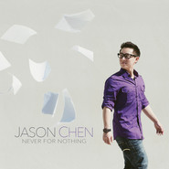

Never For Nothing 
============================

|  |  |
| :--: | :-- |
| [ Never For Nothing ](https://emumo.xiami.com/album/1965941685) | **艺人**: [Jason Chen](../index.md) **语种**: 英语 **唱片公司**: Music Never Sleeps **发行时间**: 2013年04月15日 **专辑类别**: 录音室专辑 **专辑风格**:  **播放数**: 622142 **收藏数**: 243 **评论数**: 42  |

## 简介

Jason Chen个人第二张原创录音室专辑，自己亲手包办了整张专辑的所有曲目的词曲，作为曾经欧美翻唱届的领军人物，Chen正在逐渐蜕变成为一个独立原创全能型艺人（By:错过）

## 曲目

## 评论

|  |  |  |
| :-- | :-- | :-- |
|  [虾米用户](https://emumo.xiami.com/u/25692151)  2014-11-29 12:51 赞(0) 踩(0) | 
Hide and Seek，好有吸力的声音
 |
|  [虾米用户](https://emumo.xiami.com/u/29339276)  2014-05-11 11:58 赞(1) 踩(0) | 
其实听他的歌，就是图一个舒服，他做的很好啊～
 |
|  [虾米用户](https://emumo.xiami.com/u/10185921) 虚度光阴～ 2014-05-09 17:01 赞(0) 踩(0) | 
N久的现在...... 终于听出这张专辑的闪光了～ 真是多么清新的作品啊～ 特别是主打［Never for Nothing］心里有说不出感慨～。。。
 |
|  [虾米用户](https://emumo.xiami.com/u/12730895) 不要离开！ 2014-05-04 23:23 赞(0) 踩(0) | 
还是听他的原唱顺耳点
 |
|  [虾米用户](https://emumo.xiami.com/u/15360042) 骄傲的我，任性的我... 2014-03-25 14:50 赞(0) 踩(0) | 
喜欢ta的风格
 |
|  [虾米用户](https://emumo.xiami.com/u/1255341)   2013-12-14 10:59 赞(0) 踩(0) | 
阿涵
 |
|  [虾米用户](https://emumo.xiami.com/u/7670602)   2013-12-10 11:41 赞(2) 踩(0) | 
Jason真的每首歌都好听，但每首歌的编曲曲风都感觉很相似，大概俗称没有特色吧，多唱些不同的曲风就好了，感觉一直被限制在翻唱的那个风格里面
 |
|  [虾米用户](https://emumo.xiami.com/u/2689520)  2013-11-05 11:26 赞(2) 踩(0) | 
好多抓耳的歌，听的人好少，意料之外啊
 |
|  [虾米用户](https://emumo.xiami.com/u/5835258)  2013-08-24 19:07 赞(0) 踩(0) | 
Never for nothing
 |
|  [虾米用户](https://emumo.xiami.com/u/9658228) 波比猴第14支全新单曲“... 2013-08-22 08:36 赞(0) 踩(0) | 
不能全靠编曲上的小花样来区分雷同的创作啊，尤其是唱片的后半篇，一堆一堆的情歌R&amp;amp;B，口水化过重了。当然你要是说这张唱片本来也不是突出陈以桐的创作的，本来就是打算靠他一副好嗓子撑满全场的我也没意见。
 |
|  [虾米用户](https://emumo.xiami.com/u/15900940)  2013-07-25 14:55 赞(0) 踩(0) | 
不会很专业地评价。自是想说真的很喜欢jc的声音。他自己的歌也觉得好听。他的声音听着觉得很舒服
 |
|  [虾米用户](https://emumo.xiami.com/u/606985)  2013-06-25 17:23 赞(0) 踩(0) | 
感觉这张的个性不够鲜明
 |
|  [虾米用户](https://emumo.xiami.com/u/606985)  2013-06-25 17:23 赞(0) 踩(0) | 
感觉这张的个性不够鲜明
 |
|  [虾米用户](https://emumo.xiami.com/u/5081504) 留在原地、 2013-06-11 14:01 赞(0) 踩(0) | 
欧美/小清新
 |
|  [虾米用户](https://emumo.xiami.com/u/893332)  2013-06-06 14:05 赞(0) 踩(0) | 
还行.虽然 没有翻唱那么好听.
 |
|  [虾米用户](https://emumo.xiami.com/u/1684726) Ms .Lao 2013-05-30 21:35 赞(0) 踩(0) | 
我的CD什么时候能寄回大陆啊??已经一个月啦
 |
|  [虾米用户](https://emumo.xiami.com/u/1505566) stayreal 2013-05-29 22:35 赞(0) 踩(0) | 
喜欢的声音的每日分享~~
 |
|  [虾米用户](https://emumo.xiami.com/u/1656986) Ta-ta . H 2013-05-29 14:41 赞(0) 踩(0) | 
听得我都湿了。。。
 |
|  [虾米用户](https://emumo.xiami.com/u/13438370) 耳机控 2013-05-24 21:14 赞(0) 踩(0) | 
喜欢他唱的歌
 |
|  [虾米用户](https://emumo.xiami.com/u/4958369) 重现 2013-05-16 17:29 赞(0) 踩(0) | 
还好还好
 |
|  [虾米用户](https://emumo.xiami.com/u/1981160)  2013-05-14 13:17 赞(0) 踩(0) | 
@JasonChenmusic     第二张音乐缉，赞呢！
 |
|  [虾米用户](https://emumo.xiami.com/u/856420)   2013-05-08 03:29 赞(0) 踩(0) | 
整张专辑的歌曲太轻柔，有些过，适当需要加些当今流行元素，动感起来哇~
 |
|  [虾米用户](https://emumo.xiami.com/u/597569) 何必故作姿态 2013-05-07 18:50 赞(0) 踩(0) | 
走stevie hoang 的钢琴RNB路线...不过没SH那么个性鲜明
 |
|  [虾米用户](https://emumo.xiami.com/u/2170007) 一傻一傻亮晶晶 2013-05-03 19:30 赞(0) 踩(0) | 
才发现这张是Jason原创的专辑，给个赞吧~！
 |
|  [虾米用户](https://emumo.xiami.com/u/1071883)  2013-05-02 21:52 赞(0) 踩(0) | 
声音真的很好听！不过挺多了还是有点儿腻……
 |
|  [虾米用户](https://emumo.xiami.com/u/9427175)   2013-04-28 11:52 赞(0) 踩(0) | 
不解释
 |
|  [虾米用户](https://emumo.xiami.com/u/8415288)  2013-04-21 19:26 赞(0) 踩(0) | 
爱死他了！！！！
 |
|  [虾米用户](https://emumo.xiami.com/u/7189432) BADTEMPER wi... 2013-04-20 21:04 赞(0) 踩(0) | 
chen正在逐渐蜕变成为一个独立的原创的全能艺人
 |
|  [虾米用户](https://emumo.xiami.com/u/5787391) 没有梦想，何必远方。 2013-04-20 16:07 赞(0) 踩(0) | 
有自己的调调
 |
|  [虾米用户](https://emumo.xiami.com/u/14008200)  2013-04-19 23:35 赞(0) 踩(0) | 
大爱！！
 |
|  [虾米用户](https://emumo.xiami.com/u/2830748) 虽苦还望莫作 2013-04-19 00:04 赞(0) 踩(0) | 
怒赞！！
 |
|  [虾米用户](https://emumo.xiami.com/u/1168545)  2013-04-18 09:10 赞(0) 踩(0) | 
超好听
 |
|  [虾米用户](https://emumo.xiami.com/u/1145196)  2013-04-16 21:14 赞(0) 踩(0) | 
超级爱这个调调~~！！赞！一遍一遍地听也不觉得厌
 |
|  [虾米用户](https://emumo.xiami.com/u/10368174) LA LA LA 2013-04-15 21:15 赞(0) 踩(0) | 
你是终极论坛哪个呢？
 |
|  [虾米用户](https://emumo.xiami.com/u/981648)   2013-04-15 20:29 赞(0) 踩(0) | 
感觉得到他的用心,超赞,支持原创 lol
 |
|  [虾米用户](https://emumo.xiami.com/u/1635081)  2013-04-15 19:15 赞(0) 踩(0) | 
2013,好听 舒服 记录幸福,把音乐还给音乐
 |
|  [虾米用户](https://emumo.xiami.com/u/129264) 我一直假装自己是个橙子 2013-04-15 12:50 赞(0) 踩(0) | 
JC真是太棒了 词曲全包 真心好听 初听一遍 个人比较喜欢02.05.07.09.
 |
|  [虾米用户](https://emumo.xiami.com/u/2368371)  2013-04-15 12:27 赞(0) 踩(0) | 
虾米人自己写的专辑文案,还是头一回见哈
 |
|  [虾米用户](https://emumo.xiami.com/u/12852855) _(:з」∠)_ 2013-04-15 12:20 赞(0) 踩(0) | 
一如既往地好听，专辑一次性听得耳朵发烫！！！！！
 |
|  [虾米用户](https://emumo.xiami.com/u/1247234) Silhouette。 2013-04-15 10:52 赞(0) 踩(0) | 
m
 |
|  [虾米用户](https://emumo.xiami.com/u/2494430) Summer 2013-04-15 10:44 赞(0) 踩(0) | 
太牛了，这么快出原创专辑....赞！R&amp;amp;b迷必收~5星都不嫌多、
 |
|  [虾米用户](https://emumo.xiami.com/u/7255347)  2013-04-14 20:44 赞(0) 踩(0) | 
竟然是专辑~(≧▽≦)/~啦啦啦
 |
