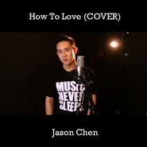

How To Love
============================

|  |  |
| :--: | :-- |
| [ How To Love](https://emumo.xiami.com/album/454271) | **艺人**: [Jason Chen](../index.md) **语种**: 英语 **唱片公司**: Jason Chen MiniAchilles **发行时间**: 2011年07月18日 **专辑类别**: EP, 单曲 **专辑风格**:  **播放数**: 57884 **收藏数**: 40 **评论数**: 10  |

## 简介

Jason Chen x Garld Ko x NineDiamond -- How To Love(Cover By Lil Wayne)

## 曲目

## 评论

|  |  |  |
| :-- | :-- | :-- |
|  [虾米用户](https://emumo.xiami.com/u/900780)  2017-10-28 00:18 赞(0) 踩(0) | 
哈哈   iphone   itouch   ipad2上都是他得歌  最近大热么难道 都是一些朋友下得 听起来还不错
 |
|  [虾米用户](https://emumo.xiami.com/u/7011813)  2012-08-17 02:55 赞(0) 踩(0) | 
“我们可以任由灵魂伴侣溜走，不接受他，甚至不去注意他。这就需要我们之后再轮回一次，去找到他。若我们出于自私犯了错，则将被处以极刑，那刑罚是人类自己发明的，它叫做：寂寞。”[呵呵]分享一段今日睇到的蛮有意思的话还有Jason 的歌&amp;lt;How to love&amp;gt;
 |
|  [虾米用户](https://emumo.xiami.com/u/1008665)  2012-04-22 13:03 赞(0) 踩(0) | 
这首绝对比原唱好听~
 |
|  [虾米用户](https://emumo.xiami.com/u/2982338) 我多想和你一样臭不要脸 2011-09-16 04:44 赞(0) 踩(0) | 
翻唱无论再怎么好听都还是翻唱,希望他自己的歌,做一张真正自己砖.
 |
|  [虾米用户](https://emumo.xiami.com/u/5056349)  2011-07-29 12:52 赞(0) 踩(0) | 
希望他能多写些自己的歌，不要总是翻唱，找到属于自己的风格。。。
 |
| ⇒ |  [虾米用户](https://emumo.xiami.com/u/2169674)  2011-07-30 08:36 赞(0) 踩(0) | 
其实他翻唱也有自己的风格啊……毕竟除了词自己润色的地方也不少，有时候我觉得翻唱比原唱好听的
 |
| ⇒ |  [虾米用户](https://emumo.xiami.com/u/7022819)  2012-04-10 12:05 赞(0) 踩(0) | 
<q><b>浮蓬仓说：</b></q>
 |
| ⇒ |  [虾米用户](https://emumo.xiami.com/u/5988679)  2012-07-13 12:00 赞(0) 踩(0) | 
<q><b>浮蓬仓说：</b></q>
 |
|  [虾米用户](https://emumo.xiami.com/u/781998) Apple Music:... 2011-07-28 22:54 赞(0) 踩(0) | 
终于发了这张. 期待[Burns - Single]快快出现!!  ITunes Store 上7月20号就出了!! 想立马儿听的可以付费下载!!
 |
|  [虾米用户](https://emumo.xiami.com/u/3019490)  2011-07-28 14:57 赞(0) 踩(0) | 
How To Love (COVER)
 |
|  [虾米用户](https://emumo.xiami.com/u/959483) 我还没想好要写什么... 2011-07-28 10:02 赞(0) 踩(0) | 
好听的钢琴~~
 |
