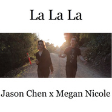

La La La
============================

|  |  |
| :--: | :-- |
| [ La La La](https://emumo.xiami.com/album/99195598) | **艺人**: [Jason Chen](../index.md) **语种**: 英语 **唱片公司**: mudhutdigital.com **发行时间**: 2014年04月09日 **专辑类别**: EP, 单曲 **专辑风格**:  **播放数**: 372033 **收藏数**: 83 **评论数**: 5  |

## 简介

## 曲目

## 评论

|  |  |  |
| :-- | :-- | :-- |
|  [虾米用户](https://emumo.xiami.com/u/7322777) ∮ 2015-05-29 23:09 赞(0) 踩(0) | 
夏收
 |
|  [虾米用户](https://emumo.xiami.com/u/3083305)  2014-06-18 17:06 赞(0) 踩(0) | 
童声差评……这歌还是适合骚姆唱
 |
|  [虾米用户](https://emumo.xiami.com/u/8371008) 你喜欢不如我喜欢 2014-05-11 12:02 赞(0) 踩(0) | 
好棒！早在人人上看到mv了，虾米上更的好慢。。。
 |
|  [虾米用户](https://emumo.xiami.com/u/5470209) 一场盛大的再见 2014-05-09 12:25 赞(0) 踩(0) | 
喜欢：）
 |
|  [虾米用户](https://emumo.xiami.com/u/1247234) Silhouette。 2014-05-05 22:32 赞(0) 踩(0) | 
m
 |
