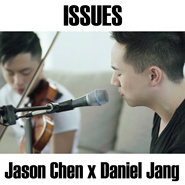
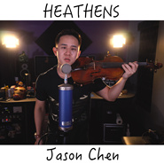
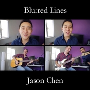

Jason Chen
============================

|  |  |
| :--: | :-- |
| [ Jason Chen](https://i.xiami.com/jasonchenmusic) | **播放数**: 67961223 **粉丝数**: 42890 **评论数**: 1222 **地区**: United States of America 美国 **风格**: 国语流行 Mandarin Pop, 流行 Pop, 欧美流行 Western Pop  |

## 档案

小档案 
中   文   名：   陈以桐 
外   文   名：   Jason Chen 
别        名：   节省钱 
国        籍：   美国 
星        座：   天蝎座 
身        高：   174cm 
体        重：   62kg 
出   生   地：   美国马萨诸塞州波士顿 
出生日期：   1988  年  11  月  12  日 
职        业：   歌手 
毕业院校：   加利福尼亚大学洛杉矶分校  (UCLA) 
经纪公司：   Music Never Sleeps 
代表作品：   童话、你不知道的事、  Gravity  、  still in love 
简介 
陈以桐（  Jason Chen  ），于  1988  年  11  月  12  日出生于美国马萨诸塞州波士顿，美籍华人，祖籍中国台湾，美国歌手。 
早年经历 
陈以桐  1988  年出生于美国波士顿，但出生几个月后，搬家到了加州洛杉矶。 
小时候，陈以桐的父母就逼他学习中文，现在陈以桐的中文非常流利。自小会很多乐器，  6  岁开始学习小提琴和钢琴。 
陈以桐直到  17  岁的时候才发现自己会唱歌，开始唱歌的契机则是为了邀请当时心仪的女孩参加学校的舞会。陈以桐高中毕业于  Arcadia High School   ，大学毕业于加州大学洛杉矶分校经济系。陈以桐  2010  年大学毕业后曾短暂当过将近一年的会计师，但是因为热爱音乐而辞职专职从事音乐。 
演艺经历 
陈以桐  2007  年大学时期开始在  Youtube  上传自己的翻唱视频。  2010  年，陈以桐的作品开始在网上红起来，之后陈以桐经常和跟网络翻唱歌手合作如  Joseph Vincent  ，蒂芬妮·沃德，梅根·妮可，在歌曲  MV  中也常有其他  Youtuber  的参与。 
2010  年加拿大麦基尔大学  CSSA  春晚表演，陈以桐表演了王力宏的《心跳》和小宇的《终于说出口》，晚会最后陈以桐还独家发布最新原创单曲《  Just For A Moment  》的  MV  ，晚会结束时陈以桐还唱了一首《  Just The Way You Are  》。 
2011  年  2  月  1  日深圳卫视春晚，“中国节节高”深圳卫视  2011  全球华人新春盛典正式拉开帷幕。陈以桐以一首《  Just A Dream  》开场。陈以桐表演《  Baby  》和《  Just A Dream  》两首歌曲。  ] 
2011  年  6  月  14  日，首张翻唱专辑《  The Covers, Vol. 1  》发行。  2011  年  12  月  25  日，陈以桐创立频道  JasonChenAsia  ，主要上传中文歌。  12  月  30  日，陈以桐发行首张原创专辑《  Gravity  》，其中的单曲《  Best Friend  》在  Youtube  上获得了逾千万的评论。 
2012  年  1  月  22  日，陈以桐参加美国俄亥俄州立大学春晚表演。 
2013  年  2  月  17  日，陈以桐发行首张全由中文翻唱歌曲组成的专辑《节省钱》。  4  月  13  日，发行第二张原创专辑《  Never For Nothing  》。  11  月  26  日，发行原创专辑《  What If Acoustic  》。 
2014  年  12  月  19  日，发行专辑《  Glass Heart  》。

## 专辑

| 名称 | 语种 | 唱片公司 | 发行时间 | 专辑类别 | 专辑风格 |
| :--: | :-- | :-- | :-- | :-- | :-- |
| [ Burn](./albums/5020861425.md) | 英语 | Jason Chen | 2020年04月15日 | EP, 单曲 | 灵魂乐 Soul |
| [ 2002](./albums/2103909008.md) | 英语 | mudhutdigital.com | 2018年08月10日 | EP, 单曲 |  |
| [ Boo'd Up](./albums/2103909007.md) | 英语 | mudhutdigital.com | 2018年08月09日 | EP, 单曲 |  |
| [ Let Me Love You](./albums/2103909005.md) | 英语 | mudhutdigital.com | 2018年07月31日 | EP, 单曲 |  |
| [ Chinese Covers, Vol. 1](./albums/2103908994.md) | 国语 | mudhutdigital.com | 2018年06月27日 | 精选集 | 国语流行 Mandarin Pop |
| [ Girls Like You](./albums/2103908998.md) | 英语 | mudhutdigital.com | 2018年06月18日 | EP, 单曲 |  |
| [ Love Lies](./albums/2103909001.md) | 英语 | mudhutdigital.com | 2018年06月18日 | EP, 单曲 |  |
| [ Fake Love](./albums/2103908995.md) | 英语 | mudhutdigital.com | 2018年05月31日 | EP, 单曲 |  |
| [ Let Me (Acoustic)](./albums/2103720041.md) | 英语 | mudhutdigital.com | 2018年05月25日 | EP, 单曲 |  |
| [ No Tears Left To Cry](./albums/2103713561.md) | 英语 | mudhutdigital.com | 2018年05月18日 | EP, 单曲 |  |
| [ IDGAF](./albums/2103708000.md) | 英语 | Music Never Sleeps | 2018年05月11日 | EP, 单曲 |  |
| [ In My Blood](./albums/2103706623.md) | 英语 | Music Never Sleeps | 2018年05月06日 | EP, 单曲 |  |
| [ Mine](./albums/2103702503.md) | 英语 | Music Never Sleeps | 2018年05月04日 | EP, 单曲 |  |
| [ Friends](./albums/2103702501.md) | 英语 | Music Never Sleeps | 2018年04月17日 | EP, 单曲 |  |
| [ 樱花粉的浪漫](./albums/2103670226.md) | 国语 | 独立发行 | 2018年04月05日 | EP, 单曲 |  |
| [ Done For Me](./albums/2103666075.md) | 英语 | 独立发行 | 2018年04月03日 | EP, 单曲 |  |
| [ Remember Me](./albums/2103702500.md) | 英语 | Music Never Sleeps | 2018年03月26日 | EP, 单曲 |  |
| [ I'll Make a Man Out of You](./albums/2103702499.md) | 英语 | Music Never Sleeps | 2018年03月12日 | EP, 单曲 |  |
| [ Officially Missing You](./albums/2103594793.md) | 英语 | Music Never Sleeps | 2018年03月06日 | EP, 单曲 |  |
| [ Rewrite the Stars](./albums/2103579819.md) | 英语 | Music Never Sleeps | 2018年02月27日 | EP, 单曲 |  |
| [ Cry Me a River](./albums/2103579817.md) | 英语 | Music Never Sleeps | 2018年02月22日 | EP, 单曲 |  |
| [ 甜蜜So Sweet](./albums/2103527673.md) | 国语 | 独立发行 | 2018年02月13日 | EP, 单曲 |  |
| [ 我知道要微笑](./albums/2103513851.md) | 国语 | 独立发行 | 2018年02月02日 | EP, 单曲 |  |
| [ Finesse](./albums/2103502806.md) | 英语 | Music Never Sleeps | 2018年01月21日 | EP, 单曲 |  |
| [ Young Dumb & Broke](./albums/2103502805.md) | 英语 | Music Never Sleeps | 2018年01月09日 | EP, 单曲 |  |
| [ Havana](./albums/2103502804.md) | 英语 | Music Never Sleeps | 2018年01月08日 | EP, 单曲 |  |
| [ 如果雨之后](./albums/2103468425.md) | 国语 | 独立发行 | 2018年01月05日 | EP, 单曲 |  |
| [ Gorgeous](./albums/2103502802.md) | 英语 | Music Never Sleeps | 2017年10月28日 | EP, 单曲 |  |
| [ A Whole New World](./albums/2103502801.md) | 英语 | Music Never Sleeps | 2017年10月27日 | EP, 单曲 |  |
| [ Sorry Not Sorry](./albums/2103502799.md) | 英语 | Music Never Sleeps | 2017年10月13日 | EP, 单曲 |  |
| [ 搁浅 / 修炼爱情](./albums/2102878167.md) | 国语 | 独立发行 | 2017年10月12日 | EP, 单曲 |  |
| [ Too Good At Goodbyes](./albums/2102863576.md) | 英语 | Music Never Sleeps | 2017年09月20日 | EP, 单曲 |  |
| [ Strip That Down](./albums/2102859963.md) | 英语 | Music Never Sleeps | 2017年09月16日 | EP, 单曲 |  |
| [ 说爱你 / 就是爱](./albums/2102856768.md) | 国语 | 独立发行 | 2017年09月13日 | EP, 单曲 |  |
| [ Look What You Made Me Do](./albums/2102853221.md) | 英语 | Music Never Sleeps | 2017年09月07日 | EP, 单曲 |  |
| [ Back To You](./albums/2102853220.md) | 英语 | Music Never Sleeps | 2017年09月01日 | EP, 单曲 |  |
| [ 退后 / 可惜没如果](./albums/2102856777.md) | 国语 | 独立发行 | 2017年08月29日 | EP, 单曲 |  |
| [ Fetish](./albums/2102820668.md) | 英语 | Music Never Sleeps | 2017年08月20日 | EP, 单曲 |  |
| [ 平凡之路 / 刚好遇见你](./albums/2102811977.md) | 国语 | 独立发行 | 2017年08月10日 | EP, 单曲 |  |
| [ Back at One](./albums/2102808143.md) | 英语 | Music Never Sleeps | 2017年08月01日 | EP, 单曲 |  |
| [ My Boo](./albums/2102808142.md) | 英语 | Music Never Sleeps | 2017年08月01日 | EP, 单曲 |  |
| [ 豆浆油条](./albums/2102805307.md) | 国语 | 独立发行 | 2017年07月28日 | EP, 单曲 |  |
| [ 追光者](./albums/2102802199.md) | 国语 | 独立发行 | 2017年07月22日 | EP, 单曲 |  |
| [ 永不失联的爱Love Never Ends](./albums/2102775265.md) | 国语 | Music Never Sleeps | 2017年06月30日 | EP, 单曲 |  |
| [ How Deep Is Your Love](./albums/2102775268.md) | 英语 | Music Never Sleeps | 2017年06月29日 | EP, 单曲 |  |
| [ There Is Nothing Holdin' Me Back](./albums/2102775264.md) | 英语 | Music Never Sleeps | 2017年06月23日 | EP, 单曲 |  |
| [ I'm the One](./albums/2102775260.md) | 英语 | Music Never Sleeps | 2017年06月14日 | EP, 单曲 |  |
| [ 是你](./albums/2102765040.md) | 国语 | 独立发行 | 2017年06月13日 | EP, 单曲 |  |
| [ Despacito](./albums/2102763436.md) | 英语 | Music Never Sleeps | 2017年06月01日 | EP, 单曲 |  |
| [ Galway Girl](./albums/2102763435.md) | 英语 | Music Never Sleeps | 2017年05月26日 | EP, 单曲 |  |
| [ 青春修炼手册Manual Of Youth](./albums/2102751417.md) | 国语 | Music Never Sleeps | 2017年05月19日 | EP, 单曲 |  |
| [ Perfect](./albums/2102751418.md) | 英语 | Music Never Sleeps | 2017年05月19日 | EP, 单曲 |  |
| [ Stay](./albums/2102750590.md) | 英语 | Music Never Sleeps | 2017年05月11日 | EP, 单曲 |  |
| [ 光年之外Light Years Away](./albums/2102746602.md) | 国语 | Music Never Sleeps | 2017年05月10日 | EP, 单曲 |  |
| [ Attention](./albums/2102744936.md) | 英语 | Music Never Sleeps | 2017年05月05日 | EP, 单曲 |  |
| [ 帅到分手](./albums/2102744935.md) | 国语 | Music Never Sleeps | 2017年04月29日 | EP, 单曲 |  |
| [ 江南](./albums/2102744932.md) | 国语 | Music Never Sleeps | 2017年04月28日 | EP, 单曲 |  |
| [ 飘向北方](./albums/2102739379.md) | 国语 | Music Never Sleeps | 2017年04月17日 | EP, 单曲 |  |
| [ 你给我听好](./albums/2102739380.md) | 国语 | Music Never Sleeps | 2017年04月13日 | EP, 单曲 |  |
| [ That's What I Like](./albums/2102738939.md) | 英语 | Music Never Sleeps | 2017年04月13日 | EP, 单曲 |  |
| [ Issues](./albums/2102739383.md) | 英语 | mudhutdigital.com | 2017年04月11日 | EP, 单曲 |  |
| [ Eyes Nose Lips](./albums/2102739991.md) | 韩语 | Music Never Sleeps | 2017年03月29日 | EP, 单曲 |  |
| [ Something Just Like This](./albums/2102739993.md) | 英语 | mudhutdigital.com | 2017年03月27日 | EP, 单曲 |  |
| [ Rockabye](./albums/2102740001.md) | 英语 | mudhutdigital.com | 2017年03月09日 | EP, 单曲 |  |
| [ Chained to the Rhythm](./albums/2102739984.md) | 英语 | mudhutdigital.com | 2017年03月06日 | EP, 单曲 |  |
| [ Can't Take My Eyes Off You (Acoustic Version)](./albums/2102696636.md) | 英语 | mudhutdigital.com | 2017年02月14日 | EP, 单曲 |  |
| [ 你还要我怎样](./albums/2102696632.md) | 国语 | Music Never Sleeps | 2017年02月10日 | EP, 单曲 |  |
| [ 稻香 / 依然爱你](./albums/2102696635.md) | 国语 | Music Never Sleeps | 2017年02月04日 | EP, 单曲 |  |
| [ Castle on the Hill](./albums/2102739998.md) | 英语 | mudhutdigital.com | 2017年01月28日 | EP, 单曲 |  |
| [ Stay with Me](./albums/2102696638.md) | 国语 | Music Never Sleeps | 2017年01月19日 | EP, 单曲 |  |
| [ 趁早](./albums/2102696641.md) | 国语 | Music Never Sleeps | 2017年01月17日 | EP, 单曲 |  |
| [ Shape of You](./albums/2102739986.md) | 英语 | mudhutdigital.com | 2017年01月13日 | EP, 单曲 |  |
| [ Last Dance](./albums/2102696642.md) | 国语 | Music Never Sleeps | 2017年01月13日 | EP, 单曲 |  |
| [ Mercy](./albums/2102696644.md) | 英语 | mudhutdigital.com | 2017年01月05日 | EP, 单曲 |  |
| [ Smile for the Camera](./albums/2102679502.md) | 英语 | Music Never Sleeps | 2016年12月16日 | 录音室专辑 |  |
| [ If I Ain't Got You](./albums/2102699264.md) | 英语 | mudhutdigital.com | 2016年11月18日 | EP, 单曲 |  |
| [ One Last Cry](./albums/2102699267.md) | 英语 | mudhutdigital.com | 2016年11月04日 | EP, 单曲 |  |
| [ 告白气球](./albums/2102699268.md) | 国语 | Music Never Sleeps | 2016年09月28日 | EP, 单曲 |  |
| [ 你,好不好](./albums/2102703811.md) | 国语 | Music Never Sleeps | 2016年09月16日 | EP, 单曲 | 国语流行 Mandarin Pop |
| [ 不为谁而作的歌](./albums/2102703810.md) | 国语 | Music Never Sleeps | 2016年09月16日 | EP, 单曲 |  |
| [ 小幸运](./albums/2102699271.md) | 国语 | Music Never Sleeps | 2016年09月16日 | EP, 单曲 |  |
| [ 默](./albums/2102699270.md) | 国语 | Music Never Sleeps | 2016年09月16日 | EP, 单曲 |  |
| [ 不该Shouldn't Be](./albums/2102703807.md) | 国语 | Music Never Sleeps | 2016年09月16日 | EP, 单曲 |  |
| [ Heathens](./albums/2102703814.md) | 英语 | mudhutdigital.com | 2016年09月07日 | EP, 单曲 |  |
| [ 简单爱Easy Love](./albums/2102703816.md) | 国语 | AVA KING MUSIC | 2016年08月19日 | EP, 单曲 |  |
| [ Cheap Thrills](./albums/2102715499.md) | 英语 | mudhutdigital.com | 2016年08月10日 | EP, 单曲 |  |
| [ Company](./albums/2102715500.md) | 英语 | mudhutdigital.com | 2016年07月13日 | EP, 单曲 |  |
| [ Dangerous Woman](./albums/2102715503.md) | 英语 | mudhutdigital.com | 2016年07月06日 | EP, 单曲 |  |
| [ I Took a Pill in Ibiza (Acoustic Version)](./albums/2102715508.md) | 英语 | mudhutdigital.com | 2016年06月12日 | EP, 单曲 |  |
| [ Can You Stand the Rain](./albums/2102715509.md) | 英语 | mudhutdigital.com | 2016年04月13日 | EP, 单曲 |  |
| [ If You](./albums/2102715510.md) | 英语 | mudhutdigital.com | 2016年04月04日 | EP, 单曲 |  |
| [ Let It Go](./albums/2102715511.md) | 英语 | mudhutdigital.com | 2016年02月24日 | EP, 单曲 |  |
| [ Better](./albums/2102715512.md) | 英语 | Music Never Sleeps | 2016年02月16日 | EP, 单曲 |  |
| [ Writing's on the Wall](./albums/2102715513.md) | 英语 | mudhutdigital.com | 2016年01月27日 | EP, 单曲 |  |
| [ When We Were Young](./albums/2102715514.md) | 英语 | mudhutdigital.com | 2016年01月20日 | EP, 单曲 |  |
| [ I Need a Girl (Acoustic Version)](./albums/2100316346.md) | 韩语 | mudhutdigital.com | 2015年10月28日 | EP, 单曲 |  |
| [ What Do You Mean? (Acoustic Version)](./albums/2100197278.md) | 英语 | mudhutdigital.com | 2015年09月09日 | EP, 单曲 |  |
| [ Bad Blood](./albums/1670592511.md) | 英语 | mudhutdigital.com | 2015年06月17日 | EP, 单曲 |  |
| [ Glass Heart](./albums/619389729.md) | 英语 | Music Never Sleeps | 2014年12月19日 | 录音室专辑 |  |
| [ I'm Not the Only One](./albums/1128775427.md) | 英语 | mudhutdigital.com | 2014年10月15日 | EP, 单曲 |  |
| [ Eyes, Nose, Lips](./albums/1719425300.md) | 英语 | mudhutdigital.com | 2014年08月22日 | EP, 单曲 |  |
| [ Not a Bad Thing](./albums/903762532.md) | 英语 | mudhutdigital.com | 2014年05月14日 | EP, 单曲 |  |
| [ Birthday](./albums/99195561.md) | 英语 | mudhutdigital.com | 2014年04月23日 | EP, 单曲 |  |
| [ La La La](./albums/99195598.md) | 英语 | mudhutdigital.com | 2014年04月09日 | EP, 单曲 |  |
| [ Take Me Home](./albums/1697209254.md) | 英语 | mudhutdigital.com | 2014年04月02日 | EP, 单曲 |  |
| [ I Believe I Can Fly](./albums/299195736.md) | 英语 | mudhutdigital.com | 2014年03月26日 | EP, 单曲 |  |
| [ Let Her Go](./albums/595644720.md) | 英语 | mudhutdigital.com | 2014年03月18日 | EP, 单曲 |  |
| [ Live It Up](./albums/799195678.md) | 英语 | Jason Chen | 2014年03月11日 | EP, 单曲 |  |
| [ Sweater Weather](./albums/196283322.md) | 英语 | mudhutdigital.com | 2014年03月05日 | EP, 单曲 |  |
| [ Lucky (Acoustic)](./albums/293914057.md) | 英语 | Mud Hut Digital | 2014年02月12日 | EP, 单曲 |  |
| [ Almost Is Never Enough](./albums/893231094.md) | 英语 | Mud Hut Digital | 2014年02月05日 | EP, 单曲 |  |
| [ All of Me](./albums/1193231070.md) | 英语 | Mud Hut Digital | 2014年01月29日 | EP, 单曲 |  |
| [ So Sweet](./albums/493912939.md) | 英语 | Self-Released | 2014年01月23日 | EP, 单曲 |  |
| [ Story of My Life](./albums/1889849783.md) | 英语 | mudhutdigital.com | 2014年01月08日 | EP, 单曲 |  |
| [ Counting Stars](./albums/1689606343.md) | 英语 | mudhutdigital | 2014年01月01日 | EP, 单曲 |  |
| [ What If Acoustic](./albums/1083549476.md) | 英语 | Music Never Sleeps | 2013年11月26日 | 录音室专辑 |  |
| [ Unconditionally](./albums/1693913077.md) | 英语 | Mud Hut Digital | 2013年11月20日 | EP, 单曲 |  |
| [ Marry Me](./albums/1783392439.md) | 英语 | Mud Hut Digital | 2013年10月23日 | EP, 单曲 |  |
| [ Roar](./albums/1181716449.md) | 英语 | Mud Hut Digital | 2013年09月10日 | EP, 单曲 |  |
| [ Bye Bye Bye](./albums/581716468.md) | 英语 | Mud Hut Digital | 2013年09月05日 | EP, 单曲 |  |
| [ Blurred Lines (Acoustic)](./albums/181716511.md) | 英语 | Mud Hut Digital | 2013年08月29日 | EP, 单曲 |  |
| [ So Sick (Acoustic)](./albums/1281716541.md) | 英语 | Mud Hut Digital | 2013年07月30日 | EP, 单曲 |  |
| [ Holy Grail](./albums/2081716551.md) | 英语 | Jason Chen | 2013年07月22日 | EP, 单曲 |  |
| [ Radioactive](./albums/2081716561.md) | 英语 | Mud Hut Digital | 2013年07月17日 | EP, 单曲 |  |
| [ We Can't Stop](./albums/1081716596.md) | 英语 | Mud Hut Digital | 2013年07月10日 | EP, 单曲 |  |
| [ Treasure](./albums/281716621.md) | 英语 | Mud Hut Digital | 2013年07月03日 | EP, 单曲 |  |
| [ Billie Jean](./albums/1181716664.md) | 英语 | Mud Hut Digital | 2013年06月28日 | EP, 单曲 |  |
| [ You Are Not Alone (Acoustic)](./albums/681716636.md) | 英语 | Mud Hut Digital | 2013年06月27日 | EP, 单曲 |  |
| [ Man In the Mirror](./albums/1381716675.md) | 英语 | Mud Hut Digital | 2013年06月24日 | EP, 单曲 |  |
| [ The Other Side (Acoustic)](./albums/1481716698.md) | 英语 | Mud Hut Digital | 2013年05月29日 | EP, 单曲 |  |
| [ Mirrors (Acoustic)](./albums/1566964932.md) | 英语 | Mud Hut Digital | 2013年04月26日 | EP, 单曲 |  |
| [ Never For Nothing ](./albums/1965941685.md) | 英语 | Music Never Sleeps | 2013年04月15日 | 录音室专辑 |  |
| [ Fall (Acoustic Version)](./albums/1164006129.md) | 英语 | Mud Hut Digital | 2013年03月20日 | EP, 单曲 |  |
| [ Don't You Worry Child](./albums/863540124.md) | 英语 | Mud Hut Digital | 2013年02月27日 | EP, 单曲 |  |
| [ Stay](./albums/1263312457.md) | 英语 | Mud Hut Digital | 2013年02月26日 | EP, 单曲 |  |
| [ I Would](./albums/1461501365.md) | 英语 | Mud Hut Digital | 2013年02月19日 | EP, 单曲 |  |
| [ 节省钱](./albums/1562128316.md) | 国语 | Insomniac Studios | 2013年02月16日 | 录音室专辑 | 国语流行 Mandarin Pop |
| [ Little Things](./albums/1061169611.md) | 英语 | Mud Hut Digital | 2013年02月05日 | EP, 单曲 |  |
| [ Kiss You](./albums/572925.md) | 英语 | Self-Released | 2013年01月17日 | EP, 单曲 |  |
| [ Diamonds](./albums/568458.md) | 英语 | Self-Released | 2013年01月02日 | EP, 单曲 |  |
| [ I Knew You Were Trouble](./albums/1073267877.md) | 英语 | Self-Released | 2013年01月01日 | EP, 单曲 |  |
| [ Santa Claus Is Coming To Town](./albums/567003.md) | 英语 | Self-Released | 2012年12月20日 | EP, 单曲 |  |
| [ Snow Flake](./albums/564581.md) | 英语 | Self-Released | 2012年12月14日 | EP, 单曲 |  |
| [ Favorite Time of Year](./albums/562702.md) | 英语 | Self-Released | 2012年12月08日 | EP, 单曲 |  |
| [ Lights](./albums/561331.md) | 英语 | Self-Released | 2012年11月30日 | EP, 单曲 |  |
| [ Live While We’re Young](./albums/556874.md) | 英语 | Jason Chen | 2012年11月07日 | EP, 单曲 |  |
| [ Invisible](./albums/555654.md) | 英语 | Jason Chen | 2012年11月01日 | EP, 单曲 |  |
| [ The Covers, Vol. 6](./albums/554812.md) | 英语 | Jason Chen | 2012年10月25日 | 录音室专辑 |  |
| [ Locked Out of Heaven](./albums/555188.md) | 英语 | Self-Released | 2012年10月18日 | EP, 单曲 |  |
| [ AutoTune](./albums/544278.md) | 英语 | Self-Released | 2012年09月05日 | EP, 单曲 |  |
| [ One Thing](./albums/527048.md) | 英语 | mudhutdigital | 2012年07月07日 | EP, 单曲 |  |
| [ The Covers, Vol. 5](./albums/527266.md) | 英语 | Self-Released | 2012年06月22日 | 录音室专辑 |  |
| [ The Covers, Vol. 4](./albums/503603.md) | 英语 | Music Never Sleeps | 2012年03月23日 | 录音室专辑 |  |
| [ It Girl](./albums/130980048.md) | 英语 | mudhutdigital.com | 2012年01月22日 | EP, 单曲 |  |
| [ Gravity](./albums/484797.md) | 英语 | Music Never Sleeps | 2011年12月20日 | 录音室专辑 | 流行 Pop |
| [ The Covers, Vol. 3](./albums/474300.md) | 英语 | Jason Chen | 2011年10月04日 | 录音室专辑 |  |
| [ Burns](./albums/456076.md) | 英语 | Jason Chen MiniAchilles | 2011年07月20日 | EP, 单曲 |  |
| [ How To Love](./albums/454271.md) | 英语 | Jason Chen MiniAchilles | 2011年07月18日 | EP, 单曲 |  |
| [ The Covers, Vol. 2](./albums/453392.md) | 英语 | Jason Chen MiniAchilles | 2011年07月12日 | 录音室专辑 |  |
| [ The Covers, Vol. 1](./albums/452710.md) | 英语 | Jason Chen MiniAchilles | 2011年06月14日 | 精选集 |  |
| [ 童话](./albums/474558350.md) | 英语 | MiniAchilles | 2010年11月27日 | EP, 单曲 |  |
| [ Raise Your Glass](./albums/435585.md) | 英语 | Jason Chen MiniAchilles | 2010年10月31日 | EP, 单曲 |  |
| [ DJ Got Us Falling In Love](./albums/435584.md) | 英语 | Jason Chen MiniAchilles | 2010年09月26日 | EP, 单曲 |  |
| [ Somebody To Love](./albums/433575.md) | 英语 | Jason Chen MiniAchilles | 2010年09月26日 | EP, 单曲 |  |
| [ Jason Chen Music陈以桐的音乐](./albums/408989.md) | 国语 | Music Never Sleeps | 2010年04月18日 | 精选集 |  |

## 评论

|  |  |  |  |
| :-- | :-- | :-- | :-- |
|  [虾米用户](https://emumo.xiami.com/u/48127892)  2021-01-15 15:21 赞(1) 踩(0) | 
因为你下的虾米！
 |
|  [虾米用户](https://emumo.xiami.com/u/96992030) 那个很酷的女孩希望你有天... 2020-11-09 07:50 赞(0) 踩(0) | 
想你花海
 |
|  [虾米用户](https://emumo.xiami.com/u/92268184) 制兹八拍兮拟排忧 何知曲... 2020-11-09 01:30 赞(0) 踩(0) | 
挺好听的  声音还是很清澈，都知道是翻唱啊  这个没什么，别人也没说原唱
 |
|  [虾米用户](https://emumo.xiami.com/u/39383116) 生活没有音乐，就是一个错... 2020-09-22 18:20 赞(0) 踩(0) | 
17岁才发现自己会唱歌有点羡慕
 |
|  [虾米用户](https://emumo.xiami.com/u/439886265) 暂时停用⁽⁽ଘ( ˊᵕˋ... 2020-07-02 19:11 赞(1) 踩(0) | 
我觉得他唱的英文歌才是最好听的
 |
|  [虾米用户](https://emumo.xiami.com/u/28552334) Gibran 2020-05-15 09:23 赞(1) 踩(0) | 
我一直以为是房祖名 
 |
|  [虾米用户](https://emumo.xiami.com/u/244764751) Alive,Alone. 2020-04-26 08:58 赞(1) 踩(0) | 
原来我认识你十多年了哈哈哈
 |
|  [虾米用户](https://emumo.xiami.com/u/343177702) 我还没想好要写什么... 2020-03-29 20:23 赞(3) 踩(0) | 
高中的时候听他的歌，现在已经是8年前了
 |
|  [虾米用户](https://emumo.xiami.com/u/441284814)  2020-03-10 15:53 赞(0) 踩(0) | 
就想听他唱的才来虾米，相比原唱我更喜欢jason唱的
 |
|  [虾米用户](https://emumo.xiami.com/u/216986600) 认真且怂 2020-02-19 01:35 赞(0) 踩(0) | 
最早是在微博听到了他翻唱的《怎么了》就一直很喜欢他 有才华 长得也很帅气 也有身材
 |
|  [虾米用户](https://emumo.xiami.com/u/6755216) 向日葵终于出个人专了 2020-01-24 11:39 赞(0) 踩(0) | 
不怎么听男声也觉得这声音非常的不错。
 |
|  [虾米用户](https://emumo.xiami.com/u/403242702) 我还没想好要写什么... 2020-01-08 12:12 赞(0) 踩(0) | 
几年之前就关注过小哥，唱歌很好听。
 |
|  [虾米用户](https://emumo.xiami.com/u/434053881) 沒有最好，只有更好，珍惜... 2019-12-22 20:24 赞(0) 踩(0) | 
無意中聽到，令我感到很親切
 |
|  [虾米用户](https://emumo.xiami.com/u/337365202)  2019-11-15 19:08 赞(0) 踩(0) | 
到现在没搞懂这是一个人还是两个人唱的歌
 |
|  [虾米用户](https://emumo.xiami.com/u/296634877) ここより,世界に痛みを 2019-10-15 13:34 赞(0) 踩(0) | 
很不错了，最起码听他的歌不用钱啊！
 |
|  [虾米用户](https://emumo.xiami.com/u/334001437)  2019-09-10 22:36 赞(0) 踩(0) | 
美国国籍 羡慕啊
 |
|  [虾米用户](https://emumo.xiami.com/u/410093742)  2019-08-10 11:17 赞(0) 踩(0) | 
JC的声音很好听，很有才
 |
|  [虾米用户](https://emumo.xiami.com/u/368878961)  2019-08-10 11:12 赞(0) 踩(0) | 
好听
 |
|  [虾米用户](https://emumo.xiami.com/u/426291619)  2019-06-24 22:05 赞(0) 踩(0) | 
关注过你的美拍，后来不知道什么原因找不到了。。无意中又听到你的歌曲，喜欢你的歌曲，加油
 |
|  [虾米用户](https://emumo.xiami.com/u/279968991) 沟通与倾诉是一座多么美丽... 2019-06-07 15:43 赞(0) 踩(0) | 
对优秀的华裔歌手必须要赞愿陈先生的事业越来越好，前途无量光明 
 |
|  [虾米用户](https://emumo.xiami.com/u/276645429) 诗言志，歌永言，声依永，... 2019-05-31 10:18 赞(2) 踩(0) | 
评论区总是一群不知所谓的外行对内行品头论足
 |
|  [虾米用户](https://emumo.xiami.com/u/420681461) 像鱼 2019-05-25 22:19 赞(0) 踩(0) | 
即使是翻唱也让人耳目一新
 |
|  [虾米用户](https://emumo.xiami.com/u/334674589) 活在音乐里 2019-05-14 02:22 赞(0) 踩(0) | 
唱得挺好听！
 |
|  [虾米用户](https://emumo.xiami.com/u/423897316)  2019-04-29 13:49 赞(1) 踩(0) | 
高三听得   现在大学毕业三年   找了很久终于找到了   再次听到   还是很感动
 |
|  [虾米用户](https://emumo.xiami.com/u/15284244) bye bye, goo... 2019-04-26 13:19 赞(0) 踩(0) | 
Jackie Chan
 |
|  [虾米用户](https://emumo.xiami.com/u/7037794)  2019-04-12 17:19 赞(1) 踩(0) | 
你刚一出道就觉得你是节奏布鲁斯歌手中最优秀的一位 
 |
|  [虾米用户](https://emumo.xiami.com/u/419490214)  2019-04-01 08:50 赞(0) 踩(0) | 
很好聽。
 |
|  [虾米用户](https://emumo.xiami.com/u/258823578)  2019-03-28 16:10 赞(0) 踩(0) | 
看音乐视频时就注意到这个歌手了，今天虾米猜我喜欢给我推了一首他的歌，虾米干的漂亮，正好喜欢走起(❁´ω`❁)
 |
|  [虾米用户](https://emumo.xiami.com/u/43115493)  2019-03-28 13:46 赞(0) 踩(0) | 
别名 :节省钱 是真的吗？？？？
 |
|  [虾米用户](https://emumo.xiami.com/u/412195026) 我还没想好要写什么... 2019-03-27 13:07 赞(0) 踩(0) | 
太好听啦、一开口第一句就被吸引了
 |
|  [虾米用户](https://emumo.xiami.com/u/350680221)  2019-03-23 07:55 赞(0) 踩(0) | 
出专辑吧
 |
|  [虾米用户](https://emumo.xiami.com/u/306678147) 饭韩，饭美 2019-03-08 17:51 赞(0) 踩(0) | 
好喜欢，声音很好听很舒服。加油
 |
|  [虾米用户](https://emumo.xiami.com/u/407012067) 我还没想好要写什么... 2019-02-26 12:01 赞(0) 踩(0) | 
我并不太看好这个会中文的美国人
 |
| ⇒ |  [虾米用户](https://emumo.xiami.com/u/356365907)  2019-06-30 16:36 赞(0) 踩(0) | 
nmsl
 |
|  [虾米用户](https://emumo.xiami.com/u/306790873)  2019-02-19 23:50 赞(0) 踩(0) | 
你很好，只是差点运气，加油！
 |
|  [虾米用户](https://emumo.xiami.com/u/89675788) DJ Po Turn d... 2019-02-05 13:37 赞(0) 踩(0) | 
我想听Travis-Side可以创作一下嘛？ 
 |
|  [虾米用户](https://emumo.xiami.com/u/35113351) 喜欢就好 2019-02-01 12:16 赞(0) 踩(0) | 
喜欢你的歌，请务必坚持自己的风格
 |
|  [虾米用户](https://emumo.xiami.com/u/377075128)  2019-01-29 08:15 赞(0) 踩(0) | 
求despacito中文版
 |
|  [虾米用户](https://emumo.xiami.com/u/37990437)   2019-01-17 10:56 赞(0) 踩(0) | 
乖哦哦的 是哦你
 |
|  [虾米用户](https://emumo.xiami.com/u/225020329)  2019-01-10 11:41 赞(0) 踩(0) | 
好听 
 |
|  [虾米用户](https://emumo.xiami.com/u/37023708) 暂无签名~ 2019-01-08 15:16 赞(1) 踩(0) | 
节省钱很牛逼
 |
|  [虾米用户](https://emumo.xiami.com/u/307391780)  2018-12-28 21:54 赞(3) 踩(0) | 
简介中文名叫节省钱哈哈哈哈哈哈哈哈哈
 |
|  [虾米用户](https://emumo.xiami.com/u/269296676) 思念的夜 2018-12-26 22:24 赞(0) 踩(0) | 

 |
|  [虾米用户](https://emumo.xiami.com/u/158785238)  请好好努力争取考上复旦 2018-12-12 23:14 赞(0) 踩(0) | 
爱您
 |
|  [虾米用户](https://emumo.xiami.com/u/351375098)  2018-12-06 18:47 赞(0) 踩(0) | 
小老弟
 |
|  [虾米用户](https://emumo.xiami.com/u/112993598)   2018-11-25 06:13 赞(0) 踩(0) | 

 |
|  [虾米用户](https://emumo.xiami.com/u/401658488)  2018-11-20 20:42 赞(0) 踩(0) | 
喜欢你唱的啊！好听!
 |
|  [虾米用户](https://emumo.xiami.com/u/345956165)  2018-11-16 16:16 赞(0) 踩(0) | 
还挺多人喜欢基基的
 |
|  [虾米用户](https://emumo.xiami.com/u/401726486) forever youn... 2018-11-12 10:07 赞(0) 踩(0) | 
我爱你(ღ♡‿♡ღ)
 |
|  [虾米用户](https://emumo.xiami.com/u/47494497) 李志、陈升，“虾米也没有... 2018-11-06 00:21 赞(0) 踩(0) | 
我认真欣赏过可你怎么越来越油腻了现在的你一点都不走心了
 |
|  [虾米用户](https://emumo.xiami.com/u/406221037) Life is a bl... 2018-10-29 23:55 赞(0) 踩(0) | 
非常喜欢你的歌，支持你，希望听到更多好听的歌曲   
 |
|  [虾米用户](https://emumo.xiami.com/u/377991861)  2018-10-27 22:06 赞(0) 踩(0) | 
太愛你的歌聲了♡
 |
|  [虾米用户](https://emumo.xiami.com/u/294469568) 张艺兴 ！戳爷断眉黄老板... 2018-10-25 23:20 赞(2) 踩(0) | 
太厉害了吧每首歌都超级好听啊啊
 |
|  [虾米用户](https://emumo.xiami.com/u/47494497) 李志、陈升，“虾米也没有... 2018-10-25 02:00 赞(0) 踩(0) | 
童年啊！
 |
|  [虾米用户](https://emumo.xiami.com/u/266306961)  2018-10-23 09:26 赞(0) 踩(0) | 
国外那么多翻唱歌手都是实力派，国内还有这么多思想禁锢的人要喷，悲哀
 |
|  [虾米用户](https://emumo.xiami.com/u/328657369) 风格随心而变、 2018-10-20 02:14 赞(0) 踩(0) | 
一直再听，才想起来关注、
 |
|  [虾米用户](https://emumo.xiami.com/u/50566668)   2018-10-12 06:04 赞(2) 踩(0) | 
别名节省钱是要笑死人的吗
 |
|  [虾米用户](https://emumo.xiami.com/u/281514010)  2018-09-21 03:15 赞(0) 踩(0) | 
关注他是想看看有什么最近流行好听的 
 |
|  [虾米用户](https://emumo.xiami.com/u/48276049)   2018-09-17 04:19 赞(0) 踩(0) | 
最近看到一个叫文慧如的歌手，和以桐声音配一起应该很好听，不知道有没有合作过
 |
|  [虾米用户](https://emumo.xiami.com/u/401818636)  2018-08-17 21:55 赞(0) 踩(0) | 
哇Jason，没想到在虾米，天天看你的ins被逗得哈哈笑
 |
|  [虾米用户](https://emumo.xiami.com/u/375055054)  2018-08-14 17:35 赞(0) 踩(0) | 
Emmmmmm,被逼学中文。。是有多无奈   
 |
|  [虾米用户](https://emumo.xiami.com/u/324879742)   2018-08-14 16:50 赞(0) 踩(0) | 
。
 |
|  [虾米用户](https://emumo.xiami.com/u/267272222) 爱你——霉霉 2018-08-09 12:11 赞(0) 踩(0) | 
说，杰克成认识吗？
 |
|  [虾米用户](https://emumo.xiami.com/u/288441177)  2018-08-06 11:25 赞(0) 踩(0) | 
之前一站到底看到过这个名字，今天听歌点进来看看
 |
|  [虾米用户](https://emumo.xiami.com/u/45270181) 我还没想好要写什么... 2018-07-31 21:45 赞(1) 踩(0) | 
一站到底来的  
 |
| ⇒ |  [虾米用户](https://emumo.xiami.com/u/204759305) For❤Life 2018-08-01 20:27 赞(0) 踩(0) | 
+1
 |
|  [虾米用户](https://emumo.xiami.com/u/85568296) 只有阳光而无阴影 只有欢... 2018-07-31 09:59 赞(0) 踩(0) | 
看简介，发现两个笑点一个是节省钱  还有一个是父母逼他学中文   
 |
|  [虾米用户](https://emumo.xiami.com/u/378797970)  2018-07-25 21:31 赞(0) 踩(0) | 
终于在虾米听到你的声音，加油哦
 |
|  [虾米用户](https://emumo.xiami.com/u/377261078)  2018-07-19 21:09 赞(2) 踩(0) | 
会中文 英文 韩文的小哥哥好棒ヾ ^_^♪
 |
|  [虾米用户](https://emumo.xiami.com/u/377261078)  2018-07-19 21:08 赞(1) 踩(0) | 
每一首都好听(ง &amp;bull;̀_&amp;bull;́)ง
 |
|  [虾米用户](https://emumo.xiami.com/u/139361976) 我还没想好要写什么... 2018-07-14 15:56 赞(1) 踩(0) | 
喜欢  
 |
|  [虾米用户](https://emumo.xiami.com/u/14729482) 听音乐好心情！ 2018-07-12 13:05 赞(1) 踩(0) | 
陈以桐，喜欢，好多年！
 |
|  [虾米用户](https://emumo.xiami.com/u/316957741) 老张加油，泰妍加油，我也... 2018-07-09 21:59 赞(2) 踩(0) | 
Love U,唱歌很棒啊。有实力的，没错会继续看好的哟。 
 |
|  [虾米用户](https://emumo.xiami.com/u/350005593) 或许在你面前装幼稚 其实... 2018-07-09 21:16 赞(0) 踩(0) | 
起初，只是单纯的喜欢他的歌。他唱的很深情，也许是因为在全民K歌听到他唱的&amp;mdash;&amp;mdash;《你，好不好？》他与原唱，有不同的韵味。而正是这样深情唱歌的他吸引了我。我也很喜欢音乐。但我，从小。那么小父母问我喜欢什么，我不明白自己的爱好。一直到初中我好像才明白了我的爱好以及梦想，也许开始对于，唱歌啊，和音乐只是单纯的喜欢。但后来好像慢慢发展成了梦想，让它成为我的梦想。也许梦想，总是不一定实现。但后来一想，梦想，不就是要有幻想吗？这么一想，心里自然就坦然了。&amp;mdash;&amp;mdash;【石明静】 其实单曲循环也不错。
 |
|  [虾米用户](https://emumo.xiami.com/u/204352660) 我还没想好要写什么... 2018-07-09 11:44 赞(1) 踩(0) | 
他唱歌是真一般
 |
|  [虾米用户](https://emumo.xiami.com/u/376458179) 樱世 2018-07-07 07:36 赞(2) 踩(0) | 
忠粉
 |
|  [虾米用户](https://emumo.xiami.com/u/44126265) 透明 2018-07-04 22:24 赞(1) 踩(0) | 
~
 |
|  [虾米用户](https://emumo.xiami.com/u/322030435)  2018-06-28 19:15 赞(3) 踩(0) | 
由于情感问题（心塞塞balabalabala），所以我想听小幸运了，于是看到了Jason  Chen，Jason是我第一个真正喜欢男生的英文名，便点了Jason的小幸运，真的超好听，虽然英文不是很好，但很喜欢英文那段，爱Jason，希望Jason的歌唱的越来越好，最后祝我的Jason越来越帅，酷酷哒，加油(ง &amp;bull;̀_&amp;bull;́)ง
 |
|  [虾米用户](https://emumo.xiami.com/u/351075406)  2018-06-22 14:04 赞(1) 踩(0) | 
i like jason
 |
|  [虾米用户](https://emumo.xiami.com/u/366304557) 繁华落地似霜，吾遇你于春... 2018-06-17 17:04 赞(2) 踩(0) | 
小哥好多翻唱啊
 |
|  [虾米用户](https://emumo.xiami.com/u/333545690) 我还没想好要写什么... 2018-06-12 05:39 赞(2) 踩(0) | 
&lt;Where is "raise the glass"[url=/u/365112282]@Jason Chen[/url] &gt;&lt;365112282&gt;
 |
|  [虾米用户](https://emumo.xiami.com/u/274335509)   2018-06-10 13:29 赞(3) 踩(0) | 
他居然能唱中文？！ wut？
 |
|  [虾米用户](https://emumo.xiami.com/u/355625921) 你在啊...... 2018-06-09 19:57 赞(2) 踩(0) | 
别称:节省钱，你是认真的吗    
 |
|  [虾米用户](https://emumo.xiami.com/u/364200446)  2018-05-27 16:50 赞(1) 踩(0) | 
大爱亲 亲亲
 |
|  [虾米用户](https://emumo.xiami.com/u/8070377) 爱雾瑞性维欧腐漏 2018-05-21 19:41 赞(1) 踩(0) | 
好嗓子
 |
|  [虾米用户](https://emumo.xiami.com/u/361185086)  2018-05-21 13:37 赞(0) 踩(0) | 
超喜欢他唱的版本，支持
 |
|  [虾米用户](https://emumo.xiami.com/u/55296193) 人家这么可爱，当然是男孩... 2018-05-18 10:05 赞(0) 踩(0) | 
这不科学！！！声音怎么可以这么好听！
 |
|  [虾米用户](https://emumo.xiami.com/u/17357800)  2018-05-13 10:45 赞(0) 踩(0) | 
超爱大桐
 |
|  [虾米用户](https://emumo.xiami.com/u/336575258)   2018-05-10 21:41 赞(1) 踩(0) | 
完全沦陷了 Jason! ❤️
 |
|  [虾米用户](https://emumo.xiami.com/u/316957741) 老张加油，泰妍加油，我也... 2018-05-09 22:09 赞(0) 踩(0) | 
节省钱 哈哈 让我笑了五分钟  不过还是很支持 
 |
|  [虾米用户](https://emumo.xiami.com/u/345806380)  2018-04-30 13:30 赞(1) 踩(0) | 
喜欢你～今天是第一次听你的歌，看你的MV就喜欢上你的那种feel了～希望你音乐越做越好，会一直关注你的～sunshine boy～
 |
|  [虾米用户](https://emumo.xiami.com/u/30526363)  2018-04-23 09:14 赞(4) 踩(0) | 
不知道你是攻还是受 
 |
|  [虾米用户](https://emumo.xiami.com/u/341794144)  2018-04-18 07:12 赞(1) 踩(0) | 
男神 xixi
 |
|  [虾米用户](https://emumo.xiami.com/u/255864080) 我不要大脸U(づ╥﹏╥) 2018-04-16 15:35 赞(0) 踩(0) | 
不明白楼下闹什么矛盾，一看资料别名节省钱不觉得很可爱吗，哈哈哈
 |
|  [虾米用户](https://emumo.xiami.com/u/272255711)  2018-04-14 23:10 赞(1) 踩(0) | 
我最爱的是那首best  friend，英文中文版本都很好听，他的声音真的听了有一种让人如沐春风的感觉，仿佛恋爱的感觉一样！
 |
|  [虾米用户](https://emumo.xiami.com/u/31529241) see you ever... 2018-04-14 02:00 赞(37) 踩(0) | 
喜欢了Jason也有十年了吧，不管是什么歌都能唱出他自己的味道，很好！
 |
|  [虾米用户](https://emumo.xiami.com/u/233480544)  2018-04-10 00:12 赞(1) 踩(0) | 
初中就听他唱歌了 现在都大学了 
 |
|  [虾米用户](https://emumo.xiami.com/u/54845320) the winner i... 2018-04-07 10:09 赞(2) 踩(0) | 
音乐没有对错先后 好听就是好听
 |
|  [虾米用户](https://emumo.xiami.com/u/245288781) 月亮不睡我不睡，我是花花... 2018-04-04 18:44 赞(1) 踩(0) | 
超级喜欢你唱的英文歌！我的英文成绩好全是和你学的呀节省钱 
 |
|  [虾米用户](https://emumo.xiami.com/u/309956733)  2018-03-25 07:58 赞(1) 踩(0) | 
告白气球放中英混合版上来好不好  
 |
|  [虾米用户](https://emumo.xiami.com/u/131986908) 如果你眼神能够为我片刻的... 2018-03-09 15:16 赞(0) 踩(0) | 
几年没听你的歌了
 |
|  [虾米用户](https://emumo.xiami.com/u/353550079)  2018-03-07 13:31 赞(1) 踩(0) | 
可以唱前任3的主题曲吗？
 |
| ⇒ |  [虾米用户](https://emumo.xiami.com/u/55296193) 人家这么可爱，当然是男孩... 2018-05-21 17:54 赞(0) 踩(0) | 
唱啦！可以听了
 |
|  [虾米用户](https://emumo.xiami.com/u/43662252)  2018-02-18 23:31 赞(1) 踩(0) | 
好听，你们好棒！
 |
|  [虾米用户](https://emumo.xiami.com/u/350896438)  2018-02-16 16:28 赞(0) 踩(0) | 
不爱听  就别听啊  有没人比你们听
 |
|  [虾米用户](https://emumo.xiami.com/u/4208300) 微博/网易云：小田切尼  2018-02-07 15:22 赞(1) 踩(0) | 
从Just A Dream开始就认识JC 希望越来越好
 |
|  [虾米用户](https://emumo.xiami.com/u/237231377) 巅峰v大大 2018-02-01 09:47 赞(2) 踩(0) | 
不说啥，节省钱是认真的吗？⊙&amp;forall;⊙？  
 |
|  [虾米用户](https://emumo.xiami.com/u/208191494) 我还没想好要写什么... 2018-01-31 20:40 赞(2) 踩(0) | 
他的版权虾米也有？好开心
 |
|  [虾米用户](https://emumo.xiami.com/u/99816160) 温暖的渡过一生 2018-01-30 13:48 赞(2) 踩(0) | 
好爱你！小叔
 |
|  [虾米用户](https://emumo.xiami.com/u/342373830)  2018-01-21 17:12 赞(0) 踩(0) | 
喜欢你唱歌❤️
 |
|  [虾米用户](https://emumo.xiami.com/u/25049276) 暂无签名~ 2018-01-19 00:55 赞(0) 踩(0) | 
好聽
 |
|  [虾米用户](https://emumo.xiami.com/u/322725822)  2018-01-10 15:12 赞(1) 踩(0) | 
真的很喜欢你的歌 之前人人网 这样一路听过来的 
 |
|  [虾米用户](https://emumo.xiami.com/u/290386994)  2018-01-02 15:25 赞(0) 踩(0) | 
喜欢 
 |
|  [虾米用户](https://emumo.xiami.com/u/16993978) 头牌~ 2017-12-18 15:41 赞(4) 踩(0) | 
很多翻唱的都比原来更加给力
 |
|  [虾米用户](https://emumo.xiami.com/u/283101010)  2017-12-16 23:04 赞(0) 踩(0) | 
從永不失联的爱来&amp;amp;追光者的点进来发现 风格都是我喜欢的类型啊 打call
 |
|  [虾米用户](https://emumo.xiami.com/u/248304644)  2017-12-12 22:23 赞(0) 踩(0) | 
我他们想嫁给他
 |
|  [虾米用户](https://emumo.xiami.com/u/333997066)  2017-12-12 14:16 赞(0) 踩(0) | 
只有62kg??这个有问题吧 
 |
|  [虾米用户](https://emumo.xiami.com/u/247406948) 这家伙很聪明什么也没留下... 2017-12-07 23:34 赞(2) 踩(0) | 
喜欢你唱的歌，有很多比原唱好听 
 |
|  [虾米用户](https://emumo.xiami.com/u/334149504)  2017-12-04 21:35 赞(1) 踩(0) | 
翻唱很好听的阿
 |
|  [虾米用户](https://emumo.xiami.com/u/39403011) 这家伙很聪明 2017-12-01 00:00 赞(2) 踩(0) | 
第一次知道是在《天天向上》，算是给我开了欧美音乐的门吧，当年就一个感觉：洋气
 |
|  [虾米用户](https://emumo.xiami.com/u/327429039)  2017-11-29 16:00 赞(2) 踩(0) | 
啊啊啊。听一次就爱上了ヾ(❀╹◡╹)ﾉ~
 |
|  [虾米用户](https://emumo.xiami.com/u/214419491) 我不习惯 2017-11-19 21:14 赞(3) 踩(0) | 
嗓音好听！
 |
|  [虾米用户](https://emumo.xiami.com/u/285342803) 从今天开始爱上音乐 2017-11-15 12:08 赞(3) 踩(0) | 
永不失联的爱
 |
|  [虾米用户](https://emumo.xiami.com/u/316636207) ️️️️️️️️ 2017-11-10 11:55 赞(2) 踩(0) | 
喜欢了好多年，继续加油 
 |
|  [虾米用户](https://emumo.xiami.com/u/314470469) 长情若苦，浮生一梦也可。 2017-11-02 22:26 赞(3) 踩(0) | 
喜欢他的歌   很好听呀 
 |
|  [虾米用户](https://emumo.xiami.com/u/256619346)  2017-10-28 14:43 赞(4) 踩(0) | 
最喜欢talking to the moon
 |
|  [虾米用户](https://emumo.xiami.com/u/61833616)  2017-10-27 23:48 赞(57) 踩(0) | 
他的翻唱把原本挺“聒噪”的歌曲变的“柔和”（带引号了，不懂请请教小学语文老师）有的人就是喜欢安静一点的风格。翻唱而已，不同翻唱有不同风格，不喜欢的人没人逼你听，人身攻击有意思么。you can you up，no can no bibi.
 |
|  [虾米用户](https://emumo.xiami.com/u/2153474) 一闪 2017-10-27 23:20 赞(3) 踩(0) | 
最近喜欢华裔歌手的歌，西方的调调加上东方的细腻，不错
 |
|  [虾米用户](https://emumo.xiami.com/u/25049276) 暂无签名~ 2017-10-27 21:41 赞(1) 踩(0) | 
good voice
 |
|  [虾米用户](https://emumo.xiami.com/u/194156511)  2017-10-26 16:42 赞(1) 踩(0) | 
陈以桐嫁给你
 |
|  [虾米用户](https://emumo.xiami.com/u/325094934) 水瓶座女生 2017-10-19 19:00 赞(2) 踩(0) | 
想听你的唱王力宏的心跳跟十二生肖
 |
|  [虾米用户](https://emumo.xiami.com/u/252032951)  2017-10-07 12:40 赞(0) 踩(0) | 
你有本事别翻唱其他人的歌
 |
|  [虾米用户](https://emumo.xiami.com/u/192990013)  2017-10-05 20:19 赞(2) 踩(0) | 
很好听
 |
|  [虾米用户](https://emumo.xiami.com/u/300796933)  2017-10-01 01:18 赞(3) 踩(0) | 
很好听，加油哦ଲ
 |
|  [虾米用户](https://emumo.xiami.com/u/315700832)  2017-09-28 12:07 赞(4) 踩(0) | 
有自己的味道 很好听 华人的骄傲
 |
|  [虾米用户](https://emumo.xiami.com/u/188659056) 我还没想好要写什么... 2017-09-20 23:25 赞(3) 踩(0) | 
从很多翻唱认识你，声音令人心动嘿嘿～
 |
|  [虾米用户](https://emumo.xiami.com/u/289474935)  2017-09-19 19:04 赞(26) 踩(0) | 
唱的蛮不错的，关注很久了，今天才知道中文叫陈以桐 
 |
|  [虾米用户](https://emumo.xiami.com/u/319489601)   2017-09-16 13:58 赞(0) 踩(0) | 
我来了
 |
|  [虾米用户](https://emumo.xiami.com/u/307508877)   2017-09-12 20:33 赞(0) 踩(0) | 
已关注，认真唱歌的男人最迷人
 |
|  [虾米用户](https://emumo.xiami.com/u/324508094) 输了你，赢了世界又如何…... 2017-09-12 17:40 赞(1) 踩(0) | 
很喜欢Jason Chen 继续加油啊
 |
|  [虾米用户](https://emumo.xiami.com/u/38152294)  2017-09-12 13:54 赞(1) 踩(0) | 
听过他一些翻唱，都很不错
 |
|  [虾米用户](https://emumo.xiami.com/u/320338732)  2017-09-04 22:35 赞(2) 踩(0) | 
翻唱比原唱好听!(๑&amp;ordm;ั╰╯&amp;ordm;ั๑)(๑&amp;amp;gt;؂&amp;amp;lt;๑）
 |
|  [虾米用户](https://emumo.xiami.com/u/272025162)   2017-08-28 05:19 赞(2) 踩(0) | 
喜欢听你的歌 度过漫漫长夜
 |
|  [虾米用户](https://emumo.xiami.com/u/321975585)  2017-08-28 00:38 赞(0) 踩(0) | 
Joson 的声音很干净很真实。喜欢的不得了！
 |
|  [虾米用户](https://emumo.xiami.com/u/8486312) always be th... 2017-08-26 23:27 赞(1) 踩(0) | 
高中毕业之后就没怎么听过jason的翻唱了 没想到还在一直唱 
 |
|  [虾米用户](https://emumo.xiami.com/u/291200331)   2017-08-24 05:45 赞(3) 踩(0) | 
可以唱一首(那些你很冒险的梦)，谢谢
 |
|  [虾米用户](https://emumo.xiami.com/u/84198894)   2017-08-16 08:15 赞(0) 踩(0) | 
想听节省钱唱love you like the movies 
 |
|  [虾米用户](https://emumo.xiami.com/u/319104071)  2017-08-13 14:31 赞(1) 踩(0) | 
去哪能给以桐留言呢?我想听他唱《你就不要想起我》
 |
|  [虾米用户](https://emumo.xiami.com/u/315351268)  2017-08-11 13:09 赞(0) 踩(0) | 
好听
 |
|  [虾米用户](https://emumo.xiami.com/u/48495473) 安安静静的，听。 2017-08-10 23:05 赞(2) 踩(0) | 
掐指一算，喜欢陈以桐好久好久好久了呢。就这样静静地听你唱下去。
 |
|  [虾米用户](https://emumo.xiami.com/u/4937505)  2017-08-09 22:18 赞(0) 踩(0) | 
别&amp;nbsp;&amp;nbsp;&amp;nbsp;&amp;nbsp;名：&amp;nbsp;节省钱。  哈哈哈哈哈
 |
|  [虾米用户](https://emumo.xiami.com/u/260832611)  2017-08-08 15:36 赞(0) 踩(0) | 
一听就爱上~
 |
|  [虾米用户](https://emumo.xiami.com/u/301913103)  2017-07-30 17:03 赞(2) 踩(0) | 
很好听，支持你
 |
|  [虾米用户](https://emumo.xiami.com/u/289919459)  2017-07-26 21:56 赞(1) 踩(0) | 
声音好好听
 |
|  [虾米用户](https://emumo.xiami.com/u/298431643)  2017-07-21 00:57 赞(0) 踩(0) | 
好听
 |
|  [虾米用户](https://emumo.xiami.com/u/7413002) 來 自 尼 比 魯 星  2017-07-19 12:06 赞(0) 踩(0) | 
在等新歌～
 |
|  [虾米用户](https://emumo.xiami.com/u/6157227) 向钱看，向厚赚！ 2017-07-18 22:55 赞(0) 踩(0) | 
为什么没有AINY这首
 |
|  [虾米用户](https://emumo.xiami.com/u/49873959) Green sun 2017-07-10 20:48 赞(1) 踩(0) | 
声音，真的好！有感觉！
 |
|  [虾米用户](https://emumo.xiami.com/u/310794903)   2017-07-09 04:19 赞(0) 踩(0) | 
确实没有 我ex告诉我说他只有不到165
 |
|  [虾米用户](https://emumo.xiami.com/u/45341203) 写些什么呢？ 2017-07-07 12:28 赞(1) 踩(0) | 
唱的好应该尝试一下创作
 |
|  [虾米用户](https://emumo.xiami.com/u/424231) 听歌随心  ╮(─▽─)... 2017-07-03 13:59 赞(1) 踩(0) | 
节省钱，你的歌真的好听哎～ 
 |
|  [虾米用户](https://emumo.xiami.com/u/7413002) 來 自 尼 比 魯 星  2017-07-03 13:55 赞(1) 踩(0) | 
要当迷妹啦
 |
|  [虾米用户](https://emumo.xiami.com/u/46780960)   2017-06-28 01:28 赞(1) 踩(0) | 
真的是翻唱出了一个境界啊
 |
|  [虾米用户](https://emumo.xiami.com/u/16331168) 追随热情，忠于自我。 2017-06-19 10:26 赞(2) 踩(0) | 
喜欢听他的歌很久了，身高什么的我又不在意，歌唱的好不就行了。
 |
|  [虾米用户](https://emumo.xiami.com/u/304833929)  2017-06-16 01:53 赞(2) 踩(0) | 
翻唱的确好听，一口气全部下载了
 |
|  [虾米用户](https://emumo.xiami.com/u/7413002) 來 自 尼 比 魯 星  2017-06-13 13:37 赞(0) 踩(0) | 
在許佳麟新歌下看到你 就覺得很有緣～
 |
|  [虾米用户](https://emumo.xiami.com/u/72666568)  2017-06-12 11:10 赞(1) 踩(0) | 
蛮好的
 |
|  [虾米用户](https://emumo.xiami.com/u/303034026)  2017-06-11 23:07 赞(1) 踩(0) | 
很好听(ง &amp;bull;̀_&amp;bull;́)ง
 |
|  [虾米用户](https://emumo.xiami.com/u/256619346)  2017-06-07 12:57 赞(4) 踩(0) | 
喜欢喜欢喜欢~~几乎无瑕疵的高手！
 |
|  [虾米用户](https://emumo.xiami.com/u/7413002) 來 自 尼 比 魯 星  2017-06-02 23:27 赞(2) 踩(0) | 
不懂音乐的大道理 就很好听很合拍
 |
|  [虾米用户](https://emumo.xiami.com/u/199623187) 保持距离 2017-05-28 11:49 赞(0) 踩(0) | 
有的角度好看有些角度丑是怎么回事
 |
| ⇒ |  [虾米用户](https://emumo.xiami.com/u/294449597)  2017-06-23 12:39 赞(0) 踩(0) | 
是不是觉得他看你的时候丑，他不看你的时候好看？对喽，这就是对眼的效果
 |
|  [虾米用户](https://emumo.xiami.com/u/88415460) 以後還有很漫長的路途要自... 2017-05-23 09:32 赞(0) 踩(0) | 
这个ABC得得地
 |
|  [虾米用户](https://emumo.xiami.com/u/46285834) Time to say ... 2017-05-21 18:29 赞(3) 踩(0) | 
别名：节省钱 
 |
|  [虾米用户](https://emumo.xiami.com/u/260763394) 我还没想好要写什么... 2017-05-19 01:41 赞(96) 踩(0) | 
一堆酸民 唱歌有他好聽再來批評 
 |
| ⇒ |  [虾米用户](https://emumo.xiami.com/u/329007420)  2017-10-07 22:26 赞(0) 踩(0) | 
人家唱得好听是人家的本事你有什么资格评论人家 
 |
| ⇒ |  [虾米用户](https://emumo.xiami.com/u/260763394) 我还没想好要写什么... 2017-10-07 22:31 赞(0) 踩(0) | 
<q><b>海义说：</b></q>
 |
| ⇒ |  [虾米用户](https://emumo.xiami.com/u/325836621) Be real 2017-10-25 19:23 赞(0) 踩(0) | 
<q><b>海义说：</b></q>
 |
|  [虾米用户](https://emumo.xiami.com/u/47493619) 听心 2017-05-14 00:23 赞(3) 踩(0) | 
喜欢他唱的每一首！！声音干净又深情
 |
|  [虾米用户](https://emumo.xiami.com/u/31859959)  2017-05-09 21:12 赞(0) 踩(0) | 
特别喜欢他的声音
 |
|  [虾米用户](https://emumo.xiami.com/u/983156)  2017-05-09 09:33 赞(0) 踩(0) | 
我当初为啥会关注他，我现在真的想不通
 |
|  [虾米用户](https://emumo.xiami.com/u/5667996) 我还没想好要写什么... 2017-04-29 10:01 赞(8) 踩(0) | 
中国有句老话，宁缺毋滥。港真，听觉疲劳有点严重。但还是忍住没有取消关注。也许是因为你对中西方POP乐坛把握精准吧
 |
|  [虾米用户](https://emumo.xiami.com/u/257236495)  2017-04-18 23:47 赞(1) 踩(0) | 
跟我威少同一天生日
 |
|  [虾米用户](https://emumo.xiami.com/u/2352675)   2017-04-17 08:48 赞(2) 踩(0) | 
每首歌都被他演绎的很温油～ 
 |
|  [虾米用户](https://emumo.xiami.com/u/52651172) 等风来 2017-04-16 08:51 赞(1) 踩(0) | 
喜欢
 |
|  [虾米用户](https://emumo.xiami.com/u/59940128) 也无风雨也无晴。 2017-04-15 00:43 赞(0) 踩(0) | 
棒棒～
 |
|  [虾米用户](https://emumo.xiami.com/u/286601193)  2017-04-07 13:32 赞(1) 踩(0) | 
可以
 |
|  [虾米用户](https://emumo.xiami.com/u/266572428)  2017-04-06 10:04 赞(2) 踩(0) | 
各有所爱，喜欢就听！不喜欢绕道不送
 |
|  [虾米用户](https://emumo.xiami.com/u/471885) 查缺补漏，宁缺毋滥 2017-03-18 17:40 赞(0) 踩(0) | 
节省钱
 |
|  [虾米用户](https://emumo.xiami.com/u/12243280)  2017-03-15 22:30 赞(0) 踩(0) | 
男神，还用说吗！
 |
|  [虾米用户](https://emumo.xiami.com/u/9891403) 我还没想好要写什么... 2017-03-12 17:11 赞(0) 踩(0) | 
不是黑，真觉得他翻唱的一般而且改编的也很一般
 |
|  [虾米用户](https://emumo.xiami.com/u/260176390)  2017-03-12 14:44 赞(0) 踩(0) | 
中 文 名： 陈以桐外 文 名： Jason Chen别    名： 节省钱国    籍： 美国星    座： 天蝎座
 |
|  [虾米用户](https://emumo.xiami.com/u/9991802)  2017-03-10 11:33 赞(0) 踩(0) | 
特别有感觉的声音
 |
|  [虾米用户](https://emumo.xiami.com/u/245041691)   2017-03-08 18:19 赞(79) 踩(0) | 
我觉得他很厉害呀，这不叫抄袭不叫山寨。他都说是翻唱了，又没说原创歌曲&amp;hellip;&amp;hellip;而且他有好多首翻唱的比原唱更出色！支持他！
 |
| ⇒ |  [虾米用户](https://emumo.xiami.com/u/76348658)   2017-04-19 23:57 赞(0) 踩(0) | 
比如哪首
 |
| ⇒ |  [虾米用户](https://emumo.xiami.com/u/321162527)  2017-08-23 23:18 赞(0) 踩(0) | 
<q><b>辣眼睛说：</b></q>
 |
|  [虾米用户](https://emumo.xiami.com/u/58376662)  2017-03-03 21:16 赞(1) 踩(0) | 
支持陈以桐 
 |
|  [虾米用户](https://emumo.xiami.com/u/277383460)  2017-03-03 06:43 赞(0) 踩(0) | 
You are awesome!
 |
|  [虾米用户](https://emumo.xiami.com/u/271253713) 小幸运都是我的 2017-02-25 12:52 赞(0) 踩(0) | 
LOVE
 |
|  [虾米用户](https://emumo.xiami.com/u/70377670)  2017-02-24 15:20 赞(3) 踩(0) | 
很喜欢陈以桐的声线，attractive
 |
|  [虾米用户](https://emumo.xiami.com/u/275137256)  2017-02-21 18:46 赞(0) 踩(0) | 
加油↖(^&amp;omega;^)↗
 |
|  [虾米用户](https://emumo.xiami.com/u/124265) 我可能听了假歌。 2017-02-20 20:36 赞(1) 踩(0) | 
Jason Chen专辑待补全~
 |
|  [虾米用户](https://emumo.xiami.com/u/256281831)  2017-02-15 21:56 赞(2) 踩(0) | 
唱的真的很好听
 |
|  [虾米用户](https://emumo.xiami.com/u/49720316)   2017-02-02 04:21 赞(2) 踩(0) | 
祖籍：台湾。太稀罕了表示，台湾都有一大部分人祖籍不是台湾吧
 |
|  [虾米用户](https://emumo.xiami.com/u/181093588) Layzhang 2017-01-31 21:06 赞(1) 踩(0) | 
stay with me 在哪
 |
|  [虾米用户](https://emumo.xiami.com/u/267479170)  2017-01-25 12:54 赞(1) 踩(0) | 
no why
 |
|  [虾米用户](https://emumo.xiami.com/u/38357522)  2017-01-22 08:27 赞(1) 踩(0) | 
Stay With Me
 |
|  [虾米用户](https://emumo.xiami.com/u/126541728) 先定一个小目标 2017-01-10 09:52 赞(0) 踩(0) | 
好听
 |
|  [虾米用户](https://emumo.xiami.com/u/7765381)   2017-01-08 23:46 赞(1) 踩(0) | 
长得好帅！！！！！
 |
|  [虾米用户](https://emumo.xiami.com/u/28225271) 暂无签名~ 2016-12-22 16:16 赞(2) 踩(0) | 
听过翻唱的小幸运，当时以为比原唱好听多了。
 |
|  [虾米用户](https://emumo.xiami.com/u/247913654)  2016-12-21 19:16 赞(2) 踩(0) | 
不知道为什麽就是很喜欢他的歌
 |
|  [虾米用户](https://emumo.xiami.com/u/229501896) 不期而遇_ 2016-12-18 12:16 赞(1) 踩(0) | 
唱歌很好听，希望大家多支持他，因为他会带给不一样的surprise 
 |
| ⇒ |  [虾米用户](https://emumo.xiami.com/u/7765381)   2017-01-08 23:46 赞(0) 踩(0) | 
求介绍   
 |
|  [虾米用户](https://emumo.xiami.com/u/35890852)  2016-12-15 17:21 赞(1) 踩(0) | 
华裔吗？
 |
|  [虾米用户](https://emumo.xiami.com/u/196288026)  2016-12-10 23:19 赞(2) 踩(0) | 
第一次听一开口就被吸了
 |
|  [虾米用户](https://emumo.xiami.com/u/207843045)  2016-12-06 23:20 赞(0) 踩(0) | 
Like him very much
 |
|  [虾米用户](https://emumo.xiami.com/u/48436220) Oblivīate 2016-12-05 15:31 赞(0) 踩(0) | 
..
 |
|  [虾米用户](https://emumo.xiami.com/u/1036535)  2016-11-24 18:06 赞(0) 踩(0) | 
翻唱
 |
|  [虾米用户](https://emumo.xiami.com/u/90021660)   2016-11-24 16:54 赞(0) 踩(0) | 
喜欢的歌手
 |
|  [虾米用户](https://emumo.xiami.com/u/61249488)  2016-11-11 16:51 赞(0) 踩(0) | 
好可爱
 |
|  [虾米用户](https://emumo.xiami.com/u/10438167) 虾米猜越来越不准了，江湖... 2016-11-08 21:23 赞(0) 踩(0) | 
别    名： 节省钱 ？2333333333333333
 |
|  [虾米用户](https://emumo.xiami.com/u/36792730) xxx 2016-10-29 23:16 赞(0) 踩(0) | 
告白气球ver在哪里???
 |
|  [虾米用户](https://emumo.xiami.com/u/239403914) 我很快乐 2016-10-23 18:14 赞(2) 踩(0) | 
他翻唱的都特别喜欢
 |
|  [虾米用户](https://emumo.xiami.com/u/59000814)   2016-10-22 17:18 赞(0) 踩(0) | 
 
 |
|  [虾米用户](https://emumo.xiami.com/u/214301425)  2016-10-14 18:33 赞(1) 踩(0) | 
声音nice
 |
|  [虾米用户](https://emumo.xiami.com/u/207337813)   2016-10-06 10:41 赞(7) 踩(0) | 
唱歌很好听 不喜欢出门左转谢谢您啊
 |
|  [虾米用户](https://emumo.xiami.com/u/127516294)  2016-09-20 23:55 赞(0) 踩(0) | 
那你就闭嘴 靴靴
 |
|  [虾米用户](https://emumo.xiami.com/u/186812668) 旧时光 2016-09-18 22:54 赞(0) 踩(0) | 
内容已删除
 |
| ⇒ |  [虾米用户](https://emumo.xiami.com/u/246837917)  2016-11-17 17:16 赞(0) 踩(0) | 
没有陈以桐加进去干嘛
 |
|  [虾米用户](https://emumo.xiami.com/u/39024637) 爱生活爱交友o(^o^)... 2016-09-18 21:44 赞(0) 踩(0) | 
帅 我的菜
 |
|  [虾米用户](https://emumo.xiami.com/u/44819990) confused 2016-09-11 15:20 赞(0) 踩(0) | 
羡慕在国外,可以玩自己的音乐
 |
|  [虾米用户](https://emumo.xiami.com/u/83233160) 矮油，皮肤都干鸟咯•- 2016-08-09 06:06 赞(0) 踩(0) | 
可惜虾米没得听  
 |
|  [虾米用户](https://emumo.xiami.com/u/83233160) 矮油，皮肤都干鸟咯•- 2016-08-09 06:05 赞(0) 踩(0) | 
他唱的 你,好不好 超好听~~~   
 |
|  [虾米用户](https://emumo.xiami.com/u/39571980)  2016-08-08 02:38 赞(0) 踩(0) | 
有一首 i'm so sorry i don't understand you，不知道歌名
 |
|  [虾米用户](https://emumo.xiami.com/u/39571980)  2016-08-08 02:16 赞(0) 踩(0) | 
有一首，i'm so sorry i don't under you，，，，，叫什么名字来着啊，忘记了
 |
|  [虾米用户](https://emumo.xiami.com/u/100424984)  2016-08-05 12:13 赞(0) 踩(0) | 
声音超喜欢
 |
|  [虾米用户](https://emumo.xiami.com/u/122638680)  2016-06-18 23:07 赞(2) 踩(0) | 
一直都很喜欢听jason唱的歌，就是更新太慢 
 |
|  [虾米用户](https://emumo.xiami.com/u/187420903)  2016-06-17 23:21 赞(3) 踩(0) | 
好喜欢他唱的歌，一口气把他的歌都下载了
 |
|  [虾米用户](https://emumo.xiami.com/u/185460465)  2016-06-12 23:50 赞(1) 踩(0) | 
好好听喔   
 |
|  [虾米用户](https://emumo.xiami.com/u/95209890) 活好当下，减少遗憾～ 2016-06-08 02:07 赞(0) 踩(0) | 
Beautiful Now ！这个上传了吗？求解答
 |
|  [虾米用户](https://emumo.xiami.com/u/185601529) 你要爱荒野上的风声 2016-06-04 11:48 赞(0) 踩(0) | 
男神
 |
|  [虾米用户](https://emumo.xiami.com/u/59000814)   2016-05-24 20:00 赞(2) 踩(0) | 
表白陈以桐 
 |
|  [虾米用户](https://emumo.xiami.com/u/156876054)  2016-05-14 22:02 赞(0) 踩(0) | 
12345689
 |
|  [虾米用户](https://emumo.xiami.com/u/156876054)  2016-05-14 22:01 赞(0) 踩(0) | 
1+12368
 |
|  [虾米用户](https://emumo.xiami.com/u/337895) 全平台同名 2016-05-13 11:12 赞(0) 踩(0) | 
都半年没新歌啦
 |
|  [虾米用户](https://emumo.xiami.com/u/162714994)  2016-05-12 16:52 赞(0) 踩(0) | 
他的每首歌都是我的菜
 |
| ⇒ |  [虾米用户](https://emumo.xiami.com/u/156876054)  2016-05-14 22:02 赞(0) 踩(0) | 
gj123560
 |
|  [虾米用户](https://emumo.xiami.com/u/162714994)  2016-05-12 16:51 赞(1) 踩(0) | 
很好听
 |
|  [虾米用户](https://emumo.xiami.com/u/2518548) 虾米加油哦~ 2016-05-11 16:07 赞(49) 踩(0) | 
别人不靠盈利，靠着兴趣爱好翻唱些歌你们这也要喷是有毛病吧  爱听不听 反正我挺喜欢的 听了几年了 ...
 |
|  [虾米用户](https://emumo.xiami.com/u/153143606)  2016-05-09 12:09 赞(2) 踩(0) | 
 喜欢他的英文歌
 |
|  [虾米用户](https://emumo.xiami.com/u/104830642) 接受一切如其所是而非如你... 2016-05-06 22:15 赞(1) 踩(0) | 
声音美丽
 |
|  [虾米用户](https://emumo.xiami.com/u/13704947) 豆瓣见：无悲渊。 2016-05-02 22:06 赞(0) 踩(0) | 
相较Sam Tsui更喜欢他，可惜没有以音乐人为职业。
 |
|  [虾米用户](https://emumo.xiami.com/u/44587025) whdmtylyh  2016-04-24 16:45 赞(0) 踩(0) | 
暖男❤爱你
 |
|  [虾米用户](https://emumo.xiami.com/u/77093152) 爱你就是最坚定的信仰 2016-04-15 23:38 赞(4) 踩(0) | 
翻唱也好抄袭也好，总之这么说别人的人本身就是怀着无聊的心态来的。音乐从来都是让人放松的，高兴就听不高兴就不听。音乐无关其他什么，自己喜欢就好。支持他，他的声音听着很舒服。
 |
|  [虾米用户](https://emumo.xiami.com/u/59347562) Eason Jason ... 2016-04-14 00:32 赞(0) 踩(0) | 
爱你爱你男神，我是大脸妹☺
 |
|  [虾米用户](https://emumo.xiami.com/u/61298574) 难解风情 2016-04-13 21:22 赞(2) 踩(0) | 
反正我是真心喜欢这哥们
 |
|  [虾米用户](https://emumo.xiami.com/u/140604298)  2016-04-13 11:54 赞(0) 踩(0) | 
唱的很好听，一直喜欢。听到他的歌声心情会很好！
 |
|  [虾米用户](https://emumo.xiami.com/u/3635025)  2016-04-11 00:20 赞(1) 踩(0) | 
我很喜歡他可以有自己的歌。雖然翻唱得很好聽，但是他值得更好的歌（屬於自己的歌）
 |
|  [虾米用户](https://emumo.xiami.com/u/13008102) 暂无签名~ 2016-04-08 10:55 赞(0) 踩(0) | 
内容已删除
 |
| ⇒ |  [虾米用户](https://emumo.xiami.com/u/19923219) 优于别人，并不高贵，真正... 2016-05-04 14:57 赞(0) 踩(0) | 
滚
 |
|  [虾米用户](https://emumo.xiami.com/u/42644626) 举起手来 跪下 不许说话 2016-04-01 06:18 赞(0) 踩(0) | 
内容已删除
 |
| ⇒ |  [虾米用户](https://emumo.xiami.com/u/210887811)  2016-09-22 09:17 赞(0) 踩(0) | 
你的确没脑子只知道乱喷
 |
| ⇒ |  [虾米用户](https://emumo.xiami.com/u/293080956) 看得见，摸不着 2017-05-01 22:03 赞(0) 踩(0) | 
兰拱包系
 |
|  [虾米用户](https://emumo.xiami.com/u/45573768)  2016-03-25 15:02 赞(0) 踩(0) | 
What really touch songs he sings
 |
|  [虾米用户](https://emumo.xiami.com/u/36357718) 我还没想好要写什么... 2016-03-11 23:47 赞(1) 踩(0) | 
鼻子好大 
 |
|  [虾米用户](https://emumo.xiami.com/u/43846104)  2016-03-09 21:51 赞(0) 踩(0) | 
华裔
 |
|  [虾米用户](https://emumo.xiami.com/u/1027076) ＾＾ 2016-02-14 01:37 赞(0) 踩(0) | 
We Don’t Talk Anymore
 |
|  [虾米用户](https://emumo.xiami.com/u/12178206) 你可曾听得见我心底的委婉 2016-02-02 15:52 赞(0) 踩(0) | 
长的挺萌挺好看的。。。 
 |
|  [虾米用户](https://emumo.xiami.com/u/12178206) 你可曾听得见我心底的委婉 2016-02-01 21:19 赞(1) 踩(0) | 
我觉得唱的不错了，不道有啥可骂的，都是华人啊
 |
|  [虾米用户](https://emumo.xiami.com/u/105326092) ¡Блядь! 2016-01-30 23:48 赞(0) 踩(0) | 
great cover while doing original songs   LOL
 |
|  [虾米用户](https://emumo.xiami.com/u/74266462) 喜欢陈以桐☺ 2016-01-30 13:37 赞(0) 踩(0) | 
男神 
 |
|  [虾米用户](https://emumo.xiami.com/u/74266462) 喜欢陈以桐☺ 2016-01-30 13:36 赞(0) 踩(0) | 
男神啊 
 |
|  [虾米用户](https://emumo.xiami.com/u/8109142)   2016-01-26 23:00 赞(0) 踩(0) | 
超棒！每一首都好听！
 |
|  [虾米用户](https://emumo.xiami.com/u/89869344)  2016-01-24 20:28 赞(0) 踩(0) | 
超级喜欢他唱的歌
 |
|  [虾米用户](https://emumo.xiami.com/u/2494430) Summer 2016-01-24 17:48 赞(3) 踩(0) | 
国人就是喜欢黑自己人，他要是老外脸就没喷子了
 |
|  [虾米用户](https://emumo.xiami.com/u/92536414)  2016-01-19 19:01 赞(0) 踩(0) | 
每次听他的歌时心情都好起来了
 |
|  [虾米用户](https://emumo.xiami.com/u/550969) 雞翅如我 2016-01-14 12:40 赞(0) 踩(0) | 
从没觉得他唱得有多好，修音修的挺不错。
 |
|  [虾米用户](https://emumo.xiami.com/u/3583995) 一個人的戰爭 2016-01-13 23:03 赞(1) 踩(0) | 

 |
|  [虾米用户](https://emumo.xiami.com/u/33721794) 我会努力遇见更好的自己，... 2016-01-06 23:16 赞(1) 踩(0) | 
这是我第一次觉得虾米不行。。。美拍上他的歌音质更好一些(ಥ_ಥ)第一个喜欢的男歌手，从他的歌中感受到了对音乐的热爱
 |
|  [虾米用户](https://emumo.xiami.com/u/16774935) 愿漂泊的人都有酒喝，愿孤... 2016-01-03 12:28 赞(1) 踩(0) | 
第二个王力宏
 |
|  [虾米用户](https://emumo.xiami.com/u/92536414)  2015-12-27 09:20 赞(0) 踩(0) | 
jason chen翻唱一下say something吧
 |
|  [虾米用户](https://emumo.xiami.com/u/3336672)   2015-12-26 22:52 赞(0) 踩(0) | 
ABC 嗓音很棒
 |
|  [虾米用户](https://emumo.xiami.com/u/92536414)  2015-12-22 19:38 赞(0) 踩(0) | 
有才华 长的又可爱
 |
|  [虾米用户](https://emumo.xiami.com/u/54628076) Jason chench... 2015-12-15 00:14 赞(1) 踩(0) | 
就是爱，没有理由！一听钟情 
 |
|  [虾米用户](https://emumo.xiami.com/u/87848480)  2015-12-12 12:06 赞(0) 踩(0) | 
曲风多变，驾驭得很好
 |
|  [虾米用户](https://emumo.xiami.com/u/78519234) 我还没想好要写什么... 2015-12-09 21:49 赞(0) 踩(0) | 

 |
|  [虾米用户](https://emumo.xiami.com/u/89292064) 八月 2015-12-06 21:44 赞(0) 踩(0) | 
music never sleeps
 |
|  [虾米用户](https://emumo.xiami.com/u/46844775)   2015-11-30 22:01 赞(3) 踩(0) | 
有人喜欢听就行了，酸什么啊
 |
|  [虾米用户](https://emumo.xiami.com/u/49627859) 成为我男神一样的男人 2015-11-28 10:58 赞(0) 踩(0) | 
UCLA的 
 |
|  [虾米用户](https://emumo.xiami.com/u/37860314) 我还没想好要写什么... 2015-11-26 11:36 赞(1) 踩(0) | 
他是gay吗
 |
| ⇒ |  [虾米用户](https://emumo.xiami.com/u/105326092) ¡Блядь! 2016-01-31 00:20 赞(0) 踩(0) | 
噗哈哈...并不是
 |
|  [虾米用户](https://emumo.xiami.com/u/31908478) - 2015-11-25 23:52 赞(0) 踩(0) | 
再听起他的歌想起从前的光景 我的中学时期
 |
|  [虾米用户](https://emumo.xiami.com/u/83825016)  2015-11-17 10:17 赞(0) 踩(0) | 
有没有谁有Hide and seek的钢琴谱
 |
|  [虾米用户](https://emumo.xiami.com/u/3475541)  2015-11-11 19:26 赞(0) 踩(0) | 
唱的挺好···就是没必要每一首歌都带视频带头像的唱··很深情很装的样子去唱别人的歌·········安静出音频，如果本意单纯想大众更关心音乐本身的话······
 |
|  [虾米用户](https://emumo.xiami.com/u/72976704)  2015-10-29 05:28 赞(117) 踩(0) | 
他的确是YouTube 翻唱红起来的 因为有些比原唱还有感觉 反正当年在北美学生圈是超有名的 后来的确出了自己写的专辑  每首都很好听 他属于声音挺让人舒服的 很难不喜欢 也很有才华 没必要黑他 说到底 他只是单纯喜欢音乐而已
 |
|  [虾米用户](https://emumo.xiami.com/u/72976704)  2015-10-29 05:21 赞(3) 踩(0) | 
那帮UCLA出来的都是嗓音极佳 各有各的特点 哪国的都有 弹钢琴弹吉他小号手鼓 作词编曲 录音制作 拍MV 后期剪辑 关键是没一个学音乐专业的     
 |
|  [虾米用户](https://emumo.xiami.com/u/52696611) 就这样逃跑吧 2015-10-26 14:12 赞(0) 踩(0) | 
Jason Chen,
 |
|  [虾米用户](https://emumo.xiami.com/u/34532612) 暂无签名~ 2015-10-25 14:30 赞(1) 踩(0) | 
这货确实像房祖名
 |
| ⇒ |  [虾米用户](https://emumo.xiami.com/u/91605894)  2015-12-14 21:38 赞(0) 踩(0) | 
你这货像什么，你爹妈教你这么称呼人的？
 |
|  [虾米用户](https://emumo.xiami.com/u/44127667) Listener. 2015-10-24 21:46 赞(0) 踩(0) | 
陈以tiao桐yin
 |
|  [虾米用户](https://emumo.xiami.com/u/73949048)  2015-10-17 15:18 赞(0) 踩(0) | 
fire
 |
|  [虾米用户](https://emumo.xiami.com/u/63461502)  2015-10-11 11:31 赞(0) 踩(0) | 
我很喜欢 
 |
|  [虾米用户](https://emumo.xiami.com/u/21778238) mikrio还只是个孩子 2015-10-07 18:10 赞(2) 踩(0) | 
原唱都没说话，你们瞎操什么心！作业做完了没孩子们？
 |
|  [虾米用户](https://emumo.xiami.com/u/41844787) 我是老龄化的90后 2015-10-01 12:45 赞(0) 踩(0) | 
那些看不惯翻唱的 U can u up 下一句是啥自己想吧
 |
|  [虾米用户](https://emumo.xiami.com/u/54778398)  2015-09-19 22:12 赞(0) 踩(0) | 
华裔
 |
|  [虾米用户](https://emumo.xiami.com/u/107084)   2015-09-08 23:39 赞(1) 踩(0) | 
略有点斗鸡眼 
 |
| ⇒ |  [虾米用户](https://emumo.xiami.com/u/105326092) ¡Блядь! 2016-01-31 00:22 赞(0) 踩(0) | 
233333并不是啦，Jason表情很丰富的，你可以在FB上看到各种神奇表情包
 |
| ⇒ |  [虾米用户](https://emumo.xiami.com/u/107084)   2016-02-01 20:52 赞(0) 踩(0) | 
<q><b>Marįø说：</b></q>
 |
|  [虾米用户](https://emumo.xiami.com/u/31767147) 嘟嘟嘟嘟嘟哒哒哒哒咚咚咚... 2015-09-08 16:16 赞(0) 踩(0) | 
爱你 么么么么
 |
|  [虾米用户](https://emumo.xiami.com/u/61798330)  2015-09-07 23:13 赞(0) 踩(0) | 
发v
 |
|  [虾米用户](https://emumo.xiami.com/u/6037106)   2015-09-07 06:40 赞(0) 踩(0) | 
引战点大概是粉丝太多了吧……
 |
|  [虾米用户](https://emumo.xiami.com/u/21801236)  2015-08-30 14:38 赞(0) 踩(0) | 
呵呵
 |
|  [虾米用户](https://emumo.xiami.com/u/2352675)   2015-08-23 20:29 赞(2) 踩(0) | 
什么歌被他一唱都有种温柔的感觉，说不出，挺喜欢他的，挑眉男～～
 |
|  [虾米用户](https://emumo.xiami.com/u/46775984) 鼠年大吉吧 2015-08-19 21:52 赞(3) 踩(0) | 
同样一首歌你翻唱不出人家这水准就是典型的自我鞭挞，看似是在不遗余力的为黑而黑，实则是在自取其辱。。说话都不过脑的么。。 
 |
| ⇒ |  [虾米用户](https://emumo.xiami.com/u/21801236)  2015-09-04 01:12 赞(0) 踩(0) | 
是啊
 |
|  [虾米用户](https://emumo.xiami.com/u/46775984) 鼠年大吉吧 2015-08-19 21:41 赞(0) 踩(0) | 

 |
|  [虾米用户](https://emumo.xiami.com/u/48888270) 中文饶舌像史诗一样浪漫；... 2015-08-18 22:04 赞(1) 踩(0) | 
评论刷下去 看到有两个人吵了很久很久...
 |
|  [虾米用户](https://emumo.xiami.com/u/48888270) 中文饶舌像史诗一样浪漫；... 2015-08-18 22:01 赞(1) 踩(0) | 
美拍上有他清唱的自拍视频哈哈 感觉蛮好的
 |
|  [虾米用户](https://emumo.xiami.com/u/48888270) 中文饶舌像史诗一样浪漫；... 2015-08-18 21:59 赞(0) 踩(0) | 
他唱陶喆的歌也蛮好听的
 |
|  [虾米用户](https://emumo.xiami.com/u/21801236)  2015-08-18 20:16 赞(0) 踩(0) | 
怎么说呢？
 |
|  [虾米用户](https://emumo.xiami.com/u/7196452) 除了吐槽，我还会吐烟圈呢 2015-08-15 21:56 赞(504) 踩(0) | 
人家改编一点就说是抄袭狗 人家不改唱原版又说是翻唱狗 所以以后大家都只准唱自己写的歌 谁再唱生日快乐歌 谁就是翻唱狗
 |
| ⇒ |  [虾米用户](https://emumo.xiami.com/u/33078523) 我还没想好要写什么... 2015-12-17 15:23 赞(0) 踩(0) | 
人工点赞 比赛当狗
 |
| ⇒ |  [虾米用户](https://emumo.xiami.com/u/156876054)  2016-05-14 22:01 赞(0) 踩(0) | 
cece
 |
| ⇒ |  [虾米用户](https://emumo.xiami.com/u/124883806) 只不过是庸人自扰的自导自... 2017-02-25 12:56 赞(0) 踩(0) | 
就是，有道理
 |
| ⇒ |  [虾米用户](https://emumo.xiami.com/u/286601193)  2017-04-07 13:31 赞(0) 踩(0) | 
好
 |
| ⇒ |  [虾米用户](https://emumo.xiami.com/u/320338732)  2017-09-04 22:39 赞(0) 踩(0) | 
那个你过生日不唱生日歌，(ಡ&amp;omega;ಡ)hiahiahia
 |
| ⇒ |  [虾米用户](https://emumo.xiami.com/u/227961648) ve～ 2018-10-10 23:44 赞(0) 踩(0) | 
<q><b>小吃货说：</b></q>
 |
| ⇒ |  [虾米用户](https://emumo.xiami.com/u/306065331) 幸福开始有人选 2018-12-24 01:17 赞(0) 踩(0) | 
哈哈
 |
| ⇒ |  [虾米用户](https://emumo.xiami.com/u/29162537) 一个无药可救的浪漫主义人... 2019-04-04 10:36 赞(0) 踩(0) | 
酷！！！！
 |
|  [虾米用户](https://emumo.xiami.com/u/39230097) 我爱珊珊 2015-08-15 19:58 赞(0) 踩(0) | 
超级喜欢你的
 |
|  [虾米用户](https://emumo.xiami.com/u/49900767)  2015-08-08 19:55 赞(12) 踩(0) | 
说翻唱狗的 你翻个？
 |
|  [虾米用户](https://emumo.xiami.com/u/53039679)  2015-07-25 09:20 赞(0) 踩(0) | 
很可爱。。
 |
|  [虾米用户](https://emumo.xiami.com/u/34736472) 1212 2015-07-19 19:57 赞(0) 踩(0) | 
中国好声音
 |
|  [虾米用户](https://emumo.xiami.com/u/51885161) 永远不要把你的理想放在遥... 2015-07-12 07:41 赞(0) 踩(0) | 
声音很温暖，喜欢，翻唱的很棒
 |
|  [虾米用户](https://emumo.xiami.com/u/9618585) 野蛮生长ฏ๎๎๎๎ 2015-07-09 15:52 赞(9) 踩(0) | 
我了个大擦，终于找到他了，翻唱的很棒撒
 |
|  [虾米用户](https://emumo.xiami.com/u/41383610) 靠谱女青年 2015-06-29 23:30 赞(2) 踩(0) | 
声线很好听~
 |
|  [虾米用户](https://emumo.xiami.com/u/43983189)   2015-06-22 08:25 赞(1) 踩(0) | 
不只是个歌手，他在美国好像是一个厂牌老板。。
 |
| ⇒ |  [虾米用户](https://emumo.xiami.com/u/43410881)  2017-02-10 11:56 赞(0) 踩(0) | 
没错
 |
|  [虾米用户](https://emumo.xiami.com/u/38659275)  2015-06-21 16:20 赞(2) 踩(0) | 
国外唱吧网红
 |
|  [虾米用户](https://emumo.xiami.com/u/44198077) 暂无签名~ 2015-06-20 15:30 赞(11) 踩(0) | 
说翻唱狗的     我就静静的看着你们装逼B 
 |
|  [虾米用户](https://emumo.xiami.com/u/49317933) 你知道的确实有点多 2015-06-19 12:35 赞(7) 踩(0) | 
英文翻唱的很有感觉，不知道有人在撕些什么，你唱的好就你去唱啊，把别人说的一无是处，好似自己是个神似的，我呵呵
 |
|  [虾米用户](https://emumo.xiami.com/u/42726134) 如果再也见不到你 祝你早... 2015-06-18 08:57 赞(2) 踩(0) | 
声音挺好听的 
 |
|  [虾米用户](https://emumo.xiami.com/u/39788841)  . 2015-06-09 19:43 赞(0) 踩(0) | 
lium
 |
|  [虾米用户](https://emumo.xiami.com/u/20820835)  2015-06-07 20:21 赞(1) 踩(0) | 
房祖名唱歌还挺不错的嘛
 |
| ⇒ |  [虾米用户](https://emumo.xiami.com/u/52583155) WeChat:13232... 2015-10-10 23:11 赞(0) 踩(0) | 
还真有点像。。。
 |
|  [虾米用户](https://emumo.xiami.com/u/5593794) 百鬼夜行，醒来为妖 2015-06-04 15:24 赞(0) 踩(0) | 
唱英文歌更适合
 |
|  [虾米用户](https://emumo.xiami.com/u/8809904) l'm a dancer... 2015-06-02 00:39 赞(0) 踩(0) | 

 |
|  [虾米用户](https://emumo.xiami.com/u/12360653) 这家伙很聪明什么也没留下... 2015-05-24 12:33 赞(4) 踩(0) | 
好好的歌手，看那么多人撕逼我醉了 
 |
| ⇒ |  [虾米用户](https://emumo.xiami.com/u/42969288)  2015-06-04 20:23 赞(0) 踩(0) | 
确实看不懂在撕什么
 |
| ⇒ |  [虾米用户](https://emumo.xiami.com/u/21801236)  2015-06-21 17:54 赞(0) 踩(0) | 
<q><b>泊岸沧溟说：</b></q>
 |
|  [虾米用户](https://emumo.xiami.com/u/13202988) 我就是不输入签名 2015-05-19 22:55 赞(0) 踩(0) | 
噫，没意思，就这么怂了的阳痿男
 |
| ⇒ |  [虾米用户](https://emumo.xiami.com/u/13202988) 我就是不输入签名 2015-05-20 20:39 赞(0) 踩(0) | 
<q><b>说：</b></q>
 |
| ⇒ |  [虾米用户](https://emumo.xiami.com/u/21801236)  2015-05-20 20:43 赞(0) 踩(0) | 
好幼稚的小女孩儿 本来想逗逗你 没想到你较起真了 行 我认输了
 |
| ⇒ |  [虾米用户](https://emumo.xiami.com/u/13202988) 我就是不输入签名 2015-05-20 20:47 赞(0) 踩(0) | 
<q><b>说：</b></q>
 |
| ⇒ |  [虾米用户](https://emumo.xiami.com/u/13202988) 我就是不输入签名 2015-05-20 20:50 赞(0) 踩(0) | 
<q><b>抓根宝说：</b></q>
 |
| ⇒ |  [虾米用户](https://emumo.xiami.com/u/13202988) 我就是不输入签名 2015-05-20 20:53 赞(0) 踩(0) | 
<q><b>抓根宝说：</b></q>
 |
| ⇒ |  [虾米用户](https://emumo.xiami.com/u/13202988) 我就是不输入签名 2015-05-20 20:54 赞(0) 踩(0) | 
<q><b>抓根宝说：</b></q>
 |
| ⇒ |  [虾米用户](https://emumo.xiami.com/u/21801236)  2015-05-20 21:30 赞(0) 踩(0) | 
<q><b>说：</b></q>
 |
| ⇒ |  [虾米用户](https://emumo.xiami.com/u/13202988) 我就是不输入签名 2015-05-20 21:31 赞(0) 踩(0) | 
<q><b>抓根宝说：</b></q>
 |
| ⇒ |  [虾米用户](https://emumo.xiami.com/u/21801236)  2015-05-20 21:34 赞(0) 踩(0) | 
<q><b>Second_Wind说：</b></q>
 |
| ⇒ |  [虾米用户](https://emumo.xiami.com/u/43566320)  2015-06-13 14:59 赞(0) 踩(0) | 
<q><b>抓根宝说：</b></q>
 |
| ⇒ |  [虾米用户](https://emumo.xiami.com/u/21801236)  2017-10-27 23:33 赞(0) 踩(0) | 
<q><b>Second_Wind说：</b></q>
 |
| ⇒ |  [虾米用户](https://emumo.xiami.com/u/21801236)  2017-10-27 23:33 赞(0) 踩(0) | 
<q><b>Second_Wind说：</b></q>
 |
|  [虾米用户](https://emumo.xiami.com/u/30799720) 我还没想好要写什么... 2015-05-11 18:50 赞(1) 踩(0) | 
他如果不修音是怎样的
 |
|  [虾米用户](https://emumo.xiami.com/u/21801236)  2015-05-09 13:35 赞(0) 踩(0) | 
用别人的劳动成果  在我看来确实是低人一等了
 |
| ⇒ |  [虾米用户](https://emumo.xiami.com/u/13202988) 我就是不输入签名 2015-05-09 18:59 赞(0) 踩(0) | 
笑话，那邓丽君也是低人一等咯？
 |
| ⇒ |  [虾米用户](https://emumo.xiami.com/u/13202988) 我就是不输入签名 2015-05-09 19:06 赞(0) 踩(0) | 
原作的确是他人的，但是他翻唱又怎么了？侵权了？违法了？请列举出他翻唱他人作品这一行为的弊端与危害，满嘴狗狗狗，你行你上，你发张专辑出来给我看看吧，(微笑)
 |
| ⇒ |  [虾米用户](https://emumo.xiami.com/u/49479011)   2015-05-19 00:09 赞(0) 踩(0) | 
唱歌是听声音不是旋律
 |
| ⇒ |  [虾米用户](https://emumo.xiami.com/u/21801236)  2015-05-19 21:05 赞(0) 踩(0) | 
<q><b>tzz说：</b></q>
 |
| ⇒ |  [虾米用户](https://emumo.xiami.com/u/13202988) 我就是不输入签名 2015-05-19 21:05 赞(0) 踩(0) | 
<q><b>抓根宝说：</b></q>
 |
| ⇒ |  [虾米用户](https://emumo.xiami.com/u/13202988) 我就是不输入签名 2015-05-19 21:09 赞(0) 踩(0) | 
<q><b>抓根宝说：</b></q>
 |
| ⇒ |  [虾米用户](https://emumo.xiami.com/u/21801236)  2015-05-19 21:17 赞(0) 踩(0) | 
<q><b>Second_Wind说：</b></q>
 |
| ⇒ |  [虾米用户](https://emumo.xiami.com/u/13202988) 我就是不输入签名 2015-05-19 21:18 赞(0) 踩(0) | 
<q><b>抓根宝说：</b></q>
 |
| ⇒ |  [虾米用户](https://emumo.xiami.com/u/21801236)  2015-05-19 21:27 赞(0) 踩(0) | 
<q><b>Second_Wind说：</b></q>
 |
| ⇒ |  [虾米用户](https://emumo.xiami.com/u/13202988) 我就是不输入签名 2015-05-19 21:28 赞(0) 踩(0) | 
<q><b>抓根宝说：</b></q>
 |
| ⇒ |  [虾米用户](https://emumo.xiami.com/u/21801236)  2015-05-19 21:30 赞(0) 踩(0) | 
<q><b>Second_Wind说：</b></q>
 |
| ⇒ |  [虾米用户](https://emumo.xiami.com/u/21801236)  2015-05-19 21:32 赞(0) 踩(0) | 
<q><b>Second_Wind说：</b></q>
 |
| ⇒ |  [虾米用户](https://emumo.xiami.com/u/13202988) 我就是不输入签名 2015-05-19 21:46 赞(0) 踩(0) | 
<q><b>抓根宝说：</b></q>
 |
| ⇒ |  [虾米用户](https://emumo.xiami.com/u/13202988) 我就是不输入签名 2015-05-19 21:56 赞(0) 踩(0) | 
<q><b>抓根宝说：</b></q>
 |
| ⇒ |  [虾米用户](https://emumo.xiami.com/u/13202988) 我就是不输入签名 2015-05-19 22:18 赞(0) 踩(0) | 
<q><b>抓根宝说：</b></q>
 |
| ⇒ |  [虾米用户](https://emumo.xiami.com/u/13202988) 我就是不输入签名 2015-05-19 22:19 赞(0) 踩(0) | 
<q><b>抓根宝说：</b></q>
 |
| ⇒ |  [虾米用户](https://emumo.xiami.com/u/21801236)  2015-05-19 22:23 赞(0) 踩(0) | 
<q><b>Second_Wind说：</b></q>
 |
| ⇒ |  [虾米用户](https://emumo.xiami.com/u/21801236)  2015-05-19 22:24 赞(0) 踩(0) | 
<q><b>Second_Wind说：</b></q>
 |
| ⇒ |  [虾米用户](https://emumo.xiami.com/u/13202988) 我就是不输入签名 2015-05-19 22:24 赞(0) 踩(0) | 
<q><b>说：</b></q>
 |
| ⇒ |  [虾米用户](https://emumo.xiami.com/u/21801236)  2015-05-19 22:29 赞(0) 踩(0) | 
<q><b>Second_Wind说：</b></q>
 |
| ⇒ |  [虾米用户](https://emumo.xiami.com/u/13202988) 我就是不输入签名 2015-05-19 22:31 赞(0) 踩(0) | 
<q><b>抓根宝说：</b></q>
 |
| ⇒ |  [虾米用户](https://emumo.xiami.com/u/21801236)  2015-05-19 22:32 赞(0) 踩(0) | 
<q><b>Second_Wind说：</b></q>
 |
| ⇒ |  [虾米用户](https://emumo.xiami.com/u/13202988) 我就是不输入签名 2015-05-19 22:34 赞(0) 踩(0) | 
<q><b>抓根宝说：</b></q>
 |
| ⇒ |  [虾米用户](https://emumo.xiami.com/u/13202988) 我就是不输入签名 2015-05-19 22:40 赞(0) 踩(0) | 
<q><b>说：</b></q>
 |
| ⇒ |  [虾米用户](https://emumo.xiami.com/u/21801236)  2017-10-27 23:33 赞(0) 踩(0) | 
<q><b>Second_Wind说：</b></q>
 |
| ⇒ |  [虾米用户](https://emumo.xiami.com/u/21801236)  2017-10-27 23:33 赞(0) 踩(0) | 
<q><b>Second_Wind说：</b></q>
 |
| ⇒ |  [虾米用户](https://emumo.xiami.com/u/13202988) 我就是不输入签名 2017-10-27 23:33 赞(0) 踩(0) | 
<q><b>抓根宝说：</b></q>
 |
| ⇒ |  [虾米用户](https://emumo.xiami.com/u/13202988) 我就是不输入签名 2017-10-27 23:33 赞(0) 踩(0) | 
<q><b>抓根宝说：</b></q>
 |
| ⇒ |  [虾米用户](https://emumo.xiami.com/u/13202988) 我就是不输入签名 2017-10-27 23:33 赞(0) 踩(0) | 
<q><b>说：</b></q>
 |
|  [虾米用户](https://emumo.xiami.com/u/13202988) 我就是不输入签名 2015-05-09 01:31 赞(0) 踩(0) | 
翻唱就低人一等了？
 |
|  [虾米用户](https://emumo.xiami.com/u/49836214)  2015-05-06 14:10 赞(0) 踩(0) | 
叔叔加油！ 
 |
|  [虾米用户](https://emumo.xiami.com/u/3860504) 我是个矫情的二逼。 2015-05-06 12:49 赞(0) 踩(0) | 
Music Never Sleeps.音乐不夜。
 |
|  [虾米用户](https://emumo.xiami.com/u/14548403)   2015-05-04 14:31 赞(0) 踩(0) | 
因为喜欢所以爱他。。。
 |
|  [虾米用户](https://emumo.xiami.com/u/49756024) 限量版二逼 2015-05-02 15:21 赞(0) 踩(0) | 
JC永远爱你！
 |
|  [虾米用户](https://emumo.xiami.com/u/30602808) 仅供记录 2015-04-17 17:08 赞(0) 踩(0) | 
他有出道吗？觉得他在华语乐坛出道了的话应该会成绩不错。
 |
| ⇒ |  [虾米用户](https://emumo.xiami.com/u/43410881)  2017-02-10 11:56 赞(0) 踩(0) | 
没有
 |
|  [虾米用户](https://emumo.xiami.com/u/43743275) 如果等待能换来一份真挚的... 2015-04-16 15:36 赞(1) 踩(0) | 
其实挺帅的 声音很好听
 |
|  [虾米用户](https://emumo.xiami.com/u/11906345) 埋没在音乐中 2015-04-13 18:20 赞(1) 踩(0) | 
好听
 |
|  [虾米用户](https://emumo.xiami.com/u/33450248) 荷马和我在丹吉尔城门分手... 2015-03-06 23:38 赞(2) 踩(0) | 
没用QQ音乐过后不小心就把他忘了
 |
| ⇒ |  [虾米用户](https://emumo.xiami.com/u/13202988) 我就是不输入签名 2015-05-09 01:31 赞(0) 踩(0) | 
我也是！
 |
|  [虾米用户](https://emumo.xiami.com/u/30799720) 我还没想好要写什么... 2015-02-26 04:22 赞(2) 踩(0) | 
长得好像房祖名
 |
| ⇒ |  [虾米用户](https://emumo.xiami.com/u/41560774) 初恋未满 2015-03-14 11:30 赞(0) 踩(0) | 
嗯嗯、第一眼感觉就像
 |
|  [虾米用户](https://emumo.xiami.com/u/6121035) from here to... 2015-02-25 03:29 赞(1) 踩(0) | 
怎么看都越发觉得JasonChen是不是有点斗鸡的赶脚…ㄟ(￣▽￣ㄟ)
 |
| ⇒ |  [虾米用户](https://emumo.xiami.com/u/36345572) 暂无签名~ 2015-03-19 13:27 赞(0) 踩(0) | 
对！
 |
|  [虾米用户](https://emumo.xiami.com/u/796355)  2015-02-17 03:02 赞(0) 踩(0) | 
麻痹 猛一看还以为是房祖名 尿了。。。
 |
|  [虾米用户](https://emumo.xiami.com/u/6254647)  2015-02-14 16:31 赞(3) 踩(0) | 
唱的很一般
 |
|  [虾米用户](https://emumo.xiami.com/u/30521494)  2015-01-28 21:09 赞(5) 踩(0) | 
反正就是喜欢Jason chen 喷子太多 说什么土渣子味儿 人红是非多 好好听人唱歌不就行了？？真烦这些人
 |
|  [虾米用户](https://emumo.xiami.com/u/2264609) 我还没想好要写什么... 2015-01-22 14:59 赞(2) 踩(0) | 
舒服
 |
|  [虾米用户](https://emumo.xiami.com/u/41689576) if l die tom... 2015-01-22 00:09 赞(1) 踩(0) | 
富二代的秀场
 |
|  [虾米用户](https://emumo.xiami.com/u/9800398)  2015-01-20 07:39 赞(0) 踩(0) | 
。。。还真能找到。。虾米也是dio飞起
 |
|  [虾米用户](https://emumo.xiami.com/u/4216833)  2015-01-12 17:20 赞(1) 踩(0) | 
真是翻唱得比原唱好听...
 |
|  [虾米用户](https://emumo.xiami.com/u/39811099) 没什么好看的 2015-01-04 22:49 赞(1) 踩(0) | 
好像虾米没有他翻唱的mirrors就是原唱是贾老板的那首歌，他翻唱的感觉完全不一样，简直不能更好听！！！！！
 |
|  [虾米用户](https://emumo.xiami.com/u/45305122)  2014-12-29 14:09 赞(2) 踩(0) | 
有天无意听到他的歌，现在就很喜欢了
 |
|  [虾米用户](https://emumo.xiami.com/u/13927598) Metal 2014-12-29 13:29 赞(0) 踩(0) | 
以前听他翻唱也不觉得怎样  后来听他的那首solo  我也不知道solo是原创还是翻唱  但对他感觉就变了  虽然依旧不感冒  但至少不轻视了
 |
|  [虾米用户](https://emumo.xiami.com/u/44938898) Only love yo... 2014-12-27 10:21 赞(1) 踩(0) | 
love you
 |
|  [虾米用户](https://emumo.xiami.com/u/15864451) 我还没想好要写什么... 2014-12-19 16:45 赞(1) 踩(0) | 
太好听～
 |
|  [虾米用户](https://emumo.xiami.com/u/10760229) 我还没想好要写什么... 2014-12-18 15:21 赞(1) 踩(0) | 
mua
 |
|  [虾米用户](https://emumo.xiami.com/u/24538505)  2014-12-18 13:59 赞(1) 踩(0) | 
很多歌都比原唱好听
 |
|  [虾米用户](https://emumo.xiami.com/u/29162537) 一个无药可救的浪漫主义人... 2014-12-14 19:03 赞(2) 踩(0) | 
虽然是翻唱可最喜欢你的风格！比原唱还好听！
 |
|  [虾米用户](https://emumo.xiami.com/u/44002749) music moves ... 2014-12-14 13:52 赞(1) 踩(0) | 
翻唱的声音也很棒
 |
|  [虾米用户](https://emumo.xiami.com/u/29197411) 我还没想好要写什么... 2014-12-04 10:08 赞(1) 踩(0) | 
是gay？
 |
|  [虾米用户](https://emumo.xiami.com/u/26074056)  2014-12-03 09:51 赞(1) 踩(0) | 
mua
 |
|  [虾米用户](https://emumo.xiami.com/u/44232601)  2014-11-29 23:23 赞(0) 踩(0) | 
beloved
 |
|  [虾米用户](https://emumo.xiami.com/u/38594465) _ 2014-11-27 04:11 赞(3) 踩(0) | 
天啊 中国的喷子就是多 没事就去喷喷别人 你妈生下你就只长了个嘴巴吗 你他妈有本事录首歌发到网上去啊 没别人那本事 就乖乖的闭上你的臭嘴
 |
| ⇒ |  [虾米用户](https://emumo.xiami.com/u/38889407) 我还没想好要写什么... 2014-12-01 19:34 赞(0) 踩(0) | 
就是
 |
|  [虾米用户](https://emumo.xiami.com/u/28291350) Coming back  2014-11-18 15:02 赞(0) 踩(0) | 
美拍上面火了
 |
|  [虾米用户](https://emumo.xiami.com/u/43399605) 你不伴我低潮，我为何伴你... 2014-11-16 14:37 赞(0) 踩(0) | 
喜欢他的声音
 |
|  [虾米用户](https://emumo.xiami.com/u/32656077)   2014-11-15 09:01 赞(0) 踩(0) | 
一直很喜欢他，还有，不喜欢来这里说一句什么意思不喜欢不听不就好
 |
|  [虾米用户](https://emumo.xiami.com/u/9720624) 请叫我射鸡师 2014-11-14 17:21 赞(0) 踩(0) | 
有些人只能翻唱，当年很多国内一线歌手都是翻唱改编日本的歌出名的，这些人就不点名了
 |
|  [虾米用户](https://emumo.xiami.com/u/4337336) Like I care? 2014-11-12 11:11 赞(0) 踩(0) | 
以前挺喜欢的，但是听多都有点首首一样的感觉。翻唱中我最喜欢是Sam tsui
 |
| ⇒ |  [虾米用户](https://emumo.xiami.com/u/38889407) 我还没想好要写什么... 2014-12-01 19:35 赞(0) 踩(0) | 
Sam我也喜欢，但是Jason还是多不错的！
 |
|  [虾米用户](https://emumo.xiami.com/u/4422152)   2014-11-06 02:22 赞(4) 踩(0) | 
把所有歌唱的一个味道也是够了。
 |
| ⇒ |  [虾米用户](https://emumo.xiami.com/u/38889407) 我还没想好要写什么... 2014-12-01 19:36 赞(0) 踩(0) | 
呵呵
 |
| ⇒ |  [虾米用户](https://emumo.xiami.com/u/4422152)   2014-12-01 22:18 赞(0) 踩(0) | 
<q><b>Theo Van·G说：</b></q>
 |
|  [虾米用户](https://emumo.xiami.com/u/39222618) 暂无签名~ 2014-11-01 19:03 赞(2) 踩(0) | 
不知道为什么会有人喜欢
 |
| ⇒ |  [虾米用户](https://emumo.xiami.com/u/38889407) 我还没想好要写什么... 2014-12-01 19:35 赞(0) 踩(0) | 
呵呵
 |
|  [虾米用户](https://emumo.xiami.com/u/9241428) 暂无签名~ 2014-10-27 00:08 赞(0) 踩(0) | 
~
 |
|  [虾米用户](https://emumo.xiami.com/u/21801236)  2014-10-16 20:52 赞(20) 踩(0) | 
翻唱狗
 |
| ⇒ |  [虾米用户](https://emumo.xiami.com/u/49485104)  2015-05-03 18:49 赞(0) 踩(0) | 
you can you up
 |
| ⇒ |  [虾米用户](https://emumo.xiami.com/u/13202988) 我就是不输入签名 2015-05-09 01:31 赞(0) 踩(0) | 
翻唱就低人一等了？逗
 |
| ⇒ |  [虾米用户](https://emumo.xiami.com/u/21801236)  2015-05-09 13:33 赞(0) 踩(0) | 
<q><b>Second_Wind说：</b></q>
 |
| ⇒ |  [虾米用户](https://emumo.xiami.com/u/13202988) 我就是不输入签名 2015-05-19 22:44 赞(0) 踩(0) | 
要么道歉然后闪人，我就当没见过你这个人，然后咱俩的对话留在这里，看后来人怎么评价
 |
| ⇒ |  [虾米用户](https://emumo.xiami.com/u/11655526)   2015-06-21 15:43 赞(0) 踩(0) | 
他的原创你的狗眼看得到？
 |
| ⇒ |  [虾米用户](https://emumo.xiami.com/u/49149532) 我还没想好要写什么... 2015-08-18 17:51 赞(0) 踩(0) | 
꼬라지보래 너한번 해봐라쒜끼! 쒜끼 쒜끼
 |
| ⇒ |  [虾米用户](https://emumo.xiami.com/u/52268628)  2015-09-01 16:27 赞(0) 踩(0) | 
你行你怎么不来试一下，没脑子的孩子
 |
|  [虾米用户](https://emumo.xiami.com/u/35696697) 节操 拜拜 2014-09-21 08:18 赞(0) 踩(0) | 
无奈小虾资源少
 |
|  [虾米用户](https://emumo.xiami.com/u/41162792) live fast -d... 2014-09-16 00:24 赞(0) 踩(0) | 
我觉得他唱的let her go 最好听了，可是怎么没有呢……
 |
|  [虾米用户](https://emumo.xiami.com/u/5072823) 我还没想好要写什么... 2014-09-15 14:13 赞(0) 踩(0) | 
live真的不够给力，还是比较适合活在YouTube。
 |
|  [虾米用户](https://emumo.xiami.com/u/7788272) 怕孤独，想自由。 2014-09-09 08:22 赞(0) 踩(0) | 
卖点就是暖男属性~  身高不是问题。
 |
| ⇒ |  [虾米用户](https://emumo.xiami.com/u/38889407) 我还没想好要写什么... 2014-12-01 19:36 赞(0) 踩(0) | 
是的是的~\(≧▽≦)/~
 |
|  [虾米用户](https://emumo.xiami.com/u/2604782) 像个神经病 2014-09-04 00:14 赞(0) 踩(0) | 
喜欢
 |
|  [虾米用户](https://emumo.xiami.com/u/39820278)  2014-08-29 18:18 赞(0) 踩(0) | 
time machine 什么时候出啊虾米
 |
|  [虾米用户](https://emumo.xiami.com/u/8154703)  2014-08-25 16:53 赞(3) 踩(0) | 
不知为何有一点点土碴子味儿……sorry
 |
|  [虾米用户](https://emumo.xiami.com/u/6770643) 谨言慎行，戒急用忍 2014-08-21 20:50 赞(0) 踩(0) | 
翻唱天王。。。如果多点原创，或许会好很多
 |
|  [虾米用户](https://emumo.xiami.com/u/7075727)  2014-08-16 20:39 赞(1) 踩(0) | 
平淡无奇，音乐有时需要一点随性，他唱的太稳当了 。
 |
| ⇒ |  [虾米用户](https://emumo.xiami.com/u/11301900) 我知道你将一直陪伴，就像... 2015-02-23 23:04 赞(0) 踩(0) | 
这点确实很对
 |
|  [虾米用户](https://emumo.xiami.com/u/5663307)  2014-08-14 03:48 赞(0) 踩(0) | 
超级喜欢～
 |
|  [虾米用户](https://emumo.xiami.com/u/12852028) 国家级爱情退堂鼓专业鼓手... 2014-08-13 23:29 赞(3) 踩(0) | 
后期痕迹特别明显 本身声音条件又不突出 一首歌后期那么多还有人捧 有点理解不了
 |
|  [虾米用户](https://emumo.xiami.com/u/7269731) 謎樣跨次元喵¤電波星¤ 2014-08-10 20:45 赞(0) 踩(0) | 
全部都變柔情版了
 |
|  [虾米用户](https://emumo.xiami.com/u/4973966)  2014-08-10 09:10 赞(0) 踩(0) | 
动听
 |
|  [虾米用户](https://emumo.xiami.com/u/7758394) 暂无签名~ 2014-08-10 02:05 赞(0) 踩(0) | 
we can&amp;#039;t stop 很好听，声音很有特色~
 |
|  [虾米用户](https://emumo.xiami.com/u/39656533) 陶佳明音乐工作室 2014-08-03 16:07 赞(0) 踩(0) | 
帅
 |
|  [虾米用户](https://emumo.xiami.com/u/32268916)  2014-07-29 16:10 赞(2) 踩(0) | 
我不否定他的音乐天赋和对音乐的那种热情，但是或许是天生亚洲人嗓音的缺陷，总让我感觉他的歌每首都被他唱得平平无奇。而且感觉后期过度了都。。
 |
| ⇒ |  [虾米用户](https://emumo.xiami.com/u/10874217) 音乐我的生活。 2015-02-01 20:27 赞(0) 踩(0) | 
音域太窄。乐感很好。
 |
|  [虾米用户](https://emumo.xiami.com/u/34361537)   2014-07-25 20:52 赞(0) 踩(0) | 
一直听很好听
 |
|  [虾米用户](https://emumo.xiami.com/u/105378)  2014-07-24 02:43 赞(1) 踩(0) | 
有种录音后期做过度的感觉
 |
|  [虾米用户](https://emumo.xiami.com/u/16628211)   2014-07-19 13:53 赞(1) 踩(0) | 
都是后期
 |
|  [虾米用户](https://emumo.xiami.com/u/17097930)  2014-07-16 22:46 赞(0) 踩(0) | 
卧槽。他的人让我动心 他的歌也让我动心。。。流鼻血了
 |
|  [虾米用户](https://emumo.xiami.com/u/35696008)  2014-07-10 01:48 赞(0) 踩(0) | 
爱你
 |
|  [虾米用户](https://emumo.xiami.com/u/9592419)  2014-06-29 22:07 赞(0) 踩(0) | 
不管唱什么都可以偷走我的心
 |
|  [虾米用户](https://emumo.xiami.com/u/2410146) ridiculous . 2014-06-04 13:52 赞(0) 踩(0) | 
总是把直男唱成娘炮
 |
|  [虾米用户](https://emumo.xiami.com/u/2933707) Live my pace 2014-05-20 05:09 赞(80) 踩(0) | 
内容已删除
 |
| ⇒ |  [虾米用户](https://emumo.xiami.com/u/4216833)  2015-01-12 13:49 赞(0) 踩(0) | 
他翻唱的有些比原唱好听。。。
 |
| ⇒ |  [虾米用户](https://emumo.xiami.com/u/49479011)   2015-05-19 00:08 赞(0) 踩(0) | 
去你母亲的
 |
| ⇒ |  [虾米用户](https://emumo.xiami.com/u/11463587) 我还没想好要写什么... 2016-10-23 11:45 赞(0) 踩(0) | 
不知你在装什么逼，不喜欢发什么言
 |
| ⇒ |  [虾米用户](https://emumo.xiami.com/u/2933707) Live my pace 2016-10-25 05:06 赞(0) 踩(0) | 
<q><b>小肥柴的日常说：</b></q>
 |
| ⇒ |  [虾米用户](https://emumo.xiami.com/u/246837917)  2016-11-17 17:16 赞(0) 踩(0) | 
卖点在他每次都能约到不同的妹子，就问你服嘛 
 |
| ⇒ |  [虾米用户](https://emumo.xiami.com/u/241534693)   2016-12-04 23:50 赞(0) 踩(0) | 
<q><b>Una说：</b></q>
 |
| ⇒ |  [虾米用户](https://emumo.xiami.com/u/2933707) Live my pace 2016-12-05 08:08 赞(0) 踩(0) | 
<q><b>FTL说：</b></q>
 |
| ⇒ |  [虾米用户](https://emumo.xiami.com/u/11463587) 我还没想好要写什么... 2017-04-28 10:04 赞(0) 踩(0) | 
不知你在秀什么存在感
 |
| ⇒ |  [虾米用户](https://emumo.xiami.com/u/2933707) Live my pace 2017-04-28 11:47 赞(0) 踩(0) | 
<q><b>小肥柴的日常说：</b></q>
 |
| ⇒ |  [虾米用户](https://emumo.xiami.com/u/45186958)  2018-03-15 19:13 赞(0) 踩(0) | 
靓仔啊，唱歌不错，也有点才能啊。气质不会太娘，还有点男人味。你不觉得的话，只能说各花入各眼，萝卜青菜各有所爱了。
 |
| ⇒ |  [虾米用户](https://emumo.xiami.com/u/349009350) 健身音乐机车，我的最爱， 2018-08-21 22:34 赞(0) 踩(0) | 
至少不娘，会唱歌，
 |
| ⇒ |  [虾米用户](https://emumo.xiami.com/u/349009350) 健身音乐机车，我的最爱， 2018-08-21 22:35 赞(0) 踩(0) | 
<q><b>Una说：</b></q>
 |
|  [虾米用户](https://emumo.xiami.com/u/2830748) 虽苦还望莫作 2014-05-19 19:07 赞(0) 踩(0) | 
最近好安静的感觉...
 |
|  [虾米用户](https://emumo.xiami.com/u/11644407) 孤独的记忆 2014-05-19 15:24 赞(0) 踩(0) | 
他对音乐的专注与享受
 |
|  [虾米用户](https://emumo.xiami.com/u/36737007) He travels f... 2014-05-18 20:49 赞(1) 踩(0) | 
身高是硬伤。
 |
|  [虾米用户](https://emumo.xiami.com/u/9327823) 头像是我画的 2014-05-14 17:33 赞(0) 踩(0) | 
想知道他有没有出道
 |
|  [虾米用户](https://emumo.xiami.com/u/216383)  2014-04-28 23:45 赞(0) 踩(0) | 
这个版本超级好听！！！
 |
|  [虾米用户](https://emumo.xiami.com/u/3746453) 谢谢虾米温暖的你们：） 2014-04-24 15:37 赞(0) 踩(0) | 
小伙子还是不错的
 |
|  [虾米用户](https://emumo.xiami.com/u/27008617) 爱唱歌，爱音乐。 2014-04-22 17:56 赞(0) 踩(0) | 
从2年前第一次听到他的声音到现在，一路既往的喜欢他的歌，一路既往的喜欢他的音乐。
 |
|  [虾米用户](https://emumo.xiami.com/u/33704217) 安安静静 简简单单 2014-04-21 17:21 赞(0) 踩(0) | 
声音很喜欢
 |
|  [虾米用户](https://emumo.xiami.com/u/8328340)  2014-04-17 17:05 赞(0) 踩(0) | 
磁性声音
 |
|  [虾米用户](https://emumo.xiami.com/u/3193237)  2014-04-11 00:16 赞(0) 踩(0) | 
不错  歌词~
 |
|  [虾米用户](https://emumo.xiami.com/u/34991010)  2014-04-06 19:06 赞(0) 踩(0) | 
嗓子很干净 唱歌感觉在用心唱
 |
|  [虾米用户](https://emumo.xiami.com/u/34809858)  2014-04-02 16:27 赞(0) 踩(0) | 
他的阳光感染了我,专辑风格好有创意啊!!!
 |
|  [虾米用户](https://emumo.xiami.com/u/6151847) 卷小慧爱阳光~ 2014-03-25 21:09 赞(0) 踩(0) | 
嘿挑眉男
 |
|  [虾米用户](https://emumo.xiami.com/u/2830748) 虽苦还望莫作 2014-03-22 13:19 赞(0) 踩(0) | 
节省钱
 |
|  [虾米用户](https://emumo.xiami.com/u/3442572) (*¯︶¯*) 2014-03-22 11:04 赞(1) 踩(0) | 
珊瑚海怎么没收 喜欢这首 更喜欢开始妹子一笑<a href="http://v.yinyuetai.com/video/423730" target="_blank" rel="nofollow noreferrer noopener">http://v.yinyuetai.com/video/423730</a>
 |
|  [虾米用户](https://emumo.xiami.com/u/33496892)  2014-03-22 01:21 赞(0) 踩(0) | 
听着很舒心
 |
|  [虾米用户](https://emumo.xiami.com/u/5691092) 爱生活 爱音乐 爱影视 2014-03-07 12:56 赞(0) 踩(0) | 
收藏着
 |
|  [虾米用户](https://emumo.xiami.com/u/588121) 我还没想好要写什么... 2014-02-27 19:08 赞(0) 踩(0) | 
美籍华人
 |
|  [虾米用户](https://emumo.xiami.com/u/540260) hard work 2014-02-27 15:18 赞(0) 踩(0) | 
求She Will Be Loved~
 |
|  [虾米用户](https://emumo.xiami.com/u/29128997)  2014-02-14 22:05 赞(0) 踩(0) | 
大爱jason chen
 |
|  [虾米用户](https://emumo.xiami.com/u/32649217)  2014-02-11 22:09 赞(0) 踩(0) | 
男神~
 |
|  [虾米用户](https://emumo.xiami.com/u/15811510)  2014-01-30 00:16 赞(0) 踩(0) | 
我喜欢你的谎言，一直骗我到永远。我喜欢知道那种真相之后痛心的感觉，让我心里有说不出的感觉，应该也是你最快乐的时候。
 |
|  [虾米用户](https://emumo.xiami.com/u/4857357) life=jungle 2014-01-27 20:12 赞(0) 踩(0) | 
怎么没有 Just give me a reason ……
 |
|  [虾米用户](https://emumo.xiami.com/u/31856691) 岁月蹉跎 庆幸有你 2014-01-18 23:22 赞(0) 踩(0) | 
声音
 |
|  [虾米用户](https://emumo.xiami.com/u/6929294)  2014-01-14 08:20 赞(0) 踩(0) | 
可恶。。这是要听多少遍原曲来中和啊啊
 |
|  [虾米用户](https://emumo.xiami.com/u/2405873)  2014-01-14 00:34 赞(0) 踩(0) | 
gay
 |
| ⇒ |  [虾米用户](https://emumo.xiami.com/u/2494430) Summer 2014-01-16 21:58 赞(0) 踩(0) | 
....不是gay
 |
|  [虾米用户](https://emumo.xiami.com/u/5132173)  2013-12-26 17:21 赞(0) 踩(0) | 
节省钱
 |
|  [虾米用户](https://emumo.xiami.com/u/30468268) Fighting 2013-12-25 15:00 赞(0) 踩(0) | 
好喜欢这个音色
 |
|  [虾米用户](https://emumo.xiami.com/u/2709041) 我才不说我是签名档！！！ 2013-12-23 21:55 赞(0) 踩(0) | 
itunes的单曲资源都是在16kbps左右的。。唉。。
 |
| ⇒ |  [虾米用户](https://emumo.xiami.com/u/2494430) Summer 2014-01-16 21:59 赞(0) 踩(0) | 
大神能发吗！
 |
| ⇒ |  [虾米用户](https://emumo.xiami.com/u/2709041) 我才不说我是签名档！！！ 2014-01-16 22:16 赞(0) 踩(0) | 
<q><b>Toro说：</b></q>
 |
|  [虾米用户](https://emumo.xiami.com/u/244433)  2013-12-12 21:02 赞(0) 踩(0) | 
听听吧
 |
|  [虾米用户](https://emumo.xiami.com/u/17399807) 暂无签名~ 2013-12-06 17:51 赞(0) 踩(0) | 
jason chen
 |
|  [虾米用户](https://emumo.xiami.com/u/5762754)  2013-12-02 23:04 赞(0) 踩(0) | 
UCLA的大神！！！！目标，呵呵就是个子太小了
 |
|  [虾米用户](https://emumo.xiami.com/u/11559082)   2013-12-02 16:22 赞(0) 踩(0) | 
独立歌手 美籍华人
 |
|  [虾米用户](https://emumo.xiami.com/u/11425884) 只是个不懂音乐的孩子 2013-12-01 22:17 赞(0) 踩(0) | 
富有磁性的声音，歌曲总是吸引着我。
 |
| ⇒ |  [虾米用户](https://emumo.xiami.com/u/93712)  2013-12-02 23:25 赞(0) 踩(0) | 
你不觉得音色修的太过么。。
 |
|  [虾米用户](https://emumo.xiami.com/u/6988523)  2013-11-30 21:01 赞(0) 踩(0) | 
小清新
 |
|  [虾米用户](https://emumo.xiami.com/u/6633212)  2013-11-26 17:27 赞(0) 踩(0) | 
这支小萌物终于可以出张合集了 。。。
 |
|  [虾米用户](https://emumo.xiami.com/u/5839036)  2013-11-24 13:35 赞(0) 踩(0) | 
哇卡卡卡。。好听啊。。。。
 |
|  [虾米用户](https://emumo.xiami.com/u/5569069)  2013-11-23 23:53 赞(0) 踩(0) | 
清新旋律，听着不累
 |
|  [虾米用户](https://emumo.xiami.com/u/2689520)  2013-11-05 11:40 赞(0) 踩(0) | 
节省钱
 |
|  [虾米用户](https://emumo.xiami.com/u/2709041) 我才不说我是签名档！！！ 2013-11-03 22:32 赞(0) 踩(0) | 
很久没人发布了
 |
| ⇒ |  [虾米用户](https://emumo.xiami.com/u/6630660) 猜赢涂口红… 2013-11-27 21:35 赞(0) 踩(0) | 
那些单曲音源都不合格。。。
 |
|  [虾米用户](https://emumo.xiami.com/u/2755417) 生活需要背景音乐 2013-11-03 21:01 赞(0) 踩(0) | 
我去……UCLA的……
 |
|  [虾米用户](https://emumo.xiami.com/u/1620345)  2013-11-03 12:12 赞(0) 踩(0) | 
他来过我们学校……舞台上看，比女主矮╮(╯▽╰)╭
 |
| ⇒ |  [虾米用户](https://emumo.xiami.com/u/2326867) 耳朵太尖 2013-11-19 18:59 赞(0) 踩(0) | 
求女主身高o(≧v≦)o
 |
| ⇒ |  [虾米用户](https://emumo.xiami.com/u/1620345)  2013-12-08 05:35 赞(0) 踩(0) | 
<q><b>Sissy说：</b></q>
 |
|  [虾米用户](https://emumo.xiami.com/u/24013212) 旖旎士 2013-11-01 18:33 赞(0) 踩(0) | 
能唱首洋葱就好了
 |
| ⇒ |  [虾米用户](https://emumo.xiami.com/u/2326867) 耳朵太尖 2013-11-19 18:58 赞(0) 踩(0) | 
他应该是唱不了，总卡嗓子，气息不通
 |
| ⇒ |  [虾米用户](https://emumo.xiami.com/u/2494430) Summer 2013-11-25 23:00 赞(0) 踩(0) | 
<q><b>Sissy说：</b></q>
 |
| ⇒ |  [虾米用户](https://emumo.xiami.com/u/2326867) 耳朵太尖 2013-11-26 09:02 赞(0) 踩(0) | 
<q><b>Toro说：</b></q>
 |
| ⇒ |  [虾米用户](https://emumo.xiami.com/u/2494430) Summer 2013-11-26 10:44 赞(0) 踩(0) | 
<q><b>Sissy说：</b></q>
 |
| ⇒ |  [虾米用户](https://emumo.xiami.com/u/494142)  2014-05-05 21:17 赞(0) 踩(0) | 
陈以桐的实力唱个洋葱还是不成问题的，毕竟他也翻唱过火星哥的grenede这样难度比洋葱高一个档次的歌曲
 |
|  [虾米用户](https://emumo.xiami.com/u/25592883) Music never ... 2013-10-28 21:18 赞(1) 踩(0) | 
在国外的时候 youtube最喜欢放他的歌.
 |
|  [虾米用户](https://emumo.xiami.com/u/2494430) Summer 2013-10-21 16:38 赞(0) 踩(0) | 
Music never sleep, every wednesday! Check it on youtube by &amp;quot;Music never sleep&amp;quot; channel!
 |
|  [虾米用户](https://emumo.xiami.com/u/10185921) 虚度光阴～ 2013-10-03 03:06 赞(0) 踩(0) | 
要说 陈以桐 的个子不高，真的不高啊！～。。。。。。我能称您为 小巨人 吗？！
 |
| ⇒ |  [虾米用户](https://emumo.xiami.com/u/2494430) Summer 2013-11-25 23:01 赞(0) 踩(0) | 
哈哈~
 |
| ⇒ |  [虾米用户](https://emumo.xiami.com/u/10185921) 虚度光阴～ 2013-11-26 00:59 赞(0) 踩(0) | 
<q><b>Toro说：</b></q>
 |
| ⇒ |  [虾米用户](https://emumo.xiami.com/u/2494430) Summer 2013-11-26 10:45 赞(0) 踩(0) | 
<q><b>Απόλλων^n说：</b></q>
 |
| ⇒ |  [虾米用户](https://emumo.xiami.com/u/10185921) 虚度光阴～ 2013-11-30 07:19 赞(0) 踩(0) | 
<q><b>Toro说：</b></q>
 |
|  [虾米用户](https://emumo.xiami.com/u/11883189) Sorting out 2013-09-12 17:16 赞(0) 踩(0) | 
cutie cutie cutie cute~~~~~~~~~~~~
 |
|  [虾米用户](https://emumo.xiami.com/u/12210939)  2013-09-12 15:58 赞(233) 踩(0) | 
很好听，但是他身高真的没有174cm....
 |
| ⇒ |  [虾米用户](https://emumo.xiami.com/u/12210939)  2013-10-20 01:20 赞(0) 踩(0) | 
<q><b>说：</b></q>
 |
| ⇒ |  [虾米用户](https://emumo.xiami.com/u/10185921) 虚度光阴～ 2013-10-20 02:11 赞(0) 踩(0) | 
<q><b>Stu_Art2说：</b></q>
 |
| ⇒ |  [虾米用户](https://emumo.xiami.com/u/2494430) Summer 2014-01-16 21:59 赞(0) 踩(0) | 
刚去YOUTUBE看了他健身的视频，170有木有都是个问题-  -
 |
| ⇒ |  [虾米用户](https://emumo.xiami.com/u/2709002)  2014-03-04 15:48 赞(0) 踩(0) | 
目测165到168。。
 |
| ⇒ |  [虾米用户](https://emumo.xiami.com/u/21686029)  2015-05-16 22:44 赞(0) 踩(0) | 
绝对没有的说~~因为我正巧是这净身高~~感觉到那差距。。哈哈哈哈
 |
| ⇒ |  [虾米用户](https://emumo.xiami.com/u/55725852)   2017-02-22 20:21 赞(0) 踩(0) | 
164
 |
| ⇒ |  [虾米用户](https://emumo.xiami.com/u/196611316) 光 2017-09-09 15:01 赞(0) 踩(0) | 
这个梗想起了伯贤185 
 |
| ⇒ |  [虾米用户](https://emumo.xiami.com/u/265091035)  2017-10-21 10:42 赞(0) 踩(0) | 
162
 |
| ⇒ |  [虾米用户](https://emumo.xiami.com/u/206029922) 一笑泯恩仇 2018-08-14 17:57 赞(0) 踩(0) | 
实打实174cm参考杜海涛
 |
| ⇒ |  [虾米用户](https://emumo.xiami.com/u/420050289) 我还没想好要写什么... 2019-08-02 14:32 赞(0) 踩(0) | 
没有又咋了…这也有的说
 |
| ⇒ |  [虾米用户](https://emumo.xiami.com/u/7168542) 耶 2020-02-19 17:30 赞(0) 踩(0) | 
虐泉了
 |
|  [虾米用户](https://emumo.xiami.com/u/3461751) 暂无签名~ 2013-09-11 07:55 赞(0) 踩(0) | 
超棒！！！
 |
|  [虾米用户](https://emumo.xiami.com/u/6918875) 123 go!! 2013-09-06 09:24 赞(0) 踩(0) | 
Songs from Jason Chen fell good.
 |
|  [虾米用户](https://emumo.xiami.com/u/9018887)  2013-08-28 14:45 赞(0) 踩(0) | 
翻唱神人，希望有更多自己的作品，聲音蠻不錯的
 |
|  [虾米用户](https://emumo.xiami.com/u/10185921) 虚度光阴～ 2013-08-28 10:43 赞(0) 踩(0) | 
这位有着一双偶尔小对眼, 个子也不高的男生, 声线却非常的好, 激情、有力、活泼加可爱！
 |
|  [虾米用户](https://emumo.xiami.com/u/2142546) 我还没想好要写什么... 2013-08-27 11:16 赞(0) 踩(0) | 
声音很欧美
 |
|  [虾米用户](https://emumo.xiami.com/u/20127673)  2013-08-24 12:51 赞(0) 踩(0) | 
空灵的嗓音
 |
|  [虾米用户](https://emumo.xiami.com/u/14292128)  2013-08-23 02:34 赞(0) 踩(0) | 
好聽
 |
|  [虾米用户](https://emumo.xiami.com/u/1357725)  2013-08-23 00:37 赞(0) 踩(0) | 
翻唱超好聽
 |
|  [虾米用户](https://emumo.xiami.com/u/14972652)  2013-08-20 23:28 赞(0) 踩(0) | 
声音时尚华丽美妙~~~~~~~~声音体现了很好的生活环境。。。。。。。
 |
|  [虾米用户](https://emumo.xiami.com/u/15516514) 春寒料峭 2013-08-03 01:11 赞(0) 踩(0) | 
gou jin
 |
|  [虾米用户](https://emumo.xiami.com/u/9911008) Hello 2010！ 2013-08-02 11:26 赞(0) 踩(0) | 
歌好听
 |
|  [虾米用户](https://emumo.xiami.com/u/18367313)  2013-08-01 23:43 赞(0) 踩(0) | 
看头像不解释!
 |
|  [虾米用户](https://emumo.xiami.com/u/1603565)  2013-07-26 10:38 赞(0) 踩(0) | 
hibernating is interesting
 |
|  [虾米用户](https://emumo.xiami.com/u/1603565)  2013-07-26 10:36 赞(0) 踩(0) | 
l&amp;#039;d like it
 |
|  [虾米用户](https://emumo.xiami.com/u/5106725) 我还没想好要写什么... 2013-07-22 11:42 赞(0) 踩(0) | 
喜欢他的声音
 |
|  [虾米用户](https://emumo.xiami.com/u/7718488)  2013-07-19 12:57 赞(0) 踩(0) | 
不知不觉 已经听他的歌快两年了。。
 |
|  [虾米用户](https://emumo.xiami.com/u/9077607) 因为是你，所以我拼命微笑 2013-07-04 09:58 赞(0) 踩(0) | 
好听
 |
|  [虾米用户](https://emumo.xiami.com/u/12225080)  2013-06-20 22:38 赞(0) 踩(0) | 
Like
 |
|  [虾米用户](https://emumo.xiami.com/u/852799)  2013-06-14 20:17 赞(0) 踩(0) | 
从Rocketeer开始注意到他的。推荐听。
 |
|  [虾米用户](https://emumo.xiami.com/u/5944591)  2013-06-13 22:38 赞(0) 踩(0) | 
这哥们 越看越像俺哥咯 都ABC
 |
|  [虾米用户](https://emumo.xiami.com/u/1711870)  2013-06-13 19:40 赞(0) 踩(0) | 
好的歌手真的能把每首歌都唱出自己的感觉
 |
|  [虾米用户](https://emumo.xiami.com/u/15971917)  2013-06-13 11:34 赞(0) 踩(0) | 
在微電影有聽過她的歌，很好聽~
 |
|  [虾米用户](https://emumo.xiami.com/u/5081504) 留在原地、 2013-06-11 14:06 赞(0) 踩(0) | 
陈以桐Jason,小清新,
 |
|  [虾米用户](https://emumo.xiami.com/u/10264971) Hard candy. 2013-06-11 12:57 赞(0) 踩(0) | 
翻唱哥
 |
|  [虾米用户](https://emumo.xiami.com/u/13607500)  2013-06-08 11:57 赞(0) 踩(0) | 
居然是我们高中毕业的。。。。
 |
|  [虾米用户](https://emumo.xiami.com/u/6532179) 在海外吃土中... 2013-06-07 21:29 赞(0) 踩(0) | 
As Long As You Love MeJason Chen,陈以桐Jason,翻唱,好听,
 |
|  [虾米用户](https://emumo.xiami.com/u/13929663)  2013-06-02 20:30 赞(0) 踩(0) | 
COOOOOOOL
 |
|  [虾米用户](https://emumo.xiami.com/u/15369060)  2013-05-24 09:31 赞(0) 踩(0) | 
翻唱不错。
 |
|  [虾米用户](https://emumo.xiami.com/u/7195010)  2013-05-20 15:43 赞(0) 踩(0) | 
不膩
 |
|  [虾米用户](https://emumo.xiami.com/u/12457042)  2013-05-20 05:01 赞(0) 踩(0) | 
tai xihuan
 |
|  [虾米用户](https://emumo.xiami.com/u/15236386)  2013-05-18 12:06 赞(0) 踩(0) | 
dfgdg
 |
|  [虾米用户](https://emumo.xiami.com/u/15210061) 爱音乐爱生活 2013-05-13 21:32 赞(0) 踩(0) | 
无可替代，大爱以桐
 |
|  [虾米用户](https://emumo.xiami.com/u/10624368) the Sweetest... 2013-05-13 14:43 赞(0) 踩(0) | 
翻唱的比原唱还好听
 |
|  [虾米用户](https://emumo.xiami.com/u/15016268) JAZZ  喜欢的和我欢 2013-05-12 01:20 赞(0) 踩(0) | 
这辈子的最爱·~！没有你没有你的声音我活不了
 |
|  [虾米用户](https://emumo.xiami.com/u/10295377) 生活因音乐而不同 2013-05-06 15:35 赞(0) 踩(0) | 
很好听呀
 |
|  [虾米用户](https://emumo.xiami.com/u/3614065)  2013-04-30 13:34 赞(0) 踩(0) | 
好棒的声线~~~
 |
|  [虾米用户](https://emumo.xiami.com/u/14074636) 啦啦啦~~~ 2013-04-25 14:54 赞(0) 踩(0) | 
很厉害很好听啊！！！
 |
|  [虾米用户](https://emumo.xiami.com/u/13996913)  2013-04-18 22:32 赞(0) 踩(0) | 
聲音好好聽&amp;gt;&amp;lt;
 |
|  [虾米用户](https://emumo.xiami.com/u/11601617) 音乐发烧友！~ 2013-04-12 22:19 赞(0) 踩(0) | 
声音好听   棒
 |
|  [虾米用户](https://emumo.xiami.com/u/9653208)  2013-04-12 10:13 赞(0) 踩(0) | 
声音好听
 |
|  [虾米用户](https://emumo.xiami.com/u/10020375) silent 2013-04-08 15:54 赞(0) 踩(0) | 
很早就喜欢听他的翻唱了，今天巧合找到收藏一下吧~~~
 |
|  [虾米用户](https://emumo.xiami.com/u/12885176) 我的故事被风吹散 2013-04-04 15:31 赞(0) 踩(0) | 
no reason
 |
|  [虾米用户](https://emumo.xiami.com/u/13740108)  2013-04-01 03:48 赞(0) 踩(0) | 
他翻唱别人的歌曲，发现比原唱都好听
 |
|  [虾米用户](https://emumo.xiami.com/u/13658852)  2013-03-30 09:16 赞(0) 踩(0) | 
ilikethisstyle
 |
|  [虾米用户](https://emumo.xiami.com/u/6208821)  2013-03-24 15:21 赞(0) 踩(0) | 
喜欢他的音乐才华和他的风
 |
|  [虾米用户](https://emumo.xiami.com/u/11757885) 宁可正而不足 不可邪而有 2013-03-23 16:59 赞(0) 踩(0) | 
很清新的嗓音
 |
|  [虾米用户](https://emumo.xiami.com/u/3879186) 我琴声如水，待你笑靥如花... 2013-03-22 23:21 赞(0) 踩(0) | 
最爱他的原创 BEST FRIEND和SOLO PLAYER。
 |
|  [虾米用户](https://emumo.xiami.com/u/13607036) 搜xiami，下opps 2013-03-20 10:34 赞(0) 踩(0) | 
挑眉男听的歌比较杂，适合k歌
 |
|  [虾米用户](https://emumo.xiami.com/u/8190789) BEST WISH 2013-03-14 14:45 赞(0) 踩(0) | 
喜欢的音乐
 |
|  [虾米用户](https://emumo.xiami.com/u/12839452) 暱稱 2013-03-12 11:30 赞(0) 踩(0) | 
翻唱,男声,,好听,
 |
|  [虾米用户](https://emumo.xiami.com/u/12839452) 暱稱 2013-03-12 11:24 赞(0) 踩(0) | 
翻唱,男声,,好听,
 |
|  [虾米用户](https://emumo.xiami.com/u/13247079) ling 2013-02-28 22:54 赞(0) 踩(0) | 
好听呐~
 |
|  [虾米用户](https://emumo.xiami.com/u/8025040)  2013-02-27 16:52 赞(0) 踩(0) | 
翻唱个江南STLYE吧
 |
|  [虾米用户](https://emumo.xiami.com/u/11561345)  2013-02-21 20:37 赞(1) 踩(0) | 
很喜欢他唱的宝儿的《only one》~
 |
|  [虾米用户](https://emumo.xiami.com/u/10264971) Hard candy. 2013-02-20 16:11 赞(0) 踩(0) | 
翻唱君
 |
|  [虾米用户](https://emumo.xiami.com/u/9486114) 倾东海以为酒 2013-02-12 16:29 赞(0) 踩(0) | 
最爱Just A Dream
 |
|  [虾米用户](https://emumo.xiami.com/u/4391035)  2013-02-05 22:37 赞(0) 踩(0) | 
很好听的声音
 |
|  [虾米用户](https://emumo.xiami.com/u/3436270) 音乐摸不着，但不知为什么... 2013-02-04 14:59 赞(0) 踩(0) | 
吃啥呢那是亲。
 |
|  [虾米用户](https://emumo.xiami.com/u/8859500) vx:thejesusa... 2013-02-02 18:52 赞(1) 踩(0) | 
专注翻唱三十年
 |
|  [虾米用户](https://emumo.xiami.com/u/4473392)  2013-02-01 10:53 赞(0) 踩(0) | 
翻唱达人翻唱达人
 |
|  [虾米用户](https://emumo.xiami.com/u/6865164)  2013-01-31 20:03 赞(0) 踩(0) | 
把热门歌曲标准化的歌手。
 |
|  [虾米用户](https://emumo.xiami.com/u/12768620)  2013-01-29 21:30 赞(0) 踩(0) | 
一直都很喜欢。
 |
|  [虾米用户](https://emumo.xiami.com/u/11322805)   2013-01-24 11:30 赞(0) 踩(0) | 
xihuan
 |
|  [虾米用户](https://emumo.xiami.com/u/12564767)  2013-01-23 11:06 赞(0) 踩(0) | 
好声音
 |
|  [虾米用户](https://emumo.xiami.com/u/5145334)  2013-01-21 00:31 赞(0) 踩(0) | 
好有意思的歌声
 |
|  [虾米用户](https://emumo.xiami.com/u/3225884)  2013-01-20 22:07 赞(0) 踩(0) | 
房祖名失散多年的弟弟⋯⋯OTL（笑裂
 |
|  [虾米用户](https://emumo.xiami.com/u/7096774) 我还没想好要写什么... 2013-01-18 00:44 赞(0) 踩(0) | 
终于找到了~ 房祖名失散多年的弟弟……
 |
|  [虾米用户](https://emumo.xiami.com/u/6631704)   2013-01-16 00:34 赞(0) 踩(0) | 
Jason的cover都很好，但是我更喜欢他自己原创的best friend~
 |
|  [虾米用户](https://emumo.xiami.com/u/6277364)  2013-01-15 23:05 赞(0) 踩(0) | 
声音很欢快
 |
|  [虾米用户](https://emumo.xiami.com/u/433477)  2013-01-14 18:03 赞(0) 踩(0) | 
分享吧。华裔中国台湾人。声音确实不错！
 |
|  [虾米用户](https://emumo.xiami.com/u/2925892) ？ 2013-01-14 00:21 赞(0) 踩(0) | 
唱出了自己独特的味道，好听！
 |
|  [虾米用户](https://emumo.xiami.com/u/12275857)  2013-01-11 22:42 赞(0) 踩(0) | 
只为优美的旋律
 |
|  [虾米用户](https://emumo.xiami.com/u/12370723)  2013-01-11 21:39 赞(0) 踩(0) | 
就是喜欢
 |
|  [虾米用户](https://emumo.xiami.com/u/12069340)  2013-01-01 22:48 赞(0) 踩(0) | 
美好的嗓音。
 |
|  [虾米用户](https://emumo.xiami.com/u/4188750)  2012-12-29 20:20 赞(0) 踩(0) | 
Jason翻唱的歌很好听呢。
 |
|  [虾米用户](https://emumo.xiami.com/u/12106890) 既来之则安之 2012-12-29 08:56 赞(0) 踩(0) | 
嗯，总赶脚翻唱比原唱更对自己的味儿！！！！
 |
|  [虾米用户](https://emumo.xiami.com/u/12011623) jellyb93 2012-12-28 21:11 赞(0) 踩(0) | 
非常喜他的音乐，很有个感觉
 |
|  [虾米用户](https://emumo.xiami.com/u/10347287) MUSIC IS AIR 2012-12-20 22:58 赞(0) 踩(0) | 
艾玛超喜欢
 |
|  [虾米用户](https://emumo.xiami.com/u/11692090) 音乐无眠 2012-12-19 13:39 赞(0) 踩(0) | 
超爱这个年轻人。
 |
|  [虾米用户](https://emumo.xiami.com/u/7365987)  2012-12-10 23:34 赞(0) 踩(0) | 
开始画图开始听歌~想起了介个童鞋~~~~~~~
 |
|  [虾米用户](https://emumo.xiami.com/u/981648)   2012-12-09 22:12 赞(0) 踩(0) | 
很不错的一位网络歌手,翻唱的歌曲都很有他自己的一种style,原创的歌曲也很值得欣赏,fancy！
 |
|  [虾米用户](https://emumo.xiami.com/u/11573966) RnB&Rap 2012-12-03 09:47 赞(0) 踩(0) | 
Jason Chen
 |
|  [虾米用户](https://emumo.xiami.com/u/3411289)  2012-11-28 17:34 赞(0) 踩(0) | 
舒服
 |
|  [虾米用户](https://emumo.xiami.com/u/11687025)  2012-11-27 20:46 赞(0) 踩(0) | 
好听！
 |
|  [虾米用户](https://emumo.xiami.com/u/7278509)  2012-11-26 21:40 赞(0) 踩(0) | 
翻唱达人
 |
|  [虾米用户](https://emumo.xiami.com/u/11389523) 香格里拉...事在人为 2012-11-19 22:54 赞(0) 踩(0) | 
不错
 |
|  [虾米用户](https://emumo.xiami.com/u/140693)  2012-11-19 19:09 赞(0) 踩(0) | 
...
 |
|  [虾米用户](https://emumo.xiami.com/u/2464733)  2012-11-18 11:08 赞(0) 踩(0) | 
没有《爱你》诶
 |
|  [虾米用户](https://emumo.xiami.com/u/7723940) 童话幻想症。 2012-11-14 22:49 赞(0) 踩(0) | 
好听
 |
|  [虾米用户](https://emumo.xiami.com/u/8631872)  2012-11-14 16:41 赞(0) 踩(0) | 
帅
 |
|  [虾米用户](https://emumo.xiami.com/u/3256009) 愛は死んでいる 2012-11-10 14:09 赞(0) 踩(0) | 
高音小清新男
 |
|  [虾米用户](https://emumo.xiami.com/u/3918023)  2012-11-07 14:20 赞(0) 踩(0) | 
小声音挺好听~
 |
|  [虾米用户](https://emumo.xiami.com/u/11352385) love paradis 2012-11-05 22:47 赞(0) 踩(0) | 
jason chen  喜欢
 |
|  [虾米用户](https://emumo.xiami.com/u/5171246)  2012-11-05 09:44 赞(0) 踩(0) | 
就是喜欢
 |
|  [虾米用户](https://emumo.xiami.com/u/4263442)  2012-11-03 17:46 赞(0) 踩(0) | 
开始喜欢JC了
 |
|  [虾米用户](https://emumo.xiami.com/u/3355023)  2012-11-03 11:42 赞(0) 踩(0) | 
声音很好听
 |
|  [虾米用户](https://emumo.xiami.com/u/7340225)  2012-10-30 11:21 赞(0) 踩(0) | 
great!
 |
|  [虾米用户](https://emumo.xiami.com/u/11222794)  2012-10-27 11:34 赞(0) 踩(0) | 
好听~~
 |
|  [虾米用户](https://emumo.xiami.com/u/10946371)  2012-10-26 17:38 赞(0) 踩(0) | 
超赞的声音
 |
|  [虾米用户](https://emumo.xiami.com/u/9344883)  2012-10-26 04:42 赞(0) 踩(0) | 
他的翻唱太好听
 |
|  [虾米用户](https://emumo.xiami.com/u/10940399) 爆炸饭！闪家饭！ 2012-10-23 18:01 赞(0) 踩(0) | 
陈以桐~~~
 |
|  [虾米用户](https://emumo.xiami.com/u/5109813)  2012-10-20 15:03 赞(0) 踩(0) | 
声音很舒服 很赞
 |
|  [虾米用户](https://emumo.xiami.com/u/4717031)  2012-10-19 23:50 赞(0) 踩(0) | 
好聽~~
 |
|  [虾米用户](https://emumo.xiami.com/u/1531627) 我还没想好要写什么... 2012-10-19 15:35 赞(0) 踩(0) | 
1988
 |
|  [虾米用户](https://emumo.xiami.com/u/10922930)  2012-10-04 15:41 赞(0) 踩(0) | 
好听，超级棒！
 |
|  [虾米用户](https://emumo.xiami.com/u/10922930)  2012-10-04 15:41 赞(0) 踩(0) | 
喜欢你的歌声，超级棒！
 |
|  [虾米用户](https://emumo.xiami.com/u/10822465) 各 自 安 好 2012-09-27 18:17 赞(0) 踩(0) | 
nice voice.
 |
|  [虾米用户](https://emumo.xiami.com/u/10431386)  2012-09-25 03:13 赞(0) 踩(0) | 
好听
 |
|  [虾米用户](https://emumo.xiami.com/u/6698603)  2012-09-24 10:42 赞(0) 踩(0) | 
超级喜欢
 |
|  [虾米用户](https://emumo.xiami.com/u/9656952) 天空很安静、风有点肆意… 2012-09-15 20:18 赞(0) 踩(0) | 
喜欢~
 |
|  [虾米用户](https://emumo.xiami.com/u/1656986) Ta-ta . H 2012-09-10 15:19 赞(0) 踩(0) | 
不错，
 |
|  [虾米用户](https://emumo.xiami.com/u/1651349) 还不够疯狂，还不够荒唐 2012-09-08 12:40 赞(0) 踩(0) | 
喜欢
 |
|  [虾米用户](https://emumo.xiami.com/u/10509175) 我的高品质音乐，我的虾米 2012-09-07 22:43 赞(0) 踩(0) | 
好听
 |
|  [虾米用户](https://emumo.xiami.com/u/10497739) 守夜人 2012-09-04 19:38 赞(0) 踩(0) | 
嘘！听就是了
 |
|  [虾米用户](https://emumo.xiami.com/u/10482190)  2012-09-04 14:14 赞(0) 踩(0) | 
come back ，jason chen
 |
|  [虾米用户](https://emumo.xiami.com/u/5121025)  2012-09-01 17:54 赞(0) 踩(0) | 
反正是第一次听这个声音我就喜欢上了……陈以桐是我真正喜欢的第一个亚洲歌手。（以前哈韩神马的就当我是抽了吧……）好吧……我真是多情啊，喜欢上了当当不止，还圈了这么多后宫~~~~（捂脸&amp;gt;///&amp;lt;）
 |
|  [虾米用户](https://emumo.xiami.com/u/10396406)  2012-08-29 00:44 赞(0) 踩(0) | 
唱歌很好聽
 |
|  [虾米用户](https://emumo.xiami.com/u/10268051)  2012-08-26 18:15 赞(0) 踩(0) | 
唱得很用功，我喜欢
 |
|  [虾米用户](https://emumo.xiami.com/u/10341659) dolphinyxc 2012-08-23 23:29 赞(0) 踩(0) | 
没有办法的好听，听完cover就不想听原唱啦~~！
 |
|  [虾米用户](https://emumo.xiami.com/u/10315323) chjun 2012-08-22 03:06 赞(0) 踩(0) | 
陈以桐
 |
|  [虾米用户](https://emumo.xiami.com/u/10278676)  2012-08-19 14:04 赞(0) 踩(0) | 
喜欢你的歌喉
 |
|  [虾米用户](https://emumo.xiami.com/u/2601031)  2012-08-16 16:54 赞(0) 踩(0) | 
是我的最爱！
 |
|  [虾米用户](https://emumo.xiami.com/u/2602272) 你值得去爱和被爱 2012-08-15 15:54 赞(0) 踩(0) | 
好吧，因为一首payphone把你收了，声音很不错的，真心的哈~
 |
|  [虾米用户](https://emumo.xiami.com/u/3431599) 我们来做朋友 2012-08-15 12:51 赞(0) 踩(0) | 
速度真快....
 |
|  [虾米用户](https://emumo.xiami.com/u/10194074)  2012-08-13 11:10 赞(0) 踩(0) | 
总是翻唱火星哥的歌，还混过Em的，哼，但是为了音乐，梦想，自娱自乐还是很好的，佩服！
 |
|  [虾米用户](https://emumo.xiami.com/u/2290359)  2012-08-08 23:39 赞(0) 踩(0) | 
斗鸡眼都来这里……OH NO~！！！！！！！！！！！！！！
 |
|  [虾米用户](https://emumo.xiami.com/u/10134692)  2012-08-08 11:59 赞(0) 踩(0) | 
超咩的···喜欢的···爱啊！··嘻嘻···
 |
|  [虾米用户](https://emumo.xiami.com/u/8386483) 我还没想好要写什么... 2012-08-04 17:18 赞(0) 踩(0) | 
爱他的声音
 |
|  [虾米用户](https://emumo.xiami.com/u/2602272) 你值得去爱和被爱 2012-08-04 13:27 赞(0) 踩(0) | 
特别多翻唱啊。
 |
|  [虾米用户](https://emumo.xiami.com/u/9988257)  2012-08-04 10:31 赞(0) 踩(0) | 
就是喜欢
 |
|  [虾米用户](https://emumo.xiami.com/u/2818463)  2012-07-25 21:32 赞(0) 踩(0) | 
Jason Chen
 |
|  [虾米用户](https://emumo.xiami.com/u/2818463)  2012-07-25 21:31 赞(0) 踩(0) | 
jason chen
 |
|  [虾米用户](https://emumo.xiami.com/u/2818463)  2012-07-25 21:30 赞(0) 踩(0) | 
赞
 |
|  [虾米用户](https://emumo.xiami.com/u/9931353)  2012-07-24 11:44 赞(0) 踩(0) | 
like he‘s music
 |
|  [虾米用户](https://emumo.xiami.com/u/3225077)  2012-07-24 09:12 赞(0) 踩(0) | 
声音很好听啊，希望别止步于翻唱
 |
|  [虾米用户](https://emumo.xiami.com/u/9037347) 彪悍的人生，不解释！ 2012-07-22 21:45 赞(0) 踩(0) | 
Raise Your Glass
 |
|  [虾米用户](https://emumo.xiami.com/u/6167410)  2012-07-21 16:56 赞(0) 踩(0) | 
翻唱的超棒的
 |
|  [虾米用户](https://emumo.xiami.com/u/9863899)  2012-07-18 19:14 赞(0) 踩(0) | 
好听，
 |
|  [虾米用户](https://emumo.xiami.com/u/4068854)   2012-07-16 21:03 赞(0) 踩(0) | 
声音好听
 |
|  [虾米用户](https://emumo.xiami.com/u/5647488) Music crazy 2012-07-12 20:35 赞(0) 踩(0) | 
偶像之一
 |
|  [虾米用户](https://emumo.xiami.com/u/370596)  2012-07-12 14:07 赞(0) 踩(0) | 
富二代吖...
 |
|  [虾米用户](https://emumo.xiami.com/u/8958582)   2012-07-11 10:03 赞(0) 踩(0) | 
大爱他的声线，即使是翻唱也总有一种别样的柔和~
 |
|  [虾米用户](https://emumo.xiami.com/u/7874639)  2012-07-10 16:14 赞(0) 踩(0) | 
很纯净的声音
 |
|  [虾米用户](https://emumo.xiami.com/u/9711884)  2012-07-06 15:09 赞(0) 踩(0) | 
好听
 |
|  [虾米用户](https://emumo.xiami.com/u/388107)  2012-07-05 22:05 赞(0) 踩(0) | 
对此歌中毒
 |
|  [虾米用户](https://emumo.xiami.com/u/6307600)  2012-07-04 23:31 赞(0) 踩(0) | 
这是真实的声音吗
 |
|  [虾米用户](https://emumo.xiami.com/u/9681623)  2012-07-03 22:08 赞(0) 踩(0) | 
F
 |
|  [虾米用户](https://emumo.xiami.com/u/8414426)  2012-07-03 09:08 赞(0) 踩(0) | 
好听的男声
 |
|  [虾米用户](https://emumo.xiami.com/u/9673149)  2012-07-03 08:37 赞(0) 踩(0) | 
没理由，爱他。
 |
|  [虾米用户](https://emumo.xiami.com/u/9478432)  2012-07-02 12:51 赞(0) 踩(0) | 
声线优美，人长得帅。我是声音控来的。
 |
|  [虾米用户](https://emumo.xiami.com/u/8296755)  2012-07-01 01:58 赞(0) 踩(0) | 
音乐不夜！！
 |
|  [虾米用户](https://emumo.xiami.com/u/6335077) 坚持 2012-06-30 09:28 赞(0) 踩(0) | 
给我的另一种感觉，以及他多变的音乐风格
 |
|  [虾米用户](https://emumo.xiami.com/u/9312788)  2012-06-29 22:14 赞(0) 踩(0) | 
好聽~
 |
|  [虾米用户](https://emumo.xiami.com/u/7638023)  2012-06-28 22:19 赞(0) 踩(0) | 
jc
 |
|  [虾米用户](https://emumo.xiami.com/u/3434057)  2012-06-28 10:24 赞(0) 踩(0) | 
大爱。声线完美
 |
|  [虾米用户](https://emumo.xiami.com/u/9582540)  2012-06-26 00:15 赞(0) 踩(0) | 
兴之所致，所以好听。
 |
|  [虾米用户](https://emumo.xiami.com/u/9556360) 结识共同兴趣的朋友一起碰 2012-06-23 09:45 赞(0) 踩(0) | 
听《just  a  dream》这首歌，认识的他，很beautiful的voice ，O(∩_∩)O~
 |
|  [虾米用户](https://emumo.xiami.com/u/8769407)  2012-06-22 20:33 赞(0) 踩(0) | 
很喜欢他
 |
|  [虾米用户](https://emumo.xiami.com/u/5434435)  2012-06-21 20:14 赞(0) 踩(0) | 
GOOD
 |
|  [虾米用户](https://emumo.xiami.com/u/1834501)  2012-06-21 16:30 赞(0) 踩(0) | 
听着熟悉的歌，不熟悉的声音
 |
|  [虾米用户](https://emumo.xiami.com/u/7892526)  2012-06-18 12:29 赞(0) 踩(0) | 
蹲下来摸摸自己的影子:&amp;quot;我爱你, 也就只有你会跟着我走一辈子。@陈先森丶Sunde@LuckySallyJiang @丶胡家硕
 |
|  [虾米用户](https://emumo.xiami.com/u/8395585) 不羁放纵爱自由 2012-06-18 08:34 赞(0) 踩(0) | 
才华横溢
 |
|  [虾米用户](https://emumo.xiami.com/u/6185368)   2012-06-17 22:26 赞(0) 踩(0) | 
我好喜欢这个男人(⊙v⊙)
 |
|  [虾米用户](https://emumo.xiami.com/u/7592696)  2012-06-12 17:19 赞(0) 踩(0) | 
华裔牛人！少见！
 |
|  [虾米用户](https://emumo.xiami.com/u/824362)  2012-06-09 11:27 赞(0) 踩(0) | 
jason
 |
|  [虾米用户](https://emumo.xiami.com/u/8166240) 单细胞动物/w\\\\ 2012-06-08 18:04 赞(0) 踩(0) | 
❤
 |
|  [虾米用户](https://emumo.xiami.com/u/5641813) 暂无签名~ 2012-06-08 00:01 赞(0) 踩(0) | 
翻唱专家~~
 |
|  [虾米用户](https://emumo.xiami.com/u/9397621)  2012-06-06 15:29 赞(0) 踩(0) | 
有实力的小清新
 |
|  [虾米用户](https://emumo.xiami.com/u/2521752)  2012-06-02 12:14 赞(0) 踩(0) | 
陳以桐的聲音很治癒
 |
|  [虾米用户](https://emumo.xiami.com/u/8658270)  2012-06-01 20:51 赞(0) 踩(0) | 
我好爱他cover的payphone啊
 |
|  [虾米用户](https://emumo.xiami.com/u/7318183) 各种懒 2012-06-01 10:09 赞(0) 踩(0) | 
声音很有魅力
 |
|  [虾米用户](https://emumo.xiami.com/u/9312802)  2012-05-29 00:03 赞(0) 踩(0) | 
不怎么样啊
 |
|  [虾米用户](https://emumo.xiami.com/u/2735183) 是时候再见了，这是我第一... 2012-05-28 19:50 赞(0) 踩(0) | 
做COVER天生丽质难自弃不排除广告行为
 |
|  [虾米用户](https://emumo.xiami.com/u/9286201)  2012-05-27 20:43 赞(1) 踩(0) | 
有时候觉得他唱得比原唱还好很清透的声音不错
 |
|  [虾米用户](https://emumo.xiami.com/u/9250183)  2012-05-22 17:03 赞(0) 踩(0) | 
很喜欢
 |
|  [虾米用户](https://emumo.xiami.com/u/9220428)  2012-05-22 07:52 赞(0) 踩(0) | 
忽然听到他的the0nethatg0taway感觉很不错
 |
|  [虾米用户](https://emumo.xiami.com/u/5431517)  2012-05-21 13:40 赞(0) 踩(0) | 
声音很好听，旋律很优美！
 |
|  [虾米用户](https://emumo.xiami.com/u/2888403) 听音乐，就是一种状态、一... 2012-05-20 21:27 赞(0) 踩(0) | 
出新歌了~~~we are young
 |
|  [虾米用户](https://emumo.xiami.com/u/3825972)  2012-05-18 17:33 赞(0) 踩(0) | 
声音真好听
 |
|  [虾米用户](https://emumo.xiami.com/u/3004233)  2012-05-16 20:17 赞(0) 踩(0) | 
有 味道
 |
|  [虾米用户](https://emumo.xiami.com/u/7477516)  2012-05-15 13:52 赞(0) 踩(0) | 
好听
 |
|  [虾米用户](https://emumo.xiami.com/u/6144916)  2012-05-11 13:28 赞(0) 踩(0) | 
特别的声音。很用心的歌唱
 |
|  [虾米用户](https://emumo.xiami.com/u/1127680) 活着是一种修行 2012-05-10 14:36 赞(0) 踩(0) | 
一直迷恋着他的歌声，毒药般的迷恋，不听不行。
 |
|  [虾米用户](https://emumo.xiami.com/u/1324505)  2012-05-08 16:52 赞(0) 踩(0) | 
jason
 |
|  [虾米用户](https://emumo.xiami.com/u/7848577)  2012-05-06 20:00 赞(0) 踩(0) | 
人帅声好
 |
|  [虾米用户](https://emumo.xiami.com/u/9083223)  2012-05-05 13:12 赞(0) 踩(0) | 
好歌太多
 |
|  [虾米用户](https://emumo.xiami.com/u/1886346) #  蒸気住民 2012-05-04 18:42 赞(0) 踩(0) | 
Stereo Hearts 大爱！！！
 |
|  [虾米用户](https://emumo.xiami.com/u/1886346) #  蒸気住民 2012-05-04 18:42 赞(0) 踩(0) | 
因为 Stereo Hearts 他的VER 大爱。所以认识了他。
 |
|  [虾米用户](https://emumo.xiami.com/u/9070180)  2012-05-04 00:41 赞(0) 踩(0) | 
喜欢不需要理由
 |
|  [虾米用户](https://emumo.xiami.com/u/9057143)  2012-05-03 16:46 赞(0) 踩(0) | 
1直蛮喜欢他的
 |
|  [虾米用户](https://emumo.xiami.com/u/9023673)  2012-05-01 12:13 赞(0) 踩(0) | 
确实不错
 |
|  [虾米用户](https://emumo.xiami.com/u/868545) 喵喵喵~ 2012-04-29 00:33 赞(0) 踩(0) | 
ABC,讨人喜欢
 |
|  [虾米用户](https://emumo.xiami.com/u/7140196)  2012-04-25 14:15 赞(0) 踩(0) | 
safe and sound
 |
|  [虾米用户](https://emumo.xiami.com/u/8572976) 暂无签名~ 2012-04-22 18:44 赞(0) 踩(0) | 
cover达人
 |
|  [虾米用户](https://emumo.xiami.com/u/7219979)  2012-04-20 09:28 赞(0) 踩(0) | 
被征服了！jason chen 的团队。
 |
|  [虾米用户](https://emumo.xiami.com/u/7249913)  2012-04-19 16:19 赞(0) 踩(0) | 
\&amp;quot;love the way you lie\&amp;quot;
 |
|  [虾米用户](https://emumo.xiami.com/u/8764119) 音乐找到共鸣 2012-04-19 12:33 赞(0) 踩(0) | 
LOVE THE WAY YOU LIE   唱这首歌令我感到
 |
|  [虾米用户](https://emumo.xiami.com/u/4468628)  2012-04-19 09:06 赞(0) 踩(0) | 
被他纯净的声线震惊。。。这是我听过声音最干净的男人。。
 |
|  [虾米用户](https://emumo.xiami.com/u/8908047)  2012-04-18 18:04 赞(0) 踩(0) | 
乾淨清澈好聲音
 |
|  [虾米用户](https://emumo.xiami.com/u/4705495)  2012-04-17 13:04 赞(0) 踩(0) | 
******
 |
|  [虾米用户](https://emumo.xiami.com/u/1125942) 给您拜早年了。₍₍ (ง... 2012-04-15 19:00 赞(0) 踩(0) | 
照片很囧
 |
|  [虾米用户](https://emumo.xiami.com/u/8828837)  2012-04-15 18:22 赞(0) 踩(0) | 
翻唱达人声音好听
 |
|  [虾米用户](https://emumo.xiami.com/u/1979833)  2012-04-15 16:31 赞(0) 踩(0) | 
挑眉男~
 |
|  [虾米用户](https://emumo.xiami.com/u/7493362) 取是能力 舍是境界 2012-04-14 16:22 赞(0) 踩(0) | 
喜欢他的翻唱， 总会有一种不一样的感觉~~~
 |
|  [虾米用户](https://emumo.xiami.com/u/573243)  2012-04-14 13:28 赞(0) 踩(0) | 
翻唱有理~
 |
|  [虾米用户](https://emumo.xiami.com/u/129264) 我一直假装自己是个橙子 2012-04-12 12:49 赞(0) 踩(0) | 
虾米真强大 翻唱歌手也有 超喜欢jason~
 |
|  [虾米用户](https://emumo.xiami.com/u/185796)  2012-04-11 22:45 赞(0) 踩(0) | 
居然能在虾米上找得到他！=。=神奇~
 |
|  [虾米用户](https://emumo.xiami.com/u/6512617)  2012-04-10 18:34 赞(0) 踩(0) | 
非常非常好聽!
 |
|  [虾米用户](https://emumo.xiami.com/u/1415579)  2012-04-10 07:29 赞(0) 踩(0) | 
me &amp;amp; Andy\'s idol
 |
|  [虾米用户](https://emumo.xiami.com/u/8215357)  2012-04-09 03:46 赞(0) 踩(0) | 
从wedding dress就一直喜欢到现在。
 |
|  [虾米用户](https://emumo.xiami.com/u/53458)  2012-04-06 12:02 赞(0) 踩(0) | 
虾米上竟然有陈以桐啦，口口
 |
|  [虾米用户](https://emumo.xiami.com/u/8758285)  2012-04-06 10:28 赞(0) 踩(0) | 
第一次听到他的声音就喜欢上了他
 |
|  [虾米用户](https://emumo.xiami.com/u/7732747)  2012-04-04 17:57 赞(0) 踩(0) | 
喜欢他的feel...
 |
|  [虾米用户](https://emumo.xiami.com/u/8735144)  2012-04-04 16:06 赞(0) 踩(0) | 
Musicneversleeps
 |
|  [虾米用户](https://emumo.xiami.com/u/5714485) 越来越爱 2012-04-04 10:48 赞(0) 踩(0) | 
喜欢这个挑眼男
 |
|  [虾米用户](https://emumo.xiami.com/u/8654930)  2012-04-04 04:59 赞(0) 踩(0) | 
写作业的时候听超适合
 |
|  [虾米用户](https://emumo.xiami.com/u/8465712)   2012-04-03 13:03 赞(0) 踩(0) | 
喜欢他
 |
|  [虾米用户](https://emumo.xiami.com/u/8699103)  2012-04-02 09:09 赞(0) 踩(0) | 
喜欢上这翻唱达人
 |
|  [虾米用户](https://emumo.xiami.com/u/8688748) 暂无签名~ 2012-04-01 14:10 赞(0) 踩(0) | 
喜欢他的嗓音
 |
|  [虾米用户](https://emumo.xiami.com/u/8688433)  2012-04-01 13:47 赞(0) 踩(0) | 
你的表情太搞笑了声音太有魅力了
 |
|  [虾米用户](https://emumo.xiami.com/u/8662138)  2012-03-30 20:49 赞(0) 踩(0) | 
很喜欢他的声音
 |
|  [虾米用户](https://emumo.xiami.com/u/8620869)  2012-03-28 13:04 赞(0) 踩(0) | 
safesound
 |
|  [虾米用户](https://emumo.xiami.com/u/1264292)  2012-03-27 19:31 赞(0) 踩(0) | 
迷人的声音~
 |
|  [虾米用户](https://emumo.xiami.com/u/3626099)  2012-03-27 00:29 赞(0) 踩(0) | 
cool
 |
|  [虾米用户](https://emumo.xiami.com/u/8555719)  2012-03-24 13:44 赞(0) 踩(0) | 
声音
 |
|  [虾米用户](https://emumo.xiami.com/u/5432118) 我还没想好要写什么... 2012-03-22 21:16 赞(0) 踩(0) | 
music never sleep
 |
|  [虾米用户](https://emumo.xiami.com/u/8304547) 想唱就唱，唱得响亮！ 2012-03-22 14:22 赞(0) 踩(0) | 
一听钟情
 |
|  [虾米用户](https://emumo.xiami.com/u/8532531)  2012-03-21 21:30 赞(0) 踩(0) | 
Jason Chen
 |
|  [虾米用户](https://emumo.xiami.com/u/8485070)  2012-03-18 16:17 赞(0) 踩(0) | 
声音高亢，样子可爱。
 |
|  [虾米用户](https://emumo.xiami.com/u/8469405)  2012-03-17 18:42 赞(0) 踩(0) | 
桐桐，你的唱歌很不错哦，我永远挺你的。
 |
|  [虾米用户](https://emumo.xiami.com/u/8401696)  2012-03-12 16:00 赞(0) 踩(0) | 
好听~
 |
|  [虾米用户](https://emumo.xiami.com/u/29826)  2012-03-11 21:54 赞(0) 踩(0) | 
!
 |
|  [虾米用户](https://emumo.xiami.com/u/8377900)  2012-03-10 22:39 赞(0) 踩(0) | 
,
 |
|  [虾米用户](https://emumo.xiami.com/u/211273)  2012-03-09 17:00 赞(0) 踩(0) | 
厉害
 |
|  [虾米用户](https://emumo.xiami.com/u/719835)  2012-03-09 14:25 赞(1) 踩(0) | 
好听~很喜欢他的声音，属于年轻人的好听的纯粹干净的声音~一边干活一边可以很大声的听他的歌...好开心~
 |
|  [虾米用户](https://emumo.xiami.com/u/8344844)  2012-03-08 14:44 赞(0) 踩(0) | 
好听
 |
|  [虾米用户](https://emumo.xiami.com/u/388119)  2012-03-06 12:52 赞(0) 踩(0) | 
干净，年纪相仿
 |
|  [虾米用户](https://emumo.xiami.com/u/8086788)  2012-03-06 10:17 赞(0) 踩(0) | 
美籍华裔R&amp;amp;B小男生，唱起歌来的表情号称挑眉男。很投入，粉粉~！
 |
|  [虾米用户](https://emumo.xiami.com/u/8314197)  2012-03-06 07:52 赞(0) 踩(0) | 
i.like.yle
 |
|  [虾米用户](https://emumo.xiami.com/u/6818186) 暂无签名~ 2012-03-03 23:49 赞(0) 踩(0) | 
翻唱达人
 |
|  [虾米用户](https://emumo.xiami.com/u/8273872)  2012-03-03 21:09 赞(0) 踩(0) | 
声音好听
 |
|  [虾米用户](https://emumo.xiami.com/u/7502984) Music never ... 2012-03-03 14:03 赞(0) 踩(0) | 
自从一次无意见看到他的视频后就喜欢上了······
 |
|  [虾米用户](https://emumo.xiami.com/u/2108560)  2012-03-03 00:05 赞(0) 踩(0) | 
华裔，顶起
 |
|  [虾米用户](https://emumo.xiami.com/u/8249180)  2012-03-01 20:48 赞(0) 踩(0) | 
蛮好听的，好厉害
 |
|  [虾米用户](https://emumo.xiami.com/u/1583986)  2012-02-29 22:00 赞(0) 踩(0) | 
清新 唱得不错啊
 |
|  [虾米用户](https://emumo.xiami.com/u/7550910)  2012-02-29 18:38 赞(0) 踩(0) | 
很干净的声音
 |
|  [虾米用户](https://emumo.xiami.com/u/7681467)  2012-02-28 21:09 赞(0) 踩(0) | 
没什么。就是喜欢这样的声音
 |
|  [虾米用户](https://emumo.xiami.com/u/1150049)  2012-02-28 21:08 赞(0) 踩(0) | 
没有理由，就是喜欢。
 |
|  [虾米用户](https://emumo.xiami.com/u/477049)  2012-02-28 16:32 赞(0) 踩(0) | 
just love
 |
|  [虾米用户](https://emumo.xiami.com/u/477049)  2012-02-28 16:23 赞(0) 踩(0) | 
love jason chen
 |
|  [虾米用户](https://emumo.xiami.com/u/1142559) 暂无签名~ 2012-02-24 19:33 赞(0) 踩(0) | 
真可爱啊~
 |
|  [虾米用户](https://emumo.xiami.com/u/8150090)  2012-02-23 12:07 赞(0) 踩(0) | 
就是喜欢~
 |
|  [虾米用户](https://emumo.xiami.com/u/5737948)  2012-02-22 13:12 赞(0) 踩(0) | 
喜欢他，喜欢他的，喜欢他的被best friend(in English)
 |
|  [虾米用户](https://emumo.xiami.com/u/1528725)  2012-02-21 12:57 赞(0) 踩(0) | 
个人认为他的声音具有王力宏的力度，又很细腻，很特别
 |
|  [虾米用户](https://emumo.xiami.com/u/817384)  2012-02-18 20:08 赞(0) 踩(0) | 
翻唱天才
 |
|  [虾米用户](https://emumo.xiami.com/u/3644295) 小宇宙 2012-02-18 01:56 赞(0) 踩(0) | 
SO COOL!
 |
|  [虾米用户](https://emumo.xiami.com/u/3450138) 我还没想好要写什么... 2012-02-16 20:00 赞(0) 踩(0) | 
kuku
 |
|  [虾米用户](https://emumo.xiami.com/u/3886611) 你存在~我嬸嬸的腦海里~ 2012-02-12 22:12 赞(0) 踩(0) | 
love his sound
 |
|  [虾米用户](https://emumo.xiami.com/u/7839213) 音乐无夜 2012-02-09 22:17 赞(0) 踩(0) | 
很喜欢的歌手
 |
|  [虾米用户](https://emumo.xiami.com/u/5456998) 靡不有初，鲜克有终 2012-02-09 16:28 赞(0) 踩(0) | 
喜欢他的声音~
 |
|  [虾米用户](https://emumo.xiami.com/u/6194640)  2012-02-07 15:23 赞(0) 踩(0) | 
喜欢的类型
 |
|  [虾米用户](https://emumo.xiami.com/u/2366698) 现在只听歌不说话 2012-02-05 22:06 赞(0) 踩(0) | 
声音不错...但怎么总是翻唱人家的呢...明明自己也可以唱的很好....还是喜欢~
 |
|  [虾米用户](https://emumo.xiami.com/u/7927125)  2012-02-05 18:49 赞(0) 踩(0) | 
超有磁性的男声呦~
 |
|  [虾米用户](https://emumo.xiami.com/u/3329698)  2012-02-05 17:53 赞(0) 踩(0) | 
喜欢温柔的声音。。。
 |
|  [虾米用户](https://emumo.xiami.com/u/7891256)  2012-02-05 06:58 赞(0) 踩(0) | 
0.0....
 |
|  [虾米用户](https://emumo.xiami.com/u/3808346)  2012-02-01 17:04 赞(0) 踩(0) | 
一直很喜欢
 |
|  [虾米用户](https://emumo.xiami.com/u/7375751)   2012-02-01 11:24 赞(0) 踩(0) | 
桐学最帅 嗓子超棒~
 |
|  [虾米用户](https://emumo.xiami.com/u/7827672)  2012-01-31 17:28 赞(0) 踩(0) | 
达人
 |
|  [虾米用户](https://emumo.xiami.com/u/7715526)  2012-01-29 13:39 赞(0) 踩(0) | 
beautiful music
 |
|  [虾米用户](https://emumo.xiami.com/u/7812089)  2012-01-27 17:34 赞(0) 踩(0) | 
完美翻唱 高材生
 |
|  [虾米用户](https://emumo.xiami.com/u/7786315)  2012-01-24 23:22 赞(0) 踩(0) | 
ok
 |
|  [虾米用户](https://emumo.xiami.com/u/7783267)  2012-01-24 22:05 赞(0) 踩(0) | 
翻唱的绝对比原唱好，顶顶顶！！！
 |
|  [虾米用户](https://emumo.xiami.com/u/7739959)  2012-01-22 21:05 赞(0) 踩(0) | 
翻唱歌王，喜欢！
 |
|  [虾米用户](https://emumo.xiami.com/u/5906108)  2012-01-20 22:02 赞(0) 踩(0) | 
从来不曾如此痴迷于一个翻唱爱好者O(∩_∩)O~
 |
|  [虾米用户](https://emumo.xiami.com/u/7017935)  2012-01-17 09:26 赞(0) 踩(0) | 
天籁
 |
|  [虾米用户](https://emumo.xiami.com/u/5100510)  2012-01-16 21:12 赞(0) 踩(0) | 
支持下这个有才的小伙了
 |
|  [虾米用户](https://emumo.xiami.com/u/3902097)  2012-01-16 16:50 赞(0) 踩(0) | 
Jason Chen
 |
|  [虾米用户](https://emumo.xiami.com/u/1167488)  2012-01-14 16:43 赞(0) 踩(0) | 
声音听了很舒服
 |
|  [虾米用户](https://emumo.xiami.com/u/6304420) 暂无签名~ 2012-01-12 16:43 赞(0) 踩(0) | 
好清亮的声音！看得出他很喜欢bruno mars。个人觉得他的嗓音比bruno还好。只是还要继续磨练技巧。
 |
|  [虾米用户](https://emumo.xiami.com/u/762317)  2012-01-12 16:32 赞(0) 踩(0) | 
声音不错哦
 |
|  [虾米用户](https://emumo.xiami.com/u/7625506)  2012-01-11 15:13 赞(0) 踩(0) | 
大爱 唱歌太好听了
 |
|  [虾米用户](https://emumo.xiami.com/u/5748419) 简简单单 听听歌 2012-01-10 22:27 赞(0) 踩(0) | 
最近喜欢他的歌 唱的不错
 |
|  [虾米用户](https://emumo.xiami.com/u/1523719)  2012-01-10 21:17 赞(0) 踩(0) | 
一听Jason的声音就会变开心。心瞬时间就静下来了的感觉。
 |
|  [虾米用户](https://emumo.xiami.com/u/2553555)  2012-01-10 12:30 赞(0) 踩(0) | 
自我
 |
|  [虾米用户](https://emumo.xiami.com/u/3658907)  2012-01-06 20:14 赞(0) 踩(0) | 
一如既往的好声音
 |
|  [虾米用户](https://emumo.xiami.com/u/3001706)   2012-01-04 22:33 赞(0) 踩(0) | 
喜欢他的声线
 |
|  [虾米用户](https://emumo.xiami.com/u/4382083) 老天又开始爱我了 2012-01-04 10:25 赞(0) 踩(0) | 
翻唱有时胜过原唱
 |
|  [虾米用户](https://emumo.xiami.com/u/7078556)  2012-01-03 13:29 赞(0) 踩(0) | 
声音很好听
 |
|  [虾米用户](https://emumo.xiami.com/u/4705290)  2012-01-02 22:42 赞(0) 踩(0) | 
喜欢
 |
|  [虾米用户](https://emumo.xiami.com/u/5422143) 我还没想好要写什么... 2012-01-02 16:17 赞(0) 踩(0) | 
打心里喜欢，就这样。。。
 |
|  [虾米用户](https://emumo.xiami.com/u/5422143) 我还没想好要写什么... 2012-01-02 16:16 赞(0) 踩(0) | 
超爱他的声线
 |
|  [虾米用户](https://emumo.xiami.com/u/7511366)   2012-01-02 15:05 赞(0) 踩(0) | 
听着的确很舒服，顺便学习下    外语。。
 |
|  [虾米用户](https://emumo.xiami.com/u/6574293)  2012-01-02 13:52 赞(0) 踩(0) | 
喜欢这个小男子~~~~
 |
|  [虾米用户](https://emumo.xiami.com/u/6574293)  2012-01-02 13:50 赞(0) 踩(0) | 
cool
 |
|  [虾米用户](https://emumo.xiami.com/u/7497886)  2012-01-01 16:19 赞(0) 踩(0) | 
好听
 |
|  [虾米用户](https://emumo.xiami.com/u/3839397)  2012-01-01 12:31 赞(0) 踩(0) | 
喜欢，好听
 |
|  [虾米用户](https://emumo.xiami.com/u/7483537)  2012-01-01 00:10 赞(0) 踩(0) | 
很喜欢哦
 |
|  [虾米用户](https://emumo.xiami.com/u/7477002)  2011-12-30 23:24 赞(0) 踩(0) | 
帅                        。
 |
|  [虾米用户](https://emumo.xiami.com/u/7473462)  2011-12-30 19:43 赞(0) 踩(0) | 
喜欢
 |
|  [虾米用户](https://emumo.xiami.com/u/4364921)  2011-12-30 17:50 赞(0) 踩(0) | 
好听啊
 |
|  [虾米用户](https://emumo.xiami.com/u/4364921)  2011-12-30 17:50 赞(0) 踩(0) | 
独特的声线，好听好听
 |
|  [虾米用户](https://emumo.xiami.com/u/944359) 我还没想好要写什么... 2011-12-29 21:57 赞(0) 踩(0) | 
gooooooooooooooooooooooood~
 |
|  [虾米用户](https://emumo.xiami.com/u/6728827)  2011-12-29 00:15 赞(0) 踩(0) | 
gd singer
 |
|  [虾米用户](https://emumo.xiami.com/u/7126783)  2011-12-28 14:27 赞(0) 踩(0) | 
感乐达人
 |
|  [虾米用户](https://emumo.xiami.com/u/3394845)  2011-12-28 13:30 赞(0) 踩(0) | 
喜欢有风格的歌手！
 |
|  [虾米用户](https://emumo.xiami.com/u/5493851)   2011-12-28 00:12 赞(0) 踩(0) | 
just like
 |
|  [虾米用户](https://emumo.xiami.com/u/213666)  2011-12-27 23:27 赞(0) 踩(0) | 
个性
 |
|  [虾米用户](https://emumo.xiami.com/u/6654306)  2011-12-27 21:59 赞(0) 踩(0) | 
喜欢他的调调，能翻唱出不同的味道
 |
|  [虾米用户](https://emumo.xiami.com/u/567132)  2011-12-26 18:51 赞(0) 踩(0) | 
大愛~
 |
|  [虾米用户](https://emumo.xiami.com/u/2781560) 想把它一直留存下去 2011-12-25 21:54 赞(0) 踩(0) | 
坚持梦想吧！
 |
|  [虾米用户](https://emumo.xiami.com/u/1708435) What’s up？ 2011-12-25 08:18 赞(0) 踩(0) | 
功力深厚
 |
|  [虾米用户](https://emumo.xiami.com/u/7388457)  2011-12-24 21:57 赞(0) 踩(0) | 
喜欢
 |
|  [虾米用户](https://emumo.xiami.com/u/6348090)  2011-12-24 16:36 赞(0) 踩(0) | 
好喜欢
 |
|  [虾米用户](https://emumo.xiami.com/u/857240) ~~重口味的小清新 2011-12-24 15:31 赞(0) 踩(0) | 
~~~葫芦娃 葫芦娃 一根藤上七朵花！！！！
 |
|  [虾米用户](https://emumo.xiami.com/u/7123511)  2011-12-24 13:17 赞(0) 踩(0) | 
很修函
 |
|  [虾米用户](https://emumo.xiami.com/u/7375551)  2011-12-23 22:37 赞(0) 踩(0) | 
干净的男生
 |
|  [虾米用户](https://emumo.xiami.com/u/7346276)  2011-12-23 21:42 赞(0) 踩(0) | 
看 天天向上 第一次知道这个人 歌声很好听
 |
|  [虾米用户](https://emumo.xiami.com/u/2628956) o l p p p p ... 2011-12-19 19:41 赞(0) 踩(0) | 
竟然是UCLA！受不了！
 |
|  [虾米用户](https://emumo.xiami.com/u/7300936)  2011-12-18 20:10 赞(0) 踩(0) | 
超级爱！！
 |
|  [虾米用户](https://emumo.xiami.com/u/6066411) 暂无签名~ 2011-12-17 19:22 赞(0) 踩(0) | 
怪才
 |
|  [虾米用户](https://emumo.xiami.com/u/6057663) 。。。 2011-12-17 15:13 赞(0) 踩(0) | 
哎，让原唱情何以堪呐。。。
 |
|  [虾米用户](https://emumo.xiami.com/u/7260305)  2011-12-17 13:35 赞(0) 踩(0) | 
听他唱的童话  特好听
 |
|  [虾米用户](https://emumo.xiami.com/u/7275550)  2011-12-17 09:45 赞(0) 踩(0) | 
就是喜欢
 |
|  [虾米用户](https://emumo.xiami.com/u/1604615)  2011-12-11 17:58 赞(0) 踩(0) | 
居然是UCLA出来的淫才。。。翻唱强人啊。。。你说你让原唱们怎么挣唱片钱。。。
 |
|  [虾米用户](https://emumo.xiami.com/u/1496823)  2011-12-10 20:55 赞(0) 踩(0) | 
声线好温柔啊
 |
|  [虾米用户](https://emumo.xiami.com/u/514629)  2011-12-10 18:22 赞(0) 踩(0) | 
翻唱的有水平
 |
|  [虾米用户](https://emumo.xiami.com/u/6032575)  2011-12-09 16:44 赞(0) 踩(0) | 
歌声很好
 |
|  [虾米用户](https://emumo.xiami.com/u/452462)  2011-12-08 14:00 赞(0) 踩(0) | 
jason
 |
|  [虾米用户](https://emumo.xiami.com/u/7112651)  2011-12-05 17:49 赞(0) 踩(0) | 
Music never sleeps
 |
|  [虾米用户](https://emumo.xiami.com/u/6012423)  2011-12-04 14:18 赞(0) 踩(0) | 
实力派翻唱歌手
 |
|  [虾米用户](https://emumo.xiami.com/u/3826114)  2011-12-03 23:54 赞(0) 踩(0) | 
那是非常喜欢啊
 |
|  [虾米用户](https://emumo.xiami.com/u/7045965)  2011-12-01 22:57 赞(0) 踩(0) | 
I love
 |
|  [虾米用户](https://emumo.xiami.com/u/492904) 只是喜欢开心的听歌～ 2011-12-01 04:20 赞(0) 踩(0) | 
他居然都有出砖。。然后自己刚好是4000个粉难得凑个整数
 |
|  [虾米用户](https://emumo.xiami.com/u/4061861) 爱baby也爱你 2011-11-30 19:16 赞(0) 踩(0) | 
中文英文都好听！！！爱~~
 |
|  [虾米用户](https://emumo.xiami.com/u/1833435) Be yourself. 2011-11-28 13:53 赞(0) 踩(0) | 
人帅，歌唱的也好，哈哈~~
 |
|  [虾米用户](https://emumo.xiami.com/u/1991481)  2011-11-26 13:11 赞(0) 踩(0) | 
Jason Chen
 |
|  [虾米用户](https://emumo.xiami.com/u/484881) 千言万语抵不过一句i m... 2011-11-23 17:06 赞(0) 踩(0) | 
阿群说不错
 |
|  [虾米用户](https://emumo.xiami.com/u/6896143) 爱有千般苦，此心向一人 2011-11-21 18:05 赞(0) 踩(0) | 
声音好
 |
|  [虾米用户](https://emumo.xiami.com/u/5547093) 就借你我耳朵，给秘密个下... 2011-11-21 11:54 赞(0) 踩(0) | 
Best Friend amazing !!!
 |
|  [虾米用户](https://emumo.xiami.com/u/6106322)  2011-11-20 20:04 赞(0) 踩(0) | 
JASON CHEN
 |
|  [虾米用户](https://emumo.xiami.com/u/6857051)  2011-11-20 19:07 赞(0) 踩(0) | 
选的英文歌好听···
 |
|  [虾米用户](https://emumo.xiami.com/u/2434634) 我还没想好要写什么... 2011-11-20 18:01 赞(0) 踩(0) | 
哈哈~从音悦台上听到的！
 |
|  [虾米用户](https://emumo.xiami.com/u/5891459)  2011-11-19 23:28 赞(0) 踩(0) | 
喜欢  问有新单曲best friend下载地址吗？
 |
|  [虾米用户](https://emumo.xiami.com/u/5629114)  2011-11-18 21:58 赞(0) 踩(0) | 
暖暖的笑容呢~~~
 |
|  [虾米用户](https://emumo.xiami.com/u/6831831)  2011-11-18 00:46 赞(0) 踩(0) | 
喜欢这清新的风格
 |
|  [虾米用户](https://emumo.xiami.com/u/6801440)  2011-11-17 07:42 赞(0) 踩(0) | 
天籁~
 |
|  [虾米用户](https://emumo.xiami.com/u/6783212) 暂无签名~ 2011-11-15 14:43 赞(0) 踩(0) | 
喜欢他的声音
 |
|  [虾米用户](https://emumo.xiami.com/u/3647382)  2011-11-14 14:24 赞(0) 踩(0) | 
恩，不错。。。
 |
|  [虾米用户](https://emumo.xiami.com/u/3358237)  2011-11-13 22:01 赞(0) 踩(0) | 
没有理由
 |
|  [虾米用户](https://emumo.xiami.com/u/6752932)  2011-11-13 01:51 赞(0) 踩(0) | 
nice voice i like it
 |
|  [虾米用户](https://emumo.xiami.com/u/6627452)  2011-11-12 00:14 赞(0) 踩(0) | 
在音悦台经常看他的MV，很喜欢他长声音，希望能买到他快要出的专辑，是他自己的歌哦，不是翻唱的，哈哈
 |
|  [虾米用户](https://emumo.xiami.com/u/6715627)  2011-11-10 17:04 赞(0) 踩(0) | 
好听向上的歌，人人爱
 |
|  [虾米用户](https://emumo.xiami.com/u/6715033)  2011-11-10 16:35 赞(0) 踩(0) | 
feel
 |
|  [虾米用户](https://emumo.xiami.com/u/285607)  2011-11-09 21:27 赞(0) 踩(0) | 
都是翻唱的吗？
 |
|  [虾米用户](https://emumo.xiami.com/u/709121)  2011-11-08 13:21 赞(0) 踩(0) | 
耶，都来虾米了呀。
 |
|  [虾米用户](https://emumo.xiami.com/u/4823874)  2011-11-07 19:32 赞(0) 踩(0) | 
声音不错
 |
|  [虾米用户](https://emumo.xiami.com/u/3242872)  2011-11-06 19:10 赞(0) 踩(0) | 
很不错的一个歌手。
 |
|  [虾米用户](https://emumo.xiami.com/u/497539)  2011-11-05 17:41 赞(0) 踩(0) | 
他的眼神好无辜。。
 |
|  [虾米用户](https://emumo.xiami.com/u/6451207)  2011-11-05 14:53 赞(0) 踩(0) | 
继王力宏后发现的另一个好声音~
 |
|  [虾米用户](https://emumo.xiami.com/u/3369131)  2011-11-05 12:16 赞(0) 踩(0) | 
感觉很好啊
 |
|  [虾米用户](https://emumo.xiami.com/u/6475098) 我是冥王星人。 2011-11-03 22:12 赞(0) 踩(0) | 
像他这样的人不唱歌简直是天理难容。
 |
|  [虾米用户](https://emumo.xiami.com/u/4479911)  2011-11-02 14:24 赞(0) 踩(0) | 
翻唱的都很优秀，可以说更棒，当然是以我个人的角度。
 |
|  [虾米用户](https://emumo.xiami.com/u/1280403)  2011-11-01 11:59 赞(0) 踩(0) | 
冲近心里
 |
|  [虾米用户](https://emumo.xiami.com/u/737477) For the Inte... 2011-10-31 18:59 赞(0) 踩(0) | 
翻唱也能很好听。
 |
|  [虾米用户](https://emumo.xiami.com/u/5118308)  2011-10-30 16:12 赞(0) 踩(0) | 
He makes me feel like there is still someone who sings so wonderful!
 |
|  [虾米用户](https://emumo.xiami.com/u/3529163) ：） 2011-10-30 13:35 赞(0) 踩(0) | 
好聽
 |
|  [虾米用户](https://emumo.xiami.com/u/3245956)  2011-10-29 16:01 赞(0) 踩(0) | 
cool guy
 |
|  [虾米用户](https://emumo.xiami.com/u/4190854)  2011-10-24 21:20 赞(0) 踩(0) | 
好听
 |
|  [虾米用户](https://emumo.xiami.com/u/5588849)  2011-10-20 21:46 赞(0) 踩(0) | 
喜欢~
 |
|  [虾米用户](https://emumo.xiami.com/u/249667)  2011-10-20 20:40 赞(0) 踩(0) | 
唔错翻唱好听
 |
|  [虾米用户](https://emumo.xiami.com/u/6342143)  2011-10-20 12:16 赞(0) 踩(0) | 
like the song,just so
 |
|  [虾米用户](https://emumo.xiami.com/u/5849471)  2011-10-18 23:20 赞(0) 踩(0) | 
很赞
 |
|  [虾米用户](https://emumo.xiami.com/u/5849471)  2011-10-18 23:20 赞(0) 踩(0) | 
我爱他
 |
|  [虾米用户](https://emumo.xiami.com/u/5849471)  2011-10-18 23:17 赞(0) 踩(0) | 
沉迷
 |
|  [虾米用户](https://emumo.xiami.com/u/3268315) 脸谱 2011-10-18 15:46 赞(0) 踩(0) | 
当初特为你在优酷建号收集视频结果账号却忘掉了白收集了我搓!
 |
|  [虾米用户](https://emumo.xiami.com/u/1725996) move on 2011-10-18 12:55 赞(0) 踩(0) | 
会唱歌的人
 |
|  [虾米用户](https://emumo.xiami.com/u/5880186)  2011-10-15 21:32 赞(0) 踩(0) | 
超爱他！！
 |
|  [虾米用户](https://emumo.xiami.com/u/6242165)  2011-10-14 19:06 赞(0) 踩(0) | 
Jason Chen
 |
|  [虾米用户](https://emumo.xiami.com/u/5962692) 生活有时需要仪式感，随意... 2011-10-14 12:38 赞(0) 踩(0) | 
有时候比原唱还好听
 |
|  [虾米用户](https://emumo.xiami.com/u/942248)  2011-10-13 10:58 赞(0) 踩(0) | 
为音乐而生
 |
|  [虾米用户](https://emumo.xiami.com/u/6215869)  2011-10-12 09:32 赞(0) 踩(0) | 
喜欢他的style
 |
|  [虾米用户](https://emumo.xiami.com/u/4991644)  2011-10-07 13:49 赞(0) 踩(0) | 
很专业啊
 |
|  [虾米用户](https://emumo.xiami.com/u/4991644)  2011-10-07 13:47 赞(0) 踩(0) | 
不错啊
 |
|  [虾米用户](https://emumo.xiami.com/u/5963482)  2011-10-05 23:29 赞(0) 踩(0) | 
贊
 |
|  [虾米用户](https://emumo.xiami.com/u/4738439)  2011-10-05 20:30 赞(0) 踩(0) | 
听着很舒服~
 |
|  [虾米用户](https://emumo.xiami.com/u/6090429)  2011-10-03 14:56 赞(0) 踩(0) | 
好听好听，歌曲很好听，陈以桐声音好好听，总之顶啦！
 |
|  [虾米用户](https://emumo.xiami.com/u/1517388)  2011-10-02 10:18 赞(0) 踩(0) | 
就是喜欢他的感觉
 |
|  [虾米用户](https://emumo.xiami.com/u/5950505)  2011-09-29 04:12 赞(0) 踩(0) | 
最爱啊！！！
 |
|  [虾米用户](https://emumo.xiami.com/u/5909214)  2011-09-26 12:59 赞(0) 踩(0) | 
竟然没有 Love the way you lie !
 |
|  [虾米用户](https://emumo.xiami.com/u/2675248)  2011-09-24 16:54 赞(0) 踩(0) | 
喜欢他喜欢的歌
 |
| ⇒ |  [虾米用户](https://emumo.xiami.com/u/355758)  2011-09-27 00:12 赞(0) 踩(0) | 
哎哟 这里都能碰见
 |
|  [虾米用户](https://emumo.xiami.com/u/5955787)  2011-09-24 15:17 赞(0) 踩(0) | 
Jason 加油！！！
 |
|  [虾米用户](https://emumo.xiami.com/u/5387563)  2011-09-18 10:24 赞(0) 踩(0) | 
声音无懈可击
 |
|  [虾米用户](https://emumo.xiami.com/u/5786906)   2011-09-16 11:35 赞(0) 踩(0) | 
好听
 |
|  [虾米用户](https://emumo.xiami.com/u/5832554)  2011-09-15 16:21 赞(0) 踩(0) | 
把声好charm
 |
|  [虾米用户](https://emumo.xiami.com/u/4994320)  2011-09-14 16:25 赞(0) 踩(0) | 
喜欢 有美好的LA记忆……
 |
|  [虾米用户](https://emumo.xiami.com/u/369189)  2011-09-13 13:23 赞(0) 踩(0) | 
有点像Youtube上的 Sam Tsui
 |
|  [虾米用户](https://emumo.xiami.com/u/1473744)  2011-09-12 22:42 赞(0) 踩(0) | 
才华横溢的说...
 |
|  [虾米用户](https://emumo.xiami.com/u/4315190)  2011-09-09 14:25 赞(0) 踩(0) | 
喜欢他挑眉，喜欢他的翻唱及原唱
 |
|  [虾米用户](https://emumo.xiami.com/u/1702108) 反正我不迷人. 2011-09-09 09:57 赞(0) 踩(0) | 
声音很舒服。
 |
|  [虾米用户](https://emumo.xiami.com/u/4473883)  2011-09-09 04:08 赞(0) 踩(0) | 
嗓音很有感情
 |
|  [虾米用户](https://emumo.xiami.com/u/5715192)  2011-09-05 16:16 赞(0) 踩(0) | 
爱他，挑眉男~~
 |
|  [虾米用户](https://emumo.xiami.com/u/3202276)  2011-09-05 13:39 赞(0) 踩(0) | 
Jason Chen
 |
|  [虾米用户](https://emumo.xiami.com/u/5) 三男一狗 2011-09-05 11:04 赞(0) 踩(0) | 
有点像房祖名
 |
|  [虾米用户](https://emumo.xiami.com/u/576000) 我还没想好要写什么... 2011-09-05 09:15 赞(0) 踩(0) | 
声音是流进耳朵的。
 |
|  [虾米用户](https://emumo.xiami.com/u/888469)  2011-09-05 00:48 赞(0) 踩(0) | 
翻唱也是一种境界
 |
|  [虾米用户](https://emumo.xiami.com/u/812392) 【封面控】毛驴牌❤小众好... 2011-09-04 20:34 赞(0) 踩(0) | 
一直很喜欢jason  chen  不知道虾米什么时候更新他的歌曲了， 之前一直没发现，失误失误
 |
|  [虾米用户](https://emumo.xiami.com/u/899364)  2011-09-04 13:57 赞(0) 踩(0) | 
好嗓子~！
 |
|  [虾米用户](https://emumo.xiami.com/u/5691213)  2011-09-03 21:27 赞(0) 踩(0) | 
挑眉男！我喜欢！
 |
|  [虾米用户](https://emumo.xiami.com/u/5681172)  2011-09-03 16:25 赞(0) 踩(0) | 
翻唱好聽XD\&amp;quot;
 |
|  [虾米用户](https://emumo.xiami.com/u/633897) 克卜勒… 2011-09-03 00:52 赞(0) 踩(0) | 
他有的歌翻唱的还是很值得去听的！
 |
|  [虾米用户](https://emumo.xiami.com/u/5645669)  2011-08-31 13:37 赞(0) 踩(0) | 
Singing from heart~
 |
|  [虾米用户](https://emumo.xiami.com/u/721701)  2011-08-30 13:37 赞(0) 踩(0) | 
翻唱达人！
 |
|  [虾米用户](https://emumo.xiami.com/u/3714382)  2011-08-29 14:16 赞(0) 踩(0) | 
很不错··  希望有更多的作品！！！
 |
|  [虾米用户](https://emumo.xiami.com/u/3575708) 萌萌哒 2011-08-29 11:59 赞(0) 踩(0) | 
最喜欢的翻唱歌手。也很喜欢vincent。
 |
|  [虾米用户](https://emumo.xiami.com/u/2403639)  2011-08-28 16:17 赞(0) 踩(0) | 
好听
 |
|  [虾米用户](https://emumo.xiami.com/u/5602991)  2011-08-28 02:35 赞(0) 踩(0) | 
nice...^^
 |
|  [虾米用户](https://emumo.xiami.com/u/5521615)   2011-08-23 14:07 赞(0) 踩(0) | 
jason chen
 |
|  [虾米用户](https://emumo.xiami.com/u/5209130) lalalalala..... 2011-08-22 16:32 赞(0) 踩(0) | 
、、、、
 |
|  [虾米用户](https://emumo.xiami.com/u/2805604)  2011-08-21 00:17 赞(0) 踩(0) | 
翻唱天才
 |
|  [虾米用户](https://emumo.xiami.com/u/4431505)  2011-08-20 22:52 赞(0) 踩(0) | 
我喜欢，曲风清新，声音空灵，音域广阔
 |
|  [虾米用户](https://emumo.xiami.com/u/3226631)  2011-08-18 09:17 赞(0) 踩(0) | 
喜歡 喜歡\(≧▽≦)/
 |
|  [虾米用户](https://emumo.xiami.com/u/2837390)  2011-08-17 23:31 赞(0) 踩(0) | 
这人还是UCLA的。。。
 |
|  [虾米用户](https://emumo.xiami.com/u/4874233)  2011-08-17 20:11 赞(0) 踩(0) | 
……是喜欢的型~~ &amp;gt;▽&amp;lt;（俺说这话是多不要脸啊。。）
 |
|  [虾米用户](https://emumo.xiami.com/u/268538)  2011-08-16 22:28 赞(0) 踩(0) | 
最爱他翻唱《背叛》呀！从第一个调子开始就喜欢~~
 |
|  [虾米用户](https://emumo.xiami.com/u/3544260)  2011-08-16 09:45 赞(0) 踩(0) | 
很厉害。
 |
|  [虾米用户](https://emumo.xiami.com/u/3189256) 好好吃饭，天天睡觉。 2011-08-16 07:35 赞(0) 踩(0) | 
\'好听\'
 |
|  [虾米用户](https://emumo.xiami.com/u/2982338) 我多想和你一样臭不要脸 2011-08-15 19:24 赞(0) 踩(0) | 
女生不错
 |
|  [虾米用户](https://emumo.xiami.com/u/4722920)  2011-08-15 07:26 赞(0) 踩(0) | 
You give me power     Love you!!
 |
|  [虾米用户](https://emumo.xiami.com/u/284231)  2011-08-14 13:56 赞(0) 踩(0) | 
翻唱小王子
 |
|  [虾米用户](https://emumo.xiami.com/u/1372883) moximoxi 2011-08-14 02:12 赞(0) 踩(0) | 
翻唱 好听~~
 |
|  [虾米用户](https://emumo.xiami.com/u/5197344)  2011-08-11 13:58 赞(0) 踩(0) | 
好听
 |
|  [虾米用户](https://emumo.xiami.com/u/3644517)  2011-08-11 10:53 赞(0) 踩(0) | 
一曲Just  A Dream 让我开始关注喜欢他~~
 |
|  [虾米用户](https://emumo.xiami.com/u/5225106)  2011-08-10 15:42 赞(0) 踩(0) | 
听说你学了新口音。
 |
|  [虾米用户](https://emumo.xiami.com/u/4907637)  2011-08-09 23:02 赞(0) 踩(0) | 
喜欢。。。很舒服。。。
 |
|  [虾米用户](https://emumo.xiami.com/u/2291558)  2011-08-09 10:10 赞(0) 踩(0) | 
just like it
 |
|  [虾米用户](https://emumo.xiami.com/u/3989794)  2011-08-09 00:57 赞(0) 踩(0) | 
我喜欢他和Ahmir合唱的next 2 you
 |
|  [虾米用户](https://emumo.xiami.com/u/2244002)  2011-08-08 11:34 赞(0) 踩(0) | 
声音超赞！！爱~~
 |
|  [虾米用户](https://emumo.xiami.com/u/2357836) 2017.9.5 学习吧... 2011-08-07 20:16 赞(0) 踩(0) | 
啊原来虾米有他！
 |
|  [虾米用户](https://emumo.xiami.com/u/3965465)  2011-08-07 18:53 赞(0) 踩(0) | 
好吧，我承认我喜欢他的声音。。
 |
|  [虾米用户](https://emumo.xiami.com/u/2333240)  2011-08-07 13:07 赞(0) 踩(0) | 
崇拜，佩服，帅气！
 |
|  [虾米用户](https://emumo.xiami.com/u/1981160)  2011-08-05 21:27 赞(0) 踩(0) | 
好声音
 |
|  [虾米用户](https://emumo.xiami.com/u/2219103)  2011-08-05 18:45 赞(0) 踩(0) | 
诶哟~
 |
|  [虾米用户](https://emumo.xiami.com/u/3735849) 暂无签名~ 2011-08-05 13:10 赞(0) 踩(0) | 
很喜欢他的声线
 |
|  [虾米用户](https://emumo.xiami.com/u/2258998)  2011-08-03 22:53 赞(0) 踩(0) | 
优声线
 |
|  [虾米用户](https://emumo.xiami.com/u/5037692)  2011-08-03 15:12 赞(0) 踩(0) | 
居然虾米里有J.C.的专辑！！！！！
 |
|  [虾米用户](https://emumo.xiami.com/u/2814240)   2011-07-31 21:59 赞(0) 踩(0) | 
翻唱bruno至今见过最好的
 |
|  [虾米用户](https://emumo.xiami.com/u/699386)  2011-07-31 21:27 赞(0) 踩(0) | 
就是好听呗！
 |
|  [虾米用户](https://emumo.xiami.com/u/5068227)  2011-07-30 10:52 赞(0) 踩(0) | 
就是喜欢啊
 |
|  [虾米用户](https://emumo.xiami.com/u/5067498)  2011-07-30 09:40 赞(0) 踩(0) | 
喜欢他的声音，让人很舒服
 |
|  [虾米用户](https://emumo.xiami.com/u/1191050)  2011-07-29 21:27 赞(0) 踩(0) | 
台湾艺人  翻唱牛人
 |
|  [虾米用户](https://emumo.xiami.com/u/4871505)  2011-07-29 01:55 赞(0) 踩(0) | 
简单的心情。。简单的歌
 |
|  [虾米用户](https://emumo.xiami.com/u/2944625)  2011-07-27 15:49 赞(0) 踩(0) | 
我是在YOUTUBE看到才知道他~Jason Chen唱得都很好聽
 |
|  [虾米用户](https://emumo.xiami.com/u/3363615)  2011-07-26 12:26 赞(0) 踩(0) | 
翻唱达人。
 |
|  [虾米用户](https://emumo.xiami.com/u/5016589)  2011-07-25 23:43 赞(0) 踩(0) | 
喜欢的没话说.. jason chen 翻唱的都很好听啊~~
 |
|  [虾米用户](https://emumo.xiami.com/u/2706907)  2011-07-24 22:00 赞(0) 踩(0) | 
.
 |
|  [虾米用户](https://emumo.xiami.com/u/5001159)  2011-07-24 18:16 赞(0) 踩(0) | 
好听就是好听 不需要理由
 |
|  [虾米用户](https://emumo.xiami.com/u/2830748) 虽苦还望莫作 2011-07-23 13:00 赞(0) 踩(0) | 
JC
 |
|  [虾米用户](https://emumo.xiami.com/u/4954663)  2011-07-23 11:27 赞(0) 踩(0) | 
迷人的眼神~被电死~
 |
|  [虾米用户](https://emumo.xiami.com/u/2890944) 疯狂生长的时节 2011-07-22 21:54 赞(0) 踩(0) | 
咦，还不错~~~回国内能拼过很多了吧~~~声音稍有浑浊，独特吧。蛮喜欢看他得MV，突然就觉得  男孩子薄薄的嘴唇 蛮好看，很孩子气滴来着
 |
|  [虾米用户](https://emumo.xiami.com/u/3794825)  2011-07-19 11:09 赞(0) 踩(0) | 
翻唱帝，愣是自己捣鼓成真了音乐梦想
 |
|  [虾米用户](https://emumo.xiami.com/u/781998) Apple Music:... 2011-07-18 23:59 赞(0) 踩(0) | 
翻唱得牛了~~ 爱听~~
 |
|  [虾米用户](https://emumo.xiami.com/u/2574429)  2011-07-17 22:48 赞(0) 踩(0) | 
喜欢喜欢磁性的声线
 |
|  [虾米用户](https://emumo.xiami.com/u/2574429)  2011-07-17 21:57 赞(0) 踩(0) | 
让人难忘的好声音
 |
|  [虾米用户](https://emumo.xiami.com/u/3687951)  2011-07-17 21:07 赞(0) 踩(0) | 
第一次听就喜欢上了
 |
|  [虾米用户](https://emumo.xiami.com/u/3687951)  2011-07-17 21:06 赞(0) 踩(0) | 
声音很漂亮。。。翻唱有另一种味道
 |
|  [虾米用户](https://emumo.xiami.com/u/1616444)  2011-07-17 13:15 赞(0) 踩(0) | 
╮(╯▽╰)╭他。。。
 |
|  [虾米用户](https://emumo.xiami.com/u/4828585) 时间让我变得更自我 2011-07-17 10:09 赞(0) 踩(0) | 
陈以桐  愛
 |
|  [虾米用户](https://emumo.xiami.com/u/2996825) So wonderful 2011-07-16 14:51 赞(0) 踩(0) | 
挑眉男 我超爱你~！
 |
|  [虾米用户](https://emumo.xiami.com/u/1030148) 正能量，好姑娘 2011-07-14 22:18 赞(0) 踩(0) | 
翻唱达人啊~~~
 |
|  [虾米用户](https://emumo.xiami.com/u/2574429)  2011-07-14 20:47 赞(0) 踩(0) | 
很富有磁性的声音，让人难以忘记的好声音
 |
|  [虾米用户](https://emumo.xiami.com/u/4800606)  2011-07-13 21:33 赞(0) 踩(0) | 
好听诶
 |
|  [虾米用户](https://emumo.xiami.com/u/4262029)  2011-07-09 22:48 赞(0) 踩(0) | 
强烈推荐
 |
|  [虾米用户](https://emumo.xiami.com/u/1202249)  2011-07-09 16:25 赞(0) 踩(0) | 
Li 就是他翻唱的的。
 |
|  [虾米用户](https://emumo.xiami.com/u/1202249)  2011-07-09 16:24 赞(0) 踩(0) | 
听不懂 听的就是感觉 英文学的不好
 |
|  [虾米用户](https://emumo.xiami.com/u/1695188)  2011-07-09 16:23 赞(0) 踩(0) | 
无意中搜索到滴，声音很棒，一听就爱上，翻唱一流！
 |
|  [虾米用户](https://emumo.xiami.com/u/1202249)  2011-07-09 16:23 赞(0) 踩(0) | 
好听
 |
|  [虾米用户](https://emumo.xiami.com/u/3213324)  2011-07-09 07:24 赞(0) 踩(0) | 
矮油他好gay气的
 |
|  [虾米用户](https://emumo.xiami.com/u/4781659)  2011-07-08 22:43 赞(0) 踩(0) | 
声音很好听 干净 自然 期待有新的作品发布
 |
|  [虾米用户](https://emumo.xiami.com/u/3545612)  2011-07-08 21:01 赞(0) 踩(0) | 
好听的声音 我爱他
 |
|  [虾米用户](https://emumo.xiami.com/u/3057575)  2011-07-07 09:36 赞(0) 踩(0) | 
有点county风，也有点hiphop风，喜欢~~
 |
|  [虾米用户](https://emumo.xiami.com/u/3154850)  2011-07-06 12:48 赞(0) 踩(0) | 
翻唱达人
 |
|  [虾米用户](https://emumo.xiami.com/u/2752580) 我最幸福的事就是听着自己... 2011-07-06 11:11 赞(0) 踩(0) | 
声音很棒，翻唱的超级好···<a href="http://t.cn/hed7qi" target="_blank" rel="nofollow noreferrer noopener">http://t.cn/hed7qi</a>
 |
|  [虾米用户](https://emumo.xiami.com/u/1894873)  2011-07-04 13:59 赞(0) 踩(0) | 
陈以桐
 |
|  [虾米用户](https://emumo.xiami.com/u/4129869)  2011-07-04 00:41 赞(0) 踩(0) | 
fantasy
 |
|  [虾米用户](https://emumo.xiami.com/u/4720617)  2011-07-03 08:49 赞(0) 踩(0) | 
声音真的不错
 |
|  [虾米用户](https://emumo.xiami.com/u/2704006)  2011-07-02 20:39 赞(0) 踩(0) | 
翻唱 无论是中文翻唱成英文还是英文翻唱成中文 总之够棒
 |
|  [虾米用户](https://emumo.xiami.com/u/1582183) 面向大海～～～～～晒成傻... 2011-07-02 11:20 赞(0) 踩(0) | 
那个翻唱的很给力的男银
 |
|  [虾米用户](https://emumo.xiami.com/u/972668)  2011-07-02 00:31 赞(0) 踩(0) | 
我喜欢
 |
|  [虾米用户](https://emumo.xiami.com/u/4451652)  2011-06-28 13:35 赞(0) 踩(0) | 
清新的感受，自由而又有朝气
 |
|  [虾米用户](https://emumo.xiami.com/u/3324984)  2011-06-26 14:42 赞(0) 踩(0) | 
喜欢他的声音
 |
|  [虾米用户](https://emumo.xiami.com/u/1315985)  2011-06-25 21:20 赞(0) 踩(0) | 
声音好听。
 |
|  [虾米用户](https://emumo.xiami.com/u/1633797)  2011-06-25 15:08 赞(0) 踩(0) | 
JC
 |
|  [虾米用户](https://emumo.xiami.com/u/4113349) 我还没想好要写什么... 2011-06-25 11:30 赞(0) 踩(0) | 
青春的音乐感觉
 |
|  [虾米用户](https://emumo.xiami.com/u/1384401)  2011-06-24 09:40 赞(0) 踩(0) | 
声音真的超好听~但是不要总翻唱么~期待原创!
 |
|  [虾米用户](https://emumo.xiami.com/u/3920590)  2011-06-24 01:34 赞(0) 踩(0) | 
歌好听，人长得帅~~~
 |
|  [虾米用户](https://emumo.xiami.com/u/4385091)  2011-06-23 09:27 赞(0) 踩(0) | 
听下噻
 |
|  [虾米用户](https://emumo.xiami.com/u/940903) 暂无签名~ 2011-06-22 19:51 赞(0) 踩(0) | 
声线不错
 |
|  [虾米用户](https://emumo.xiami.com/u/2895945) 前尘仅足拈来思念 2011-06-21 00:55 赞(0) 踩(0) | 
桐
 |
|  [虾米用户](https://emumo.xiami.com/u/2449920)  2011-06-20 17:19 赞(0) 踩(0) | 
很好。
 |
|  [虾米用户](https://emumo.xiami.com/u/2937581)  2011-06-20 09:43 赞(0) 踩(0) | 
挑眉男
 |
|  [虾米用户](https://emumo.xiami.com/u/1179619)   2011-06-19 11:44 赞(0) 踩(0) | 
挑眉男
 |
|  [虾米用户](https://emumo.xiami.com/u/1143409)  2011-06-18 19:54 赞(0) 踩(0) | 
好爱他呀
 |
|  [虾米用户](https://emumo.xiami.com/u/4177325) 微笑的风 2011-06-18 19:43 赞(0) 踩(0) | 
喜欢 这么好听的声音！
 |
|  [虾米用户](https://emumo.xiami.com/u/582022)  2011-06-18 19:24 赞(0) 踩(0) | 
绝对的翻唱达人~~~！！！唱什么都好听，都能唱出自己的风格~~！！Great！！
 |
|  [虾米用户](https://emumo.xiami.com/u/4106236)  2011-06-18 01:03 赞(0) 踩(0) | 
把声好好听，好舒服
 |
|  [虾米用户](https://emumo.xiami.com/u/4326208)  2011-06-17 22:11 赞(0) 踩(0) | 
喜欢
 |
|  [虾米用户](https://emumo.xiami.com/u/1092922) listen... 2011-06-17 19:34 赞(0) 踩(0) | 
才纸什么的要跟才行啊,哇哈哈哈
 |
|  [虾米用户](https://emumo.xiami.com/u/3019490)  2011-06-17 14:17 赞(0) 踩(0) | 
Jason Chen
 |
|  [虾米用户](https://emumo.xiami.com/u/3581429)  2011-06-17 14:14 赞(0) 踩(0) | 
爱他的声线，Cover的很好听..
 |
|  [虾米用户](https://emumo.xiami.com/u/1041205)  2011-06-17 12:10 赞(0) 踩(0) | 
牛x
 |
|  [虾米用户](https://emumo.xiami.com/u/3351190)  2011-06-17 09:04 赞(0) 踩(0) | 
目前为止最满意的华语歌手
 |
|  [虾米用户](https://emumo.xiami.com/u/2755154)  2011-06-16 00:57 赞(0) 踩(0) | 
翻唱达人！华裔！！！
 |
|  [虾米用户](https://emumo.xiami.com/u/3507555)  2011-06-15 22:03 赞(0) 踩(0) | 
ucla
 |
|  [虾米用户](https://emumo.xiami.com/u/199757)  2011-06-09 20:25 赞(0) 踩(0) | 
看他的相册发现： 陈同学是斗鸡眼！！！斗鸡眼！！！
 |
|  [虾米用户](https://emumo.xiami.com/u/4223753)  2011-06-08 21:16 赞(0) 踩(0) | 
音色很好~很帅！
 |
|  [虾米用户](https://emumo.xiami.com/u/3866893)  2011-06-06 15:49 赞(0) 踩(0) | 
爱 。
 |
|  [虾米用户](https://emumo.xiami.com/u/778736)  2011-06-05 11:54 赞(0) 踩(0) | 
翻唱能手 不错
 |
|  [虾米用户](https://emumo.xiami.com/u/355443) How could I.... 2011-06-04 17:34 赞(0) 踩(0) | 
这家伙英文不错~
 |
|  [虾米用户](https://emumo.xiami.com/u/3487208)  2011-06-02 18:17 赞(0) 踩(0) | 
nice
 |
|  [虾米用户](https://emumo.xiami.com/u/2186360) 随心所欲 2011-05-28 23:17 赞(0) 踩(0) | 
陈以桐
 |
|  [虾米用户](https://emumo.xiami.com/u/3561324)  2011-05-28 20:00 赞(0) 踩(0) | 
好爱他。。。他的声音
 |
|  [虾米用户](https://emumo.xiami.com/u/3879363)  2011-05-28 08:38 赞(0) 踩(0) | 
就是 喜欢
 |
|  [虾米用户](https://emumo.xiami.com/u/4085020)  2011-05-28 08:18 赞(0) 踩(0) | 
......
 |
|  [虾米用户](https://emumo.xiami.com/u/687199) 神即道，道法自然，如来 2011-05-26 17:29 赞(0) 踩(0) | 
挑眉翻唱帝
 |
|  [虾米用户](https://emumo.xiami.com/u/5627)  2011-05-25 22:05 赞(0) 踩(0) | 
perfect
 |
|  [虾米用户](https://emumo.xiami.com/u/2149180)  2011-05-25 10:19 赞(0) 踩(0) | 
喜欢Yoga，他翻唱的歌都是别有一番韵味，想不到，原来在大洋彼岸还有一位陈以桐，也是强人，等待他的原创歌曲了
 |
|  [虾米用户](https://emumo.xiami.com/u/3577822)  2011-05-24 18:24 赞(0) 踩(0) | 
舒服
 |
|  [虾米用户](https://emumo.xiami.com/u/3880791)  2011-05-09 19:25 赞(0) 踩(0) | 
支持~
 |
|  [虾米用户](https://emumo.xiami.com/u/3880446)  2011-05-08 22:44 赞(0) 踩(0) | 
很可爱额
 |
|  [虾米用户](https://emumo.xiami.com/u/2428697) Le-sycomore.... 2011-05-08 12:25 赞(0) 踩(0) | 
like he s voice
 |
|  [虾米用户](https://emumo.xiami.com/u/1306192)  2011-05-07 22:40 赞(0) 踩(0) | 
i like jason chen and megan nicole,two together=perfect!
 |
|  [虾米用户](https://emumo.xiami.com/u/2062880)  2011-05-06 09:19 赞(0) 踩(0) | 
阳光纯净的翻唱
 |
|  [虾米用户](https://emumo.xiami.com/u/2445633) 桑尼要开米店！ 2011-05-05 22:44 赞(0) 踩(0) | 
这个斗鸡眼怎么这么像房祖名？~~~~~~~
 |
|  [虾米用户](https://emumo.xiami.com/u/1791230)  2011-05-05 01:08 赞(0) 踩(0) | 
唱功小帅男啊
 |
|  [虾米用户](https://emumo.xiami.com/u/3824996)  2011-05-04 04:28 赞(0) 踩(0) | 
阳光而性感的声音
 |
|  [虾米用户](https://emumo.xiami.com/u/3626412)  2011-05-03 20:44 赞(0) 踩(0) | 
一种声音。让我一直跟着步伐走、
 |
|  [虾米用户](https://emumo.xiami.com/u/1545424) 我还没想好要写什么... 2011-05-02 13:38 赞(0) 踩(0) | 
just a dream
 |
|  [虾米用户](https://emumo.xiami.com/u/3802919)  2011-05-02 00:08 赞(0) 踩(0) | 
某人找给我听~
 |
|  [虾米用户](https://emumo.xiami.com/u/1653130)  2011-05-01 00:54 赞(0) 踩(0) | 
很喜欢他的翻唱作品。声音很有磁性。
 |
|  [虾米用户](https://emumo.xiami.com/u/2158276)  2011-04-30 23:25 赞(0) 踩(0) | 
UCLA 实力派！
 |
|  [虾米用户](https://emumo.xiami.com/u/1703077)  2011-04-26 23:11 赞(0) 踩(0) | 
陈以桐 好棒..
 |
|  [虾米用户](https://emumo.xiami.com/u/3105235)  2011-04-24 21:58 赞(0) 踩(0) | 
美声
 |
|  [虾米用户](https://emumo.xiami.com/u/3671601)  2011-04-23 17:33 赞(0) 踩(0) | 
动听类 人物
 |
|  [虾米用户](https://emumo.xiami.com/u/1686043)  2011-04-21 22:43 赞(0) 踩(0) | 
喜欢音乐的朋友，经常看视频的朋友应该对他不陌生的。
 |
|  [虾米用户](https://emumo.xiami.com/u/1924408) 我还没想好要写什么... 2011-04-21 18:12 赞(0) 踩(0) | 
这个翻唱绝对神级了 = =
 |
|  [虾米用户](https://emumo.xiami.com/u/3358895)  2011-04-21 03:10 赞(0) 踩(0) | 
好听的声音 喜欢just a dream
 |
|  [虾米用户](https://emumo.xiami.com/u/3205025)  2011-04-16 23:04 赞(0) 踩(0) | 
Jason Chen
 |
|  [虾米用户](https://emumo.xiami.com/u/1054507)  2011-04-16 13:00 赞(0) 踩(0) | 
好牛的翻唱
 |
|  [虾米用户](https://emumo.xiami.com/u/991543)  2011-04-15 19:54 赞(0) 踩(0) | 
cool
 |
|  [虾米用户](https://emumo.xiami.com/u/3582029)  2011-04-12 17:10 赞(0) 踩(0) | 
超级喜欢
 |
|  [虾米用户](https://emumo.xiami.com/u/397328)  2011-04-12 15:52 赞(0) 踩(0) | 
很给力的年轻人~
 |
|  [虾米用户](https://emumo.xiami.com/u/3338292)  2011-04-11 22:44 赞(0) 踩(0) | 
声音不错
 |
|  [虾米用户](https://emumo.xiami.com/u/2262989)  2011-04-10 12:00 赞(0) 踩(0) | 
Jason Chen
 |
|  [虾米用户](https://emumo.xiami.com/u/1004845)  2011-04-09 22:57 赞(0) 踩(0) | 
好听~！
 |
|  [虾米用户](https://emumo.xiami.com/u/3333609)  2011-04-08 00:50 赞(0) 踩(0) | 
翻唱达人
 |
|  [虾米用户](https://emumo.xiami.com/u/328601)  2011-04-07 22:02 赞(0) 踩(0) | 
呵呵，收集全了~~~~
 |
| ⇒ |  [虾米用户](https://emumo.xiami.com/u/1171396) 以前办不到的事情，未来也... 2011-04-14 14:04 赞(0) 踩(0) | 
..辛苦你了
 |
|  [虾米用户](https://emumo.xiami.com/u/3022814) 心随乐动 2011-04-04 10:38 赞(0) 踩(0) | 
翻唱牛人
 |
|  [虾米用户](https://emumo.xiami.com/u/2934525)  2011-04-01 15:22 赞(0) 踩(0) | 
nice voice and singing skills
 |
|  [虾米用户](https://emumo.xiami.com/u/1143954)  2011-03-29 17:31 赞(0) 踩(0) | 
声线不错
 |
|  [虾米用户](https://emumo.xiami.com/u/3401770)  2011-03-29 14:44 赞(0) 踩(0) | 
对他的编曲不感冒,偶尔有精品``
 |
|  [虾米用户](https://emumo.xiami.com/u/2358520)  2011-03-26 16:01 赞(0) 踩(0) | 
super cosply
 |
|  [虾米用户](https://emumo.xiami.com/u/3268315) 脸谱 2011-03-26 01:17 赞(0) 踩(0) | 
爱爱爱，爱你的声音。
 |
|  [虾米用户](https://emumo.xiami.com/u/3261457) 做好自己 2011-03-25 23:36 赞(0) 踩(0) | 
声线不错~期待他自己的专辑
 |
|  [虾米用户](https://emumo.xiami.com/u/3261457) 做好自己 2011-03-25 23:29 赞(0) 踩(0) | 
声线很棒
 |
|  [虾米用户](https://emumo.xiami.com/u/1145196)  2011-03-23 23:28 赞(0) 踩(0) | 
这家伙是个天才，唱得这么好听，真的一点都不输原唱的我爱上你了~从没发现翻唱都好听到这种程度的·~never say never实在是翻的太有味了~
 |
|  [虾米用户](https://emumo.xiami.com/u/1495255) 时间是炸弹 2011-03-22 12:40 赞(0) 踩(0) | 
声音真不赖~~~是我喜欢的类型0·0
 |
|  [虾米用户](https://emumo.xiami.com/u/1495255) 时间是炸弹 2011-03-22 12:40 赞(0) 踩(0) | 
这么有实力 为什么不自己唱嘞
 |
|  [虾米用户](https://emumo.xiami.com/u/2224240)  2011-03-20 10:55 赞(0) 踩(0) | 
感觉比原唱还好听~
 |
|  [虾米用户](https://emumo.xiami.com/u/3264968)  2011-03-19 13:10 赞(0) 踩(0) | 
Baby : -＞° 爆喜歡Jason chen 他的聲音 有你的影子. (溫暖的感覺) ❤ KJ
 |
|  [虾米用户](https://emumo.xiami.com/u/3264968)  2011-03-19 13:07 赞(0) 踩(0) | 
Baby : -＞° 爆喜歡Jason chen 他的聲音 有你的影子. (溫暖的感覺) ❤ KJ
 |
|  [虾米用户](https://emumo.xiami.com/u/2878340)  2011-03-17 20:54 赞(0) 踩(0) | 
他的歌都很好听
 |
|  [虾米用户](https://emumo.xiami.com/u/2459865)  2011-03-17 17:01 赞(0) 踩(0) | 
perfect~
 |
|  [虾米用户](https://emumo.xiami.com/u/1240244) 真爱昂好么。 2011-03-17 13:30 赞(0) 踩(0) | 
哈背景是yogurt land 啊 还是pink berry 啊
 |
|  [虾米用户](https://emumo.xiami.com/u/3225491)  2011-03-16 15:54 赞(0) 踩(0) | 
喜欢他的声音
 |
|  [虾米用户](https://emumo.xiami.com/u/3217115)  2011-03-15 16:45 赞(0) 踩(0) | 
好可愛哦
 |
|  [虾米用户](https://emumo.xiami.com/u/2673793)  2011-03-14 19:58 赞(0) 踩(0) | 
好声音特别喜欢
 |
|  [虾米用户](https://emumo.xiami.com/u/3185388)  2011-03-14 00:57 赞(0) 踩(0) | 
声音好听
 |
|  [虾米用户](https://emumo.xiami.com/u/3166330)  2011-03-13 12:36 赞(0) 踩(0) | 
霸气，不解释
 |
|  [虾米用户](https://emumo.xiami.com/u/2689050) 我还没想好要写什么... 2011-03-12 15:51 赞(0) 踩(0) | 
喜欢他的声音
 |
|  [虾米用户](https://emumo.xiami.com/u/2541621)  2011-03-10 20:04 赞(0) 踩(0) | 
灭哈哈～就是喜欢这家伙边唱边挑眉～
 |
|  [虾米用户](https://emumo.xiami.com/u/3127566)   2011-03-08 19:24 赞(0) 踩(0) | 
爱你~~~··
 |
|  [虾米用户](https://emumo.xiami.com/u/3122149)  2011-03-08 13:14 赞(0) 踩(0) | 
好听，不多说。
 |
|  [虾米用户](https://emumo.xiami.com/u/3122149)  2011-03-08 13:13 赞(0) 踩(0) | 
好听。
 |
|  [虾米用户](https://emumo.xiami.com/u/1659448)  2011-03-03 14:58 赞(0) 踩(0) | 
很好听噢
 |
|  [虾米用户](https://emumo.xiami.com/u/1211071) 音乐是我们共同的朋友。 2011-03-01 15:50 赞(0) 踩(0) | 
不是很喜欢这个人
 |
|  [虾米用户](https://emumo.xiami.com/u/252018) 恋上高海拔 2011-02-27 23:46 赞(0) 踩(0) | 
翻唱达人！！！our **：music never sleep
 |
|  [虾米用户](https://emumo.xiami.com/u/1952174)  2011-02-25 13:45 赞(0) 踩(0) | 
挑眉男有好嗓子
 |
|  [虾米用户](https://emumo.xiami.com/u/1240244) 真爱昂好么。 2011-02-25 11:16 赞(0) 踩(0) | 
&amp;amp;lt;33 JASON JASON
 |
|  [虾米用户](https://emumo.xiami.com/u/2953915)  2011-02-24 22:12 赞(0) 踩(0) | 
华人骄傲
 |
|  [虾米用户](https://emumo.xiami.com/u/2953915)  2011-02-24 22:11 赞(0) 踩(0) | 
华人骄傲
 |
|  [虾米用户](https://emumo.xiami.com/u/2917176)  2011-02-23 22:08 赞(0) 踩(0) | 
nine
 |
|  [虾米用户](https://emumo.xiami.com/u/2917243)  2011-02-20 22:06 赞(0) 踩(0) | 
真的很不错
 |
|  [虾米用户](https://emumo.xiami.com/u/2909105)  2011-02-20 13:39 赞(0) 踩(0) | 
我原来以为会可以像他一样summer
 |
|  [虾米用户](https://emumo.xiami.com/u/908647)  2011-02-19 16:19 赞(0) 踩(0) | 
&amp;lt;3
 |
|  [虾米用户](https://emumo.xiami.com/u/1452725)  2011-02-19 10:38 赞(0) 踩(0) | 
虾米上又见挑眉男，这人唱歌太好听了..
 |
|  [虾米用户](https://emumo.xiami.com/u/2885509)  2011-02-18 11:45 赞(0) 踩(0) | 
声音不错，唱功犀利、、
 |
|  [虾米用户](https://emumo.xiami.com/u/531068)  2011-02-14 22:24 赞(0) 踩(0) | 
太舒服
 |
|  [虾米用户](https://emumo.xiami.com/u/2835654)  2011-02-14 10:19 赞(0) 踩(0) | 
8错8错
 |
|  [虾米用户](https://emumo.xiami.com/u/2763821)  2011-02-13 14:10 赞(0) 踩(0) | 
Jason Chen
 |
|  [虾米用户](https://emumo.xiami.com/u/1240244) 真爱昂好么。 2011-02-13 04:37 赞(0) 踩(0) | 
fighting JASON &amp;amp;lt;3
 |
|  [虾米用户](https://emumo.xiami.com/u/2668004)  2011-02-10 21:26 赞(0) 踩(0) | 
翻唱的 都很好听 视频网站大红
 |
|  [虾米用户](https://emumo.xiami.com/u/2565831)  2011-02-09 13:44 赞(0) 踩(0) | 
喜欢他的嗓音····
 |
|  [虾米用户](https://emumo.xiami.com/u/1763610)  2011-02-06 22:35 赞(0) 踩(0) | 
好声音。
 |
|  [虾米用户](https://emumo.xiami.com/u/1719152)  2011-02-02 07:36 赞(0) 踩(0) | 
居然没有reintroduction···
 |
|  [虾米用户](https://emumo.xiami.com/u/1232823)  2011-01-31 15:42 赞(0) 踩(0) | 
什么时候出专辑啊。。。
 |
|  [虾米用户](https://emumo.xiami.com/u/2398318)  2011-01-28 10:14 赞(0) 踩(0) | 
喜欢是没有原因的！
 |
|  [虾米用户](https://emumo.xiami.com/u/1958931)  2011-01-27 08:54 赞(0) 踩(0) | 
帅到不行！音乐超赞
 |
|  [虾米用户](https://emumo.xiami.com/u/2615771)  2011-01-25 18:40 赞(0) 踩(0) | 
没理由
 |
|  [虾米用户](https://emumo.xiami.com/u/1223782)  2011-01-25 15:04 赞(0) 踩(0) | 
呵呵。只喜欢他的歌，不喜欢他的样子。
 |
|  [虾米用户](https://emumo.xiami.com/u/1171396) 以前办不到的事情，未来也... 2011-01-25 10:41 赞(0) 踩(0) | 
<a href="http://www.yinyuetai.com/video/124468" target="_blank" rel="nofollow noreferrer noopener">http://www.yinyuetai.com/video/124468</a>《Just For A Moment》
 |
|  [虾米用户](https://emumo.xiami.com/u/2588431) H先生 2011-01-23 15:53 赞(0) 踩(0) | 
帅到不行！音乐超赞！
 |
|  [虾米用户](https://emumo.xiami.com/u/2588431) H先生 2011-01-23 15:52 赞(0) 踩(0) | 
帅到不行！
 |
|  [虾米用户](https://emumo.xiami.com/u/2588435)  2011-01-23 15:40 赞(0) 踩(0) | 
超美型的声音~喜欢
 |
|  [虾米用户](https://emumo.xiami.com/u/2582867)  2011-01-23 00:49 赞(0) 踩(0) | 
超喜欢他的歌
 |
|  [虾米用户](https://emumo.xiami.com/u/2552537)  2011-01-22 12:02 赞(0) 踩(0) | 
虽然是翻唱，但很有自己的特色，超过原唱
 |
|  [虾米用户](https://emumo.xiami.com/u/2564774)  2011-01-21 14:06 赞(0) 踩(0) | 
好声音
 |
|  [虾米用户](https://emumo.xiami.com/u/2436098)  2011-01-20 20:00 赞(0) 踩(0) | 
很全哦
 |
|  [虾米用户](https://emumo.xiami.com/u/1171396) 以前办不到的事情，未来也... 2011-01-19 15:51 赞(0) 踩(0) | 
Hold My Hand （feat. Joseph Vincent） - Jason Chen
 |
|  [虾米用户](https://emumo.xiami.com/u/1679904) 暂无签名~ 2011-01-18 00:12 赞(0) 踩(0) | 
啊啊啊啊啊啊啊啊啊  ！！！
 |
|  [虾米用户](https://emumo.xiami.com/u/2304816)  2011-01-15 23:02 赞(0) 踩(0) | 
挑眉男··  +_+
 |
|  [虾米用户](https://emumo.xiami.com/u/2482037)  2011-01-14 11:59 赞(0) 踩(0) | 
英文歌真的很棒
 |
|  [虾米用户](https://emumo.xiami.com/u/1336900) 一段旋律 一个故事... 2011-01-13 11:29 赞(0) 踩(0) | 
翻唱哥
 |
|  [虾米用户](https://emumo.xiami.com/u/1206856)  2011-01-12 22:29 赞(0) 踩(0) | 
相当牛掰！
 |
|  [虾米用户](https://emumo.xiami.com/u/2444999)  2011-01-09 22:57 赞(0) 踩(0) | 
很喜欢他的声音···
 |
|  [虾米用户](https://emumo.xiami.com/u/2373842)  2011-01-08 03:59 赞(0) 踩(0) | 
有点才,
 |
|  [虾米用户](https://emumo.xiami.com/u/1206856)  2011-01-08 01:41 赞(0) 踩(0) | 
翻的沒話說！
 |
|  [虾米用户](https://emumo.xiami.com/u/2131481)  2011-01-07 10:24 赞(0) 踩(0) | 
挑眉男 O(∩_∩)O~
 |
|  [虾米用户](https://emumo.xiami.com/u/2284993)  2010-12-25 10:53 赞(0) 踩(0) | 
为你而颠
 |
|  [虾米用户](https://emumo.xiami.com/u/1171396) 以前办不到的事情，未来也... 2010-12-24 08:45 赞(0) 踩(0) | 
0.0
 |
|  [虾米用户](https://emumo.xiami.com/u/2220406) Fuckin 2010-12-21 14:02 赞(0) 踩(0) | 
有才，声音舒服，人长得帅。
 |
|  [虾米用户](https://emumo.xiami.com/u/2128089)  2010-12-11 23:16 赞(0) 踩(0) | 
表示DJ那首没有哦
 |
| ⇒ |  [虾米用户](https://emumo.xiami.com/u/878711)  2010-12-12 11:47 赞(0) 踩(0) | 
哪首？
 |
| ⇒ |  [虾米用户](https://emumo.xiami.com/u/2128089)  2010-12-12 19:29 赞(0) 踩(0) | 
<q><b>Hsia小超说：</b></q>
 |
| ⇒ |  [虾米用户](https://emumo.xiami.com/u/2128089)  2010-12-12 19:29 赞(0) 踩(0) | 
<q><b>Hsia小超说：</b></q>
 |
| ⇒ |  [虾米用户](https://emumo.xiami.com/u/878711)  2010-12-13 12:20 赞(0) 踩(0) | 
<q><b>芥芥说：</b></q>
 |
| ⇒ |  [虾米用户](https://emumo.xiami.com/u/2128089)  2010-12-13 16:20 赞(0) 踩(0) | 
<q><b>Hsia小超说：</b></q>
 |
| ⇒ |  [虾米用户](https://emumo.xiami.com/u/878711)  2010-12-13 20:14 赞(0) 踩(0) | 
<q><b>芥芥说：</b></q>
 |
| ⇒ |  [虾米用户](https://emumo.xiami.com/u/2128089)  2010-12-13 21:14 赞(0) 踩(0) | 
<q><b>Hsia小超说：</b></q>
 |
| ⇒ |  [虾米用户](https://emumo.xiami.com/u/878711)  2010-12-13 21:39 赞(0) 踩(0) | 
<q><b>芥芥说：</b></q>
 |
|  [虾米用户](https://emumo.xiami.com/u/2162669)   2010-12-11 13:30 赞(0) 踩(0) | 
怎么下歌呢 我安装虾歌了 怎么老提醒我安装呢
 |
| ⇒ |  [虾米用户](https://emumo.xiami.com/u/878711)  2010-12-12 11:46 赞(0) 踩(0) | 
重启看看
 |
|  [虾米用户](https://emumo.xiami.com/u/1714188)  2010-11-21 23:18 赞(0) 踩(0) | 
为什么他的歌百度里面没有 也没有mp3可以下载 郁闷的很那么大个引擎 他这么火一人 竟然没有
 |
| ⇒ |  [虾米用户](https://emumo.xiami.com/u/878711)  2010-12-08 15:38 赞(0) 踩(0) | 
现在去听听把，已经上传了
 |
| ⇒ |  [虾米用户](https://emumo.xiami.com/u/1714188)  2011-01-02 01:46 赞(0) 踩(0) | 
<q><b>Hsia小超说：</b></q>
 |
|  [虾米用户](https://emumo.xiami.com/u/665302) 咩～ 2010-11-01 18:36 赞(0) 踩(0) | 
求打包啊啊啊o(≧口≦)o
 |
|  [虾米用户](https://emumo.xiami.com/u/766248) 我是谁的他 2010-10-29 22:49 赞(0) 踩(0) | 
喜歡他的那首just a dream跟他那個朋友合唱的，自己錄MV，音響設備也是自己弄，挺不錯的。
 |
| ⇒ |  [虾米用户](https://emumo.xiami.com/u/1714188)  2010-11-21 23:08 赞(0) 踩(0) | 
我超级喜欢。。。今天一天我都沉迷于那首歌。
 |
| ⇒ |  [虾米用户](https://emumo.xiami.com/u/766248) 我是谁的他 2010-11-22 00:46 赞(0) 踩(0) | 
<q><b>Swallow说：</b></q>
 |
| ⇒ |  [虾米用户](https://emumo.xiami.com/u/878711)  2010-12-08 15:38 赞(0) 踩(0) | 
<q><b>adon.说：</b></q>
 |
| ⇒ |  [虾米用户](https://emumo.xiami.com/u/766248) 我是谁的他 2010-12-09 11:36 赞(0) 踩(0) | 
<q><b>Hsia小超说：</b></q>
 |
| ⇒ |  [虾米用户](https://emumo.xiami.com/u/1714188)  2011-01-02 01:47 赞(0) 踩(0) | 
<q><b>adon.说：</b></q>
 |
| ⇒ |  [虾米用户](https://emumo.xiami.com/u/766248) 我是谁的他 2011-01-03 18:14 赞(0) 踩(0) | 
<q><b>Swallow说：</b></q>
 |
|  [虾米用户](https://emumo.xiami.com/u/121796)   2010-10-28 00:52 赞(0) 踩(0) | 
怎么发布歌曲啊·····
 |
|  [虾米用户](https://emumo.xiami.com/u/800738)  2010-10-17 22:50 赞(0) 踩(0) | 
喜欢 喜欢 喜欢他的声音上传歌曲过来吧~~~
 |
|  [虾米用户](https://emumo.xiami.com/u/1012585) 等待风 等待你 2010-10-16 20:25 赞(0) 踩(0) | 
他是哪国人呢
 |
| ⇒ |  [虾米用户](https://emumo.xiami.com/u/607512)   2010-10-17 16:46 赞(0) 踩(0) | 
台湾的
 |
| ⇒ |  [虾米用户](https://emumo.xiami.com/u/1012585) 等待风 等待你 2010-10-17 22:16 赞(0) 踩(0) | 
<q><b>林特莱斯说：</b></q>
 |
| ⇒ |  [虾米用户](https://emumo.xiami.com/u/607512)   2010-10-18 19:54 赞(0) 踩(0) | 
<q><b>程逸帆说：</b></q>
 |
| ⇒ |  [虾米用户](https://emumo.xiami.com/u/1012585) 等待风 等待你 2010-10-18 20:13 赞(0) 踩(0) | 
<q><b>林特莱斯说：</b></q>
 |
| ⇒ |  [虾米用户](https://emumo.xiami.com/u/766248) 我是谁的他 2010-12-09 11:35 赞(0) 踩(0) | 
<q><b>程逸帆说：</b></q>
 |
