末小皮
============================

|  |  |
| :--: | :-- |
| [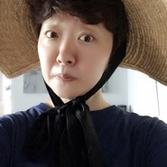 末小皮](https://i.xiami.com/moxiaopi) | **地区**: China 中国大陆 **风格**: 独立民谣 Indie Folk, 华语唱作人 Chinese Singer-Songwriter **播放数**: 6227950 **粉丝数**: 5043 **评论数**: 164  |

## 档案

独立音乐人，唱作人 
末小皮工作wechat / moxiaopi123

## 专辑

| 名称 | 语种 | 唱片公司 | 发行时间 | 专辑类别 | 专辑风格 |
| :--: | :-- | :-- | :-- | :-- | :-- |
| [ 睡意](./albums/5022385631.md) | 国语 |  | 2020年09月16日 | EP, 单曲 |  |
| [ 妈妈](./albums/5022381944.md) | 国语 |  | 2020年05月10日 | EP, 单曲 |  |
| [ 日常](./albums/5022534689.md) | 国语 |  | 2020年04月23日 | EP, 单曲 |  |
| [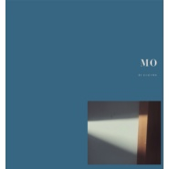 《Mo 10 》末小皮十周年巡演Live](./albums/5022396663.md) | 国语 |  | 2020年02月25日 | 录音室专辑 |  |
| [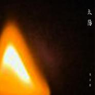 太阳](./albums/5022383549.md) | 国语 |  | 2020年02月04日 | EP, 单曲 |  |
| [ 所以单身](./albums/2105399304.md) | 国语 |  | 2019年11月01日 | EP, 单曲 |  |
| [ 一个](./albums/2105367532.md) | 国语 |  | 2019年10月15日 | EP, 单曲 | 独立民谣 Indie Folk |
| [ 百字明](./albums/2105241020.md) | 国语 |  | 2019年09月12日 | EP, 单曲 | 佛教音乐 Buddhist Music |
| [ 你了解的](./albums/5022384422.md) | 其他 |  | 2019年08月24日 | 录音室专辑 |  |
| [ 也许](./albums/5022547526.md) | 国语 |  | 2019年06月28日 | EP, 单曲 |  |
| [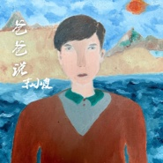 爸爸说](./albums/2104944781.md) | 国语 |  | 2019年06月15日 | EP, 单曲 | 流行 Pop |
| [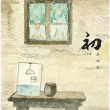 初](./albums/2104677144.md) | 国语 |  | 2019年03月18日 | 录音室专辑 | 中国风 China-Wave, 独立民谣 Indie Folk |
| [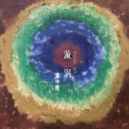 漩涡（海中吉他版）](./albums/5022416781.md) | 国语 |  | 2019年02月23日 | EP, 单曲 |  |
| [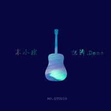 也许（DEMO版）](./albums/5022429146.md) | 国语 |  | 2019年02月01日 | EP, 单曲 |  |
| [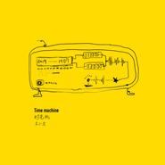 时光机](./albums/5022536523.md) | 国语 |  | 2019年01月23日 | EP, 单曲 |  |
| [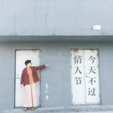 今天不过情人节](./albums/5022389900.md) | 其他 |  | 2018年08月17日 | EP, 单曲 |  |
| [ 身残志坚](./albums/5022432362.md) | 国语 |  | 2018年08月14日 | 录音室专辑 |  |
| [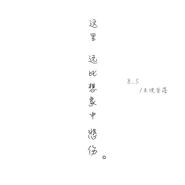 这里远比想象中悲伤](./albums/5022390038.md) | 国语 |  | 2018年08月05日 | 录音室专辑 |  |
| [ Subtraction减法](./albums/2104026243.md) | 国语 | 独立发行 | 2018年05月18日 | 录音室专辑 | 独立电子乐 Indietronica |
| [ 习惯爱(DEMO)](./albums/5022395039.md) | 其他 |  | 2018年04月20日 | EP, 单曲 |  |
| [ 你像春天一样美好](./albums/2103626270.md) | 国语 | 末氏小调 | 2018年03月21日 | EP, 单曲 | 流行 Pop |
| [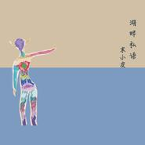 湖畔私语](./albums/5022417884.md) | 国语 |  | 2018年03月02日 | EP, 单曲 |  |
| [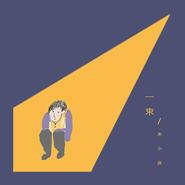 一束](./albums/5022400157.md) | 其他 |  | 2018年01月22日 | 录音室专辑 |  |
| [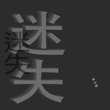 迷失](./albums/2103630686.md) | 国语 |  | 2017年11月25日 | EP, 单曲 |  |
| [ 我会一直陪着你](./albums/2102919619.md) | 国语 | 看见音乐 (上海) | 2017年11月09日 | EP, 单曲 |  |
| [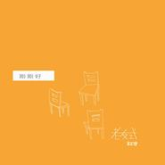 刚刚好（2017 老友式弹唱）](./albums/5022413264.md) | 国语 |  | 2017年10月09日 | 录音室专辑 |  |
| [ 叶子风2017](./albums/5022408963.md) | 国语 |  | 2017年09月22日 | 录音室专辑 |  |
| [ 影子](./albums/5022419751.md) | 国语 |  | 2017年08月07日 | EP, 单曲 |  |
| [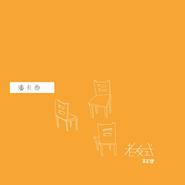 潘卡西（2017 老友式弹唱）](./albums/5022399214.md) | 其他 |  | 2017年07月05日 | 录音室专辑 |  |
| [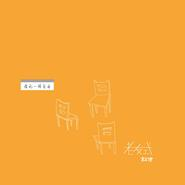 像风一样自由（2017 老友式弹唱）](./albums/5022399919.md) | 国语 |  | 2017年05月23日 | 录音室专辑 |  |
| [ 把爱全给了我](./albums/5022406527.md) | 其他 |  | 2017年05月13日 | 录音室专辑 |  |
| [ 又怎样呢（2017 老友式弹唱）](./albums/5022405028.md) | 其他 |  | 2017年04月11日 | 录音室专辑 |  |
| [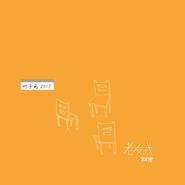 叶子风（2017 老友式弹唱）](./albums/5022363465.md) | 国语 |  | 2017年04月03日 | 录音室专辑 |  |
| [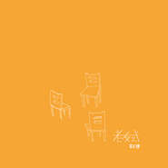 老友式末小皮2017弹唱](./albums/2103634920.md) | 国语 | 末氏小调 | 2017年03月01日 | 现场专辑 | 独立民谣 Indie Folk, 民谣流行 Folk Pop |
| [ 又见到你](./albums/5022438641.md) | 国语 |  | 2017年01月31日 | 录音室专辑 |  |
| [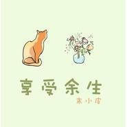 享受余生](./albums/5022426555.md) | 国语 |  | 2017年01月23日 | 录音室专辑 |  |
| [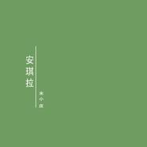 安琪拉](./albums/5022373785.md) | 国语 |  | 2017年01月19日 | 录音室专辑 |  |
| [ 薰衣草地](./albums/5022416734.md) | 国语 |  | 2017年01月06日 | 录音室专辑 |  |
| [ 留声CD机](./albums/5022377789.md) | 国语 |  | 2017年01月01日 | 录音室专辑 |  |
| [ 远山](./albums/5022374384.md) | 国语 |  | 2016年12月21日 | 录音室专辑 |  |
| [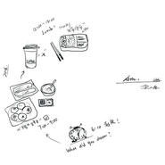 简单生活](./albums/5022394687.md) | 其他 |  | 2016年12月08日 | 录音室专辑 |  |
| [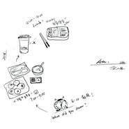 A M & P M治愈系心灵的城市民谣](./albums/2100363640.md) | 国语 | 独立发行 | 2016年07月07日 | 录音室专辑 | 城市民谣 Urban Folk |
| [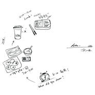 假日的雷雨天](./albums/5022429128.md) | 国语 |  | 2016年07月07日 | 录音室专辑 |  |
| [ I don't want to say goodbye](./albums/2100314642.md) | 国语 | 独立发行 | 2016年04月15日 | EP, 单曲 | 民谣流行 Folk Pop, 城市民谣 Urban Folk, 独立民谣 Indie Folk |
| [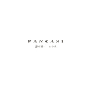 潘卡西PANCASI](./albums/2100235922.md) | 国语 | 末氏小调 | 2015年11月11日 | 录音室专辑 | 民谣流行 Folk Pop, 城市民谣 Urban Folk, 独立民谣 Indie Folk |
| [ 末小皮单曲精选集](./albums/1016825821.md) | 国语 | 独立发行 | 2015年08月13日 | EP, 单曲 | 民谣流行 Folk Pop, 城市民谣 Urban Folk, 独立民谣 Indie Folk |
| [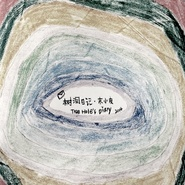 树洞日记Tree Hole's Diary](./albums/2100177513.md) | 国语 | 末氏小调STUDIO | 2014年08月08日 | 录音室专辑 | 城市民谣 Urban Folk, 独立民谣 Indie Folk |
| [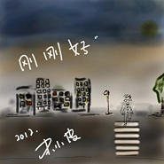 刚刚好](./albums/1295816459.md) | 国语 | 独立发行 | 2012年01月23日 | 录音室专辑 | 民谣流行 Folk Pop, 独立民谣 Indie Folk |
| [ 她回来找你](./albums/413208.md) | 国语 | 独立发行 | 2009年11月27日 | EP, 单曲 |  |

## 评论

|  |  |  |
| :-- | :-- | :-- |
|  [虾米用户](https://emumo.xiami.com/u/253205073)  2020-03-12 13:30 赞(1) 踩(0) | 
远山怎么没了？
 |
|  [虾米用户](https://emumo.xiami.com/u/358995000) 散场本是常态 尽兴而归就... 2019-09-19 14:02 赞(0) 踩(0) | 

 |
|  [虾米用户](https://emumo.xiami.com/u/304166531)  2019-07-27 16:21 赞(0) 踩(0) | 
最爱《远山》
 |
|  [虾米用户](https://emumo.xiami.com/u/347056138)  2019-05-21 00:24 赞(1) 踩(0) | 
不错不错味道好极了
 |
|  [虾米用户](https://emumo.xiami.com/u/48601538) 我还没想好要写什么... 2019-05-18 23:49 赞(2) 踩(0) | 
期待你来沈阳
 |
|  [虾米用户](https://emumo.xiami.com/u/100191514) 30岁，庆幸一路走来已是... 2019-04-20 09:02 赞(0) 踩(0) | 
小皮，什么时候还会有现场听呢。几年前去了苏州跟杭州听了两场。期待这次。
 |
|  [虾米用户](https://emumo.xiami.com/u/347679901)  2018-06-29 17:02 赞(0) 踩(0) | 
有没有人误认她是一路同行的皮蛋
 |
|  [虾米用户](https://emumo.xiami.com/u/308472308)  2018-05-10 20:05 赞(1) 踩(0) | 
非常喜欢小皮的歌
 |
|  [虾米用户](https://emumo.xiami.com/u/150706) 我们....都回不去了 2018-04-20 20:20 赞(1) 踩(0) | 
超耐听。。。非常高兴国内有这样的创作歌手，而且声音真的很喜欢。
 |
|  [虾米用户](https://emumo.xiami.com/u/306858333) 。。。 2018-02-11 14:26 赞(1) 踩(0) | 
喜欢你温暖的歌，喜欢你温暖的声音，偶然发现的你，竟让我如此心动❤
 |
|  [虾米用户](https://emumo.xiami.com/u/339807196) Danceistheso... 2018-01-27 21:35 赞(0) 踩(0) | 
好棒！加油加油！！！
 |
|  [虾米用户](https://emumo.xiami.com/u/3553853)  2017-11-12 23:33 赞(0) 踩(0) | 
风格和声音都是喜欢的，好不容易能听到你的音乐
 |
|  [虾米用户](https://emumo.xiami.com/u/198992462)   2017-10-20 00:07 赞(0) 踩(0) | 
听了会高潮
 |
|  [虾米用户](https://emumo.xiami.com/u/250687968)   2017-10-15 12:27 赞(0) 踩(0) | 
末小皮，想问下你的正版专辑哪边能买呀 
 |
|  [虾米用户](https://emumo.xiami.com/u/253379301)  2017-08-09 13:13 赞(1) 踩(0) | 
她的歌很有感觉 
 |
|  [虾米用户](https://emumo.xiami.com/u/32225025)  2017-06-21 19:59 赞(0) 踩(0) | 
小皮也叫papi？
 |
|  [虾米用户](https://emumo.xiami.com/u/291836893)  2017-05-06 00:02 赞(0) 踩(0) | 
我喜欢小皮难得喜欢
 |
|  [虾米用户](https://emumo.xiami.com/u/52448083) 祝你生日快乐 2017-04-17 02:18 赞(1) 踩(0) | 
远山怎么没了、
 |
|  [虾米用户](https://emumo.xiami.com/u/36643090) 我还没想好要写什么... 2017-03-01 18:23 赞(0) 踩(0) | 
远山没有了
 |
|  [虾米用户](https://emumo.xiami.com/u/15986466) 你长大了，学会不说话了。 2017-02-08 15:00 赞(0) 踩(0) | 
一切都会来的， 一切都会好起来的。
 |
|  [虾米用户](https://emumo.xiami.com/u/261330433) 忘穿秋裤 2017-01-16 15:05 赞(0) 踩(0) | 
单曲循环不吃饭的中午
 |
|  [虾米用户](https://emumo.xiami.com/u/72666568)  2016-12-25 13:12 赞(0) 踩(0) | 
蛮好的
 |
|  [虾米用户](https://emumo.xiami.com/u/227163079)  2016-12-20 19:19 赞(0) 踩(0) | 
小皮，我们爱你
 |
|  [虾米用户](https://emumo.xiami.com/u/227163079)  2016-12-20 19:19 赞(0) 踩(0) | 
没注意这场演唱会是2015年的。不过一路过来的心情好好
 |
|  [虾米用户](https://emumo.xiami.com/u/227163079)  2016-12-20 19:18 赞(0) 踩(0) | 
是我错怪小皮了 
 |
|  [虾米用户](https://emumo.xiami.com/u/227163079)  2016-12-20 19:10 赞(0) 踩(0) | 
小皮，我们好伤心   
 |
|  [虾米用户](https://emumo.xiami.com/u/227163079)  2016-12-20 19:10 赞(0) 踩(0) | 
西安多严重的雾霾啊，知道吗？现在还下雨啦
 |
|  [虾米用户](https://emumo.xiami.com/u/227163079)  2016-12-20 19:09 赞(1) 踩(0) | 
为什么骗我们，我现在就在西安光圈门口傻等。昨天坐了一天大巴从云南坝美赶到昆明，今天一早就从昆明飞到西安。等到的就是光圈酒吧紧闭的大门 
 |
|  [虾米用户](https://emumo.xiami.com/u/227163079)  2016-12-15 10:14 赞(0) 踩(0) | 
西安光圈酒吧20号演唱会有约起的没  
 |
|  [虾米用户](https://emumo.xiami.com/u/122688364) 生在愤坑，长在赤圈；挣脱 2016-11-25 23:03 赞(0) 踩(0) | 
6027
 |
|  [虾米用户](https://emumo.xiami.com/u/122688364) 生在愤坑，长在赤圈；挣脱 2016-11-16 23:23 赞(0) 踩(0) | 
5685
 |
|  [虾米用户](https://emumo.xiami.com/u/71446596)  2016-11-07 13:44 赞(0) 踩(0) | 
迷失的眼睛！！
 |
|  [虾米用户](https://emumo.xiami.com/u/12143889) 我还没想好要写什么... 2016-11-03 10:53 赞(0) 踩(0) | 
百字明没了~
 |
|  [虾米用户](https://emumo.xiami.com/u/46716282) 我也沒什麼可說的 2016-10-29 12:52 赞(2) 踩(0) | 
……远山没了？
 |
|  [虾米用户](https://emumo.xiami.com/u/55496046)  2016-08-18 21:07 赞(0) 踩(0) | 

 |
|  [虾米用户](https://emumo.xiami.com/u/210632344) We just deci... 2016-08-08 22:13 赞(18) 踩(0) | 
为什么没有远山了啊
 |
| ⇒ |  [虾米用户](https://emumo.xiami.com/u/3223035)  2018-06-04 22:03 赞(0) 踩(0) | 
对啊&amp;hellip;喜欢远山！
 |
| ⇒ |  [虾米用户](https://emumo.xiami.com/u/124830490)  2018-06-12 22:15 赞(0) 踩(0) | 
同问：为什么没有远山了呢
 |
| ⇒ |  [虾米用户](https://emumo.xiami.com/u/305391605) 别绞尽脑汁 2018-06-18 01:12 赞(0) 踩(0) | 
为了远山
 |
|  [虾米用户](https://emumo.xiami.com/u/28770632) 我还没想好要写什么... 2016-07-03 01:50 赞(4) 踩(0) | 
远山 那首歌很好听 可惜没有了
 |
|  [虾米用户](https://emumo.xiami.com/u/12819353)  2016-06-22 12:57 赞(0) 踩(0) | 
以前博客有一首很好听，但是找不到。。开头歌词好像是，“你是否收到一条短消息…你说你那边下着雨”
 |
| ⇒ |  [虾米用户](https://emumo.xiami.com/u/842032) 我还没想好要写什么... 2017-07-20 20:52 赞(0) 踩(0) | 
這首歌叫做：不要為我難過 
 |
|  [虾米用户](https://emumo.xiami.com/u/313449)   2016-06-16 00:29 赞(1) 踩(0) | 
远山给力
 |
|  [虾米用户](https://emumo.xiami.com/u/77078138) 以乐读心，以心会友 2016-06-04 18:56 赞(0) 踩(0) | 
感觉每首歌都在唱自己，怎么可以这么巧 
 |
|  [虾米用户](https://emumo.xiami.com/u/126728152)  2016-04-15 23:42 赞(0) 踩(0) | 
都爱
 |
|  [虾米用户](https://emumo.xiami.com/u/116445618) 私はあなたの道具になりた... 2016-02-28 14:03 赞(2) 踩(0) | 
我要陌生人 
 |
|  [虾米用户](https://emumo.xiami.com/u/46160992) 幸福就是我圆滚滚的身材 2016-02-27 09:34 赞(3) 踩(0) | 
太赞了，希望多点人气，在广州听了专场后，每次听脑里都是大学去厦门时候夜晚在鼓浪屿游荡在阳台喝劲酒聊天…特地去了上海mao听humbert，结束的时候调查喜欢哪个歌手，我和小伙伴都填了末小皮
 |
|  [虾米用户](https://emumo.xiami.com/u/347238) 一只真诚爱民谣的大叔！ 2016-02-26 17:27 赞(0) 踩(0) | 
喜欢这个菇凉 
 |
|  [虾米用户](https://emumo.xiami.com/u/29595542) 因为没有草原 就忘了你是... 2016-02-26 11:58 赞(1) 踩(0) | 
求陌生人 
 |
|  [虾米用户](https://emumo.xiami.com/u/93081992) so what 2016-02-03 20:55 赞(0) 踩(0) | 
少年不可欺
 |
|  [虾米用户](https://emumo.xiami.com/u/79870398) 好好学习 2016-02-03 11:43 赞(4) 踩(0) | 
求陌生人～～早点放到虾米上来吧～～
 |
|  [虾米用户](https://emumo.xiami.com/u/43279496)  2016-02-02 22:58 赞(0) 踩(0) | 
好听，今天才听到 
 |
|  [虾米用户](https://emumo.xiami.com/u/83888892)  2016-01-29 22:28 赞(2) 踩(0) | 
末小皮，怎么在虾米上没有找到你唱的陌生人呢？
 |
|  [虾米用户](https://emumo.xiami.com/u/44487720) 暂无签名~ 2016-01-26 23:47 赞(0) 踩(0) | 
很干净
 |
|  [虾米用户](https://emumo.xiami.com/u/96407534) 有些人 真的在过着你想过... 2016-01-01 12:41 赞(0) 踩(0) | 
太棒啦 期待一月七号见  
 |
|  [虾米用户](https://emumo.xiami.com/u/72421752)  2015-12-26 12:31 赞(0) 踩(0) | 
小皮认识王小洋么
 |
|  [虾米用户](https://emumo.xiami.com/u/8212576) If I just la... 2015-12-22 10:50 赞(1) 踩(0) | 
1月16的live 是四川广安那个广安吗？ 
 |
|  [虾米用户](https://emumo.xiami.com/u/12143889) 我还没想好要写什么... 2015-12-15 10:20 赞(0) 踩(0) | 
为什么百字明是demo啊啊~~不科学~~
 |
|  [虾米用户](https://emumo.xiami.com/u/89445144) 对酒当歌，莫管人生几何~ 2015-12-07 15:44 赞(0) 踩(0) | 
因为好听~
 |
|  [虾米用户](https://emumo.xiami.com/u/5412535)  2015-11-28 22:39 赞(0) 踩(0) | 
哇，声音有点惊艳耶
 |
|  [虾米用户](https://emumo.xiami.com/u/49664274) 逃离 2015-11-23 20:07 赞(0) 踩(0) | 
喜欢
 |
|  [虾米用户](https://emumo.xiami.com/u/29119620) 夜幕海岸線/藍色大門後/... 2015-11-12 09:15 赞(0) 踩(0) | 
加油小皮。
 |
|  [虾米用户](https://emumo.xiami.com/u/1601749)   2015-10-23 00:49 赞(0) 踩(0) | 
远山
 |
|  [虾米用户](https://emumo.xiami.com/u/68487514)  2015-10-15 23:08 赞(0) 踩(0) | 
很喜欢百字明
 |
|  [虾米用户](https://emumo.xiami.com/u/153855)  2015-10-04 22:33 赞(0) 踩(0) | 
10月10日周六晚九点半，北京令象音乐咖啡馆（热力猫俱乐部）-末小皮专场演出哦~~~！！！！ <a href="http://www.douban.com/event/25155493/" target="_blank" rel="nofollow noreferrer noopener">http://www.douban.com/event/25155493/</a>
 |
|  [虾米用户](https://emumo.xiami.com/u/9833147) . 2015-09-21 14:28 赞(1) 踩(0) | 
啥时候来武汉演唱？
 |
|  [虾米用户](https://emumo.xiami.com/u/48154977)  2015-09-05 17:17 赞(0) 踩(0) | 
刚刚好
 |
|  [虾米用户](https://emumo.xiami.com/u/27063111) 哈哈哈哈傻乐 2015-08-27 14:05 赞(1) 踩(0) | 
什么时候再来西安巡演
 |
|  [虾米用户](https://emumo.xiami.com/u/49689878) 我爱我美丽的大重庆！ 2015-08-06 11:27 赞(1) 踩(0) | 
一听你的声音就喜欢上了
 |
|  [虾米用户](https://emumo.xiami.com/u/19921949)   2015-07-31 18:36 赞(1) 踩(0) | 
“遇见你”配你的歌真好 
 |
|  [虾米用户](https://emumo.xiami.com/u/44447321)  2015-07-08 00:33 赞(0) 踩(0) | 
电台一出来 远山的时候 赞
 |
|  [虾米用户](https://emumo.xiami.com/u/534272)  2015-07-02 19:25 赞(0) 踩(0) | 
那年我十八岁呢？别羞涩啊！多自然啊，多懵懂啊，多纯洁啊，是可以有的啊。我的大叔心已经为之循环一下午啦~
 |
|  [虾米用户](https://emumo.xiami.com/u/32557984) Laus Deo. 2015-06-30 22:43 赞(0) 踩(0) | 
以前有首七天，现在怎么也找不到了，豆瓣上也没了，好想听啊！！
 |
|  [虾米用户](https://emumo.xiami.com/u/36215131) 我还没想好要写什么... 2015-06-25 00:07 赞(0) 踩(0) | 
很赞，一下子被迷倒
 |
|  [虾米用户](https://emumo.xiami.com/u/33832795) 轻云薄雾，总是少年行乐处 2015-06-16 19:40 赞(0) 踩(0) | 
怎么这么好听。。
 |
|  [虾米用户](https://emumo.xiami.com/u/50777794)  2015-06-13 13:58 赞(0) 踩(0) | 
潘卡西的翅膀呢
 |
| ⇒ |  [虾米用户](https://emumo.xiami.com/u/50141263)  2015-06-24 19:46 赞(0) 踩(0) | 
好迷人，好喜欢
 |
|  [虾米用户](https://emumo.xiami.com/u/37015270) 打 喷 嚏 2015-06-10 23:21 赞(0) 踩(0) | 
那年我十八岁  
 |
|  [虾米用户](https://emumo.xiami.com/u/47547509) 下次微笑我依然会很骄傲！ 2015-05-20 23:07 赞(0) 踩(0) | 
让人着迷的声音！
 |
|  [虾米用户](https://emumo.xiami.com/u/33431647) （总有一些东西，我们爱之... 2015-05-14 22:10 赞(0) 踩(0) | 
那首“爱上了陌生人”之前都有，现在怎么没有了阿，。？
 |
| ⇒ |  [虾米用户](https://emumo.xiami.com/u/842032) 我还没想好要写什么... 2017-07-20 21:03 赞(0) 踩(0) | 
這首歌，歌名是：陌生人～ 在潘卡西那張專輯裡面喔
 |
|  [虾米用户](https://emumo.xiami.com/u/40618632)  2015-05-11 19:57 赞(0) 踩(0) | 
动听
 |
|  [虾米用户](https://emumo.xiami.com/u/9833147) . 2015-04-24 22:55 赞(0) 踩(0) | 
太好听了
 |
|  [虾米用户](https://emumo.xiami.com/u/44686141) 电子，爵士，轻音乐 2015-04-12 19:03 赞(0) 踩(0) | 
赞啊
 |
|  [虾米用户](https://emumo.xiami.com/u/44316745)   2015-04-01 16:47 赞(0) 踩(0) | 
红太阳呢，啊啊啊啊
 |
|  [虾米用户](https://emumo.xiami.com/u/33266081)  2015-03-01 15:41 赞(0) 踩(0) | 
小谣
 |
|  [虾米用户](https://emumo.xiami.com/u/26273116) folk music 2015-02-28 13:40 赞(1) 踩(0) | 
迷恋的女声
 |
|  [虾米用户](https://emumo.xiami.com/u/2444439)  2015-02-16 22:45 赞(1) 踩(0) | 
为什么没有 又怎样呢
 |
|  [虾米用户](https://emumo.xiami.com/u/1660678) 如鱼饮水，冷暖自知 2015-02-11 09:53 赞(0) 踩(0) | 
很喜欢的声音。
 |
|  [虾米用户](https://emumo.xiami.com/u/1716769) YO 2015-02-04 03:19 赞(0) 踩(0) | 
才知道你在 我还记得你的歌 她回来找你
 |
|  [虾米用户](https://emumo.xiami.com/u/9254419)  2015-01-27 23:09 赞(0) 踩(0) | 
为什么没有 红太阳
 |
|  [虾米用户](https://emumo.xiami.com/u/40593136)   2015-01-12 20:49 赞(0) 踩(0) | 
又发现一美声
 |
|  [虾米用户](https://emumo.xiami.com/u/44132236) 比起好好告别 人们更擅长... 2015-01-07 14:26 赞(0) 踩(0) | 
喜欢～这个女人
 |
|  [虾米用户](https://emumo.xiami.com/u/45477016)  2014-12-31 01:24 赞(0) 踩(0) | 
四五年前听到的这首歌，当时还是双人小面鼓的呢，怀念
 |
|  [虾米用户](https://emumo.xiami.com/u/5389316)  2014-12-28 23:56 赞(0) 踩(0) | 
没有完美情人 差评
 |
|  [虾米用户](https://emumo.xiami.com/u/2765135) Rockazz 2014-12-25 09:09 赞(0) 踩(0) | 
刚刚好
 |
|  [虾米用户](https://emumo.xiami.com/u/40924994)  2014-12-13 18:19 赞(0) 踩(0) | 
好听 好听
 |
|  [虾米用户](https://emumo.xiami.com/u/16260828) the moment s... 2014-12-12 23:48 赞(0) 踩(0) | 
喜欢小皮干净简单的声音，可以睡个好觉了
 |
|  [虾米用户](https://emumo.xiami.com/u/5514756) 我可不是随便赞的 2014-12-12 19:43 赞(0) 踩(0) | 
面朝大海，无力花开
 |
|  [虾米用户](https://emumo.xiami.com/u/8471028)  2014-12-07 22:24 赞(0) 踩(0) | 
慵懒，随意，娓娓唱来
 |
|  [虾米用户](https://emumo.xiami.com/u/2152869)   2014-12-01 11:33 赞(0) 踩(0) | 
求！那又怎样呢
 |
|  [虾米用户](https://emumo.xiami.com/u/42969191) 太不巧 这就是我 2014-11-28 10:21 赞(0) 踩(0) | 
豆瓣音乐人上特喜欢的一歌手
 |
|  [虾米用户](https://emumo.xiami.com/u/6988484)  2014-11-22 23:55 赞(0) 踩(0) | 
声音很棒
 |
|  [虾米用户](https://emumo.xiami.com/u/21745217) 暂无签名~ 2014-11-12 21:53 赞(0) 踩(0) | 
没有完美情人T_T
 |
|  [虾米用户](https://emumo.xiami.com/u/27616142) 啦粑粑光光 给她班班光 2014-11-10 23:58 赞(0) 踩(0) | 
歌太少！差评！
 |
|  [虾米用户](https://emumo.xiami.com/u/4627987) 梦是一场似曾相识的预演。 2014-11-09 20:40 赞(0) 踩(0) | 
怎么没有《完美情人》。。。
 |
|  [虾米用户](https://emumo.xiami.com/u/15275321) 也没什么好听的。 2014-11-09 11:21 赞(0) 踩(0) | 
怎么没有《那年我十八岁》？
 |
|  [虾米用户](https://emumo.xiami.com/u/28366253)  2014-11-07 17:10 赞(0) 踩(0) | 
喜欢还需要啥理由的
 |
|  [虾米用户](https://emumo.xiami.com/u/28366253)  2014-11-07 17:08 赞(0) 踩(0) | 
从远山而来
 |
|  [虾米用户](https://emumo.xiami.com/u/3333385) 民谣摇滚 2014-10-23 23:14 赞(0) 踩(0) | 
很好听
 |
|  [虾米用户](https://emumo.xiami.com/u/1453136) hi, there 2014-10-21 00:09 赞(0) 踩(0) | 
线下形象跟线上形象相差太远了，感觉好像认错人了。
 |
|  [虾米用户](https://emumo.xiami.com/u/12819353)  2014-10-19 00:31 赞(0) 踩(0) | 
很喜欢夏末时节，可惜这里没有
 |
|  [虾米用户](https://emumo.xiami.com/u/4715251) 愿屁屁在喵星开开心心还有... 2014-10-15 09:23 赞(0) 踩(0) | 
赞啊
 |
|  [虾米用户](https://emumo.xiami.com/u/492115)  2014-10-10 17:40 赞(0) 踩(0) | 
怎么没有完美情人
 |
|  [虾米用户](https://emumo.xiami.com/u/41406774) 暂无签名~ 2014-10-01 18:40 赞(0) 踩(0) | 
又发现了一位我喜欢的歌手O(∩_∩)O
 |
|  [虾米用户](https://emumo.xiami.com/u/38800081) 因果流转的逗 2014-08-26 18:29 赞(0) 踩(0) | 
唱给父亲的远山。远方的山，再远也一直在。
 |
|  [虾米用户](https://emumo.xiami.com/u/36220334) 要自由也渴望长久 2014-08-12 09:53 赞(0) 踩(0) | 
一直在豆瓣听 原来虾米也有 虽然不多
 |
|  [虾米用户](https://emumo.xiami.com/u/15310229)   2014-08-06 15:18 赞(0) 踩(0) | 
inner peace
 |
|  [虾米用户](https://emumo.xiami.com/u/2029016) 我还没想好要写什么... 2014-07-29 11:23 赞(0) 踩(0) | 
好听
 |
|  [虾米用户](https://emumo.xiami.com/u/38915272)  2014-07-12 18:36 赞(0) 踩(0) | 
简单通透
 |
|  [虾米用户](https://emumo.xiami.com/u/31942586) 暂无签名~ 2014-07-10 19:40 赞(0) 踩(0) | 
加油，小皮
 |
|  [虾米用户](https://emumo.xiami.com/u/318039) 愿得一人心，白首不分离 2014-06-22 00:14 赞(0) 踩(0) | 
末式小调，由繁入简，非同凡响
 |
|  [虾米用户](https://emumo.xiami.com/u/32951984)  2014-06-18 18:02 赞(0) 踩(0) | 
我想下载你的远山 但是下不了 可不可以给我别的链接急要哇 谢谢
 |
|  [虾米用户](https://emumo.xiami.com/u/5848254) 网易云音乐（之后可能会开... 2014-06-07 14:07 赞(0) 踩(0) | 
06月08日不是温州吗？8月3日还来？
 |
|  [虾米用户](https://emumo.xiami.com/u/8796793)  2014-06-03 18:53 赞(0) 踩(0) | 
干净的声音简单的旋律
 |
|  [虾米用户](https://emumo.xiami.com/u/36802975)  2014-05-26 23:41 赞(0) 踩(0) | 
我喜欢般若波若蜜！
 |
|  [虾米用户](https://emumo.xiami.com/u/33431647) （总有一些东西，我们爱之... 2014-04-13 18:28 赞(0) 踩(0) | 
多上点歌曲阿，末氏调调，。
 |
|  [虾米用户](https://emumo.xiami.com/u/32839374) 若然恋爱似旅行，风景看尽... 2014-02-23 22:48 赞(0) 踩(0) | 
上多点歌曲，小皮，我从豆瓣追到这里来了。
 |
|  [虾米用户](https://emumo.xiami.com/u/31589368)  2014-01-13 20:12 赞(1) 踩(0) | 
我又追随你到这里了~~~喜欢末小皮~~好喜欢！
 |
|  [虾米用户](https://emumo.xiami.com/u/22713846) 简单、快乐 2014-01-13 16:27 赞(140) 踩(0) | 
我刚入驻了虾米音乐人，欢迎大家来我的个人主页，收听我的最新音乐
 |
| ⇒ |  [虾米用户](https://emumo.xiami.com/u/7021356)  2014-09-17 17:29 赞(0) 踩(0) | 
加油↖(^ω^)↗
 |
| ⇒ |  [虾米用户](https://emumo.xiami.com/u/25886010) 求音若饥，持音若愚。 2014-11-08 11:30 赞(0) 踩(0) | 
单身请举手单身请举手单身请举手单身请举手单身请举手单身请举手单身请举手单身请举手单身请举手单身请举手单身请举手单身请举手单身请举手
 |
| ⇒ |  [虾米用户](https://emumo.xiami.com/u/42312071)  2015-03-31 17:42 赞(0) 踩(0) | 
为什么虾米上没有那年我十八岁 
 |
| ⇒ |  [虾米用户](https://emumo.xiami.com/u/49079732) 别跟我扯那个哩哏儿棱 2015-05-11 21:42 赞(0) 踩(0) | 

 |
| ⇒ |  [虾米用户](https://emumo.xiami.com/u/3789447) 穿过旷野的风，你慢些跑… 2015-05-17 11:47 赞(0) 踩(0) | 
那个喜欢的红太阳怎么没有，希望能看到你的现场，我是脑残粉
 |
| ⇒ |  [虾米用户](https://emumo.xiami.com/u/85210828) 被掏空的山丘，可以安心的... 2015-11-21 19:12 赞(0) 踩(0) | 
喜欢oh，你的声音很好听
 |
| ⇒ |  [虾米用户](https://emumo.xiami.com/u/50359238)   2016-03-14 14:02 赞(0) 踩(0) | 
  
 |
| ⇒ |  [虾米用户](https://emumo.xiami.com/u/140080410)   2016-10-17 22:30 赞(0) 踩(0) | 
真的好喜欢你的声音，永远支持你
 |
| ⇒ |  [虾米用户](https://emumo.xiami.com/u/250641995) 我还没想好要写什么... 2017-09-19 23:59 赞(0) 踩(0) | 
那年我18岁
 |
| ⇒ |  [虾米用户](https://emumo.xiami.com/u/43959363) 我还没想好要写什么... 2018-10-24 23:45 赞(0) 踩(0) | 
没有远山这首歌
 |
| ⇒ |  [虾米用户](https://emumo.xiami.com/u/431746306)  2019-11-13 14:06 赞(0) 踩(0) | 
请问哪能听到以前的普通话的 百字明  跪求了
 |
|  [虾米用户](https://emumo.xiami.com/u/3465478)  2013-12-01 00:15 赞(0) 踩(0) | 
末小皮
 |
|  [虾米用户](https://emumo.xiami.com/u/8827122)  2013-08-04 11:01 赞(0) 踩(0) | 
可爱的蘑菇头
 |
|  [虾米用户](https://emumo.xiami.com/u/5780982) 不过如此 2013-06-19 00:35 赞(0) 踩(0) | 
喜欢这种调调，支持
 |
|  [虾米用户](https://emumo.xiami.com/u/8318669)  2013-06-16 14:12 赞(0) 踩(0) | 
喜欢她带有夏天青草味道的声音
 |
|  [虾米用户](https://emumo.xiami.com/u/1479814)  2013-06-04 15:00 赞(0) 踩(0) | 
喜欢完美情人
 |
|  [虾米用户](https://emumo.xiami.com/u/1250150) 个 2013-05-05 17:31 赞(0) 踩(0) | 
爱小皮
 |
|  [虾米用户](https://emumo.xiami.com/u/3937917) 一个卑微的理想主义者 2013-03-02 11:26 赞(0) 踩(0) | 
和小皮是什么关系
 |
|  [虾米用户](https://emumo.xiami.com/u/25701)  2013-02-18 09:06 赞(0) 踩(0) | 
慵懒的声音
 |
|  [虾米用户](https://emumo.xiami.com/u/3078328) 像吃了朵过敏的花 2013-01-24 00:55 赞(0) 踩(0) | 
小皮生日快乐~
 |
|  [虾米用户](https://emumo.xiami.com/u/2827773)   2012-12-02 18:52 赞(0) 踩(0) | 
末氏小调  有木有好心人来上传她的歌啊
 |
|  [虾米用户](https://emumo.xiami.com/u/2091522)  2012-06-16 18:32 赞(0) 踩(0) | 
听过她的现场 很不错
 |
|  [虾米用户](https://emumo.xiami.com/u/1245370)   2012-04-20 16:02 赞(0) 踩(0) | 
怎么能没有你决定呢～？
 |
|  [虾米用户](https://emumo.xiami.com/u/2535572) 谎话…情歌… 2012-03-23 00:16 赞(0) 踩(0) | 
声音真干净···
 |
|  [虾米用户](https://emumo.xiami.com/u/6584224)  2012-03-19 03:00 赞(0) 踩(0) | 
她的像风一样自由呢
 |
|  [虾米用户](https://emumo.xiami.com/u/5197344)  2011-11-25 16:36 赞(0) 踩(0) | 
还想听其他几首啊
 |
|  [虾米用户](https://emumo.xiami.com/u/6164727) 孤傲信徒 2011-10-08 21:39 赞(0) 踩(0) | 
怎么就一首歌，我记得她有很多好歌的啊
 |
|  [虾米用户](https://emumo.xiami.com/u/300592)   2011-10-08 16:53 赞(0) 踩(0) | 
虾米几乎没有她的歌嘛~
 |
|  [虾米用户](https://emumo.xiami.com/u/2050232) 我还没想好要写什么... 2011-08-27 13:09 赞(0) 踩(0) | 
蘑菇头
 |
|  [虾米用户](https://emumo.xiami.com/u/887775) 蓝小妞 2011-08-12 02:04 赞(1) 踩(0) | 
清新，让我内心沉静
 |
|  [虾米用户](https://emumo.xiami.com/u/119546)  2011-05-05 00:29 赞(0) 踩(0) | 
喜欢这种末式小调。可惜好少歌呀。
 |
|  [虾米用户](https://emumo.xiami.com/u/3078328) 像吃了朵过敏的花 2011-03-26 12:24 赞(0) 踩(0) | 
末式小调。
 |
|  [虾米用户](https://emumo.xiami.com/u/2230334) 老不死的地球你好！ 2011-02-20 01:47 赞(0) 踩(0) | 
小调
 |
|  [虾米用户](https://emumo.xiami.com/u/1712583)  2010-11-04 09:02 赞(0) 踩(0) | 
很个性的
 |
