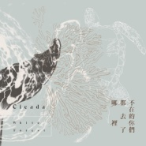

不在的你们都去了哪里
============================

|  |  |
| :--: | :-- |
| [ 不在的你们都去了哪里](https://emumo.xiami.com/album/2102924869) | **艺人**: [Cicada](../index.md) **语种**: 国语 **唱片公司**: StreetVoice **发行时间**: 2017年11月23日 **专辑类别**: 录音室专辑 **专辑风格**: 现代古典 Modern Classical, 室内乐 / 重奏 Chamber Music **播放数**: 405298 **收藏数**: 1733 **评论数**: 167  |

## 简介

跨越情境与地景，Cicada乐团最具主题特徵的专辑  
  
宛如音乐裡的「湖滨散记」  
细腻质问人文自然的价值  
重新编录〈竹围小猫〉等旧作，赋予新生  
  
带给独立乐迷无数唯美留白的Cicada，是台湾音乐场景裡的异数。以「乐团」的逻辑，编写古典弦乐，让Cicada始终有著跨领域的魅力，其各种乐风特徵，让耳际能有多重发想：后摇滚、新古典（Neo Classical）、原声带音乐、实验声响艺术⋯⋯  
在欧美古典乐大厂纷纷向现代音乐投石问路之际，听Cicada的音乐，别具当代感。音乐作为方式，是类型中一次次的翻转。  
  
与其谈论Cicada是「古典乐」与否，不如思考他们每一次的作品，所试图呈现的美学。甫结束《自画像》电影原声带的创作，Cicada在录音与製作上，进入了另一个境地。原声带製作的经验裡，让乐器在技术与语彙上的表达，更显精淮；加上了更多分轨录製方式，融合了Cicada向来擅长的室内乐亲密空间，进阶版的Cicada带来新专辑《不在的你们都去了哪裡》。  
  
于弦乐的和鸣，于独奏的自白，Cicada将故事视野带到台湾自然地景，找寻消逝与过程。叹息之馀，找寻命题，以音乐纪录。此般消逝与伤感气氛，与过往的Cicada截然不同，更具备了现实的观感。故事欲望强烈，音乐表现也更紧凑饱满，宛如音乐版《湖滨散记》似，拉开动物与人之间的故事帷幕。  
  
延续了前作《仰望海平面》，「自然观察」不仅是Cicada长时间的计画，更是乐团表达的改变──「留白」不再只是音乐裡的蒙太奇，Cicada写下沟通的渴望：从花莲外海的海豚，到专辑同名曲引导的珊瑚白化主题，以及栖地备受威胁的白海豚⋯⋯每一首清晰的歌曲，像是大翅鲸喷气凝结的水雾，透过音乐的光，折射出纯粹与唯美的质地。

## 曲目

## 评论

|  |  |  |  |
| :-- | :-- | :-- | :-- |
|  [虾米用户](https://emumo.xiami.com/u/15725146) 最棒： 2020-08-11 22:32 赞(0) 踩(0) | 
想着你会去了台南，去了我不知道的城市，去了宇宙，走在火星上，甚至有点嫉妒你了，觉得自己变得好狭隘又好渺小。不好意思，都怪我的攀比心。虽然地球有鲸鱼，有海洋，有天空，有猫咪和狗狗，还有我，要和全宇宙做比较，我怎么也心虚。我想留你在我身边，我想再见到你。想问问宇宙，怎么样才能见到你。
 |
|  [虾米用户](https://emumo.xiami.com/u/247022054) Perplexe 2020-07-28 18:35 赞(0) 踩(0) | 
Today's beautiful moment, this musical discovery.
 |
|  [虾米用户](https://emumo.xiami.com/u/253586913)   2020-06-10 22:57 赞(0) 踩(0) | 
不在的你们，都去哪了
 |
|  [虾米用户](https://emumo.xiami.com/u/379162683) 我想要记住你们，我想要你... 2020-05-01 16:59 赞(0) 踩(0) | 

 |
|  [虾米用户](https://emumo.xiami.com/u/261098898)  2019-11-13 15:44 赞(0) 踩(0) | 
真的是无与伦比的美丽，太好听了，感叹发现的太晚了
 |
|  [虾米用户](https://emumo.xiami.com/u/31399475) 我还没想好要写什么... 2019-08-15 20:30 赞(0) 踩(0) | 
1115北京见 
 |
|  [虾米用户](https://emumo.xiami.com/u/55881258) 今日任公子 2019-08-12 01:11 赞(0) 踩(0) | 
夜里读林奇 心旷神怡的背景音乐
 |
|  [虾米用户](https://emumo.xiami.com/u/345221218) 煮一壶云水禅心，参一道似... 2019-07-07 20:52 赞(0) 踩(0) | 

 |
|  [虾米用户](https://emumo.xiami.com/u/42796114) 我去过的每一个地方，走的... 2019-04-06 21:06 赞(0) 踩(0) | 
真的很好听啊，整张专辑都值得单曲循环的那种φ(≧ω≦*)♪ 一起听歌
 |
|  [虾米用户](https://emumo.xiami.com/u/76439778) 净土糟糠，脏水洗身 2019-03-09 01:55 赞(0) 踩(0) | 
喧嚣的蝉，蛙鸣的夏天，水击千尺的鲸，如临深渊的恐惧与安静，消失了的都去了哪。
 |
|  [虾米用户](https://emumo.xiami.com/u/321908478) 我自以为。 2019-02-05 19:04 赞(0) 踩(0) | 
hope
 |
|  [虾米用户](https://emumo.xiami.com/u/42963872) 我还没想好要写什么... 2019-01-03 04:39 赞(1) 踩(0) | 
-
 |
|  [虾米用户](https://emumo.xiami.com/u/21880854) 救われる 2018-10-26 09:55 赞(0) 踩(0) | 
不在的你們都去了哪裡
 |
|  [虾米用户](https://emumo.xiami.com/u/59255594)  2018-06-27 18:59 赞(0) 踩(0) | 
太棒了
 |
|  [虾米用户](https://emumo.xiami.com/u/339191478)   2018-06-24 19:22 赞(0) 踩(0) | 
:-)
 |
|  [虾米用户](https://emumo.xiami.com/u/201391232) 谢谢虾米，你们是我。 2018-06-11 12:10 赞(0) 踩(0) | 
彡
 |
|  [虾米用户](https://emumo.xiami.com/u/342840991)  2018-04-03 08:20 赞(0) 踩(0) | 
&amp;pound;▪3@-2啊恶则还在3
 |
|  [虾米用户](https://emumo.xiami.com/u/18728868)  2018-02-02 17:30 赞(0) 踩(0) | 
敲好听
 |
|  [虾米用户](https://emumo.xiami.com/u/843367)  2018-01-21 00:49 赞(0) 踩(0) | 
面向大众纯音乐中的较高水平，优美不晦涩，又不流俗，氛围和情绪都足够到位。
 |
|  [虾米用户](https://emumo.xiami.com/u/637570)  2018-01-19 23:22 赞(1) 踩(0) | 
今晚重庆的演出好棒！可能大家有点矜持，希望你们还来。
 |
|  [虾米用户](https://emumo.xiami.com/u/248327088)  2018-01-15 11:54 赞(0) 踩(0) | 
1.20成都.一个人，还是要去的.但也不想一个人.
 |
| ⇒ |  [虾米用户](https://emumo.xiami.com/u/11856095) 正 是 2018-04-07 23:39 赞(0) 踩(0) | 
呜呜呜 错过了
 |
|  [虾米用户](https://emumo.xiami.com/u/1418202)  江山共老 2018-01-10 16:47 赞(0) 踩(0) | 
我觉得这张专辑很适合看书听，但不适合特别感伤的时候听&amp;hellip;&amp;hellip;大概会很难过罢？
 |
|  [虾米用户](https://emumo.xiami.com/u/92686490) 蝦米 我愛你 2018-01-10 05:20 赞(1) 踩(0) | 
我們都在
 |
|  [虾米用户](https://emumo.xiami.com/u/13018332) 人来潮涌 死于浪漫 2018-01-10 00:46 赞(0) 踩(0) | 
灵动
 |
|  [虾米用户](https://emumo.xiami.com/u/36230609) 7年 • 永遠懷念蝦米 2017-12-29 01:32 赞(2) 踩(0) | 
1.12深圳見
 |
| ⇒ |  [虾米用户](https://emumo.xiami.com/u/226081577) 人生总要有点喜欢的事情吧... 2017-12-29 08:33 赞(0) 踩(0) | 
B10见
 |
| ⇒ |  [虾米用户](https://emumo.xiami.com/u/36230609) 7年 • 永遠懷念蝦米 2017-12-29 17:20 赞(0) 踩(0) | 
<q><b>nodame说：</b></q>
 |
|  [虾米用户](https://emumo.xiami.com/u/857450)  2017-12-24 07:36 赞(0) 踩(0) | 
喜欢
 |
|  [虾米用户](https://emumo.xiami.com/u/2961074) 听两首歌 2017-12-22 11:25 赞(0) 踩(0) | 
等待再一次跃出水面，后面的钢琴和弦乐，怎么跟《天使爱美丽》原声碟里某一首类似&amp;hellip;&amp;hellip;借鉴了两句？
 |
|  [虾米用户](https://emumo.xiami.com/u/2563838)  2017-12-05 00:08 赞(0) 踩(0) | 
1月广州见 
 |
|  [虾米用户](https://emumo.xiami.com/u/4727415) swallowyours... 2017-12-03 20:32 赞(17) 踩(0) | 
Cicada1 小时 &amp;middot;分享一些設計的過程。專輯由朱疋設計，包括內頁插畫也是由她繪製。今年夏天的某個下午，我和朱疋一邊聽這張專輯，一邊向她說明每首曲子的故事。我原先設想了一個方向：封面有不同動物並存於同一個空間中，牠們可以只出現局部的身體，也不區分是在陸地或海中，可說是比較和樂融融的感覺；然而打開第一頁後，希望能呈現其棲地受到人類影響後的樣貌。內頁冊子則想讓每首曲子都有代表性的插畫，傳達其各自的處境。原本我想像的也許是較為具象的場景，不過朱疋說：「雖然海很大，但是在海裡的感覺卻很輕盈⋯⋯因為一直想像著在海裡那種朦朧的隔絕感，所以用比較少的線條來表現。」看到最後完成的畫作，我非常喜歡。
 |
|  [虾米用户](https://emumo.xiami.com/u/14189571) Swingin' 2017-12-03 00:17 赞(0) 踩(0) | 
我们寻找、遇见&amp;hellip;并没有太强烈的时间观念&amp;hellip; 听着你们的音乐，和多年前的我坐在一起，我觉得他挺好，他觉得我一般，身旁是默默流逝的岁月。我们的青春啊，就像一尾鱼泛起的涟漪&amp;hellip;
 |
|  [虾米用户](https://emumo.xiami.com/u/49700107) 怕人类 2017-11-30 23:19 赞(0) 踩(0) | 
真好
 |
|  [虾米用户](https://emumo.xiami.com/u/2782231) :-( 2017-11-30 22:48 赞(3) 踩(0) | 
希望你们一直创作下去~让大家的生活有点期盼啊哈哈哈
 |
|  [虾米用户](https://emumo.xiami.com/u/44273773) 树上有云 2017-11-30 08:33 赞(2) 踩(0) | 
[等待再一次躍出水面 ── 東海岸的海豚們不在的你們都去了哪裡 ── 珊瑚白化的過程原本是家的地方 ── 西海岸的白海豚游向那片被丟棄的海 ── 在塑膠海中游泳的海龜鯨 ── 大翅鯨媽媽與孩子]
 |
|  [虾米用户](https://emumo.xiami.com/u/454506) 我还没想好要写什么... 2017-11-29 23:21 赞(0) 踩(0) | 
總是這麼好聽
 |
|  [虾米用户](https://emumo.xiami.com/u/260123122)   2017-11-27 06:32 赞(0) 踩(0) | 
/
 |
|  [虾米用户](https://emumo.xiami.com/u/3463103)  2017-11-26 20:38 赞(1) 踩(0) | 
11月23日，推了翻录旧曲目的新砖刚刚发现的时候还是激动的不行，至少这个可爱的小团体还在的仅此一点就足够开心足够治愈了
 |
|  [虾米用户](https://emumo.xiami.com/u/70292024)   2017-11-25 19:08 赞(0) 踩(0) | 
(●.●)
 |
|  [虾米用户](https://emumo.xiami.com/u/30911605) 也许没有用 2017-11-25 18:31 赞(0) 踩(0) | 
我在我在
 |
|  [虾米用户](https://emumo.xiami.com/u/45303726) 你很讨我喜欢 2017-11-25 18:16 赞(0) 踩(0) | 
哇
 |
|  [虾米用户](https://emumo.xiami.com/u/66823378)  2017-11-25 13:33 赞(1) 踩(0) | 

 |
|  [虾米用户](https://emumo.xiami.com/u/247590970) 我们并不拥抱 2017-11-25 12:44 赞(1) 踩(0) | 
不在的我们只在过去
 |
|  [虾米用户](https://emumo.xiami.com/u/51888685)   2017-11-25 00:57 赞(0) 踩(0) | 
好喜欢～
 |
|  [虾米用户](https://emumo.xiami.com/u/49748006) Fly me to th... 2017-11-24 23:06 赞(0) 踩(0) | 
♡
 |
|  [虾米用户](https://emumo.xiami.com/u/42796114) 我去过的每一个地方，走的... 2017-11-24 19:28 赞(0) 踩(0) | 
好听，终于出新专辑啦    
 |
|  [虾米用户](https://emumo.xiami.com/u/10411849) 音乐品味有交集又能怎样呢 2017-11-24 13:08 赞(0) 踩(0) | 
怎么买票啊！！成都
 |
|  [虾米用户](https://emumo.xiami.com/u/36594818) 我还没想好要写什么... 2017-11-24 12:42 赞(1) 踩(0) | 
1月14号，上海有一起的嘛 
 |
| ⇒ |  [虾米用户](https://emumo.xiami.com/u/69965)  2017-12-13 04:45 赞(0) 踩(0) | 
哪里有上海演出通告啊
 |
|  [虾米用户](https://emumo.xiami.com/u/336988922)  2017-11-24 12:10 赞(0) 踩(0) | 
想找个人一起打卡早起，打卡去运动，打卡去吃早餐，有人跟我一起吗？想改变自己！不再颓废！（别怕&amp;middot;&amp;middot;&amp;middot;&amp;middot;我不是什么机器人&amp;middot;&amp;middot;&amp;middot;）weixin：Dx201632
 |
|  [虾米用户](https://emumo.xiami.com/u/953975) Real 2017-11-24 10:18 赞(0) 踩(0) | 
在这里 在这里 ：）
 |
|  [虾米用户](https://emumo.xiami.com/u/9571946) 我还没想好要写什么... 2017-11-24 08:11 赞(0) 踩(0) | 
睡前刷到好开心啊～晚安世界
 |
|  [虾米用户](https://emumo.xiami.com/u/46109920) 想要变得像米扎一样坚不可... 2017-11-24 08:01 赞(1) 踩(0) | 
出新专太开心啦！！
 |
|  [虾米用户](https://emumo.xiami.com/u/829375) 我还没想好要写什么... 2017-11-24 02:20 赞(0) 踩(0) | 
心弦
 |
|  [虾米用户](https://emumo.xiami.com/u/335748235)  2017-11-24 01:05 赞(0) 踩(0) | 
听着很舒服，很喜欢这类型的音乐。
 |
|  [虾米用户](https://emumo.xiami.com/u/42725114) ThistheshitI... 2017-11-24 00:43 赞(0) 踩(0) | 

 |
|  [虾米用户](https://emumo.xiami.com/u/34339123) 他从黑暗中生还。 2017-11-23 23:12 赞(0) 踩(0) | 
我竟然要在你们来巡演的那一天期末考试&amp;hellip;&amp;hellip;大概是要我们再见的
 |
|  [虾米用户](https://emumo.xiami.com/u/9597157) ， 2017-11-23 22:27 赞(0) 踩(0) | 
～
 |
|  [虾米用户](https://emumo.xiami.com/u/45308299) 我还没想好要写什么... 2017-11-23 21:56 赞(0) 踩(0) | 
哭
 |
|  [虾米用户](https://emumo.xiami.com/u/47762018) 虾米我永远爱你 2017-11-23 21:26 赞(0) 踩(0) | 
我啊真的想彻底消失
 |
|  [虾米用户](https://emumo.xiami.com/u/8862875) 不忘初心 2017-11-23 20:53 赞(0) 踩(0) | 
哇要巡演了！！！酷！
 |
|  [虾米用户](https://emumo.xiami.com/u/47762018) 虾米我永远爱你 2017-11-23 20:51 赞(0) 踩(0) | 

 |
|  [虾米用户](https://emumo.xiami.com/u/547627) 一台漫游银河系的机器人 2017-11-23 20:48 赞(21) 踩(0) | 
我在每个春夏秋冬，感受东南西北。带着曾经的你，和随叫随到的回忆一起。
 |
|  [虾米用户](https://emumo.xiami.com/u/37133230)   2017-11-23 20:33 赞(2) 踩(0) | 
我只知道新加坡有个有名的景观设计公司叫cicada 
 |
|  [虾米用户](https://emumo.xiami.com/u/3211822) 再见， 2017-11-23 19:37 赞(1) 踩(0) | 
他们狠皮。
 |
|  [虾米用户](https://emumo.xiami.com/u/47491624) 你要告别了 /  你会快... 2017-11-23 19:22 赞(0) 踩(0) | 
终于发行啦
 |
|  [虾米用户](https://emumo.xiami.com/u/90100756) 我还没想好要写什么... 2017-11-23 18:53 赞(0) 踩(0) | 
❤️❤️❤️
 |
|  [虾米用户](https://emumo.xiami.com/u/51926020) 虾米不常来 歌单懒癌上瘾... 2017-11-23 17:43 赞(0) 踩(0) | 
  终于来啦
 |
|  [虾米用户](https://emumo.xiami.com/u/2596779) 404 2017-11-23 15:00 赞(0) 踩(0) | 
这不来了么
 |
|  [虾米用户](https://emumo.xiami.com/u/13108151) 乱意 2017-11-23 13:13 赞(1) 踩(0) | 
带着抓虾小米的心情抓到了久违的蝉
 |
|  [虾米用户](https://emumo.xiami.com/u/182004724) 数学/摄影/埙乐/美漫收... 2017-11-23 12:41 赞(0) 踩(0) | 
温暖
 |
|  [虾米用户](https://emumo.xiami.com/u/55298997) 虾米制造惊喜，网易保管回... 2017-11-23 12:21 赞(1) 踩(0) | 
很棒啊，最近的冷空气伴着这清凉的气息，让我猛打寒战 
 |
|  [虾米用户](https://emumo.xiami.com/u/9970143) 虾米爱你 2017-11-23 12:18 赞(0) 踩(0) | 
这么多人
 |
|  [虾米用户](https://emumo.xiami.com/u/281313030) 再见，虾米星球，后会有期 2017-11-23 11:29 赞(0) 踩(0) | 
很干净呢
 |
|  [虾米用户](https://emumo.xiami.com/u/19152275) 你只是个听众 而不是创造... 2017-11-23 11:08 赞(0) 踩(0) | 
比起之前的清冷 总算有点夏蝉的感觉了
 |
|  [虾米用户](https://emumo.xiami.com/u/162231998) 多听 2017-11-23 10:51 赞(0) 踩(0) | 
️
 |
|  [虾米用户](https://emumo.xiami.com/u/29119620) 夜幕海岸線/藍色大門後/... 2017-11-23 10:42 赞(0) 踩(0) | 
少年的雨后。
 |
|  [虾米用户](https://emumo.xiami.com/u/29678147) 靠近我 或者阔別我 2017-11-23 10:37 赞(0) 踩(0) | 
♡
 |
|  [虾米用户](https://emumo.xiami.com/u/5604492) ‪‪♬✧訂閱號：Morn... 2017-11-23 10:31 赞(0) 踩(0) | 
不在的你们都去了哪里
 |
|  [虾米用户](https://emumo.xiami.com/u/214002975)  2017-11-23 10:02 赞(0) 踩(0) | 
感恩节快乐~
 |
|  [虾米用户](https://emumo.xiami.com/u/32125734) weibo：白菜y少女  2017-11-23 09:59 赞(0) 踩(0) | 
♡
 |
|  [虾米用户](https://emumo.xiami.com/u/319039877)  2017-11-23 09:41 赞(3) 踩(0) | 
今天发专辑，对我来说很特殊，因为今天是我的生日而且也是感恩节啊呢，看到这个专辑不禁收藏起开了，听了一下真的很好听，有我喜欢的乐器小提琴和大提琴。
 |
| ⇒ |  [虾米用户](https://emumo.xiami.com/u/214002975)  2017-11-23 10:02 赞(0) 踩(0) | 
生日快乐！
 |
| ⇒ |  [虾米用户](https://emumo.xiami.com/u/319039877)  2017-11-23 10:57 赞(0) 踩(0) | 
<q><b>fallingstars说：</b></q>
 |
| ⇒ |  [虾米用户](https://emumo.xiami.com/u/113941394)  2017-11-23 17:14 赞(0) 踩(0) | 
陌生人生日快乐
 |
|  [虾米用户](https://emumo.xiami.com/u/43714694) WeChat：96529... 2017-11-23 09:34 赞(0) 踩(0) | 
吱/音
 |
|  [虾米用户](https://emumo.xiami.com/u/235050) 我就说我是穷逼嘛~ 2017-11-23 09:17 赞(0) 踩(0) | 
美滋滋美滋滋
 |
|  [虾米用户](https://emumo.xiami.com/u/13704947) 豆瓣见：无悲渊。 2017-11-23 08:52 赞(1) 踩(0) | 
今天没带耳机，GG
 |
| ⇒ |  [虾米用户](https://emumo.xiami.com/u/11054649) 我想要白天黑夜摸着你的手... 2017-11-23 11:26 赞(0) 踩(0) | 
外放哈哈哈哈哈哈哈
 |
| ⇒ |  [虾米用户](https://emumo.xiami.com/u/32461398) 曾在云上浮想联翩如今也终... 2017-11-23 21:07 赞(0) 踩(0) | 
没耳机会死星人（指了指自己）
 |
|  [虾米用户](https://emumo.xiami.com/u/124693490) 我还没想好要写什么... 2017-11-23 08:20 赞(0) 踩(0) | 
头皮一阵发麻
 |
|  [虾米用户](https://emumo.xiami.com/u/44726124) 我还没想好要写什么... 2017-11-23 08:19 赞(2) 踩(0) | 
终于有新专
 |
|  [虾米用户](https://emumo.xiami.com/u/49354393) / 2017-11-23 07:55 赞(0) 踩(0) | 

 |
|  [虾米用户](https://emumo.xiami.com/u/34339123) 他从黑暗中生还。 2017-11-23 07:55 赞(0) 踩(0) | 
aaa
 |
|  [虾米用户](https://emumo.xiami.com/u/180847) 只有心知道 岁月不宽宏 2017-11-23 07:51 赞(0) 踩(0) | 
广州见！
 |
|  [虾米用户](https://emumo.xiami.com/u/73790620)  2017-11-23 07:24 赞(0) 踩(0) | 
离你们最近的演出城市是上海ಠ_ಠ
 |
|  [虾米用户](https://emumo.xiami.com/u/225730375) 我爱你. zl 2017-11-23 07:03 赞(0) 踩(0) | 
哇哇哇
 |
|  [虾米用户](https://emumo.xiami.com/u/42704537) Decay or com... 2017-11-23 07:01 赞(0) 踩(0) | 
！
 |
|  [虾米用户](https://emumo.xiami.com/u/247358999) 在荒野上跳舞 2017-11-23 07:00 赞(0) 踩(0) | 

 |
|  [虾米用户](https://emumo.xiami.com/u/17691156) あなたに出会えて よかっ... 2017-11-23 06:37 赞(0) 踩(0) | 
广州见！！    
 |
|  [虾米用户](https://emumo.xiami.com/u/30861008) 间中饮下酒，很喜欢自由。 2017-11-23 06:04 赞(0) 踩(0) | 
好久不见 我一直都在啊
 |
|  [虾米用户](https://emumo.xiami.com/u/305596933)  2017-11-23 03:33 赞(0) 踩(0) | 
捂
 |
|  [虾米用户](https://emumo.xiami.com/u/31399475) 我还没想好要写什么... 2017-11-23 02:42 赞(0) 踩(0) | 
所以！为什么没有北京：（
 |
|  [虾米用户](https://emumo.xiami.com/u/31399475) 我还没想好要写什么... 2017-11-23 02:36 赞(0) 踩(0) | 
57！
 |
|  [虾米用户](https://emumo.xiami.com/u/3556002) wubba lubba 2017-11-23 02:34 赞(0) 踩(0) | 
。
 |
|  [虾米用户](https://emumo.xiami.com/u/2386236) intothevoid 2017-11-23 02:34 赞(1) 踩(0) | 
可能是生日礼物嘻嘻嘻
 |
| ⇒ |  [虾米用户](https://emumo.xiami.com/u/73790620)  2017-11-23 15:05 赞(0) 踩(0) | 
我也这么想
 |
|  [虾米用户](https://emumo.xiami.com/u/43083099) 我还没想好要写什么... 2017-11-23 01:57 赞(0) 踩(0) | 
等一月来杭州！
 |
|  [虾米用户](https://emumo.xiami.com/u/9154037) 到水星散心去了。 2017-11-23 01:55 赞(1) 踩(0) | 
刚出试听的时候就留意了「鲸」 ，大致听完整张之后果然还是最喜欢这首了。
 |
|  [虾米用户](https://emumo.xiami.com/u/43785490) 虾米拜拜 2017-11-23 01:16 赞(0) 踩(0) | 
在新加坡
 |
|  [虾米用户](https://emumo.xiami.com/u/6039384) 錯誤的理解了Cheer這... 2017-11-23 01:16 赞(0) 踩(0) | 
终于等到你了
 |
|  [虾米用户](https://emumo.xiami.com/u/9352515) 哦？ 2017-11-23 01:09 赞(0) 踩(0) | 
在这里
 |
|  [虾米用户](https://emumo.xiami.com/u/47570236)  　⠀ 2017-11-23 01:08 赞(0) 踩(0) | 

 |
|  [虾米用户](https://emumo.xiami.com/u/7746107) 我还没想好要写什么... 2017-11-23 01:07 赞(0) 踩(0) | 
马
 |
|  [虾米用户](https://emumo.xiami.com/u/24814862) - 2017-11-23 01:02 赞(0) 踩(0) | 
-
 |
|  [虾米用户](https://emumo.xiami.com/u/10160916) a pony 2017-11-23 01:01 赞(0) 踩(0) | 
香港見
 |
|  [虾米用户](https://emumo.xiami.com/u/31213633) 南蛮 2017-11-23 00:58 赞(3) 踩(0) | 
天哪不要睡觉了
 |
| ⇒ |  [虾米用户](https://emumo.xiami.com/u/30578138) 不开心可不行 2017-11-23 01:24 赞(0) 踩(0) | 
一起，不睡了
 |
|  [虾米用户](https://emumo.xiami.com/u/31213633) 南蛮 2017-11-23 00:53 赞(0) 踩(0) | 
回家了。
 |
|  [虾米用户](https://emumo.xiami.com/u/11046721) Spotify：Unwi... 2017-11-23 00:52 赞(0) 踩(0) | 
哇哦
 |
|  [虾米用户](https://emumo.xiami.com/u/95585196) 永远年迈 永远老泪纵横 2017-11-23 00:49 赞(0) 踩(0) | 
今天份的惊喜
 |
|  [虾米用户](https://emumo.xiami.com/u/31213633) 南蛮 2017-11-23 00:48 赞(0) 踩(0) | 
今天有星星哦
 |
|  [虾米用户](https://emumo.xiami.com/u/9154037) 到水星散心去了。 2017-11-23 00:43 赞(0) 踩(0) | 
T6
 |
|  [虾米用户](https://emumo.xiami.com/u/42710657) 我还没想好要写什么... 2017-11-23 00:38 赞(0) 踩(0) | 
[文字cool]
 |
|  [虾米用户](https://emumo.xiami.com/u/3863771) Spotify: iob... 2017-11-23 00:37 赞(0) 踩(0) | 
❤️
 |
|  [虾米用户](https://emumo.xiami.com/u/1171016) 人们活着.静如止水 2017-11-23 00:30 赞(2) 踩(0) | 

 |
|  [虾米用户](https://emumo.xiami.com/u/4195148) 热爱生活的普通人 2017-11-23 00:26 赞(0) 踩(0) | 
好开心啊
 |
|  [虾米用户](https://emumo.xiami.com/u/7888098) 吃 2017-11-23 00:22 赞(0) 踩(0) | 
非常棒了真的（痛哭出聲
 |
|  [虾米用户](https://emumo.xiami.com/u/57632514) 我还没想好要写什么... 2017-11-23 00:22 赞(0) 踩(0) | 
来了
 |
|  [虾米用户](https://emumo.xiami.com/u/4548027) 自我取悦 2017-11-23 00:21 赞(0) 踩(0) | 
嘻~
 |
|  [虾米用户](https://emumo.xiami.com/u/314919880)  2017-11-23 00:18 赞(0) 踩(0) | 
啊！
 |
|  [虾米用户](https://emumo.xiami.com/u/14423500) 我爱虾米 至死不渝 2017-11-23 00:18 赞(0) 踩(0) | 
啊！！
 |
|  [虾米用户](https://emumo.xiami.com/u/46583488)  2017-11-23 00:17 赞(0) 踩(0) | 

 |
|  [虾米用户](https://emumo.xiami.com/u/30578138) 不开心可不行 2017-11-23 00:15 赞(1) 踩(0) | 
睡前躺着边听边抖，不知道是因为冷还是因为什么
 |
|  [虾米用户](https://emumo.xiami.com/u/49431264) - 2017-11-23 00:14 赞(0) 踩(0) | 
_
 |
|  [虾米用户](https://emumo.xiami.com/u/164599) 打死我!我想死! 2017-11-23 00:13 赞(0) 踩(0) | 
可以的
 |
|  [虾米用户](https://emumo.xiami.com/u/885482)   2017-11-23 00:11 赞(0) 踩(0) | 
感恩节快乐❤️
 |
|  [虾米用户](https://emumo.xiami.com/u/9499877)   2017-11-23 00:10 赞(0) 踩(0) | 
马克
 |
|  [虾米用户](https://emumo.xiami.com/u/36057872) 网易/BC: Breat... 2017-11-23 00:08 赞(0) 踩(0) | 
哇
 |
| ⇒ |  [虾米用户](https://emumo.xiami.com/u/31213633) 南蛮 2017-11-23 00:48 赞(0) 踩(0) | 
你好哇扎扎
 |
|  [虾米用户](https://emumo.xiami.com/u/6061171)  2017-11-23 00:08 赞(0) 踩(0) | 
咦
 |
|  [虾米用户](https://emumo.xiami.com/u/267573954) _ 2017-11-23 00:08 赞(0) 踩(0) | 

 |
|  [虾米用户](https://emumo.xiami.com/u/44872747) ✪ 2017-11-23 00:06 赞(0) 踩(0) | 
前排 
 |
|  [虾米用户](https://emumo.xiami.com/u/2782231) :-( 2017-11-23 00:06 赞(0) 踩(0) | 
啊！！！！！ 
 |
|  [虾米用户](https://emumo.xiami.com/u/16153524) 我还没想好要写什么... 2017-11-23 00:04 赞(1) 踩(0) | 
:D
 |
|  [虾米用户](https://emumo.xiami.com/u/15306839) # 2017-11-23 00:04 赞(0) 踩(0) | 
嗯
 |
|  [虾米用户](https://emumo.xiami.com/u/25662854) 我还没想好要写什么... 2017-11-23 00:02 赞(0) 踩(0) | 
啊我哭出声
 |
| ⇒ |  [虾米用户](https://emumo.xiami.com/u/37898093) 我还没想好要写什么... 2017-11-24 01:58 赞(0) 踩(0) | 
他们今年在大陆有演出诶！要不要去
 |
|  [虾米用户](https://emumo.xiami.com/u/111783942) 时尚时尚最时尚 2017-11-23 00:02 赞(0) 踩(0) | 
哇哦哦哦哦哦
 |
|  [虾米用户](https://emumo.xiami.com/u/5604492) ‪‪♬✧訂閱號：Morn... 2017-11-23 00:02 赞(0) 踩(0) | 
开心！꒰ &amp;uml;̮͚ ꒱♩
 |
|  [虾米用户](https://emumo.xiami.com/u/19297981)             ... 2017-11-23 00:02 赞(0) 踩(0) | 
啊
 |
|  [虾米用户](https://emumo.xiami.com/u/45364841)  2017-11-23 00:02 赞(0) 踩(0) | 
安睡曲终于能更新一下了
 |
|  [虾米用户](https://emumo.xiami.com/u/9972139) -Welcome to ... 2017-11-23 00:01 赞(1) 踩(0) | 
被沙发抢了沙发 不开心！
 |
| ⇒ |  [虾米用户](https://emumo.xiami.com/u/34936363) adios 2017-11-23 00:05 赞(0) 踩(0) | 
不哭！ 
 |
| ⇒ |  [虾米用户](https://emumo.xiami.com/u/9972139) -Welcome to ... 2017-11-23 00:08 赞(0) 踩(0) | 
<q><b>Sparklelisa说：</b></q>
 |
| ⇒ |  [虾米用户](https://emumo.xiami.com/u/34936363) adios 2017-11-23 00:15 赞(0) 踩(0) | 
<q><b>meanz说：</b></q>
 |
|  [虾米用户](https://emumo.xiami.com/u/32393456) 她没什么想说的 2017-11-23 00:01 赞(0) 踩(0) | 
一月杭州见
 |
|  [虾米用户](https://emumo.xiami.com/u/224801639)  2017-11-23 00:01 赞(0) 踩(0) | 
上海上海！！！有新专听了
 |
|  [虾米用户](https://emumo.xiami.com/u/34936363) adios 2017-11-23 00:00 赞(0) 踩(0) | 
沙发hhh开心
 |
|  [虾米用户](https://emumo.xiami.com/u/6634459)   2017-11-23 00:00 赞(0) 踩(0) | 

 |
|  [虾米用户](https://emumo.xiami.com/u/9972139) -Welcome to ... 2017-11-23 00:00 赞(0) 踩(0) | 
空降
 |
|  [虾米用户](https://emumo.xiami.com/u/34936363) adios 2017-11-23 00:00 赞(1) 踩(0) | 
哇！
 |
| ⇒ |  [虾米用户](https://emumo.xiami.com/u/31399475) 我还没想好要写什么... 2017-11-23 02:38 赞(0) 踩(0) | 
555不知道占了多少沙发的人
 |
| ⇒ |  [虾米用户](https://emumo.xiami.com/u/34936363) adios 2017-11-23 09:10 赞(0) 踩(0) | 
<q><b>Norbu.说：</b></q>
 |
| ⇒ |  [虾米用户](https://emumo.xiami.com/u/15286027) Cicada 大提琴手 2017-11-24 02:03 赞(0) 踩(0) | 
我來啦～～～ 
 |
| ⇒ |  [虾米用户](https://emumo.xiami.com/u/34936363) adios 2017-11-28 16:49 赞(0) 踩(0) | 
<q><b>tao说：</b></q>
 |
