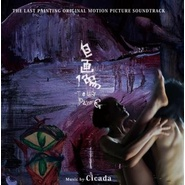

自画像 电影原声带The Last Painting(Original Motion Picture Soundtrack)
============================

|  |  |
| :--: | :-- |
| [ 自画像 电影原声带The Last Painting(Original Motion Picture Soundtrack)](https://emumo.xiami.com/album/2103491177) | **艺人**: [Cicada](../index.md) **语种**: 纯音乐 **唱片公司**: 风和日丽 **发行时间**: 2017年09月22日 **专辑类别**: 原声带, 影视音乐 **专辑风格**:  **播放数**: 4 **收藏数**: 23 **评论数**: 6  |

## 简介

電影《自畫像》配樂由獨立樂團Cicada製作，鋼琴手江致潔創作十六首配樂，皆由Cicada成員演奏。片尾曲〈太陽落下以前的天空〉與滅火器主唱楊大正及余青合作，以男女對唱的形式吐露電影主角的心聲。另外，創作歌手白安亦製作了其中兩首電音曲目，令人十分驚豔。 　　此原聲帶由畫作串成，每幅畫有一首主題配樂，對應電影中以七宗罪為名的七幅畫作──傲慢、嫉妒、憤怒、懶惰、貪婪、暴食及色慾，使近年來關注海洋與土地議題的Cicada，展現出截然不同的風格。

## 曲目

## 评论

|  |  |  |  |
| :-- | :-- | :-- | :-- |
|  [虾米用户](https://emumo.xiami.com/u/31107860) 电影是人类内心无法言喻的... 2019-03-02 22:19 赞(0) 踩(0) | 
在台北的真善美影院看了此片，对配乐印象极深
 |
|  [虾米用户](https://emumo.xiami.com/u/42963872) 我还没想好要写什么... 2019-01-03 04:39 赞(0) 踩(0) | 
-
 |
|  [虾米用户](https://emumo.xiami.com/u/237093590) 不打扰，是我的温柔。 2018-04-12 23:51 赞(0) 踩(0) | 
电台里可以听！
 |
|  [虾米用户](https://emumo.xiami.com/u/225730375) 我爱你. zl 2018-01-22 16:25 赞(0) 踩(0) | 
已经听过！！！期待发布
 |
|  [虾米用户](https://emumo.xiami.com/u/344548953)  2018-01-18 13:13 赞(0) 踩(0) | 
哇哇哇哇期待！！！
 |
|  [虾米用户](https://emumo.xiami.com/u/9972139) -Welcome to ... 2018-01-16 13:06 赞(1) 踩(0) | 

 |
