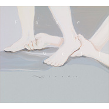

Farewell自選合輯2009–2012
============================

|  |  |
| :--: | :-- |
| [ Farewell自選合輯2009–2012](https://emumo.xiami.com/album/2103491180) | **艺人**: [Cicada](../index.md) **语种**: 纯音乐 **唱片公司**: 独立发行 **发行时间**: 2016年03月10日 **专辑类别**: 录音室专辑 **专辑风格**: 古典跨界 Classical Crossover, 室内乐 / 重奏 Chamber Music, 现代古典 Modern Classical **播放数**: 171 **收藏数**: 37 **评论数**: 12  |

## 简介

自选合辑2009 — 2012 
十四首绝版曲目 
重新编写、录音制作 
《Farewell》从EP《Over the Sea/Under the Water》、专辑《散落的时光》与《一起走吧》自选十四首曲子，包括早期“告别系列”的〈以一种假装放荡的矜持 与你告别〉、〈告别／再见〉、〈最后 仍在一起〉。为了赋予它们新的生命，Cicada重新编写与录制，串成一个故事。关于告别、关于一人独自面对未来的过程，也关于活在自己世界的少女。 
之所以在此刻梳理这些作品，并不是要挥别那段日子，而是主动与之靠近，找到现在与当时的距离──当我们捡起那些快要忘记的美好过往，才能知道它们可以被放在哪里，以及接下来将如何走下去。 
“Farewell” described how someone who went through the cycle of a relationship. It’s about breakup, facing the future alone and also reveals the teenage girls inside us. We selected 14 songs from “Over the Sean/Under the Water”, “Pieces”, and “Let’s Go” with the new recording and production, together they told a story.

## 曲目

## 评论

|  |  |  |
| :-- | :-- | :-- |
|  [虾米用户](https://emumo.xiami.com/u/225730375) 我爱你. zl 2019-11-17 23:27 赞(0) 踩(0) | 
收了这张～
 |
|  [虾米用户](https://emumo.xiami.com/u/403446828) 愛與性與死一致。 2019-03-14 13:54 赞(0) 踩(0) | 
等。
 |
|  [虾米用户](https://emumo.xiami.com/u/321908478) 我自以为。 2019-02-04 09:10 赞(0) 踩(0) | 
超期待
 |
|  [虾米用户](https://emumo.xiami.com/u/42963872) 我还没想好要写什么... 2019-01-03 04:39 赞(0) 踩(0) | 
-
 |
| ⇒ |  [虾米用户](https://emumo.xiami.com/u/50651766)  2020-02-27 17:16 赞(0) 踩(0) | 
Aaaa,请问下你头像这个专辑叫什么来着，找了好久都找不到_(:τ」∠)_
 |
|  [虾米用户](https://emumo.xiami.com/u/21880854) 救われる 2018-11-09 21:53 赞(1) 踩(0) | 
最後仍在一起 我們到了 熄燈之後的城市 你再也讀不出我任何慾望 怎麼辦 就跟你說吧 蹦蹦 散落的時光 湖面的盡頭 一起之後 能說的不多了 以一種假裝放蕩的矜持與你告別 掙脫 告別 再見
 |
|  [虾米用户](https://emumo.xiami.com/u/5857961) 你好 再见 2018-07-03 19:19 赞(1) 踩(0) | 
<a href="http://cicada.bandcamp.com/album/farewell-taiwan-version" target="_blank" rel="nofollow noreferrer noopener">http://cicada.bandcamp.com/album/farewell-taiwan-version</a>
 |
| ⇒ |  [虾米用户](https://emumo.xiami.com/u/5708413) 音乐是个好东西 2020-06-06 22:46 赞(0) 踩(0) | 
大神！我正在找专辑网页介绍
 |
|  [虾米用户](https://emumo.xiami.com/u/142169512) 点击编辑 2018-04-04 19:32 赞(0) 踩(0) | 
超好听
 |
|  [虾米用户](https://emumo.xiami.com/u/187266909) 反正是Samuel的女朋... 2018-01-31 12:23 赞(1) 踩(0) | 
为什么没发布 
 |
|  [虾米用户](https://emumo.xiami.com/u/225730375) 我爱你. zl 2018-01-22 16:27 赞(0) 踩(0) | 
期待
 |
|  [虾米用户](https://emumo.xiami.com/u/9972139) -Welcome to ... 2018-01-16 13:06 赞(0) 踩(0) | 

 |
