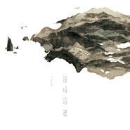

边境消逝Coastland
============================

|  |  |
| :--: | :-- |
| [ 边境消逝Coastland](https://emumo.xiami.com/album/274649726) | **艺人**: [Cicada](../index.md) **语种**: 其他 **唱片公司**: StreetVoice **发行时间**: 2013年08月02日 **专辑类别**: 录音室专辑 **专辑风格**: 现代古典 Modern Classical, 室内乐 / 重奏 Chamber Music **播放数**: 149706 **收藏数**: 981 **评论数**: 61  |

## 简介

为台湾这片瑰土谱写一张专辑是Cicada创作首脑江致洁酝酿多年的梦想，此张《边境消逝》正是她走遍台湾西部沿海，取其诗意，拾景为曲的土地概念专辑。  
  
开场曲〈沿着风与沙〉以风吹沙似粗砺质地的大提琴破题，辅以中提琴、小提琴幽缓声线，颇得信步沙洲之意境。〈当羣鸟掠过天边〉以清澈透明的钢琴琴音，拨云见日，海天一色，弦乐群勾勒羣鸟齐飞翱翔的姿态，振翼的意象，煞是动人。在以绵密弦乐群描绘云林成龙湿地柔软质地的〈在海与土地之间〉，还有用冷静笔触观照沿海景致的〈那些逝者弯曲的倒影〉之后，〈当丛花毅然绽放〉改采绝望哀伤的情绪，层层交迭出云林麦寮的现状，随着演奏力度不断增长，一股渴望绝处逢生的韧性，终于绽放希望枝枒。终曲〈汇流向海〉虽为内心忧郁的D小调，却以强烈的节奏流转营造鼓舞人心的生命热力。特别收录的〈浮游在海上的岛屿／潜沈于水下的人们〉为三年前的EP同名歌曲，这是Cicada以土地议题为创作发想的初衷，也是《边境消逝》的起点，在新加入中提琴编制后重录此曲，既是回顾，更是创作者念兹在兹的自觉。  
  
综观台湾古典乐、室内乐、独立音乐圈，这张《边境消逝》的创作与演奏，既细腻、深沉且大器、完整，确实是张难得的概念专辑，值得所有热爱台湾这片土地的耳朵聆听再三。  
  
  
Jesy Chiang has always dreamt of dedicating an album to Taiwan's graceful landscapes, composer and leading member of Cicada. To this end, she visited many coastal wetland areas in western Taiwan, immersing herself in its poetic landscape. These visits became the inspiration behind the group's new release “Coastland”. The opening track “Flying Sands” begins with a coarse and grainy bass line, later joined by violas and violins. The upbeat “Flapping Wings” features the crystalline notes of a piano and the high soaring sounds of string instruments mimicking a flock of birds flying through scattered clouds. The continuous and tender sound of the string instruments in “Close to the Wetland” brings to life the softness of Cheng Long Wetland Park in Yunlin County. In “Withered Reflection”, Taiwan's western coast is musically depicted with a gentle touch, while the next song “Blooms in Dark” is suffused with despair and sadness, creating an image of Mailiao, Yunlin County, allowing listeners to capture a moment of hope as the song proceeds. Despite the melancholy composition in D minor, the last song “Into the Ocean” crescendos with an uplifting energy with its strong, pulsing rhythm. The bonus track “Over the Sea/Under the Water” was the first song of Cicada released three years ago as part of their first EP. Inspired by Taiwanese environmental issues, it was the starting point for “Coastland”. After the new violist joined the band, this track was re-arranged and re-recorded for the new album, as a reminder as to where it all started.  
  
The concept behind the music and the performance in “Coastland” are exquisite, profound, and grand──fans of classical music, chamber music and independent music will all relate. A truly extraordinary conceptual album that will be on repeat by those of who devote their love to Taiwan.

## 曲目

## 评论

|  |  |  |
| :-- | :-- | :-- |
|  [虾米用户](https://emumo.xiami.com/u/627053) 人间  值得吗 2019-02-15 23:42 赞(0) 踩(0) | 
内容已删除
 |
| ⇒ |  [虾米用户](https://emumo.xiami.com/u/13704947) 豆瓣见：无悲渊。 2019-03-03 00:08 赞(0) 踩(0) | 
那是因为评分人数少，虾米自己弄的自动审核机制，关乐队什么事？
 |
|  [虾米用户](https://emumo.xiami.com/u/42963872) 我还没想好要写什么... 2019-01-03 04:40 赞(0) 踩(0) | 
-
 |
|  [虾米用户](https://emumo.xiami.com/u/339191478)   2018-06-24 19:21 赞(0) 踩(0) | 
:-)
 |
|  [虾米用户](https://emumo.xiami.com/u/18577189) 假如再也不能见到你，祝你... 2018-01-27 02:19 赞(0) 踩(0) | 
好杂的旋律啊&amp;hellip;&amp;hellip;
 |
|  [虾米用户](https://emumo.xiami.com/u/1418202)  江山共老 2018-01-11 00:09 赞(0) 踩(0) | 
小提琴，大提琴，钢琴，吉他&amp;hellip;&amp;hellip;
 |
|  [虾米用户](https://emumo.xiami.com/u/244162410) . 2018-01-04 15:28 赞(0) 踩(0) | 
大提琴好啊
 |
|  [虾米用户](https://emumo.xiami.com/u/15270473) 听到喜欢的歌 身体不跟着... 2017-10-01 23:11 赞(0) 踩(0) | 
-
 |
|  [虾米用户](https://emumo.xiami.com/u/264034176)  2017-02-20 12:27 赞(2) 踩(0) | 
模糊了后摇与新古典的边界 多了更多的可能性
 |
|  [虾米用户](https://emumo.xiami.com/u/40600234)  2016-02-11 15:03 赞(0) 踩(0) | 
喜欢
 |
|  [虾米用户](https://emumo.xiami.com/u/13704947) 豆瓣见：无悲渊。 2016-01-06 13:11 赞(0) 踩(0) | 
我现在兴奋得像14年发现SAL，15年迷上MEW。
 |
|  [虾米用户](https://emumo.xiami.com/u/7340280) 大夢愚蠢 2015-12-17 15:04 赞(0) 踩(0) | 
/............................,
 |
|  [虾米用户](https://emumo.xiami.com/u/15861219) 我还没想好要写什么... 2015-07-27 11:18 赞(0) 踩(0) | 
E
 |
|  [虾米用户](https://emumo.xiami.com/u/32176686) Hugs to ashe... 2015-07-24 08:44 赞(0) 踩(0) | 
07 浮游在海上的岛屿 / 潜沉于水下的人们 (重录版)  好听到爆
 |
|  [虾米用户](https://emumo.xiami.com/u/7322777) ∮ 2015-07-23 18:33 赞(0) 踩(0) | 
...A...
 |
|  [虾米用户](https://emumo.xiami.com/u/7555992) 我还没想好要写什么... 2015-07-23 17:09 赞(0) 踩(0) | 
☂
 |
|  [虾米用户](https://emumo.xiami.com/u/42725114) ThistheshitI... 2015-07-23 11:23 赞(0) 踩(0) | 

 |
|  [虾米用户](https://emumo.xiami.com/u/8226204) ≡ 2015-07-23 10:44 赞(0) 踩(0) | 
<a href="http://emumo.xiami.com/u/34937820" target="_blank" rel="nofollow" name_card="34937820">@Mary</a>
 |
|  [虾米用户](https://emumo.xiami.com/u/610064)   2014-06-01 00:21 赞(0) 踩(0) | 
大爱《当群鸟掠过天边》啊~~<a href="http://v.youku.com/v_show/id_XNjE3OTkyNzI4.html" target="_blank" rel="nofollow noreferrer noopener">http://v.youku.com/v_show/id_XNjE3OTkyNzI4.html</a>，自己根据这支曲子剪的视频，欢迎拍砖~~
 |
|  [虾米用户](https://emumo.xiami.com/u/12766094) 傲娇的孤独患者。 2014-04-02 17:44 赞(0) 踩(0) | 
~
 |
|  [虾米用户](https://emumo.xiami.com/u/23485757)  2014-03-17 10:58 赞(0) 踩(0) | 
好聽
 |
|  [虾米用户](https://emumo.xiami.com/u/1609946) 一即一切 2014-03-06 16:11 赞(0) 踩(0) | 
心 境不二
 |
|  [虾米用户](https://emumo.xiami.com/u/4041709)  2014-02-28 17:19 赞(0) 踩(0) | 
心的旅程。
 |
|  [虾米用户](https://emumo.xiami.com/u/31892749) 他很懒，他什么都没写。 2014-01-30 14:13 赞(0) 踩(0) | 
我是一点都不懂古典 但其实 音乐又和那些精确繁复的形式主义有什么关系 听见了希望就是了。
 |
|  [虾米用户](https://emumo.xiami.com/u/2928117) 你好 2013-12-14 00:05 赞(2) 踩(0) | 
在杂志上看到推荐  就跑进来看看  旋律不难听但也不怎么好听    对我来说 少了记忆度
 |
| ⇒ |  [虾米用户](https://emumo.xiami.com/u/5609733) 停留内心清净之处 2014-02-16 22:12 赞(0) 踩(0) | 
是什么杂志
 |
| ⇒ |  [虾米用户](https://emumo.xiami.com/u/2928117) 你好 2014-02-17 20:16 赞(0) 踩(0) | 
<q><b>sunshine说：</b></q>
 |
|  [虾米用户](https://emumo.xiami.com/u/3332394) 小小吉他手 2013-11-03 18:29 赞(1) 踩(0) | 
这个组合挺影响我的音乐风格，也是我梦想的组合，小提琴、大提琴、钢琴、吉他。其实在经管艺术团的时候，有幸与一个叫韩君的小提琴手和钢琴手晓琳认识，要是当时早一点知道这样的音乐，或许我们三个人组合会参加不同的比赛，有着乐队式的感情，也会成为华农特别的存在。可惜我把全部精力奉献给指弹了。
 |
|  [虾米用户](https://emumo.xiami.com/u/8344036) PEACE 2013-10-22 11:03 赞(12) 踩(0) | 
07 浮游在海上的岛屿 / 潜沉于水下的人们 (重录版) 更加细腻了 因为cicada，我一大把年纪了，还专门去学大提琴，无奈摇头
 |
| ⇒ |  [虾米用户](https://emumo.xiami.com/u/11395216) 少年维持着烦恼。 2015-01-10 16:15 赞(0) 踩(0) | 
我也想去学大提琴
 |
| ⇒ |  [虾米用户](https://emumo.xiami.com/u/1390607) 雨水却在不知名的清晨 纷... 2015-07-28 00:43 赞(0) 踩(0) | 
好励志 感觉我也可以重拾我的大提琴了
 |
|  [虾米用户](https://emumo.xiami.com/u/1478498) 我还没想好要写什么... 2013-09-05 13:26 赞(0) 踩(0) | 
音乐里面有北欧的气息...很奇怪的感觉吧。大概是想起&amp;lt;红鞋女孩&amp;gt;&amp;amp;&amp;lt;caged&amp;gt;的情节的缘故。超适合睡前聆听。
 |
| ⇒ |  [虾米用户](https://emumo.xiami.com/u/13992891)  2016-04-13 16:43 赞(0) 踩(0) | 
所以是后摇的风格嘛，大概就是这个感觉
 |
|  [虾米用户](https://emumo.xiami.com/u/1528494)  2013-09-03 22:21 赞(0) 踩(0) | 
依然清新！
 |
|  [虾米用户](https://emumo.xiami.com/u/610064)   2013-08-27 15:16 赞(0) 踩(0) | 
还是喜欢从前版本的 浮游在海上的岛屿/沉潜与水下的人们
 |
| ⇒ |  [虾米用户](https://emumo.xiami.com/u/8344036) PEACE 2013-10-22 10:08 赞(0) 踩(0) | 
那张特别棒
 |
|  [虾米用户](https://emumo.xiami.com/u/9174471) 身在天堂 2013-08-23 12:00 赞(0) 踩(0) | 
边境消逝，每首曲子的名字都好好听。。。
 |
|  [虾米用户](https://emumo.xiami.com/u/33078) soul 2013-08-20 20:15 赞(0) 踩(0) | 
虽然盘里有，但是还是忍不住想点收藏
 |
|  [虾米用户](https://emumo.xiami.com/u/946752)  2013-08-15 21:54 赞(0) 踩(0) | 
整张推荐。
 |
|  [虾米用户](https://emumo.xiami.com/u/17803787)  2013-08-11 15:36 赞(0) 踩(0) | 
好
 |
|  [虾米用户](https://emumo.xiami.com/u/1634060) 。 2013-08-06 13:25 赞(0) 踩(0) | 
概念完整层次丰富，虽然放在大环境下相比整张专辑依旧略显单一，但理念和格局较小打小闹的上一张都有进步。重新跻身“可关注的乐队”行列。Cicida的音乐融有太平洋的风的况味，精耕细作，岛屿似的小巧。
 |
|  [虾米用户](https://emumo.xiami.com/u/11420216)  2013-08-06 08:51 赞(0) 踩(0) | 
Cicada出品，必属精品！其实只是我比较喜欢她们的风格。
 |
|  [虾米用户](https://emumo.xiami.com/u/15265905) 最好的尚未来临 2013-08-05 20:33 赞(0) 踩(0) | 
很舒服的音樂演奏唱片。無意之中的收穫~~~
 |
|  [虾米用户](https://emumo.xiami.com/u/6944604) 再见了，虾米！ 2013-08-04 18:43 赞(0) 踩(0) | 
沿着海岸线步行，一直走向尽头。
 |
|  [虾米用户](https://emumo.xiami.com/u/990478) 「但愿人长久」 2013-08-04 00:09 赞(0) 踩(0) | 
终于发了  ❤❤❤
 |
|  [虾米用户](https://emumo.xiami.com/u/1197688) 我还没想好要写什么... 2013-08-03 16:08 赞(0) 踩(0) | 
舒心的自由
 |
|  [虾米用户](https://emumo.xiami.com/u/1197688) 我还没想好要写什么... 2013-08-03 16:03 赞(0) 踩(0) | 
好
 |
|  [虾米用户](https://emumo.xiami.com/u/3231727) loss神教，一统江湖 2013-08-03 11:54 赞(0) 踩(0) | 
大cicada
 |
|  [虾米用户](https://emumo.xiami.com/u/6005918) 网易云账号同名：pans... 2013-08-02 22:55 赞(0) 踩(0) | 
当群鸟掠过天边，汇流向海❤
 |
|  [虾米用户](https://emumo.xiami.com/u/541237)  2013-08-02 19:38 赞(0) 踩(0) | 
很不错啊。看到封面还以为会是东方乐器，心里有落差~
 |
|  [虾米用户](https://emumo.xiami.com/u/3941451) 能屈能伸可软可萌只攻不受 2013-08-02 18:54 赞(0) 踩(0) | 
一如既往的点击收藏。
 |
|  [虾米用户](https://emumo.xiami.com/u/164599) 打死我!我想死! 2013-08-02 17:36 赞(0) 踩(0) | 
一如既往地让人安心。
 |
|  [虾米用户](https://emumo.xiami.com/u/164599) 打死我!我想死! 2013-08-02 17:31 赞(0) 踩(0) | 
<a href="http://emumo.xiami.com/u/6248192" target="_blank" rel="nofollow" name_card="6248192">@Rokutousei</a>
 |
| ⇒ |  [虾米用户](https://emumo.xiami.com/u/6248192) bullshit.☢ 2013-08-02 22:35 赞(0) 踩(0) | 
真是适合我每天晚上睡不戳。。
 |
|  [虾米用户](https://emumo.xiami.com/u/8244559)  2013-08-02 16:37 赞(0) 踩(0) | 
******
 |
|  [虾米用户](https://emumo.xiami.com/u/6792908) stateofdecay 2013-08-02 16:24 赞(0) 踩(0) | 
@红星照耀钟Ivy去战斗
 |
|  [虾米用户](https://emumo.xiami.com/u/6792908) stateofdecay 2013-08-02 16:23 赞(0) 踩(0) | 
新传！
 |
|  [虾米用户](https://emumo.xiami.com/u/18282411)  2013-08-02 16:04 赞(0) 踩(0) | 
这样的美丽是笃定的，但变化无常更是美丽。
 |
|  [虾米用户](https://emumo.xiami.com/u/2288372) 我还没想好要写什么... 2013-08-02 15:18 赞(0) 踩(0) | 
竟然有新砖= =
 |
|  [虾米用户](https://emumo.xiami.com/u/3510038) 海天之恋 2013-08-02 13:13 赞(0) 踩(0) | 
曲名严重意译！！
 |
|  [虾米用户](https://emumo.xiami.com/u/7974183) Ryo 2013-08-02 13:01 赞(0) 踩(0) | 
汇流向海
 |
|  [虾米用户](https://emumo.xiami.com/u/7975515) 我还没想好要写什么... 2013-08-02 12:46 赞(0) 踩(0) | 
很不错的演奏专辑~！
 |
